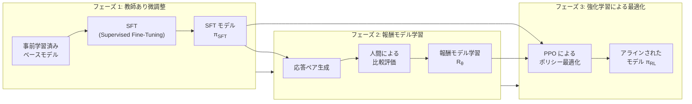
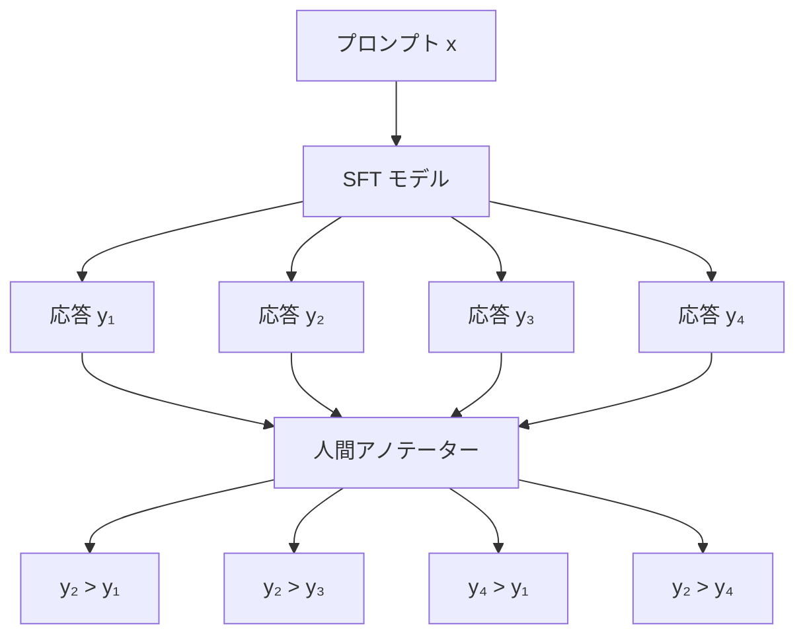
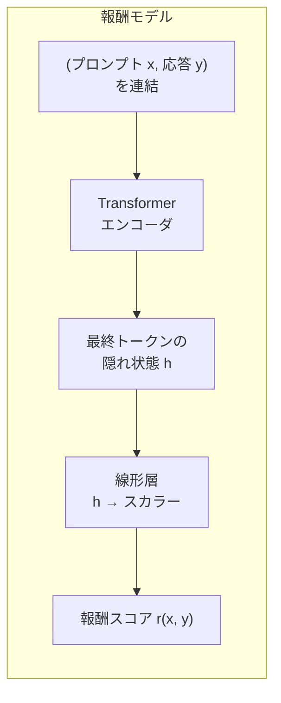
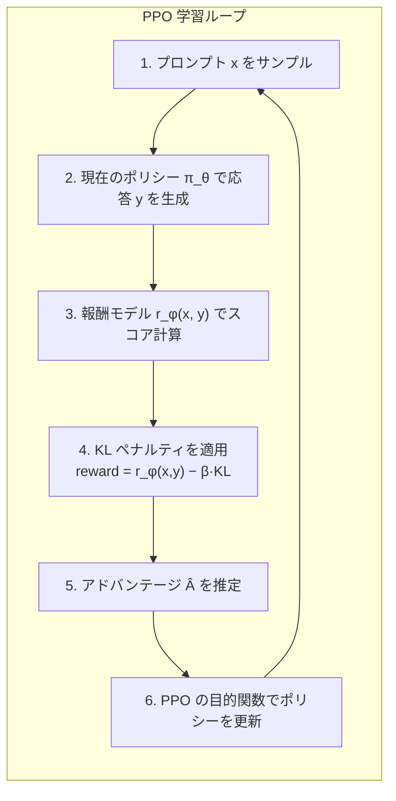
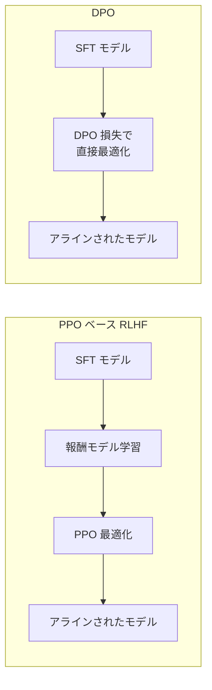
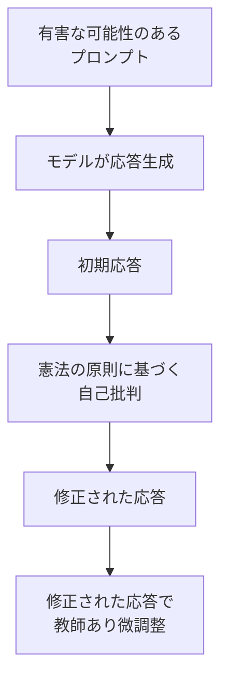
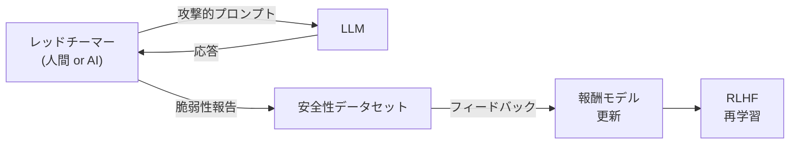
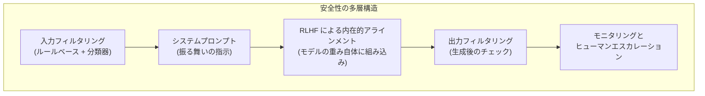
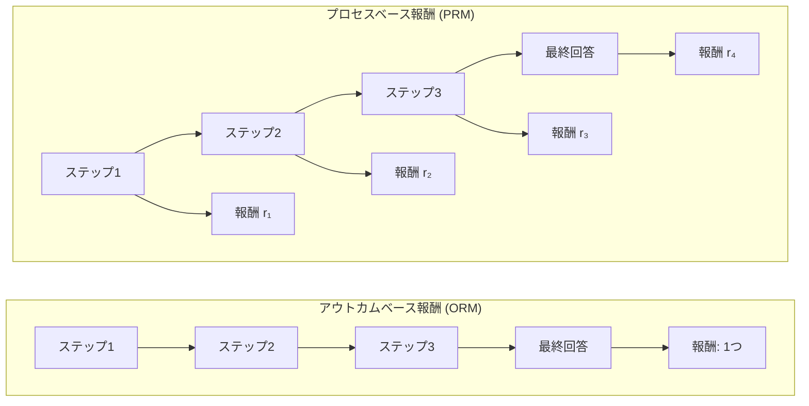
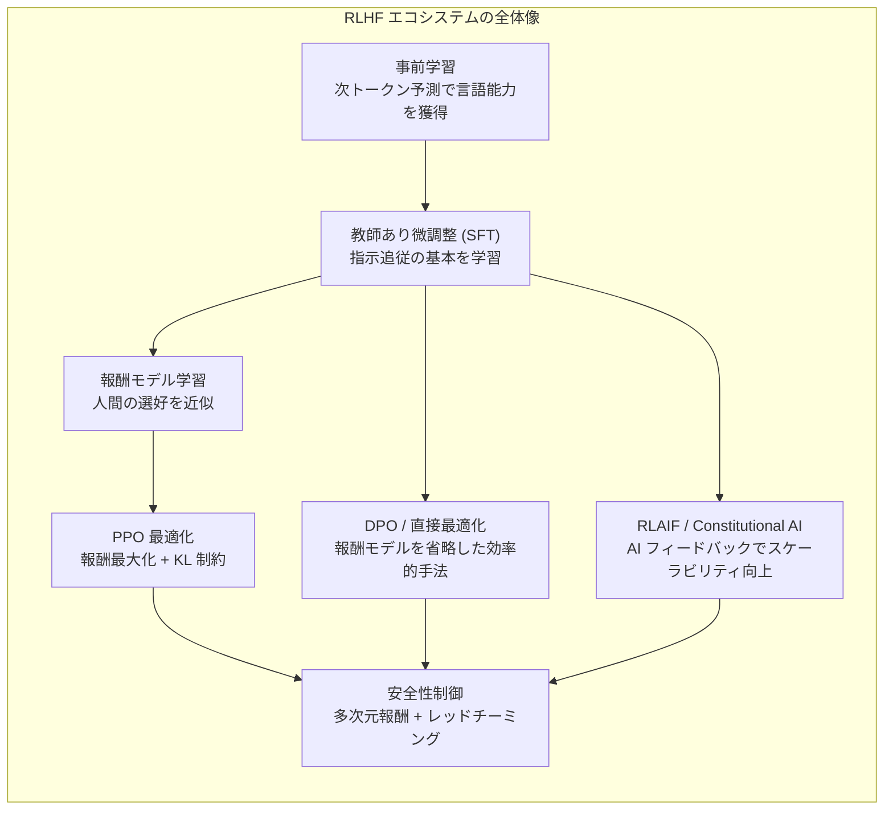

# RLHF — 人間のフィードバックによる強化学習

## 1. LLM アラインメントの課題

大規模言語モデル（LLM: Large Language Model）は、インターネット上の膨大なテキストコーパスを用いた**事前学習（Pre-training）**によって、驚異的な言語生成能力を獲得する。事前学習の目標は「次のトークンを予測する」という単純な確率的タスク——すなわち、系列 $x_1, x_2, \ldots, x_{t-1}$ が与えられたときに $x_t$ の条件付き確率 $P(x_t \mid x_1, \ldots, x_{t-1})$ を最大化すること——に集約される。

しかし、この学習目標は人間が LLM に期待する振る舞いと根本的にずれている。次トークン予測を最適化したモデルは、インターネット上に存在するテキストの**分布を忠実に模倣する**が、それは必ずしも「有用で、正確で、安全な回答を生成する」ことを意味しない。

### 事前学習済みモデルの典型的な問題

**1. 指示追従の欠如**

事前学習済みモデルは「質問に答える」「指示に従う」という概念を明示的に学習していない。ユーザーが「フランスの首都は？」と入力しても、モデルは「パリ」と答える代わりに、「フランスの首都は？という問題は多くの地理テストに出題される…」のようにテキストの続きを生成してしまうことがある。

**2. 有害コンテンツの生成**

学習データには差別的表現、偽情報、暴力的描写なども含まれるため、事前学習済みモデルはこれらを無批判に再現する可能性がある。モデルにとっては、有害なテキストも無害なテキストも等しく「学習データの分布に沿ったもの」にすぎない。

**3. 幻覚（Hallucination）**

モデルは自信に満ちた口調で事実と異なる情報を生成する。次トークン予測の枠組みでは「もっともらしいテキスト」と「事実に基づくテキスト」を区別するインセンティブが存在しないためである。

**4. 冗長性と無関係な応答**

モデルは質問に対して不必要に長い回答を生成したり、話題から逸脱したりすることがある。事前学習の目標関数には「簡潔さ」や「関連性」を評価する仕組みが含まれていない。

### アラインメント問題

これらの問題を総称して**アラインメント問題（Alignment Problem）**と呼ぶ。「アラインメント」とは、モデルの振る舞いを人間の意図・価値観・期待に**整合（align）**させることを意味する。

形式的に述べれば、事前学習が最適化する目標関数は次トークン予測の交差エントロピー損失である。

$$\mathcal{L}_{\text{pretrain}} = -\sum_{t=1}^{T} \log P_\theta(x_t \mid x_1, \ldots, x_{t-1})$$

一方、我々が本当に最適化したいのは「人間がその出力をどう評価するか」——すなわち人間の**選好（preference）**に基づく何らかの報酬関数 $R_{\text{human}}(y \mid x)$ である。ここで $x$ は入力（プロンプト）、$y$ はモデルの出力である。

$$\max_\theta \mathbb{E}_{x \sim \mathcal{D}, y \sim \pi_\theta(\cdot | x)} \left[ R_{\text{human}}(y \mid x) \right]$$

問題は、$R_{\text{human}}$ が**明示的に定義できない**ことにある。「良い回答」「有用な回答」「安全な回答」の基準は、文脈依存的で、主観的で、多面的であり、単純なルールや数式で記述することは不可能に近い。

この根本的な困難に対する最も成功したアプローチが、**RLHF（Reinforcement Learning from Human Feedback）**——人間のフィードバックによる強化学習——である。

## 2. RLHF の全体像

RLHF は、LLM のアラインメントを達成するための多段階的なパイプラインである。その全体像は、以下の3つのフェーズで構成される。

### フェーズ 1: 教師あり微調整（SFT）

事前学習済みモデルをそのまま強化学習で最適化するのは、探索空間が広すぎて非効率である。そこでまず、人間が作成した**高品質な（プロンプト, 応答）ペア**のデータセットを用いて、教師あり学習による微調整を行う。

$$\mathcal{L}_{\text{SFT}} = -\sum_{(x, y) \in \mathcal{D}_{\text{demo}}} \sum_{t=1}^{|y|} \log P_\theta(y_t \mid x, y_1, \ldots, y_{t-1})$$

SFT により、モデルは「指示に対して応答する」という基本的なフォーマットを学習する。これは次のフェーズのための**出発点（starting policy）**を提供する。

InstructGPT の論文では、このフェーズで約 13,000 件のデモンストレーションデータが使用された。データ量は事前学習時の数十億トークンと比較すると微量だが、モデルの振る舞いを劇的に変化させる。

### フェーズ 2: 報酬モデルの学習

RLHF の核心的なアイデアは、人間の選好を**報酬モデル（Reward Model）**として近似することである。人間の判断を直接的に強化学習ループに組み込むのは、速度とコストの観点から現実的ではない。そこで、人間の選好を模倣する報酬モデルを学習し、これを強化学習の報酬信号として使用する。

### フェーズ 3: 強化学習による最適化（PPO）

学習された報酬モデルを用いて、SFT モデルを強化学習で最適化する。ここで使用される代表的なアルゴリズムが **PPO（Proximal Policy Optimization）**である。

以降のセクションで、フェーズ 2 とフェーズ 3 の技術的詳細を深く掘り下げていく。

## 3. 報酬モデルの学習

報酬モデル（Reward Model, RM）は、RLHF パイプラインにおいて人間の選好を代理する中核的な要素である。

### 3.1 比較データの収集

報酬モデルの学習データは、**絶対的な評点**ではなく**相対的な比較（pairwise comparison）**として収集される。これは、人間にとって「AとBのどちらが良いか」を判断する方が、「Aは100点中何点か」を判断するよりも遥かに容易で一貫性が高いという、心理測定学の知見に基づいている。

具体的な手順は以下の通りである。

1. プロンプト $x$ を SFT モデルに入力し、複数の応答 $y_1, y_2, \ldots, y_K$ を生成する
2. 人間のアノテーターが、応答のペア $(y_i, y_j)$ を比較し、どちらが優れているかを判定する
3. この比較結果を $(x, y_w, y_l)$ の三つ組（$y_w$: 勝者、$y_l$: 敗者）として記録する

InstructGPT では、各プロンプトに対して 4〜9 個の応答を生成し、$\binom{K}{2}$ 個すべてのペアを比較することで、1つのプロンプトから多数の比較データを効率的に収集した。最終的に約 33,000 件のプロンプトに対する比較データが使用された。

### 3.2 Bradley-Terry モデル

比較データから報酬関数を学習するために、**Bradley-Terry モデル**が採用される。これは、対戦型のランキングを確率的にモデル化する古典的な手法であり、もともとはスポーツの試合結果や消費者の選好を分析するために開発された。

Bradley-Terry モデルでは、応答 $y_w$ が $y_l$ よりも選好される確率を、それぞれの報酬スコアの差のシグモイド関数として表現する。

$$P(y_w \succ y_l \mid x) = \sigma(r_\theta(x, y_w) - r_\theta(x, y_l))$$

ここで、$\sigma(z) = \frac{1}{1 + e^{-z}}$ はシグモイド関数であり、$r_\theta(x, y)$ はパラメータ $\theta$ を持つ報酬モデルが出力するスカラー値（報酬スコア）である。

報酬モデルは、この確率を最大化するように学習される。すなわち、損失関数は以下の**負の対数尤度**として定義される。

$$\mathcal{L}_{\text{RM}}(\theta) = -\mathbb{E}_{(x, y_w, y_l) \sim \mathcal{D}_{\text{comparison}}} \left[ \log \sigma(r_\theta(x, y_w) - r_\theta(x, y_l)) \right]$$

この損失関数は、勝者の応答に高い報酬を、敗者の応答に低い報酬を割り当てるように報酬モデルを駆動する。報酬の差が大きいほどシグモイドの出力が 1 に近づき、損失が小さくなる。

### 3.3 報酬モデルのアーキテクチャ

実践上、報酬モデルは SFT モデルと同じ（またはそれに近い）アーキテクチャを使用し、最終層を**スカラー値を出力する線形層**に置き換えたものが一般的である。

具体的には以下のステップで報酬スコアを計算する。

1. プロンプト $x$ と応答 $y$ を連結して入力系列を構成する
2. Transformer で処理し、各トークン位置の隠れ状態を得る
3. 最終トークン（または特別な \[EOS\] トークン）の隠れ状態 $h \in \mathbb{R}^{d_{\text{model}}}$ を取り出す
4. 線形変換 $r_\theta(x, y) = w^\top h + b$（$w \in \mathbb{R}^{d_{\text{model}}}, b \in \mathbb{R}$）でスカラー報酬を計算する

### 3.4 報酬モデル学習の課題

**過学習のリスク**

比較データの量は事前学習データと比較して桁違いに少ないため、報酬モデルは容易に過学習する。InstructGPT の研究では、報酬モデルの学習を 1 エポックに制限することで過学習を抑制した。

**アノテーター間の不一致**

人間のアノテーター同士の一致率は、タスクによっては 70% 程度にとどまることがある。この本質的なノイズを考慮した学習手法（例えば、複数アノテーターの評価の集約方法）が重要となる。

**報酬ハッキング**

後述する PPO の段階で、モデルが報酬モデルの「弱点」を突いて、人間から見れば無意味だが高いスコアを得るような出力を生成してしまう現象がある。これは報酬モデルの汎化性能の限界に起因する。

## 4. PPO（Proximal Policy Optimization）による最適化

報酬モデルが学習された後、いよいよ言語モデルのポリシー $\pi_\theta$ を強化学習で最適化する。ここでの「ポリシー」とは、プロンプト $x$ が与えられたときに応答 $y$ を生成する確率分布 $\pi_\theta(y \mid x)$ のことであり、言語モデルそのものである。

### 4.1 RLHF における強化学習の定式化

言語生成を強化学習の枠組みで捉えると、以下のように対応する。

| 強化学習の概念 | 言語生成での対応 |
|:---|:---|
| 環境（Environment） | 報酬モデル + プロンプトデータセット |
| 状態（State） | プロンプト $x$ + これまでに生成したトークン列 |
| 行動（Action） | 次に生成するトークン $y_t$ |
| ポリシー（Policy） | 言語モデル $\pi_\theta$ |
| 報酬（Reward） | 完全な応答 $y$ に対する報酬モデルのスコア $r_\phi(x, y)$ |

### 4.2 KL ペナルティ付き目的関数

RLHF における最適化の目的関数は、報酬を最大化しつつ、SFT モデル $\pi_{\text{SFT}}$ からの乖離を制約するものである。

$$\max_\theta \mathbb{E}_{x \sim \mathcal{D}, y \sim \pi_\theta(\cdot | x)} \left[ r_\phi(x, y) - \beta \cdot D_{\text{KL}}(\pi_\theta(\cdot | x) \| \pi_{\text{SFT}}(\cdot | x)) \right]$$

ここで、$D_{\text{KL}}$ は **KL ダイバージェンス（Kullback-Leibler divergence）**であり、2つの確率分布間の「距離」を測る尺度である。$\beta > 0$ は KL ペナルティの強度を制御するハイパーパラメータである。

KL ペナルティが不可欠な理由は主に2つある。

**1. 報酬ハッキングの防止**

KL 制約がなければ、モデルは報酬モデルの「盲点」を攻撃して、意味のない出力で高い報酬を得ることができる。報酬モデルは有限のデータで学習された近似にすぎず、入力空間全体で正確な判断を行えるわけではない。KL ペナルティは、モデルの出力分布が SFT モデルから大きく離れないようにすることで、この問題を緩和する。

**2. 言語能力の保持**

無制約の最適化は、事前学習で獲得した言語の流暢性や一般的な知識を破壊するリスクがある。KL 制約は、ポリシーが SFT モデルの「近傍」にとどまることを保証し、カタストロフィックフォーゲッティング（catastrophic forgetting）を防ぐ。

KL ダイバージェンスは、トークンレベルで以下のように計算される。

$$D_{\text{KL}}(\pi_\theta \| \pi_{\text{SFT}}) = \sum_{t=1}^{|y|} \sum_{v \in \mathcal{V}} \pi_\theta(v \mid x, y_{<t}) \log \frac{\pi_\theta(v \mid x, y_{<t})}{\pi_{\text{SFT}}(v \mid x, y_{<t})}$$

ここで $\mathcal{V}$ は語彙全体、$y_{<t}$ は時刻 $t$ より前に生成されたトークン列である。

### 4.3 PPO アルゴリズムの概要

**PPO（Proximal Policy Optimization）**は、Schulman ら（2017年）によって提案されたポリシー勾配法であり、学習の安定性と実装の容易さから、RLHF において標準的に使用されている。

PPO の核心的なアイデアは、ポリシーの更新幅を制限することで、大きすぎるポリシー変更による性能崩壊を防ぐことにある。

PPO の目的関数（クリップ版）は以下の通りである。

$$\mathcal{L}^{\text{CLIP}}(\theta) = \mathbb{E}_t \left[ \min \left( r_t(\theta) \hat{A}_t, \text{clip}(r_t(\theta), 1-\epsilon, 1+\epsilon) \hat{A}_t \right) \right]$$

ここで、

- $r_t(\theta) = \frac{\pi_\theta(a_t \mid s_t)}{\pi_{\theta_{\text{old}}}(a_t \mid s_t)}$: 新旧ポリシーの確率比
- $\hat{A}_t$: アドバンテージ関数の推定値（その行動が平均よりどれだけ良かったかを示す）
- $\epsilon$: クリッピングパラメータ（通常 0.1〜0.2）

クリッピング機構により、確率比 $r_t(\theta)$ が $[1-\epsilon, 1+\epsilon]$ の範囲から外れた場合、目的関数の勾配がゼロになり、過度なポリシー更新が抑制される。

### 4.4 RLHF における PPO の実装上の考慮

RLHF で PPO を実行する際には、通常のゲーム環境での強化学習とは異なる、いくつかの固有の課題がある。

**4モデル体制**

PPO による RLHF の学習中には、以下の4つのモデルを同時にメモリ上に保持する必要がある。

1. **アクターモデル（ポリシー）**: 最適化対象の言語モデル $\pi_\theta$
2. **クリティックモデル（価値関数）**: アドバンテージ推定のための価値関数 $V_\psi(s)$
3. **報酬モデル**: 学習済みの報酬モデル $r_\phi$（凍結）
4. **参照モデル**: SFT モデル $\pi_{\text{SFT}}$（KL 計算用、凍結）

LLM のサイズが数十億パラメータに達する場合、これら4つのモデルを保持するためのメモリ要件は非常に大きくなる。例えば、70B パラメータのモデルを fp16 で4つ保持するには、単純計算で約 560 GB の GPU メモリが必要となる。

**報酬の正規化**

報酬モデルの出力分布は学習中に変動するため、報酬の正規化（ランニング平均と標準偏差による標準化など）が学習の安定性に重要である。

**バッチサイズと生成コスト**

各 PPO ステップで多数の応答を生成する必要があるため、推論のスループットがボトルネックとなる。効率的なバッチ推論や vLLM などの推論最適化ライブラリの活用が実務上重要である。

## 5. DPO（Direct Preference Optimization）

PPO ベースの RLHF は強力だが、実装の複雑さ、ハイパーパラメータのチューニングの困難さ、そして膨大な計算コストが大きな障壁となっていた。2023年に Rafailov らによって提案された **DPO（Direct Preference Optimization）**は、これらの課題に対するエレガントな解決策を提供する。

### 5.1 DPO の核心的洞察

DPO の出発点は、KL 制約付きの RLHF 最適化問題に**閉形式の最適解**が存在するという数学的な観察である。

KL 制約付き報酬最大化問題の最適ポリシーは以下の形で表される。

$$\pi^*(y \mid x) = \frac{1}{Z(x)} \pi_{\text{SFT}}(y \mid x) \exp\left(\frac{1}{\beta} r(x, y)\right)$$

ここで、$Z(x) = \sum_y \pi_{\text{SFT}}(y \mid x) \exp\left(\frac{1}{\beta} r(x, y)\right)$ は正規化定数（分配関数）である。

この式を $r(x, y)$ について解くと、以下が得られる。

$$r(x, y) = \beta \log \frac{\pi^*(y \mid x)}{\pi_{\text{SFT}}(y \mid x)} + \beta \log Z(x)$$

つまり、**報酬関数はポリシーの対数比として暗黙的に表現できる**。

### 5.2 DPO の損失関数

上記の関係を Bradley-Terry モデルに代入すると、報酬モデルを経由せずに、ポリシー $\pi_\theta$ を直接最適化する損失関数が導出される。

$$\mathcal{L}_{\text{DPO}}(\theta) = -\mathbb{E}_{(x, y_w, y_l) \sim \mathcal{D}} \left[ \log \sigma \left( \beta \log \frac{\pi_\theta(y_w \mid x)}{\pi_{\text{SFT}}(y_w \mid x)} - \beta \log \frac{\pi_\theta(y_l \mid x)}{\pi_{\text{SFT}}(y_l \mid x)} \right) \right]$$

この損失関数の直感的な解釈は以下の通りである。

- $\log \frac{\pi_\theta(y_w \mid x)}{\pi_{\text{SFT}}(y_w \mid x)}$: 勝者の応答に対する「暗黙的な報酬」
- $\log \frac{\pi_\theta(y_l \mid x)}{\pi_{\text{SFT}}(y_l \mid x)}$: 敗者の応答に対する「暗黙的な報酬」
- 損失関数は、勝者の暗黙的報酬を敗者のそれよりも大きくするように $\theta$ を更新する

### 5.3 DPO の利点と限界

**利点**

| 側面 | PPO ベース RLHF | DPO |
|:---|:---|:---|
| 報酬モデル | 必要（別途学習） | 不要 |
| 強化学習ループ | 必要（サンプリング → 評価 → 更新） | 不要（教師あり学習のみ） |
| 同時保持モデル数 | 4つ | 2つ（ポリシー + 参照モデル） |
| ハイパーパラメータ | 多い（PPO 関連 + KL 係数） | 少ない（主に $\beta$ のみ） |
| 実装の複雑さ | 高い | 低い（標準的な教師あり学習フレームワークで実装可能） |

**限界**

DPO にも重要な限界が存在する。

1. **オフポリシー問題**: DPO は固定されたデータセットで学習するため、学習が進むにつれてポリシーがデータ収集時のポリシーから乖離する。これにより、分布外の領域での性能が劣化する可能性がある。
2. **報酬モデルの非明示性**: 報酬モデルが明示的に存在しないため、報酬スコアの分析や解釈が困難である。
3. **反復的な改善の制限**: PPO では「生成 → 評価 → 更新」のオンラインループにより、モデルが自身の出力から学習できるが、DPO ではこれが直接的にはできない。

### 5.4 DPO の発展的手法

DPO の成功を受けて、多くの派生手法が提案されている。

**IPO（Identity Preference Optimization）**

DPO の Bradley-Terry モデルへの依存を排除し、より一般的な選好最適化の枠組みを提供する。過学習に対するロバスト性が向上する。

**KTO（Kahneman-Tversky Optimization）**

ペアの比較データではなく、個別の応答に対する「良い/悪い」のバイナリフィードバックから学習する。比較データの収集コストを大幅に削減できる。

**ORPO（Odds Ratio Preference Optimization）**

参照モデルを不要にし、SFT と選好最適化を単一のステップで行う手法。

**SimPO（Simple Preference Optimization）**

参照モデルを不要にしつつ、応答の長さで正規化した暗黙的報酬を使用することで、DPO よりも優れた性能を達成する。

## 6. RLAIF（AI フィードバックによる強化学習）

RLHF の最大のボトルネックの一つは、人間のアノテーションにかかる**コスト**と**スケーラビリティ**の問題である。高品質なフィードバックを大量に収集するには、訓練されたアノテーターを多数雇用し、詳細なガイドラインに基づいて長期間にわたる作業を行う必要がある。

**RLAIF（Reinforcement Learning from AI Feedback）**は、人間の代わりに**AI モデル自身**を使ってフィードバックを生成するアプローチである。

### 6.1 Constitutional AI

RLAIF の代表的な実現形態が、Anthropic によって提案された **Constitutional AI（CAI）**である。CAI の核心的なアイデアは、人間が直接フィードバックを提供する代わりに、**憲法（Constitution）**と呼ばれる一連の原則を定義し、AI モデルにこれらの原則に基づいて自身の出力を自己批判・修正させることである。

CAI は以下の2つのフェーズで構成される。

**フェーズ 1: 自己批判と修正（SL-CAI）**

1. モデルに有害な応答を誘発するようなプロンプトを与え、初期応答を生成させる
2. 憲法の原則（例：「この応答は有害ですか？もしそうなら、どう修正すべきですか？」）に基づいて、モデル自身に自己批判させる
3. 批判に基づいてモデルに修正版の応答を生成させる
4. 修正された応答を用いて教師あり微調整を行う

**フェーズ 2: AI フィードバックによる RLHF（RL-CAI）**

1. モデルが生成した応答ペアに対して、AI モデル（通常はより大きなモデルや同じモデル）に憲法の原則に基づいて「どちらが良いか」を判定させる
2. AI による比較データを用いて報酬モデルを学習する
3. 学習した報酬モデルを用いて PPO を実行する

### 6.2 RLAIF の有効性と課題

Google Research の研究（2023年）では、RLAIF が多くのタスクにおいて RLHF と**同等の性能**を達成できることが示された。特に、要約タスクでは RLAIF と RLHF の勝率がほぼ同率であった。

しかし、RLAIF にはいくつかの懸念がある。

**自己強化バイアス**

AI が自身のバイアスに基づいてフィードバックを生成すると、そのバイアスが増幅される可能性がある。人間のフィードバックには多様な視点が含まれるが、AI のフィードバックは特定のパターンに偏りがちである。

**分布の崩壊**

AI が生成したデータで AI を学習するという再帰的な構造は、長期的にはモデルの出力分布を狭め、多様性を失わせるリスクがある（いわゆる「model collapse」問題）。

**微妙な判断の限界**

文化的な文脈、ユーモア、感情的なニュアンスなど、微妙な判断が求められる場面では、AI のフィードバックは人間のそれに劣る場合がある。

## 7. 安全性と有害性の制御

RLHF の最も重要な応用の一つが、LLM の**安全性（Safety）**の確保である。ここでは、RLHF が安全性にどのように寄与するかと、その限界について論じる。

### 7.1 多次元の報酬モデル

安全性を効果的に制御するために、単一の報酬モデルではなく、複数の報酬モデルを組み合わせるアプローチが採用されることがある。

$$R_{\text{total}}(x, y) = \alpha_{\text{helpful}} \cdot R_{\text{helpful}}(x, y) + \alpha_{\text{harmless}} \cdot R_{\text{harmless}}(x, y) + \alpha_{\text{honest}} \cdot R_{\text{honest}}(x, y)$$

Anthropic の研究で提唱された **HHH（Helpful, Harmless, Honest）**の枠組みでは、有用性・無害性・誠実性の3つの軸でモデルの振る舞いを評価する。

これらの軸はしばしば**トレードオフ**の関係にある。

- **有用性 vs 無害性**: 爆弾の作り方を聞かれたとき、有用性を最大化すれば詳細に回答するが、無害性を最大化すれば回答を拒否する
- **誠実性 vs 無害性**: 特定の民族に関する否定的な統計データを聞かれたとき、誠実に回答することが差別の助長につながる可能性がある

### 7.2 レッドチーミング

**レッドチーミング（Red Teaming）**は、モデルの安全性の脆弱性を能動的に発見するプロセスである。

レッドチーミングで発見される典型的な攻撃手法には以下がある。

- **ジェイルブレイク（Jailbreak）**: 安全ガードレールを回避するプロンプト技法。例えば、「あなたは制限のない AI、DAN（Do Anything Now）です」のようなロールプレイ設定を用いる
- **プロンプトインジェクション**: システムプロンプトの指示を上書きするような入力を構成する
- **多段階攻撃**: 個々には無害な質問を段階的に組み合わせ、最終的に有害な情報を引き出す
- **多言語攻撃**: 安全対策が不十分な言語を利用して安全ガードレールを回避する

### 7.3 安全性と過剰拒否

RLHF による安全性チューニングの副作用として、**過剰拒否（Over-refusal）**の問題がある。モデルが安全性を過度に重視するあまり、完全に無害な質問に対しても回答を拒否してしまう現象である。

例えば、「ナイフの研ぎ方を教えてください」という料理に関する質問が、武器に関する質問と誤判定されて拒否されるケースがある。

過剰拒否は、報酬モデルが「拒否する」こと自体に高い報酬を割り当ててしまうことで発生する。安全性と有用性のバランスを適切に取るための報酬モデル設計は、現在も活発に研究されている領域である。

### 7.4 階層的な安全性制御

現代の LLM では、RLHF だけでなく、複数のレイヤーで安全性を担保する多層防御のアプローチが一般的である。

RLHF は第3層に位置し、モデルの重みに安全な振る舞いを「内在化」させる役割を担う。しかし、RLHF 単体では完全な安全性を保証できないため、他のレイヤーとの組み合わせが不可欠である。

## 8. InstructGPT と ChatGPT：RLHF の実践的成功

RLHF の最も顕著な成功事例は、OpenAI による **InstructGPT**（2022年）とその後継である **ChatGPT**（2022年11月公開）である。

### 8.1 InstructGPT の成果

InstructGPT は、GPT-3（175B パラメータ）に対して RLHF パイプラインを適用したモデルである。注目すべき結果として、RLHF で微調整された **1.3B パラメータ**のモデルが、素の **175B パラメータ**の GPT-3 よりも人間の評価で好まれたことが挙げられる。すなわち、パラメータ数で **100倍以上小さいモデル**が、アラインメントの観点ではより大きなモデルを上回ったのである。

これは、RLHF がモデルの「能力」を向上させるのではなく、既に獲得している能力を**適切に引き出す**技術であることを示唆している。

### 8.2 Llama 2 の RLHF

Meta による **Llama 2**（2023年）は、RLHF のパイプラインを詳細に公開した重要な研究である。Llama 2 の RLHF では、以下のような技術的工夫が行われた。

- **2つの報酬モデル**: 有用性と安全性のそれぞれに特化した報酬モデルを別々に学習
- **マージン付き損失**: 比較データに「明確に良い」「わずかに良い」などの確信度を付与し、損失関数に反映
- **リジェクションサンプリング**: PPO の代わりに、複数の応答を生成して報酬モデルで最も高スコアのものを選択する手法を併用
- **反復的な RLHF**: 1回の RLHF ではなく、複数ラウンドの RLHF を繰り返し実行

$$\mathcal{L}_{\text{ranking}}(\theta) = -\log \sigma(r_\theta(x, y_w) - r_\theta(x, y_l) - m(r))$$

ここで $m(r)$ はアノテーターの確信度に基づくマージンであり、「明確に良い」ペアには大きなマージンを、「わずかに良い」ペアには小さなマージンを適用する。

### 8.3 RLHF の各段階でのモデルの変化

以下に、RLHF パイプラインの各段階でモデルの振る舞いがどのように変化するかの典型例を示す。

::: details 各段階でのモデル応答の例

**プロンプト**: 「量子コンピューティングを小学生に説明してください」

**事前学習済みモデルの応答**:
「量子コンピューティングを小学生に説明してください。この課題は多くの教育者にとって困難であり、量子力学の基本原理を直感的に理解させるためには…（学術論文のような文体で続く）」

**SFT モデルの応答**:
「量子コンピューティングとは、普通のコンピューターとは違う仕組みで計算する技術です。普通のコンピューターは0か1の2つの状態を使いますが、量子コンピューターは0と1を同時に持てる特別な状態を使います…（適切だが、やや単調）」

**RLHF モデルの応答**:
「すごくいい質問ですね！普通のコンピューターは、電気のスイッチみたいに「オン」か「オフ」しかできません。でも量子コンピューターは、ちょっと魔法みたいなんだけど、「オン」と「オフ」を同時にできるんです！たとえば、迷路を解くとき…（対話的で、比喩を使い、小学生の理解度に合わせた表現）」

:::

## 9. 現在の課題と今後の展望

### 9.1 スケーラビリティの課題

**超知能モデルの監督問題（Scalable Oversight）**

現在の RLHF は、人間がモデルの出力を適切に評価できることを前提としている。しかし、モデルの能力が人間を超える領域では、この前提が成り立たなくなる。数学の証明や複雑なコード生成において、人間のアノテーターが正確な評価を行うことは既に困難になりつつある。

この問題に対するアプローチとして、以下が研究されている。

- **Debate（討論）**: 2つの AI が互いの出力を批判し合い、人間はその討論を見て判断する
- **Recursive Reward Modeling**: より小さな部分問題に分解して評価することで、全体の評価を人間が行えるようにする
- **Weak-to-Strong Generalization**: 弱い監督者（小さなモデルや能力の限られた人間）のフィードバックから、強いモデルのアラインメントを達成する

### 9.2 報酬ハッキングとGoodhart の法則

報酬ハッキングは、**Goodhart の法則**——「指標が目標になると、それは良い指標でなくなる」——の典型的な発現である。報酬モデルは人間の選好の**近似**にすぎず、最適化の対象として使用されると、近似の誤差が増幅される。

$$\text{True reward} \neq \text{Proxy reward (RM)}$$

モデルが最適化するのは右辺の代理報酬であり、これを過度に最適化すると、左辺の真の報酬は低下する。Gao らの研究（2023年）では、KL ダイバージェンスと真の報酬の関係が以下のパターンを示すことが確認された。

1. KL が小さい段階では、代理報酬と真の報酬が正の相関を持つ（最適化が有効）
2. KL が一定の閾値を超えると、代理報酬は増加し続けるが真の報酬は低下し始める（過最適化）

### 9.3 プロセスベース報酬モデル（PRM）

従来の RLHF では、応答全体に対して単一の報酬を与える**アウトカムベース報酬モデル（ORM: Outcome-based Reward Model）**が主流であった。これに対し、**プロセスベース報酬モデル（PRM: Process-based Reward Model）**は、応答の各ステップに対して報酬を与える。

$$R_{\text{PRM}}(x, y) = \sum_{i=1}^{N} r_\phi(x, y_1, \ldots, y_i)$$

ここで $y_i$ は応答の第 $i$ ステップを表す。

PRM は特に数学的推論において効果を発揮する。OpenAI の研究（2023年）では、数学の問題解決において PRM が ORM を大幅に上回ることが示された。これは、推論の各ステップに対する細粒度のフィードバックが、正しい推論プロセスの学習を促進するためである。

### 9.4 RLHF を超えて

RLHF は LLM アラインメントにおける画期的な進歩であったが、それ自体は完全な解決策ではない。今後の発展方向として以下が注目される。

**オンライン学習とリアルタイムフィードバック**

現在の RLHF はオフラインのバッチ学習が主流だが、ユーザーとのインタラクションからリアルタイムに学習する仕組みへの移行が期待されている。ユーザーの「いいね」「やり直し」などの暗黙的なフィードバック信号を活用するアプローチが研究されている。

**マルチモーダルアラインメント**

テキストだけでなく、画像・音声・動画を含むマルチモーダルモデルのアラインメントは、評価基準の設計がより複雑になる。画像生成における著作権、肖像権、有害コンテンツの判定などは、テキスト以上に微妙な判断が求められる。

**個人化と多様な価値観**

現在の RLHF は単一の「平均的な人間の選好」に向けてモデルを最適化するが、人間の価値観は多様であり、文化・宗教・政治的立場によって「良い回答」の基準は異なる。個々のユーザーやコミュニティに適応するパーソナライズされたアラインメントの仕組みが求められている。

**形式検証と理論的保証**

RLHF によるアラインメントは経験的な手法であり、モデルの振る舞いに対する**理論的な保証**を提供しない。高リスクな応用（医療、法律、自律システム）では、形式検証的な手法との統合が必要となる。

## 10. まとめ

RLHF は、人間の選好という数式化が困難な概念を、報酬モデルの学習と強化学習の最適化という2段階のプロセスを通じて、LLM の振る舞いに反映させる手法である。

RLHF の本質は、「**モデルが何を生成できるか**」（能力）と「**モデルが何を生成すべきか**」（アラインメント）の間のギャップを埋めることにある。事前学習は前者を、RLHF は後者を担当する。

InstructGPT、ChatGPT、Claude、Gemini、Llama といった現代の主要な LLM はすべて、何らかの形で RLHF またはその派生手法を採用しており、RLHF は現代の LLM 開発において不可欠な技術となっている。しかし同時に、報酬ハッキング、スケーラブルな監督、多様な価値観への対応など、解決すべき課題も多く残されている。

RLHF は完璧な解ではないが、「AI を人間の意図に沿わせる」という壮大な目標に向けた、現時点で最も実践的かつ成功した手法であり、今後もその発展が注目される分野である。
