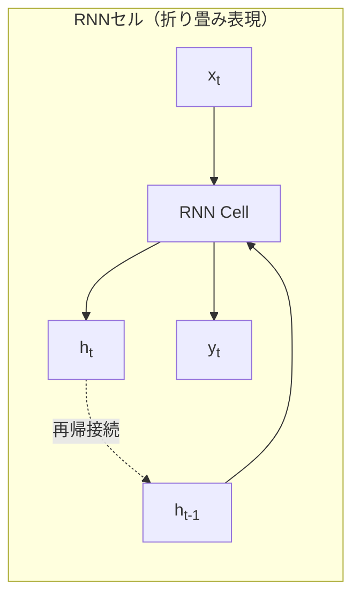
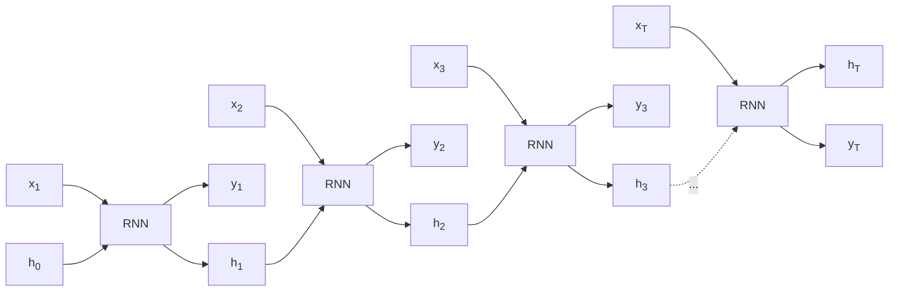
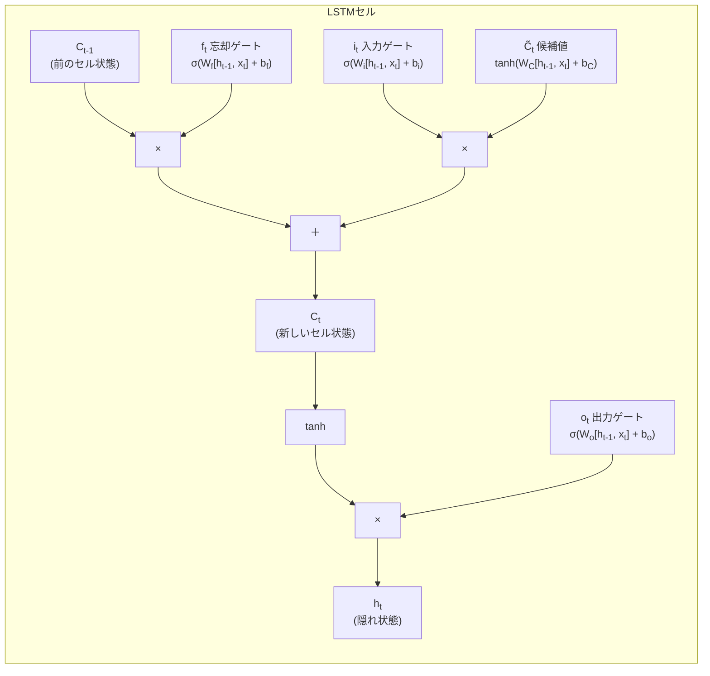
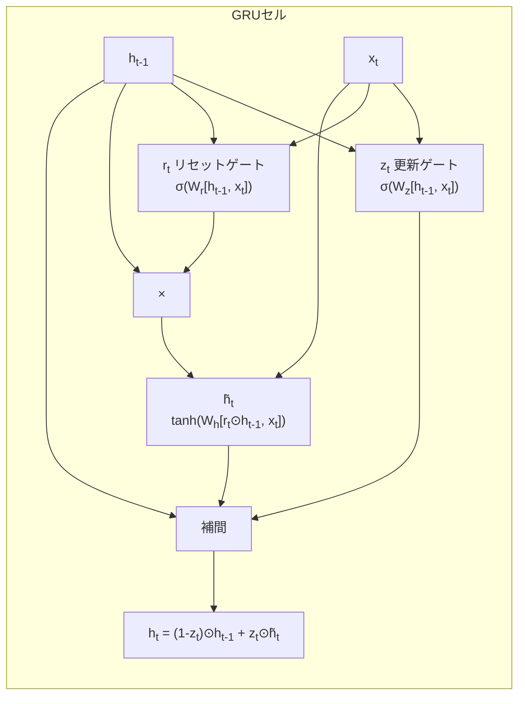
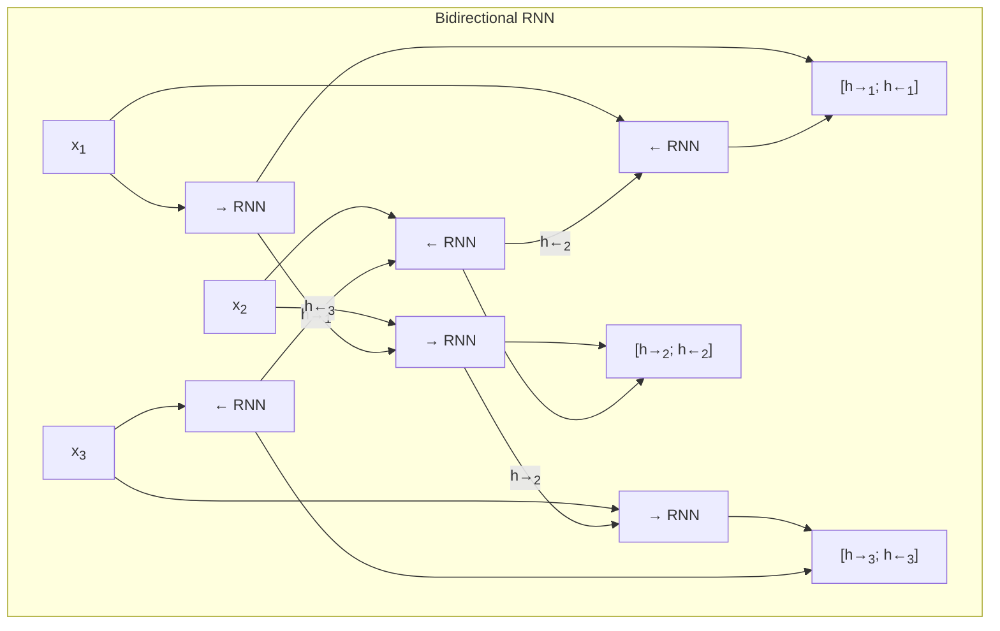
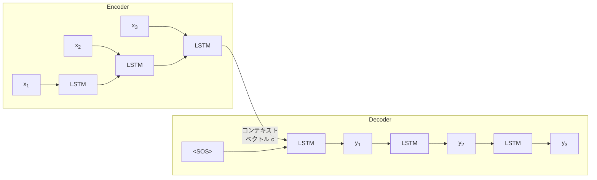
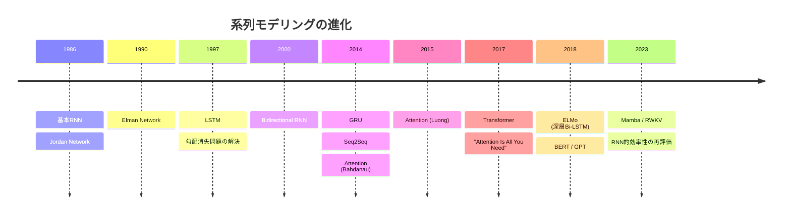

# RNN, LSTM, GRU — 系列モデリングの基盤技術

## 1. 背景と動機：系列データの課題

### なぜ系列データは特別なのか

コンピュータサイエンスや機械学習で扱うデータの多くは、**順序**に意味がある。自然言語のテキスト、音声信号、株価の推移、気象データ、DNAの塩基配列 --- これらはすべて**系列データ（Sequential Data）**であり、各要素がその前後の要素と時間的・論理的な依存関係を持つ。

例えば「彼は銀行に向かった」と「彼は川の土手（bank）に向かった」という2つの英文では、"bank" の意味を正確に解釈するためには、文脈を構成する他の単語との関係を考慮しなければならない。同様に音声認識では、ある瞬間の音素は前後の音素によって大きく変化し（調音結合）、時系列予測では過去の傾向から将来を推測する必要がある。

### 従来のニューラルネットワークの限界

全結合ネットワーク（Fully Connected Network / Multi-Layer Perceptron）やCNN（畳み込みニューラルネットワーク）は、基本的に**固定長の入力**を前提としている。

```
従来のフィードフォワードネットワーク:

入力: [x_1, x_2, ..., x_n]  (固定長)
   ↓
隠れ層: 各入力は独立して処理
   ↓
出力: [y_1, y_2, ..., y_m]  (固定長)

問題点:
- 入力の長さが可変の系列を扱えない
- 過去の入力と現在の入力の関係を捉えられない
- 時間的な依存関係を学習するメカニズムがない
```

具体的に、以下の本質的な問題がある。

**可変長入力への対応不能**

自然言語の文は数語から数百語まで長さが様々であり、音声信号の長さも発話ごとに異なる。固定長入力を前提とするネットワークでは、最大長に合わせてパディングするか、固定長のウィンドウで切り出すしかなく、いずれも不自然な制約である。

**時間的依存関係の無視**

全結合層は各入力要素を独立に扱うため、入力中の「順序」という情報を本質的に活用できない。「猫がネズミを追いかけた」と「ネズミが猫を追いかけた」が同一のBag-of-Words表現に帰着してしまうように、語順がもたらす意味の違いを捉えられない。

**メモリの欠如**

フィードフォワードネットワークは入力から出力への一方向の計算を行うのみで、過去の入力を「記憶」する仕組みを持たない。対話システムのように過去のやり取りを踏まえて応答を生成するタスクでは、この欠如は致命的である。

### 系列モデリングへの要請

これらの課題から、以下の要件を満たすニューラルネットワークアーキテクチャが求められた。

1. **可変長の入力・出力**を自然に扱える
2. **時間的な依存関係**を内部状態として保持・更新できる
3. **パラメータ共有**により、系列のどの位置でも同じ変換を適用できる（位置に依存しない汎化）

この要請に応えるために登場したのが、**再帰型ニューラルネットワーク（Recurrent Neural Network, RNN）**である。

## 2. 基本RNNの構造

### 隠れ状態と再帰的な計算

RNNの核心的なアイデアは極めてシンプルである。ネットワークの内部に**隠れ状態（Hidden State）** $h_t$ を導入し、各時間ステップにおいて入力 $x_t$ と前の時間ステップの隠れ状態 $h_{t-1}$ の両方を用いて新たな隠れ状態を計算する。

$$h_t = \tanh(W_{hh} h_{t-1} + W_{xh} x_t + b_h)$$

$$y_t = W_{hy} h_t + b_y$$

ここで各記号は以下の通りである。

- $x_t \in \mathbb{R}^d$：時間ステップ $t$ における入力ベクトル
- $h_t \in \mathbb{R}^n$：時間ステップ $t$ における隠れ状態ベクトル
- $y_t$：時間ステップ $t$ における出力
- $W_{xh} \in \mathbb{R}^{n \times d}$：入力から隠れ状態への重み行列
- $W_{hh} \in \mathbb{R}^{n \times n}$：隠れ状態から隠れ状態への重み行列（再帰的な重み）
- $W_{hy} \in \mathbb{R}^{m \times n}$：隠れ状態から出力への重み行列
- $b_h, b_y$：バイアスベクトル
- $\tanh$：ハイパボリックタンジェント活性化関数

この構造の本質は、**同一のパラメータ** $W_{hh}, W_{xh}, W_{hy}$ が系列のすべての時間ステップで共有されるという点にある。これにより、系列の長さに依存しないパラメータ数で、任意の長さの入力を処理できる。



### 時間展開（Unrolling Through Time）

RNNの再帰的な構造は、時間方向に「展開」することで、フィードフォワードネットワークとして視覚化・解析できる。時間ステップ $t=1$ から $t=T$ までの処理を展開すると、以下のような計算グラフが得られる。



この展開図から、RNNが本質的には**非常に深いフィードフォワードネットワーク**であることがわかる。各「層」は同じパラメータを共有しているが、時間方向に深い計算グラフを形成している。この特性は後に述べる勾配消失問題と密接に関係する。

### RNNの入出力パターン

RNNの重要な利点の一つは、入力と出力のパターンを柔軟に設定できることである。

```
1. One-to-One（従来のNN）
   x → [NN] → y

2. One-to-Many（画像キャプション生成）
   x → [RNN] → y_1, y_2, ..., y_T

3. Many-to-One（感情分析、テキスト分類）
   x_1, x_2, ..., x_T → [RNN] → y

4. Many-to-Many（同期型：品詞タグ付け）
   x_1, x_2, ..., x_T → [RNN] → y_1, y_2, ..., y_T

5. Many-to-Many（非同期型：機械翻訳 / Seq2Seq）
   x_1, ..., x_T → [Encoder RNN] → context → [Decoder RNN] → y_1, ..., y_S
```

この多様な入出力形式が、RNNを自然言語処理、音声処理、時系列分析など幅広いタスクに適用可能にしている。

### 簡単な実装例

RNNセルの順伝播を擬似コードで示す。

```python
class RNNCell:
    def __init__(self, input_size, hidden_size):
        # Weight matrices
        self.W_xh = initialize_weights(hidden_size, input_size)
        self.W_hh = initialize_weights(hidden_size, hidden_size)
        self.b_h = initialize_zeros(hidden_size)

    def forward(self, x_t, h_prev):
        # Core RNN computation
        h_t = tanh(self.W_xh @ x_t + self.W_hh @ h_prev + self.b_h)
        return h_t

def rnn_forward(inputs, h_0, rnn_cell):
    """Process a sequence through the RNN."""
    h_t = h_0
    outputs = []
    for x_t in inputs:
        h_t = rnn_cell.forward(x_t, h_t)
        outputs.append(h_t)
    return outputs, h_t
```

## 3. BPTT（Backpropagation Through Time）

### 時間展開に対する逆伝播

RNNの学習は、通常のフィードフォワードネットワークと同様に勾配降下法によって行われる。しかし、RNNの再帰的な構造に対しては、時間方向に展開した計算グラフに沿って逆伝播を行う必要がある。この手法を **BPTT（Backpropagation Through Time）**と呼ぶ。

損失関数 $L$ が各時間ステップの損失の和 $L = \sum_{t=1}^{T} L_t$ で定義されるとき、共有パラメータ $W_{hh}$ に対する勾配は以下のように計算される。

$$\frac{\partial L}{\partial W_{hh}} = \sum_{t=1}^{T} \frac{\partial L_t}{\partial W_{hh}}$$

各 $\frac{\partial L_t}{\partial W_{hh}}$ を計算するためには、時間ステップ $t$ から逆向きに連鎖律（Chain Rule）を適用する必要がある。

$$\frac{\partial L_t}{\partial W_{hh}} = \sum_{k=1}^{t} \frac{\partial L_t}{\partial h_t} \frac{\partial h_t}{\partial h_k} \frac{\partial h_k}{\partial W_{hh}}$$

ここで $\frac{\partial h_t}{\partial h_k}$ は、時間ステップ $k$ から $t$ への隠れ状態の依存関係を表し、連鎖律により以下のように展開される。

$$\frac{\partial h_t}{\partial h_k} = \prod_{i=k+1}^{t} \frac{\partial h_i}{\partial h_{i-1}}$$

各 $\frac{\partial h_i}{\partial h_{i-1}}$ はヤコビ行列であり、以下のように計算される。

$$\frac{\partial h_i}{\partial h_{i-1}} = \text{diag}(\tanh'(W_{hh} h_{i-1} + W_{xh} x_i + b_h)) \cdot W_{hh}$$

ここで $\tanh'$ は $\tanh$ の導関数であり、$\tanh'(z) = 1 - \tanh^2(z)$ である。

### Truncated BPTT

完全なBPTTでは系列全体にわたって勾配を計算するため、長い系列では計算コストとメモリ使用量が膨大になる。実用上は **Truncated BPTT**（打ち切りBPTT）が用いられることが多い。

Truncated BPTTでは、系列を固定長のチャンクに分割し、各チャンク内でのみ逆伝播を行う。順伝播の際には隠れ状態を次のチャンクに引き継ぐが、逆伝播はチャンクの境界で打ち切る。

```
Truncated BPTT (chunk size = 4):

Forward pass:  h_0 → h_1 → h_2 → h_3 → h_4 → h_5 → h_6 → h_7 → h_8
                     |__________________|    |__________________|
Backward pass:       chunk 1 (BPTT)          chunk 2 (BPTT)
                  (gradients stop here)    (gradients stop here)
```

これにより計算コストは制御可能になるが、チャンク長を超える長期依存関係は学習できないというトレードオフがある。

## 4. 勾配消失・爆発問題

### 問題の本質

BPTTの式に現れた積 $\prod_{i=k+1}^{t} \frac{\partial h_i}{\partial h_{i-1}}$ は、RNNの学習における最も根本的な問題を露呈する。

各ヤコビ行列 $\frac{\partial h_i}{\partial h_{i-1}}$ のノルムが1未満の場合、この積は $t - k$ が大きくなるにつれて**指数的にゼロに近づく**。逆に、ノルムが1を超える場合は**指数的に発散する**。

$$\left\| \prod_{i=k+1}^{t} \frac{\partial h_i}{\partial h_{i-1}} \right\| \leq \prod_{i=k+1}^{t} \left\| \frac{\partial h_i}{\partial h_{i-1}} \right\|$$

$\tanh$ の導関数 $\tanh'(z) = 1 - \tanh^2(z)$ は常に $[0, 1]$ の範囲にあるため、$\text{diag}(\tanh'(\cdot))$ のノルムは1以下に制約される。したがって $\left\| \frac{\partial h_i}{\partial h_{i-1}} \right\| \leq \|W_{hh}\|$ となり、$\|W_{hh}\| < 1$ のとき勾配は指数的に消失し、$\|W_{hh}\| > 1$ のときには爆発する可能性がある。

### 勾配消失（Vanishing Gradients）

勾配消失が起きると、長い時間ステップ前の入力に関するパラメータ更新がほぼゼロとなり、**長期依存関係を学習できなくなる**。例えば以下の文を考えよう。

> 「私はフランスで生まれた。... [100語の文脈] ... だから私は**フランス語**を話す。」

「フランス語」を正しく予測するには冒頭の「フランス」の情報が必要だが、100語もの隔たりがあると、その勾配はほぼ消失してしまう。

```
勾配の流れ:

時間 t:     1     2     3    ...    98    99   100
勾配:    ~0.0  ~0.0  ~0.0  ...   0.01  0.1   1.0
          ↑                              ↑     ↑
       ほぼ消失                        小さい  正常

→ 遠い過去の入力に対する学習シグナルがほぼ存在しない
```

### 勾配爆発（Exploding Gradients）

勾配爆発は、勾配の大きさが指数的に増大する現象である。これにより以下の問題が生じる。

- パラメータ更新が過大になり、学習が不安定化する
- 数値的なオーバーフローが発生する（NaN）
- 学習が発散する

勾配爆発に対しては **勾配クリッピング（Gradient Clipping）** という実践的な対処法がある。

$$\hat{g} = \begin{cases} g & \text{if } \|g\| \leq \theta \\ \frac{\theta}{\|g\|} g & \text{if } \|g\| > \theta \end{cases}$$

ここで $g$ は勾配ベクトル、$\theta$ は閾値（典型的には1〜5）である。勾配のノルムが閾値を超えた場合、方向を保ったままノルムを閾値に縮小する。

勾配クリッピングは爆発問題には有効だが、**消失問題を解決しない**。消失問題の解決には、ネットワークアーキテクチャそのものの改良が必要である。それが次に述べるLSTMの動機である。

## 5. LSTMのアーキテクチャ

### 設計思想：情報のハイウェイを構築する

LSTM（Long Short-Term Memory）は、1997年にSepp HochreiterとJurgen Schmidhuberによって提案された。LSTMの核心的な設計思想は、**勾配が妨げられることなく長時間にわたって流れ続けるパス**をネットワーク内に構築することである。

基本RNNでは隠れ状態 $h_t$ が唯一の内部状態であり、毎時間ステップで $\tanh$ を通じて非線形に変換されるため、長距離にわたる情報伝達が困難であった。LSTMはこの問題に対して、2つの重要な革新を導入する。

1. **セル状態（Cell State）** $C_t$：情報を長期間にわたって保持するための専用パス。セル状態は「コンベアベルト」のように情報を運び、最小限の変更で長時間にわたって情報を保持できる
2. **ゲート機構（Gating Mechanism）**：セル状態への情報の追加・削除を制御するための学習可能なメカニズム。シグモイド関数を用いて0から1の連続値で「通過率」を制御する

### 3つのゲートとセル状態

LSTMは3つのゲートを持つ。**忘却ゲート（Forget Gate）**、**入力ゲート（Input Gate）**、**出力ゲート（Output Gate）**である。



#### 忘却ゲート（Forget Gate）

忘却ゲートは、セル状態からどの情報を「忘れるか」を決定する。

$$f_t = \sigma(W_f \cdot [h_{t-1}, x_t] + b_f)$$

ここで $\sigma$ はシグモイド関数 $\sigma(z) = \frac{1}{1 + e^{-z}}$ であり、出力は $[0, 1]$ の範囲である。$f_t$ の各要素が1に近ければ対応するセル状態の情報を保持し、0に近ければ忘却する。

例えば言語モデルにおいて、新しい主語が登場した場合、以前の主語に関する文法的な情報（性、数など）を忘却する必要がある。忘却ゲートはこのような選択的な消去を学習する。

#### 入力ゲート（Input Gate）

入力ゲートは、新しい情報をセル状態に追加する2段階のプロセスを制御する。

まず、候補値 $\tilde{C}_t$ が生成される。

$$\tilde{C}_t = \tanh(W_C \cdot [h_{t-1}, x_t] + b_C)$$

次に、入力ゲート $i_t$ がこの候補値のうちどれだけをセル状態に追加するかを決定する。

$$i_t = \sigma(W_i \cdot [h_{t-1}, x_t] + b_i)$$

#### セル状態の更新

忘却ゲートと入力ゲートの出力を用いて、セル状態は以下のように更新される。

$$C_t = f_t \odot C_{t-1} + i_t \odot \tilde{C}_t$$

ここで $\odot$ は要素ごとの積（Hadamard積）を表す。この式が**LSTMの核心**である。

この更新式の構造を注意深く見ると、$f_t$ が1に近く $i_t$ が0に近い場合、$C_t \approx C_{t-1}$ となり、セル状態はほぼそのまま次の時間ステップに伝搬される。これが**勾配のハイウェイ**を形成する。逆伝播において $\frac{\partial C_t}{\partial C_{t-1}} = f_t$ となるため、忘却ゲートが1に近ければ勾配がほぼ減衰せずに伝播する。

#### 出力ゲート（Output Gate）

出力ゲートは、セル状態のどの部分を隠れ状態 $h_t$（すなわち外部への出力）として公開するかを制御する。

$$o_t = \sigma(W_o \cdot [h_{t-1}, x_t] + b_o)$$

$$h_t = o_t \odot \tanh(C_t)$$

セル状態を $\tanh$ に通して $[-1, 1]$ の範囲に正規化した後、出力ゲートによってフィルタリングする。これにより、内部的に保持している情報のすべてが外部に漏れるわけではなく、現在のタスクに必要な情報のみを選択的に出力できる。

### 勾配の流れの分析

LSTMが勾配消失を緩和するメカニズムを、勾配の流れの観点から分析する。

セル状態の更新式 $C_t = f_t \odot C_{t-1} + i_t \odot \tilde{C}_t$ において、$C_{t-1}$ に対するセル状態の勾配は以下の通りである。

$$\frac{\partial C_t}{\partial C_{t-1}} = f_t + \frac{\partial f_t}{\partial C_{t-1}} \odot C_{t-1} + \frac{\partial i_t}{\partial C_{t-1}} \odot \tilde{C}_t + i_t \odot \frac{\partial \tilde{C}_t}{\partial C_{t-1}}$$

peephole connection を持たない標準的なLSTMでは、ゲートの計算は $C_{t-1}$ に直接依存しない（$h_{t-1}$ と $x_t$ のみに依存する）ため、上式の主要項は $f_t$ となる。

$$\frac{\partial C_t}{\partial C_{t-1}} \approx f_t$$

したがって、時間ステップ $k$ から $t$ へのセル状態を通じた勾配は以下のように近似できる。

$$\frac{\partial C_t}{\partial C_k} \approx \prod_{i=k+1}^{t} f_i$$

基本RNNでは $\prod_{i=k+1}^{t} W_{hh}^T \cdot \text{diag}(\tanh'(\cdot))$ という行列積が必要であり、その固有値が1からずれると指数的に発散・消滅した。一方、LSTMでは忘却ゲート $f_i$ は**要素ごとのスカラー乗算**であり、学習によって1に近い値を取ることができる。これが長期依存関係の学習を可能にする鍵である。

```
勾配の流れの比較:

基本RNN:
  ∂h_t/∂h_k = Π (W_hh^T · diag(tanh'(·)))
  → 行列の固有値に依存し、指数的に減衰/爆発

LSTM（セル状態パス）:
  ∂C_t/∂C_k ≈ Π f_i
  → 忘却ゲートが1に近ければ、勾配はほぼ保存される
```

### パラメータ数の比較

LSTMは基本RNNに比べてパラメータ数が大幅に増加する。入力次元 $d$、隠れ状態次元 $n$ とすると、おおよそ以下のパラメータ数となる。

| モデル | パラメータ数 |
|--------|-------------|
| 基本RNN | $(d + n) \times n + n$ |
| LSTM | $4 \times ((d + n) \times n + n)$ |

LSTMは4つの重み行列（忘却ゲート、入力ゲート、候補値、出力ゲート）をそれぞれ持つため、パラメータ数は基本RNNの約4倍である。この追加コストは、長期依存関係を学習する能力と引き換えである。

## 6. GRU（Gated Recurrent Unit）との比較

### GRUのアーキテクチャ

GRU（Gated Recurrent Unit）は、2014年にKyunghyun Choらによって提案された、LSTMの簡略化バリアントである。GRUはLSTMの3つのゲートを2つに統合し、セル状態と隠れ状態を統一する。

GRUの計算は以下の通りである。

**リセットゲート（Reset Gate）：**
$$r_t = \sigma(W_r \cdot [h_{t-1}, x_t] + b_r)$$

**更新ゲート（Update Gate）：**
$$z_t = \sigma(W_z \cdot [h_{t-1}, x_t] + b_z)$$

**候補隠れ状態：**
$$\tilde{h}_t = \tanh(W_h \cdot [r_t \odot h_{t-1}, x_t] + b_h)$$

**隠れ状態の更新：**
$$h_t = (1 - z_t) \odot h_{t-1} + z_t \odot \tilde{h}_t$$



### LSTMとGRUの構造的な対応

GRUの設計は、LSTMの以下の簡略化として理解できる。

| LSTM | GRU | 対応関係 |
|------|-----|---------|
| 忘却ゲート $f_t$ | $1 - z_t$ | 更新ゲートの補数が忘却の役割 |
| 入力ゲート $i_t$ | $z_t$ | 更新ゲートが入力と忘却を連動制御 |
| 出力ゲート $o_t$ | なし | 隠れ状態がそのまま出力 |
| セル状態 $C_t$ | なし | 隠れ状態に統合 |
| リセットゲート | $r_t$ | LSTMには直接対応するものがない |

最も重要な違いは、GRUでは**入力と忘却が連動している**点である。更新ゲート $z_t$ が大きければ新しい情報を多く取り込み、同時に古い情報を多く忘れる。LSTMでは入力ゲートと忘却ゲートが独立しており、「新しい情報を取り込みつつ古い情報も保持する」ことが可能である。

### 実践的な比較

| 観点 | LSTM | GRU |
|------|------|-----|
| パラメータ数 | 4つのゲート分 | 3つの重み行列（約75%） |
| 計算速度 | やや遅い | やや速い |
| 長期依存関係 | セル状態による強力な保持 | 更新ゲートによる保持 |
| データ量が少ない場合 | 過学習のリスクがやや高い | パラメータが少なく有利 |
| 性能差 | タスク依存（有意差がないことも多い） | タスク依存 |

多くの実験的研究では、LSTMとGRUの性能差はタスクやデータセットに依存し、一方が一貫して優れるという結論は得られていない。一般的な指針としては以下が挙げられる。

- **データが豊富な場合**: LSTMの表現力がやや有利になることがある
- **データが限られている場合やモデルを軽量にしたい場合**: GRUの方がパラメータ効率が良い
- **実験的な検証**: どちらが良いかはハイパーパラメータサーチの一部として試すべきである

## 7. Bidirectional RNN

### 前方と後方の文脈を統合する

標準的なRNNは系列を左から右（過去から未来）へ一方向に処理する。しかし、多くのタスクでは**後方の文脈**（未来の情報）も重要である。例えば品詞タグ付けでは、ある単語の品詞はその前後の単語に依存する。

**Bidirectional RNN（双方向RNN）**は、同一の入力系列を2つのRNNで処理する。1つは順方向（$t = 1 \to T$）、もう1つは逆方向（$t = T \to 1$）に処理し、それぞれの隠れ状態を連結して各時間ステップの表現を構成する。

$$\overrightarrow{h}_t = \text{RNN}_{\text{forward}}(x_t, \overrightarrow{h}_{t-1})$$
$$\overleftarrow{h}_t = \text{RNN}_{\text{backward}}(x_t, \overleftarrow{h}_{t+1})$$
$$h_t = [\overrightarrow{h}_t; \overleftarrow{h}_t]$$

ここで $[;]$ はベクトルの連結を表す。



### 適用可能な条件と限界

Bidirectional RNNは入力系列全体が利用可能な場合にのみ適用できる。リアルタイムの音声認識や言語モデルのような、入力が逐次的に到着するタスクでは逆方向のRNNを実行できないため、使用できない。

適用可能なタスク:
- 品詞タグ付け・固有表現認識（系列ラベリング）
- テキスト分類（文全体から特徴を抽出）
- 機械翻訳のエンコーダ側
- 音声認識（録音済み音声）

適用が困難なタスク:
- リアルタイム音声認識
- 自己回帰的な言語モデル（次の単語の予測）
- オンライン時系列予測

### 深層双方向RNN

Bidirectional RNNを多層に積み重ねることで、**深層双方向RNN（Deep Bidirectional RNN）**を構成できる。各層の出力が次の層の入力となる。

$$h_t^{(l)} = [\overrightarrow{h}_t^{(l)}; \overleftarrow{h}_t^{(l)}]$$

ここで $l$ は層のインデックスである。ELMo（Embeddings from Language Models, 2018年）はこの構造を用いた代表的な手法であり、深層双方向LSTMから得られる文脈依存的な単語表現が多くのNLPタスクで大幅な性能向上をもたらした。

## 8. Seq2Seq とAttention

### Encoder-Decoderアーキテクチャ

**Seq2Seq（Sequence-to-Sequence）**モデルは、2014年にIlya Sutskeverらによって提案された、可変長入力を可変長出力にマッピングするアーキテクチャである。機械翻訳、テキスト要約、対話生成など、入力と出力の長さが異なるタスクに適用される。

Seq2Seqは2つのRNN（通常はLSTM）で構成される。

1. **エンコーダ（Encoder）**: 入力系列 $x_1, x_2, ..., x_T$ を順に処理し、最終的な隠れ状態 $h_T$（**コンテキストベクトル**）に入力全体の情報を圧縮する
2. **デコーダ（Decoder）**: コンテキストベクトルを初期隠れ状態として受け取り、出力系列 $y_1, y_2, ..., y_S$ を自己回帰的に生成する



### 固定長コンテキストベクトルの限界

基本的なSeq2Seqモデルには致命的な**ボトルネック**がある。入力系列全体の情報を固定次元のコンテキストベクトルに圧縮しなければならない点である。入力系列が長くなるほど、この圧縮はより困難になり、情報の損失が避けられない。

実際に機械翻訳の実験では、入力文の長さが約20語を超えると、翻訳品質が急激に低下することが報告された。

### Attention機構

この問題を解決するために、2014年にDzmitry Bahdanauらが**Attention（注意機構）**を提案した。Attentionの核心的なアイデアは、デコーダの各出力ステップにおいて、エンコーダの**すべての隠れ状態**を参照し、現在の出力に関連する入力部分に「注意」を集中させるというものである。

**Bahdanau Attention（Additive Attention）の計算手順：**

1. **アライメントスコアの計算**: デコーダの隠れ状態 $s_{t-1}$ とエンコーダの各隠れ状態 $h_i$ の関連度を計算する。

$$e_{ti} = v^T \tanh(W_a s_{t-1} + U_a h_i)$$

2. **注意重みの計算**: ソフトマックスで正規化する。

$$\alpha_{ti} = \frac{\exp(e_{ti})}{\sum_{j=1}^{T} \exp(e_{tj})}$$

3. **コンテキストベクトルの計算**: 注意重みで加重平均を取る。

$$c_t = \sum_{i=1}^{T} \alpha_{ti} h_i$$

4. **デコーダの更新**: コンテキストベクトルをデコーダの入力に統合する。

$$s_t = \text{LSTM}([y_{t-1}; c_t], s_{t-1})$$

Attentionにより、デコーダは各出力を生成するたびに入力系列の異なる部分に焦点を当てることができる。機械翻訳では、ソース言語の単語とターゲット言語の単語の間の対応関係（アライメント）が自然に学習される。

::: tip Attention の直感的理解
Attentionは、図書館で調べ物をする際に、棚にあるすべての本（エンコーダの隠れ状態）の中から、今の質問（デコーダの状態）に最も関連する本を選んで参照する行為に似ている。固定長ベクトルに圧縮する必要がなくなるため、どれだけ長い入力でも関連部分を直接参照できる。
:::

### Luong Attention

Minh-Thang Luongらは、Bahdanau Attentionを簡略化・一般化した**Luong Attention（Multiplicative Attention）**を2015年に提案した。

$$e_{ti} = s_t^T W_a h_i \quad \text{(General)}$$

$$e_{ti} = s_t^T h_i \quad \text{(Dot Product)}$$

Dot Product Attentionは、追加のパラメータを必要とせず計算効率が高いという利点がある。後のTransformerで採用されたScaled Dot-Product Attentionの原型である。

## 9. Transformerとの比較と位置づけ

### RNN/LSTMからTransformerへのパラダイムシフト

2017年に提案されたTransformerは、**RNNを完全に排除**し、Self-Attention機構のみで系列処理を実現した。このパラダイムシフトの背景には、RNN/LSTMの以下の本質的な限界がある。

| 観点 | RNN/LSTM | Transformer |
|------|----------|-------------|
| 並列化 | 逐次処理（時間ステップを並列化不可） | 完全に並列化可能 |
| 長距離依存 | 距離に応じて情報が減衰 | 任意の2位置間が $O(1)$ パスで接続 |
| 計算量（系列長 $n$） | 逐次: $O(n)$ ステップ | 並列: $O(1)$ ステップ（ただしメモリ $O(n^2)$） |
| 位置情報 | 暗黙的に時間順序をエンコード | 位置エンコーディングが必要 |
| 学習の安定性 | 勾配消失/爆発のリスク | Layer Normalization等で安定化 |
| スケーラビリティ | 大規模データ・モデルに不向き | パラメータ・データの両方でスケール |

### Transformerの利点

**並列計算効率**

RNNは $h_t$ の計算に $h_{t-1}$ を必要とするため、系列長 $n$ に対して $O(n)$ の逐次ステップが必要である。一方、Self-Attentionは全ての位置対を同時に計算でき、GPUの並列性を最大限に活用できる。この違いは、数百GPUを用いた大規模学習において決定的な差となる。

**長距離依存の直接的な捕捉**

RNN/LSTMでは、距離 $k$ の依存関係を捉えるために情報が $k$ ステップにわたって逐次的に伝搬される必要がある。TransformerのSelf-Attentionでは、入力中の任意の2つの位置が単一のAttention計算で直接接続される。

### RNN/LSTMが依然として有用な場面

Transformerが主流となった現在でも、RNN/LSTMが適切な場面は存在する。

1. **リソースが限られた環境**: TransformerのSelf-Attentionは $O(n^2)$ のメモリを消費するため、エッジデバイスや組み込みシステムではRNN/LSTMの方が効率的な場合がある

2. **リアルタイム逐次処理**: 入力が1要素ずつ到着し、各要素に対して即座に応答する必要がある場合、RNNの逐次的な処理は自然に適合する

3. **非常に長い系列**: 標準的なTransformerは $O(n^2)$ のメモリが必要だが、RNNは $O(1)$ の追加メモリで任意の長さの系列を処理できる（ただし長期依存の学習品質は別問題）

4. **状態空間モデルとの融合**: Mamba（2023年）やRWKV（2023年）などの最近のアーキテクチャは、RNN的な逐次処理の効率性とTransformerの表現力を組み合わせる試みであり、RNNの設計思想は現代のアーキテクチャにも影響を与え続けている

### 歴史的な位置づけ



RNNとLSTMは、系列データに対する深層学習の基盤を築いた歴史的に極めて重要なアーキテクチャである。Transformerへの移行は、これらの技術が不要になったことを意味するのではなく、むしろRNN/LSTMが明らかにした課題（長期依存性、並列化、スケーラビリティ）を解決するための次のステップとして位置づけられる。

## 10. 応用領域

### 自然言語処理（NLP）

RNN/LSTMは、Transformer以前のNLPにおいて圧倒的な存在であり、以下のタスクで広く用いられた。

**言語モデル**

言語モデルは、テキスト中の次の単語を予測するタスクであり、RNNの最も自然な応用である。各時間ステップで語彙全体の確率分布を出力し、ソフトマックス関数を用いて次の単語の確率を計算する。

$$P(w_{t+1} | w_1, ..., w_t) = \text{softmax}(W_y h_t + b_y)$$

**機械翻訳**

前述のSeq2Seq + Attentionモデルは、Google翻訳（GNMT, 2016年）など商用翻訳システムに採用された。8層のLSTMエンコーダ・デコーダとAttention機構を組み合わせたGNMTは、統計的機械翻訳と比較して翻訳品質を大幅に向上させた。

**テキスト分類・感情分析**

文全体を処理した後の最終隠れ状態 $h_T$ を分類器に入力することで、テキストの感情（ポジティブ/ネガティブ）やカテゴリを判定する。

**固有表現認識・品詞タグ付け**

Bidirectional LSTMを用いた系列ラベリングは、固有表現認識（NER）や品詞タグ付け（POS Tagging）で標準的な手法であった。BiLSTM-CRFモデル（2015年）は特に広く採用された。

### 音声認識

音声認識はRNN/LSTMの最も成功した応用分野の一つである。

**CTC（Connectionist Temporal Classification）**

音声信号のフレーム列からテキストへの変換では、入力と出力の長さが異なり、明示的なアライメントが与えられないという課題がある。Alex Gravesらが提案した**CTC（2006年）**は、可能なすべてのアライメントの確率を動的計画法で効率的に計算することで、この問題を解決した。

Deep Speech（Baidu, 2014年）やListen, Attend and Spell（Google, 2016年）などのシステムでは、深層RNN/LSTMが音声認識の精度を従来のHMM（隠れマルコフモデル）ベースのシステムから大幅に向上させた。

### 時系列予測

金融データの予測、電力需要予測、気象予測など、時系列予測はLSTMが現在でも広く使われる分野である。

LSTMが時系列予測に適する理由は以下の通りである。

1. **非線形パターンの捕捉**: ARIMAなどの線形モデルでは捉えられない非線形な依存関係を学習できる
2. **多変量入力**: 複数の特徴量（気温、湿度、風速など）を同時に入力として扱える
3. **可変長の依存関係**: ゲート機構により、タスクに応じて短期・長期の依存関係を柔軟に学習できる

ただし、時系列予測においてもTransformerベースのモデル（Temporal Fusion Transformer, Autoformer等）が登場しており、特に長い予測ホライズンや多変量時系列では優位性を示すことがある。

### 音楽生成・テキスト生成

RNN/LSTMは系列の生成タスクにも応用される。訓練データから学習した確率分布に基づいて、新しい系列を自己回帰的にサンプリングすることで、テキストや音楽を生成できる。

Andrej Karpathyの有名なブログ記事「The Unreasonable Effectiveness of Recurrent Neural Networks」（2015年）では、文字レベルのLSTMがShakespeareの戯曲、Linux カーネルのソースコード、LaTeX論文などの文体を模倣できることが示され、RNNの表現力の高さを印象づけた。

### ロボティクス・制御

強化学習と組み合わせたLSTMは、部分観測環境（POMDP）における方策の学習に用いられる。エージェントが環境の完全な状態を観測できない場合、LSTMの隠れ状態が過去の観測の要約として機能し、意思決定に必要な情報を保持する。

## 11. 実装上の考慮点

### 初期化の重要性

LSTMの学習においては、パラメータの初期化が重要である。特に以下の点が知られている。

**忘却ゲートのバイアス**

忘却ゲートのバイアス $b_f$ を正の値（典型的には1.0〜2.0）に初期化することが推奨される。これにより、学習初期において忘却ゲートが1に近い値を出力し、セル状態の情報が保持されやすくなる。

$$f_t = \sigma(W_f \cdot [h_{t-1}, x_t] + b_f) \quad \text{where } b_f \approx 1.0$$

この初期化は、Gers ら（2000年）によって提案され、多くの実装で標準的に採用されている。

**直交初期化**

隠れ状態間の重み行列 $W_{hh}$ を直交行列に初期化することで、勾配の伝播を安定化させる手法も有効である。直交行列の固有値はすべて絶対値1であるため、勾配の指数的な減衰・爆発を抑制する。

### 正則化

RNN/LSTMは過学習しやすいため、適切な正則化が不可欠である。

**Dropout**

標準的なDropoutをRNNの再帰接続に適用すると、時間ステップごとに異なるユニットがドロップされるため、隠れ状態の情報が破壊されて学習が不安定化する。

Yarin Galらが提案した**Variational Dropout（2016年）**は、各時間ステップで同一のDropoutマスクを使用することで、この問題を解決した。すなわち、同一の系列内では常に同じユニットがドロップされる。

**Layer Normalization**

Batch Normalizationは系列データへの適用が困難であるため（バッチ内で系列長が異なる）、**Layer Normalization**が代替として用いられる。Layer NormalizationはBa ら（2016年）によって提案され、各時間ステップの隠れ状態を正規化する。

### 多層LSTMとResidual Connection

実用的なモデルでは、LSTMを2〜4層に積み重ねることが一般的である。ただし、層を深くすると勾配の伝播が困難になるため、**Residual Connection（残差接続）**を導入することが有効である。

$$h_t^{(l)} = \text{LSTM}^{(l)}(h_t^{(l-1)}, h_{t-1}^{(l)}) + h_t^{(l-1)}$$

これにより、勾配が層をスキップして直接伝播できるパスが確保される。

## 12. まとめと展望

### RNN/LSTMの貢献

RNNは、ニューラルネットワークに「記憶」の概念を導入し、系列データの処理を可能にした画期的なアーキテクチャである。LSTMはRNNの勾配消失問題をゲート機構とセル状態によって解決し、長期依存関係の学習を現実的なものにした。これらのアーキテクチャは以下の重要な概念を確立した。

1. **隠れ状態による記憶**: 可変長の文脈情報を固定次元のベクトルに圧縮する枠組み
2. **ゲート機構**: 情報の流れを学習可能な方法で制御するメカニズム
3. **時間展開と BPTT**: 再帰的な構造に対する勾配計算の方法論
4. **Seq2Seq + Attention**: 系列から系列への変換と、動的な情報参照の仕組み

### 現在と未来

Transformerの登場により、NLPの主流はRNN/LSTMからSelf-Attentionベースのアーキテクチャへと移行した。しかし、RNNの設計思想は消滅したわけではない。

状態空間モデル（SSM）に基づくMamba（2023年）は、系列を逐次的に処理しながらもTransformerに匹敵する性能を達成し、特に長い系列において計算効率の面で優位性を示している。RWKVはTransformerの学習時の並列性とRNNの推論時の効率性を両立させることを目指している。xLSTM（2024年）はLSTMの設計を現代の技術で再解釈し、スケーラビリティの向上を試みている。

これらの展開は、RNN/LSTMが提起した「系列データにおける情報の保持・伝播・選択」という根本的な問題が、形を変えながらも現代の深層学習研究の中心にあり続けていることを示している。RNN/LSTMを深く理解することは、Transformerやその後継アーキテクチャを理解するための不可欠な基盤である。
