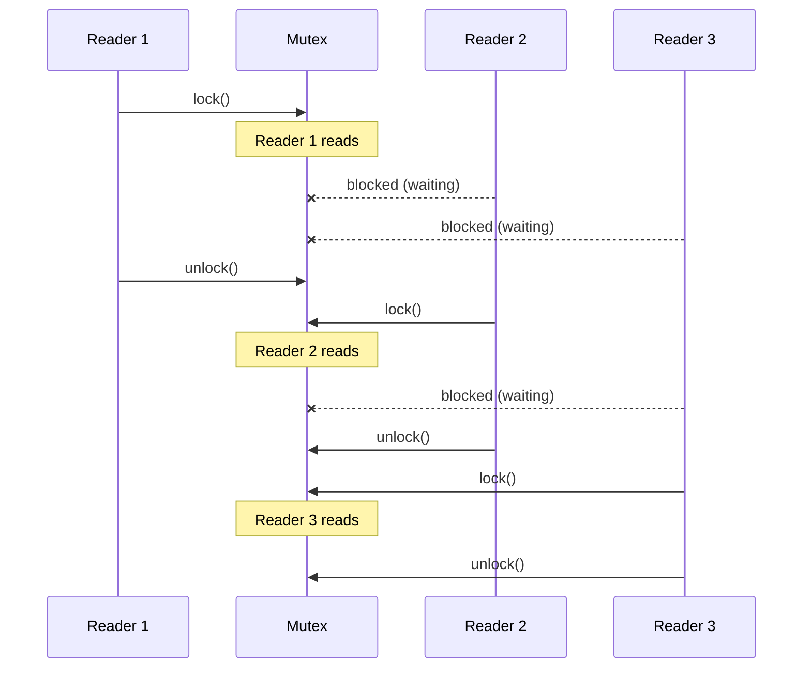
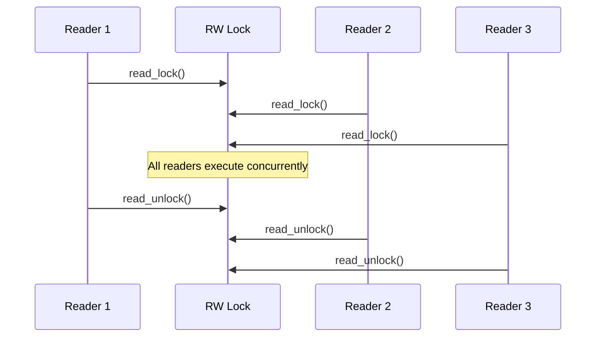
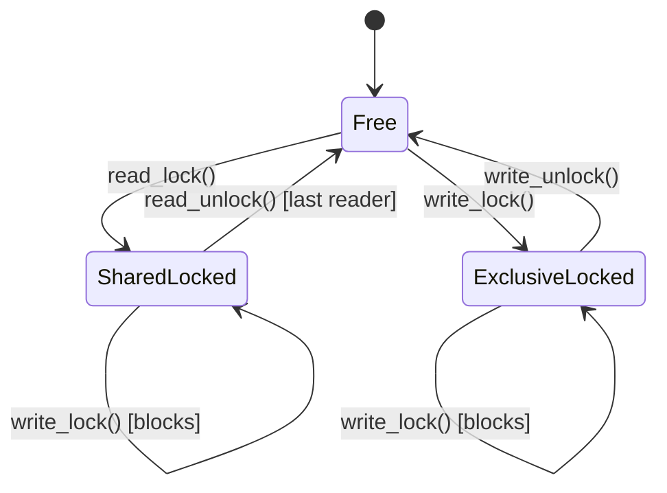
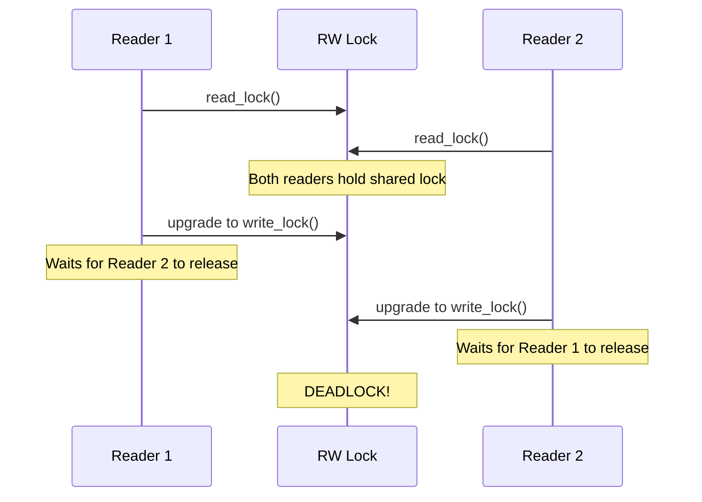
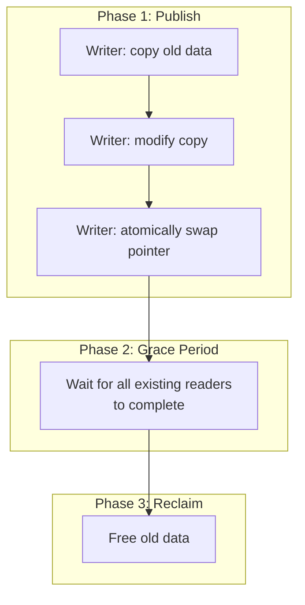
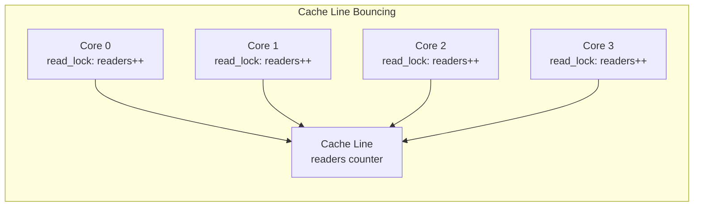
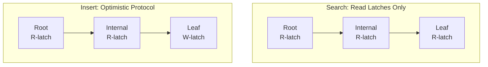
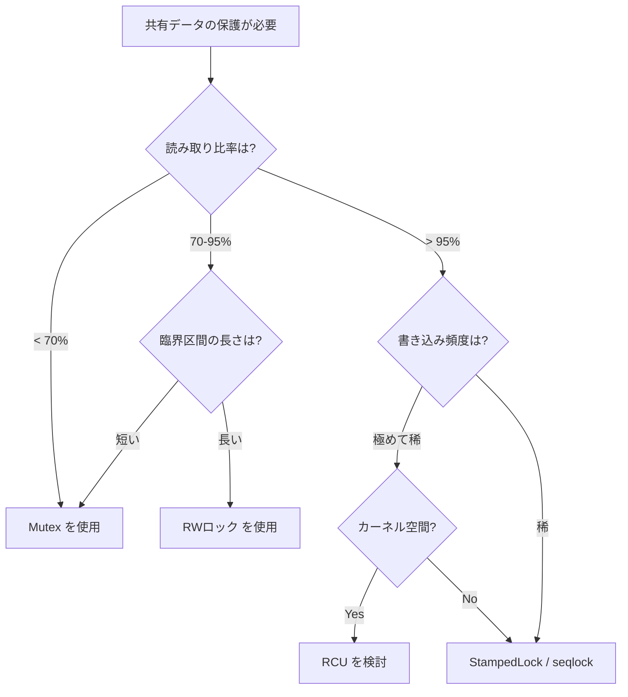

# Read-Writeロック

## 1. 背景と動機 — なぜ Mutex だけでは不十分なのか

マルチスレッドプログラミングにおける同期プリミティブとして、Mutex（相互排他ロック）は最も基本的かつ強力な手段である。しかし、すべての共有データアクセスを Mutex で保護すると、**読み取りしか行わないスレッド同士までもが互いをブロックしてしまう**という問題が発生する。

### 1.1 読み取りと書き込みの非対称性

共有データに対する操作は、大きく2種類に分けられる。

- **読み取り（Read）**: データの状態を変更しない。複数のスレッドが同時に読み取りを行っても、データの整合性は損なわれない
- **書き込み（Write）**: データの状態を変更する。書き込み中に他のスレッドが読み取りや書き込みを行うと、不整合が生じる可能性がある

この非対称性は、多くの現実のシステムにおいて極めて重要な意味を持つ。たとえば、データベースの設定テーブル、DNS キャッシュ、ルーティングテーブル、アクセス制御リスト（ACL）など、**頻繁に読み取られるが、めったに更新されないデータ**は至るところに存在する。こうしたワークロードでは、読み取り操作が全体の 90% 以上を占めることも珍しくない。

### 1.2 Mutex の限界

Mutex でこのようなワークロードを保護した場合を考えてみよう。



3つのリーダーが順番にロックを取得・解放しているが、これらはすべて読み取り操作であり、**本質的には同時に実行しても安全**である。Mutex はこの区別ができないため、不必要な直列化が発生し、スループットが大幅に低下する。

### 1.3 Read-Write ロックの着想

この問題に対する解決策が **Read-Writeロック（RWロック、読み書きロック）** である。RWロックは以下のルールに基づいて並行アクセスを制御する。

| 現在のロック状態 | 新たな読み取り要求 | 新たな書き込み要求 |
|:---|:---|:---|
| ロックなし | 許可 | 許可 |
| 読み取りロック中 | 許可 | ブロック |
| 書き込みロック中 | ブロック | ブロック |

この制御により、読み取り操作の並行性を最大化しつつ、書き込み操作の排他性を保証する。



## 2. Reader-Writer 問題の定式化

Read-Writeロックの設計は、並行プログラミングの古典的問題である **Reader-Writer 問題（Readers-Writers Problem）** に直接対応する。この問題は 1971 年に Courtois, Heymans, Parnas によって初めて定式化された。

### 2.1 問題の定義

共有リソース（たとえばデータベース）に対して、複数の Reader（読み取り者）と Writer（書き込み者）がアクセスする。以下の制約を満たす必要がある。

1. **同時読み取り**: 複数の Reader が同時にリソースを読み取ることができる
2. **排他書き込み**: Writer がリソースにアクセスしている間、他の Reader も Writer もアクセスできない
3. **進行保証**: デッドロックやライブロックが発生しない

### 2.2 3つのバリエーション

Reader-Writer 問題には、優先度のポリシーに応じて3つの典型的なバリエーションが存在する。

#### 第1の Reader-Writer 問題（Reader 優先）

Reader が優先される。Reader がリソースを使用中であれば、新しい Reader は即座にアクセスできる。Writer は、すべての Reader がリソースを解放するまで待たなければならない。

**問題点**: Reader が絶え間なく到着する場合、Writer が永久に待たされる **Writer の飢餓（Starvation）** が発生する。


#### 第2の Reader-Writer 問題（Writer 優先）

Writer が優先される。Writer が待機中であれば、新しい Reader はブロックされる。Writer は可能な限り早くアクセスを得る。

**問題点**: Writer が頻繁に到着する場合、Reader が永久に待たされる **Reader の飢餓** が発生する。

#### 第3の Reader-Writer 問題（公平）

Reader にも Writer にも飢餓が発生しない。到着順（FIFO）や公平なスケジューリングに基づいてアクセスを制御する。

**トレードオフ**: 公平性を保証するためにオーバーヘッドが増加し、スループットが低下する可能性がある。

### 2.3 各バリエーションの比較

| バリエーション | Reader の並行性 | Writer の待ち時間 | 飢餓 | 実装の複雑さ |
|:---|:---|:---|:---|:---|
| Reader 優先 | 高い | 長い（不定） | Writer 飢餓あり | 低い |
| Writer 優先 | 低い | 短い | Reader 飢餓あり | 中程度 |
| 公平 | 中程度 | 中程度 | なし | 高い |

## 3. Read-Write ロックのインターフェースと状態遷移

### 3.1 基本操作

Read-Writeロックは、以下の4つの基本操作を提供する。

- **read_lock()（shared lock / acquire_shared）**: 読み取りロックを取得する。他に読み取りロックを保持するスレッドがいても取得できる。書き込みロックが保持されている場合はブロックする
- **read_unlock()（shared unlock / release_shared）**: 読み取りロックを解放する
- **write_lock()（exclusive lock / acquire_exclusive）**: 書き込みロックを取得する。他にいかなるロック（読み取り・書き込み問わず）が保持されている場合はブロックする
- **write_unlock()（exclusive unlock / release_exclusive）**: 書き込みロックを解放する

### 3.2 状態遷移図

RWロックの内部状態は、3つの状態で表現できる。



ここで、`SharedLocked` 状態は読み取りロックが保持されている状態を表し、内部的にはアクティブな Reader の数をカウンターで管理する。最後の Reader がロックを解放したときに `Free` 状態に遷移する。

### 3.3 ロックの互換性マトリクス

RWロックの本質は、以下のロック互換性マトリクスに凝縮される。

| | Shared (Read) | Exclusive (Write) |
|:---|:---|:---|
| **Shared (Read)** | 互換 | 非互換 |
| **Exclusive (Write)** | 非互換 | 非互換 |

この互換性マトリクスは、データベースの行レベルロックでも同様のパターンが見られる。実際、データベースにおける共有ロック（S ロック）と排他ロック（X ロック）は、RWロックの概念をデータベースのトランザクション処理に応用したものである。

## 4. 実装の詳細

### 4.1 基本的な実装（Mutex + 条件変数）

RWロックは、より基本的な同期プリミティブである Mutex と条件変数を組み合わせて実装できる。以下は Reader 優先の実装例である。

```c
typedef struct {
    pthread_mutex_t mutex;       // protects internal state
    pthread_cond_t  readers_cv;  // condition variable for readers
    pthread_cond_t  writers_cv;  // condition variable for writers
    int readers;                 // number of active readers
    int writer;                  // 1 if a writer is active, 0 otherwise
    int waiting_writers;         // number of waiting writers
} rwlock_t;

void rwlock_init(rwlock_t *rw) {
    pthread_mutex_init(&rw->mutex, NULL);
    pthread_cond_init(&rw->readers_cv, NULL);
    pthread_cond_init(&rw->writers_cv, NULL);
    rw->readers = 0;
    rw->writer = 0;
    rw->waiting_writers = 0;
}

void read_lock(rwlock_t *rw) {
    pthread_mutex_lock(&rw->mutex);
    // Wait while a writer is active
    while (rw->writer) {
        pthread_cond_wait(&rw->readers_cv, &rw->mutex);
    }
    rw->readers++;
    pthread_mutex_unlock(&rw->mutex);
}

void read_unlock(rwlock_t *rw) {
    pthread_mutex_lock(&rw->mutex);
    rw->readers--;
    // If this was the last reader, wake up a waiting writer
    if (rw->readers == 0) {
        pthread_cond_signal(&rw->writers_cv);
    }
    pthread_mutex_unlock(&rw->mutex);
}

void write_lock(rwlock_t *rw) {
    pthread_mutex_lock(&rw->mutex);
    rw->waiting_writers++;
    // Wait while there are active readers or an active writer
    while (rw->readers > 0 || rw->writer) {
        pthread_cond_wait(&rw->writers_cv, &rw->mutex);
    }
    rw->waiting_writers--;
    rw->writer = 1;
    pthread_mutex_unlock(&rw->mutex);
}

void write_unlock(rwlock_t *rw) {
    pthread_mutex_lock(&rw->mutex);
    rw->writer = 0;
    // Wake up all waiting readers and one waiting writer
    pthread_cond_broadcast(&rw->readers_cv);
    pthread_cond_signal(&rw->writers_cv);
    pthread_mutex_unlock(&rw->mutex);
}
```

この実装の特徴を分析する。

- `read_lock()` では、Writer がアクティブでなければすぐにロックを取得できる（Reader 優先）
- `read_unlock()` では、最後の Reader がロックを解放した時点で、待機中の Writer を1つ起こす
- `write_lock()` では、Reader も Writer もいなくなるまで待機する
- `write_unlock()` では、全待機中 Reader をブロードキャストで起こし、さらに Writer を1つ起こす

### 4.2 Writer 優先の実装

Writer 優先にするには、`read_lock()` の待機条件に「待機中の Writer がいないこと」を追加する。

```c
void read_lock_writer_priority(rwlock_t *rw) {
    pthread_mutex_lock(&rw->mutex);
    // Wait while a writer is active OR writers are waiting
    while (rw->writer || rw->waiting_writers > 0) {
        pthread_cond_wait(&rw->readers_cv, &rw->mutex);
    }
    rw->readers++;
    pthread_mutex_unlock(&rw->mutex);
}
```

この変更により、Writer が待機している間は新規 Reader がブロックされ、Writer が優先的にロックを取得できるようになる。ただし、Reader の飢餓が発生するリスクがある。

### 4.3 公平な実装（FIFO順序）

公平な実装では、到着順にロックを付与するために、待機キューを導入する。POSIX の `pthread_rwlock_t` を `PTHREAD_RWLOCK_PREFER_WRITER_NONRECURSIVE_NP` 属性で初期化した場合や、Java の `ReentrantReadWriteLock` で `fair = true` を指定した場合は、概ねこの方針に従う。

### 4.4 アトミック操作による最適化

上記の実装では、読み取りロックの取得・解放のたびに内部 Mutex のロック・アンロックが発生する。読み取りが頻繁なワークロードでは、このオーバーヘッドが無視できなくなる。

より効率的な実装では、Reader カウンターをアトミック変数として管理し、Writer が存在しない場合（ファストパス）には Mutex を取得せずに読み取りロックを完了できるようにする。

```c
#include <stdatomic.h>

typedef struct {
    // Encodes state:
    //   bits [0..30]: number of active readers
    //   bit  [31]:    writer flag (1 = writer active or waiting)
    atomic_int state;
    pthread_mutex_t write_mutex;
    pthread_cond_t  cond;
} fast_rwlock_t;

#define WRITER_BIT (1 << 31)
#define READER_MASK (~WRITER_BIT)

void fast_read_lock(fast_rwlock_t *rw) {
    int old = atomic_load(&rw->state);
    // Fast path: no writer active/waiting
    while (1) {
        if (old & WRITER_BIT) {
            // Slow path: writer is active or waiting
            pthread_mutex_lock(&rw->write_mutex);
            while (atomic_load(&rw->state) & WRITER_BIT) {
                pthread_cond_wait(&rw->cond, &rw->write_mutex);
            }
            atomic_fetch_add(&rw->state, 1);
            pthread_mutex_unlock(&rw->write_mutex);
            return;
        }
        // Try to increment reader count atomically
        if (atomic_compare_exchange_weak(&rw->state, &old, old + 1)) {
            return;  // success
        }
        // CAS failed, old has been updated; retry
    }
}
```

このアプローチでは、Writer が存在しないケース（多くのワークロードでは大多数の場合）において、`atomic_compare_exchange` の1回だけで読み取りロックが完了する。

## 5. 各言語・フレームワークにおける RWロック

### 5.1 POSIX Threads（C/C++）

POSIX Threads（pthreads）は `pthread_rwlock_t` を提供する。

```c
#include <pthread.h>

pthread_rwlock_t rwlock = PTHREAD_RWLOCK_INITIALIZER;

void reader(void) {
    pthread_rwlock_rdlock(&rwlock);
    // read shared data
    pthread_rwlock_unlock(&rwlock);
}

void writer(void) {
    pthread_rwlock_wrlock(&rwlock);
    // modify shared data
    pthread_rwlock_unlock(&rwlock);
}
```

POSIX の仕様では Reader/Writer どちらを優先するかは実装依存とされている。Linux（glibc）のデフォルトは Reader 優先だが、属性を設定することで Writer 優先に変更できる。

```c
pthread_rwlockattr_t attr;
pthread_rwlockattr_init(&attr);
pthread_rwlockattr_setkind_np(&attr,
    PTHREAD_RWLOCK_PREFER_WRITER_NONRECURSIVE_NP);
pthread_rwlock_init(&rwlock, &attr);
```

::: warning POSIX RWロックの注意点
`PTHREAD_RWLOCK_PREFER_WRITER_NP` と `PTHREAD_RWLOCK_PREFER_WRITER_NONRECURSIVE_NP` は異なる。前者は再帰的な読み取りロックを許可するため、実際には Writer 優先にならない場合がある。Writer 優先が必要な場合は `NONRECURSIVE` バリアントを使用すること。
:::

### 5.2 C++ 標準ライブラリ

C++17 で `std::shared_mutex` が導入された（C++14 では `std::shared_timed_mutex`）。

```cpp
#include <shared_mutex>
#include <vector>

class ThreadSafeCache {
    mutable std::shared_mutex mutex_;
    std::unordered_map<std::string, std::string> data_;

public:
    std::string get(const std::string& key) const {
        // Shared lock for reading
        std::shared_lock lock(mutex_);
        auto it = data_.find(key);
        return (it != data_.end()) ? it->second : "";
    }

    void put(const std::string& key, const std::string& value) {
        // Exclusive lock for writing
        std::unique_lock lock(mutex_);
        data_[key] = value;
    }
};
```

`std::shared_lock` は RAII パターンでスコープを抜けると自動的にロックを解放する。これにより、例外発生時のロック解放忘れを防止できる。

### 5.3 Rust

Rust の標準ライブラリは `std::sync::RwLock<T>` を提供する。Rust の所有権システムとの統合が特に秀逸である。

```rust
use std::sync::RwLock;

let lock = RwLock::new(vec![1, 2, 3]);

// Multiple readers can hold the lock simultaneously
{
    let reader1 = lock.read().unwrap();
    let reader2 = lock.read().unwrap();
    println!("readers: {:?}, {:?}", *reader1, *reader2);
    // reader1 and reader2 are dropped here, releasing read locks
}

// Only one writer can hold the lock
{
    let mut writer = lock.write().unwrap();
    writer.push(4);
    // writer is dropped here, releasing write lock
}
```

Rust の `RwLock` の際立った特徴は、**コンパイル時の安全性保証**である。

- `read()` が返す `RwLockReadGuard` は不変参照（`&T`）のみを提供する。読み取りロック中にデータを変更しようとするとコンパイルエラーになる
- `write()` が返す `RwLockWriteGuard` は可変参照（`&mut T`）を提供する
- ガードがスコープから外れると自動的にロックが解放される（RAII）

::: tip Rust の parking_lot::RwLock
標準ライブラリの `RwLock` は OS の pthreads に基づくため、オーバーヘッドが比較的大きい。高性能が求められる場面では `parking_lot` クレートの `RwLock` がよく使われる。こちらはユーザー空間での高速パスを実装しており、非競合時のロック取得が約2倍高速である。
:::

### 5.4 Java

Java は `java.util.concurrent.locks.ReentrantReadWriteLock` を提供する。

```java
import java.util.concurrent.locks.ReentrantReadWriteLock;

public class ThreadSafeConfig {
    private final ReentrantReadWriteLock rwLock =
        new ReentrantReadWriteLock(true); // fair = true
    private final Map<String, String> config = new HashMap<>();

    public String get(String key) {
        rwLock.readLock().lock();
        try {
            return config.get(key);
        } finally {
            rwLock.readLock().unlock();
        }
    }

    public void set(String key, String value) {
        rwLock.writeLock().lock();
        try {
            config.put(key, value);
        } finally {
            rwLock.writeLock().unlock();
        }
    }
}
```

Java の `ReentrantReadWriteLock` は以下の特徴を持つ。

- **再入可能（Reentrant）**: 同じスレッドが読み取りロックや書き込みロックを再帰的に取得できる
- **公平モード**: コンストラクタに `true` を渡すと、最も長く待機しているスレッドが優先される
- **ロックのダウングレード**: 書き込みロックを保持したまま読み取りロックを取得し、その後書き込みロックを解放することで、ロックのダウングレードが可能

```java
// Lock downgrade example
rwLock.writeLock().lock();
try {
    // perform write operations
    data.update();

    // Downgrade: acquire read lock before releasing write lock
    rwLock.readLock().lock();
} finally {
    rwLock.writeLock().unlock();
}
// Continue with read lock only
try {
    // read operations with guarantee of seeing own writes
    return data.snapshot();
} finally {
    rwLock.readLock().unlock();
}
```

::: warning ロックのアップグレードは不可
読み取りロックを保持したまま書き込みロックを取得しようとすると、**デッドロック**が発生する。これは、書き込みロックの取得には全 Reader の解放が必要だが、自身が Reader として読み取りロックを保持しているため、永久に待機することになるためである。
:::

### 5.5 Go

Go は `sync.RWMutex` を提供する。

```go
package main

import (
    "sync"
)

type SafeMap struct {
    mu   sync.RWMutex
    data map[string]string
}

func (m *SafeMap) Get(key string) (string, bool) {
    m.mu.RLock()
    defer m.mu.RUnlock()
    val, ok := m.data[key]
    return val, ok
}

func (m *SafeMap) Set(key, value string) {
    m.mu.Lock()
    defer m.mu.Unlock()
    m.data[key] = value
}
```

Go の `sync.RWMutex` は Writer 優先のセマンティクスを採用している。Writer が `Lock()` を呼び出すと、新しい Reader は `RLock()` でブロックされるため、Writer の飢餓を防ぐ設計になっている。

### 5.6 Python

Python は `threading.RLock` とは別に、RWロック専用の標準ライブラリは提供していない。ただし、GIL（Global Interpreter Lock）の存在により、CPython では純粋なマルチスレッドの読み取り並行性の恩恵は限定的である。I/O バウンドな処理や C 拡張モジュールを通じた操作では効果がある。サードパーティライブラリやカスタム実装が必要になる場合が多い。

## 6. 高度なトピック

### 6.1 ロックのダウングレードとアップグレード

**ロックのダウングレード**とは、書き込みロックを読み取りロックに降格する操作である。

```
1. write_lock() を保持している状態
2. read_lock() を取得する（同一スレッド）
3. write_unlock() を呼び出す
4. 結果: read_lock() のみ保持した状態に遷移
```

ダウングレードの典型的なユースケースは、データを更新した後、そのデータの一貫したスナップショットを読み取る必要がある場合である。ダウングレードにより、書き込みロックを完全に解放する一瞬の間に他の Writer が割り込むのを防ぎつつ、他の Reader のブロックを最小限に抑えることができる。

**ロックのアップグレード**（読み取りロックから書き込みロックへ）は、ほとんどの実装でサポートされていない。その理由は、2つの Reader が同時にアップグレードを試みた場合にデッドロックが発生するためである。



一部の実装（Linux カーネルの `rwsem` の `downgrade_write()` や Java の `StampedLock.tryConvertToWriteLock()`）では条件付きでアップグレードを提供しているが、失敗する可能性がある操作として設計されている。

### 6.2 再入可能（Reentrant）RWロック

再入可能 RWロックは、同じスレッドが同じロックを複数回取得できるようにする。

```
Thread A: read_lock()   // readers = 1
Thread A: read_lock()   // readers = 2 (reentrant)
Thread A: read_unlock() // readers = 1
Thread A: read_unlock() // readers = 0 (fully released)
```

再入可能性は便利だが、実装が複雑になる。特に、スレッドごとの再入回数を追跡する必要があるため、メモリとパフォーマンスのオーバーヘッドが増加する。また、Reader として再入中に Writer へのアップグレードを試みると、前述のデッドロックリスクが生じる。

### 6.3 StampedLock（Java）

Java 8 で導入された `StampedLock` は、従来の RWロックのパフォーマンス問題を解決するために設計された高度なロック機構である。

```java
import java.util.concurrent.locks.StampedLock;

public class Point {
    private double x, y;
    private final StampedLock sl = new StampedLock();

    // Exclusive locking for writes
    void move(double deltaX, double deltaY) {
        long stamp = sl.writeLock();
        try {
            x += deltaX;
            y += deltaY;
        } finally {
            sl.unlockWrite(stamp);
        }
    }

    // Optimistic reading
    double distanceFromOrigin() {
        // Try optimistic read first (no lock acquired)
        long stamp = sl.tryOptimisticRead();
        double currentX = x, currentY = y;

        // Validate that no write occurred during the read
        if (!sl.validate(stamp)) {
            // Optimistic read failed; fall back to read lock
            stamp = sl.readLock();
            try {
                currentX = x;
                currentY = y;
            } finally {
                sl.unlockRead(stamp);
            }
        }
        return Math.sqrt(currentX * currentX + currentY * currentY);
    }
}
```

`StampedLock` の核心は **楽観的読み取り（Optimistic Read）** である。

1. `tryOptimisticRead()` はロックを取得せず、現在の「スタンプ」（バージョン番号）を返す
2. 読み取りが完了した後、`validate(stamp)` でスタンプが変化していないか（= 書き込みが発生していないか）を検証する
3. 検証に成功すれば、ロックなしで読み取りが完了する
4. 検証に失敗した場合は、通常の読み取りロックにフォールバックする

この手法は、**書き込みが極めて稀なワークロード**において、読み取りロックの取得・解放コストすら排除でき、非常に高いスループットを実現する。

::: danger StampedLock の注意点
- `StampedLock` は再入可能ではない
- `Condition` をサポートしない
- `validate` に成功するまでの間に読み取ったデータは信頼できないため、副作用のある操作に使用してはならない
:::

### 6.4 seqlock（Linux カーネル）

Linux カーネルで使用される **seqlock（Sequence Lock）** は、StampedLock と類似した楽観的アプローチを採用している。

```c
// Linux kernel seqlock usage pattern
typedef struct {
    unsigned sequence;
    spinlock_t lock;
} seqlock_t;

// Writer side
void write_seqlock(seqlock_t *sl) {
    spin_lock(&sl->lock);
    sl->sequence++;  // odd = write in progress
    smp_wmb();       // write memory barrier
}

void write_sequnlock(seqlock_t *sl) {
    smp_wmb();
    sl->sequence++;  // even = no write in progress
    spin_unlock(&sl->lock);
}

// Reader side (lockless, may need to retry)
unsigned read_seqbegin(seqlock_t *sl) {
    unsigned seq;
    do {
        seq = sl->sequence;
        smp_rmb();   // read memory barrier
    } while (seq & 1);  // wait if write in progress
    return seq;
}

int read_seqretry(seqlock_t *sl, unsigned seq) {
    smp_rmb();
    return sl->sequence != seq;
}
```

seqlock の使用パターンは次のとおりである。

```c
// Typical reader usage
unsigned seq;
do {
    seq = read_seqbegin(&my_seqlock);
    // read shared data (may be inconsistent)
    copy = shared_data;
} while (read_seqretry(&my_seqlock, seq));
// copy is now consistent
```

seqlock の特徴は以下のとおりである。

- Reader はロックを取得しない（完全にロックフリー）
- Reader 側のオーバーヘッドが極めて小さい
- Writer は Reader をブロックしない（Writer 側は排他制御が必要）
- Reader は一貫性のないデータを読む可能性があるため、ポインタの追跡などには使用できない（不正なアドレスへのアクセスが発生し得る）
- Linux カーネルではタイマー（`jiffies`）やネットワーク統計など、頻繁に読み取られるデータに使用されている

### 6.5 RCU（Read-Copy-Update）

Linux カーネルで広く使用されている **RCU（Read-Copy-Update）** は、RWロックの根本的な限界を克服するために考案されたメカニズムである。

RWロックの共通した課題として、Reader カウンターの更新がキャッシュラインバウンシングを引き起こす点がある。多数のコアが同時に Reader カウンターを更新しようとすると、そのキャッシュラインが各コア間で頻繁に転送され、性能が劣化する。

RCU はこの問題を以下のアプローチで解決する。

1. **Read 側**: ロックもアトミック操作も不要。`rcu_read_lock()` / `rcu_read_unlock()` はプリエンプションの無効化/有効化のみを行う
2. **Update 側**: 共有データのコピーを作成し、コピーを更新してからポインタをアトミックに差し替える
3. **古いデータの解放**: すべての既存 Reader が古いデータへの参照を解放するまで（grace period）待ってから、古いデータを解放する



RCU は読み取り側のオーバーヘッドがほぼゼロであり、数百コアのシステムでもスケーラブルに動作する。ただし、書き込みのコストは高く（コピーの作成 + grace period の待機）、使用パターンも制約が大きいため、汎用的な RWロックの代替とはならない。

## 7. パフォーマンス特性と実践的な考慮事項

### 7.1 RWロックが有効なケース

RWロックが Mutex よりも優れた性能を発揮するのは、以下の条件が揃った場合である。

1. **読み取りが書き込みよりも圧倒的に多い**: 読み取り比率が 90% 以上であることが望ましい
2. **臨界区間が十分に長い**: ロックの取得・解放コストに対して、臨界区間内の処理時間が十分に大きい
3. **Reader の並行度が高い**: 複数のスレッドが同時に読み取りを行う場面が多い

### 7.2 RWロックのオーバーヘッド

RWロックは Mutex よりも内部構造が複雑であるため、以下のオーバーヘッドが存在する。

| 項目 | Mutex | RWロック |
|:---|:---|:---|
| メモリ使用量 | 小（状態 + 待機キュー） | 大（状態 + Reader カウンタ + 待機キュー x2） |
| 非競合時のロック取得 | CAS 1回 | CAS 1回 + 条件チェック |
| ロック解放 | アトミック操作1回 | アトミック操作 + 条件チェック + 潜在的 broadcast |
| キャッシュラインの影響 | 小 | 大（Reader カウンタの共有） |

特に **キャッシュラインバウンシング** は重大な問題である。多数の Reader が同時にロックを取得・解放すると、Reader カウンターを含むキャッシュラインがコア間で頻繁に転送され、パフォーマンスが劣化する。

### 7.3 ベンチマーク結果の傾向

一般的なベンチマークでは、以下の傾向が観察される。

```
スループット（ops/sec）
^
|     RWLock
|      /
|     /        Mutex
|    /       ___________
|   /      /
|  /     /
| /   /
|/  /
+--+---+---+---+---+----> Reader比率（%）
  50  60  70  80  90  100
```

- **Reader 比率 50%以下**: Mutex の方が高速（RWロックのオーバーヘッドが支配的）
- **Reader 比率 70%程度**: Mutex と RWロックが拮抗
- **Reader 比率 90%以上**: RWロックが大幅に有利
- **コア数が増えるほど**: RWロックの優位性が増す（ただし、Reader カウンタのスケーラビリティ問題あり）

::: tip 実測に基づく判断
RWロックの採用は、必ず実際のワークロードでのプロファイリングに基づいて判断すべきである。理論的に「読み取りが多い」ワークロードであっても、臨界区間が非常に短い場合は Mutex の方が高速であることがある。
:::

### 7.4 スケーラビリティの限界

コア数が増加した場合、従来の RWロック実装には深刻なスケーラビリティ問題がある。



4コア程度では問題にならないが、64コアや128コアのサーバーでは、Reader カウンターの更新による**キャッシュラインバウンシング**が性能のボトルネックとなる。この問題に対処するために、以下のような手法が考案されている。

- **Per-CPU Reader カウンター**: コアごとに別のカウンターを持ち、Writer はすべてのカウンターの合計を確認する（Linux カーネルの `percpu_rw_semaphore`）
- **RCU**: 前述のとおり、Read 側のアトミック操作を完全に排除する
- **seqlock**: Reader がロックを取得しないアプローチ

## 8. データベースにおける RWロックの応用

### 8.1 共有ロックと排他ロック

データベースのトランザクション処理における **共有ロック（S ロック）** と **排他ロック（X ロック）** は、RWロックの概念をそのまま適用したものである。

- **S ロック**: 読み取りトランザクションが取得。複数のトランザクションが同時に保持できる
- **X ロック**: 書き込みトランザクションが取得。他のすべてのロックと競合する

さらに、データベースでは**意図ロック（Intent Lock）** という概念が加わる。テーブルレベルで「これからこのテーブルの行に S/X ロックを取得する予定である」ことを宣言するロックである。

| | IS | IX | S | SIX | X |
|:---|:---|:---|:---|:---|:---|
| **IS** | 互換 | 互換 | 互換 | 互換 | 非互換 |
| **IX** | 互換 | 互換 | 非互換 | 非互換 | 非互換 |
| **S** | 互換 | 非互換 | 互換 | 非互換 | 非互換 |
| **SIX** | 互換 | 非互換 | 非互換 | 非互換 | 非互換 |
| **X** | 非互換 | 非互換 | 非互換 | 非互換 | 非互換 |

### 8.2 B-Tree のラッチプロトコル

データベースのインデックス構造である B-Tree では、ノードの保護にRWラッチ（軽量ロック）が使用される。典型的なプロトコルは以下のとおりである。

**検索（読み取り）操作**:
1. ルートノードに読み取りラッチを取得
2. 子ノードに読み取りラッチを取得
3. 親ノードの読み取りラッチを解放
4. リーフノードに到達するまで繰り返す

**挿入・削除（書き込み）操作**（楽観的プロトコル）:
1. ルートからリーフまで読み取りラッチで降下
2. リーフノードに書き込みラッチを取得
3. ノードの分割・マージが不要であれば、リーフのみの変更で完了
4. 分割・マージが必要な場合は、リスタートして書き込みラッチで降下

この **ラッチカップリング（Latch Coupling、別名 Crabbing）** プロトコルは、B-Tree の並行アクセスにおける標準的な手法であり、RWロックの読み取り/書き込みの非対称性を巧みに活用している。



## 9. 実装パターンとアンチパターン

### 9.1 推奨パターン

#### RAII によるロック管理

C++ や Rust では、RAII（Resource Acquisition Is Initialization）パターンを活用して、ロックの解放忘れを防止する。

```cpp
// C++: Always use lock guards
{
    std::shared_lock lock(rw_mutex);  // automatically released at scope end
    // read operations
}
```

#### ロック粒度の設計

ロックの粒度は、並行性とオーバーヘッドのトレードオフを考慮して決定する。

- **粗粒度**: データ構造全体を1つの RWロックで保護。実装が簡単だが並行性が低い
- **細粒度**: データ構造の各要素（例: ハッシュテーブルのバケット）を個別の RWロックで保護。並行性は高いが、メモリ使用量とロック管理の複雑さが増す
- **ストライプロック**: 中間的なアプローチ。N 個のロックを用意し、ハッシュ値で振り分ける

```cpp
// Striped RW Lock for a hash map
class StripedRWHashMap {
    static constexpr int NUM_STRIPES = 16;
    std::shared_mutex locks_[NUM_STRIPES];
    std::unordered_map<std::string, std::string> data_;

    int stripe(const std::string& key) {
        return std::hash<std::string>{}(key) % NUM_STRIPES;
    }

public:
    std::string get(const std::string& key) {
        std::shared_lock lock(locks_[stripe(key)]);
        auto it = data_.find(key);
        return (it != data_.end()) ? it->second : "";
    }

    void put(const std::string& key, const std::string& value) {
        std::unique_lock lock(locks_[stripe(key)]);
        data_[key] = value;
    }
};
```

### 9.2 アンチパターン

#### ロック中の長時間処理

```cpp
// BAD: I/O or network call inside lock
{
    std::unique_lock lock(rw_mutex);
    auto data = expensive_network_call();  // blocks all readers!
    cache_[key] = data;
}

// GOOD: Minimize lock scope
auto data = expensive_network_call();  // no lock needed
{
    std::unique_lock lock(rw_mutex);
    cache_[key] = data;                // only lock during actual mutation
}
```

#### ロックの順序不整合によるデッドロック

複数の RWロックを取得する場合、**常に同じ順序**で取得しなければデッドロックが発生する。

```
Thread A: read_lock(lock1) → write_lock(lock2)
Thread B: read_lock(lock2) → write_lock(lock1)  // DEADLOCK!
```

#### 不必要な書き込みロック

読み取りで十分な操作に書き込みロックを使用すると、並行性を不必要に制限する。

```cpp
// BAD: write lock for read-only check
{
    std::unique_lock lock(rw_mutex);  // blocks all readers
    return data_.contains(key);       // read-only operation!
}

// GOOD: shared lock for read-only check
{
    std::shared_lock lock(rw_mutex);  // allows concurrent readers
    return data_.contains(key);
}
```

## 10. RWロックの代替手段

### 10.1 各手法の比較

| 手法 | Read 性能 | Write 性能 | スケーラビリティ | 実装難易度 | 使用場面 |
|:---|:---|:---|:---|:---|:---|
| Mutex | 中 | 中 | 中 | 低 | 汎用 |
| RWロック | 高 | 中〜低 | 中 | 中 | 読み取り多数 |
| StampedLock | 非常に高 | 中 | 高 | 高 | 読み取り多数 + 低レイテンシ |
| seqlock | 非常に高 | 高 | 非常に高 | 高 | 小さなデータの頻繁な読み取り |
| RCU | 極めて高 | 低 | 極めて高 | 非常に高 | カーネル内、読み取り99%以上 |
| ロックフリーデータ構造 | 高 | 高 | 高 | 非常に高 | 特定のデータ構造 |
| コピーオンライト | 高 | 低 | 高 | 中 | 不変データの共有 |

### 10.2 コピーオンライト（Copy-on-Write）

RWロックの代替として、**コピーオンライト**パターンが有効な場合がある。

```rust
use std::sync::Arc;
use std::sync::atomic::{AtomicPtr, Ordering};

struct CowMap {
    data: AtomicPtr<HashMap<String, String>>,
}

impl CowMap {
    fn read(&self) -> Arc<HashMap<String, String>> {
        // Readers get a snapshot; no lock needed
        let ptr = self.data.load(Ordering::Acquire);
        unsafe { Arc::from_raw(ptr) }
    }

    fn write(&self, key: String, value: String) {
        // Writer creates a new copy, modifies it, then swaps
        loop {
            let old_ptr = self.data.load(Ordering::Acquire);
            let old_map = unsafe { &*old_ptr };
            let mut new_map = old_map.clone();
            new_map.insert(key.clone(), value.clone());
            let new_ptr = Arc::into_raw(Arc::new(new_map));
            if self.data.compare_exchange(
                old_ptr, new_ptr as *mut _,
                Ordering::AcqRel, Ordering::Relaxed
            ).is_ok() {
                break;
            }
        }
    }
}
```

この方式では Reader は一切のロックやアトミック操作なしでデータにアクセスできるが、Writer はデータ全体のコピーを作成するため、書き込みコストが高い。

### 10.3 判断フローチャート

同期手法の選択は、以下のフローチャートに従って判断できる。



## 11. 実世界での採用事例

### 11.1 データベースシステム

- **PostgreSQL**: 共有バッファの保護に LWLock（Lightweight Lock）を使用。これは RWロックの実装であり、`LW_SHARED`（読み取り）と `LW_EXCLUSIVE`（書き込み）の2つのモードを持つ
- **MySQL/InnoDB**: B-Tree インデックスのノード保護に `rw_lock_t` を使用。読み取り操作が多いインデックス走査でのスループットを最大化する
- **SQLite**: データベースファイル全体のロックに RWロックを使用。複数の Reader と単一の Writer の並行アクセスを許可する WAL（Write-Ahead Logging）モードが好例

### 11.2 オペレーティングシステム

- **Linux カーネル**: `rw_semaphore`（`rwsem`）がカーネル内の至るところで使用されている。ファイルシステムの inode ロック、メモリ管理の `mmap_lock`（旧 `mmap_sem`）、ネットワークのルーティングテーブルなど
- **Windows**: `SRWLOCK`（Slim Reader/Writer Lock）がユーザーモードの高性能 RWロックとして提供されている。サイズがポインタ1つ分（8バイト）と極めてコンパクト

### 11.3 ミドルウェアとフレームワーク

- **nginx**: 設定の再読み込み時に RWロックを使用。ワーカースレッドは通常時に読み取りロックで設定にアクセスし、`reload` 時にのみ書き込みロックで設定を更新する
- **Go 標準ライブラリ**: `sync.Map` の内部で、読み取り主体のアクセスパターンに最適化された構造を採用している（アトミック操作 + 必要時のみ Mutex）

## 12. まとめと設計指針

### 12.1 RWロックの本質

Read-Writeロックは、**「読み取り操作は相互に安全である」という事実を活用して、共有データへのアクセスの並行性を最大化する同期プリミティブ**である。その核心は以下のとおりである。

- **読み取り同士は並行に実行可能**: 複数の Reader が同時にロックを保持できる
- **書き込みは排他的**: Writer はすべての Reader と他の Writer を排除する
- **読み取りと書き込みの非対称性**: これが Mutex との本質的な違いである

### 12.2 設計指針のまとめ

1. **プロファイリングに基づいて判断する**: RWロックが Mutex より有利かどうかは、読み取り比率、臨界区間の長さ、コア数など複数の要因に依存する。推測ではなく測定に基づいて選択する

2. **Writer の飢餓に注意する**: Reader 優先の実装を使用する場合、Writer が長時間待たされる可能性がある。Writer 優先または公平な実装を検討する

3. **ロック粒度を適切に設計する**: 粗粒度すぎると並行性が制限され、細粒度すぎるとオーバーヘッドが増大する

4. **ロックの保持時間を最小化する**: 特に書き込みロック中の I/O 操作やネットワーク通信は避ける

5. **アップグレードを避ける**: 読み取りロックから書き込みロックへのアップグレードはデッドロックの原因となる。必要な場合は最初から書き込みロックを取得するか、`StampedLock` のような条件付きアップグレードをサポートするロックを使用する

6. **スケーラビリティを意識する**: 多コア環境では、Reader カウンターのキャッシュラインバウンシングが性能ボトルネックとなりうる。必要に応じて per-CPU カウンターや RCU、seqlock などの代替手段を検討する

7. **RAII を活用する**: ロックの解放忘れはデッドロックの直接的原因である。RAII パターンを活用して、例外やエラー時にも確実にロックが解放されるようにする

Read-Writeロックは、Mutex と完全なロックフリーアプローチの中間に位置する実用的な同期プリミティブである。万能ではないが、適切な場面で使用すれば、コードの安全性を維持しつつ大幅なスループット向上を実現できる。
