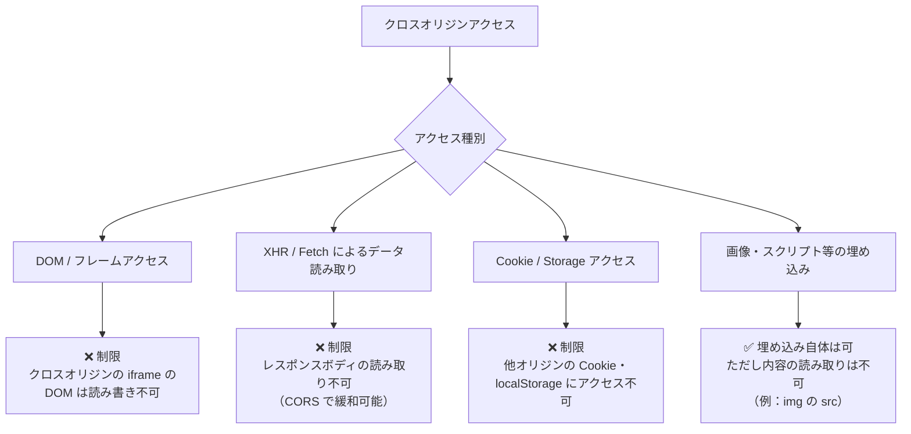
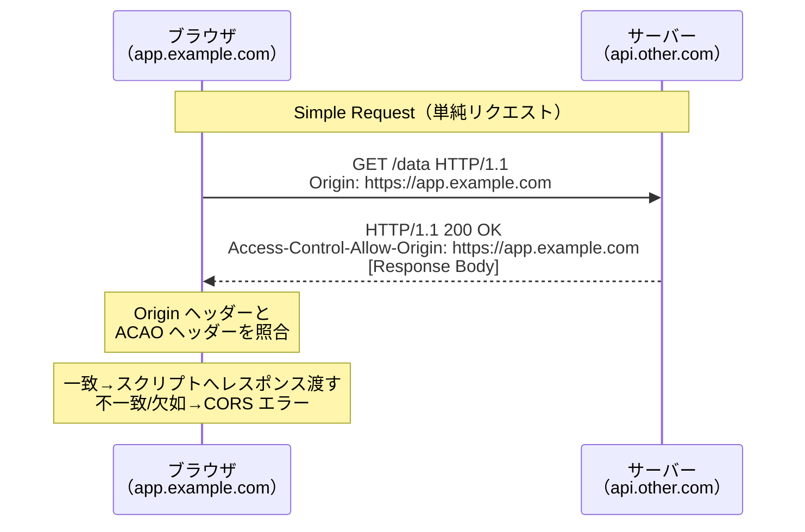
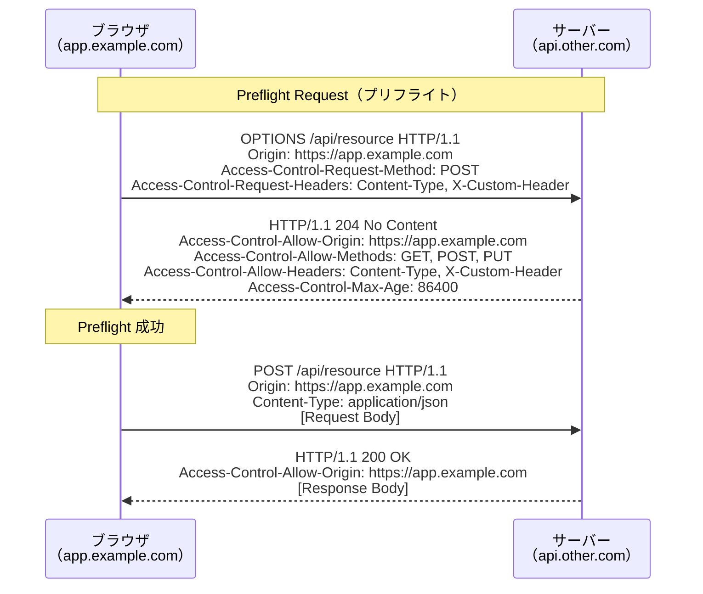
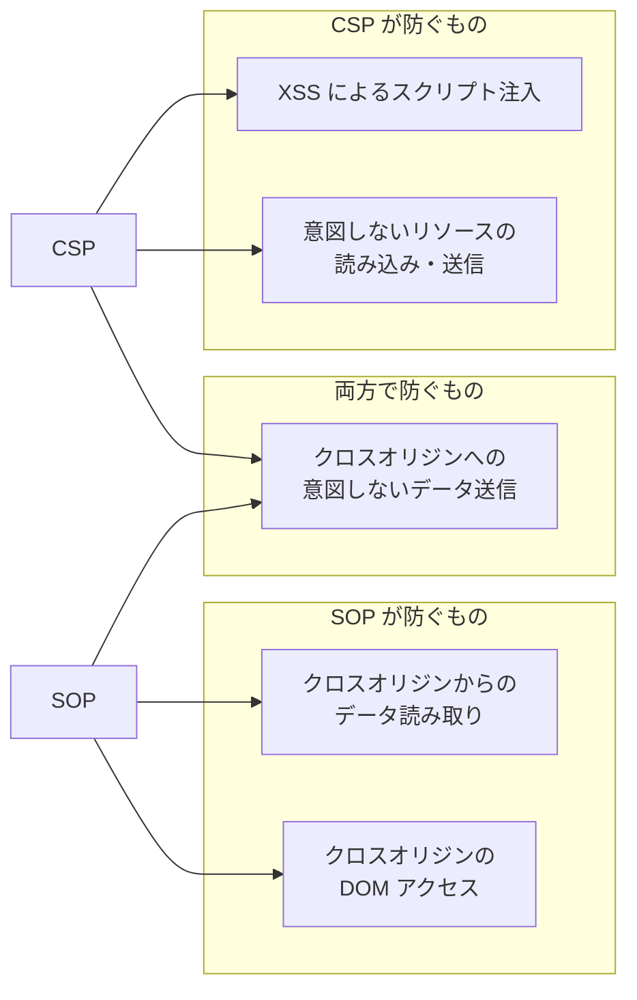
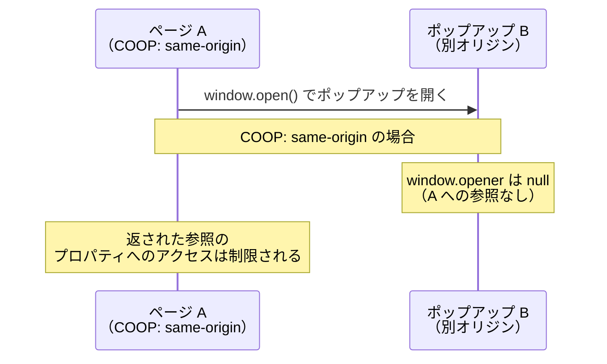
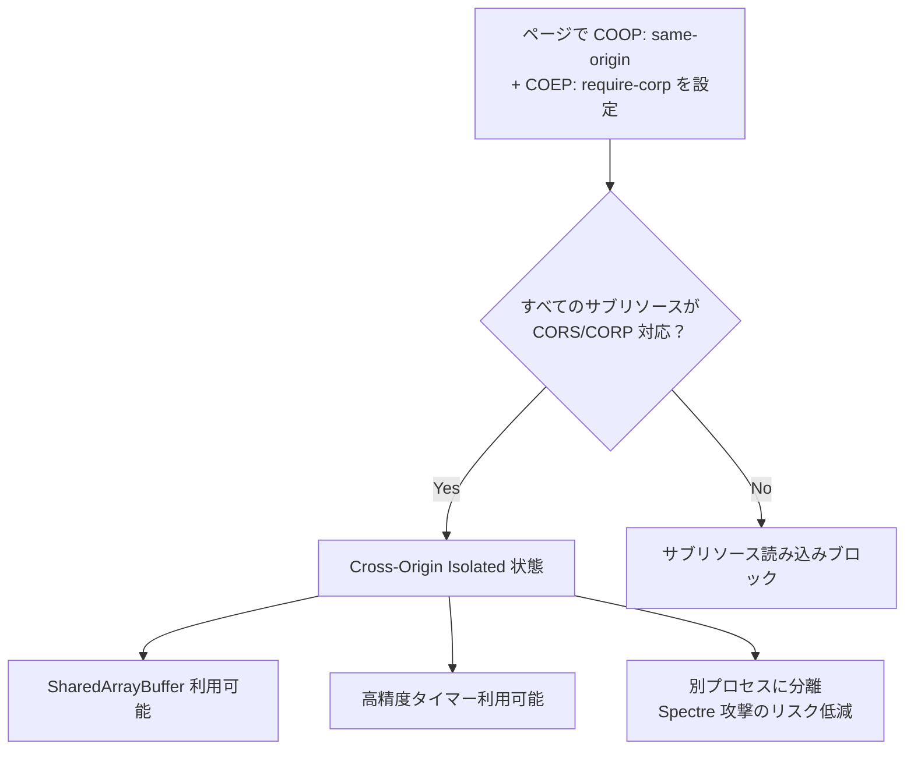
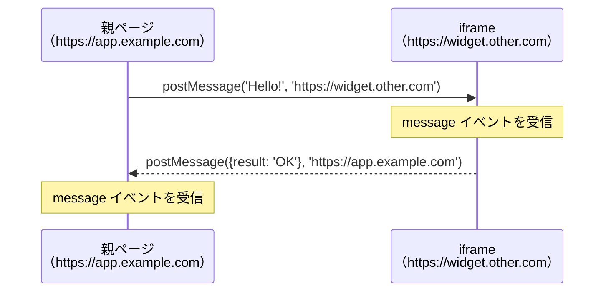
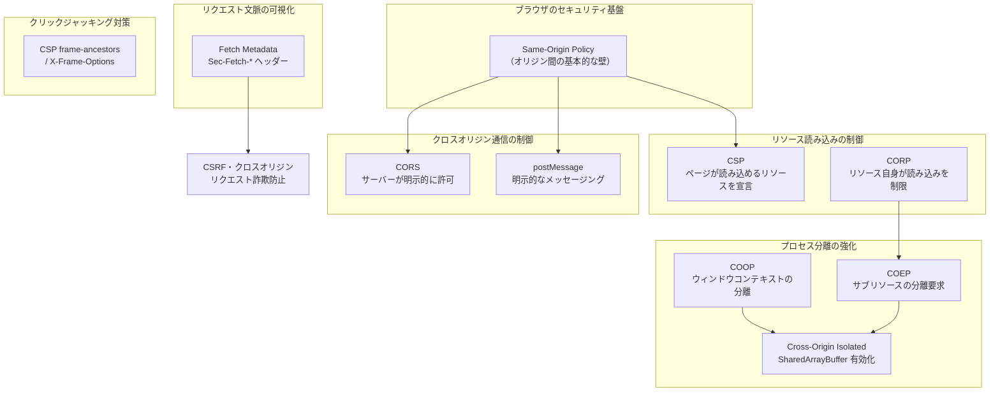
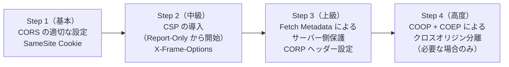

# Same-Origin Policy の全体像（CORS/CSP/COOP/COEP の統合理解）

## 1. Same-Origin Policy とは何か

### 1.1 問題の出発点

Web ブラウザは、ユーザーが複数のサイトを同時に開ける環境を提供する。あるタブで銀行サービスにログインしながら、別のタブで見知らぬ Web ページを開く——これは日常的なシナリオだ。このとき、もし悪意ある Web ページが別タブの銀行サービスのデータを自由に読み書きできるとしたら、ブラウザは恐ろしい攻撃基盤になってしまう。

この問題を解決するために生まれた根本的なセキュリティ境界が **Same-Origin Policy（同一オリジンポリシー、SOP）** である。SOP はブラウザのセキュリティモデルの礎石であり、CORS・CSP・COOP・COEP といった後続の仕組みはすべて、SOP を補強・細分化・緩和するための拡張機構として位置づけられる。

SOP の本質を一言で表すと、「**あるオリジンから読み込まれたドキュメントやスクリプトは、異なるオリジンのリソースにアクセスできない**」という原則だ。

### 1.2 オリジンの定義

SOP において「オリジン」とは、次の三つの要素の組み合わせによって定義される。

| 要素 | 説明 | 例 |
|------|------|-----|
| **スキーム（Scheme）** | プロトコル識別子 | `https`, `http` |
| **ホスト（Host）** | ドメイン名または IP アドレス | `example.com`, `api.example.com` |
| **ポート（Port）** | TCP ポート番号（省略時はスキームのデフォルト） | `443`, `8080` |

この三つがすべて一致する場合のみ、「同一オリジン（Same-Origin）」と見なされる。一つでも異なれば「クロスオリジン（Cross-Origin）」である。

```
// Comparison with https://example.com:443/page as reference origin

https://example.com/other        -> Same-Origin  (path differs, not part of origin)
https://example.com:443/other    -> Same-Origin  (explicit port matches default)
http://example.com/page          -> Cross-Origin (scheme differs: http vs https)
https://sub.example.com/page     -> Cross-Origin (host differs: subdomain)
https://example.com:8080/page    -> Cross-Origin (port differs: 443 vs 8080)
https://example.org/page         -> Cross-Origin (host differs: different TLD)
```

> [!NOTE]
> `https://example.com` のデフォルトポートは 443 であり、`https://example.com:443` と同一オリジンになる。同様に `http://example.com` のデフォルトポートは 80 だ。ポートを明示するかどうかは比較に影響しない。

### 1.3 オリジンの仕様上の正確な定義

HTML Living Standard および RFC 6454「The Web Origin Concept」によると、オリジンは `(scheme, host, port)` の三つ組として形式的に定義される。

```
origin = scheme "://" host [ ":" port ]
```

`null` オリジンという特殊なケースも存在する。`file://` スキームのページ、サンドボックス化された `<iframe>`、`data:` URL から生成されたドキュメントなどがこれにあたる。`null` オリジン同士は常にクロスオリジンとして扱われる。

## 2. SOP が制限するもの

SOP は一枚岩のルールではなく、リソースの種類によって制限の強さが異なる。大まかに「**読み取りを制限するもの**」と「「**埋め込みは許可するが読み取りは制限するもの**」に分類できる。

### 2.1 SOP が制限する主なリソース



#### DOM アクセスの制限

あるページが `<iframe>` でクロスオリジンのページを読み込んだとき、JavaScript から `iframe.contentDocument` や `iframe.contentWindow` を通じて iframe 内の DOM にアクセスしようとすると、ブラウザはこれを拒否する。

```javascript
// Main page: https://attacker.com
const iframe = document.querySelector('iframe');
// iframe src: https://bank.example.com

try {
  // Cross-origin DOM access is blocked by SOP
  const doc = iframe.contentDocument; // null or throws SecurityError
  console.log(doc.body.innerHTML); // Never reached
} catch (e) {
  console.error(e); // SecurityError: Blocked a frame with origin...
}
```

ただし `window.location` への書き込み（リダイレクト）は例外的に許可されており、また `postMessage` API を用いることで安全なクロスオリジン通信が可能になる（後述）。

#### XMLHttpRequest / Fetch の制限

`XMLHttpRequest` および `fetch()` でクロスオリジンのリソースにリクエストを送ることは技術的に可能だが、**レスポンスの読み取りは SOP によってブロックされる**。サーバー側が適切な CORS ヘッダーを返さない限り、ブラウザはレスポンスをスクリプトに渡さない。

```javascript
// Page on https://app.example.com
fetch('https://api.other.com/data')
  .then(res => res.json()) // Blocked if server doesn't send CORS headers
  .catch(err => {
    // "TypeError: Failed to fetch" or CORS error in console
    console.error(err);
  });
```

重要な点は、**リクエスト自体はサーバーに到達する可能性がある**ことだ。SOP はブラウザ側の制限であり、スクリプトがレスポンスを読めないようにするものであって、リクエストの送信自体を完全に防ぐものではない（Preflight によって副作用のあるリクエストを事前にチェックする仕組みは CORS が提供する）。

#### Cookie の制限

Cookie は `Domain` 属性によって送信範囲が制御されるが、JavaScript から `document.cookie` を通じて読み書きできるのは同一オリジン（または `Domain` 属性で許可されたドメイン）の Cookie に限られる。

```javascript
// On https://example.com
document.cookie = "session=abc123; Domain=example.com; Secure; HttpOnly";

// On https://attacker.com, cannot read example.com cookies:
console.log(document.cookie); // Only shows attacker.com's own cookies
```

`HttpOnly` フラグを付けると JavaScript からの読み取りを完全に防げる。これは XSS 攻撃による Cookie 窃取に対する追加の防御策だ。

#### Web Storage の制限

`localStorage` と `sessionStorage` はオリジンごとに完全に分離されている。あるオリジンのスクリプトが別のオリジンのストレージにアクセスする方法は存在しない。

```javascript
// On https://example.com
localStorage.setItem('key', 'sensitive_value');

// On https://other.com, cannot access example.com's localStorage:
// Each origin has its own isolated storage namespace
localStorage.getItem('key'); // Returns null (own namespace)
```

### 2.2 SOP が制限しないもの（埋め込みは許可）

SOP は「クロスオリジンリソースの読み取り」を制限するが、「クロスオリジンリソースの埋め込み」は伝統的に許可されてきた。これは Web の相互運用性の基盤となっている。

| リソース種別 | 埋め込み | 読み取り |
|-------------|---------|---------|
| `<script src="...">` | 許可 | 不可（スクリプトとして実行はされる） |
| `<link rel="stylesheet" href="...">` | 許可 | 内容の直接読み取りは不可 |
| `` | 許可 | ピクセルデータの読み取りは不可 |
| `<video src="...">` | 許可 | フレームデータの読み取りは不可 |
| `<iframe src="...">` | 許可 | DOM の読み取りは不可 |
| `@font-face` CSS | 許可（サーバー次第） | — |

この「埋め込みは許可、読み取りは不可」という分類が、後述する CORS・CSP・CORP（Cross-Origin Resource Policy）などの制御粒度の基礎となっている。

## 3. CORS — クロスオリジンリソース共有

### 3.1 CORS が必要になった背景

SOP によってクロスオリジンの Fetch が制限される一方、現実のアプリケーションでは正当なクロスオリジン通信が必要な場面は多い。フロントエンドが `https://app.example.com` でホストされ、API が `https://api.example.com` に置かれているような構成はごく一般的だ。

CORS（Cross-Origin Resource Sharing）は、**サーバー側が「このオリジンからのアクセスを許可する」と宣言するための HTTP ヘッダーベースの仕組み**である。W3C によって標準化され、現在は WHATWG Fetch 仕様に統合されている。

CORS の設計思想は明確だ。「デフォルトは拒否、サーバーが明示的に許可したものだけを通す」。これにより SOP の安全性を維持しながら、正当なクロスオリジン通信を可能にする。

### 3.2 Simple Request（単純リクエスト）

すべてのクロスオリジンリクエストが事前確認を必要とするわけではない。Fetch 仕様は「**CORS-safelisted**」な条件を満たすリクエストを「Simple Request（単純リクエスト）」として定義し、Preflight なしで送信を許可している。

単純リクエストの条件は以下のとおりだ。

**メソッド**: `GET`、`HEAD`、`POST` のいずれか

**ヘッダー**: 以下の CORS-safelisted request headers のみ使用
- `Accept`
- `Accept-Language`
- `Content-Language`
- `Content-Type`（ただし値は `application/x-www-form-urlencoded`、`multipart/form-data`、`text/plain` のいずれか）



サーバーが返すべき主要なレスポンスヘッダーは `Access-Control-Allow-Origin` だ。

```http
# Allow specific origin
Access-Control-Allow-Origin: https://app.example.com

# Allow any origin (use with caution)
Access-Control-Allow-Origin: *
```

`*`（ワイルドカード）を指定すると任意のオリジンからのアクセスを許可するが、**Cookie や Authorization ヘッダーなどのクレデンシャルと組み合わせることはできない**（後述）。

### 3.3 Preflight Request（プリフライトリクエスト）

単純リクエストの条件を満たさないリクエスト（`PUT`・`DELETE` などのメソッド、`Content-Type: application/json`、カスタムヘッダーなど）は、本リクエストの前に **OPTIONS メソッドによる Preflight リクエスト**を送信する。

Preflight の目的は「本リクエストをサーバーが受け入れるかどうか」を事前に確認することだ。これにより、SOP が存在しない時代に作られたサーバー（クロスオリジンリクエストを想定していないサーバー）への意図しない副作用のある操作を防ぐ。



Preflight に関わる主要な CORS ヘッダーをまとめる。

**リクエスト側（ブラウザが送信）**:

| ヘッダー | 説明 |
|---------|------|
| `Origin` | リクエスト元のオリジン |
| `Access-Control-Request-Method` | 本リクエストで使用するメソッド |
| `Access-Control-Request-Headers` | 本リクエストで使用するカスタムヘッダー |

**レスポンス側（サーバーが返す）**:

| ヘッダー | 説明 |
|---------|------|
| `Access-Control-Allow-Origin` | 許可するオリジン（`*` または特定オリジン） |
| `Access-Control-Allow-Methods` | 許可するメソッドのリスト |
| `Access-Control-Allow-Headers` | 許可するリクエストヘッダーのリスト |
| `Access-Control-Expose-Headers` | スクリプトから読み取れるレスポンスヘッダーのリスト |
| `Access-Control-Max-Age` | Preflight 結果のキャッシュ秒数 |
| `Access-Control-Allow-Credentials` | Cookie 等のクレデンシャルを許可するか |

### 3.4 クレデンシャル付きリクエスト

デフォルトでは、クロスオリジンの `fetch()` は Cookie や HTTP 認証情報を送信しない。クレデンシャルを含めるには、クライアントとサーバーの**両方**で明示的に設定が必要だ。

```javascript
// Client: must set credentials: 'include'
fetch('https://api.other.com/profile', {
  credentials: 'include', // Send cookies with request
})
  .then(res => res.json())
  .then(data => console.log(data));
```

```http
# Server must respond with these headers (wildcard * is NOT allowed)
Access-Control-Allow-Origin: https://app.example.com
Access-Control-Allow-Credentials: true
```

> [!WARNING]
> クレデンシャル付き CORS では、`Access-Control-Allow-Origin: *` は使用できない。オリジンを明示的に指定しなければならない。これは Wildcard とクレデンシャルの組み合わせが CSRF（Cross-Site Request Forgery）のような攻撃を可能にしてしまうためだ。

### 3.5 CORS の誤設定がもたらすリスク

CORS は正しく設定しなければ、保護したかった SOP をむしろ弱めてしまう。代表的な誤設定を示す。

```python
# BAD: Reflecting any Origin header without validation
# This effectively nullifies SOP for all origins
def handle_cors(request):
    origin = request.headers.get('Origin')
    response.headers['Access-Control-Allow-Origin'] = origin  # Dangerous!
    response.headers['Access-Control-Allow-Credentials'] = 'true'
```

```python
# BAD: Overly broad regex (matches "evil-example.com")
import re
allowed_pattern = re.compile(r'https://.*example\.com')
origin = request.headers.get('Origin', '')
if allowed_pattern.match(origin):
    response.headers['Access-Control-Allow-Origin'] = origin  # Still dangerous!
```

```python
# GOOD: Explicit allowlist
ALLOWED_ORIGINS = {'https://app.example.com', 'https://admin.example.com'}

def handle_cors(request):
    origin = request.headers.get('Origin', '')
    if origin in ALLOWED_ORIGINS:
        response.headers['Access-Control-Allow-Origin'] = origin
        response.headers['Vary'] = 'Origin'  # Important for caching correctness
```

`Vary: Origin` ヘッダーを付けることも重要だ。これがないと、CDN やキャッシュが異なるオリジンに対して誤ったレスポンスを返す可能性がある。

## 4. Content Security Policy（CSP）

### 4.1 CSP の目的

SOP は異なるオリジンからのアクセスを制限するが、**同一オリジン内での悪意あるスクリプト実行（XSS: Cross-Site Scripting）を防ぐ機能は持たない**。攻撃者がサイトに悪意あるスクリプトを注入できれば、そのスクリプトは正規オリジンのコンテキストで動作するため、SOP はほとんど意味をなさなくなる。

**Content Security Policy（CSP）** は、この XSS 攻撃を緩和するための仕組みだ。サーバーが HTTP レスポンスヘッダーまたは `<meta>` タグで「このページでは何を実行・読み込んでよいか」のポリシーを宣言し、ブラウザがそれに従って制限をかける。

### 4.2 CSP の基本構文

CSP はディレクティブとソースリストの組み合わせで構成される。

```http
Content-Security-Policy: default-src 'self'; script-src 'self' https://cdn.example.com; img-src *; style-src 'self' 'unsafe-inline'
```

主要なディレクティブを整理する。

| ディレクティブ | 制御対象 |
|--------------|---------|
| `default-src` | 他のディレクティブのフォールバック |
| `script-src` | JavaScript ソース |
| `style-src` | CSS ソース |
| `img-src` | 画像ソース |
| `font-src` | フォントソース |
| `connect-src` | fetch/XHR/WebSocket の接続先 |
| `frame-src` | `<iframe>` ソース |
| `object-src` | `<object>`/`<embed>` ソース |
| `base-uri` | `<base>` タグの URI |
| `form-action` | フォーム送信先 |
| `frame-ancestors` | このページを埋め込めるオリジン（X-Frame-Options の代替） |

ソース値の例:

| ソース値 | 意味 |
|--------|------|
| `'self'` | 同一オリジン |
| `https://example.com` | 特定オリジン |
| `https:` | HTTPS スキーム全般 |
| `*` | 任意（スキーム限定なし） |
| `'none'` | 何も許可しない |
| `'unsafe-inline'` | インラインスクリプト/スタイルを許可（危険） |
| `'unsafe-eval'` | `eval()` を許可（危険） |
| `'nonce-{base64}'` | ノンス一致で許可 |
| `'sha256-{base64}'` | ハッシュ一致で許可 |

### 4.3 Nonce ベース CSP

`'unsafe-inline'` を使わずにインラインスクリプトを安全に許可する方法が、**Nonce（ノンス）** だ。サーバーはリクエストごとにランダムなノンス値を生成し、CSP ヘッダーとスクリプトタグの両方に埋め込む。

```python
import secrets

def render_page(request):
    # Generate a new nonce for each request
    nonce = secrets.token_urlsafe(16)

    response_headers = {
        'Content-Security-Policy': f"script-src 'nonce-{nonce}' 'strict-dynamic'"
    }

    html = f"""
    <script nonce="{nonce}">
      // This inline script is allowed because nonce matches
      console.log('Trusted script');
    </script>
    <script nonce="{nonce}" src="/app.js"></script>
    """
    return html, response_headers
```

攻撃者が XSS によってスクリプトを注入しても、ノンス値を知らなければ実行されない。ノンスはリクエストごとに変わるため、事前に推測することもできない。

`'strict-dynamic'` を組み合わせると、ノンスで信頼されたスクリプトが `document.createElement('script')` で動的に追加したスクリプトも信頼されるようになり、既存アプリケーションへの段階的な CSP 導入が容易になる。

### 4.4 CSP の報告機能

CSP にはポリシー違反を報告する機能が組み込まれている。`report-uri`（非推奨）または `report-to` ディレクティブで指定した URL に、違反レポートが JSON として送信される。

```http
Content-Security-Policy: default-src 'self'; report-to csp-endpoint

Reporting-Endpoints: csp-endpoint="https://monitoring.example.com/csp-report"
```

段階的な CSP 展開には `Content-Security-Policy-Report-Only` ヘッダーが有用だ。実際にはブロックせず、違反レポートの送信だけを行うため、本番環境での影響を事前に確認できる。

```http
# Report-Only mode: log violations without blocking
Content-Security-Policy-Report-Only: default-src 'self'; script-src 'self' 'nonce-abc123'; report-to csp-endpoint
```

### 4.5 SOP と CSP の関係

SOP と CSP は異なる脅威に対処する補完的な仕組みだ。



XSS で悪意あるスクリプトを注入されると、そのスクリプトは正規オリジンの権限を持つため SOP は無効化される。CSP は XSS の実行そのものを防ぐことで、SOP が意味を持ち続けるための前提条件を守る。

## 5. COOP と COEP — プロセス分離の時代

### 5.1 Spectre 攻撃と共有メモリ問題

2018 年に公開された **Spectre** は、CPU の投機的実行を悪用したサイドチャネル攻撃だ。同一プロセスのメモリに存在するデータを、高精度なタイミング計測によって漏洩させることができる。

ブラウザは当初、`SharedArrayBuffer` と `performance.now()` の高精度タイマーを利用した Spectre 攻撃に脆弱だった。ブラウザの多くは同一プロセス内で複数のオリジンのコンテンツを扱っていたため、悪意あるオリジンが他のオリジンのメモリを読み取れる可能性があった。

対策として、ブラウザベンダーは以下の措置を取った。

1. `SharedArrayBuffer` を**デフォルトで無効化**（2018年）
2. `performance.now()` の精度を引き下げ
3. **クロスオリジン分離（Cross-Origin Isolation）** の仕組みを策定

`SharedArrayBuffer` を安全に再有効化するための条件として設計されたのが、**COOP（Cross-Origin Opener Policy）** と **COEP（Cross-Origin Embedder Policy）** だ。

### 5.2 COOP — Cross-Origin Opener Policy

**COOP** は、あるページがクロスオリジンのポップアップウィンドウと「ブラウジングコンテキストグループ」を共有するかどうかを制御するヘッダーだ。

```http
Cross-Origin-Opener-Policy: same-origin
```

COOP の値と動作をまとめる。

| 値 | 動作 |
|----|------|
| `unsafe-none` | デフォルト。クロスオリジンのウィンドウと同一グループを共有可能 |
| `same-origin-allow-popups` | クロスオリジンのウィンドウが開いたポップアップとは分離するが、自分が開いたポップアップは許可 |
| `same-origin` | 同一オリジンのウィンドウとのみグループを共有。最も強い分離 |

`same-origin` を設定すると、たとえ同じタブで開いたとしても、クロスオリジンの window への `opener` 参照が切断される。



COOP の主な効果は、**クロスオリジンのウィンドウが `window.opener` 経由でページのプロパティを読み書きするのを防ぐ**ことだ。これにより、ページが独立したプロセスに配置されやすくなる。

### 5.3 COEP — Cross-Origin Embedder Policy

**COEP** は、ページが読み込む**すべてのサブリソース**がクロスオリジン分離に対応していることを要求するヘッダーだ。

```http
Cross-Origin-Embedder-Policy: require-corp
```

| 値 | 動作 |
|----|------|
| `unsafe-none` | デフォルト。クロスオリジンリソースの読み込みに制限なし |
| `require-corp` | すべてのクロスオリジンリソースに CORS または CORP ヘッダーが必要 |
| `credentialless` | クレデンシャルなしでクロスオリジンリソースを読み込み可能。CORP 不要 |

`require-corp` を設定すると、以下のいずれかを満たさないクロスオリジンリソースの読み込みはブロックされる。

- CORS ヘッダー（`Access-Control-Allow-Origin`）が適切に設定されている
- CORP（Cross-Origin Resource Policy）ヘッダーが設定されている

```http
# Resource server must send one of these
Access-Control-Allow-Origin: https://app.example.com
# OR
Cross-Origin-Resource-Policy: same-site  # or "cross-origin" or "same-origin"
```

### 5.4 クロスオリジン分離と SharedArrayBuffer

COOP と COEP を**両方**設定することで、そのページは「**クロスオリジン分離された状態（Cross-Origin Isolated）**」になる。

```http
# Both headers required for cross-origin isolation
Cross-Origin-Opener-Policy: same-origin
Cross-Origin-Embedder-Policy: require-corp
```

クロスオリジン分離された状態では、以下の機能が利用可能になる。

- `SharedArrayBuffer`
- `performance.measureUserAgentSpecificMemory()`
- 高精度の `performance.now()`（精度制限が緩和）

JavaScript でクロスオリジン分離状態を確認するには次のようにする。

```javascript
// Check if the page is cross-origin isolated
if (crossOriginIsolated) {
  // SharedArrayBuffer is available
  const sab = new SharedArrayBuffer(1024);
  console.log('Cross-origin isolated: SharedArrayBuffer available');
} else {
  console.log('Not cross-origin isolated');
}
```



> [!TIP]
> `credentialless` モードの COEP は、サードパーティのリソース（CDN、外部画像など）に CORP ヘッダーを要求せず、クレデンシャルなしで読み込む。CORP の設定が困難な外部リソースを使いながらクロスオリジン分離したい場合に有効だ。

## 6. crossorigin 属性

### 6.1 HTML の crossorigin 属性

`<script>`、`<link>`、``、`<audio>`、`<video>` などの HTML 要素は `crossorigin` 属性を持つ。この属性はリソースを CORS リクエストとして取得するかどうかを制御する。

```html
<!-- Without crossorigin: fetched without CORS, cannot read content via JS -->


<!-- With crossorigin="anonymous": CORS request without credentials -->


<!-- With crossorigin="use-credentials": CORS request with credentials -->

```

| 値 | 動作 |
|----|------|
| 指定なし | CORS を使わずに取得。レスポンスは「opaque」として扱われる |
| `anonymous` | CORS リクエスト（クレデンシャルなし） |
| `use-credentials` | CORS リクエスト（Cookie 等のクレデンシャルあり） |

### 6.2 crossorigin が必要なケース

**Canvas での画像操作**: クロスオリジンの画像を `<canvas>` に描画して `getImageData()` などで読み取るには、`crossorigin="anonymous"` が必要だ。

```javascript
const img = new Image();
img.crossOrigin = 'anonymous'; // Must set before src
img.src = 'https://cdn.example.com/photo.jpg';

img.onload = () => {
  const canvas = document.createElement('canvas');
  canvas.width = img.width;
  canvas.height = img.height;
  const ctx = canvas.getContext('2d');
  ctx.drawImage(img, 0, 0);

  // Without crossOrigin="anonymous", this would throw SecurityError
  const imageData = ctx.getImageData(0, 0, canvas.width, canvas.height);
};
```

**スクリプトのエラー詳細取得**: `window.onerror` でクロスオリジンスクリプトのエラーをキャッチする場合、`crossorigin="anonymous"` がないとエラーメッセージは「Script error.」しか得られない（情報漏洩防止のため）。

**ES Modules の CORS**: `<script type="module">` は常に CORS リクエストとして取得される。サーバーが CORS ヘッダーを返さなければ読み込みに失敗する。

## 7. Fetch Metadata — Sec-Fetch-* ヘッダー

### 7.1 Fetch Metadata とは

**Fetch Metadata** は、ブラウザがリクエストの文脈情報をサーバーに伝えるための HTTP リクエストヘッダー群だ。サーバーはこれらの情報を使ってリクエストの正当性を判断できる。

Fetch Metadata は、CSRF 攻撃のようなサーバー側での検証が必要なクロスオリジン脅威に対して、サーバー側で防御を実装しやすくすることを目的としている。

主要なヘッダーは以下の四つだ。

| ヘッダー | 値の例 | 説明 |
|---------|-------|------|
| `Sec-Fetch-Site` | `same-origin`, `same-site`, `cross-site`, `none` | リクエスト元とターゲットのオリジン関係 |
| `Sec-Fetch-Mode` | `navigate`, `cors`, `no-cors`, `same-origin`, `websocket` | リクエストのモード |
| `Sec-Fetch-Dest` | `document`, `script`, `image`, `fetch`, `empty`, ... | リクエストの宛先（リソース種別） |
| `Sec-Fetch-User` | `?1` | ユーザーアクティベーション（リンクのクリック等）によるナビゲーションか |

### 7.2 Sec-Fetch-Site の値

`Sec-Fetch-Site` は最も重要なヘッダーで、リクエストの発生源を示す。

| 値 | 説明 |
|----|------|
| `same-origin` | 同一オリジンからのリクエスト |
| `same-site` | 同一サイト（eTLD+1 が同じ）だが異なるオリジン |
| `cross-site` | 異なるサイトからのリクエスト |
| `none` | ユーザーが直接 URL を入力、またはブックマークからのナビゲーション |

「サイト（Site）」と「オリジン（Origin）」の違いに注意が必要だ。`https://api.example.com` と `https://app.example.com` は異なるオリジンだが、同一サイト（`example.com`）である。

### 7.3 Fetch Metadata を使ったサーバー側保護

Fetch Metadata を使うと、サーバー側で CSRF を含むクロスオリジン攻撃を効果的に防御できる。

```python
def resource_isolation_policy(request):
    """
    Resource Isolation Policy using Fetch Metadata.
    Rejects suspicious cross-origin requests.
    """
    fetch_site = request.headers.get('Sec-Fetch-Site', '')
    fetch_mode = request.headers.get('Sec-Fetch-Mode', '')
    fetch_dest = request.headers.get('Sec-Fetch-Dest', '')

    # Allow same-origin and direct navigation
    if fetch_site in ('same-origin', 'none'):
        return True  # Allow

    # Allow simple navigations (top-level page loads from cross-site)
    if fetch_mode == 'navigate' and fetch_dest == 'document':
        return True  # Allow

    # Block cross-site requests to sensitive endpoints
    if fetch_site == 'cross-site':
        return False  # Reject (return 403)

    return True  # Allow everything else
```

これにより、外部サイトから API エンドポイントに直接リクエストを送るような CSRF 攻撃を、`SameSite` Cookie だけに依存せず多層防御できる。

> [!NOTE]
> Sec- プレフィックスを持つヘッダーは「禁止リクエストヘッダー（Forbidden request header name）」の仲間として扱われ、JavaScript から設定できない。ブラウザのみが設定する。これにより、攻撃者がヘッダーを偽造することを防いでいる。

## 8. postMessage — 安全なクロスオリジン通信

### 8.1 postMessage の仕組み

SOP によりクロスオリジンの window は互いの DOM にアクセスできないが、**`window.postMessage()`** API を使うことで安全なメッセージ交換が可能だ。HTML5 で導入されたこの API は、iframe と親ページ、ポップアップと opener ページの間での双方向通信を実現する。



### 8.2 安全な postMessage の実装

```javascript
// Sender (parent page at https://app.example.com)
const iframe = document.querySelector('#payment-widget');

// IMPORTANT: Always specify the target origin (never use '*' for sensitive data)
iframe.contentWindow.postMessage(
  { action: 'charge', amount: 100, currency: 'JPY' },
  'https://widget.payment.com' // Target origin - message only sent if matched
);
```

```javascript
// Receiver (inside iframe at https://widget.payment.com)
window.addEventListener('message', (event) => {
  // CRITICAL: Always validate the origin before processing
  if (event.origin !== 'https://app.example.com') {
    console.warn('Unexpected origin:', event.origin);
    return; // Reject messages from unknown origins
  }

  // Validate message structure before use
  const data = event.data;
  if (typeof data !== 'object' || data.action !== 'charge') {
    return;
  }

  // Process the trusted message
  processPayment(data.amount, data.currency);

  // Reply back to the parent
  event.source.postMessage(
    { status: 'success', transactionId: 'txn_123' },
    event.origin // Reply to the sender's origin
  );
});
```

> [!WARNING]
> `postMessage` の受信側で `event.origin` を検証しないことは重大な脆弱性だ。任意のページがメッセージを送信できるため、送信元オリジンを検証せずにメッセージを処理すると、攻撃者が悪意あるメッセージを送り込める。

### 8.3 ターゲットオリジンの指定

送信側でターゲットオリジンに `*` を指定すると、意図しないオリジンにメッセージが届くリスクがある。

```javascript
// DANGEROUS: Using '*' with sensitive data
iframe.contentWindow.postMessage(
  { sessionToken: 'secret_abc123' },
  '*' // Message goes to any origin the iframe might have navigated to
);

// SAFE: Specify exact target origin
iframe.contentWindow.postMessage(
  { sessionToken: 'secret_abc123' },
  'https://trusted-widget.example.com' // Only sent if current origin matches
);
```

送信先の window が想定外のオリジンに変わっていた場合（例えば攻撃者が iframe をリダイレクトした場合）、ターゲットオリジンを指定しておけばメッセージは送信されない。

## 9. SOP を補完するその他のヘッダー

### 9.1 X-Frame-Options

CSP の `frame-ancestors` ディレクティブの前身。ページを iframe に埋め込めるオリジンを制限し、クリックジャッキング攻撃を防ぐ。

```http
# Prevent all framing
X-Frame-Options: DENY

# Allow framing from same origin only
X-Frame-Options: SAMEORIGIN
```

現在は CSP の `frame-ancestors` が推奨されるが、古いブラウザへの対応のため両方設定することが多い。

```http
Content-Security-Policy: frame-ancestors 'self' https://trusted-parent.example.com
X-Frame-Options: SAMEORIGIN  # Fallback for older browsers
```

### 9.2 CORP — Cross-Origin Resource Policy

**CORP（Cross-Origin Resource Policy）** は、リソース側が「自分をどのオリジンから読み込ませるか」を宣言するヘッダーだ。COEP と組み合わせて使われる。

```http
# Only same-origin pages can load this resource
Cross-Origin-Resource-Policy: same-origin

# Same-site pages can load this resource (default for most cases)
Cross-Origin-Resource-Policy: same-site

# Any origin can load this resource
Cross-Origin-Resource-Policy: cross-origin
```

CORP はブラウザの推測読み込み（Speculative loading）や `no-cors` フェッチによる情報漏洩を防ぐ役割も担う。

### 9.3 Origin-Agent-Cluster

`Origin-Agent-Cluster` ヘッダーを設定すると、ブラウザがそのページを同一サイトの他のページとは別のエージェントクラスター（独立した JavaScript ヒープ・DOM）に配置するよう要求できる。

```http
Origin-Agent-Cluster: ?1
```

これはメモリの分離を強化し、same-site ページ間の Spectre 攻撃リスクを低減する。COOP/COEP とは独立した最適化手段だ。

## 10. 全体の統合理解

### 10.1 各機構の責務マップ

ここまで解説した各機構の関係を整理する。



### 10.2 脅威と防御の対応表

どの脅威にどの機構が対応するかを整理する。

| 脅威 | 主な防御機構 |
|------|------------|
| クロスオリジンの DOM 読み取り | SOP |
| クロスオリジンの Fetch によるデータ窃取 | SOP（+ CORS で正規通信を許可） |
| XSS によるスクリプト注入 | CSP（nonce/hash） |
| クリックジャッキング | CSP `frame-ancestors`、X-Frame-Options |
| CSRF | SameSite Cookie、Fetch Metadata、CORS |
| Spectre によるメモリ読み取り | COOP + COEP（プロセス分離） |
| 意図しないリソース読み込み | CSP、CORP |
| ウィンドウ間の情報漏洩 | COOP、postMessage の origin 検証 |

### 10.3 段階的な強化ロードマップ

実際のアプリケーションにこれらの仕組みを導入する際の、現実的な優先順位を示す。



> [!TIP]
> CSP を段階的に導入する場合、まず `Content-Security-Policy-Report-Only` でポリシー違反をモニタリングしながら調整し、問題がなければ `Content-Security-Policy` に切り替えるのが安全だ。いきなり強いポリシーを適用すると正規の機能を壊す可能性がある。

### 10.4 よくある誤解と落とし穴

**「CORS はセキュリティ機能ではない」という誤解**: CORS はブラウザが SOP の制限を選択的に緩和するための仕組みであり、本質的にはサーバーが「このオリジンからのアクセスを認める」と宣言するものだ。CORS を設定することは「保護を加える」というより「制限を緩和する」ことであり、誤った設定は攻撃のリスクを高める。

**「サーバー側では CORS は無効」という誤解**: CORS はブラウザの制限だ。`curl` や `Postman` などブラウザ以外のクライアントは CORS を無視してリクエストを送れる。つまり CORS はブラウザ経由の攻撃に対してのみ有効であり、API 認証の代替にはならない。

**CSP と CORS の混同**: CSP はページ自身が読み込めるリソースを制限するもの、CORS はクロスオリジンの Fetch リクエストへの応答を制御するものだ。両者は独立した機構であり、CSP で `connect-src` を設定しても CORS ヘッダーの代わりにはならない。

**COOP/COEP の副作用**: COEP の `require-corp` は、CORP または CORS ヘッダーを送らないサードパーティリソースをすべてブロックする。既存のサイトに導入する場合、Google Fonts や外部 CDN など多くのリソースが読み込めなくなる可能性がある。`credentialless` モードや段階的な移行計画が必要だ。

## 11. まとめ

Same-Origin Policy は Web セキュリティの根幹をなす原則だ。「スキーム・ホスト・ポートの三つ組が一致すれば同一オリジン」という単純なルールが、クロスオリジンの DOM アクセス・Fetch・Cookie・Storage を制限することで、ユーザーを多くの攻撃から守っている。

しかし現実の Web は、正当なクロスオリジン通信の必要性と、新たな攻撃手法の登場によって、SOP だけでは対処できない問題に直面してきた。

- **CORS** は、サーバー側の明示的な宣言によって SOP を選択的に緩和する
- **CSP** は、XSS 攻撃を緩和し SOP が意味を持ち続けるための前提を守る
- **COOP/COEP** は、Spectre のようなハードウェア脆弱性に対してプロセス分離を実現する
- **Fetch Metadata** は、サーバー側でリクエストの文脈を検証し多層防御を可能にする
- **postMessage** は、SOP のもとで安全なクロスオリジン通信の手段を提供する

これらはすべて SOP を中心に据えた**同心円状の防御レイヤー**として機能する。一つの機構だけに頼るのではなく、脅威モデルに応じてこれらを組み合わせることが、現代の Web セキュリティの要諦だ。
