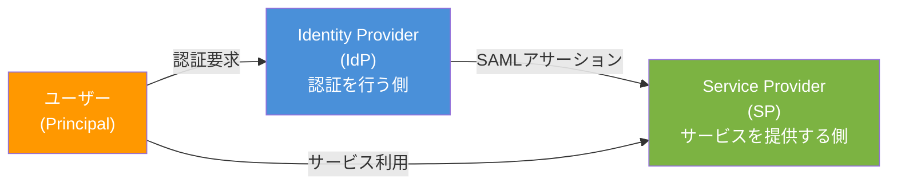
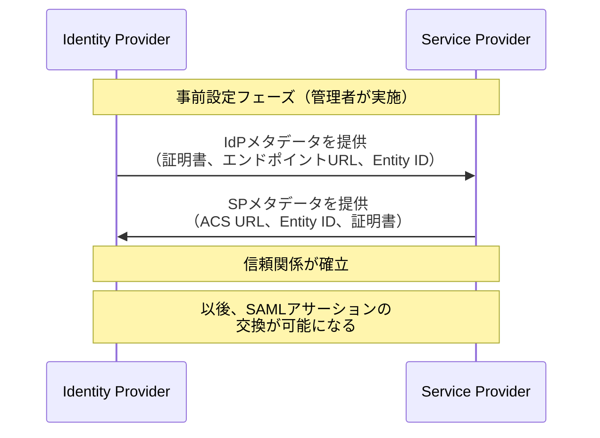
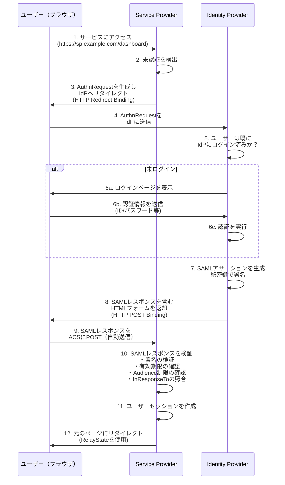
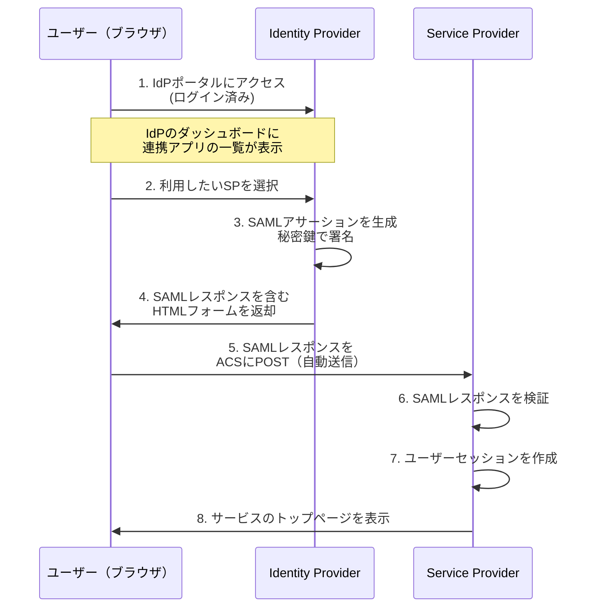
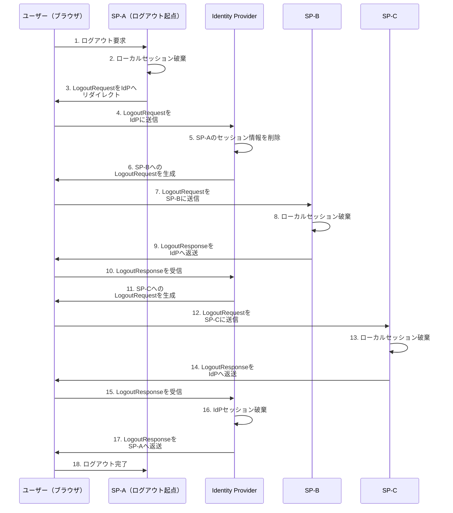
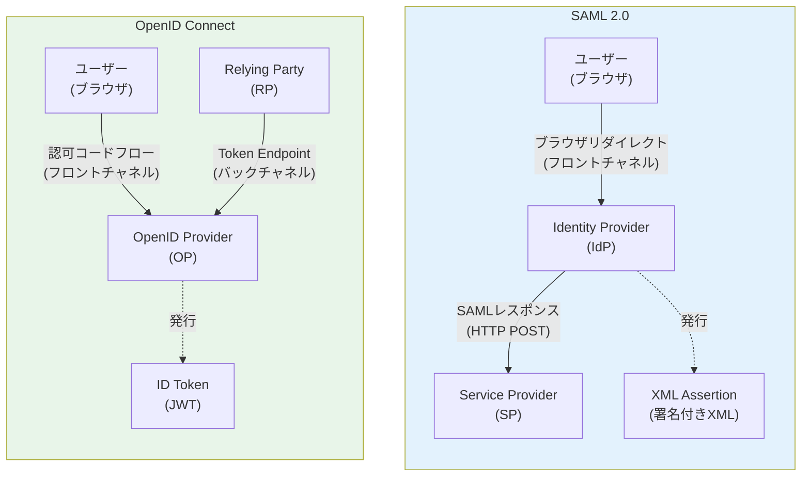

# SAML（Security Assertion Markup Language）— エンタープライズSSOの基盤技術

## 1. 背景と動機

### 1.1 エンタープライズにおける認証の課題

企業のIT環境は、かつてのオンプレミス中心の閉じたシステムから、SaaSアプリケーションの普及によって劇的に変化した。2000年代初頭、企業は社内のActive Directoryで従業員のアカウントを一元管理し、社内ネットワーク内のリソースへのアクセスを制御していた。しかし、Salesforce、Google Workspace、Microsoft 365といったクラウドサービスが業務の中核に入り込むにつれ、「従業員はいくつものサービスに対して、それぞれ別々の認証情報でログインしなければならない」という状況が生まれた。

この問題は単なる利便性の課題ではない。

**セキュリティリスクの増大**: サービスごとに異なるパスワードを管理する負担から、従業員はパスワードの使い回しや簡易なパスワードの設定に走りがちになる。パスワードの管理ポイントが増えるほど、漏洩リスクは高まる。

**管理コストの膨張**: 従業員の入社・退社・異動のたびに、すべてのSaaSアプリケーションでアカウントの作成・削除・権限変更を行う必要がある。100以上のSaaSを利用する企業では、これは深刻な運用負担となる。退職した従業員のアカウントが放置されるリスクも無視できない。

**監査の困難**: 「誰が、いつ、どのサービスにアクセスしたか」を横断的に把握することが難しくなる。コンプライアンス要件を満たすための監査証跡の統合が困難になる。

### 1.2 シングルサインオン（SSO）という解決策

これらの課題に対する根本的な解決策が**シングルサインオン（SSO）**である。SSOの概念はシンプルで、「一度の認証で複数のサービスにアクセスできるようにする」というものだ。ユーザーは企業のIDプロバイダー（IdP）で一度ログインすれば、連携するすべてのサービスを追加の認証なしに利用できる。

SSOの実現には、異なるドメイン・異なる組織のシステム間で認証情報を安全に交換するための標準プロトコルが必要である。この要求に応えるために策定されたのが**SAML（Security Assertion Markup Language）**である。

### 1.3 SAMLの誕生と標準化

SAMLは、OASIS（Organization for the Advancement of Structured Information Standards）によって策定されたXMLベースの認証・認可の標準規格である。

- **SAML 1.0**: 2002年に策定。フェデレーション（連合認証）の基本的な概念を定義した
- **SAML 1.1**: 2003年に策定。1.0の改良版で、相互運用性が改善された
- **SAML 2.0**: 2005年にOASIS標準として承認。Liberty AllianceのID-FFやShibbolethの仕様を統合し、現在広く使われているバージョンとなった

SAML 2.0の策定には、Sun Microsystems、IBM、Microsoft、BEA Systems、RSA Securityなど、当時のエンタープライズIT業界の主要プレーヤーが参加した。この規格は、異なるベンダーの製品間で認証情報を相互運用可能な形で交換するという、エンタープライズ環境の切実なニーズから生まれたものである。

以降、本記事では特に断りがない限り、SAML 2.0を指して「SAML」と表記する。

## 2. SAMLのアーキテクチャ

### 2.1 基本コンポーネント

SAMLのアーキテクチャは、三つの主要なアクターで構成される。



**ユーザー（Principal）**: サービスにアクセスしようとする主体。通常はWebブラウザを使用する人間である。

**Identity Provider（IdP）**: ユーザーの認証を担当するシステム。ユーザーの身元を確認し、その結果をSAMLアサーション（後述）として発行する。企業環境では、Active Directory Federation Services（AD FS）、Okta、Azure AD（現 Microsoft Entra ID）、Ping Identityなどが代表的なIdPである。

**Service Provider（SP）**: ユーザーにサービスを提供するアプリケーション。IdPが発行したSAMLアサーションを受け取り、検証した上でユーザーにアクセスを許可する。Salesforce、Google Workspace、AWS Management Consoleなど、SaaSアプリケーションの多くはSPとしてSAML連携に対応している。

### 2.2 信頼関係の構築

SAMLによるSSOが機能するためには、IdPとSPの間に事前の**信頼関係**（Trust Relationship）が確立されている必要がある。この信頼関係は、メタデータの交換によって構築される。



**IdPメタデータ**には以下が含まれる：
- Entity ID（IdPの一意な識別子、通常はURL形式）
- SSOサービスのエンドポイントURL
- Single LogoutサービスのエンドポイントURL
- SAMLアサーションの署名に使用するX.509証明書

**SPメタデータ**には以下が含まれる：
- Entity ID（SPの一意な識別子）
- Assertion Consumer Service（ACS）URL（SAMLレスポンスを受け取るエンドポイント）
- Single LogoutサービスのエンドポイントURL
- AuthnRequestの署名に使用するX.509証明書（任意）

メタデータはXML形式で記述され、多くのIdP/SPはメタデータXMLファイルのインポート/エクスポート機能を備えている。これにより、管理者は手動で各パラメータを設定する必要がなく、メタデータファイルを交換するだけで信頼関係を構築できる。

### 2.3 メタデータXMLの構造

以下はIdPメタデータの簡略化した例である。

```xml
<EntityDescriptor
    entityID="https://idp.example.com/saml/metadata"
    xmlns="urn:oasis:names:tc:SAML:2.0:metadata">

  <IDPSSODescriptor
      protocolSupportEnumeration="urn:oasis:names:tc:SAML:2.0:protocol">

    <KeyDescriptor use="signing">
      <ds:KeyInfo xmlns:ds="http://www.w3.org/2000/09/xmldsig#">
        <ds:X509Data>
          <ds:X509Certificate>
            MIICqDCCAZCgAwIBAgI... (Base64-encoded certificate)
          </ds:X509Certificate>
        </ds:X509Data>
      </ds:KeyInfo>
    </KeyDescriptor>

    <SingleSignOnService
        Binding="urn:oasis:names:tc:SAML:2.0:bindings:HTTP-Redirect"
        Location="https://idp.example.com/saml/sso"/>

    <SingleSignOnService
        Binding="urn:oasis:names:tc:SAML:2.0:bindings:HTTP-POST"
        Location="https://idp.example.com/saml/sso"/>

  </IDPSSODescriptor>
</EntityDescriptor>
```

以下はSPメタデータの簡略化した例である。

```xml
<EntityDescriptor
    entityID="https://sp.example.com/saml/metadata"
    xmlns="urn:oasis:names:tc:SAML:2.0:metadata">

  <SPSSODescriptor
      protocolSupportEnumeration="urn:oasis:names:tc:SAML:2.0:protocol"
      AuthnRequestsSigned="true"
      WantAssertionsSigned="true">

    <KeyDescriptor use="signing">
      <ds:KeyInfo xmlns:ds="http://www.w3.org/2000/09/xmldsig#">
        <ds:X509Data>
          <ds:X509Certificate>
            MIICqDCCAZCgAwIBAgI... (Base64-encoded certificate)
          </ds:X509Certificate>
        </ds:X509Data>
      </ds:KeyInfo>
    </KeyDescriptor>

    <AssertionConsumerService
        Binding="urn:oasis:names:tc:SAML:2.0:bindings:HTTP-POST"
        Location="https://sp.example.com/saml/acs"
        index="0"
        isDefault="true"/>

  </SPSSODescriptor>
</EntityDescriptor>
```

## 3. SAMLアサーション

### 3.1 アサーションとは

SAMLアサーションは、IdPがSPに対して発行する**XML形式の認証・認可情報**である。「このユーザーは確かに認証された」「このユーザーはこれらの属性を持っている」「このユーザーにはこれらの権限がある」といった主張（アサーション）をXMLで構造化したものだ。

SAMLアサーションには三種類のステートメントが含まれうる。

### 3.2 認証ステートメント（Authentication Statement）

ユーザーがIdPで認証されたという事実を表明する。認証の時刻や認証方法（パスワード、多要素認証など）の情報が含まれる。

```xml
<saml:AuthnStatement
    AuthnInstant="2026-03-01T10:00:00Z"
    SessionIndex="_session_abc123">
  <saml:AuthnContext>
    <saml:AuthnContextClassRef>
      urn:oasis:names:tc:SAML:2.0:ac:classes:PasswordProtectedTransport
    </saml:AuthnContextClassRef>
  </saml:AuthnContext>
</saml:AuthnStatement>
```

`AuthnContextClassRef` は認証の方法を示す。代表的な値は以下の通りである。

| AuthnContextClassRef | 意味 |
|---------------------|------|
| `PasswordProtectedTransport` | TLS上でのパスワード認証 |
| `X509` | X.509証明書による認証 |
| `Kerberos` | Kerberos認証 |
| `MultifactorAuthn` | 多要素認証 |
| `unspecified` | 未指定 |

### 3.3 属性ステートメント（Attribute Statement）

ユーザーに関する属性情報を伝達する。メールアドレス、氏名、所属部署、役職などの情報が含まれる。

```xml
<saml:AttributeStatement>
  <saml:Attribute Name="email"
      NameFormat="urn:oasis:names:tc:SAML:2.0:attrname-format:basic">
    <saml:AttributeValue>user@example.com</saml:AttributeValue>
  </saml:Attribute>
  <saml:Attribute Name="firstName">
    <saml:AttributeValue>Taro</saml:AttributeValue>
  </saml:Attribute>
  <saml:Attribute Name="lastName">
    <saml:AttributeValue>Yamada</saml:AttributeValue>
  </saml:Attribute>
  <saml:Attribute Name="role">
    <saml:AttributeValue>admin</saml:AttributeValue>
  </saml:Attribute>
  <saml:Attribute Name="department">
    <saml:AttributeValue>Engineering</saml:AttributeValue>
  </saml:Attribute>
</saml:AttributeStatement>
```

属性のマッピングはIdPとSPの間で事前に合意しておく必要がある。SPが期待する属性名とIdPが提供する属性名が異なる場合は、IdP側で属性マッピングの設定が必要になる。

### 3.4 認可決定ステートメント（Authorization Decision Statement）

特定のリソースに対するアクセス権限を表明する。実際にはあまり使われない。認可の判断はSP側で行うことが多く、SAMLの主な役割は認証と属性の伝達に限定されることが一般的である。

### 3.5 アサーションの全体構造

以下は、SAMLアサーション全体の構造を簡略化して示したものである。

```xml
<saml:Assertion
    xmlns:saml="urn:oasis:names:tc:SAML:2.0:assertion"
    ID="_assertion_12345"
    Version="2.0"
    IssueInstant="2026-03-01T10:00:05Z">

  <!-- Issuer: who issued this assertion -->
  <saml:Issuer>https://idp.example.com/saml/metadata</saml:Issuer>

  <!-- Digital Signature (XML Signature) -->
  <ds:Signature xmlns:ds="http://www.w3.org/2000/09/xmldsig#">
    <!-- Signature details omitted for brevity -->
  </ds:Signature>

  <!-- Subject: who this assertion is about -->
  <saml:Subject>
    <saml:NameID Format="urn:oasis:names:tc:SAML:1.1:nameid-format:emailAddress">
      user@example.com
    </saml:NameID>
    <saml:SubjectConfirmation Method="urn:oasis:names:tc:SAML:2.0:cm:bearer">
      <saml:SubjectConfirmationData
          InResponseTo="_authnreq_67890"
          Recipient="https://sp.example.com/saml/acs"
          NotOnOrAfter="2026-03-01T10:05:00Z"/>
    </saml:SubjectConfirmation>
  </saml:Subject>

  <!-- Conditions: validity constraints -->
  <saml:Conditions
      NotBefore="2026-03-01T10:00:00Z"
      NotOnOrAfter="2026-03-01T10:05:00Z">
    <saml:AudienceRestriction>
      <saml:Audience>https://sp.example.com/saml/metadata</saml:Audience>
    </saml:AudienceRestriction>
  </saml:Conditions>

  <!-- Authentication Statement -->
  <saml:AuthnStatement
      AuthnInstant="2026-03-01T10:00:00Z"
      SessionIndex="_session_abc123">
    <saml:AuthnContext>
      <saml:AuthnContextClassRef>
        urn:oasis:names:tc:SAML:2.0:ac:classes:PasswordProtectedTransport
      </saml:AuthnContextClassRef>
    </saml:AuthnContext>
  </saml:AuthnStatement>

  <!-- Attribute Statement -->
  <saml:AttributeStatement>
    <saml:Attribute Name="email">
      <saml:AttributeValue>user@example.com</saml:AttributeValue>
    </saml:Attribute>
    <saml:Attribute Name="role">
      <saml:AttributeValue>admin</saml:AttributeValue>
    </saml:Attribute>
  </saml:AttributeStatement>

</saml:Assertion>
```

アサーションの中で特に重要な要素を整理する。

| 要素 | 役割 |
|------|------|
| `Issuer` | アサーションの発行者（IdPのEntity ID） |
| `Signature` | XML署名。アサーションの改ざん防止と発行者の真正性を保証 |
| `Subject` | アサーションの対象者（ユーザー）の識別情報 |
| `SubjectConfirmation` | アサーションの受け渡し方法と有効条件。`bearer`は「このアサーションを提示した者が正当な対象者である」という意味 |
| `Conditions` | アサーションの有効期間と対象SP（AudienceRestriction） |
| `AuthnStatement` | 認証の事実と方法 |
| `AttributeStatement` | ユーザーの属性情報 |

## 4. SAMLバインディング

### 4.1 バインディングとは

SAMLバインディングは、SAMLメッセージ（AuthnRequestやSAML Response）を具体的な通信プロトコル上でどのように伝送するかを定義する仕様である。SAMLのメッセージ自体はXML文書であり、そのXML文書をHTTPリクエスト/レスポンスにどのように埋め込んで送信するかが、バインディングによって規定される。

SAML 2.0では複数のバインディングが定義されているが、実際に広く使われているのは主に二つである。

### 4.2 HTTP Redirectバインディング

HTTP Redirectバインディングでは、SAMLメッセージをURLのクエリパラメータとして送信する。メッセージはDeflate圧縮→Base64エンコード→URLエンコードの順に処理される。

```
https://idp.example.com/saml/sso?SAMLRequest=fZJNT4Qw...&RelayState=token123&SigAlg=...&Signature=...
```

**特徴**:
- HTTP 302リダイレクトを使用してブラウザを転送する
- URLの長さ制限（一般に2048文字程度）があるため、大きなメッセージには不向き
- 主にAuthnRequest（認証要求）の送信に使用される
- SAMLレスポンス（アサーションを含む）は通常サイズが大きいため、このバインディングでは送信しない

**処理フロー**:

```
1. SP generates AuthnRequest (XML)
2. Deflate compress the XML
3. Base64 encode the compressed data
4. URL encode the Base64 string
5. Attach as SAMLRequest query parameter
6. Browser is redirected via HTTP 302
```

### 4.3 HTTP POSTバインディング

HTTP POSTバインディングでは、SAMLメッセージをHTMLフォームの隠しフィールドとしてPOSTで送信する。メッセージはBase64エンコードのみ行い、Deflate圧縮は不要である。

```html
<html>
<body onload="document.forms[0].submit()">
  <form method="POST" action="https://sp.example.com/saml/acs">
    <input type="hidden" name="SAMLResponse" value="PHNhbWxwOl..." />
    <input type="hidden" name="RelayState" value="token123" />
    <noscript>
      <input type="submit" value="Submit" />
    </noscript>
  </form>
</body>
</html>
```

**特徴**:
- HTMLフォームのPOSTを使用するため、メッセージサイズの制限が緩い
- SAMLレスポンス（アサーションを含む大きなメッセージ）の送信に適している
- JavaScriptによる自動送信（`onload`でフォームを自動submit）が一般的
- ユーザーから見ると、一瞬空白ページが表示された後にSPに遷移する

### 4.4 その他のバインディング

| バインディング | 概要 | 使用頻度 |
|--------------|------|---------|
| SOAP | SOAPメッセージとして送信。バックチャネル通信に使用 | 低（Artifact Resolutionなど特定の場面） |
| Artifact | 参照（Artifact）のみをブラウザ経由で送り、実際のメッセージはバックチャネルで取得 | 低（セキュリティ要件が高い場面） |
| URI | URIを通じてアサーションを取得 | ほとんど使われない |

### 4.5 RelayState

`RelayState` は、SSO フロー全体を通じて維持される不透明な値である。典型的には、ユーザーが最初にアクセスしようとしたSP上のリソースのURLがRelayStateに格納される。SSO完了後、SPはRelayStateの値を参照して、ユーザーを元々アクセスしようとしていたページにリダイレクトする。

```
ユーザーが https://sp.example.com/dashboard にアクセス
  ↓ 未認証のためIdPにリダイレクト（RelayState = "/dashboard"）
  ↓ IdPで認証
  ↓ SPのACSにSAMLレスポンスとRelayState送信
  ↓ SP認証完了後、RelayStateの値（/dashboard）にリダイレクト
```

## 5. SSOフロー

### 5.1 SP-Initiated SSO

最も一般的なSSOフローは**SP-Initiated SSO**（SP起点のSSO）である。ユーザーがまずSPにアクセスし、SPがIdPに認証を委任する流れだ。



このフローの重要な点をいくつか補足する。

**ステップ3-4**: SP → IdPへのAuthnRequest送信にはHTTP Redirectバインディングが使われることが多い。AuthnRequestは比較的小さなXMLメッセージであるため、URLクエリパラメータに収まる。

**ステップ5-6**: IdPに既にログイン済みであれば（IdPのセッションCookieが有効であれば）、ログインページの表示はスキップされる。これがSSOの「一度のログインで複数のサービスにアクセスできる」体験を実現する仕組みである。

**ステップ8-9**: IdP → SPへのSAMLレスポンス送信にはHTTP POSTバインディングが使われる。SAMLレスポンスはアサーションを含むため比較的大きく、HTML formの自動submitで送信される。

**ステップ10**: SPはIdPの公開鍵（メタデータ交換時に取得済み）を用いてSAMLレスポンスの署名を検証する。この検証に失敗した場合、レスポンスは拒否される。

### 5.2 IdP-Initiated SSO

**IdP-Initiated SSO**（IdP起点のSSO）は、ユーザーがIdPのポータルページから直接SPにアクセスするフローである。



IdP-Initiated SSOの特徴は、AuthnRequestが存在しないことである。IdPはSPからの認証要求を受けずに、自発的にSAMLアサーションを発行する。

このフローには**セキュリティ上の懸念**がある。AuthnRequestがないため、`InResponseTo`属性による要求と応答の紐づけができない。これは、攻撃者がSAMLレスポンスを傍受して再利用する**リプレイ攻撃**のリスクを高める。そのため、SP-Initiated SSOの方がセキュリティ的に推奨される。ただし、企業のIdPポータル（例: Okta Dashboard、Azure AD My Apps）からアプリケーションを起動するユースケースではIdP-Initiated SSOが一般的に使われている。

### 5.3 AuthnRequest の構造

SP-Initiated SSOでSPが生成するAuthnRequestの例を示す。

```xml
<samlp:AuthnRequest
    xmlns:samlp="urn:oasis:names:tc:SAML:2.0:protocol"
    xmlns:saml="urn:oasis:names:tc:SAML:2.0:assertion"
    ID="_authnreq_67890"
    Version="2.0"
    IssueInstant="2026-03-01T09:59:55Z"
    Destination="https://idp.example.com/saml/sso"
    AssertionConsumerServiceURL="https://sp.example.com/saml/acs"
    ProtocolBinding="urn:oasis:names:tc:SAML:2.0:bindings:HTTP-POST">

  <saml:Issuer>https://sp.example.com/saml/metadata</saml:Issuer>

  <samlp:NameIDPolicy
      Format="urn:oasis:names:tc:SAML:1.1:nameid-format:emailAddress"
      AllowCreate="true"/>

</samlp:AuthnRequest>
```

| 要素/属性 | 説明 |
|-----------|------|
| `ID` | リクエストの一意な識別子。SAMLレスポンスの`InResponseTo`と照合される |
| `IssueInstant` | リクエストの発行時刻 |
| `Destination` | IdPのSSOエンドポイントURL |
| `AssertionConsumerServiceURL` | SAMLレスポンスの送信先（SPのACS URL） |
| `ProtocolBinding` | SAMLレスポンスの送信に使用するバインディング |
| `Issuer` | リクエストの発行者（SPのEntity ID） |
| `NameIDPolicy` | IdPに要求するNameIDの形式 |

## 6. Single Logout（SLO）

### 6.1 SLOの必要性

SSOでは一度のログインで複数のSPにアクセスできるが、ログアウトも同様に統合する必要がある。ユーザーがあるSPからログアウトした場合、他のすべてのSPからもログアウトされるべきである。これを実現するのが**Single Logout（SLO）**プロトコルである。

SLOがなければ、ユーザーがSP-Aからログアウトしても、SP-BやSP-Cのセッションは残り続け、セキュリティ上の懸念が生じる。特に共用端末からのアクセスでは、この問題は深刻である。

### 6.2 SLOのフロー



### 6.3 SLOの実装上の課題

SLOはSSOに比べて実装が複雑であり、多くの現実的な問題を抱えている。

**信頼性の問題**: SLOフローはブラウザのリダイレクトチェーンに依存するため、途中でブラウザが閉じられたり、ネットワークエラーが発生したりすると、一部のSPのセッションが残ってしまう。すべてのSPのログアウトが完了する保証がない。

**タイムアウトの問題**: 連携するSPが多い場合、各SPへのLogoutRequest/LogoutResponseの往復に時間がかかり、タイムアウトが発生する可能性がある。

**SP側の対応不足**: すべてのSPがSLOをサポートしているわけではない。SLOに対応していないSPのセッションは残り続ける。

**バックチャネルSLO**: フロントチャネル（ブラウザリダイレクト）ではなく、IdPから各SPにバックチャネル（サーバー間直接通信）でLogoutRequestを送信する方式もある。信頼性は高いが、IdPがすべてのSPに直接通信できる必要があり、ネットワーク構成に制約が生じる。

これらの課題から、実務ではSLOの完全な実装を諦め、以下のような代替アプローチを取ることが多い。

- SPのセッション有効期限を短く設定する
- ユーザーに対して「すべてのブラウザウィンドウを閉じてください」と案内する
- IdPのセッションのみを破棄し、各SPのセッションは自然消滅を待つ

## 7. XML署名とセキュリティ

### 7.1 XML署名の基本

SAMLアサーションの完全性と真正性は、**XML Signature（XMLデジタル署名）**によって保証される。IdPは秘密鍵でアサーションに署名し、SPはIdPの公開鍵（メタデータから取得）で署名を検証する。

XML署名はW3Cで標準化された仕様であり、XML文書の一部または全体に対してデジタル署名を施す仕組みを提供する。SAMLでは主にEnveloped Signature（包含署名）が使用される。これは、署名自体が署名対象のXML要素の子要素として埋め込まれる形式である。

```xml
<saml:Assertion ID="_assertion_12345" ...>
  <saml:Issuer>https://idp.example.com</saml:Issuer>

  <!-- Enveloped Signature: the signature is inside the signed element -->
  <ds:Signature xmlns:ds="http://www.w3.org/2000/09/xmldsig#">
    <ds:SignedInfo>
      <ds:CanonicalizationMethod
          Algorithm="http://www.w3.org/2001/10/xml-exc-c14n#"/>
      <ds:SignatureMethod
          Algorithm="http://www.w3.org/2001/04/xmldsig-more#rsa-sha256"/>
      <ds:Reference URI="#_assertion_12345">
        <ds:Transforms>
          <ds:Transform
              Algorithm="http://www.w3.org/2000/09/xmldsig#enveloped-signature"/>
          <ds:Transform
              Algorithm="http://www.w3.org/2001/10/xml-exc-c14n#"/>
        </ds:Transforms>
        <ds:DigestMethod
            Algorithm="http://www.w3.org/2001/04/xmlenc#sha256"/>
        <ds:DigestValue>dGhpcyBpcyBhIGRpZ2VzdCB2YWx1ZQ==</ds:DigestValue>
      </ds:Reference>
    </ds:SignedInfo>
    <ds:SignatureValue>
      c2lnbmF0dXJlIHZhbHVlIGhlcmU=...
    </ds:SignatureValue>
  </ds:Signature>

  <saml:Subject>...</saml:Subject>
  <saml:Conditions>...</saml:Conditions>
  <saml:AuthnStatement>...</saml:AuthnStatement>
</saml:Assertion>
```

XML署名の検証プロセスは以下の通りである。

1. `Reference`の`URI`属性で指定された要素（ここではAssertion全体）を取得する
2. `Transforms`で指定された変換を適用する（Enveloped Signature変換で署名要素自体を除外し、正規化を行う）
3. 変換後のXMLのダイジェスト値を計算し、`DigestValue`と一致するか検証する
4. `SignedInfo`要素を正規化し、`SignatureValue`が正しいか公開鍵で検証する

### 7.2 XML Signature Wrapping（XSW）攻撃

SAMLの実装において最も深刻な脆弱性の一つが**XML Signature Wrapping（XSW）攻撃**である。この攻撃は、XML署名の仕組みとSAMLライブラリのXML解析方法のギャップを悪用する。

**攻撃の原理**: XML署名は、`Reference`要素の`URI`属性で指定されたID値を持つ要素に対して署名を行う。一方、SPがアサーションの内容（ユーザー情報など）を読み取る際には、XML文書内のAssertion要素をXPathやDOM操作で探索する。XSW攻撃は、この**「署名が検証される要素」と「アプリケーションが実際に処理する要素」が異なりうる**という点を突く。

```
正常なSAMLレスポンス:
<Response>
  <Assertion ID="original">   ← 署名対象 かつ アプリが処理する要素
    <Subject>user@example.com</Subject>
    <Signature>
      <Reference URI="#original"/>
    </Signature>
  </Assertion>
</Response>

XSW攻撃を受けたSAMLレスポンス:
<Response>
  <Assertion ID="evil">   ← アプリがこちらを処理してしまう
    <Subject>admin@example.com</Subject>
    <!-- No signature here -->
  </Assertion>
  <Assertion ID="original">   ← 署名はこちらを検証 (valid)
    <Subject>user@example.com</Subject>
    <Signature>
      <Reference URI="#original"/>
    </Signature>
  </Assertion>
</Response>
```

攻撃者は以下の手順でXSW攻撃を実行する。

1. 正規のSAMLレスポンスを傍受する
2. 署名済みのAssertion要素を文書内の別の位置に移動する
3. 元の位置に、攻撃者が操作した偽のAssertion要素を挿入する（IDは異なる値に変更）
4. 改変したSAMLレスポンスをSPに送信する

署名検証ライブラリは`URI="#original"`を参照して正規のAssertion（署名は有効）を検証し、「署名は正しい」と判断する。しかし、アプリケーションロジックはXML文書の最初のAssertion要素（攻撃者が挿入した偽物）を処理してしまう。結果として、攻撃者は任意のユーザーになりすますことが可能になる。

### 7.3 XSW攻撃の変種

XSW攻撃にはいくつかの変種が知られている。

```
XSW1: Response直下にコピーを挿入
<Response>
  <evil:Assertion>...</evil:Assertion>     ← 偽物
  <Assertion ID="original">               ← 署名は有効
    <Signature>...</Signature>
  </Assertion>
</Response>

XSW2: Signatureの後にコピーを挿入
<Response>
  <Assertion ID="original">
    <Signature>
      ...
      <evil:Assertion>...</evil:Assertion> ← 偽物をSignature内に
    </Signature>
  </Assertion>
</Response>

XSW3: Assertion前にラッパー要素を挿入
<Response>
  <Wrapper>
    <Assertion ID="original">             ← 署名済みの原本を移動
      <Signature>...</Signature>
    </Assertion>
  </Wrapper>
  <evil:Assertion>...</evil:Assertion>     ← 偽物
</Response>
```

### 7.4 XSW攻撃への対策

XSW攻撃を防ぐためには、以下の対策が必要である。

**1. 署名検証とデータ取得の一貫性を保証する**: 署名が検証されたAssertion要素と、アプリケーションが処理するAssertion要素が**同一のXMLノード**であることを確認する。IDの照合だけでなく、DOM上の参照が同一であることを検証する。

**2. Response構造の厳密な検証**: SAMLレスポンスのXML構造が想定通りであることを検証する。予期しない要素や重複するAssertion要素が存在しないことを確認する。

**3. スキーマ検証**: SAMLレスポンスをSAML 2.0のXMLスキーマに対して検証する。スキーマに適合しない構造を持つレスポンスを拒否する。

**4. 十分にテストされたライブラリの使用**: SAMLの実装は自前で行わず、XSW攻撃への対策が施された成熟したライブラリを使用する。

歴史的に、主要なSAMLライブラリの多くがXSW攻撃に対して脆弱であった時期がある。2012年には、複数の主要なSAML実装（SimpleSAMLphp、OneLogin、OpenSAMLなど）においてXSW脆弱性が発見・報告されている。現在では主要なライブラリは対策済みであるが、カスタム実装やメンテナンスが滞っている古いライブラリには引き続き注意が必要である。

### 7.5 その他のセキュリティ考慮事項

**リプレイ攻撃**: SAMLレスポンスを傍受し、再送信する攻撃。対策として、`InResponseTo`の照合（SP-Initiated SSOの場合）、アサーションIDの重複チェック（一度使用されたアサーションIDを記録し、再利用を拒否）、アサーションの有効期間（`NotOnOrAfter`）の厳格な検証が必要である。

**中間者攻撃（MITM）**: SAMLメッセージが平文で送受信されると、傍受や改ざんのリスクがある。対策として、すべての通信をTLS（HTTPS）で暗号化することが必須である。また、SAMLアサーションをXML Encryption（暗号化）で保護することで、IdPとSPの間で中継するブラウザからも内容を秘匿できる。

**アサーションの暗号化**: SAMLアサーションは署名だけでなく、暗号化することも可能である。暗号化により、アサーションの内容がブラウザの開発者ツールなどから閲覧されることを防ぐ。SPの公開鍵でアサーションを暗号化し、SPの秘密鍵でのみ復号できるようにする。

**Destination属性の検証**: SAMLレスポンスの`Destination`属性がSPのACS URLと一致することを必ず検証する。これにより、別のSP宛のSAMLレスポンスが不正に受理されることを防ぐ。

## 8. SAMLレスポンスの検証チェックリスト

SPがSAMLレスポンスを受け取った際に実行すべき検証を整理する。

```
[レスポンスレベル]
□ Destination属性がSPのACS URLと一致するか
□ StatusがSuccessであるか
□ InResponseToが送信したAuthnRequestのIDと一致するか（SP-Initiated SSOの場合）
□ レスポンスの署名が有効か（署名されている場合）

[アサーションレベル]
□ アサーションの署名が有効か（IdPの公開鍵で検証）
□ IssuerがIdPのEntity IDと一致するか
□ Conditions.NotBeforeとNotOnOrAfterが現在時刻の範囲内か
□ AudienceRestrictionにSPのEntity IDが含まれるか
□ SubjectConfirmationData.Recipientが SPのACS URLと一致するか
□ SubjectConfirmationData.NotOnOrAfterが現在時刻より未来か
□ SubjectConfirmationData.InResponseToが一致するか

[XSW攻撃対策]
□ 署名が検証されたAssertion要素とアプリが処理するAssertion要素が同一か
□ レスポンス内に予期しない重複Assertion要素がないか

[リプレイ攻撃対策]
□ アサーションIDが過去に使用されたものでないか
□ （必要に応じて）アサーションIDをキャッシュに記録しているか
```

## 9. SAMLとOpenID Connect（OIDC）の比較

### 9.1 技術的な違い

SAMLとOIDCは、どちらもフェデレーション認証（異なるドメイン間での認証情報の伝達）を実現する標準プロトコルであるが、その設計思想と技術的基盤は大きく異なる。

| 項目 | SAML 2.0 | OpenID Connect |
|------|---------|----------------|
| 策定時期 | 2005年 | 2014年 |
| データ形式 | XML | JSON |
| トークン形式 | XMLベースのアサーション | JWT（JSON Web Token） |
| トランスポート | HTTP Redirect / HTTP POST | HTTP（REST API） |
| 基盤プロトコル | 独自定義 | OAuth 2.0上に構築 |
| メタデータ | XML形式 | JSON形式（Discovery） |
| メッセージサイズ | 大きい（XML冗長性） | 小さい（JSON簡潔性） |
| モバイル対応 | 困難 | 容易 |
| 実装の複雑さ | 高い | 比較的低い |
| 主な利用環境 | エンタープライズ | Web/モバイル/API |

### 9.2 アーキテクチャの違い



SAMLではSAMLアサーション（XML文書）がブラウザを経由してフロントチャネルでSPに渡される。一方、OIDCの認可コードフローでは、認可コードのみがブラウザを経由し、IDトークン（JWT）はRP（Relying Party）からOPへのバックチャネル通信で取得される。このバックチャネル通信により、トークンがブラウザに露出しないという利点がある。

### 9.3 それぞれの強み

**SAMLが優位な領域**:

- **エンタープライズ環境**: 企業のIT基盤はSAMLを前提に構築されていることが多い。Active Directory Federation Services（AD FS）、Shibbolethなど、エンタープライズ向けIdPの多くはSAMLを主要プロトコルとしてサポートしている
- **既存資産との互換性**: 2005年から普及しているため、レガシーなエンタープライズアプリケーションのSAML対応は進んでいる。OIDCへの移行はコストがかかる場合がある
- **属性の豊富な伝達**: SAMLの属性ステートメントは柔軟であり、任意の属性を構造化して伝達できる。OIDCでもUserInfoエンドポイントで属性を取得できるが、SAMLの方がアサーション内に直接含める形で自然に扱える
- **学術・研究機関のフェデレーション**: Shibbolethをベースとした学術フェデレーション（学認/GakuNin、InCommonなど）はSAMLが標準である

**OIDCが優位な領域**:

- **Web/モバイルアプリケーション**: JSONベースのOIDCはRESTful APIとの親和性が高く、モバイルアプリやSPAとの統合が容易である。SAMLのXMLベースのフローはモバイル環境では扱いにくい
- **開発者体験**: OIDCの方が仕様がシンプルで理解しやすく、ライブラリも充実している。SAMLはXML処理の複雑さが開発負担を増やす
- **APIアクセスとの統合**: OIDCはOAuth 2.0の上に構築されているため、認証（IDトークン）とAPI認可（アクセストークン）をシームレスに統合できる。SAMLにはAPI認可の仕組みが組み込まれていない
- **ソーシャルログイン**: Google、Facebook、GitHubなどのソーシャルログインプロバイダーはOIDC/OAuthを採用しており、SAMLをサポートしていないことが多い

### 9.4 共存の現実

実際の企業環境では、SAMLとOIDCは共存している。エンタープライズIdP（Okta、Azure AD、Ping Identityなど）は、SAMLとOIDCの両方をサポートしている。管理者は連携先のアプリケーションに応じてプロトコルを使い分ける。

```
典型的な企業環境:

Azure AD / Okta (IdP)
  ├── SAML連携 ─── Salesforce
  ├── SAML連携 ─── ServiceNow
  ├── SAML連携 ─── 社内レガシーアプリ
  ├── OIDC連携 ─── Slack
  ├── OIDC連携 ─── 自社開発Webアプリ
  └── OIDC連携 ─── 自社開発モバイルアプリ
```

新規のアプリケーション開発では、特別な理由がない限りOIDCを選択するのが現在のトレンドである。ただし、エンタープライズ市場向けのSaaS製品を開発する場合は、SAML対応は事実上必須である。多くの企業のIT部門はSAMLベースのSSOを標準としており、SAML対応していないSaaSは導入候補から外れることがある。

## 10. 実世界での採用と実装

### 10.1 主要なIdP製品

| IdP | 特徴 |
|-----|------|
| **Microsoft Entra ID（旧 Azure AD）** | Microsoft 365との深い統合。企業ユーザーのデファクトスタンダード。SAML/OIDCの両方をサポート |
| **Okta** | クラウドネイティブなIDaaS。7,000以上の事前統合アプリケーション。高いカスタマイズ性 |
| **AD FS（Active Directory Federation Services）** | オンプレミスのActive DirectoryをSAML IdPとして公開。レガシー環境で依然として多く利用されている |
| **Ping Identity** | 大企業向け。高度なポリシー管理と多様なプロトコルサポート |
| **Keycloak** | Red Hat提供のオープンソースIdP。自社運用でIdPを構築する場合の有力な選択肢 |
| **Shibboleth IdP** | 学術・研究機関向け。学術フェデレーションの標準的なIdP実装 |

### 10.2 Active DirectoryとSAMLの関係

多くの企業では、Active Directory（AD）が従業員のアカウント情報の基盤（ディレクトリサービス）として使用されている。ADはLDAPプロトコルでアカウント情報を提供するが、SAML自体は直接話さない。AD FSまたはAzure ADが「ADの認証情報をSAMLアサーションに変換するブリッジ」として機能する。

```
+------------------+     LDAP      +---------+     SAML      +--------+
| Active Directory | <-----------> | AD FS / |  <--------->  | SaaS   |
| (ディレクトリ)    |  認証・属性取得  | Azure AD|  アサーション  | (SP)   |
+------------------+               | (IdP)   |               +--------+
                                   +---------+
```

この構成により、企業は以下を実現できる。

- **統一されたアカウント管理**: ADでのアカウント作成・削除が、SAML連携するすべてのSaaSに反映される（SCIMなどのプロビジョニングプロトコルと組み合わせることで完全自動化も可能）
- **既存のパスワードポリシーの適用**: ADで設定したパスワードの複雑さ要件、有効期限、ロックアウトポリシーがSSOでのログインにも適用される
- **多要素認証の統合**: IdP（Azure AD/AD FS）レベルで多要素認証を要求すれば、連携するすべてのSaaSへのアクセスに多要素認証が適用される
- **条件付きアクセス**: Azure ADのConditional Accessポリシーにより、「社外ネットワークからのアクセスには多要素認証を要求」「コンプライアンス違反のデバイスからのアクセスをブロック」といったきめ細かな制御が可能

### 10.3 SAML実装ライブラリ

SAMLの自前実装は推奨されない。XMLの処理、XML署名の検証、XSW攻撃への対策など、正しく実装するには深い知識が必要であり、セキュリティ上の落とし穴が多い。以下の成熟したライブラリの使用を推奨する。

| 言語/環境 | ライブラリ | 備考 |
|-----------|----------|------|
| Java | OpenSAML, Spring Security SAML | OpenSAMLはShibbolethプロジェクトの基盤。Spring SecurityはSP側の統合が容易 |
| Python | python3-saml (OneLogin), pysaml2 | python3-samlはSP側の実装に特化。pysaml2はIdP/SP両方に対応 |
| Ruby | ruby-saml (OneLogin) | Ruby on Railsとの統合が良好。OmniAuth SAMLストラテジーも利用可能 |
| Node.js | passport-saml, saml2-js | passport-samlはPassport.jsのストラテジーとして動作 |
| .NET | Sustainsys.Saml2, ITfoxtec Identity SAML 2.0 | ASP.NET Core対応 |
| PHP | SimpleSAMLphp, php-saml (OneLogin) | SimpleSAMLphpはIdP/SP両方の機能を持つ。教育機関での利用が多い |
| Go | crewjam/saml | SP側の実装に特化 |

### 10.4 SAML導入時の実務的な考慮事項

**証明書の有効期限管理**: SAMLで使用するX.509証明書には有効期限がある。証明書の期限切れはSSO障害に直結するため、有効期限の監視と更新計画が重要である。証明書のローテーション時には、IdPとSPの両方のメタデータを更新する必要がある。

**クロックスキュー**: SAMLアサーションの有効期間検証は時刻に依存する。IdPとSPのサーバー間で時刻がずれていると、有効なアサーションが拒否される可能性がある。NTPによる時刻同期を確実に行い、検証時にはある程度の許容範囲（数分程度のskew）を設けることが推奨される。

**属性マッピング**: IdPが提供する属性名とSPが期待する属性名が一致しない場合、属性マッピングの設定が必要である。例えば、IdPが `http://schemas.xmlsoap.org/ws/2005/05/identity/claims/emailaddress` という属性名でメールアドレスを送信するが、SPは `email` という属性名を期待する、というケースは頻繁に発生する。

**テストとデバッグ**: SAMLのトラブルシューティングでは、ブラウザの開発者ツールでHTTPリクエスト/レスポンスを確認し、SAMLメッセージをBase64デコードしてXMLの内容を調査することが基本となる。SAML-tracer（ブラウザ拡張機能）のようなツールが非常に有用である。

## 11. SAMLの課題と将来

### 11.1 SAMLの構造的な課題

**XMLの複雑さ**: SAMLはXMLに基づくため、メッセージのサイズが大きく、パースのコストが高い。XML署名の処理は特に複雑であり、XSW攻撃のような脆弱性の温床となっている。JSONベースのOIDCと比較すると、実装の負担は明らかに大きい。

**モバイルとの相性**: SAMLのフローはWebブラウザのリダイレクトとフォームPOSTに依存している。ネイティブモバイルアプリケーションではWebViewを使用する必要があり、ユーザー体験が低下する。OIDCのPKCEフローのような、ネイティブアプリに最適化されたフローがSAMLには存在しない。

**APIとの非統合**: SAMLは人間がブラウザを通じてサービスにアクセスするシナリオに特化している。マシン間通信やAPI認可のための仕組みは備えておらず、OAuth 2.0/OIDCが持つスコープやアクセストークンの概念がない。

**仕様の更新停滞**: SAML 2.0は2005年の策定以降、メジャーアップデートが行われていない。OAuth 2.0/OIDCが活発にエコシステムを拡張している（PKCE、DPoP、RAR、CIBAなど）のに対し、SAMLの仕様は事実上凍結状態である。

### 11.2 SAMLの今後

SAMLが近い将来に消滅することは考えにくい。エンタープライズ環境での普及度は非常に高く、数千のSaaSアプリケーションがSAML連携に対応している。既存のインフラの移行コストを考えると、SAMLは長期間にわたって使い続けられるだろう。

ただし、新規のプロトコル選択においては、OIDCが第一選択となるケースが増えている。特にモバイルアプリやSPA、マイクロサービス環境ではOIDCの優位性が明確である。

今後の方向性としては以下が考えられる。

- **共存の継続**: エンタープライズIdPがSAMLとOIDCの両方をサポートし続ける。管理者はアプリケーションごとに適切なプロトコルを選択する
- **OIDCへの漸進的移行**: 新規アプリケーションはOIDCで実装し、レガシーアプリケーションのSAML対応は維持する。長期的にはOIDCに一本化される方向
- **SAMLブリッジ**: SAMLしか対応していないレガシーアプリケーションに対して、IdP側でSAML→OIDC変換のブリッジを提供する構成が増える

## 12. まとめ

SAMLは、エンタープライズ環境におけるフェデレーション認証（連合認証）とシングルサインオンの事実上の標準規格である。2005年の策定から20年以上が経過した現在でも、企業のIT基盤において中核的な役割を果たしている。

SAMLの本質的な価値は、「異なる組織・異なるドメインのシステム間で、ユーザーの認証情報をXMLベースの標準的な形式で安全に交換する」という点にある。IdPとSPの役割分離、X.509証明書に基づく信頼関係、XML署名によるアサーションの完全性保証——これらの仕組みによって、エンタープライズ環境に求められる高いセキュリティ要件を満たしている。

一方で、XMLの複雑さに起因する実装の難しさ（特にXML Signature Wrapping攻撃への対策）、モバイル環境との非親和性、API認可の非対応など、現代のアプリケーション開発のニーズに合わない側面も存在する。これらの課題を背景に、新規プロジェクトではOIDCが選択されることが増えている。

実務における技術選択の指針として以下を提示する。

- **エンタープライズSaaS製品を開発する場合**: SAML対応は事実上必須。OIDC対応も併せて提供することが望ましい
- **社内のSSO基盤を構築する場合**: OIDCを主軸としつつ、SAML連携も必要な既存アプリケーション向けにSAMLサポートを維持する
- **新規のWebアプリケーション/モバイルアプリ**: OIDCを選択する。SAMLを選ぶ積極的な理由がなければ、OIDCの方がシンプルで実装コストが低い
- **学術・研究機関のフェデレーション**: SAMLが標準（Shibboleth/学認など）であり、当面はSAMLを使い続けることになる

SAMLを正しく理解し、安全に実装するためには、XML署名の仕組み、XSW攻撃のメカニズム、SSOフローの各ステップで行うべき検証を深く理解する必要がある。安易な自前実装を避け、十分にテストされたライブラリを使用し、セキュリティのベストプラクティスに従うことが、堅牢なSAML実装への道である。
