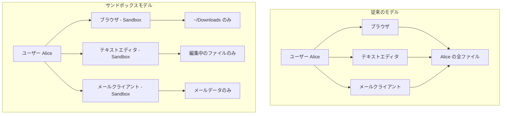
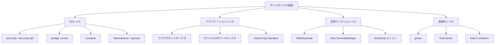
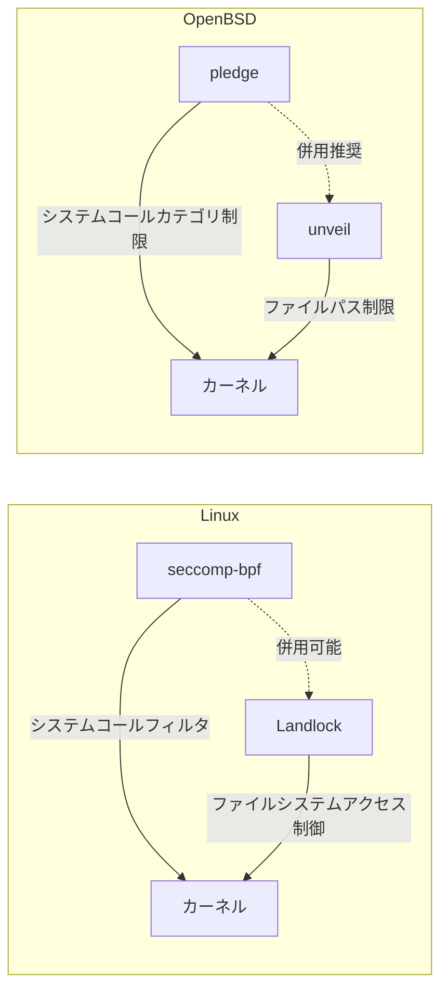
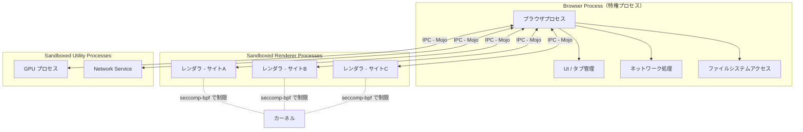
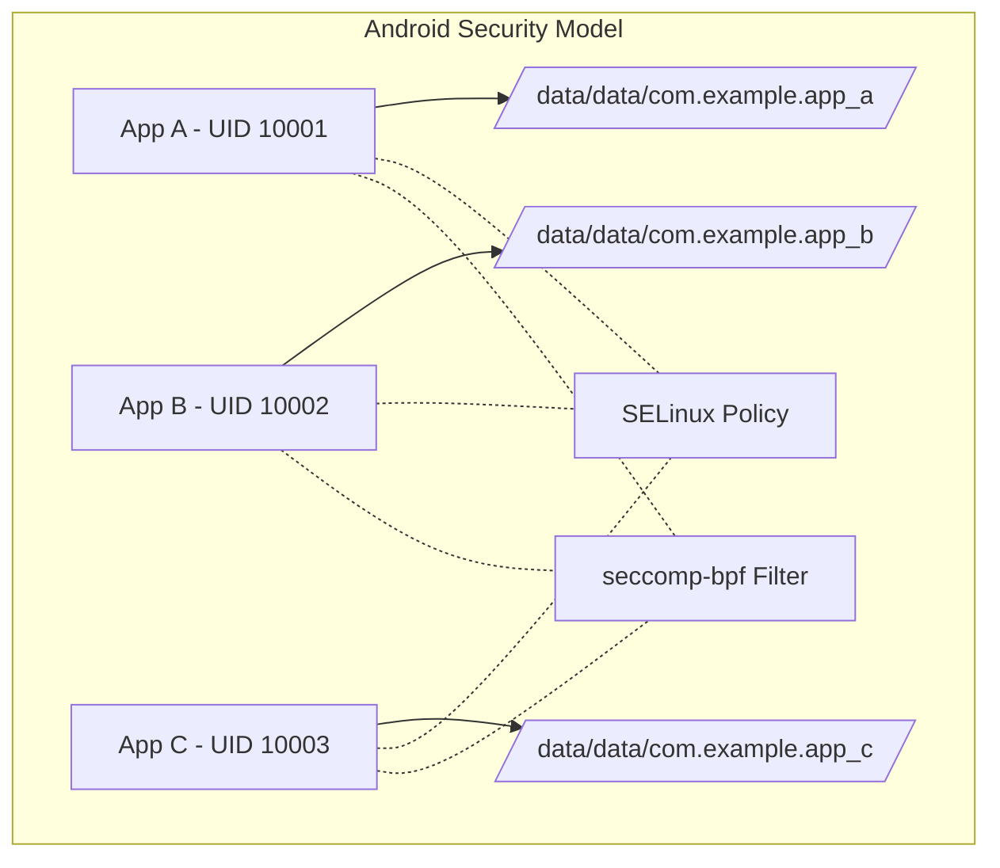
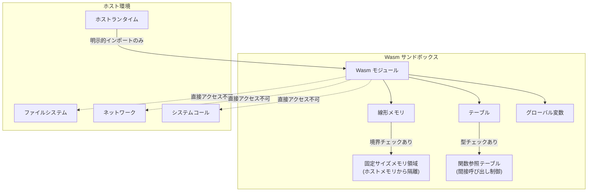
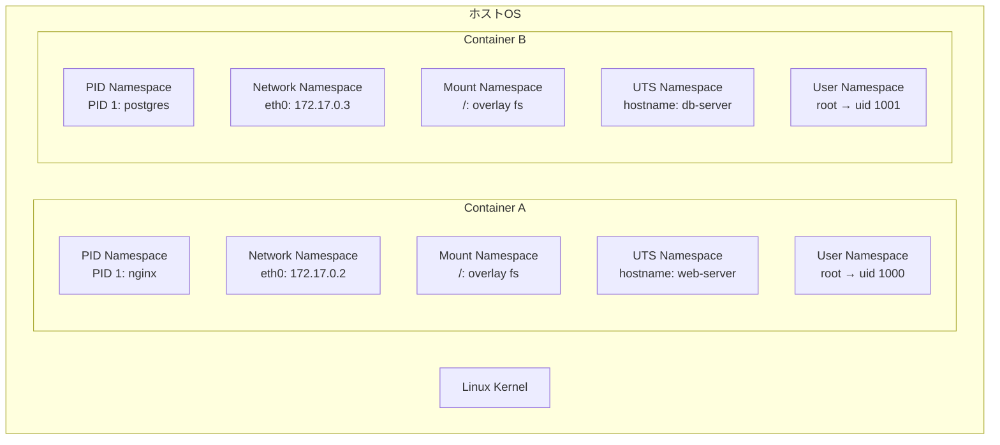
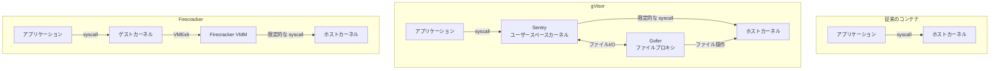
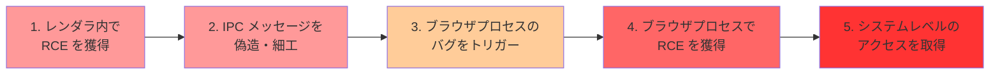
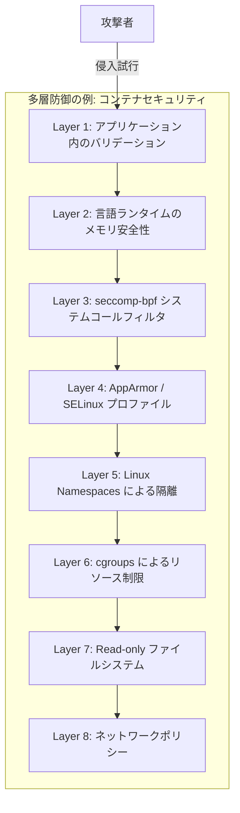

# サンドボックス — プロセス隔離と最小権限の実現技術

## 1. 背景と動機

### 1.1 信頼できないコードを実行するという根本的課題

コンピュータの利用が拡大するにつれ、私たちは日常的に「信頼できないコード」を実行している。Webブラウザでアクセスするサイトに含まれるJavaScript、メールに添付されたファイルを開くアプリケーション、パッケージマネージャからインストールしたサードパーティライブラリ——これらはすべて、完全には信頼できないコードである。もしこれらのコードが制限なくシステムリソースにアクセスできるとしたら、ファイルの窃取、ネットワークを通じた情報流出、他プロセスへの干渉など、あらゆる悪意ある行動が可能になる。

この問題は1960年代のタイムシェアリングシステムの時代から認識されていた。複数ユーザーが一台のコンピュータを共有する環境では、あるユーザーのプログラムが他のユーザーのデータやシステム自体を破壊しないよう、保護機構が必要だった。しかし、当時のハードウェアベースのメモリ保護やユーザー/カーネルモードの分離だけでは、今日の複雑なソフトウェアスタックに対して十分な防御を提供できない。

### 1.2 従来の保護機構の限界

伝統的なオペレーティングシステムのセキュリティモデルは、**ユーザーベースのアクセス制御**に基づいている。UNIXのパーミッションモデルでは、ファイルやプロセスはユーザーID（UID）とグループID（GID）に紐づけられ、読み取り・書き込み・実行の権限が制御される。

```
$ ls -la /etc/shadow
-rw-r----- 1 root shadow 1234 Jan 1 00:00 /etc/shadow
```

しかし、この粗粒度のアクセス制御には根本的な問題がある。あるユーザーとして実行されるすべてのプログラムが、そのユーザーのすべての権限を継承するのである。Webブラウザもテキストエディタもメールクライアントも、同じユーザーとして実行されていれば、同じファイルにアクセスできる。ブラウザが侵害された場合、攻撃者はそのユーザーのホームディレクトリ内のSSH秘密鍵、ブラウザのCookieデータベース、その他すべてのファイルにアクセスできてしまう。

### 1.3 サンドボックスという発想

この問題に対する回答が**サンドボックス（Sandbox）**である。サンドボックスとは、プログラムの実行環境を制限された空間に閉じ込め、その中でのみ動作を許可する技術の総称である。「砂場」の比喩が示すように、子供が砂場の中で自由に遊べるが、砂場の外には出られないという考え方だ。

サンドボックスの核心にあるのは**最小権限の原則（Principle of Least Privilege）**である。これは、プログラムやプロセスに対して、その正常な動作に必要最小限の権限のみを付与するべきだという原則である。1975年にJerome Saltzerと Michael Schroederが提唱したこの原則は、現代のセキュリティ設計の基盤となっている。



## 2. サンドボックスの基本原理

### 2.1 脅威モデルと防御境界

サンドボックスを設計する際、まず明確にすべきは「何から何を守るのか」という脅威モデルである。典型的な脅威モデルは以下のように分類される。

**外部からの攻撃**: 悪意あるWebサイトやファイルを通じて、ブラウザやドキュメントビューアなどのアプリケーションが侵害されるケース。攻撃者は任意コード実行（RCE: Remote Code Execution）の脆弱性を突いて、アプリケーションのプロセス内で任意のコードを実行する。

**内部の不正コード**: サードパーティのライブラリやプラグインが、意図的または非意図的に危険な操作を行うケース。サプライチェーン攻撃やバックドアが含まれたnpmパッケージなどがこれに該当する。

**権限昇格**: 制限された権限で動作しているプロセスが、OSカーネルやランタイムの脆弱性を突いて、より高い権限を取得しようとするケース。

サンドボックスの**防御境界（Security Boundary）**とは、信頼されたコードと信頼されないコードの間に引かれる線である。この境界を越えるすべてのやり取りは、厳密に検証・制御される必要がある。

### 2.2 サンドボックスの実現手法の分類

サンドボックスの実装手法は、大きく以下のように分類できる。



**OSレベルのサンドボックス**はカーネルが提供する機構を利用して、プロセスのシステムコール呼び出しやリソースアクセスを制限する。最も低いレベルで動作するため強力だが、OS固有のAPIに依存する。

**アプリケーションレベルのサンドボックス**は、アプリケーション自身がプロセス分離やIPC（プロセス間通信）を利用して内部的に信頼境界を設ける。ブラウザのマルチプロセスアーキテクチャが代表例である。

**言語ランタイムレベルのサンドボックス**は、仮想マシンやインタプリタが実行環境を抽象化し、危険な操作へのアクセスを制御する。WebAssemblyやかつてのJava SecurityManagerが該当する。

**仮想化レベルのサンドボックス**は、軽量な仮想マシンやユーザースペースカーネルを用いて、ホストカーネルへの攻撃面を最小化する。

## 3. OSレベルのサンドボックス

### 3.1 seccomp と seccomp-bpf（Linux）

**seccomp（Secure Computing Mode）**は、Linuxカーネルが提供するシステムコールフィルタリング機構である。2005年にLinux 2.6.12で最初のバージョンが導入された。

初期のseccompは極めて制限的で、`strict`モードでは `read`、`write`、`_exit`、`sigreturn` の4つのシステムコールしか許可しなかった。これは安全ではあるが、実用的なアプリケーションには制限が厳しすぎた。

2012年にLinux 3.5で導入された**seccomp-bpf**は、BPF（Berkeley Packet Filter）プログラムを使ってシステムコールフィルタリングルールを柔軟に記述できるようにした。これにより、アプリケーションごとに必要なシステムコールのみを許可するきめ細かい制御が可能になった。

```c
#include <linux/seccomp.h>
#include <linux/filter.h>
#include <sys/prctl.h>

// BPF filter: only allow read, write, exit, and sigreturn
struct sock_filter filter[] = {
    // Load the syscall number
    BPF_STMT(BPF_LD | BPF_W | BPF_ABS,
             offsetof(struct seccomp_data, nr)),
    // Allow read (syscall 0)
    BPF_JUMP(BPF_JMP | BPF_JEQ | BPF_K, __NR_read, 0, 1),
    BPF_STMT(BPF_RET | BPF_K, SECCOMP_RET_ALLOW),
    // Allow write (syscall 1)
    BPF_JUMP(BPF_JMP | BPF_JEQ | BPF_K, __NR_write, 0, 1),
    BPF_STMT(BPF_RET | BPF_K, SECCOMP_RET_ALLOW),
    // Allow exit_group
    BPF_JUMP(BPF_JMP | BPF_JEQ | BPF_K, __NR_exit_group, 0, 1),
    BPF_STMT(BPF_RET | BPF_K, SECCOMP_RET_ALLOW),
    // Kill the process for any other syscall
    BPF_STMT(BPF_RET | BPF_K, SECCOMP_RET_KILL),
};

struct sock_fprog prog = {
    .len = sizeof(filter) / sizeof(filter[0]),
    .filter = filter,
};

// Apply the filter
prctl(PR_SET_NO_NEW_PRIVS, 1, 0, 0, 0);
prctl(PR_SET_SECCOMP, SECCOMP_MODE_FILTER, &prog);
```

seccomp-bpfの重要な設計上の特徴は以下の通りである。

**不可逆性**: 一度適用されたseccompフィルタは、そのプロセスとその子プロセスに対して永続的に有効であり、解除することはできない。これにより、攻撃者がプロセスを侵害した後にフィルタを無効化することを防ぐ。

**引数の検査**: seccomp-bpfではシステムコール番号だけでなく、引数の値も検査できる。たとえば、`open`システムコールは許可するが、特定のフラグ（`O_WRONLY`など）を含む場合は拒否する、といった制御が可能である。

**アクションの多様性**: フィルタに一致した場合のアクションとして、`SECCOMP_RET_KILL`（プロセス強制終了）、`SECCOMP_RET_ERRNO`（エラーコードを返す）、`SECCOMP_RET_TRAP`（シグナルを送信）、`SECCOMP_RET_LOG`（ログに記録して許可）、`SECCOMP_RET_ALLOW`（許可）などが選択できる。

seccompは、Docker、Chromium、Firefox、systemdなど、多くの重要なソフトウェアで活用されている。Dockerはデフォルトで約300以上あるLinuxシステムコールのうち、約44個を禁止するseccompプロファイルを適用している。

### 3.2 pledge と unveil（OpenBSD）

OpenBSDは、セキュリティを最優先に設計されたOSとして知られている。2015年にOpenBSD 5.9で導入された**pledge**と、2018年にOpenBSD 6.4で導入された**unveil**は、そのシンプルさと実用性において注目に値するサンドボックス機構である。

**pledge**は、プロセスが使用するシステムコールのカテゴリを宣言するための仕組みである。seccomp-bpfのような低レベルのフィルタ記述ではなく、人間が理解しやすい「プロミス（promise）」と呼ばれるカテゴリ名で権限を指定する。

```c
#include <unistd.h>

// This process only needs stdio and read-only file access
if (pledge("stdio rpath", NULL) == -1)
    err(1, "pledge");

// From this point, only stdio operations and
// read-only file operations are allowed.
// Any other syscall will terminate the process with SIGABRT.
```

主なプロミスカテゴリは以下の通りである。

| プロミス | 許可される操作 |
|---------|-------------|
| `stdio` | 標準入出力、メモリ割り当て、基本的なプロセス操作 |
| `rpath` | ファイルの読み取り |
| `wpath` | ファイルの書き込み |
| `cpath` | ファイルの作成・削除 |
| `inet` | IPv4/IPv6ソケット操作 |
| `unix` | UNIXドメインソケット操作 |
| `dns` | DNS名前解決 |
| `proc` | `fork`、`exec`などのプロセス操作 |
| `exec` | `execve`の実行 |

**unveil**は、プロセスがアクセスできるファイルシステムのパスを制限する。pledgeがシステムコールの種類を制限するのに対し、unveilはファイルシステムの可視性を制限する。

```c
#include <unistd.h>

// Only allow read access to /etc and read-write to /tmp
unveil("/etc", "r");
unveil("/tmp", "rwc");
unveil(NULL, NULL);  // Lock the unveil list

// From this point, only /etc (read) and /tmp (read/write/create)
// are accessible. All other paths are invisible.
```

pledgeとunveilの組み合わせにより、OpenBSDでは多くのシステムデーモンやユーティリティが最小権限で動作するようになっている。OpenBSDのベースシステムに含まれる多くのプログラム（`cat`、`cp`、`grep`など）がpledgeを使用しており、侵害された場合の被害を最小限に抑えている。

pledgeの設計思想で特筆すべきは、その**段階的な権限縮小**のアプローチである。プログラムの初期化フェーズでは広い権限を持ち、初期化が完了したら必要最小限の権限に絞り込むことができる。たとえば、設定ファイルの読み込みが完了したら`rpath`を外す、ネットワーク接続が確立したら`inet`を外す、といった運用が可能である。

### 3.3 Landlock（Linux）

**Landlock**は、2021年にLinux 5.13で導入された比較的新しいセキュリティ機構である。従来のLinuxのセキュリティモジュール（SELinux、AppArmorなど）は管理者権限（root）でポリシーを設定する必要があったが、Landlockは非特権プロセスが自分自身のアクセス権限を制限できるという点で画期的である。

Landlockの設計思想はOpenBSDのunveilに似ているが、Linuxのセキュリティモジュールフレームワーク（LSM）上に構築されているため、既存のSELinuxやAppArmorと共存できる。

```c
#include <linux/landlock.h>
#include <sys/syscall.h>

// Create a Landlock ruleset
struct landlock_ruleset_attr ruleset_attr = {
    .handled_access_fs =
        LANDLOCK_ACCESS_FS_READ_FILE |
        LANDLOCK_ACCESS_FS_WRITE_FILE |
        LANDLOCK_ACCESS_FS_EXECUTE,
};

int ruleset_fd = syscall(SYS_landlock_create_ruleset,
                         &ruleset_attr, sizeof(ruleset_attr), 0);

// Add rule: allow read access to /usr
struct landlock_path_beneath_attr path_attr = {
    .allowed_access = LANDLOCK_ACCESS_FS_READ_FILE |
                      LANDLOCK_ACCESS_FS_EXECUTE,
    .parent_fd = open("/usr", O_PATH | O_CLOEXEC),
};
syscall(SYS_landlock_add_rule, ruleset_fd,
        LANDLOCK_RULE_PATH_BENEATH, &path_attr, 0);

// Enforce the ruleset
prctl(PR_SET_NO_NEW_PRIVS, 1, 0, 0, 0);
syscall(SYS_landlock_restrict_self, ruleset_fd, 0);
```

Landlockは段階的に機能が拡充されており、Linux 5.19ではファイルの参照（`LANDLOCK_ACCESS_FS_REFER`）、Linux 6.2ではファイルの切り詰め（`LANDLOCK_ACCESS_FS_TRUNCATE`）の制御が追加された。将来的にはネットワークアクセスの制御も計画されている。

### 3.4 OS レベルサンドボックスの比較



| 特徴 | seccomp-bpf | pledge/unveil | Landlock |
|-----|------------|--------------|---------|
| 対象OS | Linux | OpenBSD | Linux |
| 粒度 | システムコール単位 | カテゴリ単位 / パス単位 | ファイルシステム操作単位 |
| 設定の容易さ | 低い（BPFプログラム） | 高い（文字列指定） | 中程度 |
| 非特権で使用可 | はい | はい | はい |
| 不可逆性 | はい | はい | はい |
| 引数検査 | はい | 限定的 | 対象外（パスベース） |

## 4. アプリケーションレベルのサンドボックス

### 4.1 Chromiumのマルチプロセスアーキテクチャ

Webブラウザは、現代のコンピューティングにおいて最も攻撃されるアプリケーションの一つである。HTML、CSS、JavaScript、画像、動画、PDF、WebAssemblyなど、膨大な種類のコンテンツを解析・実行する必要があり、各パーサやレンダラに脆弱性が存在する可能性がある。

Google Chrome（Chromium）は、2008年のリリース当初からマルチプロセスアーキテクチャを採用し、サンドボックスをセキュリティの中核に据えている。このアーキテクチャの設計は、ブラウザセキュリティの標準を大きく引き上げた。



Chromiumのサンドボックスアーキテクチャの核心は、**レンダラプロセスの隔離**にある。各Webサイト（実際にはサイトオリジン単位）は独立したレンダラプロセスで実行され、このプロセスには以下の制限が課される。

**ファイルシステムへのアクセス禁止**: レンダラプロセスは直接ファイルを読み書きできない。ユーザーがファイルをアップロードする場合、ブラウザプロセスがファイルを開き、ファイルディスクリプタをレンダラプロセスに渡す。

**ネットワークへの直接アクセス禁止**: レンダラプロセスはソケットを直接作成できない。すべてのネットワーク通信はブラウザプロセスのネットワークサービスを経由する。

**新しいプロセスの生成禁止**: レンダラプロセスは`fork`や`exec`を呼び出せない。これにより、サンドボックスからの脱出経路が閉ざされる。

**GPUへの直接アクセス禁止**: GPU操作は専用のGPUプロセスを経由して行われる。GPUドライバの脆弱性はセキュリティ上の懸念が大きいため、レンダラから直接GPUにアクセスすることは許可されない。

Linuxにおける具体的な実装では、以下の技術が組み合わされている。

1. **seccomp-bpf**: システムコールの制限
2. **Namespaces**: PID名前空間やネットワーク名前空間による隔離
3. **chroot / pivot_root**: ファイルシステムの隔離
4. **PR_SET_NO_NEW_PRIVS**: 権限昇格の防止

2019年からChromiumは**Site Isolation**を導入し、異なるオリジンのコンテンツが同一プロセスで実行されることを防いでいる。これはSpectreなどのサイドチャネル攻撃への対策として極めて重要である。同一プロセス内のメモリはサイドチャネル攻撃で読み取られる可能性があるため、機密データを異なるプロセスに配置することで、アーキテクチャレベルでの防御を実現している。

### 4.2 モバイルOSのサンドボックス

モバイルOSは、デスクトップOSと比較してはるかに強力なサンドボックスをデフォルトで採用している。これは、モバイルアプリがApp Storeを通じて配布されるという特性と、ユーザーの個人情報（位置情報、連絡先、写真など）を扱う機会が多いことに起因する。

#### iOS App Sandbox

iOSのサンドボックスは、各アプリケーションを独自のコンテナ内に隔離する。アプリケーションがインストールされると、以下のディレクトリ構造がアプリケーションごとに作成される。

```
/var/mobile/Containers/
├── Bundle/
│   └── Application/
│       └── <UUID>/
│           └── MyApp.app/          # App bundle (read-only)
└── Data/
    └── Application/
        └── <UUID>/
            ├── Documents/          # User-visible documents
            ├── Library/
            │   ├── Caches/         # Cache data
            │   └── Preferences/    # App preferences
            └── tmp/                # Temporary files
```

各アプリケーションは自分のコンテナ内のファイルにのみアクセスでき、他のアプリケーションのコンテナやシステムファイルにはアクセスできない。アプリケーション間でデータを共有するには、App GroupsやURLスキーム、Share Extensionなど、OSが提供する明示的なメカニズムを使用する必要がある。

さらに、iOSでは**Entitlements（エンタイトルメント）**と呼ばれる仕組みにより、アプリケーションが利用できるシステム機能を細かく制御する。カメラ、マイク、位置情報、連絡先、写真ライブラリなどへのアクセスは、それぞれ個別のエンタイトルメントとして宣言され、ユーザーの明示的な許可を必要とする。

iOSのサンドボックスの技術的基盤には、macOSのSandboxプロファイル言語（SBPL: Sandbox Profile Language）から派生したカーネルレベルの強制アクセス制御が使われている。これはmacOSのTrustedBSD由来のMACフレームワーク（Mandatory Access Control）を基盤としている。

#### Androidのサンドボックス

Androidのサンドボックスは、Linuxカーネルのユーザー分離機構を巧みに活用している。各アプリケーションにユニークなLinux UIDが割り当てられ、アプリケーションのデータは他のアプリケーションからアクセスできないようパーミッションが設定される。



Androidのセキュリティモデルは複数のレイヤーから構成されている。

1. **Linuxカーネルのユーザー分離**: 各アプリに固有のUIDを割り当て、ファイルシステムレベルでの隔離を実現
2. **SELinux**: 強制アクセス制御により、プロセスがアクセスできるリソースを厳密に定義
3. **seccomp-bpf**: アプリが使用できるシステムコールを制限（Android 8.0以降）
4. **パーミッションシステム**: カメラ、位置情報などの機密リソースへのアクセスにはユーザーの許可が必要
5. **アプリサンドボックスの強化**: Android 10以降、Scoped Storageにより外部ストレージへのアクセスも制限

## 5. 言語ランタイムレベルのサンドボックス

### 5.1 WebAssembly（Wasm）のサンドボックスモデル

**WebAssembly（Wasm）**は、2017年に主要ブラウザで標準サポートされた、低レベルのバイナリ命令フォーマットである。元々はブラウザでのネイティブ性能に近い実行を目的として設計されたが、その優れたサンドボックス特性から、サーバーサイドやエッジコンピューティングなど、ブラウザ外での利用も急速に拡大している。

Wasmのサンドボックスモデルは、**構造的な安全性**に基づいている。これは、セキュリティが後付けではなく、言語仕様のレベルで組み込まれていることを意味する。



Wasmのサンドボックスを支える主要な特性は以下の通りである。

**線形メモリの隔離**: Wasmモジュールは固定サイズの線形メモリ（配列のような連続したバイト列）にのみアクセスできる。このメモリはホストのアドレス空間から隔離されており、Wasmコードがホストのメモリを読み書きすることは構造的に不可能である。すべてのメモリアクセスは境界チェックが行われ、範囲外アクセスはトラップ（例外）を発生させる。

**制御フローの完全性**: Wasmの制御フロー（分岐、ループ、関数呼び出し）は構造化されており、任意のアドレスへのジャンプは不可能である。関数の間接呼び出しもテーブルを通じて行われ、型チェックが強制される。これにより、ROP（Return-Oriented Programming）のような制御フローハイジャック攻撃を根本的に防ぐ。

**能力ベースのセキュリティ**: Wasmモジュールは、ホスト環境から明示的にインポートされた関数のみを呼び出すことができる。ファイルシステム、ネットワーク、システムクロックなどへのアクセスは、ホストがインポートとして提供しない限り、Wasmモジュールからは利用できない。

**WASI（WebAssembly System Interface）**は、ブラウザ外でのWasm実行に標準的なシステムインターフェースを提供する取り組みである。WASIは能力ベースのセキュリティモデルを採用しており、ファイルディスクリプタへのアクセスを明示的に付与された場合にのみ、対応するファイルシステム操作が可能になる。

```
# wasmtime (WASI runtime) example:
# Only grant access to /tmp directory
$ wasmtime --dir=/tmp myapp.wasm
```

Wasmのサンドボックスモデルが優れているのは、その**デフォルトの安全性**にある。何も指定しなければ、Wasmモジュールはメモリ上で計算を行うことしかできない。外部リソースへのアクセスは、ホストが明示的に許可した場合にのみ可能になる。これは「デフォルトで拒否、明示的に許可」というセキュリティの理想的なモデルそのものである。

### 5.2 Java SecurityManager（非推奨）

Javaは1990年代から実行環境のセキュリティを強く意識して設計された言語である。その中核をなしたのが**SecurityManager**と**アクセスコントローラ**の仕組みであった。

```java
// Custom security policy example (historical)
// policy.file
// grant codeBase "file:/home/user/untrusted/" {
//     permission java.io.FilePermission "/tmp/*", "read,write";
//     permission java.net.SocketPermission "example.com:80", "connect";
// };

// Setting SecurityManager (deprecated since Java 17)
// System.setSecurityManager(new SecurityManager());
```

SecurityManagerは、Javaアプレットの時代に重要な役割を果たした。Webブラウザ内で実行されるJavaアプレットは信頼できないコードであるため、ファイルアクセス、ネットワーク通信、プロセス実行などの権限を厳密に制御する必要があった。

しかし、SecurityManagerにはいくつかの根本的な問題があった。

**パフォーマンスへの影響**: すべてのセキュリティ感応操作でアクセスチェックが行われるため、性能に無視できないオーバーヘッドが生じた。

**設定の複雑さ**: ポリシーファイルの記述が複雑で、正確なポリシーの作成が困難だった。多くの開発者はSecurityManagerを無効にするか、すべてを許可するポリシーを設定していた。

**バイパスの歴史**: Java SecurityManagerは長年にわたって多数のバイパス脆弱性が発見された。これはアプリケーションレベルのサンドボックスに内在する本質的な問題——つまり、同一プロセス内でのセキュリティ境界は、OSレベルのプロセス分離よりも本質的に脆弱である——を示している。

これらの問題から、Java 17（2021年）でSecurityManagerは非推奨（deprecated）となり、将来のバージョンで削除される予定である（JEP 411）。Javaエコシステムでは、アプリケーションレベルのサンドボックスよりも、コンテナ化やOSレベルのサンドボックスによる隔離が推奨されるようになった。

この経験は、サンドボックス設計における重要な教訓を提供している。**同一プロセス内での権限制御は、プロセス分離による権限制御よりも本質的に難しく、脆弱である**ということだ。これは後述するChromiumのマルチプロセスアーキテクチャの設計判断にも影響を与えている。

## 6. コンテナとサンドボックス

### 6.1 Linux Namespacesによる隔離

Linuxコンテナ（Docker、LXCなど）のサンドボックスは、主に**Namespaces**と**cgroups**という二つのカーネル機能に基づいている。

Namespacesは、システムリソースの仮想的な分離を提供する。各Namespaceは、特定のリソースの独立したビューをプロセスに提供する。



Linuxが提供する主要なNamespaceは以下の通りである。

| Namespace | 隔離対象 | 導入バージョン |
|-----------|---------|-------------|
| Mount (mnt) | ファイルシステムのマウントポイント | Linux 2.4.19 (2002) |
| UTS | ホスト名とドメイン名 | Linux 2.6.19 (2006) |
| IPC | System V IPC、POSIX メッセージキュー | Linux 2.6.19 (2006) |
| PID | プロセスID | Linux 2.6.24 (2008) |
| Network (net) | ネットワークデバイス、ポート | Linux 2.6.29 (2009) |
| User | ユーザーID、グループID | Linux 3.8 (2013) |
| Cgroup | cgroupルートディレクトリ | Linux 4.6 (2016) |
| Time | システム時刻 | Linux 5.6 (2020) |

### 6.2 cgroupsによるリソース制限

**cgroups（Control Groups）**は、プロセスグループに対するリソース使用量を制限・計測・隔離する仕組みである。Namespacesがリソースの「見え方」を制御するのに対し、cgroupsはリソースの「使用量」を制御する。

```
# cgroup v2: limit container to 512MB memory and 50% CPU
mkdir /sys/fs/cgroup/my_container
echo "536870912" > /sys/fs/cgroup/my_container/memory.max
echo "50000 100000" > /sys/fs/cgroup/my_container/cpu.max
echo $PID > /sys/fs/cgroup/my_container/cgroup.procs
```

主要なcgroupsコントローラは以下の通りである。

- **cpu**: CPU時間の割り当て制限
- **memory**: メモリ使用量の制限（OOM killerとの統合）
- **blkio / io**: ブロックI/Oの帯域幅制限
- **pids**: 生成可能なプロセス数の制限（fork bomb対策）
- **devices**: デバイスファイルへのアクセス制御

### 6.3 コンテナのセキュリティ境界の実態

ここで強調すべき重要な点がある。**従来のLinuxコンテナ（Docker、LXCなど）は、セキュリティ境界としてはハイパーバイザによる仮想マシン（VM）よりも弱い**ということである。

コンテナとホストはカーネルを共有しているため、カーネルの脆弱性はコンテナの隔離を完全に破壊する可能性がある。実際に、過去にはカーネルの脆弱性を突いたコンテナエスケープが複数報告されている。

```
攻撃面の比較:

VM:     [Guest App] → [Guest Kernel] → [Hypervisor] → [Host Kernel]
                                        ^^^^^^^^^^^
                                        攻撃面は狭い（VMExit のみ）

Container: [App] → [Host Kernel]
                    ^^^^^^^^^^^
                    攻撃面は広い（全システムコール）
```

この問題に対処するため、**コンテナ + サンドボックス**のアプローチが発展してきた。Dockerはデフォルトでseccomp-bpf プロファイルとAppArmorプロファイルを適用し、コンテナ内のプロセスが実行できるシステムコールとアクセスできるリソースを制限している。

### 6.4 gVisor — ユーザースペースカーネルによるサンドボックス

**gVisor**は、Googleが2018年に公開したコンテナランタイムであり、コンテナのセキュリティ問題に対する革新的なアプローチを提供する。gVisorの核心は、Linuxカーネルのシステムコールインターフェースをユーザースペースで再実装する**Sentry**と呼ばれるコンポーネントである。



gVisorのアーキテクチャの要点は以下の通りである。

**Sentry**: Go言語で書かれたユーザースペースカーネルであり、Linuxの主要なシステムコールの大部分を再実装している。アプリケーションのシステムコールはSentryによって処理され、ホストカーネルに直接到達しない。Sentryが実際にホストカーネルに発行するシステムコールは、数十個に限定されている。

**Gofer**: ファイルシステムへのアクセスは、Sentryとは別の独立したプロセス（Gofer）を通じて行われる。GoferはSentryとは異なるseccompプロファイルで動作し、Sentryが侵害されてもファイルシステムへの不正アクセスが困難になるよう設計されている。

**Platform**: アプリケーションのコードを安全に実行するためのプラットフォーム層であり、ptrace（デバッグ用システムコール）またはKVM（ハードウェア仮想化）を利用して実装されている。

gVisorの利点は、VMのような強力な隔離を提供しつつ、コンテナのような軽量な起動と運用を実現することである。ただし、システムコールの再実装には完全な互換性がなく、一部のアプリケーションでは互換性の問題が生じる可能性がある。また、システムコールのインターセプトに起因するオーバーヘッドにより、I/O集約的なワークロードでは性能低下が発生する場合がある。

### 6.5 Firecracker — マイクロVM によるサンドボックス

**Firecracker**は、Amazonが2018年に公開した軽量仮想マシンモニタ（VMM）である。AWS LambdaやAWS Fargateの基盤技術として開発された。

Firecrackerの設計思想は、「仮想マシンのセキュリティとコンテナの速度を両立する」というものである。Firecrackerは以下の特徴を持つ。

**最小限のデバイスモデル**: 従来のVMM（QEMUなど）が多数の仮想デバイスをエミュレートするのに対し、Firecrackerはvirtio-net、virtio-block、シリアルコンソール、最小限のi8042コントローラのみをエミュレートする。デバイスモデルが小さいことは、攻撃面が小さいことを意味する。

**高速起動**: 125ミリ秒以下でmicroVMを起動できる。これにより、リクエストごとにVMを起動する「Function-as-a-Service」のようなユースケースが現実的になる。

**メモリ効率**: 各microVMのオーバーヘッドは約5MBであり、単一ホスト上で数千のmicroVMを同時に実行できる。

**Rust実装**: Firecrackerは全体がRust言語で実装されており、メモリ安全性の脆弱性（バッファオーバーフロー、use-after-freeなど）を言語レベルで防いでいる。

**jailer**: Firecracker自体もseccomp-bpf、cgroups、namespacesによってサンドボックス化される。VMM自体が侵害された場合のリスクも最小化されている。

```
起動時間の比較（概算）:
+------------------+------------------+
| 技術             | 起動時間          |
+------------------+------------------+
| 従来のVM (QEMU)  | 数秒〜数十秒      |
| Firecracker      | ~125ms           |
| Docker コンテナ   | ~数百ms          |
| プロセス          | ~数ms            |
+------------------+------------------+
```

## 7. サンドボックスエスケープ攻撃

### 7.1 サンドボックスエスケープの分類

サンドボックスがいかに堅牢に設計されていても、完全に安全なサンドボックスは存在しない。サンドボックスエスケープ（サンドボックスからの脱出）は、セキュリティ研究者と攻撃者の双方にとって、最も価値の高い攻撃技術の一つである。

サンドボックスエスケープは、主に以下のカテゴリに分類される。

**カーネル脆弱性の悪用**: コンテナのように、サンドボックスとホストがカーネルを共有している場合、カーネルの脆弱性を突くことでサンドボックスから脱出できる。2019年のCVE-2019-5736（runcの脆弱性）や、Dirty COW（CVE-2016-5195）などが代表例である。

**IPC/通信チャネルの悪用**: サンドボックス化されたプロセスと特権プロセスの間のIPC（プロセス間通信）に脆弱性がある場合、メッセージの解析処理を悪用して特権プロセスで任意コードを実行できる。Chromiumのブラウザプロセスとレンダラプロセス間のMojo IPCに対する攻撃がこのカテゴリに当たる。

**論理的な脆弱性**: サンドボックスポリシーの設定ミスや、APIの想定外の使用方法を突く攻撃。たとえば、ファイルシステムのシンボリックリンクを悪用して、許可されていないパスにアクセスするなどが該当する。

**サイドチャネル攻撃**: サンドボックスの境界を直接越えることなく、タイミング情報やキャッシュの状態などの「副作用」を通じて情報を漏洩させる。SpectreやMeltdownがこのカテゴリの代表的な例であり、プロセス分離という防御戦略自体を揺るがした。

### 7.2 実例：Chromium サンドボックスエスケープ

Chromiumのサンドボックスは、セキュリティコンテストPwn2Ownなどで繰り返し攻撃対象となってきた。典型的な攻撃チェーンは以下のようになる。



1. まず、V8（JavaScriptエンジン）やBlinkなどのレンダラ内コンポーネントの脆弱性を悪用して、サンドボックス化されたレンダラプロセス内で任意コード実行を獲得する
2. 次に、レンダラからブラウザプロセスへのIPCメッセージを巧妙に細工する
3. ブラウザプロセスのIPCハンドラに存在するバグを悪用して、ブラウザプロセス内で任意コード実行を獲得する
4. ブラウザプロセスはサンドボックス外で動作しているため、システムリソースへのフルアクセスが可能になる

このような多段階攻撃は非常に高度であり、実行にはレンダラの脆弱性、IPC実装の脆弱性、そしてそれらを組み合わせるエクスプロイト技術が必要である。Googleは、Chromiumのサンドボックスエスケープに対して最大$250,000以上のバグバウンティ報奨金を提供しており、これはサンドボックスの突破がいかに困難であるか（そしていかに重要であるか）を反映している。

### 7.3 コンテナエスケープの実例

コンテナ環境における代表的なエスケープ手法をいくつか紹介する。

**特権コンテナの悪用**: `docker run --privileged` で起動されたコンテナは、ほぼすべてのカーネル機能にアクセスでき、事実上サンドボックスとして機能しない。ホストのデバイスをマウントし、ホストのファイルシステムにアクセスすることが可能である。

**危険なCapabilityの付与**: `CAP_SYS_ADMIN`、`CAP_NET_ADMIN` などの強力なLinux Capabilityが付与されたコンテナは、Namespaceの操作やネットワーク設定の変更が可能になり、エスケープの足がかりとなる。

**ホストパスのマウント**: Dockerソケット（`/var/run/docker.sock`）やホストの`/proc`などがコンテナ内にマウントされている場合、そこからホストの制御を奪うことが可能である。

```
# DANGEROUS: mounting Docker socket into a container
# An attacker inside this container can control the Docker daemon
docker run -v /var/run/docker.sock:/var/run/docker.sock ...

# DANGEROUS: privileged container with host PID namespace
# Essentially no isolation from the host
docker run --privileged --pid=host ...
```

## 8. 多層防御（Defense in Depth）

### 8.1 単一の防御層の限界

ここまで見てきたように、個々のサンドボックス技術にはそれぞれ限界がある。seccompはシステムコールレベルの制御を提供するが、許可されたシステムコール内の脆弱性は防げない。Namespacesはリソースの可視性を制御するが、カーネルの脆弱性には無力である。Wasmの線形メモリは安全だが、ホストが提供するインポート関数の実装に脆弱性があれば問題となる。

このため、現代のセキュリティ設計では**多層防御（Defense in Depth）**の原則が重視される。これは、複数の独立した防御層を重ねることで、一つの層が突破されても他の層が攻撃を阻止するというアプローチである。



### 8.2 現実的なサンドボックス構成の例

実際のプロダクション環境で採用される多層防御のアプローチを、いくつかの具体例で示す。

#### Chromiumの多層防御

Chromiumのレンダラプロセスに適用される防御層は以下の通りである。

1. **V8のCFI（Control Flow Integrity）**: JITコンパイラが生成するコードの制御フローを制限
2. **Site Isolation**: オリジンごとのプロセス分離
3. **seccomp-bpf**: レンダラプロセスのシステムコール制限
4. **Namespaces**: ネットワークとPIDの隔離
5. **Mojoバリデーション**: IPC メッセージの厳密な型検査と値検証

#### AWS Lambdaの多層防御

AWS LambdaはFirecrackerを基盤としつつ、さらに多くの防御層を重ねている。

1. **Firecracker microVM**: ハードウェア仮想化による隔離
2. **jailer**: Firecracker自体のseccomp + namespace制限
3. **最小限のゲストカーネル**: 攻撃面の小さいカスタムカーネル
4. **関数ごとの専用VM**: 同一アカウントの関数も別VMで実行
5. **ネットワーク隔離**: VPCとセキュリティグループによる制御
6. **IAMポリシー**: AWS リソースへのアクセス制御

### 8.3 サンドボックス設計の原則

効果的なサンドボックスを設計するための一般的な原則をまとめる。

**デフォルト拒否（Default Deny）**: すべてのアクセスをデフォルトで拒否し、必要なものだけを明示的に許可する。これはWasmの能力ベースモデルやseccompのホワイトリスト方式に見られるアプローチである。

**最小権限の原則（Principle of Least Privilege）**: プロセスには、正常動作に必要な最小限の権限のみを付与する。時間の経過とともに権限をさらに絞り込む（pledgeの段階的縮小のように）のが理想的である。

**完全な調停（Complete Mediation）**: サンドボックス境界を越えるすべてのアクセスを漏れなくチェックする。チェックの漏れは即座にセキュリティ侵害につながる。

**フェイルセーフ（Fail-Safe Defaults）**: エラーが発生した場合は、安全な方向に倒す。seccompのように、未知のシステムコールはデフォルトで拒否するべきである。

**分離の強度と利便性のトレードオフ**: より強力な隔離は、より高いオーバーヘッド（性能、メモリ、運用コスト）を伴う。gVisor はコンテナよりも安全だが性能オーバーヘッドがある。Firecracker はさらに安全だがVMの管理コストが生じる。ユースケースに応じた適切な隔離レベルの選択が重要である。

## 9. サンドボックス技術の現状と展望

### 9.1 各技術の位置づけ

現在のサンドボックス技術を、隔離の強度と性能オーバーヘッドの観点で整理する。

```
隔離の強度 (高)
    ^
    |  Firecracker / Kata Containers
    |      (ハードウェア仮想化)
    |
    |  gVisor
    |      (ユーザースペースカーネル)
    |
    |  コンテナ + seccomp + SELinux
    |      (カーネル共有 + 多層防御)
    |
    |  通常のコンテナ (Docker)
    |      (Namespace + cgroups)
    |
    |  seccomp / pledge 単体
    |      (システムコールフィルタ)
    |
    |  言語レベル (Wasm)
    |      (ランタイム内の隔離)
    |
    +-----------------------------------> 性能オーバーヘッド (高)
```

### 9.2 今後の展望

サンドボックス技術は、いくつかの方向で進化を続けている。

**ハードウェア支援の拡大**: Intel TDX（Trust Domain Extensions）やAMD SEV（Secure Encrypted Virtualization）などの機密コンピューティング（Confidential Computing）技術は、ハードウェアレベルでのメモリ暗号化と隔離を提供する。これにより、クラウドプロバイダ自身からもデータを保護できる新しい形のサンドボックスが実現しつつある。

**Wasmのサーバーサイド展開**: WASIの成熟とともに、WebAssemblyがサーバーサイドのサンドボックスとして広く利用されるようになることが期待される。Cloudflare Workers、Fastly Compute、Fermyonなどのエッジコンピューティングプラットフォームは、すでにWasmをサンドボックスの基盤として採用している。

**eBPFによるセキュリティ強化**: eBPF（extended BPF）は、Linuxカーネル内でサンドボックス化されたプログラムを安全に実行する技術であり、セキュリティの監視と強制の両面で活用が広がっている。seccompの後継的な位置づけで、より柔軟なセキュリティポリシーの実現が期待される。

**Landlockの機能拡充**: Landlockは新しいLinuxリリースのたびに機能が追加されており、ネットワークアクセスの制御など、より包括的なサンドボックス機構への発展が期待される。非特権プロセスが自分自身を制限できるというLandlockのアプローチは、今後のアプリケーション自己防衛の標準となる可能性がある。

### 9.3 サンドボックスの限界と認識すべきこと

最後に、サンドボックスの限界について正直に述べておく必要がある。

**完全な隔離は存在しない**: どのサンドボックスも、何らかの前提条件に依存しており、その前提が崩れれば隔離も崩壊する。カーネルの脆弱性、ハードウェアのバグ（Spectreなど）、実装のエラーなど、完全に排除することは不可能である。

**攻撃面のシフト**: サンドボックスを導入すると、攻撃面はサンドボックスの境界（IPC、ポリシー設定、ランタイムの実装）にシフトする。新しい防御は新しい攻撃面を生む。

**運用の複雑さ**: 多層防御は強力だが、複雑さも増大する。seccomp、AppArmor、SELinux、Namespaces、cgroupsを同時に正しく設定・運用することは容易ではなく、設定ミスがセキュリティホールとなるリスクがある。

**性能と安全性のトレードオフ**: より強力な隔離は、一般的にオーバーヘッドの増大を伴う。ユースケースに応じた適切なレベルの選択が求められる。

それでもなお、サンドボックスは現代のセキュリティアーキテクチャにおいて不可欠な技術である。「完全に安全なサンドボックスは存在しない」という事実は、サンドボックスが無意味であることを意味しない。むしろ、攻撃のコストを飛躍的に引き上げ、攻撃の成功に必要な脆弱性の数を増やすことで、実質的なセキュリティを大幅に向上させている。サンドボックスは、防御側が持つ最も強力な武器の一つであり続けるだろう。
