# スキーマエボリューション（前方/後方互換, DB/API/メッセージ）

## 1. スキーマエボリューションとは何か

### 1.1 ソフトウェアにおける「スキーマ」の遍在

ソフトウェアシステムにおいて、データには必ず「構造」がある。リレーショナルデータベースのテーブル定義、REST API のレスポンス形式、メッセージキューに流れるイベントのフォーマット、設定ファイルの書式 — これらはすべて**スキーマ**と呼ばれる。スキーマとは、データがどのようなフィールドを持ち、各フィールドがどのような型であり、どのような制約を満たすべきかを定義した契約（contract）である。

しかし、この契約は永遠に不変ではない。ビジネス要件は変化し、新機能が追加され、既存の設計の誤りが修正される。スキーマもまた進化しなければならない。この進化のプロセスを**スキーマエボリューション（Schema Evolution）** と呼ぶ。

スキーマエボリューションが難しいのは、スキーマが**複数のコンポーネント間で共有される契約**だからである。データベーススキーマを変更すれば、それを参照するすべてのアプリケーションに影響がおよぶ。API のレスポンス形式を変えれば、すべてのクライアントが影響を受ける。メッセージのフォーマットを変えれば、プロデューサとコンシューマの双方が対応しなければならない。

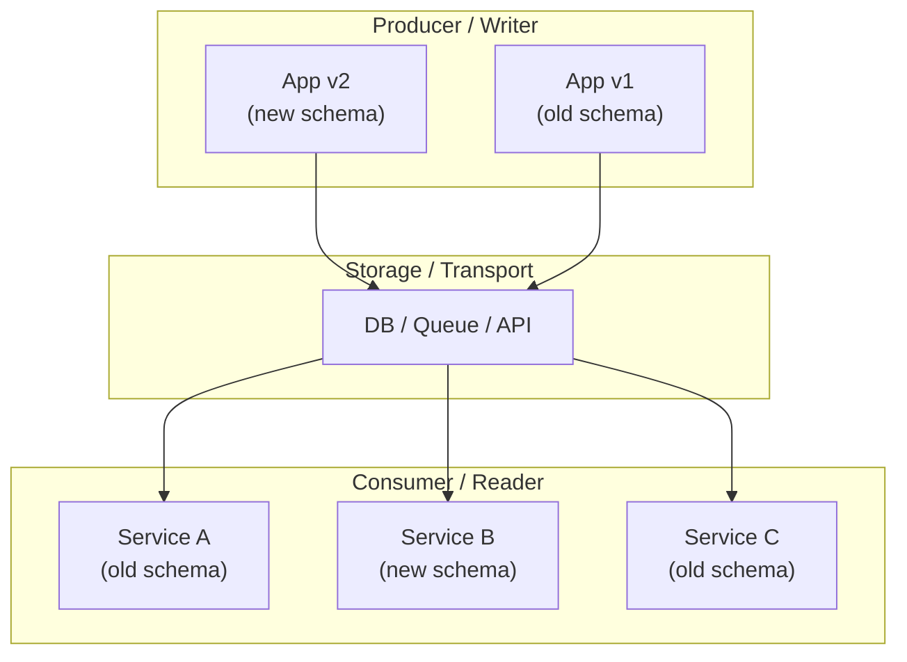

上図のように、データの書き手（Producer）と読み手（Consumer）が複数存在し、かつそれぞれが異なるバージョンのスキーマを使っている状況は、現代のソフトウェアシステムでは日常的である。すべてのコンポーネントを同時にデプロイすることは通常不可能であり、新旧のスキーマが共存する期間が必ず発生する。

### 1.2 なぜスキーマエボリューションが重要か

スキーマエボリューションの重要性は、以下の現実から生じる。

1. **マイクロサービスアーキテクチャの普及**: サービス間通信のスキーマを変更する際、全サービスの同時デプロイは非現実的である
2. **ローリングデプロイ**: 同一サービスの新旧バージョンが同時に稼働する期間がある
3. **データの永続性**: データベースに格納されたデータは、スキーマ変更後も読み取れなければならない
4. **外部クライアントの存在**: パブリック API のクライアントは、提供者がデプロイタイミングを制御できない
5. **イベントの不変性**: イベントソーシングにおいて、過去のイベントは変更できない

これらの制約の下でスキーマを安全に進化させる方法論が、スキーマエボリューションの核心である。

### 1.3 本記事の射程

本記事では、スキーマエボリューションを3つの領域にまたがって横断的に解説する。

| 領域 | 具体例 | 主な関心事 |
|------|--------|-----------|
| **DB スキーマ** | テーブル定義、カラム追加/削除 | ダウンタイム回避、データ整合性 |
| **API スキーマ** | REST/GraphQL/gRPC のインターフェース | クライアント互換性、バージョニング |
| **メッセージスキーマ** | Kafka/RabbitMQ のイベント形式 | シリアライゼーション互換性、スキーマレジストリ |

これら3領域に共通する**互換性**の概念を軸に、各領域での具体的な戦略とベストプラクティスを議論する。

## 2. 互換性の定義：前方互換と後方互換

スキーマエボリューションを理解するうえで、最も基本的かつ重要な概念が**互換性（Compatibility）** である。互換性には大きく分けて2つの方向がある。

### 2.1 後方互換性（Backward Compatibility）

**後方互換性**とは、新しいスキーマで書かれたコード（リーダー）が、古いスキーマで書かれたデータを読めることを意味する。

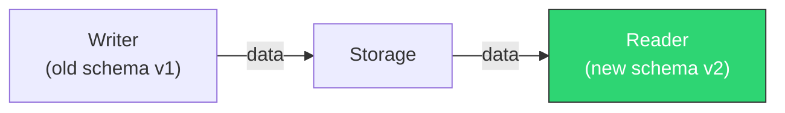

具体例を考えよう。v1のスキーマには `name` と `email` のフィールドがあり、v2で `phone` フィールドが追加されたとする。

```json
// v1 data
{ "name": "Alice", "email": "alice@example.com" }

// v2 reader expects
{ "name": "...", "email": "...", "phone": "..." }
```

v2のリーダーがv1のデータを読む際、`phone` フィールドが存在しないことを許容できれば（例えばデフォルト値を使う）、後方互換性が保たれる。

::: tip
後方互換性は最も頻繁に求められる互換性である。新しいバージョンのソフトウェアが古いデータを読めなければ、アップグレードのたびにデータ移行が必要になり、運用コストが爆発的に増加する。
:::

### 2.2 前方互換性（Forward Compatibility）

**前方互換性**とは、古いスキーマで書かれたコード（リーダー）が、新しいスキーマで書かれたデータを読めることを意味する。

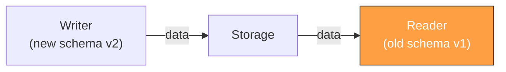

先ほどの例で言えば、v2のライターが `phone` フィールドを含むデータを書き込んだとき、v1のリーダーが未知のフィールド `phone` を無視して正常に動作できれば、前方互換性が保たれる。

```json
// v2 data
{ "name": "Bob", "email": "bob@example.com", "phone": "090-1234-5678" }

// v1 reader can handle this by ignoring unknown fields
```

前方互換性が重要になるのは、**ローリングデプロイ**の最中である。新バージョンのインスタンスが書き込んだデータを、まだ更新されていない旧バージョンのインスタンスが読む可能性がある。

### 2.3 完全互換性（Full Compatibility）

前方互換性と後方互換性の**両方**を同時に満たすことを**完全互換性（Full Compatibility）** と呼ぶ。

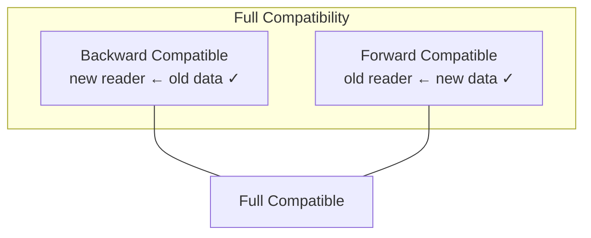

完全互換性を達成するのは簡単ではない。フィールドの追加は後方互換だが、削除は後方互換ではない。逆に、フィールドの削除は（未知フィールドを無視する実装であれば）前方互換だが、追加は前方互換ではない場合がある。以下の表にまとめる。

| 変更操作 | 後方互換 | 前方互換 | 完全互換 |
|---------|---------|---------|---------|
| オプショナルフィールドの追加（デフォルト値あり） | ✓ | ✓（未知フィールド無視時） | ✓ |
| 必須フィールドの追加 | ✗ | ✓（未知フィールド無視時） | ✗ |
| オプショナルフィールドの削除 | ✓（未知フィールド無視時） | ✗ | ✗ |
| フィールド名の変更 | ✗ | ✗ | ✗ |
| フィールドの型変更（非互換） | ✗ | ✗ | ✗ |
| フィールドの型拡張（int32→int64） | ✓ | △（精度損失の可能性） | △ |

### 2.4 互換性のレベルと方向の整理

Confluent Schema Registry が定義する互換性レベルを参考に、互換性の分類を整理する。

| 互換性タイプ | 説明 | ユースケース |
|-------------|------|-------------|
| `BACKWARD` | 新リーダーが旧データを読める | コンシューマ先行デプロイ |
| `FORWARD` | 旧リーダーが新データを読める | プロデューサ先行デプロイ |
| `FULL` | 前方+後方互換 | デプロイ順序が不定 |
| `BACKWARD_TRANSITIVE` | すべての過去バージョンに対して後方互換 | 長期データ保持 |
| `FORWARD_TRANSITIVE` | すべての過去バージョンに対して前方互換 | 長期サポート |
| `FULL_TRANSITIVE` | すべての過去バージョンに対して完全互換 | 最も厳格 |
| `NONE` | 互換性チェックなし | 開発初期段階 |

::: warning
`NONE` は開発初期やプロトタイピング段階でのみ使用すべきである。プロダクション環境で互換性チェックを無効にすることは、ランタイムエラーの原因となり極めて危険である。
:::

### 2.5 Postel の法則と互換性

互換性の議論において頻繁に引用される原則が **Postel の法則（Robustness Principle）** である。

> "Be conservative in what you send, be liberal in what you accept."
> （送信するものは厳格に、受信するものは寛容に）

この原則をスキーマエボリューションに適用すると、以下のように解釈できる。

- **Writer（送信側）**: スキーマに厳密に従ったデータのみを出力する
- **Reader（受信側）**: 未知のフィールドを無視し、欠損フィールドにはデフォルト値を適用する

この原則に忠実であれば、多くの場合で前方互換性と後方互換性の両方が自然に確保される。ただし、Postel の法則には批判もある。受信側が寛容すぎると、不正なデータが伝播してデバッグが困難になるという問題が指摘されている。特に大規模な分散システムでは、バリデーションの緩さが連鎖的な障害を引き起こす可能性がある。

## 3. DB スキーマのエボリューション

データベーススキーマの変更は、スキーマエボリューションの中でも最も慎重な対応が求められる領域である。データベースにはすでに大量のデータが格納されており、スキーマ変更の影響はアプリケーション全体に波及する。

### 3.1 DB スキーマ変更の分類

データベーススキーマの変更操作を互換性の観点から分類する。

| 変更操作 | 後方互換 | 備考 |
|---------|---------|------|
| NULL許容カラムの追加 | ✓ | 既存行はNULLで初期化 |
| デフォルト値付きカラムの追加 | ✓ | 既存行はデフォルト値で初期化 |
| NOT NULLカラムの追加（デフォルト値なし） | ✗ | 既存行の扱いが未定義 |
| カラムの削除 | ✗ | 参照しているクエリが失敗 |
| カラム名の変更 | ✗ | 参照しているクエリが失敗 |
| カラムの型変更（拡張） | △ | DB製品に依存 |
| インデックスの追加 | ✓ | 論理的には互換。パフォーマンスに影響 |
| テーブルの追加 | ✓ | 既存のクエリに影響なし |
| テーブルの削除 | ✗ | 参照しているクエリが失敗 |

### 3.2 Expand-Contract パターン

DB スキーマの変更を安全に行う最も一般的な戦略が **Expand-Contract パターン**（別名: Parallel Change パターン）である。このパターンは、破壊的変更を2つ以上の非破壊的なステップに分解する。

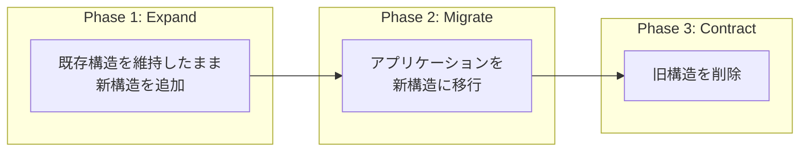

#### 具体例: カラム名の変更

`users` テーブルの `fname` カラムを `first_name` に変更したいとする。直接 `ALTER TABLE users RENAME COLUMN fname TO first_name` とすると、旧バージョンのアプリケーションが即座に壊れる。Expand-Contract パターンでは以下のステップを踏む。

**Phase 1: Expand（拡張）**

```sql
-- Add new column
ALTER TABLE users ADD COLUMN first_name VARCHAR(255);

-- Backfill existing data
UPDATE users SET first_name = fname WHERE first_name IS NULL;

-- Set up trigger to keep columns in sync
CREATE TRIGGER sync_fname_to_first_name
BEFORE INSERT OR UPDATE ON users
FOR EACH ROW
EXECUTE FUNCTION sync_user_name_columns();
```

この時点で、`fname` と `first_name` の両方が存在し、データは同期される。旧バージョンのアプリケーションは `fname` を使い続け、新バージョンは `first_name` を使い始めることができる。

**Phase 2: Migrate（移行）**

すべてのアプリケーションコードを `first_name` を使うように更新し、デプロイする。旧バージョンが完全に退役したことを確認する。

**Phase 3: Contract（収縮）**

```sql
-- Remove trigger
DROP TRIGGER sync_fname_to_first_name ON users;

-- Remove old column
ALTER TABLE users DROP COLUMN fname;
```

::: warning
Contract フェーズの実行は、旧スキーマを参照するアプリケーションが完全にデプロイから除外されたことを確認してから行うこと。ローリングデプロイでは、旧バージョンのインスタンスがまだ稼働中かもしれない。十分なクールダウン期間を設けることが重要である。
:::

### 3.3 マイグレーション戦略の比較

DB スキーマのエボリューションを実現するためのマイグレーション戦略を比較する。

| 戦略 | 概要 | 利点 | 欠点 |
|------|------|------|------|
| **バージョン管理型マイグレーション** | 連番のマイグレーションファイル | シンプル、追跡可能 | ロールバックが複雑 |
| **状態ベースマイグレーション** | 目標スキーマと現在のスキーマの差分を自動算出 | 宣言的、直感的 | 生成されるDDLの制御が困難 |
| **Expand-Contract** | 破壊的変更を複数の非破壊的ステップに分解 | ゼロダウンタイム | 手順が複雑、一時的な冗長性 |
| **Shadow Table** | 新テーブルにデータをコピーし、完了後に切り替え | 大規模テーブル対応 | ディスク使用量2倍、書き込み二重化 |

#### バージョン管理型マイグレーションの例

```
migrations/
├── 001_create_users.sql
├── 002_add_email_to_users.sql
├── 003_create_orders.sql
├── 004_add_phone_to_users.sql
└── 005_rename_fname_to_first_name.sql
```

各マイグレーションファイルにはUP（適用）とDOWN（ロールバック）の両方を記述する。

```sql
-- 004_add_phone_to_users.sql

-- UP
ALTER TABLE users ADD COLUMN phone VARCHAR(20);

-- DOWN
ALTER TABLE users DROP COLUMN phone;
```

::: details バージョン管理型マイグレーションの落とし穴
DOWN マイグレーション（ロールバック）は理論上は美しいが、実際にはほとんど機能しない。カラムを追加して新しいデータが書き込まれた後にカラムを削除すれば、そのデータは失われる。テーブルを分割した後に元に戻すのは、単純なDDLの逆転では不可能である。そのため、多くのチームはDOWNマイグレーションに頼らず、**前方にのみ進む**戦略（forward-only migration）を採用している。問題が発生した場合は、新しいマイグレーションで修正する。
:::

### 3.4 オンラインスキーマ変更ツール

大規模テーブルに対するスキーマ変更を本番環境で安全に実行するために、専用のツールが開発されている。

| ツール | 開発元 | 対象DB | 方式 |
|-------|--------|-------|------|
| `pt-online-schema-change` | Percona | MySQL | トリガーベース |
| `gh-ost` | GitHub | MySQL | バイナリログベース |
| `pg_repack` | コミュニティ | PostgreSQL | トリガーベース |
| `LHM` (Large Hadron Migrator) | Shopify | MySQL | トリガーベース |

これらのツールは基本的に Shadow Table 方式を自動化している。新しいスキーマのテーブルを作成し、既存データを段階的にコピーしつつ、コピー中の変更も反映し、最終的にテーブルをアトミックに切り替える。

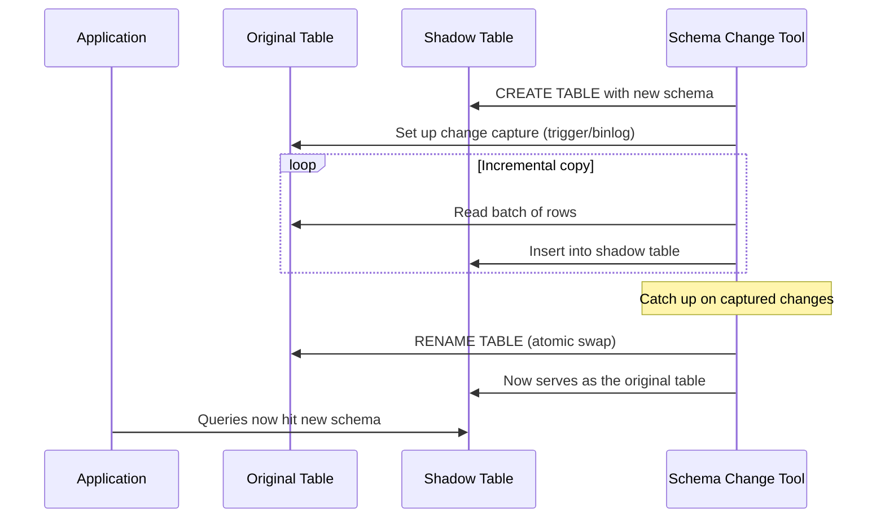

### 3.5 DB スキーマエボリューションにおける互換性の考慮

データベースの場合、互換性の問題は主にアプリケーション層で発生する。データベース自体は新旧のスキーマを同時に持つことはできないため（一つの DDL が適用されるか、されないかの二択である）、互換性を保証するのはアプリケーション側の責任となる。

重要な原則は以下の通りである。

1. **アプリケーションは、スキーマに存在しないカラムへのアクセスを避けるべきである**: `SELECT *` ではなく、必要なカラムを明示的に指定する
2. **カラム追加時はNULL許容またはデフォルト値を設定する**: 旧バージョンのアプリケーションがそのカラムを知らなくても動作するようにする
3. **カラム削除前に、そのカラムへの参照をすべて除去する**: Expand-Contract の Migrate フェーズに相当する
4. **ORM のキャッシュに注意する**: 一部の ORM はスキーマ情報をキャッシュするため、スキーマ変更後にキャッシュが無効化されないと不整合が起きる

## 4. API スキーマのエボリューション

API のスキーマ変更は、外部クライアントへの影響が大きいため、特に慎重な対応が求められる。API スキーマのエボリューションにおいて、互換性の概念がそのまま適用される。

### 4.1 Breaking Change と Non-Breaking Change

API における変更は、互換性を壊すかどうかで分類される。

**Non-Breaking Change（後方互換な変更）**

- オプショナルなフィールドの追加（レスポンス）
- オプショナルなクエリパラメータの追加
- 新しいエンドポイントの追加
- エラーレスポンスへの詳細情報の追加

**Breaking Change（後方互換でない変更）**

- フィールドの削除
- フィールドの型変更
- 必須パラメータの追加
- エンドポイントの削除
- レスポンスコードの意味の変更
- 認証方式の変更

### 4.2 REST API の進化戦略

REST API では、以下の戦略を組み合わせてスキーマを進化させる。

#### フィールドの追加（後方互換）

レスポンスにフィールドを追加するのは、通常は後方互換な変更である。ただし、クライアントが「厳密なスキーマバリデーション（未知のフィールドがあればエラー）」を実装している場合は壊れる。

```json
// Before (v1)
{
  "id": 1,
  "name": "Alice",
  "email": "alice@example.com"
}

// After (v1 - same version, backward compatible)
{
  "id": 1,
  "name": "Alice",
  "email": "alice@example.com",
  "phone": "090-1234-5678",   // new optional field
  "created_at": "2026-01-15"  // new optional field
}
```

#### フィールドの非推奨化と段階的削除

フィールドを削除する場合は、即座に削除するのではなく、段階的に移行する。

```
Phase 1: Deprecation announcement
         - Documentation update
         - Deprecation header in responses

Phase 2: Return deprecated field with warning
         - Sunset header: "Sunset: Sat, 01 Mar 2027 00:00:00 GMT"
         - Deprecation header: "Deprecation: true"

Phase 3: Remove field
         - Only after sunset date
         - Monitor for remaining usage
```

HTTP レスポンスヘッダを活用した非推奨の通知は、RFC 8594（The Sunset HTTP Header Field）で標準化されている。

```http
HTTP/1.1 200 OK
Content-Type: application/json
Deprecation: true
Sunset: Sat, 01 Mar 2027 00:00:00 GMT
Link: <https://api.example.com/docs/migration-guide>; rel="deprecation"
```

#### バージョニング戦略の選択

API のバージョニングには主に3つの方式がある。

| 方式 | 例 | 利点 | 欠点 |
|------|-----|------|------|
| URI パス | `/api/v1/users` | 明示的、キャッシュ可能 | URL 構造の汚染 |
| ヘッダー | `Accept: application/vnd.api.v2+json` | URL が綺麗 | ブラウザテスト困難 |
| クエリパラメータ | `/api/users?version=2` | シンプル | キャッシュ複雑化 |

::: tip
バージョニングは「最後の手段」と捉えるべきである。可能な限り後方互換な変更で API を進化させ、バージョン番号の更新が必要になる頻度を最小化することが、プロバイダとクライアント双方の運用コストを削減する。
:::

### 4.3 GraphQL のスキーマエボリューション

GraphQL は設計思想として、明示的なバージョニングを避ける方針を取っている。GraphQL 公式ドキュメントでは「バージョニングなしにAPIを進化させることが可能」と述べている。

これが可能な理由は、GraphQL の以下の特性による。

1. **クライアントが必要なフィールドのみを要求する**: クライアントが使っていないフィールドの追加・削除は影響しない
2. **`@deprecated` ディレクティブ**: フィールドを非推奨にする標準的な仕組みがある
3. **型システム**: 強い型システムにより、互換性の検証を自動化できる

```graphql
type User {
  id: ID!
  name: String!
  email: String!
  # Deprecated in favor of 'phone_numbers'
  phone: String @deprecated(reason: "Use 'phone_numbers' instead")
  phone_numbers: [PhoneNumber!]
}

type PhoneNumber {
  number: String!
  type: PhoneType!
}
```

ただし、GraphQL でも互換性を壊す変更は存在する。

- **フィールドの型変更**: `phone: String` → `phone: Int` は Breaking Change
- **Nullable から Non-null への変更**: `name: String` → `name: String!` は Breaking Change（null を返していた場合にエラーになる）
- **Non-null から Nullable への変更**: `name: String!` → `name: String` は厳密には Breaking Change（クライアントがnullチェックを想定していない可能性がある）
- **Enum 値の削除**: 既存のクエリが影響を受ける

### 4.4 gRPC / Protocol Buffers のスキーマエボリューション

gRPC は Protocol Buffers（Protobuf）をインターフェース定義言語として使用する。Protobuf のスキーマエボリューションルールは後述の「メッセージスキーマのエボリューション」で詳しく解説するが、API としての gRPC 固有の考慮事項を述べる。

```protobuf
// user_service.proto
syntax = "proto3";

service UserService {
  rpc GetUser(GetUserRequest) returns (GetUserResponse);
  rpc CreateUser(CreateUserRequest) returns (CreateUserResponse);
  // New RPC can be added without breaking existing clients
  rpc ListUsers(ListUsersRequest) returns (ListUsersResponse);
}

message GetUserRequest {
  string user_id = 1;
}

message GetUserResponse {
  string user_id = 1;
  string name = 2;
  string email = 3;
  // New field - backward compatible
  string phone = 4;
}
```

gRPC における互換性の原則は以下の通りである。

- **新しい RPC メソッドの追加**: 後方互換。古いクライアントは新しいメソッドを呼ばないだけ
- **RPC メソッドの削除**: Breaking Change。古いクライアントの呼び出しが失敗する
- **リクエスト/レスポンスメッセージへのフィールド追加**: Protobuf のルールに従えば後方互換
- **RPC のリクエスト/レスポンス型の変更**: Breaking Change

## 5. メッセージスキーマのエボリューション

メッセージキューやイベントストリーミングシステムにおけるスキーマエボリューションは、API とは異なる固有の課題を持つ。

### 5.1 メッセージスキーマの特殊性

メッセージシステムにおけるスキーマエボリューションが特に難しい理由は以下の通りである。

1. **非同期通信**: プロデューサとコンシューマは直接接続されていない。互換性の問題がランタイムエラーとして遅延して顕在化する
2. **多対多の関係**: 1つのトピックに複数のプロデューサと複数のコンシューマが存在しうる
3. **メッセージの永続化**: Kafka のようなシステムでは、メッセージがログに永続化される。古いフォーマットのメッセージが数日〜数週間後に読まれる可能性がある
4. **コンシューマグループの独立性**: 各コンシューマグループは独立したペースでメッセージを消費するため、スキーマ変更の影響範囲の把握が困難

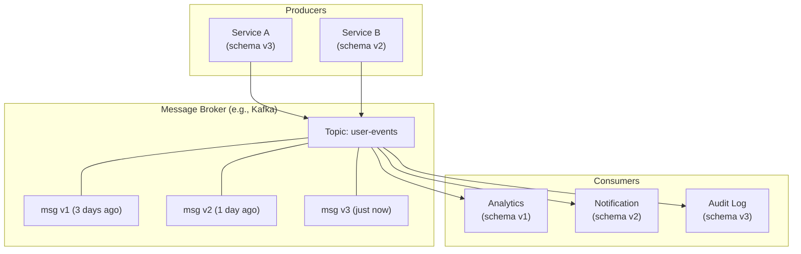

上図のように、トピック内には異なるバージョンのメッセージが混在し、コンシューマもそれぞれ異なるバージョンのスキーマを理解している。この状況で安全にスキーマを進化させるには、シリアライゼーションフォーマットの互換性保証が不可欠である。

### 5.2 シリアライゼーションフォーマットと互換性

メッセージのシリアライゼーションフォーマットの選択は、スキーマエボリューションの容易さに直接影響する。主要なフォーマットを比較する。

| フォーマット | スキーマ | バイナリ | 互換性ルール | 特徴 |
|------------|---------|---------|-------------|------|
| JSON | 暗黙的/任意 | ✗ | なし（自己責任） | 柔軟だが危険 |
| Protocol Buffers | 必須（.proto） | ✓ | フィールド番号ベース | gRPC の標準 |
| Apache Avro | 必須（.avsc） | ✓ | リーダー/ライタースキーマ解決 | Hadoop/Kafka 連携 |
| Apache Thrift | 必須（.thrift） | ✓ | フィールドIDベース | Facebook 由来 |
| MessagePack | なし | ✓ | なし | JSON 互換バイナリ |

### 5.3 Protocol Buffers のスキーマエボリューションルール

Protocol Buffers（proto3）は、フィールド番号を基盤としたスキーマエボリューションの仕組みを提供する。

#### 基本原則

```protobuf
// v1
message UserEvent {
  string user_id = 1;
  string action = 2;
  int64 timestamp = 3;
}

// v2 - backward and forward compatible
message UserEvent {
  string user_id = 1;
  string action = 2;
  int64 timestamp = 3;
  string ip_address = 4;      // new field added
  string user_agent = 5;      // new field added
  // field 6 is reserved for future use
}
```

Protobuf の互換性ルールは以下の通りである。

**やって良いこと（互換性を維持する変更）**

- 新しいフィールドの追加（新しいフィールド番号を使う）
- オプショナルフィールドの削除（ただし、そのフィールド番号を将来再利用しないこと）
- `int32`, `uint32`, `int64`, `uint64`, `bool` 間の変換（ワイヤフォーマットが同じ）
- `string` と `bytes` の変換（UTF-8 バイト列として互換）

**やってはいけないこと（互換性を壊す変更）**

- フィールド番号の変更
- フィールド番号の再利用（削除したフィールドの番号を別のフィールドに割り当てる）
- ワイヤタイプの異なる型への変更（例: `string` → `int32`）

```protobuf
// Reserving deleted fields to prevent accidental reuse
message UserEvent {
  reserved 6, 15, 9 to 11;
  reserved "old_field_name", "deprecated_action";

  string user_id = 1;
  string action = 2;
  int64 timestamp = 3;
}
```

::: danger
フィールド番号の再利用は最も危険なスキーマエボリューションの過ちの一つである。例えば、フィールド番号 4 が `string email` として使われていた時期のデータを、フィールド番号 4 を `int32 age` として再利用した新スキーマで読むと、型の不一致によりデシリアライゼーションが予測不能な動作をする。`reserved` キーワードを使って、削除したフィールド番号が再利用されないことを保証すること。
:::

#### Protobuf におけるデフォルト値

proto3 では、すべてのフィールドにデフォルト値が定義されている。

| 型 | デフォルト値 |
|----|------------|
| `string` | `""` （空文字列） |
| `bytes` | 空バイト列 |
| `bool` | `false` |
| 数値型 | `0` |
| `enum` | 最初の値（番号 0） |
| `message` | 言語依存（通常 null/nil） |

このデフォルト値の仕組みにより、新しいフィールドが追加された場合でも、古いリーダーはそのフィールドを単に無視し、新しいリーダーは欠損フィールドにデフォルト値を適用する。ただし、**デフォルト値と「未設定」を区別できない**という問題がある。例えば `int32 age = 0` が「0歳」なのか「未設定」なのかを判別できない。これに対処するために、`optional` キーワードや wrapper 型（`google.protobuf.Int32Value` など）が用意されている。

### 5.4 Apache Avro のスキーマエボリューション

Avro は Protobuf とは根本的に異なるアプローチでスキーマエボリューションを実現する。Avro の最大の特徴は、**ライタースキーマとリーダースキーマの分離**と、両者の**スキーマ解決（Schema Resolution）** にある。

#### ライタースキーマとリーダースキーマ

Avro では、データを書き込む際に使用するスキーマ（ライタースキーマ）と、データを読み込む際に使用するスキーマ（リーダースキーマ）は異なってよい。デシリアライザは両方のスキーマを参照し、差分を解決する。

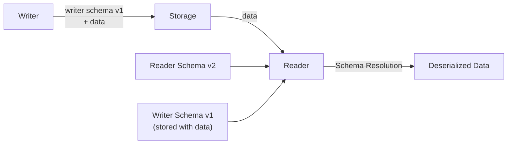

```json
// Writer Schema (v1)
{
  "type": "record",
  "name": "User",
  "fields": [
    {"name": "name", "type": "string"},
    {"name": "email", "type": "string"}
  ]
}

// Reader Schema (v2)
{
  "type": "record",
  "name": "User",
  "fields": [
    {"name": "name", "type": "string"},
    {"name": "email", "type": "string"},
    {"name": "phone", "type": ["null", "string"], "default": null}
  ]
}
```

この場合、v1で書かれたデータをv2のスキーマで読むと、`phone` フィールドにはデフォルト値 `null` が設定される。

#### Avro のスキーマ解決ルール

| 状況 | 解決方法 |
|------|---------|
| リーダーにあってライターにないフィールド | デフォルト値を使用（デフォルト値がなければエラー） |
| ライターにあってリーダーにないフィールド | 無視 |
| 同名フィールドの型が異なる | 型昇格ルールに従う（int→long, float→double など） |
| フィールド名の変更 | `aliases` を使用して旧名を指定 |

```json
// Using aliases for renamed fields
{
  "type": "record",
  "name": "User",
  "fields": [
    {
      "name": "first_name",
      "type": "string",
      "aliases": ["fname", "given_name"]
    }
  ]
}
```

#### Avro と Protobuf のスキーマエボリューション比較

| 観点 | Protobuf | Avro |
|------|----------|------|
| スキーマの同梱 | 不要（フィールド番号で自己記述的） | 必要（ライタースキーマが必須） |
| フィールド識別 | フィールド番号 | フィールド名 |
| デフォルト値 | 型ごとに固定 | スキーマで定義可能 |
| フィールド名変更 | 互換（番号が同じなら） | `aliases` で対応 |
| 動的スキーマ | 困難 | 容易（スキーマを実行時に解決） |
| コード生成 | 一般的（protoc） | 任意（GenericRecord でも可） |

### 5.5 JSON スキーマとメッセージエボリューション

JSON はスキーマレスなフォーマットであるため、スキーマエボリューションの管理は完全に開発者の責任となる。ただし、JSON Schema を使ってバリデーションルールを定義することで、ある程度の互換性管理が可能になる。

```json
{
  "$schema": "https://json-schema.org/draft/2020-12/schema",
  "$id": "https://example.com/schemas/user-event-v2",
  "type": "object",
  "required": ["user_id", "action", "timestamp"],
  "properties": {
    "user_id": { "type": "string" },
    "action": { "type": "string" },
    "timestamp": { "type": "integer" },
    "ip_address": { "type": "string" }
  },
  "additionalProperties": true
}
```

`"additionalProperties": true` は、定義されていないフィールドが存在しても許容することを意味する。これにより、新しいフィールドが追加されても古いバリデーションルールでエラーにならない（前方互換性の確保）。

::: warning
`"additionalProperties": false` を安易に設定すると前方互換性が失われる。新しいフィールドが追加されたデータを旧スキーマでバリデートするとエラーになるためである。JSON Schema を使う場合は、意図的に `additionalProperties` の設定を検討すべきである。
:::

## 6. スキーマレジストリ

### 6.1 スキーマレジストリとは

分散システムにおいて、スキーマの管理と互換性チェックを一元化するための仕組みが**スキーマレジストリ（Schema Registry）** である。スキーマレジストリは、スキーマの保存、バージョン管理、互換性検証を提供する中央集権的なサービスである。

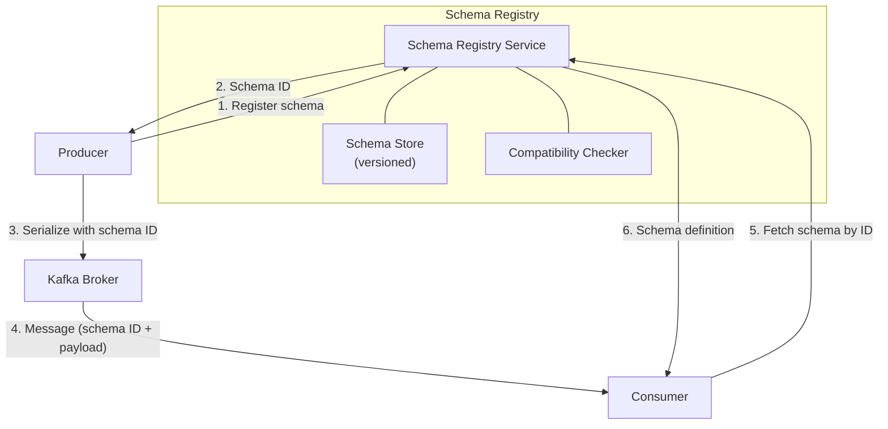

### 6.2 Confluent Schema Registry

Apache Kafka エコシステムにおいて最も広く使われているスキーマレジストリが、Confluent Schema Registry である。Protobuf、Avro、JSON Schema の3つのフォーマットをサポートする。

#### 動作の流れ

1. **プロデューサがスキーマを登録**: 初回メッセージ送信時にスキーマを登録し、スキーマ ID を取得する
2. **互換性チェック**: 新しいスキーマのバージョンを登録する際、設定された互換性レベルに基づいてチェックが実行される
3. **メッセージにスキーマ ID を埋め込む**: メッセージのペイロード先頭にスキーマ ID を付加する
4. **コンシューマがスキーマを取得**: スキーマ ID を使ってスキーマ定義を取得し、デシリアライゼーションに使用する

#### メッセージフォーマット

Confluent Schema Registry を使用する場合、メッセージのバイナリフォーマットは以下の構造になる。

```
+--------+----------+-------------------+
| Magic  | Schema   | Avro/Protobuf/    |
| Byte   | ID       | JSON payload      |
| (0x00) | (4 bytes)| (variable)        |
+--------+----------+-------------------+
```

先頭のマジックバイト（`0x00`）とスキーマ ID（4バイト整数）の合計5バイトがヘッダとして付加される。コンシューマはこのスキーマ ID を使ってスキーマレジストリからスキーマを取得する。

#### 互換性チェックの設定

```bash
# Set compatibility level for a specific subject
curl -X PUT \
  -H "Content-Type: application/vnd.schemaregistry.v1+json" \
  --data '{"compatibility": "BACKWARD"}' \
  http://schema-registry:8081/config/user-events-value

# Test compatibility before registering
curl -X POST \
  -H "Content-Type: application/vnd.schemaregistry.v1+json" \
  --data '{"schema": "{\"type\":\"record\",\"name\":\"User\",\"fields\":[...]}"}' \
  http://schema-registry:8081/compatibility/subjects/user-events-value/versions/latest
```

::: tip
スキーマレジストリの互換性チェックは、CI/CD パイプラインに組み込むべきである。スキーマの変更がプルリクエストの段階で互換性違反を検出できれば、プロダクション環境でのデシリアライゼーションエラーを未然に防げる。
:::

### 6.3 AWS Glue Schema Registry

AWS のマネージドサービスとして提供されるスキーマレジストリ。Confluent Schema Registry と同様の互換性チェック機能を提供し、AWS のエコシステム（Kinesis、MSK など）との統合が容易である。

### 6.4 スキーマレジストリを導入しない場合のリスク

スキーマレジストリなしでメッセージスキーマを管理する場合、以下のリスクが存在する。

1. **暗黙のスキーマ依存**: プロデューサとコンシューマ間のスキーマ契約がコード内に散在し、管理が困難
2. **互換性チェックの欠如**: 非互換な変更がデプロイされるまで検出されない
3. **バージョン追跡の困難**: どのバージョンのスキーマがどのメッセージに使われているかを把握できない
4. **デシリアライゼーションエラーの遅延顕在化**: 問題がコンシューマでの処理時まで発覚しない

## 7. イベントソーシングとスキーマエボリューション

### 7.1 イベントソーシングの特殊性

イベントソーシング（Event Sourcing）は、システムの状態をイベントの列として永続化する設計パターンである。このパターンにおいて、スキーマエボリューションは他のどの領域よりも困難な問題を提示する。理由は明確である — **イベントは不変（immutable）** だからだ。

リレーショナルデータベースであれば、データをマイグレーションして新しいスキーマに適合させることができる。しかしイベントストアでは、過去のイベントを書き換えることは原理的に許されない。5年前に書き込まれたイベントを、現在のスキーマで読み取れなければならない。

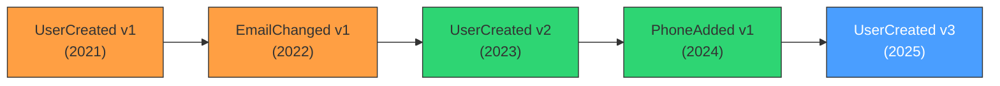

上図のように、イベントストアには異なるバージョンのイベントが混在している。現在のアプリケーションは、これらすべてのバージョンのイベントを理解できなければならない。

### 7.2 イベントのアップキャスティング

この問題に対する最も一般的なアプローチが**アップキャスティング（Upcasting）** である。アップキャスティングとは、古いバージョンのイベントを読み取り時に最新バージョンの形式に変換する手法である。

```
Event Store                   Upcaster Chain              Application
┌──────────────┐    ┌────────────────────────┐    ┌──────────────┐
│ UserCreated  │    │ v1→v2: add email field │    │ UserCreated  │
│ v1           │───>│ v2→v3: add phone field │───>│ v3           │
│ {name: "A"}  │    │                        │    │ {name, email,│
│              │    │                        │    │  phone}      │
└──────────────┘    └────────────────────────┘    └──────────────┘
```

アップキャスターの実装例を示す。

```java
// Upcaster for UserCreated v1 -> v2
public class UserCreatedV1ToV2Upcaster implements Upcaster {
    @Override
    public int fromVersion() { return 1; }

    @Override
    public int toVersion() { return 2; }

    @Override
    public JsonNode upcast(JsonNode event) {
        ObjectNode node = (ObjectNode) event;
        // Add default email field
        if (!node.has("email")) {
            node.put("email", "unknown@example.com");
        }
        return node;
    }
}

// Upcaster chain applies transformations sequentially
public class UpcasterChain {
    private final List<Upcaster> upcasters;

    public JsonNode upcast(JsonNode event, int currentVersion, int targetVersion) {
        JsonNode result = event;
        for (int v = currentVersion; v < targetVersion; v++) {
            Upcaster upcaster = findUpcaster(v, v + 1);
            result = upcaster.upcast(result);
        }
        return result;
    }
}
```

### 7.3 イベントバージョニング戦略

イベントソーシングにおけるスキーマエボリューションの戦略を整理する。

| 戦略 | 概要 | 利点 | 欠点 |
|------|------|------|------|
| **Upcasting** | 読み取り時に変換 | イベントストア変更不要 | 変換チェーンが長くなる |
| **Lazy Migration** | 再生時にイベントを新バージョンで再書き込み | 徐々に最新化 | 不変性の原則に反する |
| **Copy-Transform** | 新ストアにイベントをコピー＆変換 | クリーンなストア | コスト大、ダウンタイムの可能性 |
| **Weak Schema** | 汎用的な構造で格納 | 柔軟 | 型安全性の喪失 |

## 8. スキーマエボリューションのベストプラクティス

### 8.1 設計原則

3つの領域に共通する設計原則を以下にまとめる。

#### 原則 1: 加算的変更を基本とする（Additive Changes Only）

スキーマの進化は、可能な限り「追加」によって行うべきである。フィールドの追加、エンドポイントの追加、テーブルの追加は、一般に安全な操作である。削除や変更は、互換性を壊すリスクが高い。

```
Safe evolution path:
v1: {name, email}
v2: {name, email, phone}          ← field added
v3: {name, email, phone, address}  ← field added

Dangerous evolution path:
v1: {name, email}
v2: {full_name, email_address}     ← fields renamed (breaking!)
```

#### 原則 2: オプショナルフィールドとデフォルト値

新しいフィールドは常にオプショナルとし、適切なデフォルト値を設定する。これにより、古いリーダーは未知のフィールドを無視でき、新しいリーダーは欠損フィールドにデフォルト値を適用できる。

#### 原則 3: 未知のフィールドを許容する

リーダー（コンシューマ）は、スキーマに定義されていないフィールドが存在してもエラーにしないように実装する。これにより、前方互換性が確保される。

#### 原則 4: フィールド識別子を安定させる

Protobuf のフィールド番号、Avro のフィールド名、DB のカラム名は、一度割り当てたら変更しない。変更が必要な場合は、新しいフィールドを追加して段階的に移行する。

#### 原則 5: 削除は段階的に行う

フィールドの削除は、即座に行うのではなく、以下のステップを踏む。

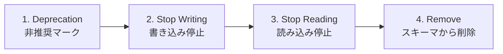

各ステップは独立したデプロイとして実行し、それぞれのステップが安全であることを確認してから次に進む。

### 8.2 組織的プラクティス

#### スキーマレビューの義務化

スキーマの変更は、コードレビューとは別の観点でレビューすべきである。互換性の影響、移行計画、ロールバック手順を含む包括的なレビューが必要である。

```
Schema Change Checklist:
□ Is this change backward compatible?
□ Is this change forward compatible?
□ Have all consumers been identified?
□ Is a migration plan documented?
□ Is a rollback plan documented?
□ Has the change been tested with real data?
□ Has the schema registry compatibility check passed?
```

#### コンシューマ駆動契約テスト（Consumer-Driven Contract Testing）

プロデューサがスキーマを変更する際に、すべてのコンシューマの期待を自動的に検証する手法である。各コンシューマが「自分が必要とするフィールドと型」を契約として定義し、プロデューサの CI パイプラインでこれらの契約が満たされることを検証する。

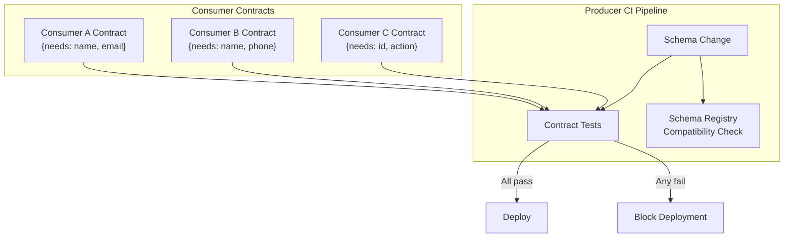

代表的なツールとして Pact がある。Pact はコンシューマ側で期待するインタラクション（契約）を定義し、プロデューサ側でその契約が満たされることを検証する。

### 8.3 アンチパターン

避けるべきスキーマエボリューションのアンチパターンを列挙する。

#### アンチパターン 1: ビッグバンマイグレーション

すべてのスキーマ変更を一度に適用し、すべてのコンポーネントを同時にデプロイしようとするパターン。分散システムにおいて「同時」は幻想であり、必ず中間状態が存在する。

#### アンチパターン 2: 暗黙のスキーマ依存

ドキュメントやスキーマ定義ファイルなしに、プロデューサとコンシューマ間のスキーマ契約を口頭やコードの暗黙的な了解に頼るパターン。チームが大きくなるにつれて管理が破綻する。

#### アンチパターン 3: バージョン番号の乱発

すべての変更に新しいバージョン番号を割り当て、多数のバージョンを並行して維持するパターン。後方互換な変更（フィールド追加など）には新バージョンは不要である。バージョン番号の更新は、Breaking Change を導入せざるを得ない場合の最後の手段とすべきである。

#### アンチパターン 4: <code v-pre>SELECT *</code> への依存

DB スキーマにおいて `SELECT *` をアプリケーションコードで使用するパターン。カラムが追加されるとカラム順序やマッピングが変わり、予期しない不具合を引き起こす可能性がある。

#### アンチパターン 5: フィールド番号/名の再利用

Protobuf でフィールド番号を再利用したり、Avro でフィールド名を別の意味で再利用するパターン。過去のデータとの互換性が完全に壊れる。

### 8.4 互換性テスト自動化

スキーマ互換性のテストは手動で行うべきではない。以下のような自動化を CI/CD パイプラインに組み込む。

```yaml
# Example: GitHub Actions workflow for schema compatibility check
name: Schema Compatibility Check
on:
  pull_request:
    paths:
      - 'schemas/**'

jobs:
  compatibility-check:
    runs-on: ubuntu-latest
    steps:
      - uses: actions/checkout@v4

      - name: Check Protobuf backward compatibility
        # Use buf tool for Protobuf compatibility checking
        run: |
          buf breaking --against '.git#branch=main'

      - name: Check Avro compatibility
        run: |
          # Register schema and check compatibility
          for schema in schemas/avro/*.avsc; do
            subject=$(basename "$schema" .avsc)-value
            curl -f -X POST \
              -H "Content-Type: application/vnd.schemaregistry.v1+json" \
              --data "{\"schema\": $(cat "$schema" | jq -Rs .)}" \
              "http://schema-registry:8081/compatibility/subjects/${subject}/versions/latest"
          done
```

Protobuf に特化したツールとして **buf** がある。buf は Protobuf のリンティング、互換性チェック、コード生成を一元化するツールであり、`buf breaking` コマンドで破壊的変更を検出できる。

```bash
# buf.yaml - configuration for buf
version: v2
breaking:
  use:
    - WIRE_JSON  # Check wire and JSON compatibility
```

## 9. 各領域の比較と統合的な視点

### 9.1 3領域の横断比較

本記事で扱った3つの領域を、スキーマエボリューションの観点から比較する。

| 観点 | DB スキーマ | API スキーマ | メッセージスキーマ |
|------|-----------|------------|----------------|
| **変更の影響範囲** | 同一 DB を参照するすべてのアプリ | すべての API クライアント | すべてのコンシューマ |
| **変更の即時性** | DDL 実行後に即座に反映 | デプロイ後に即座に反映 | プロデューサのデプロイ後 |
| **旧データの存在** | マイグレーション可能 | API レスポンスは即座に変わる | ログに旧フォーマットが残存 |
| **互換性の管理** | アプリケーション側の責任 | API 仕様書+バージョニング | スキーマレジストリ |
| **ロールバックの容易さ** | 困難（データ損失リスク） | 比較的容易（旧バージョン復元） | 困難（消費済みメッセージ） |
| **テスト手法** | マイグレーションテスト | 契約テスト | スキーマ互換性チェック |

### 9.2 エンドツーエンドのスキーマエボリューション

実際のシステムでは、1つの変更が複数の領域にまたがることが多い。例えば「ユーザーに電話番号フィールドを追加する」という要件は、以下のすべてに影響する。

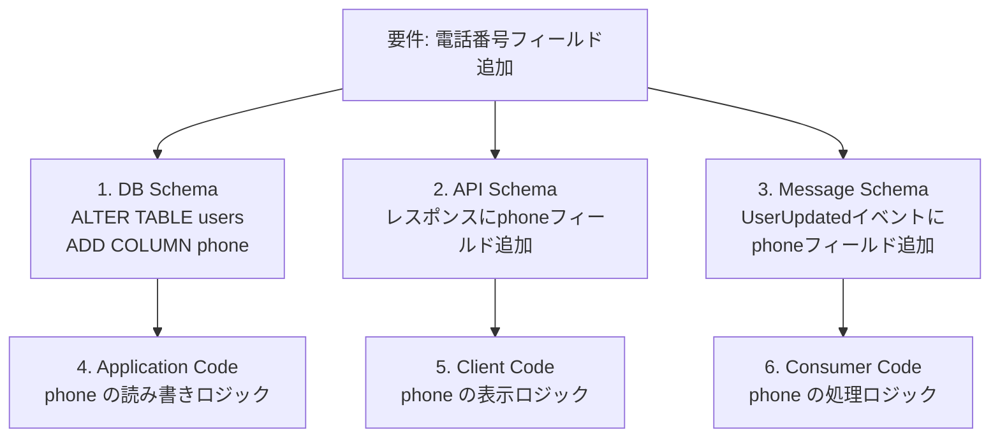

このような横断的な変更を安全に実行するには、以下の順序が推奨される。

1. **DB スキーマの拡張**: NULL 許容のカラムとして追加（Phase 1: Expand）
2. **メッセージスキーマの拡張**: オプショナルフィールドとして追加
3. **アプリケーションコードのデプロイ**: 新フィールドの読み書きに対応
4. **API レスポンスへの反映**: オプショナルフィールドとして追加
5. **クライアントの更新**: 新フィールドの表示対応

各ステップは独立したデプロイとして実行し、問題が発生した場合は個別にロールバックできるようにする。

### 9.3 スキーマエボリューションとデータメッシュ

近年注目されている**データメッシュ（Data Mesh）** アーキテクチャにおいて、スキーマエボリューションはさらに複雑になる。データメッシュでは、各ドメインチームがそれぞれのデータプロダクトを所有し、そのスキーマの進化に責任を持つ。

ドメイン間のスキーマ契約は、コンシューマ駆動契約テストと組み合わせて管理されることが多い。各ドメインのデータプロダクトは、公開スキーマの互換性を保証する責任を持ち、スキーマレジストリによる自動チェックがガバナンスの基盤となる。

## 10. まとめ

スキーマエボリューションは、ソフトウェアシステムの長期的な運用において避けることのできない課題である。DB、API、メッセージという3つの領域に共通する本質は、**データの構造的な契約を、複数のコンポーネントが異なるバージョンで共存する環境下で安全に進化させる**ということに集約される。

本記事の要点を以下にまとめる。

1. **互換性の理解が基盤**: 後方互換性と前方互換性の概念を正確に理解し、変更操作ごとにどの互換性が保持されるかを判断できることが、スキーマエボリューションの出発点である

2. **加算的変更を基本とする**: フィールドの追加はほぼ常に安全であり、削除や変更は危険を伴う。Expand-Contract パターンに代表される段階的アプローチで、破壊的変更を非破壊的なステップに分解する

3. **自動化された互換性チェック**: スキーマレジストリ、buf、契約テストなどのツールを活用し、CI/CD パイプラインで互換性違反を自動検出する

4. **領域横断的な視点**: 1つの変更が DB、API、メッセージの複数領域に影響することを認識し、各領域での互換性を個別に検証する

スキーマは「一度定義したら終わり」のものではなく、システムとともに成長し続ける生きた契約である。この契約をいかに安全に進化させるかが、長期にわたってシステムを健全に維持する鍵となる。
