# マイグレーション戦略（ゼロダウンタイムスキーマ変更）

## 1. 背景と動機：スキーマ変更はなぜ難しいのか

### 1.1 進化するシステムと不変のデータ構造

アプリケーションは継続的に進化する。新しい機能が追加され、ビジネス要件が変わり、パフォーマンス改善のためにデータモデルを見直す必要が生じる。しかし、データベーススキーマの変更は、アプリケーションコードの変更とは根本的に異なる性質を持っている。

アプリケーションコードはデプロイによって即座に置き換えることができる。古いバージョンのコードは新しいバージョンに完全に置き換わり、古いコードは存在しなくなる。一方、データベーススキーマの変更は「既存のデータ」という制約を常に伴う。数百万行のテーブルにカラムを追加する、インデックスを再構築する、テーブルを分割する — これらの操作はすべて、既存のデータを保持したまま実行しなければならない。

### 1.2 ダウンタイムの代償

かつては「メンテナンスウィンドウ」を設けてスキーマ変更を行うことが一般的であった。深夜や週末にシステムを停止し、DDL（Data Definition Language）を実行し、動作確認を行い、サービスを再開する。しかし現代のWebサービスにおいて、この方法はもはや許容されない。

- **グローバルサービス**：24時間365日、世界中のユーザーがアクセスする。タイムゾーンを考慮すると「誰も使っていない時間帯」は存在しない
- **ビジネスインパクト**：大規模ECサイトでは1分のダウンタイムが数百万円の損失につながる
- **SLA要件**：99.99%の可用性を保証するためには、年間のダウンタイムは52分以下でなければならない
- **デプロイ頻度**：モダンな開発チームは1日に数十回のデプロイを行う。毎回ダウンタイムを発生させることは不可能である

### 1.3 スキーマ変更の本質的困難

ゼロダウンタイムでスキーマ変更を行うことが難しい根本的な理由は、以下の3つの要因が同時に存在するためである。

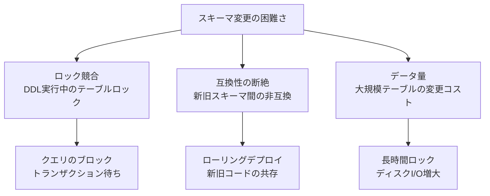

**ロック競合**：多くのデータベースでは、DDL文（`ALTER TABLE` など）の実行時にテーブルレベルのロックを取得する。このロック中は、そのテーブルに対するすべての読み書きがブロックされる。テーブルが大きければ大きいほど、ロック時間は長くなる。

**互換性の断絶**：スキーマ変更のデプロイは瞬時に完了しない。ローリングデプロイでは、新しいスキーマを期待するアプリケーションインスタンスと、古いスキーマを期待するインスタンスが同時に存在する期間がある。この期間に両方のインスタンスが正しく動作しなければならない。

**データ量の影響**：数億行のテーブルに対する `ALTER TABLE` は、内部的にテーブル全体のコピーが必要になる場合がある。これには数時間から数日かかることもある。

## 2. データベーススキーママイグレーションの基礎

### 2.1 マイグレーションとは

データベースマイグレーションとは、データベーススキーマの変更を管理・適用する仕組みである。バージョン管理されたマイグレーションファイルによって、スキーマの変更履歴を追跡し、再現可能な形で適用・ロールバックすることができる。

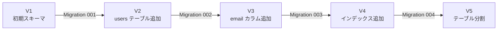

代表的なマイグレーションツールとしては、以下のようなものがある。

| ツール | 言語/フレームワーク | 特徴 |
|---|---|---|
| Rails Migrations | Ruby on Rails | ActiveRecord 統合、DSL ベース |
| Flyway | Java / JVM | SQL ベース、バージョン管理重視 |
| Alembic | Python / SQLAlchemy | Python スクリプトベース |
| Liquibase | Java / 多言語 | XML/YAML/JSON/SQL 対応 |
| golang-migrate | Go | SQL ベース、CLI ツール |
| Prisma Migrate | TypeScript / Node.js | スキーマファースト、差分生成 |
| Atlas | Go | 宣言的 + バージョン管理のハイブリッド |

### 2.2 バージョン管理型とステートベース型

マイグレーション戦略には大きく2つのアプローチがある。

**バージョン管理型（Version-based / Imperative）**

各マイグレーションを「操作の順序列」として記述する。「何を変更するか」を明示的に記述するアプローチである。

```sql
-- Migration 003: Add email column to users table
ALTER TABLE users ADD COLUMN email VARCHAR(255);
CREATE INDEX idx_users_email ON users (email);
```

```sql
-- Rollback 003: Remove email column from users table
DROP INDEX idx_users_email;
ALTER TABLE users DROP COLUMN email;
```

**ステートベース型（State-based / Declarative）**

あるべきスキーマの最終状態を宣言的に定義し、現在の状態との差分を自動生成するアプローチである。Prisma や Atlas がこの方式を採用している。

```prisma
// Desired state definition (Prisma schema)
model User {
  id    Int     @id @default(autoincrement())
  name  String
  email String  @unique  // new field to add
  posts Post[]
}
```

ツールが現在のデータベーススキーマとの差分を計算し、必要なDDLを自動生成する。

| 観点 | バージョン管理型 | ステートベース型 |
|---|---|---|
| 記述内容 | 変更操作の手順 | あるべき最終状態 |
| 冪等性 | 手動で保証が必要 | 差分計算により自動 |
| ロールバック | 明示的に記述が必要 | 前の状態を宣言 |
| データ変換 | 自由に記述可能 | 自動生成では困難 |
| 柔軟性 | 高い | 中程度 |
| 実行の予測可能性 | 高い | ツール依存 |

### 2.3 マイグレーションのアンチパターン

マイグレーションにおいてよく見られるアンチパターンを整理する。

::: danger 危険なアンチパターン
- **大規模な一括変更**：1つのマイグレーションに複数の変更を詰め込む。ロールバックが困難になる
- **ロールバック未定義**：Down マイグレーションを書かない。障害時に復旧できない
- **本番環境直接実行**：テスト環境で検証せずに本番にマイグレーションを適用する
- **データとスキーマの同時変更**：スキーマ変更とデータ移行を1つのマイグレーションで行う
:::

## 3. DDLの内部動作とロック機構

### 3.1 MySQLにおけるDDL

MySQLのDDL操作は、バージョンの進化とともにその内部動作が大きく変わってきた。

**MySQL 5.5以前：Copy DDL**

MySQL 5.5以前では、`ALTER TABLE` は以下の手順で実行されていた。

1. 新しい構造のテンポラリテーブルを作成する
2. 元のテーブルからすべてのデータをコピーする
3. 元のテーブルを削除する
4. テンポラリテーブルをリネームする

この間、テーブルに対する書き込みは完全にブロックされる。数億行のテーブルであれば、数時間にわたって完全に読み書き不能になる。

**MySQL 5.6以降：Online DDL**

MySQL 5.6では Online DDL が導入され、多くのDDL操作をインプレース（テーブルコピーなし）で実行できるようになった。ただし、すべての操作がオンラインで実行可能なわけではない。

| 操作 | アルゴリズム | 並行DML | 備考 |
|---|---|---|---|
| カラム追加（末尾） | INPLACE | 可能 | `ALGORITHM=INPLACE, LOCK=NONE` |
| カラム削除 | INPLACE | 可能 | テーブル再構築が必要 |
| カラム名変更 | INPLACE | 可能 | データ型変更を伴わない場合 |
| データ型変更 | COPY | 不可 | テーブルロックが必要 |
| PRIMARY KEY 追加 | INPLACE | 可能 | テーブル再構築が必要 |
| INDEX 追加 | INPLACE | 可能 | MySQL 5.6+ |
| FOREIGN KEY 追加 | INPLACE | 可能 | `foreign_key_checks` 無効時 |

::: warning MySQL Online DDLの注意点
Online DDLは操作の開始と終了時にメタデータロック（MDL）を取得する。このMDLは、実行中の長時間トランザクションがある場合にブロックされ、後続のすべてのクエリが連鎖的にブロックされる「MDLロック待ちの雪崩（MDL lock snowball）」を引き起こす可能性がある。
:::

**MDLロック待ちの雪崩の仕組み**

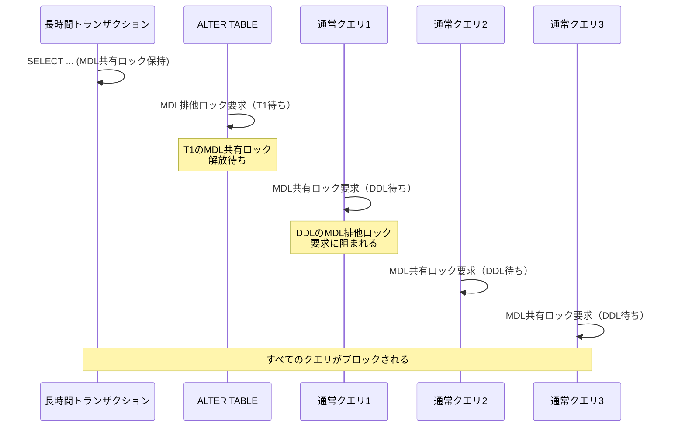

この問題を回避するため、DDL実行前に長時間実行中のトランザクションがないことを確認する、あるいは `lock_wait_timeout` を短く設定して、DDLがロックを取得できない場合は即座に失敗させるという対策が取られる。

### 3.2 PostgreSQLにおけるDDL

PostgreSQLはMySQLとは異なるロック戦略を持っている。PostgreSQLでは、DDL操作の種類によって必要なロックレベルが異なる。

| ロックレベル | DDL操作例 | 並行読み取り | 並行書き込み |
|---|---|---|---|
| `ACCESS SHARE` | `SELECT` | 可能 | 可能 |
| `SHARE UPDATE EXCLUSIVE` | `CREATE INDEX CONCURRENTLY` | 可能 | 可能 |
| `SHARE` | `CREATE INDEX`（通常） | 可能 | 不可 |
| `ACCESS EXCLUSIVE` | `ALTER TABLE` の多く | 不可 | 不可 |

PostgreSQLの重要な特性として、以下のDDL操作がほぼ瞬時に完了する点がある。

- **`NOT NULL` 制約を持たないカラムの追加**：テーブルの物理データを書き換えず、カタログの更新のみで完了する
- **カラムのデフォルト値設定**（PostgreSQL 11以降）：デフォルト値をカタログに記録し、読み取り時に補完する

```sql
-- Fast: no table rewrite needed (PostgreSQL)
ALTER TABLE users ADD COLUMN bio TEXT;

-- Fast in PostgreSQL 11+: default value stored in catalog
ALTER TABLE users ADD COLUMN status VARCHAR(20) DEFAULT 'active';

-- Slow: requires table rewrite
ALTER TABLE users ALTER COLUMN id TYPE BIGINT;
```

::: tip PostgreSQL 11の改善
PostgreSQL 11以前では、`DEFAULT` 値付きのカラム追加はテーブル全体の書き換えが必要であった。PostgreSQL 11以降では、デフォルト値をカタログに格納し、既存行の読み取り時にデフォルト値を動的に返す方式に変更された。これにより、デフォルト値付きカラムの追加がテーブルサイズに依存しない定数時間で完了するようになった。
:::

### 3.3 外部ツールによるスキーマ変更

データベース組み込みのDDL機構では限界がある場合に、外部ツールを使用してスキーマ変更を行う手法がある。代表的なツールとして `pt-online-schema-change`（Percona Toolkit）と `gh-ost`（GitHub Online Schema Migration Tool）がある。

**pt-online-schema-change の動作原理**

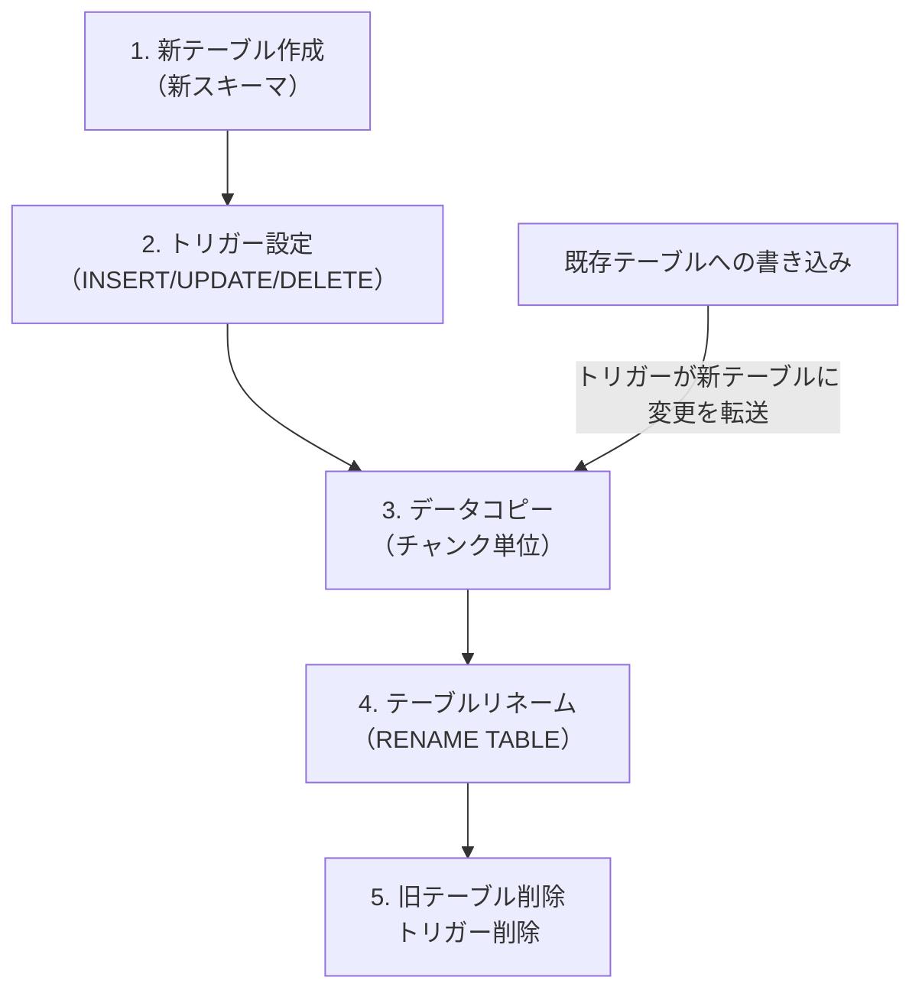

1. 新しい構造の空テーブルを作成する
2. 元テーブルにトリガーを設定し、INSERT/UPDATE/DELETE を新テーブルにも反映する
3. 元テーブルから新テーブルへデータをチャンク単位でコピーする
4. コピー完了後、RENAME TABLE で切り替える（アトミック操作）
5. 旧テーブルとトリガーを削除する

**gh-ost の動作原理**

gh-ostはトリガーの代わりにバイナリログ（binlog）を使用する。トリガーはテーブルに付加的な負荷を与えるため、gh-ostはこれを回避する設計になっている。

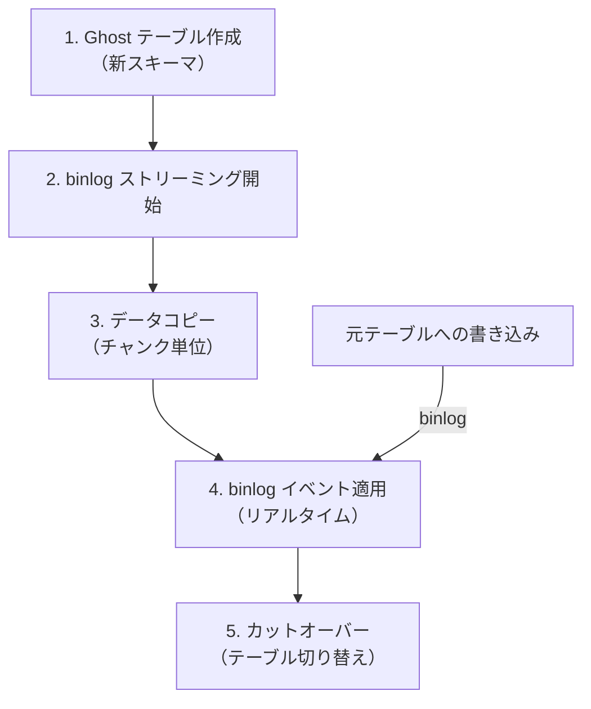

| 観点 | pt-online-schema-change | gh-ost |
|---|---|---|
| 変更捕捉方式 | トリガー | binlog ストリーミング |
| テーブルへの負荷 | トリガーによる追加負荷 | 追加負荷なし |
| 一時停止/再開 | 不可 | 可能 |
| 進捗制御 | チャンクサイズで調整 | リアルタイムスロットリング |
| 外部キー対応 | 制限あり | 制限あり |
| 必要条件 | トリガー権限 | binlog アクセス権限 |

## 4. ゼロダウンタイムスキーマ変更の原則

### 4.1 Expand-Contract パターン

ゼロダウンタイムでスキーマ変更を実現するための最も基本的かつ重要なパターンが **Expand-Contract（拡張-縮約）パターン** である。このパターンでは、スキーマ変更を1回の操作ではなく、複数の段階に分解して実行する。

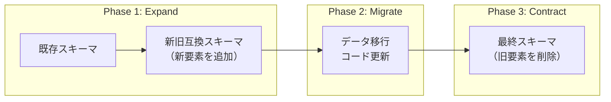

**Phase 1: Expand（拡張）**

新しいスキーマ要素（カラム、テーブル、インデックスなど）を追加する。この段階では何も削除しない。旧コードが引き続き動作できる状態を維持する。

**Phase 2: Migrate（移行）**

アプリケーションコードを更新し、新しいスキーマ要素を使用するようにする。必要に応じてデータの移行（バックフィル）を行う。この段階では新旧両方のスキーマ要素が存在する。

**Phase 3: Contract（縮約）**

不要になった旧スキーマ要素を削除する。すべてのアプリケーションインスタンスが新しいスキーマを使用していることを確認してから実行する。

### 4.2 後方互換性と前方互換性

ゼロダウンタイムマイグレーションでは、**後方互換性（backward compatibility）** と **前方互換性（forward compatibility）** の概念が重要になる。

- **後方互換性**：新しいスキーマが、古いバージョンのアプリケーションコードからも正しく読み書きできること
- **前方互換性**：古いスキーマが、新しいバージョンのアプリケーションコードからも正しく読み書きできること

ローリングデプロイにおいては、新旧のアプリケーションインスタンスが同じデータベースに対して同時にアクセスする期間が必ず存在する。この期間中、スキーマは後方互換性と前方互換性の両方を満たす必要がある。

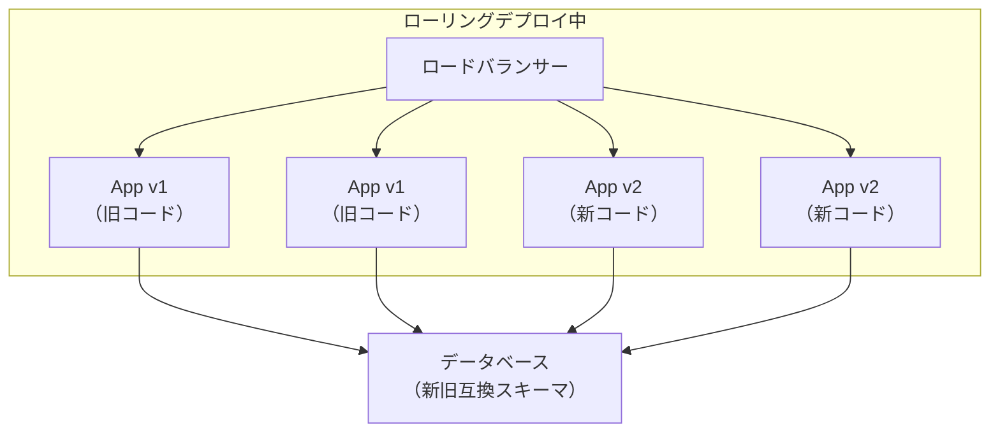

### 4.3 安全なスキーマ変更と危険なスキーマ変更

スキーマ変更操作を「安全性」の観点で分類する。

::: tip 安全な操作（そのまま実行可能）
- NULL 許容カラムの追加（デフォルト値なし）
- 新しいテーブルの作成
- 新しいインデックスの作成（CONCURRENTLY オプション使用）
- カラムの制約緩和（NOT NULL の削除）
:::

::: warning 注意が必要な操作（段階的に実行）
- デフォルト値付きカラムの追加（DB エンジンとバージョンによる）
- カラム名の変更
- テーブル名の変更
- データ型の変更（互換性がある場合）
:::

::: danger 危険な操作（Expand-Contract パターン必須）
- カラムの削除
- NOT NULL 制約の追加
- UNIQUE 制約の追加
- テーブルの削除
- カラムのデータ型変更（非互換）
:::

## 5. 代表的なスキーマ変更パターンと手順

### 5.1 カラム追加

最も頻繁に行われるスキーマ変更であり、正しく行えば最も安全な操作でもある。

**安全な手順**

```sql
-- Step 1: Add nullable column without default
ALTER TABLE users ADD COLUMN phone_number VARCHAR(20);

-- Step 2: Deploy application code that writes to new column
-- (old code ignores the column, new code writes to it)

-- Step 3: Backfill existing rows
UPDATE users SET phone_number = '' WHERE phone_number IS NULL;
-- Note: batch update for large tables (see Section 5.7)

-- Step 4: Add NOT NULL constraint if needed (after all rows are populated)
ALTER TABLE users ALTER COLUMN phone_number SET NOT NULL;
```

::: warning バックフィルの注意点
大規模テーブルのバックフィルは、一括 UPDATE ではなくバッチ処理で行うべきである。一括 UPDATE は長時間のトランザクションとなり、ロック競合やレプリケーション遅延を引き起こす可能性がある。
:::

### 5.2 カラム削除

カラムの削除は、最も慎重に行う必要がある操作の一つである。アプリケーションコードがまだカラムを参照している状態で `DROP COLUMN` を実行すると、即座にエラーが発生する。

**安全な手順（Expand-Contract）**

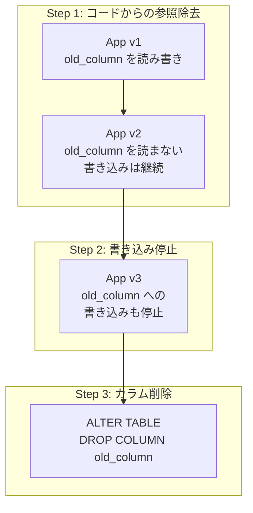

1. **アプリケーションコードの更新**：対象カラムを読み取らないようにコードを修正してデプロイする。ORM を使用している場合は、モデル定義からカラムを除外する
2. **書き込みの停止**：対象カラムへの書き込みも停止するようにコードを修正してデプロイする
3. **全インスタンスの確認**：すべてのアプリケーションインスタンスが新しいコードに更新されていることを確認する
4. **カラムの削除**：`ALTER TABLE DROP COLUMN` を実行する

::: details Rails での具体例（ignored_columns）
Ruby on Rails では `ignored_columns` を使って ORM からカラムを隠す機能がある。これにより、カラムが物理的に存在していても、アプリケーションコードからは見えなくなる。

```ruby
# Step 1: Ignore the column in the model
class User < ApplicationRecord
  self.ignored_columns += ["legacy_status"]
end

# Step 2: Deploy and verify all instances are updated

# Step 3: Run migration to drop the column
class RemoveLegacyStatusFromUsers < ActiveRecord::Migration[7.1]
  def change
    remove_column :users, :legacy_status, :string
  end
end
```
:::

### 5.3 カラム名変更

カラム名の変更は、単純な `RENAME COLUMN` では安全に行えない。ローリングデプロイ中に旧コードが古いカラム名でアクセスしようとしてエラーになるためである。

**安全な手順**

1. 新しいカラムを追加する
2. 新旧両方のカラムにデータを書き込むようにコードを更新する（デュアルライト）
3. 既存データを新カラムにバックフィルする
4. 新カラムを読み取るようにコードを更新する
5. 旧カラムへの書き込みを停止する
6. 旧カラムを削除する

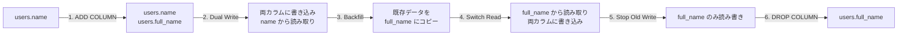

**デュアルライト期間中のコード例**

::: code-group
```python [Step 2: Dual Write]
# Write to both columns, read from old column
def update_user_name(user_id: int, name: str):
    db.execute(
        "UPDATE users SET name = %s, full_name = %s WHERE id = %s",
        (name, name, user_id)
    )

def get_user_name(user_id: int) -> str:
    row = db.execute(
        "SELECT name FROM users WHERE id = %s",
        (user_id,)
    )
    return row["name"]
```

```python [Step 4: Switch Read]
# Write to both columns, read from new column
def update_user_name(user_id: int, name: str):
    db.execute(
        "UPDATE users SET name = %s, full_name = %s WHERE id = %s",
        (name, name, user_id)
    )

def get_user_name(user_id: int) -> str:
    row = db.execute(
        "SELECT full_name FROM users WHERE id = %s",
        (user_id,)
    )
    return row["full_name"]
```

```python [Step 5: Final]
# Write and read only from new column
def update_user_name(user_id: int, name: str):
    db.execute(
        "UPDATE users SET full_name = %s WHERE id = %s",
        (name, user_id)
    )

def get_user_name(user_id: int) -> str:
    row = db.execute(
        "SELECT full_name FROM users WHERE id = %s",
        (user_id,)
    )
    return row["full_name"]
```
:::

### 5.4 テーブル分割

1つのテーブルを複数のテーブルに分割する操作は、最も複雑なスキーマ変更の一つである。

**例：`users` テーブルからプロフィール情報を `user_profiles` に分離する**

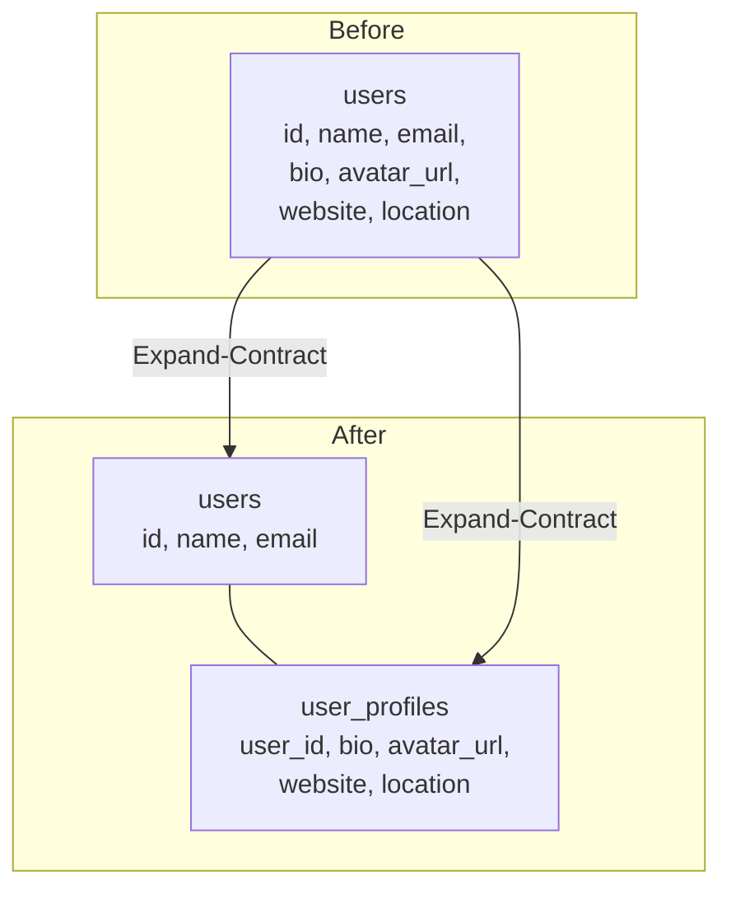

**安全な手順**

1. **Expand**：新しい `user_profiles` テーブルを作成する
2. **Dual Write**：アプリケーションコードを更新し、`users` と `user_profiles` の両方にデータを書き込むようにする
3. **Backfill**：`users` テーブルの既存データを `user_profiles` にコピーする
4. **Switch Read**：読み取りを `user_profiles` に切り替える
5. **Stop Old Write**：`users` テーブルへのプロフィール関連の書き込みを停止する
6. **Contract**：`users` テーブルからプロフィール関連のカラムを削除する

### 5.5 NOT NULL 制約の追加

既存カラムに `NOT NULL` 制約を追加する操作は、現在のデータに NULL 値が含まれていると失敗する。また、PostgreSQL では `ALTER TABLE ... SET NOT NULL` が `ACCESS EXCLUSIVE` ロックを必要とし、テーブル全体のスキャンが実行される。

**安全な手順**

```sql
-- Step 1: Backfill NULL values
UPDATE users SET status = 'active' WHERE status IS NULL;

-- Step 2: Add CHECK constraint as NOT VALID (PostgreSQL)
ALTER TABLE users ADD CONSTRAINT users_status_not_null
  CHECK (status IS NOT NULL) NOT VALID;

-- Step 3: Validate the constraint (does not block writes)
ALTER TABLE users VALIDATE CONSTRAINT users_status_not_null;

-- Step 4 (optional): Convert to native NOT NULL
-- In PostgreSQL 12+, if a valid CHECK (col IS NOT NULL) exists,
-- SET NOT NULL does not require a full table scan
ALTER TABLE users ALTER COLUMN status SET NOT NULL;
ALTER TABLE users DROP CONSTRAINT users_status_not_null;
```

::: tip PostgreSQL 12以降の最適化
PostgreSQL 12以降では、`CHECK (col IS NOT NULL) NOT VALID` 制約が検証済みの場合、`ALTER TABLE ... SET NOT NULL` はテーブルスキャンをスキップする。これにより、大規模テーブルでも安全かつ高速に NOT NULL 制約を追加できる。
:::

### 5.6 インデックスの追加

インデックスの作成は、テーブルに対する読み取り負荷とディスクI/Oが大きい操作である。

**PostgreSQL: CONCURRENTLY オプション**

```sql
-- Blocking: acquires SHARE lock (blocks writes)
CREATE INDEX idx_users_email ON users (email);

-- Non-blocking: acquires SHARE UPDATE EXCLUSIVE lock
CREATE INDEX CONCURRENTLY idx_users_email ON users (email);
```

`CONCURRENTLY` オプションを使用すると、インデックス作成中も書き込みが可能になる。ただし、作成時間が通常の2〜3倍かかり、トランザクション内では使用できないという制約がある。

**MySQL: Online DDL**

MySQL 5.6以降では、インデックスの作成はデフォルトでオンラインで実行される。

```sql
-- Online index creation (MySQL 5.6+)
ALTER TABLE users ADD INDEX idx_users_email (email),
  ALGORITHM=INPLACE, LOCK=NONE;
```

### 5.7 大規模テーブルのバックフィル

数百万行以上のテーブルに対するデータ更新（バックフィル）は、慎重に行わなければレプリケーション遅延やロック競合を引き起こす。

**バッチ処理パターン**

```python
import time

def backfill_phone_numbers(batch_size: int = 1000, sleep_seconds: float = 0.1):
    """
    Backfill phone_number column in batches to avoid
    long-running transactions and replication lag.
    """
    last_id = 0
    while True:
        # Process one batch
        result = db.execute("""
            UPDATE users
            SET phone_number = ''
            WHERE phone_number IS NULL
              AND id > %s
            ORDER BY id
            LIMIT %s
        """, (last_id, batch_size))

        if result.rowcount == 0:
            break  # all rows processed

        # Track progress
        last_id = db.execute("""
            SELECT MAX(id) FROM users
            WHERE id > %s
            ORDER BY id
            LIMIT %s
        """, (last_id, batch_size)).scalar()

        # Throttle to avoid overwhelming the database
        time.sleep(sleep_seconds)

        # Check replication lag before continuing
        lag = get_replication_lag()
        while lag > 5.0:  # seconds
            time.sleep(1.0)
            lag = get_replication_lag()
```

**バッチ処理の設計ポイント**

| 観点 | 推奨 | 理由 |
|---|---|---|
| バッチサイズ | 500〜5000行 | トランザクション長の制御 |
| スリープ間隔 | 50〜500ms | DB負荷の平準化 |
| レプリカ遅延監視 | 5秒以上で一時停止 | レプリカの追従を保証 |
| 進捗ログ | バッチごとに記録 | 中断時の再開を容易にする |
| 冪等性 | WHERE で未処理行を特定 | 再実行時の安全性 |

## 6. ゼロダウンタイムマイグレーションの実践ワークフロー

### 6.1 デプロイパイプラインとの統合

ゼロダウンタイムマイグレーションは、CI/CDパイプラインに統合して自動化することが望ましい。ただし、すべてのマイグレーションを自動実行するのではなく、リスクレベルに応じた実行戦略を採用すべきである。

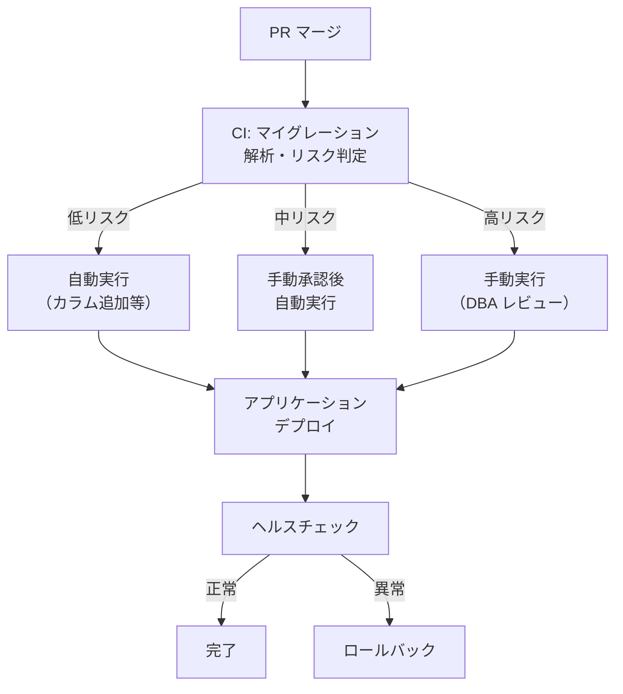

### 6.2 マイグレーションの順序とアプリケーションデプロイの関係

スキーマ変更とアプリケーションデプロイの順序は、変更の種類によって異なる。

**先にマイグレーション（Migration-first）**

新しいカラムやテーブルを追加する場合は、先にマイグレーションを実行してからアプリケーションをデプロイする。旧コードは新しいカラムを無視するだけであり、問題は生じない。

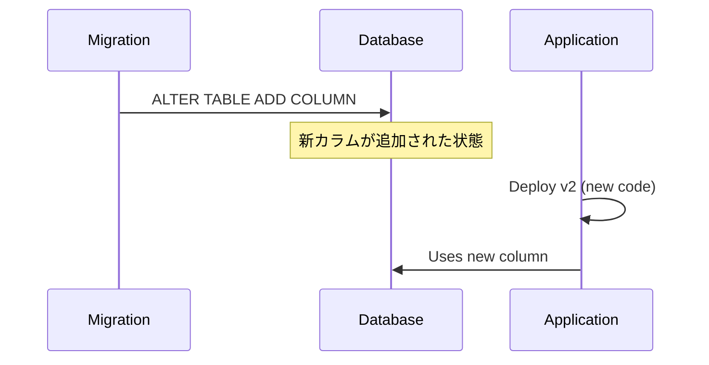

**先にアプリケーション（Application-first）**

カラムやテーブルを削除する場合は、先にアプリケーションコードを更新してから、マイグレーションを実行する。旧コードがまだカラムを参照している状態でカラムを削除すると、エラーが発生する。

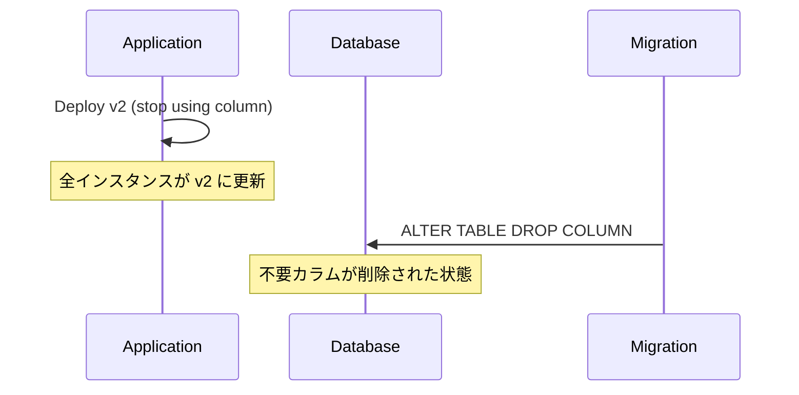

### 6.3 ロールバック戦略

すべてのマイグレーションにはロールバック計画が必要である。ただし、スキーマ変更のロールバックは、アプリケーションコードのロールバックとは異なる困難さがある。

**可逆なマイグレーション**

```sql
-- Up: Add column
ALTER TABLE users ADD COLUMN phone VARCHAR(20);

-- Down: Remove column (data loss!)
ALTER TABLE users DROP COLUMN phone;
```

**不可逆なマイグレーション**

以下のマイグレーションは本質的に不可逆であり、ロールバックにはデータの復元が必要になる。

- カラムの削除（データが失われる）
- データ型の変更（精度が失われる可能性がある）
- テーブルの削除（データが失われる）

::: warning ロールバックに関するベストプラクティス
- 不可逆なマイグレーションを実行する前に、必ずバックアップを取得する
- カラム削除は「即座に削除」ではなく「非表示化 → 一定期間後に削除」の2段階で行う
- 可能な限り、マイグレーションは可逆に設計する
:::

### 6.4 フィーチャーフラグとの連携

フィーチャーフラグ（Feature Flag）を活用することで、スキーマ変更に伴うアプリケーションコードの切り替えをより安全に行うことができる。

```python
def get_user_email(user_id: int) -> str:
    if feature_flag.is_enabled("use_new_email_column"):
        # Read from new column
        return db.execute(
            "SELECT verified_email FROM users WHERE id = %s",
            (user_id,)
        ).scalar()
    else:
        # Read from old column
        return db.execute(
            "SELECT email FROM users WHERE id = %s",
            (user_id,)
        ).scalar()
```

フィーチャーフラグを使用することで、以下の利点がある。

1. **段階的なロールアウト**：一部のユーザーやサーバーからのみ新しいスキーマを使用する
2. **即座のロールバック**：問題が発生した場合、フラグを無効にするだけでロールバックできる
3. **独立したデプロイ**：スキーマ変更とコード変更を別々のデプロイとして管理できる

## 7. 実世界の事例とツール

### 7.1 GitHub のスキーママイグレーション

GitHubは、MySQL上で動作する大規模なモノリシックアプリケーションを運用しており、スキーマ変更のために独自のツールを開発してきた。

GitHubが開発した `gh-ost` は、MySQLのバイナリログを利用したオンラインスキーマ変更ツールである。トリガーベースの `pt-online-schema-change` が抱えていた以下の問題を解決した。

- **トリガーの負荷**：書き込みのたびにトリガーが発火し、元テーブルへの書き込み性能が低下する
- **テスト困難**：トリガーベースの変更はテスト環境での再現が難しい
- **一時停止不可**：トリガーベースでは変更プロセスを途中で止められない

gh-ostは、バイナリログストリームからDMLイベントを読み取り、新テーブルに適用する。これにより元テーブルには一切触れずにスキーマ変更を実行できる。また、Unix ソケットを通じてリアルタイムに変更プロセスの制御（一時停止、スロットリング調整、中止）が可能である。

### 7.2 Stripe の強力なマイグレーション安全装置

大規模な決済プラットフォームを運用する Stripe は、スキーママイグレーションの安全性を担保するために多層的な仕組みを構築している。

- **静的解析によるマイグレーション検証**：マイグレーション内容を CI で自動解析し、危険な操作（ロック取得を伴う DDL、大規模バックフィルなど）を検出してブロックする
- **Shadow Database テスト**：マイグレーションを本番データのコピーに対して事前に実行し、所要時間やロック挙動を予測する
- **段階的ロールアウト**：マイグレーションをまずステージング環境、次に本番の小規模クラスタ、最後に全クラスタという順序で適用する

### 7.3 マイグレーション Linter

スキーマ変更の安全性を自動検証するツールが増えている。これらのツールは、マイグレーションSQLを静的に解析し、潜在的な問題を検出する。

| ツール | 対応DB | 特徴 |
|---|---|---|
| strong_migrations (Rails) | PostgreSQL, MySQL | Rails マイグレーション統合 |
| squawk | PostgreSQL | SQL 解析ベース |
| sqlcheck | 汎用 | SQL アンチパターン検出 |
| Atlas | MySQL, PostgreSQL, SQLite | スキーマ差分解析 |
| skeema | MySQL | MySQL 特化 |

**strong_migrations の例**

```ruby
# This migration will be blocked by strong_migrations
class AddIndexToUsersEmail < ActiveRecord::Migration[7.1]
  def change
    # Raises an error: "Adding an index non-concurrently
    # blocks writes. Use `algorithm: :concurrently`"
    add_index :users, :email  # blocked!
  end
end

# Safe version
class AddIndexToUsersEmail < ActiveRecord::Migration[7.1]
  disable_ddl_transaction!

  def change
    add_index :users, :email, algorithm: :concurrently
  end
end
```

## 8. 高度なパターンとテクニック

### 8.1 ダブルライト with Views

カラム名変更やテーブル構造変更において、ビュー（View）を中間層として活用するパターンがある。

```sql
-- Step 1: Create new table
CREATE TABLE users_v2 (
    id BIGINT PRIMARY KEY,
    full_name VARCHAR(255),  -- renamed from "name"
    email VARCHAR(255)
);

-- Step 2: Create view that maps old column names
CREATE VIEW users AS
SELECT id, full_name AS name, email FROM users_v2;

-- Step 3: Application code continues to use "users.name"
-- while physically writing to users_v2.full_name

-- Step 4: Update application code to use new column name

-- Step 5: Drop the view, rename table if needed
```

::: warning ビューの制約
多くのデータベースでは、ビューに対する INSERT/UPDATE に制約がある。単純な1テーブルビューであれば更新可能（updatable view）だが、JOIN やサブクエリを含むビューは更新不可能な場合がある。また、ビューのパフォーマンスオーバーヘッドにも注意が必要である。
:::

### 8.2 テーブル継承を使った段階的移行（PostgreSQL）

PostgreSQLのテーブル継承（Table Inheritance）を活用して、スキーマ変更を段階的に行うテクニックがある。

```sql
-- Parent table (original)
CREATE TABLE events (
    id SERIAL PRIMARY KEY,
    event_type VARCHAR(50),
    payload JSONB,
    created_at TIMESTAMP
);

-- Child table with new schema
CREATE TABLE events_v2 (
    metadata JSONB  -- new column
) INHERITS (events);

-- Queries on "events" automatically include events_v2
SELECT * FROM events;  -- returns rows from both tables
```

### 8.3 Ghost Tables パターン

大規模なテーブル構造変更において、「ゴーストテーブル」（影のテーブル）を作成して段階的に移行するパターンである。gh-ost の名前の由来でもある。

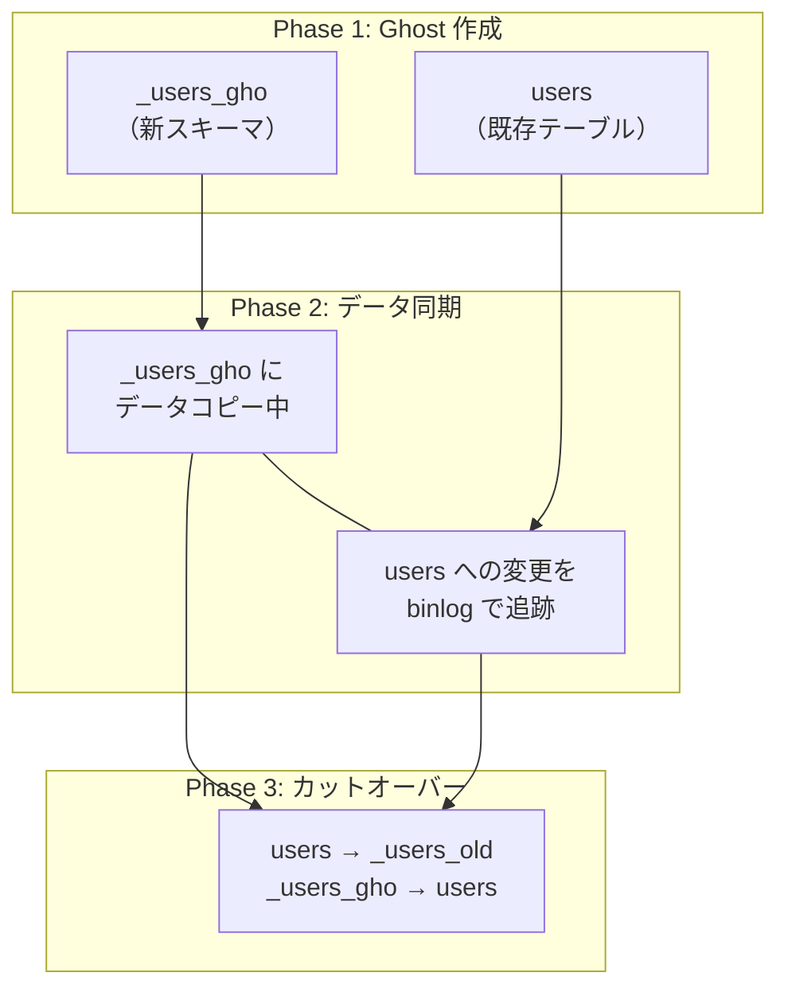

## 9. マルチサービス環境でのマイグレーション

### 9.1 マイクロサービスとデータベースの所有権

マイクロサービスアーキテクチャでは、各サービスが自身のデータベースを所有する（Database per Service パターン）。このため、スキーマ変更の影響範囲は基本的に1つのサービスに閉じる。

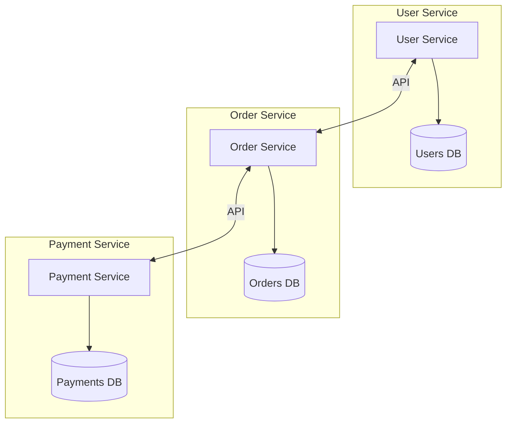

しかし、共有データベースを使用している場合や、サービス間でイベントを通じてデータを共有している場合は、スキーマ変更の影響が複数のサービスに波及する。

### 9.2 イベントスキーマのバージョニング

マイクロサービス間でイベントを通じてデータを共有している場合、イベントスキーマの変更もゼロダウンタイムで行わなければならない。

**スキーマレジストリの活用**

Apache Kafka を使用したイベント駆動アーキテクチャでは、Confluent Schema Registry を活用して、イベントスキーマの後方互換性を自動検証することができる。

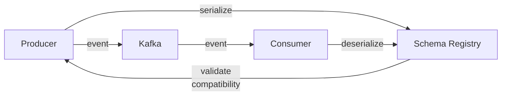

スキーマの互換性ルールとしては、以下の3つが一般的である。

- **BACKWARD**：新しいスキーマで古いデータを読める（コンシューマー先行でアップデート可能）
- **FORWARD**：古いスキーマで新しいデータを読める（プロデューサー先行でアップデート可能）
- **FULL**：双方向に互換性がある（最も安全）

### 9.3 Shared Database のマイグレーション

複数のサービスが1つのデータベースを共有している場合（Shared Database パターン）、スキーマ変更はすべての依存サービスに影響する。この場合、以下の戦略が有効である。

1. **スキーマ変更の事前通知**：変更の少なくとも1週間前に、影響を受けるサービスチームに通知する
2. **互換性期間の設定**：新旧両方のスキーマが共存する期間を十分に確保する（最低2週間）
3. **段階的なカットオーバー**：各サービスが順番に新しいスキーマに対応する
4. **データベース分離の検討**：長期的には Database per Service パターンへの移行を検討する

## 10. マイグレーションの自動化と安全装置

### 10.1 マイグレーション自動解析パイプライン

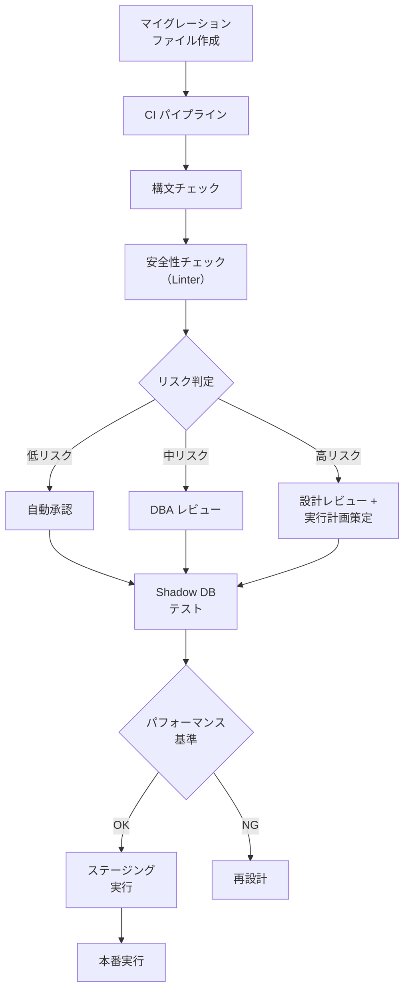

### 10.2 自動チェック項目

マイグレーションの安全性を自動検証するために、以下のチェック項目を CI に組み込むことが推奨される。

| チェック項目 | 検出内容 | 対応 |
|---|---|---|
| ロック取得の確認 | ACCESS EXCLUSIVE ロックが必要な操作 | CONCURRENTLY オプションの使用を推奨 |
| テーブルサイズ確認 | 大規模テーブルに対する変更 | 外部ツール（gh-ost等）の使用を推奨 |
| NOT NULL 追加 | デフォルト値なしの NOT NULL 制約追加 | CHECK 制約 + VALIDATE の使用を推奨 |
| カラム削除 | 使用中のカラムの削除 | コードからの参照除去を先に行う |
| データ型変更 | 非互換な型変更 | 新カラム追加 + データ移行を推奨 |
| 外部キー追加 | 大規模テーブルへの外部キー追加 | NOT VALID + VALIDATE の使用を推奨 |

### 10.3 実行時の安全装置

マイグレーション実行時にも、以下の安全装置を組み込むことが重要である。

```python
class SafeMigrationRunner:
    """
    Migration runner with safety guardrails.
    """

    def __init__(self, db_connection, config):
        self.db = db_connection
        self.max_lock_timeout = config.get("max_lock_timeout", "5s")
        self.max_statement_timeout = config.get("max_statement_timeout", "30s")
        self.max_replication_lag = config.get("max_replication_lag", 5.0)

    def run_migration(self, migration):
        # Set short lock timeout to fail fast
        self.db.execute(f"SET lock_timeout = '{self.max_lock_timeout}'")
        self.db.execute(
            f"SET statement_timeout = '{self.max_statement_timeout}'"
        )

        # Check replication lag before starting
        lag = self.get_replication_lag()
        if lag > self.max_replication_lag:
            raise MigrationError(
                f"Replication lag too high: {lag}s "
                f"(max: {self.max_replication_lag}s)"
            )

        # Check for long-running transactions
        long_txns = self.get_long_running_transactions()
        if long_txns:
            raise MigrationError(
                f"Long-running transactions detected: {long_txns}"
            )

        try:
            migration.up(self.db)
        except LockTimeoutError:
            # Retry with backoff, or alert operator
            raise MigrationError(
                "Could not acquire lock within timeout. "
                "Retry during lower-traffic period."
            )
```

## 11. 典型的な失敗パターンと対策

### 11.1 よくある失敗事例

**事例1：NOT NULL カラム追加による障害**

```sql
-- Dangerous: blocks all writes until default value is applied to all rows
ALTER TABLE orders ADD COLUMN status VARCHAR(20) NOT NULL DEFAULT 'pending';
```

MySQL 5.7以前では、この操作はテーブル全体のリライトを伴う。数億行のテーブルに対して実行すると、数時間にわたって書き込みがブロックされる。

**対策**：NULL許容カラムを追加し、バックフィル後に NOT NULL 制約を付与する。

**事例2：ローリングデプロイ中のカラム参照エラー**

アプリケーション v2 で新しいカラム `verified_at` を参照する SELECT 文を含むコードをデプロイしたが、マイグレーションの実行が遅れ、カラムがまだ存在しない状態で v2 のインスタンスがリクエストを受け付けた。

**対策**：マイグレーションを先に実行する（Migration-first）。あるいは、フィーチャーフラグで新カラムの使用を制御する。

**事例3：外部キー制約追加によるロック**

```sql
-- Dangerous: validates all existing rows while holding lock
ALTER TABLE orders ADD CONSTRAINT fk_orders_users
  FOREIGN KEY (user_id) REFERENCES users (id);
```

大規模テーブルに外部キー制約を追加すると、既存のすべての行に対して参照整合性の検証が実行される。

**対策（PostgreSQL）**：

```sql
-- Step 1: Add constraint without validation (fast, minimal lock)
ALTER TABLE orders ADD CONSTRAINT fk_orders_users
  FOREIGN KEY (user_id) REFERENCES users (id) NOT VALID;

-- Step 2: Validate existing rows (non-blocking in PostgreSQL)
ALTER TABLE orders VALIDATE CONSTRAINT fk_orders_users;
```

### 11.2 障害時のチェックリスト

マイグレーション実行中に問題が発生した場合のチェックリストを示す。

1. **即座にマイグレーションを中止する**（可能であれば）
2. **ロック状況を確認する**：`pg_locks`（PostgreSQL）、`SHOW PROCESSLIST`（MySQL）
3. **レプリケーション遅延を確認する**
4. **アプリケーションのエラーログを確認する**
5. **ロールバックの実行可否を判断する**
6. **必要に応じてダウンタイムを宣言する**

```sql
-- PostgreSQL: Check blocking queries
SELECT
    blocked.pid AS blocked_pid,
    blocked.query AS blocked_query,
    blocking.pid AS blocking_pid,
    blocking.query AS blocking_query,
    now() - blocked.query_start AS blocked_duration
FROM pg_catalog.pg_locks blocked_locks
JOIN pg_catalog.pg_stat_activity blocked
    ON blocked.pid = blocked_locks.pid
JOIN pg_catalog.pg_locks blocking_locks
    ON blocking_locks.locktype = blocked_locks.locktype
    AND blocking_locks.relation = blocked_locks.relation
    AND blocking_locks.pid != blocked_locks.pid
JOIN pg_catalog.pg_stat_activity blocking
    ON blocking.pid = blocking_locks.pid
WHERE NOT blocked_locks.granted;
```

```sql
-- MySQL: Check lock waits
SELECT
    r.trx_id AS waiting_trx_id,
    r.trx_mysql_thread_id AS waiting_thread,
    r.trx_query AS waiting_query,
    b.trx_id AS blocking_trx_id,
    b.trx_mysql_thread_id AS blocking_thread,
    b.trx_query AS blocking_query
FROM information_schema.innodb_lock_waits w
JOIN information_schema.innodb_trx b
    ON b.trx_id = w.blocking_trx_id
JOIN information_schema.innodb_trx r
    ON r.trx_id = w.requesting_trx_id;
```

## 12. まとめと実践指針

### 12.1 ゼロダウンタイムマイグレーションの原則

本記事で解説した内容を、実践的な原則としてまとめる。

1. **小さく、頻繁に**：大規模な変更を1回で行うのではなく、小さな変更を何度もデプロイする
2. **Expand-Contract**：スキーマの拡張と縮約を分離し、互換性を維持する
3. **Migration-first / Application-first を使い分ける**：追加系は先にマイグレーション、削除系は先にアプリケーション
4. **バッチ処理**：大規模データの変更はバッチ単位で、レプリケーション遅延を監視しながら行う
5. **安全装置の組み込み**：ロックタイムアウト、レプリケーション監視、自動ロールバックを仕組みとして組み込む
6. **テスト環境での検証**：本番と同等のデータ量・負荷で事前検証する
7. **ロールバック計画**：すべてのマイグレーションにロールバック手順を用意する

### 12.2 技術選択のガイドライン

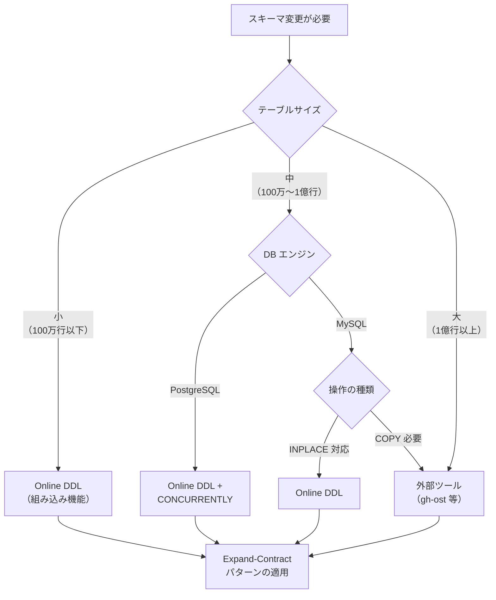

### 12.3 今後の展望

データベースのスキーママイグレーションは、以下の方向へ進化し続けている。

**宣言的マイグレーションの普及**：Atlas や Prisma Migrate に代表される宣言的アプローチが広がりつつある。あるべきスキーマの最終状態を宣言するだけで、差分を自動計算してマイグレーションを生成するこの方式は、手続き的なマイグレーションに比べてヒューマンエラーを減少させる。

**AI支援によるマイグレーション生成**：スキーマ変更の意図を自然言語で記述し、安全なマイグレーション手順を自動生成する研究・製品が登場している。

**スキーマレスとスキーマオンリード**：MongoDB に代表されるスキーマレスアプローチや、Delta Lake のスキーマ進化機能は、従来のスキーママイグレーションの必要性自体を減少させる可能性がある。ただし、データの整合性をアプリケーション側で保証する必要があるため、トレードオフの問題は残る。

**Branching Database**：PlanetScale のようなサービスが提供する「データベースブランチ」の概念は、Git と同様の方法でスキーマ変更をブランチ上で試行し、マージする体験を可能にする。この方法により、スキーマ変更のレビューやテストがソフトウェア開発のワークフローに自然に統合される。

ゼロダウンタイムスキーマ変更は、単なる技術的な課題ではなく、組織の開発プロセスと運用文化に深く根ざした問題である。安全なマイグレーションを実現するためには、ツールの選択だけでなく、チーム全体の意識合わせと、失敗から学ぶ文化が不可欠である。
