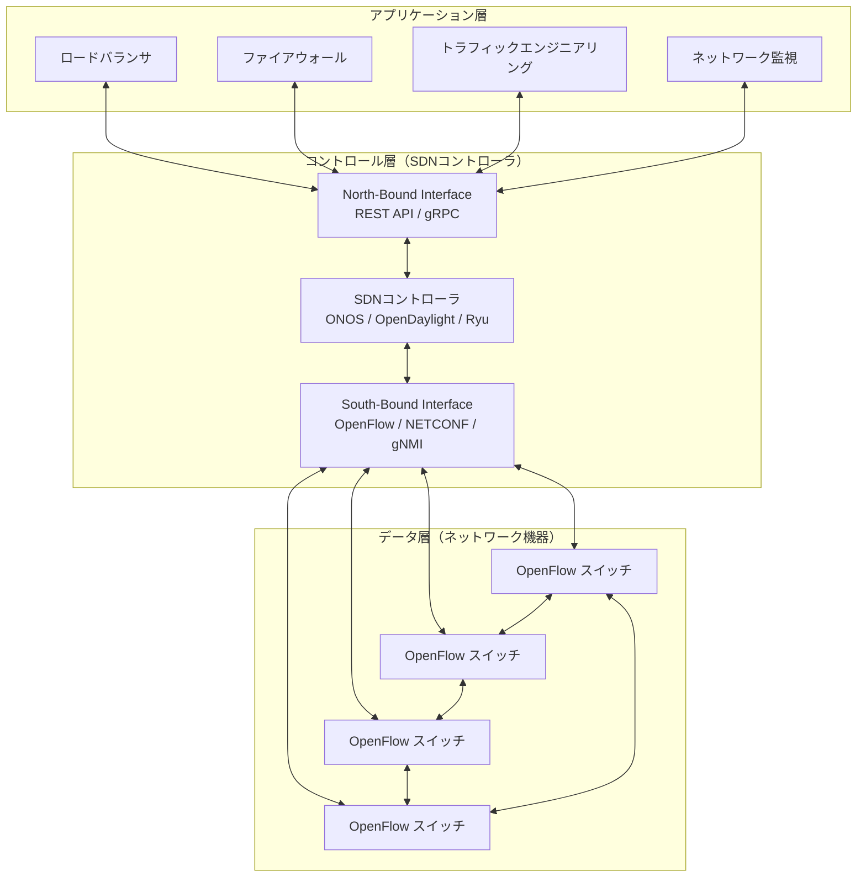
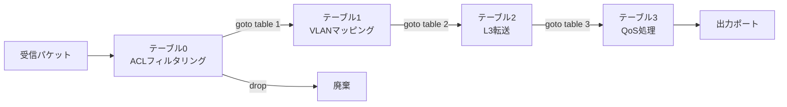
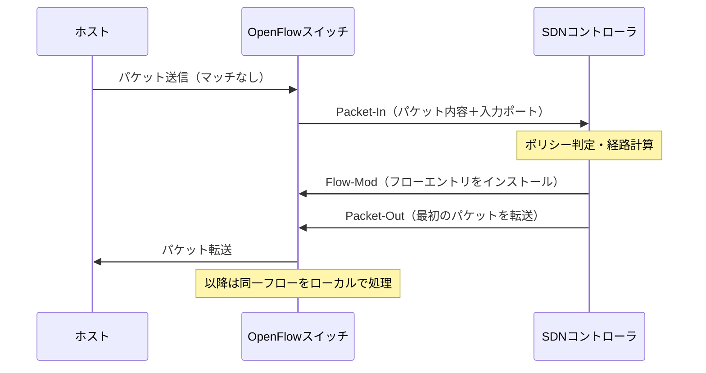
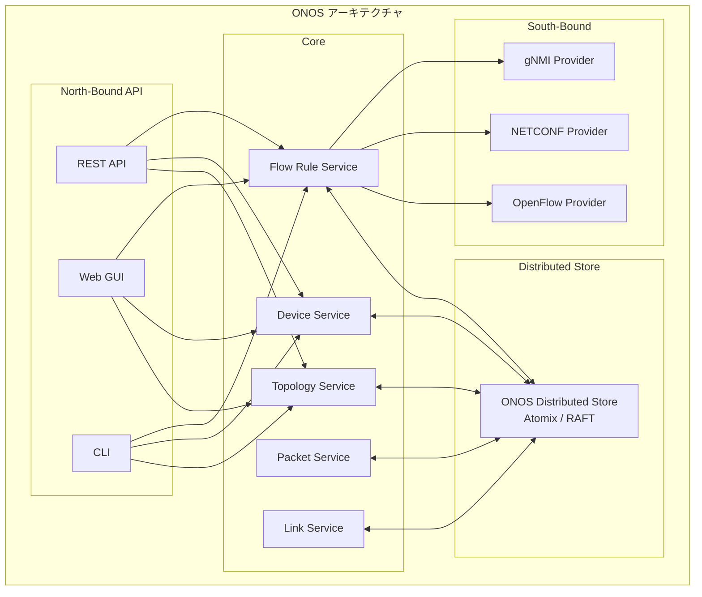
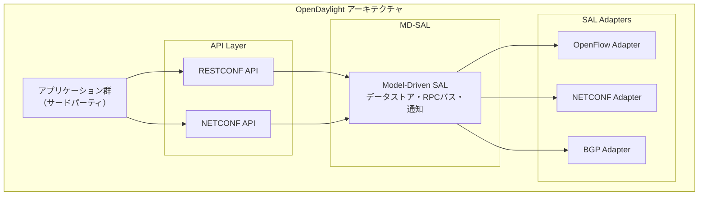
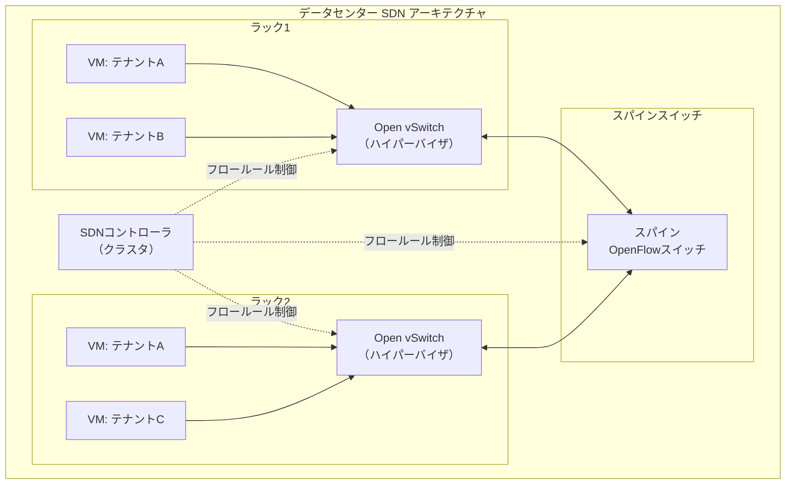
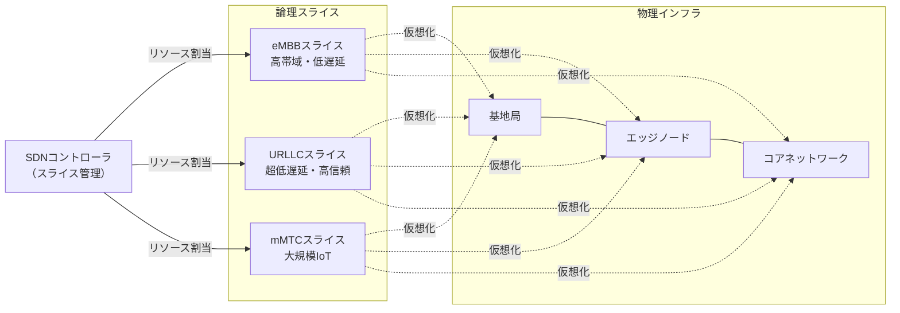
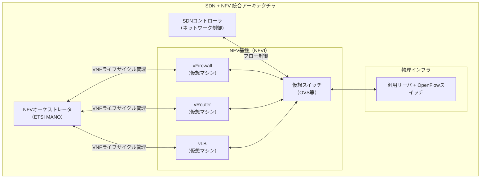
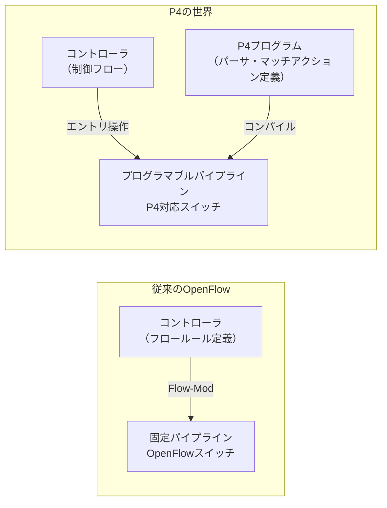

# SDN（Software-Defined Networking）

## 1. 歴史的背景：従来のネットワーク機器の限界

### 1.1 従来のネットワークアーキテクチャ

インターネットは長らく、**垂直統合された専用ハードウェア**によって支えられてきた。シスコ、ジュニパー、アルカテル・ルーセントといったベンダーが提供するルータやスイッチは、ハードウェアとソフトウェアが密結合した「ブラックボックス」として機能してきた。

各機器は独立したコントロールプレーン（経路計算や制御ロジック）とデータプレーン（パケットの実際の転送）を内包しており、隣接する機器とは標準プロトコル（OSPF、BGP、STPなど）を通じて分散的に協調する。この設計は1970〜80年代の分散型インターネットの思想に根ざしており、特定の機器が故障しても全体のネットワークが機能し続けるという堅牢性を実現してきた。

### 1.2 分散型ネットワークが抱えた課題

しかし、ネットワーク規模の拡大とサービス多様化が進むにつれ、従来のアーキテクチャは複数の深刻な限界を露呈するようになった。

**設定の複雑性**：100台のスイッチを持つネットワークでVLAN設定を変更する場合、管理者は各機器に個別にSSHでログインし、ベンダー固有のCLI（コマンドラインインタフェース）でコマンドを投入しなければならない。設定ミスはネットワーク障害に直結し、しかもどの機器で問題が発生したかを特定すること自体が困難だった。

**プロトコルの硬直性**：新しい転送ポリシーを実装するには、まずIETFで標準化されたプロトコルが必要であり、そのプロトコルがベンダーのファームウェアに実装され、フィールドに展開されるまでに数年かかるのが常だった。イノベーションのサイクルが根本的に遅かった。

**ベンダーロックイン**：各ベンダーは独自の管理インタフェースと設定構文を持ち、異なるベンダーの機器を混在させた環境では運用の複雑性が爆発的に増加した。

**トラフィックエンジニアリングの困難さ**：分散型の経路計算プロトコルは、局所的な情報しか持たない。ネットワーク全体のトポロジと負荷状況を俯瞰した最適なトラフィック配分（トラフィックエンジニアリング）は、MPLS-TEなどの複雑なメカニズムを必要とし、設定が極めて困難だった。

**スケールの問題**：Googleのデータセンターネットワークは数万台のサーバを相互接続し、Facebookのネットワークは何十億人ものユーザのトラフィックを捌く。このスケールでの運用を従来のアーキテクチャで行うには、専門知識を持つネットワークエンジニアの膨大な労力が必要だった。

### 1.3 プログラマブルネットワークへの萌芽

1990年代後半から、ネットワークをよりプログラマブルにしようとする試みが始まった。

**Active Networks**（1998年頃）は、パケット自体にコードを埋め込んでネットワーク内で実行させるという急進的なアイデアを提案したが、セキュリティ上の問題から実用化されなかった。

**GMPLS（Generalized Multiprotocol Label Switching）** や **ForCES（Forwarding and Control Element Separation）** は、コントロールプレーンとデータプレーンを分離する概念を模索したが、既存のネットワーク機器アーキテクチャの枠内に留まるものだった。

転機となったのは2004〜2008年にかけてのスタンフォード大学での研究である。Nick McKeownとScott Shenkerらのグループは、「もしコントロールプレーンを機器から切り離し、外部の集中型コントローラで実行できれば、ネットワークをソフトウェアで自由に制御できるはずだ」という洞察に基づき、OpenFlowプロトコルの原型を開発した。2008年のOpenFlowの論文発表は、SDN（Software-Defined Networking）という概念の正式な誕生を告げるものとなった。

## 2. SDNの基本概念：コントロールプレーンとデータプレーンの分離

### 2.1 アーキテクチャの全体像

SDNの本質は、ネットワーク機器から**コントロールプレーンを物理的・論理的に切り離し**、外部のソフトウェアとして動作するSDNコントローラに集約することにある。



このアーキテクチャは**3層構造**からなる：

1. **データ層（Data Plane / Infrastructure Layer）**：パケットの実際の転送を担当するスイッチやルータ。SDNにおいてこれらはシンプルな「パケット転送機」として機能し、コントローラからの指示に従ってフローテーブルに基づいたパケット処理を行う。

2. **コントロール層（Control Plane / Control Layer）**：ネットワーク全体の論理的な制御を担当するSDNコントローラ。データ層のすべての機器を集中管理し、経路計算、ポリシー適用、障害対応などを実行する。

3. **アプリケーション層（Application Layer）**：コントローラのAPIを使用してネットワーク動作をプログラムするアプリケーション群。ロードバランサ、ファイアウォール、トラフィックエンジニアリングシステムなどがここに位置する。

### 2.2 インタフェースの種類

SDNアーキテクチャには2種類の重要なインタフェースがある。

**サウスバウンドインタフェース（South-Bound Interface, SBI）**：コントローラとネットワーク機器の間の通信プロトコル。OpenFlowが最も有名だが、NETCONF/YANG、gNMI（gRPC Network Management Interface）、OVSDB（Open vSwitch Database Management Protocol）なども使用される。

**ノースバウンドインタフェース（North-Bound Interface, NBI）**：コントローラとアプリケーションの間のAPI。REST APIやgRPCが一般的に使用される。標準化は進んでいないが、ONF（Open Networking Foundation）を中心に整備が進められている。

### 2.3 集中型制御の論理的な意味

「集中型コントローラは単一障害点にならないか」という疑問は自然である。ここで重要な区別は、**論理的な集中**と**物理的な集中**の違いだ。

SDNコントローラは論理的には単一の制御エンティティとして振る舞うが、物理的には複数のサーバ上でクラスタとして動作できる。分散型クラスタのSDNコントローラは、コンセンサスアルゴリズム（Raft、Paxosなど）を使用して状態を同期し、一部のノードが障害を起こしても制御機能を維持する。

また、コントローラが一時的に到達不能になっても、スイッチはそれまでインストールされていたフローテーブルエントリに基づいてパケット転送を継続できる。これによりコントロールプレーンとデータプレーンの障害が独立する。

## 3. OpenFlowプロトコル：フローテーブルとマッチアクション

### 3.1 OpenFlowの概念

OpenFlowは、SDNのサウスバウンドインタフェースとして最も広く知られたプロトコルである。2008年にスタンフォード大学で開発され、その後ONF（Open Networking Foundation）が標準化を担当した。

OpenFlowの核心は**フローテーブル**にある。従来のスイッチ/ルータはMACアドレステーブルやルーティングテーブルを持ち、それに基づいてパケットを転送するが、OpenFlowスイッチはより汎用的な**フローテーブル**を持ち、コントローラから動的にルールをインストールされる。

### 3.2 フローテーブルの構造

フローテーブルの各エントリは3つの要素から構成される：

```
┌──────────────────────────────────────────────────────────────────┐
│                         フローテーブルエントリ                      │
├────────────────────┬──────────────────┬──────────────────────────┤
│  マッチフィールド    │     カウンタ      │        アクション          │
│  (Match Fields)   │   (Counters)     │       (Actions)          │
├────────────────────┼──────────────────┼──────────────────────────┤
│ in_port=1         │ packets=12450    │ output(port=2)           │
│ eth_src=aa:bb:..  │ bytes=1823400    │                          │
│ ip_dst=10.0.0.1   │ duration=120s    │                          │
└────────────────────┴──────────────────┴──────────────────────────┘
```

**マッチフィールド**は、パケットのどの特性に基づいてルールを適用するかを指定する。OpenFlow 1.3では、レイヤ2〜4にわたる40以上のフィールドをマッチに使用できる：

- レイヤ1：入力ポート番号
- レイヤ2：送受信MACアドレス、EtherType、VLANタグ
- レイヤ3：送受信IPアドレス、IPプロトコル番号、DSCP/ECN
- レイヤ4：TCP/UDPポート番号、ICMPタイプ/コード

**カウンタ**は統計情報を管理する。コントローラは定期的にフロー統計を読み取ることで、トラフィックパターンの把握やネットワーク監視を行う。

**アクション**は、マッチしたパケットに対して実行する処理を指定する：

| アクション | 説明 |
|-----------|------|
| `output(port)` | 指定ポートへ転送 |
| `drop` | パケットを廃棄 |
| `flood` | フラッディング（全ポートへ送信） |
| `controller` | コントローラへ送信（Packet-In） |
| `set_field` | ヘッダフィールドを書き換え |
| `push/pop VLAN` | VLANタグの追加/除去 |
| `group` | グループテーブルへ転送（複数アクション） |

### 3.3 マルチテーブルパイプライン

OpenFlow 1.1以降では、フローテーブルを複数持つ**パイプライン処理**が導入された。パケットはテーブル0から順番に処理され、各テーブルで次のテーブルへ移行するか、直接アクションを実行するかが決まる。



これにより、従来のネットワーク機器が実装していたアクセス制御、VLANプロセシング、ルーティング、QoSといった複数の処理を柔軟なパイプラインとして構成できる。

### 3.4 Packet-InとFlow-Mod：コントローラとの連携

OpenFlowスイッチがフローテーブルにマッチするエントリを持たないパケットを受信した場合、コントローラへ**Packet-Inメッセージ**を送信する。コントローラはパケットを検査し、どう処理すべきかを決定し、**Flow-Modメッセージ**で適切なフローエントリをスイッチにインストールする。



この方式はリアクティブフローインストールと呼ばれる。一方、コントローラが先回りしてフローエントリをインストールしておくプロアクティブフローインストールもあり、初回パケットのレイテンシを削減できる。

### 3.5 OpenFlowのバージョン史

| バージョン | 年 | 主な追加機能 |
|-----------|----|-----------|
| 1.0 | 2009 | 基本的なフローテーブル、12フィールドマッチ |
| 1.1 | 2011 | マルチテーブルパイプライン、グループテーブル |
| 1.2 | 2011 | IPv6サポート、拡張マッチ構造（OXM） |
| 1.3 | 2012 | メーターテーブル（QoS用）、コントローラ役割、IPv6拡張 |
| 1.4 | 2013 | フローモニタリング、バンドル機能 |
| 1.5 | 2014 | エグレスマッチ、パケットタイプベースマッチ |

実運用ではOpenFlow 1.3が最も広く使われており、多くのベンダーがサポートしている。

## 4. SDNコントローラ：ONOS、OpenDaylight、Ryu

SDNコントローラはSDNアーキテクチャの中核をなすソフトウェアである。様々なオープンソースおよび商用実装が存在するが、ここでは代表的な3つを詳述する。

### 4.1 ONOS（Open Network Operating System）

**ONOS**はONF（Open Networking Foundation）とAT&T、NTTなどのキャリアが中心となって開発したオープンソースのSDNコントローラである。2014年に公開された。

#### 設計目標

ONOSはキャリアグレードの通信事業者ネットワーク向けに設計されており、以下の目標を持つ：

- **高可用性**：クラスタリングによる障害耐性
- **高スケーラビリティ**：数千台規模のスイッチ管理
- **高パフォーマンス**：低レイテンシなフロー制御

#### アーキテクチャ

ONOSはApache Karafをベースにした**OSGi（Open Services Gateway initiative）フレームワーク**上で動作し、コア機能とアプリケーションが明確に分離されている。



**分散ストア**にはAtomix（以前はHazelcast）が使用され、Raftコンセンサスアルゴリズムによってクラスタ内でネットワーク状態が一貫して共有される。

#### Intent Framework

ONOSの特徴的な機能として**Intent Framework**がある。これは高レベルの「意図（Intent）」でネットワークポリシーを表現し、コントローラが具体的なフロールールへの変換を自動的に行う仕組みだ。

例えば「ホストAからホストBへの通信をQoS保証付きで許可する」という意図を宣言すれば、ONOSが経路計算、フロールールのインストール、障害時の再ルーティングをすべて自動で処理する。

### 4.2 OpenDaylight（ODL）

**OpenDaylight**はLinux Foundationのプロジェクトとして2013年に発足し、シスコ、IBM、Red Hatなど企業のコントリビューションによって開発されたオープンソースSDNコントローラである。

#### アーキテクチャの特徴

OpenDaylightはOSGiと**MD-SAL（Model-Driven Service Abstraction Layer）**を中心に設計されており、YANG（Yet Another Next Generation）データモデリング言語を用いてネットワーク機器の設定と状態を記述する。



ODLはエンタープライズおよびキャリア環境での採用実績が豊富であり、特にNETCONF/YANGを活用した設定管理では強みを持つ。

### 4.3 Ryu

**Ryu**はNTTが開発し、オープンソースとして公開した軽量なSDNコントローラフレームワークである。Python（特にPython 3）で書かれており、研究・プロトタイピング・小規模実装に向いている。

#### 特徴

- **シンプルなAPI**：Pythonのイベントドリブンプログラミングモデルで直感的にネットワークアプリを書ける
- **OpenFlowへの深いサポート**：OpenFlow 1.0〜1.5のほぼすべての機能をサポート
- **拡張性**：OpenStack Neutronとの統合プラグインも提供

```python
# Example of a simple Ryu application implementing a learning switch
from ryu.base import app_manager
from ryu.controller import ofp_event
from ryu.controller.handler import CONFIG_DISPATCHER, MAIN_DISPATCHER
from ryu.controller.handler import set_ev_cls
from ryu.ofproto import ofproto_v1_3
from ryu.lib.packet import packet, ethernet

class SimpleSwitch13(app_manager.RyuApp):
    OFP_VERSIONS = [ofproto_v1_3.OFP_VERSION]

    def __init__(self, *args, **kwargs):
        super(SimpleSwitch13, self).__init__(*args, **kwargs)
        # MAC address table: {dpid: {mac: port}}
        self.mac_to_port = {}

    @set_ev_cls(ofp_event.EventOFPSwitchFeatures, CONFIG_DISPATCHER)
    def switch_features_handler(self, ev):
        """Install table-miss flow entry on switch connection."""
        datapath = ev.msg.datapath
        ofproto = datapath.ofproto
        parser = datapath.ofproto_parser

        # Install table-miss entry: send unknown packets to controller
        match = parser.OFPMatch()
        actions = [parser.OFPActionOutput(ofproto.OFPP_CONTROLLER,
                                          ofproto.OFPCML_NO_BUFFER)]
        self.add_flow(datapath, 0, match, actions)

    @set_ev_cls(ofp_event.EventOFPPacketIn, MAIN_DISPATCHER)
    def _packet_in_handler(self, ev):
        """Handle Packet-In messages from switches."""
        msg = ev.msg
        datapath = msg.datapath
        ofproto = datapath.ofproto
        parser = datapath.ofproto_parser
        in_port = msg.match['in_port']

        # Parse Ethernet header
        pkt = packet.Packet(msg.data)
        eth = pkt.get_protocols(ethernet.ethernet)[0]
        dst = eth.dst
        src = eth.src
        dpid = datapath.id
        self.mac_to_port.setdefault(dpid, {})

        # Learn source MAC address to avoid flooding later
        self.mac_to_port[dpid][src] = in_port

        # Look up destination port; flood if unknown
        if dst in self.mac_to_port[dpid]:
            out_port = self.mac_to_port[dpid][dst]
        else:
            out_port = ofproto.OFPP_FLOOD

        actions = [parser.OFPActionOutput(out_port)]

        # Install flow rule to avoid future Packet-In for same flow
        if out_port != ofproto.OFPP_FLOOD:
            match = parser.OFPMatch(in_port=in_port, eth_dst=dst, eth_src=src)
            self.add_flow(datapath, 1, match, actions)
```

Ryuはシンプルさゆえに学習コストが低く、大学の研究やPoCの実装に広く使われている。

### 4.4 コントローラの比較

| 項目 | ONOS | OpenDaylight | Ryu |
|------|------|-------------|-----|
| 主な用途 | キャリア・通信事業者 | エンタープライズ・通信 | 研究・プロトタイピング |
| 実装言語 | Java | Java | Python |
| スケーラビリティ | 非常に高い | 高い | 低〜中 |
| HA対応 | クラスタネイティブ | クラスタ対応 | 限定的 |
| 学習コスト | 高い | 高い | 低い |
| コミュニティ | 活発 | 大規模 | 中程度 |

## 5. SDNのユースケース

### 5.1 データセンターネットワーク

SDNが最も広く採用されているのは**クラウドプロバイダのデータセンターネットワーク**である。

GoogleはB4と呼ばれるSDNベースのWANを2012年から運用しており、WANリンクの利用率を従来の30〜40%から近接100%まで向上させることに成功したと報告している。データセンター内では、GoogleのJupiterと呼ばれるクロスコネクトファブリックがSDNで制御されている。

**マルチテナント仮想ネットワーク（オーバーレイネットワーク）**もSDNの重要なユースケースだ。AWSのVPC（Virtual Private Cloud）やOpenStackのNeutronは、SDNの概念に基づいてテナントごとに独立した仮想ネットワークを提供する。VXLAN（Virtual Extensible LAN）やGeneveなどのオーバーレイプロトコルとOpenFlow/OVS（Open vSwitch）を組み合わせることで、物理ネットワークトポロジとは独立した仮想ネットワークトポロジを実現している。



### 5.2 WAN最適化（SD-WAN）

**SD-WAN（Software-Defined WAN）**はSDNの概念をエンタープライズのWAN接続に適用したものである。従来は高価なMPLS回線に依存していたエンタープライズネットワークが、インターネットVPNやLTE/5G回線を組み合わせた低コストなWANに移行できるよう、SDNコントローラがトラフィックの動的なルーティングと品質管理を担う。

SD-WANの主な機能：

- **動的パス選択**：アプリケーションのSLAに基づき、MPLSかインターネットVPNかを動的に選択
- **リンク障害時の自動切り替え**：ミリ秒レベルでのフェイルオーバー
- **アプリケーション認識型ルーティング**：ERP、VoIP、ビデオ会議などのアプリを識別し優先処理
- **集中型ポリシー管理**：数百の拠点の設定を一元管理

シスコのViptela（現Cisco SD-WAN）、VMwareのVeloCloud（現VMware SD-WAN）、Versa Networksなどが主要製品として知られる。

### 5.3 ネットワークスライシング

**ネットワークスライシング**は、単一の物理ネットワークインフラ上に複数の独立した論理ネットワーク（スライス）を構成する技術であり、5Gの中核概念の一つである。

各スライスは、独自のトポロジ、帯域、レイテンシ、セキュリティポリシーを持つことができる。例えば：

- **eMBB スライス**：スマートフォン向け高速データ通信
- **URLLC スライス**：自動運転・工場制御向け超低レイテンシ通信
- **mMTC スライス**：IoTセンサー向け大規模接続

SDNはネットワークスライシングの制御プレーンを担い、各スライスに割り当てるリソースの動的な管理を実現する。



### 5.4 セキュリティ応用

SDNはセキュリティの観点でも革新的な可能性を持つ。

**DDoS対策**：大規模なDDoS攻撃を検知した際、SDNコントローラが攻撃トラフィックの特徴（送信元IP範囲、プロトコル、レート）に基づくフィルタリングルールをネットワーク全体のスイッチに瞬時に適用できる。

**マイクロセグメンテーション**：データセンター内のVM間通信を細かく制御し、仮に1つのVMがマルウェアに感染しても他のVMへの横断侵害を防ぐ。VMwareのNSX-Tがこの代表的実装である。

**異常検知と自動対応**：SDNコントローラがフロー統計を継続的に収集し、機械学習による異常検知と組み合わせることで、不正なフローを自動的に遮断する自律的なセキュリティシステムを構築できる。

## 6. NFV（Network Functions Virtualization）との関係

### 6.1 NFVとは

**NFV（Network Functions Virtualization）**は、従来は専用ハードウェアで実装されていたネットワーク機能（ルータ、ファイアウォール、ロードバランサ、IDS/IPS、NAT、DPIなど）を、汎用サーバ上で動作する仮想マシンまたはコンテナとして実装する技術である。

2012年にAT&TやBT、ドイツテレコムなどの主要通信事業者がETSI（欧州電気通信標準化機構）に提出した白書が起源であり、専用アプライアンスへの依存から脱却してコスト削減と俊敏性向上を目指すものだ。

代表的なNFV実装：

- **vRouter**：汎用サーバ上で動作するソフトウェアルータ（VyOS、FRRoutingなど）
- **vFirewall**：ソフトウェアファイアウォール（iptables、pfSense、Fortinet FortiGate-VMなど）
- **vEPC**：仮想化されたモバイルコアネットワーク
- **vCDN**：仮想コンテンツデリバリネットワーク

### 6.2 SDNとNFVの相補関係

SDNとNFVは独立した概念だが、互いに強力な補完関係にある。



**サービスチェイニング（Service Function Chaining, SFC）**は、SDNとNFVを組み合わせた典型的なユースケースだ。パケットがFirewall → IDS → ロードバランサの順に処理されるよう、SDNコントローラがトラフィックをVNF間で誘導する。IETF RFC 7665で標準化されている。

| 観点 | SDN | NFV |
|------|-----|-----|
| 主な対象 | ネットワーク制御・転送 | ネットワーク機能の実装 |
| 目的 | コントロールプレーンの分離・集中化 | ハードウェアからのソフトウェア分離 |
| 主要標準 | ONF（OpenFlow） | ETSI（MANO） |
| 採用主体 | クラウドプロバイダ・キャリア | 通信事業者 |
| 相互依存 | NFVの転送にSDNを活用 | SDNの機能をNFVで実装 |

## 7. 実運用の課題

### 7.1 スケーラビリティ

SDNコントローラが大規模ネットワーク全体を管理する場合、いくつかのスケーラビリティ課題が生じる。

**フローテーブルのサイズ限界**：ハードウェアスイッチのTCAM（Ternary Content Addressable Memory）はフローエントリ数に上限がある（数千〜数万エントリ）。マイクロフロー（5タプルベースの細かいフロー）でSDNを運用する場合、このTCAMが飽和する問題が生じる。

解決策として以下が用いられる：
- **アグリゲーションルール**：細かいフローを集約した粗いルールで補完
- **ハイブリッドSDN**：一部のトラフィックを従来の分散ルーティングで処理
- **階層的制御**：ローカルコントローラとグローバルコントローラの2層構造

**コントローラのスループット**：多数のスイッチから頻繁にPacket-Inが届く環境では、コントローラが処理ボトルネックになる。プロアクティブフローインストールや、エッジスイッチでの細かい制御とコアスイッチでの粗い制御を組み合わせるアーキテクチャで軽減できる。

### 7.2 信頼性と高可用性

**コントローラ障害時の挙動**：コントローラが障害を起こした場合、既存のフローエントリは有効のままパケット転送は継続されるが、新規フローのセットアップや経路変更はできない。フローエントリのタイムアウトによってエントリが削除されると、そのフローが止まる可能性がある。

**コントローラクラスタリング**：ONOSのようなコントローラはRaftによる分散コンセンサスでクラスタを構成し、コントローラノードの障害時に他のノードが自動的に引き継ぐ。ただし、リーダー選出中の一時的な制御停止は避けられない。

**レイテンシ問題**：コントローラとスイッチ間のレイテンシが高い場合（特にWAN越しの場合）、Packet-Inのラウンドトリップタイムが大きくなり、初回フロー確立の遅延が増加する。地理的に分散したデータセンターでSDNを運用する場合、コントローラの配置戦略が重要になる。

### 7.3 移行戦略

既存ネットワークをSDNに移行する際の現実的な課題は大きい。

**ハイブリッドネットワーク**：既存のレガシー機器とSDN対応機器が混在する環境では、BGPやOSPFなどの従来プロトコルとOpenFlowを共存させる必要がある。多くのSDN導入事例では、完全置き換えではなくハイブリッドアーキテクチャが採用されている。

**スキルセットの変化**：SDN環境では、ネットワークエンジニアにソフトウェア開発スキルが求められる。コントローラアプリケーションをPythonやJavaで開発し、テストし、デプロイするプロセスは、従来のネットワーク機器設定とは大きく異なる。

**インターオペラビリティ**：OpenFlowは標準化されているが、実装の細部においてベンダー間で互換性の問題が生じることがある。また、OpenFlow以外のサウスバウンドプロトコル（NETCONF、gNMI）への対応がベンダーによってまちまちだ。

**セキュリティ上の考慮**：コントローラはネットワーク全体の単一の制御点であるため、コントローラへの不正アクセスはネットワーク全体の制御喪失を意味する。TLSによるコントローラ-スイッチ間の通信暗号化、コントローラへの認証・認可、監査ログの整備が不可欠である。

### 7.4 コントローラとデータプレーンの一貫性問題

分散システムとしてのSDNにおいて、**ネットワーク状態の一貫性**は本質的な課題だ。

コントローラが複数のスイッチに対してフロールールを順次インストールする際、インストールが完了する前のトランジェント状態では、一部のスイッチのみ新ルールを持ち、他のスイッチは旧ルールを持つ状態が生じる。この不一致はパケットループやブラックホールを引き起こす可能性がある。

**Consistent Updates**（Reitblatt et al., 2012）と呼ばれる手法では、バージョンタグをパケットに付与し、スイッチが完全に新ルールに移行してから旧ルールを削除するという2フェーズの更新手順によって、パケットが常に「旧ポリシー全体」または「新ポリシー全体」のいずれか一方に従って処理されることを保証する。

## 8. 将来の展望

### 8.1 Intent-Based Networking（IBN）

**Intent-Based Networking（IBN）**は、SDNをさらに抽象化した概念であり、ネットワーク管理者がネットワークの「何を実現したいか（意図）」を宣言的に記述するだけで、システムが自律的にそれを実現・維持するアーキテクチャを目指す。

Gartnerが2017年に定義したIBNの主要コンポーネント：

1. **翻訳（Translation）**：高レベルのビジネスポリシーを低レベルのネットワーク設定に変換
2. **活性化（Activation）**：変換した設定をネットワーク全体に適用
3. **保証（Assurance）**：継続的な検証と、意図からの逸脱があった場合の自動修正

シスコのDNA Center（Catalyst Center）やジュニパーのApstraがIBNを標榜した製品として知られる。

ONOSのIntent Frameworkは初期のIBN実装の一例であり、より高度なIntent APIとAI/ML統合が今後の研究焦点となっている。

### 8.2 P4（Programming Protocol-Independent Packet Processors）

**P4**は、データプレーンの動作をプログラム可能にするための高水準言語である。2014年にBosshartらによって提案された。

OpenFlowがコントローラからスイッチへ「どのフローをどのポートへ転送するか」を指示するのに対し、P4は「スイッチ自体がどのようにパケットを処理するか」をプログラムで定義できる。



P4の特徴：

- **プロトコル非依存**：Ethernet、IPv4、IPv6、MPLSに限らず、独自のヘッダ形式もパース・処理できる
- **ターゲット非依存**：同一のP4プログラムを、ソフトウェアスイッチ、FPGAスイッチ、ASICスイッチにコンパイルできる
- **高速データプレーン機能**：In-band Network Telemetry（INT）、分散ロードバランシング、暗号処理などをデータプレーンで実現できる

```p4
// Simple example: parsing Ethernet and IPv4 headers in P4
header ethernet_t {
    bit<48> dst_addr;
    bit<48> src_addr;
    bit<16> ether_type;
}

header ipv4_t {
    bit<4>  version;
    bit<4>  ihl;
    bit<8>  dscp;
    bit<8>  ecn;
    bit<16> total_len;
    bit<16> identification;
    bit<3>  flags;
    bit<13> frag_offset;
    bit<8>  ttl;
    bit<8>  protocol;
    bit<16> checksum;
    bit<32> src_addr;
    bit<32> dst_addr;
}

// Parser state machine
parser MyParser(packet_in pkt, out headers_t hdr) {
    state start {
        pkt.extract(hdr.ethernet);
        transition select(hdr.ethernet.ether_type) {
            0x0800: parse_ipv4;  // IPv4
            default: accept;
        }
    }

    state parse_ipv4 {
        pkt.extract(hdr.ipv4);
        transition accept;
    }
}
```

GoogleはP4を用いたIn-band Network Telemetry（INT）を本番環境に適用しており、パケットがネットワークを通過する際にスイッチがタイムスタンプやキュー深度などの情報をパケットに埋め込む仕組みを実現している。

P4言語の標準化はP4.orgが担当しており、P4_16（現行版）が主流である。IntelのTofino ASICやBroadcomのChrome、NetronomeのスマートNICなどがP4ネイティブのハードウェアとして知られる。

### 8.3 5GとSDN/NFVの統合

5Gコアネットワーク（5GC）は、3GPP標準においてサービスベースアーキテクチャ（SBA）を採用しており、SDNとNFVの概念が標準仕様に組み込まれている。

**UPF（User Plane Function）**は5Gにおけるデータプレーンを担うNFVである。ユーザートラフィックの実際の転送・QoS適用を行うUPFを汎用サーバ上に展開し、**SMF（Session Management Function）**がSDN的な役割でUPFを集中制御する。

**MEC（Multi-Access Edge Computing）**との連携もSDN/NFVの重要テーマだ。エッジクラウドにNFVとして展開されたアプリケーション（AR/VR処理、自動運転データ解析など）へのトラフィックを、SDNによってネットワークエッジで局所的にルーティングすることで、コアネットワークへの不要なトラフィックを削減し、超低レイテンシを実現する。

### 8.4 eBPFとカーネルレベルのプログラマブルデータプレーン

**eBPF（extended Berkeley Packet Filter）**はLinuxカーネル内でサンドボックス化されたプログラムを実行するメカニズムであり、ネットワーク処理（XDP: eXpress Data Path）に応用することで、カーネルレベルの高速パケット処理をプログラム可能にする。

Ciliumはebpfを使ったKubernetesのネットワーキングとセキュリティを実現するプロジェクトであり、従来のiptablesベースのNetworkPolicyよりも高速かつスケーラブルなマイクロセグメンテーションを実現している。

P4がスイッチのデータプレーンをプログラムするのに対し、eBPFはサーバ内のカーネルネットワークスタックをプログラムするものであり、両者を組み合わせることでエンドツーエンドのプログラマブルデータプレーンが構成できる。

### 8.5 AI/MLとのネットワーク自動化

AIと機械学習のネットワーキングへの統合が加速している。

**自己修復ネットワーク**：異常検知モデルがネットワークテレメトリを分析し、障害の予兆を捉えてSDNコントローラに事前の経路変更を指示する。

**トラフィック予測と最適化**：時系列予測モデルがトラフィックパターンを学習し、事前に最適なフロー配置を計算する。Googleは強化学習を用いたデータセンターネットワークのトラフィック最適化を研究している。

**自然言語によるIntent表現**：大規模言語モデル（LLM）を活用し、「営業時間中はERPトラフィックを最優先にしてほしい」といった自然言語の指示をIBNのIntentへ変換する研究が始まっている。

## 9. まとめ

SDNはネットワーキングのパラダイムを根本から変えた技術であり、その影響は今も拡大し続けている。

コントロールプレーンとデータプレーンの分離という単純な概念は、ネットワークのプログラマビリティを解放し、クラウドコンピューティングの爆発的な成長を支えるデータセンターネットワークを可能にした。OpenFlowが切り開いた道を、P4はさらにデータプレーン自体のプログラマビリティへと深化させている。

SDNは「すべての問題を解決する銀の弾丸」ではない。スケーラビリティ、信頼性、移行の複雑さ、そしてセキュリティ上の考慮事項は現実的な課題として残る。しかしSDNが実現した「ネットワークをソフトウェアとして扱う」という概念は、クラウドネイティブの時代に不可欠な基盤となっている。

Intent-Based Networking、P4、5G、eBPF、AI/MLとの統合が進む中で、SDNは成熟期を迎えながらも進化を続けている。ネットワークエンジニアリングとソフトウェアエンジニアリングの境界が消えていく未来において、SDNの概念は核心的な位置を占め続けるだろう。

## 参考文献・関連情報

- McKeown, N. et al., "OpenFlow: Enabling Innovation in Campus Networks," ACM SIGCOMM Computer Communication Review, 2008
- Kreutz, D. et al., "Software-Defined Networking: A Comprehensive Survey," Proceedings of the IEEE, 2015
- Bosshart, P. et al., "P4: Programming Protocol-Independent Packet Processors," ACM SIGCOMM Computer Communication Review, 2014
- Jain, S. et al., "B4: Experience with a Globally-Deployed Software Defined WAN," ACM SIGCOMM, 2013
- ETSI NFV White Paper, "Network Functions Virtualisation," 2012
- ONF (Open Networking Foundation): https://opennetworking.org/
- ONOS Project: https://opennetworking.org/onos/
- OpenDaylight: https://www.opendaylight.org/
- P4.org: https://p4.org/
