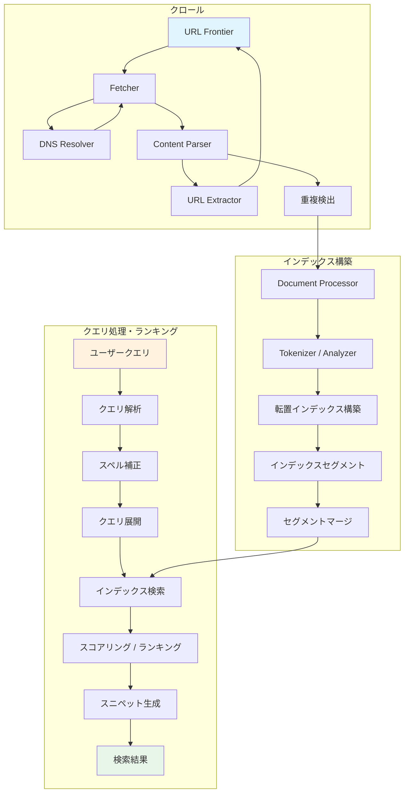
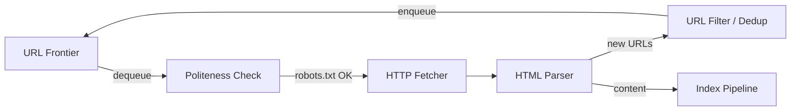
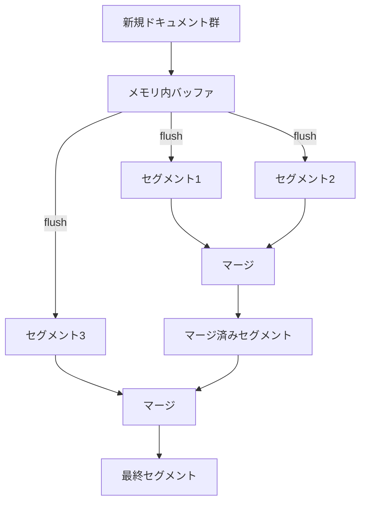
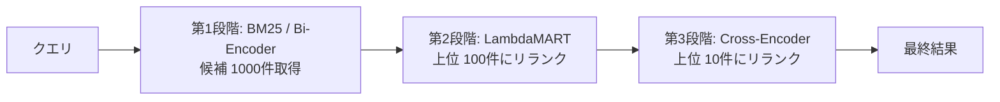
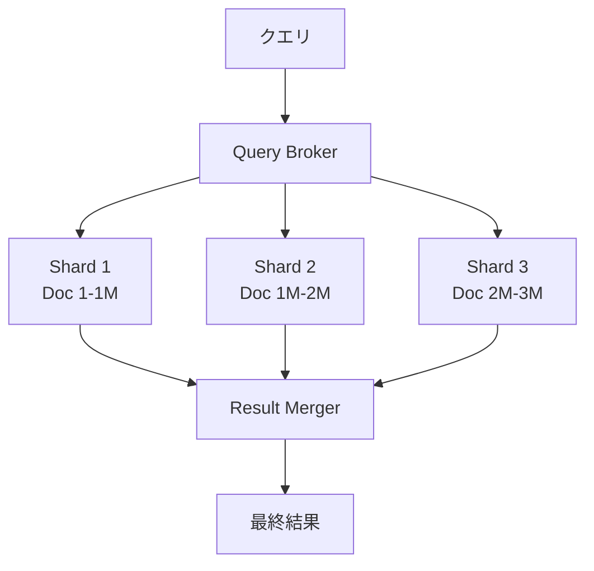
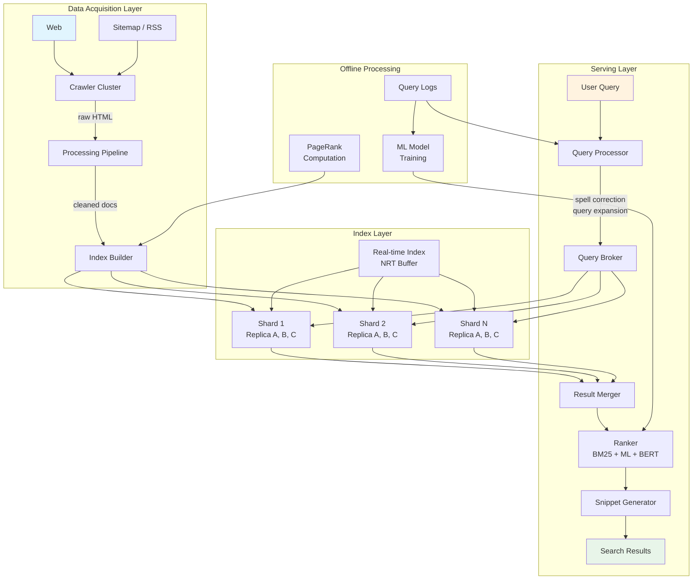

# 検索エンジンの全体像（クロール、インデックス、ランキング）

## 1. はじめに：検索エンジンとは何か

検索エンジンは、膨大な情報の中からユーザーの意図に合致する文書を発見し、その関連性の高い順に提示するシステムである。現代のWeb検索エンジンは数千億のWebページをインデックスし、世界中のユーザーからの1日あたり数十億のクエリに対してミリ秒単位で応答を返す。この驚異的な規模と速度を実現するために、検索エンジンは**クロール（Crawling）**、**インデックス構築（Indexing）**、**ランキング（Ranking）**という3つの中核的なパイプラインと、それを支える大規模分散システム基盤を組み合わせている。

本記事では、検索エンジンの全体アーキテクチャを俯瞰し、各構成要素の設計原理と技術的詳細を解説する。歴史的な発展から現代のLLMを活用した検索まで、検索エンジンという巨大なシステムの本質を理解することを目指す。



## 2. 歴史的発展：AltaVistaからGoogleへ、そして現代へ

### 2.1 黎明期（1990年代前半）

World Wide Webの誕生（1991年）直後から、急増するWebページを整理する試みが始まった。初期のWebディレクトリは、人間が手動でWebサイトを分類するという牧歌的なアプローチを取っていた。Yahoo!（1994年）がこの代表例である。しかしWebの指数関数的な成長は、人手による分類をすぐに不可能にした。

1994年にWebCrawlerが登場し、自動的にWebを巡回して全文検索を提供する最初の検索エンジンとなった。同年、Lycosが続き、1995年にはAltaVistaが公開された。

### 2.2 AltaVistaの革新

AltaVista（1995年）は、当時としては画期的な規模でWebをインデックスした検索エンジンである。Digital Equipment Corporation（DEC）のAlphaサーバー上で動作し、数千万のWebページを全文インデックスする能力を持っていた。AltaVistaは高速なクロールと大規模インデックスの技術的可能性を示したが、ランキングの質には限界があった。キーワードの出現頻度やメタタグに大きく依存するランキングは、スパマーによる操作に対して脆弱であった。

### 2.3 Googleの登場とPageRank

1998年、Sergey BrinとLarry Pageが発表した論文「The Anatomy of a Large-Scale Hypertextual Web Search Engine」は、検索エンジンの歴史において最も重要な転換点となった。彼らの核心的なアイデアは**PageRank**アルゴリズムである。

PageRankは、Webのハイパーリンク構造を利用して各ページの「重要度」を算出する。多くの重要なページからリンクされているページは重要である、という再帰的な定義に基づいている。この発想により、テキストの内容だけでなくWeb全体のグラフ構造をランキングに活用することが可能となり、検索品質は劇的に向上した。

### 2.4 現代の検索エンジン

2010年代以降、検索エンジンは機械学習を本格的に導入した。Googleは2015年にRankBrain（Word2Vecベースの意味理解）を、2019年にBERT（双方向Transformerによるクエリ理解）を導入した。2023年以降はLLM（大規模言語モデル）を活用した検索生成体験（SGE: Search Generative Experience）が登場し、検索エンジンはキーワードマッチングから意味理解へ、さらには回答生成へと進化を続けている。

| 時代 | 代表的な技術 | ランキングの特徴 |
|---|---|---|
| 1990年代前半 | ディレクトリ型 | 人手分類 |
| 1990年代後半 | AltaVista, Lycos | TF-IDF、メタタグ |
| 2000年代 | Google | PageRank + テキスト特徴量 |
| 2010年代 | Google, Bing | 機械学習ランキング（Learning to Rank） |
| 2020年代 | Google, Bing, Perplexity | BERT/LLMベースの意味理解、生成AI統合 |

## 3. Webクローラーの設計

Webクローラー（Spider / Botとも呼ばれる）は、Webからページを自動的に収集するプログラムである。検索エンジンの品質はクローラーが収集するデータの品質と鮮度に直結するため、クローラーの設計は極めて重要である。

### 3.1 基本アーキテクチャ

クローラーの基本的な動作は以下のループである。

1. URLフロンティア（未訪問URLの優先度付きキュー）からURLを取り出す
2. robots.txtを確認し、クロールが許可されているか検証する
3. HTTPリクエストを送信してページを取得する
4. HTMLを解析し、テキストコンテンツとリンクを抽出する
5. 新たに発見したURLをフロンティアに追加する
6. 取得したコンテンツをインデックスパイプラインに送る



### 3.2 URL Frontier

URL Frontierは、クローラーが次に訪問すべきURLを管理するデータ構造である。単純なFIFOキューでは不十分であり、以下の要件を同時に満たす必要がある。

**優先度付け（Prioritization）**: すべてのURLが等しく重要なわけではない。ニュースサイトのトップページは個人ブログの深層ページよりも優先的にクロールすべきである。優先度は以下の要因から決定される。

- PageRankやドメインの権威性
- ページの更新頻度（変更率が高いページはより頻繁にクロール）
- コンテンツの種類（ニュース記事は時間に敏感）
- リンクグラフ上での距離（ルートページに近いほど優先）

**礼儀正しさの強制（Politeness Enforcement）**: 同一ホストに対して過度に高頻度なリクエストを送信すると、そのWebサーバーに過負荷を与え、DoS攻撃と変わらない状況を引き起こす。URL Frontierはホストごとのレート制限を管理し、前回のアクセスから一定の間隔（一般的にはrobots.txtの`Crawl-delay`指示に従い、指定がなければ数秒〜数十秒）を空けてからリクエストを送信する。

実装上は、優先度キューとホスト別のFIFOキューを組み合わせた2層構造が一般的である。

```
優先度キュー（Front Queue）:
  Priority 1: [url_a, url_b, ...]    ← 高優先度
  Priority 2: [url_c, url_d, ...]
  Priority 3: [url_e, url_f, ...]    ← 低優先度

ホスト別キュー（Back Queue）:
  host1.com: [url_a, url_e, ...]     ← 次回アクセス可能時刻: T+5s
  host2.com: [url_b, url_c, ...]     ← 次回アクセス可能時刻: T+3s
  host3.com: [url_d, url_f, ...]     ← 次回アクセス可能時刻: T+10s
```

Front Queueから優先度の高いURLを取り出し、そのURLが属するホストのBack Queueにルーティングする。Back Queueからは、レート制限を満たしたタイミングでURLをディスパッチする。

### 3.3 Politeness（礼儀正しさ）

Webクローラーの設計において、Politenessは技術的要件であると同時に倫理的義務でもある。

**robots.txt**: Robots Exclusion Protocol（REP）に基づく`robots.txt`ファイルは、Webサイト管理者がクローラーに対してアクセスを制限するための標準的なメカニズムである。

```
User-agent: *
Disallow: /private/
Disallow: /admin/
Crawl-delay: 10

User-agent: Googlebot
Allow: /
Crawl-delay: 1

Sitemap: https://example.com/sitemap.xml
```

大規模クローラーは各ホストの`robots.txt`をキャッシュし、定期的に再取得する。robots.txtの解析と遵守は、クローラーの最も基本的な要件である。

**リクエスト間隔**: 同一ホストへのリクエスト間隔は、`Crawl-delay`指示がない場合でも最低数秒は空けるべきとされる。Googlebotは公式にはサーバーの応答時間に基づいて動的に調整していると述べている。

**User-Agent識別**: クローラーは自身を識別する`User-Agent`ヘッダーを正直に設定し、Webサイト管理者が連絡できるよう連絡先情報を公開すべきである。

### 3.4 重複検出

Webには同一または非常に類似したコンテンツが複数のURLに存在する。ミラーサイト、印刷用ページ、URL正規化の違いなどがその原因である。重複コンテンツを何度もインデックスすることはストレージの無駄であり、検索品質も低下させる。

**URL正規化**: プロトコルの統一（http→https）、末尾スラッシュの正規化、パラメータの並び替え、フラグメントの除去などにより、同一リソースを指す異なるURLを一つに統合する。

**コンテンツベースの重複検出**: URL正規化では検出できない、内容が同一だが異なるURLを持つページを検出するために、コンテンツのフィンガープリントを使用する。

- **完全一致検出**: ページコンテンツのハッシュ（SHA-256など）を計算し、既知のハッシュと比較する。完全に同一のページのみを検出できる。
- **近似重複検出（Near-Duplicate Detection）**: SimHash（Charikar, 2002）やMinHash（Broder, 1997）といった局所性鋭敏ハッシュ（Locality-Sensitive Hashing, LSH）を用いる。これにより、わずかな差異（広告の違い、日付の更新など）しかないページをほぼ同一と判定できる。

SimHashは以下のアルゴリズムで動作する。

1. 文書をトークン（n-gram）に分割する
2. 各トークンの暗号学的ハッシュを計算する（固定長ビット列）
3. ビット列の各位置について、1なら+1、0なら-1として重み付き加算する
4. 最終的な合計が正なら1、負なら0として最終ハッシュを生成する
5. 二つの文書のSimHash間のハミング距離が閾値以下なら近似重複と判定する

### 3.5 クロールの規模

Googleのクローラーは1日あたり数十億のページをクロールしていると推定される。この規模を支えるために、クローラーは数千のマシンに分散され、DNSリゾルバのキャッシュ、HTTP接続プール、非同期I/Oなどの最適化が施されている。

## 4. インデックス構築

クロールによって収集された生のHTMLドキュメントは、検索可能な形式に変換される必要がある。このプロセスがインデックス構築（Indexing）である。

### 4.1 ドキュメント処理パイプライン

HTMLドキュメントは、以下のパイプラインで処理される。

1. **HTMLパース**: HTMLタグを解析し、テキストコンテンツを抽出する。`<script>`、`<style>`、`<nav>`などのノイズ要素を除去する
2. **言語検出**: テキストの言語を判定する（n-gramベースの統計的手法が一般的）
3. **テキスト正規化**: Unicode正規化、大文字小文字の統一、数値の正規化などを行う
4. **トークン化（Tokenization）**: テキストを個々のトークン（単語）に分割する。英語ではスペース区切りが基本だが、日本語や中国語では形態素解析器（MeCab、Kuromoji等）やn-gramが必要となる
5. **言語処理**: ステミング（stemming: 語幹への変換、例: "running"→"run"）やレンマタイゼーション（lemmatization: 辞書形への変換）を適用する。ストップワード（"the"、"a"、"は"、"の"など）の除去も行うが、現代の検索エンジンではストップワード除去を行わない傾向にある（フレーズクエリの精度に影響するため）
6. **フィールド抽出**: タイトル、本文、URL、アンカーテキスト、メタデータなどの構造的フィールドを分離する。これらのフィールドはランキング時に異なる重みを付与される

### 4.2 転置インデックスの構築

転置インデックス（Inverted Index）は検索エンジンの中核データ構造である。各ターム（単語）に対して、そのタームを含むドキュメントのリスト（ポスティングリスト）を格納する。

```
ターム辞書:
  "検索"    → [doc1:3, doc5:1, doc8:2, doc15:5, ...]
  "エンジン" → [doc1:2, doc3:1, doc8:1, ...]
  "アルゴリズム" → [doc2:4, doc5:2, doc12:1, ...]

各エントリ: docID:ターム頻度（TF）
```

ポスティングリストには、ドキュメントIDとターム頻度（TF）に加えて、以下の情報を格納することがある。

- **出現位置（Position）**: フレーズクエリや近接クエリに使用
- **フィールド情報**: タームがタイトルに出現したのか本文に出現したのかを示す
- **ペイロード**: カスタムメタデータ（例: 語のブースト値）

### 4.3 インデックス圧縮

Webスケールの転置インデックスは膨大なサイズとなるため、効率的な圧縮が不可欠である。ポスティングリスト内のドキュメントIDはソート済みであるため、連続するIDの差分（d-gap）を格納することで値を小さくし、可変長符号化を適用できる。

```
元のポスティングリスト: [3, 7, 12, 15, 21, 30]
d-gap符号化:           [3, 4,  5,  3,  6,  9]
```

代表的な圧縮手法を以下に示す。

| 手法 | 特徴 | 用途 |
|---|---|---|
| Variable Byte（VByte） | 1バイトの最上位ビットを継続フラグに使用 | 汎用的、デコードが高速 |
| PForDelta | ブロック単位でビット幅を決定し、例外値を別途格納 | 高速なデコード、SIMD最適化可能 |
| Simple9 / Simple16 | 32ビットワードに複数の整数をパック | デコード速度と圧縮率のバランス |
| Elias Gamma / Delta | 情報理論的に最適に近い符号 | 非常に小さな値の圧縮 |
| Roaring Bitmap | 整数集合のハイブリッド表現（配列/ビットマップ/RLE） | フィルタリング、ファセット検索 |

Lucene（Elasticsearch/Solrの基盤）はPForDeltaの変種であるFOR（Frame of Reference）圧縮を採用し、128個のドキュメントIDをブロック単位で圧縮している。

### 4.4 セグメントベースのインデックス

大規模な転置インデックスを一度に構築することは非現実的である。実際の検索エンジンでは、**セグメント（Segment）**と呼ばれる小さな不変のインデックス単位を逐次的に構築し、後からマージする戦略を取る。これはLSM-Tree（Log-Structured Merge-Tree）の思想と同じである。



**インメモリバッファ**: 新たに到着したドキュメントは、まずメモリ上のバッファ（インメモリインデックス）に追加される。バッファが一定サイズに達すると、ディスク上の新しいセグメントとしてフラッシュされる。

**セグメントマージ**: 小さなセグメントが増えると検索時に全セグメントを走査する必要があるため、バックグラウンドでセグメントのマージが行われる。マージ戦略には以下のものがある。

- **Tiered Merge Policy**: セグメントをサイズに基づいて層（tier）に分類し、同じ層のセグメントをまとめてマージする。Lucene 9以降のデフォルト
- **Log Merge Policy**: セグメントサイズの対数に基づいてマージを判断する。Luceneの旧デフォルト

**ドキュメントの削除**: セグメントは不変であるため、ドキュメントの削除は実際にはセグメント内のデータを消去せず、削除フラグ（delete marker / tombstone）を記録する。実際のデータはマージ時に除去される。

### 4.5 リアルタイムインデックス更新

従来のバッチ型インデックス構築では、クロールからインデックスが検索可能になるまでに数時間から数日のタイムラグがあった。しかし、ニュース記事や災害情報など、即座に検索可能にすべきコンテンツが存在する。

**NRT（Near-Real-Time）インデックス**: Lucene/Elasticsearchが採用するアプローチである。インメモリバッファに書き込まれたドキュメントは、`refresh`操作（デフォルトでは1秒間隔）によって検索可能なセグメントとして公開される。ディスクへの永続化（`flush`/`commit`）とは独立しており、メモリ上のセグメントを検索対象に含めることで低レイテンシを実現する。

**パーコレーター（Percolator）**: Googleが2010年に発表した、大規模データセットに対するインクリメンタルな更新処理フレームワークである。バッチ処理を再実行することなく、変更があったドキュメントのみを効率的にインデックスに反映する。

## 5. ランキングアルゴリズム

検索エンジンの品質を最も大きく左右するのがランキングアルゴリズムである。クエリに対して関連するドキュメントを発見するだけでなく、最も関連性の高いものを上位に配置することが求められる。

### 5.1 TF-IDF

TF-IDF（Term Frequency - Inverse Document Frequency）は、情報検索における最も古典的な重み付け手法である。

$$
\text{TF-IDF}(t, d, D) = \text{TF}(t, d) \times \text{IDF}(t, D)
$$

- **TF（ターム頻度）**: ドキュメント $d$ 内でターム $t$ が出現する回数。高頻度のタームほどそのドキュメントにおいて重要とみなす
- **IDF（逆文書頻度）**: コーパス全体 $D$ におけるタームの希少性。多くのドキュメントに出現する一般的なターム（"the"、"は"など）の重みを下げる

$$
\text{IDF}(t, D) = \log \frac{|D|}{|\{d \in D : t \in d\}|}
$$

TF-IDFの直感的な意味は明快である。あるドキュメント内で頻出し（高TF）、かつコーパス全体では珍しいターム（高IDF）は、そのドキュメントの特徴を強く表している。

### 5.2 BM25

BM25（Best Matching 25）は、TF-IDFの改良版として1990年代にRobertsonらによって提案された確率的ランキングモデルである。現在でも多くの検索エンジンのベースラインとして使われている。

$$
\text{BM25}(q, d) = \sum_{t \in q} \text{IDF}(t) \cdot \frac{f(t, d) \cdot (k_1 + 1)}{f(t, d) + k_1 \cdot \left(1 - b + b \cdot \frac{|d|}{\text{avgdl}}\right)}
$$

- $f(t, d)$: ドキュメント $d$ におけるターム $t$ の出現頻度
- $|d|$: ドキュメントの長さ（トークン数）
- $\text{avgdl}$: コーパス全体の平均ドキュメント長
- $k_1$: TF飽和パラメータ（典型的には1.2〜2.0）。TFが増加するにつれてスコアの増加が飽和する
- $b$: ドキュメント長正規化パラメータ（典型的には0.75）。長いドキュメントのスコアを適度に割り引く

BM25がTF-IDFに対して持つ主な改善点は以下の2つである。

1. **TFの飽和**: TF-IDFではTFが線形に増加するとスコアも線形に増加するが、BM25では $k_1$ パラメータにより上限に漸近する。これにより、同じ単語を不自然に繰り返すスパム文書のスコアが抑制される
2. **ドキュメント長の正規化**: 長いドキュメントは自然とTFが高くなるため、ドキュメント長に応じた正規化が行われる

### 5.3 PageRank

PageRankは、Webのリンクグラフ構造を利用してページの「重要度」を算出するアルゴリズムである。

$$
\text{PR}(p) = \frac{1 - d}{N} + d \sum_{q \in B_p} \frac{\text{PR}(q)}{L(q)}
$$

- $d$: ダンピングファクター（典型的には0.85）。ランダムサーファーがリンクを辿り続ける確率
- $N$: 全ページ数
- $B_p$: ページ $p$ にリンクしているページの集合
- $L(q)$: ページ $q$ からの外向きリンク数

PageRankは反復計算で収束させる。初期値としてすべてのページに $1/N$ を割り当て、上記の式を収束するまで繰り返す。数学的には、これはWebのリンクグラフを遷移行列とするマルコフ連鎖の定常分布を求めることと等価である。

**実用上の課題**:
- **ダングリングノード（Dangling Node）**: 外向きリンクを持たないページ（PDFファイルなど）はPageRankを伝搬しない。これらのPageRankを全ページに均等に分配する処理が必要
- **リンクスパム**: 意図的にリンクを作成してPageRankを操作する行為（リンクファーム）に対して、TrustRankやSpamRankなどの対策が開発された
- **計算コスト**: 数千億ページのグラフに対する反復計算は膨大なリソースを要する。MapReduceベースの分散計算が不可欠

### 5.4 Learning to Rank

2000年代後半から、機械学習を用いてランキング関数を学習する**Learning to Rank（LTR）**が主流となった。BM25やPageRankなどの個別のシグナルを「特徴量」として扱い、それらを統合する最適なランキング関数を訓練データから学習する。

LTRのアプローチは3つに大別される。

| アプローチ | 損失関数 | 代表的手法 |
|---|---|---|
| Pointwise | 個々のドキュメントの関連度を予測 | 線形回帰、ランダムフォレスト |
| Pairwise | ドキュメントペアの順序関係を学習 | RankSVM, RankNet, LambdaMART |
| Listwise | ランキング全体を最適化 | ListNet, SoftRank |

実務では、**LambdaMART**（勾配ブーストされた決定木ベースのPairwiseアプローチ）が長年にわたりデファクトスタンダードであった。LambdaRankの勾配を使って直接NDCGなどの評価指標を最適化できる点が強みである。

### 5.5 BERTとLLMによるランキング

2019年以降、Transformerベースの事前学習済み言語モデルが検索ランキングに革命をもたらした。

**BERT（Bidirectional Encoder Representations from Transformers）**: Googleは2019年にBERTを検索ランキングに導入した。BERTは文脈を考慮した単語表現を学習しており、クエリとドキュメントの意味的な関係を深く理解できる。例えば、「can you get medicine for someone pharmacy」というクエリにおいて、"for someone"が重要な修飾であることをBERTは文脈から理解できる。

**Cross-Encoder vs Bi-Encoder**:
- **Bi-Encoder**: クエリとドキュメントを別々にエンコードし、ベクトルの類似度で比較する。高速だが精度は劣る。第1段階のリトリーバルに使用
- **Cross-Encoder**: クエリとドキュメントを連結して同時にエンコードする。高精度だが計算コストが高い。最終段階のリランキングに使用

現代の検索エンジンでは、以下のような多段階パイプラインが一般的である。



## 6. クエリ処理パイプライン

ユーザーが検索ボックスに入力したテキストは、インデックスに問い合わせる前に複数の前処理を経る。

### 6.1 クエリ解析

ユーザーのクエリ文字列を構造化されたクエリ表現に変換する。

- **トークン化**: クエリをタームに分割する。インデックス構築時と同じAnalyzerを使用する必要がある
- **ブーリアンクエリの解析**: `AND`、`OR`、`NOT`、引用符によるフレーズ指定、フィールド指定（`title:検索`）などの演算子を解釈する
- **クエリ意図分類**: クエリが情報検索（informational）、ナビゲーション（navigational）、トランザクション（transactional）のいずれかを判定する。例えば「Amazon」は高い確率でamazon.comへのナビゲーション意図を持つ

### 6.2 スペル補正

ユーザーは頻繁にタイプミスを犯す。検索エンジンは「もしかして（Did you mean）」機能でこれに対処する。

**手法**:
- **編集距離（Levenshtein Distance）**: クエリタームと辞書内のタームとの編集距離を計算し、最も近い候補を提案する
- **N-gramベースの候補生成**: クエリのn-gramと辞書タームのn-gramの重なりで候補を絞り込む
- **ノイジーチャネルモデル**: $P(\text{correct}|\text{query}) \propto P(\text{query}|\text{correct}) \times P(\text{correct})$ として、タイプミスの確率モデルと言語モデルを組み合わせる
- **クエリログからの学習**: 実際のユーザー行動（ミスタイプ後に修正して再検索するパターン）から補正ペアを学習する

### 6.3 クエリサジェスト（オートコンプリート）

ユーザーがクエリを入力している途中で候補を提案する機能である。

- **Trieベース**: クエリプレフィックスに一致するクエリをTrie（トライ木）から検索する。各ノードに人気度スコアを格納する
- **クエリログベース**: 過去のクエリログから頻出するクエリパターンを学習する。時間的な傾向も考慮（トレンドワードの優先表示）
- **パーソナライズ**: ユーザーの過去の検索履歴や位置情報に基づいて候補をパーソナライズする

### 6.4 クエリ展開（Query Expansion）

ユーザーが入力したクエリだけでは関連するドキュメントを十分にカバーできない場合がある。クエリ展開は、元のクエリに関連するタームを追加して検索範囲を広げる技術である。

- **同義語展開**: シソーラス（類義語辞書）を用いて同義語を追加する。例: "car" → "car OR automobile"
- **擬似関連フィードバック（Pseudo-Relevance Feedback）**: 初回の検索結果の上位ドキュメントから特徴的なタームを抽出し、元のクエリに追加して再検索する
- **埋め込みベースの展開**: Word2VecやBERTの埋め込み空間で近傍のタームを追加する

## 7. スニペット生成

検索結果ページ（SERP: Search Engine Results Page）において、各結果の下に表示されるテキスト断片がスニペットである。ユーザーはスニペットを見てクリックすべき結果を判断するため、スニペットの品質はクリック率（CTR）に直結する。

### 7.1 抽出型スニペット

ドキュメントからクエリに関連する文やフレーズを抽出する方式である。

1. ドキュメントを文に分割する
2. 各文のクエリとの関連度をスコアリングする（クエリタームの出現数、位置、密度など）
3. 最もスコアの高い文を選択し、クエリタームをハイライトする
4. 文が長すぎる場合は、クエリタームの周辺を切り出す

### 7.2 生成型スニペット（Featured Snippets）

Googleの強調スニペット（Featured Snippet）は、クエリに対する直接的な回答を検索結果の最上部に表示する。2023年以降はLLMを活用した要約生成も行われるようになっている（AI Overview / Search Generative Experience）。

### 7.3 メタデータスニペット

`<meta name="description">`タグの内容をスニペットとして使用する場合もある。ただし、Googleはメタディスクリプションをヒントとして扱い、クエリに対してより適切なテキストがドキュメント本文にある場合はそちらを優先する。

## 8. 分散アーキテクチャ

Webスケールの検索エンジンは、単一のサーバーでは到底処理できない規模のデータとクエリを扱う。分散アーキテクチャは検索エンジンの必須要素である。

### 8.1 インデックスのシャーディング

インデックスを複数のシャード（分割単位）に分散する方法は大きく2つある。

**ドキュメントベースシャーディング（Document Partitioning）**: ドキュメント集合をシャードに分割し、各シャードが担当するドキュメント群の完全な転置インデックスを保持する。クエリはすべてのシャードに送信され、各シャードのローカル結果をマージ（scatter-gather）して最終結果を得る。



**タームベースシャーディング（Term Partitioning）**: タームの辞書をシャードに分割する。クエリに含まれるタームが属するシャードだけにアクセスすればよいため、クエリあたりのシャードアクセス数を減らせる。しかし、ロードバランシングが難しく（頻出タームのシャードに負荷が集中）、あるドキュメントのすべてのタームが異なるシャードに分散するため更新コストが高い。

実際の大規模検索エンジンでは、**ドキュメントベースシャーディング**が圧倒的に主流である。理由はシンプルさ、負荷の均一性、独立した更新可能性にある。

### 8.2 レプリケーション

各シャードは複数のレプリカを持つ。レプリケーションの目的は2つある。

1. **可用性（Availability）**: あるレプリカが障害で停止しても、他のレプリカがクエリに応答できる
2. **スループット（Throughput）**: クエリを複数のレプリカに分散することで、シャードあたりの処理能力を線形にスケールできる

Elasticsearchでは、各インデックスがプライマリシャードとレプリカシャードから構成される。プライマリシャードがインデックス更新を受け付け、レプリカシャードに同期する。検索クエリはプライマリとレプリカのどちらにもルーティングされる。

### 8.3 クエリルーティングとロードバランシング

**Query Broker（Coordinator）**: ユーザーからのクエリを受け取り、適切なシャード/レプリカにルーティングし、結果をマージして返すコンポーネント。Elasticsearchではコーディネーティングノードがこの役割を担う。

**ロードバランシング戦略**:
- **ラウンドロビン**: 単純にレプリカを順番に使用する
- **レスポンスタイム基準**: 最も応答時間が短いレプリカを選択する
- **負荷基準**: キューに溜まっているリクエスト数が最も少ないレプリカを選択する

### 8.4 テールレイテンシの課題

scatter-gatherアーキテクチャでは、最も遅いシャードの応答時間がクエリ全体の応答時間を決定する。1000シャードにクエリを送信した場合、99パーセンタイルが10msのシャードでも、最遅シャードの応答は数百msに達し得る。

**対策**:
- **ヘッジドリクエスト（Hedged Request）**: 一定時間内に応答が返らない場合、同じシャードの別レプリカに同じリクエストを送信し、先に返った方を採用する
- **タイムアウトと部分結果**: シャードの一部がタイムアウトした場合、応答があったシャードの結果のみで部分的な検索結果を返す
- **キャッシュ**: 頻出クエリの結果をキャッシュすることで、多くのクエリでシャードへのアクセスを回避する

## 9. 評価指標

検索エンジンの品質を定量的に評価するための指標は、ランキングアルゴリズムの改善に不可欠である。

### 9.1 Precision（適合率）と Recall（再現率）

最も基本的な情報検索の評価指標である。

$$
\text{Precision} = \frac{|\text{関連文書} \cap \text{返却文書}|}{|\text{返却文書}|}
$$

$$
\text{Recall} = \frac{|\text{関連文書} \cap \text{返却文書}|}{|\text{関連文書}|}
$$

Precision は返却された結果の中で関連する文書の割合を、Recall は全関連文書のうち返却された割合を表す。一般にこの2つはトレードオフの関係にあり、返却数を増やすとRecallは上がるがPrecisionは下がる傾向がある。

**Precision@K**: 上位K件における適合率。ユーザーが実際に閲覧するのは上位10件程度であるため、Precision@10は実用的な指標である。

### 9.2 NDCG（Normalized Discounted Cumulative Gain）

NDCGは、関連度がバイナリ（関連/非関連）ではなく段階的（例: 0=非関連, 1=やや関連, 2=関連, 3=非常に関連）である場合に適した指標である。

$$
\text{DCG@K} = \sum_{i=1}^{K} \frac{2^{rel_i} - 1}{\log_2(i + 1)}
$$

$$
\text{NDCG@K} = \frac{\text{DCG@K}}{\text{IDCG@K}}
$$

ここで $rel_i$ は位置 $i$ の文書の関連度、IDCG@Kは理想的なランキング（関連度の降順）におけるDCG@Kである。NDCGは0から1の範囲で値を取り、1が完璧なランキングを意味する。

NDCGの重要な性質は、**位置に応じた割引（Discount）**を行うことである。上位に配置された文書の関連度がより大きく評価され、下位に配置された関連文書の寄与は対数的に減衰する。

### 9.3 MRR（Mean Reciprocal Rank）

MRRは、最初の関連文書がランキングのどの位置に現れるかに着目した指標である。

$$
\text{MRR} = \frac{1}{|Q|} \sum_{i=1}^{|Q|} \frac{1}{\text{rank}_i}
$$

ここで $\text{rank}_i$ はクエリ $i$ に対する最初の関連文書の順位である。ナビゲーション型クエリ（正解が1つ）の評価に特に有用である。

### 9.4 MAP（Mean Average Precision）

各クエリに対するAverage Precision（各関連文書の位置でのPrecisionの平均）を全クエリで平均したもの。

$$
\text{AP}(q) = \frac{1}{|\text{Rel}_q|} \sum_{k=1}^{n} P(k) \cdot \text{rel}(k)
$$

ここで $P(k)$ は位置 $k$ までのPrecision、$\text{rel}(k)$ は位置 $k$ の文書が関連であれば1、そうでなければ0である。

### 9.5 オンライン評価

オフラインの指標に加えて、実際のユーザー行動に基づくオンライン評価も重要である。

- **クリック率（CTR）**: 検索結果の各位置でのクリック率。ただし位置バイアス（上位の結果ほどクリックされやすい）を補正する必要がある
- **ドウェルタイム（Dwell Time）**: クリック後にユーザーがそのページに滞在した時間。短時間で戻ってきた場合（pogo-sticking）は結果が不満足だった可能性がある
- **A/Bテスト**: ランキングアルゴリズムの変更を一部のユーザーにのみ適用し、統計的に有意な改善があるかを検証する

## 10. 検索エンジンソフトウェアの比較

### 10.1 Apache Lucene

Luceneはオープンソースの全文検索ライブラリであり、Java/JVMで実装されている。Lucene自体は検索ライブラリであり、分散システムとしての機能は持たない。しかしその強力なインデックス構築とクエリエンジンは、Elasticsearch、Solr、そして多くの商用検索製品の基盤として使われている。

**主な特徴**:
- FST（Finite State Transducer）ベースの辞書
- セグメントベースのインデックスアーキテクチャ
- BM25をデフォルトの類似度モデルとして採用
- 豊富なクエリタイプ（ブーリアン、フレーズ、ファジー、正規表現など）
- ファセット検索、ハイライト、サジェスト
- ベクトル検索（HNSW）のネイティブサポート（Lucene 9以降）

### 10.2 Elasticsearch

ElasticsearchはLuceneを基盤とした分散検索・分析エンジンである。2010年にShay BanonによってリリースされRESTful APIを通じて操作する。

| 特徴 | 説明 |
|---|---|
| 分散アーキテクチャ | シャーディング + レプリケーションによるスケールアウト |
| RESTful API | JSONベースのクエリDSL |
| NRT | デフォルト1秒のrefresh間隔 |
| アグリゲーション | メトリクス、バケット、パイプラインなど豊富な集計機能 |
| Kibana連携 | ダッシュボード・可視化ツールとの統合（Elastic Stack） |
| ライセンス | SSPL / Elastic License（2021年にApache 2.0から変更） |

**ユースケース**: ログ分析（ELKスタック）、サイト内検索、アプリケーション検索、セキュリティ分析（SIEM）。

### 10.3 Apache Solr

SolrはLuceneベースのオープンソース検索プラットフォームであり、Apache Software Foundationのプロジェクトである。Elasticsearchより歴史が長く（2004年初版）、成熟した機能セットを持つ。

| 特徴 | 説明 |
|---|---|
| SolrCloud | ZooKeeperベースの分散モード |
| XML/JSON API | 柔軟なスキーマ定義 |
| Rich Document処理 | PDF、Word等の直接インデックス（Apache Tika統合） |
| ストリーミング式 | Streaming Expressions による分散集計 |
| ライセンス | Apache License 2.0 |

### 10.4 Meilisearch

Meilisearchは、開発者体験を重視した軽量な全文検索エンジンである。Rustで実装されており、セットアップの容易さと高速なインデックスが特徴である。

| 特徴 | 説明 |
|---|---|
| 即座のセットアップ | 設定不要で起動可能、スキーマレス |
| タイプミス耐性 | デフォルトでファジー検索が有効 |
| 高速応答 | 50ms以下のレスポンスタイムを目標 |
| フロントエンド統合 | InstantSearch.jsとの連携が容易 |
| ライセンス | MIT License |

**制約**: 大規模データセット（数億件以上）や複雑な分散環境には向いていない。中小規模のアプリケーション検索に最適。

### 10.5 比較まとめ

| 項目 | Elasticsearch | Solr | Meilisearch |
|---|---|---|---|
| 基盤 | Lucene (Java) | Lucene (Java) | 独自 (Rust) |
| 分散 | ネイティブ | SolrCloud (ZooKeeper) | 単一ノード / クラスタ（実験的） |
| ベクトル検索 | HNSW (Lucene) | Dense Vector (Lucene) | 実験的 |
| セットアップ難易度 | 中 | 中〜高 | 非常に低い |
| スケーラビリティ | 非常に高い | 高い | 限定的 |
| 最適な用途 | ログ分析、大規模検索 | エンタープライズ検索 | 小〜中規模アプリ検索 |
| ライセンス | SSPL / Elastic License | Apache 2.0 | MIT |

> [!TIP]
> Elasticsearchのライセンス変更（2021年）を受けて、AWSがフォークした**OpenSearch**がApache 2.0ライセンスで提供されている。ライセンスの制約が気になる場合はOpenSearchも有力な選択肢である。

## 11. 検索エンジンの全体アーキテクチャ

ここまでの各コンポーネントを統合した、Webスケール検索エンジンの全体アーキテクチャを示す。



### 11.1 各レイヤーの役割

**Data Acquisition Layer（データ取得層）**: クローラークラスターがWebからドキュメントを収集し、処理パイプラインでクリーニング・構造化を行う。サイトマップやRSSフィードも情報源として活用される。

**Index Layer（インデックス層）**: インデックスビルダーが転置インデックスを構築し、シャーディングされたストレージに配置する。各シャードは可用性とスループットのために複数のレプリカを持つ。NRTバッファにより、新しいドキュメントが短時間で検索可能になる。

**Serving Layer（サービング層）**: ユーザークエリを受け取り、クエリ処理、インデックス検索、ランキング、スニペット生成を経て検索結果を返す。このレイヤーでは低レイテンシが最も重視される。

**Offline Processing（オフライン処理層）**: PageRank計算やMLモデルの訓練など、リアルタイムでは不要だが検索品質に影響する重い計算をバッチで実行する。クエリログの分析もここで行い、スペル補正辞書やサジェストモデルの更新に活用する。

## 12. 発展的トピック

### 12.1 セマンティック検索とハイブリッド検索

従来の語彙ベースの検索（BM25）では、同義語や意味的に関連するが字面が異なるクエリ-ドキュメントペアを見逃す「語彙ギャップ（vocabulary mismatch）」問題がある。セマンティック検索は、テキストをベクトル（埋め込み）に変換し、ベクトル空間内の近似最近傍探索（ANN）で類似する文書を検索することで、この問題に対処する。

現代のベストプラクティスは、BM25とベクトル検索を組み合わせた**ハイブリッド検索**である。

```
最終スコア = α × BM25スコア + β × ベクトル類似度スコア
```

Reciprocal Rank Fusion（RRF）のように、スコアの絶対値ではなく順位を基にした統合も行われる。

$$
\text{RRF}(d) = \sum_{r \in R} \frac{1}{k + \text{rank}_r(d)}
$$

ここで $R$ は異なるランキング手法の集合、$k$ は定数（通常60）である。

### 12.2 パーソナライゼーション

同じクエリでも、ユーザーによって期待する結果は異なる。検索エンジンは以下の情報を活用してパーソナライズする。

- **検索履歴**: 過去のクエリと選択した結果から興味関心を推定
- **位置情報**: 「レストラン」というクエリにはユーザーの現在地周辺の結果を優先
- **言語・地域設定**: ユーザーの使用言語やタイムゾーンに基づく結果のローカライゼーション
- **デバイス**: モバイルからの検索ではモバイルフレンドリーなページを優先

### 12.3 検索品質と信頼性

現代の検索エンジンは、単に関連性が高い結果を返すだけでなく、情報の信頼性（E-E-A-T: Experience, Expertise, Authoritativeness, Trustworthiness）も考慮する。フェイクニュスやミスインフォメーションに対抗するため、権威性の高いソースの優先表示や、ファクトチェック情報の付与が行われている。

### 12.4 プライバシーとクロール倫理

検索エンジンが収集・インデックスする情報の範囲は、プライバシーの観点からも重要な課題である。GDPR（一般データ保護規則）に基づく「忘れられる権利」により、検索エンジンは個人に関する特定の検索結果の削除要請に対応する法的義務を負う場合がある。

また、AI学習データとしてのWebコンテンツの使用に関する議論も活発化しており、robots.txtの拡張（例: `User-agent: GPTBot`への対応）やai.txtといった新たなプロトコルの提案も行われている。

## 13. まとめ

検索エンジンは、クロール、インデックス構築、ランキングという3つの中核パイプラインと、それを支える分散システム基盤から構成される巨大なシステムである。

| コンポーネント | 主な技術 | 課題 |
|---|---|---|
| クロール | URL Frontier, Politeness, 重複検出 | Web規模のスケール、鮮度と網羅性のバランス |
| インデックス | 転置インデックス, セグメントマージ, 圧縮 | リアルタイム更新、ストレージ効率 |
| ランキング | BM25, PageRank, LTR, BERT | 関連性と多様性のバランス、スパム対策 |
| クエリ処理 | スペル補正, サジェスト, クエリ展開 | ユーザー意図の理解 |
| 分散基盤 | シャーディング, レプリケーション | テールレイテンシ、一貫性 |

検索エンジンの歴史は、キーワードマッチングからリンク解析へ、そして機械学習による意味理解へと進化してきた。現在はLLMの登場により、検索は「文書を見つける」から「回答を生成する」というパラダイムシフトの渦中にある。しかしこの新しいパラダイムにおいても、膨大な情報を効率的に構造化し、高速に検索し、関連性を評価するという検索エンジンの基盤技術は引き続き不可欠である。RAG（Retrieval-Augmented Generation）がその典型例であり、LLMの生成能力と検索エンジンの検索能力を組み合わせることで、より正確で最新の情報に基づいた回答が可能となる。

検索エンジンアーキテクチャの理解は、情報検索の専門家だけでなく、あらゆるソフトウェアエンジニアにとって価値がある。テキスト処理、分散システム、機械学習、ユーザーインターフェースなど、コンピューターサイエンスの多くの分野が交差するこの領域は、技術の総合力が問われるシステム設計の好例である。
