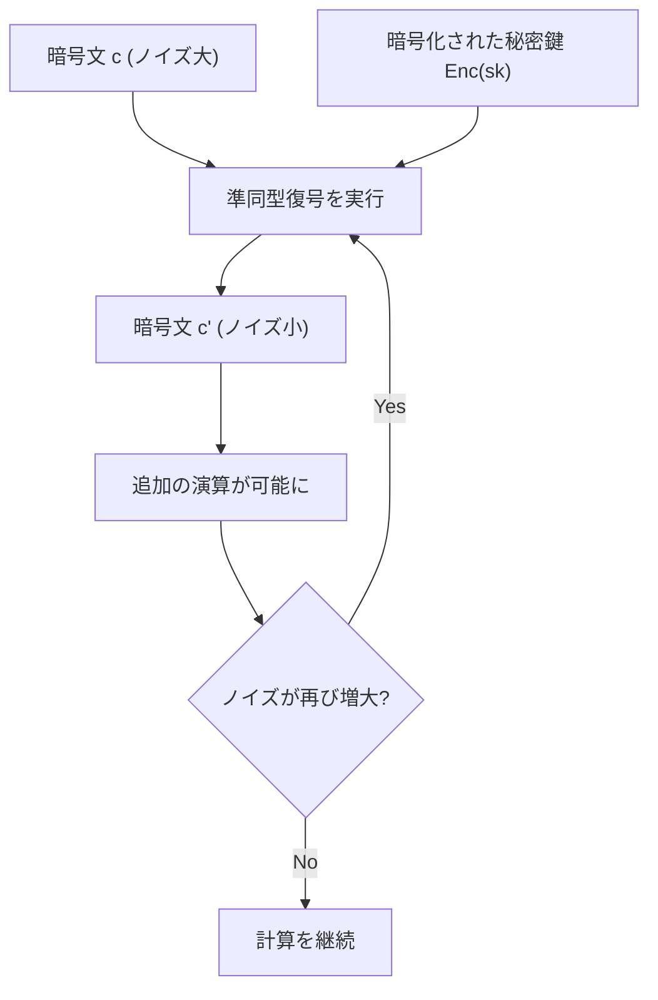
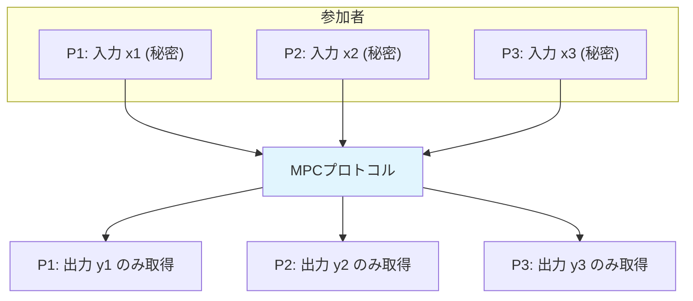
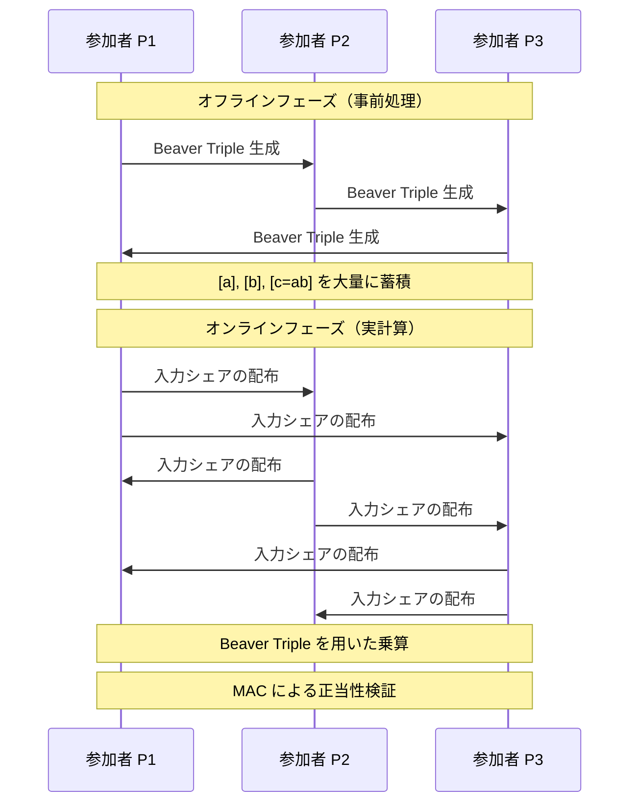
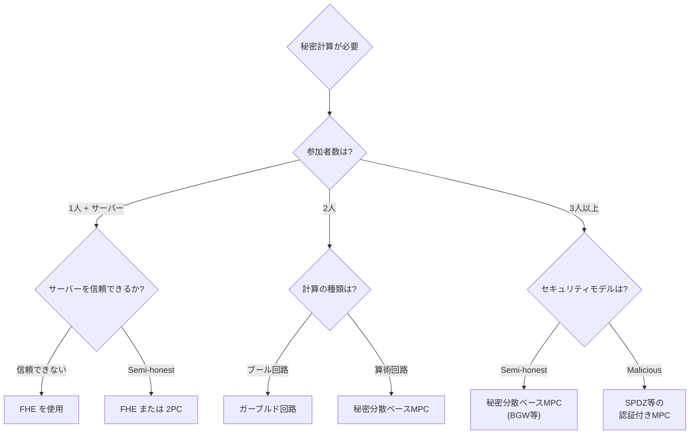
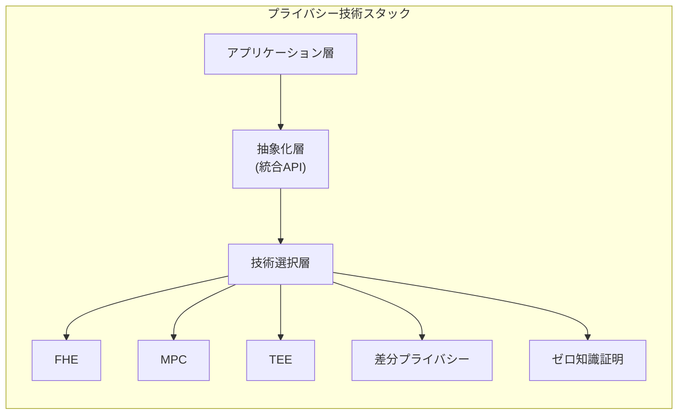

# 秘密計算（準同型暗号とMPC）— データを秘匿したまま計算する技術

## 1. 背景と動機

### 1.1 「計算」と「プライバシー」の根本的矛盾

現代社会において、データは価値の源泉である。機械学習モデルの訓練、金融リスクの分析、医療データの統計処理——これらはすべて大量のデータに対する計算によって成り立っている。しかし、計算を行うためにはデータを「見る」必要があるという暗黙の前提が存在する。クラウド上でデータを処理するなら、クラウドプロバイダにデータを渡さなければならない。複数の病院が共同で疫学研究を行いたいなら、患者データを集約する必要がある。

この前提は、プライバシーとセキュリティの観点から深刻な問題を引き起こす。

**信頼の問題**: データを第三者に渡すということは、その第三者を完全に信頼するということである。しかし現実には、クラウドプロバイダがハッキングされることも、内部者が不正にデータにアクセスすることも、政府が令状なしにデータを要求することもある。「信頼するが検証せよ（Trust but verify）」という原則すら、データが平文で渡された時点で破綻する。

**規制の壁**: GDPR（EU一般データ保護規則）、HIPAA（米国医療保険の携行性と責任に関する法律）、日本の個人情報保護法——世界中でデータ保護規制が強化されている。これらの規制により、データの移転や共有に厳しい制約が課せられ、本来可能であるはずのデータ活用が阻害されている。

**競争上の制約**: 企業間でデータを共有すれば双方に利益があるケースは多い。例えば、複数の銀行が取引データを突き合わせれば不正送金の検出精度が向上する。しかし、自社の顧客データを競合他社に渡すことは、ビジネス上も法律上も許容されない。

### 1.2 秘密計算という解答

秘密計算（Secure Computation）は、この「計算」と「プライバシー」の矛盾を暗号学的に解決する技術の総称である。その核心的なアイデアは驚くほどシンプルだ。**データを暗号化したまま計算を行い、計算結果だけを復号する**。入力データそのものは、計算を実行する者にさえ一切明かされない。

```
従来の計算:
  データ(平文) → [計算] → 結果(平文)
  ※ 計算者はデータの中身を見ることができる

秘密計算:
  データ(暗号文) → [暗号化されたまま計算] → 結果(暗号文) → [復号] → 結果(平文)
  ※ 計算者はデータの中身を一切知ることができない
```

この概念は1970年代から理論的に研究されてきたが、実用性のある形で実現され始めたのは2000年代以降である。現在、秘密計算の二大アプローチとして、**準同型暗号（Homomorphic Encryption, HE）** と**秘密分散に基づくマルチパーティ計算（Multi-Party Computation, MPC）** が存在する。本記事ではこれらの技術を深く掘り下げ、理論的基盤から実践的な応用まで包括的に解説する。

## 2. 準同型暗号（Homomorphic Encryption）

### 2.1 準同型性とは何か

準同型暗号を理解するには、まず「準同型性（Homomorphism）」という数学的概念を理解する必要がある。準同型とは、二つの代数的構造の間に「演算を保存する写像」が存在することを意味する。

暗号の文脈では、暗号化関数 $\text{Enc}$ が以下の性質を満たすとき、その暗号は準同型であるという。

$$\text{Enc}(m_1) \oplus \text{Enc}(m_2) = \text{Enc}(m_1 \otimes m_2)$$

ここで $\oplus$ は暗号文上の演算、$\otimes$ は平文上の演算である。つまり、**暗号文に対する演算が、対応する平文に対する演算と等価になる**。暗号文を操作するだけで、復号せずに平文に対する計算を行えるのだ。

### 2.2 部分準同型暗号（Partially Homomorphic Encryption, PHE）

完全な準同型暗号が登場する前から、特定の演算に対してのみ準同型性を持つ暗号スキームは数多く知られていた。

#### RSA暗号の乗法準同型性

RSA暗号は乗法に対して準同型である。二つの暗号文 $c_1 = m_1^e \mod n$ と $c_2 = m_2^e \mod n$ に対して、

$$c_1 \cdot c_2 = m_1^e \cdot m_2^e = (m_1 \cdot m_2)^e \mod n = \text{Enc}(m_1 \cdot m_2)$$

が成り立つ。ただし、これは教科書的RSA（パディングなし）に限られ、実用的なOAEPパディング付きRSAではこの性質は成り立たない。

#### ElGamal暗号の乗法準同型性

ElGamal暗号もまた乗法に対して準同型である。公開鍵 $(g, h = g^x)$ に対して、二つの暗号文 $(c_{1,1}, c_{1,2}) = (g^{r_1}, m_1 \cdot h^{r_1})$ と $(c_{2,1}, c_{2,2}) = (g^{r_2}, m_2 \cdot h^{r_2})$ の要素ごとの積をとると、

$$(c_{1,1} \cdot c_{2,1},\ c_{1,2} \cdot c_{2,2}) = (g^{r_1 + r_2},\ m_1 \cdot m_2 \cdot h^{r_1 + r_2})$$

となり、これは $m_1 \cdot m_2$ の有効な暗号文である。

#### Paillier暗号の加法準同型性

1999年にPascal Paillierが提案したPaillier暗号は、加法に対して準同型である。この性質は実用上極めて重要であり、投票システムや統計計算などで広く活用されている。

Paillier暗号では、二つの暗号文の積が平文の和の暗号文に対応する。

$$\text{Enc}(m_1) \cdot \text{Enc}(m_2) \mod n^2 = \text{Enc}(m_1 + m_2)$$

さらに、暗号文を定数乗することで、平文のスカラー倍を計算できる。

$$\text{Enc}(m)^k \mod n^2 = \text{Enc}(k \cdot m)$$

これらの性質により、暗号化されたデータの合計値や加重平均を、データを復号せずに計算できる。たとえば、電子投票において各票を暗号化し、暗号文の積を計算するだけで得票数の合計（暗号文）を得ることが可能となる。

### 2.3 完全準同型暗号（Fully Homomorphic Encryption, FHE）

部分準同型暗号は特定の演算しかサポートしない。加法だけ、あるいは乗法だけでは、任意の計算を表現することはできない。しかし、加法と乗法の両方が可能であれば、任意のブール回路（したがって任意の計算）をシミュレートできる。このような暗号を**完全準同型暗号（Fully Homomorphic Encryption, FHE）**と呼ぶ。

#### FHEの聖杯：Gentryのブレークスルー（2009年）

FHEの概念自体は、1978年にRivest、Adleman、Dertouzosによって提唱されていた。しかし、実際にFHEスキームを構成する方法は30年以上にわたって不明であった。

2009年、Craig Gentryは博士論文においてFHEの最初の構成を示し、暗号学の歴史に革命をもたらした。Gentryの手法は、以下の二段階のアプローチに基づいている。

**第一段階：Somewhat Homomorphic Encryption（SHE）の構成**

Gentryはまず、「制限付き」の準同型暗号であるSHEを構成した。SHEは加法と乗法の両方をサポートするが、実行可能な演算の回数（特に乗法の回数）に上限がある。これは、演算を重ねるごとに暗号文に含まれる**ノイズ（雑音）**が増大するためである。ノイズが一定の閾値を超えると、正しい復号ができなくなる。

**第二段階：ブートストラッピング**

ここでGentryの真に革新的なアイデアが登場する。**ブートストラッピング（Bootstrapping）**とは、暗号化されたまま復号操作を行うことで、暗号文のノイズをリセットする技法である。

直感的には以下のように動作する。

1. ノイズが蓄積した暗号文 $c$ がある
2. 秘密鍵 $sk$ 自体を暗号化した $\text{Enc}(sk)$ を用意する
3. 暗号化された状態で復号操作 $\text{Dec}(sk, c)$ を準同型的に評価する
4. 結果として、同じ平文を暗号化した新しい暗号文 $c'$ が得られるが、ノイズは小さくリセットされている



この手法により、SHEからFHEへの変換が可能になった。演算のたびに（あるいはノイズが閾値に近づくたびに）ブートストラッピングを実行すれば、理論上は無制限の演算が可能となる。

ただし、Gentryの初期の構成は極めて非効率であり、実用にはほど遠かった。1回のブートストラッピングに数十分を要し、暗号文のサイズも巨大であった。

### 2.4 現代のFHEスキーム

Gentryのブレークスルー以降、FHEの効率化に関する研究が爆発的に進展した。現在主流のFHEスキームは、**格子暗号（Lattice-based Cryptography）** を基盤としている。格子暗号は、格子上の困難な問題（Learning With Errors, LWE問題やRing-LWE問題）に安全性の根拠を置いており、量子コンピュータに対しても耐性があると考えられている。

#### BFV/BGVスキーム

**BFV（Brakerski/Fan-Vercauteren）** スキームと**BGV（Brakerski-Gentry-Vaikuntanathan）** スキームは、整数の算術演算に最適化されたFHEスキームである。

BFVスキームの基本的な構造は以下の通りである。

- **平文空間**: $\mathbb{Z}_t[x]/(x^n + 1)$ — 係数が $\mathbb{Z}_t$（$t$ を法とする整数）の多項式の環
- **暗号文空間**: $\mathbb{Z}_q[x]/(x^n + 1)$ の要素のペア（$q \gg t$）
- **秘密鍵**: 小さな係数を持つ多項式 $s$
- **暗号化**: 平文 $m$ に対して $\text{ct} = (c_0, c_1) \approx (\Delta \cdot m + a \cdot s + e, -a)$（$\Delta = \lfloor q/t \rfloor$、$a$ はランダム、$e$ はノイズ）
- **復号**: $c_0 + c_1 \cdot s \approx \Delta \cdot m + e$ を丸めて $m$ を復元

加法と乗法は暗号文同士の多項式演算として実装される。乗法のたびにノイズが増大し、暗号文のサイズも成長するため、**リリニアライゼーション（Relinearization）** と**モジュラススイッチング（Modulus Switching）** という技法でこれらを制御する。

BGVスキームはBFVと類似しているが、ノイズ管理の方法が異なる。BGVはモジュラススイッチングを主要なノイズ制御手段として使用し、計算の深さに応じてモジュラスの梯子（modulus ladder）を降りていく方式を採用する。

#### CKKSスキーム

**CKKS（Cheon-Kim-Kim-Song）** スキーム（2017年）は、**近似計算**に特化したFHEスキームである。BFV/BGVが整数の正確な演算を提供するのに対し、CKKSは実数（浮動小数点数）の近似演算を効率的にサポートする。

CKKSの鍵となるアイデアは、ノイズを「誤差」として取り込み、近似計算の一部と見なすことである。つまり、FHEに固有のノイズを排除するのではなく、許容可能な精度の範囲内に収まるように管理する。

$$\text{Dec}(\text{Enc}(m_1) \oplus \text{Enc}(m_2)) \approx m_1 + m_2$$

この設計により、機械学習の推論や統計分析など、近似計算で十分なユースケースにおいて、BFV/BGVよりも大幅に効率的な処理が可能となる。CKKSは**SIMD（Single Instruction, Multiple Data）** 的なバッチ処理もサポートしており、一つの暗号文に多数の実数値をパッキングして並列に演算できる。

#### TFHEスキーム

**TFHE（Torus Fully Homomorphic Encryption）** スキーム（Chillotti et al., 2016）は、ブール回路の評価に最適化されたFHEスキームである。TFHEの最大の特徴は、**ゲートブートストラッピング**が極めて高速であることだ。各論理ゲート（AND、OR、XOR等）の評価後にブートストラッピングを行うことで、無制限の論理演算を実行できる。

TFHEのブートストラッピングは約13ミリ秒（2020年代のハードウェア基準）で実行可能であり、BFV/BGVのブートストラッピングと比較して桁違いに高速である。ただし、整数算術演算に対してはBFV/BGVの方が効率的であり、用途に応じた使い分けが求められる。

### 2.5 FHEにおけるノイズ管理

FHEの実用化における最大の技術的課題はノイズ管理である。準同型演算を行うたびに暗号文中のノイズが増大し、特に乗法はノイズを急激に増加させる。

ノイズ管理の主要な技法を以下に整理する。

| 技法 | 概要 | 効果 |
|------|------|------|
| モジュラススイッチング | 暗号文のモジュラス $q$ をより小さな $q'$ にスケーリングする | ノイズを比例的に縮小 |
| リリニアライゼーション | 乗法で膨張した暗号文のサイズを元に戻す | 暗号文サイズの制御 |
| ブートストラッピング | 暗号化されたまま復号操作を行いノイズをリセット | ノイズの完全リセット |
| レベルドFHE | ブートストラッピングなしで固定深さの回路を評価 | 特定用途での高効率化 |

実用的なFHE実装では、計算回路の深さ（乗法の連鎖回数）を最小化するようにアルゴリズムを設計することが重要である。たとえば、$n$ 個の値の総和を逐次的に計算すると深さが $O(n)$ になるが、二分木的に計算すれば深さを $O(\log n)$ に抑えられる。

### 2.6 主要なFHEライブラリ

#### Microsoft SEAL

Microsoft SEAL（Simple Encrypted Arithmetic Library）は、Microsoftが開発・公開しているオープンソースのFHEライブラリである。BFVとCKKSスキームをサポートし、C++で実装されている（.NETラッパーも提供）。

```cpp
// Microsoft SEAL example (BFV scheme)
#include "seal/seal.h"
using namespace seal;

// Set encryption parameters
EncryptionParameters parms(scheme_type::bfv);
size_t poly_modulus_degree = 4096;
parms.set_poly_modulus_degree(poly_modulus_degree);
parms.set_coeff_modulus(CoeffModulus::BFVDefault(poly_modulus_degree));
parms.set_plain_modulus(1024);

SEALContext context(parms);
KeyGenerator keygen(context);
SecretKey secret_key = keygen.secret_key();
PublicKey public_key;
keygen.create_public_key(public_key);

Encryptor encryptor(context, public_key);
Evaluator evaluator(context);
Decryptor decryptor(context, secret_key);

// Encrypt two numbers
Plaintext plain1("5"), plain2("3");
Ciphertext encrypted1, encrypted2;
encryptor.encrypt(plain1, encrypted1);
encryptor.encrypt(plain2, encrypted2);

// Homomorphic addition (5 + 3 = 8)
Ciphertext encrypted_sum;
evaluator.add(encrypted1, encrypted2, encrypted_sum);

// Decrypt result
Plaintext plain_result;
decryptor.decrypt(encrypted_sum, plain_result);
// plain_result contains "8"
```

SEALはAPIが比較的洗練されており、学術研究から産業応用まで幅広く利用されている。ただし、ブートストラッピングのサポートは限定的であり、主にレベルドFHEの用途に向いている。

#### OpenFHE

OpenFHE（旧PALISADE）は、DARPA（米国防高等研究計画局）の支援を受けて開発されたFHEライブラリであり、BFV、BGV、CKKS、TFHEなど、主要なFHEスキームをすべてサポートする包括的なフレームワークである。ブートストラッピングも完全にサポートしており、最も機能が充実したFHEライブラリと言える。

#### TFHE-rs / Concrete

Zama社が開発する**TFHE-rs**（Rust実装）および**Concrete**（Pythonフレームワーク）は、TFHEスキームに基づくFHEツールセットである。Concreteは特に、通常のPythonコードからFHE回路を自動的にコンパイルする機能を提供しており、FHEの敷居を大幅に下げている。

```python
# Concrete example (conceptual)
from concrete import fhe

@fhe.compiler({"x": "encrypted", "y": "encrypted"})
def add(x, y):
    return x + y

# Compile the function for FHE evaluation
inputset = [(2, 3), (0, 0), (7, 7)]
circuit = add.compile(inputset)

# Encrypt, compute, decrypt
encrypted_x, encrypted_y = circuit.encrypt(5, 3)
encrypted_result = circuit.run(encrypted_x, encrypted_y)
result = circuit.decrypt(encrypted_result)
# result == 8
```

## 3. マルチパーティ計算（Multi-Party Computation, MPC）

### 3.1 MPCの概念

マルチパーティ計算（MPC）は、複数の参加者がそれぞれの入力を秘密にしたまま、共同で関数を計算するためのプロトコルである。各参加者は自分の入力と最終的な出力のみを知ることができ、他の参加者の入力については一切の情報を得ない。

形式的には、$n$ 人の参加者 $P_1, P_2, \ldots, P_n$ がそれぞれ秘密の入力 $x_1, x_2, \ldots, x_n$ を持つとき、MPCプロトコルは関数 $f(x_1, x_2, \ldots, x_n) = (y_1, y_2, \ldots, y_n)$ を計算し、各参加者 $P_i$ は $y_i$ のみを受け取る。プロトコルの実行を通じて、$P_i$ が $y_i$ から推測できる情報以上の情報を得ることはない。



### 3.2 セキュリティモデル

MPCプロトコルのセキュリティを議論する際、敵対者（Adversary）のモデルを明確にする必要がある。

#### Semi-Honest（受動的）モデル

Semi-honestな敵対者は、プロトコルの手順に忠実に従うが、プロトコルの実行中に得られたすべての情報（中間値を含む）から他者の入力を推測しようとする。このモデルは「Honest-but-Curious」とも呼ばれ、現実世界のクラウドサービスプロバイダの振る舞いを近似するものとして広く使われている。

#### Malicious（能動的）モデル

Maliciousな敵対者は、プロトコルの手順から任意に逸脱する可能性がある。偽のメッセージを送信したり、計算を意図的に間違えたり、プロトコルを途中で中断したりする。このモデルはより強力な安全性保証を提供するが、プロトコルの設計と実行コストが大幅に増加する。

#### 不正参加者の閾値

MPCプロトコルは、不正な参加者の最大数に関する仮定を置く。一般に、$n$ 人中 $t$ 人が不正（corrupt）であっても安全であるプロトコルを「$t$-セキュア」と呼ぶ。情報理論的安全性を達成するには $t < n/3$（maliciousモデル）または $t < n/2$（semi-honestモデル）であることが必要十分であることが知られている。計算量的安全性の下では、$t < n$（不正者が過半数未満）でもセキュアなプロトコルが構成可能である。

### 3.3 Yaoのガーブルド回路（Garbled Circuits）

1986年、Andrew Yaoは二者間のMPC（2PC）問題に対する最初の汎用的な解法を提案した。これが**ガーブルド回路（Garbled Circuits, GC）** プロトコルである。

#### 基本的な仕組み

ガーブルド回路プロトコルは、計算をブール回路として表現し、その回路を「ガーブル（暗号化的に難読化）」する。

1. **回路の構成**: 計算したい関数 $f(x, y)$ をブール回路（AND、OR、XORゲートの組み合わせ）として表現する
2. **ガーブリング**: 一方の参加者（Garbler、通常 $P_1$）が回路をガーブルする。各ワイヤに対して、0と1に対応する二つのランダムなラベル（暗号学的に長い文字列）を割り当てる。各ゲートの真理値表を暗号化し、入力ラベルを知っている者だけが対応する出力ラベルを復号できるようにする
3. **評価**: もう一方の参加者（Evaluator、通常 $P_2$）がガーブルされた回路を評価する。Evaluatorは各ワイヤのラベルを一つだけ知り（0に対応するか1に対応するかは分からない）、ゲートごとに一つの暗号文だけを復号できる

#### ガーブルド回路の詳細：ANDゲートの例

ANDゲートの入力ワイヤ $a$, $b$ と出力ワイヤ $c$ を考える。各ワイヤには二つのラベルが割り当てられる。

- ワイヤ $a$: $k_a^0$（0に対応）、$k_a^1$（1に対応）
- ワイヤ $b$: $k_b^0$、$k_b^1$
- ワイヤ $c$: $k_c^0$、$k_c^1$

ANDゲートの真理値表をラベルで暗号化する。

| $a$ | $b$ | $c = a \wedge b$ | ガーブルされたエントリ |
|-----|-----|-------------------|------------------------|
| 0   | 0   | 0                 | $\text{Enc}_{k_a^0, k_b^0}(k_c^0)$ |
| 0   | 1   | 0                 | $\text{Enc}_{k_a^0, k_b^1}(k_c^0)$ |
| 1   | 0   | 0                 | $\text{Enc}_{k_a^1, k_b^0}(k_c^0)$ |
| 1   | 1   | 1                 | $\text{Enc}_{k_a^1, k_b^1}(k_c^1)$ |

この4つのエントリはランダムに並べ替えられる。Evaluatorは入力ラベル $k_a^{x_a}$ と $k_b^{x_b}$ を持っているとき、4つのエントリのうち1つだけを正しく復号でき、出力ラベル $k_c^{x_a \wedge x_b}$ を得る。しかし、ラベルの値からそれが0に対応するのか1に対応するのかは分からない。

#### 紛失通信（Oblivious Transfer）

ガーブルド回路プロトコルにおいて鍵となるのが、**紛失通信（Oblivious Transfer, OT）** と呼ばれるプロトコルである。Evaluator（$P_2$）は自分の入力に対応するラベルを取得する必要があるが、Garbler（$P_1$）に自分の入力を明かしてはならず、Evaluator自身も使わなかったラベルの値を知ってはならない。

1-out-of-2 OTプロトコルでは、送信者が二つのメッセージ $m_0, m_1$ を持ち、受信者が選択ビット $b \in \{0, 1\}$ を持つ。プロトコルの実行後、受信者は $m_b$ のみを受け取り、$m_{1-b}$ については何も学ばない。送信者は $b$ の値を学ばない。

OTは公開鍵暗号を用いて構成できる。さらに、**OT Extension** という技法により、少数の「真の」OT（公開鍵暗号ベース）から多数の「仮想的な」OT（対称鍵暗号ベース）を効率的に生成でき、大規模な回路に対しても実用的な速度を実現している。

### 3.4 秘密分散に基づくMPC

#### 秘密分散（Secret Sharing）

**秘密分散**は、秘密の値を複数の「シェア（断片）」に分割し、一定数以上のシェアが集まった場合にのみ秘密を復元できるようにする技術である。

最も基本的な加法的秘密分散では、秘密 $s$ を $n$ 個のシェア $s_1, s_2, \ldots, s_n$ に分割し、$s = s_1 + s_2 + \cdots + s_n \pmod{p}$ が成り立つようにする。任意の $n-1$ 個のシェアからは $s$ について何も分からないが、$n$ 個すべてが揃えば $s$ を復元できる。

より一般的なShamirの秘密分散（1979年）では、$(t, n)$ 閾値方式を実現する。秘密 $s$ を $n$ 個のシェアに分割し、任意の $t+1$ 個以上のシェアが集まれば $s$ を復元できるが、$t$ 個以下のシェアからは一切の情報が漏れない。これは多項式補間に基づいており、$s$ を定数項とする $t$ 次の多項式 $f(x) = s + a_1 x + a_2 x^2 + \cdots + a_t x^t$ を構成し、各参加者 $P_i$ にシェア $f(i)$ を配布する。

#### BGWプロトコル

1988年にBen-Or、Goldwasser、Wigdersonが提案した**BGWプロトコル**は、秘密分散に基づくMPCの古典的な構成である。Shamirの秘密分散を用いて、算術回路（加算ゲートと乗算ゲートで構成）を評価する。

**加算**: 各参加者が自分の持つシェアをローカルに加算するだけでよい。$[x]_i + [y]_i = [x + y]_i$（$[x]_i$ は $x$ の $P_i$ のシェア）。通信は不要である。

**乗算**: 乗算は遥かに複雑である。各参加者がシェアの積をローカルに計算すると $[x]_i \cdot [y]_i$ が得られるが、これは $x \cdot y$ の正しいシェアにはならない（多項式の次数が倍増するため）。そこで、**次数削減（Degree Reduction）** と呼ばれる対話的プロトコルが必要となる。これには通信ラウンドが発生し、MPCの性能ボトルネックとなる。

BGWプロトコルは、semi-honestモデルで $t < n/2$、maliciousモデルで $t < n/3$ の安全性を、情報理論的に保証する。

#### SPDZプロトコル

**SPDZ（発音は「speeds」）** プロトコル（Damgård et al., 2012）は、maliciousモデルにおいて効率的なMPCを実現する近代的なプロトコルである。SPDZの革新的な点は、計算を**オフラインフェーズ**と**オンラインフェーズ**に分離したことである。

**オフラインフェーズ（前処理）**: 実際の入力データが利用可能になる前に、**Beaver Triple**（ベアバートリプル）と呼ばれるランダムな三つ組 $([a], [b], [c])$（$c = a \cdot b$）を大量に生成しておく。この前処理は計算コストが高いが、入力に依存しないため事前に行える。

**オンラインフェーズ**: 実際の入力を秘密分散し、事前に生成したBeaver Tripleを消費しながら計算を進める。オンラインフェーズは高速であり、乗算1回あたりの通信コストは $O(n)$ である。

さらに、SPDZは**MAC（Message Authentication Code）** を用いて各シェアの正当性を検証し、maliciousな参加者による不正を検出する。具体的には、秘密 $x$ に対して $\text{MAC}(x) = \alpha \cdot x$（$\alpha$ はグローバルMACキー）を秘密分散の形で維持し、プロトコルの最後に一括検証を行う。



### 3.5 MPCの最適化技法

現代のMPC実装では、以下のような最適化技法が広く用いられている。

**Free XOR**: ガーブルド回路において、XORゲートを「無料」（暗号化テーブルなし）で評価する技法。入力ラベル間に特定の関係を持たせることで、出力ラベルをXOR演算だけで計算できる。

**Half Gates**: ANDゲートの評価に必要な暗号化テーブルのサイズを、従来の4エントリから2エントリに削減する技法。

**OT Extension**: 少数の基本OTから多数のOTを効率的に生成する技法。$\kappa$ 回の基本OTから、$n \gg \kappa$ 回のOTを生成できる。

**SIMD評価**: 同一の回路を複数の入力に対して並列に評価する技法。バッチ処理的な高速化が可能。

## 4. 差分プライバシー（Differential Privacy）との比較

秘密計算と混同されやすい概念として**差分プライバシー（Differential Privacy, DP）** がある。両者はともに「プライバシーを保護しながらデータを活用する」という目的を共有するが、そのアプローチと保証は根本的に異なる。

### 4.1 差分プライバシーの概要

差分プライバシーは、データセットに対するクエリの結果にランダムなノイズを加えることで、個々のレコードの存在が結果に与える影響を限定的にする技法である。形式的には、任意の隣接データセット $D$ と $D'$（1レコードだけ異なる）に対して、

$$\Pr[\mathcal{M}(D) \in S] \leq e^{\varepsilon} \cdot \Pr[\mathcal{M}(D') \in S] + \delta$$

が成り立つとき、メカニズム $\mathcal{M}$ は $(\varepsilon, \delta)$-差分プライバシーを満たすという。

### 4.2 秘密計算との違い

| 観点 | 秘密計算（HE/MPC） | 差分プライバシー |
|------|---------------------|------------------|
| 保護対象 | 入力データそのもの | クエリ結果からの個人情報の推測 |
| 精度 | 正確な計算結果を得る | ノイズにより結果に誤差が生じる |
| 脅威モデル | 計算サーバーや他の参加者 | 出力結果を観察する攻撃者 |
| オーバーヘッド | 計算コスト（100〜10,000倍以上） | 精度の低下 |
| 組み合わせ | 差分プライバシーと併用可能 | 秘密計算と併用可能 |

重要な点として、秘密計算と差分プライバシーは相互補完的な技術であり、両者を組み合わせることでより強力なプライバシー保証を実現できる。たとえば、MPCで集計を行い、最終結果に差分プライバシーのノイズを加えるという構成が考えられる。

## 5. 実世界の応用

### 5.1 Private Set Intersection（PSI）

**Private Set Intersection（秘密集合積集合）** は、MPCの最も成功した応用例の一つである。二つの参加者がそれぞれ集合を持ち、両方の集合に含まれる要素（共通要素）のみを特定する。どちらの参加者も、共通要素以外の相手の要素については何も学ばない。

**ユースケース例**:
- **広告効果測定**: 広告プラットフォームと小売業者が、それぞれの顧客リストの共通部分を見つけ、広告を閲覧した顧客がその後購買したかを測定する。Google、Meta（旧Facebook）はこの技術を実際に導入している。
- **マネーロンダリング検出**: 複数の銀行が、各自の不正疑惑アカウントリストを突き合わせ、共通する不正アカウントを検出する。
- **コンタクトトレーシング**: 感染者の接触リストと個人の行動履歴の共通部分を特定し、接触通知を行う。

PSIの効率的な実装には、OT ExtensionやCuckoo Hashing（カッコウハッシュ）などの技法が活用され、数百万要素の集合に対しても秒単位で実行可能なプロトコルが実現されている。

### 5.2 プライバシー保護機械学習（Privacy-Preserving ML）

機械学習とプライバシー保護の交差点は、秘密計算の最も活発な研究領域の一つである。

#### 秘密の推論（Secure Inference）

訓練済みのモデルを持つサービスプロバイダと、推論データを持つクライアントの間で、モデルもデータも明かすことなく推論結果を得る。これは主に二者間MPCまたはFHEで実現される。

```
+------------------+                     +------------------+
| クライアント      |                     | サーバー          |
| 入力: x (秘密)   | --- MPC/HE で ----→ | モデル: M (秘密)  |
|                  |    秘密の推論       |                  |
| 結果: M(x) ←----|                     |                  |
+------------------+                     +------------------+
※ サーバーは x を知らない、クライアントは M を知らない
```

CrypTen（Meta）、TF Encrypted（TensorFlow上のMPC）、MP-SPDZ（汎用MPCフレームワーク）などのツールが提供されている。

#### 秘密の学習（Secure Training）

複数のデータ所有者が、各自のデータを共有せずに共同でモデルを訓練する。**連合学習（Federated Learning）** はこの方向性の実用的なアプローチであるが、モデルの勾配更新（gradient update）から元のデータを推測する攻撃（gradient leakage attack）が知られており、MPCや差分プライバシーとの組み合わせが研究されている。

### 5.3 暗号化データベース

FHEを用いて、暗号化されたデータに対する検索・集計クエリを実行する**暗号化データベース**の研究が進められている。

**CryptDB**（MIT, 2011）は、暗号化されたデータに対してSQLクエリを実行するシステムの先駆的な実装である。ただし、CryptDBは完全なFHEではなく、クエリの種類に応じて異なる準同型暗号スキーム（OPE: Order-Preserving Encryption、DET: Deterministic Encryption等）を使い分ける「タマネギ暗号化」アプローチを採用している。

より近代的なアプローチでは、FHEを用いてより強力なプライバシー保証を提供するシステムが研究されている。たとえば、SealPIR（Microsoft Research）は、FHEベースのPrivate Information Retrieval（PIR）を実現し、サーバーがどのレコードをクライアントが要求したかすら知ることなくデータを返す。

### 5.4 電子投票

秘密計算は、投票の秘密性を保ちながら集計結果の正当性を検証可能にする電子投票システムにも応用されている。Paillier暗号の加法準同型性を利用した投票スキームでは、各票を暗号化し、暗号文の積（= 平文の和の暗号文）を計算することで、個々の票の内容を明かすことなく得票数の合計を算出できる。さらにゼロ知識証明を組み合わせることで、各投票者が正当な票（例：0か1のみ）を投じたことを検証できる。

### 5.5 暗号資産とブロックチェーン

ブロックチェーン上のスマートコントラクトにおけるプライバシーの欠如は、長年の課題であった。秘密計算技術を用いて、トランザクションの詳細や契約の入力を秘匿しながらスマートコントラクトを実行するプロジェクトが進行している。Secret Network（MPCベース）、Zama fhEVM（FHEベースのEVM）などがその例である。

## 6. 性能の課題

### 6.1 FHEの性能

FHEの最大の課題は依然として性能である。暗号化されたデータに対する計算は、平文での計算と比較して桁違いに遅い。

| 操作 | 平文 | FHE（CKKS） | オーバーヘッド |
|------|------|-------------|---------------|
| 加算（64ビット整数） | ~1ns | ~1μs | ~1,000倍 |
| 乗算（64ビット整数） | ~3ns | ~10μs | ~3,000倍 |
| ブートストラッピング | — | ~10ms | — |
| ニューラルネット推論（小規模） | ~1ms | ~1-10s | ~1,000-10,000倍 |

暗号文のサイズも問題である。BFVスキームで一つの整数を暗号化すると、暗号文のサイズは数十キロバイトから数百キロバイトに達する（元の整数は8バイト）。これはメモリ使用量と通信帯域に深刻な影響を与える。

### 6.2 MPCの性能

MPCの性能は主に通信コストに支配される。参加者間の通信ラウンド数と通信データ量がボトルネックとなる。

| 要因 | 影響 |
|------|------|
| 通信ラウンド数 | レイテンシに直接影響（各ラウンドにネットワーク遅延が発生） |
| 通信データ量 | 帯域幅に依存、大規模計算では数GBに達することも |
| 参加者数 | 多くのプロトコルで通信量が参加者数に比例して増加 |
| 回路の深さ | ラウンド数が回路の深さに比例するプロトコルもある |

ガーブルド回路ベースのプロトコルは定数ラウンドで実行可能だが、回路のサイズに比例する大量のデータ（ガーブルされたテーブル）を送信する必要がある。秘密分散ベースのプロトコルは通信データ量が少ないが、回路の深さに比例するラウンド数を必要とする。

### 6.3 ハードウェアアクセラレーション

FHEの性能向上のため、専用ハードウェアの開発が活発に進められている。

**FPGA実装**: 多項式演算の並列処理に適したFPGAを用いたFHEアクセラレータが研究されている。

**ASIC**: Intelは2022年にFHE専用のASIC設計を発表した。DARPAのDPRIVEプログラムの下で、Microsoftと共同で開発が進められている。

**GPU**: NTT（Number Theoretic Transform）やFFT（Fast Fourier Transform）といったFHEの計算ボトルネックとなる多項式演算は、GPUの並列処理能力を活用して高速化できる。

これらのハードウェアアクセラレーションにより、FHEの性能は今後数年間で10〜100倍以上の改善が期待されている。

## 7. HEとMPCの比較と使い分け

準同型暗号とMPCはそれぞれ異なる特性を持ち、用途に応じた使い分けが重要である。



| 特性 | 準同型暗号（HE） | MPC |
|------|-------------------|-----|
| 参加者構成 | クライアント-サーバー型 | 対等な複数参加者 |
| 通信パターン | 非対話的（暗号文の送信のみ） | 対話的（複数ラウンドの通信） |
| 計算コスト | 極めて高い | 比較的低い（通信がボトルネック） |
| 通信コスト | 低い（1往復） | 高い（複数ラウンド） |
| スケーラビリティ | サーバーの計算能力に依存 | 参加者数に依存 |
| オフライン/オンライン | なし | 前処理が可能（SPDZ等） |
| 量子耐性 | あり（格子暗号ベース） | スキームに依存 |

実際のシステムでは、HEとMPCを組み合わせた**ハイブリッドプロトコル**が用いられることも多い。たとえば、FHEで線形演算を行い、MPCで非線形演算（比較、ビット分解など）を行うという構成がある。

## 8. 秘密計算の標準化と産業動向

### 8.1 標準化の動き

秘密計算の標準化は複数の団体によって進められている。

**HomomorphicEncryption.org**: FHEの標準化を目指すオープンコンソーシアム。Microsoft、Intel、Samsung、IBMなどが参加し、FHEのセキュリティパラメータや暗号文フォーマットの標準化を進めている。

**ISO/IEC**: ISO/IEC 4922として秘密計算の国際標準が策定されている。パート1が一般的なフレームワーク、パート2がFHE、パート3がMPCをカバーする予定である。

### 8.2 産業での採用

秘密計算技術は、以下の分野で実用化が進んでいる。

- **金融**: 不正検出、信用スコアリング、規制レポーティング（例：ING銀行のMPCベースのAMLシステム）
- **医療**: 複数施設にまたがるゲノムデータの解析、臨床試験のプライバシー保護
- **広告技術**: Apple Private Click Measurement、Google Privacy Sandboxの一部にMPC技術が活用
- **政府**: 統計局によるプライバシー保護統計（米国国勢調査局の差分プライバシー+秘密計算の取り組み）

### 8.3 主要なスタートアップとプロジェクト

| 企業/プロジェクト | 技術 | 主な応用分野 |
|-------------------|------|-------------|
| Zama | TFHE, Concrete | 汎用FHE、ブロックチェーン |
| Duality Technologies | FHE (CKKS) | データコラボレーション |
| Inpher | MPC + 秘密分散 | エンタープライズ分析 |
| Cape Privacy | MPC + DP | 機械学習 |
| Sharemind | MPC | データ分析 |
| MP-SPDZ | MPC (SPDZ系) | 学術・研究 |

## 9. 今後の展望

### 9.1 性能の改善

FHEの性能は過去10年間で劇的に改善されてきた。Gentryの初期の構成では単一のブートストラッピングに数十分を要したが、現在のTFHEでは約13ミリ秒で実行可能である。この改善ペースが継続し、さらに専用ハードウェアの登場によって、今後5〜10年でFHEの実用的な適用範囲は大幅に拡大すると予想される。

特に、**プログラマブルブートストラッピング（Programmable Bootstrapping）** の進展は注目に値する。通常のブートストラッピングがノイズのリセットのみを行うのに対し、プログラマブルブートストラッピングはノイズのリセットと同時に任意の関数（ルックアップテーブル）を評価する。これにより、FHEにおける非線形演算の効率が大幅に向上する。

### 9.2 FHEコンパイラの成熟

FHEの普及における最大の障壁の一つは、FHEプログラミングの困難さである。開発者は暗号スキームのパラメータ設定、ノイズバジェットの管理、回路の最適化など、深い専門知識を必要とする作業に直面する。

この問題を解決するため、高水準言語から最適化されたFHE回路を自動生成する**FHEコンパイラ**の研究が進んでいる。Googleの**Transpiler**、Microsoftの**EVA**、Zamaの**Concrete**などがその例であり、将来的には通常のプログラムを書くだけで自動的にFHE化される世界が期待されている。

### 9.3 ポスト量子暗号との関係

興味深いことに、FHEの主流スキームは格子暗号に基づいており、これはポスト量子暗号の主要な候補でもある。NIST PQC標準化プロセスで選定されたKyber（CRYSTALS-Kyber）やDilithium（CRYSTALS-Dilithium）も格子暗号ベースであり、FHEは本質的に量子コンピュータに対する耐性を持っている。

一方、MPCプロトコルの中には、古典的な公開鍵暗号（RSA、楕円曲線暗号）に依存するものもあり、これらは量子コンピュータの脅威に対して脆弱である。ポスト量子MPCプロトコルの設計は活発な研究テーマとなっている。

### 9.4 規制とのフィードバック

GDPRやその後継となるプライバシー規制が秘密計算技術の採用を促進する一方で、秘密計算技術の成熟が規制の在り方にもフィードバックを与えている。たとえば、「秘密計算で処理されたデータは『処理』に該当するのか」「秘密計算の利用はデータ保護影響評価（DPIA）の結果をどう変えるか」といった法的問題が議論されている。

### 9.5 統合的プライバシー技術スタック

将来的には、FHE、MPC、差分プライバシー、TEE（Trusted Execution Environment）、ゼロ知識証明などのプライバシー技術が統合的なスタックとして提供されると予想される。各技術の長所を組み合わせ、アプリケーションの要件に応じて最適な構成を自動的に選択するフレームワークが実現すれば、秘密計算はより広く普及するだろう。



## 10. まとめ

秘密計算は、「データを見ずにデータを処理する」という、一見矛盾した要求を暗号学的に実現する技術である。準同型暗号は暗号化したままの計算を可能にし、MPCは複数参加者間の秘密の共同計算を実現する。

Gentryによる2009年のFHEの構成は、理論的なブレークスルーとして暗号学の歴史に刻まれた。しかし、実用化への道のりは長く、性能の壁は依然として大きい。それでも、専用ハードウェアの開発、スキームの改良、コンパイラの成熟により、この壁は着実に低くなっている。

MPCについては、すでにPSIを中心に産業での実用化が進んでおり、SPDZなどの効率的なプロトコルの登場により、より広範な応用が可能になりつつある。

秘密計算技術は、プライバシーとデータ活用の両立という現代社会の根本的な課題に対する、暗号学からの回答である。この分野の発展は、「データを共有しなくても知識を共有できる」社会の実現に向けた重要な一歩となるだろう。
