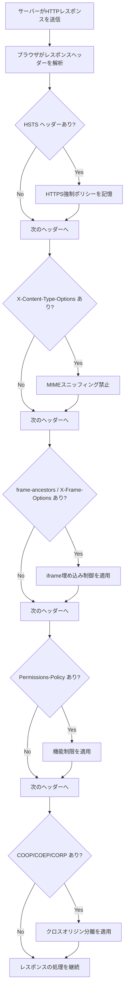
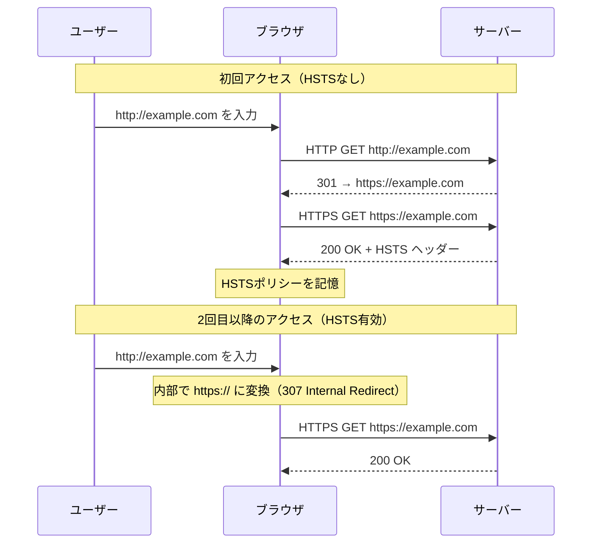
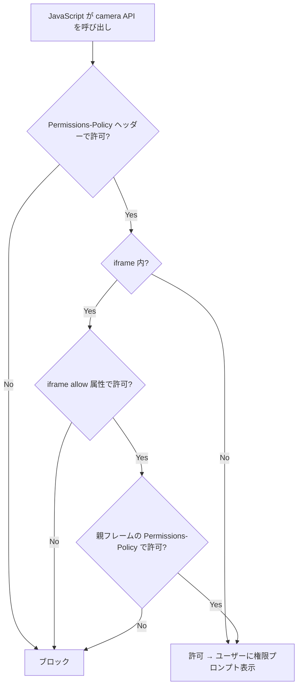
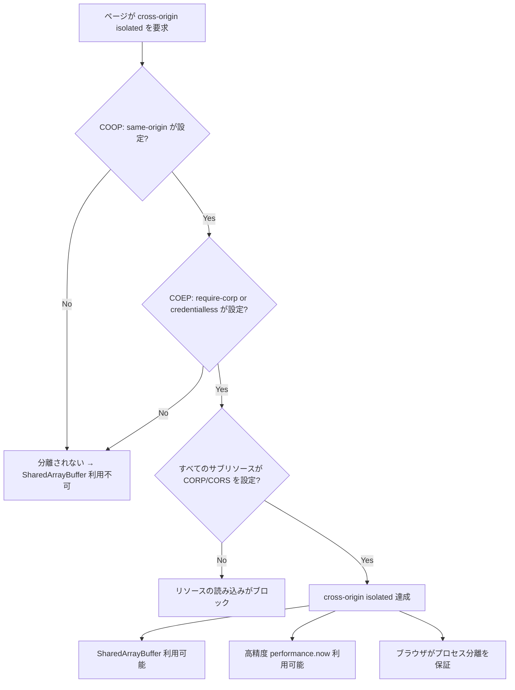
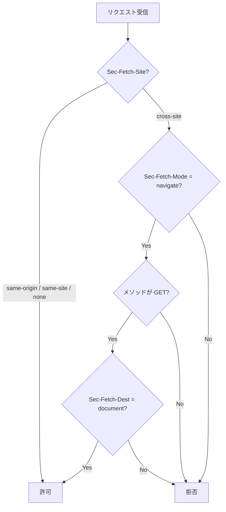
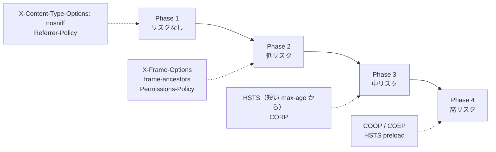
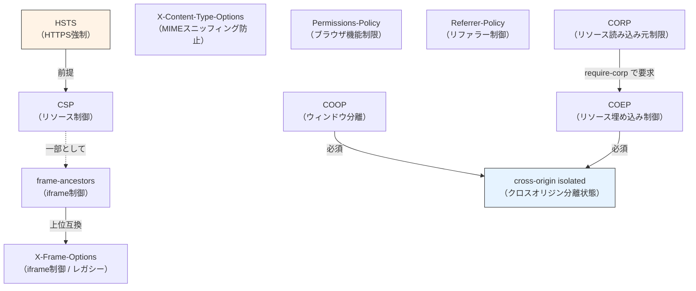

# セキュリティヘッダー総合ガイド — HSTS, Permissions-Policy, X-Content-Type-Options 等によるブラウザ防御層の設計と実践

## 1. セキュリティヘッダーの役割

### 1.1 なぜHTTPレスポンスヘッダーで防御するのか

Webアプリケーションのセキュリティは、サーバーサイドのコードだけで完結しない。ブラウザはHTTPレスポンスを受け取った後、そのコンテンツをどう解釈し、どう表示し、どのような操作を許可するかを独自に判断する。この「ブラウザの挙動」こそが攻撃者の標的となる。

セキュリティヘッダーは、サーバーがブラウザに対して「このレスポンスをどう扱うべきか」を明示的に指示する仕組みである。たとえば「このサイトには必ずHTTPSでアクセスせよ」「このページを他サイトのiframeに埋め込むことを許可しない」「Content-Typeを勝手に推測するな」といった指示をHTTPレスポンスヘッダーに付与することで、ブラウザの挙動を制御し、攻撃の可能性を減らす。

この考え方は「多層防御（Defense in Depth）」の原則に基づく。アプリケーションコードに脆弱性がなくても、ブラウザの挙動に起因する攻撃経路は存在する。セキュリティヘッダーはその経路を塞ぐ最後の防御層として機能する。

### 1.2 セキュリティヘッダーの全体像

本記事で扱うセキュリティヘッダーとその主な目的を以下に整理する。

| ヘッダー | 主な目的 |
|---|---|
| `Strict-Transport-Security` (HSTS) | HTTPS接続の強制 |
| `X-Content-Type-Options` | MIMEタイプスニッフィングの防止 |
| `X-Frame-Options` | クリックジャッキング防御（レガシー） |
| `Content-Security-Policy: frame-ancestors` | クリックジャッキング防御（推奨） |
| `Permissions-Policy` | ブラウザ機能（カメラ、マイク等）の制限 |
| `Referrer-Policy` | リファラー情報の漏洩制御 |
| `Cross-Origin-Opener-Policy` (COOP) | クロスオリジンウィンドウの分離 |
| `Cross-Origin-Embedder-Policy` (COEP) | クロスオリジンリソース埋め込みの制御 |
| `Cross-Origin-Resource-Policy` (CORP) | リソースの読み込み元制限 |
| Fetch Metadata (`Sec-Fetch-*`) | リクエストのコンテキスト情報 |

これらのヘッダーは独立して機能するものもあれば、組み合わせることで初めて効果を発揮するものもある。以下のフローチャートは、HTTPレスポンスに含まれるセキュリティヘッダーをブラウザがどのように処理するかを概観したものである。



### 1.3 セキュリティヘッダーの適用場所

セキュリティヘッダーはHTTPレスポンスヘッダーとして付与する。付与する場所としては以下が考えられる。

- **リバースプロキシ / ロードバランサー**: Nginx、Apache、CDN（CloudFront、Cloudflare等）で一括設定する方法。すべてのレスポンスに均一にヘッダーを付与できる。
- **アプリケーションサーバー**: Webフレームワークのミドルウェアで設定する方法。ルートやコンテンツに応じた柔軟な制御が可能。
- **CDNエッジ**: Cloudflare Workers、Lambda@Edge等で設定する方法。

実運用では、リバースプロキシでの一括設定が最も管理しやすい。ただし、一部のヘッダー（CSP等）はページの内容に依存するため、アプリケーション層での設定が適切な場合もある。

## 2. HSTS（HTTP Strict Transport Security）

### 2.1 問題の本質：HTTPからHTTPSへのリダイレクトの脆弱性

ほとんどのWebサイトは、HTTPでのアクセスをHTTPSにリダイレクトする設定を行っている。しかし、このリダイレクトには根本的な脆弱性がある。

```
ユーザーがアドレスバーに example.com と入力

  1. ブラウザが http://example.com にリクエストを送信（平文）
  2. サーバーが 301/302 で https://example.com にリダイレクト
  3. ブラウザが https://example.com にリクエストを再送

問題: ステップ1の平文リクエストは中間者攻撃（MITM）に対して無防備
```

ステップ1の時点で、攻撃者はリクエストを傍受し、偽のHTTPレスポンスを返すことができる。これがいわゆる「SSLストリッピング攻撃」である。攻撃者はユーザーとサーバーの間に入り、ユーザーにはHTTPで応答し、サーバーにはHTTPSで接続する。ユーザーはHTTPで通信していることに気づかないまま、認証情報や個人情報を平文で送信してしまう。

### 2.2 HSTSの仕組み

HSTS（RFC 6797）は、サーバーがブラウザに「今後このドメインにはHTTPSでのみアクセスせよ」と指示する仕組みである。

```http
Strict-Transport-Security: max-age=31536000; includeSubDomains; preload
```

このヘッダーを受け取ったブラウザは、指定された期間（`max-age`、秒単位）、当該ドメインに対するHTTPリクエストを自動的にHTTPSに変換する。リダイレクトを待たずにブラウザ内部で変換されるため、平文のHTTPリクエストがネットワーク上に流れることはない。



### 2.3 HSTSの各ディレクティブ

**`max-age`**: HSTSポリシーの有効期間を秒数で指定する。ブラウザはこの期間中、当該ドメインへのHTTPリクエストをすべてHTTPSに変換する。一般的には `31536000`（1年）が推奨される。導入初期は短い値（たとえば `300` = 5分）から始め、問題がないことを確認してから延長する方法が安全である。

**`includeSubDomains`**: このディレクティブを指定すると、すべてのサブドメインにもHSTSポリシーが適用される。たとえば `example.com` に `includeSubDomains` を設定すると、`api.example.com`、`cdn.example.com`、`mail.example.com` のすべてがHTTPS必須となる。

**`preload`**: HSTSプリロードリスト（後述）への登録を意図していることを示すディレクティブ。ブラウザの仕様としては無視されるが、プリロードリストへの登録申請時にこのディレクティブの存在が確認される。

### 2.4 HSTSプリロードリスト

HSTSには「初回アクセス問題」（Trust on First Use、TOFU）がある。ブラウザがHSTSポリシーを記憶するためには、最初に1回はHTTPSで正常にアクセスしてHSTSヘッダーを受け取る必要がある。つまり、ユーザーの最初のアクセスは依然として中間者攻撃に対して脆弱である。

この問題を解決するのがHSTSプリロードリストである。これはブラウザにハードコードされたドメインのリストで、リストに含まれるドメインに対しては、初回アクセスからHTTPSが強制される。

プリロードリストへの登録には以下の要件がある。

1. 有効なSSL/TLS証明書を持つ
2. HTTP（80番ポート）へのアクセスをHTTPSにリダイレクトする
3. すべてのサブドメインがHTTPS対応している
4. HSTSヘッダーに `max-age` 31536000（1年）以上、`includeSubDomains`、`preload` がすべて含まれる

::: warning
プリロードリストへの登録は容易だが、解除には時間がかかる。ブラウザのリリースサイクルに依存するため、解除が全ユーザーに反映されるまで数か月以上かかることがある。HTTPSへの移行が完全に完了していないドメインでは、安易にプリロードリストに登録しないこと。
:::

### 2.5 HSTS導入時の注意点

**証明書の有効期限管理**: HSTSが有効な状態で証明書が失効すると、ユーザーはサイトに一切アクセスできなくなる。ブラウザはHTTPへのフォールバックを行わないため、証明書の自動更新（Let's Encrypt + certbot等）を確実に運用する必要がある。

**mixed content の排除**: HSTSを有効にしても、ページ内のリソース（画像、CSS、JS）がHTTPで読み込まれていると、ブラウザはmixed contentとしてブロックまたは警告を表示する。HSTS導入前に、すべてのリソース参照をHTTPSに統一する必要がある。

**`max-age=0` によるポリシー解除**: HSTSを無効化したい場合は、`max-age=0` を設定する。これにより、ブラウザは記憶しているHSTSポリシーを削除する。ただし、すべてのユーザーのブラウザがこのレスポンスを受け取る必要があるため、即座に全ユーザーに反映されるわけではない。

## 3. X-Content-Type-Options

### 3.1 MIMEタイプスニッフィングとは

ブラウザには、HTTPレスポンスの `Content-Type` ヘッダーが不正確であったり欠落している場合に、レスポンスボディの内容からMIMEタイプを推測する「MIMEタイプスニッフィング」機能がある。これは、Content-Typeが正しく設定されていない古いWebサーバーとの互換性を維持するために実装された機能である。

しかし、このスニッフィングはセキュリティ上の問題を引き起こす。

```
攻撃シナリオ:

1. 攻撃者がユーザーアップロード機能を利用して、以下の内容のファイルをアップロード
   （ファイル名: profile.jpg）:
   <script>alert(document.cookie)</script>

2. サーバーが Content-Type: image/jpeg で返却

3. ブラウザがMIMEスニッフィングを実行し、
   コンテンツの内容から text/html と判定

4. ブラウザがHTMLとしてパースし、スクリプトが実行される
   → XSS攻撃が成立
```

### 3.2 X-Content-Type-Options: nosniff

```http
X-Content-Type-Options: nosniff
```

このヘッダーは、ブラウザに対してMIMEタイプスニッフィングを行わず、`Content-Type` ヘッダーの値をそのまま使用するよう指示する。

値は `nosniff` のみ。他の値は定義されていない。

`nosniff` が設定されている場合の具体的な挙動は以下の通りである。

- **スクリプト**: `Content-Type` がJavaScriptのMIMEタイプ（`text/javascript`、`application/javascript` 等）でない場合、スクリプトの実行がブロックされる
- **スタイルシート**: `Content-Type` が `text/css` でない場合、スタイルシートの適用がブロックされる
- **その他のリソース**: ブラウザはContent-Typeの値に基づいてリソースを処理し、スニッフィングによる型変換を行わない

### 3.3 導入の容易さと推奨度

`X-Content-Type-Options: nosniff` は、すべてのHTTPレスポンスに無条件で付与できる数少ないセキュリティヘッダーの一つである。副作用がほぼなく、`Content-Type` を正しく設定しているサイトであれば、導入による破壊的変更は発生しない。

ただし、前提として `Content-Type` ヘッダーが正しく設定されている必要がある。`nosniff` を設定した上でContent-Typeが不正確だと、ブラウザがリソースの読み込みをブロックする可能性がある。導入前にContent-Typeの設定を確認することが重要である。

## 4. X-Frame-Options と frame-ancestors

### 4.1 クリックジャッキング攻撃

クリックジャッキング（Clickjacking）は、攻撃者が透明なiframeを使用して、ユーザーに意図しない操作をさせる攻撃手法である。

```
攻撃の仕組み:

+--------------------------------------------------+
| 攻撃者のページ（evil.example.com）                  |
|                                                    |
|  "無料プレゼントに応募！ここをクリック！"             |
|        ↓ ユーザーに見えるボタンの位置                 |
|  +--------------------------------------------+   |
|  |  透明な iframe（opacity: 0）                 |   |
|  |  src="https://bank.example.com/transfer"    |   |
|  |                                             |   |
|  |     [送金を確定する] ← 実際のクリック対象     |   |
|  |                                             |   |
|  +--------------------------------------------+   |
+--------------------------------------------------+

ユーザーは「応募ボタン」をクリックしたつもりだが、
実際には銀行サイトの「送金確定」ボタンをクリックしている。
```

### 4.2 X-Frame-Options（レガシー）

`X-Frame-Options` は、クリックジャッキング対策として最も古くから使われているヘッダーである。

```http
X-Frame-Options: DENY
X-Frame-Options: SAMEORIGIN
```

- **`DENY`**: このページをいかなるサイトのiframeにも埋め込ませない
- **`SAMEORIGIN`**: 同一オリジンのページからのiframe埋め込みのみ許可する

かつては `ALLOW-FROM uri` というディレクティブも存在したが、ブラウザの実装が不統一であり、現在は非推奨である。

### 4.3 CSP frame-ancestors（推奨）

`X-Frame-Options` の後継として、Content Security Policyの `frame-ancestors` ディレクティブが推奨される。

```http
Content-Security-Policy: frame-ancestors 'none'
Content-Security-Policy: frame-ancestors 'self'
Content-Security-Policy: frame-ancestors 'self' https://trusted.example.com
```

- **`'none'`**: `X-Frame-Options: DENY` と同等
- **`'self'`**: `X-Frame-Options: SAMEORIGIN` と同等
- **特定のオリジン指定**: `X-Frame-Options: ALLOW-FROM` では不可能だった複数オリジンの指定が可能

`frame-ancestors` が `X-Frame-Options` より優れている点は以下の通りである。

| 機能 | X-Frame-Options | frame-ancestors |
|---|---|---|
| 複数オリジンの許可 | 不可 | 可能 |
| ワイルドカード | 不可 | `*.example.com` が可能 |
| `<meta>` タグでの配信 | — | 不可（ヘッダーのみ） |
| ネストされたiframeの制御 | 直接の親フレームのみ | 全祖先フレームを検証 |
| 仕様の標準化状況 | 事実上の標準 | W3C仕様 |

::: tip
`frame-ancestors` と `X-Frame-Options` の両方が存在する場合、CSP仕様に準拠したブラウザは `frame-ancestors` を優先し、`X-Frame-Options` を無視する。しかし、古いブラウザとの互換性のため、両方を設定しておくことが推奨される。
:::

### 4.4 ダブルフレーミングへの対策

`X-Frame-Options: SAMEORIGIN` には「ダブルフレーミング」と呼ばれる回避手法が存在する。

```
攻撃者のページ（evil.example.com）
  └── iframe: 中間ページ（example.com の任意のページ）
        └── iframe: ターゲットページ（example.com/settings）
```

一部のブラウザの古い実装では、`SAMEORIGIN` は直接の親フレームのオリジンのみを検証していたため、中間ページを経由することでクリックジャッキングが可能になる場合があった。`frame-ancestors` は全祖先フレームを検証するため、この攻撃に対して堅牢である。

## 5. Permissions-Policy

### 5.1 ブラウザ機能の制御が必要な理由

現代のブラウザは非常に多くの強力な機能を備えている。カメラ、マイク、位置情報、加速度センサー、自動再生、全画面表示、決済API——これらはすべてJavaScriptからアクセス可能であり、正当な用途がある一方で、悪用されるリスクも存在する。

特に問題となるのは、サードパーティのコンテンツ（広告、アナリティクス、ソーシャルウィジェット等）がiframeを通じて埋め込まれるケースである。ページの運営者が意図していないにもかかわらず、サードパーティのスクリプトがユーザーのカメラやマイクにアクセスしたり、位置情報を取得したりする可能性がある。

### 5.2 Feature-Policy から Permissions-Policy へ

Permissions-Policyは、以前の `Feature-Policy` ヘッダーの後継仕様である。Feature-Policyは2018年頃に導入されたが、構文の変更を伴って `Permissions-Policy` にリネームされた。

```http
# 旧: Feature-Policy（非推奨）
Feature-Policy: camera 'none'; microphone 'none'; geolocation 'self'

# 新: Permissions-Policy（推奨）
Permissions-Policy: camera=(), microphone=(), geolocation=(self)
```

構文の主な違いは以下の通りである。

- Feature-Policyはスペース区切りで値を列挙し、セミコロンでディレクティブを区切る
- Permissions-Policyは `=()` 構文を使い、カンマでディレクティブを区切る
- `'self'` は `self` に、`'none'` は `()` （空リスト）に変更された

### 5.3 主要なポリシーディレクティブ

```http
Permissions-Policy: camera=(), microphone=(), geolocation=(self), fullscreen=(self "https://trusted.example.com"), payment=(self), usb=()
```

主なディレクティブとその意味を以下に示す。

| ディレクティブ | 制御対象 | 推奨設定 |
|---|---|---|
| `camera` | カメラアクセス | `()` または `(self)` |
| `microphone` | マイクアクセス | `()` または `(self)` |
| `geolocation` | 位置情報 | `()` または `(self)` |
| `fullscreen` | 全画面表示 | `(self)` |
| `payment` | Payment Request API | `(self)` |
| `usb` | WebUSB API | `()` |
| `autoplay` | メディア自動再生 | `(self)` |
| `display-capture` | 画面キャプチャ | `()` |
| `accelerometer` | 加速度センサー | `()` |
| `gyroscope` | ジャイロスコープ | `()` |
| `magnetometer` | 地磁気センサー | `()` |

### 5.4 許可リストの指定方法

```http
# すべてのオリジンで無効化
Permissions-Policy: camera=()

# 自オリジンのみ許可
Permissions-Policy: camera=(self)

# 自オリジンと特定のオリジンを許可
Permissions-Policy: camera=(self "https://video.example.com")

# すべてのオリジンで許可（非推奨）
Permissions-Policy: camera=*
```

### 5.5 iframeへの適用

Permissions-Policyは、HTMLの `<iframe>` タグの `allow` 属性を通じてiframe単位でも制御できる。

```html
<!-- iframe内でカメラと全画面表示を許可 -->
<iframe src="https://video.example.com"
        allow="camera; fullscreen">
</iframe>

<!-- iframe内ですべてのブラウザ機能を制限（推奨） -->
<iframe src="https://ads.example.com"
        allow="">
</iframe>
```

HTTPヘッダーのPermissions-Policyとiframeの `allow` 属性は**積集合**として機能する。つまり、ヘッダーで禁止されている機能は、`allow` 属性で許可しても利用できない。



## 6. Referrer-Policy

### 6.1 リファラー情報と機密漏洩

`Referer` ヘッダー（HTTP仕様での綴りは歴史的な理由で `Referer`）は、ユーザーがどのページからリンクをたどってきたかをサーバーに伝える。これはアクセス解析やCSRF対策に有用だが、URLに機密情報が含まれる場合にはプライバシーの問題を引き起こす。

```
問題のあるシナリオ:

1. ユーザーが以下のURLでパスワードリセットページにアクセス
   https://example.com/reset?token=a1b2c3d4e5f6

2. そのページにサードパーティの画像やスクリプトが含まれている
   

3. ブラウザが画像をリクエストする際に Referer ヘッダーを送信
   Referer: https://example.com/reset?token=a1b2c3d4e5f6

4. サードパーティにパスワードリセットトークンが漏洩
```

### 6.2 Referrer-Policyの設定値

```http
Referrer-Policy: strict-origin-when-cross-origin
```

Referrer-Policyには以下の値が定義されている。

| 値 | 同一オリジン | クロスオリジン（HTTPS→HTTPS） | ダウングレード（HTTPS→HTTP） |
|---|---|---|---|
| `no-referrer` | 送信しない | 送信しない | 送信しない |
| `no-referrer-when-downgrade` | フルURL | フルURL | 送信しない |
| `origin` | オリジンのみ | オリジンのみ | オリジンのみ |
| `origin-when-cross-origin` | フルURL | オリジンのみ | オリジンのみ |
| `same-origin` | フルURL | 送信しない | 送信しない |
| `strict-origin` | オリジンのみ | オリジンのみ | 送信しない |
| `strict-origin-when-cross-origin` | フルURL | オリジンのみ | 送信しない |
| `unsafe-url` | フルURL | フルURL | フルURL |

::: tip
ブラウザのデフォルト値は `strict-origin-when-cross-origin` である（2021年以降の主要ブラウザ）。これは多くのケースで適切なバランスを提供するが、明示的に設定することが推奨される。
:::

### 6.3 推奨設定

一般的なWebアプリケーションでは `strict-origin-when-cross-origin` が推奨される。同一オリジン内では完全なURLが送信されるためアクセス解析等に支障がなく、クロスオリジンではオリジン情報のみに制限されるため、パスやクエリパラメータの漏洩を防止できる。

プライバシーを最優先する場合は `no-referrer` が最も安全だが、一部のCSRF防御メカニズム（Refererヘッダーの検証）やアクセス解析に影響を与える可能性がある。

HTMLの `<a>` タグや `<meta>` タグでも個別に制御できる。

```html
<!-- リンク単位での制御 -->
<a href="https://external.example.com" referrerpolicy="no-referrer">外部リンク</a>

<!-- ページ全体のデフォルト値を設定 -->
<meta name="referrer" content="strict-origin-when-cross-origin">
```

## 7. COOP / COEP / CORP — クロスオリジン分離

### 7.1 Spectre脆弱性と高精度タイマーの脅威

2018年に公開されたSpectre脆弱性は、Webセキュリティの前提を根本的に覆した。Spectreは、CPUの投機的実行を悪用して、本来アクセスできないはずのメモリ領域のデータを推測するサイドチャネル攻撃である。

Webの文脈でSpectreが特に危険なのは、ブラウザのプロセスモデルに関係する。従来、異なるオリジンのコンテンツが同一プロセス内で実行される場合があり、Spectreを利用することで、攻撃者のJavaScriptが同一プロセス内の他のオリジンのデータ（認証トークン、個人情報等）を読み取れる可能性があった。

この攻撃に利用されるのが `SharedArrayBuffer` や高精度タイマー（`performance.now()`）である。攻撃者はこれらのAPIを使ってタイミングサイドチャネルを構築し、メモリの内容を1ビットずつ推測する。

Spectreへの根本的な対策は「クロスオリジンのリソースを異なるプロセスに分離すること」であり、そのためにCOOP、COEP、CORPの3つのヘッダーが導入された。

### 7.2 Cross-Origin-Resource-Policy（CORP）

CORPは**リソースを提供する側**が設定するヘッダーである。そのリソースを誰が読み込めるかを制御する。

```http
Cross-Origin-Resource-Policy: same-origin
Cross-Origin-Resource-Policy: same-site
Cross-Origin-Resource-Policy: cross-origin
```

- **`same-origin`**: 同一オリジンからの読み込みのみ許可
- **`same-site`**: 同一サイト（eTLD+1が同じ）からの読み込みを許可
- **`cross-origin`**: 任意のオリジンからの読み込みを許可

CORPの重要な点は、``、`<script>`、`<link>` 等の通常のHTML要素による読み込みにも適用されることである。CORSが `fetch()` や `XMLHttpRequest` による読み込みを制御するのに対し、CORPはより広い範囲の読み込みを制御する。

### 7.3 Cross-Origin-Embedder-Policy（COEP）

COEPは**ページ側**が設定するヘッダーで、「このページが読み込むすべてのクロスオリジンリソースは、明示的にクロスオリジン読み込みを許可していなければならない」と宣言する。

```http
Cross-Origin-Embedder-Policy: require-corp
Cross-Origin-Embedder-Policy: credentialless
```

- **`require-corp`**: すべてのクロスオリジンリソースが CORPヘッダーまたは CORSヘッダーで読み込みを許可している必要がある
- **`credentialless`**: クロスオリジンリクエストから認証情報（Cookie等）を除外する。CORPヘッダーが設定されていないリソースでも、認証情報なしで読み込める場合は許可される

`require-corp` は厳格な制御を提供するが、すべてのサードパーティリソース（CDN上の画像、外部フォント等）にCORPまたはCORSヘッダーの設定を要求するため、導入のハードルが高い。`credentialless` はより緩やかな代替手段として導入された。

### 7.4 Cross-Origin-Opener-Policy（COOP）

COOPは、`window.open()` や `target="_blank"` で開かれたウィンドウ間の通信を制御するヘッダーである。

```http
Cross-Origin-Opener-Policy: same-origin
Cross-Origin-Opener-Policy: same-origin-allow-popups
Cross-Origin-Opener-Policy: unsafe-none
```

- **`same-origin`**: 同一オリジンのウィンドウのみが `window.opener` を通じて相互参照できる。クロスオリジンのウィンドウとの参照関係を完全に断ち切る
- **`same-origin-allow-popups`**: 自ページから開いたポップアップが `unsafe-none` を設定している場合、参照関係を維持する
- **`unsafe-none`**: デフォルト。参照関係の制限なし

### 7.5 クロスオリジン分離の達成

`SharedArrayBuffer` やフル精度の `performance.now()` を使用するには、ページが「クロスオリジン分離された（cross-origin isolated）」状態である必要がある。この状態は、COOPとCOEPの両方を適切に設定することで達成される。

```http
Cross-Origin-Opener-Policy: same-origin
Cross-Origin-Embedder-Policy: require-corp
```



JavaScriptから分離状態を確認するには以下のプロパティを使用する。

```javascript
// Check if the page is cross-origin isolated
if (self.crossOriginIsolated) {
  // SharedArrayBuffer is available
  const buffer = new SharedArrayBuffer(1024);
}
```

### 7.6 COOP/COEP導入の実際の課題

クロスオリジン分離の導入は、理論上はシンプルだが、実際には多くの課題がある。

**サードパーティリソースの対応**: ページ内に埋め込むすべてのクロスオリジンリソースが、CORPまたはCORSヘッダーを返す必要がある。広告ネットワーク、アナリティクスサービス、外部CDN上の画像やフォントなど、自分が管理していないリソースにヘッダーの追加を求めるのは容易ではない。

**OAuth/SSO フローへの影響**: `COOP: same-origin` を設定すると、`window.opener` を通じた通信が遮断されるため、ポップアップウィンドウベースのOAuth認証フローが動作しなくなる場合がある。`same-origin-allow-popups` で回避できるケースもあるが、事前の検証が不可欠である。

**段階的な導入**: まずCOOPとCOEPをReport-Onlyモードで導入し、問題を特定してから強制モードに移行するのが安全である。

```http
Cross-Origin-Opener-Policy-Report-Only: same-origin; report-to="coop"
Cross-Origin-Embedder-Policy-Report-Only: require-corp; report-to="coep"
```

## 8. Fetch Metadata（Sec-Fetch-*）

### 8.1 リクエストのコンテキストをサーバーに伝える

Fetch Metadataは、ブラウザがHTTPリクエストに自動的に付与する一連のヘッダーであり、リクエストがどのようなコンテキストで発生したかをサーバーに伝える。これにより、サーバーは「このリクエストは正当なものか、攻撃的なものか」を判断する材料を得られる。

従来のセキュリティ対策（CSRF対策としてのトークン検証等）はアプリケーション層で実装する必要があったが、Fetch Metadataはブラウザが自動的に付与するため、アプリケーションコードを変更せずにサーバー側のミドルウェアやリバースプロキシで防御ロジックを実装できる。

### 8.2 Fetch Metadataヘッダーの種類

Fetch Metadataには以下の4つのヘッダーがある。

**`Sec-Fetch-Site`**: リクエストの発行元とリクエスト先の関係を示す。

| 値 | 意味 |
|---|---|
| `same-origin` | 同一オリジンからのリクエスト |
| `same-site` | 同一サイト（eTLD+1が同じ）からのリクエスト |
| `cross-site` | クロスサイトからのリクエスト |
| `none` | ユーザーが直接発行（アドレスバー入力、ブックマーク等） |

**`Sec-Fetch-Mode`**: リクエストのモードを示す。

| 値 | 意味 |
|---|---|
| `navigate` | ページ遷移（リンク、アドレスバー、フォーム送信） |
| `cors` | CORSリクエスト |
| `no-cors` | no-corsモードのリクエスト（``、`<script>` 等） |
| `same-origin` | 同一オリジンのfetch/XHR |
| `websocket` | WebSocket接続 |

**`Sec-Fetch-Dest`**: リクエストの宛先（リソースの種類）を示す。

| 値 | 意味 |
|---|---|
| `document` | HTMLドキュメント |
| `script` | スクリプト |
| `style` | スタイルシート |
| `image` | 画像 |
| `font` | フォント |
| `iframe` | iframe |
| `empty` | fetch/XHR |

**`Sec-Fetch-User`**: ユーザーの明示的な操作（クリック、キー入力等）によって発行されたナビゲーションリクエストの場合に `?1` が設定される。

### 8.3 Fetch Metadataを利用した防御パターン

Fetch Metadataの最も強力な活用法は、「Resource Isolation Policy」と呼ばれるパターンである。APIエンドポイントへのリクエストが正当な発行元から来ているかを検証する。

```python
# Resource Isolation Policy middleware example
def fetch_metadata_policy(request):
    site = request.headers.get('Sec-Fetch-Site', '')

    # Allow requests from same-origin and browser-initiated navigations
    if site in ('same-origin', 'same-site', 'none'):
        return allow_request(request)

    # Allow simple top-level navigations (GET only)
    mode = request.headers.get('Sec-Fetch-Mode', '')
    dest = request.headers.get('Sec-Fetch-Dest', '')
    if mode == 'navigate' and request.method == 'GET' and dest == 'document':
        return allow_request(request)

    # Reject all other cross-site requests
    return reject_request(request)
```



::: warning
Fetch Metadataは比較的新しい仕様であり、すべてのブラウザがサポートしているわけではない。Fetch Metadataヘッダーが存在しないリクエスト（古いブラウザやcurl等）を一律ブロックすると、正当なリクエストを拒否してしまう可能性がある。ヘッダーが存在しない場合の扱いについては、運用するサービスの要件に応じて慎重に判断する必要がある。
:::

### 8.4 CSRFトークンとの補完関係

Fetch Metadataは既存のCSRF対策を完全に置き換えるものではなく、補完するものである。

| 防御手法 | 保護範囲 | 導入コスト |
|---|---|---|
| CSRFトークン | 状態変更リクエスト | 高（全フォーム/AJAX修正） |
| SameSite Cookie | Cookie付きリクエスト | 低（Cookie属性変更のみ） |
| Fetch Metadata | 全リクエスト | 中（ミドルウェア追加） |

これらを組み合わせた多層防御が最も効果的である。

## 9. 実務での推奨設定と段階的導入

### 9.1 最小限の推奨ヘッダーセット

以下は、ほぼすべてのWebアプリケーションに適用できる最小限のセキュリティヘッダーセットである。

```http
# HTTPS enforcement
Strict-Transport-Security: max-age=31536000; includeSubDomains

# Prevent MIME type sniffing
X-Content-Type-Options: nosniff

# Clickjacking protection
X-Frame-Options: DENY
Content-Security-Policy: frame-ancestors 'none'

# Referrer control
Referrer-Policy: strict-origin-when-cross-origin

# Browser feature restrictions
Permissions-Policy: camera=(), microphone=(), geolocation=()
```

### 9.2 Nginxでの設定例

```nginx
# /etc/nginx/conf.d/security-headers.conf

# HSTS (enable only after confirming HTTPS works correctly)
add_header Strict-Transport-Security "max-age=31536000; includeSubDomains" always;

# Prevent MIME type sniffing
add_header X-Content-Type-Options "nosniff" always;

# Clickjacking protection
add_header X-Frame-Options "DENY" always;
add_header Content-Security-Policy "frame-ancestors 'none'" always;

# Referrer control
add_header Referrer-Policy "strict-origin-when-cross-origin" always;

# Browser feature restrictions
add_header Permissions-Policy "camera=(), microphone=(), geolocation=(), payment=()" always;

# Cross-origin isolation (enable only if needed)
# add_header Cross-Origin-Opener-Policy "same-origin" always;
# add_header Cross-Origin-Embedder-Policy "require-corp" always;
add_header Cross-Origin-Resource-Policy "same-origin" always;
```

::: tip
Nginxの `add_header` ディレクティブは、`always` パラメータを付けないと、200番台のレスポンスにしかヘッダーが付与されない。エラーページ（404、500等）にもセキュリティヘッダーを付与するため、`always` を必ず指定すること。
:::

### 9.3 Apache での設定例

```apache
# /etc/apache2/conf-available/security-headers.conf

<IfModule mod_headers.c>
    Header always set Strict-Transport-Security "max-age=31536000; includeSubDomains"
    Header always set X-Content-Type-Options "nosniff"
    Header always set X-Frame-Options "DENY"
    Header always set Content-Security-Policy "frame-ancestors 'none'"
    Header always set Referrer-Policy "strict-origin-when-cross-origin"
    Header always set Permissions-Policy "camera=(), microphone=(), geolocation=(), payment=()"
    Header always set Cross-Origin-Resource-Policy "same-origin"
</IfModule>
```

### 9.4 Expressミドルウェア（helmet）を使った設定例

Node.jsのExpressフレームワークでは、`helmet` パッケージがセキュリティヘッダーの設定を簡素化する。

```javascript
import express from 'express';
import helmet from 'helmet';

const app = express();

// Apply default security headers
app.use(helmet({
  strictTransportSecurity: {
    maxAge: 31536000,
    includeSubDomains: true,
  },
  contentSecurityPolicy: {
    directives: {
      frameAncestors: ["'none'"],
    },
  },
  referrerPolicy: {
    policy: 'strict-origin-when-cross-origin',
  },
  permissionsPolicy: {
    camera: [],
    microphone: [],
    geolocation: [],
  },
}));
```

### 9.5 段階的導入のロードマップ

セキュリティヘッダーの導入は、一度にすべてを設定するのではなく、影響範囲の小さいものから段階的に進めるのが安全である。



**Phase 1（リスクなし）**: `X-Content-Type-Options` と `Referrer-Policy` を導入する。これらは正しく構成されたアプリケーションに副作用を与えることがほぼない。

**Phase 2（低リスク）**: `X-Frame-Options` / `frame-ancestors` と `Permissions-Policy` を導入する。iframeで埋め込まれることを意図していないページであれば `DENY` / `'none'` で問題ない。自サイトでiframeを利用している場合は `SAMEORIGIN` / `'self'` から始める。

**Phase 3（中リスク）**: HSTSを導入する。まず `max-age=300`（5分）から始め、問題がなければ `3600`（1時間）、`86400`（1日）、`604800`（1週間）、最終的に `31536000`（1年）と段階的に延長する。CORPも `same-origin` で導入する。

**Phase 4（高リスク）**: COOP/COEPによるクロスオリジン分離を導入する。まずReport-Onlyモードで問題を洗い出し、サードパーティリソースの対応を確認した上で強制モードに移行する。HSTSプリロードリストへの登録もこの段階で検討する。

### 9.6 セキュリティヘッダーの検証方法

導入後の検証には以下のツールが有効である。

**curlによる確認**:

```bash
# Check security headers of a response
curl -I https://example.com
```

**ブラウザの開発者ツール**: ネットワークタブでレスポンスヘッダーを確認できる。また、コンソールにはセキュリティヘッダーの違反（CSP違反等）が出力される。

**オンラインスキャナー**: securityheaders.com や observatory.mozilla.org は、対象サイトのセキュリティヘッダーを自動的に分析し、評価レポートを提供する。導入状況の可視化に有用である。

### 9.7 Report-Only モードの活用

CSP、COOP、COEPには、ポリシーを強制せずに違反をレポートするだけの「Report-Only」モードが用意されている。

```http
# CSP: report only (does not block)
Content-Security-Policy-Report-Only: frame-ancestors 'none'; report-uri /csp-report

# COOP: report only
Cross-Origin-Opener-Policy-Report-Only: same-origin; report-to="coop"
```

Report-Onlyモードは、本番環境への導入前に「このポリシーを適用したら何が壊れるか」を事前に把握するために不可欠な仕組みである。レポートの収集と分析を十分に行った上で、強制モードへ移行する。

### 9.8 Reporting API（report-to）

最新の仕様では、違反レポートの送信先を `Reporting-Endpoints` ヘッダーで定義する。

```http
Reporting-Endpoints: csp-endpoint="https://example.com/reports/csp", coop-endpoint="https://example.com/reports/coop"
Content-Security-Policy: frame-ancestors 'none'; report-to csp-endpoint
Cross-Origin-Opener-Policy: same-origin; report-to coop-endpoint
```

`report-uri` は非推奨であり、`report-to` への移行が推奨されている。ただし、ブラウザのサポート状況に差があるため、移行期間中は両方を指定するのが安全である。

## 10. ヘッダー間の相互関係と設計上の考慮事項

### 10.1 ヘッダー同士の依存関係

セキュリティヘッダーは独立して機能するものが多いが、いくつかの重要な依存関係がある。



特に注意すべき関係は以下の通りである。

- **HSTS → CSP**: CSPで `https:` を指定する場合でも、HSTS がなければ最初のHTTPリクエストで CSP自体が配信されない可能性がある
- **COEP → CORP**: COEPの `require-corp` は、すべてのクロスオリジンリソースにCORPまたはCORSの設定を要求する
- **COOP + COEP → cross-origin isolated**: 両方が必要
- **frame-ancestors → X-Frame-Options**: `frame-ancestors` が存在する場合、`X-Frame-Options` は無視される

### 10.2 パフォーマンスへの影響

セキュリティヘッダーの追加は、レスポンスサイズをわずかに増加させるが、パフォーマンスへの実質的な影響は無視できるレベルである。ヘッダー全体で数百バイト程度の増加に留まる。

ただし、COOP/COEPによるクロスオリジン分離を有効にすると、ブラウザのプロセス分離が厳格になり、メモリ使用量が増加する可能性がある。これはセキュリティとリソース消費のトレードオフである。

### 10.3 よくある間違いと落とし穴

**HSTSを先にHTTP環境に設定してしまう**: HSTSヘッダーをHTTPで配信しても効果はない。HSTSはHTTPSレスポンスでのみ有効である。さらに、HTTPSの設定が不完全な状態でHSTSを有効にすると、ユーザーがサイトにアクセスできなくなる恐れがある。

**CSPの `frame-ancestors` を `<meta>` タグで設定しようとする**: `frame-ancestors` は `<meta>` タグ経由では設定できない。HTTPレスポンスヘッダーでのみ有効である。

**Permissions-Policyの旧構文（Feature-Policy）をそのまま使う**: 旧構文はブラウザによっては無視される。Permissions-Policyの新しい構文を使用すること。

**`X-Frame-Options` に `ALLOW-FROM` を使う**: 現代のブラウザではサポートされていない。`frame-ancestors` を使用すること。

**Referrer-Policyに `unsafe-url` を設定する**: URLのパスやクエリパラメータを含む完全なURLがすべてのリクエストで送信されるため、機密情報の漏洩リスクが極めて高い。

## 11. まとめ

セキュリティヘッダーは、Webアプリケーションの多層防御における重要な構成要素である。その本質は「サーバーがブラウザの挙動を明示的に制御する」という点にある。

本記事で扱った各ヘッダーの位置づけを改めて整理する。

| 防御対象 | 主なヘッダー | 優先度 |
|---|---|---|
| 平文通信 / MITM | HSTS | 高 |
| MIMEスニッフィング | X-Content-Type-Options | 高 |
| クリックジャッキング | frame-ancestors / X-Frame-Options | 高 |
| リファラー漏洩 | Referrer-Policy | 中 |
| ブラウザ機能の悪用 | Permissions-Policy | 中 |
| Spectre / プロセス分離 | COOP / COEP / CORP | 状況依存 |
| CSRF / 不正リクエスト | Fetch Metadata | 中 |

セキュリティヘッダーの導入において最も重要なのは、段階的なアプローチである。一度にすべてを設定して本番環境に投入するのではなく、リスクの低いものから順に導入し、Report-Onlyモードで影響を検証し、問題がないことを確認してから強制モードに移行する。

また、セキュリティヘッダーはアプリケーションコードの脆弱性を修正するものではないことを理解しておく必要がある。入力バリデーション、出力エスケープ、認証・認可の適切な実装といった基本的なセキュリティ対策の上に、追加の防御層としてセキュリティヘッダーを積み重ねることで、堅牢なWebアプリケーションが実現される。
