# Embedding とセマンティック検索

## 背景と動機 — キーワード検索の限界

情報検索の歴史は、人間が大量の文書から必要な情報を素早く見つけたいという欲求とともに歩んできた。転置インデックスに基づくキーワード検索は、その効率性と実装の単純さから長らく検索技術の中心を担ってきた。BM25 のようなスコアリング手法は、単語の出現頻度と文書頻度を巧みに組み合わせることで、驚くほど高い精度を実現している。

しかし、キーワード検索には本質的な限界がある。

**語彙のミスマッチ問題（Vocabulary Mismatch Problem）** が最も深刻な課題である。ユーザーが「犬の散歩に最適な時間帯」と検索したとき、「愛犬のウォーキングに適したタイミング」という文書はキーワードが一致しないために検索結果に現れない可能性がある。意味的には同じ内容を指しているにもかかわらず、表現が異なるだけで検索から漏れてしまうのだ。

この問題は、キーワード検索が **字句的（lexical）** なマッチングに依存していることに起因する。単語を離散的な記号（symbol）として扱う限り、「犬」と「愛犬」、「散歩」と「ウォーキング」が意味的に近いことを検索システムは理解できない。

::: tip 検索パラダイムの分類
- **字句検索（Lexical Search）**: 単語の一致に基づく検索。転置インデックス + BM25 が代表例
- **セマンティック検索（Semantic Search）**: 意味の類似性に基づく検索。Embedding + ベクトル検索が代表例
- **ハイブリッド検索（Hybrid Search）**: 両者を組み合わせた検索
:::

セマンティック検索は、テキストを **意味を反映した数値ベクトル（Embedding）** に変換し、ベクトル空間上の距離で類似性を測定することで、語彙のミスマッチ問題を根本的に解決するアプローチである。本記事では、Embedding の理論的背景から、セマンティック検索システムの構築に至るまでを体系的に解説する。

## Embedding とは何か

### 分散表現の基本概念

Embedding とは、離散的な対象（単語、文、画像など）を **連続的な実数値ベクトル空間** にマッピングする技術である。このベクトルを **分散表現（Distributed Representation）** と呼ぶ。

数学的に表現すれば、語彙 $V$ に含まれる単語 $w$ を $d$ 次元の実数ベクトルに写像する関数 $f$ を考える：

$$f: V \rightarrow \mathbb{R}^d$$

ここで $d$ は Embedding の次元数であり、一般に数百から数千の値をとる。この関数 $f$ こそが Embedding モデルであり、以下の性質を満たすように学習される：

> **意味的に類似した対象は、ベクトル空間上で近い位置にマッピングされる**

この性質は **分布仮説（Distributional Hypothesis）** に基づいている。言語学者 J.R. Firth の有名な言葉「You shall know a word by the company it keeps（単語はその周囲の文脈によって特徴づけられる）」が示すように、類似した文脈で使われる単語は類似した意味を持つという仮説である。

### One-Hot Encoding からの脱却

Embedding の価値を理解するために、まずそれ以前の単語表現を振り返ろう。

最も素朴な方法は **One-Hot Encoding** である。語彙サイズ $|V|$ の場合、各単語を $|V|$ 次元のベクトルで表現し、対応する位置のみを 1、残りを 0 とする：

$$\text{"犬"} = [0, 0, 1, 0, \ldots, 0]$$
$$\text{"猫"} = [0, 0, 0, 1, \ldots, 0]$$

この表現には2つの致命的な問題がある：

1. **次元の呪い**: 語彙サイズが数万〜数十万になるため、ベクトルが極めて高次元かつスパースになる
2. **意味的関係の欠如**: 任意の2つの One-Hot ベクトルの内積は常に 0 である。つまり、「犬」と「猫」のベクトルは、「犬」と「経済学」のベクトルと同じくらい離れている

Embedding はこれらの問題を解決する。低次元の密なベクトル（Dense Vector）に変換することで、計算効率を高めると同時に、意味的な関係をベクトル間の距離や方向として表現できるようになる。

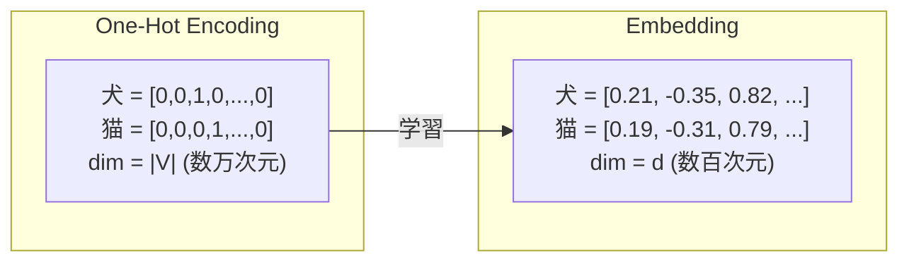

## 単語 Embedding の発展

### Word2Vec（2013年）

Word2Vec は、単語 Embedding の研究において画期的な転換点となったモデルである。Google の Tomas Mikolov らによって提案され、大規模コーパスから効率的に単語ベクトルを学習する方法を示した。

Word2Vec には2つのアーキテクチャがある：

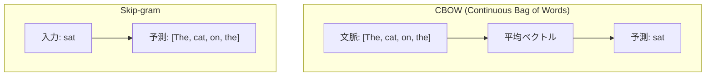

**CBOW（Continuous Bag of Words）** は周囲の文脈単語から中心単語を予測する。一方、**Skip-gram** は中心単語から周囲の文脈単語を予測する。Skip-gram は特に低頻度語の表現学習に優れていることが知られている。

Skip-gram の目的関数を数式で表すと、コーパス全体にわたって以下を最大化することになる：

$$\frac{1}{T} \sum_{t=1}^{T} \sum_{-c \leq j \leq c, j \neq 0} \log P(w_{t+j} | w_t)$$

ここで $T$ はコーパス中の総単語数、$c$ はウィンドウサイズ（文脈の範囲）である。確率 $P(w_{t+j} | w_t)$ は softmax で定義される：

$$P(w_O | w_I) = \frac{\exp(v'_{w_O} \cdot v_{w_I})}{\sum_{w=1}^{|V|} \exp(v'_w \cdot v_{w_I})}$$

ここで $v_w$ と $v'_w$ はそれぞれ単語 $w$ の入力ベクトルと出力ベクトルである。

::: warning 計算上の課題
分母の $\sum_{w=1}^{|V|}$ は語彙全体にわたる和であり、語彙サイズが大きい場合に計算コストが膨大になる。この問題を解決するために、**Negative Sampling** や **階層的 Softmax（Hierarchical Softmax）** が使われる。
:::

**Negative Sampling** では、正例（実際に共起する単語ペア）と少数のランダムに選んだ負例を区別するように学習する。これにより、語彙全体にわたる softmax の計算を回避できる。

Word2Vec の最も印象的な特性は、学習されたベクトル空間上で **線形的な意味関係** が成立することである：

$$\text{vec}(\text{"king"}) - \text{vec}(\text{"man"}) + \text{vec}(\text{"woman"}) \approx \text{vec}(\text{"queen"})$$

この性質は、Embedding ベクトルの各次元が特定の意味的特徴を分散的にエンコードしていることを示唆している。

### GloVe（2014年）

**GloVe（Global Vectors for Word Representation）** は、Stanford の Pennington らによって提案されたモデルである。Word2Vec がローカルな文脈ウィンドウに基づいて学習するのに対し、GloVe はコーパス全体の **共起行列（Co-occurrence Matrix）** のグローバルな統計情報を活用する。

GloVe の目的関数は以下のように定義される：

$$J = \sum_{i,j=1}^{|V|} f(X_{ij}) \left( w_i^T \tilde{w}_j + b_i + \tilde{b}_j - \log X_{ij} \right)^2$$

ここで $X_{ij}$ は単語 $i$ と単語 $j$ の共起回数、$f$ は重み関数（高頻度の共起に過度な重みがかかるのを防ぐ）である。

GloVe の設計思想は、共起確率の **比率** が意味関係を反映するという洞察に基づいている。例えば、「氷」と「蒸気」に対する各単語の共起確率の比を考えることで、両者の関係を捉えることができる。

### FastText（2016年）

Facebook（現 Meta）の Bojanowski らが提案した **FastText** は、単語をさらに **サブワード（部分文字列）** に分解して学習する。例えば、単語 "where" は、文字 n-gram `<wh`, `whe`, `her`, `ere`, `re>` と元の単語自身のベクトルの和として表現される。

この方法には重要な利点がある：

- **未知語への対応**: 学習時に見なかった単語でも、構成するサブワードから Embedding を合成できる
- **形態素の活用**: 「walk」「walking」「walked」のような語形変化を自然に捉えられる
- **タイポへの頑健性**: スペルミスがあっても、サブワードの多くは共通するため、大きく外れたベクトルにならない

## 文脈を考慮した Embedding — Transformer 時代

### 静的 Embedding の限界

Word2Vec、GloVe、FastText はいずれも **静的 Embedding（Static Embedding）** に分類される。つまり、各単語に対して一意のベクトルが割り当てられ、文脈によって変化しない。

しかし、自然言語には **多義性（Polysemy）** がある。例えば「bank」は「銀行」と「河岸」の両方の意味を持つが、静的 Embedding ではこれら異なる意味が一つのベクトルに混合されてしまう。

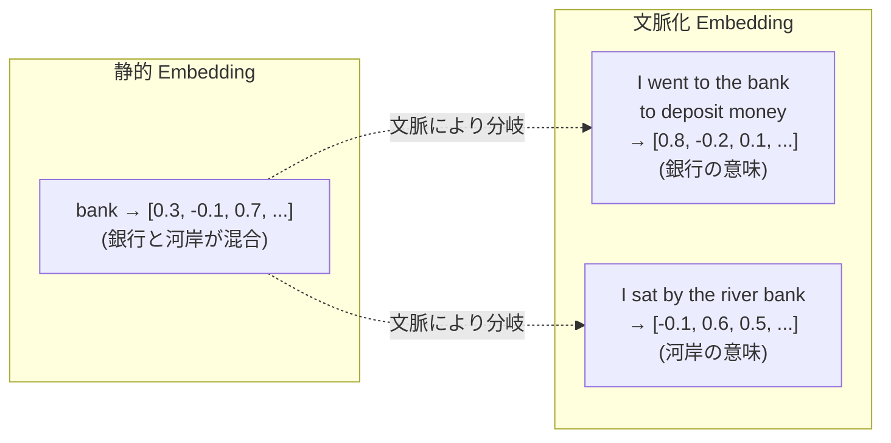

### BERT と双方向文脈理解

**BERT（Bidirectional Encoder Representations from Transformers）** は、2018年に Google が発表した事前学習モデルであり、文脈化 Embedding の決定的なブレークスルーとなった。

BERT の核心は **Masked Language Model（MLM）** による事前学習にある。入力テキストの一部のトークンをランダムにマスクし、周囲の **双方向の文脈** からマスクされたトークンを予測することで、深い文脈理解を獲得する。

```
入力: The [MASK] sat on the mat
予測: cat（周囲の文脈から推定）
```

BERT は Transformer の **Encoder** を積み重ねた構造を持つ。各レイヤーの Self-Attention メカニズムにより、入力シーケンスの全トークンが互いに注意を向け合い、文脈に応じた表現を生成する。

::: details BERT の Self-Attention の計算
入力ベクトル列 $X$ から Query $Q$、Key $K$、Value $V$ を計算し、Attention を求める：

$$Q = XW_Q, \quad K = XW_K, \quad V = XW_V$$

$$\text{Attention}(Q, K, V) = \text{softmax}\left(\frac{QK^T}{\sqrt{d_k}}\right) V$$

ここで $d_k$ は Key の次元数であり、$\sqrt{d_k}$ で除算することでスケーリングを行う。
:::

### Sentence-BERT とセマンティック検索への応用

BERT 自体は素晴らしい文脈化 Embedding を生成するが、2つの文の類似度を計算するには両者を同時にモデルに入力する必要があり、大量の文書との比較には計算コストが膨大になるという問題があった。

**Sentence-BERT（SBERT, 2019年）** は、Reimers と Gurevych によって提案された手法で、BERT を用いて個々の文を **固定長のベクトル** に変換する Siamese Network 構造を採用した。これにより、文の Embedding を事前に計算しておき、検索時にはベクトル間の距離計算だけで類似度を評価できるようになった。

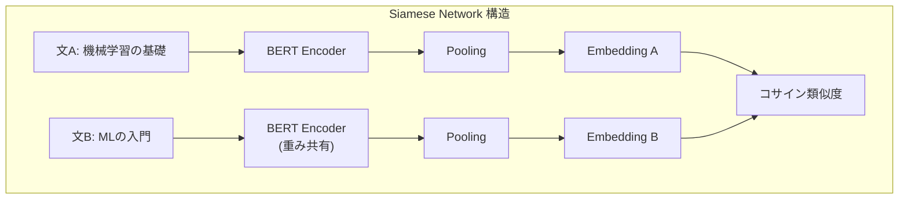

SBERT の学習には、文ペアの類似度を正しく反映するように **Contrastive Learning** や **Triplet Loss** が用いられる。Triplet Loss の定義は以下の通りである：

$$\mathcal{L} = \max(0, \| a - p \|_2 - \| a - n \|_2 + \epsilon)$$

ここで $a$ はアンカー（基準の文）、$p$ は正例（類似した文）、$n$ は負例（非類似の文）、$\epsilon$ はマージンである。

## 現代の Embedding モデル

### 主要な Embedding モデルの概観

2024年以降、セマンティック検索に特化した高性能 Embedding モデルが多数登場している。

| モデル | 開発元 | 次元数 | 最大トークン | 特徴 |
|---|---|---|---|---|
| text-embedding-3-large | OpenAI | 3072 | 8191 | 次元削減に対応、高精度 |
| text-embedding-3-small | OpenAI | 1536 | 8191 | コスト効率重視 |
| Cohere Embed v3 | Cohere | 1024 | 512 | 多言語対応、入力タイプ指定 |
| Voyage 3 | Voyage AI | 1024 | 32000 | 長文対応、コード検索に強い |
| E5-Mistral-7B-Instruct | Microsoft | 4096 | 32768 | 指示付きプロンプトで柔軟に |
| BGE-M3 | BAAI | 1024 | 8192 | 多言語・マルチグラニュラリティ |

### 学習手法の進化

現代の Embedding モデルの学習パイプラインは、以下の多段階プロセスで構成されることが多い：

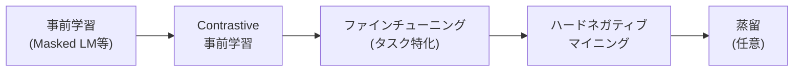

**Contrastive Learning** は Embedding モデルの学習で中心的な役割を果たす手法である。InfoNCE Loss（Noise-Contrastive Estimation に基づく損失関数）を用いて、正例ペアのベクトルを近づけ、負例ペアのベクトルを遠ざけるように学習する：

$$\mathcal{L} = -\log \frac{\exp(\text{sim}(q, k^+) / \tau)}{\exp(\text{sim}(q, k^+) / \tau) + \sum_{i=1}^{N} \exp(\text{sim}(q, k_i^-) / \tau)}$$

ここで $q$ はクエリ、$k^+$ は正例のキー、$k_i^-$ は負例のキー、$\tau$ は温度パラメータ、$\text{sim}$ はコサイン類似度である。

**ハードネガティブマイニング（Hard Negative Mining）** は、学習の質を大きく左右するテクニックである。ランダムに選んだ負例ではモデルが容易に区別できてしまうため、BM25 の上位結果や、前ステップのモデルで高スコアだが不正解な文書を負例として使うことで、より弁別的な Embedding を学習できる。

### Matryoshka Representation Learning（MRL）

2022年に提案された **Matryoshka Representation Learning（MRL）** は、Embedding の次元に階層的な構造を持たせる手法である。名前の由来はロシアのマトリョーシカ人形で、大きなベクトルの先頭部分を切り出しても有用な Embedding として機能するように学習する。

$$\mathcal{L}_{\text{MRL}} = \sum_{d \in \mathcal{D}} \mathcal{L}_d(f_d(x))$$

ここで $\mathcal{D} = \{32, 64, 128, 256, 512, \ldots\}$ は異なる次元の集合であり、各次元でも正しい類似度を保つように同時最適化する。

この手法により、用途に応じて Embedding の次元を選択できる。粗い検索（候補の絞り込み）には低次元を使い、精密なランキングには高次元を使うといった柔軟な運用が可能になる。OpenAI の text-embedding-3 シリーズはこの手法を採用している。

## 類似度の測定

Embedding ベクトル間の類似度を測定する方法は、検索の品質に直結する重要な設計要素である。

### コサイン類似度

最も広く使われる指標がコサイン類似度である。2つのベクトル $\mathbf{a}$ と $\mathbf{b}$ の角度に基づく：

$$\text{cos\_sim}(\mathbf{a}, \mathbf{b}) = \frac{\mathbf{a} \cdot \mathbf{b}}{\|\mathbf{a}\| \|\mathbf{b}\|} = \frac{\sum_{i=1}^{d} a_i b_i}{\sqrt{\sum_{i=1}^{d} a_i^2} \cdot \sqrt{\sum_{i=1}^{d} b_i^2}}$$

値域は $[-1, 1]$ であり、1 に近いほど類似度が高い。ベクトルの大きさ（ノルム）に依存しないため、文の長さの違いに左右されにくい利点がある。

### ユークリッド距離

$$d(\mathbf{a}, \mathbf{b}) = \|\mathbf{a} - \mathbf{b}\|_2 = \sqrt{\sum_{i=1}^{d} (a_i - b_i)^2}$$

値が小さいほど類似度が高い。ベクトルが正規化（ノルム = 1）されている場合、ユークリッド距離とコサイン類似度は単調な関係にある：

$$\|\mathbf{a} - \mathbf{b}\|_2^2 = 2(1 - \text{cos\_sim}(\mathbf{a}, \mathbf{b}))$$

### 内積（Dot Product）

$$\text{dot}(\mathbf{a}, \mathbf{b}) = \mathbf{a} \cdot \mathbf{b} = \sum_{i=1}^{d} a_i b_i$$

コサイン類似度と異なり、ベクトルのノルムも考慮される。一部の Embedding モデルは、内積で最適な性能を発揮するように学習されている。Maximum Inner Product Search（MIPS）として知られる検索問題は、この指標に対する効率的な近似アルゴリズムが活発に研究されている。

::: tip どの類似度指標を使うべきか
一般的に、使用する Embedding モデルが推奨する指標を選ぶべきである。多くのモデルはコサイン類似度で学習されているが、OpenAI の text-embedding-3 シリーズのように内積を推奨するモデルもある。ベクトルが正規化されていれば、コサイン類似度と内積は等価である。
:::

## ベクトル検索の仕組み

### 厳密最近傍探索の限界

セマンティック検索の本質は、クエリの Embedding ベクトルに最も近いベクトルをデータベースから見つける **最近傍探索（Nearest Neighbor Search）** 問題である。

厳密な最近傍探索は、ナイーブに実装すれば全ベクトルとの距離を計算する $O(nd)$（$n$ はベクトル数、$d$ は次元数）のアルゴリズムとなる。$n$ が数百万〜数十億に達する実用的なシナリオでは、この計算コストは受け入れられない。

高次元空間では、kd-tree のような空間分割に基づくデータ構造も効率が低下する。これは「**次元の呪い（Curse of Dimensionality）**」として知られる現象であり、高次元空間ではほとんどの点がほぼ等距離に位置するようになるため、枝刈りが効かなくなる。

そこで、完全な正確さを少し犠牲にする代わりに劇的な高速化を実現する **近似最近傍探索（Approximate Nearest Neighbor, ANN）** が実用上の標準となっている。

### HNSW（Hierarchical Navigable Small World）

**HNSW** は、現在最も広く使われている ANN アルゴリズムの一つである。小さな世界ネットワーク（Small World Network）の性質を利用した階層的なグラフ構造で、高い検索精度と速度を両立する。

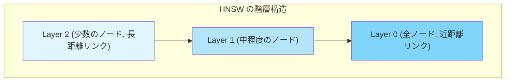

HNSW の動作原理は以下の通りである：

1. **構築フェーズ**: 各ベクトルをグラフのノードとして挿入する。ノードには確率的にレイヤーが割り当てられ（高レイヤーほど少数）、各レイヤーで近傍ノードとエッジを結ぶ
2. **検索フェーズ**: 最上位レイヤーから検索を開始し、各レイヤーでクエリに最も近いノードを貪欲に探索する。下位レイヤーに移動するにつれて、より密なグラフ上で精密な探索を行う

HNSW のパラメータとして重要なものが2つある：

- **$M$（最大エッジ数）**: 各ノードが持つエッジの最大数。大きいほど精度が向上するが、メモリ消費が増える
- **$\text{efConstruction}$（構築時の探索幅）**: インデックス構築時の探索候補数。大きいほどインデックス品質が向上するが、構築時間が増える
- **$\text{efSearch}$（検索時の探索幅）**: 検索時の候補数。大きいほど精度が向上するが、検索が遅くなる

HNSW の計算量は：
- 構築: $O(n \log n)$
- 検索: $O(\log n)$（実際にはパラメータ依存）
- メモリ: $O(n \cdot M \cdot d)$

### IVF（Inverted File Index）

**IVF** は、ベクトル空間をクラスタに分割し、検索時にはクエリに近いクラスタのみを探索するアプローチである。

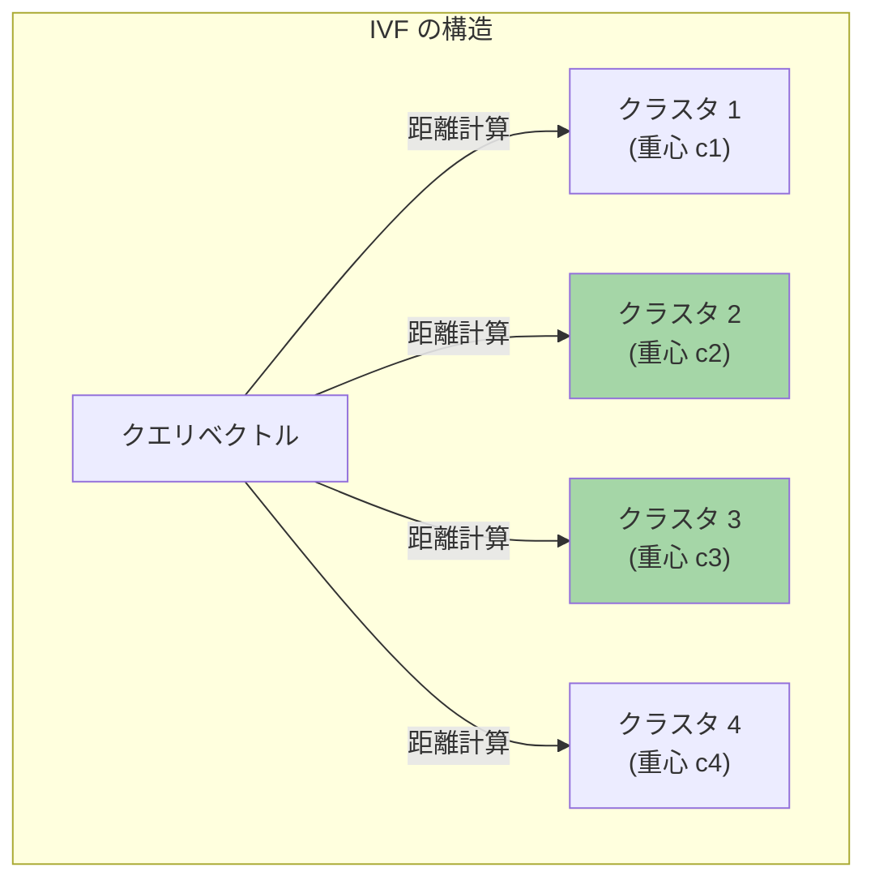

1. **構築フェーズ**: k-means などのクラスタリングアルゴリズムでベクトル集合をクラスタに分割する
2. **検索フェーズ**: クエリベクトルに最も近い $\text{nprobe}$ 個のクラスタを選び、それらに属するベクトルのみと距離を計算する

$\text{nprobe}$ パラメータが検索精度と速度のトレードオフを制御する。$\text{nprobe} = 1$ は最速だが精度が低く、$\text{nprobe}$ = 全クラスタ数だと厳密探索と等価になる。

### Product Quantization（PQ）

大量のベクトルをメモリに格納する際、元の高次元浮動小数点ベクトルをそのまま保持するのはメモリコストが高い。**Product Quantization（PQ）** は、ベクトルを圧縮してメモリ使用量を大幅に削減する手法である。

PQ の基本的なアイデアは以下の通りである：

1. $d$ 次元ベクトルを $m$ 個のサブベクトルに分割する
2. 各サブベクトル空間を $k$ 個の代表ベクトル（コードブック）でクラスタリングする
3. 元のベクトルを $m$ 個のコードブックインデックスで近似する

例えば、128次元のベクトルを 8つの16次元サブベクトルに分割し、各サブベクトルを 256個（8ビット）のコードで近似すると、元の 128 $\times$ 4バイト = 512バイトが 8バイトに圧縮される。

IVF と PQ を組み合わせた **IVF-PQ** は、大規模なベクトル検索において非常に実用的な手法であり、Facebook AI Similarity Search（FAISS）ライブラリの主要なインデックスタイプとなっている。

## セマンティック検索システムのアーキテクチャ

### 全体構成

セマンティック検索システムは、大きく **インデックス構築パイプライン** と **検索パイプライン** の2つに分かれる。

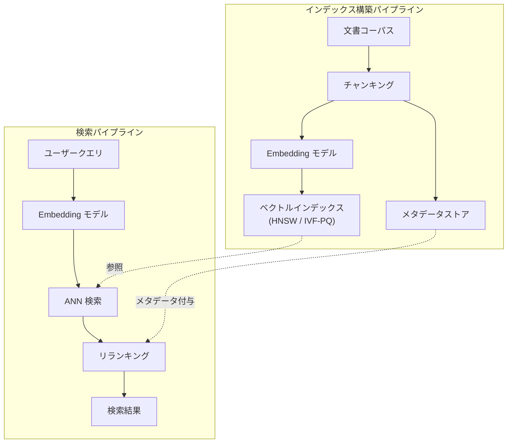

### チャンキング（Chunking）

文書を Embedding に変換する際、文書全体を一つのベクトルにするか、適切な単位に分割してそれぞれベクトル化するかを決める必要がある。この分割処理を **チャンキング** と呼ぶ。

チャンキングは検索品質に大きな影響を与えるにもかかわらず、しばしば軽視される工程である。

::: warning チャンキングサイズのジレンマ
- **小さすぎるチャンク**: 文脈が失われ、Embedding が曖昧になる
- **大きすぎるチャンク**: 複数のトピックが混在し、特定の情報への検索精度が低下する。また、Embedding モデルのトークン制限に抵触する可能性がある
:::

主要なチャンキング戦略を以下に示す：

**固定長チャンキング**: 一定の文字数やトークン数で機械的に分割する。最も単純だが、文の途中で切断される可能性がある。

**オーバーラップ付き固定長チャンキング**: 前後のチャンクと一定量の重なりを持たせることで、境界での情報損失を軽減する。

```python
def fixed_length_chunking(text, chunk_size=512, overlap=64):
    # Split text into overlapping chunks of fixed token size
    tokens = tokenize(text)
    chunks = []
    start = 0
    while start < len(tokens):
        end = min(start + chunk_size, len(tokens))
        chunks.append(detokenize(tokens[start:end]))
        start += chunk_size - overlap
    return chunks
```

**セマンティックチャンキング**: 文の意味的な境界を検出して分割する。隣接する文の Embedding 間のコサイン類似度が閾値を下回る箇所をトピック境界として使う方法がある。

**構造ベースチャンキング**: Markdown の見出し、HTML のセクション、段落区切りなど、文書構造に基づいて分割する。技術文書やドキュメントではこの方法が有効なことが多い。

### ベクトルデータベース

ベクトルインデックスの管理・検索機能を提供する専用のデータベースが **ベクトルデータベース** である。

| カテゴリ | 代表的な製品 | 特徴 |
|---|---|---|
| 専用ベクトルDB | Pinecone, Weaviate, Qdrant, Milvus, Chroma | ベクトル検索に最適化された専用システム |
| 既存DBの拡張 | PostgreSQL + pgvector, Elasticsearch kNN | 既存のデータベースにベクトル検索機能を追加 |
| ライブラリ | FAISS, Annoy, ScaNN | アプリケーションに組み込むライブラリ |

ベクトルデータベースは、純粋なベクトル検索に加えて、以下の機能を提供する：

- **メタデータフィルタリング**: 「カテゴリが "技術" でかつベクトル的に類似」のような複合条件検索
- **CRUD 操作**: ベクトルの追加・更新・削除
- **スケーラビリティ**: シャーディング、レプリケーションによる水平スケール
- **永続化**: ディスクへの書き込みとクラッシュリカバリ

::: details pgvector の利用例
PostgreSQL に pgvector 拡張をインストールすることで、既存の RDBMS にベクトル検索機能を追加できる。

::: code-group
```sql [テーブル作成]
-- Create a table with a vector column
CREATE EXTENSION vector;

CREATE TABLE documents (
    id SERIAL PRIMARY KEY,
    content TEXT NOT NULL,
    embedding vector(1536),  -- 1536-dimensional vector
    metadata JSONB
);

-- Create an HNSW index
CREATE INDEX ON documents
  USING hnsw (embedding vector_cosine_ops)
  WITH (m = 16, ef_construction = 200);
```

```sql [検索クエリ]
-- Semantic search with metadata filtering
SELECT id, content, 1 - (embedding <=> $1) AS similarity
FROM documents
WHERE metadata->>'category' = 'technology'
ORDER BY embedding <=> $1  -- cosine distance
LIMIT 10;
```
:::

### リランキング（Re-ranking）

ANN 検索で得られた候補に対して、より精密なスコアリングを行うのが **リランキング** である。

ANN 検索は高速だが、近似に伴う精度低下がある。また、Bi-Encoder（クエリと文書を独立にベクトル化する方式）には、クエリと文書の **直接的な相互作用** を捉えきれないという限界がある。

**Cross-Encoder** は、クエリと文書を連結してモデルに入力し、直接的に関連度スコアを出力する。Bi-Encoder より高精度だが、候補ごとにモデル推論が必要なため、全文書に対しては適用できない。

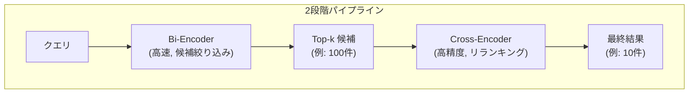

この **Retrieve-then-Rerank** パターンは、速度と精度のバランスを取る実践的なアーキテクチャとして広く採用されている。

## ハイブリッド検索

### なぜハイブリッドが必要か

セマンティック検索は強力だが、万能ではない。キーワード検索が優位な場面も存在する：

- **固有名詞やコードの検索**: 「NullPointerException」のような正確な文字列マッチが必要な場合
- **略語や型番**: 「iPhone 15 Pro Max」のような具体的な識別子
- **低頻度の専門用語**: Embedding モデルの学習データに十分含まれない用語

実用的な検索システムでは、セマンティック検索とキーワード検索を組み合わせた **ハイブリッド検索** が最も高い検索品質を実現することが経験的に知られている。

### Reciprocal Rank Fusion（RRF）

複数の検索結果を統合する最もシンプルで効果的な方法が **Reciprocal Rank Fusion（RRF）** である。

各検索結果のランクに基づいてスコアを計算し、複数の検索手法のスコアを合算する：

$$\text{RRF\_score}(d) = \sum_{r \in R} \frac{1}{k + r(d)}$$

ここで $R$ は検索手法の集合、$r(d)$ は検索手法 $r$ における文書 $d$ のランク（1から始まる）、$k$ はスムージングパラメータ（一般に 60 が使われる）である。

RRF の優れた点は、各検索手法のスコアを正規化する必要がないことである。BM25 のスコアと Embedding のコサイン類似度は値域が全く異なるが、ランクに変換することでシームレスに統合できる。

```python
def reciprocal_rank_fusion(results_list, k=60):
    # Merge results from multiple retrieval methods using RRF
    fused_scores = {}
    for results in results_list:
        for rank, doc in enumerate(results, start=1):
            if doc.id not in fused_scores:
                fused_scores[doc.id] = 0.0
            fused_scores[doc.id] += 1.0 / (k + rank)

    # Sort by fused score in descending order
    return sorted(fused_scores.items(), key=lambda x: x[1], reverse=True)
```

### ハイブリッド検索の実装パターン

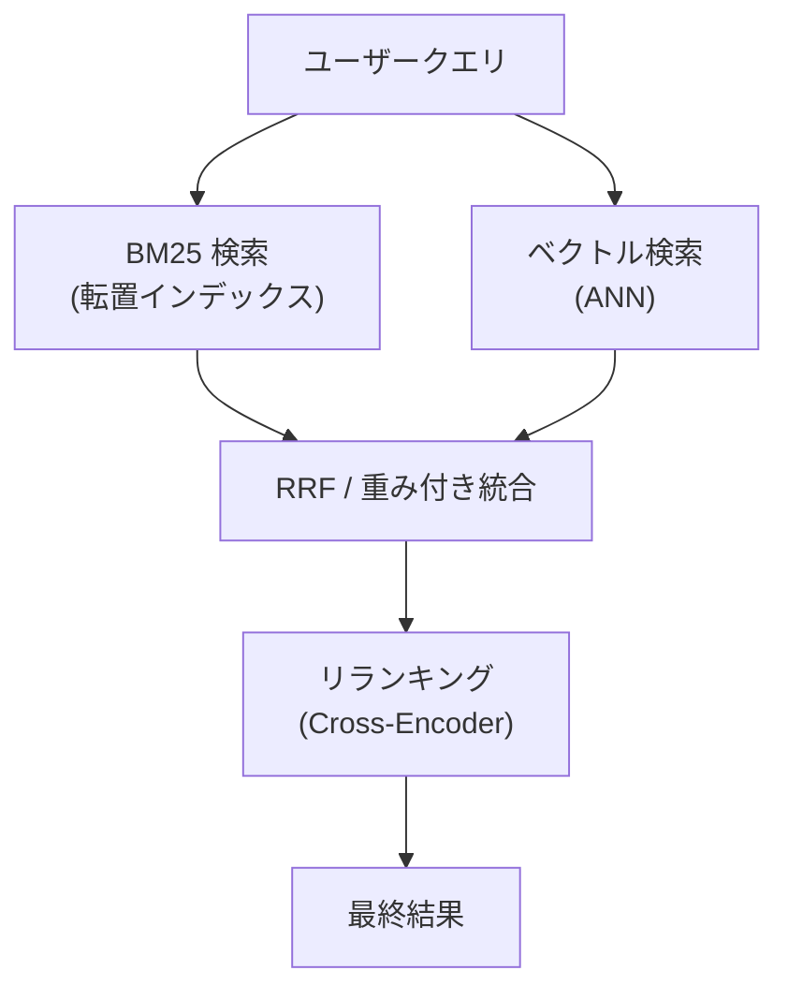

多くのベクトルデータベースやElasticsearch（8.0以降）はハイブリッド検索をネイティブにサポートしている。

## 評価指標

セマンティック検索システムの性能を定量的に評価するための指標を理解することは重要である。

### Recall@k

上位 $k$ 件の検索結果に含まれる正解文書の割合：

$$\text{Recall@k} = \frac{|\text{Top-k に含まれる正解文書}|}{|\text{全正解文書}|}$$

ANN インデックスの品質評価でよく使われる。厳密検索と比較した Recall@k が、インデックスの近似精度を示す。

### NDCG（Normalized Discounted Cumulative Gain）

検索結果の順序も考慮したランキング品質の指標である：

$$\text{DCG@k} = \sum_{i=1}^{k} \frac{2^{rel_i} - 1}{\log_2(i + 1)}$$

$$\text{NDCG@k} = \frac{\text{DCG@k}}{\text{IDCG@k}}$$

ここで $rel_i$ は位置 $i$ の文書の関連度スコア、$\text{IDCG@k}$ は理想的な順序での DCG（正規化のため）である。上位に関連度の高い文書が来るほど高いスコアとなる。

### MRR（Mean Reciprocal Rank）

最初の正解が検索結果の何番目に現れるかを測る指標：

$$\text{MRR} = \frac{1}{|Q|} \sum_{i=1}^{|Q|} \frac{1}{\text{rank}_i}$$

FAQ 検索のように、最も関連性の高い1件を素早く見つけることが重要なシナリオで有用である。

## 実践的な考慮事項

### Embedding モデルの選定基準

Embedding モデルを選定する際に考慮すべき要素を以下に整理する：

1. **言語対応**: 対象テキストの言語に対応しているか。日本語テキストを扱う場合、多言語モデルまたは日本語特化モデルが必要
2. **次元数**: 高次元ほど表現力が高いが、ストレージとメモリのコストが増加する。MRL 対応モデルなら次元削減が可能
3. **最大トークン数**: チャンクサイズの上限を決める。長い文書を扱うなら 8192 トークン以上が望ましい
4. **レイテンシとコスト**: API 呼び出しのレイテンシと料金。オンプレミス運用が可能なオープンモデルも選択肢
5. **ベンチマーク性能**: MTEB（Massive Text Embedding Benchmark）のスコアが参考になるが、自分のデータでの評価が最も重要

::: danger 重要な注意点
Embedding モデルを変更すると、全文書の再インデックスが必要になる。異なるモデルで生成された Embedding は互換性がなく、混在させると検索品質が崩壊する。モデル選定は慎重に行うべきである。
:::

### スケーラビリティとコスト

大規模なセマンティック検索システムの運用では、以下のコスト要因を考慮する必要がある：

**ストレージコスト**: $n$ 個の $d$ 次元 float32 ベクトルのストレージ量は $n \times d \times 4$ バイトである。例えば、1億ベクトル $\times$ 1536次元では約 573GB となる。PQ やスカラー量子化（float32 -> int8）によって 4〜32 倍の圧縮が可能である。

**計算コスト**: Embedding の生成コスト（モデル推論）と、検索時の ANN 計算コストの2つがある。バッチ処理による Embedding 生成の効率化や、GPU / SIMD の活用が重要となる。

**メモリコスト**: HNSW のように全ベクトルとグラフ構造をメモリに保持するアルゴリズムは、大規模データではメモリが問題になる。ディスクベースのインデックス（DiskANN など）や、量子化による圧縮が解決策となる。

### よくある落とし穴

1. **クエリと文書の非対称性を無視する**: ユーザーのクエリは短く、文書は長い。一部のモデル（E5 など）はクエリと文書に異なるプレフィックスを付けて対応している（例: `"query: "` + クエリテキスト、`"passage: "` + 文書テキスト）

2. **ドメイン適応の欠如**: 汎用 Embedding モデルは専門ドメイン（医療、法律、金融など）でパフォーマンスが低下することがある。ドメイン固有のデータでファインチューニングすることで大幅に改善できる

3. **評価なしのデプロイ**: 定量的な評価なしにシステムをリリースすると、品質の劣化に気づけない。ゴールデンテストセット（クエリと正解文書のペア）を用意し、継続的に評価することが重要である

4. **チャンキングの軽視**: 前述の通り、チャンキング戦略は検索品質に大きな影響を与える。異なるチャンキング戦略を実験し、最適なサイズと方法を見つける必要がある

## RAG との関係

セマンティック検索は **RAG（Retrieval-Augmented Generation）** の中核技術として、大規模言語モデル（LLM）の実用化に不可欠な役割を果たしている。

RAG は、LLM が持たない最新情報やドメイン固有の知識を、外部のドキュメントから検索して取り込む手法である。セマンティック検索によって関連文書を取得し、それをプロンプトのコンテキストとして LLM に渡すことで、ハルシネーション（事実に基づかない回答）を抑制し、根拠のある回答を生成できる。

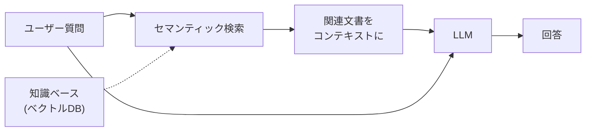

RAG のパイプラインにおいて、セマンティック検索の品質は最終的な回答品質を直接左右する。適切な文書が検索できなければ、LLM がどれほど高性能でも正確な回答を生成することはできない。この意味で、「検索（Retrieval）こそが RAG の生命線」と言える。

## 今後の展望

### Late Interaction モデル

**ColBERT（Contextualized Late Interaction over BERT）** に代表される Late Interaction 手法は、Bi-Encoder と Cross-Encoder の中間に位置するアプローチである。

Bi-Encoder はクエリと文書を一つのベクトルに圧縮するため情報損失が生じるが、ColBERT は各トークンの Embedding を保持し、検索時に **MaxSim 演算**（各クエリトークンに対して最も類似度の高い文書トークンを見つけ、それらの和を取る）で関連度を計算する。

$$\text{Score}(q, d) = \sum_{i \in q} \max_{j \in d} \text{sim}(q_i, d_j)$$

この方式は、文書側のトークン Embedding を事前計算できるため Cross-Encoder より高速でありながら、トークンレベルの相互作用を捉えるため Bi-Encoder より高精度である。

### マルチモーダル Embedding

テキストに限らず、画像・音声・動画を統一的なベクトル空間にマッピングする **マルチモーダル Embedding** の研究が進んでいる。CLIP（Contrastive Language-Image Pre-Training）は、テキストと画像を同一の Embedding 空間に配置することで、テキストクエリによる画像検索や、画像クエリによるテキスト検索を可能にした。

今後は、テキスト・画像・音声・構造化データが混在するナレッジベースに対する統一的なセマンティック検索が一般化していくと予想される。

### 効率化の進展

Embedding の生成と検索の両面で効率化が進んでいる。量子化技術（Binary Quantization, Scalar Quantization）の発展により、精度をほぼ維持しながら大幅なメモリ削減が実現されつつある。Binary Embedding は 1ビットに量子化することで、ストレージを 32 倍削減し、ハミング距離による高速な距離計算を可能にする。

また、**Matryoshka Representation Learning** のような適応的次元選択手法や、**DiskANN** のようなディスクベースの ANN アルゴリズムにより、数十億規模のベクトルをコスト効率よく検索できる基盤が整いつつある。

## まとめ

セマンティック検索は、テキストを意味を反映した数値ベクトル（Embedding）に変換し、ベクトル空間上の距離計算によって類似文書を発見する技術である。キーワード検索の語彙ミスマッチ問題を根本的に解決し、人間の意図に沿った検索を実現する。

その技術的基盤は、Word2Vec に始まる単語 Embedding から、BERT による文脈化 Embedding、そして現代の大規模 Embedding モデルへと進化してきた。検索の実用面では、HNSW や IVF-PQ といった ANN アルゴリズムが、精度と速度のバランスを取りながら大規模データへの適用を可能にしている。

実用的なシステムでは、セマンティック検索単独ではなく、BM25 などのキーワード検索と組み合わせたハイブリッド検索が最高の品質を実現することが多い。また、チャンキング戦略、モデル選定、リランキングといった各工程の最適化が全体の品質を左右する。

RAG の普及により、セマンティック検索は LLM アプリケーションの中核インフラとしての重要性を増している。マルチモーダル化や効率化の進展とともに、その適用範囲は今後さらに拡大していくだろう。
