# シリアライゼーション形式の設計思想（Protocol Buffers, Avro, MessagePack）

## 1. シリアライゼーションとは何か

### 1.1 シリアライゼーションの本質

プログラム内のデータは、メモリ上ではオブジェクト、構造体、参照のグラフとして存在する。これをネットワークで送信したり、ディスクに保存したりするには、**線形なバイト列**に変換する必要がある。この変換プロセスを**シリアライゼーション（直列化）** と呼び、逆の操作（バイト列からオブジェクトへの復元）を**デシリアライゼーション**と呼ぶ。

シリアライゼーションは、現代のソフトウェアシステムで至るところに存在する。マイクロサービス間の RPC 呼び出し、Kafka トピックに流れるイベント、Redis に格納されるキャッシュ、REST API のレスポンスボディ、設定ファイルの読み書き — これらはすべてシリアライゼーションとデシリアライゼーションを伴っている。

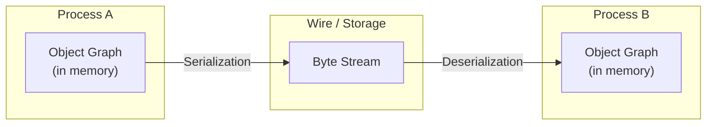

シリアライゼーション形式の選択は、システムの性能・運用性・保守性に広く影響する重要な設計判断である。HTTP API の設計時に「とりあえず JSON」と決めてしまうエンジニアは多いが、データ量・処理速度・スキーマ管理の要件によっては、バイナリ形式の採用が大きなメリットをもたらす場面がある。

### 1.2 設計上の関心事

シリアライゼーション形式の設計では、以下の関心事がトレードオフとして絡み合う。

#### エンコード後のサイズ

バイト列が小さいほど、ネットワーク転送コストとストレージコストが下がる。テキスト形式（JSON, XML）はフィールド名を文字列として繰り返すため冗長になりやすい。バイナリ形式はフィールド名を数値 ID や位置で表現するため、大幅な圧縮が可能である。

#### シリアライズ・デシリアライズ速度

CPU 集約的な処理では、シリアライゼーションがボトルネックになることがある。バイナリ形式は一般に高速だが、形式によって差がある。FlatBuffers や Cap'n Proto のように、デシリアライゼーション自体をほぼゼロコストにする設計も存在する。

#### スキーマエボリューション（Schema Evolution）

フィールドの追加・削除・型変更を、後方互換性・前方互換性を維持しながら行えるかどうかは、長期運用において最も重要な関心事の一つである。各形式が提供するスキーマエボリューションの仕組みには大きな設計上の違いがある。

#### 可読性・デバッグ容易性

テキスト形式は人間が直接読めるため、デバッグ・ログ確認・手動テストが容易である。バイナリ形式は専用のデコードツールが必要になる。

#### スキーマの有無と管理

一部の形式はスキーマを必須とし（Protocol Buffers, Avro）、他の形式はスキーマなしで動作する（JSON, MessagePack）。スキーマが強制されることで型安全性が得られるが、柔軟性は失われる。

#### 言語・エコシステムのサポート

すべての形式がすべての言語で同等に実装されているわけではない。形式によってサポートの厚さに大きな差がある。

### 1.3 本記事の構成

本記事では、主要なシリアライゼーション形式を設計思想の観点から比較解説する。まずテキスト形式とバイナリ形式の基本的な違いを整理し、次に Protocol Buffers、Apache Avro、MessagePack の設計を掘り下げる。さらに Thrift、FlatBuffers、Cap'n Proto の概要に触れ、スキーマエボリューション戦略の比較と、ユースケース別の選択指針で締めくくる。

## 2. テキスト形式 vs バイナリ形式

### 2.1 テキスト形式：JSON と XML

**JSON（JavaScript Object Notation）** は、現在最も広く使われているシリアライゼーション形式である。2001 年に Douglas Crockford が提唱したシンプルな仕様が特徴で、オブジェクト・配列・文字列・数値・真偽値・null の6種類の値型を持つ。

```json
{
  "user_id": "u-12345",
  "name": "Alice",
  "email": "alice@example.com",
  "age": 28,
  "is_active": true,
  "tags": ["admin", "editor"],
  "address": {
    "city": "Tokyo",
    "zip": "100-0001"
  }
}
```

JSON が広く普及した理由は明確である。人間が読みやすく、JavaScript のネイティブ形式であり、ほぼすべてのプログラミング言語に標準ライブラリが存在し、デバッグが容易で学習コストが低い。

ただし JSON には設計上の限界がある。

- **冗長性**: フィールド名が毎回文字列として含まれる。同じ構造のオブジェクトが 100 万件あれば、フィールド名も 100 万回繰り返される
- **型の貧弱さ**: 整数と浮動小数点数を区別しない。タイムスタンプの表現が標準化されていない。バイナリデータを扱うには Base64 エンコードが必要
- **数値精度の問題**: JavaScript の `Number` は 64 ビット浮動小数点数のため、53 ビットを超える整数の精度が失われる
- **スキーマなし**: データの構造はコードを見るか、別途ドキュメントを参照しなければ分からない

**XML（eXtensible Markup Language）** は、1990 年代後半から 2000 年代にかけての Web サービス（SOAP, WSDL）の標準形式として広く普及した。名前空間、スキーマ（XSD）、変換言語（XSLT）など豊富なエコシステムを持つが、冗長性が非常に高く、現在では新規システムでの採用は少ない。

```xml
<user>
  <user_id>u-12345</user_id>
  <name>Alice</name>
  <email>alice@example.com</email>
  <age>28</age>
  <is_active>true</is_active>
  <tags>
    <tag>admin</tag>
    <tag>editor</tag>
  </tags>
</user>
```

JSON と比べて遥かに冗長であることが一目で分かる。XML が現役である主な領域は、エンタープライズ統合（EDI, SOAP）、ドキュメント形式（Office Open XML, SVG）、設定ファイル（Maven pom.xml）などに限られつつある。

### 2.2 バイナリ形式の基本原理

バイナリ形式は、テキストへの変換を一切行わず、データを直接バイト列として表現する。これにより、以下の利点が得られる。

**フィールド識別の効率化**: フィールド名の代わりに整数 ID や位置（インデックス）を使うことで、フィールド識別のオーバーヘッドを極小化する。

**型情報の埋め込み**: ワイヤーフォーマットに型情報（型タグ）を埋め込むことで、パース時に型変換処理が不要になる場合がある。

**可変長エンコーディング**: 数値を可変長でエンコード（varint）することで、小さな値ほど少ないバイト数で表現できる。

```mermaid
graph TB
    subgraph "JSON（テキスト）"
        J["{ \"age\": 28 }\n= 12バイト"]
    end
    subgraph "Protocol Buffers（バイナリ）"
        P["フィールド番号2 + varint 28\n= 2バイト"]
    end
```

### 2.3 テキスト形式 vs バイナリ形式の比較

| 観点 | JSON / XML | バイナリ形式（PB, Avro等） |
|------|-----------|--------------------------|
| **可読性** | 人間が直接読める | 専用ツールが必要 |
| **エンコードサイズ** | 大きい（5〜10倍程度） | 小さい |
| **シリアライズ速度** | 比較的遅い（文字列変換） | 速い |
| **デシリアライズ速度** | 比較的遅い（パース） | 速い |
| **スキーマ** | 任意（JSON Schema で後付け） | 必須または組み込み |
| **型安全性** | 弱い | 強い |
| **デバッグ容易性** | 高い | 低い（ツール依存） |
| **言語サポート** | ほぼすべて（標準ライブラリ） | 形式による |
| **学習コスト** | 低い | 中〜高 |

::: tip
テキスト形式とバイナリ形式は二者択一ではない。ログファイルや人間が読む設定ファイルには JSON、高スループットな内部サービス通信やデータパイプラインにはバイナリ形式、というように使い分けることが実践的である。
:::

## 3. Protocol Buffers の設計

### 3.1 誕生の背景

**Protocol Buffers（Protobuf）** は、Google が 2008 年にオープンソース化したシリアライゼーション形式である。社内では 2001 年頃から使われており、分散システム間の RPC 通信における XML の非効率性を解消する目的で開発された。現在では gRPC のデフォルトシリアライゼーション形式として広く採用されている。

### 3.2 .proto ファイルとコード生成

Protobuf ではスキーマを `.proto` ファイルに定義する。`protoc` コンパイラがこの定義から各言語のコードを生成する。

```protobuf
// user.proto
syntax = "proto3";

package example;

option go_package = "example.com/proto/example";

// User represents a registered user
message User {
  string user_id = 1;
  string name = 2;
  string email = 3;
  int32 age = 4;
  bool is_active = 5;
  repeated string tags = 6;
  Address address = 7;
}

// Address represents a physical address
message Address {
  string city = 1;
  string zip = 2;
}

// UserService exposes user management operations
service UserService {
  rpc GetUser(GetUserRequest) returns (GetUserResponse);
  rpc CreateUser(CreateUserRequest) returns (User);
}

message GetUserRequest {
  string user_id = 1;
}

message GetUserResponse {
  User user = 1;
}

message CreateUserRequest {
  string name = 1;
  string email = 2;
  optional int32 age = 3;
}
```

コード生成により、各言語で型安全な読み書きが可能になる。

```python
# Python example (generated code usage)
import user_pb2

user = user_pb2.User()
user.user_id = "u-12345"
user.name = "Alice"
user.email = "alice@example.com"
user.age = 28
user.is_active = True
user.tags.extend(["admin", "editor"])
user.address.city = "Tokyo"
user.address.zip = "100-0001"

# Serialize to bytes
data = user.SerializeToString()
print(f"Serialized size: {len(data)} bytes")

# Deserialize from bytes
user2 = user_pb2.User()
user2.ParseFromString(data)
print(user2.name)  # Alice
```

### 3.3 ワイヤーフォーマット

Protobuf のワイヤーフォーマット（バイト列の構造）を理解することは、性能分析やトラブルシューティングに役立つ。

エンコードされたメッセージは、**フィールドタグ + 値**のペアを連続させた構造である。フィールドタグはフィールド番号とワイヤタイプを組み合わせた整数で、varint としてエンコードされる。

```
Tag = (field_number << 3) | wire_type
```

ワイヤタイプは以下の6種類が定義されている。

| ワイヤタイプ | 値 | 対応する型 |
|------------|---|-----------|
| Varint | 0 | int32, int64, uint32, uint64, sint32, sint64, bool, enum |
| 64-bit | 1 | fixed64, sfixed64, double |
| Length-delimited | 2 | string, bytes, embedded messages, repeated fields |
| 32-bit | 5 | fixed32, sfixed32, float |

たとえば `user_id = 1` (field number 1, string 型) と `age = 4` (field number 4, int32 型) は以下のようにエンコードされる。

```
フィールド user_id (番号1, ワイヤタイプ2=Length-delimited):
  Tag: (1 << 3) | 2 = 0x0A
  Length: 0x07 (7バイト)
  Value: "u-12345" = 0x75 0x2D 0x31 0x32 0x33 0x34 0x35

フィールド age (番号4, ワイヤタイプ0=Varint):
  Tag: (4 << 3) | 0 = 0x20
  Value: 28 = 0x1C
```

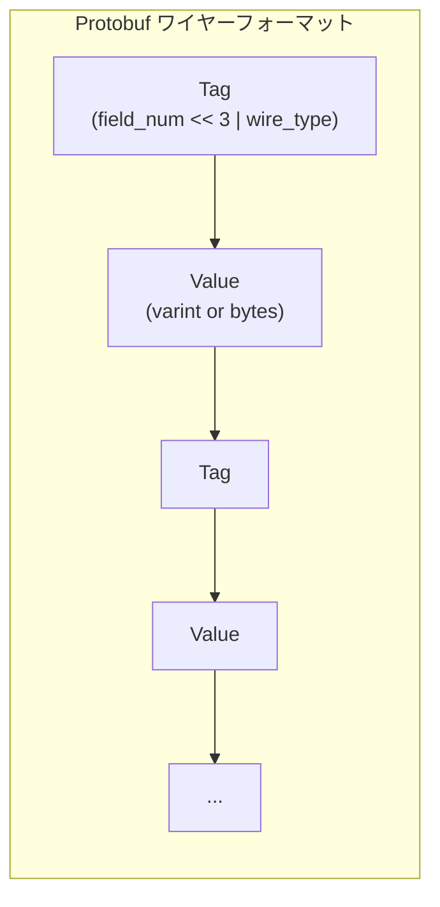

#### Varint エンコーディング

Varint は可変長整数エンコーディングである。各バイトの最上位ビット（MSB）が「続きがあるか」を示すフラグとして使われ、残りの 7 ビットがデータビットとなる。

- 0〜127 は 1 バイトで表現できる
- 128〜16383 は 2 バイトで表現できる
- 小さな値が多い実際のデータでは、固定長 4 バイト / 8 バイトより大幅に小さくなる

負の数の扱いについては注意が必要である。`int32` 型で負の値をエンコードすると、通常の varint では常に 10 バイトになってしまう（2の補数表現で最上位ビットが立つため）。これを避けるために `sint32` / `sint64` 型（ZigZag エンコーディングを使う）が用意されている。

### 3.4 フィールド番号の重要性

Protobuf の設計において最も重要な概念が**フィールド番号**である。ワイヤーフォーマットではフィールド名は一切含まれず、フィールド番号のみで識別される。この設計が後方・前方互換性の基盤となっている。

```protobuf
// v1 of User message
message User {
  string user_id = 1;
  string name = 2;
  string email = 3;
}

// v2 of User message - backward and forward compatible
message User {
  string user_id = 1;
  string name = 2;
  string email = 3;
  string phone = 4;    // new field added with new number
  // Note: field number 5 was used for 'deprecated_field'
  // and must never be reused
  reserved 5;
  reserved "deprecated_field";
}
```

未知のフィールド（リーダーが知らないフィールド番号）はデフォルトで**保持される**（proto3 の場合）。これにより、旧バージョンのコードで新バージョンのメッセージをデシリアライズしても、未知フィールドは落とされずに保持され、再シリアライズ時に復元される。

### 3.5 後方互換性ルール

Protobuf でスキーマを安全に進化させるためのルールを整理する。

**安全な操作（互換性を維持する）**

- 新しいフィールドの追加（未使用のフィールド番号を割り当てる）
- オプショナルフィールドの削除（ただし番号を `reserved` にする）
- フィールド名の変更（ワイヤーフォーマットに名前は含まれないため安全）
- `int32`, `uint32`, `int64`, `uint64`, `bool` 間の変換（ワイヤタイプが同じ Varint のため互換）
- `string` と `bytes` 間の変換（ワイヤタイプが同じ Length-delimited のため）

**危険な操作（互換性を壊す）**

- フィールド番号の変更（最も危険）
- 削除したフィールド番号の別フィールドへの再利用
- ワイヤタイプが異なる型への変更（例: `int32` → `string`）
- `required` フィールドの追加（proto2 のみ。proto3 では `required` が廃止された）

::: danger
フィールド番号の再利用は、過去のデータとの互換性を完全に破壊する。例えば、番号 4 が `string email` として使われていた時期のバイナリデータを、番号 4 を `int32 status` として再利用したスキーマで読むと、型の不一致によりデシリアライゼーションが失敗するか、誤った値が返される。`reserved` キーワードを使い、削除したフィールド番号と名前を必ず予約すること。
:::

#### proto2 と proto3 の違い

`required` / `optional` / `repeated` の区別があった proto2 に対し、proto3 ではデフォルトがすべてオプショナルとなり、`required` が廃止された。これはスキーマエボリューションの安全性向上のための意図的な設計変更である。`required` フィールドの追加が後方互換でないため、運用上の問題を多く引き起こしていた。

一方、proto3 の問題として、フィールドの「未設定」とデフォルト値（数値の 0、文字列の空文字列など）を区別できない点がある。これに対処するために `optional` キーワード（フィールドレベルでの存在確認を可能にする）と Wrapper 型（`google.protobuf.Int32Value` など）が用意されている。

```protobuf
syntax = "proto3";
import "google/protobuf/wrappers.proto";

message UserProfile {
  string user_id = 1;
  // Optional field: can distinguish between 0 and "not set"
  optional int32 age = 2;
  // Wrapper type: also allows null/unset semantics
  google.protobuf.StringValue bio = 3;
}
```

### 3.6 JSON マッピング

Protobuf は公式の JSON マッピング仕様を持っており、バイナリ形式と JSON 形式の相互変換が可能である。これにより、デバッグ時や人間が読む必要があるインターフェースでは JSON を、高スループット通信ではバイナリを使うという柔軟な運用が可能になる。

```json
{
  "userId": "u-12345",
  "name": "Alice",
  "email": "alice@example.com",
  "age": 28,
  "isActive": true,
  "tags": ["admin", "editor"],
  "address": {
    "city": "Tokyo",
    "zip": "100-0001"
  }
}
```

フィールド名の変換ルールは `snake_case` → `camelCase` である（デフォルト）。

## 4. Apache Avro の設計

### 4.1 誕生の背景

**Apache Avro** は、2009 年に Hadoop プロジェクトの一部として Doug Cutting（Hadoop の創設者）によって開発された。当時 Hadoop で広く使われていた Apache Thrift の代替として設計され、動的な型付けと、スキーマを必ずしもコード生成に結びつけないアプローチを特徴とする。

現在では Kafka エコシステムとの統合が強く、特に Confluent Platform での Kafka ストリーミング処理で広く使われている。

### 4.2 スキーマの定義

Avro のスキーマは JSON 形式で記述する（`.avsc` 拡張子が一般的）。

```json
{
  "type": "record",
  "name": "User",
  "namespace": "com.example",
  "fields": [
    {"name": "user_id", "type": "string"},
    {"name": "name", "type": "string"},
    {"name": "email", "type": "string"},
    {"name": "age", "type": ["null", "int"], "default": null},
    {"name": "is_active", "type": "boolean", "default": true},
    {"name": "tags", "type": {"type": "array", "items": "string"}, "default": []},
    {
      "name": "address",
      "type": {
        "type": "record",
        "name": "Address",
        "fields": [
          {"name": "city", "type": "string"},
          {"name": "zip", "type": "string"}
        ]
      },
      "default": null
    }
  ]
}
```

Avro の型システムの特徴として、Union 型（`["null", "int"]`）が挙げられる。これにより、null 許容フィールドを明示的に表現できる。Union 型はスキーマエボリューションで新しいフィールドを追加する際の標準的なパターンである。

### 4.3 スキーマ埋め込みとスキーマレス

Avro のバイナリフォーマットは**スキーマなしには解釈できない**。これは Protobuf と異なる根本的な設計思想である。

| フォーマット | バイナリの自己記述性 |
|------------|------------------|
| Protocol Buffers | フィールド番号+ワイヤタイプで自己記述的（スキーマなしで部分的に解析可） |
| Avro | スキーマなしでは解釈不能 |
| MessagePack | 型タグ付きで自己記述的（スキーマ不要） |

Avro でデータを交換する場合、**ライタースキーマ（Writer Schema）** をどのように伝達するかが設計の鍵となる。主な方法は以下の3つである。

1. **Object Container File**: バイナリデータの先頭にスキーマを JSON として埋め込む（Avro の `.avro` ファイル形式）
2. **スキーマレジストリ参照**: Confluent Schema Registry などを使い、スキーマ ID のみをデータに埋め込む
3. **事前共有**: 送信側と受信側が事前にスキーマを合意済みである（コードとしてデプロイ）

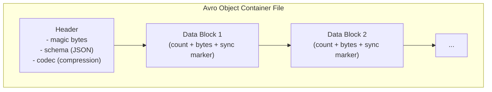

### 4.4 Schema Resolution（スキーマ解決）

Avro の最も重要な特徴が **Schema Resolution** である。これは、データを書いたときのスキーマ（ライタースキーマ）と読むときのスキーマ（リーダースキーマ）が異なっていても、定義されたルールに基づいて整合性を保つ仕組みである。

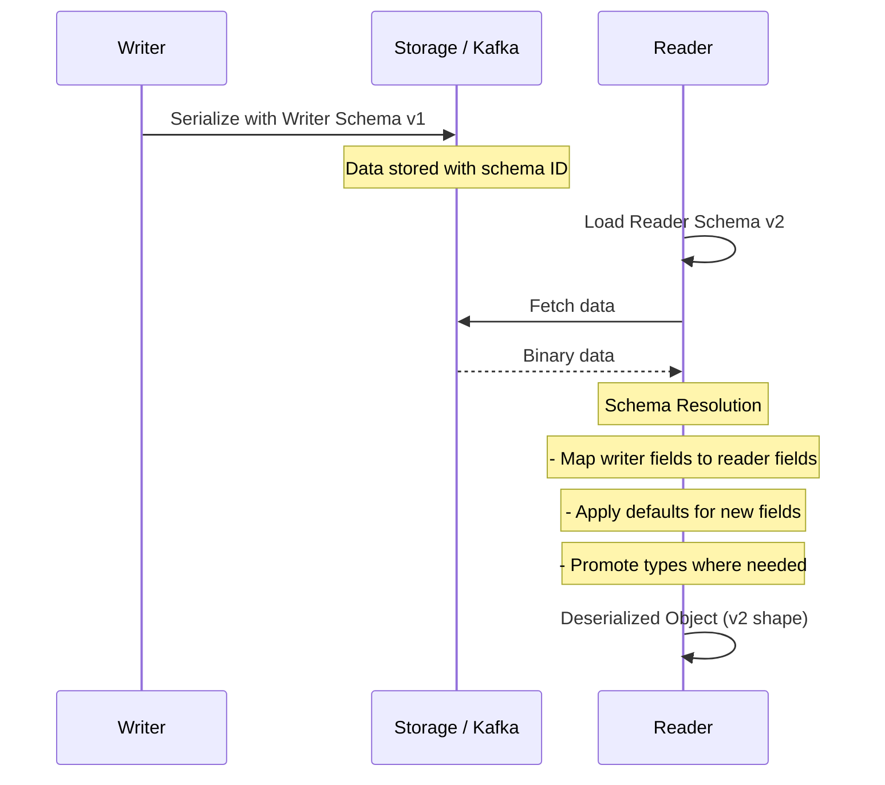

Schema Resolution のルールを以下に整理する。

| 状況 | 解決方法 |
|------|---------|
| リーダースキーマに存在するがライタースキーマにないフィールド | リーダースキーマのデフォルト値を使用。デフォルト値がなければエラー |
| ライタースキーマに存在するがリーダースキーマにないフィールド | 無視する |
| 同名フィールドで型が異なる | 型昇格ルールに従う（例: `int` → `long`, `float` → `double`） |
| フィールド名が変わった（エイリアス） | リーダーの `aliases` リストにライターのフィールド名があれば一致 |

```json
// Writer Schema v1
{
  "type": "record",
  "name": "User",
  "fields": [
    {"name": "fname", "type": "string"},
    {"name": "email", "type": "string"}
  ]
}

// Reader Schema v2 - using aliases for renamed field
{
  "type": "record",
  "name": "User",
  "fields": [
    {
      "name": "first_name",
      "type": "string",
      "aliases": ["fname"]
    },
    {"name": "email", "type": "string"},
    {
      "name": "phone",
      "type": ["null", "string"],
      "default": null
    }
  ]
}
```

この例では、ライタースキーマの `fname` フィールドが、リーダースキーマの `first_name` フィールド（`aliases: ["fname"]` を持つ）にマッピングされる。また、ライタースキーマにない `phone` フィールドには `default: null` が適用される。

### 4.5 Confluent Schema Registry との統合

Kafka と Avro を組み合わせる際に、**Confluent Schema Registry** が広く使われる。スキーマレジストリは以下の役割を担う。

- スキーマのバージョン管理と一元保管
- 互換性レベルの設定と自動チェック
- プロデューサ・コンシューマへのスキーマ ID の提供

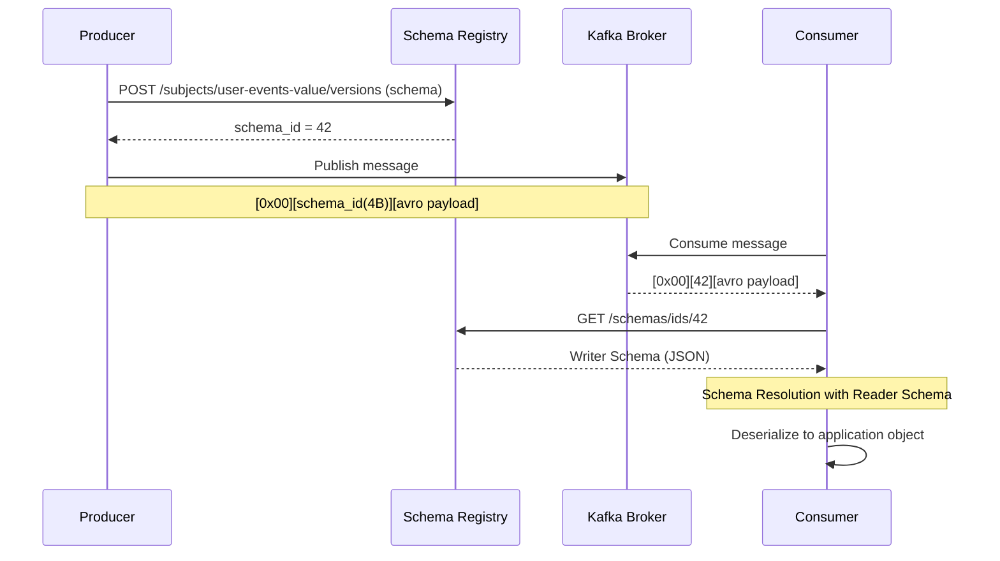

Confluent の Kafka Avro Serializer/Deserializer はこのプロトコルを自動処理する。

```python
# Python producer with Avro + Schema Registry
from confluent_kafka import Producer
from confluent_kafka.schema_registry import SchemaRegistryClient
from confluent_kafka.schema_registry.avro import AvroSerializer

schema_registry_conf = {'url': 'http://schema-registry:8081'}
schema_registry_client = SchemaRegistryClient(schema_registry_conf)

user_schema_str = """
{
  "type": "record",
  "name": "User",
  "fields": [
    {"name": "user_id", "type": "string"},
    {"name": "name", "type": "string"}
  ]
}
"""

avro_serializer = AvroSerializer(schema_registry_client, user_schema_str)

producer_conf = {
    'bootstrap.servers': 'kafka:9092',
    'value.serializer': avro_serializer
}

producer = Producer(producer_conf)
producer.produce(
    topic='user-events',
    value={'user_id': 'u-123', 'name': 'Alice'}
)
```

### 4.6 Avro の型システム

Avro のプリミティブ型と複合型を整理する。

**プリミティブ型**

| 型名 | 説明 |
|-----|------|
| `null` | null値 |
| `boolean` | 真偽値 |
| `int` | 32ビット符号付き整数 |
| `long` | 64ビット符号付き整数 |
| `float` | 32ビット浮動小数点数 |
| `double` | 64ビット浮動小数点数 |
| `bytes` | バイトシーケンス |
| `string` | UTF-8文字列 |

**複合型**

| 型 | 説明 |
|----|------|
| `record` | 名前付きフィールドの集合（構造体） |
| `enum` | 列挙型 |
| `array` | 同一型の要素の配列 |
| `map` | 文字列キーと任意型の値のマップ |
| `union` | 複数型の選択（null許容に多用） |
| `fixed` | 固定長バイト列 |

`union` 型のシリアライゼーションでは、ユニオン内の型のインデックス（varint）が先頭に付く。

## 5. MessagePack の設計

### 5.1 設計コンセプト

**MessagePack** は、2008 年に Sadayuki Furuhashi（日本人エンジニア）が開発したバイナリシリアライゼーション形式である。設計思想を一言で表すと「**JSON のバイナリ版**」である。

JSON と同じ型システム（オブジェクト・配列・文字列・整数・浮動小数点・真偽値・null）を持ちながら、バイナリ表現でエンコードすることで大幅なサイズ削減と速度向上を実現している。

Protocol Buffers や Avro が「スキーマ定義ファイルが必要」「コンパイラが必要」「言語バインディングの生成が必要」という導入コストを伴うのに対し、MessagePack は**スキーマレス**であり、既存の JSON コードを MessagePack に移行する際の変更量を最小化できる点が大きな特徴である。

```python
import msgpack
import json

data = {
    "user_id": "u-12345",
    "name": "Alice",
    "age": 28,
    "is_active": True,
    "tags": ["admin", "editor"]
}

# JSON encoding
json_bytes = json.dumps(data).encode('utf-8')
# MessagePack encoding
msgpack_bytes = msgpack.packb(data)

print(f"JSON size:       {len(json_bytes)} bytes")
print(f"MessagePack size: {len(msgpack_bytes)} bytes")
# JSON size:        87 bytes
# MessagePack size: 54 bytes
```

### 5.2 フォーマット仕様と型システム

MessagePack は型タグ（1バイト）によってデータを自己記述的に表現する。各値の先頭バイトを見ることで、その値の型と長さ（またはデータ本体）が分かる。

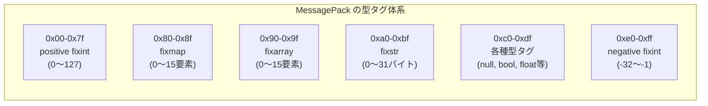

よく使われる型タグの詳細を以下に示す。

| 範囲 | 型 | 説明 |
|------|---|----|
| `0x00`〜`0x7f` | positive fixint | 7ビット正整数（0〜127）を1バイトで表現 |
| `0xe0`〜`0xff` | negative fixint | 5ビット負整数（-32〜-1）を1バイトで表現 |
| `0x80`〜`0x8f` | fixmap | 最大15要素のマップ |
| `0x90`〜`0x9f` | fixarray | 最大15要素の配列 |
| `0xa0`〜`0xbf` | fixstr | 最大31バイトの文字列 |
| `0xc0` | nil | null |
| `0xc2` | false | 偽 |
| `0xc3` | true | 真 |
| `0xca` | float32 | 32ビット浮動小数点数 |
| `0xcb` | float64 | 64ビット浮動小数点数 |
| `0xd0`〜`0xd3` | int8/16/32/64 | 符号付き整数 |
| `0xcc`〜`0xcf` | uint8/16/32/64 | 符号なし整数 |
| `0xc4`〜`0xc6` | bin8/16/32 | バイナリデータ |

小さな値に短いエンコードを割り当てる設計により、実際のデータでは高い圧縮率を実現している。例えば 0〜127 の整数は 1 バイト、15 要素以下のマップは要素数を先頭 4 ビットに詰めた 1 バイトで表現できる。

### 5.3 Extension 型

MessagePack は標準の型システムに含まれない値を表現するために **Extension 型**（`ext` 型）を提供する。アプリケーション独自の型（タイムスタンプ、UUID、カスタム型など）を `ext` 型を使って表現できる。

```
ext型のエンコーディング:
  [0xd4-0xd8 or 0xc7-0xc9]  // ext型タグ（サイズ別）
  [type_code]                 // 1バイトの型コード（-128〜127）
  [data]                      // バイナリデータ
```

MessagePack の仕様には、タイムスタンプの公式 Extension 型（型コード `-1`）が定義されており、秒+ナノ秒で高精度な時刻を表現できる。

### 5.4 JSON との比較

MessagePack が JSON と同等の型システムを持つため、相互変換が容易である。ただし微妙な非互換がある。

| 観点 | JSON | MessagePack |
|------|------|-------------|
| 整数と浮動小数点の区別 | なし | あり（int/float型を区別） |
| バイナリデータ | Base64エンコードが必要 | `bin` 型でネイティブサポート |
| タイムスタンプ | 文字列（標準化なし） | Extension 型（-1）で標準化 |
| null許容 | あり | あり |
| スキーマ | なし | なし |
| キーの型 | 文字列のみ | 任意型（整数キーも可） |

::: warning
MessagePack のマップキーに整数を使うと、JSON との相互変換時に問題が生じる可能性がある。JSON の仕様ではオブジェクトキーは文字列のみであるため、整数キーを持つ MessagePack マップを JSON に変換するには追加の処理が必要になる。
:::

### 5.5 MessagePack の活用例

MessagePack は以下のような場面で広く使われている。

- **Redis**: 多くの Redis クライアントライブラリで、値のシリアライゼーションに MessagePack が使われる
- **Fluentd**: ログ収集ツール Fluentd は内部通信に MessagePack を使用する
- **RPC フレームワーク**: MessagePack-RPC や msgpack-rpc など、シンプルな RPC の実装で採用される
- **ゲームサーバー**: リアルタイム性が求められるゲームサーバーでの状態同期に使われることがある

## 6. その他のバイナリ形式

### 6.1 Apache Thrift

**Apache Thrift** は、Facebook が 2007 年に開発し、後に Apache に寄贈したシリアライゼーション・RPC フレームワークである。Protocol Buffers と同様にコード生成アプローチを取り、IDL（Interface Definition Language）でスキーマを定義する。

```thrift
// user.thrift
namespace java com.example
namespace go example

struct Address {
  1: required string city,
  2: required string zip
}

struct User {
  1: required string user_id,
  2: required string name,
  3: optional string email,
  4: optional i32 age,
  5: optional bool is_active = true,
  6: optional list<string> tags,
  7: optional Address address
}

service UserService {
  User getUser(1: string user_id),
  User createUser(1: User user)
}
```

Thrift の特徴は、**複数のシリアライゼーションプロトコル**（TBinaryProtocol, TCompactProtocol, TJSONProtocol など）と**複数のトランスポート層**（TSocket, TFramedTransport など）を組み合わせられる柔軟なアーキテクチャにある。

フィールド識別に Protobuf 同様のフィールド ID（タグ番号）を使うため、互換性ルールも類似している。Protobuf と比べると、コード生成の質や言語サポートの一貫性で劣ると評価されることが多く、新規プロジェクトでの採用は減少傾向にある。

### 6.2 FlatBuffers

**FlatBuffers** は、Google が 2014 年に開発したシリアライゼーション形式で、**ゼロコピー・ゼロアロケーション**を設計の核心に置いている。

通常のシリアライゼーションでは、データを使う前にバイト列からオブジェクトを構築する（デシリアライズする）必要がある。FlatBuffers は、エンコードされたバイト列のメモリ上の配置が、オブジェクトのフィールドに直接アクセスできるよう設計されており、デシリアライゼーション処理そのものが不要である。

```
FlatBuffers のデータアクセス:
  buffer[offset_table[field_index]] → 直接フィールド値にアクセス
  コピーもアロケーションも不要
```

この設計により、デシリアライゼーションのレイテンシが実質的にゼロになる。メモリ制約が厳しいゲームエンジン（Unity など）や組み込みシステムでの採用が多い。欠点は、ランダムアクセス可能な形式のためエンコードサイズが Protobuf より大きくなること、スキーマ定義や使用の複雑さである。

### 6.3 Cap'n Proto

**Cap'n Proto** は、Protocol Buffers の作者 Kenton Varda が 2013 年に開発した形式で、FlatBuffers と同様に「エンコード/デコード処理なし」を目指している。

FlatBuffers との主な違いは、Cap'n Proto がメモリレイアウトとワイヤーフォーマットを同一にすることで、より徹底したゼロコピーを実現している点にある。理論上、`mmap` でファイルをマップしたバッファをそのまま構造化データとして参照できる。

また、Cap'n Proto は **RPC プロトコル**の仕様も持ち、Promise パイプラインと呼ばれる機構によって RPC のレイテンシを削減できる設計を持つ。

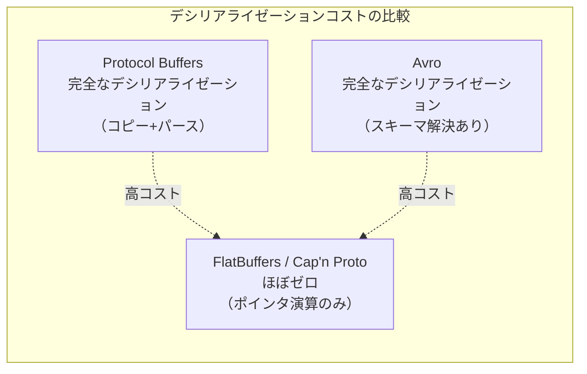

### 6.4 CBOR

**CBOR（Concise Binary Object Representation）** は、RFC 7049（改訂 RFC 8949）で標準化されたバイナリデータ形式である。JSON の型システムを基礎としながら、バイナリデータ、タグ付き値（タイムスタンプ、bignum など）をサポートする。

IoT・組み込みシステム向けの標準化を意識した設計で、COSE（CBOR Object Signing and Encryption）など関連仕様との組み合わせで使われることが多い。

## 7. スキーマエボリューション戦略の比較

### 7.1 各形式のエボリューション戦略

| 形式 | フィールド識別 | 互換性の仕組み | デフォルト値 |
|------|-------------|--------------|------------|
| **Protocol Buffers** | フィールド番号 | 未知フィールドの保持・無視 | 型固定（proto3）|
| **Avro** | フィールド名（位置） | Schema Resolution（ライター/リーダースキーマ） | スキーマ定義可 |
| **Thrift** | フィールド番号 | Protobuf と類似 | スキーマ定義可 |
| **MessagePack** | なし（スキーマレス） | なし（アプリ側の責任） | なし |
| **JSON** | フィールド名 | なし（アプリ側の責任） | なし |
| **FlatBuffers** | フィールド番号（vtable） | Protobuf と類似 | スキーマ定義可 |

### 7.2 フィールド識別方式の設計的含意

フィールドを番号で識別する方式（Protobuf, Thrift, FlatBuffers）と名前で識別する方式（Avro, JSON）には、以下のような設計的トレードオフがある。

**番号識別方式**

- 利点: フィールド名を自由に変更できる（互換性に影響しない）、エンコードサイズが小さい
- 欠点: フィールド番号の管理が必要。番号の再利用が致命的なバグの原因になる。スキーマなしにバイト列の意味を解釈できない

**名前識別方式**

- 利点: バイト列とスキーマを対応づけやすい。スキーマ自体がある程度自己説明的
- 欠点: フィールド名の変更が互換性に影響する（Avro の `aliases` で対処）。フィールド名が長いと冗長になる

### 7.3 互換性の種類と各形式の対応

後方互換性と前方互換性の観点から各形式を比較する。

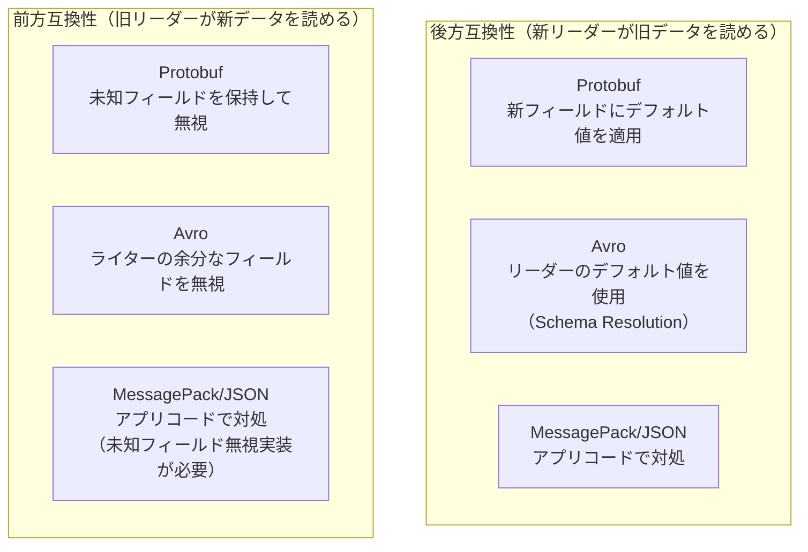

### 7.4 新フィールド追加の安全な手順

各形式でのフィールド追加の推奨手順を示す。

**Protocol Buffers での追加**

```protobuf
// Step 1: Add field with new (never-used) field number
message User {
  string user_id = 1;
  string name = 2;
  string email = 3;
  // 'phone' added - uses new field number 4
  string phone = 4;
}
// Step 2: Deploy - old readers will ignore field 4
// Step 3: New readers will use default value "" for old data
```

**Avro での追加**

```json
// Step 1: Add field with default value (required for backward compat)
{
  "type": "record",
  "name": "User",
  "fields": [
    {"name": "user_id", "type": "string"},
    {"name": "name", "type": "string"},
    {"name": "email", "type": "string"},
    {
      "name": "phone",
      "type": ["null", "string"],
      "default": null
    }
  ]
}
// Step 2: Register new schema in Schema Registry
// Step 3: Verify compatibility check passes
// Step 4: Deploy producers with new schema
// Step 5: Deploy consumers with new schema
```

**JSON での追加**

JSON はスキーマ強制がないため、アプリケーション側で未知フィールドを無視するよう実装する必要がある。

```python
# Safe JSON deserialization - ignore unknown fields
import json
from dataclasses import dataclass
from typing import Optional

@dataclass
class User:
    user_id: str
    name: str
    email: str
    phone: Optional[str] = None  # new optional field

def parse_user(json_str: str) -> User:
    data = json.loads(json_str)
    return User(
        user_id=data['user_id'],
        name=data['name'],
        email=data['email'],
        # Safely handle new and missing fields
        phone=data.get('phone')
    )
```

### 7.5 フィールド削除の安全な手順

フィールド削除はフィールド追加より危険であり、段階的な手順が必要である。

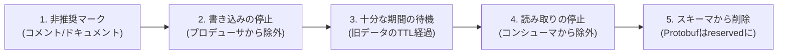

## 8. ベンチマーク比較

### 8.1 サイズ比較

同じデータをさまざまな形式でエンコードした場合のサイズ比較を示す。以下はユーザーオブジェクト（典型的なフィールド構成）の例である。

```
データ内容:
  user_id: "u-12345" (7文字)
  name: "Alice Smith" (11文字)
  email: "alice@example.com" (17文字)
  age: 28
  is_active: true
  tags: ["admin", "editor"]
```

| 形式 | エンコードサイズ | 備考 |
|------|--------------|------|
| JSON（最小化） | 約 90 バイト | フィールド名を含む |
| JSON（整形済み） | 約 150 バイト | インデント・改行あり |
| XML | 約 220 バイト | タグが冗長 |
| MessagePack | 約 55 バイト | JSON の約 60% |
| Protocol Buffers | 約 48 バイト | JSON の約 55% |
| Avro（バイナリ） | 約 45 バイト | スキーマ別途が前提 |
| Avro + 圧縮（snappy） | 約 40 バイト | |

::: tip
上記の比較はデータ内容に大きく依存する。数値フィールドが多く、値が小さい（varint が効く）場合、Protobuf のサイズ削減率はさらに高くなる。一方、長い文字列が多い場合の削減率は低くなる。実際のデータで測定することが重要である。
:::

### 8.2 シリアライズ・デシリアライズ速度

速度比較は実装・言語・データ内容・ハードウェアによって大きく異なる。ここでは定性的な傾向を示す。

| 形式 | シリアライズ | デシリアライズ | 特記事項 |
|------|------------|--------------|---------|
| JSON | 中 | 中〜低 | テキスト変換のオーバーヘッド |
| XML | 低 | 低 | パースコストが最も高い |
| MessagePack | 高 | 高 | JSON の 2〜4 倍程度 |
| Protocol Buffers | 高 | 高 | コード生成による最適化 |
| Avro | 中〜高 | 中 | Schema Resolution のオーバーヘッド |
| FlatBuffers | 高 | 最高（ほぼゼロ） | デシリアライズ不要の設計 |
| Cap'n Proto | 高 | 最高（ほぼゼロ） | FlatBuffers と同様 |

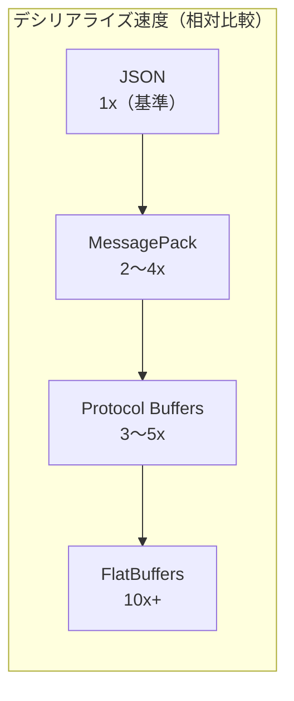

### 8.3 言語サポートの比較

| 形式 | Java | Python | Go | C++ | JavaScript | Rust |
|------|------|--------|-----|-----|-----------|------|
| JSON | ✓ 標準 | ✓ 標準 | ✓ 標準 | △ | ✓ 標準 | ✓ |
| Protocol Buffers | ✓ 公式 | ✓ 公式 | ✓ 公式 | ✓ 公式 | ✓ 公式 | ✓ |
| Avro | ✓ 公式 | ✓ 公式 | ✓ | ✓ | △ | ✓ |
| MessagePack | ✓ | ✓ | ✓ | ✓ | ✓ | ✓ |
| Thrift | ✓ 公式 | ✓ 公式 | ✓ 公式 | ✓ 公式 | △ | ✓ |
| FlatBuffers | ✓ 公式 | ✓ 公式 | ✓ 公式 | ✓ 公式 | ✓ 公式 | ✓ |
| CBOR | ✓ | ✓ | ✓ | ✓ | ✓ | ✓ |

### 8.4 実測の重要性

ベンチマークは必ずアプリケーション固有のデータと条件で計測する必要がある。以下の要因がパフォーマンスに影響する。

- データの内容（フィールド数、文字列長、数値の大きさ）
- アクセスパターン（全フィールドを読むか、一部のみか）
- メッセージサイズ（小さいメッセージではシリアライゼーション以外のオーバーヘッドが支配的）
- JIT コンパイルの影響（JVM 言語では初回実行が遅い）
- スキーマキャッシュの効果（Avro のスキーマ解決はキャッシュで大幅に高速化される）

## 9. ユースケース別の選択指針

### 9.1 REST API / Web サービス

**推奨: JSON**

公開 API や Web フロントエンドとの通信では、JSON が最も適切な選択肢である。ブラウザとのネイティブな互換性、デバッグの容易さ、クライアントライブラリの充実度において、バイナリ形式には明らかな優位性がある。

ただし以下の場合はバイナリ形式の検討を推奨する。

- API の呼び出し頻度が非常に高く、帯域幅が課題になっている
- レスポンスに大量の数値データが含まれる（例: 時系列データ API）
- 全クライアントが自社管理であり、ライブラリ配布が可能

### 9.2 マイクロサービス間の RPC

**推奨: Protocol Buffers（gRPC）**

サービス間通信でパフォーマンスとスキーマ管理を重視するなら、Protocol Buffers / gRPC が現在の実質的なスタンダードである。

- `.proto` ファイルがサービス契約（インターフェース）として機能する
- コード生成によりボイラープレートが削減される
- スキーマ変更の互換性を `buf` などのツールで自動検証できる
- HTTP/2 をトランスポートとするため、多重化・ストリーミングが標準で使える

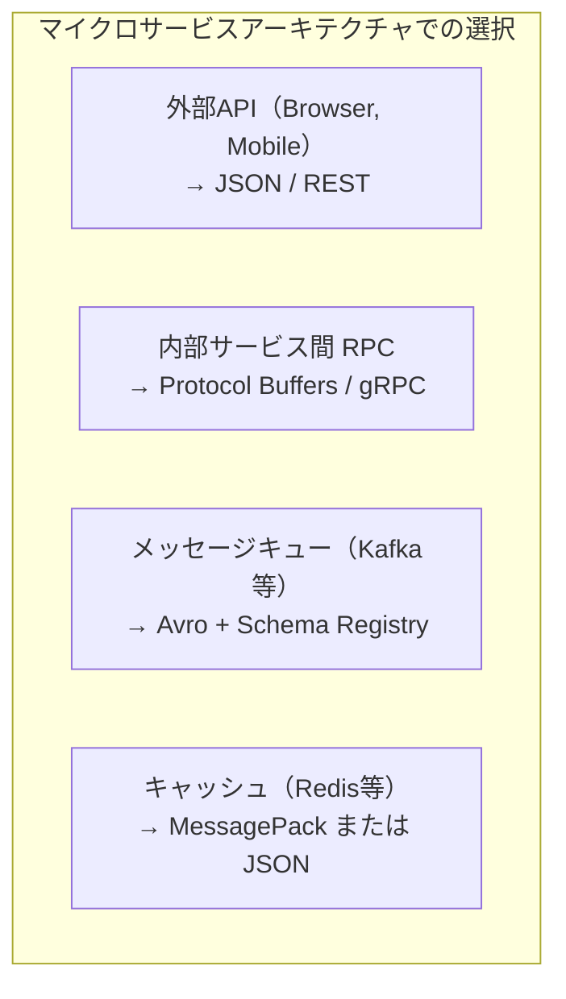

### 9.3 メッセージストリーミング（Kafka）

**推奨: Avro + Confluent Schema Registry**

Kafka を使ったイベントドリブンアーキテクチャでは、Avro + Schema Registry の組み合わせが広く採用されている。理由は以下の通りである。

- スキーマの一元管理と互換性チェックの自動化
- Kafka の長期保持メッセージに対する後方互換性の担保
- Confluent Platform との深い統合（Kafka Connect, ksqlDB）
- Schema Resolution による柔軟なスキーマ進化

Protocol Buffers + Schema Registry の組み合わせも可能であり、gRPC を主力にしている組織では一貫性の観点から選ばれることがある。

### 9.4 データ保存・分析（Hadoop, Spark）

**推奨: Avro（raw データ）、Parquet / ORC（分析クエリ）**

Hadoop エコシステムでは Avro が広く使われている。スキーマ付きのバイナリ形式であるため、データ処理パイプラインでの型安全な処理が可能である。

長期保存・分析クエリには列指向フォーマット（Apache Parquet, Apache ORC）が適している。これらは Avro のスキーマを基に変換されることが多い。

### 9.5 シンプルなスクリプト・ツール間通信

**推奨: MessagePack または JSON**

スキーマ定義やコード生成の手間をかけたくないシンプルなツール間通信や、JSON で動いている既存コードのパフォーマンス最適化には MessagePack が適している。

MessagePack は JSON と同等の柔軟性を持ちながら、追加のツールチェーンなしに高速・コンパクトなバイナリ形式を利用できる点が利点である。

### 9.6 ゲーム・リアルタイム通信

**推奨: FlatBuffers または MessagePack**

レイテンシとメモリ効率が最優先される場合は FlatBuffers が有力な選択肢である。デシリアライゼーションのコストがほぼゼロであるため、ゲームのメインループでのデータ処理に向いている。

MessagePack はシンプルな実装で十分な性能が出るため、開発速度とパフォーマンスのバランスが求められる場合に選ばれることが多い。

### 9.7 IoT・組み込みシステム

**推奨: CBOR または Protocol Buffers（TinyPB）**

リソース制約が厳しい環境では、コードサイズの小さいライブラリが使えるかどうかが重要になる。CBOR は IETF で標準化されており、CoAP プロトコルとの組み合わせで IoT での採用例が多い。

### 9.8 選択フローチャート

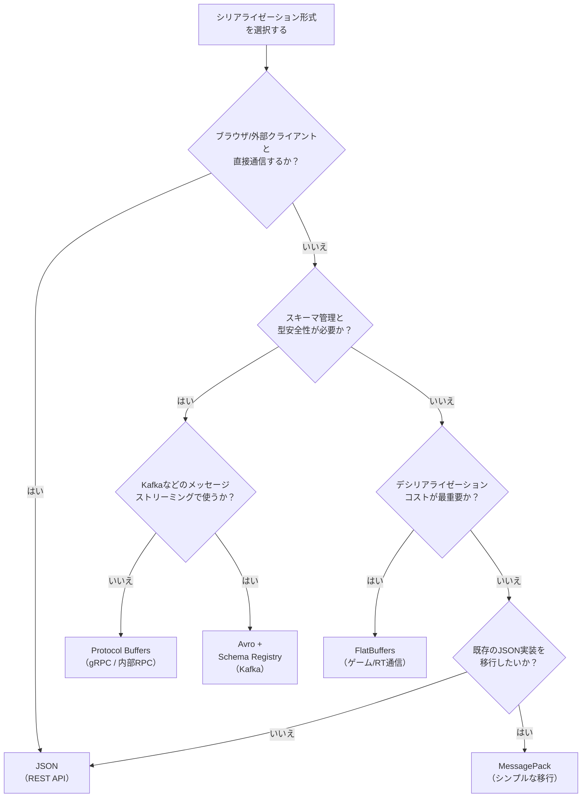

## 10. 設計思想の比較：なぜこれほど多くの形式があるのか

### 10.1 設計上の根本的なトレードオフ

多くのシリアライゼーション形式が存在する根本的な理由は、いくつかの設計上のトレードオフについて異なる優先順位を選択しているからである。

**自己記述性 vs コンパクトさ**

MessagePack は型タグによって自己記述的である（スキーマなしにバイト列の型が分かる）。Avro バイナリはスキーマなしでは解釈不能であるが、その分コンパクトである。Protobuf はフィールド番号とワイヤタイプのみが含まれ、中間的な立ち位置である。

**静的スキーマ vs 動的スキーマ**

Protobuf と Thrift はコード生成を前提とし、コンパイル時に型情報が確定する（静的）。Avro は GenericRecord を使えばスキーマを実行時に読み込んで動的に処理できる。MessagePack / JSON はスキーマ概念がなく、完全に動的である。

**エンコード効率 vs デコード効率**

Avro はエンコードサイズを最小化するため、フィールド名も番号も含めず位置のみでフィールドを識別する（スキーマが必須である理由）。FlatBuffers は vtable による間接参照でエンコードサイズが増えるが、デコードコストをゼロにできる。

**スキーマ進化の容易さ vs 単純さ**

Avro の Schema Resolution は強力だが複雑である。Protobuf はフィールド番号管理というシンプルなルールで互換性を担保している。MessagePack はスキーマエボリューションの概念を持たず、すべてアプリケーション側の責任である。

### 10.2 形式設計の歴史的文脈

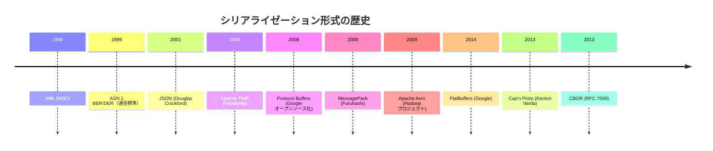

各形式は当時の具体的な問題を解決するために生まれている。Thrift は Facebook の大規模サービス間通信の効率化のために、Avro は Hadoop の大規模データ処理のために、FlatBuffers はゲームエンジンのリアルタイム性要件のために、それぞれ設計されている。

「汎用的に最適な形式」は存在せず、ユースケース・チームの技術スタック・運用要件に合わせて選択することが重要である。

### 10.3 互換性アプローチの哲学的違い

Protobuf と Avro のスキーマエボリューションアプローチは、互換性の問題を解決する哲学的に異なるアプローチを表している。

**Protobuf のアプローチ: 識別子の安定性**

「フィールドの番号は永遠に変わらない」という約束に基づいている。ライタースキーマの具体的な内容をリーダーが知らなくても、フィールド番号とワイヤタイプのみで安全に処理できる。スキーマは独立して進化できるが、番号管理という規律が必要になる。

**Avro のアプローチ: スキーマの明示的な照合**

「ライタースキーマとリーダースキーマを照合する」という明示的なプロセスに基づいている。フィールド名（またはエイリアス）でフィールドを照合し、Schema Resolution ルールで差分を埋める。この方式はより柔軟（フィールド名変更などに対応可能）だが、スキーマの伝達手段の設計が必要になる。

::: details なぜ Avro はフィールド番号を使わないのか
Avro の設計者は「フィールド番号管理は人間にとって難しすぎる」という判断から、フィールド名による識別を採用した。番号の再利用を防ぐことや、番号の割り当てを一元管理することは、大規模な組織では困難である。フィールド名はより人間が理解しやすく、`aliases` による名前変更サポートで柔軟な進化も可能にしている。

一方 Protobuf の設計者は、スキーマなしにバイト列を解析できる「自己記述性」と、フィールド名ではなく番号でフィールドを識別することによるエンコードサイズの削減を重視した。
:::

## 11. まとめ

シリアライゼーション形式の選択は、「とりあえず JSON」で済ませられる場面も多いが、パフォーマンス要件・スキーマ管理の必要性・スキーマエボリューションの頻度・チームの技術スタックを総合的に考慮した意識的な設計判断である。

本記事の要点を整理する。

1. **テキスト形式（JSON）は可読性と普及度で優位**だが、サイズとパフォーマンスで劣る。公開 API や外部クライアントとの通信では依然として第一選択

2. **Protocol Buffers は内部 RPC とスキーマ管理のバランスに優れる**。gRPC との組み合わせでマイクロサービス間通信の事実上の標準となっている。フィールド番号管理の規律が求められる

3. **Avro は Kafka エコシステムとの統合に特化**。Schema Resolution と Schema Registry によるスキーマエボリューション管理が強力。動的型付けと静的型付けの両方に対応できる柔軟性も特徴

4. **MessagePack は JSON の代替として低コストで導入できる**。スキーマレスで JSON と同等の型システムを持ちながら、高速・コンパクト。既存 JSON システムの移行コストが低い

5. **FlatBuffers / Cap'n Proto はゼロコピー・ゼロデシリアライゼーション**を実現し、レイテンシ最重視の場面で有効

6. **スキーマエボリューションの仕組みは形式選択の核心的判断材料**である。フィールドの追加は比較的安全だが、削除・変更は各形式のルールを慎重に適用する必要がある

最終的に、シリアライゼーション形式の「正解」はシステムの文脈によって異なる。重要なのは、各形式の設計思想とトレードオフを理解した上で、具体的なユースケースに照らして選択することである。
