# Server-Sent Events — HTTPの上に築かれた軽量リアルタイム通信

## 1. リアルタイム通信の選択肢を俯瞰する

### 1.1 Webにおけるリアルタイム通信の要求

Webアプリケーションの発展に伴い、サーバーからクライアントへ即座にデータを届ける要件は飛躍的に増大した。株価ティッカー、チャットメッセージの受信、ダッシュボードのメトリクス更新、ビルドの進捗通知、そして近年ではLLM（大規模言語モデル）のストリーミング応答——いずれも「サーバーが新しいデータを得た瞬間にクライアントへ届ける」という仕組みを求めている。

しかし、HTTPは本質的にリクエスト・レスポンス型のプロトコルであり、サーバーが能動的にクライアントへデータを送信する仕組みを持たない。この制約を乗り越えるために、さまざまな技術が考案されてきた。

### 1.2 ポーリング（Short Polling）

最も単純な方法は、クライアントが定期的にサーバーへリクエストを送り、新しいデータがあるかを問い合わせるポーリングだ。

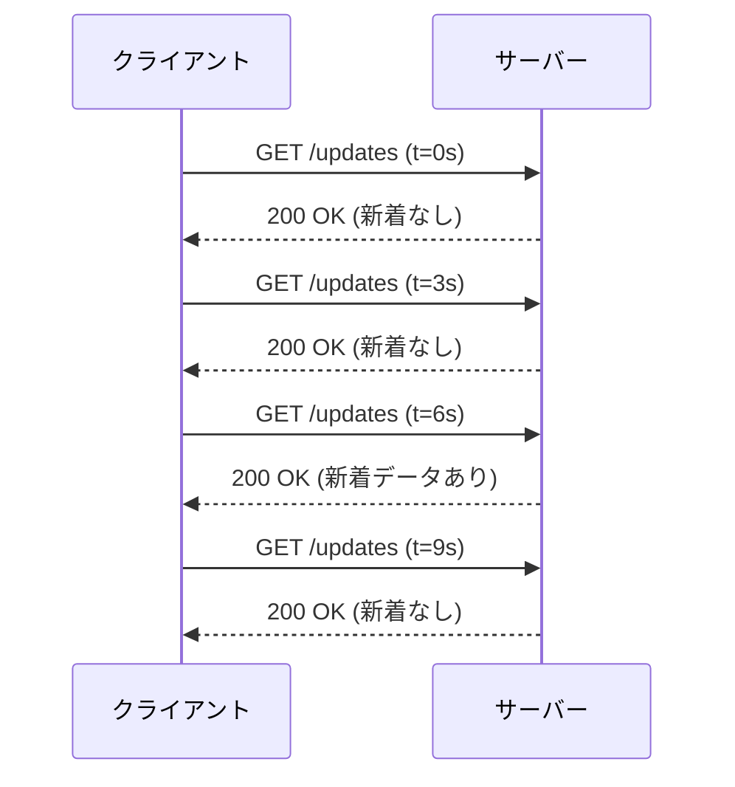

実装は極めて容易だが、ポーリング間隔がそのままリアルタイム性の上限になる。3秒間隔なら最大3秒の遅延が生じ、間隔を短くすると無駄なリクエストが激増する。1万人のユーザーが1秒間隔でポーリングすれば、データの有無にかかわらず毎秒1万リクエストがサーバーに到達する。ほとんどのレスポンスが「変更なし」であるにもかかわらず、HTTPヘッダのオーバーヘッドが毎回発生する点も無視できない。

### 1.3 Long Polling

Long Pollingは、ポーリングの改良版だ。クライアントがリクエストを送ると、サーバーは新しいデータが利用可能になるまでレスポンスを保留する。データが到着するか、タイムアウトが発生した時点でレスポンスを返し、クライアントは即座に次のリクエストを発行する。

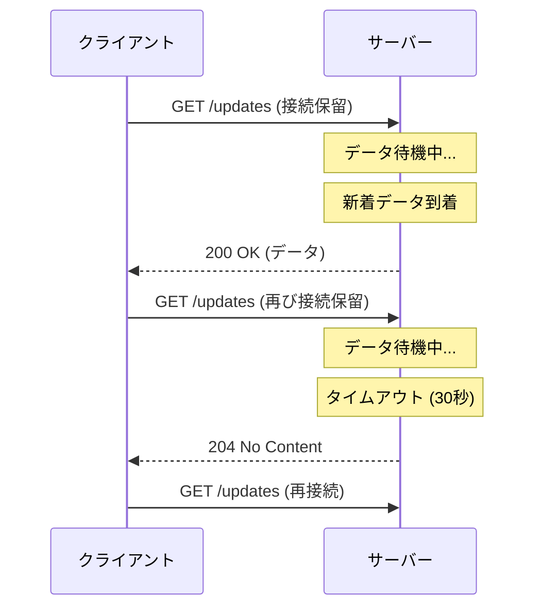

リアルタイム性はポーリングに比べて大幅に向上するが、接続のたびにHTTPヘッダの送受信が発生し、サーバー側ではタイムアウトまでの間スレッドやコネクションを占有し続ける。また、高頻度のイベントが発生する場合は、接続の確立と切断を繰り返すコストが大きくなる。

### 1.4 WebSocket

WebSocketはHTTP接続をアップグレードして、単一のTCP接続上で全二重（双方向）通信を実現するプロトコルだ。クライアントとサーバーの双方が任意のタイミングでデータを送信できるため、チャットやリアルタイムコラボレーションツールでは最も強力な選択肢となる。

ただし、WebSocketはHTTPとは異なるプロトコルであるため、既存のHTTPインフラ（プロキシ、ロードバランサ、CDN）との互換性に注意が必要だ。また、接続状態の管理、再接続ロジック、ハートビートなどをすべてアプリケーション側で実装する必要がある。

### 1.5 Server-Sent Events（SSE）

Server-Sent Events（SSE）は、上述の選択肢の中で独自の立ち位置を占めている。HTTPの通常のレスポンスボディを使ってサーバーからクライアントへイベントを継続的にストリーミングする、**サーバーからクライアントへの単方向**通信メカニズムだ。

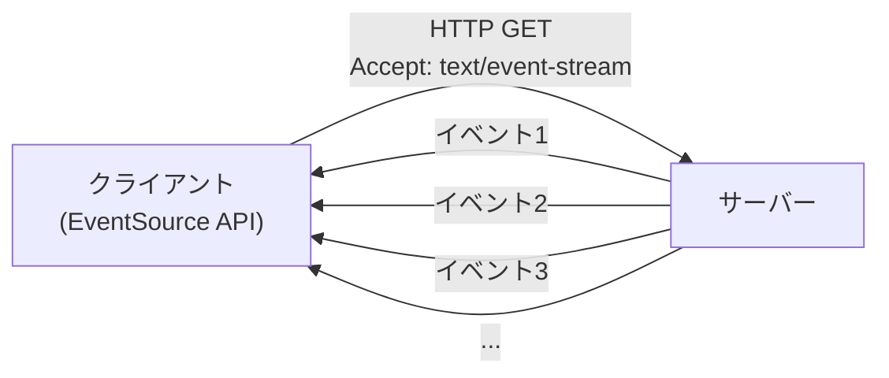

SSEが持つ最大の特徴は、**標準的なHTTPの上に構築されている**という点だ。WebSocketのようなプロトコルアップグレードは不要であり、既存のHTTPインフラをそのまま活用できる。自動再接続、イベントID管理、テキストベースのシンプルなプロトコルといった実用的な機能が仕様レベルで組み込まれている。

### 1.6 選択肢の比較

| 特性 | ポーリング | Long Polling | WebSocket | SSE |
|------|-----------|-------------|-----------|-----|
| 通信方向 | クライアント→サーバー | クライアント→サーバー | 双方向 | サーバー→クライアント |
| レイテンシ | ポーリング間隔に依存 | 低い | 最も低い | 低い |
| サーバー負荷 | 高い（空振り多数） | 中程度 | 低い | 低い |
| プロトコル | HTTP | HTTP | 独自（ws://） | HTTP |
| 自動再接続 | 手動実装 | 手動実装 | 手動実装 | 標準機能 |
| バイナリデータ | 可 | 可 | 可 | 不可（テキストのみ） |
| HTTPインフラ互換 | 完全 | 完全 | 制限あり | 完全 |
| ブラウザAPI | fetch / XMLHttpRequest | fetch / XMLHttpRequest | WebSocket API | EventSource API |

この比較表から明らかなように、SSEは「サーバーからクライアントへの一方向通信」というユースケースにおいて、WebSocketよりもシンプルかつインフラ親和性の高い選択肢となる。

---

## 2. SSEプロトコルの仕様

### 2.1 text/event-stream フォーマット

SSEのプロトコルは驚くほど単純だ。サーバーは `Content-Type: text/event-stream` を指定してHTTPレスポンスを返し、そのボディにプレーンテキストのイベントデータを書き続ける。

SSEのレスポンスは以下のHTTPヘッダで始まる。

```http
HTTP/1.1 200 OK
Content-Type: text/event-stream
Cache-Control: no-cache
Connection: keep-alive
```

`Cache-Control: no-cache` はプロキシやブラウザキャッシュがレスポンスを保存しないようにするために必須だ。`Connection: keep-alive` はHTTP/1.1でTCP接続を維持し続けるために指定する（HTTP/2以降ではこのヘッダは不要）。

### 2.2 イベントストリームの構文

イベントストリームは、改行で区切られたフィールドの集合としてイベントを表現する。各フィールドは `field: value` の形式をとり、空行（`\n\n`）がイベントの区切りとなる。

```
data: これは最初のイベントです

data: これは2番目のイベントです
data: 複数行にわたるデータも送信できます

```

上記の例では、2つのイベントが送信されている。最初のイベントは1行のデータを含み、2番目のイベントは2行にわたるデータを含んでいる。空行がイベントの終端を示す。

利用可能なフィールドは以下の4種類のみだ。

| フィールド | 説明 |
|-----------|------|
| `data` | イベントのペイロード。複数行を指定すると改行で連結される |
| `event` | イベントの種類（型名）。省略時は `message` |
| `id` | イベントのID。再接続時に `Last-Event-ID` として送信される |
| `retry` | 再接続までの待機時間（ミリ秒） |

フィールド名の後のコロンの直後にスペースが1つある場合、そのスペースはフィールド値に含まれない。つまり `data: hello` と `data:hello` はどちらもフィールド値が `hello` となる（前者のスペースは除去される）。

コロンで始まる行はコメントとして扱われ、クライアントには無視される。コメントは接続を維持するためのキープアライブとしてよく利用される。

```
: this is a comment, used as keep-alive

data: actual event data

```

### 2.3 完全なイベントの例

複数のフィールドを組み合わせた典型的なイベントストリームを示す。

```
: connection established

id: 1
event: user-login
data: {"userId": "u-1234", "name": "田中太郎"}

id: 2
event: notification
data: {"type": "info", "message": "新しいコメントがあります"}

id: 3
event: heartbeat
data: {"timestamp": 1709337600}

retry: 5000

id: 4
event: user-logout
data: {"userId": "u-1234"}

```

このストリームでは、接続確立後にコメント行が送信され、その後 `user-login`、`notification`、`heartbeat` というイベントが順番に送信されている。途中で `retry: 5000` が送信され、クライアントの再接続間隔が5秒に設定されている。

### 2.4 データフォーマットの柔軟性

`data` フィールドの値はプレーンテキストであり、プロトコルレベルではフォーマットに制約がない。実務上はJSONが最も広く使われている。

```
data: {"temperature": 23.5, "humidity": 65, "unit": "celsius"}

```

複数行のデータは `data` フィールドを繰り返すことで表現する。クライアント側では、各 `data` フィールドの値が改行文字 `\n` で連結される。

```
data: {
data:   "name": "鈴木一郎",
data:   "score": 98
data: }

```

上記のイベントを受信したクライアントは、以下の文字列を得る。

```
{\n  "name": "鈴木一郎",\n  "score": 98\n}
```

これは有効なJSONとして解析可能だ。

---

## 3. EventSource API

### 3.1 基本的な接続

ブラウザでSSEを利用するための標準APIが `EventSource` だ。W3Cの仕様として策定されており、すべてのモダンブラウザで利用可能である（Internet Explorerを除く）。

```javascript
// Create a new EventSource connection
const eventSource = new EventSource('/api/events');

// Handle default 'message' events
eventSource.onmessage = (event) => {
  console.log('Received:', event.data);
};

// Handle connection open
eventSource.onopen = (event) => {
  console.log('Connection established');
};

// Handle errors (including disconnection)
eventSource.onerror = (event) => {
  if (eventSource.readyState === EventSource.CLOSED) {
    console.log('Connection was closed');
  } else {
    console.log('Error occurred, reconnecting...');
  }
};
```

`EventSource` コンストラクタにURLを渡すだけで、サーバーへの接続が開始される。接続が確立すると `onopen` が呼ばれ、イベントを受信するたびに `onmessage` が呼ばれる。接続エラーが発生すると `onerror` が呼ばれるが、**再接続はブラウザが自動で行う**ため、アプリケーション側で明示的に再接続処理を書く必要はない。

### 3.2 readyState

`EventSource` オブジェクトは `readyState` プロパティを持ち、接続の状態を示す。

| 定数 | 値 | 説明 |
|------|---|------|
| `EventSource.CONNECTING` | 0 | 接続中、または再接続を試みている |
| `EventSource.OPEN` | 1 | 接続が確立されている |
| `EventSource.CLOSED` | 2 | 接続が閉じられ、再接続は行われない |

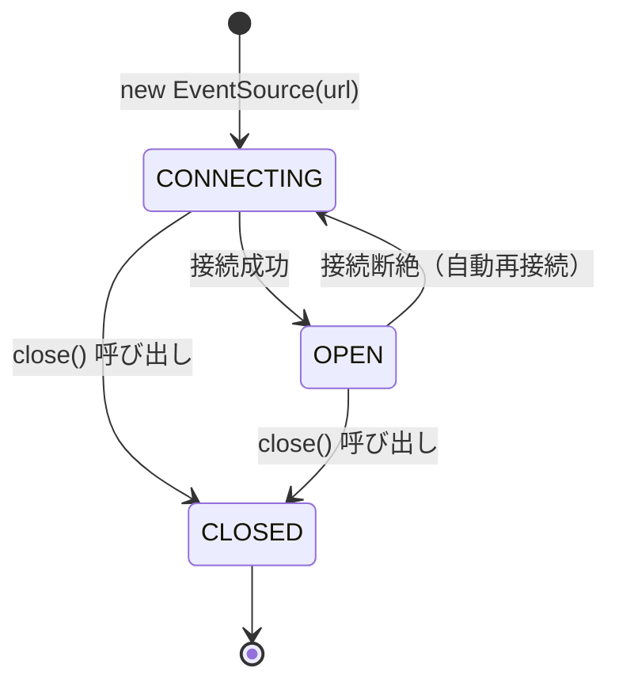

### 3.3 名前付きイベントの購読

サーバーが `event` フィールドを指定したイベントを送信する場合、クライアントは `addEventListener` で特定のイベントタイプを購読できる。

```javascript
const es = new EventSource('/api/events');

// Subscribe to 'notification' events
es.addEventListener('notification', (event) => {
  const data = JSON.parse(event.data);
  showNotification(data.title, data.message);
});

// Subscribe to 'progress' events
es.addEventListener('progress', (event) => {
  const data = JSON.parse(event.data);
  updateProgressBar(data.percent);
});

// Subscribe to 'error' events from server
es.addEventListener('server-error', (event) => {
  const data = JSON.parse(event.data);
  displayError(data.message);
});

// Default 'message' events (when no 'event' field is specified)
es.addEventListener('message', (event) => {
  console.log('Default event:', event.data);
});
```

`event` フィールドが省略されたイベントは `message` イベントとして扱われる。`onmessage` プロパティへの代入と `addEventListener('message', ...)` は同等だ。

### 3.4 EventSourceのイベントオブジェクト

イベントハンドラに渡される `MessageEvent` オブジェクトには以下のプロパティが含まれる。

| プロパティ | 説明 |
|-----------|------|
| `data` | イベントのデータ（文字列） |
| `lastEventId` | 直前に受信したイベントのID |
| `origin` | イベントソースのオリジン |
| `type` | イベントの型名 |

### 3.5 認証情報の送信

デフォルトでは、`EventSource` はCORSリクエスト時にCookieなどの認証情報を送信しない。認証情報を含めるには、第2引数に `withCredentials: true` を指定する。

```javascript
// Send credentials (cookies) with cross-origin requests
const es = new EventSource('https://api.example.com/events', {
  withCredentials: true
});
```

同一オリジンの場合は、Cookieは自動的に送信されるため、この設定は不要だ。

### 3.6 接続の終了

クライアントがSSE接続を終了するには、`close()` メソッドを呼び出す。

```javascript
// Close the connection (no automatic reconnection after this)
eventSource.close();
```

`close()` を呼ぶと `readyState` が `CLOSED` に移行し、以降の自動再接続は行われなくなる。

---

## 4. 自動再接続と Last-Event-ID

### 4.1 自動再接続メカニズム

SSEの最も実用的な特徴の一つが、プロトコルレベルで規定された自動再接続メカニズムだ。ネットワーク障害やサーバーの一時的な停止が発生した場合、`EventSource` は自動的に再接続を試みる。

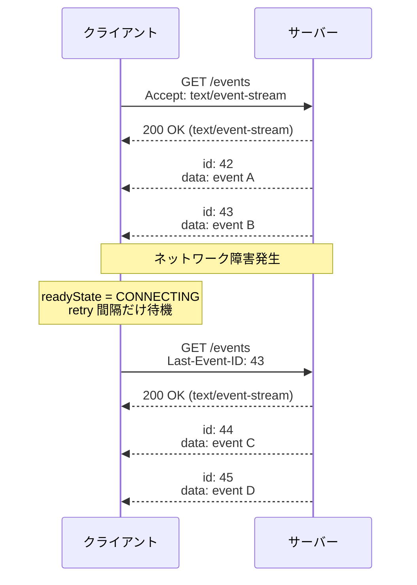

再接続が行われる際のポイントは以下のとおりだ。

1. 接続が切断されると、`readyState` が `CONNECTING` に移行する
2. `onerror` イベントが発火する
3. ブラウザは `retry` フィールドで指定された間隔（デフォルトは数秒、ブラウザ実装依存）だけ待機する
4. 最後に受信したイベントIDがある場合、`Last-Event-ID` リクエストヘッダに設定して再接続する
5. サーバーはこのヘッダを読み取り、該当IDより後のイベントを送信する

### 4.2 Last-Event-IDによるイベントの再開

`Last-Event-ID` メカニズムは、再接続時にクライアントが取りこぼしたイベントを復元するために存在する。サーバーは各イベントに `id` フィールドを付与し、クライアントが再接続時にそのIDを通知することで、欠落したイベントの再送が可能になる。

```javascript
// Server-side implementation (Node.js / Express)
app.get('/api/events', (req, res) => {
  res.setHeader('Content-Type', 'text/event-stream');
  res.setHeader('Cache-Control', 'no-cache');
  res.setHeader('Connection', 'keep-alive');

  // Check if client is reconnecting
  const lastEventId = req.headers['last-event-id'];

  if (lastEventId) {
    // Replay missed events since lastEventId
    const missedEvents = getEventsSince(parseInt(lastEventId, 10));
    for (const event of missedEvents) {
      res.write(`id: ${event.id}\ndata: ${JSON.stringify(event.data)}\n\n`);
    }
  }

  // Continue streaming new events
  const intervalId = setInterval(() => {
    const event = getLatestEvent();
    if (event) {
      res.write(`id: ${event.id}\ndata: ${JSON.stringify(event.data)}\n\n`);
    }
  }, 1000);

  // Clean up on disconnect
  req.on('close', () => {
    clearInterval(intervalId);
  });
});
```

ここで注意すべきは、`Last-Event-ID` の活用はサーバー側の実装責任だという点だ。プロトコルは再接続時にヘッダを送信する仕組みを提供するが、そのIDに基づいてどのようにイベントを再送するかはサーバーの実装に委ねられている。

### 4.3 retry フィールドによる再接続間隔の制御

サーバーはイベントストリームの中で `retry` フィールドを送信し、クライアントの再接続間隔をミリ秒単位で指定できる。

```
retry: 10000

data: normal event

```

上記の例では、接続が切断された場合の再接続までの待機時間が10秒に設定される。`retry` フィールドの値がクライアントに記憶され、以降の再接続に適用される。

この仕組みは、サーバーの負荷が高い状況で再接続間隔を長くすることで、急激な再接続ラッシュ（thundering herd問題）を緩和するために活用できる。

```
: server is under heavy load, increase retry interval
retry: 30000

data: {"status": "degraded"}

```

### 4.4 サーバーからの意図的な接続終了

サーバーがSSE接続を意図的に終了する場合、HTTPステータスコードの選択が重要だ。

- **200以外のステータスコード**（204 No Content など）を返すと、ブラウザは自動再接続を行わない
- **200を返してストリームを閉じた**場合、ブラウザは自動再接続を試みる

この仕様を利用して、サーバーはクライアントに「もう再接続する必要はない」というシグナルを送ることができる。

```javascript
// Server-side: signal client to stop reconnecting
app.get('/api/events', (req, res) => {
  if (shouldStopStreaming()) {
    // Return 204: client will NOT reconnect
    res.status(204).end();
    return;
  }

  res.setHeader('Content-Type', 'text/event-stream');
  // ... start streaming
});
```

---

## 5. イベントタイプとデータフォーマット

### 5.1 イベントタイプの設計

SSEでは `event` フィールドによってイベントをタイプ別に分類できる。適切なイベントタイプの設計は、クライアント側でのイベント処理を整理する上で重要だ。

```
event: order-created
data: {"orderId": "ORD-001", "total": 5800}

event: order-status-changed
data: {"orderId": "ORD-001", "status": "shipped"}

event: inventory-updated
data: {"productId": "P-100", "stock": 42}

```

クライアント側では、各イベントタイプに対して個別のハンドラを登録する。

```javascript
const es = new EventSource('/api/store/events');

es.addEventListener('order-created', (e) => {
  const order = JSON.parse(e.data);
  addOrderToList(order);
});

es.addEventListener('order-status-changed', (e) => {
  const update = JSON.parse(e.data);
  updateOrderStatus(update.orderId, update.status);
});

es.addEventListener('inventory-updated', (e) => {
  const stock = JSON.parse(e.data);
  refreshInventoryDisplay(stock.productId, stock.stock);
});
```

### 5.2 イベントタイプの命名規則

イベントタイプの命名には統一的な規則を適用すべきだ。一般的には以下のパターンが使われる。

- **ケバブケース**: `order-created`、`user-login`、`payment-failed`（最も一般的）
- **ドット区切り**: `order.created`、`user.login`（名前空間的な使い方）
- **スラッシュ区切り**: `order/created`（REST APIのリソース階層に合わせる場合）

重要なのは、プロジェクト全体で一貫した命名規則を採用することだ。

### 5.3 JSONエンベロープパターン

イベントごとに異なる `event` フィールドを使う代わりに、単一のJSONエンベロープにイベントタイプを含める設計も実務ではよく見られる。

```
data: {"type": "order-created", "payload": {"orderId": "ORD-001", "total": 5800}}

data: {"type": "order-status-changed", "payload": {"orderId": "ORD-001", "status": "shipped"}}

```

```javascript
const es = new EventSource('/api/events');

es.onmessage = (e) => {
  const envelope = JSON.parse(e.data);

  switch (envelope.type) {
    case 'order-created':
      handleOrderCreated(envelope.payload);
      break;
    case 'order-status-changed':
      handleOrderStatusChanged(envelope.payload);
      break;
    default:
      console.warn('Unknown event type:', envelope.type);
  }
};
```

このパターンは、SSEの `event` フィールドを使ったイベント分類と機能的には同等だが、以下の利点がある。

- クライアントが未知のイベントタイプを柔軟にハンドリングできる（`addEventListener` では未登録のイベントは黙殺される）
- TypeScriptなどの型システムとの統合が容易
- ロギングやデバッグ時にすべてのイベントを一箇所で捕捉できる

一方、SSE標準の `event` フィールドを使うアプローチには、不要なイベントをパースせずに無視できるという利点がある。どちらを選択するかはプロジェクトの設計方針による。

---

## 6. WebSocketとの比較と使い分け

### 6.1 プロトコルレベルの違い

SSEとWebSocketは根本的に異なるプロトコル設計を採用している。

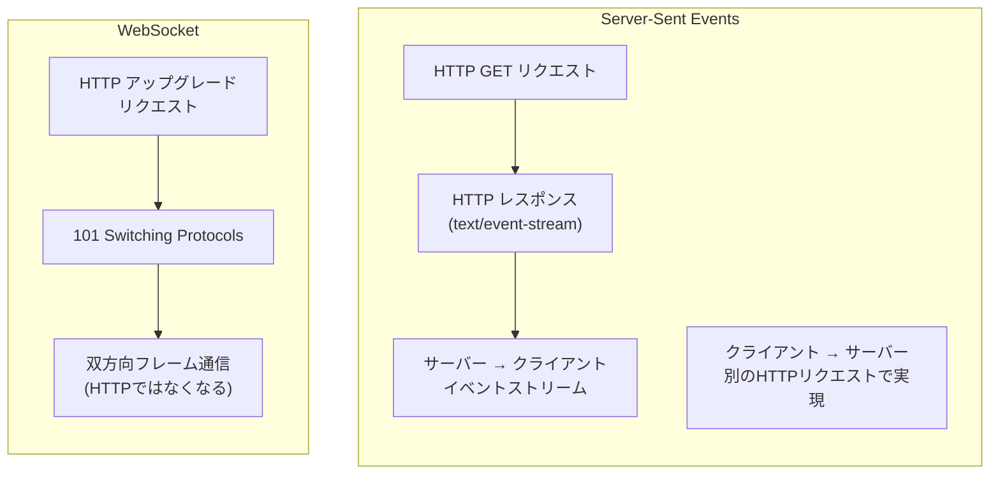

| 観点 | SSE | WebSocket |
|------|-----|-----------|
| プロトコル | HTTP（標準） | WebSocket（HTTPからアップグレード） |
| 通信方向 | サーバー→クライアント（単方向） | 双方向 |
| データ形式 | テキストのみ（UTF-8） | テキスト + バイナリ |
| ヘッダ | 通常のHTTPヘッダ | 初回のアップグレード時のみ |
| 自動再接続 | 標準仕様に含まれる | アプリケーション側で実装 |
| イベントID | 標準仕様に含まれる | アプリケーション側で実装 |
| 接続上限 | HTTP/1.1: 同一オリジンで6接続 | 制限は緩い |
| プロキシ・LB対応 | HTTPのまま動作 | 対応が必要な場合がある |

### 6.2 SSEが適しているユースケース

SSEは以下のような「サーバーからの一方向プッシュ」が主要件であるケースで真価を発揮する。

- **通知・アラート**: システム通知、エラーアラート、ステータス変更通知
- **ライブフィード**: ニュースフィード、ソーシャルメディアのタイムライン
- **ダッシュボード**: メトリクスの更新、ログのストリーミング
- **進捗表示**: ファイルアップロード進捗、バッチジョブの状況
- **AIストリーミング応答**: LLMのトークン単位の生成結果の逐次配信
- **株価・為替ティッカー**: 金融データのリアルタイム配信

これらのユースケースでは、クライアントからサーバーへの通信はHTTPリクエスト（REST APIやGraphQL）で十分であり、WebSocketの双方向性は過剰だ。

### 6.3 WebSocketが適しているユースケース

逆に、以下のケースではWebSocketが適切だ。

- **チャット**: 送受信が高頻度で交互に発生する
- **リアルタイムコラボレーション**: Google Docsのような同時編集
- **オンラインゲーム**: プレイヤー間の低遅延な双方向通信
- **バイナリストリーミング**: 音声・動画のリアルタイム処理

### 6.4 現実のプロダクトにおける選択

興味深いことに、多くの著名なサービスがSSEを採用している。

- **OpenAI API**: ChatGPTのストリーミング応答にSSEを使用
- **GitHub**: Webhookの通知やActionsのリアルタイムログ
- **Stripe**: 決済イベントのリアルタイム通知

特にLLMのストリーミング応答は、SSEの典型的なユースケースだ。サーバーがトークンを生成するたびにクライアントへ送信し、ユーザーは生成過程をリアルタイムで確認できる。この場合、通信は完全にサーバーからクライアントへの一方向であり、WebSocketを使う理由がない。

---

## 7. HTTP/2上でのSSE

### 7.1 HTTP/1.1におけるSSEの制約

HTTP/1.1環境でSSEを使用する場合、重大な制約が一つある。ブラウザは**同一オリジンに対して同時に開けるHTTPコネクション数を6に制限**している（RFC 2616では2を推奨、実装は6が一般的）。SSE接続は長時間維持されるため、この制限を消費してしまう。

例えば、同じオリジンに対してSSE接続を1本確立すると、残りのHTTPリクエスト（API呼び出し、画像取得など）に使えるコネクションは5本に減る。複数のSSE接続を開くと、さらに深刻になる。同一オリジンで6つのタブを開き、それぞれがSSE接続を持つと、すべてのコネクションがSSEに占有され、通常のHTTPリクエストがブロックされてしまう。

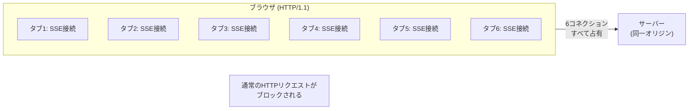

### 7.2 HTTP/2による解決

HTTP/2は単一のTCPコネクション上で複数のストリームを多重化する。この仕組みにより、HTTP/1.1のコネクション数制限の問題が根本的に解消される。

```mermaid
flowchart TB
    subgraph H1["HTTP/1.1"]
        direction LR
        C1["コネクション1: SSE"] --- S1["サーバー"]
        C2["コネクション2: SSE"] --- S1
        C3["コネクション3: API"] --- S1
        C4["コネクション4: API"] --- S1
        C5["コネクション5: 画像"] --- S1
        C6["コネクション6: CSS"] --- S1
    end

    subgraph H2["HTTP/2"]
        direction LR
        TC["単一のTCPコネクション"] --- S2["サーバー"]
        TC -.- ST1["ストリーム1: SSE"]
        TC -.- ST2["ストリーム2: SSE"]
        TC -.- ST3["ストリーム3: API"]
        TC -.- ST4["ストリーム4: API"]
        TC -.- ST5["ストリーム5: 画像"]
        TC -.- STN["ストリーム N: ..."]
    end
```

HTTP/2環境では、SSE接続は単に1つのストリームとして扱われ、他のHTTPリクエストと同じTCPコネクション上で共存する。これにより、以下のメリットが得られる。

- **コネクション数の制約がなくなる**: 複数のSSEストリームを開いても他のリクエストを圧迫しない
- **TCPハンドシェイクのコスト削減**: すべてのリクエストが1つのTCPコネクションを共有
- **ヘッダ圧縮（HPACK）**: SSEの各リクエストで送信されるHTTPヘッダが効率的に圧縮される
- **優先度制御**: SSEストリームとAPIリクエストの間で適切な帯域配分が可能

### 7.3 HTTP/2環境でのSSEの実装上の注意

HTTP/2を活用する場合でも、いくつかの注意点がある。

**コネクション単位のストリーム数上限**: HTTP/2には `SETTINGS_MAX_CONCURRENT_STREAMS` というパラメータがあり、1つのコネクション上で同時に開けるストリーム数に上限がある。Nginxのデフォルトは128だ。SSEで多数のストリームを開く場合はこの設定を確認する必要がある。

**バッファリング**: HTTP/2のフレーミングにより、小さなデータがバッファリングされる可能性がある。サーバー実装では、イベント送信後に明示的にフラッシュを行うことが重要だ。

```javascript
// Node.js: explicit flush for HTTP/2 compatibility
res.write(`data: ${JSON.stringify(payload)}\n\n`);
if (res.flush) {
  res.flush(); // Ensure data is sent immediately
}
```

**`Connection` ヘッダの非互換**: HTTP/2では `Connection: keep-alive` ヘッダは無効（HTTP/2はコネクション維持がデフォルト）であり、送信すると仕様違反となる。サーバー実装では、HTTP/1.1とHTTP/2を適切に判定してヘッダを出し分ける必要がある。

---

## 8. 負荷分散環境での考慮事項

### 8.1 SSEと負荷分散の基本的な課題

SSE接続は長時間維持されるため、負荷分散環境では通常の短命なHTTPリクエストとは異なる課題が生じる。

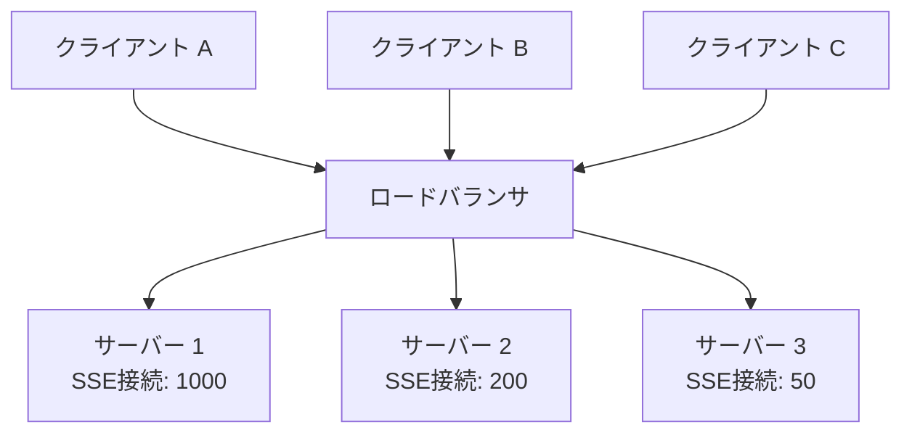

**接続の偏り**: ラウンドロビン方式のロードバランサを使っている場合、SSE接続は長時間維持されるため、新しい接続が均等に分散されても、古い接続が残り続けるサーバーに負荷が集中しやすい。特にサーバーの追加やローリングデプロイを行うと、新旧サーバー間での接続数の偏りが顕著になる。

**ヘルスチェック**: 長時間接続が維持されているため、サーバーが正常に稼働しているかどうかの判定が複雑になる。接続数が多いことと、サーバーが健全であることは必ずしも一致しない。

### 8.2 ロードバランサの設定

SSEを負荷分散環境で運用する際のロードバランサの設定ポイントを示す。

**タイムアウトの設定**: 一般的なロードバランサはHTTPリクエストにタイムアウトを設定している。SSE接続は長時間維持される必要があるため、SSEエンドポイント向けのタイムアウトを適切に延長する必要がある。

```nginx
# Nginx configuration for SSE
location /api/events {
    proxy_pass http://backend;
    proxy_http_version 1.1;

    # Disable buffering for SSE
    proxy_buffering off;
    proxy_cache off;

    # Disable chunked transfer encoding mangling
    proxy_set_header Connection '';

    # Increase timeout for long-lived connections
    proxy_read_timeout 86400s;   # 24 hours
    proxy_send_timeout 86400s;

    # Pass through headers
    proxy_set_header Host $host;
    proxy_set_header X-Real-IP $remote_addr;
}
```

**バッファリングの無効化**: Nginx等のリバースプロキシはデフォルトでレスポンスボディをバッファリングする。SSEではこのバッファリングを無効にしないと、イベントがクライアントに即座に届かない。`proxy_buffering off` と `X-Accel-Buffering: no` ヘッダの組み合わせで対処する。

```javascript
// Server-side: disable Nginx buffering via header
res.setHeader('X-Accel-Buffering', 'no');
```

### 8.3 Pub/Subアーキテクチャとの組み合わせ

複数のバックエンドサーバーにSSE接続が分散している場合、あるサーバーで発生したイベントを他のサーバーに接続しているクライアントにも届ける必要がある。この問題を解決するのがPub/Sub（Publish/Subscribe）アーキテクチャだ。

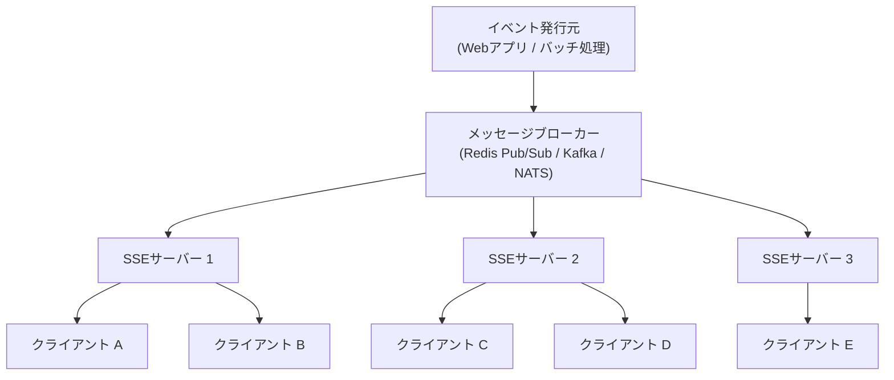

Redis Pub/Subを使った実装例を示す。

```javascript
import express from 'express';
import Redis from 'ioredis';

const app = express();
const subscriber = new Redis();

app.get('/api/events', (req, res) => {
  res.setHeader('Content-Type', 'text/event-stream');
  res.setHeader('Cache-Control', 'no-cache');
  res.setHeader('X-Accel-Buffering', 'no');

  // Subscribe to Redis channel
  const channel = 'app-events';
  const redisClient = new Redis();

  redisClient.subscribe(channel);

  redisClient.on('message', (ch, message) => {
    const event = JSON.parse(message);
    res.write(`id: ${event.id}\n`);
    res.write(`event: ${event.type}\n`);
    res.write(`data: ${JSON.stringify(event.data)}\n\n`);
  });

  // Clean up on disconnect
  req.on('close', () => {
    redisClient.unsubscribe(channel);
    redisClient.quit();
  });
});
```

この構成では、どのサーバーが接続を受け持っていても、Redis Pub/Subを通じてすべてのサーバーにイベントが配信される。クライアントは自分が接続しているサーバーからイベントを受信できるため、ロードバランサの接続先が変わっても問題ない。

### 8.4 スケールアウト時の接続管理

SSEサーバーをスケールアウトする際は、以下の点を考慮する。

**グレースフルシャットダウン**: サーバーを停止する際は、既存のSSE接続を即座に切断するのではなく、`retry` フィールドで短い再接続間隔を通知してから接続を閉じることで、クライアントのスムーズな移行を促す。

```javascript
// Graceful shutdown: notify clients before closing
function gracefulShutdown(connections) {
  for (const res of connections) {
    // Set short retry interval before closing
    res.write('retry: 1000\n\n');
    res.end();
  }
}
```

**接続数のモニタリング**: 各サーバーが保持しているSSE接続数を継続的にモニタリングし、偏りが生じた場合はドレイン（新規接続の停止）とリバランスを行う。

**コネクションの寿命管理**: 長時間維持されたSSE接続は定期的にサーバー側からクローズし、クライアントの自動再接続によってロードバランサの再分配を促す手法もある。例えば1〜2時間ごとにランダムなタイミングで接続を閉じる。

```javascript
// Periodically close connections for rebalancing
const MAX_CONNECTION_DURATION = 60 * 60 * 1000; // 1 hour
const JITTER = 10 * 60 * 1000; // 10 minutes jitter

function scheduleReconnect(res) {
  const duration = MAX_CONNECTION_DURATION + Math.random() * JITTER;
  setTimeout(() => {
    res.write('retry: 1000\n\n');
    res.end();
  }, duration);
}
```

ジッターを加えることで、全クライアントが同時に再接続する事態を避けている。

---

## 9. 実装パターン

### 9.1 進捗通知

ファイルのアップロードやバッチ処理の進捗を通知するSSEパターン。クライアントはまず通常のHTTPリクエストで処理を開始し、別途SSE接続で進捗を受信する。

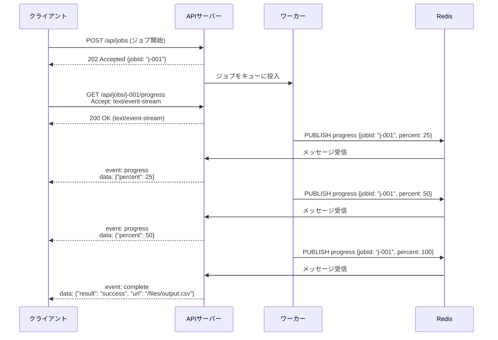

サーバー側の実装例を示す。

```javascript
// POST: Start a batch job
app.post('/api/jobs', async (req, res) => {
  const jobId = generateJobId();
  await enqueueJob(jobId, req.body);
  res.status(202).json({ jobId });
});

// GET: Stream job progress via SSE
app.get('/api/jobs/:jobId/progress', (req, res) => {
  const { jobId } = req.params;

  res.setHeader('Content-Type', 'text/event-stream');
  res.setHeader('Cache-Control', 'no-cache');
  res.setHeader('X-Accel-Buffering', 'no');

  const redisClient = new Redis();
  const channel = `job-progress:${jobId}`;

  redisClient.subscribe(channel);

  redisClient.on('message', (ch, message) => {
    const progress = JSON.parse(message);

    if (progress.status === 'complete') {
      res.write(`event: complete\ndata: ${JSON.stringify(progress)}\n\n`);
      // Close connection after completion
      res.end();
      redisClient.unsubscribe(channel);
      redisClient.quit();
    } else {
      res.write(`event: progress\ndata: ${JSON.stringify(progress)}\n\n`);
    }
  });

  req.on('close', () => {
    redisClient.unsubscribe(channel);
    redisClient.quit();
  });
});
```

クライアント側の実装も示す。

```javascript
async function startJobWithProgress(payload) {
  // Start the job
  const response = await fetch('/api/jobs', {
    method: 'POST',
    headers: { 'Content-Type': 'application/json' },
    body: JSON.stringify(payload),
  });
  const { jobId } = await response.json();

  // Connect to progress stream
  const es = new EventSource(`/api/jobs/${jobId}/progress`);

  es.addEventListener('progress', (e) => {
    const { percent } = JSON.parse(e.data);
    updateProgressBar(percent);
  });

  es.addEventListener('complete', (e) => {
    const result = JSON.parse(e.data);
    showCompletionMessage(result);
    es.close(); // No need to reconnect after completion
  });

  es.onerror = () => {
    if (es.readyState === EventSource.CLOSED) {
      showError('Connection lost');
    }
  };
}
```

### 9.2 ダッシュボードのリアルタイム更新

運用ダッシュボードでメトリクスをリアルタイムに表示するパターン。

```javascript
// Server: Stream dashboard metrics
app.get('/api/dashboard/stream', (req, res) => {
  res.setHeader('Content-Type', 'text/event-stream');
  res.setHeader('Cache-Control', 'no-cache');
  res.setHeader('X-Accel-Buffering', 'no');

  let eventId = 0;

  // Send initial snapshot
  const snapshot = getDashboardSnapshot();
  res.write(`id: ${++eventId}\n`);
  res.write(`event: snapshot\n`);
  res.write(`data: ${JSON.stringify(snapshot)}\n\n`);

  // Send periodic updates
  const intervalId = setInterval(async () => {
    const metrics = await collectMetrics();
    res.write(`id: ${++eventId}\n`);
    res.write(`event: metrics-update\n`);
    res.write(`data: ${JSON.stringify(metrics)}\n\n`);
  }, 5000);

  // Send alerts as they occur
  const alertHandler = (alert) => {
    res.write(`id: ${++eventId}\n`);
    res.write(`event: alert\n`);
    res.write(`data: ${JSON.stringify(alert)}\n\n`);
  };
  alertEmitter.on('alert', alertHandler);

  // Keep-alive every 30 seconds
  const keepAliveId = setInterval(() => {
    res.write(': keep-alive\n\n');
  }, 30000);

  req.on('close', () => {
    clearInterval(intervalId);
    clearInterval(keepAliveId);
    alertEmitter.off('alert', alertHandler);
  });
});
```

このパターンでは3種類のイベントを使い分けている。

- **`snapshot`**: 接続直後に現在の状態全体を送信する（初期描画用）
- **`metrics-update`**: 定期的にメトリクスの差分を送信する
- **`alert`**: アラート発生時に即座に通知する

また、30秒ごとのキープアライブコメントにより、プロキシやロードバランサによるアイドルタイムアウトを防止している。

### 9.3 AIストリーミング応答

LLMの応答をトークン単位で逐次配信するパターンは、SSEの現代的な代表的ユースケースだ。OpenAI APIやAnthropic APIがこの方式を採用している。

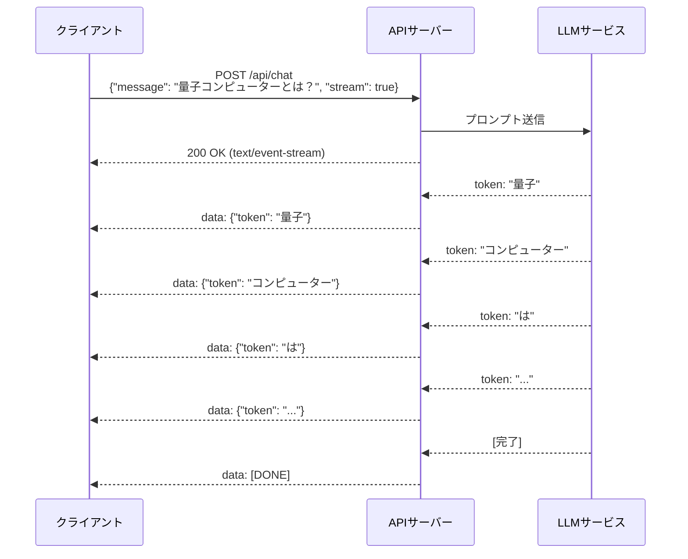

サーバー側の実装例を示す。

```javascript
app.post('/api/chat', async (req, res) => {
  const { message, stream } = req.body;

  if (!stream) {
    // Non-streaming response
    const result = await generateResponse(message);
    return res.json({ response: result });
  }

  // Streaming response via SSE
  res.setHeader('Content-Type', 'text/event-stream');
  res.setHeader('Cache-Control', 'no-cache');
  res.setHeader('X-Accel-Buffering', 'no');

  try {
    const tokenStream = await streamResponse(message);

    for await (const token of tokenStream) {
      const payload = JSON.stringify({
        token: token.text,
        finishReason: token.finishReason || null,
      });
      res.write(`data: ${payload}\n\n`);
    }

    // Signal completion
    res.write('data: [DONE]\n\n');
    res.end();
  } catch (error) {
    // Send error event before closing
    res.write(`event: error\ndata: ${JSON.stringify({ message: error.message })}\n\n`);
    res.end();
  }
});
```

クライアント側では、`EventSource` の代わりに `fetch` APIを使うケースが多い。`EventSource` はGETリクエストしか発行できないが、AIチャットではPOSTリクエストでプロンプトを送信する必要があるからだ。

```javascript
async function streamChat(message) {
  const response = await fetch('/api/chat', {
    method: 'POST',
    headers: { 'Content-Type': 'application/json' },
    body: JSON.stringify({ message, stream: true }),
  });

  const reader = response.body.getReader();
  const decoder = new TextDecoder();
  let buffer = '';

  while (true) {
    const { done, value } = await reader.read();
    if (done) break;

    buffer += decoder.decode(value, { stream: true });

    // Parse SSE events from buffer
    const lines = buffer.split('\n');
    buffer = lines.pop(); // Keep incomplete line in buffer

    for (const line of lines) {
      if (line.startsWith('data: ')) {
        const data = line.slice(6);
        if (data === '[DONE]') {
          onComplete();
          return;
        }
        const parsed = JSON.parse(data);
        appendToken(parsed.token);
      }
    }
  }
}
```

::: tip EventSource vs fetch による SSE の受信
`EventSource` APIはSSE受信のための標準的なインターフェースであり、自動再接続やイベントID管理を内蔵している。一方で、GETリクエストしか送信できず、カスタムヘッダ（`Authorization` ヘッダなど）の設定にも制約がある。`fetch` APIを使えばPOSTリクエストやカスタムヘッダを自由に設定でき、ReadableStreamとして柔軟にデータを処理できるが、自動再接続やイベントIDの管理はアプリケーション側で実装する必要がある。ユースケースに応じて適切な方を選択すべきだ。
:::

### 9.4 fetch APIでSSEを受信する場合の再接続実装

`fetch` APIを使う場合、`EventSource` が提供する自動再接続を自前で実装する必要がある。

```javascript
class SSEClient {
  constructor(url, options = {}) {
    this.url = url;
    this.options = options;
    this.retryInterval = options.retryInterval || 3000;
    this.lastEventId = null;
    this.handlers = new Map();
    this.abortController = null;
    this.closed = false;
  }

  on(eventType, handler) {
    if (!this.handlers.has(eventType)) {
      this.handlers.set(eventType, []);
    }
    this.handlers.get(eventType).push(handler);
  }

  async connect() {
    if (this.closed) return;

    this.abortController = new AbortController();
    const headers = { ...this.options.headers };

    if (this.lastEventId) {
      headers['Last-Event-ID'] = this.lastEventId;
    }

    try {
      const response = await fetch(this.url, {
        method: this.options.method || 'GET',
        headers,
        body: this.options.body,
        signal: this.abortController.signal,
      });

      if (!response.ok) {
        throw new Error(`HTTP ${response.status}`);
      }

      const reader = response.body.getReader();
      const decoder = new TextDecoder();
      let buffer = '';

      while (true) {
        const { done, value } = await reader.read();
        if (done) break;

        buffer += decoder.decode(value, { stream: true });
        const events = this.parseEvents(buffer);
        buffer = events.remaining;

        for (const event of events.parsed) {
          if (event.id) this.lastEventId = event.id;
          if (event.retry) this.retryInterval = event.retry;
          this.dispatch(event);
        }
      }
    } catch (error) {
      if (error.name === 'AbortError') return;
      console.error('SSE connection error:', error);
    }

    // Auto-reconnect after retry interval
    if (!this.closed) {
      setTimeout(() => this.connect(), this.retryInterval);
    }
  }

  parseEvents(buffer) {
    const events = [];
    const blocks = buffer.split('\n\n');
    const remaining = blocks.pop(); // Incomplete block

    for (const block of blocks) {
      if (!block.trim()) continue;
      const event = { type: 'message', data: '', id: null, retry: null };

      for (const line of block.split('\n')) {
        if (line.startsWith('data: ')) {
          event.data += (event.data ? '\n' : '') + line.slice(6);
        } else if (line.startsWith('event: ')) {
          event.type = line.slice(7);
        } else if (line.startsWith('id: ')) {
          event.id = line.slice(4);
        } else if (line.startsWith('retry: ')) {
          event.retry = parseInt(line.slice(7), 10);
        }
      }

      if (event.data) events.push(event);
    }

    return { parsed: events, remaining };
  }

  dispatch(event) {
    const handlers = this.handlers.get(event.type) || [];
    for (const handler of handlers) {
      handler({ data: event.data, lastEventId: event.id, type: event.type });
    }
  }

  close() {
    this.closed = true;
    if (this.abortController) {
      this.abortController.abort();
    }
  }
}
```

この実装は、`EventSource` が提供する以下の機能をカバーしている。

- イベントストリームのパース
- イベントタイプごとのディスパッチ
- `Last-Event-ID` の管理
- `retry` フィールドによる再接続間隔の動的更新
- 自動再接続

---

## 10. セキュリティとエッジケース

### 10.1 認証

SSEはHTTPを使用するため、認証にはHTTPの標準的な仕組みをそのまま利用できる。

- **Cookie認証**: 同一オリジンであればCookieは自動送信される。クロスオリジンの場合は `withCredentials: true` を指定する
- **トークン認証**: `EventSource` APIはカスタムヘッダの設定をサポートしていないため、`Authorization` ヘッダでBearerトークンを送信するにはURLのクエリパラメータにトークンを含めるか、`fetch` APIを使う必要がある

```javascript
// Token via query parameter (less secure, but works with EventSource)
const es = new EventSource(`/api/events?token=${accessToken}`);

// Token via Authorization header (requires fetch API)
const response = await fetch('/api/events', {
  headers: { 'Authorization': `Bearer ${accessToken}` },
});
```

::: warning クエリパラメータでのトークン送信
URLにトークンを含めるアプローチは、サーバーログやリファラヘッダ、ブラウザ履歴にトークンが記録されるリスクがある。本番環境ではCookie認証か `fetch` APIを使ったヘッダ認証を推奨する。
:::

### 10.2 CORS（Cross-Origin Resource Sharing）

SSEをクロスオリジンで使用する場合、サーバーは適切なCORSヘッダを返す必要がある。

```http
Access-Control-Allow-Origin: https://app.example.com
Access-Control-Allow-Credentials: true
```

`EventSource` はプリフライトリクエスト（OPTIONSリクエスト）を伴わないシンプルリクエストとして扱われるが、`withCredentials: true` を指定した場合はサーバー側で `Access-Control-Allow-Credentials: true` を返す必要がある。

### 10.3 メモリリーク対策

SSE接続を長時間維持する場合、サーバー側でのメモリリークに注意が必要だ。

- **接続管理**: 切断されたクライアントの参照をSetやMapから確実に削除する
- **イベントリスナー**: `req.on('close', ...)` で登録したクリーンアップ処理を確実に実行する
- **Redis接続**: クライアントごとにRedis Pub/Subの接続を作成している場合、切断時に確実に解放する

```javascript
const connections = new Set();

app.get('/api/events', (req, res) => {
  res.setHeader('Content-Type', 'text/event-stream');
  res.setHeader('Cache-Control', 'no-cache');

  connections.add(res);
  console.log(`Active connections: ${connections.size}`);

  req.on('close', () => {
    connections.delete(res);
    console.log(`Active connections: ${connections.size}`);
  });
});
```

### 10.4 バックプレッシャー

サーバーがイベントを送信する速度がクライアントの受信速度を上回ると、カーネルのTCPバッファが溢れる可能性がある。`res.write()` の戻り値をチェックし、バッファが満杯の場合は `drain` イベントを待機する、あるいはイベントを間引くといった対策が必要だ。

```javascript
function sendEvent(res, data) {
  const canWrite = res.write(`data: ${JSON.stringify(data)}\n\n`);
  if (!canWrite) {
    // Buffer is full, wait for drain before sending more
    return new Promise((resolve) => {
      res.once('drain', resolve);
    });
  }
  return Promise.resolve();
}
```

---

## 11. SSEの制約と代替技術

### 11.1 SSEの制約

SSEは多くのユースケースで有効だが、以下の制約を理解しておく必要がある。

1. **単方向通信**: サーバーからクライアントへの一方向のみ。クライアントからサーバーへのリアルタイム通信が必要なら、WebSocketを検討すべきだ
2. **テキストのみ**: バイナリデータの直接送信はできない。Base64エンコードすれば送信可能だが、オーバーヘッドが33%増加する
3. **HTTP/1.1での接続数制限**: 前述のとおり、同一オリジンで最大6接続の制約がある（HTTP/2で解消）
4. **GETリクエストのみ（EventSource API）**: 標準の `EventSource` APIはGETリクエストしか発行できない
5. **最大再接続間隔の制御**: クライアントが再接続を試み続ける回数を標準APIで制限する方法がない（`close()` 呼び出しでの停止は可能）

### 11.2 Server-Sent Events以外の選択肢

SSEが適さないユースケースでは、以下の技術が代替となる。

- **WebSocket**: 双方向通信が必要な場合
- **WebTransport**: HTTP/3ベースの双方向通信（低レイテンシ、UDP上で動作）
- **gRPCストリーミング**: サーバーストリーミング、クライアントストリーミング、双方向ストリーミングのすべてをサポート
- **GraphQL Subscriptions**: GraphQLスキーマに基づいたリアルタイム通信（内部的にはWebSocketやSSEを使用）

---

## 12. まとめ

Server-Sent Eventsは、サーバーからクライアントへの一方向リアルタイム通信を実現するための、驚くほどシンプルで実用的な技術だ。HTTP標準に完全に準拠しているため、既存のWebインフラ——プロキシ、ロードバランサ、CDN——との互換性が高く、導入の障壁が低い。

SSEの本質的な価値は、「必要十分な複雑さ」にある。WebSocketは強力だが、双方向通信が不要な場面では過剰な複雑さを持ち込む。SSEは通信方向を一方向に限定することで、自動再接続、イベントID管理、テキストベースのプロトコルといったシンプルかつ実用的な機能を標準仕様に組み込むことができた。

LLMのストリーミング応答、ダッシュボードのリアルタイム更新、通知システムといった現代的なユースケースにおいて、SSEは「HTTPの延長」として自然に組み込めるリアルタイム通信の選択肢であり続けている。HTTP/2の普及によって接続数の制約も解消され、以前にもまして実用的な技術となっている。

技術選定においては、「双方向通信が本当に必要か」を最初に問うべきだ。多くのケースで答えは「No」であり、その場合にSSEはWebSocketよりもシンプルで堅牢な選択肢となる。
