# サーバー状態管理（React Query, SWR — Stale-While-Revalidate）

## なぜサーバー状態管理が必要なのか

フロントエンド開発において「状態」は大きく2つに分類できる。ひとつはUIの表示状態やフォームの入力値のような**クライアント状態（Client State）**、もうひとつはAPIから取得したデータのような**サーバー状態（Server State）**である。

従来、多くのアプリケーションではReduxやVuexのようなグローバル状態管理ライブラリに両方の状態を押し込んでいた。しかし、この2つの状態は根本的に性質が異なる。

| 特性 | クライアント状態 | サーバー状態 |
|------|------------------|--------------|
| データの所在 | ブラウザ内（メモリ） | リモートサーバー |
| 信頼できる情報源 | フロントエンドアプリケーション自身 | サーバー側のデータベース |
| 同期の必要性 | なし | 常にサーバーと同期が必要 |
| 共有の可能性 | 通常は単一ユーザー | 複数ユーザーが同時に変更しうる |
| 鮮度の概念 | なし（常に最新） | 取得した瞬間から古くなりうる |
| 制御 | 完全に制御可能 | 非同期・不確実 |

サーバー状態は「**自分が所有していないデータのスナップショット**」である。したがって、以下のような固有の課題が存在する。

1. **キャッシュ管理**: 同じデータを何度もフェッチしないようにするにはどうすればよいか
2. **データの鮮度**: キャッシュされたデータが古くなったことをどう検知し、再取得するか
3. **バックグラウンド更新**: ユーザー体験を損なわずにデータを最新に保つにはどうするか
4. **楽観的更新**: ミューテーション時にUIを即座に更新し、失敗時にロールバックするにはどうするか
5. **重複リクエストの排除**: 同じデータへの同時リクエストをどう集約するか
6. **ページネーションと無限スクロール**: 部分的なデータ取得をどう管理するか

これらの課題を個々のコンポーネントで手動で処理しようとすると、膨大なボイラープレートコードが必要になる。Redux等のグローバル状態管理で対処しようとしても、非同期処理・キャッシュ無効化・楽観的更新などを自前で実装する必要があり、複雑さは増すばかりである。

この問題に対する回答が、**サーバー状態管理ライブラリ**（React Query / TanStack Query、SWRなど）であり、その根幹にある思想が**Stale-While-Revalidate**パターンである。

## Stale-While-Revalidateの思想

### HTTP Cache-Controlヘッダにおける起源

Stale-While-Revalidate（SWR）という概念は、もともとHTTPの`Cache-Control`ヘッダの拡張として[RFC 5861](https://datatracker.ietf.org/doc/html/rfc5861)で定義されたものである。

```
Cache-Control: max-age=600, stale-while-revalidate=30
```

このヘッダは「キャッシュは600秒間有効だが、有効期限が切れた後も30秒間はstale（古い）キャッシュを返しつつ、バックグラウンドで再検証（revalidate）せよ」という意味を持つ。

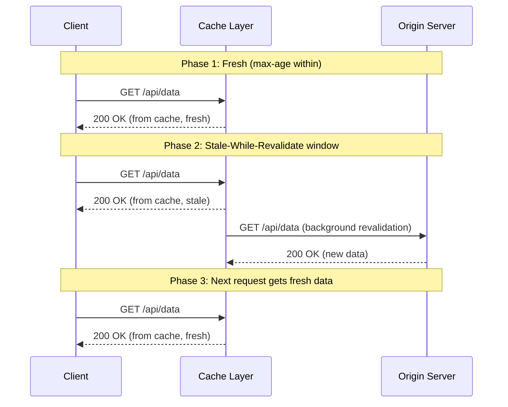

この仕組みの本質は「**速度と鮮度のトレードオフを賢く管理する**」ことにある。ユーザーには古いデータでも即座にレスポンスを返し（速度の確保）、バックグラウンドで最新データを取得する（鮮度の確保）。次回のリクエストでは更新されたデータが返される。

### フロントエンドへの適用

SWRやReact Query（TanStack Query）はこの考え方をフロントエンドのデータフェッチに適用した。HTTPキャッシュではプロキシやCDNがキャッシュ層となるが、フロントエンドではインメモリキャッシュ（JavaScriptのオブジェクト）がその役割を果たす。

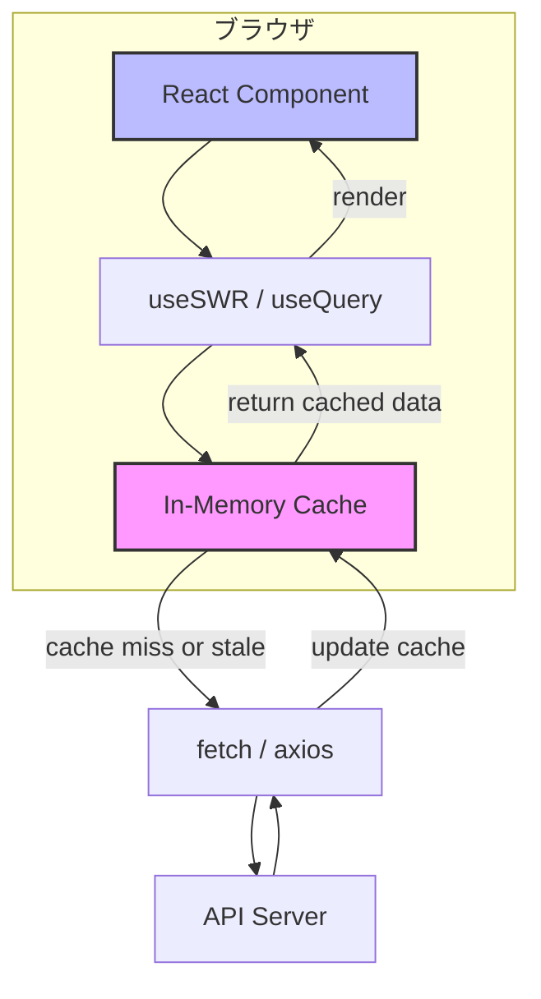

基本的なフローは以下の通りである。

1. コンポーネントがデータを要求する
2. キャッシュにデータがあれば即座に返す（staleであっても）
3. バックグラウンドでサーバーにリクエストを送る（revalidate）
4. 新しいデータが返ってきたらキャッシュを更新し、UIを再レンダリングする

この仕組みにより、ユーザーはページ遷移やコンポーネントの再マウント時に「ローディングスピナー」を見ることなく、即座にコンテンツを確認できる。データが更新された場合は、シームレスにUIが最新の状態に切り替わる。

## キャッシュキーの設計

サーバー状態管理ライブラリの中核をなすのが**キャッシュキー**の概念である。すべてのキャッシュエントリはキーによって一意に識別される。

### React Query（TanStack Query）のクエリキー

React Queryでは、クエリキーは配列として表現される。

```typescript
// Simple key
useQuery({ queryKey: ['todos'], queryFn: fetchTodos })

// Key with parameters
useQuery({ queryKey: ['todos', { status: 'active' }], queryFn: fetchActiveTodos })

// Hierarchical key
useQuery({ queryKey: ['todos', todoId], queryFn: () => fetchTodoById(todoId) })

// Nested key
useQuery({
  queryKey: ['projects', projectId, 'tasks', taskId],
  queryFn: () => fetchTask(projectId, taskId),
})
```

キーの構造は階層的であり、部分一致による無効化が可能である。

```typescript
import { useQueryClient } from '@tanstack/react-query'

const queryClient = useQueryClient()

// Invalidate all queries starting with 'todos'
queryClient.invalidateQueries({ queryKey: ['todos'] })

// Invalidate only specific todo
queryClient.invalidateQueries({ queryKey: ['todos', todoId] })

// Invalidate all project-related queries
queryClient.invalidateQueries({ queryKey: ['projects'] })
```

### SWRのキー

SWRではキーは文字列（またはキーを返す関数）で表現される。

```typescript
// String key
useSWR('/api/todos', fetcher)

// Dynamic key
useSWR(`/api/todos/${id}`, fetcher)

// Array key (for multiple arguments)
useSWR(['/api/todos', id], ([url, id]) => fetcher(url, id))

// Conditional fetching (null key = skip)
useSWR(shouldFetch ? '/api/todos' : null, fetcher)
```

### キャッシュキー設計のベストプラクティス

キャッシュキーの設計はアプリケーション全体のデータ整合性に直接影響するため、慎重に行う必要がある。

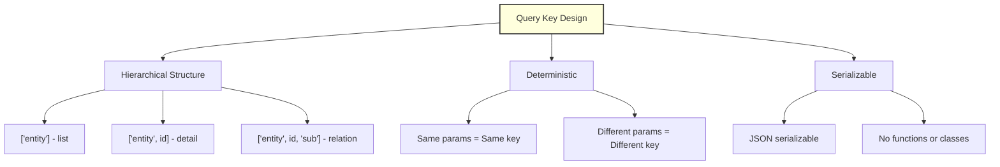

::: tip キャッシュキー設計の原則
1. **階層的**: リソースの関係性を反映する
2. **決定論的**: 同じパラメータからは同じキーが生成される
3. **シリアライズ可能**: JSONとして直列化できる値のみを使用する
4. **粒度の適切さ**: 細かすぎるとキャッシュ効率が下がり、粗すぎると不要な再取得が発生する
:::

## データフェッチのライフサイクル

React QueryやSWRが内部でどのようにデータフェッチを管理しているか、そのライフサイクルを詳しく見ていく。

### クエリの状態遷移

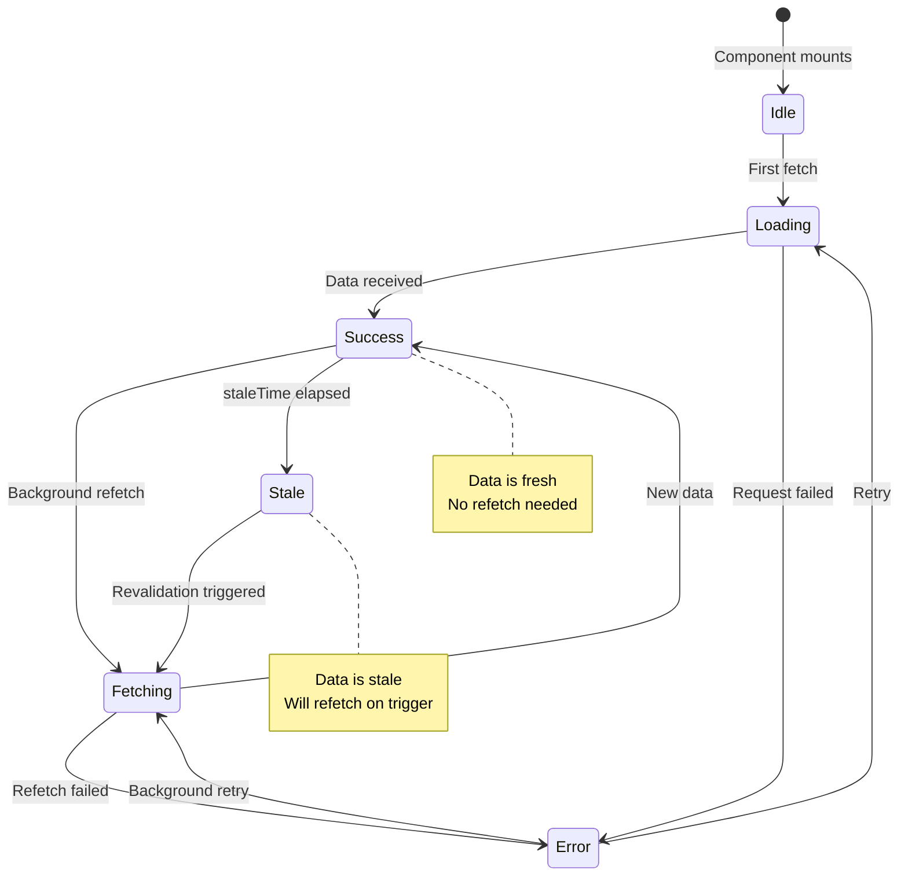

React Queryにおけるクエリの状態は、主に以下のフラグで表現される。

| フラグ | 意味 |
|--------|------|
| `isPending` | データが一度も取得されていない |
| `isLoading` | 初回取得中（データなし + フェッチ中） |
| `isFetching` | フェッチ中（バックグラウンド含む） |
| `isSuccess` | データ取得に成功 |
| `isError` | エラーが発生 |
| `isStale` | データがstale（古い）と判定されている |

::: warning isPending と isLoading の違い
React Query v5以降では、`isPending` は「データがまだ存在しない状態」を、`isLoading` は「データがなく、かつフェッチ中の状態」を表す。`isPending && isFetching` が `isLoading` と等価である。`isFetching` はバックグラウンドでの再取得中にもtrueになるため、「スピナーを表示するか」の判断には `isLoading` を使い、「何かしらのリクエストが進行中か」の判断には `isFetching` を使う。
:::

### staleTimeとgcTime

React Queryの動作を制御する2つの重要なパラメータがある。

```typescript
useQuery({
  queryKey: ['todos'],
  queryFn: fetchTodos,
  staleTime: 5 * 60 * 1000,  // 5 minutes: data is considered fresh
  gcTime: 30 * 60 * 1000,    // 30 minutes: inactive cache is garbage collected
})
```

```mermaid
gantt
    title Query Data Lifecycle
    dateFormat X
    axisFormat %s

    section Cache State
    Fresh (staleTime)           :active, fresh, 0, 300
    Stale (still in cache)      :stale, 300, 1800
    GC (gcTime elapsed, removed):crit, gc, 1800, 1801

    section Behavior
    Return cache, no refetch    :done, b1, 0, 300
    Return cache + background refetch :b2, 300, 1800
    Full loading state          :crit, b3, 1800, 1801
```

- **staleTime**（デフォルト: 0）: データがfresh（新鮮）とみなされる期間。この期間中はバックグラウンド再取得が発生しない。デフォルトが0であるため、取得した瞬間からデータはstaleとみなされる。
- **gcTime**（デフォルト: 5分）: クエリが非アクティブ（どのコンポーネントも購読していない）になってから、キャッシュがガベージコレクションされるまでの時間。

::: details staleTimeのデフォルト値が0である理由
React Queryの設計思想は「**データは常に古くなっている可能性がある**」という前提に立っている。デフォルトでstaleTimeを0にすることで、コンポーネントがマウントされるたびにバックグラウンドでデータを再検証する。これは「安全側に倒す」設計であり、開発者はアプリケーションの特性に応じてstaleTimeを延長できる。頻繁に更新されないデータ（例: ユーザープロフィール）にはstaleTimeを長めに設定し、リアルタイム性が求められるデータ（例: チャットメッセージ）にはデフォルトのままにする、といった使い分けが推奨される。
:::

## 再検証のトリガー

サーバー状態管理ライブラリは、さまざまなタイミングでデータの再検証を行う。これらのトリガーを理解することは、アプリケーションのデータ鮮度を適切に管理するうえで不可欠である。

### 自動再検証トリガー

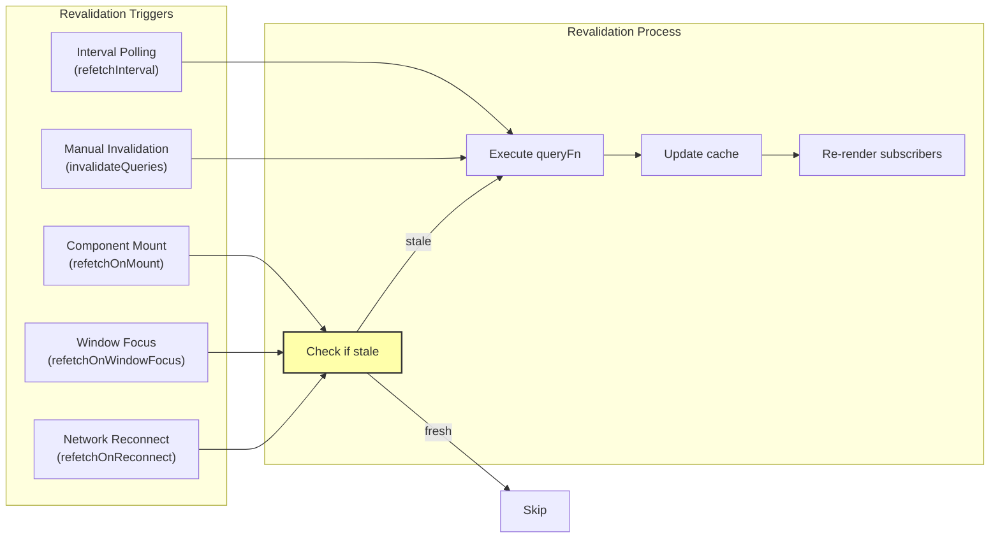

#### コンポーネントマウント時（refetchOnMount）

コンポーネントがマウントされた際、キャッシュされたデータがstaleであれば再取得を行う。

```typescript
// React Query
useQuery({
  queryKey: ['todos'],
  queryFn: fetchTodos,
  refetchOnMount: true,     // default: true
  // refetchOnMount: 'always' // always refetch, even if fresh
})

// SWR
useSWR('/api/todos', fetcher, {
  revalidateOnMount: true, // default: true (if no initial data)
})
```

#### ウィンドウフォーカス時（refetchOnWindowFocus）

ユーザーが別のタブやウィンドウから戻ってきた際に、データを再検証する。これは非常に強力な機能である。ユーザーがSlackでメッセージを読んだ後にアプリに戻ったとき、最新のデータが表示される。

```typescript
// React Query
useQuery({
  queryKey: ['todos'],
  queryFn: fetchTodos,
  refetchOnWindowFocus: true, // default: true
})

// SWR
useSWR('/api/todos', fetcher, {
  revalidateOnFocus: true, // default: true
})
```

#### ネットワーク再接続時（refetchOnReconnect）

オフラインからオンラインに復帰した際に、staleデータを再取得する。モバイル環境で特に有用である。

```typescript
// React Query
useQuery({
  queryKey: ['todos'],
  queryFn: fetchTodos,
  refetchOnReconnect: true, // default: true
})

// SWR
useSWR('/api/todos', fetcher, {
  revalidateOnReconnect: true, // default: true
})
```

#### インターバルポーリング（refetchInterval）

一定間隔でデータを再取得する。ダッシュボードや監視画面など、定期的なデータ更新が必要な場合に使用する。

```typescript
// React Query
useQuery({
  queryKey: ['stock-price', symbol],
  queryFn: () => fetchStockPrice(symbol),
  refetchInterval: 5000,                // poll every 5 seconds
  refetchIntervalInBackground: false,   // pause when tab is not visible
})

// SWR
useSWR(`/api/stock/${symbol}`, fetcher, {
  refreshInterval: 5000,
  refreshWhenHidden: false,
})
```

## ミューテーションと楽観的更新

データの取得（Query）だけでなく、データの変更（Mutation）も重要な関心事である。ミューテーション後のキャッシュ管理は、ユーザー体験に大きく影響する。

### 基本的なミューテーション

```typescript
// React Query
import { useMutation, useQueryClient } from '@tanstack/react-query'

function TodoForm() {
  const queryClient = useQueryClient()

  const mutation = useMutation({
    mutationFn: (newTodo: Todo) => {
      return axios.post('/api/todos', newTodo)
    },
    onSuccess: () => {
      // Invalidate and refetch the todos list
      queryClient.invalidateQueries({ queryKey: ['todos'] })
    },
  })

  return (
    <form onSubmit={(e) => {
      e.preventDefault()
      mutation.mutate({ title: 'New Todo', completed: false })
    }}>
      <button type="submit" disabled={mutation.isPending}>
        {mutation.isPending ? 'Adding...' : 'Add Todo'}
      </button>
    </form>
  )
}
```

### 楽観的更新（Optimistic Updates）

楽観的更新は、サーバーのレスポンスを待たずにUIを即座に更新する手法である。ミューテーションが成功するという「楽観的な」仮定に基づいて動作し、失敗した場合はロールバックする。

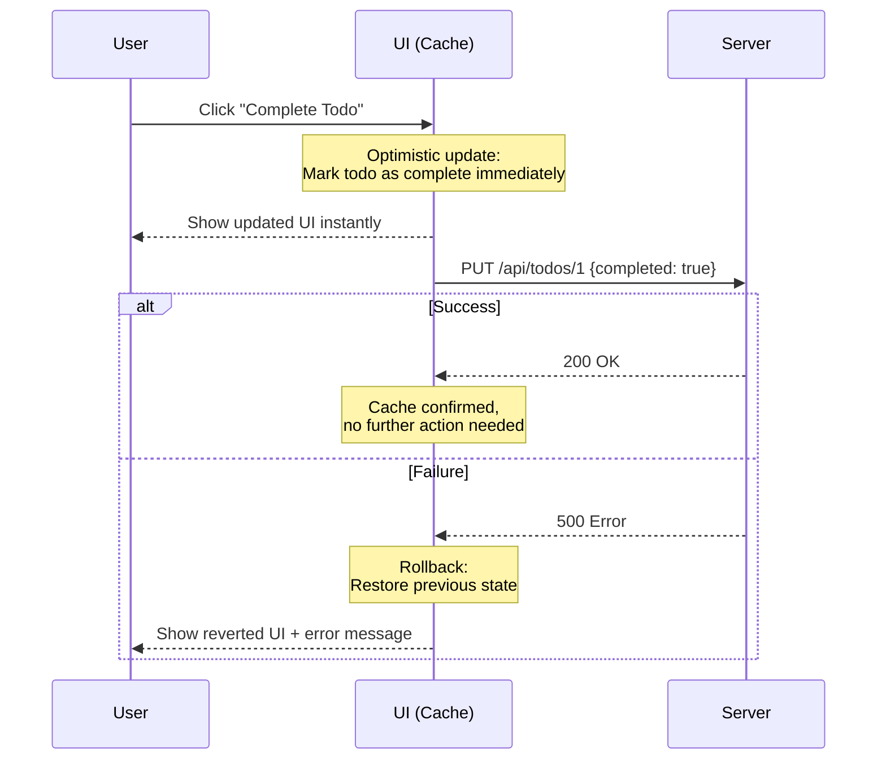

React Queryでの楽観的更新の実装パターンは以下の通りである。

```typescript
import { useMutation, useQueryClient } from '@tanstack/react-query'

function useTodoToggle() {
  const queryClient = useQueryClient()

  return useMutation({
    mutationFn: (todo: Todo) =>
      axios.patch(`/api/todos/${todo.id}`, {
        completed: !todo.completed,
      }),

    // Called before the mutation function fires
    onMutate: async (todo) => {
      // Cancel outgoing refetches to avoid overwriting optimistic update
      await queryClient.cancelQueries({ queryKey: ['todos'] })

      // Snapshot the previous value
      const previousTodos = queryClient.getQueryData<Todo[]>(['todos'])

      // Optimistically update the cache
      queryClient.setQueryData<Todo[]>(['todos'], (old) =>
        old?.map((t) =>
          t.id === todo.id ? { ...t, completed: !t.completed } : t
        )
      )

      // Return context with the snapshot
      return { previousTodos }
    },

    // On error, roll back to the previous value
    onError: (_err, _todo, context) => {
      queryClient.setQueryData(['todos'], context?.previousTodos)
    },

    // After success or error, refetch to ensure server state
    onSettled: () => {
      queryClient.invalidateQueries({ queryKey: ['todos'] })
    },
  })
}
```

::: warning 楽観的更新の注意点
楽観的更新は強力だが、すべての場面で適切とは限らない。以下の場合は慎重に検討すべきである。
- **サーバー側でバリデーションが複雑な場合**: クライアント側で再現が困難なバリデーションロジックがある場合、楽観的更新は不適切。
- **副作用が大きい場合**: 決済処理やメール送信など、ロールバックが本質的に不可能な操作。
- **データの一貫性が厳密に求められる場合**: 在庫数の更新など、他のユーザーとの競合が頻繁に発生するケース。
:::

### SWRでのミューテーション

SWRでは`mutate`関数を使ってキャッシュを直接操作する。

```typescript
import useSWR from 'swr'
import useSWRMutation from 'swr/mutation'

// Basic mutation with manual cache update
function TodoList() {
  const { data, mutate } = useSWR('/api/todos', fetcher)

  async function toggleTodo(todo: Todo) {
    // Optimistically update the local data
    const optimisticData = data?.map((t) =>
      t.id === todo.id ? { ...t, completed: !t.completed } : t
    )

    await mutate(
      async () => {
        // Send request to server
        await axios.patch(`/api/todos/${todo.id}`, {
          completed: !todo.completed,
        })
        // Return updated data (or let SWR refetch)
        return optimisticData
      },
      {
        optimisticData,
        rollbackOnError: true,
        revalidate: true, // refetch after mutation
      }
    )
  }
}

// Using useSWRMutation for remote mutations
function useAddTodo() {
  return useSWRMutation(
    '/api/todos',
    async (url: string, { arg }: { arg: { title: string } }) => {
      return axios.post(url, arg)
    }
  )
}
```

## リクエストの重複排除と依存クエリ

### 重複排除（Deduplication）

複数のコンポーネントが同じデータを必要とする場合、ナイーブな実装では同じAPIに対して複数のリクエストが発行されてしまう。サーバー状態管理ライブラリはこの問題を自動的に解決する。

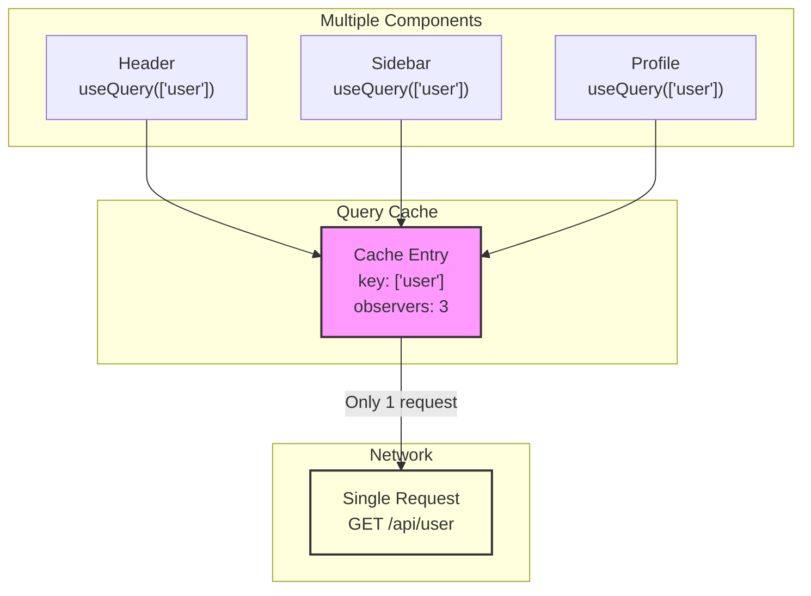

3つの異なるコンポーネントが同じクエリキーでデータを要求しても、実際のHTTPリクエストは1回しか発行されない。すべてのコンポーネントは同じキャッシュエントリを購読し、データが返ってきた時点で全コンポーネントが同時に更新される。

### 依存クエリ（Dependent Queries）

あるクエリの結果に基づいて別のクエリを実行する場合がある。例えば、ユーザー情報を取得してから、そのユーザーのプロジェクト一覧を取得するケースである。

```typescript
// React Query: Dependent queries
function UserProjects({ userId }: { userId: string }) {
  // First query: fetch user
  const { data: user } = useQuery({
    queryKey: ['users', userId],
    queryFn: () => fetchUser(userId),
  })

  // Second query: depends on user data
  const { data: projects } = useQuery({
    queryKey: ['projects', user?.organizationId],
    queryFn: () => fetchProjects(user!.organizationId),
    enabled: !!user?.organizationId, // only run when user data is available
  })

  return <ProjectList projects={projects} />
}
```

```typescript
// SWR: Dependent queries using function key
function UserProjects({ userId }: { userId: string }) {
  const { data: user } = useSWR(`/api/users/${userId}`, fetcher)

  // Key function returns null when dependency is not ready
  const { data: projects } = useSWR(
    user?.organizationId ? `/api/orgs/${user.organizationId}/projects` : null,
    fetcher
  )

  return <ProjectList projects={projects} />
}
```

`enabled`オプション（React Query）やnullキー（SWR）を利用することで、依存関係のあるクエリを宣言的に記述できる。

## ページネーションと無限スクロール

サーバー状態管理ライブラリは、ページネーションと無限スクロールという一般的なUIパターンに対する専用のサポートを提供している。

### ページネーション

```typescript
// React Query: Paginated query
function PaginatedTodos() {
  const [page, setPage] = useState(1)

  const { data, isPending, isFetching, isPlaceholderData } = useQuery({
    queryKey: ['todos', { page }],
    queryFn: () => fetchTodos(page),
    placeholderData: keepPreviousData, // keep showing old page while new page loads
  })

  return (
    <div>
      {isPending ? (
        <p>Loading...</p>
      ) : (
        <>
          <ul>
            {data.items.map((todo) => (
              <li key={todo.id}>{todo.title}</li>
            ))}
          </ul>
          <div style={{ opacity: isFetching ? 0.5 : 1 }}>
            <button
              onClick={() => setPage((p) => Math.max(1, p - 1))}
              disabled={page === 1}
            >
              Previous
            </button>
            <span>Page {page}</span>
            <button
              onClick={() => {
                if (!isPlaceholderData && data.hasNextPage) {
                  setPage((p) => p + 1)
                }
              }}
              disabled={isPlaceholderData || !data?.hasNextPage}
            >
              Next
            </button>
          </div>
        </>
      )}
    </div>
  )
}
```

### 無限スクロール

```typescript
// React Query: Infinite query
function InfiniteTodos() {
  const {
    data,
    fetchNextPage,
    hasNextPage,
    isFetchingNextPage,
    isPending,
  } = useInfiniteQuery({
    queryKey: ['todos'],
    queryFn: ({ pageParam }) => fetchTodos(pageParam),
    initialPageParam: 1,
    getNextPageParam: (lastPage) => lastPage.nextCursor ?? undefined,
  })

  return (
    <div>
      {isPending ? (
        <p>Loading...</p>
      ) : (
        <>
          {data.pages.map((page, i) => (
            <div key={i}>
              {page.items.map((todo) => (
                <div key={todo.id}>{todo.title}</div>
              ))}
            </div>
          ))}
          <button
            onClick={() => fetchNextPage()}
            disabled={!hasNextPage || isFetchingNextPage}
          >
            {isFetchingNextPage
              ? 'Loading more...'
              : hasNextPage
                ? 'Load More'
                : 'No more items'}
          </button>
        </>
      )}
    </div>
  )
}
```

```typescript
// SWR: Infinite loading
import useSWRInfinite from 'swr/infinite'

function InfiniteTodos() {
  const getKey = (pageIndex: number, previousPageData: any) => {
    if (previousPageData && !previousPageData.nextCursor) return null // end
    if (pageIndex === 0) return '/api/todos?cursor=0'
    return `/api/todos?cursor=${previousPageData.nextCursor}`
  }

  const { data, size, setSize, isLoading, isValidating } = useSWRInfinite(
    getKey,
    fetcher
  )

  const todos = data ? data.flatMap((page) => page.items) : []
  const isLoadingMore =
    isLoading || (size > 0 && data && typeof data[size - 1] === 'undefined')
  const hasMore = data && data[data.length - 1]?.nextCursor

  return (
    <div>
      {todos.map((todo) => (
        <div key={todo.id}>{todo.title}</div>
      ))}
      <button
        onClick={() => setSize(size + 1)}
        disabled={isLoadingMore || !hasMore}
      >
        {isLoadingMore ? 'Loading...' : hasMore ? 'Load More' : 'End'}
      </button>
    </div>
  )
}
```

## エラーハンドリングとリトライ

ネットワーク通信は本質的に不安定であるため、堅牢なエラーハンドリングとリトライ戦略が不可欠である。

### リトライ戦略

React Queryはデフォルトで失敗したクエリを3回リトライする。リトライ間隔は指数バックオフが適用される。

```typescript
// React Query: Retry configuration
useQuery({
  queryKey: ['todos'],
  queryFn: fetchTodos,
  retry: 3,                      // number of retries (default: 3)
  retryDelay: (attemptIndex) =>   // exponential backoff
    Math.min(1000 * 2 ** attemptIndex, 30000),
})

// Conditional retry
useQuery({
  queryKey: ['todos'],
  queryFn: fetchTodos,
  retry: (failureCount, error) => {
    // Don't retry on 4xx errors (client errors)
    if (error.response?.status >= 400 && error.response?.status < 500) {
      return false
    }
    return failureCount < 3
  },
})
```

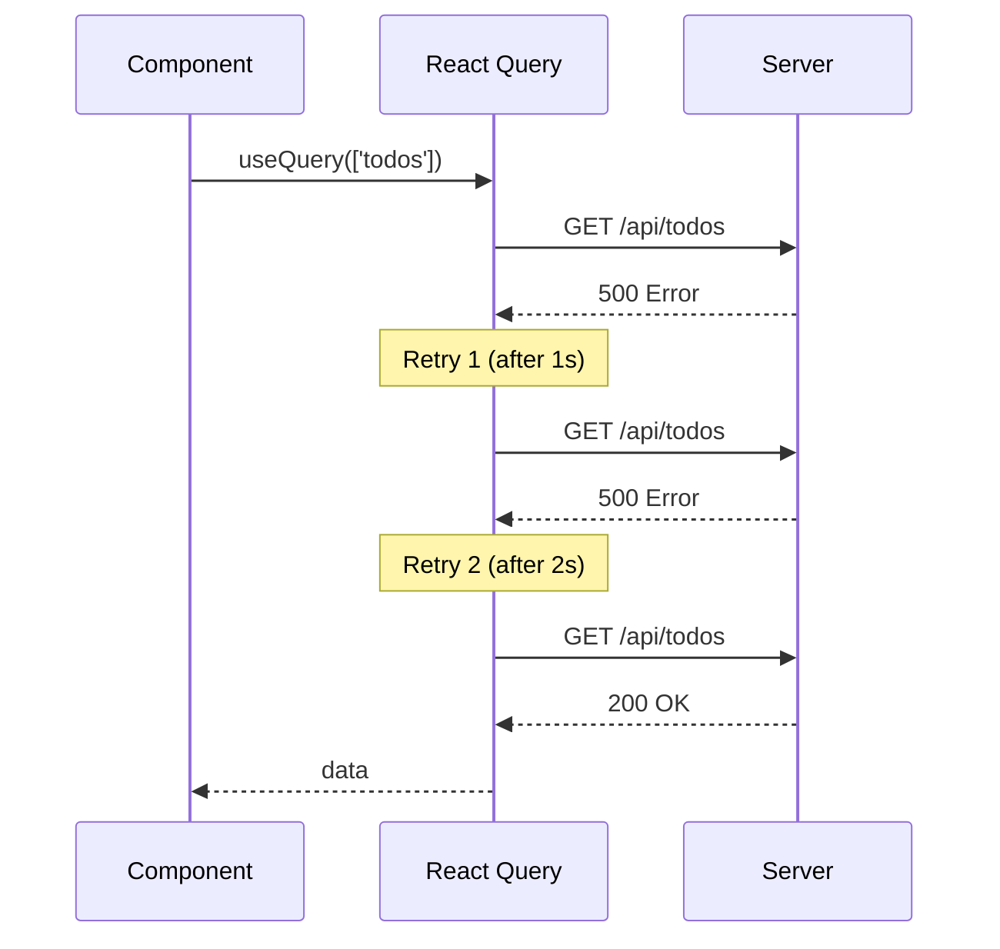

### SWRのエラーリトライ

```typescript
// SWR: Error retry
useSWR('/api/todos', fetcher, {
  errorRetryCount: 3,
  errorRetryInterval: 5000,       // fixed interval (ms)
  onErrorRetry: (error, key, config, revalidate, { retryCount }) => {
    // Don't retry on 404
    if (error.status === 404) return

    // Only retry up to 3 times
    if (retryCount >= 3) return

    // Retry after 5 seconds
    setTimeout(() => revalidate({ retryCount }), 5000)
  },
})
```

### Error Boundary統合

React Queryは、ReactのError Boundaryとシームレスに統合できる。

```typescript
// Enable throwing errors to the nearest Error Boundary
useQuery({
  queryKey: ['todos'],
  queryFn: fetchTodos,
  throwOnError: true,
})

// Or conditionally throw
useQuery({
  queryKey: ['todos'],
  queryFn: fetchTodos,
  throwOnError: (error) => error.response?.status >= 500,
})
```

## アーキテクチャの内部構造

React Query（TanStack Query）の内部アーキテクチャを理解することで、その動作原理をより深く把握できる。

### React Queryの内部コンポーネント

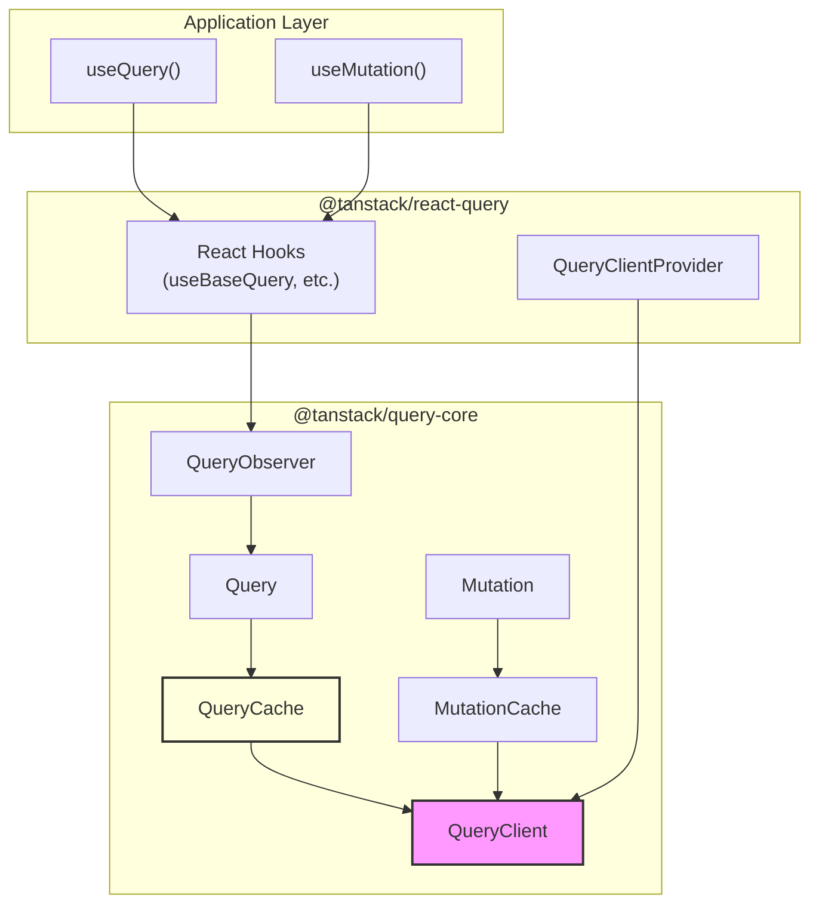

主要なコンポーネントの役割は以下の通りである。

- **QueryClient**: アプリケーション全体のクエリ管理を統括するシングルトン。QueryCacheとMutationCacheを保持する。
- **QueryCache**: すべてのQueryインスタンスを保持するキャッシュコンテナ。キーによるルックアップを提供する。
- **Query**: 個別のクエリを表現するオブジェクト。フェッチ状態、データ、エラー、リトライロジックなどをカプセル化する。
- **QueryObserver**: QueryとReactコンポーネントを橋渡しするオブザーバー。Queryの状態変化を監視し、必要に応じてコンポーネントの再レンダリングをトリガーする。
- **MutationCache**: すべてのMutationインスタンスを保持するキャッシュ。

### SWRの内部構造

SWRはReact Queryと比較してシンプルなアーキテクチャを持つ。

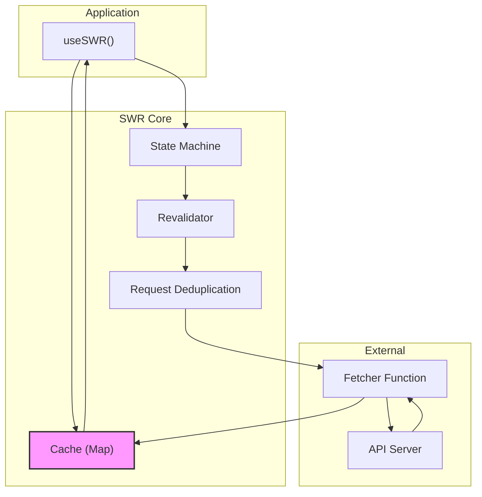

SWRのキャッシュはデフォルトではグローバルなMapオブジェクトであり、カスタムキャッシュプロバイダーに差し替えることも可能である。

```typescript
import { SWRConfig } from 'swr'

// Custom cache provider (e.g., using localStorage)
function localStorageProvider() {
  const map = new Map<string, any>(
    JSON.parse(localStorage.getItem('app-cache') || '[]')
  )

  // Save to localStorage on unload
  window.addEventListener('beforeunload', () => {
    const appCache = JSON.stringify(Array.from(map.entries()))
    localStorage.setItem('app-cache', appCache)
  })

  return map
}

function App() {
  return (
    <SWRConfig value={{ provider: localStorageProvider }}>
      <Dashboard />
    </SWRConfig>
  )
}
```

## React Query vs SWR: 設計思想の比較

React Query（TanStack Query）とSWRはどちらもStale-While-Revalidateパターンに基づいているが、設計思想やAPIデザインに明確な違いがある。

### 基本的な設計哲学

| 観点 | React Query (TanStack Query) | SWR |
|------|------------------------------|-----|
| 設計思想 | 包括的なサーバー状態管理ツールキット | 軽量でシンプルなデータフェッチフック |
| バンドルサイズ | 約13KB (gzip) | 約4KB (gzip) |
| フレームワーク | React, Vue, Solid, Angular, Svelte | React |
| ミューテーション | 専用のuseMutationフック | mutate関数 + useSWRMutation |
| DevTools | 公式DevTools（リッチなUI） | サードパーティ |
| 無限スクロール | useInfiniteQuery | useSWRInfinite |
| オフラインサポート | 組み込み（pauseOnOffline等） | 限定的 |
| プリフェッチ | queryClient.prefetchQuery | preload / mutate |
| Suspense対応 | useSuspenseQuery | suspense: true |

### APIデザインの比較

::: code-group

```typescript [React Query]
import { useQuery, useMutation, useQueryClient } from '@tanstack/react-query'

// Data fetching
function Todos() {
  const { data, isPending, error } = useQuery({
    queryKey: ['todos'],
    queryFn: fetchTodos,
    staleTime: 60_000,
  })

  if (isPending) return <Loading />
  if (error) return <Error error={error} />
  return <TodoList todos={data} />
}

// Mutation
function AddTodo() {
  const queryClient = useQueryClient()
  const mutation = useMutation({
    mutationFn: addTodo,
    onSuccess: () => {
      queryClient.invalidateQueries({ queryKey: ['todos'] })
    },
  })
  // ...
}
```

```typescript [SWR]
import useSWR from 'swr'
import useSWRMutation from 'swr/mutation'

// Data fetching
function Todos() {
  const { data, isLoading, error } = useSWR('/api/todos', fetcher, {
    dedupingInterval: 60_000,
  })

  if (isLoading) return <Loading />
  if (error) return <Error error={error} />
  return <TodoList todos={data} />
}

// Mutation
function AddTodo() {
  const { trigger } = useSWRMutation('/api/todos', addTodo)
  // ...
}
```

:::

### 選定基準

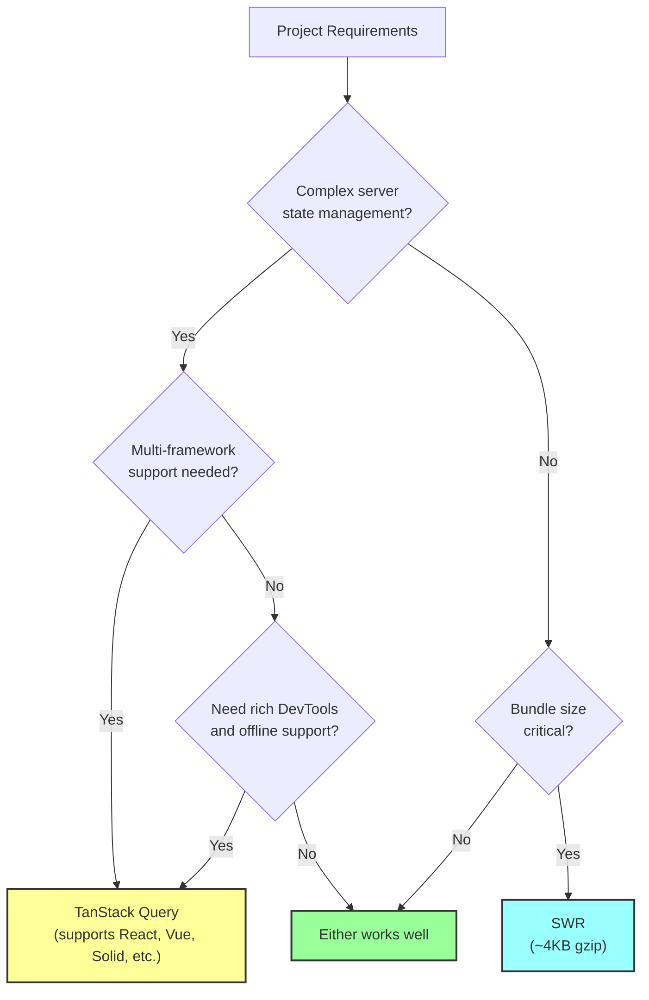

::: tip 選定の指針
- **React Query（TanStack Query）が向いているケース**: 大規模アプリケーション、複雑なキャッシュ無効化戦略、オフラインファースト、マルチフレームワーク対応、DevToolsによるデバッグが重要な場合
- **SWRが向いているケース**: 小〜中規模アプリケーション、シンプルなデータフェッチ、バンドルサイズの制約が厳しい場合、Next.jsとの統合（Vercel製であるため親和性が高い）
:::

## 実践的なパターンと応用

### Prefetchによるユーザー体験の向上

ユーザーが次に遷移する可能性の高いページのデータを事前に取得しておくことで、ページ遷移時のローディングを排除できる。

```typescript
// React Query: Prefetching on hover
function TodoList() {
  const queryClient = useQueryClient()

  const prefetchTodo = (todoId: number) => {
    queryClient.prefetchQuery({
      queryKey: ['todos', todoId],
      queryFn: () => fetchTodoById(todoId),
      staleTime: 60_000, // only prefetch if data is older than 1 minute
    })
  }

  return (
    <ul>
      {todos.map((todo) => (
        <li
          key={todo.id}
          onMouseEnter={() => prefetchTodo(todo.id)}
        >
          <Link to={`/todos/${todo.id}`}>{todo.title}</Link>
        </li>
      ))}
    </ul>
  )
}
```

### Suspenseとの統合

React Suspenseを使うことで、ローディング状態の管理をコンポーネントツリーの上位に委譲できる。

```typescript
// React Query with Suspense
import { useSuspenseQuery } from '@tanstack/react-query'
import { Suspense } from 'react'

function TodoList() {
  // No need to handle isPending - Suspense boundary handles it
  const { data } = useSuspenseQuery({
    queryKey: ['todos'],
    queryFn: fetchTodos,
  })

  return (
    <ul>
      {data.map((todo) => (
        <li key={todo.id}>{todo.title}</li>
      ))}
    </ul>
  )
}

function App() {
  return (
    <Suspense fallback={<Loading />}>
      <TodoList />
    </Suspense>
  )
}
```

### SSRとの統合

サーバーサイドレンダリングでは、サーバーでデータを取得しクライアントに引き渡す仕組みが必要である。

```typescript
// React Query: SSR with Next.js App Router
// app/todos/page.tsx
import {
  dehydrate,
  HydrationBoundary,
  QueryClient,
} from '@tanstack/react-query'

export default async function TodosPage() {
  const queryClient = new QueryClient()

  await queryClient.prefetchQuery({
    queryKey: ['todos'],
    queryFn: fetchTodos,
  })

  return (
    <HydrationBoundary state={dehydrate(queryClient)}>
      <TodoList />
    </HydrationBoundary>
  )
}
```

### グローバル設定のベストプラクティス

```typescript
// Create a query client with sensible defaults
const queryClient = new QueryClient({
  defaultOptions: {
    queries: {
      staleTime: 60 * 1000,        // 1 minute
      gcTime: 5 * 60 * 1000,       // 5 minutes
      retry: 3,
      refetchOnWindowFocus: true,
      refetchOnReconnect: true,
      refetchOnMount: true,
    },
    mutations: {
      retry: 1,
    },
  },
})

// Set up a global error handler
queryClient.getQueryCache().config = {
  onError: (error, query) => {
    if (query.state.data !== undefined) {
      // Only show toast for background refetch errors
      toast.error(`Background update failed: ${error.message}`)
    }
  },
}
```

## テスト戦略

サーバー状態管理ライブラリを使用したコンポーネントのテストでは、いくつかの考慮事項がある。

### React Queryのテスト

```typescript
import { QueryClient, QueryClientProvider } from '@tanstack/react-query'
import { renderHook, waitFor } from '@testing-library/react'

// Create a wrapper with a fresh QueryClient for each test
function createWrapper() {
  const queryClient = new QueryClient({
    defaultOptions: {
      queries: {
        retry: false, // disable retries in tests
        gcTime: 0,    // garbage collect immediately
      },
    },
  })

  return ({ children }: { children: React.ReactNode }) => (
    <QueryClientProvider client={queryClient}>
      {children}
    </QueryClientProvider>
  )
}

// Test a custom hook
test('useTodos returns todo list', async () => {
  const { result } = renderHook(() => useTodos(), {
    wrapper: createWrapper(),
  })

  await waitFor(() => {
    expect(result.current.isSuccess).toBe(true)
  })

  expect(result.current.data).toHaveLength(3)
})
```

### MSW（Mock Service Worker）との併用

```typescript
import { http, HttpResponse } from 'msw'
import { setupServer } from 'msw/node'

const server = setupServer(
  http.get('/api/todos', () => {
    return HttpResponse.json([
      { id: 1, title: 'Test Todo', completed: false },
    ])
  })
)

beforeAll(() => server.listen())
afterEach(() => server.resetHandlers())
afterAll(() => server.close())

test('displays todos from API', async () => {
  render(<TodoList />, { wrapper: createWrapper() })

  await screen.findByText('Test Todo')
})

test('handles server error', async () => {
  server.use(
    http.get('/api/todos', () => {
      return HttpResponse.json(
        { message: 'Internal Server Error' },
        { status: 500 }
      )
    })
  )

  render(<TodoList />, { wrapper: createWrapper() })

  await screen.findByText(/error/i)
})
```

## パフォーマンスの考慮事項

### 不要な再レンダリングの防止

React Queryの`select`オプションを使うことで、キャッシュデータの一部だけを購読し、不要な再レンダリングを防止できる。

```typescript
// Only re-render when the count of incomplete todos changes
function TodoCount() {
  const { data: incompleteCount } = useQuery({
    queryKey: ['todos'],
    queryFn: fetchTodos,
    select: (data) => data.filter((todo) => !todo.completed).length,
  })

  return <span>{incompleteCount} items left</span>
}
```

`select`が返す値が前回と参照的に等しい場合、コンポーネントは再レンダリングされない。配列やオブジェクトを返す場合は、適切なメモ化が必要である。

```typescript
import { useCallback } from 'react'

function useActiveTodos() {
  return useQuery({
    queryKey: ['todos'],
    queryFn: fetchTodos,
    // Memoize the selector to maintain stable reference
    select: useCallback(
      (data: Todo[]) => data.filter((todo) => !todo.completed),
      []
    ),
  })
}
```

### 構造的共有（Structural Sharing）

React Queryはデフォルトで**構造的共有**を使用する。これはデータの更新時に、変更されていない部分のオブジェクト参照を維持する仕組みである。

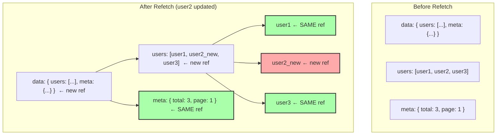

変更されなかった`meta`オブジェクトや`user1`、`user3`は同じ参照が維持されるため、`React.memo`やuseMemoが正しく機能し、不要な再レンダリングが発生しない。

## サーバー状態管理の限界と補完

サーバー状態管理ライブラリは非常に強力だが、万能ではない。その限界を理解し、適切な補完技術と組み合わせることが重要である。

### リアルタイムデータの課題

Stale-While-Revalidateパターンはポーリングベースであるため、真のリアルタイム性は実現できない。チャットアプリケーションや共同編集のようなリアルタイム要件には、WebSocketやServer-Sent Eventsとの統合が必要である。

```typescript
// React Query + WebSocket integration
function useRealtimeTodos() {
  const queryClient = useQueryClient()

  useEffect(() => {
    const ws = new WebSocket('wss://api.example.com/todos')

    ws.onmessage = (event) => {
      const updatedTodo = JSON.parse(event.data)

      // Update the cache with real-time data
      queryClient.setQueryData<Todo[]>(['todos'], (old) =>
        old?.map((todo) =>
          todo.id === updatedTodo.id ? updatedTodo : todo
        )
      )
    }

    return () => ws.close()
  }, [queryClient])

  return useQuery({
    queryKey: ['todos'],
    queryFn: fetchTodos,
    refetchOnWindowFocus: false, // WebSocket handles updates
  })
}
```

### クライアント状態との境界

サーバー状態管理ライブラリはクライアント状態の管理には向いていない。フォームの入力値、UIの開閉状態、テーマ設定などは、React本体の`useState`や`useReducer`、あるいはJotai・Zustandなどの軽量な状態管理ライブラリで管理すべきである。

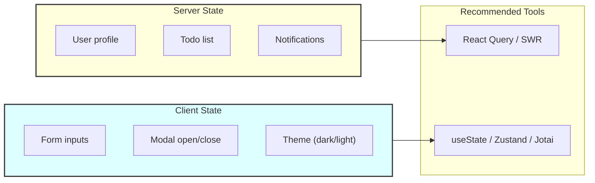

### キャッシュ無効化の難しさ

Phil Karltonの有名な言葉に「コンピュータサイエンスで難しいことは2つしかない。キャッシュの無効化と名前付けだ」というものがある。サーバー状態管理ライブラリはキャッシュ管理を大幅に簡素化するが、「いつ、どのキャッシュを無効化するか」という設計判断は依然として開発者の責任である。

::: danger キャッシュ無効化の一般的な落とし穴
1. **過剰な無効化**: ミューテーション後にすべてのクエリを無効化すると、不要なリクエストが大量に発生する
2. **不足する無効化**: 関連するクエリの無効化を忘れると、UIに古いデータが表示され続ける
3. **キーの不一致**: クエリキーの構造が一貫していないと、部分一致による無効化が正しく機能しない
:::

## まとめ

サーバー状態管理ライブラリは、フロントエンド開発における「サーバーから取得したデータをどう扱うか」という根本的な課題に対する、洗練された解答である。

Stale-While-Revalidateパターンを基盤として、以下の機能を宣言的に提供する。

1. **自動キャッシュ管理**: クエリキーに基づく透過的なキャッシュ
2. **スマートな再検証**: ウィンドウフォーカス、ネットワーク再接続、インターバルポーリング
3. **楽観的更新**: 即座のUI反映とエラー時のロールバック
4. **リクエスト重複排除**: 同一データへの冗長なリクエストの自動集約
5. **ページネーション/無限スクロール**: 部分的データ取得の専用サポート
6. **エラーリトライ**: 指数バックオフによる自動リトライ

これらの機能を自前で実装しようとすれば、膨大な量のボイラープレートコードとバグの温床が生まれる。サーバー状態管理ライブラリはこの複雑さを抽象化し、開発者がビジネスロジックに集中できるようにする。

React Query（TanStack Query）はフル機能のツールキットとして、SWRは軽量かつシンプルなアプローチとして、それぞれの強みを持つ。プロジェクトの規模、要件、チームの好みに応じて適切なライブラリを選定すればよい。いずれにしても、「サーバー状態とクライアント状態は本質的に異なるものであり、異なる方法で管理すべきである」という認識が、モダンなフロントエンド開発において最も重要な洞察である。
