# サーバーレスアーキテクチャ — FaaSの設計思想と実践

## 1. 背景と動機

### 1.1 インフラ管理という永遠の負債

ソフトウェア開発の歴史は、開発者がビジネスロジックに集中するために、インフラストラクチャの複雑さをどのように抽象化するかという挑戦の連続であった。物理サーバーの時代には、ハードウェアの調達、ラッキング、OS のインストール、パッチ適用、ネットワーク設定など、アプリケーションコードとは直接関係のない膨大な作業が必要だった。

2006年に Amazon Web Services（AWS）が EC2 を発表し、Infrastructure as a Service（IaaS）の時代が始まった。仮想マシンの登場によりハードウェアの調達は不要になったが、OS のパッチ適用、セキュリティ設定、スケーリングの管理は依然として開発者の責務であった。続いて Platform as a Service（PaaS）が登場し、Heroku や Google App Engine がアプリケーションの実行環境を抽象化した。しかし PaaS であっても、常時稼働するインスタンスの管理、スケーリングの設定、アイドル時間に対するコスト負担という課題は残されていた。

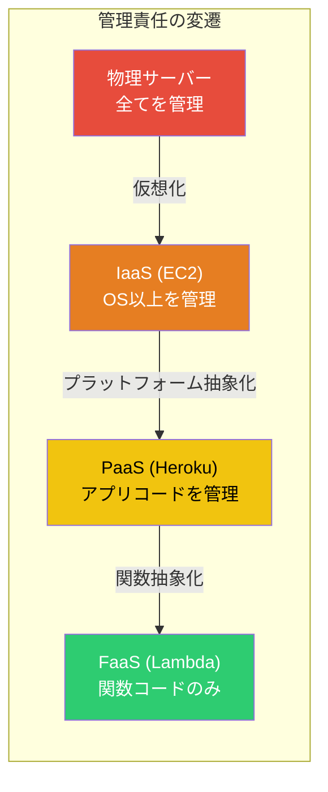

### 1.2 「イベントが発生したときだけ計算すればよい」という発想

多くのアプリケーションには、常時処理を行う必要がない部分が存在する。たとえば、画像アップロード後のサムネイル生成、HTTP リクエストに応じた API レスポンス、データベースの変更イベントに対する後処理、定期的なバッチジョブなどである。これらの処理は本質的に**イベント駆動**であり、イベントが発生しない時間帯にはサーバーをアイドル状態で維持する必要はない。

この観察から、「必要なときだけコードを実行し、使った分だけ課金する」というコンピューティングモデルが生まれた。これがサーバーレスコンピューティングの根底にある思想である。

### 1.3 サーバーレスの起源

サーバーレスという概念が具体化したのは 2014 年の AWS Lambda の発表である。AWS Lambda は「サーバーのプロビジョニングや管理なしにコードを実行する」というビジョンを掲げ、関数単位でコードをデプロイし、イベントをトリガーとして自動実行する仕組みを提供した。

Lambda の登場は業界に大きな衝撃を与え、Google は 2016 年に Cloud Functions を、Microsoft は同年に Azure Functions を発表した。さらに 2017 年には Cloudflare Workers がエッジコンピューティング上でのサーバーレス実行を実現し、サーバーレスの適用範囲はクラウドのリージョンからエッジにまで拡大した。

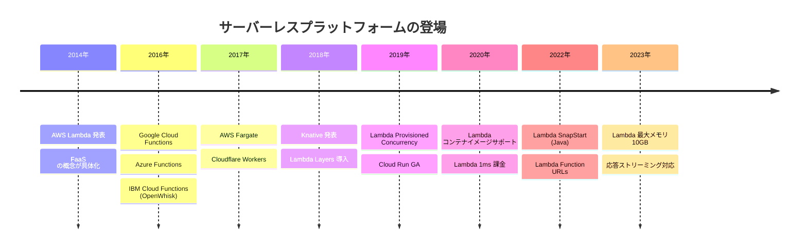

## 2. サーバーレスの定義と FaaS/BaaS

### 2.1 サーバーレスとは何か

「サーバーレス」という名称は誤解を招きやすい。サーバーが存在しないわけではなく、**サーバーの管理が開発者から見えなくなる**ことを意味する。CNCF（Cloud Native Computing Foundation）の定義に従えば、サーバーレスとは以下の特性を持つクラウド実行モデルである。

1. **サーバー管理の不要化**: OS のパッチ適用、キャパシティプランニング、スケーリングをクラウドプロバイダーが自動的に行う
2. **イベント駆動**: リクエストやイベントに応じてコードが実行される
3. **自動スケーリング**: リクエスト数に応じてゼロから無制限にスケールする（プロバイダー側の制限はある）
4. **使用量ベースの課金**: アイドル時間に対する課金がなく、実行時間とリソース消費量に基づいて課金される

### 2.2 FaaS（Function as a Service）

FaaS はサーバーレスの中核をなすコンピューティングモデルである。開発者は個々の**関数**をデプロイし、外部イベントによってその関数が呼び出される。各関数の呼び出し（invocation）は独立しており、ステートレスであることが前提となる。

FaaS の代表的なプラットフォームとして、AWS Lambda、Google Cloud Functions、Azure Functions、Cloudflare Workers がある。

```python
# AWS Lambda handler example
import json

def handler(event, context):
    """
    Process an API Gateway event and return a response.
    Each invocation is stateless and independent.
    """
    name = event.get("queryStringParameters", {}).get("name", "World")
    return {
        "statusCode": 200,
        "body": json.dumps({"message": f"Hello, {name}!"})
    }
```

FaaS における関数は以下のライフサイクルを持つ。

1. **デプロイ**: 関数コードとメタデータ（ランタイム、メモリ、タイムアウトなど）をプラットフォームに登録する
2. **トリガー**: イベント（HTTP リクエスト、キューメッセージ、ファイルアップロードなど）が発生する
3. **初期化**: 実行環境が確保され、ランタイムとユーザーコードがロードされる
4. **実行**: ハンドラ関数が呼び出され、処理結果が返される
5. **フリーズ/破棄**: 一定時間呼び出しがなければ実行環境が凍結または破棄される

### 2.3 BaaS（Backend as a Service）

サーバーレスのもう一つの側面が BaaS である。BaaS は、認証、データベース、ファイルストレージ、プッシュ通知などのバックエンド機能をマネージドサービスとして提供する。代表的な BaaS として Firebase（Google）、AWS Amplify、Supabase がある。

BaaS を活用することで、フロントエンドアプリケーションからバックエンドのサービスを直接利用でき、カスタムサーバーサイドコードの量を大幅に削減できる。FaaS と BaaS を組み合わせることで、サーバー管理をほぼ完全に排除したアプリケーション構築が可能になる。

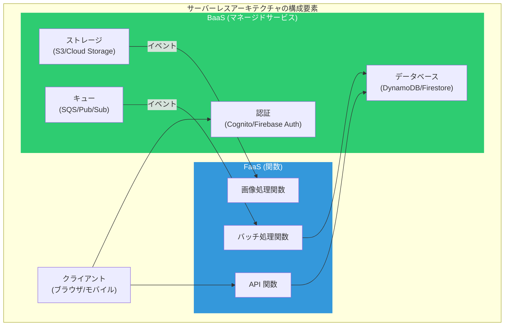

### 2.4 FaaS と従来のアプリケーションサーバーの違い

FaaS と従来のアプリケーションサーバー（Express.js、Spring Boot、Rails など）は根本的に異なるプログラミングモデルを持つ。以下にその違いを整理する。

| 特性 | 従来のアプリケーションサーバー | FaaS |
|------|-------------------------------|------|
| デプロイ単位 | アプリケーション全体 | 個々の関数 |
| 起動方式 | 常時稼働 | イベント駆動 |
| スケーリング | インスタンス単位 | リクエスト単位 |
| 状態管理 | インメモリセッション可能 | ステートレスが前提 |
| 実行時間 | 制限なし | 最大 15 分（Lambda の場合） |
| コスト | 固定費（アイドル時も課金） | 変動費（実行時のみ課金） |
| コールドスタート | なし（常時稼働） | あり |

## 3. 実行モデル

### 3.1 イベント駆動アーキテクチャ

サーバーレス関数はイベントをトリガーとして実行される。イベントソースは多岐にわたり、プラットフォームごとに豊富なインテグレーションが提供されている。

AWS Lambda を例にとると、主要なイベントソースは以下の通りである。

| カテゴリ | イベントソース | 呼び出しモデル |
|---------|-------------|--------------|
| API | API Gateway, Function URL | 同期（Request/Response） |
| ストレージ | S3, DynamoDB Streams | 非同期 / ストリーム |
| メッセージング | SQS, SNS, EventBridge | 非同期 / ポーリング |
| ストリーム | Kinesis Data Streams | ストリーム（バッチ） |
| スケジュール | EventBridge Scheduler | 非同期 |
| 開発者ツール | CodeCommit, CloudFormation | 非同期 |

Lambda の呼び出しモデルは大きく 3 つに分類される。

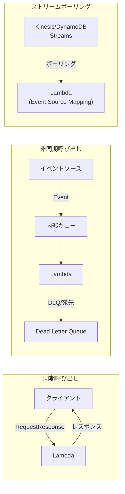

**同期呼び出し（RequestResponse）** では、クライアントが Lambda を直接呼び出し、関数の処理結果が返されるまで待機する。API Gateway 経由の HTTP リクエストがこの典型である。

**非同期呼び出し（Event）** では、イベントは Lambda の内部キューに投入され、クライアントには即座に 202 Accepted が返される。Lambda は内部キューからイベントを取り出して処理する。処理が失敗した場合、最大 2 回までリトライされ、それでも失敗する場合は Dead Letter Queue（DLQ）に送信される。

**ストリームポーリング（Event Source Mapping）** では、Lambda がイベントソースを能動的にポーリングし、バッチ単位でレコードを取得して関数に渡す。Kinesis Data Streams や DynamoDB Streams でこのモデルが使われる。

### 3.2 コールドスタートとウォームスタート

サーバーレスの実行モデルにおいて最も重要な概念の一つがコールドスタートとウォームスタートである。

**コールドスタート**は、関数の呼び出し時に実行環境が存在しない場合に発生する。新しい実行環境の作成、ランタイムの初期化、ユーザーコードのロードという一連のプロセスが必要であり、この追加レイテンシがコールドスタートと呼ばれる。

**ウォームスタート**は、以前の呼び出しで使われた実行環境が再利用される場合に発生する。実行環境はフリーズ状態で保持されており、新しいリクエストが来ると即座にハンドラ関数が呼び出される。

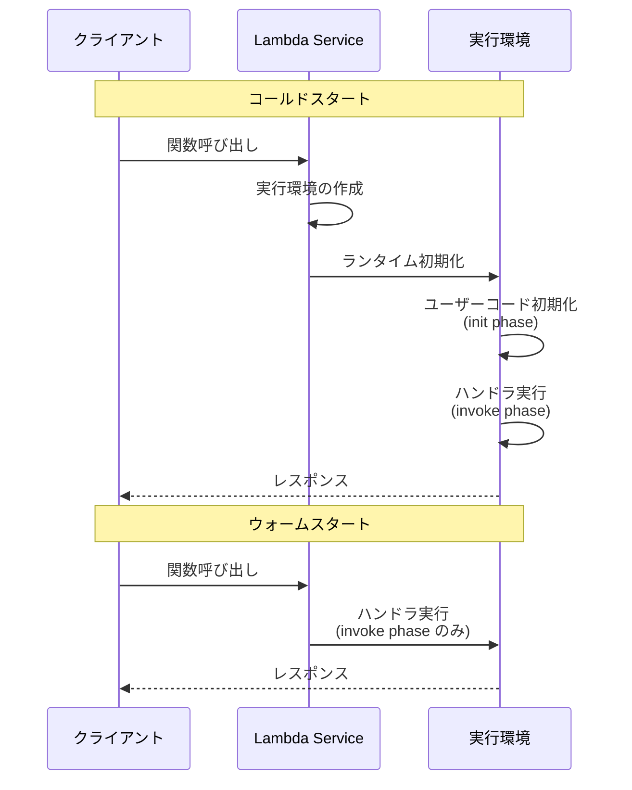

コールドスタートのレイテンシはランタイムと初期化処理の内容によって大きく異なる。

| ランタイム | 典型的なコールドスタート時間 | 備考 |
|----------|------------------------|------|
| Python | 100-300ms | 軽量なランタイム |
| Node.js | 100-300ms | V8 エンジンの高速起動 |
| Go | 50-150ms | ネイティブバイナリ |
| Rust | 50-150ms | ネイティブバイナリ |
| Java | 500ms-5s | JVM の起動と JIT コンパイル |
| .NET | 300ms-2s | CLR の初期化 |

::: tip コールドスタートの頻度
コールドスタートはすべてのリクエストで発生するわけではない。AWS Lambda の場合、実行環境は呼び出し後に数分から数十分間フリーズ状態で保持される（正確な保持時間は公開されていない）。定常的なトラフィックがあるアプリケーションでは、コールドスタートの発生率は全リクエストの 1% 未満になることも多い。
:::

### 3.3 実行環境のライフサイクル

Lambda の実行環境は以下の 3 つのフェーズを持つ。

**Init フェーズ**: ランタイムの初期化とユーザーコードのトップレベル実行が行われる。このフェーズではデータベース接続の確立、設定の読み込み、SDK クライアントの初期化などを行うのが一般的である。Init フェーズの処理時間は最大 10 秒であり、この間のコンピュートリソースは無料で提供される。

**Invoke フェーズ**: ハンドラ関数が呼び出され、イベントの処理とレスポンスの生成が行われる。このフェーズの処理時間が課金対象となる。

**Shutdown フェーズ**: 実行環境が破棄される際に発生する。Lambda Extensions を使用している場合、シャットダウン処理の通知を受け取ることができる。

```python
import boto3

# Init phase: executed once per execution environment
# Database connections and SDK clients are initialized here
dynamodb = boto3.resource("dynamodb")
table = dynamodb.Table("MyTable")

def handler(event, context):
    """
    Invoke phase: executed for each request.
    The DynamoDB client initialized above is reused across invocations.
    """
    item = table.get_item(Key={"id": event["id"]})
    return {"statusCode": 200, "body": item["Item"]}
```

上記のコードで `dynamodb` クライアントと `table` オブジェクトは Init フェーズで一度だけ初期化され、その後のウォームスタートでは再利用される。これはサーバーレスにおける重要な最適化パターンである。

## 4. AWS Lambda のアーキテクチャ

### 4.1 全体アーキテクチャ

AWS Lambda は、数百万の同時実行をサポートする大規模分散システムである。その内部アーキテクチャは、2020 年の AWS re:Invent で発表された論文「Firecracker: Lightweight Virtualization for Serverless Applications」および関連する技術発表によって明らかにされている。

Lambda のアーキテクチャは以下の主要コンポーネントで構成される。

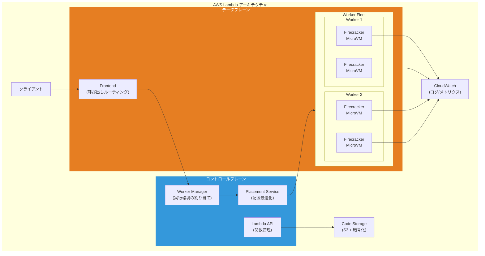

### 4.2 Firecracker MicroVM

Lambda の実行環境の基盤となるのが、AWS が開発したオープンソースの仮想化技術 **Firecracker** である。Firecracker は KVM（Kernel-based Virtual Machine）をベースとした軽量な仮想マシンモニタ（VMM）であり、コンテナに匹敵する起動速度とハードウェアレベルの隔離を両立する。

Firecracker が開発された背景には、Lambda の隔離モデルに対する根本的な要件がある。マルチテナント環境でユーザーの任意のコードを安全に実行するためには、Linux のコンテナ技術（Namespace、cgroups）だけでは不十分であった。コンテナはカーネルを共有するため、カーネルの脆弱性を突くエスケープ攻撃のリスクが存在する。一方、従来の仮想マシンはハードウェアレベルの隔離を提供するが、起動時間が数秒から数十秒かかり、FaaS のレイテンシ要件を満たせない。

Firecracker はこのジレンマを以下の設計により解決した。

| 特性 | 値 | 比較 |
|------|-----|------|
| 起動時間 | < 125ms | QEMU: 数秒 |
| メモリオーバーヘッド | < 5MB | QEMU: 数十 MB |
| デバイスモデル | 最小限（virtio-net, virtio-block） | QEMU: 数十のデバイス |
| 攻撃対象面 | 約 5 万行の Rust コード | QEMU: 数百万行の C コード |
| syscall フィルタ | seccomp-bpf で約 25 個に制限 | - |

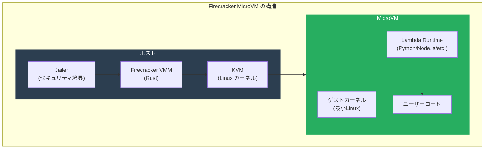

Firecracker の **Jailer** は、Firecracker プロセス自体をさらに隔離するセキュリティレイヤーである。chroot、UID/GID の分離、seccomp-bpf によるシステムコールフィルタリング、cgroups によるリソース制限を組み合わせることで、仮に Firecracker プロセス自体が侵害されたとしてもホストへの影響を最小化する。

### 4.3 Worker Manager とスケジューリング

Worker Manager は Lambda の頭脳に相当するコンポーネントであり、関数の呼び出しリクエストを適切な Worker に割り当てる責務を持つ。Worker Manager は以下の処理を行う。

1. **実行環境のプール管理**: 各関数に対して利用可能な実行環境（ウォーム環境）のプールを管理する
2. **コールドスタートの制御**: ウォーム環境が利用できない場合、新しい MicroVM の作成を Placement Service に要求する
3. **同時実行制御**: アカウントレベルおよび関数レベルの同時実行制限を適用する
4. **負荷分散**: リクエストを複数の Worker に分散し、特定の Worker に負荷が集中しないようにする

Lambda のスケーリングは、**同時実行数**（Concurrency）を基本単位として行われる。同時実行数とは、ある時点で関数コードを実行している実行環境の数である。

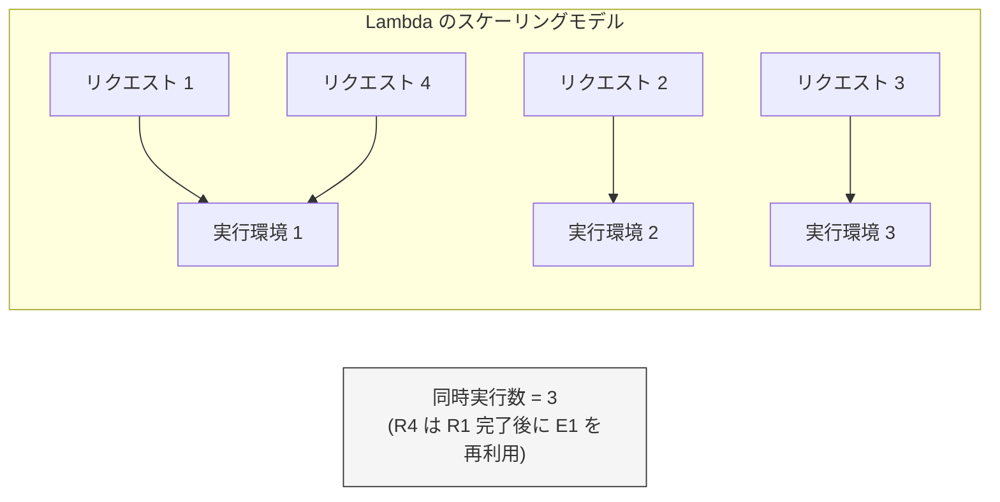

Lambda の同時実行数には以下の制限がある。

- **アカウントデフォルト**: リージョンあたり 1,000 同時実行（引き上げ可能）
- **バーストリミット**: 初期バーストとして 500-3,000 同時実行（リージョンにより異なる）を即座にスケーリングし、その後は 1 分あたり 500 同時実行ずつスケールアップ
- **予約同時実行**: 特定の関数に対して同時実行数を予約し、他の関数による消費を防ぐ

### 4.4 コードの保存と配信

Lambda 関数のデプロイパッケージは、暗号化された状態で S3 に保存される。関数が呼び出されると、Worker 上の MicroVM にコードが配信される。この配信を高速化するために、Lambda は以下の最適化を行っている。

- **チャンク化**: デプロイパッケージを固定サイズのチャンクに分割し、重複排除（deduplication）を行う
- **キャッシュ階層**: Worker のローカルディスクにチャンクをキャッシュし、同一関数の再呼び出し時の配信を高速化する
- **暗号化**: 各チャンクは顧客ごとの鍵で暗号化され、テナント間の隔離を保証する

## 5. 他のプラットフォーム

### 5.1 Google Cloud Functions

Google Cloud Functions は、Google Cloud が提供する FaaS プラットフォームである。第 1 世代と第 2 世代が存在し、第 2 世代は内部的に Cloud Run 上に構築されている。

**第 2 世代の特徴:**

- Cloud Run 基盤により、最大 60 分の実行時間、最大 32GB のメモリ、最大 8 vCPU を利用可能
- Eventarc による豊富なイベントソース統合
- 同時リクエスト処理（1 つのインスタンスで複数リクエストを同時処理可能）
- Cloud Run の全機能（トラフィック分割、リビジョン管理など）を利用可能

Cloud Functions 第 2 世代が Cloud Run 上に構築されているという設計は、Google Cloud の戦略的な方向性を示している。FaaS の関数モデルとコンテナモデルを同一基盤上で統合することで、開発者はユースケースに応じて抽象化レベルを選択できる。

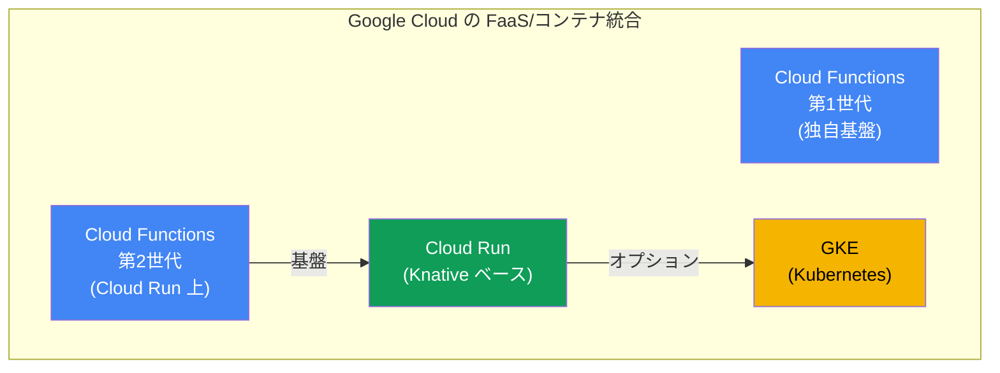

### 5.2 Azure Functions

Microsoft の Azure Functions は、豊富なバインディング機構が特徴的な FaaS プラットフォームである。

Azure Functions の独自性は、**トリガー**と**バインディング**の宣言的な定義にある。入力バインディングと出力バインディングを関数の定義に宣言するだけで、外部サービスとの連携が自動的に行われる。

```javascript
// Azure Functions binding example
module.exports = async function (context, req) {
    // Input binding: HTTP trigger
    // Output binding: Cosmos DB (declared in function.json)
    context.bindings.outputDocument = {
        id: req.body.id,
        name: req.body.name,
        timestamp: new Date().toISOString()
    };

    context.res = {
        status: 201,
        body: "Document created"
    };
};
```

また、Azure Functions には **Durable Functions** という拡張があり、ステートフルなワークフローを関数の組み合わせで記述できる。これはサーバーレスでありながら長時間実行されるオーケストレーション処理を実現する強力な抽象化である。

### 5.3 Cloudflare Workers

Cloudflare Workers は、他の FaaS プラットフォームとは根本的に異なるアーキテクチャを採用している。MicroVM やコンテナではなく、**V8 Isolate** を使用してコードを隔離する。

V8 Isolate は Google Chrome の JavaScript エンジンである V8 が提供するサンドボックス機構である。各 Worker はプロセスではなく V8 の Isolate 内で実行されるため、以下の特徴を持つ。

| 特性 | Cloudflare Workers | AWS Lambda |
|------|-------------------|------------|
| 隔離技術 | V8 Isolate | Firecracker MicroVM |
| コールドスタート | < 5ms | 100ms - 数秒 |
| メモリオーバーヘッド | 数 MB | 数十 MB |
| 対応言語 | JavaScript/TypeScript, WASM | 多言語 |
| 実行場所 | エッジ（300+ PoP） | リージョン |
| 最大実行時間 | 30s (Paid) | 15分 |
| 最大メモリ | 128MB | 10GB |

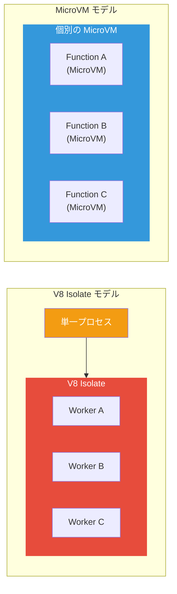

V8 Isolate モデルの最大の利点は起動速度である。MicroVM の作成に数十ミリ秒かかるのに対し、V8 Isolate の作成は 5 ミリ秒未満で完了する。これにより、事実上コールドスタートが問題にならない。

一方で、V8 Isolate モデルには制約もある。OS レベルの隔離ではないため、syscall を直接発行するネイティブコードの実行は制限される。対応言語は JavaScript/TypeScript と WebAssembly に限定される（ただし WASM を介して Go、Rust、C/C++ のコードも実行可能）。

### 5.4 プラットフォーム比較まとめ

| 特性 | AWS Lambda | Cloud Functions (v2) | Azure Functions | Cloudflare Workers |
|------|-----------|---------------------|----------------|-------------------|
| 最大実行時間 | 15 分 | 60 分 | 無制限（Premium） | 30 秒 |
| 最大メモリ | 10 GB | 32 GB | 14 GB | 128 MB |
| 最大パッケージ | 250 MB (zip) / 10 GB (image) | ソースベース | 無制限 | 10 MB |
| 同時実行 | 1 リクエスト/インスタンス | 複数リクエスト/インスタンス | 複数リクエスト/インスタンス | 複数リクエスト/Isolate |
| コールドスタート | 100ms - 数秒 | 100ms - 数秒 | 100ms - 数秒 | < 5ms |
| VPC 統合 | あり | あり (VPC Connector) | あり | なし |
| エッジ実行 | Lambda@Edge | なし | なし | デフォルト |

## 6. サーバーレスのデザインパターン

### 6.1 API バックエンドパターン

最も一般的なサーバーレスパターンは、API Gateway + Lambda による REST API の構築である。

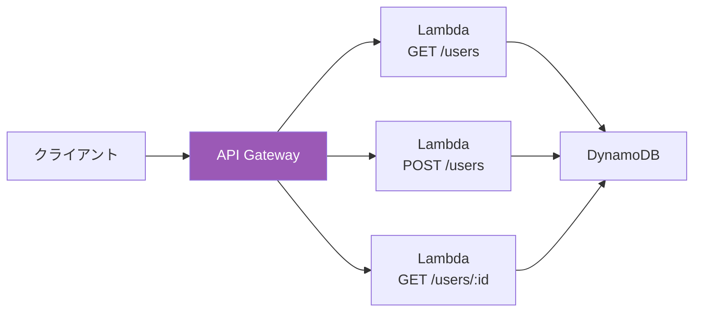

このパターンには 2 つのアプローチがある。

**関数分割アプローチ**: 各 API エンドポイントに個別の Lambda 関数を割り当てる。関数ごとに独立したデプロイ、スケーリング、モニタリングが可能だが、関数の数が増大し管理が複雑になる。

**モノリシック関数アプローチ**: 単一の Lambda 関数内でルーティングを行い、全エンドポイントを処理する。Express.js や FastAPI などの既存のフレームワークを Lambda 上で動かすことで、従来のアプリケーション開発の知識を活用できる。ただし、コールドスタートが重くなり、不要なコードもロードされるという欠点がある。

### 6.2 イベント処理パイプラインパターン

複数のサーバーレス関数をイベントで連鎖させ、データ処理パイプラインを構築するパターンである。

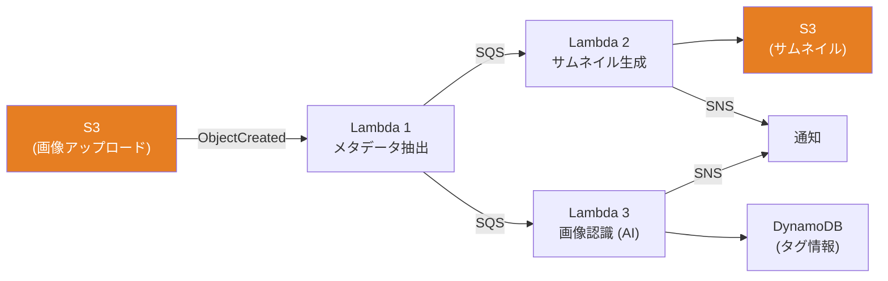

このパターンでは、各関数が単一責任の原則に従い、1 つの処理のみを担当する。関数間の結合はメッセージキュー（SQS）やイベントバス（EventBridge）を介して行われ、各段階が独立してスケーリングする。

### 6.3 ファンアウト/ファンインパターン

大量のデータを並列処理する場合に有効なパターンである。オーケストレータ関数が処理を複数の Worker 関数に分散（ファンアウト）し、結果を集約（ファンイン）する。

AWS Step Functions を使うことで、このパターンを宣言的に定義できる。

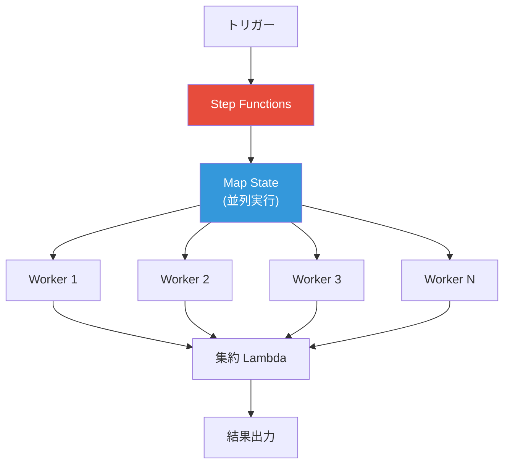

### 6.4 Strangler Fig パターン

既存のモノリシックアプリケーションを段階的にサーバーレスに移行するパターンである。新しい機能や変更頻度の高い機能からサーバーレス関数に切り出し、API Gateway でルーティングを制御する。

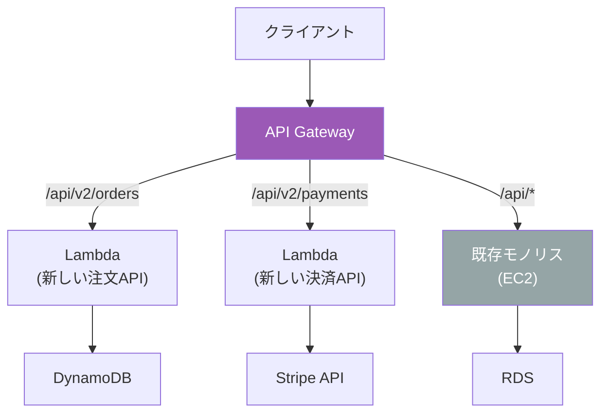

### 6.5 Backend for Frontend（BFF）パターン

クライアントの種類（Web、モバイル、IoT）ごとに専用のサーバーレス API を提供するパターンである。各 BFF はそれぞれのクライアントに最適化されたレスポンスを返し、共通のバックエンドサービスを呼び出す。

## 7. 制約と制限

### 7.1 実行時間の制限

FaaS プラットフォームには実行時間の上限がある。AWS Lambda の場合、最大 15 分（900 秒）である。この制限は、長時間実行されるバッチ処理やリアルタイムのストリーミング処理には不向きであることを意味する。

長時間処理が必要な場合は、以下の回避策がある。

- **Step Functions**: 複数の Lambda 関数をワークフローとして連結し、全体として長時間の処理を実現する
- **再帰パターン**: Lambda が自身を呼び出し、処理の続きを委譲する（ただし設計が複雑になる）
- **ECS/Fargate への委譲**: Lambda が処理の開始をトリガーし、実際の長時間処理は Fargate タスクで行う

### 7.2 メモリとコンピュートリソース

Lambda のメモリは 128 MB から 10,240 MB（10 GB）まで 1 MB 単位で設定できる。重要なのは、**CPU パワーはメモリ量に比例して割り当てられる**という点である。1,769 MB で 1 vCPU 相当の処理能力が割り当てられ、10 GB 設定時には最大 6 vCPU 相当が利用可能になる。

この設計は、CPU バウンドな処理のためにメモリを増やすという直感に反した最適化を必要とする場合がある。

### 7.3 ステートレス性

FaaS 関数は基本的にステートレスである。呼び出し間で状態を共有する場合は、外部のデータストアを使用する必要がある。

| 状態の種類 | 推奨ストレージ | 特徴 |
|----------|-------------|------|
| セッション状態 | DynamoDB, ElastiCache | 低レイテンシ |
| ファイル/バイナリ | S3, EFS | 大容量 |
| 一時データ | /tmp（512MB-10GB） | 同一実行環境内でのみ有効 |
| 設定 | Parameter Store, Secrets Manager | 暗号化・バージョン管理 |

::: warning /tmp の落とし穴
Lambda の `/tmp` ディレクトリはウォームスタート時に前回の内容が残っている場合がある。これを活用してキャッシュとして使うことは可能だが、常に利用可能であることは保証されない。必ず存在しない場合のフォールバック処理を実装すること。
:::

### 7.4 デプロイパッケージのサイズ制限

Lambda のデプロイパッケージには以下のサイズ制限がある。

- **ZIP パッケージ**: 直接アップロード 50 MB、S3 経由 250 MB（解凍後）
- **コンテナイメージ**: 最大 10 GB

コンテナイメージサポートの導入により、機械学習モデルや大規模な依存関係を含む関数のデプロイが実用的になった。

### 7.5 同時実行の制限

Lambda のアカウントデフォルトの同時実行上限はリージョンあたり 1,000 である。この上限はサポートリクエストにより引き上げ可能だが、急激なトラフィック増加に対してはバーストリミットの制約がある。

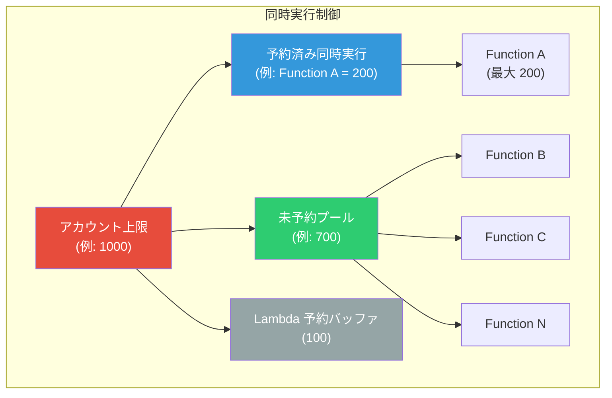

予約同時実行（Reserved Concurrency）を設定すると、その関数に対して指定した数の同時実行が保証される。同時に、その関数の同時実行がその数を超えないようにスロットリングされるため、下流のサービス（データベースなど）を保護する目的でも使用される。

## 8. パフォーマンス最適化

### 8.1 Provisioned Concurrency

Provisioned Concurrency は、指定した数の実行環境を事前に初期化してウォーム状態で維持する機能である。これにより、コールドスタートを完全に排除できる。

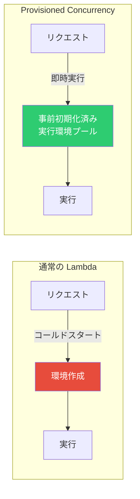

Provisioned Concurrency にはコストが伴う。通常の Lambda が「実行時のみ課金」であるのに対し、Provisioned Concurrency は「環境を維持している時間」に対しても課金される。Auto Scaling と組み合わせて、トラフィックパターンに応じて Provisioned Concurrency の数を動的に調整することが推奨される。

### 8.2 SnapStart

SnapStart は 2022 年に導入された Java ランタイム向けの最適化機能であり、CRaC（Coordinated Restore at Checkpoint）技術を基盤としている。

SnapStart のメカニズムは以下の通りである。

1. 関数のデプロイ時に、Lambda が Init フェーズを実行し、初期化済みの実行環境のスナップショットを取得する
2. スナップショットは暗号化されてキャッシュされる
3. コールドスタート時に、ゼロから環境を初期化する代わりに、スナップショットから復元する

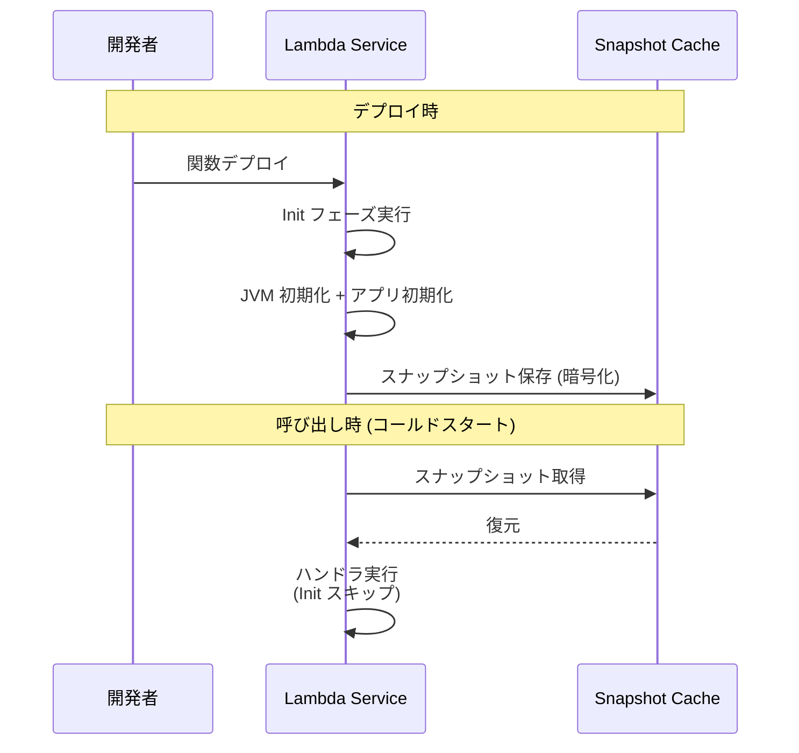

SnapStart により、Java Lambda のコールドスタートは従来の数秒から数百ミリ秒にまで短縮される。ただし、スナップショットからの復元にはいくつかの注意点がある。

::: warning SnapStart の注意点
- データベースコネクションはスナップショット後に無効になっている可能性がある。`afterRestore` フックで再接続する必要がある
- 乱数生成器の状態がスナップショットに含まれるため、セキュリティ上のリスクがある。暗号論的乱数生成器は `afterRestore` で再初期化すべきである
- `/tmp` の内容はスナップショットに含まれない
:::

### 8.3 その他の最適化テクニック

**デプロイパッケージの最小化**: 不要な依存関係を除去し、Tree Shaking やバンドル最適化を行う。Node.js では esbuild による単一ファイルバンドル、Python では Lambda Layers による共有依存関係の分離が有効である。

**ARM アーキテクチャ（Graviton2）の活用**: AWS Graviton2 プロセッサは x86 と比較して最大 34% のコスト削減と 20% の性能向上を提供する。多くのワークロードで Graviton2 への移行が推奨される。

**Lambda Layers**: 共通の依存関係やカスタムランタイムを Layer として分離し、複数の関数間で共有する。デプロイパッケージの縮小と依存関係管理の簡素化に寄与する。

**Lambda Extensions**: 関数の実行環境にサイドカー的な機能を追加する仕組み。ログの送信、メトリクスの収集、設定の動的取得などを、ハンドラのコードから分離して実装できる。

**Power Tuning**: AWS Lambda Power Tuning ツールを使用して、関数の最適なメモリ設定を実験的に決定する。メモリ増加により CPU パワーが増え、実行時間が短縮されることで、結果的にコストが下がるケースも多い。

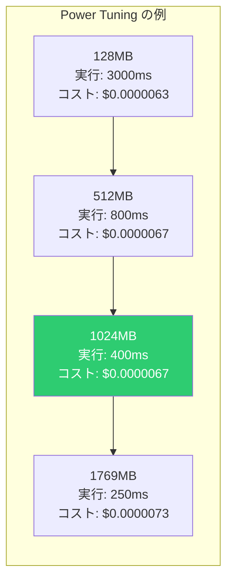

上の例では、1024 MB がコストとパフォーマンスのバランスが最も良い設定となっている。

## 9. コスト分析と従来のホスティングとの比較

### 9.1 Lambda の課金モデル

AWS Lambda の課金は以下の 3 要素から構成される。

1. **リクエスト数**: 100 万リクエストあたり $0.20（月間 100 万リクエストまで無料）
2. **実行時間**: GB-秒あたり $0.0000166667（1ms 単位で課金）
3. **Provisioned Concurrency**: GB-秒あたり $0.0000041667（通常の約 25%）+ 実行時の差額

具体的な計算例を示す。

::: details コスト計算例

**前提条件:**
- 月間 3,000 万リクエスト
- 平均実行時間: 200ms
- メモリ: 256MB

**計算:**
- リクエスト料金: 30,000,000 / 1,000,000 × $0.20 = $6.00
- 実行時間料金: 30,000,000 × 0.2秒 × 0.25GB × $0.0000166667 = $25.00
- **月額合計: 約 $31.00**

同等の処理を EC2（t3.medium）で実行する場合:
- 2 台（冗長化）× $0.0416/時 × 730 時間 = **約 $60.72/月**

ただし、EC2 の場合はアイドル時間のリソースを他の処理にも活用できる。
:::

### 9.2 コスト特性の比較

サーバーレスと従来のホスティングのコスト特性を比較すると、トラフィックパターンによって最適な選択が異なることがわかる。

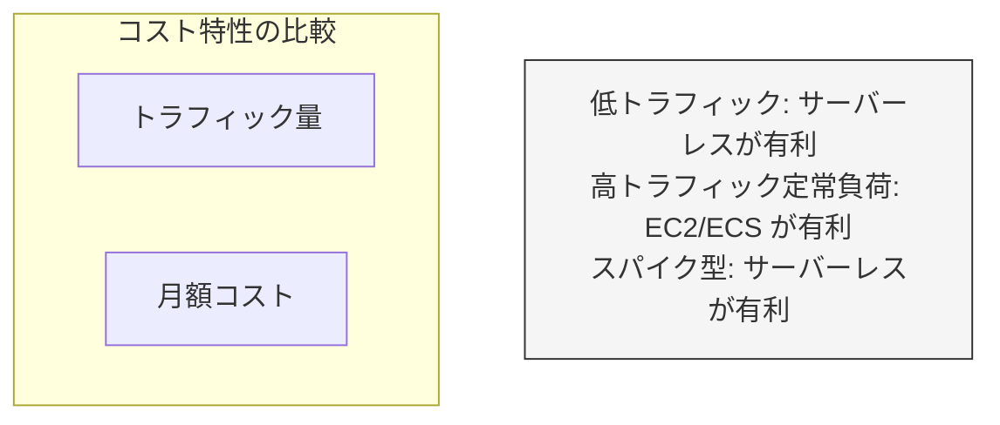

| トラフィックパターン | サーバーレス | 常時稼働サーバー |
|------------------|-----------|--------------|
| 低トラフィック（< 100万リクエスト/月） | コスト優位 | 過剰プロビジョニング |
| 定常的高トラフィック | コスト高 | コスト優位 |
| スパイク型トラフィック | コスト優位 | ピーク対応で過剰プロビジョニング |
| 予測不能なトラフィック | コスト優位 | スケーリング遅延 |
| ゼロトラフィック期間あり | ゼロコスト | 固定費が継続 |

### 9.3 隠れたコスト

サーバーレスのコスト分析では、Lambda の直接的な課金だけでなく、以下の隠れたコストも考慮する必要がある。

- **API Gateway のコスト**: REST API で $3.50/100 万リクエスト、HTTP API で $1.00/100 万リクエスト
- **データ転送コスト**: VPC 内のリソースへのアクセスに伴う NAT Gateway の通信料金
- **CloudWatch Logs のコスト**: ログの取り込みと保存に対する課金
- **Step Functions のコスト**: ステートマシンの状態遷移ごとに $0.025/1,000 遷移
- **開発・運用の学習コスト**: サーバーレス固有の設計パターンやデバッグ手法の習得

## 10. サーバーレスの限界と適用領域

### 10.1 サーバーレスが適さないユースケース

サーバーレスは万能ではない。以下のユースケースでは、従来のサーバーベースのアーキテクチャが適している。

**長時間実行プロセス**: 15 分を超えるバッチ処理、データパイプライン、機械学習の学習ジョブなどは Lambda の実行時間制限に収まらない。ECS/Fargate や EC2 が適切である。

**WebSocket を多用するリアルタイムアプリケーション**: Lambda は長時間のコネクション維持には向いていない。API Gateway WebSocket API と組み合わせることは可能だが、各メッセージが個別の Lambda 呼び出しとなるため、高頻度メッセージングではコストが増大する。

**高スループット定常負荷**: 常時数千リクエスト/秒の定常負荷がある場合、Lambda のコストは EC2 や ECS に比べて高くなる。特に CPU 集約型の処理では顕著である。

**低レイテンシ要件（< 10ms）**: コールドスタートの可能性と Lambda の呼び出しオーバーヘッド（数ミリ秒）があるため、極めて低いレイテンシが要求されるアプリケーションには不向きである。

**大量のローカルステート**: 大きなインメモリキャッシュや大規模なファイル処理を必要とするアプリケーションは、Lambda のメモリ制限と一時ストレージの制限に抵触する可能性がある。

### 10.2 サーバーレスが効果的なユースケース

一方で、以下のユースケースではサーバーレスが極めて効果的である。

- **API バックエンド**: 特にトラフィックが変動するアプリケーション
- **イベント処理**: S3 アップロード、DynamoDB ストリーム、IoT イベントなどの非同期処理
- **スケジュールタスク**: 定期的なデータ処理、レポート生成、クリーンアップジョブ
- **Webhook 処理**: 外部サービスからのコールバック処理
- **マイクロサービスの一部**: 呼び出し頻度が低い、または変動するサービス
- **プロトタイピング**: 迅速な検証と低コストでの実験

### 10.3 ベンダーロックイン

サーバーレスを採用する際の重要な懸念事項がベンダーロックインである。Lambda 関数のコード自体は標準的なプログラミング言語で記述されるが、以下の要素がプラットフォーム固有である。

- **イベントソースとの統合**: S3、DynamoDB Streams、EventBridge などとの連携はAWS 固有
- **IAM とセキュリティモデル**: 実行ロール、リソースポリシーの設計
- **デプロイとインフラ定義**: SAM、CDK、Serverless Framework などのツール
- **周辺サービスへの依存**: API Gateway、Step Functions、SQS などの組み合わせ

ベンダーロックインを軽減するアプローチとして、以下が挙げられる。

- **ビジネスロジックの分離**: ハンドラ関数をプラットフォーム固有のアダプタ層とビジネスロジック層に分離する
- **ヘキサゴナルアーキテクチャの適用**: ポートとアダプタのパターンにより、外部サービスとの結合をインターフェースの背後に隠す
- **Knative / OpenFaaS の活用**: Kubernetes 上で動作するオープンソースの FaaS プラットフォームを利用する

```python
# Platform-agnostic business logic
class OrderService:
    def __init__(self, repository, event_publisher):
        """
        Constructor injection for platform-agnostic dependencies.
        """
        self.repository = repository
        self.event_publisher = event_publisher

    def create_order(self, order_data):
        """
        Pure business logic, no platform-specific code.
        """
        order = Order.from_dict(order_data)
        order.validate()
        self.repository.save(order)
        self.event_publisher.publish("OrderCreated", order.to_dict())
        return order

# AWS Lambda adapter
def lambda_handler(event, context):
    """
    AWS-specific adapter that delegates to platform-agnostic logic.
    """
    repo = DynamoDBOrderRepository()
    publisher = EventBridgePublisher()
    service = OrderService(repo, publisher)
    order_data = json.loads(event["body"])
    order = service.create_order(order_data)
    return {"statusCode": 201, "body": json.dumps(order.to_dict())}
```

### 10.4 デバッグとオブザーバビリティの課題

サーバーレスアプリケーションのデバッグは、従来のサーバーベースのアプリケーションと比較して困難である。

- **ローカル開発環境の再現性**: Lambda の実行環境をローカルで完全に再現することは難しい。SAM CLI や LocalStack などのツールが存在するが、本番環境との差異は残る
- **分散トレーシング**: 複数の Lambda 関数がイベントで連鎖するアーキテクチャでは、リクエストの追跡が複雑になる。AWS X-Ray や OpenTelemetry を使用した分散トレーシングの導入が重要になる
- **ログの分散**: 関数ごとに CloudWatch Log Group が作成されるため、ログの集約と横断的な分析が必要になる

### 10.5 サーバーレスの未来

サーバーレスコンピューティングは急速に進化を続けている。以下のトレンドが今後の方向性を示している。

**コールドスタートの更なる改善**: SnapStart のようなスナップショットベースの最適化が他のランタイムにも拡大する可能性がある。また、Firecracker の改善により MicroVM の起動時間はさらに短縮されるだろう。

**エッジコンピューティングとの融合**: Cloudflare Workers や Lambda@Edge に見られるように、サーバーレス関数をユーザーに近いエッジロケーションで実行するトレンドが加速している。WebAssembly の成熟により、エッジでの実行可能な言語やフレームワークの選択肢が広がる。

**コンテナとの境界の曖昧化**: Cloud Run のようなサーバーレスコンテナプラットフォームが示すように、FaaS とコンテナの境界は曖昧になりつつある。開発者は抽象化のレベルを選択できるようになり、「サーバーレス」はデプロイモデルではなく**運用モデル**として定義されるようになるだろう。

**プロビジョニングの自動化**: Provisioned Concurrency のような手動チューニングは、将来的には完全に自動化される可能性がある。機械学習によるトラフィック予測に基づいた事前スケーリングが標準的になるかもしれない。

**WASI（WebAssembly System Interface）の台頭**: WebAssembly がサーバーサイドでの実行環境として成熟することで、V8 Isolate モデルの利点（高速起動、低オーバーヘッド）を汎用的な言語で享受できるようになる。これにより、コンテナよりも軽量で、現在の FaaS よりも柔軟な新しいコンピューティングモデルが登場する可能性がある。

## まとめ

サーバーレスアーキテクチャは、「インフラの管理ではなくビジネスロジックに集中する」という開発者の長年の願望に応えるコンピューティングモデルである。AWS Lambda を筆頭とする FaaS プラットフォームは、Firecracker MicroVM のような革新的な技術基盤の上に構築され、マルチテナント環境でのセキュアかつ高速なコード実行を実現している。

しかし、サーバーレスは銀の弾丸ではない。実行時間の制限、コールドスタート、ステートレスの制約、ベンダーロックイン、デバッグの困難さなど、固有の課題が存在する。重要なのは、これらのトレードオフを理解した上で、ユースケースに応じて適切な技術選択を行うことである。

低トラフィックやスパイク型のワークロード、イベント駆動の非同期処理、プロトタイピングなどにおいてサーバーレスは極めて効果的であり、定常的な高負荷ワークロードや低レイテンシ要件のアプリケーションには従来のサーバーベースのアーキテクチャが適している。多くの実際のシステムでは、サーバーレスと従来のアーキテクチャを組み合わせたハイブリッドアプローチが最も実用的な選択となるだろう。
