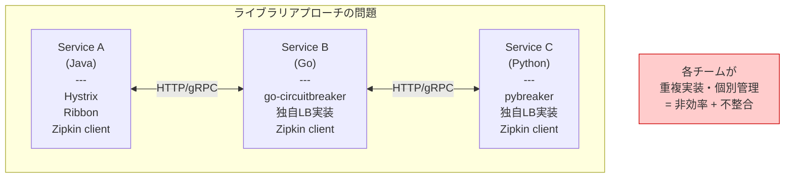
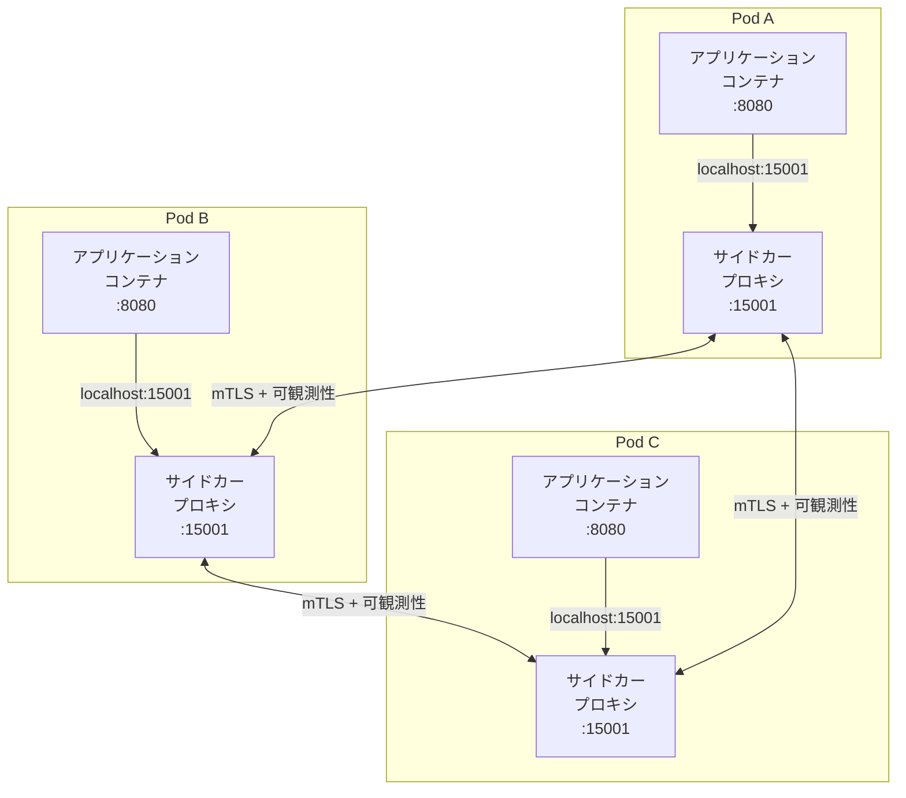
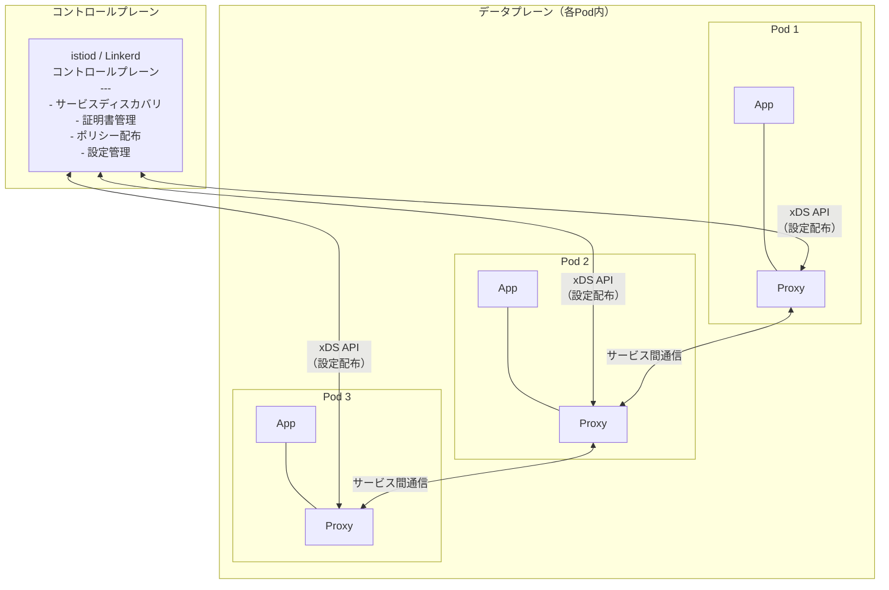
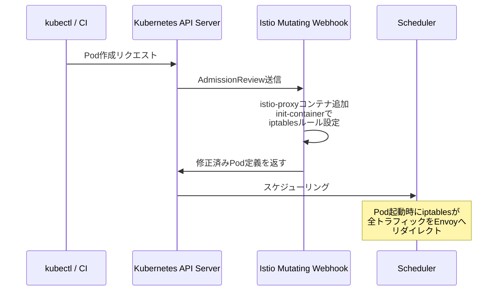
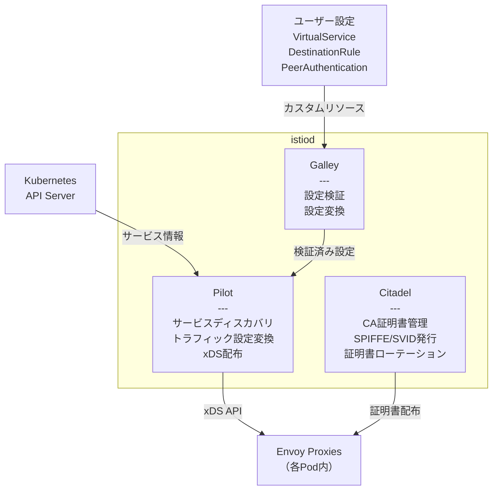
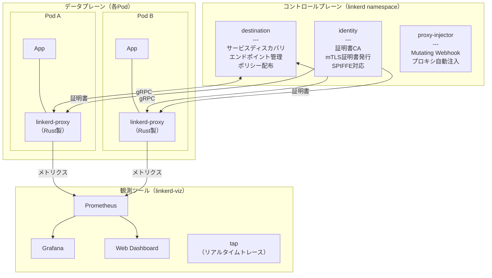
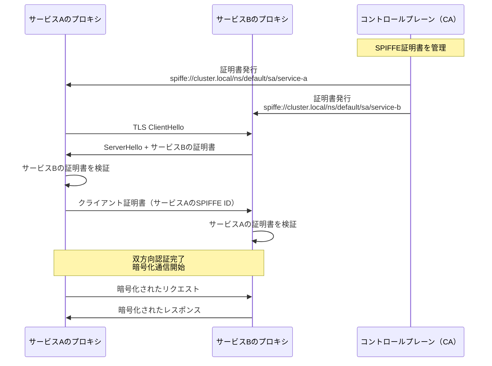
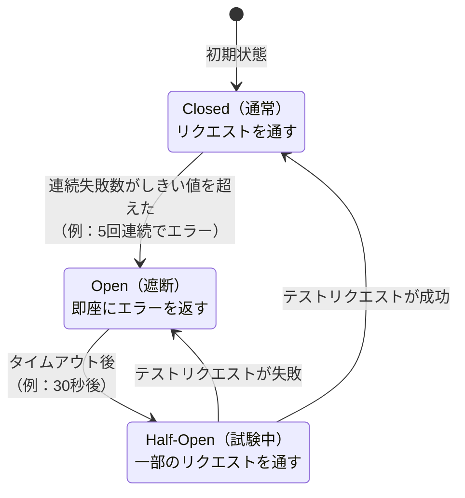
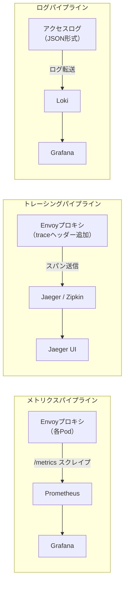
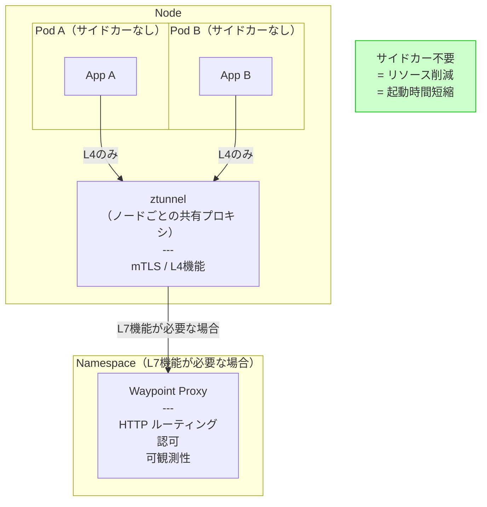

# サービスメッシュ（Istio, Linkerd）

## 1. 歴史的背景 — マイクロサービスがもたらした通信の複雑性

### 1.1 モノリスからマイクロサービスへ

2000年代後半から2010年代にかけて、ソフトウェアアーキテクチャは大きな転換期を迎えた。単一のアプリケーションとして構築する**モノリシックアーキテクチャ**から、機能ごとに独立した小さなサービスを組み合わせる**マイクロサービスアーキテクチャ**への移行が加速した。

Netflixは2008年のデータベース障害を機に、2009年からクラウドへの移行とマイクロサービス化を開始した。Amazonは「ピザ2枚ルール（Two-Pizza Rule）」に基づきチームを小さく保ち、各チームが独立したサービスを所有する文化を確立した。このような先進企業の実践を経て、マイクロサービスは2014年頃にはMartinFowlerとJames Lewisが体系化した論文によって広く普及した。

マイクロサービスの利点は明確だった：

- **独立したデプロイ**: あるサービスの変更が他のサービスに影響を与えない
- **技術的多様性**: サービスごとに最適なプログラミング言語やデータストアを選択できる
- **スケーラビリティ**: 負荷の高いサービスのみをスケールアウトできる
- **障害の局所化**: 一つのサービスの障害が全体に波及しにくい

### 1.2 通信の複雑性という新たな課題

しかしマイクロサービスは、モノリスでは存在しなかった深刻な問題をもたらした。関数呼び出しだった処理がネットワーク越しの通信に変わった結果、以下の課題が浮上した。

**信頼性の問題**: ネットワークは信頼できない。パケットロスや一時的な障害は避けられないため、リトライ、タイムアウト、サーキットブレーカーなどのパターンが必要になった。

**セキュリティの問題**: サービス間の通信が増えるにつれ、どのサービスがどのサービスに通信していいのかの認証・認可が必要になった。通信内容の暗号化も課題となった。

**可観測性の問題**: 1つのユーザーリクエストが複数のサービスを経由するため、問題が起きたときにどこで何が起きているかを把握するのが困難になった。

**流量制御の問題**: カナリアリリースやA/Bテストのためにトラフィックを細かく制御したい需要が生まれた。

### 1.3 各チームでの重複実装という非効率

初期のマイクロサービス採用者は、これらの問題をアプリケーションレイヤーで解決しようとした。NetflixはHystrix（サーキットブレーカー）、Ribbon（クライアントサイドロードバランシング）、Eureka（サービスディスカバリ）などのライブラリを開発し、オープンソースとして公開した。

しかしこのアプローチには根本的な限界があった。**ライブラリはプログラミング言語と密接に結びついている**。Java向けのHystrixはGoやPythonで書かれたサービスでは使えない。複数の言語が混在する組織では、同じ機能を言語ごとに再実装しなければならなかった。バージョン管理も困難で、ライブラリのアップデートには全サービスの再デプロイが必要だった。



### 1.4 サービスメッシュの誕生

この問題への解答として登場したのが**サービスメッシュ（Service Mesh）**という概念だ。Buoyant社のWilliam Morganが2017年に「What's a service mesh? And why do I need one?」というブログ記事でこの用語を定義・普及させた。

サービスメッシュのアイデアは単純だ。ネットワーク通信に関わる横断的な機能をアプリケーションコードから切り出し、インフラストラクチャレイヤーで透過的に提供する。アプリケーションはビジネスロジックに集中し、通信の信頼性・セキュリティ・可観測性はインフラが担う。

2016年にLyftが社内向けに開発した**Envoy**プロキシが公開され、2017年にBuoyantが**Linkerd**（初代はScala製）をリリース、同年GoogleとIBMとLyftが共同で**Istio**を発表した。2018年にはLinkerdが2.0として完全Rust製で再設計された。これらのプロダクトが業界標準のサービスメッシュ実装として定着した。

---

## 2. サービスメッシュの基本概念

### 2.1 サイドカーパターン

サービスメッシュの核心となる設計パターンが**サイドカーパターン（Sidecar Pattern）**だ。各サービスのPodに、アプリケーションコンテナと並列して軽量なプロキシコンテナを配置する。このプロキシを**サイドカープロキシ**と呼ぶ。



サイドカープロキシはiptablesルールによってトラフィックをインターセプトする。アプリケーションは通常どおりの通信を行うが、実際のパケットはすべてサイドカーを経由する。アプリケーションはこの仕組みを意識する必要がない — これが**透過性（Transparency）**だ。

### 2.2 データプレーンとコントロールプレーン

サービスメッシュは論理的に2つの層に分かれる。

**データプレーン（Data Plane）**: 実際のネットワークトラフィックを処理する層。サイドカープロキシの集合体がデータプレーンを構成する。mTLS暗号化、ロードバランシング、リトライ、メトリクス収集などをリアルタイムで実行する。

**コントロールプレーン（Control Plane）**: データプレーンのプロキシを設定・管理する層。管理者やオペレーターが定義したポリシーをプロキシに配布する。プロキシは直接コントロールプレーンと通信し、設定を受け取る。



この分離により、コントロールプレーンはデータパスから外れる。コントロールプレーンが一時的に停止しても、プロキシは最後に受け取った設定で動作し続ける。これはシステムの**障害耐性**に大きく貢献する。

### 2.3 サービスメッシュが提供する機能

サービスメッシュが提供する主要機能を整理すると：

| 機能カテゴリ | 具体的な機能 |
|-------------|-------------|
| セキュリティ | mTLS、認証、認可（RBAC）、証明書自動ローテーション |
| トラフィック管理 | ロードバランシング、カナリアリリース、A/Bテスト、タイムアウト、リトライ |
| 信頼性 | サーキットブレーカー、フォールト・インジェクション、レート制限 |
| 可観測性 | 分散トレーシング、メトリクス収集、アクセスログ |

---

## 3. Istioのアーキテクチャ

### 3.1 Istioの概要と歴史

Istioは2017年にGoogle、IBM、Lyftが共同で開発を開始したオープンソースのサービスメッシュ実装だ。当初は複数のコンポーネント（Pilot、Citadel、Galley、Mixer）に分散していたアーキテクチャが、1.5（2020年）で**istiod**という単一プロセスに統合された。この統合によりオペレーション上の複雑さが大幅に軽減された。

Istioは現在CNCF（Cloud Native Computing Foundation）のグラデュエートプロジェクトとして運営されており、エンタープライズでの採用が最も多いサービスメッシュ実装だ。

### 3.2 コアコンポーネント：Envoyプロキシ

Istioのデータプレーンには**Envoy**を使用する。EnvoyはLyftが開発したC++製の高性能プロキシで、2016年にオープンソース化された。

Envoyの主要な特徴：

- **動的設定**: xDS（x Discovery Service）APIを通じてコントロールプレーンから設定を動的に受け取る。再起動なしに設定変更が反映される
- **L7プロキシ**: HTTP/1.1、HTTP/2、gRPC、WebSocketなどのアプリケーション層プロトコルを理解し、高度なルーティングが可能
- **豊富なメトリクス**: リクエストレート、レイテンシ、エラーレートなどをデフォルトで収集する
- **拡張性**: WebAssembly（Wasm）によるフィルタ拡張が可能

各PodにはEnvoyプロキシがサイドカーとして注入される。この注入は**Mutating Webhook**によって自動化されており、Podの作成時にistio-systemネームスペースのWebhookサーバーがPod定義を変更して`istio-proxy`コンテナを追加する。



### 3.3 コアコンポーネント：istiod

**istiod**はIstioのコントロールプレーンを担う単一のバイナリで、内部に複数の機能を持つ。

**Pilot機能（トラフィック管理）**: Kubernetesのサービスディスカバリ情報を収集し、Envoyプロキシにエンドポイント情報を配布する。VirtualServiceやDestinationRuleなどのカスタムリソースを解釈し、Envoyの設定（xDS）に変換する。

**Citadel機能（証明書管理）**: mTLSのためのCA（認証局）として機能する。各サービスアカウントに対してX.509証明書を発行・ローテーションする。証明書の有効期間は短く設定され（デフォルト24時間）、自動更新によりセキュリティを維持する。

**Galley機能（設定検証）**: ユーザーが設定したIstioのカスタムリソースを検証し、不正な設定を早期に検出する。



### 3.4 トラフィック管理のカスタムリソース

Istioはトラフィック管理のために複数のKubernetes Custom Resource（CR）を提供する。

**VirtualService**: トラフィックルーティングのルールを定義する。以下はHTTPヘッダーに基づくルーティングの例だ。

```yaml
apiVersion: networking.istio.io/v1beta1
kind: VirtualService
metadata:
  name: reviews
spec:
  hosts:
  - reviews
  http:
  # Route to v2 for users in the "test" group
  - match:
    - headers:
        x-user-group:
          exact: test
    route:
    - destination:
        host: reviews
        subset: v2
  # Route 10% of traffic to v3, rest to v1 (canary release)
  - route:
    - destination:
        host: reviews
        subset: v1
      weight: 90
    - destination:
        host: reviews
        subset: v3
      weight: 10
```

**DestinationRule**: ロードバランシングポリシーやサーキットブレーカーなど、トラフィックのポリシーを定義する。

```yaml
apiVersion: networking.istio.io/v1beta1
kind: DestinationRule
metadata:
  name: reviews
spec:
  host: reviews
  trafficPolicy:
    # Circuit breaker configuration
    outlierDetection:
      consecutive5xxErrors: 5
      interval: 30s
      baseEjectionTime: 30s
    # Connection pool settings
    connectionPool:
      http:
        http2MaxRequests: 1000
        http1MaxPendingRequests: 100
  subsets:
  - name: v1
    labels:
      version: v1
  - name: v2
    labels:
      version: v2
  - name: v3
    labels:
      version: v3
```

**PeerAuthentication**: mTLSポリシーを定義する。

```yaml
apiVersion: security.istio.io/v1beta1
kind: PeerAuthentication
metadata:
  name: default
  namespace: production
spec:
  # Require mTLS for all services in the namespace
  mtls:
    mode: STRICT
```

**AuthorizationPolicy**: サービス間の認可ルールを定義する。

```yaml
apiVersion: security.istio.io/v1beta1
kind: AuthorizationPolicy
metadata:
  name: allow-reviews-to-ratings
spec:
  selector:
    matchLabels:
      app: ratings
  action: ALLOW
  rules:
  # Allow only the reviews service to access ratings
  - from:
    - source:
        principals: ["cluster.local/ns/default/sa/reviews"]
    to:
    - operation:
        methods: ["GET"]
        paths: ["/ratings/*"]
```

---

## 4. Linkerdのアーキテクチャ

### 4.1 Linkerdの設計思想

Linkerd（2.0以降）はBuoyant社が2018年に完全再設計して公開したサービスメッシュで、**シンプルさ・軽量さ・安全性**を設計の最優先事項としている。初代Linkerd（Scala製）の運用経験から、サービスメッシュはシンプルでないと採用が進まないという教訓を得た。

Linkerd 2.0の主要な設計判断：

- **Rust製プロキシ**: データプレーンのプロキシ（`linkerd2-proxy`）をRustで実装。メモリ安全性とゼロコスト抽象化により、C++のEnvoyと同等のパフォーマンスを達成しつつ、より小さなフットプリントを実現した
- **最小限のCRD**: Istioが多数のカスタムリソースを提供するのに対し、LinkerdはKubernetesネイティブのリソースに可能な限り依存し、独自リソースを最小化した
- **自動mTLS**: 追加設定なしで全サービス間通信をmTLSで保護する（Istioはデフォルトでは「PERMISSIVE」モード）

### 4.2 Linkerdのコンポーネント構成



### 4.3 linkerd2-proxyの特徴

`linkerd2-proxy`はIstioのEnvoyと対比される点で特徴的だ。

**軽量なフットプリント**: Envoyに比べてメモリ使用量が顕著に少ない。典型的な構成でEnvoyが数十MBのメモリを使用するのに対し、linkerd2-proxyは数MBの範囲に収まる。

**HTTP/2ネイティブ**: gRPCを含むHTTP/2通信をネイティブにサポートし、内部的にはHTTP/1.1もHTTP/2にアップグレードして多重化する。

**設定不要の動作**: Linkerdのプロキシは汎用的な設定可能プロキシではなく、Linkerd専用のコンポーネントとして設計されている。このため設定の複雑さが少ない一方、柔軟性はEnvoyに比べて低い。

### 4.4 Linkerdのトラフィック管理

LinkerdはHTTPRouteというKubernetesの標準リソース（Gateway API）を採用している。

```yaml
apiVersion: policy.linkerd.io/v1beta3
kind: HTTPRoute
metadata:
  name: reviews-route
  namespace: default
spec:
  parentRefs:
  - name: reviews
    kind: Service
    group: core
    port: 9080
  rules:
  # Weight-based traffic splitting for canary release
  - backendRefs:
    - name: reviews-v1
      port: 9080
      weight: 90
    - name: reviews-v2
      port: 9080
      weight: 10
```

Linkerdのサービスプロファイルはリトライ、タイムアウト、レート制限をサービス単位で設定する。

```yaml
apiVersion: linkerd.io/v1alpha2
kind: ServiceProfile
metadata:
  name: reviews.default.svc.cluster.local
  namespace: default
spec:
  routes:
  - name: GET /reviews/{id}
    condition:
      method: GET
      pathRegex: /reviews/[^/]*
    responseClasses:
    - condition:
        status:
          min: 500
          max: 599
      isFailure: true
    # Enable retries for this route
    isRetryable: true
    timeout: 500ms
```

---

## 5. 主要機能の詳細

### 5.1 mTLS（相互TLS認証）

mTLS（Mutual TLS）はサービスメッシュの最も重要なセキュリティ機能だ。通常のTLSではクライアントがサーバーの証明書のみを検証するが、mTLSではサーバーもクライアントの証明書を検証する。



mTLSの実装では**SPIFFE（Secure Production Identity Framework For Everyone）**という標準を採用するのが一般的だ。SPIFFEはサービスのアイデンティティを`spiffe://trust-domain/path`という形式のURIで表現する。この識別子（SVID: SPIFFE Verifiable Identity Document）をX.509証明書に埋め込むことで、サービス間で暗号的に検証可能なアイデンティティを確立する。

mTLSの利点：

- **盗聴防止**: 全通信が暗号化されるため、クラスタ内部のネットワーク通信が傍受されても内容を解読できない
- **なりすまし防止**: 証明書なしにサービスを偽装できない
- **認可の基盤**: mTLSで確立されたアイデンティティを使い、AuthorizationPolicyで細かなアクセス制御が可能になる

### 5.2 トラフィック制御

**重み付きルーティング（Weighted Routing）**: カナリアリリースやブルーグリーンデプロイのために、同じサービスの複数バージョンにトラフィックを分散させる機能。1%のユーザーに新バージョンを試験提供してから段階的にロールアウトするといった運用が可能だ。

**ヘッダーベースルーティング**: HTTPヘッダーの値に基づいてルーティング先を変える。特定のユーザーや社内テスターにだけ新バージョンを見せるA/Bテストに活用できる。

**フォールト・インジェクション**: テスト目的で意図的に遅延やエラーを注入する機能。カオスエンジニアリングの実践に使用する。

```yaml
apiVersion: networking.istio.io/v1beta1
kind: VirtualService
metadata:
  name: ratings-fault-injection
spec:
  hosts:
  - ratings
  http:
  - fault:
      # Inject 2 second delay for 10% of requests
      delay:
        percentage:
          value: 10.0
        fixedDelay: 2s
      # Return HTTP 500 for 5% of requests
      abort:
        percentage:
          value: 5.0
        httpStatus: 500
    route:
    - destination:
        host: ratings
        subset: v1
```

### 5.3 サーキットブレーカー

サービスメッシュにおけるサーキットブレーカーは、障害の連鎖を防ぐ重要なパターンだ。電気回路のブレーカーと同様に、障害を検知したらサーキットを「開いて」（遮断して）障害サービスへのリクエストを止め、システム全体の過負荷を防ぐ。



IstioではDestinationRuleの`outlierDetection`で設定する。Linkerdは自動的にすべての接続でEWMA（指数加重移動平均）を使ったレイテンシ追跡を行い、異常なエンドポイントを除外する。

### 5.4 可観測性

サービスメッシュは**3本柱の可観測性（Three Pillars of Observability）**をインフラレベルで自動的に提供する。

**メトリクス**: サイドカープロキシはすべてのリクエストについてメトリクスを収集する。IstioはPrometheusへのスクレイプを前提とした形式でメトリクスを公開し、GrafanaダッシュボードでGolden Signal（レイテンシ、トラフィック量、エラーレート、飽和度）を可視化できる。



**分散トレーシング**: Istioのサイドカーはリクエストに分散トレーシングのヘッダー（`x-request-id`、`x-b3-traceid`など）を自動的に付与する。ただしアプリケーションは受け取ったトレーシングヘッダーを次のサービスへのリクエストに引き継ぐ実装が必要だ。Jaegerやその後継のTempo、OpenTelemetry Collectorと組み合わせて使用するのが一般的だ。

**アクセスログ**: サイドカーはすべてのリクエスト/レスポンスのアクセスログをJSON形式で出力する。アプリケーションがログを書かなくても、インフラレベルでサービス間のすべての通信が記録される。

---

## 6. IstioとLinkerdの比較

### 6.1 アーキテクチャ比較

| 観点 | Istio | Linkerd |
|------|-------|---------|
| データプレーン | Envoy（C++） | linkerd2-proxy（Rust） |
| コントロールプレーン | istiod（Go） | destination + identity（Go） |
| プロキシのサイズ | 大（~40MB+） | 小（~10MB程度） |
| メモリフットプリント | 高め | 低め |
| CPU使用率 | やや高め | 低め |
| 拡張性 | Wasm、EnvoyFilter | 限定的 |

### 6.2 機能比較

| 機能 | Istio | Linkerd |
|------|-------|---------|
| mTLS | 設定必要（デフォルトPERMISSIVE） | 自動（デフォルトon） |
| トラフィック管理 | 非常に豊富（VirtualService等） | Gateway API準拠 |
| サーキットブレーカー | OutlierDetection | 自動EWMA |
| フォールト・インジェクション | あり | あり |
| 分散トレーシング | Jaeger/Zipkin対応 | Jaeger/Tempo対応 |
| マルチクラスタ | あり（高機能） | あり（シンプル） |
| Ingress Gateway | Istio Gateway | 外部Ingressと連携 |
| Egress制御 | あり（ServiceEntry） | 限定的 |

### 6.3 習得・運用コストの比較

**Istio**:
- 学習曲線が急峻。VirtualService、DestinationRule、Gateway、ServiceEntry、PeerAuthentication、AuthorizationPolicyなど多数のCRDを理解する必要がある
- 機能が豊富なため、すべての設定オプションの把握が難しい
- Envoyの設定デバッグが必要な場面があり、Envoy自体の知識も求められることがある
- エンタープライズ向けの豊富なドキュメントとコミュニティ

**Linkerd**:
- 学習曲線が緩やか。Kubernetes標準リソースを最大限活用し、独自CRDが少ない
- インストールが簡単（`linkerd install | kubectl apply -f -`）
- ダッシュボードがデフォルトで充実しており、初期状態でも可観測性を確保しやすい
- Istioほど高度なトラフィック制御ができない場面がある

### 6.4 パフォーマンス特性

実際のワークロードではサイドカープロキシのオーバーヘッドが問題になることがある。直接通信との比較でのレイテンシオーバーヘッドを見ると：

- **Linkerd**: P99レイテンシで数ms程度の追加（低負荷時）
- **Istio/Envoy**: P99レイテンシでLinkerdより若干高め

ただし実際のオーバーヘッドはワークロードの特性（リクエストサイズ、レート、mTLSの有無）に大きく依存する。どちらも高性能なプロキシであり、多くの実用ワークロードでは許容範囲内に収まる。

---

## 7. 導入の判断基準と運用の実際

### 7.1 サービスメッシュが必要な状況

サービスメッシュは強力だが、導入する前に本当に必要かを慎重に検討すべきだ。以下の状況では導入を検討する価値がある：

**規制・コンプライアンス要件**: 金融や医療など、サービス間通信の暗号化と監査ログが法的に求められる場合。mTLSとアクセスログがコンプライアンス達成の助けになる。

**大規模マイクロサービス**: 10以上のサービスが複雑に相互依存し、可観測性の欠如が障害対応を困難にしている場合。

**多言語環境**: Go、Java、Pythonなど複数の言語でサービスを書いており、各言語ごとに通信ライブラリを管理することに疲れている場合。

**カナリアリリース/A/Bテストの頻繁な実施**: 細粒度のトラフィック制御をコード変更なしに行いたい場合。

### 7.2 サービスメッシュが不要な状況

**小規模なサービス群**: サービス数が3〜5程度であれば、サービスメッシュの運用コストが利益を上回る可能性が高い。

**モノリスや単一サービス**: サービスが1つであれば、サービスメッシュは無意味だ。

**シンプルさを重視するチーム**: Kubernetes自体の習熟も十分でない状態でサービスメッシュを導入すると、デバッグが困難な抽象化が増えるだけになりかねない。

**レイテンシに極めて敏感なシステム**: 金融取引のようにP99レイテンシが絶対的な要件である場合、プロキシのオーバーヘッドが許容できないこともある。

### 7.3 導入のオーバーヘッドと複雑性

サービスメッシュの運用に際して直面する現実的な課題：

**リソース消費**: 各Podにサイドカーが追加されるため、ノード全体でのメモリ・CPU消費が増加する。サービスが100個あれば、100個のサイドカーが常時動作する。小さいクラスタでは無視できないコストだ。

**起動時間の増加**: Podのinitコンテナがiptablesの設定を行うため、起動時間が若干増える。Kubernetes Jobなど短命なワークロードへのサイドカー注入には特別な考慮が必要だ。

**デバッグの難化**: ネットワークの問題が発生したとき、プロキシのレイヤーが追加されているため、問題がアプリケーションにあるのかプロキシにあるのかの切り分けが必要になる。

**バージョンアップの管理**: コントロールプレーンとデータプレーン（サイドカー）のバージョンを整合させながらアップグレードする必要がある。Istioのバージョンアップは特に慎重を要する。

**iptablesの管理**: サイドカーはiptablesを使ってトラフィックをインターセプトするが、これは特権コンテナが必要な操作だ。セキュリティポリシーが厳しい環境では問題になりうる。

### 7.4 段階的な導入戦略

サービスメッシュの導入は段階的に行うのが現実的だ：

1. **まずLinkerdから始める**: シンプルで習得コストが低いLinkerdを先に導入し、サービスメッシュの運用感覚を身につける。自動mTLSと基本的な可観測性だけでも十分な価値がある
2. **ネームスペース単位で拡大**: 最初は1つのネームスペースのみにメッシュを適用し、問題がないことを確認してから拡大する
3. **mTLS → 可観測性 → トラフィック制御の順で活用**: セキュリティ（mTLS）の確立が最初の目標で、次に可観測性、最後にトラフィック管理機能を段階的に活用する
4. **Istioへの移行は必要性が明確になってから**: Linkerdで実現できない高度なトラフィック制御が必要になった段階でIstioへの移行を検討する

---

## 8. 将来の展望

### 8.1 Ambient Mesh — サイドカーの次へ

サイドカーパターンの根本的な課題（リソースオーバーヘッド、起動時間、iptables依存）を解決するアプローチとして、Istioが2022年に**Ambient Mesh**を発表した。

Ambient MeshはサイドカーをなくしてPodのリソース消費を削減し、**ztunnel**と呼ばれるノードごとの共有プロキシにmTLSと基本的なL4機能を移動させる。L7機能が必要なサービスには**Waypoint Proxy**を介して提供する。



Ambient MeshはIstio 1.21でGAになり、サイドカーモードと共存できる。長期的にはAmbient Meshがデフォルトになる方向で開発が進んでいる。

### 8.2 eBPF統合

**eBPF（extended Berkeley Packet Filter）**は、Linuxカーネルにサンドボックス化されたプログラムを安全に実行できるようにする技術で、ネットワーク処理を最適化する用途で注目されている。

Ciliumnとの連携が特に進んでいる。CiliumはKubernetesのCNI（Container Network Interface）プラグインとして、iptablesを使わずにeBPFでネットワークポリシーを実施する。Cilium Service Meshとして、eBPFによるL7ロードバランシングや可観測性も提供している。

サービスメッシュでのeBPF活用の方向性：

- **iptablesの置き換え**: サイドカーのトラフィックインターセプトにiptablesを使わず、eBPFでより効率的に実現する
- **カーネルレベルの可観測性**: アプリケーションやプロキシを経由せずに、カーネルレベルでネットワークメトリクスを収集する
- **サイドカーレス**: eBPFにより、プロキシなしでmTLSや可観測性を実現する研究が進む

ただしeBPFはLinuxカーネル5.4以上が必要であり、セキュリティ制約が厳しいマネージドKubernetesでは利用できないケースもある。

### 8.3 Gateway APIの標準化

KubernetesコミュニティはIngressリソースの後継として**Gateway API**を開発している。Gateway APIはServiceMeshのトラフィック管理（HTTPRoute、TCPRouteなど）も対象に含んでおり、サービスメッシュ実装が標準的なAPIに準拠するための仕様（**GAMMA: Gateway API for Mesh Management and Administration**）も定義されている。

LinkerdはすでにHTTPRouteの採用を進めており、Istioも対応を進めている。Gateway APIの成熟により、将来的にはサービスメッシュの実装を切り替えても同じマニフェストで動作するポータビリティが実現される可能性がある。

### 8.4 WebAssembly（Wasm）拡張

Istio/Envoyの拡張メカニズムとしてWebAssemblyが採用されている。Wasm拡張によって：

- **任意の言語で拡張を記述できる**: C++、Rust、GoなどWasmコンパイルをサポートする言語ならどれでも使用可能
- **動的ロード**: プロキシを再起動せずに拡張をロード・アンロードできる
- **サンドボックス化**: 拡張はサンドボックス内で動作するためプロキシ本体のクラッシュには至らない

カスタムのレート制限、認証ロジック、プロトコル変換などをプロキシレベルで実装する用途で活用が進んでいる。

---

## 9. まとめ

サービスメッシュはマイクロサービスアーキテクチャの通信問題をインフラレベルで解決する強力なアプローチだ。アプリケーションコードを変更せずに、mTLSによるセキュリティ、分散トレーシングによる可観測性、高度なトラフィック制御を提供する。

**Istio**は機能の豊富さとエンタープライズでの実績が強みで、複雑なトラフィック管理や厳格なセキュリティポリシーが必要なケースに適している。**Linkerd**はシンプルさと軽量さが強みで、運用コストを低く抑えながら確実なmTLSと可観測性を得たいケースに適している。

一方でサービスメッシュは魔法ではない。サイドカーのリソースオーバーヘッド、デバッグの複雑化、バージョン管理の手間という現実的なコストを伴う。小規模なシステムでは「必要になるまで使わない（You Aren't Gonna Need It）」の原則に従い、段階的に導入するアプローチが望ましい。

将来的にはAmbient MeshによるサイドカーレスアーキテクチャとeBPFを活用したカーネルレベルのメッシュが主流になっていく可能性が高い。Gateway APIの標準化は実装間のポータビリティを向上させ、特定ベンダーへのロックインを減らすことが期待される。サービスメッシュの技術は急速に進化しており、現在の実装の制約の多くが将来のバージョンで解消されていくだろう。

---

## 参考資料

- [Istio 公式ドキュメント](https://istio.io/latest/docs/)
- [Linkerd 公式ドキュメント](https://linkerd.io/docs/)
- [Envoy Proxy 公式ドキュメント](https://www.envoyproxy.io/docs/)
- [CNCF Service Mesh Landscape](https://landscape.cncf.io/card-mode?category=service-mesh)
- [Gateway API for Mesh (GAMMA)](https://gateway-api.sigs.k8s.io/mesh/)
- [SPIFFE 公式サイト](https://spiffe.io/)
- William Morgan, "What's a service mesh? And why do I need one?" (2017, Buoyant Blog)
- [Istio Ambient Mesh ドキュメント](https://istio.io/latest/docs/ambient/)
