# シャーディングとパーティショニング — データベースの水平分割戦略

## 1. はじめに：スケールアップの限界と水平分割の必然性

データベースに格納されるデータ量が増大し、リクエスト数が増加すると、やがて単一サーバーの処理能力では対応しきれなくなる。この問題に対するアプローチは大きく2つに分かれる。

**スケールアップ（垂直スケーリング）** は、既存のサーバーのCPU、メモリ、ストレージをより高性能なものに置き換える方法である。この方法は実装が容易であり、アプリケーション側の変更が不要という利点がある。しかし、ハードウェアには物理的な上限が存在し、高性能なハードウェアは指数的にコストが増大する。さらに、単一障害点（Single Point of Failure）の問題も解消されない。

**スケールアウト（水平スケーリング）** は、複数のサーバーにデータと負荷を分散させる方法である。理論的にはサーバーを追加し続けることで無限にスケールできるが、データの分割方法、分散クエリの処理、トランザクションの整合性など、多くの設計課題が伴う。

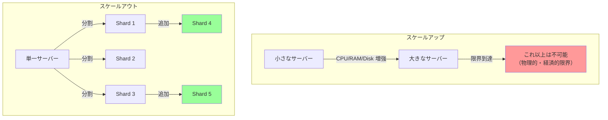

データの水平分割は、データベースの世界では**パーティショニング**や**シャーディング**と呼ばれる。この2つの用語は文脈によって異なる意味で使われることがあり、しばしば混乱を招く。本記事では、まずこれらの概念を明確に定義したうえで、シャーディングの設計戦略、運用上の課題、実装例、そして「シャーディングを避ける方法」までを包括的に解説する。

## 2. パーティショニングの種類

パーティショニングとは、大きなデータセットを複数の小さなパーツ（パーティション）に分割する技法の総称である。パーティショニングの方式は大きく3つに分類される。

### 2.1 水平パーティショニング（Horizontal Partitioning）

水平パーティショニングは、テーブルの**行**を基準にデータを分割する手法である。すべてのパーティションは同じスキーマ（カラム構成）を持ち、格納される行の範囲が異なる。

```
orders テーブル（全体）
┌────────┬────────────┬──────────┬─────────┐
│ id     │ customer_id│ amount   │ date    │
├────────┼────────────┼──────────┼─────────┤
│ 1      │ 100        │ 5,000    │ 2025-01 │
│ 2      │ 200        │ 12,000   │ 2025-03 │
│ 3      │ 100        │ 3,000    │ 2025-06 │
│ 4      │ 300        │ 8,000    │ 2025-09 │
│ 5      │ 200        │ 1,500    │ 2025-12 │
└────────┴────────────┴──────────┴─────────┘

↓ date で水平パーティショニング

Partition Q1 (2025-01〜03)     Partition Q2 (2025-04〜06)
┌────┬─────┬───────┬─────────┐  ┌────┬─────┬───────┬─────────┐
│ 1  │ 100 │ 5,000 │ 2025-01 │  │ 3  │ 100 │ 3,000 │ 2025-06 │
│ 2  │ 200 │12,000 │ 2025-03 │  └────┴─────┴───────┴─────────┘
└────┴─────┴───────┴─────────┘
Partition Q3 (2025-07〜09)     Partition Q4 (2025-10〜12)
┌────┬─────┬───────┬─────────┐  ┌────┬─────┬───────┬─────────┐
│ 4  │ 300 │ 8,000 │ 2025-09 │  │ 5  │ 200 │ 1,500 │ 2025-12 │
└────┴─────┴───────┴─────────┘  └────┴─────┴───────┴─────────┘
```

水平パーティショニングが単一サーバー内で行われる場合、一般に**パーティショニング**と呼ばれ、PostgreSQLの宣言的パーティショニングやMySQLのパーティショニングがこれに該当する。一方、パーティションが異なる物理サーバーに配置される場合を特に**シャーディング**と呼ぶことが多い。

> [!NOTE]
> 用語の使い分けは文献やプロダクトによって異なる。MongoDBでは「シャーディング」、CockroachDBでは「レンジパーティショニング」、Kafkaでは「パーティション」と呼ぶ。本記事では、物理的に異なるノードに分散させるケースを中心に「シャーディング」という用語を用いる。

### 2.2 垂直パーティショニング（Vertical Partitioning）

垂直パーティショニングは、テーブルの**カラム**を基準にデータを分割する手法である。正規化の延長として捉えることもできる。頻繁にアクセスされるカラムと、サイズが大きいがアクセス頻度の低いカラムを分離することで、I/O効率を向上させる。

```
users テーブル（分割前）
┌────────┬──────┬───────┬──────────────────┬──────────────┐
│ id     │ name │ email │ profile_image    │ preferences  │
│        │      │       │ (数MB)           │ (JSON, 数KB) │
├────────┼──────┼───────┼──────────────────┼──────────────┤
│ 1      │ 田中 │ t@... │ 0xFFD8FF...      │ {"theme":... │
│ 2      │ 鈴木 │ s@... │ 0x89504E...      │ {"lang":...  │
└────────┴──────┴───────┴──────────────────┴──────────────┘

↓ 垂直パーティショニング

users_core                     users_profile
┌────────┬──────┬───────┐      ┌────────┬──────────────────┬──────────────┐
│ id     │ name │ email │      │ id     │ profile_image    │ preferences  │
├────────┼──────┼───────┤      ├────────┼──────────────────┼──────────────┤
│ 1      │ 田中 │ t@... │      │ 1      │ 0xFFD8FF...      │ {"theme":... │
│ 2      │ 鈴木 │ s@... │      │ 2      │ 0x89504E...      │ {"lang":...  │
└────────┴──────┴───────┘      └────────┴──────────────────┴──────────────┘
```

垂直パーティショニングの利点は、頻繁にアクセスされる小さなデータがキャッシュに乗りやすくなることである。ユーザーの名前とメールアドレスを取得する際に、数MBのプロフィール画像を含むページをバッファプールに読み込む必要がなくなる。

### 2.3 機能的パーティショニング（Functional Partitioning）

機能的パーティショニングは、**ビジネスドメインや機能単位**でデータを異なるデータベースに分割する手法である。マイクロサービスアーキテクチャにおいて、各サービスが専用のデータベースを持つパターン（Database per Service）がこれに該当する。

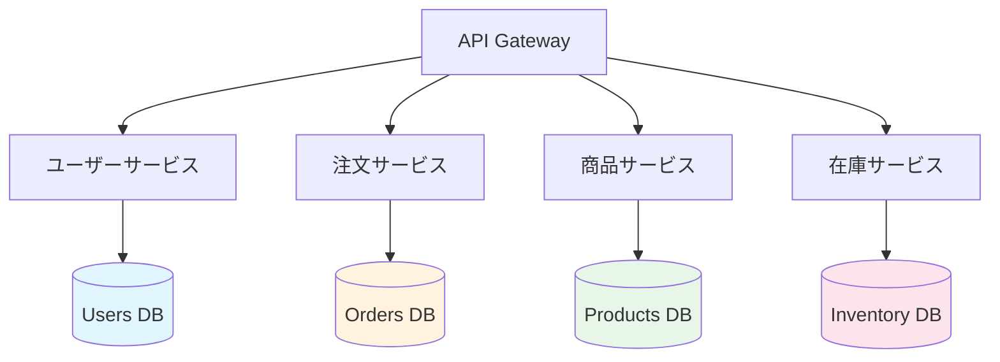

機能的パーティショニングは、サービス間の独立性を高め、各サービスが最適なデータベース技術を選択できるという利点がある。しかし、サービス間のデータ結合やトランザクションの管理が複雑になるという課題を伴う。

本記事では、以降は水平パーティショニング（シャーディング）に焦点を当てて解説を進める。

## 3. シャーディングキーの選択

シャーディングにおいて最も重要な設計決定が、**シャーディングキー（Shard Key）** の選択である。シャーディングキーは、各行がどのシャードに配置されるかを決定するカラム（または複数カラムの組み合わせ）であり、この選択がシステム全体の性能と運用性を大きく左右する。

### 3.1 シャーディングキーの理想的な特性

良いシャーディングキーは、以下の特性を備えている。

1. **高カーディナリティ**: シャーディングキーの取りうる値の種類が十分に多いこと。カーディナリティが低いと、データを細かく分散させることができない
2. **均等な分布**: データが各シャードに均等に分散されること。特定のシャードにデータが集中する（ホットスポット）と、そのシャードがボトルネックになる
3. **クエリとの整合性**: 頻出するクエリがシャーディングキーを条件に含んでいること。シャーディングキーが条件に含まれていないクエリは、すべてのシャードに問い合わせる必要がある（scatter-gather）
4. **書き込みパターンとの整合性**: 書き込みが特定のシャードに集中しないこと

### 3.2 シャーディングキーの具体例

マルチテナント型のSaaSアプリケーションを考えてみよう。テナント（顧客企業）ごとにデータが独立しており、テナント間でデータを結合するクエリはほぼ存在しない。この場合、`tenant_id` は理想的なシャーディングキーとなる。

```sql
-- tenant_id をシャーディングキーとした場合
-- このクエリは単一シャードで完結する
SELECT * FROM orders
WHERE tenant_id = 42 AND status = 'pending';

-- tenant_id を含まないクエリは全シャードに問い合わせが必要
SELECT * FROM orders
WHERE created_at > '2025-01-01';
```

一方、ソーシャルメディアアプリケーションで `user_id` をシャーディングキーにした場合を考えよう。一般ユーザーのデータ量は少ないが、インフルエンサーは数千万件のフォロワーデータを持つ。このようなケースでは、データの偏り（skew）が深刻な問題になる。

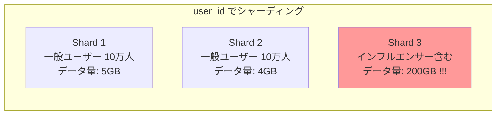

このようなホットスポット問題を避けるには、シャーディング戦略の選択が重要になる。

### 3.3 複合シャーディングキー

単一カラムでは良い分散が得られない場合、複数カラムを組み合わせた**複合シャーディングキー**を使用する。例えば、MongoDBではドキュメント内の任意のフィールドの組み合わせをシャードキーとして指定できる。

```javascript
// MongoDB: tenant_id と created_at の複合シャードキー
sh.shardCollection("mydb.events", { tenant_id: 1, created_at: 1 });
```

複合キーの先頭フィールドでデータの所属シャードが決まり、後続フィールドでシャード内のデータ順序が決まる。この設計により、同一テナントのデータは同一シャードに集約されつつ、時系列順にデータが配置される。

## 4. シャーディング戦略

シャーディングキーから具体的なシャードへのマッピング方法には、いくつかの代表的な戦略がある。

### 4.1 レンジシャーディング（Range-Based Sharding）

レンジシャーディングは、シャーディングキーの値の範囲（レンジ）によってデータを分割する方法である。

```
Shard 1: id     1 〜 1,000,000
Shard 2: id 1,000,001 〜 2,000,000
Shard 3: id 2,000,001 〜 3,000,000
```

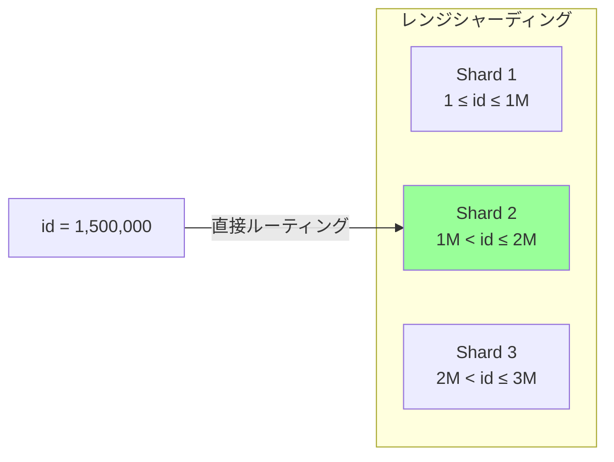

**利点:**

- 範囲クエリ（`WHERE id BETWEEN 1000 AND 2000`）が効率的。条件に該当するシャードのみにクエリを発行すれば良い
- シャード間のデータ移動がレンジの分割・統合で表現でき、直感的に理解しやすい
- データの局所性が保たれるため、時系列データなど連続アクセスパターンに適する

**欠点:**

- データが均等に分散しない可能性がある。新しいレコードは常に最新のレンジに挿入されるため、最後のシャードに書き込みが集中する（append-only ワークロードの問題）
- レンジの境界を適切に設定するのが難しい。データの増加パターンを事前に予測する必要がある

CockroachDBやGoogle Spannerは、レンジシャーディングを採用し、レンジの自動分割（Auto-splitting）機能でホットスポット問題を緩和している。シャードのデータ量やアクセス頻度が閾値を超えると、自動的にレンジを2つに分割し、必要に応じて別のノードに移動する。

### 4.2 ハッシュシャーディング（Hash-Based Sharding）

ハッシュシャーディングは、シャーディングキーのハッシュ値に基づいてシャードを決定する方法である。

$$
\text{shard}(key) = \text{hash}(key) \mod N
$$

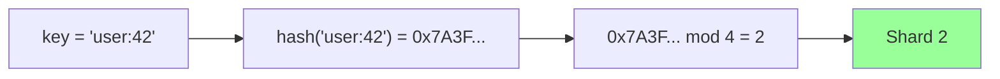

**利点:**

- データが均等に分散される。ハッシュ関数の一様分布特性により、ホットスポットが発生しにくい
- シャーディングキーの値のパターンに依存しないため、連番IDでも均等に分散できる

**欠点:**

- 範囲クエリが非効率になる。`WHERE id BETWEEN 1000 AND 2000` のようなクエリは、すべてのシャードに問い合わせる必要がある
- シャード数の変更時に大規模なデータ移動が発生する（前述のmod N問題）。これを緩和するためにConsistent Hashingが用いられる

MongoDBのハッシュシャーディングは、この方式を採用している。

```javascript
// MongoDB: ハッシュベースのシャーディング
sh.shardCollection("mydb.users", { user_id: "hashed" });
```

### 4.3 ディレクトリシャーディング（Directory-Based Sharding）

ディレクトリシャーディングは、シャーディングキーとシャードの対応関係を**ルックアップテーブル（ディレクトリ）** に保存し、このテーブルを参照してルーティングを行う方法である。

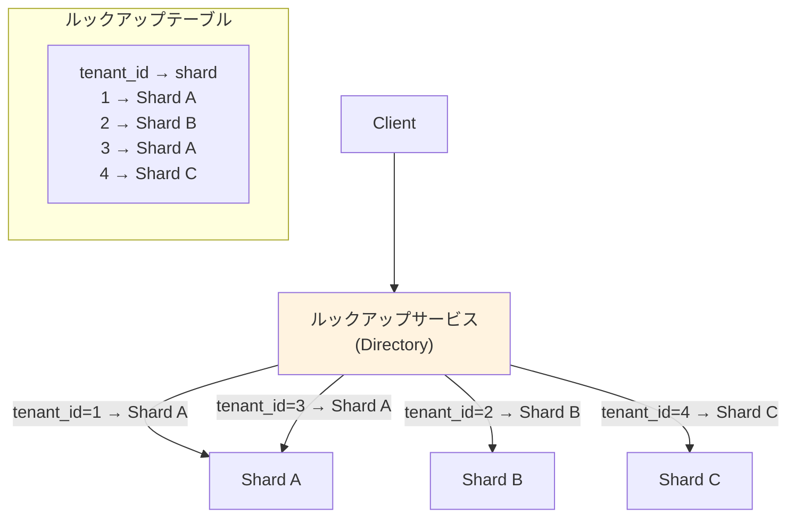

**利点:**

- シャード配置を完全に柔軟に制御できる。特定のテナントを特定のシャードに固定したり、大規模テナントを専用シャードに移動したりすることが容易
- リシャーディング時にルックアップテーブルを更新するだけで、アプリケーションの変更が不要

**欠点:**

- ルックアップテーブル自体が単一障害点・ボトルネックになりうる。すべてのクエリの前にディレクトリを参照する必要があるため、ディレクトリの可用性と性能が全体に影響する
- ルックアップテーブルのキャッシュとキャッシュの無効化が必要になり、整合性の管理が複雑化する

### 4.4 ジオシャーディング（Geo-Based Sharding）

ジオシャーディングは、地理的な位置情報に基づいてデータを分割する方法である。GDPR（EU一般データ保護規則）などのデータローカライゼーション規制への対応や、レイテンシの最適化を目的として使用される。

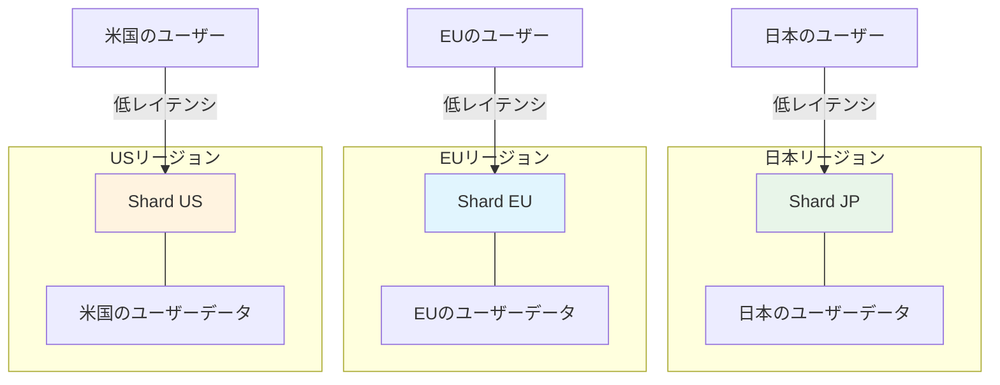

CockroachDBやYugabyteDBは、テーブルのリージョン設定やパーティションのリージョンピニング機能を提供しており、特定の行を特定の地理的リージョンに固定できる。

```sql
-- CockroachDB: リージョンベースのテーブル設定
ALTER TABLE users SET LOCALITY REGIONAL BY ROW;

-- リージョンカラムに基づいてデータが配置される
INSERT INTO users (id, name, region) VALUES (1, '田中', 'ap-northeast-1');
```

### 4.5 各戦略の比較

| 戦略 | 範囲クエリ | データ均等性 | 柔軟性 | 実装の複雑さ |
|------|-----------|------------|--------|------------|
| レンジ | 優秀 | 偏りやすい | 中 | 低 |
| ハッシュ | 不可 | 優秀 | 低 | 低 |
| ディレクトリ | キー次第 | 制御可能 | 高 | 高 |
| ジオ | リージョン内 | 地域次第 | 高 | 高 |

## 5. リシャーディング — データ移行の課題

シャーディングされたシステムにおいて、最も運用コストが高い作業が**リシャーディング（Resharding）** である。データ量の増加、アクセスパターンの変化、シャード間のデータ偏りの是正などの理由で、シャードの追加・統合・再分割が必要になる。

### 5.1 リシャーディングが必要になる場面

- **データ量の増大**: 特定のシャードのディスク容量が逼迫した場合
- **ホットスポットの発生**: 特定のシャードにアクセスが集中し、レイテンシが悪化した場合
- **シャードの追加**: キャパシティ増強のために新しいシャードを追加する場合
- **シャードの統合**: コスト削減のために利用率の低いシャードを統合する場合

### 5.2 リシャーディングの難しさ

リシャーディングは「データの移動」だけではない。以下のような課題が同時に発生する。

1. **ダウンタイムの回避**: データ移行中もシステムは稼働し続ける必要がある。移行中のデータに対する読み書きをどう処理するかが問題になる
2. **整合性の保証**: 移行元と移行先で二重書き込みが発生したり、移行中に書き込まれたデータが欠落したりしないようにする必要がある
3. **ルーティングの切り替え**: クライアントやルーティング層が参照するシャードマッピングを、データ移行の完了に合わせてアトミックに切り替える必要がある
4. **ロールバック**: 移行に問題が発生した場合、元の状態に戻せる必要がある

### 5.3 リシャーディングのアプローチ

#### ダブルライト方式

移行期間中、書き込みを旧シャードと新シャードの両方に行い、段階的に読み取りを新シャードに切り替える方式である。

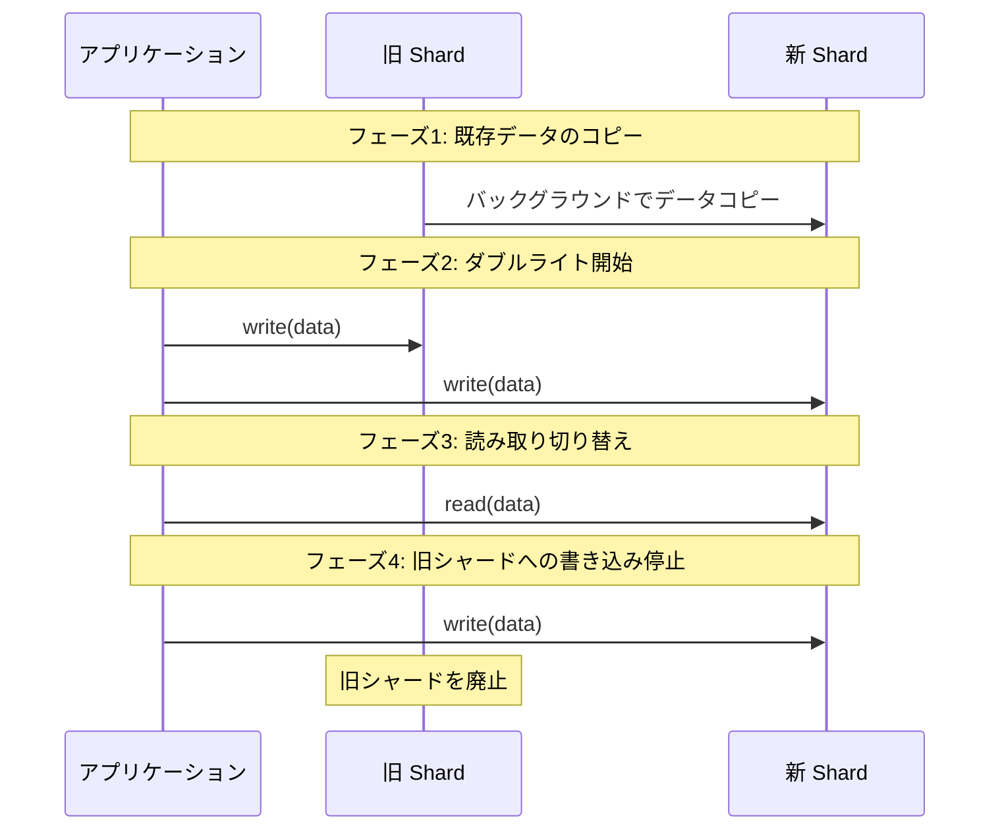

この方式は整合性を保ちやすいが、移行期間中の書き込み負荷が2倍になるという欠点がある。

#### Consistent Hashingを活用したリシャーディング

ハッシュシャーディングでConsistent Hashingを使用している場合、ノードの追加・削除時に移動が必要なデータ量を最小限に抑えることができる。ノードの追加時には、ハッシュリング上で新ノードが担当する範囲のデータのみを既存ノードから移動すれば良い。Consistent Hashingの詳細は、本サイトの[Consistent Hashing](/consistent-hashing)の記事を参照してほしい。

#### 自動リシャーディング

CockroachDBやTiDBなどの分散データベースは、レンジの自動分割と移動機能を備えている。特定のレンジのデータ量やアクセス頻度が閾値を超えると、システムが自動的にレンジを分割し、負荷が低いノードに再配置する。

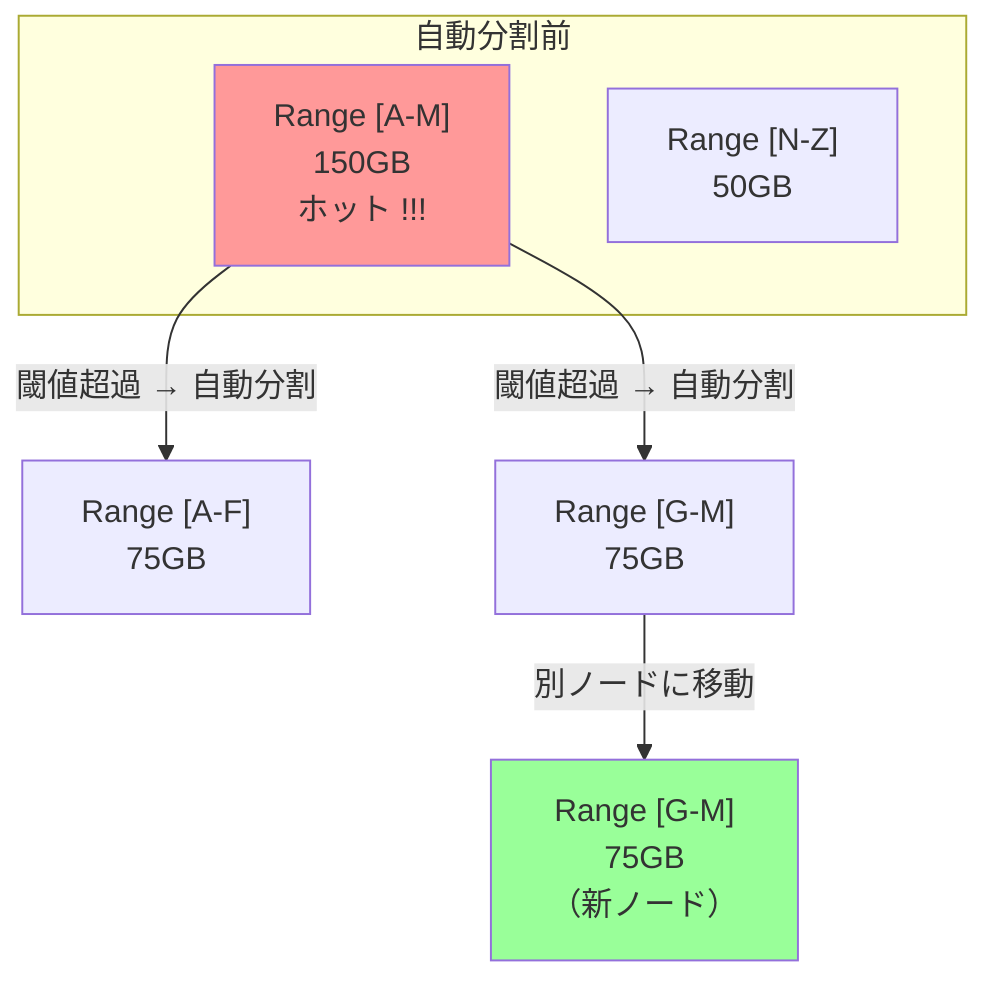

この自動化は運用負荷を大幅に軽減するが、自動分割・移動のタイミングやリソース消費を制御するためのチューニングが必要になる。

## 6. クロスシャードクエリとジョイン

シャーディングの最大の課題のひとつが、複数のシャードにまたがるクエリの処理である。

### 6.1 単一シャードクエリ vs クロスシャードクエリ

シャーディングキーを条件に含むクエリは、単一のシャードで完結できる。しかし、シャーディングキーを含まないクエリは、すべてのシャードに問い合わせる**scatter-gather**方式が必要になる。

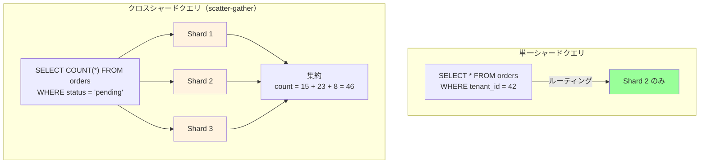

scatter-gather は、シャード数が少ないうちは許容可能だが、シャード数が増えると深刻なレイテンシ問題を引き起こす。各シャードへの問い合わせは並列に行えるが、最も遅いシャードのレスポンス時間がクエリ全体のレイテンシを決定する（テールレイテンシ問題）。

### 6.2 クロスシャードジョイン

異なるシャーディングキーを持つテーブル間のジョインは、シャーディング環境において最も困難な操作の一つである。

例えば、`orders` テーブルが `tenant_id` でシャーディングされ、`products` テーブルが `product_id` でシャーディングされている場合、`orders JOIN products` は以下のいずれかの方法で処理する必要がある。

**1. Broadcast Join**: 小さいテーブル（`products`）の全データを各シャードに送信し、各シャードでローカルにジョインする。

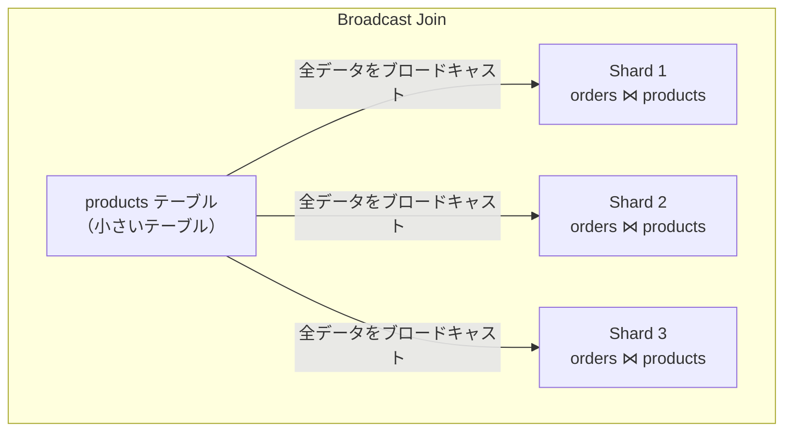

**2. Repartition Join**: 両テーブルのデータをジョインキーで再パーティショニングし、同じキーのデータが同じノードに集まるようにしてからジョインする。

**3. アプリケーションレベルのジョイン**: データベースレベルではジョインを行わず、アプリケーション側で複数のクエリを発行し、メモリ上でデータを結合する。

いずれの方式もネットワーク転送量の増大とレイテンシの悪化を伴うため、シャーディング設計時にはジョインの必要性を最小化するデータモデリングが重要になる。**同じシャーディングキーでシャーディングされたテーブル同士のジョイン**であれば、各シャード内でローカルに処理できる。これを**コロケーション（Co-location）** と呼ぶ。

```sql
-- orders と order_items が共に tenant_id でシャーディングされている場合
-- このジョインはシャード内で完結する（コロケーション）
SELECT o.id, oi.product_name, oi.quantity
FROM orders o
JOIN order_items oi ON o.id = oi.order_id AND o.tenant_id = oi.tenant_id
WHERE o.tenant_id = 42;
```

Citus（PostgreSQL拡張）やVitessは、コロケーションを設計上の中核概念として位置づけており、関連するテーブルを同じシャーディングキーで分散させることを推奨している。

### 6.3 クロスシャードトランザクション

複数のシャードにまたがるトランザクション（分散トランザクション）は、2フェーズコミット（2PC）プロトコルによって実現されることが多い。しかし、2PCはコーディネーターノードの障害によるブロッキングリスクやレイテンシの増大といった課題を伴う。

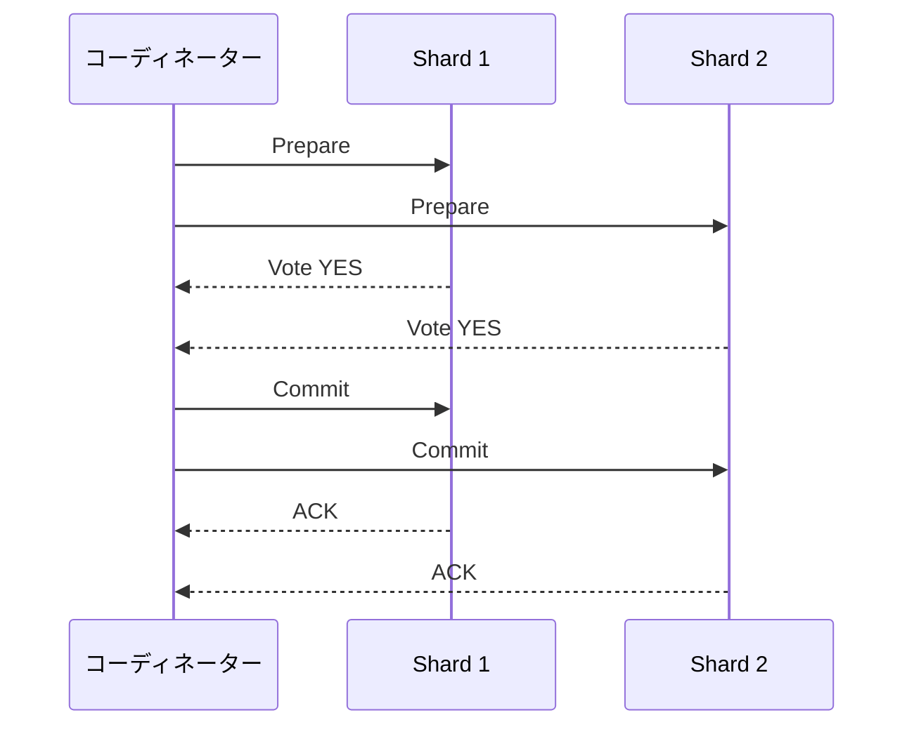

Google Spannerは、TrueTime（原子時計とGPSに基づく高精度時刻同期）を利用して、外部整合性を持つ分散トランザクションを実現している。CockroachDBは、HLC（Hybrid Logical Clock）を使用して同様の保証を提供する。これらの詳細は[分散トランザクション](/distributed-transactions)の記事を参照してほしい。

現実的には、クロスシャードトランザクションの使用を最小化するデータモデリングが最も効果的な戦略である。

## 7. セカンダリインデックスの扱い

シャーディング環境におけるセカンダリインデックスの管理は、設計上の重要な判断点である。シャーディングキー以外のカラムに対する効率的な検索をどう実現するかという問題に対して、2つの主要なアプローチがある。

### 7.1 ローカルインデックス（Local Secondary Index）

ローカルインデックスは、各シャードが自身のデータに対してのみインデックスを構築する方式である。各シャードのインデックスには、そのシャードに存在するデータの情報のみが含まれる。

```
Shard 1                         Shard 2
┌──────────────────────┐        ┌──────────────────────┐
│ データ:               │        │ データ:               │
│  id=1, status=pending │        │  id=3, status=pending │
│  id=2, status=shipped │        │  id=4, status=shipped │
│                      │        │  id=5, status=pending │
│ ローカルインデックス:   │        │ ローカルインデックス:   │
│  status=pending → {1} │        │  status=pending → {3,5}│
│  status=shipped → {2} │        │  status=shipped → {4}  │
└──────────────────────┘        └──────────────────────┘
```

**利点:**

- 書き込み時のインデックス更新がシャード内で完結するため、分散トランザクションが不要
- インデックスのメンテナンスが簡単

**欠点:**

- セカンダリインデックスを使った検索はすべてのシャードに問い合わせる必要がある（scatter-gather）
- シャード数が増えるとセカンダリインデックス検索の性能が劣化する

### 7.2 グローバルインデックス（Global Secondary Index）

グローバルインデックスは、全シャードのデータを横断するインデックスを構築する方式である。インデックス自体もシャーディングされることが多い（ただし、元データとは異なるキーで分散される）。

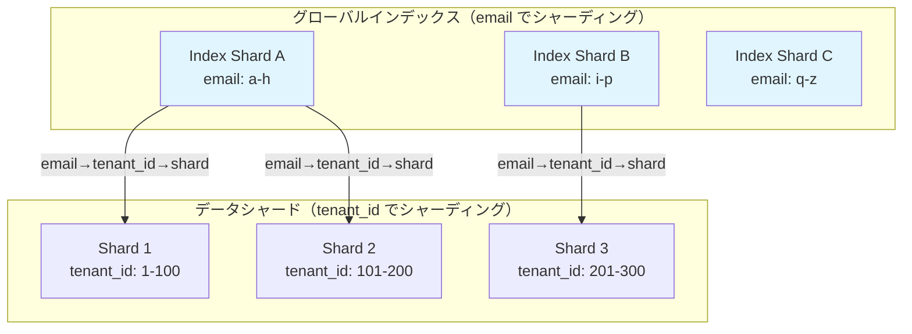

**利点:**

- セカンダリインデックスを使った検索が高速。インデックスシャードを1つ参照し、得られたシャーディングキーで元データのシャードにアクセスすれば良い
- シャード数が増えてもセカンダリインデックスの検索性能が劣化しにくい

**欠点:**

- 書き込み時に、データシャードとインデックスシャードの両方を更新する必要がある。これは分散トランザクションまたは非同期更新を要求する
- 非同期更新の場合、インデックスが一時的に古いデータを参照する可能性がある（結果整合性）

### 7.3 各データベースの対応

| データベース | ローカルインデックス | グローバルインデックス |
|-------------|-------------------|---------------------|
| MongoDB | 標準サポート | 制限付き（ユニークインデックスのみ） |
| Citus | 標準サポート | Reference Table による疑似対応 |
| CockroachDB | 標準サポート | 標準サポート |
| Vitess | 標準サポート | VIndex として実装 |
| DynamoDB | 標準サポート（LSI） | 標準サポート（GSI、結果整合性） |

DynamoDBのGSI（Global Secondary Index）は、非同期レプリケーションによる結果整合性モデルを採用しており、書き込み直後のGSI経由の読み取りで最新のデータが返されない可能性があることを理解しておく必要がある。

## 8. 実装例

### 8.1 Vitess

Vitessは、YouTubeがMySQLのスケーリング問題を解決するために開発したミドルウェアであり、現在はCNCFの卒業プロジェクトとして広く利用されている。

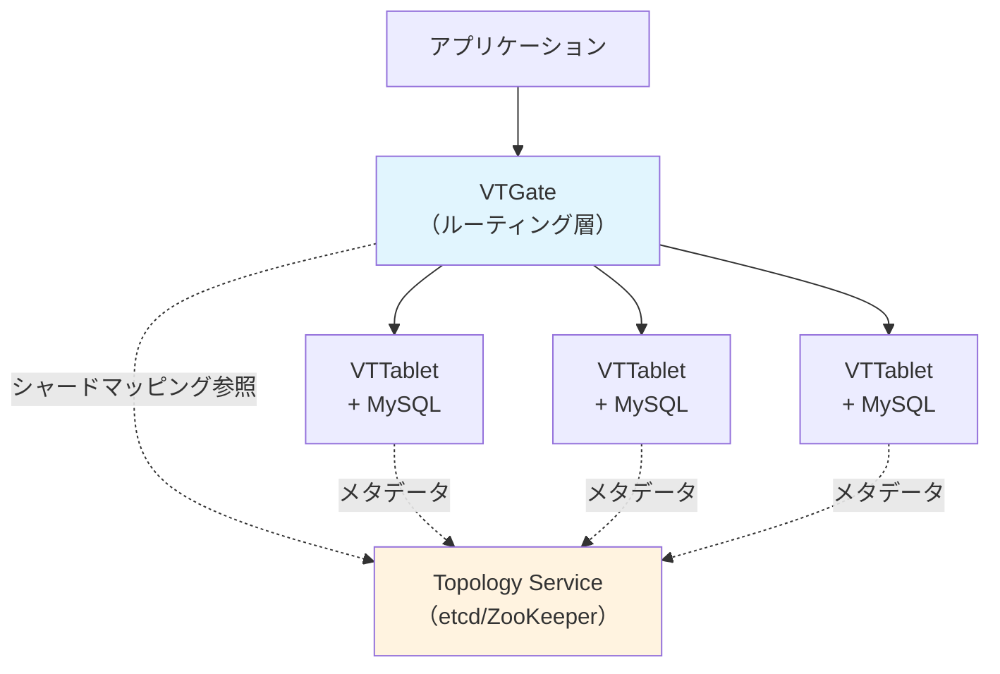

Vitessの主要な概念は以下の通りである。

- **Keyspace**: 論理的なデータベースに相当する。1つのKeyspaceが複数のシャードに分割される
- **VSchema**: シャーディングキー（Primary Vindex）やセカンダリルックアップ（Secondary Vindex）の定義。クエリルーティングに使用される
- **VTGate**: アプリケーションからのクエリを受け取り、適切なシャードにルーティングするプロキシ層
- **VTTablet**: 各MySQLインスタンスの前に配置されるエージェント。接続プーリングやクエリのリライトを行う

Vitessの強みは、既存のMySQLアプリケーションに対して最小限の変更でシャーディングを導入できる点にある。VTGateがMySQLプロトコルを話すため、アプリケーションからはMySQLに接続しているように見える。

### 8.2 Citus（PostgreSQL拡張）

Citusは、PostgreSQLを分散データベースに拡張するエクステンションであり、2019年にMicrosoftに買収された後、Azure Database for PostgreSQLの一部として提供されている。

Citusの特徴的な概念は以下の通りである。

- **Distributed Table**: シャーディングキーで分散されたテーブル。各シャードは通常のPostgreSQLテーブルとしてワーカーノードに配置される
- **Reference Table**: 全ワーカーノードにレプリケーションされる小さなテーブル。マスタデータや設定テーブルに適する。Distributed Tableとの効率的なジョインが可能
- **コロケーション**: 同じシャーディングキーを持つDistributed Table同士を同一シャードに配置し、ローカルジョインを可能にする

```sql
-- Citus: テーブルの分散設定
SELECT create_distributed_table('orders', 'tenant_id');
SELECT create_distributed_table('order_items', 'tenant_id',
  colocate_with => 'orders');
SELECT create_reference_table('products');
```

### 8.3 MongoDB

MongoDBは、バージョン2.0以降シャーディングを標準機能として提供しており、最も広く使われているシャーディング実装の一つである。

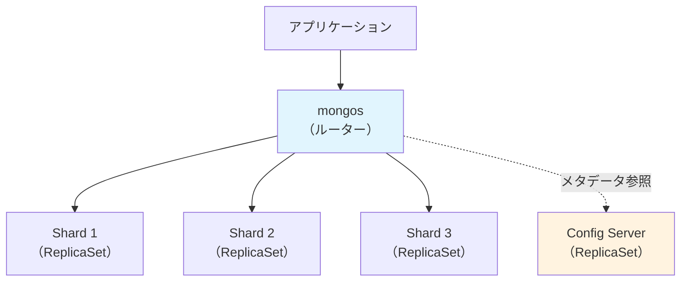

MongoDBのシャーディングは以下の構成要素からなる。

- **mongos**: クエリルーターとして機能し、シャードキーに基づいてクエリを適切なシャードに振り分ける
- **Config Server**: シャードのメタデータ（チャンクの分布、シャードキーの範囲）を保持するReplicaSet
- **Shard**: 実際のデータを格納するReplicaSet。各シャードは独立したReplicaSetとして構成され、可用性が確保される

MongoDBは、レンジシャーディングとハッシュシャーディングの両方をサポートしており、ゾーンシャーディング（特定のデータを特定のシャードに固定する機能）も提供している。

MongoDBのバランサーは、チャンク（データの分割単位）のシャード間の偏りを自動的に検出し、バックグラウンドでチャンクの移動を行う。ただし、シャードキーは一度設定すると変更が非常に困難（事実上、コレクションの再作成が必要）であるため、初期設計が極めて重要である。

### 8.4 CockroachDB

CockroachDBは、Google Spannerにインスパイアされた分散SQLデータベースであり、自動シャーディング（レンジパーティショニング）と分散トランザクションを標準機能として提供している。

CockroachDBの特徴は以下の通りである。

- **自動レンジ分割**: テーブルのデータは64MB（デフォルト）のレンジに自動分割され、ノード間に分散される。アプリケーションがシャーディングキーを意識する必要がない
- **Raftによるレプリケーション**: 各レンジはRaftグループとしてレプリケーションされ、ノード障害時に自動的にリーダー選出が行われる
- **分散トランザクション**: HLC（Hybrid Logical Clock）を用いたSerializable分離レベルの分散トランザクションを標準で提供する
- **ローカリティ設定**: テーブルやインデックスのデータを特定のリージョンに固定する機能を提供する

```sql
-- CockroachDB: 自動でレンジ分割される
CREATE TABLE orders (
    id UUID PRIMARY KEY DEFAULT gen_random_uuid(),
    tenant_id INT NOT NULL,
    amount DECIMAL NOT NULL,
    created_at TIMESTAMP DEFAULT now()
);

-- ホットスポットを避けるためのハッシュシャードインデックス
CREATE INDEX idx_orders_tenant
ON orders (tenant_id) USING HASH WITH (bucket_count = 8);
```

CockroachDBの利点は、アプリケーション開発者がシャーディングの詳細を意識せずに、通常のSQLを使ってアプリケーションを開発できる点にある。分散の複雑さはデータベースエンジンが吸収する。

## 9. シャーディングの運用課題

### 9.1 バックアップとリストア

シャーディングされたシステムのバックアップは、単一データベースと比較して大幅に複雑化する。各シャードを個別にバックアップすることは可能だが、シャード間のデータの整合性を保った状態でバックアップを取得するには、特別な調整が必要になる。

具体的な課題は以下の通りである。

- **Point-in-Time Recovery（PITR）**: すべてのシャードを同一時点の状態に復元するには、各シャードのWAL（Write-Ahead Log）の同期ポイントを特定する必要がある
- **バックアップウィンドウ**: シャード数が増えるとバックアップにかかる時間も増大する。バックアップウィンドウを短縮するには、スナップショット技術やインクリメンタルバックアップの活用が不可欠になる
- **テスト環境の構築**: シャーディングされた本番環境を忠実に再現するテスト環境の構築は、コストと複雑さの両面で課題がある

### 9.2 スキーマ変更

シャーディングされたシステムでのスキーマ変更（ALTER TABLE）は、すべてのシャードに対して一貫して適用する必要がある。

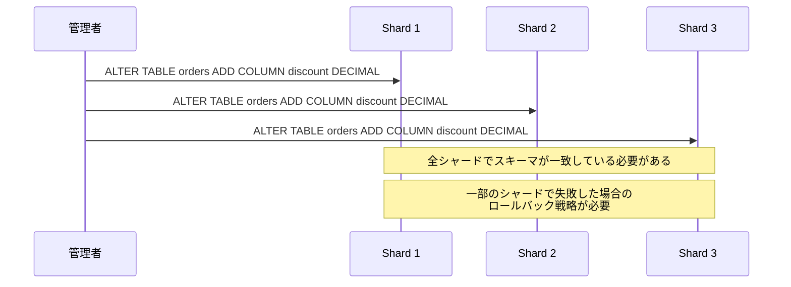

Vitessは、スキーマ変更をオーケストレーションする`vtctl ApplySchema`コマンドを提供しており、各シャードへの変更を順次適用し、失敗時のロールバックも管理する。CockroachDBやTiDBなどの分散SQLデータベースは、DDLの分散実行を内部的に処理するため、アプリケーションからは通常のALTER TABLEとして実行できる。

### 9.3 モニタリング

シャーディングされたシステムのモニタリングでは、個別シャードのメトリクスに加えて、シャード間の偏りを可視化することが重要である。

主要な監視項目は以下の通りである。

- **シャード間のデータ量の偏り**: 各シャードのディスク使用量、行数の比較
- **シャード間のクエリ負荷の偏り**: 各シャードのQPS（Queries Per Second）、レイテンシの比較
- **クロスシャードクエリの割合**: scatter-gatherクエリの比率が高い場合、シャーディングキーの見直しが必要かもしれない
- **リバランス操作の頻度と影響**: 自動リバランスによるネットワーク転送量やI/O負荷

### 9.4 テスト

シャーディングされたシステムのテストは、以下の点で追加の考慮が必要になる。

- **シャード境界のテスト**: レンジシャーディングの場合、レンジの境界値付近のデータが正しく処理されるかの検証
- **クロスシャードクエリの正当性**: scatter-gatherの結果がシャーディングなしの場合と一致するかの検証
- **障害テスト**: 特定のシャードが利用不可になった場合のシステムの挙動（部分的な可用性 vs 全面停止）
- **リシャーディングの検証**: データ移行中の読み書きの整合性テスト

## 10. シャーディングを避ける方法

シャーディングは強力なスケーリング手法であるが、設計・実装・運用のすべての面で大きなコストを伴う。シャーディングの導入は「最後の手段」と位置づけ、その前に以下の方法でスケーリング問題を解決できないか検討すべきである。

### 10.1 垂直スケーリングの再検討

現代のハードウェアの性能は目覚ましく向上している。AWS の `x2idn.metal` インスタンスは128 vCPU、2TB RAM、ローカルNVMeストレージを提供する。多くのワークロードでは、この規模のハードウェアで数TB〜数十TBのデータを単一ノードで処理できる。

シャーディングの導入を検討する前に、「現在のハードウェアは本当に限界に達しているのか？」を改めて確認すべきである。

### 10.2 リードレプリカ

読み取り負荷が主なボトルネックである場合、リードレプリカの追加が有効である。プライマリノードに書き込みを集中させ、複数のリードレプリカに読み取り負荷を分散させる。この方式は、読み取りが書き込みを大幅に上回るワークロード（例：Eコマースの商品閲覧）に特に効果的である。

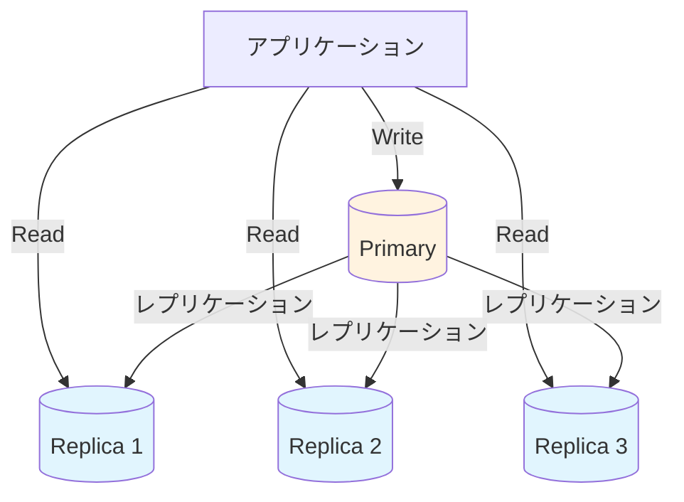

ただし、レプリケーションラグによる結果整合性を許容できないワークロード（例：金融取引直後の残高確認）では、プライマリからの読み取りが必要になる。

### 10.3 キャッシング

頻繁にアクセスされるデータをRedisやMemcachedなどのインメモリキャッシュに格納することで、データベースへのクエリ数を大幅に削減できる。キャッシュパターン（Cache-Aside, Write-Through, Write-Behind）の詳細は、本サイトの[キャッシュパターン](/caching-patterns)の記事を参照してほしい。

### 10.4 データのアーカイブ

古いデータや不要なデータをアーカイブテーブルやオブジェクトストレージに移動することで、アクティブなデータセットのサイズを削減できる。例えば、3年以上前の注文データをS3に移動し、データベースには直近3年分のデータのみを保持するといった戦略が考えられる。

### 10.5 クエリとインデックスの最適化

シャーディングを検討する前に、以下のような基本的な最適化が十分に行われているか確認する。

- **クエリの最適化**: EXPLAIN/EXPLAIN ANALYZEを使ったクエリプランの分析と改善
- **インデックスの見直し**: 不足しているインデックスの追加、不要なインデックスの削除
- **バッチ処理の改善**: N+1クエリの解消、バルクインサートの活用
- **接続プーリング**: PgBouncerやProxySQLによる接続管理の最適化

### 10.5 機能的パーティショニング

前述の機能的パーティショニング（Database per Service）は、シャーディングよりもシンプルな形でデータの分散を実現できる場合がある。マイクロサービスアーキテクチャへの移行が進んでいる場合、各サービスのデータベースを独立させることで、各データベースの負荷を自然に分散させることができる。

### 10.6 NewSQLの活用

CockroachDBやTiDBなどのNewSQLデータベースは、シャーディングの複雑さをデータベースエンジン内部で吸収し、アプリケーションには通常のSQLインターフェースを提供する。これらのデータベースを採用することで、手動シャーディングの運用コストを回避しつつ、水平スケーリングの恩恵を受けられる可能性がある。

ただし、NewSQLデータベースにも固有のトレードオフがある。単一ノードの性能は従来のRDBMSに劣る場合があり、レイテンシもノード間通信のオーバーヘッドにより増大する傾向がある。

## 11. まとめ

シャーディングとパーティショニングは、データベースのスケーラビリティを実現するための中核的な技術である。本記事で解説した内容を振り返ると、以下の要点が浮かび上がる。

**シャーディングキーの選択が最も重要な設計判断である。** シャーディングキーは、データの分散、クエリの効率、ジョインの可否、トランザクションの範囲のすべてに影響する。後から変更することが極めて困難であるため、アクセスパターンを十分に分析したうえで慎重に決定する必要がある。

**シャーディングはトレードオフの集合体である。** 水平スケーラビリティを得る代わりに、クロスシャードクエリの複雑化、分散トランザクションのコスト、運用の困難さを引き受けることになる。このトレードオフを理解せずにシャーディングを導入すると、解決するよりも多くの問題を生み出す。

**可能な限りシャーディングを避ける、あるいは遅らせる。** 垂直スケーリング、リードレプリカ、キャッシング、データアーカイブ、クエリ最適化といった手段で対処できるうちは、それらを優先すべきである。シャーディングは「銀の弾丸」ではなく、システムの複雑さを大幅に増大させる設計判断である。

**自動シャーディングの進化に注目する。** CockroachDB、TiDB、YugabyteDBなどのNewSQLデータベースは、手動シャーディングの多くの課題を自動化しつつある。これらのデータベースが成熟するにつれ、アプリケーション開発者がシャーディングの詳細を意識する必要性は減少していくだろう。しかし、分散データベースの挙動を理解し、適切なデータモデリングを行うためには、シャーディングの基本原理を深く理解しておくことが不可欠である。
