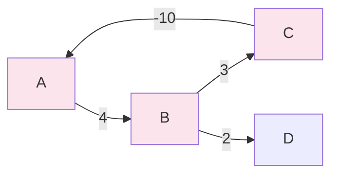
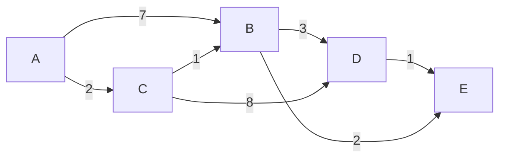
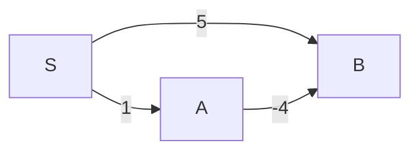
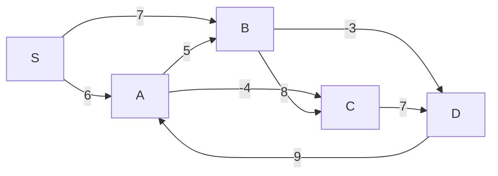
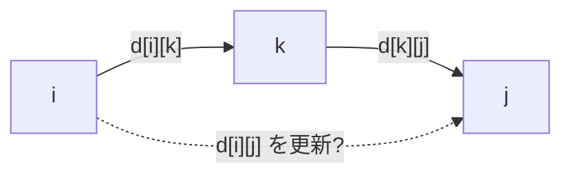
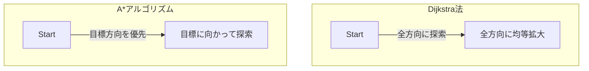
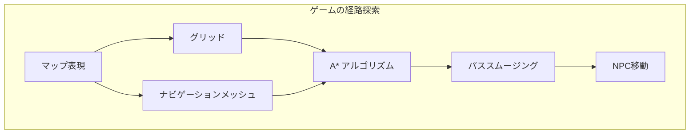

# 最短経路アルゴリズム — Dijkstra法からA\*、高速化手法まで

## 1. 最短経路問題とは何か

### 1.1 問題の定義

最短経路問題（shortest path problem）は、重み付きグラフにおいて、ある頂点から別の頂点へ至る経路のうち、辺の重みの総和が最小となる経路を求める問題である。形式的には、グラフ $G = (V, E)$ と重み関数 $w: E \to \mathbb{R}$ が与えられたとき、頂点 $s$ から頂点 $t$ への経路 $p = (v_0, v_1, \ldots, v_k)$（ただし $v_0 = s$, $v_k = t$）の重みを以下のように定義する。

$$
w(p) = \sum_{i=1}^{k} w(v_{i-1}, v_i)
$$

最短経路とは、$s$ から $t$ への全経路の中で $w(p)$ を最小にする経路のことである。その重みの値を **最短距離（shortest distance）** と呼び、$\delta(s, t)$ と表記する。$s$ から $t$ への経路が存在しない場合は $\delta(s, t) = \infty$ と定める。

最短経路問題は、カーナビゲーションの経路案内、ネットワークルーティング、物流の配送最適化、ゲームの AI など、日常的に触れる多くのシステムの基盤となっている。

### 1.2 問題の分類

最短経路問題は、求める対象によって以下の4種類に分類される。

| 問題の種類 | 英語名 | 内容 |
|-----------|--------|------|
| 単一始点最短経路 | Single-Source Shortest Path (SSSP) | 1つの始点から全頂点への最短距離 |
| 単一終点最短経路 | Single-Destination Shortest Path | 全頂点から1つの終点への最短距離 |
| 単一対最短経路 | Single-Pair Shortest Path | 特定の始点・終点間の最短距離 |
| 全対最短経路 | All-Pairs Shortest Path (APSP) | 全頂点対間の最短距離 |

単一終点最短経路は、辺の向きを逆にすれば単一始点最短経路に帰着できる。単一対最短経路は、最悪の場合には単一始点最短経路と同等の計算量が必要である（ただし A\* のようなヒューリスティック手法で高速化できる場合がある）。

### 1.3 負の辺と負閉路

重み付きグラフにおいて、辺の重みが負になる場合がある。たとえば、為替取引において通貨の交換レートの対数を辺の重みとすると、利益を生む交換は負の重みとなる。

**負閉路（negative cycle）** とは、閉路を構成する辺の重みの総和が負になる閉路のことである。負閉路が始点から到達可能な場合、その閉路を何度も回ることで経路の重みをいくらでも小さくできるため、最短経路は定義されない（$\delta(s, t) = -\infty$）。



上の例では、$A \to B \to C \to A$ の閉路の重みは $4 + 3 + (-10) = -3 < 0$ であり、負閉路が存在する。

### 1.4 最短経路の最適部分構造

最短経路問題には **最適部分構造（optimal substructure）** という重要な性質がある。すなわち、最短経路の部分経路もまた最短経路である。

**定理**: 頂点 $s$ から頂点 $t$ への最短経路 $p$ が頂点 $v$ を経由する場合（$p = s \leadsto v \leadsto t$）、$s$ から $v$ の部分経路は $s$ から $v$ への最短経路であり、$v$ から $t$ の部分経路は $v$ から $t$ への最短経路である。

この性質は背理法で証明できる。もし $s$ から $v$ の部分経路がより短い経路に置き換え可能であれば、$p$ 全体もより短くなり、$p$ が最短経路であるという仮定に矛盾するからである。

この最適部分構造により、動的計画法や貪欲法に基づくアルゴリズムが正しく動作することが保証される。

### 1.5 緩和操作

多くの最短経路アルゴリズムの核となるのが **緩和（relaxation）** 操作である。各頂点 $v$ に対して暫定的な最短距離 $d[v]$ を保持し、辺 $(u, v)$ を用いてより短い経路が見つかった場合に $d[v]$ を更新する。

$$
\text{RELAX}(u, v, w): \quad \text{if } d[v] > d[u] + w(u, v) \text{ then } d[v] \leftarrow d[u] + w(u, v)
$$

```python
def relax(u, v, weight, dist, prev):
    """
    Relax edge (u, v) with given weight.
    Updates dist[v] and prev[v] if a shorter path is found.
    """
    if dist[u] + weight < dist[v]:
        dist[v] = dist[u] + weight
        prev[v] = u
        return True
    return False
```

すべての最短経路アルゴリズムは、辺をどの順序で緩和するかが異なるだけであり、最終的にすべての辺が十分に緩和された時点で正しい最短距離が得られる。

## 2. 重みなしグラフの最短経路 — BFS

### 2.1 BFS による最短経路

すべての辺の重みが1（または等しい）であるグラフでは、BFS（Breadth-First Search）がそのまま最短経路アルゴリズムとして機能する。BFS は始点に近い頂点から順に探索するため、各頂点に到達した時点での距離が最短距離に等しい。

```python
from collections import deque

def bfs_shortest_path(graph, start, n):
    """
    Find shortest paths from start in an unweighted graph.
    graph[u] is a list of neighbors of u.
    Returns (dist, prev) where dist[v] is the shortest distance
    and prev[v] is the predecessor on the shortest path.
    """
    INF = float('inf')
    dist = [INF] * n
    prev = [-1] * n
    dist[start] = 0
    queue = deque([start])

    while queue:
        u = queue.popleft()
        for v in graph[u]:
            if dist[v] == INF:
                dist[v] = dist[u] + 1
                prev[v] = u
                queue.append(v)

    return dist, prev
```

計算量は $O(|V| + |E|)$ であり、これが最短経路を求めるために必要な最小の計算量（各頂点と各辺を少なくとも1回は調べる必要がある）にほぼ等しいことから、重みなしグラフに対しては BFS が最適である。

### 2.2 BFS が最適である理由

BFS の正当性は、キューに格納される頂点の距離の **単調性** に基づく。キュー内の頂点の距離は常に $d$ または $d+1$ のいずれかであり（$d$ は現在処理中の最小距離）、距離が小さい頂点から先に処理されることが保証される。したがって、各頂点が初めてキューから取り出された時点の距離が最短距離に等しい。

## 3. Dijkstra法

### 3.1 アルゴリズムの着想

Dijkstra法（ダイクストラ法）は、1959年にEdsger W. Dijkstraによって発表された、**非負重みグラフ** における単一始点最短経路アルゴリズムである。BFS が「距離1ずつ層を広げる」のに対し、Dijkstra法は「最短距離が確定した頂点に隣接する頂点の中で、暫定距離が最小のものを次に確定する」という貪欲法の戦略をとる。

このアルゴリズムの核心的なアイデアは以下の通りである。

1. 始点の距離を0、他の全頂点の距離を $\infty$ に初期化する
2. 未確定の頂点のうち、暫定距離が最小の頂点 $u$ を選ぶ
3. $u$ の距離を確定し、$u$ から出る全辺に対して緩和操作を行う
4. すべての頂点の距離が確定するまで2-3を繰り返す

### 3.2 正当性の証明

Dijkstra法の正当性は、以下の不変条件（invariant）によって保証される。

**不変条件**: 距離が確定した頂点集合 $S$ の各頂点 $v$ について、$d[v] = \delta(s, v)$（真の最短距離）が成り立つ。

**証明のスケッチ**: 帰納法による。ある頂点 $u$ が $S$ に追加される際、$d[u] > \delta(s, u)$ であると仮定して矛盾を導く。もし $d[u]$ が真の最短距離でないなら、始点 $s$ から $u$ へのより短い真の最短経路 $p$ が存在する。この経路 $p$ 上で、最初に $S$ の外に出る辺 $(x, y)$（$x \in S$, $y \notin S$）を考える。$x$ は既に確定済みなので $d[x] = \delta(s, x)$ であり、$y$ は $x$ からの緩和で $d[y] \le d[x] + w(x, y) = \delta(s, y)$ を満たす。辺の重みが非負であるから、$\delta(s, y) \le \delta(s, u)$ が成り立つ。ところが、$u$ は未確定頂点のうち暫定距離が最小のものとして選ばれたので、$d[u] \le d[y] \le \delta(s, y) \le \delta(s, u)$ となる。これは $d[u] > \delta(s, u)$ という仮定に矛盾する。

::: warning
この証明は**辺の重みが非負**であることに本質的に依存している。負の辺が存在する場合、$\delta(s, y) \le \delta(s, u)$ が成り立たない可能性があり、Dijkstra法は正しく動作しない。
:::

### 3.3 優先度キューを用いた実装

Dijkstra法の効率的な実装には、未確定頂点の中から暫定距離が最小のものを高速に取り出すための **優先度キュー（priority queue）** が不可欠である。

```python
import heapq

def dijkstra(graph, start, n):
    """
    Dijkstra's algorithm using a binary heap.
    graph[u] is a list of (v, weight) tuples.
    Returns (dist, prev).
    """
    INF = float('inf')
    dist = [INF] * n
    prev = [-1] * n
    dist[start] = 0
    # Min-heap: (distance, vertex)
    pq = [(0, start)]

    while pq:
        d, u = heapq.heappop(pq)
        # Skip if we already found a shorter path
        if d > dist[u]:
            continue
        for v, w in graph[u]:
            if dist[u] + w < dist[v]:
                dist[v] = dist[u] + w
                prev[v] = u
                heapq.heappush(pq, (dist[v], v))

    return dist, prev
```

上のコードでは `d > dist[u]` のチェックにより、既に最短距離が確定した頂点を再処理しないようにしている（lazy deletion）。これにより、decrease-key 操作を明示的に行う必要がなくなる。

### 3.4 動作例

以下の重み付きグラフで、頂点 A を始点として Dijkstra法を実行する。



| ステップ | 確定する頂点 | dist[A] | dist[B] | dist[C] | dist[D] | dist[E] |
|---------|------------|---------|---------|---------|---------|---------|
| 初期 | - | 0 | $\infty$ | $\infty$ | $\infty$ | $\infty$ |
| 1 | A | **0** | 7 | 2 | $\infty$ | $\infty$ |
| 2 | C | 0 | 3 | **2** | 10 | $\infty$ |
| 3 | B | 0 | **3** | 2 | 6 | 5 |
| 4 | E | 0 | 3 | 2 | 6 | **5** |
| 5 | D | 0 | 3 | 2 | **6** | 5 |

ステップ2で、$C$ が確定した後に $B$ の暫定距離が $7$ から $3$ に更新される点に注目してほしい。$A \to C \to B$（コスト $2 + 1 = 3$）のほうが直接辺 $A \to B$（コスト $7$）より短い。

### 3.5 計算量の分析

Dijkstra法の計算量は、使用する優先度キューの実装に依存する。

| 優先度キュー | 挿入/decrease-key | 最小値取出し | 全体の計算量 |
|------------|-------------------|------------|------------|
| 配列（単純実装） | $O(1)$ | $O(\|V\|)$ | $O(\|V\|^2)$ |
| 二分ヒープ | $O(\log \|V\|)$ | $O(\log \|V\|)$ | $O((\|V\| + \|E\|) \log \|V\|)$ |
| フィボナッチヒープ | $O(1)$ amortized | $O(\log \|V\|)$ amortized | $O(\|V\| \log \|V\| + \|E\|)$ |

**配列実装**: 全頂点を配列に格納し、毎回最小値を線形探索する。密グラフ（$|E| = \Theta(|V|^2)$）では、二分ヒープ版の $O(|V|^2 \log |V|)$ より効率的であるため有利な場合がある。

**二分ヒープ実装**: 実用上最もよく使われる。上のコードでは lazy deletion を用いることで decrease-key を回避しているが、最悪の場合ヒープに $O(|E|)$ 個の要素が入る可能性がある。この場合の計算量は $O(|E| \log |E|)$ だが、$\log |E| \le 2 \log |V|$ であるため $O(|E| \log |V|)$ と同等である。

**フィボナッチヒープ実装**: 理論的に最も効率的だが、定数係数が大きく、実装も複雑であるため、実用上は二分ヒープに劣ることが多い。

### 3.6 Dijkstra法の限界

Dijkstra法は負の辺を含むグラフに対しては正しく動作しない。以下の例で確認する。



Dijkstra法では、$A$ を先に確定（$d[A] = 1$）し、その後 $B$ を確定（$d[B] = 5$）する。しかし、$S \to A \to B$ の経路のコストは $1 + (-4) = -3$ であり、$d[B] = 5$ は正しくない。$A$ の確定時に $B$ の緩和は行われるが、仮に $B$ が先に確定してしまっていれば更新の機会を失う。上の単純な例では正しく動作するが、より複雑なグラフでは確定した頂点の距離が後から短くなるケースが生じうる。

## 4. Bellman-Ford法

### 4.1 アルゴリズムの概要

Bellman-Ford法は、負の辺を含むグラフでも正しく動作する単一始点最短経路アルゴリズムである。1958年にRichard Bellmanと1956年にLester Ford Jr.によって独立に考案された。

Dijkstra法が「最も近い未確定頂点」を選ぶ貪欲法であるのに対し、Bellman-Ford法はより素朴なアプローチをとる。**すべての辺に対する緩和操作を $|V| - 1$ 回繰り返す**。

### 4.2 アルゴリズムの根拠

最短経路に閉路が含まれないとき（負閉路がなければこの仮定は成立する）、最短経路は最大で $|V| - 1$ 本の辺からなる。$i$ 回目の反復で、始点からちょうど $i$ 本以下の辺を使った最短距離が正しく計算される。したがって、$|V| - 1$ 回の反復で全頂点の最短距離が確定する。

### 4.3 実装

```python
def bellman_ford(edges, n, start):
    """
    Bellman-Ford algorithm.
    edges: list of (u, v, weight) tuples.
    n: number of vertices.
    Returns (dist, prev, has_negative_cycle).
    """
    INF = float('inf')
    dist = [INF] * n
    prev = [-1] * n
    dist[start] = 0

    # Relax all edges |V| - 1 times
    for i in range(n - 1):
        updated = False
        for u, v, w in edges:
            if dist[u] != INF and dist[u] + w < dist[v]:
                dist[v] = dist[u] + w
                prev[v] = u
                updated = True
        # Early termination: no update means convergence
        if not updated:
            break

    # Check for negative cycles
    for u, v, w in edges:
        if dist[u] != INF and dist[u] + w < dist[v]:
            return dist, prev, True  # negative cycle detected

    return dist, prev, False
```

### 4.4 負閉路の検出

$|V| - 1$ 回の反復後にもう一度全辺の緩和を試みて、いずれかの距離が更新される場合、**負閉路が存在する**。これは、$|V| - 1$ 回で十分な緩和が完了しているはずなのに距離が改善されるということは、経路上に負閉路が含まれていることを意味する。

この性質は、為替取引における裁定取引（アービトラージ）の検出に応用される。各通貨を頂点、為替レートの対数の負値を辺の重みとするグラフを構築し、Bellman-Ford法で負閉路を検出すれば、利益を生む取引ループが見つかる。

### 4.5 計算量

- **時間計算量**: $O(|V| \cdot |E|)$ — $|V| - 1$ 回の反復で全 $|E|$ 辺を緩和する
- **空間計算量**: $O(|V|)$

Dijkstra法の $O((|V| + |E|) \log |V|)$ と比較して遅いが、負の辺を扱えるという汎用性がある。

### 4.6 動作例

以下のグラフで頂点 S を始点として Bellman-Ford法を実行する。



| 反復 | dist[S] | dist[A] | dist[B] | dist[C] | dist[D] |
|------|---------|---------|---------|---------|---------|
| 初期 | 0 | $\infty$ | $\infty$ | $\infty$ | $\infty$ |
| 1 | 0 | 6 | 7 | 2 | 4 |
| 2 | 0 | 6 | 7 | 2 | 4 |

この例では2回の反復で収束する。早期終了の最適化により、不要な反復を省くことができる。

## 5. SPFA（Shortest Path Faster Algorithm）

### 5.1 概要

SPFA（Shortest Path Faster Algorithm）は、Bellman-Ford法の実用的な高速化手法であり、1994年に段凡丁（Duan Fanding）によって提案された。Bellman-Ford法が毎回すべての辺を緩和するのに対し、SPFA は **距離が更新された頂点に隣接する辺のみ** を緩和の対象とする。

### 5.2 アルゴリズム

SPFA は、BFS に類似したキューベースのアルゴリズムである。距離が更新された頂点をキューに追加し、キューから取り出した頂点の隣接辺のみを緩和する。

```python
from collections import deque

def spfa(graph, start, n):
    """
    SPFA (Shortest Path Faster Algorithm).
    graph[u] is a list of (v, weight) tuples.
    Returns (dist, prev, has_negative_cycle).
    """
    INF = float('inf')
    dist = [INF] * n
    prev = [-1] * n
    in_queue = [False] * n
    count = [0] * n  # number of times vertex entered queue

    dist[start] = 0
    queue = deque([start])
    in_queue[start] = True
    count[start] = 1

    while queue:
        u = queue.popleft()
        in_queue[u] = False

        for v, w in graph[u]:
            if dist[u] + w < dist[v]:
                dist[v] = dist[u] + w
                prev[v] = u
                if not in_queue[v]:
                    queue.append(v)
                    in_queue[v] = True
                    count[v] += 1
                    if count[v] >= n:
                        # Vertex entered queue n times -> negative cycle
                        return dist, prev, True

    return dist, prev, False
```

### 5.3 計算量と実用上の注意

- **最悪計算量**: $O(|V| \cdot |E|)$ — Bellman-Ford法と同等
- **平均計算量**: $O(|E|)$（ランダムグラフなどでは経験的に高速）

SPFA は平均的には Bellman-Ford法より大幅に高速だが、最悪の場合の計算量は改善されない。特に、意図的に設計されたグラフ（格子グラフなど）では Bellman-Ford と同程度に遅くなることがある。このため、非負辺のみのグラフでは Dijkstra法を使うべきであり、SPFA は負の辺が存在する場合の実用的な選択肢として位置づけられる。

## 6. Floyd-Warshall法

### 6.1 全対最短経路問題

ここまでの Dijkstra法や Bellman-Ford法は、1つの始点から全頂点への最短経路を求める SSSP 問題のアルゴリズムであった。一方、**全対最短経路問題（All-Pairs Shortest Path, APSP）** は、すべての頂点対 $(u, v)$ 間の最短距離を求める問題である。

APSP は以下のような場面で必要になる。

- ネットワーク設計における全ノード間の通信コストの算出
- 都市計画における全地点間の移動時間の算出
- グラフの直径（最も離れた2頂点間の距離）の計算
- 推移閉包の計算

### 6.2 動的計画法によるアプローチ

Floyd-Warshall法は、動的計画法に基づく全対最短経路アルゴリズムであり、1962年にRobert Floydによって発表された（Stephen Warshallも独立に同様のアルゴリズムを推移閉包の計算に使用していた）。

アルゴリズムの中心となるアイデアは、**中間頂点の集合を段階的に拡大** していくことである。

$d_k[i][j]$ を「頂点 $\{0, 1, \ldots, k\}$ のみを中間頂点として使った場合の、頂点 $i$ から頂点 $j$ への最短距離」と定義する。すると、以下の漸化式が成り立つ。

$$
d_k[i][j] = \min(d_{k-1}[i][j], \; d_{k-1}[i][k] + d_{k-1}[k][j])
$$

直感的には、頂点 $k$ を中間頂点として使うか使わないかの2択であり、使う場合は $i \to k$ と $k \to j$ の最短経路の和になる。



### 6.3 実装

```python
def floyd_warshall(n, edges):
    """
    Floyd-Warshall algorithm for all-pairs shortest paths.
    n: number of vertices (0-indexed).
    edges: list of (u, v, weight) tuples.
    Returns (dist, next_hop) where dist[i][j] is shortest distance
    and next_hop[i][j] is the next vertex on the shortest path from i to j.
    """
    INF = float('inf')

    # Initialize distance matrix
    dist = [[INF] * n for _ in range(n)]
    next_hop = [[-1] * n for _ in range(n)]

    for i in range(n):
        dist[i][i] = 0
        next_hop[i][i] = i

    for u, v, w in edges:
        dist[u][v] = w
        next_hop[u][v] = v

    # Main DP loop
    for k in range(n):
        for i in range(n):
            for j in range(n):
                if dist[i][k] + dist[k][j] < dist[i][j]:
                    dist[i][j] = dist[i][k] + dist[k][j]
                    next_hop[i][j] = next_hop[i][k]

    return dist, next_hop

def reconstruct_path_fw(next_hop, start, end):
    """
    Reconstruct shortest path from start to end
    using the next_hop matrix from Floyd-Warshall.
    """
    if next_hop[start][end] == -1:
        return []  # no path
    path = [start]
    while start != end:
        start = next_hop[start][end]
        path.append(start)
    return path
```

### 6.4 負閉路の検出

Floyd-Warshall法の実行後、$d[i][i] < 0$ となる頂点 $i$ が存在すれば、その頂点を含む負閉路が存在する。

```python
def has_negative_cycle_fw(dist, n):
    """
    Check for negative cycles after Floyd-Warshall.
    """
    for i in range(n):
        if dist[i][i] < 0:
            return True
    return False
```

### 6.5 計算量

- **時間計算量**: $O(|V|^3)$
- **空間計算量**: $O(|V|^2)$

Dijkstra法を全頂点に対して実行する場合（$O(|V| \cdot (|V| + |E|) \log |V|)$）と比較すると、密グラフ（$|E| = \Theta(|V|^2)$）では同等だが、疎グラフでは Dijkstra の方が有利である。しかし Floyd-Warshall法は実装が極めて簡潔であり、負の辺も扱えるという利点がある。

### 6.6 推移閉包への応用

Floyd-Warshall法を変形することで、グラフの **推移閉包（transitive closure）** を計算できる。距離の代わりに到達可能性（ブール値）を管理し、$\min$ の代わりに論理和、$+$ の代わりに論理積を使えばよい。

$$
\text{reach}_k[i][j] = \text{reach}_{k-1}[i][j] \lor (\text{reach}_{k-1}[i][k] \land \text{reach}_{k-1}[k][j])
$$

## 7. Johnson法

### 7.1 動機

疎グラフにおいて負の辺を含む全対最短経路を求めたい場合、Floyd-Warshall法の $O(|V|^3)$ は非効率的である。一方、Dijkstra法は負の辺を扱えない。Johnson法（1977年、Donald B. Johnson）は、この2つの手法を組み合わせ、**ポテンシャル関数を用いて辺の重みを非負に変換** してから Dijkstra法を適用するという巧みなアプローチをとる。

### 7.2 ポテンシャル関数と辺の重み変換

各頂点 $v$ にポテンシャル値 $h(v)$ を割り当て、辺 $(u, v)$ の重みを以下のように変換する。

$$
\hat{w}(u, v) = w(u, v) + h(u) - h(v)
$$

この変換には以下の2つの重要な性質がある。

**性質1（最短経路の保存）**: 頂点 $s$ から頂点 $t$ への任意の経路 $p = (v_0, v_1, \ldots, v_k)$ について、

$$
\hat{w}(p) = \sum_{i=1}^{k} \hat{w}(v_{i-1}, v_i) = w(p) + h(v_0) - h(v_k) = w(p) + h(s) - h(t)
$$

$h(s) - h(t)$ は経路に依存しない定数であるため、元のグラフでの最短経路は変換後のグラフでも最短経路のままである。

**性質2（非負性の保証）**: $h(v) = \delta(q, v)$（ある仮想頂点 $q$ から $v$ への最短距離）と設定すると、三角不等式 $\delta(q, v) \le \delta(q, u) + w(u, v)$ より、

$$
\hat{w}(u, v) = w(u, v) + h(u) - h(v) = w(u, v) + \delta(q, u) - \delta(q, v) \ge 0
$$

### 7.3 アルゴリズム

1. グラフに仮想頂点 $q$ を追加し、$q$ から全頂点への重み0の辺を張る
2. $q$ を始点として Bellman-Ford法を実行し、$h(v) = \delta(q, v)$ を計算する（ここで負閉路も検出可能）
3. 全辺の重みを $\hat{w}(u, v) = w(u, v) + h(u) - h(v)$ に変換する
4. 各頂点を始点として Dijkstra法を実行する
5. 結果を元の重みに変換する: $\delta(u, v) = \hat{\delta}(u, v) - h(u) + h(v)$

```python
def johnson(graph, n):
    """
    Johnson's algorithm for all-pairs shortest paths.
    graph[u] is a list of (v, weight) tuples.
    Returns the all-pairs shortest distance matrix, or None if negative cycle.
    """
    # Step 1: Add virtual vertex q (index = n)
    edges_for_bf = []
    for u in range(n):
        for v, w in graph[u]:
            edges_for_bf.append((u, v, w))
    # Add edges from q to all vertices with weight 0
    for v in range(n):
        edges_for_bf.append((n, v, 0))

    # Step 2: Run Bellman-Ford from q
    dist_bf, _, has_neg_cycle = bellman_ford(edges_for_bf, n + 1, n)
    if has_neg_cycle:
        return None  # negative cycle exists

    h = dist_bf[:n]  # potential function

    # Step 3: Reweight edges
    reweighted = [[] for _ in range(n)]
    for u in range(n):
        for v, w in graph[u]:
            new_w = w + h[u] - h[v]
            reweighted[u].append((v, new_w))

    # Step 4: Run Dijkstra from each vertex
    INF = float('inf')
    result = [[INF] * n for _ in range(n)]
    for u in range(n):
        dist_d, _ = dijkstra(reweighted, u, n)
        # Step 5: Restore original weights
        for v in range(n):
            if dist_d[v] != INF:
                result[u][v] = dist_d[v] - h[u] + h[v]

    return result
```

### 7.4 計算量

- Bellman-Ford: $O(|V| \cdot |E|)$
- Dijkstra $\times$ $|V|$ 回: $O(|V| \cdot (|V| + |E|) \log |V|)$（二分ヒープ使用）
- **全体**: $O(|V|^2 \log |V| + |V| \cdot |E|)$

疎グラフ（$|E| = O(|V|)$）では $O(|V|^2 \log |V|)$ となり、Floyd-Warshall法の $O(|V|^3)$ より高速である。

## 8. A\*アルゴリズム

### 8.1 ヒューリスティック探索の動機

Dijkstra法は始点から「全方向に」均等に探索を広げる。しかし、特定の目標頂点への最短経路のみを求める場合、目標とは反対方向への探索は無駄である。A\*アルゴリズム（1968年、Peter Hart、Nils Nilsson、Bertram Raphael）は、目標までの推定コストを表す **ヒューリスティック関数** を用いて探索を目標方向に誘導する。



### 8.2 評価関数

A\*アルゴリズムの各頂点の評価関数は以下のように定義される。

$$
f(v) = g(v) + h(v)
$$

ここで、
- $g(v)$: 始点から頂点 $v$ までの暫定的な最短距離（Dijkstra法の $d[v]$ に相当）
- $h(v)$: 頂点 $v$ から目標頂点までの **推定コスト**（ヒューリスティック関数）
- $f(v)$: 頂点 $v$ を経由する経路全体の推定コスト

Dijkstra法は $h(v) = 0$ という自明なヒューリスティックを用いた A\* の特殊ケースと見なせる。

### 8.3 許容的ヒューリスティック（Admissible Heuristic）

A\*アルゴリズムが最適解（最短経路）を保証するためには、ヒューリスティック関数 $h$ が **許容的（admissible）** である必要がある。

**定義**: ヒューリスティック関数 $h$ が許容的であるとは、すべての頂点 $v$ に対して以下が成り立つことをいう。

$$
0 \le h(v) \le h^*(v)
$$

ここで $h^*(v)$ は $v$ から目標頂点への真の最短距離である。つまり、許容的ヒューリスティックは **真のコストを決して過大評価しない**。

よく使われる許容的ヒューリスティックの例を以下に示す。

| ヒューリスティック | 用途 | 定義 |
|----------------|------|------|
| ユークリッド距離 | 2D/3D空間 | $\sqrt{(x_1 - x_2)^2 + (y_1 - y_2)^2}$ |
| マンハッタン距離 | グリッドマップ（4方向移動） | $\|x_1 - x_2\| + \|y_1 - y_2\|$ |
| チェビシェフ距離 | グリッドマップ（8方向移動） | $\max(\|x_1 - x_2\|, \|y_1 - y_2\|)$ |
| $h(v) = 0$ | 一般グラフ | Dijkstra法と同等 |

### 8.4 整合的ヒューリスティック（Consistent Heuristic）

許容性よりも強い条件として、**整合性（consistency / monotonicity）** がある。

**定義**: ヒューリスティック関数 $h$ が整合的であるとは、すべての辺 $(u, v)$ に対して以下が成り立つことをいう。

$$
h(u) \le w(u, v) + h(v)
$$

整合的なヒューリスティックは必ず許容的でもある（逆は一般に成り立たない）。整合性が保証される場合、A\*アルゴリズムは各頂点を最大1回しか処理しないため、Dijkstra法と同様の効率性が保証される。

ユークリッド距離やマンハッタン距離は整合的なヒューリスティックの典型例である。

### 8.5 実装

```python
import heapq

def a_star(graph, start, goal, heuristic, n):
    """
    A* search algorithm.
    graph[u] is a list of (v, weight) tuples.
    heuristic(v): estimated cost from v to goal.
    Returns (dist_to_goal, path) or (inf, []) if unreachable.
    """
    INF = float('inf')
    g = [INF] * n
    g[start] = 0
    prev = [-1] * n

    # Priority queue: (f_value, vertex)
    pq = [(heuristic(start), start)]
    closed = set()

    while pq:
        f_val, u = heapq.heappop(pq)

        if u == goal:
            # Reconstruct path
            path = []
            v = goal
            while v != -1:
                path.append(v)
                v = prev[v]
            path.reverse()
            return g[goal], path

        if u in closed:
            continue
        closed.add(u)

        for v, w in graph[u]:
            if v in closed:
                continue
            tentative_g = g[u] + w
            if tentative_g < g[v]:
                g[v] = tentative_g
                prev[v] = u
                f = tentative_g + heuristic(v)
                heapq.heappush(pq, (f, v))

    return INF, []
```

### 8.6 A\*の効率性

A\*アルゴリズムの効率性は、ヒューリスティック関数の質に大きく依存する。

- $h(v) = 0$: すべての頂点について $h = 0$ とすると、Dijkstra法と完全に同じ動作になる
- $h(v) = h^*(v)$: 完全な（perfect）ヒューリスティック。最短経路上の頂点のみを展開し、最も効率的
- $h(v)$ が $h^*(v)$ に近いほど: 探索する頂点数が少なくなり、より効率的

ヒューリスティックの質と探索効率のトレードオフは、実用上非常に重要である。精度の高いヒューリスティックの計算にコストがかかりすぎると、頂点数の削減効果を上回ってしまうことがある。

### 8.7 IDA\*（Iterative Deepening A\*）

A\*はメモリ使用量が大きい（展開した全頂点を保持する必要がある）という問題がある。**IDA\***（1985年、Richard Korf）は、反復深化とA\*を組み合わせた手法であり、A\*の最適性を保ちつつメモリ使用量を大幅に削減する。

IDA\*は $f$ 値に上限（閾値）を設け、閾値以内の頂点のみを DFS で探索する。解が見つからなければ、閾値を超えた最小の $f$ 値に閾値を更新して再探索する。

```python
def ida_star(graph, start, goal, heuristic):
    """
    IDA* (Iterative Deepening A*) search.
    Returns (cost, path) or (inf, []) if unreachable.
    """
    INF = float('inf')
    threshold = heuristic(start)
    path = [start]

    def search(g, threshold):
        node = path[-1]
        f = g + heuristic(node)
        if f > threshold:
            return f
        if node == goal:
            return -1  # found

        min_threshold = INF
        for v, w in graph[node]:
            if v not in path:  # avoid cycles
                path.append(v)
                t = search(g + w, threshold)
                if t == -1:
                    return -1
                if t < min_threshold:
                    min_threshold = t
                path.pop()

        return min_threshold

    while True:
        t = search(0, threshold)
        if t == -1:
            return sum_path_cost(graph, path), list(path)
        if t == INF:
            return INF, []
        threshold = t
```

## 9. アルゴリズムの比較

ここまでに紹介した各アルゴリズムを体系的に比較する。

| アルゴリズム | 問題種別 | 負辺 | 負閉路検出 | 計算量 | 備考 |
|-----------|---------|------|----------|-------|------|
| BFS | SSSP | 不可 | - | $O(\|V\| + \|E\|)$ | 重みなしグラフ専用 |
| Dijkstra | SSSP | 不可 | - | $O((\|V\| + \|E\|) \log \|V\|)$ | 二分ヒープ使用時 |
| Bellman-Ford | SSSP | 可 | 可 | $O(\|V\| \cdot \|E\|)$ | 汎用的 |
| SPFA | SSSP | 可 | 可 | $O(\|V\| \cdot \|E\|)$ 最悪 | 平均は高速 |
| Floyd-Warshall | APSP | 可 | 可 | $O(\|V\|^3)$ | 実装が簡潔 |
| Johnson | APSP | 可 | 可 | $O(\|V\|^2 \log \|V\| + \|V\| \cdot \|E\|)$ | 疎グラフ向き |
| A\* | 単一対 | 条件付 | - | ヒューリスティック依存 | ヒューリスティック必要 |

## 10. 実世界の応用

### 10.1 カーナビゲーション

自動車のカーナビゲーションは、最短経路アルゴリズムの最も身近な応用例である。道路ネットワークを頂点（交差点）と辺（道路区間）からなるグラフとして表現し、移動時間や距離を辺の重みとする。

現代のカーナビが単純な Dijkstra法を使わない理由は、道路ネットワークの規模にある。日本の道路ネットワークは数百万の交差点と数千万の道路区間からなり、単純な Dijkstra法では応答時間が数秒かかってしまう。後述の Contraction Hierarchies のような高速化手法により、数ミリ秒でのクエリ応答が可能になっている。

### 10.2 ネットワークルーティング

インターネットにおけるパケットのルーティングでは、最短経路アルゴリズムが中核的な役割を果たしている。

**OSPF（Open Shortest Path First）**: リンクステート型のルーティングプロトコルであり、Dijkstra法を用いて各ルーターから全ルーターへの最短経路を計算する。各リンクのコスト（帯域幅の逆数など）を辺の重みとして Dijkstra法を実行し、ルーティングテーブルを構築する。

**BGP（Border Gateway Protocol）**: 自律システム（AS）間のルーティングプロトコル。経路選択にはホップ数やポリシーに基づく複雑な基準を用いるが、基盤にはパスベクトルアルゴリズム（Bellman-Ford法の変種）がある。

**IS-IS（Intermediate System to Intermediate System）**: OSPF と同様にリンクステート型であり、Dijkstra法を使用する。大規模な ISP ネットワークでは OSPF より IS-IS が好まれる傾向がある。

### 10.3 ゲームの経路探索

ゲーム開発において、NPC（Non-Player Character）の経路探索は A\* アルゴリズムが標準的に使用される。2D や 3D のマップをグリッドやナビゲーションメッシュ（NavMesh）で表現し、マンハッタン距離やユークリッド距離をヒューリスティックとして A\* を実行する。



大規模なマップでは、階層的な経路探索（HPA\*: Hierarchical Pathfinding A\*）を用いて計算を高速化する。マップをクラスターに分割し、クラスター間の経路を事前計算しておくことで、長距離の経路探索を高速化する。

### 10.4 ロボティクスと自動運転

自律移動ロボットや自動運転車は、障害物を避けながら目的地に到達する経路を計画する必要がある。A\* やその変種（D\* Lite、Anytime A\* など）が広く使われている。

**D\* Lite**: 動的な環境（障害物が変化する）に適した再計画アルゴリズム。前回の探索結果を再利用することで、環境変化後の経路を高速に再計算できる。

### 10.5 ソーシャルネットワーク分析

ソーシャルネットワークにおける最短経路は、**中心性（centrality）** の計算に利用される。

- **近接中心性（closeness centrality）**: 全頂点への最短距離の平均の逆数
- **媒介中心性（betweenness centrality）**: 全頂点対の最短経路のうち、その頂点を通過するものの割合

これらの指標は、ネットワーク内で影響力の大きいノードや情報伝播のボトルネックとなるノードを特定するために使われる。

## 11. 高速化手法

### 11.1 道路ネットワークに特化した高速化の必要性

一般的なグラフに対する最短経路問題は、Dijkstra法の $O((|V| + |E|) \log |V|)$ が実質的な下界に近い。しかし、道路ネットワークのような **構造を持つ** グラフに対しては、前処理を行うことでクエリ時間を大幅に短縮できる。

以下に紹介する手法は、主に道路ネットワークを念頭に設計されたものだが、その考え方は他のドメインにも応用可能である。

### 11.2 Contraction Hierarchies（CH）

Contraction Hierarchies（2008年、Robert Geisberger ら）は、現在最も実用的で広く使われている高速化手法の一つであり、Google Maps や OSRM（Open Source Routing Machine）などの実際のルーティングエンジンで採用されている。

**前処理フェーズ**:

1. 全頂点を「重要度」の順にランク付けする（住宅街の交差点は重要度が低く、高速道路のインターチェンジは重要度が高い）
2. 重要度の低い頂点から順に「縮約」する。頂点 $v$ を縮約するとは、$v$ を経由する最短経路を **ショートカット辺** として追加し、$v$ をグラフから除去することである
3. この操作を全頂点に対して行い、ショートカット辺を含む階層的なグラフを構築する

```mermaid
graph LR
    subgraph 元のグラフ
        A1[A] -->|3| B1[B]
        B1 -->|2| C1[C]
        A1 -->|7| C1
    end
    subgraph CHグラフ（Bを縮約後）
        A2[A] -->|5| C2[C]
        A2 -.->|"ショートカット"| C2
    end
```

**クエリフェーズ**:

始点と終点から双方向 Dijkstra法を実行するが、各方向で **ランクが上昇する方向の辺のみ** をたどる。これにより、探索する頂点数が劇的に減少する。

- **前処理時間**: 数分〜数十分（グラフのサイズに依存）
- **前処理後のクエリ時間**: 数百マイクロ秒〜数ミリ秒
- **高速化倍率**: 数千倍〜数万倍（Dijkstra法との比較）

### 11.3 ALT（A\*, Landmarks, Triangle inequality）

ALT（2004年、Andrew Goldberg、Chris Harrelson）は、A\* アルゴリズムのヒューリスティック関数を **ランドマーク** と **三角不等式** を用いて強化する手法である。

**前処理フェーズ**:

グラフ上にいくつかのランドマーク頂点 $L_1, L_2, \ldots, L_k$ を選び、各ランドマークから全頂点への最短距離と、全頂点からランドマークへの最短距離を事前計算する。

**クエリフェーズ**:

三角不等式を利用して、以下のヒューリスティック関数を構成する。

$$
h(v) = \max_{i} \max(\delta(v, L_i) - \delta(t, L_i), \; \delta(L_i, t) - \delta(L_i, v))
$$

ここで $t$ は目標頂点、$\delta$ は事前計算された真の最短距離である。三角不等式により、この $h$ は許容的かつ整合的なヒューリスティックであることが保証される。

ALT は CH より高速化倍率は小さいが、実装が比較的容易であり、辺の重みが動的に変化する場合にも対応しやすいという利点がある。

### 11.4 Transit Node Routing

Transit Node Routing（2007年、Holger Bast ら）は、道路ネットワークの階層構造を活用する手法である。

**基本的な観察**: 遠くの目的地に向かう場合、必ず「主要な交通結節点（transit node）」を経由する。たとえば、日本の地方都市から別の地方都市へ行くには、必ず近くの高速道路のインターチェンジを経由する。

**前処理**:

1. グラフ全体から少数の transit node を選出する
2. 各頂点について、長距離移動時に使用する最も近い transit node（アクセスノード）を計算する
3. 全 transit node 対間の最短距離を計算する

**クエリ**:

始点のアクセスノードと終点のアクセスノードの組み合わせを調べるだけで、$O(1)$ に近い時間で最短距離を得られる。ただし、始点と終点が近い場合（ローカルクエリ）には、通常の Dijkstra や CH にフォールバックする必要がある。

### 11.5 各手法の比較

以下は、アメリカ合衆国の道路ネットワーク（約2400万頂点、約5800万辺）における各手法の典型的な性能である（参考値）。

| 手法 | 前処理時間 | 追加メモリ | クエリ時間 |
|------|----------|----------|----------|
| Dijkstra（基準） | なし | なし | 数秒 |
| A\*（ユークリッド距離） | なし | 座標データ | 数百ミリ秒 |
| ALT（16ランドマーク） | 数分 | 数百MB | 数十ミリ秒 |
| CH | 数分 | 数百MB | 数百マイクロ秒 |
| Transit Node Routing | 数十分 | 数GB | 数マイクロ秒 |

前処理のコストと、クエリ時間のトレードオフが鮮明である。カーナビゲーションのように同じグラフに対して大量のクエリを処理する場合、前処理のコストは十分に正当化される。

### 11.6 動的グラフへの対応

現実の道路ネットワークでは、交通渋滞、事故、工事などにより辺の重みが動的に変化する。前処理ベースの手法は、辺の重みが変わると前処理をやり直す必要があるため、動的な変化への対応が課題となる。

**Customizable Contraction Hierarchies（CCH）**: CH の前処理をグラフの位相的な構造（辺の存在・非存在）に依存する部分と、辺の重みに依存する部分に分離する。位相が変わらなければ、重みの変更に対しては高速なカスタマイズ処理のみで対応でき、リアルタイムの交通情報を反映した経路計算が可能になる。

## 12. DAG上の最短経路

### 12.1 トポロジカルソートの活用

有向非巡回グラフ（DAG）には閉路がないため、トポロジカルソートの順に辺を緩和するだけで最短経路が $O(|V| + |E|)$ で求まる。これは Dijkstra法よりも高速であり、しかも**負の辺も扱える**。

```python
from collections import deque

def shortest_path_dag(graph, n, start):
    """
    Shortest paths in a DAG using topological sort.
    graph[u] is a list of (v, weight) tuples.
    Returns (dist, prev).
    """
    INF = float('inf')
    dist = [INF] * n
    prev = [-1] * n
    dist[start] = 0

    # Compute in-degrees for topological sort (Kahn's algorithm)
    in_degree = [0] * n
    for u in range(n):
        for v, w in graph[u]:
            in_degree[v] += 1

    queue = deque()
    for v in range(n):
        if in_degree[v] == 0:
            queue.append(v)

    topo_order = []
    while queue:
        u = queue.popleft()
        topo_order.append(u)
        for v, w in graph[u]:
            in_degree[v] -= 1
            if in_degree[v] == 0:
                queue.append(v)

    # Relax edges in topological order
    for u in topo_order:
        if dist[u] == INF:
            continue
        for v, w in graph[u]:
            if dist[u] + w < dist[v]:
                dist[v] = dist[u] + w
                prev[v] = u

    return dist, prev
```

### 12.2 応用例

DAG 上の最短経路は、以下のような場面で利用される。

- **クリティカルパス法（CPM）**: プロジェクト管理において、タスクの依存関係を DAG として表現し、最長経路（負の重みにすれば最短経路に帰着）がプロジェクトの最短完了時間を決定する
- **動的計画法の一般化**: 多くの DP 問題はDAG上の最短経路（または最長経路）問題として定式化できる

## 13. 経路復元

最短経路アルゴリズムで得られるのは最短距離だけでなく、実際の経路も復元できる必要がある。前任者配列（predecessor / previous array）を用いた経路復元は、すべてのアルゴリズムで共通のテクニックである。

```python
def reconstruct_path(prev, start, target):
    """
    Reconstruct the shortest path from start to target
    using the predecessor array.
    """
    if prev[target] == -1 and target != start:
        return []  # unreachable

    path = []
    v = target
    while v != -1:
        path.append(v)
        v = prev[v]

    path.reverse()

    if path[0] != start:
        return []  # unreachable
    return path
```

Floyd-Warshall法の場合は、$\text{next}[i][j]$ 行列を用いて、$i$ から $j$ への最短経路上で $i$ の次に訪問する頂点を記録することで経路を復元する（6.3節参照）。

## 14. 実装上の注意点

### 14.1 オーバーフローと初期値

距離の初期値に $\infty$ を使う場合、プログラミング言語によっては注意が必要である。

```python
# Python: float('inf') is safe for arithmetic
INF = float('inf')
assert INF + 1 == INF  # no overflow

# C++ / Java: use a large but finite value
# to avoid integer overflow in dist[u] + w
INF = 1 << 60  # 2^60, large enough but won't overflow when added
```

C++ や Java で `INT_MAX` を使うと、`dist[u] + w` でオーバーフローが発生し、誤った結果を生む可能性がある。十分に大きいが加算してもオーバーフローしない値を選ぶべきである。

### 14.2 Dijkstra法の重複処理の回避

lazy deletion を用いた Dijkstra法の実装では、同じ頂点が優先度キューに複数回追加される。`d > dist[u]` のチェックで重複処理を回避しているが、これを忘れると計算量が大幅に悪化する。

### 14.3 Bellman-Ford法の早期終了

Bellman-Ford法の各反復で距離の更新が一度も起こらなければ、それ以降の反復も距離は変化しない。この早期終了の最適化により、実用上の性能が大幅に改善されることがある。

### 14.4 浮動小数点数の重み

辺の重みが浮動小数点数の場合、比較に誤差が生じる可能性がある。厳密な比較 `<` の代わりに、十分小さな $\varepsilon$ を用いた比較 `< -eps` を使う場合があるが、これはアルゴリズムの正当性を損なう可能性があるため、可能であれば整数演算に変換すべきである。

## 15. まとめ

最短経路問題は、グラフ理論の中でも最も実用的で広く研究された問題の一つである。本記事で扱った内容を振り返る。

1. **問題の分類**: SSSP、APSP、単一対など、求める対象によって適切なアルゴリズムが異なる。負の辺や負閉路の有無も重要な分類基準である。

2. **基本アルゴリズム**: BFS（重みなし）、Dijkstra法（非負重み）、Bellman-Ford法（一般）、Floyd-Warshall法（全対）は、最短経路問題の四大アルゴリズムである。それぞれが異なる前提条件と計算量を持ち、使い分けが重要である。

3. **高度なアルゴリズム**: SPFA（Bellman-Fordの高速化）、Johnson法（疎グラフのAPSP）、A\*（ヒューリスティック探索）は、特定の条件下で基本アルゴリズムを上回る性能を発揮する。

4. **実世界の応用**: カーナビゲーション、ネットワークルーティング、ゲームAI、ロボティクスなど、最短経路アルゴリズムは日常的に使われる多くのシステムの基盤である。

5. **高速化手法**: Contraction Hierarchies、ALT、Transit Node Routing は、前処理によりクエリ時間を数千〜数百万倍高速化する。道路ネットワークのような構造を持つグラフに対して特に有効であり、現実のルーティングサービスで不可欠な技術である。

最短経路アルゴリズムの選択は、グラフの特性（辺の重みの符号、密度、サイズ）、求める対象（SSSP か APSP か）、前処理の可否、クエリの頻度といった複数の要因を総合的に考慮して行うべきである。理論的な最適性だけでなく、実装の容易さやデバッグのしやすさも、現実的な判断基準として重要である。
