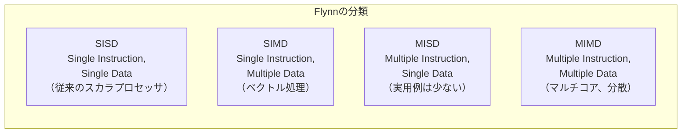
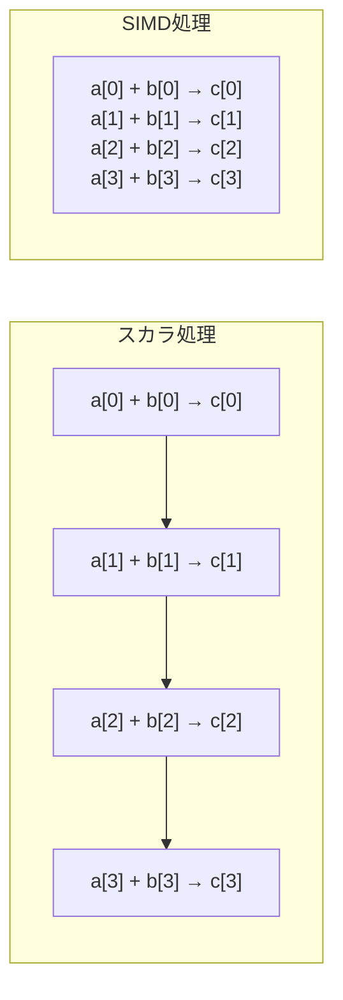
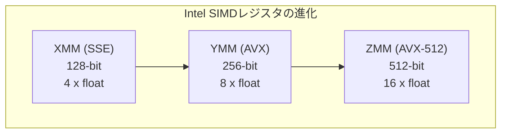
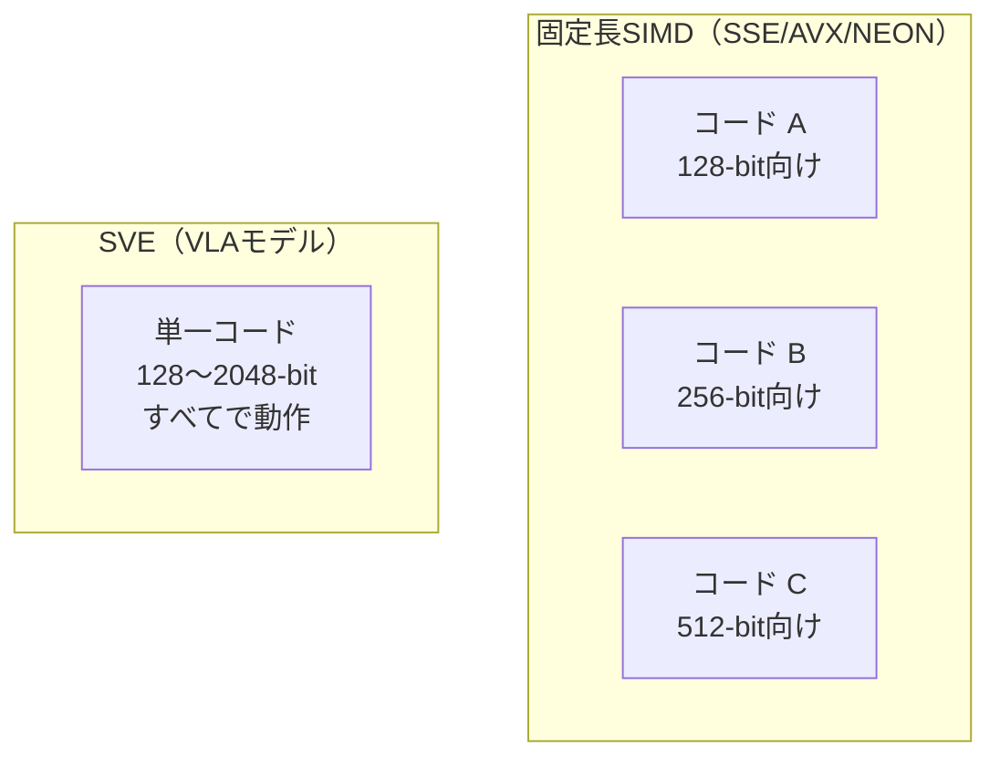
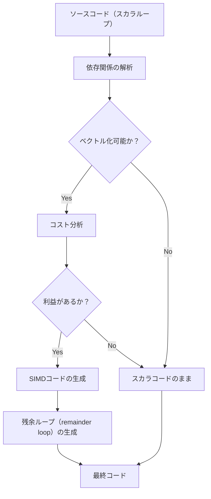
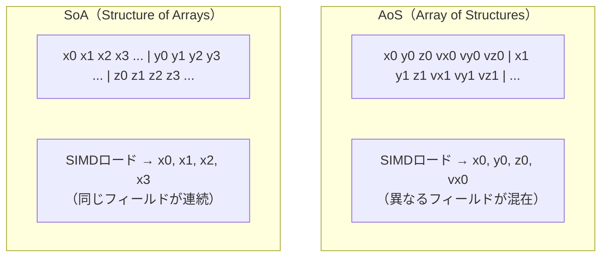
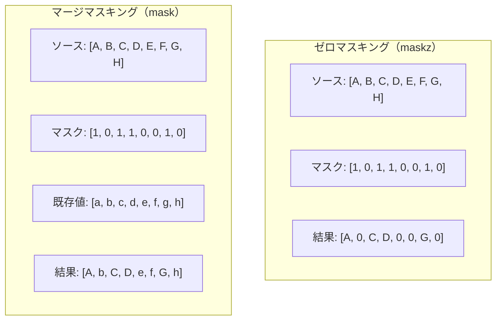
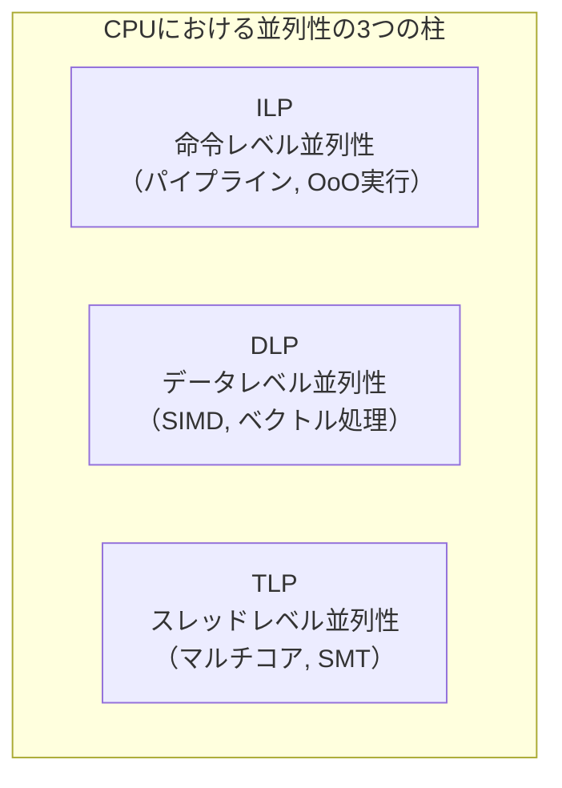

# SIMD命令セット — SSE, AVX, NEON, SVEによるデータ並列処理

## 1. SIMDの概念 — データレベル並列性の活用

### 1.1 Flynnの分類とSIMD

コンピュータアーキテクチャにおける並列処理の分類として、Michael J. Flynnが1966年に提唱した**Flynnの分類（Flynn's Taxonomy）** が広く知られている。この分類では、命令ストリームとデータストリームの数に基づいて、計算機を4つのカテゴリに分類する。



**SIMD（Single Instruction, Multiple Data）** は、1つの命令で複数のデータ要素を同時に処理するアーキテクチャである。従来のスカラ処理（SISD）では1回の命令で1つのデータ要素しか処理できないのに対し、SIMDでは1回の命令で4個、8個、あるいは16個以上のデータ要素を並列に処理できる。

### 1.2 スカラ処理 vs SIMD処理

SIMDの本質を理解するために、4つの浮動小数点数の加算を考えてみよう。

**スカラ処理の場合：**

```c
// scalar addition: 4 separate instructions
float a[4] = {1.0, 2.0, 3.0, 4.0};
float b[4] = {5.0, 6.0, 7.0, 8.0};
float c[4];

c[0] = a[0] + b[0];  // instruction 1
c[1] = a[1] + b[1];  // instruction 2
c[2] = a[2] + b[2];  // instruction 3
c[3] = a[3] + b[3];  // instruction 4
```

4回の加算命令が必要であり、それぞれが独立にフェッチ、デコード、実行のサイクルを経る。

**SIMD処理の場合：**

```c
// SIMD addition: single instruction processes 4 elements
// Load 4 floats into a 128-bit register, add, store
__m128 va = _mm_load_ps(a);   // load 4 floats into SIMD register
__m128 vb = _mm_load_ps(b);   // load 4 floats into SIMD register
__m128 vc = _mm_add_ps(va, vb); // add 4 pairs simultaneously
_mm_store_ps(c, vc);           // store 4 results
```

1回の加算命令（`_mm_add_ps`）で4つの加算が同時に実行される。理論上、スカラ処理の4倍のスループットを達成できる。



### 1.3 SIMDが解決する問題

SIMDは、**データレベル並列性（Data-Level Parallelism, DLP）** が高いワークロードにおいて、スカラ処理の限界を打破するために設計された。以下のようなワークロードがSIMDの恩恵を受ける。

- **科学技術計算**: 行列演算、ベクトル内積、FFT（高速フーリエ変換）
- **マルチメディア処理**: 画像フィルタ、動画エンコード/デコード、音声処理
- **信号処理**: デジタルフィルタ、相関演算
- **機械学習**: テンソル演算、推論エンジン
- **データベース**: カラムスキャン、フィルタリング、集約演算
- **文字列処理**: パターンマッチ、JSON解析、UTF-8バリデーション

SIMDの利点は、マルチスレッド並列化（MIMD）と比較してオーバーヘッドが極めて小さいことにある。スレッド生成や同期のコストがなく、命令デコードのオーバーヘッドも1回分で済む。また、SIMDはマルチスレッド化と直交しているため、両者を組み合わせることで更なる高速化が可能である。

### 1.4 SIMDの歴史的発展

SIMDの概念は新しいものではない。1960年代のILLIAC IVや、1970年代のCray-1ベクトルプロセッサは、SIMDの先駆けである。しかし、汎用プロセッサにSIMD拡張が導入されたのは1990年代後半からであり、以降急速に進化してきた。

| 年 | 命令セット | レジスタ幅 | プロセッサ |
|------|------------|-----------|-----------|
| 1996 | MMX | 64-bit | Intel Pentium MMX |
| 1999 | SSE | 128-bit | Intel Pentium III |
| 2001 | SSE2 | 128-bit | Intel Pentium 4 |
| 2004 | SSE3 | 128-bit | Intel Prescott |
| 2006 | SSSE3 | 128-bit | Intel Core 2 |
| 2008 | SSE4.1/4.2 | 128-bit | Intel Penryn / Nehalem |
| 2011 | AVX | 256-bit | Intel Sandy Bridge |
| 2013 | AVX2 | 256-bit | Intel Haswell |
| 2016 | AVX-512 | 512-bit | Intel Xeon Phi / Skylake-SP |
| 2023 | AVX10 | 128/256-bit | Intel Granite Rapids |
| 2005 | NEON | 128-bit | ARM Cortex-A8 |
| 2016 | SVE | 128〜2048-bit | Arm v8.2-A（Fugaku） |
| 2021 | SVE2 | 128〜2048-bit | Arm v9 |

## 2. Intel SSE/AVX/AVX-512

### 2.1 SSE — SIMDの普及

**SSE（Streaming SIMD Extensions）** は、1999年にIntelがPentium IIIプロセッサに導入した命令セット拡張である。SSEの前身であるMMXは64ビットのMMXレジスタ（x87浮動小数点レジスタと共用）しか提供しなかったが、SSEは専用の**128ビットXMMレジスタ**を16本導入した。

SSEの設計における重要な判断は以下の通りである。

1. **専用レジスタの導入**: MMXではFPUレジスタとの共用による制約があったが、XMMレジスタは完全に独立している
2. **浮動小数点サポート**: MMXが整数演算のみであったのに対し、SSEは単精度浮動小数点演算をサポートした
3. **非破壊的な命令形式**: MMXの3GPR形式を拡張し、2オペランド形式を採用

```
XMM0:  [ float0 | float1 | float2 | float3 ]
         32-bit   32-bit   32-bit   32-bit
       |<------------- 128 bits ------------>|
```

SSE2（2001年）は倍精度浮動小数点と整数演算のサポートを追加し、実質的にMMXを置き換えた。SSE3/SSSE3/SSE4.1/SSE4.2は水平演算、シャッフル、文字列比較などの新しい命令を段階的に追加した。

### 2.2 AVX — レジスタ幅の倍増

**AVX（Advanced Vector Extensions）** は、2011年にIntelがSandy Bridgeアーキテクチャで導入した。AVXの最も重要な変更は以下の2点である。

**レジスタ幅の拡張**: XMMレジスタ（128ビット）を**YMMレジスタ（256ビット）** に拡張した。YMMレジスタの下位128ビットがXMMレジスタとして引き続き使用できるため、後方互換性が維持される。

```
YMM0:  [ float0 | float1 | float2 | float3 | float4 | float5 | float6 | float7 ]
         32-bit   32-bit   32-bit   32-bit   32-bit   32-bit   32-bit   32-bit
       |<----- XMM0 (lower 128 bits) ----->|
       |<---------------------------- 256 bits -------------------------------->|
```

**VEX命令エンコーディング**: 従来の2オペランド形式から**3オペランドの非破壊形式**に移行した。これにより、1つの命令でソースレジスタを保持しながら結果を別のレジスタに書き込むことが可能になった。

```nasm
; SSE: destructive two-operand form
; dest = dest + src
addps  xmm0, xmm1   ; xmm0 = xmm0 + xmm1 (xmm0 is overwritten)

; AVX: non-destructive three-operand form (VEX encoding)
; dest = src1 + src2
vaddps ymm0, ymm1, ymm2  ; ymm0 = ymm1 + ymm2 (ymm1 preserved)
```

AVX2（2013年、Haswell）は256ビット整数演算のフルサポートとギャザー命令を追加した。ギャザー命令は、非連続なメモリアドレスからデータを収集してSIMDレジスタにロードする命令であり、非連続データの処理においてSIMDの適用範囲を大幅に拡張した。

### 2.3 AVX-512 — 512ビットと高度な機能

**AVX-512**は、2016年にIntelがXeon Phi（Knights Landing）およびSkylake-SPで導入した、最も野心的なSIMD拡張である。

**主な特徴：**

1. **512ビットZMMレジスタ**: 32本（x86-64の場合）のZMMレジスタを提供。単精度浮動小数点なら一度に16要素を処理できる
2. **マスクレジスタ**: 8本の専用マスクレジスタ（k0〜k7）を導入。レーンごとの条件付き実行が可能
3. **豊富な命令群**: 圧縮、展開、衝突検出、三角関数近似など
4. **EVEXエンコーディング**: VEXを拡張した4バイトプリフィクスで、マスクやブロードキャスト情報をエンコード

```
ZMM0:  [ d0 | d1 | d2 | d3 | d4 | d5 | d6 | d7 | d8 | d9 | d10 | d11 | d12 | d13 | d14 | d15 ]
         32b  32b  32b  32b  32b  32b  32b  32b  32b  32b  32b   32b   32b   32b   32b   32b
       |<-------- YMM0 (lower 256 bits) -------->|
       |<---- XMM0 ----->|
       |<----------------------------------------- 512 bits ---------------------------------------->|
```



### 2.4 AVX-512の功罪

AVX-512は強力だが、いくつかの議論を呼んでいる。

**利点：**
- 512ビット幅による高いスループット
- マスク処理によるブランチレスプログラミング
- ギャザー/スキャッターの高速化
- 豊富な専用命令（VP2INTERSECT、VPOPCNT など）

**問題点：**
- **周波数低下（ダウンクロック）**: AVX-512命令の実行時、プロセッサが電力・発熱の制約から動作周波数を引き下げる。Intel Skylake-SPでは、重い AVX-512命令の実行中にベースクロックから最大で15〜20%の周波数低下が生じる場合がある
- **コア間の非対称性**: 一部のクライアント向けプロセッサ（Alder Lake）ではEコアがAVX-512に対応せず、命令の使用可否がコアに依存する状況が発生した
- **エコシステムの分断**: AVX-512には数十のサブセット（AVX-512F、AVX-512BW、AVX-512VL、AVX-512VNNI等）が存在し、どのサブセットが利用可能かはプロセッサモデルに依存する

Linus Torvaldsは「AVX-512をサーバに売り込むのではなく、なくしてしまえばいい」と述べ、AVX-512のダウンクロック問題を厳しく批判した。この議論は、SIMDにおける**レジスタ幅のスケーリング**が単純に性能向上につながるわけではないことを示している。

### 2.5 AVX10 — 統一と簡素化への道

Intelは2023年に**AVX10**を発表した。AVX10はAVX-512の機能をベースとしつつ、以下の点で改善を図る。

- **固定されたベースライン**: 多数のサブセットを廃止し、AVX10.1、AVX10.2のようにバージョンで統一
- **可変ベクトル長**: AVX10/128、AVX10/256、AVX10/512のように実装ごとにサポートする最大ベクトル長を明示
- **Eコアとの互換性**: 256ビット幅であればEコアでもAVX-512相当の命令を実行可能

AVX10は、AVX-512のエコシステム分断問題を解消しつつ、マスクレジスタやEVEXエンコーディングの利点を維持する方向性である。

## 3. ARM NEON / SVE

### 3.1 NEON — ARMのSIMD基盤

**NEON**（Advanced SIMD）は、ARM Cortex-Aシリーズプロセッサに搭載されたSIMD拡張であり、2005年にCortex-A8で初めて実装された。NEONはモバイルデバイスのマルチメディア処理を主なターゲットとして設計された。

NEONの基本仕様は以下の通りである。

- **128ビットレジスタ**: 32本のQ（Quadword）レジスタ（64ビットのDレジスタ2本として見ることも可能）
- **データ型**: 8/16/32/64ビット整数、単精度浮動小数点（AArch64では倍精度もサポート）
- **命令セット**: ロード/ストア、算術演算、論理演算、シャッフル、テーブルルックアップ

```
Q0:  [ byte0 | byte1 | ... | byte15 ]    16 x 8-bit
     [ half0 | half1 | ... | half7  ]     8 x 16-bit
     [ word0 | word1 | word2 | word3 ]    4 x 32-bit
     [ dword0 |       dword1        ]     2 x 64-bit
     |<----------- 128 bits ---------->|
```

NEONのIntel SSEとの大きな違いは以下の点にある。

1. **インターリーブロード/ストア**: `vld2`、`vld3`、`vld4`命令により、Structure of Arrays（SoA）形式へのデインターリーブがハードウェアレベルでサポートされている。これは画像処理（RGBA各チャネルの分離）などで特に有用である
2. **飽和演算（saturating arithmetic）のネイティブサポート**: 画像やオーディオ処理で頻出するクリッピング処理をオーバーフローなしで実行
3. **ポリノミアル演算**: CRC計算や暗号処理に対応

```c
// NEON interleaved load example (AArch64)
#include <arm_neon.h>

void deinterleave_rgb(const uint8_t *rgb, uint8_t *r, uint8_t *g, uint8_t *b) {
    // Load 48 bytes (16 RGB pixels) and deinterleave into R, G, B channels
    uint8x16x3_t pixels = vld3q_u8(rgb);
    vst1q_u8(r, pixels.val[0]);  // R channel
    vst1q_u8(g, pixels.val[1]);  // G channel
    vst1q_u8(b, pixels.val[2]);  // B channel
}
```

### 3.2 SVE — スケーラブルなベクトル拡張

**SVE（Scalable Vector Extension）** は、Arm v8.2-Aアーキテクチャで2016年に策定された革新的なベクトル拡張である。SVEの最大の特徴は、**ベクトル長非依存（Vector Length Agnostic, VLA）** プログラミングモデルである。

従来のSIMD拡張（SSE、AVX、NEON）は、固定されたレジスタ幅を前提としたプログラミングモデルを採用している。例えばAVXのコードは256ビット幅を前提としており、512ビットのAVX-512で最大限の性能を発揮するにはコードの書き換えが必要である。

SVEはこの問題を根本的に解決する。SVEのベクトルレジスタの幅は実装ごとに128ビットから2048ビット（128ビット刻み）まで自由に選択でき、**同じバイナリが異なるベクトル幅の実装上で最適に動作する**。



SVEの設計上の要素は以下の通りである。

**プレディケートレジスタ**: SVEは16本のプレディケートレジスタ（P0〜P15）を持つ。各プレディケートレジスタのビットは、対応するベクトルレジスタのバイトレーンに1対1で対応し、そのレーンが有効か無効かを制御する。

```
// SVE predicate-driven loop (conceptual)
// Process array of unknown length with vector-length-agnostic code
whilelt p0.s, x0, x1     // set predicate: which lanes are valid?
ld1w   z0.s, p0/z, [x2]  // load valid elements
ld1w   z1.s, p0/z, [x3]  // load valid elements
fadd   z2.s, z0.s, z1.s  // add (only predicated lanes execute)
st1w   z2.s, p0, [x4]    // store valid results
```

**First-Faulting ロード**: SVEにはメモリフォールトの伝播を制御する機構がある。`ldff1`命令は、最初の要素のフォールトのみを報告し、残りの要素のフォールトは無視する。これにより、配列の末端を超えたメモリアクセスを安全に行える。

### 3.3 SVEの実装例 — Fugaku（富岳）

スーパーコンピュータ**「富岳」（Fugaku）** に搭載されたFujitsu A64FXプロセッサは、SVEの最初の大規模実装として知られる。A64FXは512ビットのSVEベクトルレジスタを採用し、コアあたり2つの512ビットSIMDパイプラインを備えている。

富岳は2020年にTOP500でトップの座を獲得し、SVEの実用性を実証した。HPC（High-Performance Computing）ワークロードにおいて、SVEのVLAモデルは、ベクトル幅に依存しないポータブルな高性能コードの記述を可能にしている。

### 3.4 SVE2 — 汎用ワークロードへの拡張

**SVE2**（Arm v9）は、SVEを汎用ワークロード向けに拡張したものである。SVE2はNEONの機能をスーパーセットとしてカバーし、NEONを将来的に置き換えることを目指している。

SVE2が追加した主な機能は以下の通りである。

- **固定小数点演算**: DSP（Digital Signal Processing）ワークロード向けの飽和演算、丸め演算
- **ビット操作の拡張**: ビット置換、ポリノミアル乗算
- **暗号処理**: SM4、AES、SHA-3関連命令
- **ヒストグラム演算**: 画像処理やデータ分析向け

## 4. 自動ベクトル化 — コンパイラの役割

### 4.1 自動ベクトル化の仕組み

SIMD命令の恩恵を受ける最も手軽な方法は、**コンパイラの自動ベクトル化（auto-vectorization）** に頼ることである。現代のコンパイラ（GCC、Clang、MSVC、ICC）は、スカラコードのループを分析し、SIMDを活用した並列コードに変換する能力を持つ。

自動ベクトル化の基本的な処理の流れは以下の通りである。



1. **依存関係の解析**: ループ内のデータ依存関係を解析し、反復間に依存がないか確認する。依存がある場合、通常はベクトル化できない
2. **コスト分析**: ベクトル化のコスト（データの再配置、アライメント調整など）と利益（スループットの向上）を比較し、ベクトル化が有利な場合のみ変換する
3. **コード変換**: ループのアンロールとSIMD命令への置き換え
4. **残余ループの生成**: ループの反復回数がSIMDレーン数の倍数でない場合、残りの要素を処理するスカラループを生成する

### 4.2 自動ベクトル化が成功する条件

コンパイラが自動ベクトル化を適用するためには、いくつかの条件を満たす必要がある。

**ベクトル化が成功しやすいパターン：**

```c
// Simple loop with no dependencies - easily vectorized
void add_arrays(float *a, const float *b, const float *c, int n) {
    for (int i = 0; i < n; i++) {
        a[i] = b[i] + c[i];
    }
}
```

**ベクトル化が困難なパターン：**

```c
// Loop-carried dependency - cannot vectorize
void prefix_sum(float *a, int n) {
    for (int i = 1; i < n; i++) {
        a[i] = a[i] + a[i - 1];  // each iteration depends on the previous one
    }
}

// Function call inside loop - opaque to the compiler
void process(float *a, int n) {
    for (int i = 0; i < n; i++) {
        a[i] = some_external_function(a[i]);  // cannot vectorize
    }
}

// Conditional branches - may be vectorizable with masking
void clamp(float *a, int n, float min_val, float max_val) {
    for (int i = 0; i < n; i++) {
        if (a[i] < min_val) a[i] = min_val;
        if (a[i] > max_val) a[i] = max_val;
    }
}
```

### 4.3 コンパイラへのヒント

自動ベクトル化の成功率を高めるために、プログラマはコンパイラにヒントを与えることができる。

**`restrict` キーワード（C99）**: ポインタのエイリアシングがないことをコンパイラに伝える。

```c
// Without restrict: compiler must assume a and b may overlap
void add(float *a, const float *b, int n);

// With restrict: compiler knows a and b do not overlap
void add(float *restrict a, const float *restrict b, int n) {
    for (int i = 0; i < n; i++) {
        a[i] += b[i];
    }
}
```

**OpenMP SIMD指示子**:

```c
#pragma omp simd
for (int i = 0; i < n; i++) {
    a[i] = b[i] * c[i] + d[i];
}
```

**GCC/Clang の `__attribute__`**:

```c
// Hint to the compiler that the loop should be vectorized
__attribute__((optimize("O3,tree-vectorize")))
void compute(float *out, const float *in, int n) {
    for (int i = 0; i < n; i++) {
        out[i] = in[i] * in[i];
    }
}
```

### 4.4 自動ベクトル化の限界

自動ベクトル化は便利だが、万能ではない。以下のような限界がある。

1. **保守的な判断**: コンパイラはエイリアシングの可能性があるだけで、ベクトル化を断念する場合がある
2. **複雑なデータアクセスパターン**: インデックス配列を介した間接アクセスや、ストライドの大きいアクセスは最適化が困難
3. **アルゴリズムレベルの変換不可**: 水平演算（ベクトル内要素間の演算）や、スキャン演算のSIMD化はコンパイラが自動で行えないことが多い
4. **コンパイラ依存**: 同じソースコードでも、コンパイラの種類やバージョンによってベクトル化の成否が異なる

性能が重要な場面では、コンパイラの出力（アセンブリ）を確認し、期待通りにベクトル化されているかを検証することが推奨される。GCCの `-fopt-info-vec-missed`、Clangの `-Rpass=loop-vectorize` / `-Rpass-missed=loop-vectorize` オプションは、ベクトル化の成否をレポートしてくれる。

## 5. 手動SIMD — Intrinsicsによるプログラミング

### 5.1 Intrinsicsとは

**Intrinsics**（組み込み関数）は、アセンブリ命令に対応するC/C++関数として提供されるインターフェースである。プログラマはC/C++のセマンティクスの中で直接SIMD命令を制御でき、レジスタ割り当てやスケジューリングはコンパイラに委ねることができる。

| レベル | 抽象度 | 可搬性 | 最適化制御 |
|--------|--------|--------|-----------|
| 自動ベクトル化 | 高 | 高 | 低 |
| Intrinsics | 中 | 中 | 高 |
| インラインアセンブリ | 低 | 低 | 最大 |

### 5.2 Intel Intrinsicsの体系

Intel Intrinsicsは、一貫した命名規則に従っている。

```
_mm<width>_<operation>_<type>

- <width>: (なし)=128-bit, 256=256-bit, 512=512-bit
- <operation>: add, mul, load, store, shuffle, ...
- <type>: ps(packed single), pd(packed double),
          epi8/epi16/epi32/epi64(packed integer),
          si128/si256/si512(untyped integer)
```

主要な型とヘッダは以下の通りである。

| 型 | レジスタ幅 | ヘッダ |
|-----|-----------|--------|
| `__m128` / `__m128i` / `__m128d` | 128-bit | `<xmmintrin.h>` / `<emmintrin.h>` |
| `__m256` / `__m256i` / `__m256d` | 256-bit | `<immintrin.h>` |
| `__m512` / `__m512i` / `__m512d` | 512-bit | `<immintrin.h>` |

### 5.3 実践例: ベクトル内積（AVX2）

4要素の浮動小数点ベクトルの内積は、SIMDの典型的な応用例である。

```c
#include <immintrin.h>

// Dot product of two float arrays using AVX2
float dot_product_avx2(const float *a, const float *b, int n) {
    __m256 sum = _mm256_setzero_ps();  // 8 accumulators initialized to 0

    int i = 0;
    for (; i + 7 < n; i += 8) {
        __m256 va = _mm256_loadu_ps(&a[i]);  // load 8 floats from a
        __m256 vb = _mm256_loadu_ps(&b[i]);  // load 8 floats from b
        sum = _mm256_fmadd_ps(va, vb, sum);  // sum += a[i]*b[i] (FMA)
    }

    // Horizontal reduction: sum all 8 lanes
    __m128 hi = _mm256_extractf128_ps(sum, 1);      // upper 128 bits
    __m128 lo = _mm256_castps256_ps128(sum);         // lower 128 bits
    __m128 sum128 = _mm_add_ps(lo, hi);              // combine
    sum128 = _mm_hadd_ps(sum128, sum128);            // horizontal add
    sum128 = _mm_hadd_ps(sum128, sum128);            // horizontal add again
    float result = _mm_cvtss_f32(sum128);            // extract scalar

    // Handle remaining elements
    for (; i < n; i++) {
        result += a[i] * b[i];
    }

    return result;
}
```

この例では、FMA（Fused Multiply-Add）命令 `_mm256_fmadd_ps` を使用している。FMAは乗算と加算を1命令で行い、中間結果の丸めが1回で済むため、精度の面でも有利である。

### 5.4 実践例: 文字列長の計算（SSE4.2）

SSE4.2には文字列操作に特化した命令が含まれている。`_mm_cmpistrz` を用いた高速な `strlen` の実装例を見てみよう。

```c
#include <immintrin.h>
#include <string.h>

// Fast strlen using SSE4.2 PCMPISTRI
size_t fast_strlen_sse42(const char *s) {
    const char *p = s;
    __m128i zero = _mm_setzero_si128();

    // Align to 16-byte boundary
    while ((uintptr_t)p & 0xF) {
        if (*p == '\0') return p - s;
        p++;
    }

    // Process 16 bytes at a time
    for (;;) {
        __m128i data = _mm_load_si128((const __m128i *)p);
        int idx = _mm_cmpistri(data, zero,
            _SIDD_UBYTE_OPS | _SIDD_CMP_EQUAL_EACH |
            _SIDD_LEAST_SIGNIFICANT);
        if (idx != 16) {
            return (p - s) + idx;
        }
        p += 16;
    }
}
```

### 5.5 シャッフルとパーミュテーション

SIMDプログラミングにおいて、レーン間のデータ移動は頻出する操作であり、性能に大きな影響を与える。

```c
// Example: transpose 4x4 float matrix using SSE
void transpose_4x4_sse(float *m) {
    __m128 row0 = _mm_load_ps(&m[0]);   // [a00, a01, a02, a03]
    __m128 row1 = _mm_load_ps(&m[4]);   // [a10, a11, a12, a13]
    __m128 row2 = _mm_load_ps(&m[8]);   // [a20, a21, a22, a23]
    __m128 row3 = _mm_load_ps(&m[12]);  // [a30, a31, a32, a33]

    // Interleave low/high pairs
    __m128 t0 = _mm_unpacklo_ps(row0, row1); // [a00, a10, a01, a11]
    __m128 t1 = _mm_unpackhi_ps(row0, row1); // [a02, a12, a03, a13]
    __m128 t2 = _mm_unpacklo_ps(row2, row3); // [a20, a30, a21, a31]
    __m128 t3 = _mm_unpackhi_ps(row2, row3); // [a22, a32, a23, a33]

    // Final shuffle
    row0 = _mm_movelh_ps(t0, t2);  // [a00, a10, a20, a30]
    row1 = _mm_movehl_ps(t2, t0);  // [a01, a11, a21, a31]
    row2 = _mm_movelh_ps(t1, t3);  // [a02, a12, a22, a32]
    row3 = _mm_movehl_ps(t3, t1);  // [a03, a13, a23, a33]

    _mm_store_ps(&m[0], row0);
    _mm_store_ps(&m[4], row1);
    _mm_store_ps(&m[8], row2);
    _mm_store_ps(&m[12], row3);
}
```

この4x4行列の転置では、`_mm_unpacklo_ps` / `_mm_unpackhi_ps` によるインターリーブと、`_mm_movelh_ps` / `_mm_movehl_ps` による上下半分の結合を組み合わせている。シャッフル命令のコストは演算命令と同等またはそれ以上であるため、データレイアウトの工夫によってシャッフルを最小化することがSIMD最適化の鍵となる。

## 6. データレイアウトとアライメント

### 6.1 AoS vs SoA

SIMDの効率はデータの配置方式に大きく依存する。代表的な2つの配置方式を比較しよう。

**AoS（Array of Structures）**:

```c
// AoS layout
struct Particle {
    float x, y, z;     // position
    float vx, vy, vz;  // velocity
};
struct Particle particles[1024];
```

メモリ上の配置：
```
[x0, y0, z0, vx0, vy0, vz0, x1, y1, z1, vx1, vy1, vz1, ...]
```

**SoA（Structure of Arrays）**:

```c
// SoA layout
struct Particles {
    float x[1024], y[1024], z[1024];
    float vx[1024], vy[1024], vz[1024];
};
struct Particles particles;
```

メモリ上の配置：
```
[x0, x1, x2, ..., x1023, y0, y1, y2, ..., y1023, z0, z1, ...]
```



SoAレイアウトはSIMDにとって圧倒的に有利である。同じフィールドのデータが連続して配置されているため、1回のSIMDロードで複数の要素の同一フィールドをまとめて読み込める。AoSレイアウトでは、x座標だけを処理したい場合でもy、z、vx、vy、vzのデータまで一緒にロードしてしまい、メモリ帯域の無駄が生じる。

**AoSoA（Array of Structure of Arrays）** は、AoSとSoAのハイブリッドであり、SIMDレーン幅に合わせたブロック単位でSoAを構成する。

```c
// AoSoA layout (block size = SIMD width, e.g., 8 for AVX)
struct ParticleBlock {
    float x[8], y[8], z[8];
    float vx[8], vy[8], vz[8];
};
struct ParticleBlock particles[1024 / 8];
```

AoSoAはSIMDの効率とキャッシュの局所性を両立させる手法として、ゲームエンジンや物理シミュレーションで採用されている。

### 6.2 メモリアライメント

SIMD命令は、データのメモリアライメントに敏感である。多くのSIMDロード/ストア命令は、アドレスがレジスタ幅の境界にアラインされていることを要求する。

| 命令セット | アライン済みロード | 非アラインロード |
|-----------|------------------|----------------|
| SSE | `_mm_load_ps`（16バイト境界必須） | `_mm_loadu_ps` |
| AVX | `_mm256_load_ps`（32バイト境界必須） | `_mm256_loadu_ps` |
| AVX-512 | `_mm512_load_ps`（64バイト境界必須） | `_mm512_loadu_ps` |

歴史的には、非アラインロードはアラインロードに比べて大幅に遅かった。SSE初期のプロセッサでは、非アラインアクセスはアラインアクセスの2〜4倍のレイテンシを必要としていた。しかし、Nehalem以降のIntelプロセッサでは、**非アラインアクセスのペナルティは大幅に軽減**されており、キャッシュラインをまたがない限りほぼ同等の性能で処理できる。

それでも、アラインメントを適切に管理することには価値がある。

```c
// Aligned allocation
#include <stdlib.h>

// C11 aligned_alloc
float *data = aligned_alloc(32, n * sizeof(float));  // 32-byte aligned for AVX

// POSIX posix_memalign
float *data2;
posix_memalign((void **)&data2, 64, n * sizeof(float));  // 64-byte aligned for AVX-512

// C++ std::aligned_alloc or alignas
alignas(32) float data3[256];  // stack-allocated, 32-byte aligned

// Compiler attributes
float data4[256] __attribute__((aligned(32)));
```

### 6.3 キャッシュラインとの関係

SIMDのロード/ストア性能は、CPUキャッシュとの相互作用に大きく影響される。一般的なx86プロセッサのキャッシュラインは64バイトであり、AVXの256ビット（32バイト）ロードは1回でキャッシュラインの半分を消費する。AVX-512の512ビット（64バイト）ロードはちょうど1キャッシュラインに相当する。

キャッシュラインの境界をまたぐロードは、2つのキャッシュラインにアクセスする必要があるため、レイテンシが増加する。アライメントを適切に管理してキャッシュライン境界をまたがないようにすることで、この問題を回避できる。

## 7. SIMDの応用

### 7.1 画像処理 — ピクセル単位の並列演算

画像処理はSIMDの最も伝統的な応用分野である。画像データは大量のピクセルが均一な構造で並んでおり、同じ演算を全ピクセルに適用するため、SIMDとの親和性が極めて高い。

**例: 画像の輝度調整（明るさの加算）**

```c
#include <immintrin.h>

// Adjust brightness of 8-bit grayscale image using AVX2
void adjust_brightness_avx2(uint8_t *image, int num_pixels, int adjustment) {
    __m256i adj = _mm256_set1_epi8((int8_t)adjustment);
    int i = 0;

    for (; i + 31 < num_pixels; i += 32) {
        // Load 32 pixels at once
        __m256i pixels = _mm256_loadu_si256((__m256i *)&image[i]);
        // Saturating add: clamps to [0, 255] automatically
        __m256i result = _mm256_adds_epu8(pixels, adj);
        // Store 32 pixels
        _mm256_storeu_si256((__m256i *)&image[i], result);
    }

    // Handle remaining pixels
    for (; i < num_pixels; i++) {
        int val = image[i] + adjustment;
        image[i] = (uint8_t)(val < 0 ? 0 : (val > 255 ? 255 : val));
    }
}
```

1回のループ反復で32ピクセルを処理し、飽和加算（`_mm256_adds_epu8`）によりオーバーフロー/アンダーフロー処理もハードウェアレベルで行われる。

### 7.2 JSON解析 — simdjsonの革新

**simdjson**は、Daniel Lemireらによって開発された高性能JSONパーサであり、SIMDの応用として特に注目されている。simdjsonは、従来のJSONパーサと比較してギガバイト毎秒のスループットを達成する。

simdjsonの核心的なアイデアは、JSONの構造解析を2つのステージに分割することにある。


**Stage 1（SIMD並列処理）**:
- 64バイト単位でJSONデータを読み込み、構造文字（`{`、`}`、`[`、`]`、`:`、`,`、`"`）の位置をビットマップとして抽出する
- 文字列内のエスケープシーケンス（`\"`）を考慮してクォート文字を正しく識別する
- この処理はほぼすべてSIMD命令で行われ、バイトあたり約1命令の効率を達成する

```c
// Conceptual simdjson Stage 1: find structural characters
// Using AVX2 to classify 32 bytes at once
__m256i input = _mm256_loadu_si256((const __m256i *)buf);

// Compare against structural characters
__m256i open_brace  = _mm256_cmpeq_epi8(input, _mm256_set1_epi8('{'));
__m256i close_brace = _mm256_cmpeq_epi8(input, _mm256_set1_epi8('}'));
__m256i colon       = _mm256_cmpeq_epi8(input, _mm256_set1_epi8(':'));
// ... combine results into a bitmask
uint32_t structural_mask = _mm256_movemask_epi8(
    _mm256_or_si256(_mm256_or_si256(open_brace, close_brace), colon)
);
```

simdjsonは、SIMDをテキスト処理に適用した最も成功した事例の一つであり、その設計思想は他の高速パーサ（simdutf、simdcsv等）にも影響を与えている。

### 7.3 データベース — カラムナスキャンとフィルタリング

近年のデータベースエンジン、特にカラムナ（列指向）ストレージを採用するものは、SIMDを積極的に活用している。

**カラムナストレージとSIMDの親和性**:
カラムナストレージでは、同じカラムのデータがメモリ上に連続して配置されるため、SIMDによる並列スキャンが自然に適用できる。

```c
// Vectorized column scan: find all rows where value > threshold
#include <immintrin.h>

int filter_column_avx2(const int32_t *column, int n, int32_t threshold,
                       int32_t *result_indices) {
    __m256i thresh = _mm256_set1_epi32(threshold);
    int count = 0;

    for (int i = 0; i + 7 < n; i += 8) {
        __m256i values = _mm256_loadu_si256((const __m256i *)&column[i]);
        __m256i cmp = _mm256_cmpgt_epi32(values, thresh);  // compare > threshold
        int mask = _mm256_movemask_epi8(cmp);               // extract comparison results

        if (mask != 0) {
            // Extract matching indices using popcount and bit manipulation
            for (int j = 0; j < 8; j++) {
                if (mask & (0xF << (j * 4))) {
                    result_indices[count++] = i + j;
                }
            }
        }
    }

    // Handle remainder
    for (int i = (n / 8) * 8; i < n; i++) {
        if (column[i] > threshold) {
            result_indices[count++] = i;
        }
    }

    return count;
}
```

DuckDB、ClickHouse、Apache Arrow、Veloxなどの現代的なデータ処理エンジンは、SIMD最適化を中核的な設計要素として組み込んでいる。

### 7.4 その他の応用分野

SIMDは上記以外にも幅広い分野で活用されている。

- **圧縮/展開**: LZ4、Zstandard、Snappyなどの圧縮アルゴリズムはSIMD最適化されたバージョンを持つ
- **暗号処理**: AES-NI命令セットによるAES暗号化の高速化、CLMUL命令によるGCMモードの高速化
- **ネットワーク処理**: DPDKによるパケットヘッダの並列解析、チェックサム計算
- **正規表現**: Hyperscanのように正規表現マッチングにSIMDを活用するエンジン
- **Base64エンコード/デコード**: ルックアップテーブルとシャッフル命令による高速変換
- **UTF-8バリデーション**: simdutfによる高速UTF-8/UTF-16変換とバリデーション
- **ソートアルゴリズム**: SIMDソーティングネットワークによる小規模配列の高速ソート

## 8. マスク処理 — 条件付きSIMD実行

### 8.1 マスク処理の必要性

現実のプログラムでは、すべてのデータ要素に同一の処理を適用するわけではない。条件分岐を含むコードをSIMD化する際に必要となるのが**マスク処理（predication / masking）** である。

スカラコードにおける条件分岐：

```c
// Scalar conditional processing
for (int i = 0; i < n; i++) {
    if (condition[i]) {
        result[i] = a[i] + b[i];
    } else {
        result[i] = a[i] - b[i];
    }
}
```

SIMDではすべてのレーンが同じ命令を実行するため、レーンごとに異なる処理を行うには**ブレンド（blend）** や**マスク付き命令**を使用する。

### 8.2 SSE/AVXにおけるマスク処理

SSE/AVXでは、比較命令が生成するマスクと `blendv` 命令を組み合わせて条件付き処理を実現する。

```c
#include <immintrin.h>

// Branchless conditional processing using AVX2 blend
void conditional_add_sub_avx2(float *result, const float *a, const float *b,
                               const float *condition, int n) {
    __m256 zero = _mm256_setzero_ps();

    for (int i = 0; i + 7 < n; i += 8) {
        __m256 va = _mm256_loadu_ps(&a[i]);
        __m256 vb = _mm256_loadu_ps(&b[i]);
        __m256 cond = _mm256_loadu_ps(&condition[i]);

        // Create mask: condition > 0 ? all-ones : all-zeros
        __m256 mask = _mm256_cmp_ps(cond, zero, _CMP_GT_OQ);

        // Compute both branches
        __m256 add_result = _mm256_add_ps(va, vb);  // a + b
        __m256 sub_result = _mm256_sub_ps(va, vb);  // a - b

        // Blend: select add_result where mask is set, sub_result otherwise
        __m256 blended = _mm256_blendv_ps(sub_result, add_result, mask);

        _mm256_storeu_ps(&result[i], blended);
    }
}
```

この手法では、**両方の分岐を常に計算**してからブレンドで選択する。条件が偏っている場合（ほとんどがtrue、またはほとんどがfalseの場合）、不要な計算が無駄になるが、分岐予測ミスのペナルティが存在しないため、条件の分布が均等な場合はスカラの条件分岐よりも高速である。

### 8.3 AVX-512のマスクレジスタ

AVX-512は、マスク処理のための専用レジスタ（**opmask**、k0〜k7）を導入し、マスク処理を大幅に改善した。

```c
#include <immintrin.h>

// AVX-512 masked operations
void conditional_store_avx512(float *dest, const float *src, const int *flags, int n) {
    for (int i = 0; i + 15 < n; i += 16) {
        // Load 16 flags and create mask
        __m512i vflags = _mm512_loadu_si512(&flags[i]);
        __mmask16 mask = _mm512_cmpgt_epi32_mask(vflags, _mm512_setzero_si512());

        // Masked load: only load elements where mask is set
        __m512 data = _mm512_maskz_loadu_ps(mask, &src[i]);

        // Masked store: only store elements where mask is set
        _mm512_mask_storeu_ps(&dest[i], mask, data);
    }
}
```

AVX-512のマスク付き命令には2つの形式がある。

- **ゼロマスキング（`maskz`）**: マスクが0のレーンは0に設定される
- **マージマスキング（`mask`）**: マスクが0のレーンはデスティネーションレジスタの元の値を保持する



### 8.4 SVEのプレディケーション

SVEでは、**すべてのベクトル命令がプレディケーションを受ける**ことができ、マスク処理はアーキテクチャの根幹をなしている。AVX-512のマスクレジスタと異なり、SVEのプレディケートはVLAモデルと一体化しており、ベクトル長に依存しないループの記述に不可欠である。

```
// SVE loop: process array with unknown length
    mov x0, #0              // i = 0
.loop:
    whilelt p0.s, w0, w1   // set predicate for valid lanes (i < n)
    b.none .done            // if no active lanes, exit
    ld1w z0.s, p0/z, [x2, x0, lsl #2]  // load valid elements
    fmul z0.s, z0.s, z1.s              // multiply
    st1w z0.s, p0, [x3, x0, lsl #2]    // store valid results
    incw x0                             // i += vector_length (unknown at compile time)
    b .loop
.done:
```

`whilelt` 命令がループカウンタとプレディケートの設定を同時に行い、`incw` がベクトル長分だけカウンタを進める。ベクトル長が128ビットの実装でも2048ビットの実装でも、**同じコードが最適に動作する**。

## 9. ポータブルSIMD — 異なるアーキテクチャへの対応

### 9.1 SIMDの可搬性問題

Intel SSE/AVX IntrinsicsとARM NEON Intrinsicsはまったく異なるAPIであるため、クロスプラットフォームなSIMDコードの記述は本質的に困難である。従来は以下のようなプリプロセッサ分岐で対応していた。

```c
#if defined(__AVX2__)
    // AVX2 implementation
    __m256i va = _mm256_loadu_si256((const __m256i *)a);
    __m256i vb = _mm256_loadu_si256((const __m256i *)b);
    __m256i vc = _mm256_add_epi32(va, vb);
    _mm256_storeu_si256((__m256i *)c, vc);
#elif defined(__ARM_NEON)
    // NEON implementation
    int32x4_t va = vld1q_s32(a);
    int32x4_t vb = vld1q_s32(b);
    int32x4_t vc = vaddq_s32(va, vb);
    vst1q_s32(c, vc);
#else
    // Scalar fallback
    for (int i = 0; i < 4; i++) c[i] = a[i] + b[i];
#endif
```

この方法は、サポートするISAの数が増えるにつれて組み合わせ爆発を起こす。SSE2、SSE4.1、AVX2、AVX-512、NEON、SVE、WASM SIMDなど、主要なSIMDターゲットだけでも7つ以上あり、すべてを個別に最適化するのは現実的ではない。

### 9.2 Google Highway

**Highway**は、Googleが開発したポータブルSIMDライブラリ（C++）であり、x86（SSE4, AVX2, AVX-512, AVX10）、ARM（NEON, SVE, SVE2）、RISC-V（RVV）、WASM SIMDなど多数のターゲットをサポートする。

Highwayの設計哲学は以下の通りである。

1. **実行時ディスパッチ**: ランタイムにCPUのサポートするISAを検出し、最適な実装を選択する
2. **タグベースの設計**: テンプレートメタプログラミングとタグ型を使用して、コンパイル時に適切な命令を選択する
3. **VLAモデルの採用**: SVEと同様に、ベクトル長を固定せずに記述する

```cpp
#include "hwy/highway.h"

namespace hn = hwy::HWY_NAMESPACE;

// Portable SIMD code using Highway
void MulAdd(const float* a, const float* b, const float* c, float* d, size_t n) {
    const hn::ScalableTag<float> tag;       // vector type tag
    const size_t lanes = hn::Lanes(tag);    // number of lanes (runtime)

    size_t i = 0;
    for (; i + lanes <= n; i += lanes) {
        auto va = hn::LoadU(tag, a + i);    // unaligned load
        auto vb = hn::LoadU(tag, b + i);
        auto vc = hn::LoadU(tag, c + i);
        auto vd = hn::MulAdd(va, vb, vc);   // d = a * b + c
        hn::StoreU(vd, tag, d + i);
    }

    // Handle remaining elements
    size_t remaining = n - i;
    if (remaining > 0) {
        auto va = hn::LoadN(tag, a + i, remaining);
        auto vb = hn::LoadN(tag, b + i, remaining);
        auto vc = hn::LoadN(tag, c + i, remaining);
        auto vd = hn::MulAdd(va, vb, vc);
        hn::StoreN(vd, tag, d + i, remaining);
    }
}
```

Highwayは、libjxl（JPEG XLリファレンス実装）やChromiumなどの実プロダクトで採用されている。

### 9.3 std::simd（C++26）

C++標準への SIMD抽象化の導入として、**`std::simd`**（旧称 `std::experimental::simd`）がC++26で正式に採用される見込みである。

```cpp
#include <experimental/simd>  // or <simd> in C++26
namespace stdx = std::experimental;

// Portable SIMD using std::simd
void multiply_arrays(const float* a, const float* b, float* c, size_t n) {
    constexpr size_t simd_size = stdx::native_simd<float>::size();

    size_t i = 0;
    for (; i + simd_size <= n; i += simd_size) {
        stdx::native_simd<float> va(a + i, stdx::element_aligned);
        stdx::native_simd<float> vb(b + i, stdx::element_aligned);
        stdx::native_simd<float> vc = va * vb;
        vc.copy_to(c + i, stdx::element_aligned);
    }

    // Handle remainder
    for (; i < n; i++) {
        c[i] = a[i] * b[i];
    }
}
```

`std::simd`の主な型は以下の通りである。

- **`std::basic_simd<T, Abi>`**: メインのSIMDベクトル型
- **`std::basic_simd_mask<T, Abi>`**: マスク型（条件付き処理用）
- **`std::native_simd<T>`**: プラットフォームのネイティブSIMD幅を使用するエイリアス
- **`std::fixed_size_simd<T, N>`**: 固定長のSIMDベクトル

`std::simd`は、オペレータオーバーロードにより自然な数式表現が可能であり、C++の型安全性を活かしたSIMDプログラミングを実現する。

### 9.4 その他のポータブルSIMD手法

| ライブラリ/手法 | 言語 | 特徴 |
|----------------|------|------|
| Highway | C++ | ランタイムディスパッチ、VLA対応 |
| std::simd | C++ | 標準ライブラリ、型安全 |
| ISPC（Intel SPMD Program Compiler） | ISPC | SPMDモデルでSIMDを抽象化 |
| Rust `std::simd` | Rust | nightly機能、クロスプラットフォーム |
| WASM SIMD | WebAssembly | 128ビット固定、ブラウザでのSIMD |
| SIMDe | C | ヘッダオンリー、Intel Intrinsicsをエミュレート |
| xsimd | C++ | ヘッダオンリー、テンプレートベース |

## 10. 実装上の注意点と最適化テクニック

### 10.1 水平演算の回避

SIMDで最も効率が悪い操作の一つが**水平演算（horizontal operation）**、すなわちSIMDレジスタ内の要素間の演算である。例えば、SIMDレジスタ内の全要素の合計を求めるリダクション操作は、レーン間のデータ移動を必要とする。

```c
// Horizontal sum of __m256 (8 floats) - requires multiple shuffle operations
float hsum_avx(__m256 v) {
    __m128 hi = _mm256_extractf128_ps(v, 1);
    __m128 lo = _mm256_castps256_ps128(v);
    __m128 sum = _mm_add_ps(lo, hi);           // 4 floats
    __m128 shuf = _mm_movehdup_ps(sum);        // [1,1,3,3]
    sum = _mm_add_ps(sum, shuf);               // [0+1, _, 2+3, _]
    shuf = _mm_movehl_ps(shuf, sum);           // [2+3, _, _, _]
    sum = _mm_add_ss(sum, shuf);               // [0+1+2+3, _, _, _]
    return _mm_cvtss_f32(sum);
}
```

水平演算はループの最後にリダクションとして1回だけ行い、ループ本体では垂直演算（レーン間で独立な演算）を維持するのが鉄則である。

### 10.2 命令レイテンシとスループット

SIMD最適化では、命令の**レイテンシ**と**スループット（逆数スループット）** の両方を意識する必要がある。

```
命令           レイテンシ  スループット（逆数）  備考
vaddps         4 cycles    0.5 cycles          加算（高速）
vmulps         4 cycles    0.5 cycles          乗算（高速）
vdivps         11 cycles   5 cycles            除算（低速）
vsqrtps        12 cycles   6 cycles            平方根（低速）
vperm2f128     3 cycles    1 cycle             レーン間シャッフル
vgatherdps     varies      varies              ギャザー（遅い傾向）
```

※ 上記の数値はIntel Skylake世代の概算であり、プロセッサのマイクロアーキテクチャによって異なる。

除算や平方根はレイテンシが高く、スループットも低い。可能な限り乗算（逆数の事前計算）やFMAで代用するのが定石である。

### 10.3 レジスタプレッシャー

SIMDレジスタの数は有限であり（SSE/AVXで16本、AVX-512で32本）、使用するレジスタが多すぎるとスピルが発生し、メモリへの退避/復帰のオーバーヘッドが生じる。ループ内で同時に使用するSIMDレジスタの数を意識し、コンパイラがレジスタ割り当てを効率的に行える範囲に収めることが重要である。

### 10.4 デバッグとプロファイリング

SIMD最適化のデバッグには固有の困難がある。

- **SIMD対応デバッガ**: GDBはXMM/YMM/ZMMレジスタの内容をベクトルとして表示できる
- **Intel VTune / perf**: SIMD命令の利用率やベクトル化の効率を計測
- **Compiler Explorer（Godbolt）**: 各コンパイラの出力するSIMDアセンブリをオンラインで比較
- **Intel SDE（Software Development Emulator）**: 未サポートの命令セット（AVX-512等）をエミュレーション実行

```bash
# GDB: display YMM register contents as 8 floats
(gdb) p/f $ymm0.v8_float

# Check compiler vectorization report (GCC)
gcc -O3 -march=native -fopt-info-vec-all source.c

# Check compiler vectorization report (Clang)
clang -O3 -march=native -Rpass=loop-vectorize -Rpass-missed=loop-vectorize source.c
```

## 11. SIMDの現在と未来

### 11.1 現在の動向

SIMDは、もはや特殊な最適化技法ではなく、現代のソフトウェアインフラストラクチャの基盤技術となっている。

**コンパイラの進化**: GCC、Clang、MSVCの自動ベクトル化能力は年々向上しており、多くのシンプルなループは明示的なIntrinsics無しにSIMD化される。Polyhedral最適化やSLPベクトル化（Superword Level Parallelism）などの高度な手法も実用化されている。

**ライブラリエコシステムの成熟**: Eigen、Intel MKL、OpenBLAS、Apple Accelerateなどの線形代数ライブラリは高度にSIMD最適化されており、アプリケーション開発者はIntrinsicsを直接書かずにSIMDの恩恵を受けられる。

**ドメイン固有の活用**: データベース（DuckDB、ClickHouse）、JSONパーサ（simdjson）、正規表現エンジン（Hyperscan）、圧縮ライブラリ（zstd）、暗号ライブラリ（OpenSSL、BoringSSL）など、性能が重要なインフラソフトウェアの多くがSIMDを積極的に活用している。

### 11.2 AI/MLワークロードとSIMD

機械学習推論における低精度演算（INT8、BF16、FP16）の需要が、SIMD命令セットの進化を牽引している。

- **VNNI（Vector Neural Network Instructions）**: INT8/INT16の積和演算を高速化。AVX-512 VNNIおよびAVX-VNNI（AVX2幅）として提供
- **AMX（Advanced Matrix Extensions）**: Intel Sapphire RapidsでIntelが導入したタイル行列演算機能。厳密にはSIMDとは異なるが、データ並列処理の延長線上にある
- **ARM SME（Scalable Matrix Extension）**: SVEの行列拡張。ストリーミングモードで行列演算を効率化

### 11.3 RISC-Vベクトル拡張（RVV）

RISC-Vのベクトル拡張（RVV）は、SVEと同様にVLAモデルを採用しているが、より柔軟な設計を持つ。RVVの注目すべき特徴は以下の通りである。

- **LMUL（Length Multiplier）**: 複数のベクトルレジスタをグループ化して、より長いベクトルとして使用可能
- **vtype CSR**: ベクトル要素型とグルーピングを動的に設定可能
- **vl（Vector Length）レジスタ**: アクティブな要素数を明示的に管理

RVVは、従来のSIMDとベクトルプロセッサの中間的な設計を目指しており、固定長SIMDの制約から脱却する方向性を示している。

### 11.4 ソフトウェアエコシステムの課題

SIMDの活用拡大に伴い、ソフトウェアエコシステムには以下の課題が残されている。

1. **ポータビリティ**: x86とARMの間でSIMDコードを共有するためのツールチェーンは改善されつつあるが、完全な透過性には至っていない
2. **ランタイムディスパッチのオーバーヘッド**: 関数ポインタの間接呼び出しやCPUフィーチャ検出のコストが、小さな関数では無視できない
3. **デバッグ容易性**: SIMDコードのデバッグは依然として専門的知識を要する
4. **正確性の検証**: 浮動小数点SIMDにおける演算順序の変更は、丸め誤差の累積に影響する
5. **人材の不足**: SIMD最適化のスキルを持つエンジニアは少なく、知識の伝播が課題

### 11.5 まとめ

SIMDは、CPUの命令レベル並列性（ILP）やスレッドレベル並列性（TLP）と並ぶ、データレベル並列性（DLP）を活用する根幹的なアーキテクチャ機能である。



1990年代のMMXに始まった汎用プロセッサのSIMD拡張は、SSE、AVX、NEON、SVEと進化を続け、レジスタ幅の拡張、マスク処理の高度化、ベクトル長非依存プログラミングの実現へと至った。同時に、自動ベクトル化コンパイラ、ポータブルSIMDライブラリ、高性能な数値計算ライブラリの充実により、SIMDの恩恵をより広い開発者層が享受できるようになっている。

SIMDの未来は、固定長からスケーラブルへ、プラットフォーム固有からポータブルへ、手動最適化からコンパイラ支援へという3つの方向性で進化し続けるだろう。AI/MLワークロードの爆発的な増加、エッジコンピューティングにおける電力効率の要求、そしてRISC-Vのような新しいISAの台頭は、SIMD技術の更なる発展を促す原動力となる。
