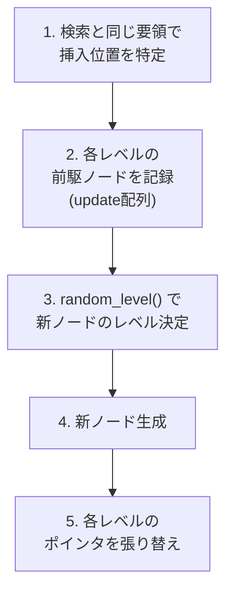
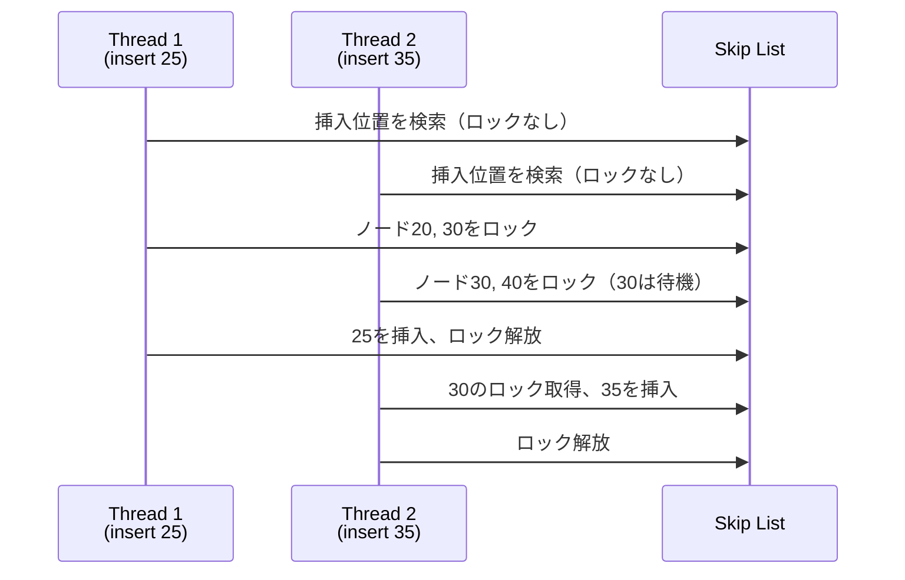
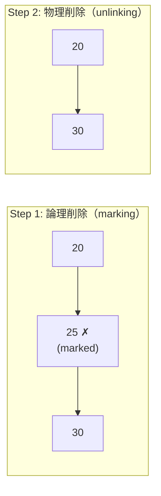
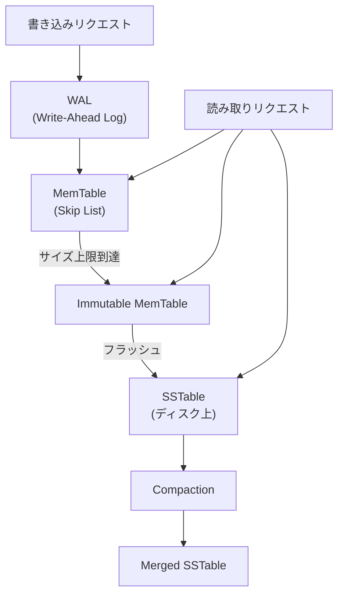
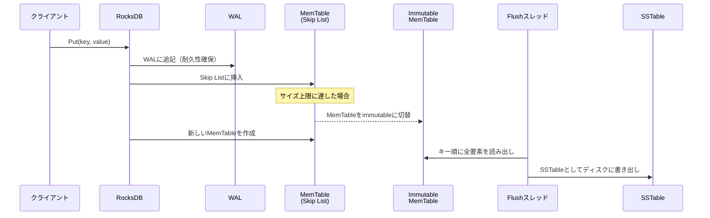

# Skip List — 確率が支える優雅な順序付きデータ構造

## 1. Skip Listとは

### 1.1 連結リストの限界

ソートされたデータを保持し、効率的に検索・挿入・削除を行いたいという要求は、コンピュータサイエンスの最も基本的な課題のひとつである。ソート済み連結リストはデータを順序通りに保持できるが、検索には先頭から順に辿るしかなく、$O(n)$ の時間計算量がかかる。配列を使えば二分探索で $O(\log n)$ の検索が可能だが、挿入・削除に $O(n)$ の要素移動が必要となる。

平衡二分探索木（AVL木、赤黒木）はこれらの操作すべてを $O(\log n)$ で実現できるが、回転操作を中心とした複雑な実装が必要であり、正しく書くのは容易ではない。

**Skip List（スキップリスト）**は、1990年にWilliam Pughによって発表されたデータ構造で、ソート済み連結リストに「飛ばし読み」のためのレイヤーを確率的に追加することで、平衡木と同等の期待計算量を、はるかにシンプルな実装で実現する。

### 1.2 基本的なアイデア

Skip Listの核心は極めて直感的である。ソート済み連結リストの上に、要素を間引いた「高速道路」のような層を重ねていく。

最も下のレベル（レベル0）にはすべての要素が含まれる。レベル1にはおよそ半分の要素、レベル2にはさらにその半分、というように、上位レベルに行くほど要素が疎になっていく。検索時は最上位レベルから開始し、目的の値を「通り過ぎた」ら一つ下のレベルに降りて細かく探索する。これは、高速道路からインターチェンジで降りて一般道に入る、というアナロジーで理解できる。

```mermaid
graph LR
    subgraph "Level 3"
        H3["HEAD"] --> N3_30["30"] --> T3["TAIL"]
    end
    subgraph "Level 2"
        H2["HEAD"] --> N2_10["10"] --> N2_30["30"] --> N2_50["50"] --> T2["TAIL"]
    end
    subgraph "Level 1"
        H1["HEAD"] --> N1_5["5"] --> N1_10["10"] --> N1_20["20"] --> N1_30["30"] --> N1_40["40"] --> N1_50["50"] --> T1["TAIL"]
    end
    subgraph "Level 0"
        H0["HEAD"] --> N0_3["3"] --> N0_5["5"] --> N0_7["7"] --> N0_10["10"] --> N0_15["15"] --> N0_20["20"] --> N0_25["25"] --> N0_30["30"] --> N0_35["35"] --> N0_40["40"] --> N0_45["45"] --> N0_50["50"] --> T0["TAIL"]
    end
```



上の図では、レベル0には13個の要素すべてが含まれ、レベル1には約半分、レベル2にはさらにその半分、レベル3には1つの要素だけが存在する。たとえば値 `25` を検索する場合、まずレベル3でHEADから30に進もうとするが30 > 25なのでレベル2に降りる。レベル2で10に進み、次の30は25を超えるのでレベル1に降りる。レベル1で20に進み、次の30は25を超えるのでレベル0に降りる。レベル0で25を見つけて終了、という流れになる。

### 1.3 Pughの論文

Skip Listは1990年にウィリアム・プー（William Pugh）が論文 *"Skip Lists: A Probabilistic Alternative to Balanced Trees"* で発表した。Pughの主張は明確であった。平衡木は理論的には美しいが、実装が複雑でバグを生みやすい。Skip Listは確率的なアプローチにより、同等の期待性能をはるかにシンプルなコードで達成できる、と。

この論文の画期的な点は、データ構造に**乱択（randomization）**を取り入れることで、入力データのパターンに依存しない性能保証を確率的に得られることを示したことである。決定的な平衡木では最悪ケースの入力パターン（例：ソート済みデータの逐次挿入）に対抗するため複雑な再構築が必要だが、Skip Listでは各ノードのレベルをランダムに決定するだけで、高い確率で均衡のとれた構造が維持される。

## 2. 確率的データ構造としての位置づけ

### 2.1 確率的データ構造とは

確率的データ構造（probabilistic data structure）とは、乱数を用いることで性能やメモリ効率を高めるデータ構造の総称である。確率的データ構造はいくつかのカテゴリに分けられる。

1. **近似的回答を返すもの** — Bloom Filter、Count-Min Sketch、HyperLogLogなど。結果に一定の誤差を許容する代わりに、メモリ使用量やクエリ速度を劇的に改善する。
2. **正確な回答を返すが、性能が確率的であるもの** — Skip List、Treap、ランダム化クイックソートなど。結果は常に正しいが、実行時間が確率変数となる。

Skip Listは後者に分類される。検索・挿入・削除の結果は常に正しい。しかし、その実行時間は各ノードのレベル割り当てに使われた乱数に依存し、期待計算量として $O(\log n)$ が保証される。最悪ケースは $O(n)$ だが、その発生確率は極めて小さい。

### 2.2 乱択アルゴリズムとの関係

乱択アルゴリズム（randomized algorithm）は大きく2つに分類される。

- **ラスベガスアルゴリズム（Las Vegas algorithm）**: 常に正しい結果を返すが、実行時間がランダム。期待実行時間で評価する。
- **モンテカルロアルゴリズム（Monte Carlo algorithm）**: 実行時間は確定的だが、結果に一定確率で誤りがある。

Skip Listの操作はラスベガス型である。「必ず正しい答えを返すが、かかる時間はランダム」という性質を持つ。これは平衡木の決定的な最悪ケース $O(\log n)$ 保証とは異なるが、実用上は十分な保証を提供する。

### 2.3 平衡の維持：決定的 vs. 確率的

従来の平衡木が**明示的な再構築**（回転操作）によって平衡を維持するのに対し、Skip Listは**確率的な構造生成**によって「期待値として平衡な構造」を生み出す。

この違いがもたらす実務的な利点は大きい。

| 観点 | 平衡木（赤黒木など） | Skip List |
|---|---|---|
| 平衡の維持方法 | 決定的な回転操作 | 確率的なレベル割り当て |
| 実装の複雑さ | 高い（多数のケース分岐） | 低い（シンプルなループ） |
| 最悪ケースの計算量 | $O(\log n)$ （保証） | $O(n)$ （極めて低確率） |
| 期待計算量 | $O(\log n)$ | $O(\log n)$ |
| 入力パターンへの依存 | なし | なし |

## 3. 検索・挿入・削除の仕組み

### 3.1 ノードの構造

Skip Listの各ノードは、キーと値（任意）、そして複数のレベルに対応する「前方ポインタ（forward pointer）」の配列を持つ。レベル $i$ のノードは、レベル $0$ からレベル $i$ までのすべてのレベルに存在し、各レベルで次の同レベル以上のノードへのポインタを保持する。

```python
class Node:
    def __init__(self, key, value, level):
        self.key = key          # key for ordering
        self.value = value      # associated value
        self.forward = [None] * (level + 1)  # forward pointers for each level
```

Skip List全体は、ヘッダーノード（番兵）、現在の最大レベル、そして確率パラメータ $p$ を保持する。

```python
class SkipList:
    def __init__(self, max_level, p=0.5):
        self.max_level = max_level  # maximum number of levels
        self.p = p                  # probability for level promotion
        self.level = 0              # current highest level in use
        self.header = Node(None, None, max_level)  # sentinel header node
```

### 3.2 検索アルゴリズム

検索は Skip List の最も基本的な操作であり、他のすべての操作の土台となる。アルゴリズムは以下のとおりである。

1. ヘッダーノードから、現在の最大レベルで開始する。
2. 現在のレベルで前方ポインタが指すノードのキーが検索キーより小さければ、そのノードへ進む。
3. 前方ポインタが指すノードのキーが検索キー以上であるか、前方ポインタが `None` であれば、一つ下のレベルに降りる。
4. レベル0で目的のキーを持つノードに到達すれば検索成功。到達しなければ検索失敗。

```python
def search(self, key):
    current = self.header
    # Start from the highest level, move down
    for i in range(self.level, -1, -1):
        while (current.forward[i] is not None and
               current.forward[i].key < key):
            current = current.forward[i]
    # Move to the candidate node at level 0
    current = current.forward[0]
    if current is not None and current.key == key:
        return current.value
    return None
```

検索の経路を視覚化してみよう。キー `25` を検索する場合を考える。

```
Level 3: HEAD -----> 30 → (30 > 25, drop down)
Level 2: HEAD → 10 -----> 30 → (30 > 25, drop down)
Level 1: HEAD → ... → 10 → 20 -----> 30 → (30 > 25, drop down)
Level 0: HEAD → ... → 20 → 25 ✓ (found!)
```

各レベルで「右に行けるだけ行き、行けなくなったら下に降りる」という動作を繰り返すだけで、対数的な時間で目的の要素に到達できる。

### 3.3 挿入アルゴリズム

挿入は検索に加えて、新しいノードのレベル決定とポインタの張り替えを行う。

1. 検索と同じ要領で挿入位置を探しながら、各レベルで「一つ手前のノード」を `update` 配列に記録する。
2. 乱数によって新しいノードのレベルを決定する（詳細は第5節で述べる）。
3. 新しいノードを生成し、各レベルのポインタを張り替える。

```python
def insert(self, key, value):
    update = [None] * (self.max_level + 1)
    current = self.header

    # Find the position and record predecessors at each level
    for i in range(self.level, -1, -1):
        while (current.forward[i] is not None and
               current.forward[i].key < key):
            current = current.forward[i]
        update[i] = current

    current = current.forward[0]

    # If key already exists, update the value
    if current is not None and current.key == key:
        current.value = value
        return

    # Determine the level of the new node
    new_level = self.random_level()

    # If the new level exceeds the current max, update headers
    if new_level > self.level:
        for i in range(self.level + 1, new_level + 1):
            update[i] = self.header
        self.level = new_level

    # Create the new node and splice it in
    new_node = Node(key, value, new_level)
    for i in range(new_level + 1):
        new_node.forward[i] = update[i].forward[i]
        update[i].forward[i] = new_node
```

挿入操作のポイントは、ポインタの張り替えが各レベルで独立に行えることである。連結リストの挿入操作を複数レベルで行うだけなので、平衡木の回転操作のような複雑なケース分析は不要である。



### 3.4 削除アルゴリズム

削除は挿入と対称的な操作である。

1. 検索と同じ要領で削除対象のノードを見つけ、各レベルの前駆ノードを `update` 配列に記録する。
2. 対象ノードが見つかった場合、各レベルのポインタを張り替えて対象ノードを取り外す。
3. 最上位レベルが空になった場合、全体のレベルを下げる。

```python
def delete(self, key):
    update = [None] * (self.max_level + 1)
    current = self.header

    # Find the node and record predecessors
    for i in range(self.level, -1, -1):
        while (current.forward[i] is not None and
               current.forward[i].key < key):
            current = current.forward[i]
        update[i] = current

    current = current.forward[0]

    if current is not None and current.key == key:
        # Remove the node from each level
        for i in range(self.level + 1):
            if update[i].forward[i] != current:
                break
            update[i].forward[i] = current.forward[i]

        # Decrease the level if top levels are now empty
        while self.level > 0 and self.header.forward[self.level] is None:
            self.level -= 1
```

削除も、各レベルで連結リストの削除を行うだけであり、平衡木のような複雑な再平衡化（rebalancing）は一切必要ない。ノードを除去しても、残りのノードのレベルは変わらないため、確率的な平衡は自然に維持される。

### 3.5 範囲検索

Skip Listの大きな利点のひとつは、効率的な範囲検索が可能なことである。下限キーを検索した後、レベル0を順に辿るだけで、ソート順に要素を取得できる。

```python
def range_query(self, low, high):
    results = []
    current = self.header
    # Find the starting point (first element >= low)
    for i in range(self.level, -1, -1):
        while (current.forward[i] is not None and
               current.forward[i].key < low):
            current = current.forward[i]
    current = current.forward[0]
    # Traverse level 0 until we exceed high
    while current is not None and current.key <= high:
        results.append((current.key, current.value))
        current = current.forward[0]
    return results
```

この範囲検索の計算量は、下限の検索に $O(\log n)$、範囲内の $k$ 個の要素の列挙に $O(k)$ で、合計 $O(\log n + k)$ となる。これは平衡木の範囲検索と同等の効率である。

## 4. 期待計算量の解析

### 4.1 検索コストのモデル化

Skip Listの期待検索コストを解析するために、Pughが論文で用いた**逆方向解析（backward analysis）**を紹介する。これは、検索経路を逆に辿ることで、各レベルでの期待ステップ数を求める手法である。

検索が目的のノードに到達した時点から、経路を逆に辿ることを考える。逆方向に辿る際、各ステップで以下の2つの遷移がある。

- **左に移動する**（同じレベルで前のノードへ）: 現在のノードのレベルがちょうど現在のレベルであった場合。
- **上に移動する**（ひとつ上のレベルへ）: 現在のノードがさらに上のレベルまで延びていた場合。

確率パラメータを $p$ とすると、あるノードがレベル $i$ に存在するとき、レベル $i+1$ にも存在する確率は $p$ である。逆方向に辿る際、「上に移動する」確率は $p$、「左に移動する」確率は $1 - p$ である。

### 4.2 1レベルあたりの期待ステップ数

レベル $i$ からレベル $i+1$ に上がるまでに左に移動する回数を $C(k)$ と表す。ここで $k$ はまだ上に移動していないことを意味する。$C(k)$ の期待値を求めよう。

$$
E[C(k)] = (1 - p) \cdot (1 + E[C(k)]) + p \cdot 0
$$

これは、確率 $1-p$ で左に1つ移動し（コスト1を払って同じ状態に戻る）、確率 $p$ で上に移動する（コスト0で終了）という再帰的な関係である。解くと、

$$
E[C(k)] = (1-p) + (1-p) \cdot E[C(k)]
$$
$$
E[C(k)] - (1-p) \cdot E[C(k)] = 1 - p
$$
$$
p \cdot E[C(k)] = 1 - p
$$
$$
E[C(k)] = \frac{1-p}{p}
$$

つまり、1レベルを上がるまでに期待 $\frac{1-p}{p}$ ステップ左に移動する。$p = 1/2$ の場合、これは $\frac{1/2}{1/2} = 1$ ステップとなる。

### 4.3 全体の期待検索コスト

Skip Listの期待レベル数は $O(\log_{1/p} n)$ である。$n$ 個の要素を持つSkip Listの期待最大レベルは、

$$
E[\text{maxLevel}] = \log_{1/p} n + O(1)
$$

で与えられる。これは、レベル $k$ に存在するノード数の期待値が $n \cdot p^k$ であり、$n \cdot p^k = 1$ となるのが $k = \log_{1/p} n$ のときだからである。

検索全体の期待コストは、各レベルでの期待ステップ数の合計である。

$$
E[\text{search cost}] = \frac{1-p}{p} \cdot \log_{1/p} n + O(1) = \frac{\log n}{\log(1/p)} \cdot \frac{1-p}{p} + O(1)
$$

$p = 1/2$ の場合、

$$
E[\text{search cost}] = \frac{\log n}{\log 2} \cdot 1 + O(1) = \log_2 n + O(1)
$$

これは赤黒木やAVL木と同等の検索効率である。

### 4.4 最適な確率 $p$ の選択

期待検索コストを $p$ の関数として考えると、$p = 1/2$ が最小とは限らない。Pughの論文では、コストをレベルあたりの比較回数と上方向への移動コストの合計として分析し、$p = 1/2$ が計算量の面では最適であるとしている。

しかし、$p$ はメモリ使用量にも影響する。各ノードの平均ポインタ数は、

$$
E[\text{pointers per node}] = \sum_{i=0}^{\infty} p^i = \frac{1}{1-p}
$$

で与えられる。$p$ ごとのポインタ数とコストの関係をまとめると以下のようになる。

| $p$ | 平均ポインタ数/ノード | 検索コスト（比較回数の係数） |
|---|---|---|
| $1/4$ | 1.33 | $\frac{3}{4} \cdot \log_4 n \approx 0.375 \log_2 n$ ... ただし比較をレベル分 |
| $1/2$ | 2.00 | $\log_2 n$ |
| $1/e$ | 1.58 | $e \cdot \ln n / (e-1) \approx 1.58 \log_2 n \cdot ...$ |

実用上は $p = 1/2$ または $p = 1/4$ がよく使われる。$p = 1/4$ はメモリ効率が良く（ノードあたり平均1.33ポインタ）、検索コストは $p = 1/2$ の約2倍だが、キャッシュ効率の改善がこれを補う場合がある。Pughの元の論文でも $p = 1/4$ を推奨するケースがある。

### 4.5 期待空間計算量

$n$ 個のノードを持つSkip Listの期待空間計算量を求める。各ノードのレベルは独立にジオメトリック分布（幾何分布）に従うため、全ノードのポインタ数の期待値は、

$$
E[\text{total pointers}] = n \cdot \frac{1}{1-p}
$$

$p = 1/2$ の場合は $2n$、$p = 1/4$ の場合は $\frac{4n}{3} \approx 1.33n$ となる。つまり、空間計算量は $O(n)$ であり、平衡木と同様にデータ量に比例する。

## 5. レベル決定の確率

### 5.1 幾何分布によるレベル生成

Skip Listの心臓部は、新しいノードのレベルをランダムに決定する `randomLevel()` 関数である。この関数は、確率 $p$ で「もう1レベル上げる」ことをコイントスのように繰り返し、初めて「上げない」が出たところで止める。

```python
import random

def random_level(self):
    level = 0
    while random.random() < self.p and level < self.max_level:
        level += 1
    return level
```

このレベルは**幾何分布（geometric distribution）**に従う。レベル $k$ が生成される確率は、

$$
P(\text{level} = k) = p^k \cdot (1 - p) \quad (k = 0, 1, 2, \ldots)
$$

ただし、最大レベル $L$ の制約があるため、実際には打ち切り幾何分布となる。

### 5.2 レベルの期待値

最大レベルの制約を無視した場合、レベルの期待値は、

$$
E[\text{level}] = \sum_{k=0}^{\infty} k \cdot p^k \cdot (1-p) = \frac{p}{1-p}
$$

$p = 1/2$ の場合は $E[\text{level}] = 1$、$p = 1/4$ の場合は $E[\text{level}] = 1/3$ である。

### 5.3 最大レベルの設定

最大レベル $L$ は、$n$ 個の要素に対して $L = \log_{1/p} n$ 程度に設定するのが適切である。たとえば $p = 1/2$ で $n = 2^{20} \approx 100$ 万要素を格納する場合、$L = 20$ が妥当な設定となる。

レベル $k$ に少なくとも1つのノードが存在する確率は、

$$
P(\text{level } k \text{ に少なくとも1ノード}) = 1 - (1 - p^k)^n
$$

$n \cdot p^k \ll 1$ のとき、この確率は $n \cdot p^k$ に近似でき、非常に小さくなる。したがって、$L$ を $\log_{1/p} n$ より大幅に超えて設定しても、無駄にメモリを消費するだけで意味がない。

### 5.4 乱数生成の効率化

`randomLevel()` で使う乱数の質と速度は、Skip Listの実用性能に直結する。暗号学的に安全な乱数は不要であり、高速な擬似乱数生成器（PRNG）で十分である。

$p = 1/2$ の場合、特に効率的な実装がある。ランダムな整数を1つ生成し、最下位ビットから連続する1のビット数を数えるだけでよい。

```c
int random_level() {
    int level = 0;
    // Use random bits; count trailing ones (for p = 1/2)
    unsigned int r = rand();
    while ((r & 1) && level < MAX_LEVEL) {
        level++;
        r >>= 1;
    }
    return level;
}
```

さらに高速な実装では、CTZ（Count Trailing Zeros）命令を利用してビット列から一度にレベルを求めることもできる。

```c
int random_level_fast() {
    unsigned int r = rand();
    if (r == 0) return MAX_LEVEL;
    // __builtin_ctz counts trailing zero bits
    // For p=1/2, we count trailing 1-bits = ctz(~r)
    int level = __builtin_ctz(~r);
    return level < MAX_LEVEL ? level : MAX_LEVEL;
}
```

$p = 1/4$ の場合は、2ビットずつ見て `00` が出るまでレベルを上げる、という方法が使える。

## 6. 並行Skip List

### 6.1 並行データ構造の課題

マルチスレッド環境で共有データ構造を安全に操作することは、現代のシステム設計における重要な課題である。平衡木の並行化は非常に困難である。回転操作はノードの親子関係を変更するため、複数のノードを同時にロックする必要があり、デッドロックの回避やロック順序の管理が複雑になる。

Skip Listは構造的に並行処理に適している。その理由は以下のとおりである。

1. **局所的な変更のみで済む**: 挿入・削除は影響するポインタの張り替えだけで完了し、木の回転のようなグローバルな構造変更が起きない。
2. **独立なレベル**: 各レベルは独立した連結リストであり、異なるレベルの操作は基本的に干渉しない。
3. **回転操作がない**: 平衡木で問題となる回転操作が存在しないため、親子関係の変更に伴う複雑なロック管理が不要。

### 6.2 ロックベースの並行Skip List

最も直感的な並行化手法は、細粒度ロック（fine-grained locking）を用いるものである。各ノードにロックを持たせ、操作に必要なノードだけをロックする。



Herlihy らの手法では、**楽観的探索（optimistic traversal）**と**検証後ロック（lock-and-validate）**を組み合わせる。

1. ロックを取得せずに挿入・削除位置を検索する（楽観的フェーズ）。
2. 影響を受けるノードのロックを下位レベルから取得する。
3. ロックを取得した後、検索時の情報がまだ有効かどうかを検証する。
4. 有効であればポインタを張り替え、無効であればロックを解放してリトライする。

この手法は高い並行性を実現するが、検証の失敗によるリトライが発生しうる。

### 6.3 ロックフリーSkip List

ロックフリー（lock-free）のSkip Listは、CAS（Compare-And-Swap）命令を用いて、ロックなしで安全な並行操作を実現する。

Fraserの博士論文（2004年）で提案されたロックフリーSkip Listのアルゴリズムは、以下の核心的なアイデアに基づく。

**論理削除と物理削除の分離**: ノードの削除を2段階に分ける。

1. **論理削除（marking）**: ノードの前方ポインタにマークビットを設定し、「このノードは削除予定である」ことを示す。
2. **物理削除（unlinking）**: マークされたノードのポインタを張り替えて、実際にリストから切り離す。



CAS操作を用いてポインタの更新をアトミックに行うことで、複数のスレッドが同時にリストを変更しても整合性が保たれる。マークされたノードを発見したスレッドは、通過する際にそのノードの物理削除を「手助け」することがある（helping）。

### 6.4 Java ConcurrentSkipListMap

Javaの標準ライブラリに含まれる `ConcurrentSkipListMap` は、並行Skip Listの実用的な実装として広く利用されている。Doug Leaによって実装されたこのクラスは、ロックフリーのアルゴリズムに基づき、高い並行性を実現している。

`ConcurrentSkipListMap` は `NavigableMap` インターフェースを実装し、以下の特徴を持つ。

- **ソート済みマップ**: キーの自然順序またはカスタムComparatorによるソート。
- **ロックフリー操作**: `get()`、`put()`、`remove()` がすべてロックフリー。
- **弱い一貫性（weak consistency）のイテレータ**: `ConcurrentModificationException` をスローしない。
- **原子的なバルク操作なし**: `putAll()` などは原子的ではない。

Java の並行コレクションフレームワークにおいて、`ConcurrentSkipListMap` は `ConcurrentHashMap` の順序付き版として位置づけられている。ハッシュマップでは提供できない範囲検索や順序付き走査が必要な場合に選択される。

## 7. MemTable（LevelDB/RocksDB）での採用

### 7.1 LSM-TreeアーキテクチャにおけるMemTable

Skip Listが実世界で最も重要な採用事例のひとつが、LSM-Tree（Log-Structured Merge-Tree）ベースのストレージエンジンにおける**MemTable**の実装である。

LSM-Treeは、書き込みをまずメモリ上のバッファ（MemTable）に蓄積し、一定量に達したらソート済みファイル（SSTable）としてディスクにフラッシュする、という二段構成をとる。



MemTableには以下の要件がある。

1. **高速な書き込み**: すべてのキーバリューペアがまずMemTableに書かれるため、挿入が高速でなければならない。
2. **順序付き走査**: MemTableからSSTableへのフラッシュ時に、キー順にデータを取り出す必要がある。
3. **並行アクセス**: 読み取りと書き込みが同時に発生する可能性がある。
4. **ポイント検索**: 特定のキーの検索が高速であること。

### 7.2 なぜSkip Listが選ばれるのか

これらの要件に対し、Skip Listはほぼ理想的な選択肢である。

| 要件 | Skip List | 赤黒木 | ハッシュテーブル |
|---|---|---|---|
| 挿入 $O(\log n)$ | ○ | ○ | ○ ($O(1)$ 期待) |
| 順序付き走査 | ○（レベル0を辿る） | ○（中間順走査） | × |
| 並行アクセス | ◎（ロックフリー可能） | △（回転が困難） | △ |
| 実装の単純さ | ◎ | △ | ○ |

特に重要なのは並行アクセスの要件である。LevelDBやRocksDBのようなストレージエンジンでは、読み取りスレッドと書き込みスレッドが同時にMemTableにアクセスする。Skip Listのロックフリー実装は、この要件を効率的に満たす。

### 7.3 LevelDBのSkip List実装

GoogleのLevelDBでは、MemTableの内部データ構造としてSkip Listが使われている。LevelDB の Skip List 実装は以下の特徴を持つ。

- **単一ライター、複数リーダー**のモデルを採用。書き込みは1スレッドからのみ行い、読み取りは複数スレッドから同時に行える。
- **ロックフリーの読み取り**: `std::atomic` とメモリオーダリングを利用し、読み取りスレッドはロックなしでSkip Listを走査できる。
- **アリーナアロケータ**: ノードのメモリ割り当てにアリーナ（メモリプール）を使用し、個別の `malloc/free` を避けることで、メモリフラグメンテーションを防ぎ割り当て速度を向上させる。MemTable全体が不要になったら、アリーナごと一括解放する。
- **最大レベルは12**: $p = 1/4$ で最大レベル12に設定されており、$4^{12} = 16{,}777{,}216$ 個の要素まで十分に対応できる。

### 7.4 RocksDBにおける拡張

FacebookのRocksDBはLevelDBをフォークして開発されたストレージエンジンで、Skip Listの実装もいくつかの改良が加えられている。

- **InlineSkipList**: ノードのキーデータをノード構造体に直接インライン化することで、ポインタの追跡回数を減らし、キャッシュ効率を向上させている。
- **並行挿入のサポート**: LevelDBの単一ライターモデルに対し、RocksDBではCASベースの並行挿入をサポートしている。これにより、複数のスレッドが同時にMemTableに書き込むことが可能となった。
- **代替MemTable実装**: RocksDBではSkip List以外にも、HashSkipList（プレフィックスハッシュ + Skip List）やHashLinkList、Vector Memtableなどの代替実装を選択できる。ワークロードの特性に応じて最適な実装を選べる柔軟な設計となっている。

### 7.5 書き込みパスの全体像

実際の書き込みが行われる流れを、RocksDBを例に追跡してみよう。



この流れにおいて、Skip Listの順序付き走査性能がSSTableの効率的な生成を支えていることがわかる。レベル0のリンクを先頭から辿るだけで、ソート済みのキーバリューペアを取り出せるのである。

## 8. 平衡木との比較

### 8.1 赤黒木との詳細比較

Skip Listと赤黒木は、同じ問題領域（動的な順序付き集合）に対する異なるアプローチである。両者を多角的に比較する。

#### 計算量

| 操作 | Skip List（期待） | Skip List（最悪） | 赤黒木（最悪） |
|---|---|---|---|
| 検索 | $O(\log n)$ | $O(n)$ | $O(\log n)$ |
| 挿入 | $O(\log n)$ | $O(n)$ | $O(\log n)$ |
| 削除 | $O(\log n)$ | $O(n)$ | $O(\log n)$ |
| 範囲検索 | $O(\log n + k)$ | $O(n + k)$ | $O(\log n + k)$ |
| 最小値/最大値 | $O(1)$※ | $O(1)$※ | $O(\log n)$ |

※ Skip Listでは先頭・末尾へのポインタを保持していれば $O(1)$ で取得可能。

#### 実装の複雑さ

赤黒木の挿入では、叔父ノードの色に応じて回転方向を決定する複数のケースを処理する必要がある。代表的な実装では、挿入後の修正に3つのケース（左回転、右回転、色の反転）が存在し、削除はさらに複雑で4つ以上のケースに分岐する。

Skip Listの挿入は、本質的に「正しい位置を見つけて、各レベルでポインタを2本つなぎ替える」だけである。ケース分析が存在しない。削除も対称的で、ポインタをつなぎ替えるだけである。

#### メモリ使用量

赤黒木では、各ノードに左子・右子へのポインタ（2本）と親へのポインタ（実装による）、色情報（1ビット、通常は1バイトに拡張）が必要である。

Skip Listでは、各ノードに平均 $\frac{1}{1-p}$ 本のポインタが必要である。$p = 1/2$ では2本、$p = 1/4$ では約1.33本となる。$p = 1/4$ のSkip Listは、赤黒木よりもメモリ効率が良い可能性がある。

#### キャッシュ効率

現代のCPUにおいて、キャッシュ効率は理論的な計算量と同等以上に性能を左右する要因である。

赤黒木はポインタ構造が複雑で、走査時にメモリ上の離れた位置にジャンプしやすい。特に中間順走査（in-order traversal）では、スタックを用いた再帰的な走査が必要であり、キャッシュミスが多発する。

Skip Listのレベル0は単純な連結リストであり、順方向の走査はポインタを1本辿るだけで済む。ただし、連結リスト自体がキャッシュに不親和的であるため、配列ベースのデータ構造（B-Tree、ソート済み配列）と比較するとキャッシュ効率は劣る。

### 8.2 AVL木との比較

AVL木はすべてのノードで左右の部分木の高さの差が1以下であることを保証するため、赤黒木よりも厳密に平衡である。その結果、検索は赤黒木より若干速い（木の高さが低いため）が、挿入・削除時の回転操作がより頻繁に発生する。

Skip Listは検索性能の面ではAVL木に劣る可能性があるが（確率的な平衡 vs. 厳密な平衡）、挿入・削除の実装はAVL木よりもはるかにシンプルである。

### 8.3 B-Treeとの比較

B-Treeは主にディスクベースのストレージで使われるが、メモリ内での使用も増えている。

| 観点 | Skip List | B-Tree |
|---|---|---|
| キャッシュ効率 | 低い（ポインタ追跡） | 高い（ノード内は配列） |
| 並行制御 | 容易 | 中程度（ページ分割の管理） |
| 範囲検索 | 効率的 | 非常に効率的 |
| 実装の複雑さ | 低い | 中〜高（分割・マージ） |
| 最悪ケース保証 | なし（確率的） | あり（決定的） |

メモリ上の順序付きデータ構造としては、キャッシュ効率の面でB-Treeに分がある。しかし、並行制御の容易さではSkip Listが優位であり、これがMemTableでの採用理由のひとつとなっている。

### 8.4 Treapとの比較

Treap（tree + heap）もランダム化を用いた平衡探索木である。各ノードにランダムな優先度を割り当て、キーに関しては二分探索木の性質を、優先度に関してはヒープの性質を維持する。

| 観点 | Skip List | Treap |
|---|---|---|
| 平衡化の方法 | レベルのランダム決定 | 優先度による回転 |
| 回転操作 | なし | あり |
| 並行化の容易さ | 高い | 低い（回転が障害） |
| 空間計算量 | $O(n / (1-p))$ | $O(n)$ |
| 実装の単純さ | 高い | 中程度 |

Treapは回転操作を伴うため、Skip Listほど並行化に適していない。一方、空間効率ではTreapが優れる。

## 9. 実装のポイント

### 9.1 番兵ノードの活用

実装を簡潔にするために、ヘッダー（HEAD）とテイル（TAIL）の番兵ノード（sentinel node）を用意することが推奨される。HEADは $-\infty$、TAILは $+\infty$ のキーを持つとみなす。これにより、境界条件のチェックを減らすことができる。

ただし、多くの実装ではTAILを省略し、ポインタが `None`/`NULL` であることで「これ以上先がない」ことを表現する。

### 9.2 メモリ管理

Skip Listのノードはレベルごとにポインタ配列のサイズが異なる。これに対する一般的なアプローチは以下のとおりである。

**固定長配列方式**: すべてのノードに最大レベル分のポインタ配列を確保する。メモリ効率は悪いが、実装は最も単純。

**可変長配列方式**: ノードのレベルに応じたサイズのポインタ配列を動的に確保する。C言語では構造体の末尾にフレキシブル配列メンバを使う。

```c
typedef struct node {
    int key;
    int value;
    int level;
    struct node *forward[];  // flexible array member
} Node;

Node *create_node(int key, int value, int level) {
    // Allocate node + space for (level+1) forward pointers
    Node *n = malloc(sizeof(Node) + (level + 1) * sizeof(Node *));
    n->key = key;
    n->value = value;
    n->level = level;
    for (int i = 0; i <= level; i++) {
        n->forward[i] = NULL;
    }
    return n;
}
```

**アリーナアロケータ方式**: LevelDBが採用する方式。大きなメモリブロックを事前に確保し、その中から切り出していく。MemTableのように「全体がまとめて不要になる」ユースケースでは、個別の解放が不要なため、アリーナアロケータが極めて効率的である。

### 9.3 イテレータの設計

Skip Listのイテレータは、レベル0のリンクを辿ることで実装できる。

```python
class SkipListIterator:
    def __init__(self, skip_list):
        self.current = skip_list.header.forward[0]

    def valid(self):
        return self.current is not None

    def key(self):
        return self.current.key

    def value(self):
        return self.current.value

    def next(self):
        # Move to the next node at level 0
        self.current = self.current.forward[0]

    def seek(self, target):
        # Use the skip list's search to find the first node >= target
        # (simplified; full implementation would traverse from header)
        pass
```

`Seek` 操作は、検索アルゴリズムと同様に上位レベルから探索して目的の位置にジャンプする。これにより、イテレータのランダムアクセスが $O(\log n)$ で可能になる。LevelDB/RocksDBのMemTableイテレータはこの `Seek` を頻繁に利用しており、Compaction時やポイント検索時の性能を支えている。

### 9.4 逆方向ポインタ

標準的なSkip Listは前方ポインタのみを持つが、逆方向の走査が必要な場合には後方ポインタ（backward pointer）を追加できる。ただし、すべてのレベルに後方ポインタを持たせるとメモリ消費が倍増するため、レベル0にのみ後方ポインタを持たせるのが一般的である。

Redisの実装では、レベル0にのみ後方ポインタを持たせる方式が採用されている。これにより、`ZREVRANGE` コマンドなどの逆順走査を効率的にサポートしている。

### 9.5 スパン（span）情報

Skip Listの各前方ポインタに「スパン（span）」情報を追加すると、ランク（順位）ベースの操作が可能になる。スパンとは、あるレベルの前方ポインタが飛び越すノード数のことである。

```python
class ForwardEntry:
    def __init__(self):
        self.node = None   # forward pointer
        self.span = 0      # number of nodes skipped
```

スパン情報を利用することで、以下の操作が $O(\log n)$ で実行可能になる。

- **ランクの取得**: 「このキーは先頭から何番目か？」
- **ランクによるアクセス**: 「先頭から $k$ 番目の要素は何か？」
- **範囲のカウント**: 「キー $a$ から $b$ の間に何個の要素があるか？」

Redisの Sorted Set（ZSET）ではこのスパン付きSkip Listが使われており、`ZRANK`、`ZRANGE` などのランクベース操作を効率的にサポートしている。

### 9.6 Redisにおける採用

RedisのSorted Setは、Skip ListとHashTableの組み合わせで実装されている。

- **Skip List**: 要素をスコア順に保持し、範囲検索やランクベースの操作をサポートする。
- **Hash Table**: キーからスコアへの $O(1)$ ルックアップを提供する。

Redisの作者であるSalvatore Sanfilippoは、赤黒木ではなくSkip Listを選んだ理由として以下を挙げている。

1. **実装のシンプルさ**: Skip Listは赤黒木よりもコードが短く、理解しやすく、デバッグしやすい。
2. **範囲操作の効率**: `ZRANGEBYSCORE` などの範囲操作では、Skip Listのレベル0を辿るだけでよく、実装が自然。
3. **メモリ効率**: 定数因子をチューニングしやすく、$p$ を調整することでメモリと速度のトレードオフを制御できる。
4. **拡張の容易さ**: スパン情報の追加など、機能拡張が平衡木より容易。

### 9.7 テストとデバッグ

Skip Listの確率的な性質は、テストにおいて特有の課題をもたらす。

**再現性の確保**: 乱数のシードを固定することで、テスト実行を再現可能にする。これはデバッグ時に不可欠である。

**不変条件の検証**: 以下の不変条件を定期的に検証するアサーション関数を実装しておくとよい。

1. レベル0にすべてのノードがソート順に含まれること。
2. 各レベル $i > 0$ のノードがレベル $i-1$ にも存在すること。
3. 各レベルの連結リストがソート順であること。
4. ノード数とレベルの統計が期待値から大きく逸脱していないこと。

```python
def validate(self):
    # Check sorted order at level 0
    current = self.header.forward[0]
    prev_key = None
    count = 0
    while current is not None:
        if prev_key is not None:
            assert current.key > prev_key, "Sort order violated"
        prev_key = current.key
        count += 1
        current = current.forward[0]

    # Check that higher level nodes are a subset of lower level nodes
    for lvl in range(1, self.level + 1):
        current = self.header.forward[lvl]
        while current is not None:
            # Verify this node also exists at level lvl-1
            assert current.forward[lvl - 1] is not None or lvl == current_level
            current = current.forward[lvl]
    return True
```

**ストレステスト**: 大量のランダムな操作（挿入・削除・検索の混合）を実行し、不変条件の違反がないことを確認する。このテストでは乱数シードを変えて多数回実行することが重要である。

### 9.8 性能チューニング

実運用におけるSkip Listの性能を最適化するためのポイントをいくつか挙げる。

**確率パラメータ $p$ の選択**: メモリ制約がある場合は $p = 1/4$ を選び、速度を優先する場合は $p = 1/2$ を選ぶ。実測に基づいて決定するのが望ましい。

**最大レベルの設定**: 想定される最大要素数 $N$ に対して $L = \lceil \log_{1/p} N \rceil$ 程度に設定する。大きすぎても小さすぎても性能が劣化する。

**メモリアロケータの選択**: ノードの割り当て・解放が頻繁に発生する場合、標準のアロケータよりもプールアロケータやアリーナアロケータが効果的である。特に、MemTableのように「全体を一括で破棄する」パターンではアリーナアロケータが圧倒的に有利である。

**プリフェッチ**: 検索経路が予測可能な場合、次にアクセスするノードのメモリアドレスを事前にプリフェッチすることで、キャッシュミスのレイテンシを隠蔽できる。

## 10. まとめ

Skip Listは、ソート済み連結リストに確率的な多層インデックスを付加することで、平衡木と同等の $O(\log n)$ 期待計算量を、はるかにシンプルな実装で実現するデータ構造である。

その本質的な魅力は以下の3点に集約される。

1. **実装の単純さ**: 回転操作やケース分析が不要であり、正確な実装が容易である。
2. **並行処理との親和性**: ロックフリーの実装が自然に行えるため、マルチスレッド環境での利用に適している。
3. **実用性の実証**: Redis、LevelDB、RocksDBをはじめとする多くのプロダクションシステムで採用され、その性能と信頼性が実証されている。

確率的な最悪ケース $O(n)$ が存在する点は理論的な弱点であるが、実用上これが問題になることは極めて稀であり、そのトレードオフは十分に受け入れられるものである。Pughの論文から30年以上が経過した現在も、Skip Listは平衡木の実用的な代替として、とくに並行環境やインメモリストレージエンジンにおいて不可欠なデータ構造であり続けている。
