# スロークエリ分析と最適化の実践

## 1. はじめに：なぜスロークエリが問題なのか

### 1.1 スロークエリの本質的な問題

データベースを利用するアプリケーションにおいて、応答速度はユーザー体験とシステムの安定性を左右する最も重要な要素の一つである。たった1本の遅いクエリが、アプリケーション全体の性能を崩壊させることがある。

スロークエリが引き起こす問題は、単に「レスポンスが遅い」だけではない。遅いクエリはデータベースの接続プールを長時間占有し、他のクエリの実行を待たせる。ロックを長時間保持することで、関連するテーブルへのアクセスがブロックされる。CPUやI/Oリソースを過度に消費し、システム全体のスループットを低下させる。

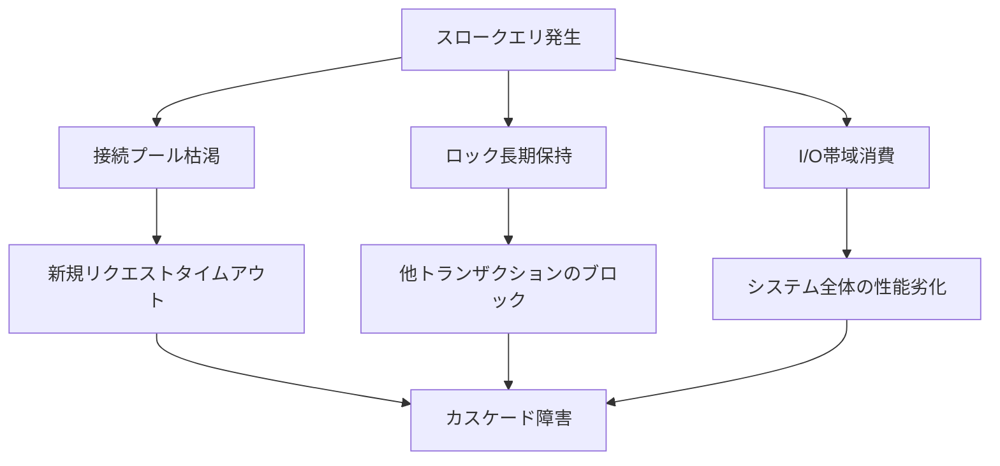

特に厄介なのは、スロークエリが引き起こす**カスケード障害**である。1本のクエリが接続を占有することで、次のリクエストが接続を取得できずにタイムアウトし、リトライによってさらに負荷が増大し、最終的にシステム全体がダウンする。本番環境で深夜に発生する障害の多くが、このパターンに起因している。

### 1.2 スロークエリはなぜ発生するか

スロークエリが発生する原因は多岐にわたるが、大きく分類すると以下のようになる。

| 原因カテゴリ | 具体例 | 影響度 |
|---|---|---|
| インデックスの欠如・不適切 | 必要なカラムにインデックスがない | 高 |
| クエリの書き方 | 暗黙の型変換、関数適用による索引無効化 | 高 |
| データ量の増大 | テーブルの肥大化、統計情報の陳腐化 | 中〜高 |
| アプリケーション設計 | N+1問題、不要な全件取得 | 高 |
| ハードウェアリソース | メモリ不足、ディスクI/Oの飽和 | 中 |
| ロック競合 | 長時間トランザクション、デッドロック | 中〜高 |

これらの原因を体系的に検出し、分析し、解決するための手法を、本記事では実践的に解説する。

## 2. スロークエリの検出方法

スロークエリを最適化するための第一歩は、どのクエリが遅いのかを正確に把握することである。主要なデータベースには、この検出を支援する仕組みが標準で備わっている。

### 2.1 MySQL: スロークエリログ

MySQLには**スロークエリログ（Slow Query Log）**という機能が組み込まれている。指定した閾値を超える実行時間のクエリを自動的にファイルに記録する仕組みである。

#### 設定方法

```sql
-- enable slow query log
SET GLOBAL slow_query_log = 1;
SET GLOBAL slow_query_log_file = '/var/log/mysql/slow.log';
SET GLOBAL long_query_time = 1;  -- threshold in seconds
SET GLOBAL log_queries_not_using_indexes = 1;  -- log queries without index usage
```

永続化するには `my.cnf`（または `my.ini`）に以下を記述する。

```ini
[mysqld]
slow_query_log = 1
slow_query_log_file = /var/log/mysql/slow.log
long_query_time = 1
log_queries_not_using_indexes = 1
```

`long_query_time` の値は環境に応じて調整する。開発環境では `0`（すべてのクエリを記録）に設定し、本番環境では `0.5`〜`1` 秒程度が一般的である。

#### スロークエリログの読み方

スロークエリログには以下のような情報が記録される。

```
# Time: 2026-03-02T10:15:32.456789Z
# User@Host: app_user[app_user] @ app-server [10.0.1.50]  Id: 12345
# Query_time: 3.456789  Lock_time: 0.000123  Rows_sent: 1  Rows_examined: 1500000
SET timestamp=1740912932;
SELECT * FROM orders WHERE customer_email = 'user@example.com';
```

ここで最も重要な指標は **`Rows_examined`**（検査行数）と **`Rows_sent`**（返却行数）の比率である。上の例では、150万行を検査して1行だけを返却している。この比率が大きいほど、クエリの効率が悪いことを示す。理想的には `Rows_examined / Rows_sent` の比率は1に近いほど良い。

#### mysqldumpslow による集計

ログが大量にたまった場合、MySQL付属の `mysqldumpslow` ツールで集計分析ができる。

```bash
# sort by total execution time, show top 10
mysqldumpslow -s t -t 10 /var/log/mysql/slow.log

# sort by average execution time
mysqldumpslow -s at -t 10 /var/log/mysql/slow.log

# sort by rows examined
mysqldumpslow -s r -t 10 /var/log/mysql/slow.log
```

`mysqldumpslow` はリテラル値を `S`（文字列）や `N`（数値）に正規化してくれるため、同じパターンのクエリをグループ化して分析できる。

::: tip 本番環境での推奨設定
本番環境では `long_query_time = 0` にして全クエリを記録し、pt-query-digest（Percona Toolkit）で分析する手法が広く採用されている。ディスク容量に注意が必要だが、問題発生時の原因調査が格段に容易になる。
:::

### 2.2 PostgreSQL: pg_stat_statements

PostgreSQLでは、**pg_stat_statements** 拡張モジュールがスロークエリ分析の中心的なツールである。これはクエリの実行統計をメモリ上に保持し、集約情報として提供する。

#### セットアップ

```sql
-- enable the extension (requires superuser)
CREATE EXTENSION IF NOT EXISTS pg_stat_statements;
```

`postgresql.conf` に以下を追記してサーバを再起動する。

```ini
shared_preload_libraries = 'pg_stat_statements'
pg_stat_statements.max = 10000          # max number of tracked statements
pg_stat_statements.track = all          # track all statements
pg_stat_statements.track_utility = on   # track utility commands (CREATE, ALTER, etc.)
```

#### 分析クエリ

pg_stat_statementsが蓄積したデータを活用して、さまざまな切り口からスロークエリを特定できる。

```sql
-- top 10 queries by total execution time
SELECT
    queryid,
    calls,
    round(total_exec_time::numeric, 2) AS total_time_ms,
    round(mean_exec_time::numeric, 2) AS avg_time_ms,
    round(stddev_exec_time::numeric, 2) AS stddev_time_ms,
    rows,
    query
FROM pg_stat_statements
ORDER BY total_exec_time DESC
LIMIT 10;
```

```sql
-- queries with high I/O cost (block reads)
SELECT
    queryid,
    calls,
    shared_blks_read + shared_blks_hit AS total_blks,
    round(
        100.0 * shared_blks_hit / NULLIF(shared_blks_read + shared_blks_hit, 0),
        2
    ) AS cache_hit_ratio,
    query
FROM pg_stat_statements
ORDER BY shared_blks_read DESC
LIMIT 10;
```

ここで特に注目すべき指標がいくつかある。

- **total_exec_time**: 累積実行時間。これが大きいクエリは、たとえ1回の実行が速くても、頻繁に呼ばれることでシステム全体に大きな影響を与えている
- **mean_exec_time と stddev_exec_time**: 平均実行時間と標準偏差。標準偏差が大きい場合、データ分布やキャッシュ状況によって性能が不安定であることを示す
- **shared_blks_read**: ディスクから読み取ったブロック数。キャッシュヒット率が低いクエリはI/Oボトルネックの候補

```sql
-- reset statistics (useful after optimization)
SELECT pg_stat_statements_reset();
```

::: warning pg_stat_statements の注意点
pg_stat_statementsはサーバのメモリ上に統計を保持するため、再起動すると情報が失われる。長期的なトレンド分析が必要な場合は、定期的に外部ストレージにエクスポートする仕組みを構築する必要がある。pgBadgerやDatadogなどの監視ツールとの連携が一般的である。
:::

### 2.3 検出のワークフロー

スロークエリの検出は、一度きりの作業ではなく、継続的なプロセスとして運用すべきである。以下のワークフローを定期的に回すことが推奨される。

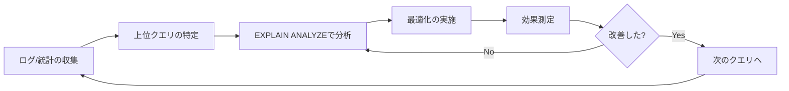

最も効果的なアプローチは、**累積実行時間（total_exec_time）の上位から順に最適化する**ことである。1回だけ遅いクエリよりも、1000回呼ばれてそれぞれ少し遅いクエリのほうが、システム全体への影響は大きい。

## 3. EXPLAIN / EXPLAIN ANALYZE の読み方

スロークエリを特定したら、次のステップは**実行計画（Execution Plan）**の分析である。実行計画は、データベースのクエリオプティマイザが「このクエリをどのように実行するか」を示した設計図であり、最適化の方針を決定するための最も重要な情報源である。

### 3.1 EXPLAIN と EXPLAIN ANALYZE の違い

| コマンド | 動作 | 実際の実行 | 用途 |
|---|---|---|---|
| `EXPLAIN` | オプティマイザの推定に基づく実行計画を表示 | しない | 更新系クエリの計画確認、安全な事前分析 |
| `EXPLAIN ANALYZE` | 実際にクエリを実行し、実測値を含む実行計画を表示 | する | 正確な性能分析 |

`EXPLAIN` は推定値のみを返すため、統計情報が古い場合や、パラメータ値によって実行計画が変わる場合には、実際の性能とずれることがある。一方、`EXPLAIN ANALYZE` はクエリを実際に実行するため、`UPDATE` や `DELETE` を分析する場合にはトランザクション内で実行してロールバックする必要がある。

```sql
-- safe analysis for UPDATE/DELETE queries
BEGIN;
EXPLAIN ANALYZE UPDATE orders SET status = 'shipped' WHERE id = 12345;
ROLLBACK;
```

### 3.2 PostgreSQL の実行計画を読む

PostgreSQLの `EXPLAIN ANALYZE` 出力は、ツリー構造で表現される実行計画の各ノードについて、推定値と実測値の両方を表示する。

```sql
EXPLAIN ANALYZE
SELECT o.id, o.order_date, c.name
FROM orders o
JOIN customers c ON o.customer_id = c.id
WHERE o.order_date >= '2026-01-01'
  AND o.status = 'completed';
```

出力例：

```
Hash Join  (cost=45.20..1250.35 rows=520 width=52) (actual time=0.892..15.234 rows=487 loops=1)
  Hash Cond: (o.customer_id = c.id)
  ->  Bitmap Heap Scan on orders o  (cost=32.50..1200.15 rows=520 width=20) (actual time=0.456..14.123 rows=487 loops=1)
        Recheck Cond: (order_date >= '2026-01-01'::date)
        Filter: (status = 'completed')
        Rows Removed by Filter: 1830
        Heap Blocks: exact=890
        ->  Bitmap Index Scan on idx_orders_order_date  (cost=0.00..32.37 rows=2350 width=0) (actual time=0.312..0.312 rows=2317 loops=1)
              Index Cond: (order_date >= '2026-01-01'::date)
  ->  Hash  (cost=10.20..10.20 rows=250 width=36) (actual time=0.415..0.416 rows=250 loops=1)
        Buckets: 1024  Batches: 1  Memory Usage: 22kB
        ->  Seq Scan on customers c  (cost=0.00..10.20 rows=250 width=36) (actual time=0.008..0.198 rows=250 loops=1)
Planning Time: 0.285 ms
Execution Time: 15.567 ms
```

この出力の各要素を詳細に解説する。

#### コスト（cost）

```
cost=32.50..1200.15
     ^^^^^^ ^^^^^^^^
     初期コスト  総コスト
```

コストはオプティマイザが推定する**相対的な計算量**であり、具体的な時間単位ではない。初期コスト（startup cost）は最初の1行を返すまでのコスト、総コスト（total cost）はすべての行を返すまでのコストを示す。ソート操作では初期コストが大きくなる（全行を読んでからでないとソート結果を返せないため）。

#### 推定行数と実測行数

```
rows=520    ... actual ... rows=487
^^^^^^^^^               ^^^^^^^^
オプティマイザの推定行数    実際の行数
```

この2つの値の**乖離**が、実行計画の品質を判断する最も重要な指標である。推定行数と実測行数が大きくずれている場合、オプティマイザの統計情報が古いか不正確であることを意味し、最適な実行計画が選択されていない可能性がある。

::: danger 推定行数のずれに注意
推定行数が実際の行数の10倍以上ずれている場合は、`ANALYZE` コマンドでテーブルの統計情報を更新するか、拡張統計（`CREATE STATISTICS`）の利用を検討すべきである。統計情報のずれは、Nested Loop Joinが選択されるべき場面でHash Joinが選ばれるなど、致命的な計画選択ミスにつながる。
:::

#### 主要なスキャン方式

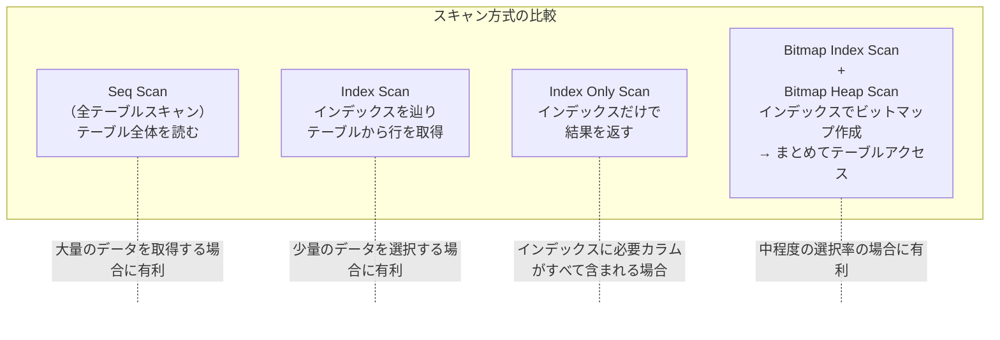

- **Seq Scan（Sequential Scan）**: テーブル全体を先頭から末尾まで順次読み取る。テーブルの大部分を読む場合は最も効率的だが、小さな部分集合を取得する場合には非効率
- **Index Scan**: インデックスを使ってキーを探し、見つかった行のポインタに基づいてテーブル（ヒープ）からデータを取得する。行ごとにランダムI/Oが発生する可能性がある
- **Index Only Scan**: インデックスだけで必要なデータがすべて揃うため、テーブルへのアクセスが不要になる。最も効率的なスキャン方式
- **Bitmap Index Scan + Bitmap Heap Scan**: インデックスからビットマップを作成し、テーブルブロック単位でまとめてアクセスする。Index Scanよりもランダムアクセスが少なくなり、中程度の選択率に適している

### 3.3 MySQL の実行計画を読む

MySQLの `EXPLAIN` はテーブル形式で出力される。

```sql
EXPLAIN
SELECT o.id, o.order_date, c.name
FROM orders o
JOIN customers c ON o.customer_id = c.id
WHERE o.order_date >= '2026-01-01'
  AND o.status = 'completed';
```

出力例：

```
+----+-------------+-------+------+-------------------+---------+---------+-------------------+------+-------------+
| id | select_type | table | type | possible_keys     | key     | key_len | ref               | rows | Extra       |
+----+-------------+-------+------+-------------------+---------+---------+-------------------+------+-------------+
|  1 | SIMPLE      | o     | ref  | idx_order_date    | idx_... | 3       | const             | 2350 | Using where |
|  1 | SIMPLE      | c     | eq_ref| PRIMARY          | PRIMARY | 4       | mydb.o.customer_id|    1 | NULL        |
+----+-------------+-------+------+-------------------+---------+---------+-------------------+------+-------------+
```

MySQLの `EXPLAIN` で最も注目すべきカラムは **`type`** と **`Extra`** である。

#### type カラムの意味（性能が良い順）

| type | 説明 | 性能 |
|---|---|---|
| `system` | テーブルに1行のみ | 最良 |
| `const` | プライマリキーまたはユニークインデックスで1行に確定 | 極めて良い |
| `eq_ref` | JOINでプライマリキー/ユニークインデックスが使われている | 良い |
| `ref` | 非ユニークインデックスを使った等値検索 | 良い |
| `range` | インデックスを使った範囲検索 | 概ね良い |
| `index` | インデックス全体のスキャン | 注意が必要 |
| `ALL` | **フルテーブルスキャン** | 改善が必要 |

#### Extra カラムの重要なパターン

- **`Using index`**: カバリングインデックスが使われており、テーブルアクセス不要。理想的
- **`Using where`**: ストレージエンジンから取得した行に対し、サーバレイヤでフィルタリングが行われている
- **`Using temporary`**: 一時テーブルが作成されている。GROUP BYやDISTINCTの最適化余地がある
- **`Using filesort`**: インデックスを使わないソートが行われている。大量データでは深刻な性能問題になりうる

::: tip MySQL 8.0 の EXPLAIN ANALYZE
MySQL 8.0.18以降では `EXPLAIN ANALYZE` がサポートされている。PostgreSQLと同様に、実際の実行時間と行数を含む**ツリー形式**の出力が得られ、推定値と実測値の乖離を直接確認できる。MySQL 8.0.32以降では `EXPLAIN FORMAT=TREE` や `EXPLAIN FORMAT=JSON` も併用することで、より詳細な分析が可能である。
:::

### 3.4 実行計画のビジュアライズ

実行計画のテキスト出力は複雑になりがちであるため、ビジュアライズツールの活用が有効である。

- **PostgreSQL**: [explain.depesz.com](https://explain.depesz.com/)、[explain.dalibo.com](https://explain.dalibo.com/) にEXPLAIN ANALYZE出力を貼り付けると、ツリー構造がカラー表示され、ボトルネックが一目で分かる
- **MySQL**: `EXPLAIN FORMAT=JSON` の出力をMySQL Workbenchに読み込ませると、視覚的な実行計画が表示される

## 4. よくあるスロークエリのパターン

スロークエリには典型的なパターンが存在する。これらのパターンを知っておくことで、問題の原因を素早く特定できる。

### 4.1 フルテーブルスキャン

最も基本的で、最も頻繁に遭遇するパターンである。

#### 問題のあるクエリ

```sql
-- no index on customer_email column
SELECT * FROM orders WHERE customer_email = 'user@example.com';
```

テーブルに100万行あれば、このクエリは100万行すべてを読み取って条件に合致する行を探す。

#### 実行計画の確認

```
Seq Scan on orders  (cost=0.00..25000.00 rows=5 width=120) (actual time=234.567..890.123 rows=3 loops=1)
  Filter: (customer_email = 'user@example.com'::text)
  Rows Removed by Filter: 999997
```

`Rows Removed by Filter: 999997` は、99.9997%の行がフィルタリングで捨てられたことを意味する。これはインデックスが適切に使われていない明確な証拠である。

#### 解決策

```sql
-- create index on the column used in WHERE clause
CREATE INDEX idx_orders_customer_email ON orders (customer_email);
```

インデックス作成後の実行計画：

```
Index Scan using idx_orders_customer_email on orders  (cost=0.42..16.50 rows=5 width=120) (actual time=0.035..0.042 rows=3 loops=1)
  Index Cond: (customer_email = 'user@example.com'::text)
```

コストが25000から16.5に、実行時間が890msから0.042msに劇的に改善される。

### 4.2 暗黙の型変換によるインデックス無効化

インデックスが存在するにもかかわらず使われないケースの代表例が、**暗黙の型変換（Implicit Type Conversion）**である。

#### MySQL での典型例

```sql
-- phone_number column is VARCHAR, but compared with integer
-- index on phone_number will NOT be used
SELECT * FROM users WHERE phone_number = 09012345678;
```

`phone_number` カラムが `VARCHAR` 型であるのに対し、比較対象がクォートされていない数値リテラルである。MySQLはこの場合、カラムの値を数値に変換して比較を行うため、インデックスが利用できなくなる。

```sql
-- correct: compare with string literal
SELECT * FROM users WHERE phone_number = '09012345678';
```

::: danger 暗黙の型変換の罠
暗黙の型変換は、クエリが構文エラーにならずに実行されるため、問題に気づきにくい。データ量が少ないうちは性能差が顕在化せず、本番環境でデータが増えてから初めて問題が表面化することが多い。コードレビューで型の一致を確認する習慣が重要である。
:::

#### 関数適用によるインデックス無効化

暗黙の型変換と同じメカニズムで、WHERE句のカラムに関数を適用するとインデックスが使えなくなるケースも非常に多い。

```sql
-- index on created_at will NOT be used (function applied to column)
SELECT * FROM orders WHERE YEAR(created_at) = 2026;

-- rewrite: use range condition to enable index usage
SELECT * FROM orders
WHERE created_at >= '2026-01-01' AND created_at < '2027-01-01';
```

```sql
-- index on email will NOT be used (function applied to column)
SELECT * FROM users WHERE LOWER(email) = 'user@example.com';

-- PostgreSQL solution: create functional index
CREATE INDEX idx_users_email_lower ON users (LOWER(email));
```

関数を適用された列は、もはやインデックスのキーとは別の値になっている。B-Treeインデックスは `email` の値で整列されているのであって、`LOWER(email)` の値で整列されているわけではない。したがって、B-Treeを二分探索で辿ることができなくなる。

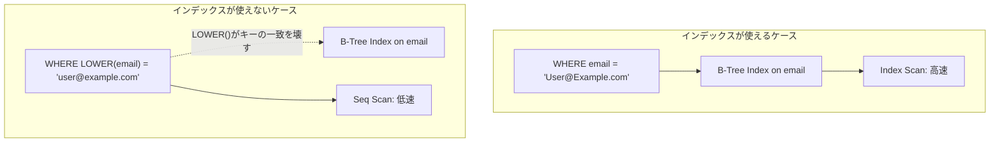

### 4.3 N+1問題

**N+1問題**は、アプリケーション層のコードに起因する性能問題であり、ORM（Object-Relational Mapping）を使用するアプリケーションで特に頻発する。

#### 問題の構造

```python
# N+1 problem example (Python with ORM-like pseudocode)

# 1 query to fetch all orders
orders = db.query("SELECT * FROM orders WHERE status = 'pending'")

# N queries to fetch customer for each order
for order in orders:
    customer = db.query(
        "SELECT * FROM customers WHERE id = %s",
        order.customer_id
    )
    print(f"Order {order.id}: {customer.name}")
```

100件の注文があれば、合計101回のクエリが実行される。1回のクエリが1msで済んだとしても、101回で101msかかる。しかし実際には、各クエリのオーバーヘッド（パース、ネットワークラウンドトリップ、コンテキストスイッチ）が加算されるため、はるかに遅くなる。

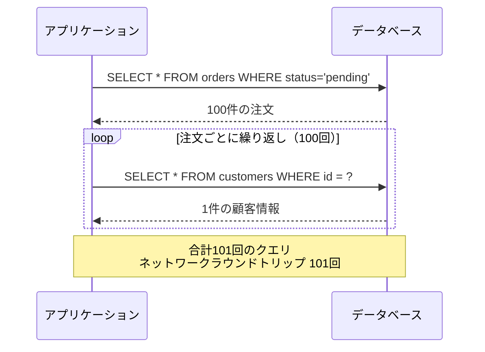

#### 解決策: JOINまたはIN句

```sql
-- solution 1: JOIN (single query)
SELECT o.id, o.order_date, c.name
FROM orders o
JOIN customers c ON o.customer_id = c.id
WHERE o.status = 'pending';

-- solution 2: batch fetch with IN clause (2 queries)
-- query 1: fetch orders
SELECT * FROM orders WHERE status = 'pending';
-- query 2: batch fetch customers
SELECT * FROM customers WHERE id IN (1, 2, 3, ... , 100);
```

JOINを使えば1回のクエリで済み、IN句を使っても2回で済む。どちらを選ぶかはケースバイケースだが、ORMフレームワークが提供する**Eager Loading**（事前読み込み）の仕組みを活用するのが一般的である。

```python
# solution with eager loading (ORM pseudocode)
orders = db.query(
    "SELECT * FROM orders WHERE status = 'pending'",
    eager_load=["customer"]  # automatically batch-loads related records
)
```

::: tip N+1問題の検出
N+1問題はSQLのログだけでは見つけにくいことがある。個々のクエリは高速であるため、スロークエリログに記録されない場合があるためだ。アプリケーション側のAPM（Application Performance Monitoring）ツールで、1リクエストあたりのクエリ発行数を監視するのが効果的である。「1リクエストで50回以上のクエリが発行された」というアラートを設定する手法もある。
:::

### 4.4 SELECT * の問題

`SELECT *` は開発時には手軽だが、本番環境では以下の問題を引き起こす。

```sql
-- unnecessary columns increase I/O and memory usage
SELECT * FROM orders WHERE customer_id = 123;

-- fetch only required columns
SELECT id, order_date, total_amount FROM orders WHERE customer_id = 123;
```

問題点は多岐にわたる。

1. **不要なデータ転送**: TEXT型やBLOB型など大きなカラムが含まれると、転送量が桁違いに増える
2. **Index Only Scanの阻害**: 必要なカラムすべてがインデックスに含まれていれば Index Only Scan が可能だが、`SELECT *` ではテーブル全体にアクセスが必要になる
3. **バッファプールの汚染**: 不要なデータがメモリ上のキャッシュを占有し、本当に必要なデータがキャッシュから追い出される

### 4.5 OFFSET による大量データスキップ

ページネーションで `OFFSET` を使用するパターンは、データ量が増えると深刻な性能問題を引き起こす。

```sql
-- slow: skips 100,000 rows to fetch 20 rows
SELECT * FROM products ORDER BY id LIMIT 20 OFFSET 100000;
```

`OFFSET 100000` は、データベースが100,000行を読み取って捨て、その後の20行だけを返すことを意味する。ページが深くなるほど性能が劣化する。

```sql
-- fast: keyset pagination (cursor-based)
-- use the last seen id from previous page
SELECT * FROM products WHERE id > 100000 ORDER BY id LIMIT 20;
```

**キーセットページネーション（Cursor-based Pagination）**は、前ページの最後のレコードのキー値を使って次ページの開始点を指定する。インデックスで直接開始位置にジャンプできるため、何ページ目であっても一定の速度で応答できる。

## 5. インデックス戦略

適切なインデックス設計は、スロークエリ最適化の中核をなす。闇雲にインデックスを作成するのではなく、クエリのアクセスパターンを理解した上で戦略的に設計する必要がある。

### 5.1 複合インデックスとカラム順序

複合インデックス（Composite Index）は複数のカラムを組み合わせたインデックスであり、WHERE句やORDER BY句の条件に応じて適切なカラム順序を選ぶことが極めて重要である。

#### 左端一致の原則

複合インデックスは、**左端のカラムから連続して使える場合にのみ有効**である。

```sql
-- composite index on (customer_id, order_date, status)
CREATE INDEX idx_orders_composite ON orders (customer_id, order_date, status);
```

このインデックスが使える・使えないケースを整理する。

```sql
-- can use the index (uses leftmost prefix)
SELECT * FROM orders WHERE customer_id = 123;
SELECT * FROM orders WHERE customer_id = 123 AND order_date = '2026-03-01';
SELECT * FROM orders WHERE customer_id = 123 AND order_date >= '2026-01-01' AND status = 'completed';

-- can partially use the index (only customer_id part)
SELECT * FROM orders WHERE customer_id = 123 AND status = 'completed';
-- skips order_date, so status condition cannot use the index

-- cannot use the index at all
SELECT * FROM orders WHERE order_date = '2026-03-01';
SELECT * FROM orders WHERE status = 'completed';
```

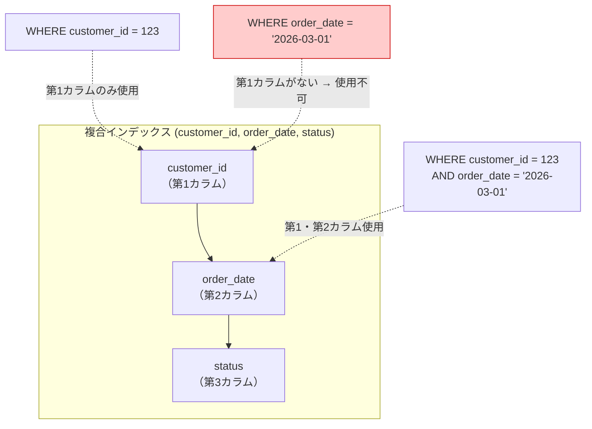

#### カラム順序の決定基準

複合インデックスのカラム順序は以下の原則に基づいて決定する。

1. **等値条件（=）のカラムを先に**配置する
2. **範囲条件（<, >, BETWEEN）のカラムはその後ろに**配置する
3. **ORDER BY/GROUP BYのカラムをさらに後ろに**配置する
4. **SELECT句のカラムを最後に**追加する（カバリングインデックスにするため）

範囲条件のカラムより後ろのカラムは、インデックスの絞り込みに使われない。これはB-Treeの構造上の制約である。

```sql
-- query pattern
SELECT id, total_amount
FROM orders
WHERE customer_id = 123
  AND order_date >= '2026-01-01'
  AND order_date < '2026-04-01'
ORDER BY order_date;

-- optimal index for this query
CREATE INDEX idx_orders_optimal ON orders (customer_id, order_date, total_amount, id);
--                                         ^^^^^^^^^^   ^^^^^^^^^^  ^^^^^^^^^^^^^  ^^
--                                         equality     range+sort  covering cols
```

### 5.2 カバリングインデックス

**カバリングインデックス（Covering Index）**とは、クエリが必要とするすべてのカラムをインデックスに含めることで、テーブル本体へのアクセスを完全に不要にするインデックスである。

#### 効果

```sql
-- without covering index: Index Scan + Heap access
EXPLAIN ANALYZE
SELECT customer_id, order_date, total_amount
FROM orders
WHERE customer_id = 123 AND order_date >= '2026-01-01';
```

```
Index Scan using idx_orders_customer_id on orders  (cost=0.43..250.15 rows=45 width=20) (actual time=0.050..1.234 rows=42 loops=1)
```

```sql
-- create covering index
CREATE INDEX idx_orders_covering
ON orders (customer_id, order_date, total_amount);
```

```sql
-- with covering index: Index Only Scan (no heap access)
EXPLAIN ANALYZE
SELECT customer_id, order_date, total_amount
FROM orders
WHERE customer_id = 123 AND order_date >= '2026-01-01';
```

```
Index Only Scan using idx_orders_covering on orders  (cost=0.43..15.50 rows=45 width=20) (actual time=0.030..0.085 rows=42 loops=1)
  Heap Fetches: 0
```

`Heap Fetches: 0` は、テーブル本体に一切アクセスしていないことを示す。実行時間が1.234msから0.085msに改善される。

::: warning PostgreSQLの Visibility Map
PostgreSQLの Index Only Scan は、**Visibility Map** を参照してテーブルアクセスが必要かどうかを判断する。VACUUMが適切に実行されていないと、Visibility Mapが古くなり、Index Only Scanでもテーブルアクセスが発生する（`Heap Fetches` が増加する）。`autovacuum` が正常に動作しているか定期的に確認すべきである。
:::

#### MySQL の INCLUDE 相当

MySQL 8.0ではカバリングインデックスをINDEXの末尾カラムとして含める。PostgreSQL 11以降では `INCLUDE` 句でインデックスのリーフノードにのみ格納されるカラムを明示的に指定できる。

```sql
-- PostgreSQL: INCLUDE clause (stored only in leaf nodes, not used for search)
CREATE INDEX idx_orders_covering_v2
ON orders (customer_id, order_date) INCLUDE (total_amount, status);
```

`INCLUDE` 句のカラムはインデックスのB-Tree構造の検索キーには含まれず、リーフノードにのみ格納される。このため、インデックスのサイズを抑えつつカバリングインデックスの恩恵を得ることができる。

### 5.3 部分インデックス（Partial Index）

**部分インデックス（Partial Index）**は、テーブルの一部の行のみをインデックス化する仕組みである。PostgreSQLが先駆的にサポートし、現在ではSQLiteなども対応している（MySQLは未サポート）。

#### ユースケース

例えば、注文テーブルにおいて `status = 'pending'` の注文は全体の2%程度で、残り98%は `completed` や `cancelled` であるとする。ほとんどのクエリは未処理の注文を対象としている場合、全行をインデックス化するのは無駄である。

```sql
-- partial index: only index rows where status = 'pending'
CREATE INDEX idx_orders_pending
ON orders (customer_id, order_date)
WHERE status = 'pending';
```

このインデックスのサイズは全体をインデックス化した場合の約2%となり、B-Treeの高さも低くなるため、検索が高速化される。加えて、INSERT/UPDATE時のインデックスメンテナンスコストも削減される。

```sql
-- this query can use the partial index
SELECT * FROM orders
WHERE status = 'pending' AND customer_id = 123
ORDER BY order_date;

-- this query CANNOT use the partial index (different status)
SELECT * FROM orders
WHERE status = 'completed' AND customer_id = 123;
```

#### 部分インデックスの活用場面

| 場面 | 例 |
|---|---|
| 少数の特定状態への頻繁なアクセス | `WHERE is_active = true` |
| ソフトデリートされていないレコード | `WHERE deleted_at IS NULL` |
| 未処理データの処理キュー | `WHERE processed = false` |
| 最近のデータへの集中アクセス | `WHERE created_at > '2026-01-01'` |

### 5.4 インデックスのコスト

インデックスは万能ではない。インデックスを追加するたびに、以下のコストが発生する。

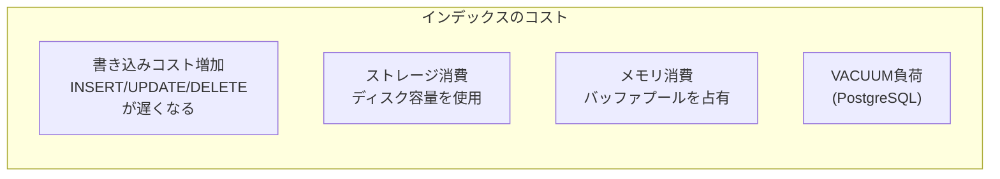

- **書き込み性能の低下**: 1行のINSERTに対して、テーブル本体に加え、各インデックスのB-Treeにもエントリを追加する必要がある。10個のインデックスがあれば、書き込みコストは約10倍になる
- **ストレージ消費**: インデックスはテーブル本体と同程度以上の容量を消費することがある
- **VACUUM負荷**: PostgreSQLでは、各インデックスに対してもVACUUM処理が必要であり、インデックスが多いほどVACUUMに時間がかかる

したがって、**使われていないインデックスは積極的に削除する**ことが重要である。

```sql
-- PostgreSQL: find unused indexes
SELECT
    schemaname,
    tablename,
    indexname,
    idx_scan,
    pg_size_pretty(pg_relation_size(indexrelid)) AS index_size
FROM pg_stat_user_indexes
WHERE idx_scan = 0
  AND indexrelid NOT IN (
      SELECT conindid FROM pg_constraint
      WHERE contype IN ('p', 'u')  -- exclude primary key and unique constraints
  )
ORDER BY pg_relation_size(indexrelid) DESC;
```

## 6. JOINの最適化

JOINはリレーショナルデータベースの根幹をなす操作であるが、不適切なJOINはスロークエリの主要原因となる。データベースがJOINをどのように実行するかを理解することが、最適化の鍵となる。

### 6.1 JOIN実行アルゴリズム

主要なデータベースがJOINを実行するアルゴリズムは3つある。

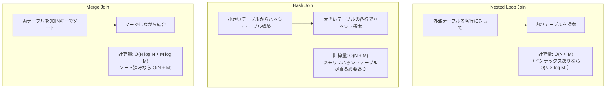

#### Nested Loop Join

```
for each row r in outer_table:
    for each row s in inner_table where s.key = r.key:
        emit (r, s)
```

外部テーブルの各行に対して内部テーブルを探索する。内部テーブルにインデックスがある場合は `O(N \times \log M)` で実行できるが、インデックスがなければ `O(N \times M)` となる。外部テーブルの行数が少ない場合に最も効率的であり、特にOLTPの典型的なクエリ（主キーで結合する少量データの取得）に向いている。

#### Hash Join

```
-- build phase
build hash_table from smaller_table on join_key

-- probe phase
for each row r in larger_table:
    lookup r.join_key in hash_table
    for each match s:
        emit (r, s)
```

小さいテーブルからハッシュテーブルを構築し（Build Phase）、大きいテーブルの各行でハッシュを使って探索する（Probe Phase）。計算量は `O(N + M)` だが、ハッシュテーブルがメモリに収まらない場合はディスクへのスピルが発生し、性能が大幅に低下する。等値結合（`=`）でのみ使用できる。

#### Merge Join（Sort Merge Join）

両テーブルをJOINキーでソートした後、マージ操作で結合する。ソート済みのデータ（インデックスが存在する場合）では非常に効率的であり、大規模データ同士の結合に向いている。

### 6.2 JOINの最適化テクニック

#### 結合キーにインデックスを作成する

JOINの性能はインデックスの有無で劇的に変わる。

```sql
-- ensure foreign key columns are indexed
CREATE INDEX idx_orders_customer_id ON orders (customer_id);

-- verify: Nested Loop with Index Scan instead of Seq Scan
EXPLAIN ANALYZE
SELECT o.id, c.name
FROM orders o
JOIN customers c ON o.customer_id = c.id
WHERE o.order_date = '2026-03-01';
```

MySQLのInnoDBではプライマリキー以外の外部キー制約に自動でインデックスが作成されるが、PostgreSQLでは外部キー制約を定義しても**自動的にはインデックスが作成されない**。外部キーカラムへのインデックスは明示的に作成する必要がある。

#### 結合順序の最適化

オプティマイザは通常、最適な結合順序を自動的に選択する。しかし、テーブル数が多い場合（5テーブル以上のJOIN）は、組み合わせ爆発によりオプティマイザが最適解を見つけられないことがある。

```sql
-- PostgreSQL: check optimizer's join order choice
SET enable_hashjoin = off;  -- temporarily disable hash join for testing
SET enable_mergejoin = off; -- temporarily disable merge join for testing
EXPLAIN ANALYZE
SELECT ...
FROM a JOIN b ON ... JOIN c ON ... JOIN d ON ...;
RESET enable_hashjoin;
RESET enable_mergejoin;
```

::: warning JOINの数を減らす
テーブルの結合が5つ以上になる場合は、設計を見直すことを検討すべきである。非正規化（Denormalization）やマテリアライズドビューの導入によって、JOINの数を削減できる場合がある。JOINの数が増えるほど、オプティマイザが最適な実行計画を見つけることが困難になり、統計情報のずれの影響も累積的に増大する。
:::

#### 不要なJOINの排除

意外なほど多いのが、結果に不要なテーブルをJOINしているケースである。

```sql
-- unnecessary join: customers table is joined but no column is used from it
SELECT o.id, o.order_date, o.total_amount
FROM orders o
JOIN customers c ON o.customer_id = c.id  -- result doesn't use any column from customers
WHERE o.status = 'pending';

-- if foreign key constraint exists, the JOIN is redundant
SELECT o.id, o.order_date, o.total_amount
FROM orders o
WHERE o.status = 'pending'
  AND o.customer_id IS NOT NULL;  -- NULL check if needed
```

ORMが自動的にJOINを生成する場合、このような不要なJOINが混入しやすい。

### 6.3 サブクエリ vs JOIN

サブクエリとJOINのどちらが速いかは、データベースの実装とクエリの構造に依存する。

```sql
-- correlated subquery (executed once per row of outer query)
SELECT o.id, o.order_date,
       (SELECT c.name FROM customers c WHERE c.id = o.customer_id) AS customer_name
FROM orders o
WHERE o.status = 'pending';

-- equivalent JOIN (typically more efficient)
SELECT o.id, o.order_date, c.name AS customer_name
FROM orders o
JOIN customers c ON o.customer_id = c.id
WHERE o.status = 'pending';
```

**相関サブクエリ（Correlated Subquery）**は外部クエリの各行に対して実行されるため、N+1問題と同様の性能特性を持つ。モダンなオプティマイザは相関サブクエリをJOINに書き換える最適化（**Subquery Unnesting**）を行うことがあるが、常に成功するとは限らない。

一方、`EXISTS` を使ったサブクエリは、条件に合致する最初の1行が見つかった時点で探索を打ち切るため、JOINよりも効率的になることがある。

```sql
-- EXISTS: stops as soon as a match is found
SELECT o.id, o.order_date
FROM orders o
WHERE EXISTS (
    SELECT 1 FROM order_items oi
    WHERE oi.order_id = o.id AND oi.product_id = 999
);
```

## 7. 実行計画の改善テクニック

ここまでの個別のパターンを踏まえて、実行計画を体系的に改善するテクニックを整理する。

### 7.1 統計情報の更新

オプティマイザが正しい実行計画を選択するためには、テーブルのデータ分布に関する正確な**統計情報**が不可欠である。

#### PostgreSQL

```sql
-- update statistics for a specific table
ANALYZE orders;

-- update statistics for a specific column
ANALYZE orders (customer_id, order_date);

-- check current statistics
SELECT
    attname,
    n_distinct,
    most_common_vals,
    most_common_freqs,
    correlation
FROM pg_stats
WHERE tablename = 'orders' AND attname = 'status';
```

PostgreSQLの `autovacuum` デーモンは自動的に `ANALYZE` を実行するが、大量のデータが一括挿入された後や、データ分布が大きく変わった後には手動で実行するのが賢明である。

```sql
-- PostgreSQL 10+: extended statistics for correlated columns
CREATE STATISTICS orders_stats (dependencies, ndistinct, mcv)
ON customer_id, status FROM orders;
ANALYZE orders;
```

**拡張統計（Extended Statistics）**は、複数カラム間の相関関係をオプティマイザに伝えるための仕組みである。例えば「特定の顧客は特定のステータスの注文が多い」といった偏りがある場合、拡張統計がなければオプティマイザはカラム間の独立性を仮定して行数を過大・過小に見積もる。

#### MySQL

```sql
-- update statistics for a specific table
ANALYZE TABLE orders;

-- MySQL 8.0: histogram statistics for better cardinality estimation
ANALYZE TABLE orders UPDATE HISTOGRAM ON status, customer_id;
```

MySQLでは `ANALYZE TABLE` がインデックスの統計情報を更新する。MySQL 8.0以降では**ヒストグラム統計**が導入され、カラムのデータ分布を詳細にオプティマイザに伝えられるようになった。特にインデックスが存在しないカラムの選択率推定に有効である。

### 7.2 クエリのリファクタリング

#### UNION ALL vs UNION

```sql
-- UNION: removes duplicates (requires sort + dedup)
SELECT id FROM orders WHERE status = 'pending'
UNION
SELECT id FROM orders WHERE status = 'processing';

-- UNION ALL: keeps duplicates (no dedup overhead)
SELECT id FROM orders WHERE status = 'pending'
UNION ALL
SELECT id FROM orders WHERE status = 'processing';

-- even better: single query with IN clause
SELECT id FROM orders WHERE status IN ('pending', 'processing');
```

`UNION` は重複排除のためにソートまたはハッシュ処理を必要とするが、`UNION ALL` はそれが不要である。重複が発生しないことが分かっている場合は、常に `UNION ALL` を使うべきである。さらに、上の例のように `IN` 句で1つのクエリにまとめられる場合は、そうするのが最善である。

#### OR条件の最適化

```sql
-- OR condition may prevent index usage in some databases
SELECT * FROM orders
WHERE customer_id = 123 OR order_date = '2026-03-01';

-- rewrite with UNION ALL for better index usage
SELECT * FROM orders WHERE customer_id = 123
UNION ALL
SELECT * FROM orders WHERE order_date = '2026-03-01'
  AND customer_id != 123;  -- avoid duplicates
```

`OR` 条件は、異なるカラムにまたがる場合、オプティマイザがインデックスを効率的に使えないことがある。PostgreSQLは **BitmapOr** 演算子で複数のインデックスを組み合わせる最適化を行えるが、MySQLでは `Index Merge` の最適化が限定的なケースでしか動作しない。

#### 条件の早期適用

```sql
-- inefficient: filter after join
SELECT o.id, c.name
FROM orders o
JOIN customers c ON o.customer_id = c.id
WHERE o.order_date >= '2026-01-01'
  AND c.country = 'JP';

-- the optimizer usually pushes predicates down, but verify with EXPLAIN
-- sometimes explicit subqueries help
SELECT o.id, c.name
FROM (
    SELECT id, customer_id, order_date
    FROM orders
    WHERE order_date >= '2026-01-01'
) o
JOIN (
    SELECT id, name
    FROM customers
    WHERE country = 'JP'
) c ON o.customer_id = c.id;
```

モダンなオプティマイザは**述語プッシュダウン（Predicate Pushdown）**を自動的に行うが、複雑なクエリでは期待どおりに動作しないことがある。`EXPLAIN ANALYZE` で確認し、必要に応じてクエリを書き換える。

### 7.3 パーティショニング

テーブルが非常に大きくなった場合、**テーブルパーティショニング**が有効な選択肢となる。

```sql
-- PostgreSQL: range partitioning by date
CREATE TABLE orders (
    id          BIGSERIAL,
    customer_id BIGINT NOT NULL,
    order_date  DATE NOT NULL,
    status      VARCHAR(20),
    total_amount DECIMAL(10, 2)
) PARTITION BY RANGE (order_date);

-- create partitions
CREATE TABLE orders_2025 PARTITION OF orders
    FOR VALUES FROM ('2025-01-01') TO ('2026-01-01');
CREATE TABLE orders_2026 PARTITION OF orders
    FOR VALUES FROM ('2026-01-01') TO ('2027-01-01');
CREATE TABLE orders_2027 PARTITION OF orders
    FOR VALUES FROM ('2027-01-01') TO ('2028-01-01');
```

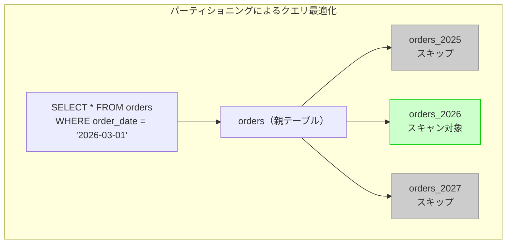

パーティショニングの効果は**パーティションプルーニング（Partition Pruning）**にある。クエリの条件に合致しないパーティションは完全にスキップされるため、スキャン対象のデータ量が大幅に削減される。

::: tip パーティショニングは万能ではない
パーティショニングは大規模テーブルに有効だが、小さなテーブルに適用すると逆にオーバーヘッドが増える。一般的な目安として、数千万行以上のテーブルで、パーティションキーが頻繁にクエリの条件に含まれる場合に検討すべきである。また、パーティションをまたぐJOINやユニーク制約には制限があるため、設計段階で慎重に検討する必要がある。
:::

### 7.4 マテリアライズドビュー

複雑な集計クエリが繰り返し実行される場合、**マテリアライズドビュー（Materialized View）**で計算結果を事前にキャッシュできる。

```sql
-- PostgreSQL: materialized view for daily sales summary
CREATE MATERIALIZED VIEW daily_sales_summary AS
SELECT
    DATE_TRUNC('day', order_date) AS sale_date,
    COUNT(*) AS order_count,
    SUM(total_amount) AS total_sales,
    AVG(total_amount) AS avg_order_value
FROM orders
WHERE status = 'completed'
GROUP BY DATE_TRUNC('day', order_date);

-- create index on the materialized view
CREATE INDEX idx_daily_sales_date ON daily_sales_summary (sale_date);

-- refresh the materialized view (full refresh)
REFRESH MATERIALIZED VIEW daily_sales_summary;

-- concurrent refresh (allows reads during refresh, requires unique index)
REFRESH MATERIALIZED VIEW CONCURRENTLY daily_sales_summary;
```

マテリアライズドビューの更新タイミングは、データの鮮度要件に応じて設計する。リアルタイム性が求められない集計レポートであれば、1日1回の更新で十分なケースが多い。

### 7.5 接続プールとプリペアドステートメント

クエリ最適化はSQL単体の改善に限らない。アプリケーションとデータベースの間のインフラストラクチャも性能に大きく影響する。

#### 接続プール

データベース接続の確立は高コストな操作である（TCP接続、認証、セッション初期化）。**接続プール**（PgBouncerなどの外部プーラーや、アプリケーション内蔵のプール）を使用して接続を再利用することで、接続確立のオーバーヘッドを排除できる。

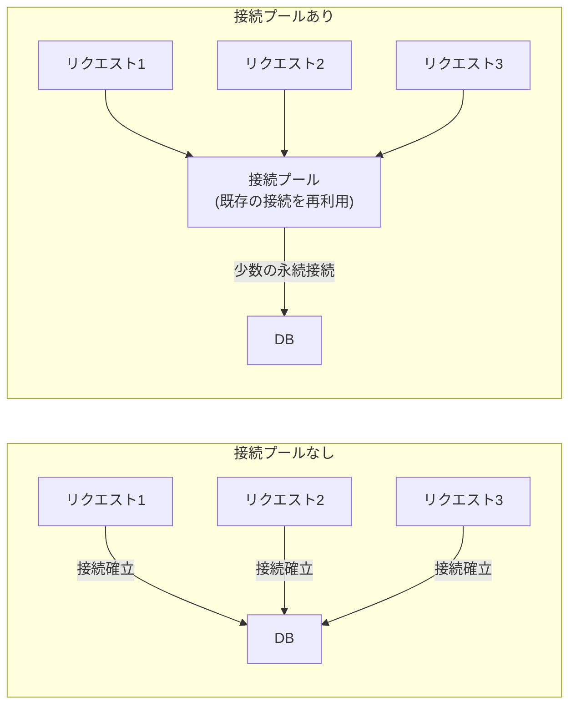

#### プリペアドステートメント

```sql
-- PostgreSQL: prepared statement
PREPARE get_order (BIGINT) AS
SELECT id, order_date, total_amount
FROM orders
WHERE customer_id = $1 AND status = 'completed';

EXECUTE get_order(123);
EXECUTE get_order(456);

DEALLOCATE get_order;
```

プリペアドステートメントは、SQLのパースと実行計画の生成を1回だけ行い、以降はパラメータを差し替えて再実行する仕組みである。パース・計画生成のコストが削減されるだけでなく、SQLインジェクション対策としても有効である。

ただし、PostgreSQLではプリペアドステートメントが**汎用計画（Generic Plan）**を使用する場合がある。汎用計画はパラメータの具体的な値を考慮しないため、データの偏りが大きいカラムでは最適でない計画が選ばれることがある。PostgreSQL 12以降では、最初の5回はカスタム計画を使い、その後汎用計画のコストが十分に低い場合にのみ汎用計画に切り替える、というヒューリスティクスが実装されている。

## 8. 実践的な最適化フロー

ここまで個別のテクニックを解説してきたが、実際の最適化作業では体系的なフローに従うことが重要である。

### 8.1 最適化の優先順位

すべてのスロークエリに同じ労力をかけるのは非効率である。以下の基準で優先順位を決定する。

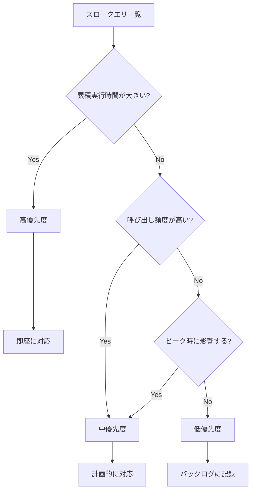

**累積実行時間（total_exec_time）が最も大きいクエリから着手する**のが鉄則である。1回3秒かかるが1日10回しか実行されないクエリ（累積30秒）よりも、1回50msだが1日10万回実行されるクエリ（累積5000秒）のほうが、最適化の効果が圧倒的に大きい。

### 8.2 段階的な最適化プロセス

```
1. 計測（Measure）
   ├── pg_stat_statements / slow query log で上位クエリ特定
   └── EXPLAIN ANALYZE で実行計画取得

2. 分析（Analyze）
   ├── フルテーブルスキャンが発生していないか
   ├── 推定行数と実測行数が乖離していないか
   ├── 不要なソートや一時テーブルが作成されていないか
   └── JOINアルゴリズムは適切か

3. 改善（Improve）
   ├── Step 1: 統計情報の更新（ANALYZE）
   ├── Step 2: インデックスの追加・修正
   ├── Step 3: クエリの書き換え
   ├── Step 4: テーブル設計の見直し（パーティショニング等）
   └── Step 5: パラメータチューニング

4. 検証（Verify）
   ├── EXPLAIN ANALYZE で改善を確認
   ├── 本番相当のデータ量でテスト
   └── 改善前後のメトリクスを比較

5. 監視（Monitor）
   └── 継続的に性能メトリクスを監視
```

特に重要なのは **Step 1: 統計情報の更新** を最初に試すことである。統計情報が古いだけで、オプティマイザが誤った実行計画を選択している場合があり、`ANALYZE` を実行するだけで解決することがある。

### 8.3 本番環境での注意事項

#### インデックス作成時のロック

```sql
-- standard CREATE INDEX locks the table for writes
CREATE INDEX idx_orders_status ON orders (status);

-- CONCURRENTLY option: allows reads and writes during index creation
-- takes longer but doesn't lock the table
CREATE INDEX CONCURRENTLY idx_orders_status ON orders (status);
```

PostgreSQLの `CREATE INDEX` は対象テーブルへの書き込みをブロックする。本番環境では **`CONCURRENTLY`** オプションを必ず使用すべきである。MySQLのInnoDBは通常の `CREATE INDEX` でもオンラインDDLとして実行されるが、大きなテーブルでは `ALTER TABLE ... ALGORITHM=INPLACE, LOCK=NONE` を明示する方が安全である。

::: danger 本番環境でのEXPLAIN ANALYZE
`EXPLAIN ANALYZE` は実際にクエリを実行する。大量のデータを返すSELECT文や、長時間かかるクエリを本番環境で `EXPLAIN ANALYZE` することは、本番の負荷に直接影響する。`EXPLAIN`（推定のみ）で十分な場合はそちらを使い、`EXPLAIN ANALYZE` が必要な場合はレプリカサーバで実行するか、`statement_timeout` を設定して実行時間を制限すべきである。
:::

#### パラメータチューニング

最適化の最後の手段として、データベースの設定パラメータの調整がある。

```ini
# PostgreSQL: key performance parameters
shared_buffers = '4GB'            # typically 25% of system RAM
effective_cache_size = '12GB'     # total memory available for caching (RAM - shared_buffers)
work_mem = '256MB'                # memory for sort/hash operations per query
maintenance_work_mem = '1GB'      # memory for VACUUM, CREATE INDEX, etc.
random_page_cost = 1.1            # lower value for SSD (default 4.0 for HDD)
effective_io_concurrency = 200    # for SSD
```

```ini
# MySQL (InnoDB): key performance parameters
innodb_buffer_pool_size = 12G     # typically 70-80% of system RAM
innodb_log_file_size = 1G         # redo log file size
innodb_io_capacity = 2000         # I/O operations per second (for SSD)
innodb_io_capacity_max = 4000     # max I/O ops for background tasks
```

特に `random_page_cost` はSSD環境では必ず下げるべきパラメータである。デフォルト値の4.0はHDDを想定しており、SSDではシーケンシャルリードとランダムリードの性能差が小さいため、1.1〜1.5程度に設定すると、オプティマイザがインデックスを使う判断をより積極的に行うようになる。

## 9. ケーススタディ：段階的な最適化の実例

ここまでの内容を統合した実践的な例として、あるECサイトのスロークエリ最適化プロセスを追ってみよう。

### 9.1 問題の発見

pg_stat_statementsで以下のクエリが上位に浮上した。

```sql
-- problematic query: top seller report
SELECT
    p.id,
    p.name,
    p.category,
    COUNT(oi.id) AS order_count,
    SUM(oi.quantity * oi.unit_price) AS total_revenue
FROM products p
JOIN order_items oi ON oi.product_id = p.id
JOIN orders o ON o.id = oi.order_id
WHERE o.order_date >= '2026-01-01'
  AND o.order_date < '2026-04-01'
  AND o.status = 'completed'
GROUP BY p.id, p.name, p.category
ORDER BY total_revenue DESC
LIMIT 20;
```

実行統計：

```
calls: 8,640 (1回/10秒で定期実行)
mean_exec_time: 4,523 ms
total_exec_time: 39,078,720 ms (約10.8時間/日)
```

### 9.2 実行計画の分析

```sql
EXPLAIN (ANALYZE, BUFFERS, FORMAT TEXT)
SELECT ...;  -- same query as above
```

```
Limit  (actual time=4512.345..4512.350 rows=20 loops=1)
  ->  Sort  (actual time=4512.340..4512.345 rows=20 loops=1)
        Sort Key: (sum((oi.quantity * oi.unit_price))) DESC
        Sort Method: top-N heapsort  Memory: 27kB
        ->  HashAggregate  (actual time=4498.123..4510.456 rows=8500 loops=1)
              ->  Hash Join  (actual time=234.567..4123.789 rows=125000 loops=1)
                    Hash Cond: (oi.order_id = o.id)
                    ->  Hash Join  (actual time=12.345..2890.123 rows=2500000 loops=1)
                          Hash Cond: (oi.product_id = p.id)
                          ->  Seq Scan on order_items oi  (actual time=0.012..1234.567 rows=5000000 loops=1)
                                Buffers: shared hit=25000 read=15000
                          ->  Hash  (actual time=10.123..10.123 rows=8500 loops=1)
                                ->  Seq Scan on products p  (actual time=0.010..8.456 rows=8500 loops=1)
                    ->  Hash  (actual time=220.123..220.123 rows=150000 loops=1)
                          ->  Seq Scan on orders o  (actual time=0.015..198.456 rows=150000 loops=1)
                                Filter: (status = 'completed' AND order_date >= ... AND order_date < ...)
                                Rows Removed by Filter: 850000
Planning Time: 2.345 ms
Execution Time: 4523.456 ms
```

### 9.3 問題点の特定

実行計画から以下の問題が読み取れる。

1. **order_items テーブルのフルスキャン**: 500万行を全スキャンしており、Buffersに `read=15000` と大量のディスク読み取りが発生
2. **orders テーブルのフルスキャン**: 100万行をスキャンして85万行を捨てている（`Rows Removed by Filter: 850000`）
3. **大きなHash Join**: order_itemsとordersのHash Joinで250万行を処理

### 9.4 段階的な改善

#### Step 1: ordersテーブルへのインデックス

まず、最も効果が見込める `orders` テーブルのフィルタリングを改善する。

```sql
CREATE INDEX CONCURRENTLY idx_orders_date_status
ON orders (order_date, status);
```

改善後：ordersテーブルが Seq Scan から Index Scan に変わり、85万行のフィルタリングが不要に。

#### Step 2: order_itemsテーブルへのインデックス

```sql
CREATE INDEX CONCURRENTLY idx_order_items_order_id
ON order_items (order_id)
INCLUDE (product_id, quantity, unit_price);
```

改善後：order_itemsへのアクセスがIndex Only Scanになり、500万行のフルスキャンが不要に。ordersの結果（15万行）に対応するorder_itemsだけを効率的に取得できるようになる。

#### Step 3: 統計情報の更新

```sql
ANALYZE orders;
ANALYZE order_items;
ANALYZE products;
```

#### Step 4: 改善後の実行計画

```
Limit  (actual time=45.678..45.683 rows=20 loops=1)
  ->  Sort  (actual time=45.675..45.680 rows=20 loops=1)
        Sort Key: (sum((oi.quantity * oi.unit_price))) DESC
        Sort Method: top-N heapsort  Memory: 27kB
        ->  HashAggregate  (actual time=38.123..44.456 rows=8500 loops=1)
              ->  Nested Loop  (actual time=0.234..32.567 rows=125000 loops=1)
                    ->  Nested Loop  (actual time=0.198..18.345 rows=125000 loops=1)
                          ->  Index Scan using idx_orders_date_status on orders o  (actual time=0.045..2.345 rows=150000 loops=1)
                                Index Cond: (order_date >= ... AND order_date < ... AND status = 'completed')
                          ->  Index Only Scan using idx_order_items_order_id on order_items oi  (actual time=0.002..0.008 rows=1 loops=150000)
                                Index Cond: (order_id = o.id)
                                Heap Fetches: 0
                    ->  Memoize  (actual time=0.001..0.001 rows=1 loops=125000)
                          Hits: 116500  Misses: 8500
                          ->  Index Scan using products_pkey on products p  (actual time=0.003..0.003 rows=1 loops=8500)
                                Index Cond: (id = oi.product_id)
Execution Time: 46.123 ms
```

**実行時間が4,523msから46msに改善**（約100倍の高速化）。1日の累積実行時間は約10.8時間から約6.6分に削減される。

改善のポイントをまとめる。

| 指標 | 改善前 | 改善後 | 改善率 |
|---|---|---|---|
| 実行時間 | 4,523 ms | 46 ms | 98x |
| 1日の累積時間 | 10.8時間 | 6.6分 | 98x |
| orders スキャン方式 | Seq Scan (100万行) | Index Scan (15万行) | - |
| order_items スキャン方式 | Seq Scan (500万行) | Index Only Scan | - |
| ディスク読み取り | 15,000ブロック | 0 (キャッシュヒット) | - |

## 10. まとめと今後の展望

### 10.1 最適化の基本原則

スロークエリの最適化は、以下の原則に集約される。

1. **計測なくして最適化なし**: pg_stat_statementsやスロークエリログで客観的にデータを収集する。推測による最適化は時間の無駄である
2. **実行計画を読む**: `EXPLAIN ANALYZE` はデータベースエンジニアにとっての聴診器であり、これを使いこなすことが最適化の基盤となる
3. **累積実行時間で優先順位を決める**: 個別の実行時間ではなく、頻度を考慮した累積実行時間で対処の順序を決定する
4. **インデックスは戦略的に**: 闇雲にインデックスを追加するのではなく、クエリのアクセスパターンに合わせて設計する。不要なインデックスは削除する
5. **アプリケーション層も含めて考える**: N+1問題やSELECT *など、アプリケーションのコードに起因する問題も多い
6. **継続的な監視**: 最適化は一度きりの作業ではなく、データ量やアクセスパターンの変化に応じて継続的に行う必要がある

### 10.2 今後の技術動向

データベースのクエリ最適化技術は進化を続けている。

**機械学習ベースのオプティマイザ**: 従来のコストベースオプティマイザは、固定的なコストモデルに基づいて実行計画を選択する。これに対し、実際の実行統計を機械学習で学習し、より正確なコスト推定を行うアプローチが研究されている。PostgreSQLの `pg_hint_plan` や、Googleの Bao（Bandit-based Optimizer）などが代表的な例である。

**自動インデックス推奨**: クエリの実行ログを分析し、作成すべきインデックスを自動的に提案する機能が充実しつつある。Azure SQL Databaseの自動インデックス機能や、Amazon RDS Performance Insightsなどがこの方向性を示している。PostgreSQLコミュニティでも `HypoPG` 拡張でハイポセティカルインデックス（実際には作成せずにEXPLAINで効果を確認できる仮想的なインデックス）を使ったインデックス設計の検証が可能である。

**アダプティブクエリ実行**: 実行中にデータの実際の分布を観測し、実行計画を動的に変更するアプローチも注目されている。Oracle Databaseの **Adaptive Query Plans** はこの技術の先駆者であり、実行中にNested Loop JoinからHash Joinへの切り替えなどを行う。PostgreSQL 14以降でも、Memoizeノードの導入など、実行時の情報を活用する最適化が徐々に増えている。

スロークエリの最適化は、データベースエンジニアにとって最も実践的で成果が見えやすいスキルの一つである。本記事で解説した手法を体系的に適用することで、多くのパフォーマンス問題に対処できるはずである。重要なのは、常にデータに基づいて判断し、推測に頼らないことである。
