# SOLID原則 — オブジェクト指向設計の5つの基本原則

## 1. 背景と動機

### 1.1 ソフトウェア設計はなぜ難しいのか

ソフトウェアは本質的に変化するものである。ビジネス要件の追加、バグの修正、パフォーマンスの改善、技術的負債の返済——あらゆる理由でコードは日々変更される。問題は、ある箇所の変更が予期しない別の箇所に波及し、システム全体を脆くしていくことにある。

小規模なプログラムであれば、設計の良し悪しは大きな問題にならない。しかし、コードベースが成長し、開発者が増え、年月が経過するにつれて、設計上の問題は指数関数的に深刻化する。具体的には以下のような症状が現れる。

- **硬直性（Rigidity）**: 一箇所を変更すると、他の多くの箇所も変更しなければならない
- **脆弱性（Fragility）**: 変更が予期しない箇所で障害を引き起こす
- **不動性（Immobility）**: コンポーネントの再利用が困難で、常に新たに書き直す必要がある
- **粘着性（Viscosity）**: 正しい設計に従うよりも、ハックで済ませるほうが容易になっている

これらの症状は Robert C. Martin（通称 Uncle Bob）が「設計の腐敗（Design Rot）」と呼んだものである。

### 1.2 SOLID原則の誕生

SOLID原則は、Robert C. Martin が2000年代初頭に体系化したオブジェクト指向設計の5つの基本原則の頭文字を取ったものである。ただし、各原則自体は Martin 自身が単独で発明したものではなく、Bertrand Meyer の「開放/閉鎖の原則」（1988年）や Barbara Liskov の「置換原則」（1987年）など、先人の研究を統合・再整理したものである。

「SOLID」という頭字語自体は Michael Feathers が提案し、Martin がこれを採用した。これにより5つの原則が覚えやすい形でまとまり、ソフトウェアエンジニアリングのコミュニティに広く浸透した。

```
S — Single Responsibility Principle（単一責任の原則）
O — Open/Closed Principle（開放/閉鎖の原則）
L — Liskov Substitution Principle（リスコフの置換原則）
I — Interface Segregation Principle（インターフェース分離の原則）
D — Dependency Inversion Principle（依存性逆転の原則）
```

### 1.3 SOLID原則が目指すもの

SOLID原則の目的は、以下の性質を備えたソフトウェアを設計することにある。

1. **変更に強い**: 要件変更の影響範囲が局所化される
2. **理解しやすい**: 各モジュールの責務が明確で、読み手が意図を把握しやすい
3. **再利用しやすい**: コンポーネントを他の文脈でも活用できる

重要なのは、SOLID原則は「銀の弾丸」ではないということである。これらはガイドラインであり、機械的に適用すればよいものではない。文脈に応じた判断が常に求められる。この点については記事の最後で改めて議論する。

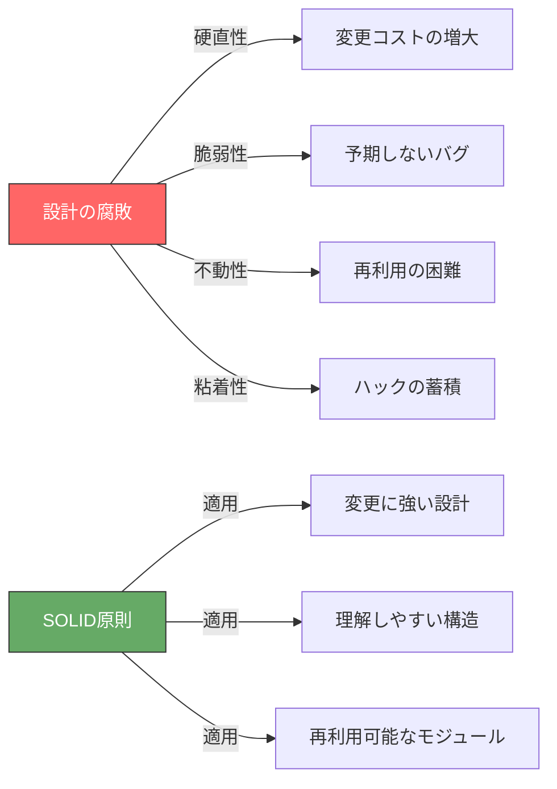

---

## 2. S — Single Responsibility Principle（単一責任の原則）

### 2.1 定義

> **「モジュールはたった一つの、そしてただ一つのアクターに対して責任を持つべきである」**

単一責任の原則（SRP）は、最も誤解されやすいSOLID原則の一つである。「一つのことだけをする」という解釈が広まっているが、Martin 自身はこの原則を「変更理由は一つであるべき」、さらに正確には「一つのアクター（利害関係者のグループ）に対してのみ責任を負うべき」と定義している。

ここでいう「アクター」とは、そのモジュールの変更を要求する人々のグループのことである。例えば、経理部門と人事部門では、同じ「従業員」データに対して異なる要求を持つ。SRPは、これらの異なるアクターの要求が一つのモジュールに混在することを避けるべきだと主張する。

### 2.2 違反例

以下のコードは、`Employee` クラスが複数のアクターに対する責任を混在させている例である。

```typescript
// VIOLATION: This class serves multiple actors
class Employee {
  private name: string;
  private hourlyRate: number;
  private hoursWorked: number;

  constructor(name: string, hourlyRate: number, hoursWorked: number) {
    this.name = name;
    this.hourlyRate = hourlyRate;
    this.hoursWorked = hoursWorked;
  }

  // Actor: Accounting department
  calculatePay(): number {
    return this.hourlyRate * this.getRegularHours();
  }

  // Actor: HR department
  reportHours(): string {
    return `${this.name} worked ${this.hoursWorked} hours`;
  }

  // Actor: DBA / IT operations
  save(): void {
    // Save employee data to database
    console.log(`Saving ${this.name} to database`);
  }

  // Shared method — this is where problems arise
  private getRegularHours(): number {
    // Both calculatePay() and reportHours() might use this
    return Math.min(this.hoursWorked, 40);
  }
}
```

::: warning SRP違反の危険性
この設計では、経理部門の要求で `getRegularHours()` のロジックを変更した場合、人事部門の `reportHours()` にも意図しない影響が及ぶ可能性がある。異なるアクターの変更理由が一つのクラスに混在しているため、ある部門の変更が別の部門の機能を壊すリスクがある。
:::

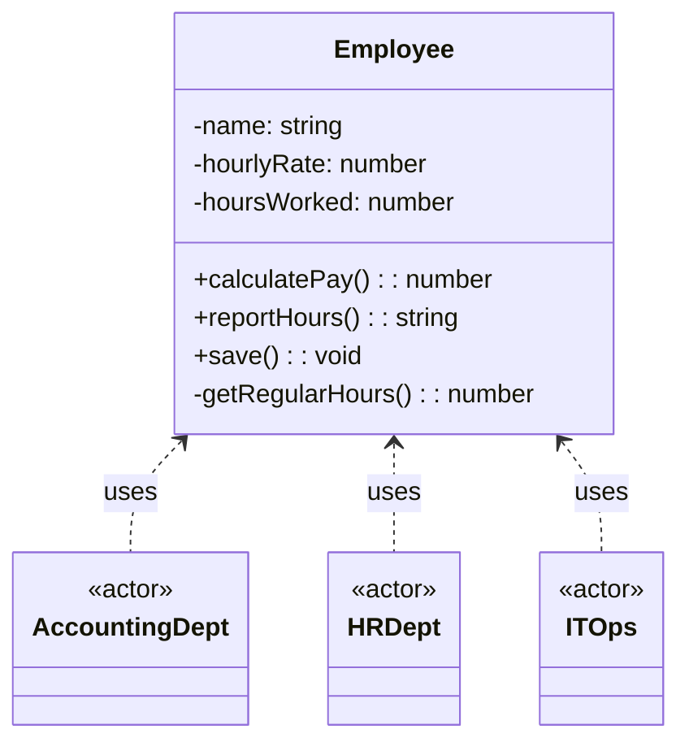

### 2.3 改善例

責任をアクターごとに分離する。

```typescript
// Each class is responsible to a single actor

// Actor: Accounting department
class PayCalculator {
  calculatePay(employee: EmployeeData): number {
    return employee.hourlyRate * this.getRegularHours(employee);
  }

  private getRegularHours(employee: EmployeeData): number {
    // Accounting-specific logic for regular hours
    return Math.min(employee.hoursWorked, 40);
  }
}

// Actor: HR department
class HourReporter {
  reportHours(employee: EmployeeData): string {
    return `${employee.name} worked ${employee.hoursWorked} hours`;
  }
}

// Actor: DBA / IT operations
class EmployeeRepository {
  save(employee: EmployeeData): void {
    console.log(`Saving ${employee.name} to database`);
  }
}

// Pure data structure — no behavior coupled to any actor
interface EmployeeData {
  name: string;
  hourlyRate: number;
  hoursWorked: number;
}
```

::: tip Facade パターンの活用
分離したクラスを使いやすくするために、Facade パターンを適用して統一的なインターフェースを提供することもできる。ただし Facade 自身は各クラスに処理を委譲するだけであり、ビジネスロジックは持たない。
:::

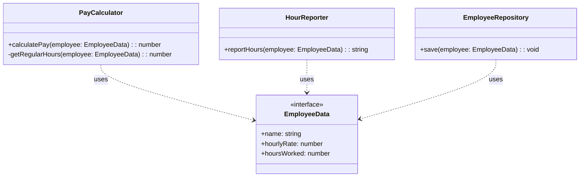

### 2.4 SRPの本質

SRPの核心は「凝集度（Cohesion）」の概念にある。同じ理由で変更されるものは一箇所にまとめ、異なる理由で変更されるものは分離する。これにより、変更の影響範囲が予測可能になり、あるアクターの要求変更が他のアクターの機能を壊すことを防げる。

ただし、すべてのメソッドを別々のクラスに分離すればよいわけではない。凝集度が高すぎる分離は、逆にコードの理解を困難にする。「アクターが一つか」という問いを基準に判断することが重要である。

---

## 3. O — Open/Closed Principle（開放/閉鎖の原則）

### 3.1 定義

> **「ソフトウェアの実体（クラス、モジュール、関数など）は拡張に対して開いており、修正に対して閉じているべきである」**

この原則は Bertrand Meyer が1988年の著書『Object-Oriented Software Construction』で提唱したものである。核心的なアイデアは、既存のコードを変更することなく、新しい振る舞いを追加できるように設計すべきだということにある。

既存コードの変更にはリスクが伴う。テスト済みのコードを修正すれば、新たなバグを導入する可能性がある。OCP は、このリスクを最小化するために、新しい振る舞いを「追加」することで対応する設計を推奨する。

### 3.2 違反例

以下のコードは、新しい図形を追加するたびに既存の `AreaCalculator` クラスを修正しなければならない設計である。

```typescript
// VIOLATION: Must modify this class every time a new shape is added
class AreaCalculator {
  calculateArea(shape: { type: string; width?: number; height?: number; radius?: number }): number {
    switch (shape.type) {
      case "rectangle":
        return shape.width! * shape.height!;
      case "circle":
        return Math.PI * shape.radius! * shape.radius!;
      case "triangle":
        return (shape.width! * shape.height!) / 2;
      // Every new shape requires modifying this method
      default:
        throw new Error(`Unknown shape: ${shape.type}`);
    }
  }
}
```

::: danger OCP違反のリスク
`switch` 文や `if-else` チェーンによる型判定は、OCP違反の典型的なシグナルである。新しいケースが追加されるたびに既存コードを修正する必要があり、修正漏れが新たなバグを生む。
:::

### 3.3 改善例

抽象化を導入し、新しい図形をクラスの追加だけで対応できるようにする。

```typescript
// Open for extension, closed for modification
interface Shape {
  area(): number;
}

class Rectangle implements Shape {
  constructor(private width: number, private height: number) {}

  area(): number {
    return this.width * this.height;
  }
}

class Circle implements Shape {
  constructor(private radius: number) {}

  area(): number {
    return Math.PI * this.radius * this.radius;
  }
}

class Triangle implements Shape {
  constructor(private base: number, private height: number) {}

  area(): number {
    return (this.base * this.height) / 2;
  }
}

// This class never needs to change when new shapes are added
class AreaCalculator {
  calculateTotalArea(shapes: Shape[]): number {
    return shapes.reduce((total, shape) => total + shape.area(), 0);
  }
}

// Adding a new shape requires NO modification of existing code
class Trapezoid implements Shape {
  constructor(
    private topBase: number,
    private bottomBase: number,
    private height: number
  ) {}

  area(): number {
    return ((this.topBase + this.bottomBase) * this.height) / 2;
  }
}
```

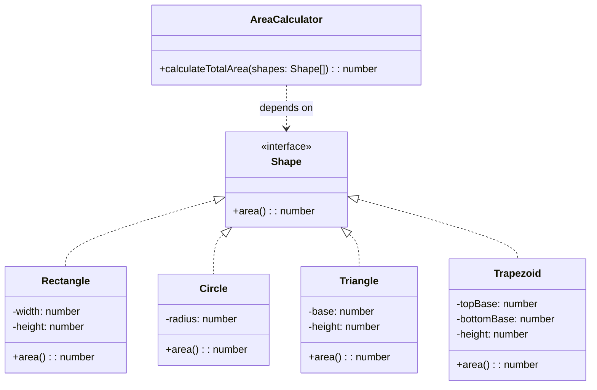

### 3.4 OCPの実現手段

OCPを実現するための主なテクニックは以下のとおりである。

| 手段 | 説明 | 適用場面 |
|------|------|----------|
| **ポリモーフィズム** | インターフェースや抽象クラスを介した実装の差し替え | 振る舞いのバリエーションが予測される場合 |
| **Strategy パターン** | アルゴリズムをオブジェクトとしてカプセル化 | 実行時にアルゴリズムを切り替える必要がある場合 |
| **Decorator パターン** | 既存オブジェクトに新しい振る舞いをラップして追加 | 既存機能に横断的関心事を追加する場合 |
| **プラグインアーキテクチャ** | 拡張ポイントを明示的に定義 | サードパーティによる拡張を許可する場合 |

### 3.5 OCPの現実的な限界

完全に「修正に対して閉じた」設計は現実的には不可能である。すべての変更を予測してあらかじめ抽象化することはできない。OCPは「よくある変更パターンに対して開いている」設計を目指すものであり、YAGNI（You Ain't Gonna Need It）の原則との間でバランスを取る必要がある。最初から過度に抽象化するのではなく、「変更が実際に発生した時点で」抽象化を導入するのが実践的なアプローチである。

---

## 4. L — Liskov Substitution Principle（リスコフの置換原則）

### 4.1 定義

> **「S が T のサブタイプであれば、プログラム中の T 型のオブジェクトを S 型のオブジェクトで置換しても、プログラムの望ましい性質は損なわれない」**

この原則は Barbara Liskov が1987年の講演「Data Abstraction and Hierarchy」で提唱したものである。直感的に言えば、「子クラスは親クラスの代わりに使えなければならない」ということである。

LSP は単なる構文上の互換性（メソッドのシグネチャが一致する）ではなく、**振る舞いの互換性**を要求する。サブクラスが親クラスの契約（事前条件、事後条件、不変条件）を守ることが本質である。

### 4.2 契約による設計（Design by Contract）

LSPを正しく理解するには、Bertrand Meyer の「契約による設計」の概念が不可欠である。

- **事前条件（Preconditions）**: メソッドが呼ばれる前に成立しているべき条件。サブタイプは事前条件を**強化してはならない**（同じか緩くする）
- **事後条件（Postconditions）**: メソッドの実行後に保証される条件。サブタイプは事後条件を**弱化してはならない**（同じか強くする）
- **不変条件（Invariants）**: オブジェクトの生存期間を通じて常に成立する条件。サブタイプは不変条件を**維持しなければならない**

### 4.3 違反例 — 正方形と長方形の問題

LSP違反の最も有名な例が「正方形・長方形問題」である。数学的には正方形は長方形の特殊な場合であるが、オブジェクト指向設計においてはこの関係がうまく機能しないことがある。

```typescript
// VIOLATION: Square breaks the contract of Rectangle
class Rectangle {
  constructor(protected width: number, protected height: number) {}

  setWidth(width: number): void {
    this.width = width;
  }

  setHeight(height: number): void {
    this.height = height;
  }

  getWidth(): number {
    return this.width;
  }

  getHeight(): number {
    return this.height;
  }

  area(): number {
    return this.width * this.height;
  }
}

class Square extends Rectangle {
  constructor(side: number) {
    super(side, side);
  }

  // Override to maintain square invariant — but this violates LSP
  setWidth(width: number): void {
    this.width = width;
    this.height = width; // Unexpected side effect
  }

  setHeight(height: number): void {
    this.width = height; // Unexpected side effect
    this.height = height;
  }
}

// Client code that breaks with Square
function testRectangle(rect: Rectangle): void {
  rect.setWidth(5);
  rect.setHeight(4);
  // Postcondition: area should be 5 * 4 = 20
  console.log(rect.area()); // Rectangle: 20, Square: 16 (!)
}
```

::: warning LSP違反の根本原因
`Square` は `Rectangle` の `setWidth` / `setHeight` の事後条件を破っている。`Rectangle` では「幅を設定しても高さは変わらない」という暗黙の事後条件が存在するが、`Square` はこの契約に違反している。
:::

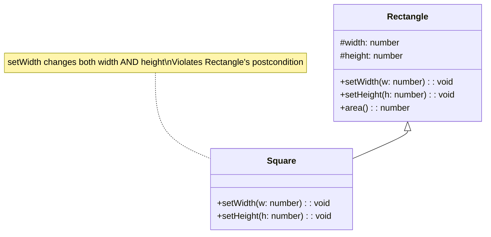

### 4.4 改善例

is-a関係を見直し、共通の抽象化を導入する。

```typescript
// Solution: Use a common abstraction instead of inheritance
interface Shape {
  area(): number;
}

// Immutable value objects avoid the LSP violation entirely
class Rectangle implements Shape {
  constructor(
    readonly width: number,
    readonly height: number
  ) {}

  area(): number {
    return this.width * this.height;
  }

  // Return a new instance instead of mutating
  withWidth(width: number): Rectangle {
    return new Rectangle(width, this.height);
  }

  withHeight(height: number): Rectangle {
    return new Rectangle(this.width, height);
  }
}

class Square implements Shape {
  constructor(readonly side: number) {}

  area(): number {
    return this.side * this.side;
  }

  withSide(side: number): Square {
    return new Square(side);
  }
}

// Both can be used as Shape without any issues
function printArea(shape: Shape): void {
  console.log(`Area: ${shape.area()}`);
}
```

::: tip イミュータブル設計とLSP
オブジェクトをイミュータブル（不変）にすることで、多くのLSP違反を未然に防げる。状態変更がなければ、サブタイプが親タイプの事後条件を破る機会自体が存在しないからである。
:::

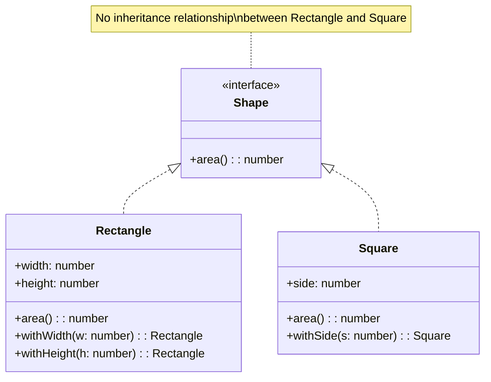

### 4.5 LSP違反の検出パターン

以下のようなコードパターンが見られる場合、LSP違反の可能性がある。

1. **サブクラスでメソッドが空実装やエラーを投げる**: 親クラスの契約を満たせていない
2. **instanceof チェックによる型判定**: クライアントがサブタイプの違いを意識している
3. **サブクラスでの事前条件の追加**: 親クラスでは許容されていた入力を拒否する
4. **ダウンキャスト**: 親クラスの型として扱いきれていない

---

## 5. I — Interface Segregation Principle（インターフェース分離の原則）

### 5.1 定義

> **「クライアントは自分が使わないメソッドに依存することを強制されるべきではない」**

インターフェース分離の原則（ISP）は、「太い」インターフェースを避けるべきだと主張する。一つのインターフェースに多数のメソッドを詰め込むと、そのインターフェースを実装するクラスは使わないメソッドまで実装せざるを得なくなる。また、そのインターフェースに依存するクライアントは、自分に関係のないメソッドの変更にも影響を受ける。

### 5.2 違反例

以下は、多機能プリンターのインターフェースがすべての機能を一つにまとめている例である。

```typescript
// VIOLATION: Fat interface forces unnecessary implementations
interface MultiFunctionDevice {
  print(document: string): void;
  scan(): string;
  fax(document: string, recipient: string): void;
  staple(document: string): void;
}

// Simple printer is forced to implement methods it cannot perform
class SimplePrinter implements MultiFunctionDevice {
  print(document: string): void {
    console.log(`Printing: ${document}`);
  }

  scan(): string {
    // Cannot scan — forced to throw or return dummy value
    throw new Error("SimplePrinter does not support scanning");
  }

  fax(document: string, recipient: string): void {
    // Cannot fax — forced to throw
    throw new Error("SimplePrinter does not support faxing");
  }

  staple(document: string): void {
    // Cannot staple — forced to throw
    throw new Error("SimplePrinter does not support stapling");
  }
}
```

::: danger ISP違反のサイン
「このクラスはこの機能をサポートしていません」という例外を投げる実装は、ISP違反の明確なサインである。インターフェースがクライアントの実際のニーズと合っていない。
:::

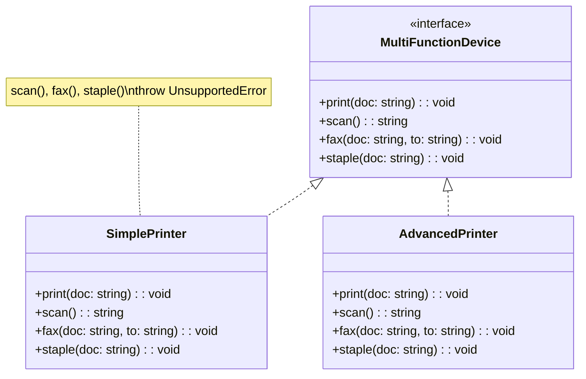

### 5.3 改善例

インターフェースを役割ごとに分離する。

```typescript
// Segregated interfaces — each focused on a single capability
interface Printer {
  print(document: string): void;
}

interface Scanner {
  scan(): string;
}

interface FaxMachine {
  fax(document: string, recipient: string): void;
}

interface Stapler {
  staple(document: string): void;
}

// Simple printer only implements what it can do
class SimplePrinter implements Printer {
  print(document: string): void {
    console.log(`Printing: ${document}`);
  }
}

// Advanced printer composes multiple capabilities
class AdvancedPrinter implements Printer, Scanner, FaxMachine {
  print(document: string): void {
    console.log(`Printing: ${document}`);
  }

  scan(): string {
    return "Scanned content";
  }

  fax(document: string, recipient: string): void {
    console.log(`Faxing to ${recipient}: ${document}`);
  }
}

// Client depends only on what it needs
function printDocuments(printer: Printer, documents: string[]): void {
  documents.forEach((doc) => printer.print(doc));
}

// Both SimplePrinter and AdvancedPrinter work here
printDocuments(new SimplePrinter(), ["Report.pdf"]);
printDocuments(new AdvancedPrinter(), ["Invoice.pdf"]);
```

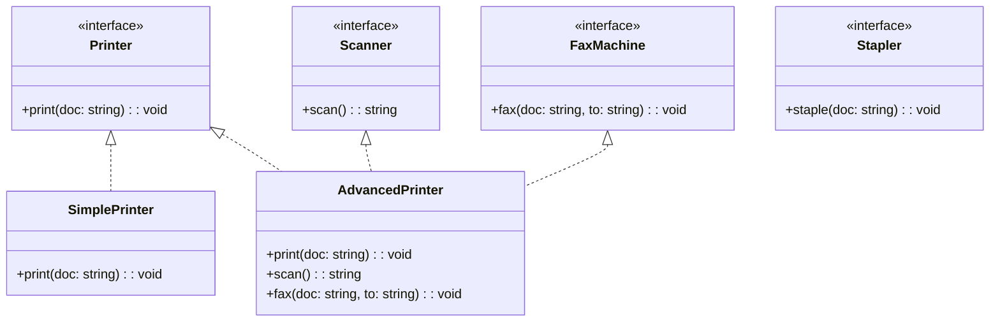

### 5.4 ISPとインターフェースの粒度

ISPを適用する際の重要な判断基準は「クライアントの視点」である。インターフェースの分離は、クライアントがどのようなメソッドの組み合わせを必要としているかに基づいて行うべきであり、任意に分割すればよいわけではない。

例えば、`Readable` と `Writable` のように、実際に異なるクライアントがそれぞれを独立して使用する場合には分離が有効である。一方で、常に一緒に使われるメソッド群を無理に分離すると、かえって複雑性が増す。

::: details ISPに関するよくある疑問
**Q: インターフェースを細かくしすぎるとかえって複雑になるのでは？**

A: その通りである。ISPは「使わないメソッドへの不要な依存を避ける」ことが目的であり、メソッド1つずつにインターフェースを作ることを推奨しているわけではない。実際のクライアントの使用パターンを観察して、意味のある単位で分離することが大切である。
:::

---

## 6. D — Dependency Inversion Principle（依存性逆転の原則）

### 6.1 定義

> **「上位モジュールは下位モジュールに依存すべきではない。両者は抽象に依存すべきである」**
> **「抽象は詳細に依存すべきではない。詳細が抽象に依存すべきである」**

依存性逆転の原則（DIP）は、SOLID原則の中でも最もアーキテクチャレベルの影響を持つ原則である。従来のソフトウェア設計では、上位のビジネスロジックが下位のインフラストラクチャ（データベース、ファイルシステム、外部APIなど）に直接依存していた。DIPは、この依存関係を「逆転」させることで、上位モジュールを変更から保護する。

ここでいう「逆転」とは、従来の「上位→下位」という依存の方向を反転させ、「上位が定義した抽象（インターフェース）に下位が依存する」構造にすることを意味する。

### 6.2 違反例

以下のコードは、通知サービスが具体的な通知手段（メール送信）に直接依存している例である。

```typescript
// VIOLATION: High-level module depends on low-level implementation
class EmailSender {
  send(to: string, subject: string, body: string): void {
    // SMTP implementation details
    console.log(`Sending email to ${to}: ${subject}`);
  }
}

class OrderService {
  // Direct dependency on a specific implementation
  private emailSender = new EmailSender();

  placeOrder(order: Order): void {
    // Business logic for placing an order
    this.processPayment(order);
    this.updateInventory(order);

    // Notification is tightly coupled to email
    this.emailSender.send(
      order.customerEmail,
      "Order Confirmation",
      `Your order #${order.id} has been placed.`
    );
  }

  private processPayment(order: Order): void {
    /* ... */
  }
  private updateInventory(order: Order): void {
    /* ... */
  }
}

interface Order {
  id: string;
  customerEmail: string;
  items: string[];
  total: number;
}
```

::: warning DIP違反の問題点
`OrderService`（上位モジュール、ビジネスロジック）が `EmailSender`（下位モジュール、インフラストラクチャ）に直接依存している。SMS通知やプッシュ通知を追加したい場合、`OrderService` 自体を修正しなければならない。また、テスト時に実際にメールを送信してしまう問題もある。
:::

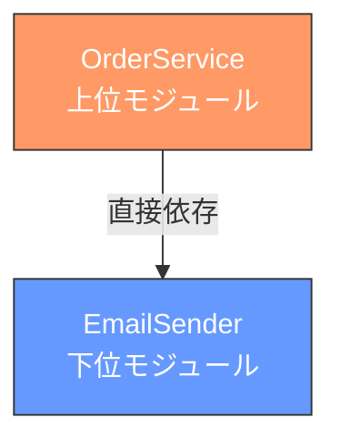

### 6.3 改善例

抽象（インターフェース）を導入し、依存の方向を逆転させる。

```typescript
// Abstraction defined by the high-level module
interface NotificationService {
  notify(recipient: string, message: string): void;
}

// High-level module depends on abstraction
class OrderService {
  // Dependency is injected, not created internally
  constructor(private notificationService: NotificationService) {}

  placeOrder(order: Order): void {
    this.processPayment(order);
    this.updateInventory(order);

    // Depends on abstraction — unaware of notification mechanism
    this.notificationService.notify(
      order.customerEmail,
      `Your order #${order.id} has been placed.`
    );
  }

  private processPayment(order: Order): void {
    /* ... */
  }
  private updateInventory(order: Order): void {
    /* ... */
  }
}

// Low-level modules depend on the abstraction
class EmailNotification implements NotificationService {
  notify(recipient: string, message: string): void {
    console.log(`Email to ${recipient}: ${message}`);
  }
}

class SmsNotification implements NotificationService {
  notify(recipient: string, message: string): void {
    console.log(`SMS to ${recipient}: ${message}`);
  }
}

class PushNotification implements NotificationService {
  notify(recipient: string, message: string): void {
    console.log(`Push to ${recipient}: ${message}`);
  }
}

// Composite notification — send via multiple channels
class CompositeNotification implements NotificationService {
  constructor(private services: NotificationService[]) {}

  notify(recipient: string, message: string): void {
    this.services.forEach((service) => service.notify(recipient, message));
  }
}

// Usage — easily swap implementations
const orderService = new OrderService(
  new CompositeNotification([
    new EmailNotification(),
    new PushNotification(),
  ])
);
```

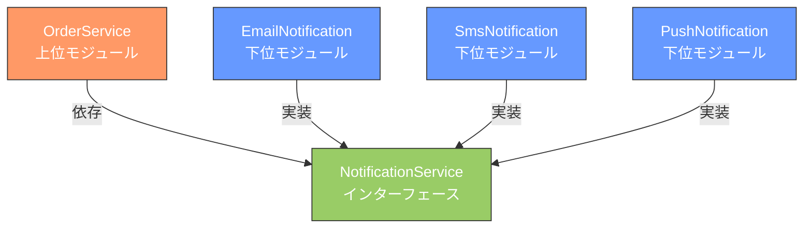

### 6.4 依存性の注入（Dependency Injection）

DIPはしばしば依存性の注入（DI: Dependency Injection）と混同されるが、両者は別の概念である。

- **DIP**: 設計原則。「何に依存すべきか」を規定する（抽象に依存せよ）
- **DI**: 実装テクニック。「依存をどう解決するか」の手法（外部から注入する）

DIはDIPを実現するための一つの手段であり、DIなしでもDIPを適用することは可能である。ただし、実際にはDIがDIPの最も一般的な実現手段となっている。

DIの方法には主に3つのパターンがある。

```typescript
// 1. Constructor Injection (recommended)
class OrderService {
  constructor(private notificationService: NotificationService) {}
}

// 2. Setter Injection
class OrderService2 {
  private notificationService!: NotificationService;

  setNotificationService(service: NotificationService): void {
    this.notificationService = service;
  }
}

// 3. Interface Injection
interface NotificationServiceAware {
  setNotificationService(service: NotificationService): void;
}
```

::: tip コンストラクタインジェクションを推奨する理由
コンストラクタインジェクションが最も推奨される理由は、オブジェクトの生成時に必要な依存がすべて揃っていることが保証されるからである。セッターインジェクションでは、依存が設定される前にオブジェクトが使用される危険性がある。
:::

### 6.5 DIPとアーキテクチャ

DIPはクラスレベルだけでなく、アーキテクチャレベルでも重要な役割を果たす。クリーンアーキテクチャやヘキサゴナルアーキテクチャ（ポート&アダプターアーキテクチャ）は、DIPを全体のアーキテクチャに適用したものといえる。

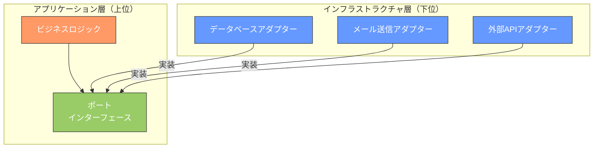

上位のビジネスロジック層がインターフェース（ポート）を定義し、下位のインフラストラクチャ層がそのインターフェースを実装する（アダプター）。これにより、ビジネスロジックはデータベースの種類やメール送信の仕組みに一切依存しない。

---

## 7. SOLID原則間の関係性

5つの原則は独立しているように見えるが、実際には相互に強く関連している。ある原則を守ることが、他の原則を守ることを促進する構造になっている。

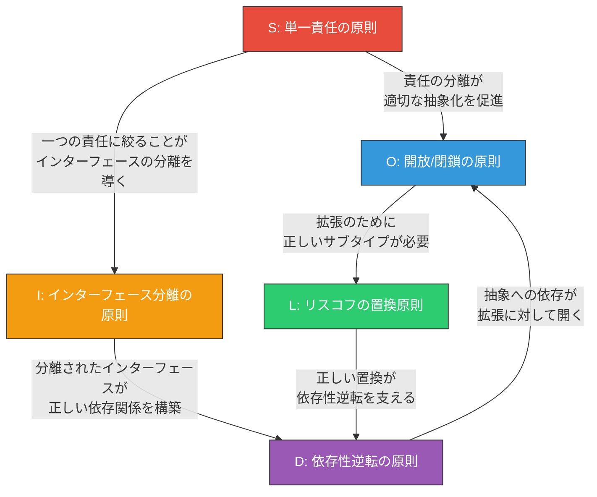

### 7.1 SRP と ISP の関係

SRPは「クラスは一つのアクターに対して責任を持つ」と言い、ISPは「クライアントに不要なメソッドを強制しない」と言う。両者は異なる視点から同じ問題、すなわちモジュールの肥大化を指摘している。SRPを守ったクラスは自然と小さなインターフェースを持ち、ISPを満たしやすくなる。

### 7.2 OCP と DIP の関係

OCPは「拡張に開き、修正に閉じよ」と言い、DIPは「抽象に依存せよ」と言う。OCPを実現するための主要な手段が、まさにDIPが推奨するインターフェースへの依存である。インターフェースを介してプログラミングすることで、既存コードを変更せずに新しい実装を追加できる。

### 7.3 LSP と OCP の関係

LSPはOCPを支える基盤である。拡張（サブクラスの追加）によってプログラムが正しく動作するためには、サブクラスが親クラスの契約を守っている必要がある。LSPに違反するサブクラスが存在すると、クライアントはサブクラスの違いを意識せざるを得なくなり、OCPが崩壊する。

### 7.4 全体像

SOLID原則を一言でまとめるなら、「適切な抽象化の境界を見つけ、依存関係を管理せよ」ということになる。SRPとISPは境界の粒度を、OCPとDIPは依存の方向を、LSPは抽象化の正しさをそれぞれ規定している。

---

## 8. SOLID原則の実践的な適用例

ここでは、SOLID原則を総合的に適用した一つの実践的な例を示す。ファイルストレージサービスを題材に、各原則がどのように協調して働くかを見てみよう。

```typescript
// --- Interfaces (ISP + DIP) ---

// Segregated interfaces for different capabilities
interface FileReader {
  read(path: string): Promise<Buffer>;
}

interface FileWriter {
  write(path: string, data: Buffer): Promise<void>;
}

interface FileDeleter {
  delete(path: string): Promise<void>;
}

// Event notification for file operations
interface FileEventNotifier {
  onFileUploaded(path: string, size: number): void;
  onFileDeleted(path: string): void;
}

// --- Implementations (OCP — new storage backends added without modifying existing code) ---

class LocalFileStorage implements FileReader, FileWriter, FileDeleter {
  read(path: string): Promise<Buffer> {
    // Read from local filesystem
    return Promise.resolve(Buffer.from(`local:${path}`));
  }

  write(path: string, data: Buffer): Promise<void> {
    console.log(`Writing to local: ${path}`);
    return Promise.resolve();
  }

  delete(path: string): Promise<void> {
    console.log(`Deleting from local: ${path}`);
    return Promise.resolve();
  }
}

class S3FileStorage implements FileReader, FileWriter, FileDeleter {
  read(path: string): Promise<Buffer> {
    // Read from S3
    return Promise.resolve(Buffer.from(`s3:${path}`));
  }

  write(path: string, data: Buffer): Promise<void> {
    console.log(`Uploading to S3: ${path}`);
    return Promise.resolve();
  }

  delete(path: string): Promise<void> {
    console.log(`Deleting from S3: ${path}`);
    return Promise.resolve();
  }
}

// --- Service (SRP — only orchestration, no storage or notification logic) ---

class FileUploadService {
  constructor(
    private writer: FileWriter,         // DIP — depends on abstraction
    private notifier: FileEventNotifier  // DIP — depends on abstraction
  ) {}

  async upload(path: string, data: Buffer): Promise<void> {
    await this.writer.write(path, data);
    this.notifier.onFileUploaded(path, data.length);
  }
}

// --- Read-only client only depends on FileReader (ISP) ---

class FileDownloadService {
  constructor(private reader: FileReader) {} // Only depends on what it needs

  async download(path: string): Promise<Buffer> {
    return this.reader.read(path);
  }
}
```

::: details 各原則がどのように適用されているか
- **SRP**: `FileUploadService` はアップロードの調整のみを担当し、ストレージの詳細や通知の詳細は知らない
- **OCP**: 新しいストレージバックエンド（GCSなど）を追加しても、既存のサービスクラスは一切変更不要
- **LSP**: `LocalFileStorage` と `S3FileStorage` はどちらも `FileReader` / `FileWriter` / `FileDeleter` の契約を正しく実装しており、互いに代替可能
- **ISP**: `FileDownloadService` は `FileReader` のみに依存し、書き込みや削除の機能には一切依存しない
- **DIP**: サービスクラスは具体的なストレージ実装ではなく、インターフェースに依存している
:::

---

## 9. 批判と限界

### 9.1 過度な適用によるオーバーエンジニアリング

SOLID原則の最大のリスクは、過度に適用することでオーバーエンジニアリングに陥ることである。

```typescript
// Over-engineered: Every trivial operation has its own interface and class
interface StringFormatter {
  format(input: string): string;
}

interface FormattedStringValidator {
  validate(formatted: string): boolean;
}

interface FormattingResultPublisher {
  publish(result: FormattingResult): void;
}

interface FormattingResult {
  original: string;
  formatted: string;
  isValid: boolean;
}

// When all you needed was:
function formatUserName(name: string): string {
  return name.trim().toLowerCase();
}
```

::: danger 過度な抽象化の問題
「将来の変更に備えて」すべてをインターフェースで抽象化すると、コードの量が爆発的に増え、実際の処理の流れを追跡することが困難になる。抽象化は「実際の変更パターンが判明してから」導入するのが実践的なアプローチである。

YAGNI（You Ain't Gonna Need It）の原則を常に念頭に置くこと。将来の仮想的な要件変更のために今のコードを複雑にすることは、ほとんどの場合、時間とエネルギーの浪費である。
:::

### 9.2 関数型プログラミングの視点

SOLID原則はオブジェクト指向プログラミング（OOP）のコンテキストで生まれたものであるが、関数型プログラミング（FP）の視点からは、その一部は異なるアプローチで達成される。

| SOLID原則 | 関数型プログラミングでの対応 |
|-----------|----------------------------|
| **SRP** | 小さな純粋関数の組み合わせ（関数合成）により自然に達成される |
| **OCP** | 高階関数とクロージャにより、既存の関数を変更せずに振る舞いを拡張できる |
| **LSP** | パラメトリック多相（ジェネリクス）により、型安全な置換が型システムレベルで保証される |
| **ISP** | 型クラス（Haskell）やトレイト（Rust）により、必要な振る舞いだけを要求できる |
| **DIP** | 関数を第一級市民として扱うことで、依存を関数引数として渡せる |

関数型のアプローチでは、データとロジックを分離し、イミュータブルなデータ構造と純粋関数を組み合わせることで、SOLID原則が解決しようとする問題の多くが設計段階から回避される。特に、状態変更を排除することで LSP 違反の多くが発生し得なくなる点は注目に値する。

```typescript
// Functional approach: No need for OCP-style class hierarchy

// Higher-order function replaces the Strategy pattern
type AreaFunction = () => number;

function rectangle(width: number, height: number): AreaFunction {
  return () => width * height;
}

function circle(radius: number): AreaFunction {
  return () => Math.PI * radius * radius;
}

// Easily extensible without modifying existing code
function triangle(base: number, height: number): AreaFunction {
  return () => (base * height) / 2;
}

// Works with any shape — open for extension
function totalArea(shapes: AreaFunction[]): number {
  return shapes.reduce((sum, area) => sum + area(), 0);
}

const total = totalArea([
  rectangle(10, 5),
  circle(3),
  triangle(4, 6),
]);
```

### 9.3 現実世界での適用指針

SOLID原則を実践で活用する際の指針を以下にまとめる。

1. **まずシンプルに書く**: 最初から SOLID を意識しすぎない。まず動くコードを書き、変更パターンが見えてきた段階でリファクタリングする

2. **「痛み」を感じてから抽象化する**: 同じような `switch` 文が複数箇所に現れたら OCP を、テストが書きにくかったら DIP を適用する。「将来こうなるかもしれない」ではなく、「今こうなっている」問題に対処する

3. **チームの理解度を考慮する**: 高度な抽象化は、チーム全員がその意図を理解できなければ保守の足かせになる。チームのスキルレベルに合わせた設計を選択する

4. **トレードオフを認識する**: 柔軟性は複雑性とのトレードオフである。「この抽象化は、追加される複雑性に見合うだけの価値があるか」を常に自問する

5. **原則を教条的に適用しない**: SOLID はルールではなくガイドラインである。状況によっては意図的に原則を「破る」ことが最善の判断である場合もある

::: tip 実践的なアドバイス
SOLID原則を学ぶ最良の方法は、自分のコードにこれらの原則に違反している箇所を見つけ、リファクタリングを通じて改善することである。教科書的な例ではなく、実際のプロジェクトでの「痛み」を出発点にすることで、各原則の本質的な価値が体感できる。
:::

---

## 10. まとめ

### 10.1 各原則の要約

| 原則 | 一言でまとめると | キーワード |
|------|------------------|------------|
| **S** — 単一責任 | 一つのクラスは一つのアクターに対してのみ責任を持つ | 凝集度、変更理由 |
| **O** — 開放/閉鎖 | 既存コードを変更せずに振る舞いを拡張する | ポリモーフィズム、抽象化 |
| **L** — リスコフの置換 | サブタイプは親タイプの契約を守る | 事前条件、事後条件、不変条件 |
| **I** — インターフェース分離 | クライアントが使わないメソッドに依存させない | 細粒度のインターフェース |
| **D** — 依存性逆転 | 上位モジュールも下位モジュールも抽象に依存する | DI、ポート&アダプター |

### 10.2 SOLID原則を超えて

SOLID原則はオブジェクト指向設計の重要な基盤であるが、ソフトウェア設計の全体像を捉えるためには、以下の原則やプラクティスとも組み合わせて理解することが有益である。

- **DRY（Don't Repeat Yourself）**: 知識の重複を避ける
- **KISS（Keep It Simple, Stupid）**: 可能な限りシンプルに保つ
- **YAGNI（You Ain't Gonna Need It）**: 今必要でないものは作らない
- **関心の分離（Separation of Concerns）**: 異なる関心事を異なるモジュールに分離する
- **構成の原則（Composition over Inheritance）**: 継承よりも委譲・合成を優先する

これらの原則は互いに補完し合い、時に相反する。優れた設計とは、これらの原則間の最適なバランスを見つけることである。そのためには、原則を暗記するだけでなく、実際のコードベースで繰り返し適用し、その効果と限界を自分自身で体感することが不可欠である。

ソフトウェア設計に唯一の正解はない。しかし、SOLID原則は「なぜこの設計にしたのか」を説明するための共通言語を提供してくれる。チーム内で設計判断を議論する際の基盤として、これらの原則を活用してほしい。
