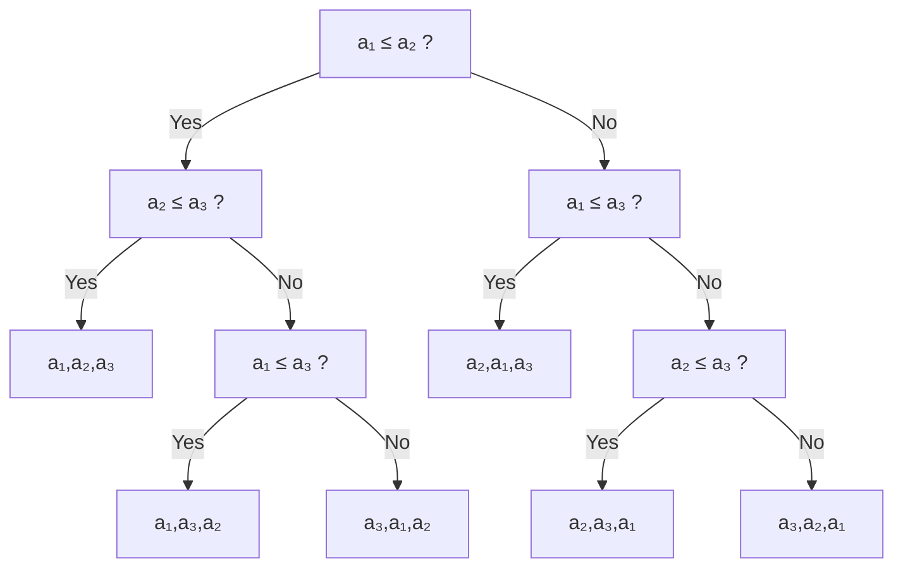
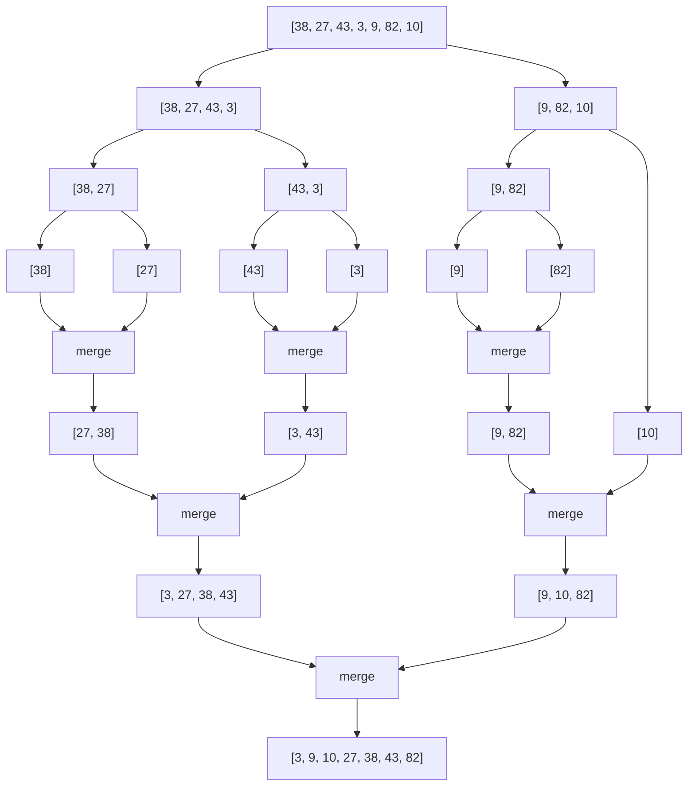
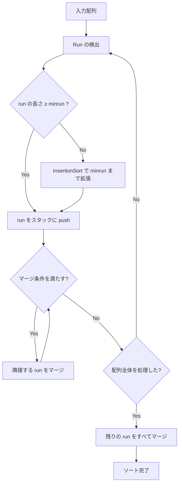
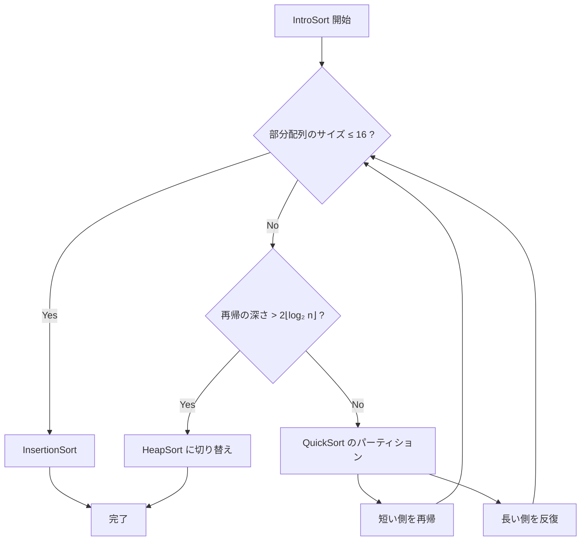
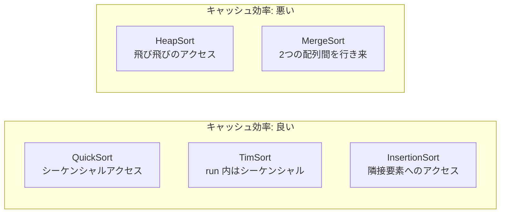

# 比較ソートの理論と実践 — QuickSort, MergeSort, TimSort

## 1. ソートの重要性と比較ソートの下界

### 1.1 なぜソートは重要なのか

ソートは計算機科学において最も基本的かつ実用的な操作の一つである。データベースの ORDER BY 句、検索エンジンのランキング、OS のファイルシステム表示、スプレッドシートの列ソート、さらにはバイナリサーチの前処理に至るまで、ソートはあらゆる場面で使われている。

Donald Knuth は著書 *The Art of Computer Programming* において、計算機が費やす時間の約25%がソートに関連する処理に使われていると述べた。この推定は1970年代のものであるが、現代においてもソートの重要性は変わらない。むしろデータ量の爆発的増加により、効率的なソートアルゴリズムへの要求はかつてないほど高まっている。

ソートが重要である理由をもう少し具体的に整理すると、以下のようになる。

1. **検索の高速化**: ソート済みデータに対しては二分探索（$O(\log n)$）が使える。ソートされていないデータの探索は最悪 $O(n)$ である。
2. **重複検出**: ソート済みデータでは、隣接要素を比較するだけで重複を $O(n)$ で検出できる。
3. **結合操作**: ソート済みの2つのリストを $O(n)$ でマージできる（ソートマージ結合）。
4. **統計量の計算**: 中央値、パーセンタイル、最頻値などはソート済みデータから効率的に求められる。
5. **出力の安定性**: ユーザーに結果を返す際、ソート済みのデータは再現性と可読性を保証する。

### 1.2 比較ソートとは

ソートアルゴリズムは大きく2つに分類できる。

- **比較ソート（comparison-based sort）**: 要素間の大小を比較する操作のみを用いて並べ替える。QuickSort、MergeSort、HeapSort、InsertionSort などが該当する。
- **非比較ソート（non-comparison sort）**: 要素の値の分布に関する事前知識を利用する。Counting Sort、Radix Sort、Bucket Sort などが該当する。

本記事では比較ソートに焦点を当てる。比較ソートは入力データの型に依存せず、全順序関係さえ定義できれば任意の要素に適用できるという汎用性を持つ。

### 1.3 比較ソートの下界：$\Omega(n \log n)$

比較ソートの最も重要な理論的結果は、**最悪ケースにおいて $\Omega(n \log n)$ 回の比較が必要である**という下界の証明である。これは、どれほど巧妙なアルゴリズムを設計しても、比較のみを用いるソートはこの壁を超えられないことを意味する。

#### 決定木モデルによる証明

比較ソートアルゴリズムの実行を**決定木（decision tree）**として表現する。決定木は以下のような二分木である。



- 各**内部ノード**は、2つの要素の比較（例：$a_i \le a_j$ か？）を表す。
- 各**葉ノード**は、入力の特定の順列（ソート結果）を表す。
- アルゴリズムの実行は、根から葉への1つのパスに対応する。

$n$ 個の要素のソートにおいて、入力のあり得る順列の数は $n!$ 通りである。正しいソートアルゴリズムは、これらすべての順列を区別できなければならない。したがって、決定木の葉の数は少なくとも $n!$ 個必要である。

高さ $h$ の二分木の葉の数は最大で $2^h$ であるから、

$$
2^h \ge n!
$$

両辺の対数をとると、

$$
h \ge \log_2(n!)
$$

ここで、**Stirling の近似**を用いる。

$$
n! \approx \sqrt{2\pi n} \left(\frac{n}{e}\right)^n
$$

したがって、

$$
\log_2(n!) = \Theta(n \log n)
$$

より正確には、

$$
\log_2(n!) = n \log_2 n - n \log_2 e + O(\log n) \ge n \log_2 n - 1.443n
$$

つまり、決定木の高さ（= 最悪ケースの比較回数）は $\Omega(n \log n)$ である。これは**情報理論的な下界**であり、$n!$ 通りの可能性を二分する質問（比較）で絞り込むために必要な最小限の情報量に対応している。

#### 下界の直観的理解

この結果を直観的に理解するには、ソートを「情報の獲得」と捉えるとよい。

- ソート前：$n$ 個の要素の正しい並び順は $n!$ 通りのうちどれかであり、我々はどれか分からない。
- 各比較：1回の比較は1ビットの情報を与え、可能性を最大で半分に減らす。
- ソート後：$n!$ 通りから1通りに絞り込まれている。

必要な情報量は $\log_2(n!)$ ビットであり、これが $\Theta(n \log n)$ であることから、最低でも $\Omega(n \log n)$ 回の比較が必要となる。

> [!NOTE]
> この下界は**最悪ケース**に対するものである。平均ケースにおいても同様の下界 $\Omega(n \log n)$ が成立する（情報理論的引数はそのまま適用できる）。ただし、入力に偏りがある場合（例えば「ほとんどソート済み」のデータ）、適応的なアルゴリズムはより少ない比較で済むことがある。

## 2. QuickSort — 分割統治の王者

### 2.1 アルゴリズムの概要

QuickSort は1960年に Tony Hoare によって発明された。分割統治法（divide and conquer）に基づく比較ソートであり、実用上最も高速なソートアルゴリズムの一つとして広く使われている。

QuickSort の基本的な動作は以下の3ステップから成る。

1. **ピボット選択（pivot selection）**: 配列から1つの要素をピボットとして選ぶ。
2. **パーティション（partition）**: 配列をピボット以下の要素とピボット以上の要素の2つに分割する。
3. **再帰（recurse）**: 2つの部分配列に対して再帰的に QuickSort を適用する。

```
QuickSort の動作イメージ（ピボット = 5）:

  [3, 7, 1, 5, 9, 2, 8, 4, 6]
                ↓ pivot = 5
  [3, 1, 2, 4] [5] [7, 9, 8, 6]
       ↓                ↓
  再帰的にソート     再帰的にソート
  [1, 2, 3, 4] [5] [6, 7, 8, 9]
```

以下に擬似コードを示す。

```python
def quicksort(arr, lo, hi):
    if lo < hi:
        # Partition and get pivot index
        p = partition(arr, lo, hi)
        # Recursively sort left and right subarrays
        quicksort(arr, lo, p - 1)
        quicksort(arr, p + 1, hi)

def partition(arr, lo, hi):
    pivot = arr[hi]  # Choose last element as pivot
    i = lo - 1
    for j in range(lo, hi):
        if arr[j] <= pivot:
            i += 1
            arr[i], arr[j] = arr[j], arr[i]
    arr[i + 1], arr[hi] = arr[hi], arr[i + 1]
    return i + 1
```

### 2.2 パーティション方式

パーティションは QuickSort の心臓部であり、いくつかの方式が知られている。

#### Lomuto パーティション

上記の擬似コードで示した方式である。配列の末尾をピボットとし、左から右に走査しながら、ピボット以下の要素を前方に移動する。

- **利点**: 実装が単純で理解しやすい。
- **欠点**: 全要素が同じ値の場合に $O(n^2)$ になる。交換回数が多い。

#### Hoare パーティション

Hoare 自身が考案した方式で、2つのポインタを配列の両端から中央に向かって動かし、ピボットに対して「間違った側」にある要素同士を交換する。

```python
def hoare_partition(arr, lo, hi):
    pivot = arr[lo + (hi - lo) // 2]  # Choose middle element
    i = lo - 1
    j = hi + 1
    while True:
        i += 1
        while arr[i] < pivot:
            i += 1
        j -= 1
        while arr[j] > pivot:
            j -= 1
        if i >= j:
            return j
        arr[i], arr[j] = arr[j], arr[i]
```

- **利点**: 交換回数が平均的に少ない。全要素が同じ値の場合でも均等に分割される。
- **欠点**: 実装がやや複雑。ピボットの最終位置が確定しないため、再帰呼び出しの範囲指定に注意が必要。

#### 三分割パーティション（Dutch National Flag）

要素をピボットより小さい、等しい、大きいの3つに分割する方式。Dijkstra が考案した。

```
  [< pivot] [= pivot] [> pivot]
```

重複要素が多い場合に特に有効であり、等しい要素の領域は再帰の対象から外れるため計算量が大幅に削減される。

### 2.3 ピボット選択戦略

ピボット選択は QuickSort の性能を左右する最も重要な要素である。理想的なピボットはデータの**中央値**であり、配列を均等に二分割する。

#### 固定位置選択

配列の先頭、末尾、または中央の要素をピボットとする最も単純な方式。

- **問題**: ソート済み配列やほぼソート済み配列に対して最悪ケース $O(n^2)$ に陥る。

#### ランダム選択

配列からランダムに1つの要素を選ぶ。

- **利点**: 特定の入力パターンに対する脆弱性を排除できる。最悪ケースの確率が極めて低くなる。
- **実装**: `pivot_index = random.randint(lo, hi)` として選んだ要素をパーティション前に末尾と交換する。

#### Median-of-Three

配列の先頭・中央・末尾の3要素のうち中央値をピボットとする。

```python
def median_of_three(arr, lo, hi):
    mid = lo + (hi - lo) // 2
    # Sort arr[lo], arr[mid], arr[hi] and use middle value
    if arr[lo] > arr[mid]:
        arr[lo], arr[mid] = arr[mid], arr[lo]
    if arr[lo] > arr[hi]:
        arr[lo], arr[hi] = arr[hi], arr[lo]
    if arr[mid] > arr[hi]:
        arr[mid], arr[hi] = arr[hi], arr[mid]
    return mid  # arr[mid] is the median
```

- **利点**: ソート済み配列の最悪ケースを回避できる。定数オーバーヘッドが小さい。
- **多くの実装で採用**: glibc の `qsort` や多くのライブラリで使われている。

#### Ninther（Median-of-Three の Median-of-Three）

配列を3等分し、各部分の Median-of-Three を求め、さらにその3つの中央値を取る。Tukey が提案した方法であり、より精度の高い近似中央値が得られる。大規模データで有効だが、オーバーヘッドがある。

### 2.4 計算量分析

| ケース | 比較回数 | 備考 |
|--------|----------|------|
| 最良ケース | $O(n \log n)$ | 毎回均等に分割 |
| 平均ケース | $O(n \log n)$ | 約 $1.39 n \log_2 n$ |
| 最悪ケース | $O(n^2)$ | 毎回最端の要素がピボット |

#### 平均ケースの導出

$n$ 個の要素に対する QuickSort の平均比較回数を $C(n)$ とする。ピボットが $k$ 番目に小さい要素（$k = 1, 2, \ldots, n$）に選ばれる確率は各 $1/n$ である。このとき、パーティションで $n-1$ 回の比較を行い、サイズ $k-1$ と $n-k$ の2つの部分問題に分割される。

$$
C(n) = (n - 1) + \frac{1}{n} \sum_{k=1}^{n} [C(k-1) + C(n-k)]
$$

対称性により $\sum_{k=1}^{n} C(k-1) = \sum_{k=1}^{n} C(n-k)$ であるから、

$$
C(n) = (n - 1) + \frac{2}{n} \sum_{k=0}^{n-1} C(k)
$$

この漸化式を解くと、

$$
C(n) = 2(n+1)H_n - 4n \approx 2n \ln n \approx 1.39 n \log_2 n
$$

ここで $H_n = \sum_{k=1}^{n} \frac{1}{k}$ は調和級数（$n$ 番目の調和数）である。

この結果は、QuickSort の平均比較回数が下界 $n \log_2 n$ の約1.39倍であることを示している。MergeSort の約 $n \log_2 n$ 回と比べると比較回数は多いが、実際の実行時間ではキャッシュ効率やメモリアクセスパターンの影響で QuickSort が勝ることが多い。

### 2.5 最悪ケース回避の工夫

QuickSort の最悪ケース $O(n^2)$ は実用上の大きな懸念事項である。これを回避するための手法を整理する。

1. **ランダム化**: ピボットをランダムに選ぶことで、特定の入力パターンに対する脆弱性を排除する。最悪ケースの確率は $O(1/n!)$ に低下する。
2. **Median-of-Three / Ninther**: 近似中央値の精度を上げることで、分割の偏りを抑制する。
3. **IntroSort への移行**: 再帰が深くなりすぎた場合に HeapSort に切り替える（後述）。
4. **小さな部分配列での InsertionSort**: 部分配列のサイズが閾値以下（通常8--16要素）になったら InsertionSort に切り替える。InsertionSort は小さな配列ではオーバーヘッドが少なく高速である。

### 2.6 QuickSort の性質まとめ

- **in-place**: 追加メモリは再帰スタックの $O(\log n)$（最悪 $O(n)$）のみ。
- **不安定**: パーティション中に等しい要素の相対順序が変わる。
- **キャッシュ効率が良い**: 配列を連続的にアクセスするため、CPU キャッシュのヒット率が高い。
- **分割が偏ると遅い**: 最悪ケース $O(n^2)$ は実務上の注意点。

## 3. MergeSort — 安定性と理論的最適性

### 3.1 アルゴリズムの概要

MergeSort は1945年に John von Neumann によって発明された、最も古いソートアルゴリズムの一つである。QuickSort と同じく分割統治法に基づくが、その戦略は根本的に異なる。

QuickSort が「分割（パーティション）で苦労し、統合は不要」であるのに対し、MergeSort は「分割は単純（中央で二等分）、統合（マージ）で苦労する」という対照的なアプローチを取る。



以下に擬似コードを示す。

```python
def merge_sort(arr):
    if len(arr) <= 1:
        return arr
    mid = len(arr) // 2
    left = merge_sort(arr[:mid])
    right = merge_sort(arr[mid:])
    return merge(left, right)

def merge(left, right):
    result = []
    i = j = 0
    while i < len(left) and j < len(right):
        if left[i] <= right[j]:  # <= ensures stability
            result.append(left[i])
            i += 1
        else:
            result.append(right[j])
            j += 1
    result.extend(left[i:])
    result.extend(right[j:])
    return result
```

### 3.2 計算量分析

MergeSort の計算量は入力に依存せず、常に $\Theta(n \log n)$ である。

再帰の深さは $\log_2 n$ であり、各レベルでマージ操作により合計 $O(n)$ の比較が行われる。したがって、

$$
T(n) = 2T(n/2) + O(n)
$$

マスター定理により $T(n) = \Theta(n \log n)$ が得られる。

より精密には、MergeSort の比較回数は以下の範囲に収まる。

$$
n \lceil \log_2 n \rceil - 2^{\lceil \log_2 n \rceil} + 1 \le C(n) \le n \lceil \log_2 n \rceil - 2^{\lceil \log_2 n \rceil} + 1
$$

すなわち、比較回数は約 $n \log_2 n - n + 1$ であり、比較ソートの下界 $\lceil \log_2(n!) \rceil$ にほぼ一致する。この意味で、MergeSort は**比較回数において最適に近い**アルゴリズムである。

| ケース | 比較回数 | 備考 |
|--------|----------|------|
| 最良ケース | $O(n \log n)$ | 常に同じ |
| 平均ケース | $O(n \log n)$ | 約 $n \log_2 n - n + 1$ |
| 最悪ケース | $O(n \log n)$ | 常に同じ |

### 3.3 安定性

MergeSort の最も重要な特性の一つが**安定性（stability）**である。安定なソートとは、等しいキーを持つ要素の相対的な順序がソート前後で変化しないことを保証するソートである。

安定性はマージ操作における比較 `left[i] <= right[j]` の `<=`（等号を含む）によって実現される。左側の要素を優先することで、元の配列における前方の要素が結果でも前方に配置される。

### 3.4 外部ソート（External Sort）

MergeSort のマージ操作はシーケンシャルアクセスのみで動作するため、**外部ソート**（メインメモリに収まらない大量データのソート）に適している。

外部ソートの典型的な手順は以下の通りである。

```
外部マージソートの流れ:

1. データをメモリに収まるチャンクに分割
   ┌──────┐ ┌──────┐ ┌──────┐ ┌──────┐
   │Chunk1│ │Chunk2│ │Chunk3│ │Chunk4│  ... (ディスク上)
   └──────┘ └──────┘ └──────┘ └──────┘

2. 各チャンクをメモリ内でソート
   ┌──────┐ ┌──────┐ ┌──────┐ ┌──────┐
   │Sorted│ │Sorted│ │Sorted│ │Sorted│  ... (ソート済みrun)
   └──────┘ └──────┘ └──────┘ └──────┘

3. k-way マージ（ヒープを使って k 個の run を同時にマージ）
   ┌──────┐ ┌──────┐ ┌──────┐ ┌──────┐
   │      │ │      │ │      │ │      │
   └──┬───┘ └──┬───┘ └──┬───┘ └──┬───┘
      │        │        │        │
      └────────┼────────┼────────┘
               ↓
         ┌──────────┐
         │ Min-Heap │  (各 run の先頭要素を保持)
         └────┬─────┘
              ↓
     ┌───────────────┐
     │  Sorted Output │
     └───────────────┘
```

$k$-way マージでは、$k$ 個の run の先頭要素を最小ヒープで管理する。ヒープから最小要素を取り出し、出力に追加し、その要素が属する run から次の要素をヒープに挿入する。1要素あたり $O(\log k)$ の操作で済むため、全体の計算量は $O(n \log k)$ である。

### 3.5 並列化

MergeSort は並列化に非常に適している。

1. **分割フェーズ**: 左右の部分配列を独立したスレッド/プロセスで並行してソートできる。
2. **マージフェーズ**: マージ操作自体も並列化可能（binary merge の並列版）。

再帰的に並列化した場合の work は $O(n \log n)$、span は $O(\log^3 n)$（並列マージを使った場合）であり、$n / \log^2 n$ 個のプロセッサで線形スピードアップが期待できる。

### 3.6 MergeSort の性質まとめ

- **安定**: 等しい要素の相対順序を保持する。
- **追加メモリ**: $O(n)$ の作業用配列が必要（in-place ではない）。
- **最悪ケース保証**: 入力に依存せず常に $O(n \log n)$。
- **外部ソートに最適**: シーケンシャルアクセスのみで動作する。
- **並列化に適する**: 独立した部分問題に自然に分解できる。

## 4. HeapSort — in-place で最悪ケース保証

### 4.1 アルゴリズムの概要

HeapSort は1964年に J. W. J. Williams によって発明された。二分ヒープ（binary heap）というデータ構造を利用するソートアルゴリズムである。

HeapSort の基本的な動作は以下の2フェーズから成る。

1. **ヒープ構築（heapify）**: 配列を最大ヒープに変換する。
2. **ソートフェーズ**: ヒープの根（最大要素）を末尾と交換し、ヒープサイズを1減らしてヒープ性質を修復する操作を繰り返す。

```python
def heapsort(arr):
    n = len(arr)
    # Build max-heap (bottom-up)
    for i in range(n // 2 - 1, -1, -1):
        sift_down(arr, i, n)
    # Extract elements one by one
    for i in range(n - 1, 0, -1):
        arr[0], arr[i] = arr[i], arr[0]  # Move max to end
        sift_down(arr, 0, i)  # Restore heap property

def sift_down(arr, root, size):
    while True:
        largest = root
        left = 2 * root + 1
        right = 2 * root + 2
        if left < size and arr[left] > arr[largest]:
            largest = left
        if right < size and arr[right] > arr[largest]:
            largest = right
        if largest == root:
            break
        arr[root], arr[largest] = arr[largest], arr[root]
        root = largest
```

### 4.2 計算量分析

| ケース | 比較回数 | 備考 |
|--------|----------|------|
| ヒープ構築 | $O(n)$ | ボトムアップ構築は $O(n)$ |
| ソートフェーズ | $O(n \log n)$ | $n$ 回の sift-down、各 $O(\log n)$ |
| 全体（最良・平均・最悪） | $O(n \log n)$ | 常に同じ |

ヒープ構築が $O(n)$ であることは自明ではない。直観的には、葉に近いノードほど sift-down の距離が短く、葉に近いノードの数が多いためである。形式的には、

$$
\sum_{h=0}^{\lfloor \log n \rfloor} \frac{n}{2^{h+1}} \cdot O(h) = O\left(n \sum_{h=0}^{\infty} \frac{h}{2^h}\right) = O(n)
$$

### 4.3 キャッシュ効率の問題

HeapSort の最大の実用上の弱点は、**キャッシュ効率が悪い**ことである。

ヒープの sift-down 操作では、親ノードから子ノード（インデックスが約2倍）へと飛び飛びにアクセスする。ヒープが大きくなると、親と子が異なるキャッシュラインに属する確率が高くなり、キャッシュミスが頻発する。

```
ヒープのメモリアクセスパターン:

配列: [0] [1] [2] [3] [4] [5] [6] [7] [8] [9] ...

sift-down のアクセス: 0 → 1 → 3 → 7 → ...  (インデックスが倍々)
                       ↑       ↑           ↑
                    キャッシュライン1  ライン2  ライン3...

→ 大きな配列ではほぼ毎回キャッシュミスが発生
```

一方、QuickSort のパーティション操作は配列を左から右へシーケンシャルに走査するため、キャッシュのプリフェッチが効果的に機能する。この差が、理論的な比較回数では同等であっても、実測で HeapSort が QuickSort より2--5倍遅くなる主要因である。

### 4.4 HeapSort の性質まとめ

- **in-place**: 追加メモリは $O(1)$ のみ。
- **不安定**: sift-down 中に等しい要素の順序が変わる。
- **最悪ケース保証**: 常に $O(n \log n)$。
- **キャッシュ効率が悪い**: 飛び飛びのメモリアクセスパターン。
- **実測では遅い**: 定数係数が大きく、QuickSort や MergeSort に劣ることが多い。

## 5. TimSort — 現実世界のデータに最適化されたハイブリッド

### 5.1 誕生の背景

TimSort は2002年に Tim Peters が Python の組み込みソートとして設計・実装した。Peters は Python のメーリングリストで「listsort.txt」という詳細な設計文書を公開しており、アルゴリズムの設計判断が丁寧に記録されている。

TimSort の設計思想は、**現実世界のデータはランダムではない**という観察に基づいている。実際のデータには以下のようなパターンが頻繁に現れる。

- 部分的にソート済みの区間が存在する。
- 昇順・降順の連続した区間（run）が含まれる。
- 同じ値が連続して出現する。

これらの構造を活用することで、最悪でも $O(n \log n)$ を保証しつつ、現実的なデータに対しては $O(n)$ に近い性能を発揮する**適応的ソート（adaptive sort）**を実現した。

### 5.2 アルゴリズムの全体像

TimSort の動作は大きく3つのフェーズに分けられる。



### 5.3 Run の検出

TimSort はまず配列を走査して、自然に存在する昇順または降順の連続区間（**run**）を検出する。

- **昇順 run**: $a_0 \le a_1 \le a_2 \le \ldots$
- **降順 run**: $a_0 > a_1 > a_2 > \ldots$（検出後、反転して昇順にする）

降順 run の条件が strict（$>$）であることに注意。$\ge$ ではなく $>$ とすることで、反転操作が安定性を損なわないことが保証される（等しい要素を含む降順区間は分割されるため、反転しても元の順序が保たれる）。

### 5.4 minrun の決定

検出された run が短すぎると、マージの回数が増えて効率が悪くなる。TimSort は**minrun**（最小 run 長）という閾値を設定し、短い run は InsertionSort で minrun の長さまで拡張する。

minrun の値は配列長 $n$ から以下のように決定される。

```python
def compute_minrun(n):
    """Compute minimum run length for TimSort."""
    r = 0
    while n >= 64:
        r |= n & 1
        n >>= 1
    return n + r
```

この関数は $n$ を6ビットにシフトダウンし、切り捨てたビットのいずれかが1であれば1を加える。結果として minrun は32--64の範囲に収まる。

minrun をこの範囲にする理由は以下の通りである。

- **小さすぎる（< 32）**: InsertionSort の区間が短すぎてマージ回数が多くなる。
- **大きすぎる（> 64）**: InsertionSort の区間が長すぎてその中のソートが遅くなる。
- **$n / \text{minrun}$ が2の冪に近い**: マージ時にバランスの良い二分木構造になり、効率的。

### 5.5 マージ戦略とスタック不変条件

TimSort は検出した run をスタックに積み、隣接する run を適切なタイミングでマージする。マージのタイミングは**スタック不変条件（stack invariant）**によって制御される。

スタックのトップ3要素の長さを $A$（最上位）、$B$（2番目）、$C$（3番目）とするとき、以下の2つの条件が常に満たされるようにする。

1. $C > B + A$
2. $B > A$

これらの条件が破られた場合、$B$ を $A$ または $C$ のうち小さい方とマージする。

```
スタック不変条件の例:

  条件を満たす場合:         条件が破れた場合:
  ┌───┐                    ┌───┐
  │ A │ = 5                │ A │ = 20
  ├───┤                    ├───┤
  │ B │ = 10               │ B │ = 15
  ├───┤                    ├───┤
  │ C │ = 20               │ C │ = 25  ← C > B + A ? 25 > 35 ? No!
  └───┘                    └───┘
  C > B + A: 20 > 15 ✓    → B と A をマージ
  B > A:     10 > 5  ✓
```

この戦略には2つの重要な効果がある。

1. **マージを遅延する**: run の検出が進むにつれて、後から発見される run と効率的にマージできる可能性がある。
2. **バランスを保つ**: 不変条件によりスタック上の run 長はおおよそフィボナッチ数列的に増加し、マージが極端に不均等になることを防ぐ。

### 5.6 マージ操作の最適化

TimSort のマージ操作は、通常の MergeSort と比べて大幅に最適化されている。

#### 一時バッファの最小化

2つの run をマージする際、TimSort は小さい方の run だけを一時バッファにコピーする。

```
Run A (短い) と Run B (長い) のマージ:

通常の MergeSort: A と B の両方をコピー → O(|A| + |B|) の追加メモリ

TimSort: A だけをコピー → O(min(|A|, |B|)) の追加メモリ

┌─────────────────────────────────────┐
│ ... │  Run A (短)  │  Run B (長)     │  元の配列
└─────────────────────────────────────┘
        ↓コピー
┌──────────────┐
│  tmp (A のコピー) │
└──────────────┘

tmpとBの先頭から比較しながら、元の配列のAの位置から書き込む
```

#### Galloping Mode（指数探索モード）

マージ中に、一方の run から連続して要素が取り出される状況が発生することがある。例えば、Run A の要素がすべて Run B の先頭要素より小さい場合、Run A の要素が連続して出力される。

通常のマージでは、毎回1要素ずつ比較するため $O(n)$ の比較が必要だが、galloping mode ではこのような偏りを検出して**指数探索（exponential search）**に切り替える。

```
Galloping Mode の動作:

Run A: [1, 3, 5, 7, 9, 11, 13, 15, 17, 19, ...]
Run B: [20, 22, 24, ...]

通常モード: 1 vs 20 → A, 3 vs 20 → A, 5 vs 20 → A, ... (毎回比較)

Galloping: 一方から MIN_GALLOP(7)回連続で取り出されたら切り替え
  → Run A の中で 20 の挿入位置を指数探索で特定
  → [1,3,5,...,19] を一括コピー
```

指数探索では、まず位置 $1, 2, 4, 8, 16, \ldots$ と指数的にジャンプして範囲を絞り込み、その後二分探索で正確な位置を特定する。これにより、$k$ 個の連続要素がある場合の比較回数は $O(\log k)$ に削減される。

galloping mode に入る閾値 `MIN_GALLOP` は初期値7で、galloping が成功するたびに閾値が下がり（galloping mode に入りやすくなり）、失敗するたびに上がる（通常モードに戻りやすくなる）。

### 5.7 TimSort の計算量

| ケース | 比較回数 | 備考 |
|--------|----------|------|
| 最良ケース | $O(n)$ | 入力がすでにソート済み |
| 平均ケース | $O(n \log n)$ | |
| 最悪ケース | $O(n \log n)$ | |
| 空間計算量 | $O(n)$ | 一時バッファ |

TimSort の最良ケースが $O(n)$ であることは、ソート済み配列に対して run の検出で1つの run が配列全体をカバーし、マージが不要になることから自明である。

### 5.8 TimSort の正当性証明

2015年に、de Gouw らの研究グループが形式検証ツールを用いて TimSort の Java 実装を検証した際、**スタック不変条件の維持に関するバグ**が発見された。具体的には、元の不変条件ではスタックの深さが十分にバウンドされず、特定の入力パターンでスタックオーバーフローが発生し得ることが示された。

このバグは Python、Java、Android の TimSort 実装に存在しており、修正が行われた。この事例は、広く使われているアルゴリズムであっても形式検証の重要性を示す好例として知られている。

## 6. IntroSort — QuickSort + HeapSort のハイブリッド

### 6.1 設計動機

IntroSort（Introspective Sort）は1997年に David Musser によって提案された。QuickSort の優れた平均性能を活かしつつ、最悪ケース $O(n^2)$ を回避するハイブリッドアルゴリズムである。

QuickSort の最悪ケースは、再帰の深さが $O(n)$ になることで発生する。IntroSort はこの再帰の深さを監視し、閾値（通常 $2 \lfloor \log_2 n \rfloor$）を超えた場合に HeapSort に切り替えることで、最悪ケースでも $O(n \log n)$ を保証する。

### 6.2 アルゴリズム

```python
def introsort(arr, lo, hi, depth_limit):
    while hi - lo > 16:  # Threshold for InsertionSort
        if depth_limit == 0:
            # Recursion too deep, switch to HeapSort
            heapsort(arr, lo, hi)
            return
        depth_limit -= 1
        # QuickSort partition
        p = partition(arr, lo, hi)
        # Recurse on shorter side, iterate on longer side
        if p - lo < hi - p:
            introsort(arr, lo, p - 1, depth_limit)
            lo = p + 1
        else:
            introsort(arr, p + 1, hi, depth_limit)
            hi = p - 1
    # Small subarrays: use InsertionSort
    insertion_sort(arr, lo, hi)
```



### 6.3 3つのアルゴリズムの役割分担

IntroSort は3つのソートアルゴリズムの長所を組み合わせている。

| アルゴリズム | 担当する場面 | 理由 |
|---|---|---|
| QuickSort | 大きな部分配列（主要部分） | 平均性能が最も良い |
| HeapSort | 再帰が深くなりすぎた場合 | 最悪 $O(n \log n)$ を保証 |
| InsertionSort | 小さな部分配列（16要素以下） | オーバーヘッドが小さく、キャッシュ効率も良い |

### 6.4 IntroSort の性質まとめ

- **in-place**: 追加メモリは再帰スタックの $O(\log n)$ のみ。
- **不安定**: QuickSort ベースのため不安定。
- **最悪ケース**: $O(n \log n)$ が保証される。
- **平均性能**: QuickSort とほぼ同等。

## 7. 安定性の意味と重要性

### 7.1 安定性の定義

ソートの**安定性（stability）**とは、ソートキーが等しい要素の相対的な順序がソート前後で保存される性質を指す。

```
安定ソートの例（名前でソート後、年齢でソート）:

入力:         [(Alice,30), (Bob,25), (Charlie,30), (David,25)]
名前でソート: [(Alice,30), (Bob,25), (Charlie,30), (David,25)]
年齢で安定ソート:
              [(Bob,25), (David,25), (Alice,30), (Charlie,30)]
              ↑同じ年齢25内で Bob が David の前（元の順序を保持）
              ↑同じ年齢30内で Alice が Charlie の前（元の順序を保持）

年齢で不安定ソート（可能性のある結果）:
              [(David,25), (Bob,25), (Charlie,30), (Alice,30)]
              ↑同じ年齢内の順序が入れ替わっている
```

### 7.2 安定性が重要な場面

1. **多段ソート**: 複数のキーで段階的にソートする場合、安定ソートなら前段のソート結果が次段で破壊されない。例えば、まず名前でソートし、次に年齢で安定ソートすれば、同じ年齢内では名前順が保持される。

2. **データベースの ORDER BY**: SQL の `ORDER BY age, name` は安定ソートの多段適用で実現できる。

3. **UI のテーブルソート**: ユーザーがカラムヘッダをクリックしてソートする際、安定ソートなら前回のソート結果がセカンダリキーとして機能する。

4. **テスト**: ソート結果の再現性が求められるテストにおいて、不安定ソートは非決定的な結果を生むことがある。

### 7.3 各アルゴリズムの安定性

| アルゴリズム | 安定性 | 理由 |
|---|---|---|
| MergeSort | 安定 | マージ時に左側を優先 |
| TimSort | 安定 | MergeSort ベース |
| InsertionSort | 安定 | 等しい要素を追い越さない |
| QuickSort | 不安定 | パーティションで順序が変わる |
| HeapSort | 不安定 | sift-down で順序が変わる |
| IntroSort | 不安定 | QuickSort ベース |

## 8. 各言語標準ライブラリのソート実装

プログラミング言語の標準ライブラリがどのソートアルゴリズムを採用しているかは、その言語の設計思想と利用者のニーズを反映している。

### 8.1 実装一覧

| 言語/ライブラリ | 関数 | アルゴリズム | 安定性 |
|---|---|---|---|
| Python | `list.sort()`, `sorted()` | TimSort | 安定 |
| Java | `Arrays.sort()` (Object[]) | TimSort | 安定 |
| Java | `Arrays.sort()` (int[] 等) | Dual-Pivot QuickSort | 不安定 |
| C++ (GCC) | `std::sort()` | IntroSort | 不安定 |
| C++ (GCC) | `std::stable_sort()` | MergeSort (adaptive) | 安定 |
| Rust | `slice::sort()` | TimSort 変種 | 安定 |
| Rust | `slice::sort_unstable()` | パターン破壊型 QuickSort (pdqsort) | 不安定 |
| Go | `sort.Sort()` | pdqsort (Go 1.19以降) | 不安定 |
| Go | `sort.Stable()` | ブロックマージソート | 安定 |
| JavaScript (V8) | `Array.prototype.sort()` | TimSort (2019以降) | 安定 |
| Swift | `Array.sort()` | TimSort 変種 | 安定 |
| C# (.NET) | `Array.Sort()` | IntroSort | 不安定 |

### 8.2 注目すべき設計判断

#### Java の二分戦略

Java は参照型（`Object[]`）に対しては安定な TimSort を使い、プリミティブ型（`int[]`、`double[]` 等）に対しては不安定な Dual-Pivot QuickSort を使い分けている。

- **参照型**: 等価なオブジェクトが存在し得るため、安定性が重要。オブジェクトの比較はメソッド呼び出しを伴うため、比較回数の最小化が重要。
- **プリミティブ型**: 同じ値のプリミティブは区別不要なため、安定性は不要。メモリ局所性が良い in-place アルゴリズムが適している。

#### Rust の pdqsort

Rust の `sort_unstable()` が採用している pdqsort（Pattern-Defeating QuickSort）は、Orson Peters が2017年に発表したアルゴリズムである。以下の特徴を持つ。

- 基本は IntroSort だが、**パターン検出**の仕組みを持つ。
- 入力がすでにソート済み、逆順ソート済み、または多数の重複を含む場合を自動検出し、それぞれに最適化された処理に切り替える。
- 最悪ケースでは HeapSort にフォールバックする。
- 実測で IntroSort より高速。

#### V8 の TimSort 採用

JavaScript の V8 エンジンは、かつて QuickSort を使用していたが、ECMAScript 2019 仕様で `Array.prototype.sort()` が安定であることが要求されたことを受け、2018年に TimSort へ移行した。これは言語仕様がアルゴリズム選択に直接影響を与えた興味深い事例である。

### 8.3 なぜ多くの言語が TimSort を採用するのか

TimSort が広く採用されている理由を整理する。

1. **安定性**: 多くのユースケースで安定ソートが求められる。
2. **適応性**: 実データに対する性能が優れている。
3. **最悪ケース保証**: $O(n \log n)$ が保証される。
4. **Python での実績**: 2002年以降の長期にわたる実戦投入により、信頼性が実証されている。

## 9. パフォーマンス比較 — 理論と実測

### 9.1 理論的な計算量比較

| アルゴリズム | 最良 | 平均 | 最悪 | 空間 | 安定 |
|---|---|---|---|---|---|
| QuickSort | $O(n \log n)$ | $O(n \log n)$ | $O(n^2)$ | $O(\log n)$ | No |
| MergeSort | $O(n \log n)$ | $O(n \log n)$ | $O(n \log n)$ | $O(n)$ | Yes |
| HeapSort | $O(n \log n)$ | $O(n \log n)$ | $O(n \log n)$ | $O(1)$ | No |
| TimSort | $O(n)$ | $O(n \log n)$ | $O(n \log n)$ | $O(n)$ | Yes |
| IntroSort | $O(n \log n)$ | $O(n \log n)$ | $O(n \log n)$ | $O(\log n)$ | No |
| InsertionSort | $O(n)$ | $O(n^2)$ | $O(n^2)$ | $O(1)$ | Yes |

### 9.2 比較回数の理論値

$n = 10{,}000$ の場合の比較回数の概算。

| アルゴリズム | 概算比較回数 | 根拠 |
|---|---|---|
| 理論下界 | 約 118,000 | $\lceil \log_2(10000!) \rceil$ |
| MergeSort | 約 120,000 | $\approx n \log_2 n$ |
| QuickSort（平均） | 約 185,000 | $\approx 1.39 n \log_2 n$ |
| HeapSort | 約 235,000 | $\approx 2n \log_2 n$（定数が大きい） |

### 9.3 入力パターンごとの相対性能

アルゴリズムの実際の性能は、入力データのパターンに大きく依存する。以下に主要なパターンごとの相対的な速さを示す。

```
入力パターンごとの相対性能（速い ← → 遅い）

ランダムデータ:
  QuickSort ≈ IntroSort > TimSort > MergeSort >> HeapSort

ほぼソート済み:
  TimSort >> InsertionSort > MergeSort > QuickSort > HeapSort

逆順ソート済み:
  TimSort > MergeSort > IntroSort > QuickSort > HeapSort

多数の重複:
  TimSort ≈ 3-way QuickSort > MergeSort > QuickSort > HeapSort

小さな配列（n < 20）:
  InsertionSort >> 他のすべて
```

### 9.4 実測に影響を与える要因

理論的な比較回数だけではソートの実行時間を正確に予測できない。実測に影響を与える主な要因を整理する。

#### キャッシュ効率



#### 分岐予測

- **InsertionSort**: ほぼソート済みのデータでは比較の結果が予測しやすく、分岐予測ミスが少ない。
- **QuickSort**: パーティション中の比較は約50%の確率でどちらに分岐するため、分岐予測ミスが発生しやすい。
- **HeapSort**: sift-down の方向は予測困難で、分岐予測ミスが多い。

#### メモリ割り当て

- **in-place アルゴリズム**（QuickSort, HeapSort, IntroSort）: 追加メモリの割り当てが不要。
- **非 in-place アルゴリズム**（MergeSort, TimSort）: $O(n)$ の一時バッファが必要。メモリ割り当てのオーバーヘッドと、データのコピーコストが発生する。

#### 比較コストと移動コスト

- **比較が重い場合**（文字列比較、複雑なオブジェクト比較）: 比較回数の少ないアルゴリズム（MergeSort, TimSort）が有利。
- **移動が重い場合**（大きなオブジェクトの交換）: 移動回数の少ないアルゴリズムが有利。MergeSort はポインタ/参照の配列に対しては移動コストが小さい。

### 9.5 アルゴリズム選択のガイドライン

以下に、状況に応じたアルゴリズム選択の指針を示す。

| 状況 | 推奨アルゴリズム | 理由 |
|---|---|---|
| 汎用（標準ライブラリ向け） | TimSort または IntroSort | 幅広い入力パターンに対応 |
| 安定性が必要 | TimSort / MergeSort | 安定性を保証 |
| メモリ制約が厳しい | IntroSort / HeapSort | in-place で動作 |
| 外部ソート | MergeSort（k-way マージ） | シーケンシャルI/Oで動作 |
| 小さな配列 | InsertionSort | オーバーヘッドが最小 |
| リアルタイム制約 | MergeSort / HeapSort | 最悪ケースが予測可能 |
| 並列環境 | MergeSort（並列版） | 自然に並列分割できる |
| ほぼソート済みのデータ | TimSort | 適応的で $O(n)$ に近づく |

## 10. まとめ

比較ソートは半世紀以上にわたる研究の蓄積がある分野であり、その理論と実践の両面が深く掘り下げられてきた。

**理論面**では、決定木モデルによる $\Omega(n \log n)$ の下界証明が、比較ソートの限界を明確にした。この下界は情報理論的な根拠を持ち、どのような比較ベースのアルゴリズムであっても超えることができない。

**実践面**では、QuickSort の平均性能の良さ、MergeSort の安定性と最悪ケース保証、HeapSort の省メモリ性、TimSort の適応性、IntroSort の堅牢性と、それぞれのアルゴリズムが異なる強みを持つ。

現代の標準ライブラリでは、単一のアルゴリズムに頼るのではなく、複数のアルゴリズムを組み合わせたハイブリッドアプローチが主流になっている。TimSort は MergeSort と InsertionSort のハイブリッド、IntroSort は QuickSort と HeapSort と InsertionSort のハイブリッド、pdqsort はさらにパターン検出を加えた発展型である。

ソートアルゴリズムの選択は、単純な計算量比較だけでは決まらない。安定性、メモリ使用量、キャッシュ効率、入力データの特性、比較コストと移動コストの比率など、多くの要因を総合的に考慮する必要がある。この多面的な判断の必要性こそが、ソートという「解かれた問題」が今なお研究と改善の対象であり続ける理由である。
