# SPAルーティング設計（History API, ルートガード, コード分割）

## 1. SPAルーティングの仕組み

### 1.1 なぜSPAにルーティングが必要なのか

従来のWebアプリケーション（MPA: Multi-Page Application）では、URLの変更はブラウザがサーバーへ新たなHTTPリクエストを送信し、サーバーが対応するHTMLを返すことを意味した。`/about` にアクセスすれば `about.html` が返り、`/contact` にアクセスすれば `contact.html` が返る。URLとページの対応はサーバーのルーティングテーブルによって管理され、ブラウザは受け取ったHTMLを忠実に描画するだけだった。

SPA（Single Page Application）はこのモデルを根本から覆す。SPAでは、初回リクエストで単一のHTMLファイルとJavaScriptバンドルがブラウザに配信され、以降のページ遷移はすべてクライアントサイドで処理される。サーバーへの新たなHTMLリクエストは発生しない。

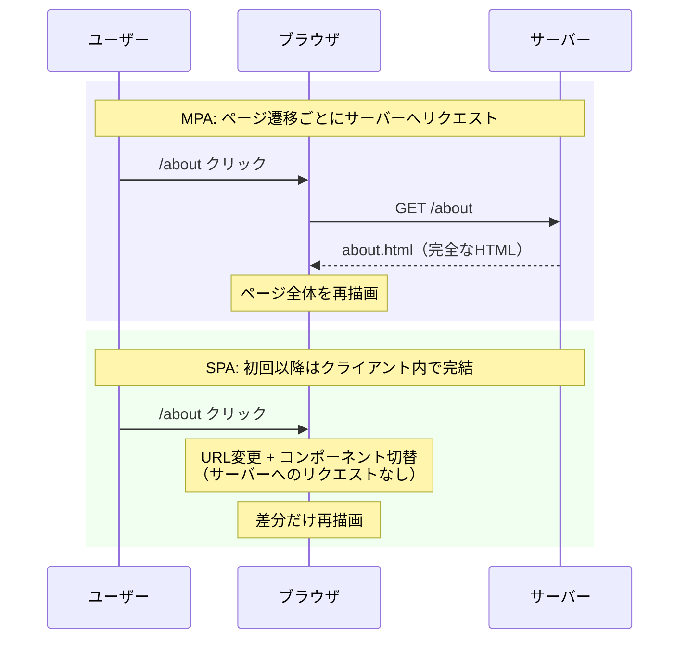

しかし、SPAがページ遷移をクライアント内で完結させるとしても、URLを変更せずにコンテンツだけを差し替えるわけにはいかない。なぜなら、URLはWebにおける根本的な概念 — **リソースの識別子** — だからである。URLが変わらなければ以下の問題が生じる。

1. **ブックマークの無効化**: ユーザーが特定のページをブックマークしても、再訪問時にはトップページが表示されてしまう
2. **ブラウザ履歴の破綻**: 戻る/進むボタンが機能しない。ユーザーは前のページに戻ろうとしてブラウザの「戻る」を押すと、SPA全体から離脱してしまう
3. **URL共有の不可**: 特定の画面状態を他者に共有できない
4. **アクセシビリティの劣化**: スクリーンリーダーがページ遷移を検知できない

したがって、SPAにはURL管理を自前で行う仕組み — **クライアントサイドルーティング** — が不可欠である。

### 1.2 クライアントサイドルーティングの基本原理

クライアントサイドルーティングの本質は、以下の3つの責務をJavaScriptで実現することにある。

1. **URLの変更**: ページ遷移時にブラウザのアドレスバーに表示されるURLを更新する（ただしサーバーへのリクエストは発生させない）
2. **URLの監視**: URLの変更を検知し、対応するUIコンポーネントを描画する
3. **URLの解釈**: URLパスやクエリパラメータをパースし、ルート定義と照合（マッチング）する

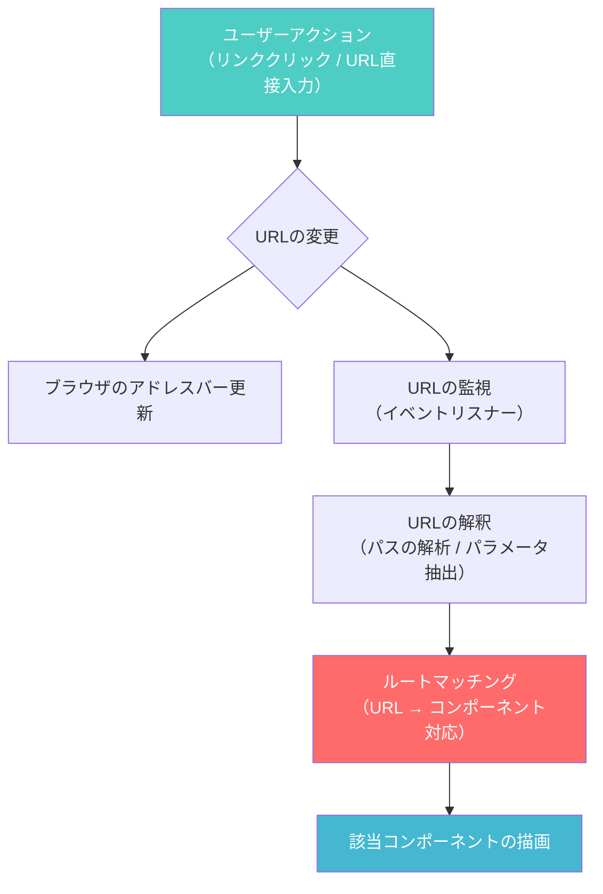

この仕組みを実現するためのブラウザAPIとして、歴史的に2つのアプローチが存在する。**Hash Routing** と **History Routing** である。それぞれの技術的基盤を詳しく見ていこう。

## 2. History API

### 2.1 History APIの概要

History API は HTML5 で導入されたブラウザAPIであり、JavaScriptからブラウザの**セッション履歴**を操作するための手段を提供する。この API の核心は、**ページの再読み込みを伴わずにURLを変更できる**点にある。

History API が導入される以前、JavaScriptからURLを変更する手段は `window.location` への代入しかなく、これは必ずサーバーへのリクエストを引き起こした。History API はこの制約を取り除き、SPAの技術的基盤を確立した。

### 2.2 主要メソッド

History API の中核をなすのは、以下の3つのメソッドである。

#### `history.pushState(state, title, url)`

新しい履歴エントリを追加し、URLを変更する。ブラウザはサーバーにリクエストを送信しない。

```javascript
// Navigate to /dashboard without server request
history.pushState(
  { page: "dashboard", scrollY: 0 }, // state object (serializable)
  "",                                  // title (ignored by most browsers)
  "/dashboard"                         // new URL
);
```

`state` オブジェクトはシリアライズ可能な任意のデータを格納でき、ユーザーが「戻る」を押した際に `popstate` イベントを通じて復元される。Firefox では `state` オブジェクトの上限は約 16 MiB であり、これを超えると例外が発生する。実務上は、スクロール位置やフィルタ条件など最小限のUIステートのみを格納するのが望ましい。

#### `history.replaceState(state, title, url)`

現在の履歴エントリを置き換える。新しいエントリは追加されないため、「戻る」で前の状態に戻ることはできない。

```javascript
// Replace current entry (e.g., after redirect or normalization)
history.replaceState(
  { page: "dashboard", tab: "overview" },
  "",
  "/dashboard?tab=overview"
);
```

リダイレクト後のURL正規化や、フォーム送信後のPOST→GET遷移のシミュレーション（PRGパターン）などで使われる。

#### `popstate` イベント

ユーザーがブラウザの「戻る」または「進む」ボタンを押した際に発火するイベントである。`pushState` / `replaceState` の呼び出し自体では発火しない点に注意が必要だ。

```javascript
// Listen for back/forward navigation
window.addEventListener("popstate", (event) => {
  // event.state contains the state object from pushState/replaceState
  if (event.state) {
    renderPage(event.state.page);
  } else {
    // Initial page load (state is null)
    renderPage(getPageFromURL(window.location.pathname));
  }
});
```

### 2.3 最小限のルーターの実装

History API を利用した最小限のルーターを実装してみる。これにより、クライアントサイドルーティングの基本原理が明確になるだろう。

```javascript
class SimpleRouter {
  constructor() {
    this.routes = new Map();
    this.currentRoute = null;

    // Handle browser back/forward
    window.addEventListener("popstate", () => {
      this._handleRouteChange();
    });
  }

  // Register a route with its handler
  addRoute(path, handler) {
    this.routes.set(path, handler);
    return this; // enable chaining
  }

  // Programmatic navigation
  navigate(path) {
    if (path === this.currentRoute) return;
    history.pushState({ path }, "", path);
    this._handleRouteChange();
  }

  // Match current URL to registered routes and invoke handler
  _handleRouteChange() {
    const path = window.location.pathname;
    this.currentRoute = path;

    // Try exact match first
    const handler = this.routes.get(path);
    if (handler) {
      handler();
      return;
    }

    // Try dynamic route matching (e.g., /users/:id)
    for (const [pattern, handler] of this.routes) {
      const params = this._matchDynamic(pattern, path);
      if (params) {
        handler(params);
        return;
      }
    }

    // 404 fallback
    const notFound = this.routes.get("*");
    if (notFound) notFound();
  }

  // Simple dynamic route matcher
  _matchDynamic(pattern, path) {
    const patternParts = pattern.split("/");
    const pathParts = path.split("/");
    if (patternParts.length !== pathParts.length) return null;

    const params = {};
    for (let i = 0; i < patternParts.length; i++) {
      if (patternParts[i].startsWith(":")) {
        params[patternParts[i].slice(1)] = pathParts[i];
      } else if (patternParts[i] !== pathParts[i]) {
        return null;
      }
    }
    return params;
  }

  // Initialize router with current URL
  start() {
    this._handleRouteChange();
  }
}

// Usage
const router = new SimpleRouter();
router
  .addRoute("/", () => renderHomePage())
  .addRoute("/about", () => renderAboutPage())
  .addRoute("/users/:id", (params) => renderUserPage(params.id))
  .addRoute("*", () => renderNotFoundPage())
  .start();
```

このミニマルな実装は、実際のルーティングライブラリの核となる考え方を示している。もちろん、本番環境で利用されるライブラリは、ネストルーティング、ミドルウェア、遅延読み込み、型安全性など遥かに多くの機能を備えているが、根底にあるメカニズムは同じである。

### 2.4 Navigation API — 次世代のルーティング基盤

2022年以降、Chromeを中心に **Navigation API** という新しいブラウザAPIの実装が進んでいる。History API の設計上の問題を解決するために提案されたこのAPIは、以下の改善を提供する。

```javascript
// Navigation API: intercept all navigations in one place
navigation.addEventListener("navigate", (event) => {
  // Only handle same-origin navigations
  if (!event.canIntercept) return;

  const url = new URL(event.destination.url);

  if (url.pathname === "/about") {
    event.intercept({
      async handler() {
        const content = await fetchAboutContent();
        renderAboutPage(content);
      },
    });
  }
});
```

Navigation API の利点は以下の通りである。

| 特徴 | History API | Navigation API |
|------|-------------|----------------|
| ナビゲーションの集約的ハンドリング | `popstate` のみ（`pushState` は検知不可） | `navigate` イベントですべてのナビゲーションを捕捉 |
| 遷移の中断 | 困難（独自実装が必要） | `event.intercept()` でネイティブサポート |
| 遷移の完了通知 | なし | `navigation.transition.finished` で待機可能 |
| スクロール復元 | 手動管理 | `scroll` オプションで制御可能 |
| 履歴エントリの列挙 | 不可 | `navigation.entries()` で全エントリ取得可能 |

ただし、2026年時点でもFirefoxやSafariでの実装は完了しておらず、ポリフィルなしでの利用はクロスブラウザ対応が求められるプロダクションコードでは時期尚早である。

## 3. Hash Routing vs History Routing

### 3.1 Hash Routing

Hash Routing は、URLの**フラグメント識別子**（`#` 以降の部分）を利用するルーティング方式である。もともとフラグメント識別子はページ内アンカーへのジャンプに使われる仕組みであり、`#` 以降の変更はブラウザがサーバーにリクエストを送信しないという仕様上の特性を巧みに利用している。

```
https://example.com/#/about
https://example.com/#/users/123
https://example.com/#/settings?theme=dark
```

Hash の変更は `hashchange` イベントで検知できる。

```javascript
// Hash routing: listen for hash changes
window.addEventListener("hashchange", (event) => {
  const newHash = window.location.hash.slice(1); // remove leading '#'
  const route = parseRoute(newHash);
  renderComponent(route);
});

// Navigate by changing hash
function navigateTo(path) {
  window.location.hash = path;
}
```

Hash Routing が採用される背景には、History API 登場以前のブラウザ互換性の問題があった。IE9 以前は History API をサポートしておらず、Hash Routing が唯一の現実的な選択肢だった。

### 3.2 History Routing

History Routing は前節で述べた History API の `pushState` / `replaceState` を利用し、通常のURLパスでルーティングを行う方式である。

```
https://example.com/about
https://example.com/users/123
https://example.com/settings?theme=dark
```

URLの見た目が従来のWebサイトと同じであるため、ユーザーにとって直感的であり、SEOの観点からも有利である。

### 3.3 比較

| 観点 | Hash Routing | History Routing |
|------|-------------|-----------------|
| URLの見た目 | `example.com/#/about` | `example.com/about` |
| サーバー設定 | 不要（`#` 以降はサーバーに送信されない） | フォールバック設定が必要 |
| SEO | 不利（クローラーがハッシュを無視する場合がある） | 有利（通常のURLとして扱える） |
| ブラウザ互換性 | 非常に高い（IE6以降） | IE10以降 |
| SSR対応 | 困難（サーバーがルート情報を受け取れない） | 可能 |
| `state` オブジェクト | なし | `pushState` で任意のデータを付与可能 |
| アナリティクス連携 | ハッシュ変更を別途トラッキングする必要がある | 通常のページビューとして自動計測される場合が多い |

### 3.4 History Routing のサーバー設定

History Routing を採用する場合、SPAのサーバー側に**フォールバック設定**が必要になる。なぜなら、ユーザーが `https://example.com/about` に直接アクセスした場合、サーバーは `/about` に対応するファイルを探そうとするからである。SPAでは `/about` という物理的なファイルは存在しないため、すべてのリクエストを `index.html` にフォールバックさせる必要がある。

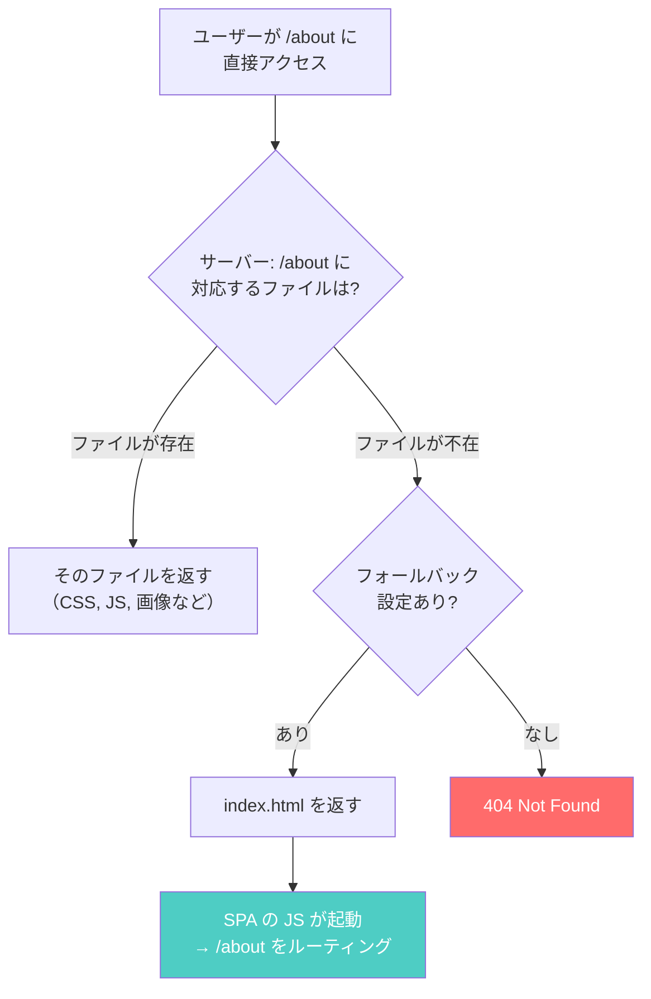

主要なWebサーバーでの設定例を以下に示す。

::: code-group

```nginx [Nginx]
server {
    listen 80;
    server_name example.com;
    root /var/www/html;

    location / {
        # Try the requested file, then directory, then fall back to index.html
        try_files $uri $uri/ /index.html;
    }
}
```

```apache [Apache (.htaccess)]
<IfModule mod_rewrite.c>
  RewriteEngine On
  RewriteBase /
  RewriteRule ^index\.html$ - [L]
  RewriteCond %{REQUEST_FILENAME} !-f
  RewriteCond %{REQUEST_FILENAME} !-d
  RewriteRule . /index.html [L]
</IfModule>
```

```javascript [Express.js]
const express = require("express");
const path = require("path");
const app = express();

// Serve static files
app.use(express.static(path.join(__dirname, "dist")));

// Fallback: all other routes serve index.html
app.get("*", (req, res) => {
  res.sendFile(path.join(__dirname, "dist", "index.html"));
});
```

:::

現代のSPA開発において、Hash Routing は原則として使われない。ほぼすべてのモダンブラウザが History API をサポートしており、SEO、SSR対応、URL の美しさといった観点から History Routing が標準的な選択肢となっている。Hash Routing が検討されるのは、静的ファイルホスティング（GitHub Pages など）でサーバー設定の変更が不可能な場合に限られる。

## 4. ルートガードと認証

### 4.1 ルートガードとは

ルートガード（Route Guard）は、特定のルートへのアクセスを条件に基づいて制御する仕組みである。典型的なユースケースは**認証ガード**（ログインしていないユーザーをログインページにリダイレクトする）だが、それに限定されない。

- **認証ガード**: ログイン済みか否か
- **認可ガード**: 特定の権限（管理者、編集者など）を持つか
- **データプリロードガード**: ページ表示に必要なデータの事前取得が完了しているか
- **入力保護ガード**: フォームに未保存の変更がある場合の離脱防止
- **フィーチャーフラグガード**: 特定の機能がユーザーに公開されているか

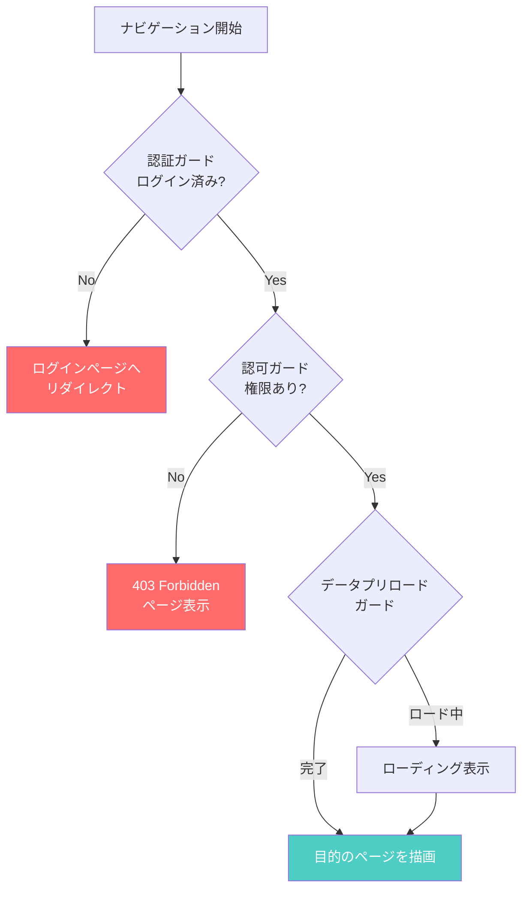

### 4.2 ルートガードの実装パターン

#### React Router でのガード実装

React Router（v6）はルートガードの専用機能を持たない。代わりに、Reactのコンポーネント合成を利用してガードを実現する。

```tsx
import { Navigate, Outlet, useLocation } from "react-router-dom";

interface AuthGuardProps {
  isAuthenticated: boolean;
}

// Guard component that wraps protected routes
function AuthGuard({ isAuthenticated }: AuthGuardProps) {
  const location = useLocation();

  if (!isAuthenticated) {
    // Redirect to login, preserving the intended destination
    return <Navigate to="/login" state={{ from: location }} replace />;
  }

  // Render child routes
  return <Outlet />;
}

// Role-based guard
function RoleGuard({ requiredRole, userRole }: {
  requiredRole: string;
  userRole: string;
}) {
  if (userRole !== requiredRole) {
    return <Navigate to="/forbidden" replace />;
  }
  return <Outlet />;
}
```

ルート定義でガードコンポーネントをネストする。

```tsx
import { createBrowserRouter } from "react-router-dom";

const router = createBrowserRouter([
  {
    path: "/",
    element: <Layout />,
    children: [
      { index: true, element: <HomePage /> },
      { path: "login", element: <LoginPage /> },
      {
        // All routes below require authentication
        element: <AuthGuard isAuthenticated={isLoggedIn} />,
        children: [
          { path: "dashboard", element: <DashboardPage /> },
          { path: "profile", element: <ProfilePage /> },
          {
            // Admin-only routes
            element: <RoleGuard requiredRole="admin" userRole={user.role} />,
            children: [
              { path: "admin", element: <AdminPage /> },
              { path: "admin/users", element: <UserManagementPage /> },
            ],
          },
        ],
      },
    ],
  },
]);
```

#### Vue Router でのガード実装

Vue Router はルートガードをフレームワークレベルで提供しており、3種類のガードが利用できる。

```javascript
import { createRouter, createWebHistory } from "vue-router";

const router = createRouter({
  history: createWebHistory(),
  routes: [
    { path: "/", component: HomePage },
    { path: "/login", component: LoginPage },
    {
      path: "/dashboard",
      component: DashboardPage,
      meta: { requiresAuth: true },
    },
    {
      path: "/admin",
      component: AdminPage,
      meta: { requiresAuth: true, requiredRole: "admin" },
    },
  ],
});

// Global before guard: runs before every navigation
router.beforeEach((to, from) => {
  const isAuthenticated = checkAuth();

  if (to.meta.requiresAuth && !isAuthenticated) {
    // Redirect to login, preserving intended destination
    return { path: "/login", query: { redirect: to.fullPath } };
  }

  if (to.meta.requiredRole) {
    const userRole = getUserRole();
    if (userRole !== to.meta.requiredRole) {
      return { path: "/forbidden" };
    }
  }
});

// Global after hook: runs after navigation is confirmed
router.afterEach((to, from) => {
  // Analytics tracking, page title update, etc.
  document.title = to.meta.title || "My App";
});
```

Vue Router のガードには3つのスコープがある。

| スコープ | フック | 適用範囲 |
|---------|--------|---------|
| グローバル | `beforeEach`, `afterEach`, `beforeResolve` | すべてのルート |
| ルート単位 | `beforeEnter` | 特定のルート定義に対して |
| コンポーネント内 | `onBeforeRouteLeave`, `onBeforeRouteUpdate` | 特定のコンポーネントに対して |

### 4.3 離脱防止ガード

フォームに未保存の変更がある場合、ユーザーの意図しないページ離脱を防ぐガードは実務上非常に重要である。この実装にはいくつかの注意点がある。

```typescript
import { useEffect, useCallback } from "react";
import { useBlocker } from "react-router-dom";

function useUnsavedChangesGuard(isDirty: boolean) {
  // Block in-app navigation via React Router
  const blocker = useBlocker(
    useCallback(() => isDirty, [isDirty])
  );

  // Block browser-level navigation (tab close, URL bar input, external link)
  useEffect(() => {
    if (!isDirty) return;

    const handleBeforeUnload = (event: BeforeUnloadEvent) => {
      event.preventDefault();
      // Modern browsers show a generic message regardless of returnValue
    };

    window.addEventListener("beforeunload", handleBeforeUnload);
    return () => {
      window.removeEventListener("beforeunload", handleBeforeUnload);
    };
  }, [isDirty]);

  return blocker;
}
```

ここで重要なのは、SPA内のナビゲーション（React Router経由）とブラウザレベルのナビゲーション（タブを閉じる、URLバーへの直接入力）の**2つの異なるレイヤー**をそれぞれ別の仕組みで保護する必要があるという点である。`useBlocker` はSPA内の遷移のみをブロックし、`beforeunload` イベントはブラウザレベルの離脱を防ぐ。

### 4.4 認証状態の管理とトークンリフレッシュ

ルートガードにおける認証チェックは、単にトークンの有無を確認するだけでは不十分である。実務では以下の考慮が必要になる。

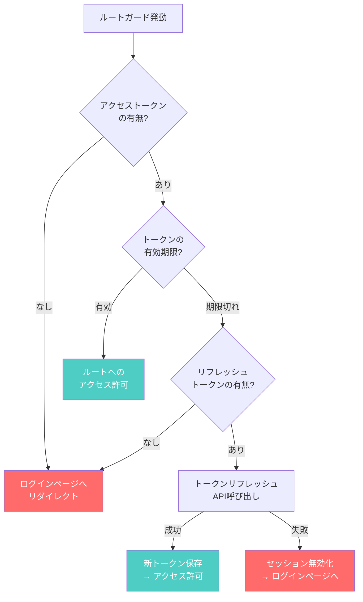

トークンの有効期限チェックとリフレッシュは、ルートガードだけでなくAPIリクエストのインターセプターでも行うのが一般的である。両者を組み合わせることで、ユーザーがページ遷移時にもAPI呼び出し時にも、シームレスにセッションを維持できる。

## 5. コード分割（React.lazy, dynamic import）

### 5.1 なぜルーティングとコード分割を組み合わせるのか

SPAが大規模化すると、JavaScriptバンドルのサイズが深刻な問題になる。すべてのページのコードを単一のバンドルに含めると、初回読み込み時にユーザーはまだアクセスしていないページのコードまでダウンロードしなければならない。

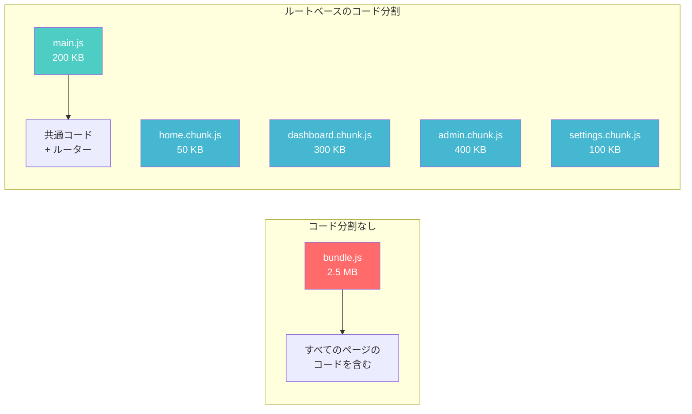

ルートベースのコード分割は、この問題に対する自然な解決策である。ユーザーが `/dashboard` にアクセスした時点で初めて `dashboard.chunk.js` をダウンロードし、`/admin` にアクセスするまで `admin.chunk.js` のダウンロードは遅延させる。これにより、**初回読み込み時間**を大幅に短縮できる。

### 5.2 Dynamic Import

コード分割の基盤技術は、ECMAScriptの **Dynamic Import**（`import()` 式）である。静的な `import` 文がモジュールグラフの解析時に解決されるのに対し、`import()` はランタイムに非同期でモジュールを読み込む。

```javascript
// Static import: included in the initial bundle
import { HomePage } from "./pages/HomePage";

// Dynamic import: loaded on demand, returns a Promise
const module = await import("./pages/DashboardPage");
const DashboardPage = module.default;
```

Webpack、Vite（Rollup）、esbuild といったバンドラーは、`import()` を検出すると自動的に**チャンク分割**を行い、動的インポートされるモジュールとその依存関係を別のファイル（チャンク）に分離する。

### 5.3 React.lazy と Suspense

Reactでは、`React.lazy` と `Suspense` を組み合わせることで、コンポーネントレベルの遅延読み込みを宣言的に記述できる。

```tsx
import React, { Suspense, lazy } from "react";
import { createBrowserRouter, RouterProvider } from "react-router-dom";

// Lazy-loaded page components
const HomePage = lazy(() => import("./pages/HomePage"));
const DashboardPage = lazy(() => import("./pages/DashboardPage"));
const AdminPage = lazy(() => import("./pages/AdminPage"));
const SettingsPage = lazy(() => import("./pages/SettingsPage"));

// Loading fallback component
function PageSkeleton() {
  return (
    <div className="page-skeleton">
      <div className="skeleton-header" />
      <div className="skeleton-content" />
    </div>
  );
}

const router = createBrowserRouter([
  {
    path: "/",
    element: <Layout />,
    children: [
      {
        index: true,
        element: (
          <Suspense fallback={<PageSkeleton />}>
            <HomePage />
          </Suspense>
        ),
      },
      {
        path: "dashboard",
        element: (
          <Suspense fallback={<PageSkeleton />}>
            <DashboardPage />
          </Suspense>
        ),
      },
      {
        path: "admin",
        element: (
          <Suspense fallback={<PageSkeleton />}>
            <AdminPage />
          </Suspense>
        ),
      },
      {
        path: "settings",
        element: (
          <Suspense fallback={<PageSkeleton />}>
            <SettingsPage />
          </Suspense>
        ),
      },
    ],
  },
]);

function App() {
  return <RouterProvider router={router} />;
}
```

`React.lazy` は `default export` を持つモジュールを返す `import()` を受け取り、コンポーネントが初めてレンダリングされる時点でモジュールの読み込みを開始する。読み込み中は最も近い `Suspense` 境界の `fallback` が表示される。

### 5.4 プリフェッチ戦略

遅延読み込みの課題は、ユーザーがリンクをクリックしてからチャンクのダウンロードが始まるため、遷移時に一瞬のローディング表示が発生することである。これを軽減するために、**プリフェッチ**（事前読み込み）が有効である。

```tsx
// Prefetch strategies

// 1. Hover-based prefetch
function PrefetchLink({ to, children }: { to: string; children: React.ReactNode }) {
  const prefetchMap: Record<string, () => Promise<unknown>> = {
    "/dashboard": () => import("./pages/DashboardPage"),
    "/admin": () => import("./pages/AdminPage"),
    "/settings": () => import("./pages/SettingsPage"),
  };

  const handleMouseEnter = () => {
    const prefetch = prefetchMap[to];
    if (prefetch) {
      // Browser caches the module; subsequent import() resolves instantly
      prefetch();
    }
  };

  return (
    <Link to={to} onMouseEnter={handleMouseEnter}>
      {children}
    </Link>
  );
}

// 2. Viewport-based prefetch using Intersection Observer
function ViewportPrefetchLink({ to, importFn, children }: {
  to: string;
  importFn: () => Promise<unknown>;
  children: React.ReactNode;
}) {
  const ref = useRef<HTMLAnchorElement>(null);

  useEffect(() => {
    const el = ref.current;
    if (!el) return;

    const observer = new IntersectionObserver(
      ([entry]) => {
        if (entry.isIntersecting) {
          importFn();
          observer.disconnect();
        }
      },
      { rootMargin: "200px" } // start prefetch 200px before visible
    );

    observer.observe(el);
    return () => observer.disconnect();
  }, [importFn]);

  return (
    <Link to={to} ref={ref}>
      {children}
    </Link>
  );
}
```

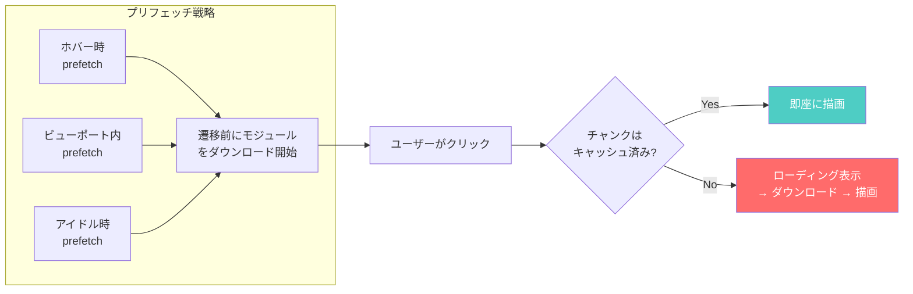

プリフェッチの粒度はアプリケーションの特性に応じて調整する。すべてのルートを積極的にプリフェッチすると帯域幅を浪費するため、ユーザーが高確率でアクセスするルート（たとえばダッシュボードからの遷移先として多い画面）を優先するのが現実的だ。

### 5.5 Vite / Webpack でのコード分割

モダンなバンドラーは `import()` を検出すると自動的にチャンク分割を行うが、設定によって分割の粒度を制御できる。

```javascript
// vite.config.js
import { defineConfig } from "vite";

export default defineConfig({
  build: {
    rollupOptions: {
      output: {
        // Manual chunk splitting for shared vendor code
        manualChunks: {
          // Group React-related packages into a single chunk
          "react-vendor": ["react", "react-dom", "react-router-dom"],
          // Group charting libraries
          "chart-vendor": ["chart.js", "recharts"],
        },
      },
    },
  },
});
```

チャンク分割の設計においては、以下のトレードオフを考慮する必要がある。

- **チャンクが少なすぎる**: バンドルサイズが大きくなり、初回読み込みが遅い
- **チャンクが多すぎる**: HTTPリクエスト数が増加し、HTTP/1.1環境ではオーバーヘッドが生じる（HTTP/2以降ではこの問題は軽減される）
- **共有モジュールの重複**: 複数のチャンクが同じライブラリに依存する場合、共有チャンクとして分離しないと同じコードが複数回ダウンロードされる

## 6. ネストルーティング

### 6.1 ネストルーティングの概念

実際のアプリケーションでは、画面のレイアウトは階層的に構成される。たとえば、すべてのページに共通のヘッダーとサイドバーがあり、サイドバーの中でさらにサブナビゲーションが切り替わるような構造は珍しくない。

ネストルーティングは、URLの階層構造とUIの階層構造を対応づける仕組みである。

```
/settings                → SettingsLayout > SettingsOverview
/settings/profile        → SettingsLayout > ProfilePage
/settings/notifications  → SettingsLayout > NotificationsPage
/settings/security       → SettingsLayout > SecurityPage
```

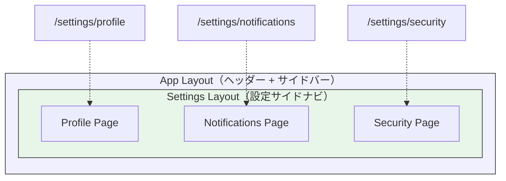

### 6.2 React Router v6 でのネストルーティング

React Router v6 は `Outlet` コンポーネントを使ってネストルーティングを実現する。`Outlet` は、親ルートのコンポーネント内に配置され、一致する子ルートのコンポーネントを描画する「プレースホルダー」として機能する。

```tsx
import { Outlet, NavLink } from "react-router-dom";

// Parent layout component
function SettingsLayout() {
  return (
    <div className="settings">
      <nav className="settings-sidebar">
        <NavLink to="/settings/profile">プロフィール</NavLink>
        <NavLink to="/settings/notifications">通知</NavLink>
        <NavLink to="/settings/security">セキュリティ</NavLink>
      </nav>
      <main className="settings-content">
        {/* Child route component renders here */}
        <Outlet />
      </main>
    </div>
  );
}

// Route configuration
const router = createBrowserRouter([
  {
    path: "/",
    element: <AppLayout />,
    children: [
      { index: true, element: <HomePage /> },
      {
        path: "settings",
        element: <SettingsLayout />,
        children: [
          { index: true, element: <SettingsOverview /> },
          { path: "profile", element: <ProfilePage /> },
          { path: "notifications", element: <NotificationsPage /> },
          { path: "security", element: <SecurityPage /> },
        ],
      },
    ],
  },
]);
```

### 6.3 Pathless Layout Routes

URLに影響を与えずにレイアウトだけをネストしたい場合がある。たとえば、認証ガードを適用するルートグループを定義したいが、URLパスに `/auth` のようなプレフィックスは不要な場合だ。

```tsx
const router = createBrowserRouter([
  {
    path: "/",
    element: <AppLayout />,
    children: [
      // Public routes
      { path: "login", element: <LoginPage /> },
      { path: "register", element: <RegisterPage /> },

      // Protected routes (no path prefix, just a guard wrapper)
      {
        // No 'path' property — this is a pathless layout route
        element: <AuthGuard />,
        children: [
          { path: "dashboard", element: <DashboardPage /> },
          { path: "profile", element: <ProfilePage /> },
          {
            path: "settings",
            element: <SettingsLayout />,
            children: [
              { index: true, element: <SettingsOverview /> },
              { path: "profile", element: <SettingsProfilePage /> },
            ],
          },
        ],
      },
    ],
  },
]);
```

Pathless Layout Route は `path` プロパティを省略することで定義される。URL のマッチングには影響せず、純粋に UI のネスト構造やガードの適用範囲を制御する目的で使われる。

## 7. データローダー

### 7.1 従来のデータフェッチの問題

従来のSPAでは、コンポーネントがマウントされた後に `useEffect` でデータを取得するパターンが一般的だった。

```tsx
// Traditional approach: fetch data after component mounts
function UserProfilePage() {
  const { userId } = useParams();
  const [user, setUser] = useState(null);
  const [posts, setPosts] = useState([]);
  const [loading, setLoading] = useState(true);

  useEffect(() => {
    async function fetchData() {
      setLoading(true);
      const [userData, postsData] = await Promise.all([
        fetchUser(userId),
        fetchUserPosts(userId),
      ]);
      setUser(userData);
      setPosts(postsData);
      setLoading(false);
    }
    fetchData();
  }, [userId]);

  if (loading) return <Spinner />;
  return <UserProfile user={user} posts={posts} />;
}
```

このパターンには**ウォーターフォール問題**が潜んでいる。ネストされたコンポーネントがそれぞれ独自のデータフェッチを行う場合、親コンポーネントのデータ取得が完了しレンダリングが行われてから、初めて子コンポーネントがマウントされデータ取得を開始する。

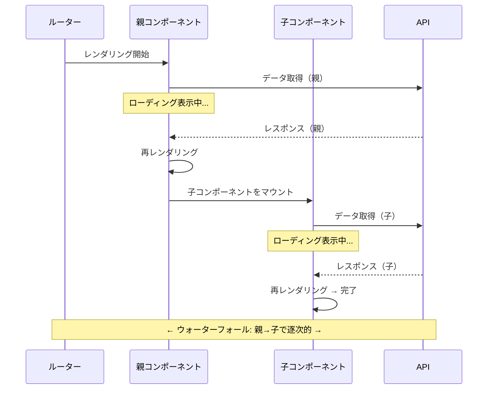

### 7.2 ルートレベルのデータローダー

この問題を解決するために、React Router v6.4 は**データローダー（loader）**の概念を導入した。ローダーはルート遷移時にルーターが自動的に呼び出し、コンポーネントのレンダリング前にデータを準備する。

```tsx
import {
  createBrowserRouter,
  useLoaderData,
  defer,
  Await,
} from "react-router-dom";

// Loader function: runs before the component renders
async function userProfileLoader({ params }: LoaderFunctionArgs) {
  const userId = params.userId;

  // Parallel data fetching
  const [user, posts] = await Promise.all([
    fetchUser(userId),
    fetchUserPosts(userId),
  ]);

  return { user, posts };
}

// Component: data is already available via useLoaderData
function UserProfilePage() {
  const { user, posts } = useLoaderData() as {
    user: User;
    posts: Post[];
  };

  // No loading state needed — data is guaranteed to be available
  return <UserProfile user={user} posts={posts} />;
}

// Route configuration with loader
const router = createBrowserRouter([
  {
    path: "/users/:userId",
    element: <UserProfilePage />,
    loader: userProfileLoader,
    errorElement: <ErrorPage />,
  },
]);
```

ローダーの重要な特性は、**ネストされたルートのローダーが並列に実行される**点にある。

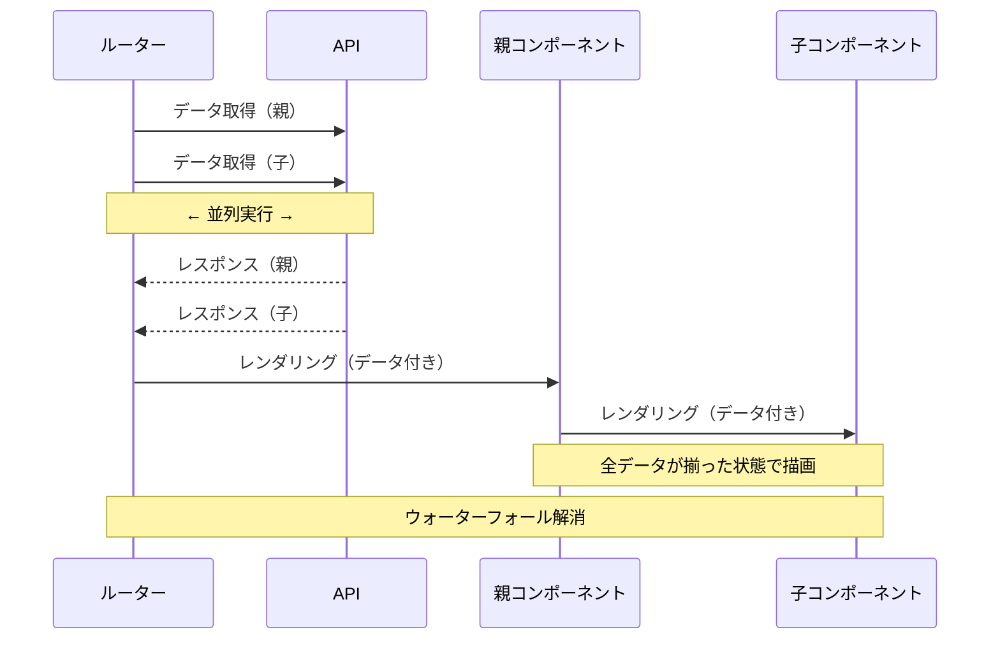

### 7.3 defer によるストリーミングレンダリング

すべてのデータが揃うまでページ全体の表示を待つのではなく、重要なデータを先に表示し、補助的なデータを後から流し込む **defer** パターンも利用できる。

```tsx
import { defer, Await, useLoaderData } from "react-router-dom";
import { Suspense } from "react";

// Loader with deferred data
async function dashboardLoader() {
  // Critical data: await immediately
  const user = await fetchCurrentUser();

  // Non-critical data: defer loading
  const recentActivity = fetchRecentActivity(); // no await
  const recommendations = fetchRecommendations(); // no await

  return defer({
    user,                  // resolved — available immediately
    recentActivity,        // Promise — will stream in later
    recommendations,       // Promise — will stream in later
  });
}

function DashboardPage() {
  const { user, recentActivity, recommendations } = useLoaderData() as {
    user: User;
    recentActivity: Promise<Activity[]>;
    recommendations: Promise<Recommendation[]>;
  };

  return (
    <div>
      {/* Rendered immediately with resolved data */}
      <UserGreeting user={user} />

      {/* Streams in when data arrives */}
      <Suspense fallback={<ActivitySkeleton />}>
        <Await resolve={recentActivity}>
          {(activities) => <ActivityFeed activities={activities} />}
        </Await>
      </Suspense>

      <Suspense fallback={<RecommendationSkeleton />}>
        <Await resolve={recommendations}>
          {(recs) => <RecommendationList recommendations={recs} />}
        </Await>
      </Suspense>
    </div>
  );
}
```

この `defer` パターンは、ユーザーの体感速度を大幅に改善する。ユーザーはまず自分の名前とダッシュボードの基本構造を目にし、アクティビティフィードやレコメンデーションはスケルトンUIから実データに徐々に切り替わっていく。

### 7.4 TanStack Router のタイプセーフなローダー

TanStack Router は、ルート定義からローダーまでを **TypeScript の型推論で一貫して型安全に**扱える設計が特徴である。

```typescript
import { createFileRoute } from "@tanstack/react-router";

// Route with type-safe loader, search params, and path params
export const Route = createFileRoute("/users/$userId")({
  // Validate and parse search params
  validateSearch: (search: Record<string, unknown>) => ({
    tab: (search.tab as string) || "profile",
    page: Number(search.page) || 1,
  }),

  // Type-safe loader: params and search are fully typed
  loader: async ({ params, context }) => {
    // params.userId is typed as string
    const user = await context.apiClient.getUser(params.userId);
    return { user };
  },

  component: UserPage,
});

function UserPage() {
  // Fully typed: { user: User }
  const { user } = Route.useLoaderData();
  // Fully typed: { tab: string; page: number }
  const { tab, page } = Route.useSearch();

  return <UserProfile user={user} tab={tab} page={page} />;
}
```

## 8. ルーティングライブラリ比較

### 8.1 主要ライブラリの概要

SPAルーティングの実装は、フレームワークの選択と密接に結びついている。以下に主要なルーティングライブラリの特徴を比較する。

| ライブラリ | フレームワーク | 最新バージョン | 特徴 |
|-----------|--------------|--------------|------|
| React Router | React | v7 | Reactの事実上の標準。v6.4でローダー/アクション導入 |
| TanStack Router | React | v1 | フルTypeScript型安全。ファイルベースルーティング対応 |
| Vue Router | Vue | v4 | Vue公式。ナビゲーションガード組み込み |
| SvelteKit Router | Svelte | SvelteKit内蔵 | ファイルベースルーティング。SSR統合 |
| Next.js App Router | React | v15 | ファイルベース。Server Components統合 |

### 8.2 ルート定義のアプローチ

ルーティングライブラリのルート定義は、大きく**設定ベース**と**ファイルベース**に分かれる。

#### 設定ベース（Configuration-based）

ルートの定義をJavaScript/TypeScriptのコードとして記述する。

```tsx
// React Router: configuration-based
const router = createBrowserRouter([
  {
    path: "/",
    element: <RootLayout />,
    children: [
      { index: true, element: <HomePage /> },
      { path: "about", element: <AboutPage /> },
      {
        path: "blog",
        element: <BlogLayout />,
        children: [
          { index: true, element: <BlogListPage /> },
          { path: ":postId", element: <BlogPostPage /> },
        ],
      },
    ],
  },
]);
```

設定ベースの利点は、ルーティングの全体像を一箇所で把握できること、および動的なルート生成が容易なことである。一方、ルート数が増えると設定ファイルが肥大化し、ルートとコンポーネントファイルの対応を追うのが煩雑になる。

#### ファイルベース（File-based）

ファイルシステムのディレクトリ構造がそのままルート構造になる。

```
src/routes/
├── +layout.svelte          → /（ルートレイアウト）
├── +page.svelte            → /
├── about/
│   └── +page.svelte        → /about
├── blog/
│   ├── +layout.svelte      → /blog（ブログレイアウト）
│   ├── +page.svelte        → /blog
│   └── [postId]/
│       └── +page.svelte    → /blog/:postId
└── settings/
    ├── +layout.svelte      → /settings（設定レイアウト）
    ├── +page.svelte        → /settings
    └── profile/
        └── +page.svelte    → /settings/profile
```

ファイルベースの利点は、規約によってファイル配置が統一されるためチーム開発で一貫性が保たれやすいこと、および新しいルートの追加がファイルを作成するだけで完了することである。一方、ファイル命名規約の学習コスト、特殊なルーティングパターンの表現がやや制約的になるという側面もある。

### 8.3 型安全性の比較

型安全なルーティングは、パスパラメータやクエリパラメータの型を静的に保証することで、URLの構築ミスやパラメータの取り違えをコンパイル時に検出する。

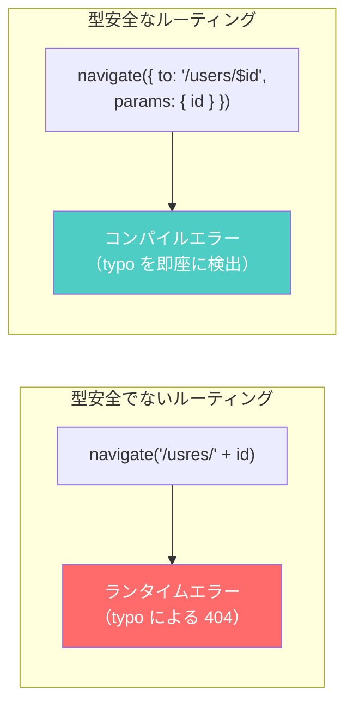

TanStack Router は型安全性においてもっとも先進的なアプローチを採る。ルート定義から自動的にリンクコンポーネントの `to` プロパティの型が推論され、存在しないルートへのリンクはコンパイルエラーになる。

React Router v7 も型生成機能を導入し、`typegen` コマンドでルート定義から型ファイルを自動生成する仕組みを提供している。ただし、TanStack Router ほどの推論ベースの型安全性にはまだ至っていない。

### 8.4 パフォーマンス特性

ルーティングライブラリのパフォーマンスに影響する要因は複数ある。

| 観点 | 考慮事項 |
|------|---------|
| ルートマッチングの速度 | ルート数が多い場合、線形探索 vs ツリーベースのマッチングで差が出る |
| バンドルサイズ | ライブラリ自体のサイズ。React Router v6は約13KB（gzip）、TanStack Routerは約12KB（gzip） |
| 再レンダリングの制御 | ルート変更時に不要なコンポーネントが再レンダリングされないか |
| コード分割の統合 | 遅延読み込みの組み込みサポートの有無と使いやすさ |
| データプリフェッチ | ルート遷移前にデータやチャンクを先読みする仕組み |

実務上、ルーティングライブラリ自体の性能差がアプリケーション全体のパフォーマンスに決定的な影響を与えることは稀である。むしろ重要なのは、コード分割やデータローダーとの統合がいかにスムーズかという点であり、この観点ではReact Router v6.4+とTanStack Routerが優れた統合を提供している。

## 9. SEO考慮事項

### 9.1 SPAとSEOの本質的な課題

SPAのルーティングは、SEO（Search Engine Optimization）との間に本質的な緊張関係を持つ。従来のMPAでは、各URLに対してサーバーが完全なHTMLを返すため、検索エンジンのクローラーは容易にコンテンツをインデックスできた。一方、SPAでは初回リクエストに対してほぼ空のHTMLが返り、コンテンツはJavaScriptの実行後に初めて描画される。

```html
<!-- Typical SPA initial HTML -->
<!DOCTYPE html>
<html>
<head>
  <title>My App</title>
</head>
<body>
  <div id="root"></div>
  <!-- Content is generated by JavaScript -->
  <script src="/assets/main.js"></script>
</body>
</html>
```

Googlebot は JavaScript を実行してページをレンダリングする能力を持つが、以下の制約がある。

1. **レンダリングの遅延**: JavaScript の実行を伴うレンダリングは、通常のHTML解析よりもリソースを消費するため、クロールの優先度が下がる可能性がある
2. **タイムアウト**: JavaScriptの実行に時間がかかると、レンダリングが打ち切られる場合がある
3. **動的コンテンツの欠落**: ユーザー操作（スクロール、クリックなど）をトリガーとして読み込まれるコンテンツはインデックスされない
4. **他の検索エンジン**: Bing、百度などのクローラーのJavaScript実行能力はGooglebotに劣る場合がある

### 9.2 SPAにおけるSEO対策

#### メタタグの動的更新

SPAでは、ページ遷移時にドキュメントの `<title>` や `<meta>` タグを動的に更新する必要がある。

```typescript
// Update document metadata on route change
function updateMeta(route: RouteConfig) {
  document.title = route.meta?.title || "Default Title";

  // Update or create meta description
  let metaDesc = document.querySelector('meta[name="description"]');
  if (!metaDesc) {
    metaDesc = document.createElement("meta");
    metaDesc.setAttribute("name", "description");
    document.head.appendChild(metaDesc);
  }
  metaDesc.setAttribute("content", route.meta?.description || "");

  // Update Open Graph tags
  updateOgTag("og:title", route.meta?.title || "");
  updateOgTag("og:description", route.meta?.description || "");
  updateOgTag("og:url", window.location.href);
}

function updateOgTag(property: string, content: string) {
  let tag = document.querySelector(`meta[property="${property}"]`);
  if (!tag) {
    tag = document.createElement("meta");
    tag.setAttribute("property", property);
    document.head.appendChild(tag);
  }
  tag.setAttribute("content", content);
}
```

Reactエコシステムでは `react-helmet-async` などのライブラリが広く使われている。

#### SSR / SSG との組み合わせ

SEOが重要なページ（ランディングページ、ブログ記事、商品ページなど）では、SPAのクライアントサイドルーティングだけに頼るのではなく、**SSR（Server-Side Rendering）**または **SSG（Static Site Generation）**と組み合わせるのが現代のベストプラクティスである。

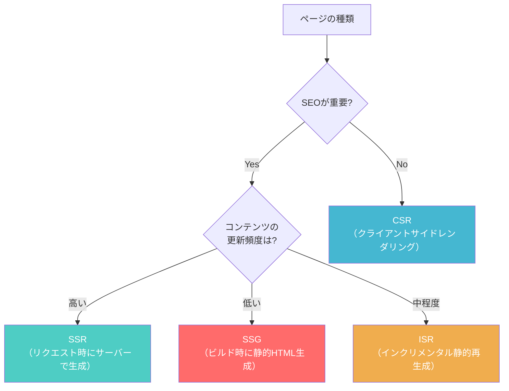

Next.js の App Router では、ルートごとにレンダリング戦略を選択できる。

```tsx
// app/blog/[slug]/page.tsx — SSG with dynamic params
export async function generateStaticParams() {
  const posts = await getAllPosts();
  return posts.map((post) => ({ slug: post.slug }));
}

// This page is pre-rendered at build time
export default async function BlogPost({
  params,
}: {
  params: { slug: string };
}) {
  const post = await getPost(params.slug);

  return (
    <article>
      <h1>{post.title}</h1>
      <div dangerouslySetInnerHTML={{ __html: post.content }} />
    </article>
  );
}

// Metadata for SEO
export async function generateMetadata({
  params,
}: {
  params: { slug: string };
}) {
  const post = await getPost(params.slug);
  return {
    title: post.title,
    description: post.excerpt,
    openGraph: {
      title: post.title,
      description: post.excerpt,
      type: "article",
      publishedTime: post.publishedAt,
    },
  };
}
```

### 9.3 構造化データとサイトマップ

SPA においても、検索エンジンにサイト構造を正しく伝えるために**サイトマップ**の提供は重要である。

```xml
<?xml version="1.0" encoding="UTF-8"?>
<urlset xmlns="http://www.sitemaps.org/schemas/sitemap/0.9">
  <url>
    <loc>https://example.com/</loc>
    <lastmod>2026-03-01</lastmod>
    <changefreq>daily</changefreq>
    <priority>1.0</priority>
  </url>
  <url>
    <loc>https://example.com/about</loc>
    <lastmod>2026-02-15</lastmod>
    <changefreq>monthly</changefreq>
    <priority>0.8</priority>
  </url>
  <url>
    <loc>https://example.com/blog</loc>
    <lastmod>2026-03-01</lastmod>
    <changefreq>daily</changefreq>
    <priority>0.9</priority>
  </url>
</urlset>
```

また、JSON-LD 形式の構造化データを埋め込むことで、検索結果にリッチスニペットを表示させることもできる。

```tsx
function BlogPost({ post }: { post: BlogPostData }) {
  const structuredData = {
    "@context": "https://schema.org",
    "@type": "BlogPosting",
    headline: post.title,
    datePublished: post.publishedAt,
    dateModified: post.updatedAt,
    author: {
      "@type": "Person",
      name: post.author.name,
    },
    description: post.excerpt,
  };

  return (
    <>
      <script
        type="application/ld+json"
        dangerouslySetInnerHTML={{ __html: JSON.stringify(structuredData) }}
      />
      <article>{/* ... */}</article>
    </>
  );
}
```

### 9.4 クローラーへの配慮

SPAルーティングにおけるSEO対策のチェックリストを以下にまとめる。

- **各ルートに一意のURLを割り当てる**: 同じURLで内容が変わるページは避ける
- **`canonical` タグを設定する**: ルートパラメータやクエリパラメータの組み合わせで重複URLが生じる場合に重複を回避する
- **`<title>` と `<meta description>` をルートごとに更新する**: コンテンツに即したメタデータを設定する
- **適切なHTTPステータスコードを返す**: SSR環境では、存在しないルートに対して正しく404を返す
- **`robots.txt` と `sitemap.xml` を用意する**: クローラーの巡回を適切に誘導する
- **JavaScript実行なしでもクリティカルなコンテンツが見えるようにする**: SSR/SSGの採用を検討する

## 10. 設計上の考慮事項とまとめ

### 10.1 ルーティング設計のベストプラクティス

SPAルーティングの設計において考慮すべきポイントを総括する。

**URLの設計**

URLはアプリケーションの「公開API」である。一度公開したURLは変更しにくいため、以下の原則に従うべきである。

- **リソース指向**: URLはリソース（名詞）を表し、操作（動詞）は含めない（`/users/123` は良いが `/getUser/123` は避ける）
- **階層構造の反映**: URLのパス構造はリソースの論理的な階層を反映する（`/teams/42/members/7`）
- **一貫性**: 命名規約（kebab-case など）を統一する
- **永続性**: URLは可能な限り永続的であるべきで、変更時には301リダイレクトを設定する

**状態の配置**

URLに含めるべき状態と、含めるべきでない状態を区別することは重要である。

| URLに含めるべき | URLに含めるべきでない |
|---------------|-------------------|
| 現在のページ・リソース | UI の一時的な状態（モーダルの開閉） |
| フィルタ・ソート条件 | フォームの入力途中の値 |
| ページネーション | エラーメッセージ |
| 検索クエリ | ローディング状態 |
| 表示タブ（文脈による） | トーストの表示有無 |

URLに状態を含めることで、ブックマーク・共有・ブラウザ履歴が正しく機能する。逆に、URLに不要な状態を含めると、URLが冗長になり、履歴エントリが不必要に増加する。

**エラーハンドリング**

ルーティングにおけるエラーには、主に以下の種類がある。

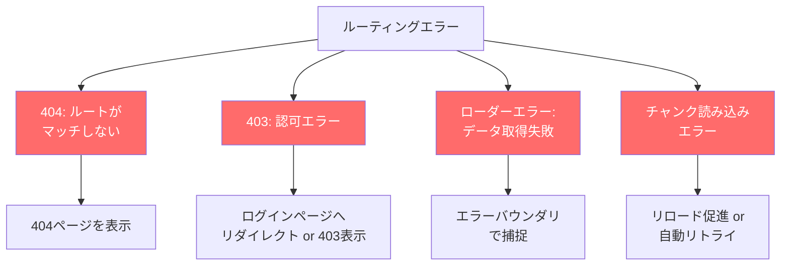

特にコード分割との組み合わせでは、デプロイ後に古いチャンクが削除されたためにチャンク読み込みエラーが発生するケースがある。この場合、`ChunkLoadError` を検知してページのリロードを促すか、自動リロードを行う対策が必要である。

```typescript
// Handle chunk load errors (e.g., after a new deployment)
router.subscribe((state) => {
  if (state.errors) {
    for (const error of Object.values(state.errors)) {
      if (error instanceof Error && error.name === "ChunkLoadError") {
        // Reload the page to get the latest chunks
        window.location.reload();
        return;
      }
    }
  }
});
```

### 10.2 SPAルーティングの進化の方向性

SPAルーティングは、ここ数年で単なるURL-コンポーネントのマッピングから、**データフェッチ**、**レンダリング戦略**、**型安全性**を統合的に扱うフルスタックなルーティングへと進化してきた。

この進化を端的に示しているのが、React Router が Remix と統合して React Router v7 となり、Next.js の App Router が Server Components と Data Fetching を統合した流れである。ルーターはもはや「URLを解析してコンポーネントを描画する」だけの存在ではなく、アプリケーションのデータフローとレンダリングパイプラインの中核を担う存在になりつつある。

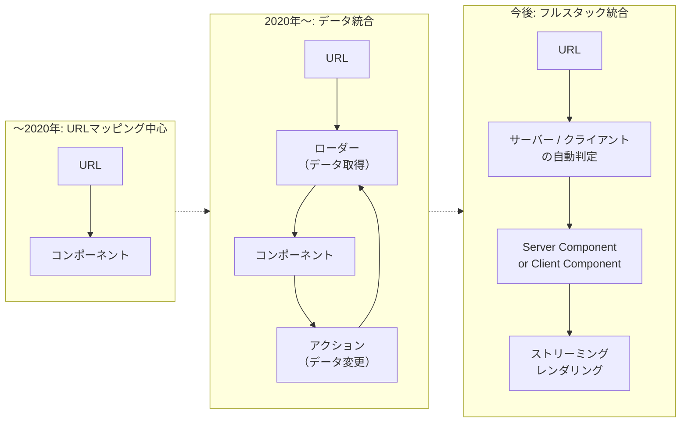

今後のSPAルーティングでは、以下のトレンドが加速すると考えられる。

1. **サーバーとクライアントの境界の曖昧化**: Server Components の普及により、ルートレベルでサーバー処理とクライアント処理を自然に使い分けるスタイルが定着する
2. **型安全性のさらなる強化**: TanStack Router が示した「ルート定義から末端のパラメータ参照まですべてが型安全」というアプローチが他のライブラリにも波及する
3. **Navigation API の標準化**: ブラウザネイティブのルーティングAPIが成熟し、ライブラリの内部実装が簡素化される
4. **View Transitions API との統合**: ルート遷移時にネイティブなアニメーションを宣言的に適用する仕組みが一般化する

SPAルーティングは、Webアプリケーションの「背骨」である。URLの設計、認証・認可の制御、パフォーマンス最適化、SEO対策 — これらすべてがルーティングを起点として展開される。だからこそ、プロジェクトの初期段階でルーティングのアーキテクチャを慎重に設計し、適切なライブラリとパターンを選択することが、長期的なプロダクトの健全性を左右するのである。
