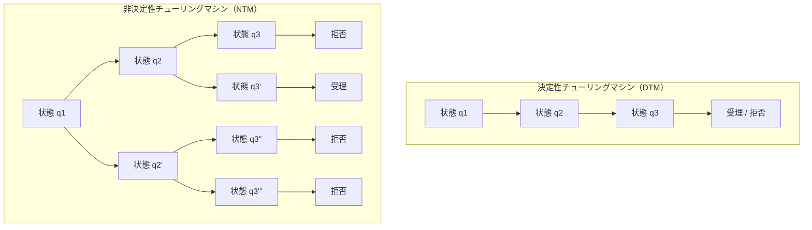
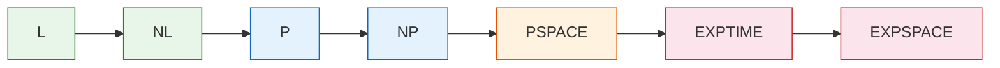
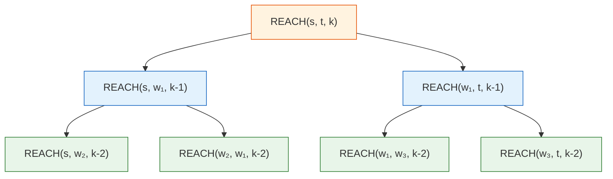
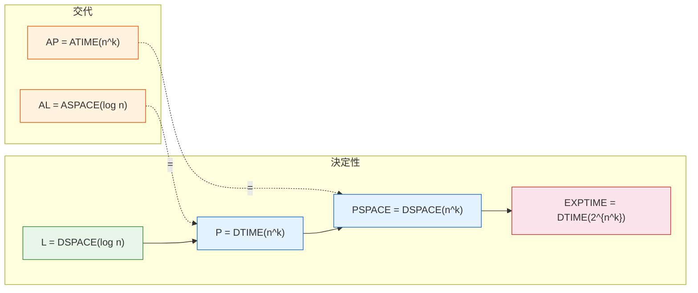

# 空間計算量と複雑性クラス

## 1. 計算量理論の概観：計算の「コスト」を測る

計算量理論（Computational Complexity Theory）は、計算問題を解くために必要な**資源の量**を研究する分野である。ここでいう「資源」とは、主に**時間**（計算ステップ数）と**空間**（メモリ使用量）の2つを指す。

計算量理論の根本的な問いは次のように要約できる。

> **ある問題を解くために、どれだけの資源が本質的に必要なのか？**

この問いは、単に「アルゴリズム A は速いか遅いか」というレベルの話ではない。ある問題に対して、**いかなるアルゴリズムを用いても**、資源の使用量をある閾値以下にはできないという**下界（lower bound）**を示すことが、計算量理論の究極の目標の一つである。

### 1.1 計算量理論の歴史的背景

計算量理論は1960年代に本格的に発展し始めた。Alan Turing が1936年にチューリングマシンを定義し「計算可能性」の概念を確立した後、次に自然に浮かぶ問いは「計算可能だとして、どれくらいの資源で計算できるのか？」であった。

1965年、Juris Hartmanis と Richard Stearns は論文 *"On the Computational Complexity of Algorithms"* において、計算の複雑さを時間と空間で分類する枠組みを提唱し、「computational complexity」という用語を確立した。同年、彼らは**時間階層定理（Time Hierarchy Theorem）**と**空間階層定理（Space Hierarchy Theorem）**を証明し、より多くの資源を与えれば厳密により多くの問題が解けることを示した。

1971年、Stephen Cook は論文 *"The Complexity of Theorem-Proving Procedures"* において**NP完全性**の概念を導入し、充足可能性問題（SAT）が NP 完全であることを証明した。翌年、Richard Karp は21の古典的組合せ最適化問題が NP 完全であることを示した。これらの業績は、計算量理論を現代的な形に押し上げた画期的な出来事であった。

### 1.2 計算モデル

計算量を論じるには、まず計算の**形式的モデル**を固定しなければならない。最も標準的に用いられるのは**チューリングマシン（Turing Machine, TM）**である。

チューリングマシンは以下の要素から構成される。

- **有限状態制御**：有限個の状態を持つ制御装置
- **入力テープ**：入力が書かれた読み取り専用テープ
- **作業テープ（work tape）**：読み書き可能なテープ（複数本でもよい）
- **遷移関数**：現在の状態とテープ上のシンボルに基づき、次の状態、書き込むシンボル、ヘッドの移動方向を決定する関数

```
           ┌─────────────────────────────┐
入力テープ  │ a │ b │ b │ a │ c │ □ │ □ │ ...
           └───────────┬─────────────────┘
                       │ (読み取り専用)
                ┌──────┴──────┐
                │  有限状態制御  │
                │   (状態 q)   │
                └──────┬──────┘
                       │ (読み書き可能)
           ┌───────────┴─────────────────┐
作業テープ  │ x │ y │ □ │ □ │ □ │ □ │ □ │ ...
           └─────────────────────────────┘
```

空間計算量を論じる際に重要なのは、**入力テープと作業テープを区別する**ことである。入力はすでに与えられているものであり、入力の読み取りに使われる空間は「消費する資源」には数えない。計測対象となるのは、作業テープ上で使用されるセルの数である。この区別が特に重要になるのは、対数空間（$O(\log n)$）のような、入力長よりも少ない空間で計算を行うクラスを定義するときである。

### 1.3 決定性と非決定性

チューリングマシンには2つの重要なバリエーションがある。

**決定性チューリングマシン（Deterministic Turing Machine, DTM）**：各ステップにおいて、次に取るべき行動が一意に定まる。現在の状態とヘッドが読んでいるシンボルから、次の状態・書き込むシンボル・ヘッドの移動方向が一つだけ決定される。

**非決定性チューリングマシン（Nondeterministic Turing Machine, NTM）**：各ステップにおいて、複数の行動が選択可能である。直感的には、NTM は各分岐点で「正しい選択肢」を魔法のように推測できるマシンとみなせる。入力が受理可能であれば、NTM は受理に至る計算パスを少なくとも1つ持つ。



非決定性チューリングマシンは物理的に実現可能な計算装置ではない。しかし、計算量理論においては、問題の**構造**を分析するための極めて強力な道具として機能する。非決定性は「推測と検証」のパラダイムを自然に捉え、多くの複雑性クラスの定義に本質的な役割を果たす。

## 2. 時間計算量の復習：P と NP

空間計算量に進む前に、時間計算量の主要なクラスを簡潔に復習しておく。これらは空間計算量との関係を理解するための基礎となる。

### 2.1 時間計算量の定義

決定性チューリングマシン $M$ が入力 $x$ に対して停止するまでに実行するステップ数を $T_M(x)$ とする。$M$ の**最悪時間計算量（worst-case time complexity）**は次のように定義される。

$$T_M(n) = \max_{|x| = n} T_M(x)$$

ここで $|x|$ は入力 $x$ の長さ（ビット数またはシンボル数）であり、長さ $n$ のすべての入力の中で最も多くのステップ数を要するものを最悪ケースとして取る。

### 2.2 クラス P

**P（Polynomial Time）**は、決定性チューリングマシンで多項式時間以内に解ける決定問題のクラスである。

$$\text{P} = \bigcup_{k \geq 0} \text{DTIME}(n^k)$$

ここで $\text{DTIME}(f(n))$ は、$O(f(n))$ ステップ以内で停止する決定性チューリングマシンが存在するような決定問題の集合である。

P に属する問題は「効率的に解ける」とみなされる。ソーティング、最短経路問題、線形計画法、素数判定（AKS アルゴリズムによる）などが P に属する。

### 2.3 クラス NP

**NP（Nondeterministic Polynomial Time）**は、非決定性チューリングマシンで多項式時間以内に解ける決定問題のクラスである。

$$\text{NP} = \bigcup_{k \geq 0} \text{NTIME}(n^k)$$

NP の同値な定義として、「多項式時間で検証可能な問題」がある。すなわち、問題の答えが「はい」であることの**証拠（certificate / witness）**が与えられたとき、その証拠の正しさを多項式時間で検証できる問題が NP に属する。

例えば、**充足可能性問題（SAT）**を考える。「このブール式を真にする変数の割り当ては存在するか？」という問題に対して、具体的な割り当てが証拠として与えられれば、その割り当てが式を真にするかどうかは多項式時間で確認できる。したがって SAT は NP に属する。

### 2.4 P $\neq$ NP 問題

$\text{P} \subseteq \text{NP}$ は自明に成り立つ（決定性は非決定性の特殊ケースであるため）。しかし、$\text{P} = \text{NP}$ かどうかは未解決であり、これは計算機科学のみならず数学全体における最大の未解決問題の一つである。Clay Mathematics Institute が100万ドルの賞金を懸けているミレニアム懸賞問題の一つでもある。

$\text{P} \neq \text{NP}$ が成り立つ（と広く信じられている）ならば、NP完全問題を効率的に解くアルゴリズムは存在しないことになる。この場合、暗号、最適化、スケジューリングなど多くの分野に深い影響を及ぼす。

## 3. 空間計算量の定義：DSPACE と NSPACE

ここからが本記事の核心である。空間計算量とは、計算を遂行するために必要な**メモリの量**を定量化する概念である。

### 3.1 空間計算量の形式的定義

チューリングマシン $M$ が入力 $x$ に対して使用する作業テープのセル数を $S_M(x)$ とする。$M$ の**最悪空間計算量（worst-case space complexity）**は次のように定義される。

$$S_M(n) = \max_{|x| = n} S_M(x)$$

ここで重要なのは、前述のとおり、入力テープ上の空間は計測しないことである。計測対象はあくまで作業テープ（work tape）上で使用されるセルの数だけである。

### 3.2 DSPACE と NSPACE

空間に基づく複雑性クラスは、以下のように定義される。

**DSPACE**（Deterministic Space）：

$$\text{DSPACE}(f(n)) = \{L \mid L \text{ は } O(f(n)) \text{ 空間の決定性 TM で決定可能}\}$$

**NSPACE**（Nondeterministic Space）：

$$\text{NSPACE}(f(n)) = \{L \mid L \text{ は } O(f(n)) \text{ 空間の非決定性 TM で決定可能}\}$$

$\text{DSPACE}(f(n)) \subseteq \text{NSPACE}(f(n))$ は自明に成り立つ。なぜなら、決定性 TM は非決定性 TM の特殊ケースであるからだ。

### 3.3 空間計算量と時間計算量の本質的な違い

空間計算量には、時間計算量にはない重要な特徴がある。

**空間は再利用できる**。時間は一度使うと取り戻せないが、メモリのセルは書き換えることで何度でも再利用できる。この性質により、空間計算量は時間計算量とは質的に異なる振る舞いを見せる。例えば、多くの問題において、必要な空間は必要な時間よりもはるかに少ない。

**空間は時間を制限する**。$S$ セルの作業テープと有限の状態数 $|Q|$、テープアルファベットのサイズ $|\Gamma|$ が与えられたとき、チューリングマシンの可能な構成（configuration）の数は高々 $|Q| \times n \times S \times |\Gamma|^S$ である（$n$ は入力テープ上のヘッドの位置の候補数）。停止するマシンは同じ構成を2度通らない（無限ループを回避するため）ので、空間 $S$ を使うマシンの実行時間は $2^{O(S)}$ で上界される。

**空間は非決定性に対してよりロバスト**。後述するサヴィッチの定理が示すように、非決定性が空間計算量に与える影響は、時間計算量に与える影響に比べて格段に小さい。

::: tip 空間計算量の核心
空間は再利用可能な資源であるという事実が、空間計算量に独特の性質を与える。時間は「使い捨て」だが、空間は「リサイクル」できる。この違いが、時間と空間の複雑性クラス間の関係に深い非対称性を生む。
:::

### 3.4 構成グラフ（Configuration Graph）

空間計算量の理論で重要な道具が**構成グラフ（configuration graph）**である。

チューリングマシン $M$ が入力 $x$ に対して空間 $S$ を使うとする。$M$ の**構成（configuration）**とは、ある瞬間における $M$ の完全な状態——すなわち、現在の制御状態、各テープ上のヘッドの位置、作業テープの内容——の組である。

構成グラフ $G_{M,x}$ は、すべての可能な構成を頂点とし、$M$ の遷移関数に従って遷移可能な構成間に辺を張った有向グラフである。

$$|V(G_{M,x})| \leq |Q| \times n \times S \times |\Gamma|^S = 2^{O(S)}$$

$M$ が入力 $x$ を受理するかどうかは、構成グラフにおいて**初期構成から受理構成への到達可能性**として定式化できる。この到達可能性の観点が、サヴィッチの定理の証明や NL の性質の理解に不可欠な役割を果たす。

## 4. 主要な空間複雑性クラス

空間計算量に基づいて、いくつかの重要な複雑性クラスが定義される。以下では、それぞれのクラスの定義、直感的意味、および代表的な問題を述べる。

### 4.1 L（Logarithmic Space）

$$\text{L} = \text{DSPACE}(\log n)$$

L は、決定性チューリングマシンが $O(\log n)$ の作業空間のみで解ける問題のクラスである。$\log n$ ビットのメモリとは、直感的には**入力中の位置を指すポインタを定数個だけ保持できる**程度の空間である。入力長 $n$ の各位置を表すには $\lceil \log_2 n \rceil$ ビットが必要であり、定数個のポインタは $O(\log n)$ ビットで表現できる。

L に属する問題の例：

- **無向グラフの連結性判定**（Reingold 2008 — 後述の SL = L の結果）
- **回文の判定**（2テープモデルにおいて、入力テープ上を行き来しながら対応する文字を比較）
- **2つの整数の大小比較**
- **整数の加算**

L に属する計算は、入力全体を保持するメモリすら持たないため、極めて限定された計算能力しかない。にもかかわらず、驚くほど多くの有用な計算が L で実行可能である。

### 4.2 NL（Nondeterministic Logarithmic Space）

$$\text{NL} = \text{NSPACE}(\log n)$$

NL は、非決定性チューリングマシンが $O(\log n)$ の作業空間で解ける問題のクラスである。NL の最も重要な完全問題が**有向グラフの到達可能性問題（PATH / STCON）**である。

> **STCON（s-t Connectivity）**：有向グラフ $G$ と2頂点 $s, t$ が与えられたとき、$s$ から $t$ への有向パスは存在するか？

STCON が NL 完全であることは、非決定性の本質を端的に示している。NTM は「次に訪れる頂点」を非決定的に推測しながら、現在の頂点番号（$O(\log n)$ ビット）だけを作業テープに保持すればよい。

::: details NL完全性の証明の概要
STCON が NL に属することは上述のとおり明らかである。NL困難性の証明は、任意の NL の問題を STCON に対数空間還元できることを示す。NL の問題 $A$ を解く NTM $M$ に対して、入力 $x$ の構成グラフ $G_{M,x}$ を構成し、初期構成 $s$ から受理構成 $t$ への到達可能性を問えばよい。$G_{M,x}$ の各頂点（構成）は $O(\log n)$ ビットで表現でき、辺の存在判定も $O(\log n)$ 空間で計算可能であるため、この還元は対数空間で実行できる。
:::

### 4.3 L と NL の関係

$\text{L} \subseteq \text{NL}$ は定義から明らかだが、$\text{L} = \text{NL}$ かどうかは未解決である。これは $\text{P} = \text{NP}$ 問題の空間版ともいえる。

ただし、後述する**Immerman-Szelepcsényi の定理**により、$\text{NL} = \text{coNL}$ が成り立つことが知られている。ここで $\text{coNL}$ は、NL に属する問題の補問題からなるクラスである。これは時間のクラスにおいて $\text{NP} = \text{coNP}$ かどうかが未解決であることとは対照的であり、空間と時間の非対称性を象徴する結果の一つである。

### 4.4 PSPACE

$$\text{PSPACE} = \bigcup_{k \geq 0} \text{DSPACE}(n^k)$$

PSPACE は、多項式量の空間で解ける問題のクラスである。サヴィッチの定理（後述）により、決定性と非決定性を区別する必要がない。

$$\text{PSPACE} = \text{NPSPACE}$$

PSPACE は非常に広いクラスであり、P と NP の両方を包含する。

$$\text{P} \subseteq \text{NP} \subseteq \text{PSPACE}$$

PSPACE に属するが、P に属するかどうか不明な問題の典型例は、**ゲームや対戦的な設定**における問題である。2人ゲームでは「すべての相手の手に対して、勝てる戦略が存在するか？」という形の量化子の交代（alternation of quantifiers）が現れ、$\forall \exists \forall \exists \cdots$ という構造が PSPACE の特徴を形成する。

### 4.5 PSPACE の代表的な問題

- **QBF（Quantified Boolean Formula）**：量化ブール式の真偽判定。PSPACE完全問題の代表格。
- **正規表現の等価性判定**：2つの正規表現が同じ言語を定義するかどうかの判定。
- **2人完全情報ゲーム**：一般化されたチェス、囲碁、オセロなどの盤面ゲームにおける必勝戦略の存在判定。
- **一般化されたパズル**：Geography、Hex、Sokoban の一般化などの多くのパズルの解の存在判定。

### 4.6 EXPSPACE

$$\text{EXPSPACE} = \bigcup_{k \geq 0} \text{DSPACE}(2^{n^k})$$

EXPSPACE は指数量の空間で解ける問題のクラスである。PSPACE のさらに上位に位置する。

EXPSPACE 完全な問題の例として、**正規表現の等価性判定（指数記法付き）**がある。正規表現に冪乗演算子（$r^n$ の $n$ を2進数で指定）を追加した場合、等価性判定は EXPSPACE 完全となる。

### 4.7 複雑性クラスの包含関係

ここまでに登場した複雑性クラスの包含関係を整理する。

$$\text{L} \subseteq \text{NL} \subseteq \text{P} \subseteq \text{NP} \subseteq \text{PSPACE} \subseteq \text{EXPTIME} \subseteq \text{EXPSPACE}$$



これらの包含関係はすべて等号が成り立つかどうかが未解決である（隣接するクラス同士について）。しかし、いくつかの**分離**は知られている。

- $\text{L} \neq \text{PSPACE}$（空間階層定理による）
- $\text{NL} \neq \text{PSPACE}$（空間階層定理による）
- $\text{P} \neq \text{EXPTIME}$（時間階層定理による）
- $\text{PSPACE} \neq \text{EXPSPACE}$（空間階層定理による）

つまり、各包含関係の「どこか」で厳密な分離が起きていることは分かっているが、正確に「どこ」で分離するかは解明されていない。

## 5. サヴィッチの定理

サヴィッチの定理（Savitch's Theorem）は、空間計算量理論における最も基本的かつ重要な定理の一つである。この定理は、非決定性が空間に与える影響を定量的に評価する。

### 5.1 定理の記述

> **サヴィッチの定理（Savitch 1970）**：$f(n) \geq \log n$ を満たす任意の空間構成可能関数 $f(n)$ に対して、
>
> $$\text{NSPACE}(f(n)) \subseteq \text{DSPACE}(f(n)^2)$$

すなわち、非決定性チューリングマシンが $f(n)$ 空間で解ける問題は、決定性チューリングマシンで $f(n)^2$ 空間あれば解ける。

### 5.2 定理の意義

サヴィッチの定理の意義は多岐にわたる。

**非決定性の影響は2乗にとどまる**。時間の場合、非決定性チューリングマシンと決定性チューリングマシンの間には指数的なギャップが存在する可能性がある（$\text{P} \neq \text{NP}$ ならば）。しかし空間に関しては、非決定性の利点は高々2乗のオーバーヘッドに過ぎない。

**PSPACE = NPSPACE**。$f(n) = n^k$（多項式）の場合、$\text{NSPACE}(n^k) \subseteq \text{DSPACE}(n^{2k})$ であり、$n^{2k}$ も多項式であるから、$\text{NPSPACE} \subseteq \text{PSPACE}$ が成り立つ。逆の包含は自明であるから $\text{PSPACE} = \text{NPSPACE}$ が得られる。

### 5.3 証明の概要

サヴィッチの定理の証明は、到達可能性問題を解く再帰的アルゴリズムに基づいている。

**基本的なアイデア**：非決定性空間 $f(n)$ の計算は、構成グラフにおける到達可能性問題に帰着できる。構成グラフの頂点数は $2^{O(f(n))}$ であるから、初期構成 $c_{\text{start}}$ から受理構成 $c_{\text{accept}}$ に到達可能かどうかを判定すればよい。

**REACH アルゴリズム**：

$\text{REACH}(u, v, i)$ を「構成 $u$ から構成 $v$ に、高々 $2^i$ ステップで到達できるか？」を判定する手続きとする。

- **基底ケース**：$i = 0$ のとき、$u = v$ であるか、$u$ から1ステップで $v$ に遷移できるかを確認する。
- **再帰ケース**：すべての可能な中間構成 $w$ について、$\text{REACH}(u, w, i-1)$ かつ $\text{REACH}(w, v, i-1)$ が成り立つかを確認する。

```
REACH(u, v, i):
    if i == 0:
        return (u == v) or (u →₁ v)   // 1 step transition
    for each configuration w:
        if REACH(u, w, i-1) and REACH(w, v, i-1):
            return true
    return false
```

構成グラフの頂点数が $2^{O(f(n))}$ であるから、$i = O(f(n))$ として $\text{REACH}(c_{\text{start}}, c_{\text{accept}}, O(f(n)))$ を呼び出せばよい。

**空間使用量の解析**：再帰の深さは $O(f(n))$ であり、各再帰レベルで中間構成 $w$（$O(f(n))$ ビット）とカウンタ $i$（$O(\log f(n))$ ビット）を保持すればよい。したがって、全体の空間使用量は

$$O(f(n)) \times O(f(n)) = O(f(n)^2)$$

となる。



::: warning サヴィッチの定理の限界
サヴィッチの定理は $\text{NSPACE}(f(n)) \subseteq \text{DSPACE}(f(n)^2)$ を示すが、この上界が最適かどうかは不明である。特に $f(n) = \log n$ の場合、$\text{NL} \subseteq \text{DSPACE}(\log^2 n)$ が得られるが、$\text{NL} \subseteq \text{L}$（すなわち $\text{L} = \text{NL}$）が成り立つ可能性は排除されていない。2乗のギャップが本質的なものなのか、より優れたアルゴリズムで縮小できるのかは、未解決問題である。
:::

## 6. Immerman-Szelepcsényi の定理

### 6.1 定理の記述

> **Immerman-Szelepcsényi の定理（1988）**：$f(n) \geq \log n$ を満たす任意の空間構成可能関数 $f(n)$ に対して、
>
> $$\text{NSPACE}(f(n)) = \text{coNSPACE}(f(n))$$

ここで $\text{coNSPACE}(f(n))$ は、$\text{NSPACE}(f(n))$ に属する問題の補問題からなるクラスである。

### 6.2 定理の意義

この定理は、非決定性空間クラスが**補クラスに対して閉じている**ことを示す。時間の場合、$\text{NP} = \text{coNP}$ かどうかは未解決であり、$\text{NP} \neq \text{coNP}$ と広く予想されている。それに対し、空間の場合には $\text{NSPACE}(f(n))$ は常に補演算に対して閉じているのである。

特に重要な系として $\text{NL} = \text{coNL}$ がある。これは、有向グラフの到達可能性問題（NL 完全）の補問題——すなわち「$s$ から $t$ への有向パスが**存在しない**ことを判定する問題」——も NL に属することを意味する。非到達を対数空間の非決定性で証明できるというのは、直感に反する驚くべき結果である。

### 6.3 証明のアイデア

証明の核心は、**非到達の構成的証拠（inductive counting）**にある。

問題を「有向グラフ $G$ において、頂点 $s$ から頂点 $t$ に到達**できない**ことの証明」に絞る。

**段階的な到達可能頂点の列挙**：$R_i$ を「$s$ から高々 $i$ ステップで到達可能な頂点の集合」とする。$c_i = |R_i|$ を計算できれば、$R_i$ に属する頂点を非決定的に列挙しながらその数が正確に $c_i$ であることを検証し、$t$ が含まれていないことを確認できる。

1. $c_0 = 1$（$R_0 = \{s\}$）
2. $c_{i+1}$ を $c_i$ から計算する：各頂点 $v$ について、$v \in R_{i+1}$ かどうかを非決定的に判定し、$v \in R_{i+1}$ と判明した頂点をカウントする
3. 最終的に $c_{n-1}$ を得て、$t \notin R_{n-1}$ であることを確認する

各段階で保持すべきカウンタは $O(\log n)$ ビットであり、全体で $O(f(n))$ 空間に収まる。

## 7. PSPACE完全問題

### 7.1 PSPACE完全性の定義

言語 $L$ が **PSPACE完全**（PSPACE-complete）であるとは、以下の2条件を満たすことである。

1. $L \in \text{PSPACE}$（L は PSPACE に属する）
2. すべての $L' \in \text{PSPACE}$ に対して、$L'$ は $L$ に多項式時間還元可能（$L' \leq_p L$）

PSPACE完全問題は、PSPACE の中で「最も難しい」問題であり、PSPACE完全問題を多項式時間で解けるアルゴリズムが存在すれば $\text{P} = \text{PSPACE}$ が証明されることになる。

### 7.2 QBF（Quantified Boolean Formula）

PSPACE完全問題の原型が **QBF（TQBF, True Quantified Boolean Formula）**である。

QBF は、全称量化子（$\forall$）と存在量化子（$\exists$）で修飾されたブール式の真偽を判定する問題である。

$$\forall x_1 \exists x_2 \forall x_3 \cdots Q x_n \; \phi(x_1, x_2, \ldots, x_n)$$

ここで $\phi$ は量化子を含まないブール式（命題論理の式）であり、各 $Q$ は $\forall$ または $\exists$ である。

**QBF が PSPACE完全であることの直感**：QBF の量化子の交代構造は、対戦型ゲームにおける「自分の手」（$\exists$）と「相手の手」（$\forall$）の交代に対応する。ゲーム木を空間効率的に探索するには、一つの分岐を深さ優先で探索し、次の分岐に移る際にメモリを再利用すればよい。この再利用が多項式空間の範囲内に収まる。

**QBF が PSPACE に属する証明の概要**：

```
EVAL(ψ):
    if ψ has no quantifiers:
        return evaluate(ψ)                     // direct evaluation
    if ψ = ∃x.φ(x):
        return EVAL(φ[x←0]) or EVAL(φ[x←1])   // try both values
    if ψ = ∀x.φ(x):
        return EVAL(φ[x←0]) and EVAL(φ[x←1])  // both must hold
```

再帰の深さは変数の数（$n$）に等しく、各再帰レベルで $O(n)$ ビット（現在の式と割り当て）を保持する。全体で $O(n^2)$ 空間、すなわち多項式空間である。

### 7.3 ゲームと PSPACE完全性

PSPACE完全問題の多くは、2人対戦の完全情報ゲームの一般化として自然に現れる。

| 問題 | 説明 |
|---|---|
| QBF | 量化ブール式の真偽判定 |
| Geography | 有向グラフ上のゲーム：前の手が到達した頂点から隣接頂点を選ぶ |
| 一般化 Hex | $n \times n$ 盤上の Hex の勝敗判定 |
| 一般化オセロ | $n \times n$ 盤上の Reversi の勝敗判定 |
| Stochastic SAT | 確率的変数を含む充足可能性問題 |

これらの問題に共通する構造は、$\forall \exists$ の交代である。「相手がどんな手を打っても（$\forall$）、自分が適切な手を選べば（$\exists$）、最終的に勝てるか？」という形式の問いがPSPACE完全性の本質を形成する。

### 7.4 その他の PSPACE完全問題

ゲーム以外にも、PSPACE完全な問題は多数知られている。

- **正規表現の等価性**：2つの正規表現が同じ言語を表すかの判定
- **LTL（線形時相論理）の充足可能性判定**：モデル検査やハードウェア検証で重要
- **計画問題（Planning）**：AI における古典的な計画問題の一般化
- **文脈自由文法のメンバシップ判定の特殊形**

## 8. 空間と時間の関係

時間計算量と空間計算量の間には、いくつかの深い関係が知られている。これらの関係は、複雑性クラスの構造全体を理解する鍵となる。

### 8.1 基本的な関係

**空間は時間以下**：任意の計算において、使用する空間は使用する時間を超えない。1ステップで書き換えられるセルは高々1つであるから、$t$ ステップの計算で使用する空間は高々 $t$ セルである。

$$\text{DTIME}(f(n)) \subseteq \text{DSPACE}(f(n))$$

**時間は空間の指数以下**：前述のとおり、空間 $S$ を使うチューリングマシンの可能な構成数は $2^{O(S)}$ であるから、停止するマシンの実行時間は $2^{O(S)}$ で上界される。

$$\text{DSPACE}(f(n)) \subseteq \text{DTIME}(2^{O(f(n))})$$

これら2つの関係をまとめると、以下の包含関係が成り立つ。

$$\text{DTIME}(f(n)) \subseteq \text{DSPACE}(f(n)) \subseteq \text{DTIME}(2^{O(f(n))})$$

### 8.2 具体的な包含関係

上述の一般的関係から、具体的なクラス間の包含関係が導かれる。

$$\text{L} \subseteq \text{P}$$

$\text{DSPACE}(\log n) \subseteq \text{DTIME}(2^{O(\log n)}) = \text{DTIME}(n^{O(1)})$ であるから、L に属するすべての問題は多項式時間で解ける。

$$\text{NP} \subseteq \text{PSPACE}$$

NP の問題は非決定性多項式時間で解ける。各非決定的分岐を一つずつシミュレーションし、メモリを再利用すれば、多項式空間で十分である。形式的には、$\text{NP} = \text{NTIME}(n^{O(1)}) \subseteq \text{NSPACE}(n^{O(1)}) = \text{NPSPACE} = \text{PSPACE}$（最後の等号はサヴィッチの定理による）。

$$\text{PSPACE} \subseteq \text{EXPTIME}$$

$\text{DSPACE}(n^k) \subseteq \text{DTIME}(2^{O(n^k)})$ であるから、PSPACE に属する問題は指数時間で解ける。

### 8.3 階層定理

**空間階層定理（Space Hierarchy Theorem）**は、より多くの空間があれば厳密により多くの問題が解けることを保証する。

> **空間階層定理**：$f(n)$ が空間構成可能であり、$g(n) = o(f(n))$ ならば、
>
> $$\text{DSPACE}(g(n)) \subsetneq \text{DSPACE}(f(n))$$

同様に、**時間階層定理（Time Hierarchy Theorem）**も存在する。

> **時間階層定理**：$f(n)$ が時間構成可能であり、$g(n) \log g(n) = o(f(n))$ ならば、
>
> $$\text{DTIME}(g(n)) \subsetneq \text{DTIME}(f(n))$$

空間階層定理の対数係数が不要であることに注目されたい。空間の場合、ユニバーサルチューリングマシンによるシミュレーションのオーバーヘッドが時間の場合よりも小さいため、より緊密な分離が得られる。

これらの階層定理から、以下の厳密な分離が導かれる。

- $\text{L} \subsetneq \text{PSPACE}$（$\log n = o(n)$ より）
- $\text{PSPACE} \subsetneq \text{EXPSPACE}$（$n^k = o(2^n)$ より）
- $\text{P} \subsetneq \text{EXPTIME}$
- $\text{NL} \subsetneq \text{PSPACE}$

### 8.4 未解決の分離問題

計算量理論における最大の未解決問題群は、隣接する複雑性クラスの分離に関するものである。

| 問題 | 状態 |
|---|---|
| $\text{L} \stackrel{?}{=} \text{NL}$ | 未解決 |
| $\text{L} \stackrel{?}{=} \text{P}$ | 未解決 |
| $\text{NL} \stackrel{?}{=} \text{P}$ | 未解決 |
| $\text{P} \stackrel{?}{=} \text{NP}$ | 未解決 |
| $\text{NP} \stackrel{?}{=} \text{PSPACE}$ | 未解決 |
| $\text{P} \stackrel{?}{=} \text{PSPACE}$ | 未解決 |

これらすべてが未解決である一方、$\text{L} \neq \text{PSPACE}$ や $\text{P} \neq \text{EXPTIME}$ のような「2段階以上離れた」クラスの分離は階層定理から証明されている。このことは、隣接クラスの分離が本質的に困難であることを示唆している。

## 9. その他の重要な空間複雑性クラスとトピック

### 9.1 SL と無向グラフの連結性

**SL（Symmetric Logarithmic Space）**は、対称的な非決定性（遷移グラフが無向）で対数空間で解ける問題のクラスである。SL の完全問題は**無向グラフの連結性判定（USTCON）**である。

2005年、Omer Reingold は驚くべき結果を証明した。

> **Reingold の定理（2005）**：$\text{SL} = \text{L}$

すなわち、無向グラフの $s$-$t$ 連結性は決定性対数空間で判定可能である。Reingold のアルゴリズムは、**expander graph** の理論を用いてグラフを「良い接続性を持つグラフ」に変換し、そのグラフ上を決定的に探索するというものである。

この結果は、無向グラフの連結性が有向グラフの到達可能性（NL 完全）よりも本質的に容易であることを示している。

### 9.2 交代計算と空間

**交代チューリングマシン（Alternating Turing Machine, ATM）**は、非決定性チューリングマシンの一般化であり、各状態が「存在的状態（$\exists$-state）」または「全称的状態（$\forall$-state）」のいずれかにラベル付けされる。存在的状態では、子の計算パスのうち少なくとも1つが受理すれば受理とし、全称的状態では、すべての子が受理して初めて受理とする。

交代計算と空間・時間の間には、以下の深い関係が成り立つ。

> **ATIME-DSPACE の定理**：
>
> $$\text{ATIME}(f(n)) \subseteq \text{DSPACE}(f(n))$$
>
> **ASPACE-DTIME の定理**：
>
> $$\text{ASPACE}(f(n)) \subseteq \text{DTIME}(2^{O(f(n))})$$

これらの関係から、重要な等式が導かれる。

$$\text{AP} = \text{PSPACE}$$

すなわち、交代多項式時間は PSPACE と一致する。これは QBF の PSPACE 完全性と深く関連している。QBF における量化子の交代は、交代チューリングマシンにおける状態の交代に直接対応するからである。

同様に、

$$\text{AL} = \text{P}$$

交代対数空間は P と一致する。



### 9.3 対数空間還元

複雑性クラス間の還元として、多項式時間還元（$\leq_p$）が広く使われるが、L, NL, P といったクラス内の構造を分析するには、より弱い還元概念が必要となる。

**対数空間多対一還元（logspace many-one reduction, $\leq_{\log}$）**：言語 $A$ が言語 $B$ に対数空間還元可能（$A \leq_{\log} B$）とは、対数空間で計算可能な関数 $f$ が存在して、すべての $x$ に対して $x \in A \iff f(x) \in B$ が成り立つことである。

対数空間還元は、L, NL, P の完全問題を定義する際に用いられる。多項式時間還元では、P の中の問題を区別することはできない（P に属する非自明な問題はすべて P 完全になってしまう）。対数空間還元はより細やかな分類を可能にする。

- **NL完全問題**：STCON（有向グラフの $s$-$t$ 連結性）、2-SAT
- **P完全問題**：Circuit Value Problem（CVP）、線形計画法の実行可能性判定、ホーン節の充足可能性判定

### 9.4 不動点論理と記述的複雑性

複雑性クラスは、論理的な観点からも特徴づけることができる。これが**記述的複雑性理論（Descriptive Complexity Theory）**である。

Neil Immerman と Robert Szelepcsényi（前述の定理と同じ2人）は、空間複雑性クラスと論理の間の対応を明らかにした。

- **FO（一階述語論理）**：$\text{AC}^0$（定数深さ、多項式サイズの回路で計算可能）
- **FO + DTC（決定的推移閉包）**：$\text{L}$
- **FO + TC（推移閉包）**：$\text{NL}$
- **FO + LFP（最小不動点）**：$\text{P}$（順序のある構造上）
- **SO$\exists$（二階存在的量化）**：$\text{NP}$（Fagin の定理）

これらの対応は、計算量がアルゴリズムの問題であると同時に、**記述力（expressive power）**の問題でもあることを示している。

## 10. 実用的な意味と影響

### 10.1 アルゴリズム設計への影響

空間計算量の理論は、実用的なアルゴリズム設計にも直接的な影響を与える。

**ストリーミングアルゴリズム**：巨大なデータストリームを限定的なメモリで処理するストリーミングアルゴリズムは、空間効率を極限まで追求する。要素の出現頻度の推定（Count-Min Sketch）、ユニーク要素数の推定（HyperLogLog）、中央値の近似など、対数空間やそれに近い空間で動作するアルゴリズムが実際に広く使われている。

**空間効率的なグラフアルゴリズム**：前述の Reingold のアルゴリズムのように、グラフの連結性を対数空間で判定できるという理論的結果は、メモリが極端に制約された環境（組込みシステム、センサーネットワークなど）でのアルゴリズム設計に示唆を与える。

**深さ優先探索 vs 幅優先探索の空間コスト**：

```
幅優先探索（BFS）：
  - 時間: O(V + E)
  - 空間: O(V)         ← キュー全体を保持

深さ優先探索（DFS）：
  - 時間: O(V + E)
  - 空間: O(V)         ← 最悪ケースのスタック深さ
  (最良ケースでは O(log V) 程度の空間で動作可能)

反復深化探索（IDDFS）：
  - 時間: O(V + E)     ← 定数倍のオーバーヘッド
  - 空間: O(d)         ← d は解の深さ
```

反復深化探索は、DFS の空間効率と BFS の最短路保証を両立させるアルゴリズムであり、サヴィッチの定理の証明にある「再帰的分割統治」のアイデアと通底する。

### 10.2 暗号理論との関係

PSPACE は暗号理論にとって興味深い位置づけにある。

現代の公開鍵暗号の安全性は、NP に属する問題（因数分解、離散対数など）の計算困難性に依拠している。もし $\text{P} = \text{PSPACE}$ であれば、$\text{P} = \text{NP}$ が従うので、現在の暗号体系はすべて崩壊する。逆に $\text{P} \neq \text{PSPACE}$ であったとしても、$\text{P} = \text{NP}$ である可能性は残る。

**インタラクティブ証明（Interactive Proofs）**の文脈では、空間複雑性クラスがさらに重要な役割を果たす。Shamir の定理（1992）は

$$\text{IP} = \text{PSPACE}$$

を示した。すなわち、インタラクティブ証明系で受理可能な言語のクラスは、PSPACE と完全に一致する。この驚くべき結果は、「証明者と検証者の対話」という概念と「多項式空間の計算」が等価であることを意味しており、計算量理論における最も美しい定理の一つとされる。

### 10.3 モデル検査と形式検証

PSPACE 完全性は、ソフトウェアやハードウェアの形式検証において実践的な壁となる。

**LTL モデル検査**：線形時相論理（LTL）の仕様に対するモデル検査は PSPACE 完全である。このため、大規模なシステムの網羅的な検証は原理的に困難である。実際のモデル検査ツール（SPIN, NuSMV など）は、部分順序簡約（partial order reduction）、対称性簡約、抽象化などの技法によって、実質的に探索する状態空間を削減している。

**CTL モデル検査**：分岐時相論理（CTL）のモデル検査は P に属する（多項式時間で実行可能）。この計算量の差異は、使用する時相論理の選択に直接影響を及ぼす。

### 10.4 空間制約下のデータ構造

空間効率を意識したデータ構造の設計は、理論と実践の接点として重要である。

**サクシンクトデータ構造（Succinct Data Structures）**：情報理論的下界に近い空間使用量で、効率的なクエリ操作をサポートするデータ構造。例えば、$n$ ビットの配列に対する rank/select クエリを $n + o(n)$ ビットの空間で $O(1)$ 時間で実行できるデータ構造が知られている。

**ブルームフィルタ（Bloom Filter）**：集合のメンバシップを確率的に判定するデータ構造であり、偽陽性は許容するが偽陰性は生じない。$n$ 要素の集合を $O(n)$ ビットの空間で表現し、誤り率を制御できる。

**スケッチ（Sketch）データ構造**：データストリームの統計量を省空間で近似する手法群。Count-Min Sketch、HyperLogLog、AMS Sketch などが代表的であり、いずれもサブ線形（対数またはポリ対数）の空間で動作する。

### 10.5 空間計算量と並列計算

空間計算量と並列計算の間には深い関係がある。

**NC（Nick's Class）**は、対数多項式の深さを持つ多項式サイズのブール回路で計算可能な問題のクラスであり、「効率的に並列化可能な問題」とみなされる。

$$\text{NC} \subseteq \text{P}$$

P 完全問題は「本質的に逐次的（inherently sequential）」であると考えられており、$\text{NC} = \text{P}$ かどうかは未解決問題である。これは「すべての効率的に解ける問題は効率的に並列化できるか？」という問いに対応する。

空間クラスとの関係では、

$$\text{NC}^1 \subseteq \text{L} \subseteq \text{NL} \subseteq \text{NC}^2 \subseteq \text{P}$$

が知られている。ここで $\text{NC}^i$ は $O(\log^i n)$ の深さを持つ多項式サイズ回路で計算可能な問題のクラスである。

## 11. 全体像のまとめ

空間計算量と複雑性クラスの理論は、「計算にはどれだけのメモリが必要か」という素朴な問いから出発し、計算の本質に迫る深い理論的構造を明らかにしてきた。

### 11.1 主要な成果の要約

| 定理・結果 | 年 | 内容 |
|---|---|---|
| 空間階層定理 | 1965 | $g(n) = o(f(n))$ ならば $\text{DSPACE}(g(n)) \subsetneq \text{DSPACE}(f(n))$ |
| サヴィッチの定理 | 1970 | $\text{NSPACE}(f(n)) \subseteq \text{DSPACE}(f(n)^2)$ |
| Cook の定理 | 1971 | SAT は NP完全 |
| Immerman-Szelepcsényi | 1988 | $\text{NSPACE}(f(n)) = \text{coNSPACE}(f(n))$ |
| Shamir の定理 | 1992 | $\text{IP} = \text{PSPACE}$ |
| Reingold の定理 | 2005 | $\text{SL} = \text{L}$（USTCON は L に属する） |

### 11.2 残された問題

空間計算量の理論には、依然として多くの根本的な未解決問題が残されている。

- $\text{L} = \text{NL}$ か？——サヴィッチの定理は $\text{NL} \subseteq \text{DSPACE}(\log^2 n)$ を与えるが、$\text{NL} \subseteq \text{L}$ は示されていない。
- $\text{L} = \text{P}$ か？——対数空間で解ける問題の範囲は、我々が思うよりも広いかもしれない。
- $\text{P} = \text{PSPACE}$ か？——多項式時間と多項式空間の間に本質的な差があるかは不明。
- $\text{NP} = \text{PSPACE}$ か？——NP と PSPACE の正確な関係は未解決。

これらの問題は、$\text{P}$ vs $\text{NP}$ 問題と同様に、あるいはそれ以上に、計算の本質に関する深い問いを含んでいる。

### 11.3 理論の教訓

空間計算量の理論が我々に教えるのは、**計算資源の性質によって、計算の風景は大きく異なる**ということである。

- 時間は使い捨て、空間は再利用可能——この差異が、サヴィッチの定理や $\text{NL} = \text{coNL}$ といった、時間側では成り立たない（あるいは成り立つか不明な）結果を生む。
- 非決定性の威力は、空間に対しては2乗のオーバーヘッドに制限されるが、時間に対しては指数的に大きい可能性がある。
- 交代計算は、空間と時間の間の翻訳辞書として機能し、一見異なる複雑性クラスが実は同一であることを明らかにする。

計算量理論は、「計算とは何か」「効率的な計算とは何か」という問いに対する精密な言語と枠組みを提供する。空間計算量はその中でも、時間計算量とは異なる独自の洞察を与える豊かな分野であり、理論計算機科学の美しさと深さを象徴する存在である。
