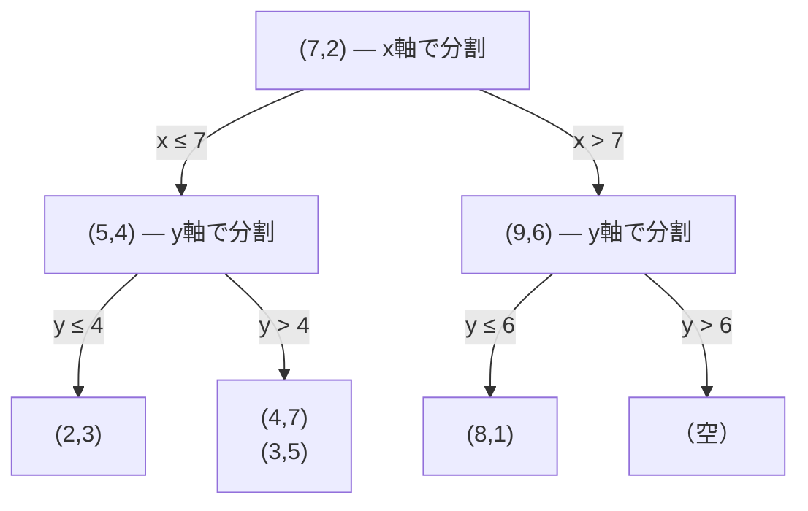
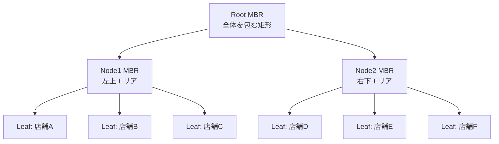
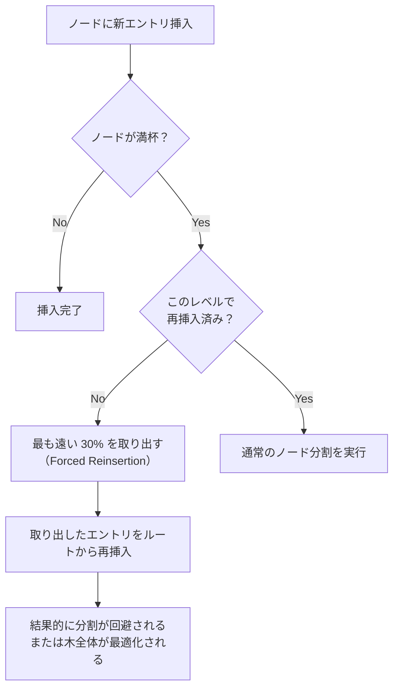
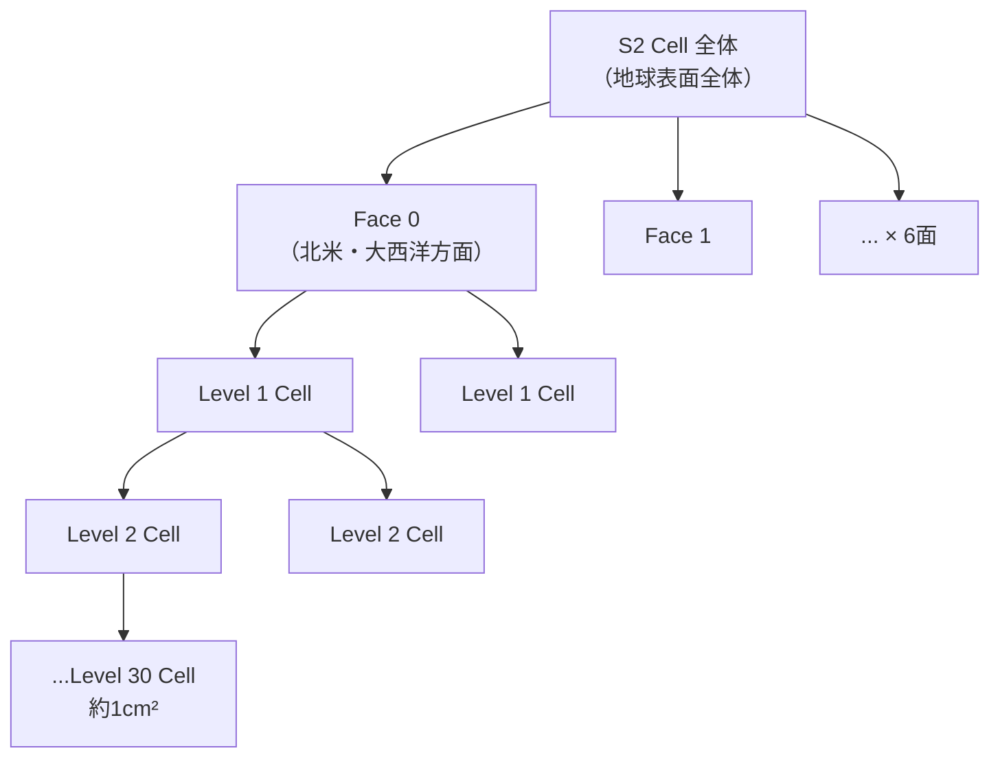
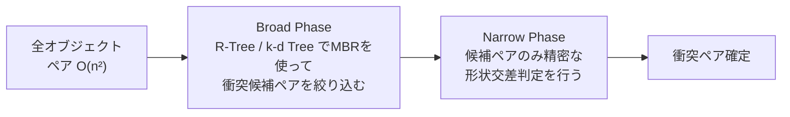
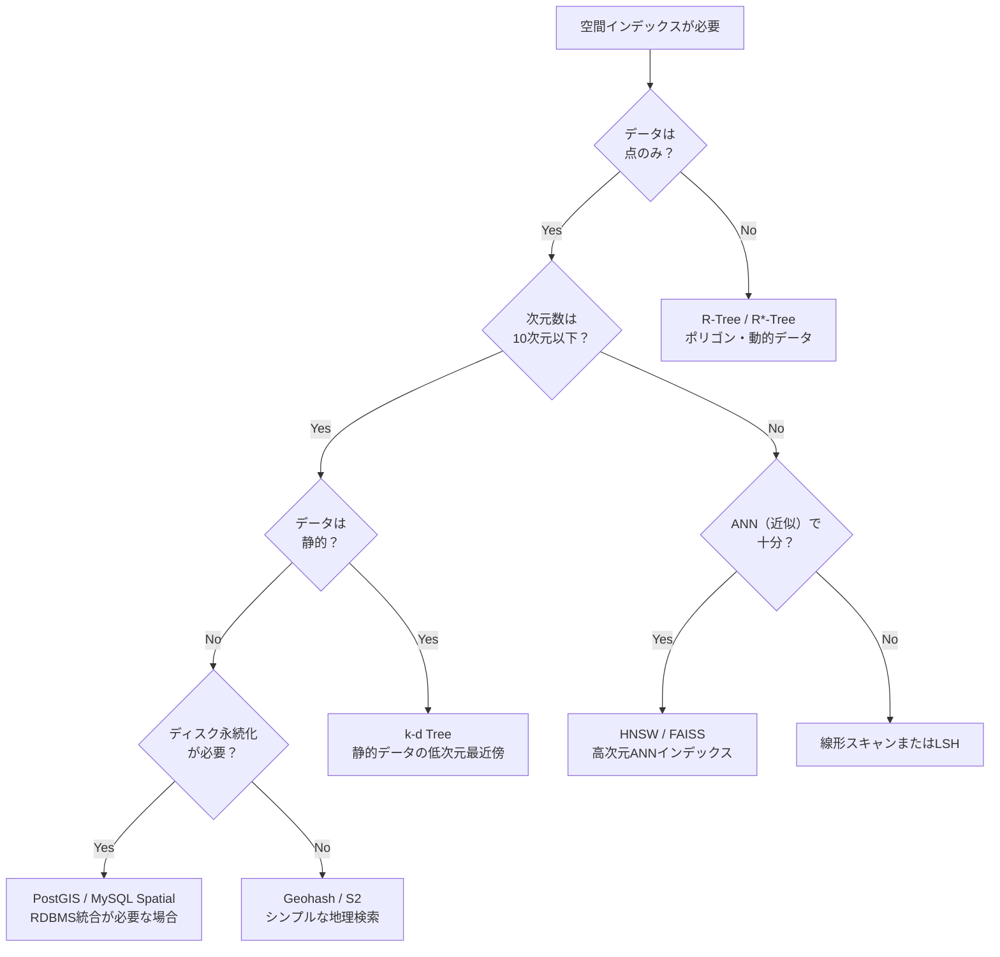

# k-d Tree と R-Tree — 空間インデックスの設計

## 1. はじめに：空間データの探索問題

現代のアプリケーションは、驚くほど多様な「空間データ」を扱う。地図アプリが「現在地から2km以内のレストランを探す」クエリを処理するとき、ゲームエンジンが高速道路を疾走する自動車と障害物の衝突を検出するとき、推薦システムが特徴量空間上で「類似ユーザー」を見つけるとき——これらはすべて、多次元空間における近傍・包含・交差の問題に帰着する。

通常のリレーショナルデータベースが提供するB-Treeインデックスは、1次元の数値や文字列の大小比較に最適化されており、`WHERE price < 1000 AND price > 500` のような1次元範囲検索を効率的に処理できる。しかし `WHERE latitude BETWEEN 35.6 AND 35.7 AND longitude BETWEEN 139.7 AND 139.8` のような2次元の矩形範囲検索を行う場合、B-Treeは2つの条件を独立に評価するため、実質的には一方の軸でしかインデックスを活用できない。データが2次元・3次元・さらに高次元になるにつれ、1次元インデックスでは太刀打ちできない状況が増える。

この問題に対応するために設計されたのが**空間インデックス（Spatial Index）**である。本記事では、空間インデックスを代表する2つのデータ構造、**k-d Tree**と**R-Tree**を中心に取り上げ、その設計原理・アルゴリズム・実用的な側面を体系的に解説する。

### 1.1 空間クエリの分類

空間データに対するクエリは、主に以下の種類に分類される。

| クエリ種別 | 内容 | 例 |
|---|---|---|
| **範囲検索（Range Query）** | 指定した矩形・円・多角形の内部に含まれる点を返す | 半径1km以内の店舗を検索 |
| **最近傍探索（kNN Query）** | クエリ点に最も近いk個の点を返す | 現在地から最寄りの病院トップ3 |
| **点クエリ（Point Query）** | ある点を含む領域を返す | 座標 (x, y) が属するポリゴン |
| **結合クエリ（Spatial Join）** | 2つのデータセット間で空間的に交差するペアを返す | 市区町村とお店のレイヤーを重ね合わせ |
| **最近傍結合（Distance Join）** | 2データセット間の近傍ペアを列挙する | ユーザーと店舗の近傍マッチング |

これらのクエリを線形時間（$O(n)$）より高速に処理するためにインデックスが不可欠である。

### 1.2 問題の難しさ：次元の呪い

空間インデックスの設計において最大の障壁となるのが**次元の呪い（Curse of Dimensionality）**である。高次元空間では直感に反する現象が生じる。

$d$ 次元の単位超立方体 $[0,1]^d$ を辺長 $\epsilon$ の小超立方体で分割すると、そのセル数は $\epsilon^{-d}$ に達する。たとえば $d=20$、$\epsilon=0.1$ とすると $10^{20}$ 個のセルが必要になる。これは宇宙の素粒子の数をはるかに超える。

最近傍探索の観点からも同様の問題が生じる。$d$ 次元球の体積と外接超立方体の体積の比は $d$ が増えるにつれて急速に0に近づく。つまり高次元空間ではほとんどのデータが「隅」に集中し、「近傍」と「遠方」の距離差がほとんどなくなる。

```
d=2:   球体積 / 立方体体積 = π/4 ≈ 0.785
d=10:  球体積 / 立方体体積 ≈ 0.0025
d=20:  球体積 / 立方体体積 ≈ 2.5 × 10⁻⁸
```

この性質により、高次元（おおむね20次元以上）になると空間インデックスの効果が薄れ、線形スキャンと大差ない状況になる。k-d TreeやR-Treeが本来の力を発揮できるのは、低〜中次元（2〜10次元程度）の空間データに対してである。

---

## 2. k-d Tree

### 2.1 k-d Tree とは

**k-d Tree（k-dimensional tree）**は、1975年にJon Bentleyがカーネギーメロン大学の博士課程中に発表したデータ構造である。"k次元" という名称が示すとおり、$k$ 次元のユークリッド空間内に存在する点の集合を効率よく探索するために設計された二分木である。

k-d Treeは極めてシンプルな着想に基づく。**「$k$ 次元空間を再帰的に超平面（hyperplane）で二分割する」**というものだ。各内部ノードは、ある軸（座標）に沿った分割平面を表し、その平面を境に左右の部分空間に点を振り分ける。リーフノードには実際の点が格納される。

### 2.2 構造の概念

2次元空間（$k=2$）で考えてみよう。以下の7点を考える。

```
P1=(2,3), P2=(5,4), P3=(9,6), P4=(4,7), P5=(8,1), P6=(7,2), P7=(3,5)
```

k-d Treeは次のように空間を分割する。



各レベルで分割に使う軸を交互に切り替える（2次元なら x → y → x → y → ...）のが最もシンプルな実装で「**サイクリック軸選択**」と呼ばれる。

### 2.3 構築アルゴリズム

#### 2.3.1 分割軸の選択戦略

k-d Treeの性能は、各ノードにおいてどの軸を選んで分割するかに大きく左右される。主な戦略を比較する。

| 戦略 | 説明 | 長所 | 短所 |
|---|---|---|---|
| **サイクリック軸選択** | 深さに応じて軸を順番に変える | 実装が簡単 | データの偏りに対応できない |
| **最大分散軸選択** | 分散が最大の軸を選ぶ | バランスがよい | 各ノードで分散計算が必要 |
| **最大範囲軸選択** | max - min が最大の軸を選ぶ | 計算が軽量 | 外れ値に敏感 |

高品質な k-d Tree では**最大分散軸選択**が一般的に使われる。

#### 2.3.2 分割点の選択

選んだ軸に沿って点を並べたとき、どこで分割するかも重要である。**中央値**（median）を用いて分割するのが標準的なアプローチで、これにより木がバランスよく成長する。

```python
def build_kdtree(points, depth=0):
    if not points:
        return None

    # Select axis by cycling through dimensions
    k = len(points[0])
    axis = depth % k

    # Sort by selected axis and pick median
    sorted_points = sorted(points, key=lambda p: p[axis])
    median = len(sorted_points) // 2

    return {
        "point": sorted_points[median],
        "left": build_kdtree(sorted_points[:median], depth + 1),
        "right": build_kdtree(sorted_points[median + 1:], depth + 1),
    }
```

中央値による構築の時間計算量は $O(n \log^2 n)$（各レベルでのソートによる）だが、事前にすべての軸でソートしておくことで $O(n \log n)$ に改善できる。構築後の木の高さは $O(\log n)$ であり、これが検索性能の基盤となる。

#### 2.3.3 バランシングと動的更新

上記の静的構築アルゴリズムは最適なバランスを実現するが、挿入・削除に対しては弱い。通常の二分探索木と同様に点を挿入していくと、特定のパターンでは木が偏りを持つ。

k-d Treeは本来**静的なデータセット**に向いたデータ構造である。頻繁な挿入・削除が必要な場合は、一定数の更新ごとに木全体を再構築する「**バッチ再構築（Batch Rebuild）**」戦略が実用的である。

動的 k-d Tree の研究としては、Logarithmic Method（Overmars, 1983）などが知られるが、実装が複雑なため、実務では静的構築 + 定期再構築が多く採用される。

### 2.4 範囲検索

k-d Treeによる矩形範囲検索のアルゴリズムを示す。クエリ矩形を $[x_{\min}, x_{\max}] \times [y_{\min}, y_{\max}]$ とする。

```python
def range_search(node, query_rect, depth=0):
    """
    node: current k-d tree node
    query_rect: [(x_min, x_max), (y_min, y_max), ...]
    Returns list of points inside query_rect
    """
    if node is None:
        return []

    results = []
    k = len(query_rect)
    axis = depth % k

    # Check if current point is inside the query rectangle
    point = node["point"]
    if all(query_rect[i][0] <= point[i] <= query_rect[i][1] for i in range(k)):
        results.append(point)

    # Decide which subtree(s) to visit
    lo, hi = query_rect[axis]

    if point[axis] >= lo:
        # Left subtree may overlap
        results += range_search(node["left"], query_rect, depth + 1)
    if point[axis] <= hi:
        # Right subtree may overlap
        results += range_search(node["right"], query_rect, depth + 1)

    return results
```

このアルゴリズムのポイントは「**枝刈り（pruning）**」である。ノードの分割軸上の座標とクエリ矩形を比較し、重なりがない側の部分木を丸ごとスキップする。結果として、バランスの取れた木では平均 $O(\sqrt{n} + m)$（$m$ は検索ヒット数）で範囲検索を実行できる（$k=2$ の場合）。

### 2.5 最近傍探索

最近傍探索（NN: Nearest Neighbor）はk-d Treeの最も重要な応用の一つである。ナイーブな総当たり探索が $O(n)$ であるのに対し、k-d Treeを使うと平均 $O(\log n)$（最悪 $O(n)$）で処理できる。

```python
import math

def nearest_neighbor(node, query, best=None, depth=0):
    """
    Returns the nearest point to query in the k-d tree.
    best: (distance, point) tuple for current best candidate
    """
    if node is None:
        return best

    point = node["point"]
    k = len(query)
    axis = depth % k

    # Update best if current node is closer
    dist = math.sqrt(sum((q - p) ** 2 for q, p in zip(query, point)))
    if best is None or dist < best[0]:
        best = (dist, point)

    # Determine which side to explore first
    diff = query[axis] - point[axis]
    first, second = (node["left"], node["right"]) if diff <= 0 else (node["right"], node["left"])

    # Explore the closer side first
    best = nearest_neighbor(first, query, best, depth + 1)

    # Check if the other side might contain a closer point
    # (i.e., the splitting hyperplane is within current best distance)
    if abs(diff) < best[0]:
        best = nearest_neighbor(second, query, best, depth + 1)

    return best
```

アルゴリズムの核心は「**超平面との距離チェック**」である。クエリ点から分割超平面までの距離が現在の最近傍距離より大きければ、その側の部分木に最近傍が存在しないことが保証される。この枝刈りにより、多くの場合において部分木の大半をスキップできる。

**k近傍探索（kNN）**への拡張は、最良優先探索（Best-First Search）と優先度キューを組み合わせることで実現できる。

> [!TIP]
> k-d Treeの最近傍探索は平均ケースで非常に高速だが、クエリ点がデータ点と一致する場合や、データが均一分布でない場合には最悪ケースに陥ることがある。実用上は ANN（Approximate Nearest Neighbor）ライブラリ（FAISS、hnswlib）が用いられる場面も多い。

### 2.6 k-d Tree の計算量まとめ

| 操作 | 時間計算量（平均） | 時間計算量（最悪） | 備考 |
|---|---|---|---|
| 構築 | $O(n \log n)$ | $O(n \log n)$ | 中央値を使った場合 |
| 点クエリ | $O(\log n)$ | $O(n)$ | 平衡な木 |
| 範囲検索 | $O(\sqrt{n} + m)$ | $O(n)$ | $k=2$、$m$ はヒット数 |
| 最近傍探索 | $O(\log n)$ | $O(n)$ | 均一分布のデータ |
| 挿入 | $O(\log n)$ | $O(n)$ | 再バランスなし |
| 削除 | $O(\log n)$ | $O(n)$ | フラグ管理が一般的 |

空間計算量は $O(n)$ である（木のすべてのノードにポインタと点データを格納）。

---

## 3. R-Tree

### 3.1 R-Tree とは

**R-Tree**は1984年にAntonin Gutmanがカリフォルニア大学バークレー校で発表したデータ構造である。"R" は Rectangle（矩形）を意味し、空間データをグループ化する際に各グループを囲む最小外接矩形（MBR: Minimum Bounding Rectangle）を用いることから命名された。

k-d Treeが空間を超平面で分割するのに対し、R-Treeは**空間オブジェクトそのもの（点・線・多角形）をグループ化し、そのグループを再帰的にまとめる**アプローチを取る。この違いにより、R-Treeはk-d Treeが不得意とする「ライン・ポリゴンなどの拡がりを持つ空間オブジェクト」のインデックスを効率的に扱える。

また、R-Treeは**B-Treeと同様のディスク指向設計**であり、ノードが固定サイズのページに対応しているため、ディスクに格納されるデータベースインデックスとして非常に適している。PostGISやMySQL Spatial Indexの内部実装に採用されているのもR-Treeである。

### 3.2 構造の詳細

R-Treeは次の性質を持つ高さ平衡多分木である（B-Treeと類似）。

1. **リーフノード**：実際の空間オブジェクト（またはそのポインタ）とその MBR を格納する
2. **内部ノード**：子ノードの MBR を集約した、より大きな MBR を格納する
3. **各ノードは最大 $M$ 個・最小 $m$ 個（$m \leq \lfloor M/2 \rfloor$）のエントリを持つ**
4. **すべてのリーフは同じ深さにある**（完全平衡）



内部ノードの MBR は子ノードの MBR をすべて包含するように設定される。木のルートの MBR はすべてのデータを包含する。

> [!NOTE]
> B-Tree との重要な違いは、R-Tree では **MBR が重なり合う（overlap）** ことが許容される点である。B-Tree では各キー範囲は排他的に分割されるが、R-Tree では空間オブジェクトの分布によって兄弟ノードの MBR が重なりを持つ場合がある。このオーバーラップが検索性能の劣化要因となる。

### 3.3 検索アルゴリズム

R-Treeの**矩形範囲検索**は次のように進む。

```python
def range_search_rtree(node, query_rect):
    """
    node: R-Tree node with (mbr, children) structure
    query_rect: (x_min, y_min, x_max, y_max)
    Returns: list of matching objects
    """
    results = []
    for entry in node["entries"]:
        if not mbr_intersects(entry["mbr"], query_rect):
            # MBR does not intersect query rect — prune this subtree
            continue
        if node["is_leaf"]:
            # Leaf-level: check actual geometry (optional refinement)
            if object_intersects(entry["object"], query_rect):
                results.append(entry["object"])
        else:
            # Internal node: recurse into matching children
            results += range_search_rtree(entry["child"], query_rect)
    return results
```

MBR との交差チェックを使って**関係のない部分木を丸ごとスキップ**できる点が R-Tree の核心である。MBR はあくまで過大評価（オーバーエスティメーション）であるため、「MBR が交差するが実際のジオメトリが交差しない」ケースが生じる（偽陽性）。これは後のステップで実ジオメトリとの精密な交差判定（Refinement Step）によって解消する。

### 3.4 ノード分割戦略

R-Treeの設計において最も重要かつ難しい問題が**ノード分割（Node Split）**である。ノードが満杯（$M$ 個のエントリ）になった状態で新しいエントリを挿入すると、ノードを2つに分割する必要がある。このとき「どのエントリをどちらのノードに振り分けるか」がMBRのオーバーラップ・面積・形状を左右する。

Gutmanのオリジナル論文（1984年）では3つの分割アルゴリズムが提案された。

#### 3.4.1 Exhaustive Split（完全探索）

$M+1$ 個のエントリをすべての分割方法（$2^{M+1}$ 通り）で試し、最小面積（または最小オーバーラップ）を達成する分割を選ぶ。$M$ が小さければ実用的だが、$M$ が増えると指数的に計算量が増大する。

#### 3.4.2 Quadratic Split

時間計算量 $O(M^2)$ の近似アルゴリズム。最初に「2つのエントリを同じ組に入れたときのデッドスペース（MBR - 個別面積の和）が最大になるペア」を選び、残りのエントリを貪欲に各組に振り分ける。実装が簡単で多くの実装で採用される。

```python
def quadratic_split(entries):
    """
    Splits entries into two groups using the quadratic algorithm.
    Returns (group1, group2)
    """
    # Step 1: Find the pair with the most wasted space (seeds)
    max_waste = float("-inf")
    seed1, seed2 = 0, 1
    for i in range(len(entries)):
        for j in range(i + 1, len(entries)):
            combined_mbr = union_mbr(entries[i]["mbr"], entries[j]["mbr"])
            waste = area(combined_mbr) - area(entries[i]["mbr"]) - area(entries[j]["mbr"])
            if waste > max_waste:
                max_waste = waste
                seed1, seed2 = i, j

    group1 = [entries[seed1]]
    group2 = [entries[seed2]]
    remaining = [e for idx, e in enumerate(entries) if idx not in (seed1, seed2)]

    # Step 2: Assign remaining entries greedily
    for entry in remaining:
        # Calculate area increase for each group
        d1 = area(union_mbr(mbr_of(group1), entry["mbr"])) - area(mbr_of(group1))
        d2 = area(union_mbr(mbr_of(group2), entry["mbr"])) - area(mbr_of(group2))
        if d1 <= d2:
            group1.append(entry)
        else:
            group2.append(entry)

    return group1, group2
```

#### 3.4.3 Linear Split

時間計算量 $O(M)$ の最も高速な近似アルゴリズム。各軸の端点を線形に走査してシードを決定し、残りを単純に割り当てる。速いが品質は最も低い。

---

## 4. R*-Tree — R-Tree の改良版

### 4.1 R*-Tree の概要

1990年、Norbert Beckmann、Hans-Peter Kriegel、Ralf Schneider、Bernhard Seegerの4名が発表した**R\*-Tree**は、R-Tree の検索・挿入・削除性能を大幅に改善した変種である。論文タイトルの "*" は「星（アスタリスク）」を意味し、R-Tree を超えた改良版であることを示す。

R\*-Tree が R-Tree と異なる点は主に2つある。

1. **ノード分割戦略の改良**（最小オーバーラップ分割）
2. **強制再挿入（Forced Reinsertion）**

### 4.2 最小オーバーラップ分割

R-Tree の Quadratic Split は MBR の面積増加を最小化することを目標とするが、R\*-Tree では**オーバーラップの最小化**も考慮する。オーバーラップが小さいほど検索時の枝刈り精度が上がり、性能が向上する。

R\*-Tree の分割アルゴリズムでは、各軸について点をソートし、すべての有効な分割点を評価して「オーバーラップ面積 + MBR 面積の和」が最小になる分割を選ぶ。時間計算量は $O(M \log M)$ であり、Quadratic Split（$O(M^2)$）よりも高速でありながら品質も高い。

### 4.3 強制再挿入（Forced Reinsertion）

R\*-Tree の最も革新的なアイデアが**強制再挿入（Forced Reinsertion）**である。

通常のノード分割は「オーバーフローしたノードを2つに分割する」という破壊的な操作であり、局所的には最適化されても木全体の構造が徐々に劣化する傾向がある。R\*-Tree では、ノードがオーバーフローした場合にすぐ分割するのではなく、まず**ノード内の一部のエントリ（通常は 30% 程度）を木から取り出し、ルートから再挿入**する。



再挿入によって木の構造が動的に再最適化され、MBR の重なりが減少する。実験的に、R\*-Tree は R-Tree と比較して検索性能が 30〜50% 程度向上することが示されている。

> [!TIP]
> R\*-Tree は今日の地理空間データベースで事実上の標準であり、PostGIS（PostgreSQL 拡張）の GIST インデックスや、SQLite の SpatiaLite などの内部で広く採用されている。

---

## 5. R-Tree 派生型の概観

R-Tree ファミリーには多くの派生型が存在する。

| 派生型 | 提案年 | 特徴 |
|---|---|---|
| **R+-Tree** | 1987 | MBRのオーバーラップを完全排除。オブジェクトを複数ノードに重複登録 |
| **R*-Tree** | 1990 | 最小オーバーラップ分割 + 強制再挿入 |
| **Hilbert R-Tree** | 1994 | ヒルベルト曲線でオブジェクトに順序を与えてから挿入。線形分割を実現 |
| **STR-Tree（Sort-Tile-Recursive）** | 1997 | 大量データの一括読み込みに特化したバルクロード最適化 |
| **PR-Tree** | 2004 | 最悪ケース検索性能を $O(\sqrt{n})$ に保証する理論的改良 |

実用上は **R\*-Tree** か **STR-Tree**（バルクロード時）が最も広く使われている。

---

## 6. PostGIS / MySQL における空間インデックス

### 6.1 PostGIS（PostgreSQL 拡張）

PostGIS は PostgreSQL に地理空間機能を追加する最も広く使われた拡張ライブラリである。内部では PostgreSQL の**汎用インデックスフレームワーク GiST（Generalized Search Tree）**を用いて R\*-Tree ライクな空間インデックスを実装している。

```sql
-- Create a spatial index on geometry column
CREATE INDEX idx_locations_geom
  ON locations USING GIST (geom);

-- Range search: find all objects within 1km of a point
SELECT name
FROM locations
WHERE ST_DWithin(
  geom,
  ST_MakePoint(139.7671, 35.6812)::geography,
  1000  -- 1000 meters
);

-- Nearest neighbor: find 5 closest restaurants
SELECT name, ST_Distance(geom, query_point) AS dist
FROM restaurants,
     (SELECT ST_MakePoint(139.7671, 35.6812)::geography AS query_point) q
ORDER BY geom <-> query_point  -- Uses GiST index for kNN
LIMIT 5;
```

PostGIS の `<->` 演算子は GiST インデックスを活用した KNN クエリを実行する。PostgreSQL 9.1 以降で ORDER BY + LIMIT の組み合わせでインデックスが使われるよう最適化されている。

また PostGIS は、精密な地球表面上の計算を行う`geography` 型と、平面座標系上の計算を行う `geometry` 型を使い分けており、用途に応じて選択する必要がある。

### 6.2 MySQL / MariaDB の Spatial Index

MySQL 5.7 以降（InnoDB）および MariaDB では、`SPATIAL INDEX` キーワードで空間インデックスを作成できる。内部的には R-Tree が使用される。

```sql
-- Create a spatial index
CREATE TABLE stores (
  id INT PRIMARY KEY,
  name VARCHAR(100),
  location POINT NOT NULL SRID 4326,  -- WGS84 coordinate system
  SPATIAL INDEX idx_location (location)
);

-- Range search using MBRContains
SELECT name
FROM stores
WHERE MBRContains(
  ST_GeomFromText('POLYGON((139.7 35.6, 139.8 35.6, 139.8 35.7, 139.7 35.7, 139.7 35.6))', 4326),
  location
);

-- Nearest neighbor (MySQL 8.0+)
SELECT name, ST_Distance_Sphere(location, ST_MakePoint(139.7671, 35.6812)) AS dist
FROM stores
ORDER BY ST_Distance_Sphere(location, ST_MakePoint(139.7671, 35.6812))
LIMIT 5;
```

> [!WARNING]
> MySQL の `ST_Distance` を使った ORDER BY + LIMIT の形式では、バージョンによっては空間インデックスが活用されない場合がある。クエリプランを `EXPLAIN` で確認することを推奨する。

### 6.3 PostGIS vs MySQL Spatial の比較

| 項目 | PostGIS | MySQL Spatial |
|---|---|---|
| インデックス実装 | GiST（R\*-Tree ライク） | R-Tree |
| 対応ジオメトリ | 点・線・面・マルチ・コレクション等 | 点・線・面・マルチ |
| 3D/4D サポート | あり（PostGIS 2.0+） | なし |
| KNN インデックス使用 | `<->` 演算子で対応 | 基本的に非対応 |
| 地球楕円体計算 | geography 型で対応 | ST_Distance_Sphere |
| 標準準拠 | OGC Simple Features | OGC Simple Features |

---

## 7. Geohash と S2 Geometry

空間インデックスの議論において、R-Tree 系とはアプローチが異なる「**空間符号化（Spatial Encoding）**」という手法も重要である。代表的なものに Geohash と Google S2 Geometry Library がある。

### 7.1 Geohash

**Geohash**は2008年に Gustavo Niemeyer が発明した、緯度・経度を1次元の英数字文字列に変換するエンコーディング手法である。

原理は「**空間のビット交互インターリーブ**」である。緯度 $[-90, 90]$ と経度 $[-180, 180]$ をそれぞれ二分探索的に量子化し、経度ビットと緯度ビットを交互に並べることで、ジグザグに空間を分割する**ヒルベルト曲線的な番号付け**を実現する（厳密にはZ曲線に近い）。

```
経度 139.7671 → バイナリ: 1 1 0 1 0 0 1 0 0 0 ...（-180〜180 を二分）
緯度  35.6812 → バイナリ: 1 0 1 1 0 1 1 0 0 0 ...（-90〜90 を二分）

インターリーブ: 1 1 1 0 0 1 1 0 1 0 ...
5ビットずつ base32 エンコード → "xn76u" (東京周辺)
```

Geohash の精度は文字数（ビット数）に依存する。

| 文字数 | 緯度精度 | 経度精度 | セルサイズ |
|---|---|---|---|
| 4 | ±1.1° | ±1.1° | 約 156km × 156km |
| 6 | ±0.017° | ±0.017° | 約 1.2km × 0.6km |
| 8 | ±0.00085° | ±0.00085° | 約 38m × 19m |
| 10 | ±0.000021° | ±0.000021° | 約 1.2m × 0.6m |

Geohash の最大の利点は、**通常の文字列インデックス（B-Tree）で空間検索に近い性能を得られる**点である。同じ Geohash プレフィックスを持つ点は空間的に近傍にある（逆は必ずしも成立しない）。

```sql
-- Find all locations in the same geohash cell (prefix search)
SELECT * FROM locations
WHERE geohash LIKE 'xn76%';
```

ただし Geohash は「**境界問題**」を持つ。隣接するセルが全く異なるプレフィックスを持つ場合があり（特に赤道・本初子午線付近）、近傍検索では周囲の 8 セルを追加でクエリする必要がある。

### 7.2 S2 Geometry Library

**S2 Geometry Library**は Google が開発した、地球表面を球面（正確には球面を近似した正二十面体投影）として扱う空間インデックスライブラリである。Google Maps、BigQuery GIS、Uber H3 など多くのシステムで採用されている。

S2 の核心は地球表面を**四分木（Quad Tree）**で階層的に分割する「**S2 Cell**」概念にある。地球表面を正六面体の6面に投影し、各面を再帰的に4分割することで 0〜30 レベルの階層構造を形成する。



S2 Cell の ID は 64 ビット整数で表現されるため、通常の整数インデックスを用いて空間検索が行える。Geohash と同様に、S2 Cell ID のプレフィックスが同じであれば同一セル内に包含される。

Geohash と S2 の比較：

| 特性 | Geohash | S2 Geometry |
|---|---|---|
| セル形状 | 矩形（平面座標） | 球面上の曲線矩形 |
| 歪み | 高緯度で大きく歪む | 歪みが少ない（等面積性が高い） |
| 境界問題 | あり（要周辺8セル） | 少ない（階層設計が優秀） |
| インデックス型 | 文字列 B-Tree | 整数 B-Tree |
| 精度レベル | 1〜12 | 0〜30 |
| 採用例 | Redis、Elasticsearch | Google Maps、BigQuery、DynamoDB |

---

## 8. ユースケース

### 8.1 地理情報システム（GIS）

GIS（Geographic Information System）は空間インデックスの最も古典的かつ重要なユースケースである。

**配車・物流サービス**（Uber、Lyft）では、乗客からのリクエストが来た際に最寄りのドライバーを数ミリ秒以内に特定する必要がある。ドライバーの位置は秒単位で更新され、数百万個の動的な点に対してリアルタイムの KNN クエリを実行する。Uber は S2 Geometry を採用した独自のインデックスシステムを構築している。

**店舗検索**（Google Maps、食べログ）では、現在地から半径 $r$ km 以内の施設を検索するクエリが主体である。施設データは比較的静的であるため、PostGIS や Elasticsearch の GeoSearch などを使った事前構築型インデックスが効果的である。

**地理フェンシング（Geofencing）**では、「ユーザーが特定エリアに入った/出た」を検出する。ポイント・イン・ポリゴン（PiP: Point-in-Polygon）テストを R-Tree で高速化することが一般的である。

### 8.2 衝突検出（Collision Detection）

ゲームエンジン・物理シミュレーション・ロボティクスにおける衝突検出は、空間インデックスの重要な応用領域である。

**Broad Phase と Narrow Phase**の2段階アプローチが標準的である。



- **Broad Phase**：MBR（Axis-Aligned Bounding Box: AABB）を使って「衝突の可能性があるペア」を絞り込む。R-Tree の `ST_Intersects` に相当する処理。
- **Narrow Phase**：絞り込まれた候補に対してのみ、GJK（Gilbert-Johnson-Keerthi）アルゴリズムなどを用いた精密な形状交差判定を行う。

Unity、Unreal Engine、Bullet Physics などのゲームエンジン・物理エンジンはすべてこの2段階アプローチを採用しており、Broad Phase に R-Tree または BVH（Bounding Volume Hierarchy、R-Tree の変種）を使用している。

### 8.3 推薦システムにおける最近傍探索

機械学習ベースの推薦システムでは、ユーザーや商品を高次元の埋め込みベクトル（embedding）で表現し、ベクトル空間における最近傍探索を行うことでレコメンデーションを生成する。

例えば、Spotify の楽曲推薦では曲を数百次元の音楽的特徴量ベクトルで表現し、ユーザーが聴いている曲の近傍にある曲を推薦する。この検索は「**Approximate Nearest Neighbor（ANN）検索**」と呼ばれ、厳密な最近傍ではなく「ほぼ最近傍」を高速に返す。

代表的な ANN インデックス手法：

| 手法 | 説明 | 代表実装 |
|---|---|---|
| **KD-Tree** | 低次元（< 20 次元）で有効 | scikit-learn |
| **Locality-Sensitive Hashing（LSH）** | ハッシュ衝突を利用した確率的手法 | FAISS |
| **HNSW（Hierarchical NSW）** | グラフベースの最先端手法 | hnswlib、Weaviate |
| **IVF（Inverted File Index）** | クラスタリングで候補を絞る | FAISS |
| **ScaNN** | Google 製、量子化とグラフを組み合わせ | Google ScaNN |

高次元 ANN の用途：

- 類似画像・動画検索（Pinterest Lens、Google Vision）
- テキストの意味的検索（Elasticsearch kNN、pgvector）
- 商品推薦（Amazon、Netflix）
- 顔認証（類似顔のマッチング）

### 8.4 コンピュータグラフィックス

**レイトレーシング（Ray Tracing）**では、光線（Ray）がシーン内のどのオブジェクトと最初に交差するかを計算する。シーンに数百万のポリゴンが存在する場合、全ポリゴンとの交差判定は非常に高価である。**BVH（Bounding Volume Hierarchy）**、すなわち R-Tree の変種を用いて光線との交差候補を絞り込むことで、計算量を $O(n)$ から $O(\log n)$ 近くに削減できる。

NVIDIA RTX GPU のハードウェアレイトレーシングコアも、BVH のトラバーサルをハードウェアアクセラレーションする専用ユニットを搭載している。

---

## 9. 実装選択の指針

k-d Tree と R-Tree の使い分け、あるいは他の手法の選択は、データの特性・クエリパターン・システム要件によって決まる。



以下に主な判断基準をまとめる。

| 条件 | 推奨手法 |
|---|---|
| 低次元（2〜3次元）、静的データ、メモリ内 | k-d Tree |
| 低〜中次元（2〜10次元）、動的・ポリゴンデータ | R-Tree / R\*-Tree |
| RDBMS に統合された空間クエリ | PostGIS（PostgreSQL + GiST） |
| シンプルな地理的近傍検索、既存 B-Tree インフラ活用 | Geohash |
| 球面上の正確な地理計算 | S2 Geometry |
| 高次元（> 20次元）の近似最近傍 | HNSW / FAISS / ScaNN |
| リアルタイム 3D 衝突検出 | BVH（R-Tree 変種） |

---

## 10. まとめ

空間インデックスは、地理情報・衝突検出・機械学習など現代の多様なアプリケーションを支える基盤技術である。

**k-d Tree**は、1975年に提案されたシンプルかつ強力なメモリ内データ構造であり、低次元空間における最近傍探索・範囲検索を $O(\log n)$ 平均時間で処理できる。静的なデータセットに対して最も効果を発揮する一方、高次元や動的データには適していない。

**R-Tree**は、1984年に提案されたディスク指向の空間インデックスであり、MBR を用いた階層的グループ化によって点・線・ポリゴンなど多様な空間オブジェクトを効率的に管理できる。R\*-Tree の登場によって検索性能は大幅に向上し、PostGIS や MySQL Spatial Index などを通じて地理空間データベースの標準技術となっている。

**Geohash と S2 Geometry**は、空間を1次元の ID に変換することで通常の B-Tree インデックスを活用するアプローチである。実装の簡便さと既存インフラとの親和性から、多くの実用システムで採用されている。

そして**高次元 ANN インデックス**（HNSW、FAISS）は、機械学習の埋め込みベクトルによる類似検索という新しい需要に応えるために急速に発展しており、現代の推薦システムや AI 検索エンジンの核心技術となっている。

空間データの多様性を理解し、データの次元・動的性・規模・精度要件に応じて適切なインデックス手法を選択することが、空間検索システムを設計する上での根本的な指針となる。

---

## 参考文献

- Bentley, J. L. (1975). "Multidimensional binary search trees used for associative searching." *Communications of the ACM*, 18(9), 509-517.
- Guttman, A. (1984). "R-trees: A dynamic index structure for spatial searching." *ACM SIGMOD Record*, 13(2), 47-57.
- Beckmann, N., Kriegel, H. P., Schneider, R., & Seeger, B. (1990). "The R\*-tree: an efficient and robust access method for points and rectangles." *ACM SIGMOD Record*, 19(2), 322-331.
- Lowe, D. G. (2004). "Distinctive image features from scale-invariant keypoints." *International Journal of Computer Vision*, 60(2), 91-110.
- Malkov, Y. A., & Yashunin, D. A. (2018). "Efficient and robust approximate nearest neighbor search using hierarchical navigable small world graphs." *IEEE Transactions on Pattern Analysis and Machine Intelligence*, 42(4), 824-836.
- PostGIS Documentation: https://postgis.net/docs/
- Google S2 Geometry Library: https://s2geometry.io/
