# スピンロックとバックオフ

## 1. 背景と動機 — なぜスピンロックが必要か

### 1.1 ロックの2つの待機戦略

マルチスレッドプログラミングにおいて、共有資源への排他的アクセスを実現する同期プリミティブとして**ロック**がある。ロックの獲得に失敗したスレッドが取りうる待機戦略は、大きく2つに分けられる。

1. **ブロッキング（Blocking）**: ロックを獲得できなかったスレッドをOSのスケジューラに通知し、スレッドを**スリープ状態**に遷移させる。ロックが解放された時点で、OSがスレッドを再びスケジューリングする。Mutex やセマフォがこの方式を採用する。
2. **スピン待ち（Spinning / Busy-Waiting）**: ロックを獲得できなかったスレッドが、ロック変数を**ループで繰り返しポーリング**し続け、ロックが解放された瞬間に獲得する。スピンロックがこの方式を採用する。

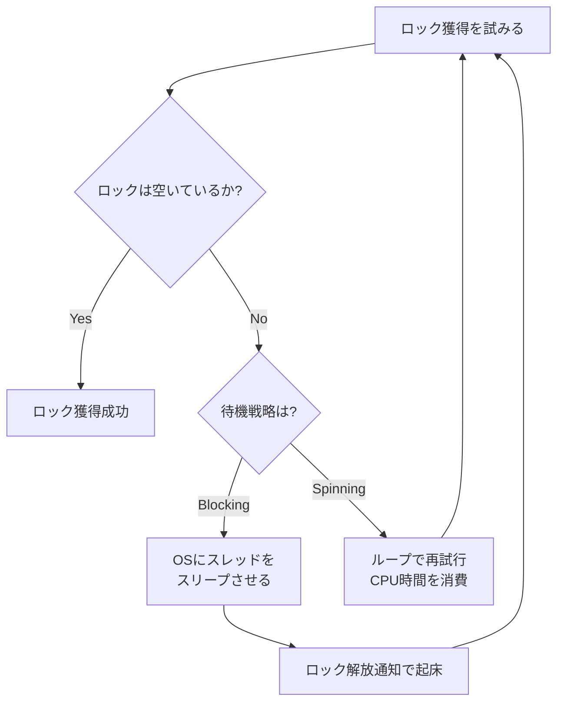

### 1.2 Mutex との根本的な違い

Mutex（ブロッキングロック）とスピンロックの最大の違いは、**待機時のCPU資源の使い方**にある。

Mutex は、ロック獲得に失敗するとスレッドをスリープ状態に遷移させる。このとき、OSはそのスレッドをランキュー（実行可能キュー）から外し、別のスレッドにCPU時間を割り当てる。ロック保持者がロックを解放すると、OSは待機中のスレッドを起こし、再びスケジューリング対象にする。この一連の処理には、2回のコンテキストスイッチ（スリープ時と起床時）が伴い、それぞれ数マイクロ秒のオーバーヘッドが発生する。

一方、スピンロックはスレッドをスリープさせない。待機中もスレッドはCPU上で実行され続け、ロック変数をポーリングするループを回し続ける。コンテキストスイッチのオーバーヘッドはないが、その代償として**CPU時間を消費し続ける**。

| 特性 | Mutex（ブロッキング） | スピンロック |
|---|---|---|
| 待機時のCPU消費 | なし（スリープ） | あり（ビジーウェイト） |
| コンテキストスイッチ | あり（2回） | なし |
| 最小オーバーヘッド | 数μs | 数十ns |
| 適する保持時間 | 長い（μs〜ms） | 極めて短い（ns〜数μs） |
| プリエンプション | 安全 | 危険（後述） |

### 1.3 スピンロックが有効な場面

スピンロックが Mutex より有利になるのは、以下の条件を満たす場合である。

1. **クリティカルセクションが極めて短い**: ロックの保持時間がコンテキストスイッチのコスト（数μs）よりも短い場合、スピンロックの方がトータルのレイテンシが小さくなる。たとえば、リンクリストへのポインタ更新や、カウンタのインクリメントなど、数十〜数百ナノ秒で完了する操作が該当する。
2. **マルチプロセッサ環境**: スピンロックは、ロック保持者とロック待機者が**異なるCPU上で同時に実行**されていることを前提とする。シングルプロセッサ環境では、スピン待ちしているスレッドがCPUを占有してしまうため、ロック保持者が実行される機会がなく、デッドロックに陥る。
3. **スリープが許可されないコンテキスト**: OSカーネル内の割り込みハンドラやアトミックコンテキストでは、スレッドをスリープさせることができない。このような場面ではスピンロックが唯一の選択肢となる。

特に3番目の理由は実用上極めて重要であり、Linuxカーネルをはじめとする多くのOSカーネルでスピンロックが広く使用される主な動機である。

### 1.4 ハイブリッドアプローチ

実践的な同期プリミティブの多くは、スピンとブロッキングを組み合わせた**ハイブリッドアプローチ**を採用する。まず一定回数スピンし、それでもロックが獲得できなければスリープに移行する。Linux の `futex` や Java の `synchronized` ブロック（アダプティブスピン）がこの戦略を採用している。

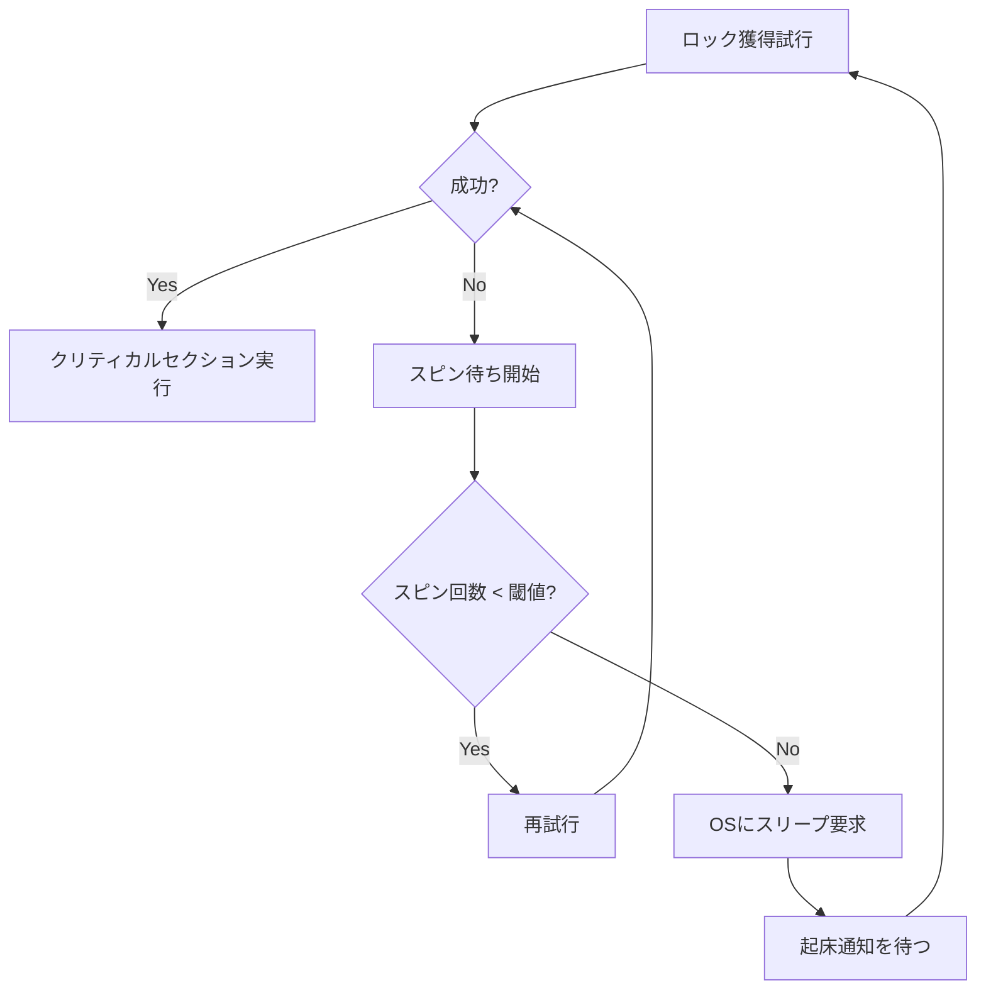

## 2. 基本原理 — アトミック命令とスピンロック

### 2.1 Test-and-Set（TAS）

**Test-and-Set（TAS）** は、最も原始的なアトミック命令の一つである。メモリ上の値を読み取ると同時に、その位置に `1`（あるいは `true`）を書き込む。この読み取りと書き込みは不可分（atomic）に実行されるため、複数のプロセッサが同時にTASを実行しても、そのうちの1つだけが元の値 `0`（`false`）を読み取ることが保証される。

```c
// hardware-level atomic operation (conceptual)
bool test_and_set(bool *target) {
    bool old = *target;
    *target = true;
    return old;  // returns the previous value
}
```

x86アーキテクチャでは、`XCHG` 命令（暗黙的にLOCKプレフィックスを持つ）や `LOCK BTS`（Bit Test and Set）命令がTASに対応する。ARM では `LDXR` / `STXR`（Load-Exclusive / Store-Exclusive）のペアで実装される。

### 2.2 Compare-and-Swap（CAS）

**Compare-and-Swap（CAS）** は、TAS よりも汎用的なアトミック命令である。メモリ上の値が期待値（expected）と一致する場合にのみ、新しい値（desired）に更新する。一致しない場合は何もしない。操作が成功したかどうかを返す。

```c
// hardware-level atomic operation (conceptual)
bool compare_and_swap(int *target, int expected, int desired) {
    if (*target == expected) {
        *target = desired;
        return true;   // success
    }
    return false;       // failure
}
```

x86 では `LOCK CMPXCHG` 命令、ARM では `LDXR` / `STXR` のペアを用いた CAS ループとして実装される。CAS は TAS よりも柔軟であり、ロックだけでなくロックフリーデータ構造の構築にも広く使われる。

### 2.3 メモリバリアとの関係

アトミック命令だけでは正しいスピンロックを構築するには不十分な場合がある。現代のCPUはアウトオブオーダー実行やストアバッファを持ち、メモリ操作の順序を入れ替えることがある。スピンロックの正しさを保証するためには、ロック獲得時とロック解放時に適切な**メモリバリア（Memory Barrier / Memory Fence）**が必要である。

- **ロック獲得時**: クリティカルセクション内のメモリ操作が、ロック獲得の前に実行されてしまうことを防ぐ **acquire バリア**が必要
- **ロック解放時**: クリティカルセクション内のメモリ操作が、ロック解放の後に実行されてしまうことを防ぐ **release バリア**が必要

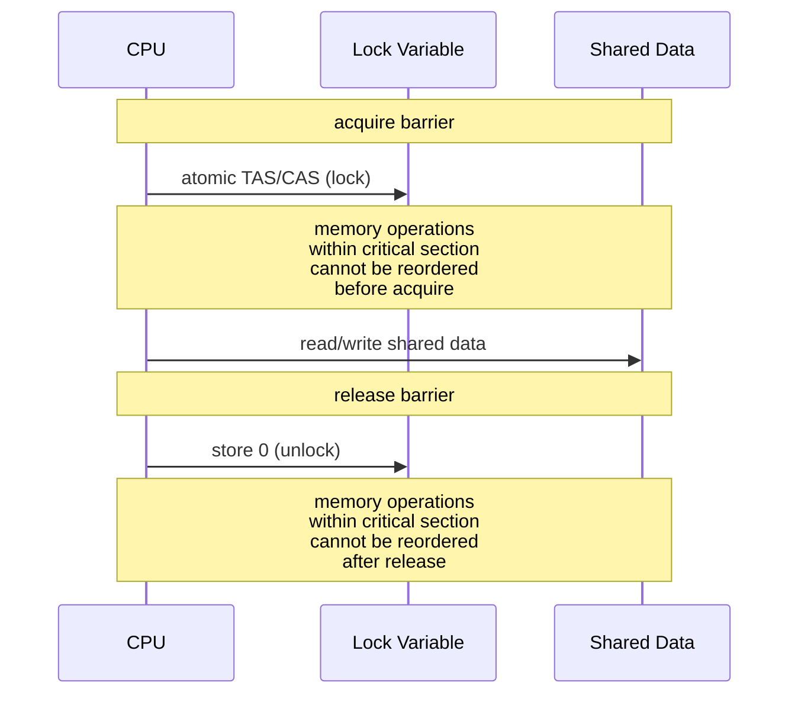

C11 / C++11 のメモリモデルでは、`memory_order_acquire` と `memory_order_release` がこれらのバリアに対応する。x86 はハードウェアレベルで比較的強いメモリモデル（TSO: Total Store Order）を持つため、多くの場合 acquire / release バリアは暗黙的に満たされるが、ARM や RISC-V のような弱いメモリモデルのアーキテクチャでは明示的なバリア命令が必要となる。

## 3. スピンロックの種類

### 3.1 TAS ロック（Test-and-Set Lock）

最も単純なスピンロック実装は、TAS 命令をループで繰り返す方式である。

```c
typedef struct {
    atomic_bool locked;
} tas_lock_t;

void lock(tas_lock_t *lock) {
    // spin until we successfully set locked from false to true
    while (atomic_exchange_explicit(&lock->locked, true, memory_order_acquire)) {
        // busy wait
    }
}

void unlock(tas_lock_t *lock) {
    atomic_store_explicit(&lock->locked, false, memory_order_release);
}
```

TAS ロックは実装が極めて単純だが、致命的な性能問題を抱えている。スピン中のすべてのスレッドが毎回 `atomic_exchange`（書き込みを伴うアトミック操作）を発行するため、ロック変数を含む**キャッシュラインが常に無効化**される。これがキャッシュコヒーレンスプロトコル上で大量のトラフィックを発生させ、**キャッシュラインバウンシング**と呼ばれる現象を引き起こす。

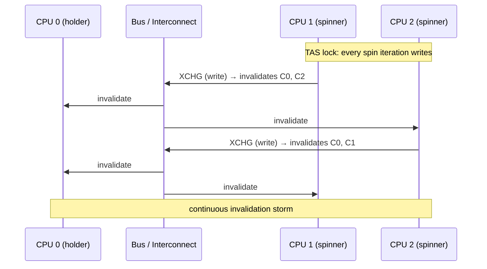

### 3.2 TTAS ロック（Test-and-Test-and-Set Lock）

TAS ロックの問題を改善するために考案されたのが **TTAS（Test-and-Test-and-Set）ロック** である。まずロック変数を**通常の読み取り（read）**で確認し、ロックが解放されているように見える場合にのみ TAS を発行する。

```c
void lock(ttas_lock_t *lock) {
    while (true) {
        // first test: read-only spin (no bus traffic when cached)
        while (atomic_load_explicit(&lock->locked, memory_order_relaxed)) {
            // spin on local cache — no coherence traffic
        }
        // second test: attempt to acquire
        if (!atomic_exchange_explicit(&lock->locked, true, memory_order_acquire)) {
            return;  // successfully acquired
        }
    }
}
```

TTAS ロックが TAS ロックより優れている理由は、**ローカルキャッシュでのスピン**にある。通常の読み取り操作（`atomic_load` with `relaxed`）は、キャッシュラインが Shared 状態であればバスにトラフィックを発生させない。各 CPU は自身の L1 キャッシュにあるコピーを読み取るだけであり、キャッシュコヒーレンスプロトコルの介入は不要である。

ロック保持者がロックを解放して `locked` を `false` に書き戻したとき、初めてキャッシュラインの無効化が発生する。この時点で全スピナーのキャッシュラインが無効化され、各スピナーはキャッシュミスを起こして最新の値を読み取る。`false` を読み取ったスピナーは TAS を試みるが、成功するのは1つだけであり、残りは再び読み取りループに戻る。

しかし TTAS にも問題がある。ロック解放時に**全スピナーが一斉に TAS を発行**するため、瞬間的にバストラフィックが急増する（**Thundering Herd 問題**）。この問題への対策が、次節で説明するバックオフ戦略である。

### 3.3 チケットロック（Ticket Lock）

TAS / TTAS ロックには**公平性（fairness）**の問題がある。ロックが解放されたとき、どのスピナーが次にロックを獲得するかは非決定的であり、特定のスレッドが長時間にわたってロックを獲得できない**飢餓（starvation）**が起こりうる。

**チケットロック**は、この公平性の問題を解決するために設計された。パン屋の順番待ちシステムと同じ原理で動作する。ロックは2つのカウンタを持つ。

- `ticket`: 次に発行する番号（来店客が取る整理券）
- `serving`: 現在サービス中の番号（掲示板に表示される番号）

```c
typedef struct {
    atomic_uint ticket;
    atomic_uint serving;
} ticket_lock_t;

void lock(ticket_lock_t *lock) {
    // take a ticket (atomic increment)
    unsigned my_ticket = atomic_fetch_add_explicit(
        &lock->ticket, 1, memory_order_relaxed);
    // spin until our ticket is being served
    while (atomic_load_explicit(&lock->serving, memory_order_acquire)
           != my_ticket) {
        // busy wait
    }
}

void unlock(ticket_lock_t *lock) {
    // serve the next ticket
    atomic_fetch_add_explicit(&lock->serving, 1, memory_order_release);
}
```

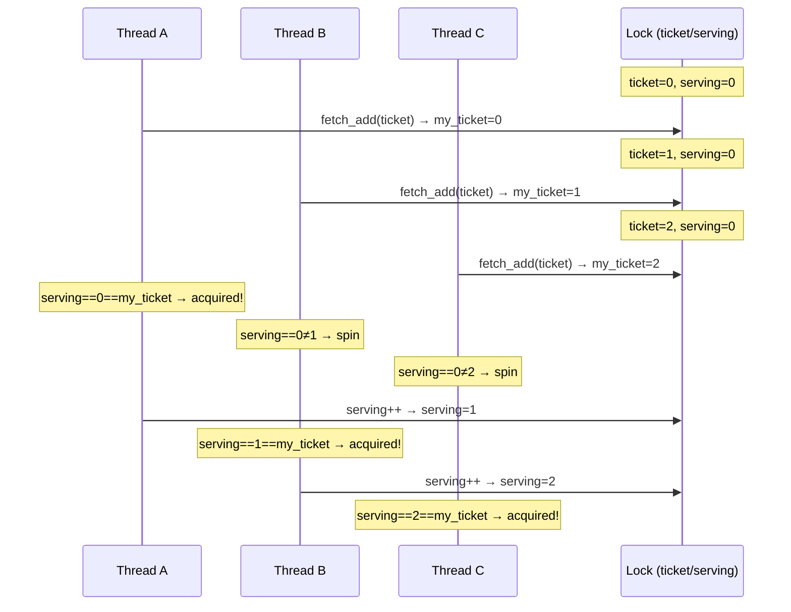

チケットロックは**FIFO（先入先出）の公平性**を保証する。ロックを先に要求したスレッドが先にロックを獲得できる。しかし、すべてのスレッドが同じ `serving` 変数をスピンするため、`serving` が更新されるたびに全スレッドのキャッシュラインが無効化される問題（チケットロック固有の Thundering Herd）は残る。

### 3.4 MCS ロック（Mellor-Crummey and Scott Lock）

**MCS ロック**（1991年、John Mellor-Crummey と Michael Scott が考案）は、スピンロックの性能とスケーラビリティを大幅に改善した画期的なアルゴリズムである。MCS ロックの核となるアイデアは、各スレッドが**自分専用のフラグ変数（ノード）上でスピン**することにある。

```c
typedef struct mcs_node {
    atomic_bool locked;       // true if this thread should spin
    struct mcs_node *volatile next;
} mcs_node_t;

typedef struct {
    mcs_node_t *volatile tail;
} mcs_lock_t;

void lock(mcs_lock_t *lock, mcs_node_t *node) {
    node->next = NULL;
    node->locked = true;

    // atomically append our node to the tail of the queue
    mcs_node_t *prev = atomic_exchange(&lock->tail, node);

    if (prev != NULL) {
        // queue was non-empty; link ourselves and spin on our own flag
        prev->next = node;
        while (atomic_load_explicit(&node->locked, memory_order_acquire)) {
            // spin on local variable — no shared cache line contention
        }
    }
}

void unlock(mcs_lock_t *lock, mcs_node_t *node) {
    if (node->next == NULL) {
        // try to set tail to NULL (we might be the last one)
        mcs_node_t *expected = node;
        if (atomic_compare_exchange_strong(&lock->tail, &expected, NULL)) {
            return;  // no one was waiting
        }
        // someone is in the process of enqueuing; wait for them
        while (node->next == NULL) {
            // brief spin
        }
    }
    // notify the next thread
    atomic_store_explicit(&node->next->locked, false, memory_order_release);
}
```

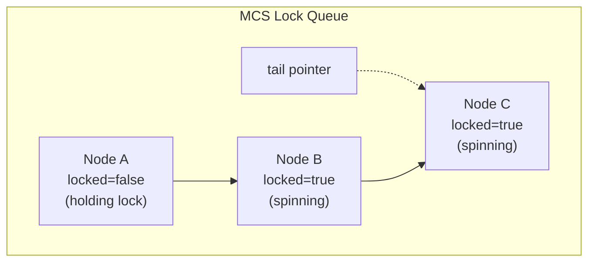

MCS ロックの利点は以下の通りである。

1. **ローカルスピン**: 各スレッドは自分のノードの `locked` フラグ上でスピンするため、キャッシュラインバウンシングが発生しない。NUMA 環境ではノードをローカルメモリに配置することで、リモートメモリアクセスも回避できる。
2. **FIFO 公平性**: キューの先頭から順にロックが渡されるため、飢餓が発生しない。
3. **O(1) のバストラフィック**: ロック解放時に通知されるのはキューの次のスレッド1つだけであり、全スレッドが一斉に起きる Thundering Herd 問題が起きない。

### 3.5 CLH ロック（Craig, Landin, and Hagersten Lock）

**CLH ロック**（1993年、Travis Craig、1994年に Anders Landin と Seif Haridi が独立に考案）は、MCS ロックと同様にキューベースだが、**前のノードの変数上でスピン**する点が異なる。

```c
typedef struct clh_node {
    atomic_bool locked;  // true means "I am holding or waiting for the lock"
} clh_node_t;

typedef struct {
    clh_node_t *volatile tail;
} clh_lock_t;

void lock(clh_lock_t *lock, clh_node_t **node_ptr) {
    clh_node_t *node = *node_ptr;
    node->locked = true;

    // atomically swap our node into the tail
    clh_node_t *prev = atomic_exchange(&lock->tail, node);

    // spin on predecessor's flag
    while (atomic_load_explicit(&prev->locked, memory_order_acquire)) {
        // busy wait
    }

    // save predecessor node for reuse on unlock
    *node_ptr = prev;
}

void unlock(clh_lock_t *lock, clh_node_t **node_ptr) {
    clh_node_t *node = *node_ptr;
    // notify the next waiter by clearing our flag
    atomic_store_explicit(&node->locked, false, memory_order_release);
}
```

CLH ロックは MCS ロックと比較して以下の特徴がある。

- **ポインタ追跡が不要**: MCS ロックでは `next` ポインタの設定にタイミング問題があるが、CLH ロックでは前任者のフラグを直接観察するだけでよい。
- **NUMA での不利**: CLH ロックでは前任者のノード上でスピンするため、NUMA 環境では前任者のノードがリモートメモリに存在する可能性がある。MCS ロックでは自分のノード上でスピンするため、ノードをローカルメモリに配置すればこの問題を回避できる。

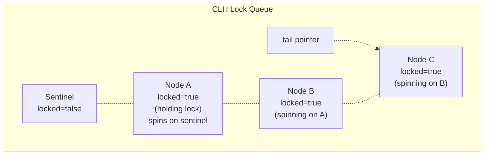

### 3.6 各スピンロックの比較

| アルゴリズム | 公平性 | スピン方式 | ロック解放時トラフィック | NUMA適性 | 空間 |
|---|---|---|---|---|---|
| TAS | なし | グローバル（書き込み） | O(N) | 低 | O(1) |
| TTAS | なし | グローバル（読み取り） | O(N) | 低 | O(1) |
| チケット | FIFO | グローバル（読み取り） | O(N) | 低 | O(1) |
| MCS | FIFO | ローカル | O(1) | 高 | O(N) |
| CLH | FIFO | 前任者ローカル | O(1) | 中 | O(N) |

ここで N はスピン待ち中のスレッド数を表す。

## 4. バックオフ戦略

TTAS ロックに代表されるスピンロックでは、ロック獲得の再試行頻度を制御する**バックオフ（backoff）戦略**が性能に大きく影響する。バックオフとは、ロック獲得の失敗後に意図的に待機時間を設けてから再試行することで、バス上の競合を緩和する手法である。

### 4.1 バックオフなし（即時再試行）

バックオフを行わない場合、ロック獲得に失敗したスレッドは直ちに再試行する。これは最もシンプルだが、高競合下では全スレッドが一斉にアトミック操作を発行し続けるため、バスが飽和してスループットが急激に低下する。

### 4.2 固定バックオフ

最もシンプルなバックオフ戦略は、獲得失敗のたびに**一定の遅延**を入れてから再試行する方式である。

```c
void lock_with_fixed_backoff(ttas_lock_t *lock) {
    while (true) {
        while (atomic_load_explicit(&lock->locked, memory_order_relaxed)) {
            // spin on local cache
        }
        if (!atomic_exchange_explicit(&lock->locked, true, memory_order_acquire)) {
            return;
        }
        // fixed delay before retry
        for (volatile int i = 0; i < FIXED_DELAY; i++) {
            // do nothing — just waste time
        }
    }
}
```

固定バックオフは実装が簡単だが、最適な遅延時間がワークロードやスレッド数に依存するという問題がある。遅延が短すぎると競合を十分に緩和できず、長すぎるとロックが解放されてから獲得するまでの反応が遅れる。

### 4.3 指数バックオフ（Exponential Backoff）

**指数バックオフ**は、獲得失敗のたびに待機時間を**倍増**させる戦略である。ネットワークプロトコル（Ethernet の CSMA/CD、TCP の再送制御）でも広く使われる手法であり、スピンロックにも効果的に適用できる。

```c
void lock_with_exponential_backoff(ttas_lock_t *lock) {
    int delay = MIN_DELAY;
    while (true) {
        while (atomic_load_explicit(&lock->locked, memory_order_relaxed)) {
            // spin on local cache
        }
        if (!atomic_exchange_explicit(&lock->locked, true, memory_order_acquire)) {
            return;
        }
        // exponential backoff with cap
        for (volatile int i = 0; i < delay; i++) {
            // do nothing
        }
        delay = (delay * 2 < MAX_DELAY) ? delay * 2 : MAX_DELAY;
    }
}
```

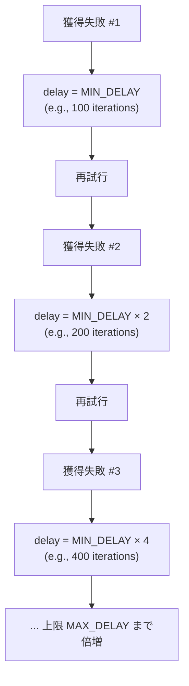

指数バックオフの利点は以下の通りである。

1. **適応性**: 競合が軽い場合は初期の短い遅延で済み、競合が激しい場合は遅延が自動的に増大してバスの負荷を下げる。
2. **安定性**: 上限（MAX_DELAY）を設けることで、遅延が際限なく増大することを防ぐ。

ただし、指数バックオフにはいくつかの欠点もある。

- **公平性の欠如**: 遅延が大きくなったスレッドは、新しく到着したスレッド（遅延が小さい）に先を越されやすい。
- **パラメータのチューニング**: `MIN_DELAY`、`MAX_DELAY` の最適値はハードウェアやワークロードに依存し、一般的な値を決めにくい。

### 4.4 ランダムバックオフ

遅延時間に**ランダム性**を導入する戦略である。指数バックオフと組み合わせて、`[0, delay)` の範囲からランダムに遅延時間を選択するのが一般的である。

```c
void lock_with_random_backoff(ttas_lock_t *lock) {
    int delay = MIN_DELAY;
    while (true) {
        while (atomic_load_explicit(&lock->locked, memory_order_relaxed)) {
            // spin on local cache
        }
        if (!atomic_exchange_explicit(&lock->locked, true, memory_order_acquire)) {
            return;
        }
        // randomized exponential backoff
        int actual_delay = rand() % delay;
        for (volatile int i = 0; i < actual_delay; i++) {
            // do nothing
        }
        delay = (delay * 2 < MAX_DELAY) ? delay * 2 : MAX_DELAY;
    }
}
```

ランダム性の導入により、複数のスレッドが同じタイミングで再試行する**同期現象（synchronization effect）**を軽減できる。指数バックオフのみの場合、同時に失敗したスレッドが同じ遅延で同時に再試行し続ける可能性があるが、ランダム性によりこの問題が緩和される。

### 4.5 プロポーショナルバックオフ

**プロポーショナルバックオフ**は、スピン中に観測されるロック変数の変化頻度やCPU数に基づいて、遅延を動的に調整する戦略である。たとえば、チケットロックでは自分のチケット番号と現在のサービス番号の差に比例した遅延を設定できる。

```c
void lock_proportional_backoff(ticket_lock_t *lock) {
    unsigned my_ticket = atomic_fetch_add(&lock->ticket, 1);
    while (true) {
        unsigned current = atomic_load(&lock->serving);
        if (current == my_ticket) {
            return;  // our turn
        }
        // delay proportional to distance from head of queue
        unsigned distance = my_ticket - current;
        for (volatile unsigned i = 0; i < distance * PROPORTIONAL_FACTOR; i++) {
            // do nothing
        }
    }
}
```

自分の順番が遠いほど長く待ち、近づくほど頻繁にチェックするため、バスの負荷を効果的に分散しつつ、反応時間も適切に保てる。

### 4.6 pause / yield 命令の活用

現代のCPUは、スピンループを効率化するための専用命令を提供している。

- **x86 `PAUSE` 命令**: スピンループ内に配置することで、パイプラインのフラッシュペナルティを回避し、消費電力を削減し、ハイパースレッディング環境で他の論理コアにリソースを譲る効果がある。Intel は Spin-Wait Loop に `PAUSE` を挿入することを推奨している。
- **ARM `WFE`（Wait For Event）命令**: CPUを低電力状態にし、他のコアから `SEV`（Send Event）が発行されるまで待機する。スピンロックのエネルギー効率を大幅に改善する。
- **ARM `YIELD` 命令**: 現在のスレッドがスピン待ちしていることをハードウェアにヒントとして伝える。

```c
void lock_with_pause(ttas_lock_t *lock) {
    while (true) {
        while (atomic_load_explicit(&lock->locked, memory_order_relaxed)) {
            #if defined(__x86_64__)
            __builtin_ia32_pause();  // x86 PAUSE instruction
            #elif defined(__aarch64__)
            asm volatile("yield");   // ARM YIELD instruction
            #endif
        }
        if (!atomic_exchange_explicit(&lock->locked, true, memory_order_acquire)) {
            return;
        }
    }
}
```

## 5. キャッシュコヒーレンスへの影響

### 5.1 MESI プロトコルとスピンロック

現代のマルチプロセッサシステムでは、**MESI プロトコル**（Modified, Exclusive, Shared, Invalid）やその拡張（MOESI, MESIF）が、各CPUキャッシュ間のデータ整合性を維持する。スピンロックの性能は、このコヒーレンスプロトコルの動作と密接に関係する。

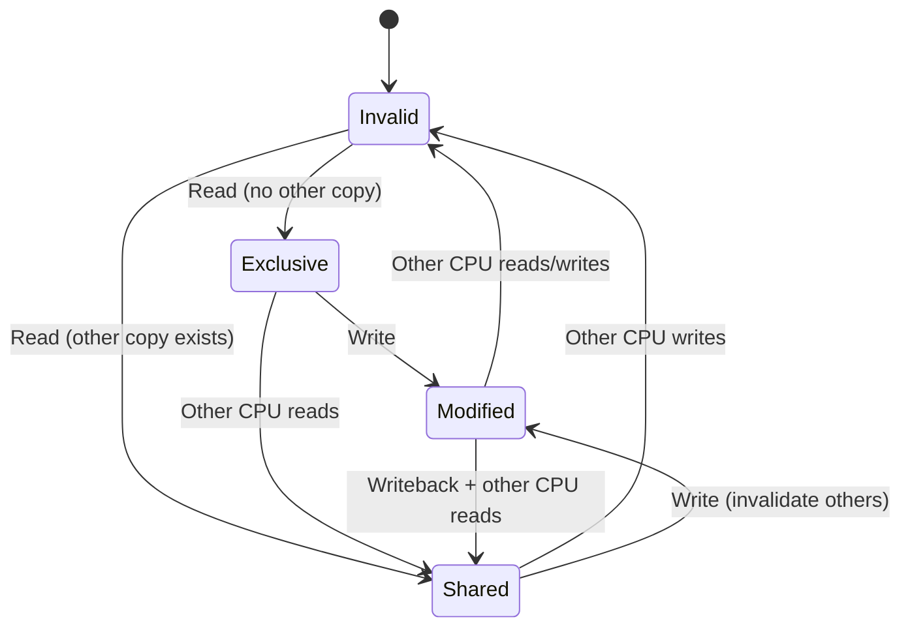

TAS ロックの場合、スピン中の各CPUが毎反復で `XCHG`（書き込みを伴うアトミック操作）を実行する。書き込み操作は、他のすべてのCPUのキャッシュライン上で Shared → Invalid の遷移を引き起こす。無効化されたCPUは次のイテレーションで再びキャッシュミスが発生し、バスからデータを再取得する必要がある。N個のCPUがスピンしている場合、1回のイテレーションで O(N) の無効化メッセージがバス上を流れ、バスが飽和する。

TTAS ロックでは、スピン中は読み取り操作のみを行うため、各CPUのキャッシュラインは Shared 状態を維持できる。Shared 状態での読み取りはバスにトラフィックを発生させない。ただし、ロック解放時の書き込みで一斉に無効化が発生し、全スピナーがキャッシュミスを起こすのは TAS と同じである。

### 5.2 キャッシュラインバウンシング

**キャッシュラインバウンシング**とは、同一のキャッシュラインが複数のCPU間で頻繁に転送される現象である。スピンロックにおいてこの問題が深刻化するのは、以下の場合である。

1. **TAS ロック**: すべてのスピナーが書き込みを行うため、キャッシュラインが常に各CPU間を往復する。
2. **ロック解放時の Thundering Herd**: TTAS やチケットロックで、ロック変数の更新が全スピナーのキャッシュラインを無効化する。
3. **偽共有（False Sharing）**: ロック変数と無関係なデータが同一キャッシュライン（通常64バイト）上に配置されている場合、ロックへのアクセスが無関係なデータのキャッシュミスを誘発する。

偽共有を回避するためには、ロック変数をキャッシュラインの境界にアラインメントし、パディングを挿入する。

```c
typedef struct {
    atomic_bool locked;
    char padding[63];  // ensure lock occupies its own cache line
} __attribute__((aligned(64))) padded_lock_t;
```

### 5.3 NUMA 環境での考慮事項

**NUMA（Non-Uniform Memory Access）** アーキテクチャでは、メモリアクセスのレイテンシがアクセス元のCPUとメモリの物理的な位置関係によって異なる。NUMAノード内のローカルメモリへのアクセスは高速だが、他のノードのリモートメモリへのアクセスには数倍のレイテンシがかかる。

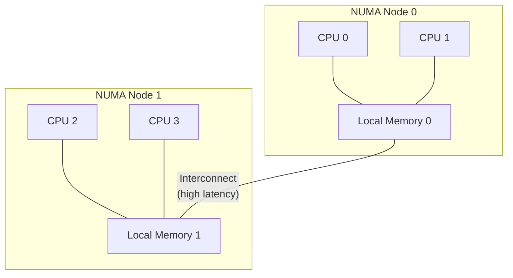

NUMA 環境でのスピンロック設計で考慮すべき点は以下の通りである。

**ローカルスピンの重要性**: グローバル変数上でスピンするアルゴリズム（TAS, TTAS, チケットロック）は、ロック変数がどのNUMAノードのメモリに配置されているかに関わらず、リモートノードのCPUはリモートメモリアクセスを繰り返すことになる。MCSロックは各スレッドが自分のノード上でスピンするため、ノードをローカルメモリに配置すればリモートアクセスを完全に回避できる。

**NUMA-aware ロック**: より高度なアプローチとして、**NUMA-aware ロック**が研究されている。代表的なものに以下がある。

- **階層的ロック（Hierarchical Lock）**: NUMAノード単位でローカルロックを持ち、ノード内のスレッド間ではローカルロックで競合を解決する。ノード間の競合はグローバルロックで調停する。ロックの引き渡しを同一ノード内で優先することで、リモートアクセスを減らす。
- **HCLH ロック（Hierarchical CLH）**: CLHロックを階層化し、ローカルキューとグローバルキューを持つ。

ただし、NUMA-aware ロックは同一ノード内のスレッドを優先するため、ノード間の**公平性が低下する**というトレードオフがある。

## 6. 実装上の考慮事項

### 6.1 プリエンプション問題

スピンロックにおける最も危険な問題の一つが、**ロック保持中のプリエンプション**である。スピンロックを保持しているスレッドがOSのスケジューラによって実行を中断（プリエンプト）されると、他のスレッドはロック解放を待ってスピンし続けるが、ロック保持者は再スケジュールされるまでロックを解放できない。

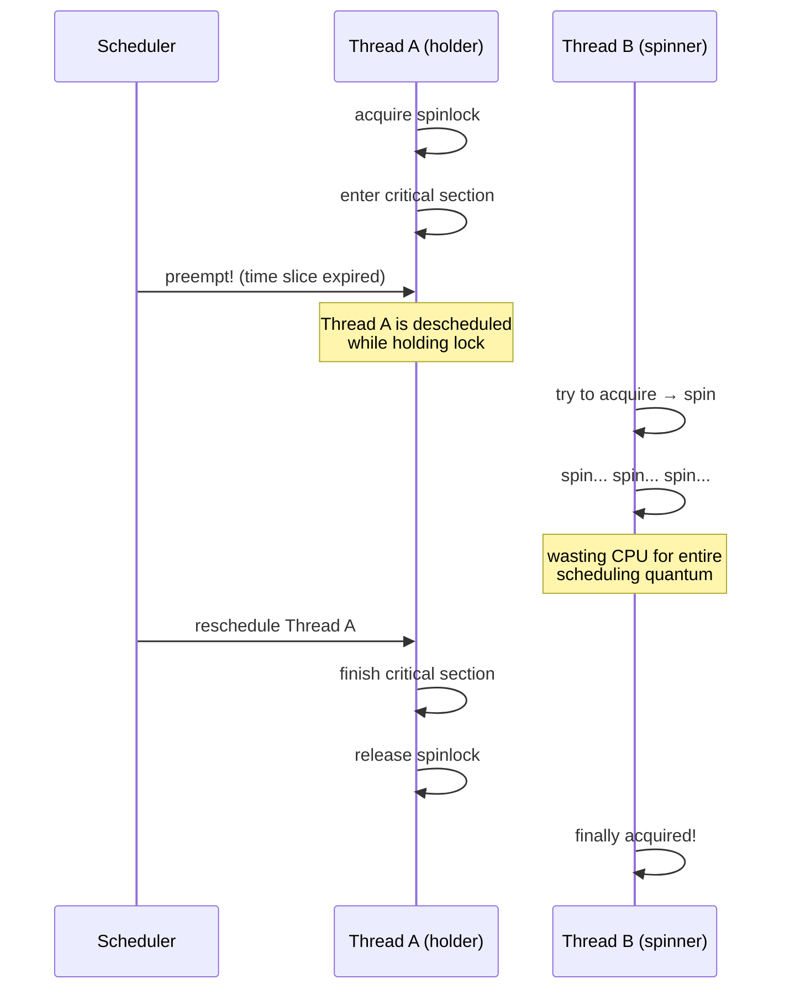

ユーザ空間のスレッドの場合、この問題は深刻である。OSはスピンロックの存在を認識していないため、ロック保持者をプリエンプトすることを躊躇しない。このため、ユーザ空間でのスピンロック使用は一般に推奨されず、カーネル内での使用が主となる。

### 6.2 割り込み禁止

カーネル内でスピンロックを使用する際は、**割り込みの制御**が必要となる。スピンロックを保持しているCPU上で割り込みが発生し、割り込みハンドラが同じスピンロックを取得しようとすると、**デッドロック**に陥る。割り込みハンドラはスピンするが、ロック保持者（割り込まれたコンテキスト）は割り込みハンドラが完了するまで再開できないためである。

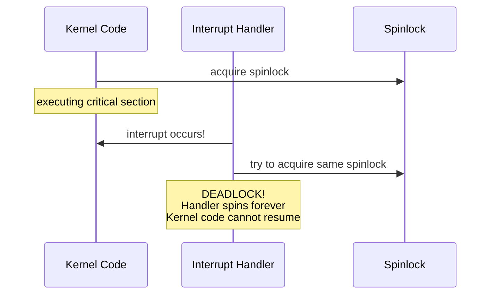

この問題を防ぐため、Linuxカーネルでは以下のAPIが提供されている。

- `spin_lock_irq()` / `spin_unlock_irq()`: ローカルCPUの割り込みを無効化してからロックを取得する。割り込みハンドラとの競合がある場合に使用する。
- `spin_lock_irqsave()` / `spin_unlock_irqrestore()`: 割り込みの有効/無効状態を保存・復元する。入れ子のロック取得に安全に対応する。
- `spin_lock_bh()` / `spin_unlock_bh()`: ソフト割り込み（Bottom Half）のみを無効化する。ハード割り込みとの競合がなく、ソフト割り込みとの競合のみがある場合に使用する。

```c
// Linux kernel spinlock usage example
spinlock_t my_lock;
unsigned long flags;

// safe against interrupts
spin_lock_irqsave(&my_lock, flags);
// critical section — interrupts disabled on this CPU
do_something_critical();
spin_unlock_irqrestore(&my_lock, flags);
```

### 6.3 ロック保持時間の制約

スピンロックのクリティカルセクション内では、以下の操作を行ってはならない。

1. **スリープ（sleep）**: `schedule()`, `msleep()`, `wait_event()` などの呼び出しは禁止。スリープするとCPUが他のタスクに渡り、ロック保持者がいつ再開されるかわからなくなる。
2. **ページフォルトを引き起こすメモリアクセス**: ユーザ空間メモリの直接アクセスなど。ページフォルトハンドラ内でスリープが発生する可能性がある。
3. **大量のメモリ確保**: `GFP_KERNEL` フラグでのメモリ確保は、メモリ不足時にスリープを伴う可能性がある。`GFP_ATOMIC` を使用する必要がある。

これらの制約は、スピンロックの保持時間を最小限に抑えることを強く促す設計上の圧力となっている。

### 6.4 リエントラント性とデッドロック

スピンロックは一般に**リエントラント（再入可能）ではない**。同じCPU（あるいは同じスレッド）がすでに保持しているスピンロックを再度取得しようとすると、デッドロックに陥る。

複数のスピンロックを使用する場合は、**ロック順序（lock ordering）**を統一して守ることでデッドロックを防ぐ必要がある。Linuxカーネルでは `lockdep`（Lock Dependency Validator）がロック順序の違反を検出するツールとして提供されている。

## 7. Linux カーネルでの実装

### 7.1 歴史的な変遷

Linuxカーネルのスピンロック実装は、カーネルの進化に伴って大きく変遷してきた。

1. **初期（〜2.6.24）**: TAS ベースの単純なスピンロック。公平性の保証がなく、高負荷環境で飢餓が発生する問題があった。
2. **チケットロック（2.6.25, 2008年〜）**: Nick Piggin によるパッチで TAS からチケットロックに移行。FIFO公平性が保証され、飢餓問題が解決された。
3. **qspinlock（4.2, 2015年〜）**: Waiman Long らによる MCS ベースのキュースピンロック。スケーラビリティが大幅に向上し、NUMA 環境での性能が改善された。

### 7.2 qspinlock の設計

現在の Linux カーネル（5.x / 6.x）で使用される **qspinlock** は、チケットロックの公平性と MCS ロックのスケーラビリティを両立させた、精巧な設計のスピンロックである。

qspinlock は、わずか**4バイト（32ビット）**のロック変数に、以下の情報を詰め込む。

```
Bit layout (simplified):
[31:18] - MCS tail index (CPU number + 1, context)
[17:16] - MCS tail count
   [8]  - pending bit
 [7:0]  - locked byte
```

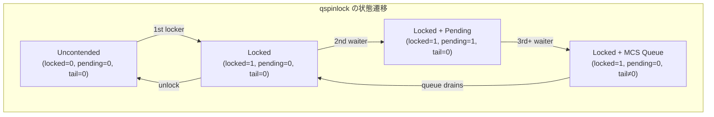

qspinlock の動作は、競合レベルに応じて3段階に分かれる。

**非競合パス（Fast Path）**: ロックが空いている場合、単純な CAS で `locked` バイトを 0 から 1 に設定するだけである。これは最も一般的なケースであり、最小のオーバーヘッドで完了する。

**中競合パス（Pending Bit）**: 1つのスレッドが待機中の場合、MCS キューを構築せずに `pending` ビットを設定し、`locked` バイトが 0 になるのをスピンで待つ。MCS ノードの初期化コストを回避する最適化である。

**高競合パス（MCS Queue）**: 2つ以上のスレッドが待機する場合、MCS キューが構築される。各スレッドは per-CPU 変数として確保されたMCSノードを使用し、ローカルスピンを行う。キューの先頭のスレッドだけが `locked` バイトをスピンし、ロックを獲得したらMCSキューから外れる。

```c
// simplified qspinlock structure (Linux kernel)
typedef struct qspinlock {
    union {
        atomic_t val;
        struct {
            u8 locked;
            u8 pending;
        };
        struct {
            u16 locked_pending;
            u16 tail;
        };
    };
} arch_spinlock_t;
```

### 7.3 PV（Paravirtual）スピンロック

仮想化環境では、物理CPUの数がゲストOSが認識するvCPUの数より少ないことがある。この環境でスピンロックのホルダーが**vCPUのプリエンプション**（ホストスケジューラによるvCPUの一時停止）を受けると、他のvCPU上のスピナーが無駄にスピンし続ける **Lock Holder Preemption（LHP）問題** が発生する。

Linux の qspinlock は、準仮想化（paravirtualization）をサポートする **PV qspinlock** 拡張を備えている。PV qspinlock では、スピンの回数が閾値を超えると、スピナーはハイパーバイザに対して自発的に vCPU の実行権を返す（`HALT`）。ロックが解放された際には、ハイパーバイザが待機中の vCPU を起こす（`KICK`）。

### 7.4 Read-Write スピンロック

Linux カーネルは、通常のスピンロックに加えて**Read-Write スピンロック**（`rwlock_t`）も提供する。読み取り操作の並行実行を許可しつつ、書き込み操作の排他性を保証する。

```c
rwlock_t my_rwlock;

// reader
read_lock(&my_rwlock);
read_data();
read_unlock(&my_rwlock);

// writer
write_lock(&my_rwlock);
write_data();
write_unlock(&my_rwlock);
```

ただし、RW スピンロックは書き込み側が飢餓に陥りやすいという問題があり、Linux カーネルでは多くの場面で **`rcu_read_lock()`** （Read-Copy-Update）に置き換えられてきている。RCU は読み取り側のオーバーヘッドがほぼゼロであり、読み取りが支配的なワークロードでRWスピンロックよりも大幅に優れる。

## 8. 実世界での評価

### 8.1 スループット特性

スピンロックのスループットは、スレッド数とクリティカルセクションの長さに大きく依存する。典型的なベンチマーク結果は以下のような傾向を示す。

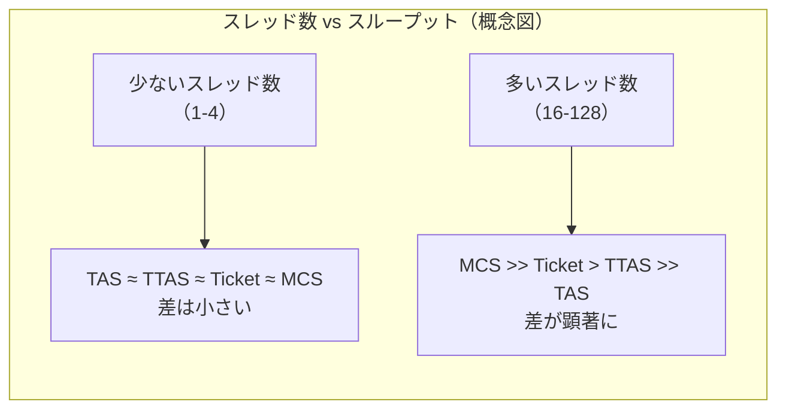

低競合環境（スレッド数がCPU数以下、クリティカルセクションが短い）では、どのアルゴリズムも同程度の性能を示す。この条件下ではロックの競合がほとんど発生しないため、アルゴリズムの違いが表面化しにくい。

高競合環境（スレッド数がCPU数を大幅に超える、または多数のスレッドが同じロックに集中する）では、アルゴリズム間の差が顕著になる。TAS は急速にスループットが低下し、TTAS はバックオフにより若干改善するが、MCS / CLH がスレッド数の増加に対して最も安定したスケーラビリティを示す。

### 8.2 レイテンシ特性

スピンロックの**非競合時のレイテンシ**（ロックの獲得と解放にかかる時間、競合がない場合）は、アルゴリズムによって異なる。

- **TAS / TTAS**: 1回のアトミック操作とストアで完了。最小レイテンシは約10〜20ns（x86）。
- **チケットロック**: `fetch_add` と `load` で完了。TAS とほぼ同等。
- **MCS**: ノードの初期化と `exchange` が必要。非競合時でも約20〜40ns で、TAS より若干大きい。
- **qspinlock**: 非競合パスは単純な CAS のみ。TAS に近い性能。

したがって、非競合が支配的なワークロードでは、単純な TAS / TTAS が最も低いレイテンシを実現する場合がある。qspinlock はこの点を意識し、非競合パスを極力シンプルに保つ設計としている。

### 8.3 実システムでの採用例

**Linux カーネル**: qspinlock を標準のスピンロック実装として採用。カーネル内の数千箇所で使用されている。スケジューラ、メモリアロケータ、ファイルシステム、ネットワークスタックなど、あらゆるサブシステムで活用されている。

**データベース**: 多くの高性能データベース（MySQL/InnoDB, PostgreSQL, Oracle）が、バッファプール管理やラッチ（lightweight lock）としてスピンロックやアダプティブスピンを使用している。InnoDB は `innodb_spin_wait_delay` パラメータで待機戦略を調整可能にしている。

**Java Virtual Machine**: HotSpot JVM は、`synchronized` ブロックや `ReentrantLock` の内部で**アダプティブスピン**を実装している。ロックの最近の獲得履歴に基づいてスピン回数を動的に調整し、短時間で解放されるロックにはスピンで対応、長時間保持されるロックにはブロッキングに移行する。

**ネットワーク処理**: DPDK（Data Plane Development Kit）などの高性能パケット処理フレームワークでは、ポーリングベースの処理モデルと組み合わせてスピンロックが広く使用されている。ロックの保持時間が極めて短い場合に適している。

### 8.4 設計上のトレードオフと選択指針

スピンロックの選択において考慮すべきトレードオフを整理する。

| 判断基準 | スピンロック向き | ブロッキングロック向き |
|---|---|---|
| クリティカルセクション | 数十〜数百ns | 数μs以上 |
| CPU数 | マルチコア | シングルコア |
| スリープ可否 | スリープ不可 | スリープ可 |
| 競合頻度 | 低〜中 | 高 |
| レイテンシ要件 | 極めて厳しい | 許容範囲がある |

スピンロックのアルゴリズム選択については、以下が指針となる。

- **競合が稀なケース**: TAS / TTAS で十分。非競合時のオーバーヘッドが最小。
- **公平性が必要なケース**: チケットロックまたは MCS / CLH。
- **高スケーラビリティが必要なケース**: MCS ロックまたは qspinlock。
- **NUMA 環境**: MCS ロック、または NUMA-aware な階層的ロック。
- **カーネル空間**: qspinlock（Linux の場合）。非競合パスの最適化と高競合時のスケーラビリティを両立。

最終的に、スピンロックは同期プリミティブの中で最も「ハードウェアに近い」存在であり、その設計はCPUアーキテクチャ、キャッシュコヒーレンスプロトコル、メモリモデルと密接に結びついている。正しい使用には、これらの低レイヤーの知識と、ワークロード特性の深い理解が不可欠である。
