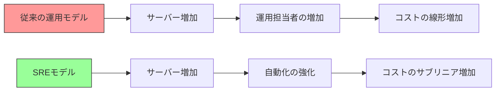
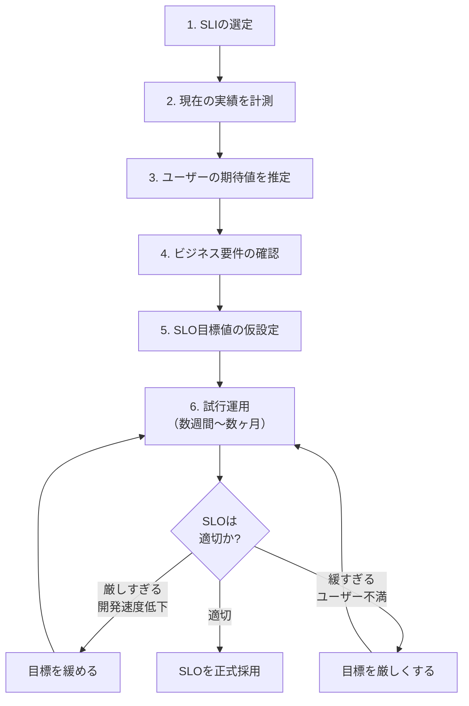
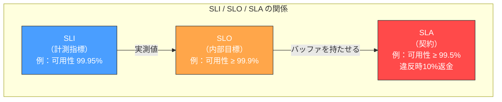
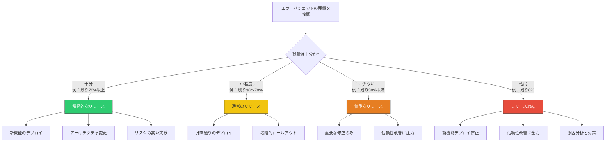
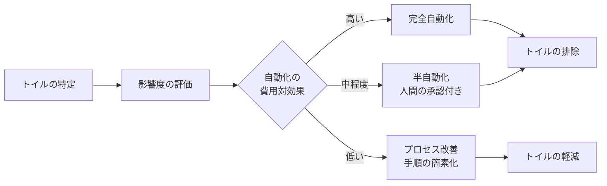
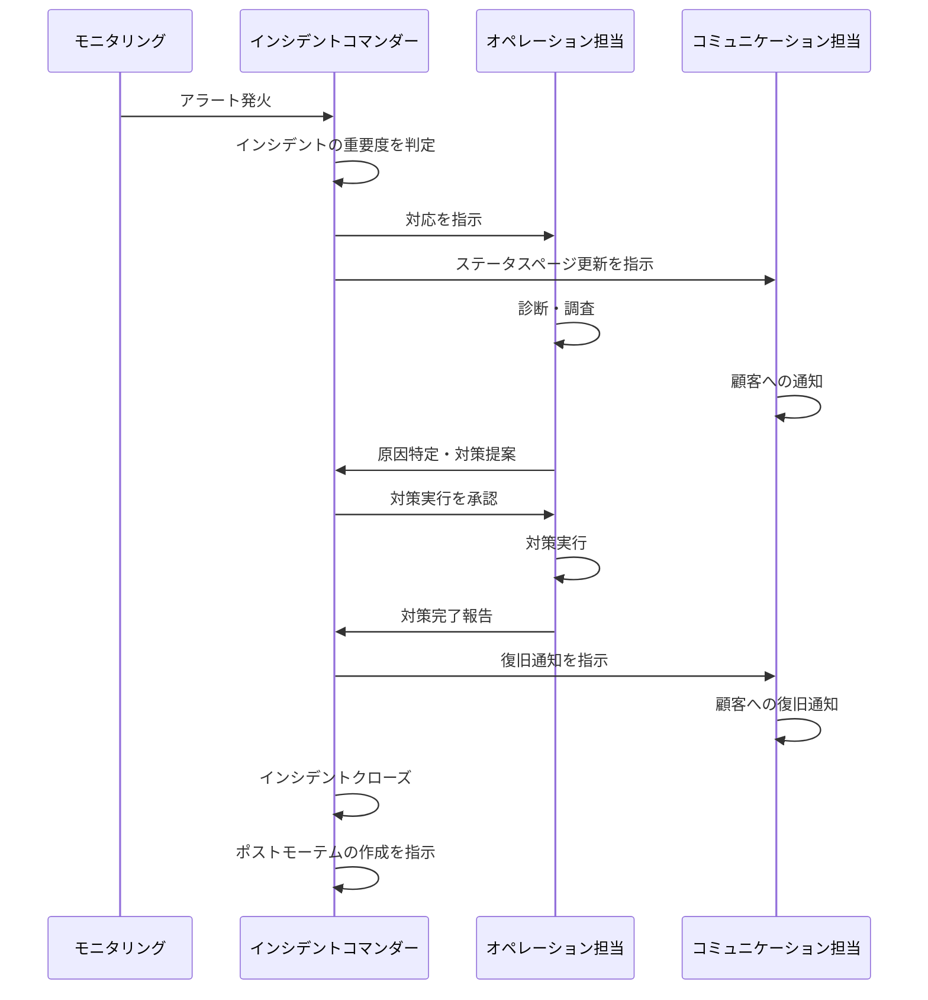
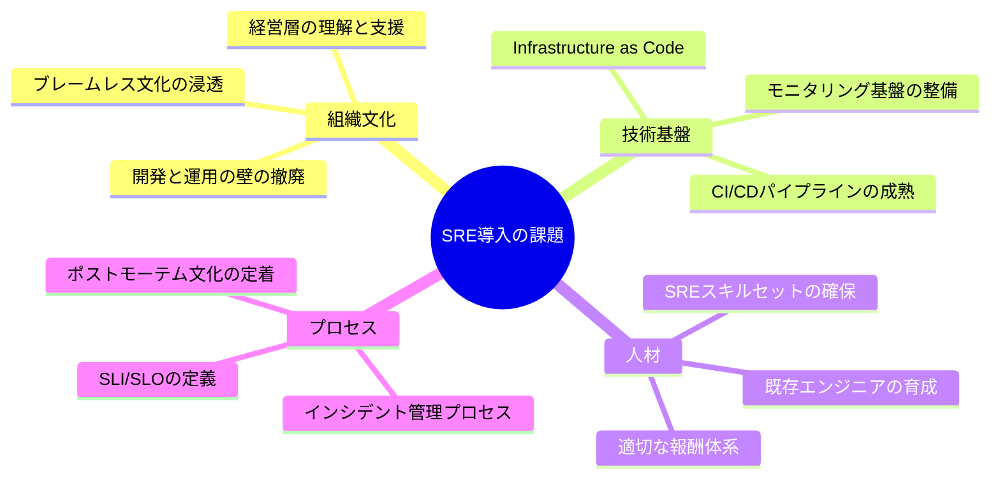
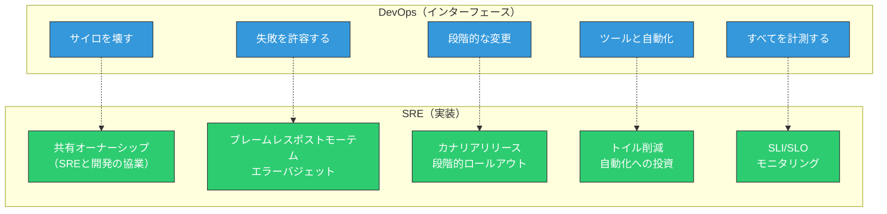
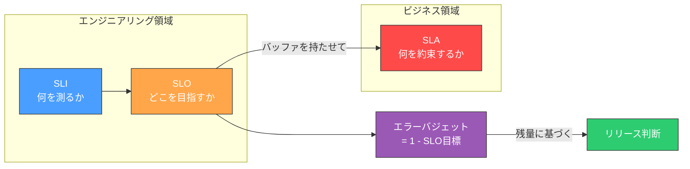

# SRE と SLI/SLO/SLA

## SREの誕生 — Googleにおける起源

### 「ソフトウェアエンジニアに運用をやらせたらどうなるか」

Site Reliability Engineering（SRE）は、2003年頃にGoogleのBen Treynorが創設したチームとその方法論に端を発する。Ben Treynor Sloss（当時のVP of Engineering）は、SREを次のように定義した。

> "SRE is what happens when you ask a software engineer to design an operations function."

この一文に、SREの本質が凝縮されている。従来の運用チーム（Operations）は、システムの安定稼働を最優先とし、変更を最小限にとどめることで信頼性を確保しようとした。一方で開発チーム（Development）は、新機能のリリースを最優先とし、できるだけ頻繁にデプロイしたいと考える。この二つの力は構造的に対立しており、組織が大きくなるほどその摩擦は深刻化する。

SREはこの対立を解消するために生まれた。ソフトウェアエンジニアリングのスキルセットを持つエンジニアが運用を担当することで、手作業を自動化し、スケーラブルな運用を実現する。SREチームは単なる「運用担当」ではなく、プロダクションシステムの信頼性をエンジニアリングの手法で向上させる専門チームである。

### Googleにおける規模の課題

Googleが直面していた課題の規模を理解することが、SREの必要性を理解する鍵となる。2000年代初頭のGoogleは既に数万台のサーバーを運用しており、手作業による運用は物理的に不可能だった。従来の運用モデル（サーバー台数に比例して運用担当者を増やす）では、コストがリニアに増加し続ける。SREは、自動化とエンジニアリングによって運用コストをサブリニアに抑えるという根本的な発想の転換であった。



## SREの基本原則

SREの実践は、いくつかの核となる原則の上に成り立っている。これらの原則は相互に関連しており、一つだけを取り出して適用しても効果は限定的である。

### 1. 信頼性はもっとも重要な「機能」である

どれほど優れた機能を持つシステムでも、利用できなければ価値はない。SREはこの認識を出発点とする。ただし、ここでいう「信頼性」は100%の可用性を意味しない。むしろ、100%は間違った目標であるという認識がSREの核心にある。

なぜ100%が間違った目標なのか。理由は3つある。

1. **技術的に達成不可能**: ハードウェア故障、ネットワーク障害、ソフトウェアバグなど、障害要因を完全に排除することは不可能である
2. **コストが指数関数的に増大**: 99.9%から99.99%への改善と、99.99%から99.999%への改善では、後者に必要なコストが桁違いに大きい
3. **ユーザーが区別できない**: ユーザーの端末やISPの信頼性が99.99%であれば、バックエンドが99.999%であっても体感上の差はない

::: tip 重要な洞察
「十分な信頼性」を定義し、それを超える部分はイノベーションに投資する——これがSREの経済的合理性の根幹である。
:::

### 2. エラーバジェット

エラーバジェットは、SREの中でもっとも革新的な概念の一つである。詳細は後のセクションで扱うが、基本的な考え方はシンプルである。「100%から目標信頼性を引いた残りが、許容される障害の予算（バジェット）である」ということだ。

### 3. トイルの削減

SREエンジニアの時間の50%以上をエンジニアリング作業（自動化、ツール開発、設計改善）に充てることがGoogleの方針である。残りの時間で運用作業（トイル）を行うが、トイルの割合が50%を超えた場合、それは組織的な問題として対処される。

### 4. モニタリングとオブザーバビリティ

効果的なモニタリングは、SREの基盤となる活動である。Googleの実践では、モニタリングの出力は以下の3種類に限定される。

- **アラート（Alert）**: 人間が即座に対応すべき状況
- **チケット（Ticket）**: 人間が対応すべきだが、即座でなくてよい状況
- **ログ（Log）**: 診断やフォレンジックのために記録されるが、人間が能動的に読む必要はない

::: warning 注意
「人間が見てくれること」を前提としたダッシュボードは、モニタリングとしては不十分である。アラートが発火するか、しないかの二値で運用を設計すべきである。
:::

### 5. シンプルさ

SREはシステムのシンプルさを積極的に追求する。複雑なシステムは障害モードが予測しにくく、デバッグに時間がかかり、変更のリスクが高い。不要なコードの削除、設計の簡素化、依存関係の整理は、信頼性を高めるための直接的な手段である。

## SLI（Service Level Indicator）— 何を測るか

### SLIの定義

SLI（Service Level Indicator）は、サービスの信頼性を定量的に計測するための指標である。SLIは通常、0%から100%の範囲で表現され、「良いイベントの数 / 全イベントの数」という比率で計算される。

$$
\text{SLI} = \frac{\text{Good Events}}{\text{Total Events}} \times 100\%
$$

この定義の重要な点は、SLIが「比率」であることだ。絶対値（例えばレイテンシの平均値）ではなく、閾値を満たしたリクエストの割合として定義することで、異なるサービス間での比較が容易になり、エラーバジェットとの接続も自然になる。

### SLIの選定基準

良いSLIを選定するためには、以下の原則を考慮する。

1. **ユーザーの体験に直結している**: システムの内部メトリクス（CPU使用率、メモリ使用量など）ではなく、ユーザーが直接感じるパフォーマンスを反映する指標を選ぶ
2. **計測可能である**: 実際のシステムで継続的に、低コストで計測できる必要がある
3. **集約・比較が可能である**: 時間軸での集約（1分間、1時間、30日間）や、異なるエンドポイント間での比較ができる

### 一般的なSLIの種類

サービスの種類に応じて、適切なSLIは異なる。以下に代表的なSLIを示す。

| サービスタイプ | SLI | 計算方法 |
|---|---|---|
| リクエスト処理型（API、Webサーバー） | 可用性（Availability） | 成功レスポンス数 / 全リクエスト数 |
| リクエスト処理型 | レイテンシ（Latency） | 閾値以内で完了したリクエスト数 / 全リクエスト数 |
| データ処理型（パイプライン） | フレッシュネス（Freshness） | 閾値以内に更新されたレコード数 / 全レコード数 |
| データ処理型 | 正確性（Correctness） | 正しく処理されたレコード数 / 全レコード数 |
| ストレージ型 | 耐久性（Durability） | 正常に読み取り可能なオブジェクト数 / 全オブジェクト数 |

### SLIの実装例

リクエスト処理型サービスのSLI実装を具体的に示す。

```python
# SLI calculation example for an HTTP service
def calculate_availability_sli(logs, window_seconds=3600):
    """
    Calculate availability SLI as the ratio of successful responses
    to total responses within a time window.
    """
    total_requests = 0
    successful_requests = 0

    for entry in logs:
        if entry.timestamp >= now() - window_seconds:
            total_requests += 1
            # 5xx errors are "bad" events; 4xx are not server errors
            if entry.status_code < 500:
                successful_requests += 1

    if total_requests == 0:
        return None  # No data in window

    return successful_requests / total_requests


def calculate_latency_sli(logs, threshold_ms=300, window_seconds=3600):
    """
    Calculate latency SLI as the ratio of requests completed
    within the threshold to total requests.
    """
    total_requests = 0
    fast_requests = 0

    for entry in logs:
        if entry.timestamp >= now() - window_seconds:
            total_requests += 1
            if entry.latency_ms <= threshold_ms:
                fast_requests += 1

    if total_requests == 0:
        return None

    return fast_requests / total_requests
```

::: details SLI計測のベストプラクティス
**計測ポイントの選定**: SLIの計測は、できる限りユーザーに近い地点で行う。ロードバランサーのアクセスログ、CDNのログ、あるいはクライアントサイドのテレメトリが理想的である。アプリケーションサーバーのログは、ロードバランサーで拒否されたリクエストや、ネットワーク障害による到達不能を捕捉できない可能性がある。

**4xxステータスの扱い**: HTTP 4xxレスポンスはクライアント側のエラーであり、通常はSLIの「悪いイベント」にはカウントしない。ただし、認証エラー（401/403）の急増はシステム側の問題を示唆する場合があり、個別に監視する価値がある。
:::

### SLI仕様とSLI実装

Googleの実践では、SLIには「仕様（Specification）」と「実装（Implementation）」の2つの層がある。

- **SLI仕様**: ユーザーにとっての信頼性を抽象的に定義する（例：「ユーザーのリクエストが300ms以内に正常なレスポンスを返す割合」）
- **SLI実装**: その仕様を実際のシステムでどう計測するかを定義する（例：「ロードバランサーのアクセスログから、status < 500 かつ latency <= 300ms のリクエストの割合を計算する」）

この分離により、計測基盤が変わっても（例：ロードバランサーの入れ替え）、SLI仕様は不変に保てる。

## SLO（Service Level Objective）— どこを目指すか

### SLOの定義

SLO（Service Level Objective）は、SLIに対して設定される目標値である。「SLIが一定期間内にこの値以上であるべき」という形式で定義される。

$$
\text{SLO}: \quad \text{SLI} \geq \text{Target} \quad \text{over} \quad \text{Window}
$$

具体例を挙げる。

- **可用性SLO**: 30日間の可用性SLI >= 99.9%
- **レイテンシSLO**: 30日間のレイテンシSLI（300ms閾値）>= 99.0%
- **レイテンシSLO（高パーセンタイル）**: 30日間のレイテンシSLI（1000ms閾値）>= 99.99%

### SLO目標値の意味

SLOの数値がどの程度の許容ダウンタイムに対応するかを理解することは極めて重要である。

| SLO目標 | 30日間の許容ダウンタイム | 年間の許容ダウンタイム |
|---|---|---|
| 99.0% | 約7.2時間 | 約3.65日 |
| 99.5% | 約3.6時間 | 約1.83日 |
| 99.9% | 約43.2分 | 約8.77時間 |
| 99.95% | 約21.6分 | 約4.38時間 |
| 99.99% | 約4.3分 | 約52.6分 |
| 99.999% | 約26秒 | 約5.26分 |

::: warning 注意
99.9%と99.99%の差は一見わずかだが、許容ダウンタイムでは約10倍の差がある。目標を1桁上げるということは、アーキテクチャ、運用プロセス、コストのすべてにおいて根本的な変更が必要になることが多い。
:::

### SLO設定のプロセス

SLOを初めて設定する場合、以下のステップが推奨される。



重要なのは、SLOは最初から完璧である必要はなく、反復的に改善していくものだということである。最初のSLOは「現在の実績よりやや厳しい」程度に設定し、データを蓄積しながら調整していく。

### 複数SLOの組み合わせ

実際のサービスでは、複数のSLIに対してそれぞれSLOを設定するのが一般的である。

```yaml
# Example SLO definition for an API service
service: payment-api
slos:
  - name: availability
    description: "Ratio of successful (non-5xx) responses"
    target: 99.95%
    window: 30d

  - name: latency-p50
    description: "Ratio of requests completing within 100ms"
    target: 99.0%
    window: 30d

  - name: latency-p99
    description: "Ratio of requests completing within 1000ms"
    target: 99.9%
    window: 30d
```

決済APIのような重要なサービスでは、可用性だけでなくレイテンシについても複数の閾値でSLOを設定する。これにより、「レスポンスは返るが極端に遅い」という状況もSLO違反として検出できる。

## SLA（Service Level Agreement）— ビジネス契約としての信頼性

### SLAの定義

SLA（Service Level Agreement）は、サービス提供者と顧客の間で締結される契約であり、SLOに法的・商業的な帰結を付加したものである。SLOが破られた場合に、返金（クレジット）やペナルティが発生するという点で、SLOとは根本的に性質が異なる。



### SLAの階層構造

実務上、SLI、SLO、SLAは以下のような階層構造を持つ。

- **SLI**: 何を測るか（計測の定義）
- **SLO**: 何を目指すか（エンジニアリングの目標）
- **SLA**: 何を約束するか（ビジネス上の契約）

SLOはSLAよりも厳しく設定するのが原則である。SLA違反は商業的な損失を伴うため、SLO違反の時点でアラートを発し、SLA違反に至る前に対処するためのバッファが必要となる。

### 主要クラウドプロバイダーのSLA例

現実のSLAがどのようなものかを理解するために、主要クラウドプロバイダーの例を示す。

| プロバイダー | サービス | SLA（月間可用性） | 補償内容 |
|---|---|---|---|
| AWS | EC2 | 99.99% | 未達時最大30%のクレジット |
| Google Cloud | Compute Engine | 99.99% | 未達時最大50%のクレジット |
| Azure | Virtual Machines | 99.99% | 未達時最大100%のクレジット |
| AWS | S3 | 99.9% | 未達時最大25%のクレジット |

::: tip SLAの実務的注意点
SLAの補償は通常「サービスクレジット」（将来の利用料金への充当）であり、実際に被った損害の全額が補償されるわけではない。大規模障害では、顧客の損失がSLAの補償額を大きく上回ることがある。SLAは保険ではなく、サービス品質のコミットメントと理解すべきである。
:::

## エラーバジェット — 開発と運用の均衡点

### エラーバジェットの概念

エラーバジェットは、SREのもっとも革新的な概念であり、開発速度と信頼性の間のトレードオフを定量的に管理する仕組みである。

エラーバジェットの基本的な考え方は以下の通りである。

$$
\text{Error Budget} = 1 - \text{SLO Target}
$$

例えば、SLO目標が99.9%の場合、エラーバジェットは0.1%である。これは、30日間（2,592,000秒）のうち、約2,592秒（約43分）の障害が「許容される」ことを意味する。

この「許容される障害」という考え方が革新的なのは、障害をゼロにすることではなく、障害を予算として管理するという発想の転換を実現しているからである。

### エラーバジェットの計算

エラーバジェットの残量は、以下のように計算される。

$$
\text{Budget Remaining} = \text{Error Budget} - \text{Consumed Budget}
$$

$$
\text{Consumed Budget} = 1 - \text{SLI (actual)}
$$

具体例で示す。

| 項目 | 値 |
|---|---|
| SLO目標 | 99.9% |
| エラーバジェット（月間） | 0.1% = 43.2分 |
| 今月のSLI実績 | 99.95% |
| 消費したバジェット | 0.05% = 21.6分 |
| 残りバジェット | 0.05% = 21.6分 |

```mermaid
gantt
    title エラーバジェット消費の推移（30日間）
    dateFormat  X
    axisFormat  %s

    section バジェット消費
    初期バジェット 43.2分          :done, 0, 432
    Day 5 障害（15分消費）         :crit, 432, 282
    Day 12 デプロイ障害（10分消費） :crit, 282, 182
    残りバジェット 18.2分          :active, 182, 182
```



### エラーバジェットに基づく意思決定

エラーバジェットの残量に応じて、チームの行動を変えるのがSREの実践である。



::: tip エラーバジェットの組織的効果
エラーバジェットの真の価値は、開発チームとSREチームの対立を解消することにある。従来は「開発チームはもっとリリースしたい vs 運用チームは変更を減らしたい」という定性的な議論だったが、エラーバジェットによって「バジェットが残っているならリリースしてよい」「バジェットが枯渇したらリリースを止める」という定量的な意思決定が可能になる。両チームが同じデータを見て、同じルールに基づいて判断できるようになるのである。
:::

### エラーバジェットポリシー

エラーバジェットを実効あるものにするには、バジェット枯渇時のアクションを事前に合意しておく必要がある。これをエラーバジェットポリシーと呼ぶ。

```yaml
# Example error budget policy
error_budget_policy:
  thresholds:
    - remaining: ">= 50%"
      actions:
        - "Normal release cadence"
        - "Standard change management process"

    - remaining: "25% - 49%"
      actions:
        - "Reduce release frequency"
        - "Require additional review for risky changes"
        - "Prioritize reliability improvements"

    - remaining: "1% - 24%"
      actions:
        - "Critical fixes only"
        - "All engineering effort on reliability"
        - "Postmortem required for any further budget consumption"

    - remaining: "<= 0%"
      actions:
        - "Complete feature freeze"
        - "All development resources redirected to reliability"
        - "Executive review required to resume releases"

  escalation:
    - "SRE team lead notified at 50% consumption"
    - "VP Engineering notified at 75% consumption"
    - "CTO notified at budget exhaustion"
```

## トイル（Toil）— 自動化すべき作業の識別

### トイルの定義

トイル（Toil）は、SREの文脈で特別な意味を持つ用語である。Googleの定義によれば、トイルとは以下の性質をすべて満たす作業である。

1. **手作業である（Manual）**: 人間がコマンドを実行したり、ボタンを押したりする必要がある
2. **繰り返しである（Repetitive）**: 一度きりではなく、繰り返し発生する
3. **自動化可能である（Automatable）**: 原理的にはソフトウェアで置き換えられる
4. **戦術的である（Tactical）**: 長期的な価値ではなく、短期的な対処である
5. **サービスの成長に比例して増加する（Scales linearly with service growth）**: サービスが成長するにつれて、作業量も増える
6. **永続的な価値を生まない（No enduring value）**: 作業が完了しても、同じ作業が将来また発生する

::: warning トイルではないもの
以下はトイルではない。

- **管理業務**: ミーティング、計画策定、人事評価など
- **一度きりのプロジェクト**: システムの移行やツールの開発
- **エンジニアリング作業**: 自動化ツールの設計・実装
- **プロセス改善**: 運用手順の見直しや標準化

これらは組織にとって重要な活動であり、トイルとは区別される。
:::

### トイルの具体例

| トイルの例 | 説明 | 自動化のアプローチ |
|---|---|---|
| 手動でのサーバープロビジョニング | 新しいサービスの展開時にサーバーを手動で設定 | Infrastructure as Code（Terraform等） |
| 手動でのデプロイ | コードをビルドし、手動でサーバーに展開 | CI/CDパイプライン |
| アラート対応の定型作業 | 特定のアラートに対して毎回同じ手順を実行 | 自動修復（Self-healing） |
| 容量の手動調整 | トラフィック増加に応じて手動でスケールアウト | オートスケーリング |
| アカウント作成・権限設定 | ユーザーからの申請に応じて手動で設定 | セルフサービスポータル |
| SSL証明書の更新 | 期限切れ前に手動で更新作業を実施 | 自動更新（Let's Encrypt等） |

### トイルの計測

トイルを削減するためには、まず現状を計測する必要がある。Googleの推奨する方法は、エンジニアが自分の作業時間を記録し、トイルに該当する時間の割合を計算するというものである。

```python
# Simple toil measurement example
from dataclasses import dataclass
from enum import Enum


class WorkCategory(Enum):
    ENGINEERING = "engineering"       # Software development, design, automation
    TOIL = "toil"                     # Manual, repetitive operational tasks
    OVERHEAD = "overhead"             # Meetings, planning, admin
    ON_CALL = "on_call"              # On-call duties (may include toil)


@dataclass
class TimeEntry:
    engineer: str
    category: WorkCategory
    hours: float
    description: str


def calculate_toil_percentage(entries: list[TimeEntry]) -> dict[str, float]:
    """Calculate toil percentage per engineer."""
    result = {}
    for engineer in set(e.engineer for e in entries):
        engineer_entries = [e for e in entries if e.engineer == engineer]
        total_hours = sum(e.hours for e in engineer_entries)
        toil_hours = sum(
            e.hours for e in engineer_entries if e.category == WorkCategory.TOIL
        )

        if total_hours > 0:
            result[engineer] = (toil_hours / total_hours) * 100

    return result
```

Googleのガイドラインでは、SREエンジニアのトイルの割合を50%以下に維持することを求めている。50%を超えた場合、それは「SREチームが運用チームに変質している」という警告信号であり、自動化やアーキテクチャ改善への投資が不足していることを示す。

### トイル削減の戦略

トイルを効果的に削減するためのアプローチは以下の通りである。



トイル削減で重要なのは、「頻度 x 所要時間 x リスク」で優先順位を付けることである。月に1回だが1時間かかる作業よりも、毎日5分かかる作業を先に自動化するほうが効果が大きい場合がある。

## インシデント管理 — 障害への対応

### オンコール

SREチームは通常、ローテーション制のオンコール体制を敷く。Googleの実践では、オンコールに関して以下の原則がある。

- **十分な人数**: 一つのサービスに対して少なくとも8人のエンジニアがオンコールローテーションに参加する。これにより、各エンジニアのオンコール頻度は最大で12〜13%の時間（約2週間に1回の1週間シフト）に抑えられる
- **応答時間の設定**: アラートの緊急度に応じて、5分（緊急）や30分（準緊急）などの応答時間を設定する
- **十分な休息**: オンコール中に発生したインシデント対応の後には、十分な休息が保証される
- **バックアップの確保**: プライマリオンコールに加えて、セカンダリオンコールを設定し、エスカレーションパスを明確にする

::: warning オンコールバーンアウトの防止
オンコール中に処理すべきアラートの量が多すぎる（1シフトあたり2件以上のインシデントが常態化している）場合、それはシステムの信頼性が不十分であるか、アラートの設定が過敏すぎることを示している。アラートの適正化とシステム改善によって、オンコールの負荷を適切な水準に維持することが重要である。
:::

### インシデント対応のプロセス

効果的なインシデント対応は、明確な役割分担と手順に基づいて行われる。



### インシデント対応の役割

大規模なインシデントでは、以下の役割を明確に分担する。

- **インシデントコマンダー（IC）**: インシデント全体の指揮を執る。技術的な調査は行わず、全体の進行管理と意思決定に集中する
- **オペレーション担当（Ops Lead）**: 技術的な診断と復旧作業を行う
- **コミュニケーション担当（Comms Lead）**: ステークホルダーへの情報提供、ステータスページの更新を行う
- **記録担当（Scribe）**: インシデントの経過を時系列で記録する（ポストモーテムの素材となる）

### ポストモーテム

ポストモーテム（事後分析）は、インシデントから学びを得るための最も重要なプロセスである。SREにおけるポストモーテムは、以下の原則に基づく。

#### ブレームレス文化

SREのポストモーテムの最大の特徴は、**ブレームレス（非難なし）** であることだ。これは「誰も責任を取らない」ということではなく、「個人ではなくシステムに原因を求める」ということである。

人間はミスをする。どれほど優秀なエンジニアでも、疲労、プレッシャー、不十分な情報のもとでは判断を誤る。ブレームレスポストモーテムは、「なぜこの人はミスをしたのか」ではなく、「なぜシステムはこの人のミスを防げなかったのか」を問う。

::: tip ブレームレスポストモーテムの例
**悪い例**:「エンジニアAが本番環境で誤ったコマンドを実行した。今後はエンジニアAの操作を監視する。」

**良い例**:「本番環境で誤ったコマンドが実行されたことにより障害が発生した。本番環境へのコマンド実行に確認ステップが存在しなかったことが根本原因である。対策として、本番環境への変更にはピアレビューを必須とし、危険なコマンドの実行前に確認プロンプトを表示するツールを導入する。」
:::

#### ポストモーテムの構成

Googleの標準的なポストモーテムには、以下の要素が含まれる。

1. **タイトルと日時**: インシデントの簡潔な説明
2. **影響**: 影響を受けたユーザー数、エラーバジェットの消費量、金銭的影響
3. **タイムライン**: インシデントの発生から解決までの時系列
4. **根本原因**: 障害が発生した根本的な理由
5. **教訓**: 何がうまくいき、何がうまくいかなかったか
6. **アクションアイテム**: 再発防止のための具体的なタスク（担当者と期限付き）

```yaml
# Postmortem template example
postmortem:
  title: "Payment service outage due to database connection pool exhaustion"
  date: "2026-02-15"
  duration: "47 minutes"
  severity: "P1"

  impact:
    users_affected: "~15,000"
    error_budget_consumed: "35%"
    revenue_impact: "$45,000"

  root_cause: |
    A new deployment introduced a database query that held connections
    for an unusually long time. Combined with a traffic spike,
    this exhausted the connection pool (max 100 connections),
    causing cascading failures.

  timeline:
    - time: "14:32"
      event: "New version deployed to production"
    - time: "14:45"
      event: "Traffic spike begins (marketing campaign)"
    - time: "14:52"
      event: "Connection pool utilization reaches 100%"
    - time: "14:53"
      event: "Error rate alert fires"
    - time: "14:55"
      event: "On-call engineer acknowledges alert"
    - time: "15:10"
      event: "Root cause identified (connection pool exhaustion)"
    - time: "15:15"
      event: "Decision to roll back deployment"
    - time: "15:22"
      event: "Rollback complete, service recovering"
    - time: "15:40"
      event: "Full recovery confirmed"

  action_items:
    - task: "Add connection pool utilization to SLI dashboard"
      owner: "team-sre"
      priority: "P1"
      deadline: "2026-02-22"
    - task: "Implement connection timeout for DB queries (max 5s)"
      owner: "team-backend"
      priority: "P1"
      deadline: "2026-02-22"
    - task: "Add load testing for DB connection pool under traffic spikes"
      owner: "team-qa"
      priority: "P2"
      deadline: "2026-03-01"
    - task: "Review and increase connection pool size with appropriate limits"
      owner: "team-backend"
      priority: "P2"
      deadline: "2026-03-01"
```

## SREのアンチパターンと導入の課題

### よくあるアンチパターン

SREの導入は一筋縄ではいかない。以下に、よく見られるアンチパターンを示す。

#### 1. 名前だけのSRE

もっとも一般的なアンチパターンは、既存の運用チームを「SREチーム」と改名するだけで、実質的な変化を伴わないケースである。SREは職種名ではなく、原則と実践の体系である。自動化への投資、エラーバジェットの運用、ポストモーテム文化——これらが伴わなければ、名前を変えたところで運用は改善しない。

#### 2. SLOなきSRE

SLOを定義せずにSREを実践しようとするケースも多い。SLOがなければエラーバジェットは計算できず、リリース判断の基準もない。「なんとなく安定していればOK」という状態では、開発速度と信頼性のバランスを取ることは不可能である。

#### 3. エラーバジェットの形骸化

エラーバジェットを定義しても、枯渇時に実際にリリースを凍結しなければ意味がない。「バジェットは使い切ったが、ビジネス上の理由でリリースは止められない」という判断が繰り返されると、エラーバジェットの概念全体が形骸化する。経営層の理解とコミットメントが不可欠である。

#### 4. 過度に厳しいSLO

ユーザーの実際の期待やビジネス上の必要性を超えた厳しいSLOを設定するケースも問題である。99.999%のSLOを設定すると、年間のエラーバジェットはわずか5分程度となり、ほとんどの変更がリスクとみなされてリリースが滞る。結果として、チームは改善を行う余地がなくなり、技術的負債が蓄積する。

#### 5. SREチームのゲートキーパー化

SREチームがすべてのリリースの「門番」となり、承認を得なければデプロイできない体制は、SREの本来の意図に反する。SREは開発チームを支援し、信頼性の高いリリースを可能にするためのパートナーであって、変更を阻止する役割ではない。

### 導入時の課題



SREの導入は、単にチームを作って終わりではない。組織文化の変革、技術基盤の整備、人材の確保・育成、プロセスの構築——これらすべてが必要であり、段階的に取り組むことが推奨される。

### 段階的な導入アプローチ

SREを一度に全面導入するのではなく、段階的に導入するのが現実的である。

1. **Phase 1: 計測の開始**: SLIを定義し、モニタリングを開始する。SLOは仮設定でよい
2. **Phase 2: ポストモーテムの導入**: インシデント後のポストモーテムを習慣化する。ブレームレス文化を根付かせる
3. **Phase 3: エラーバジェットの運用**: SLOを正式に設定し、エラーバジェットに基づくリリース判断を開始する
4. **Phase 4: トイル削減**: トイルを計測し、自動化への投資を体系化する
5. **Phase 5: 組織的定着**: SREの原則が組織全体に浸透し、開発チームが自律的に信頼性を管理できるようになる

## DevOpsとSREの関係

### DevOpsとは何か

DevOpsは、開発（Development）と運用（Operations）の協業を推進するための文化的・組織的な運動であり、2008〜2009年頃にPatrick DeboisやJohn Willisらによって提唱された。DevOpsは特定のツールや手法ではなく、以下のような価値観に基づく広範な概念である。

- サイロを壊す（開発と運用の壁を取り除く）
- 失敗を許容する（実験と学習を促進する）
- 段階的な変更を推進する（小さな変更を頻繁にリリースする）
- ツールと自動化を活用する
- すべてを計測する

### DevOpsとSREの関係性

Googleの元SRE VP であるBen Treynorは、SREとDevOpsの関係について「class SRE implements DevOps」という表現を使っている。これは、DevOpsが定義するインターフェース（原則や価値観）を、SREが具体的に実装しているという意味である。



### 主要な違い

DevOpsとSREはおおむね共通の目標を持っているが、アプローチにはいくつかの違いがある。

| 側面 | DevOps | SRE |
|---|---|---|
| 起源 | コミュニティ発のムーブメント | Googleの内部実践 |
| 焦点 | 文化と協業 | 具体的な手法と計測 |
| 信頼性目標 | 暗黙的 | SLOとして明示的に定義 |
| 変更管理 | CI/CDによる高頻度リリース | エラーバジェットに基づくリリース判断 |
| 失敗への対応 | 失敗を許容し、学習する | エラーバジェットとして定量的に管理 |
| チーム構成 | 開発と運用の統合を推奨 | 専任のSREチームを設置（ただし開発チームと密接に連携） |
| 処方箋の度合い | 原則中心（「何を」重視） | 具体的な手法を規定（「どのように」まで踏み込む） |

要約すれば、DevOpsが「何を目指すべきか」を示す哲学であるのに対し、SREは「それをどう実現するか」を示す具体的な方法論である。両者は対立するものではなく、補完的な関係にある。

## まとめ

### SREの核心

SREは、ソフトウェアエンジニアリングの手法を運用に適用することで、スケーラブルで信頼性の高いシステム運用を実現する方法論である。その核心は以下の3点に集約される。

1. **信頼性の定量化**: SLI/SLO/SLAの枠組みにより、「信頼性」という曖昧な概念を計測可能な指標に変換する
2. **トレードオフの管理**: エラーバジェットにより、開発速度と信頼性のトレードオフを定量的に管理する
3. **継続的改善**: ポストモーテムとトイル削減により、運用の品質を継続的に向上させる

### SLI/SLO/SLAの使い分け



### 実践への道筋

SREの導入は、Googleと同じ規模でなくとも可能であり、多くの組織にとって価値がある。重要なのは、すべてを一度に導入しようとしないことである。

まずはSLIの定義とモニタリングから始め、SLOを仮設定し、ポストモーテムの文化を根付かせる。エラーバジェットの運用は、組織がSLOの意味を理解し、データに基づく意思決定に慣れてから導入する。トイルの削減は、計測から始め、費用対効果の高いところから自動化を進める。

SREは銀の弾丸ではない。しかし、信頼性をエンジニアリングの対象として正面から扱い、開発速度とのトレードオフを定量的に管理するという考え方は、あらゆる規模のソフトウェア組織にとって有益なフレームワークである。

::: details 参考文献
- Beyer, B., Jones, C., Petoff, J., & Murphy, N. R. (2016). *Site Reliability Engineering: How Google Runs Production Systems*. O'Reilly Media.
- Beyer, B., Murphy, N. R., Rensin, D. K., Kawahara, K., & Thorne, S. (2018). *The Site Reliability Workbook: Practical Ways to Implement SRE*. O'Reilly Media.
- Google Cloud. *SRE Book*. https://sre.google/sre-book/table-of-contents/
- Google Cloud. *SRE Workbook*. https://sre.google/workbook/table-of-contents/
:::
