# SR-IOVとI/O仮想化

## 1. I/O仮想化の課題 — なぜネットワークI/Oは仮想化の難題なのか

### 1.1 仮想化におけるI/Oの位置づけ

サーバ仮想化技術は、CPU とメモリについてはハードウェア支援（Intel VT-x / AMD-V、EPT / NPT）によって、ほぼネイティブに近い性能を達成している。しかし、**I/O（特にネットワークI/O）** は依然として仮想化のボトルネックとなりやすい領域である。

その理由は構造的なものだ。CPU やメモリの仮想化では、ゲストOS が発行する命令やメモリアクセスをハードウェアが直接トラップ・変換できる。一方、I/O デバイスへのアクセスは、デバイス固有のレジスタ操作、DMA（Direct Memory Access）転送、割り込み処理など、多様な操作が絡み合う。これらをゲスト間で安全に共有しつつ、高い性能を維持することは、仮想化における最も困難な技術課題の一つである。

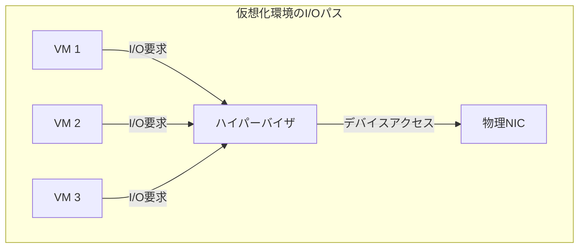

### 1.2 I/O仮想化の三大課題

I/O仮想化が解決すべき課題は、大きく以下の3つに整理できる。

**第一に、多重化（Multiplexing）の問題**がある。物理的なネットワークインターフェースカード（NIC）は通常、サーバに数枚しか搭載されない。しかし、そのサーバ上では数十の仮想マシン（VM）が動作し、それぞれが独立したネットワークインターフェースを必要とする。単一の物理デバイスを複数のゲストで安全に共有する仕組みが不可欠である。

**第二に、隔離（Isolation）の問題**がある。ある VM のI/O操作が別の VM の動作に影響を与えてはならない。帯域の公平な配分、バッファの分離、セキュリティ境界の維持が求められる。悪意のある VM が DMA を通じてホストメモリや他の VM のメモリにアクセスできてしまえば、仮想化の安全性は崩壊する。

**第三に、性能（Performance）の問題**がある。仮想化レイヤを経由することによるオーバーヘッドを最小化し、ネイティブに近いスループットとレイテンシを実現しなければならない。特に、10GbE、25GbE、100GbE といった高速ネットワークが普及した現在、I/O仮想化のオーバーヘッドは無視できない規模になりうる。

### 1.3 I/O仮想化手法の進化

これらの課題に対して、I/O仮想化技術は段階的に進化してきた。

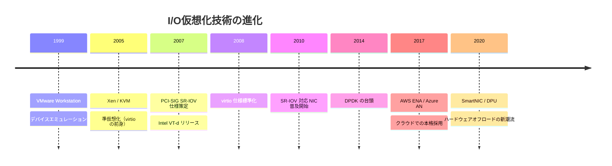

本記事では、デバイスエミュレーション、準仮想化（virtio）、そして SR-IOV という3つの主要なI/O仮想化手法を取り上げ、それぞれの仕組み、利点、制約を詳細に解説する。さらに、IOMMU/VT-d による安全性の確保、DPDK との連携、クラウド環境での活用、そして今後の展望について論じる。

## 2. デバイスエミュレーション — ソフトウェアによる完全な模倣

### 2.1 基本原理

デバイスエミュレーションは、I/O仮想化の最も古典的な手法である。ハイパーバイザが物理デバイスの動作を**ソフトウェアで完全に模倣**し、ゲストOSには実在するハードウェアデバイスと同一のインターフェースを提示する。

代表的な実装として、QEMU が挙げられる。QEMU は Intel e1000（1GbE NIC）や Realtek RTL8139 といった実在のネットワークカードをソフトウェアでエミュレートする。ゲスト OS は、これらのデバイス用の既存ドライバをそのまま使用できる。

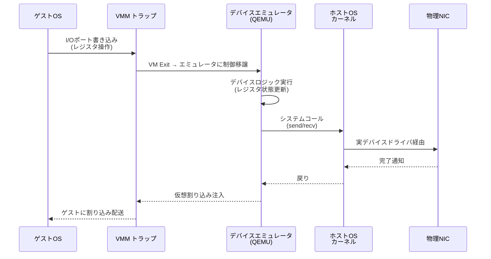

### 2.2 動作の詳細

ゲストOS がエミュレートされたNIC のI/Oポートやメモリマップドレジスタにアクセスすると、ハードウェアが**VM Exit**（Intel VT-x の場合）を発生させ、制御がハイパーバイザに移る。ハイパーバイザ内のエミュレータは、アクセスされたレジスタの種類と値に基づいて、実デバイスの動作をソフトウェアで再現する。

パケット送信の場合を具体的に追ってみよう。

1. ゲストOS がエミュレートされた NIC の送信ディスクリプタリングにパケット情報を書き込む
2. ゲストOS がドアベルレジスタに書き込むことで送信を開始する
3. VM Exit が発生し、エミュレータに制御が移る
4. エミュレータはゲストメモリからパケットデータを読み出す
5. ホストOS のネットワークスタックを経由して、実際の物理NIC からパケットを送信する
6. 送信完了後、エミュレータはゲストに仮想割り込みを注入して完了を通知する

### 2.3 利点と限界

デバイスエミュレーションの最大の利点は**互換性**にある。ゲストOSに特別な修正やドライバのインストールが不要であり、あらゆるOSをそのまま動作させることができる。レガシーOS のサポートや、OS インストール時のブートストラップ段階で特に重要な特性である。

しかし、性能面では深刻な問題がある。1回のパケット送受信ごとに複数回の VM Exit が発生し、それぞれ数千サイクルのオーバーヘッドを伴う。さらに、エミュレータ内でのデバイスロジックの処理、ホストOS のネットワークスタック通過、コンテキストスイッチなど、多層にわたるオーバーヘッドが累積する。

| 指標 | ネイティブ | デバイスエミュレーション |
|------|-----------|----------------------|
| スループット（1GbE環境） | ~940 Mbps | ~600-800 Mbps |
| レイテンシ | ~50 μs | ~200-500 μs |
| CPU使用率（ホスト側） | 低 | 非常に高 |
| VM Exit 回数/パケット | 0 | 2-4回 |

1GbE の時代にはまだ許容範囲だったこのオーバーヘッドも、10GbE 以上の高速ネットワークでは致命的な性能劣化をもたらす。このことが、次に述べる準仮想化アプローチの登場を促した。

## 3. 準仮想化（virtio）— ゲストとホストの協調

### 3.1 準仮想化の着想

デバイスエミュレーションの性能問題に対する最初の大きな改善が、**準仮想化（paravirtualization）** アプローチである。この手法の核心的な着想は、実在するハードウェアの忠実な模倣を諦め、**仮想化環境に最適化された仮想デバイスインターフェース**を新たに設計するというものだ。

ゲストOS は自身が仮想化環境で動作していることを「知っている」前提に立ち、ハイパーバイザとの間で効率的な通信プロトコルを使用する。これにより、不要な VM Exit を削減し、バッチ処理やゼロコピーに近い転送を実現できる。

### 3.2 virtio アーキテクチャ

準仮想化I/O の標準仕様として、2008年に Rusty Russell によって提案された **virtio** が広く採用されている。virtio は OASIS によって標準化され、現在は virtio 1.2 仕様まで策定されている。

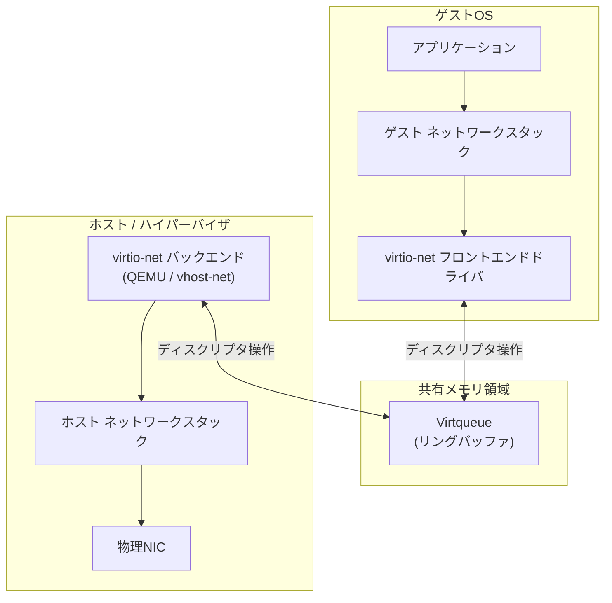

virtio の中心的なデータ構造は **Virtqueue** と呼ばれるリングバッファである。Virtqueue は以下の3つのテーブルで構成される。

- **Descriptor Table**: データバッファのアドレス、長さ、フラグを保持するエントリの配列
- **Available Ring**: ゲストがホストに処理を依頼するディスクリプタのインデックスを格納するリング
- **Used Ring**: ホストが処理を完了したディスクリプタのインデックスをゲストに返すリング

```
┌──────────────────────────────────────────────────────┐
│                  Virtqueue 構造                        │
├──────────────────────────────────────────────────────┤
│  Descriptor Table                                     │
│  ┌─────┬──────────┬──────┬───────┬──────┐           │
│  │ idx │  addr    │ len  │ flags │ next │           │
│  ├─────┼──────────┼──────┼───────┼──────┤           │
│  │  0  │ 0x1000   │ 1500 │  0x0  │  1   │           │
│  │  1  │ 0x2000   │  512 │  0x1  │  2   │           │
│  │  2  │ 0x3000   │ 1500 │  0x0  │  -   │           │
│  └─────┴──────────┴──────┴───────┴──────┘           │
│                                                       │
│  Available Ring          Used Ring                    │
│  ┌───┬───┬───┐          ┌───┬───┬───┐              │
│  │ 0 │ 2 │   │          │ 0 │   │   │              │
│  └───┴───┴───┘          └───┴───┴───┘              │
│  (ゲスト→ホスト)         (ホスト→ゲスト)              │
└──────────────────────────────────────────────────────┘
```

### 3.3 パケット送信の流れ

virtio-net を用いたパケット送信は、以下のように進行する。

1. ゲストOS の virtio-net ドライバが、送信するパケットデータが格納されたメモリバッファを Descriptor Table に登録する
2. ディスクリプタのインデックスを Available Ring に追加する
3. ドライバが PCI レジスタへの書き込み（kick）によってホストに通知する（このとき1回の VM Exit が発生する）
4. ホスト側のバックエンド（vhost-net など）が Available Ring からディスクリプタを取り出す
5. バックエンドがディスクリプタで指されたゲストメモリからデータを読み出し、物理NICを通じて送信する
6. 処理完了したディスクリプタのインデックスを Used Ring に返す
7. ホストがゲストに仮想割り込みで完了を通知する

重要なのは、複数のパケットを1回の kick と1回の割り込みでバッチ処理できる点だ。デバイスエミュレーションではパケットごとに複数回の VM Exit が発生するのに対し、virtio ではバッチ処理によって VM Exit の回数を大幅に削減できる。

### 3.4 vhost-net によるカーネルバイパス

初期の virtio 実装では、バックエンド処理がユーザ空間の QEMU プロセスで行われていたため、ホストカーネルとユーザ空間の間のコンテキストスイッチがオーバーヘッドとなっていた。この問題を解決するのが **vhost-net** である。

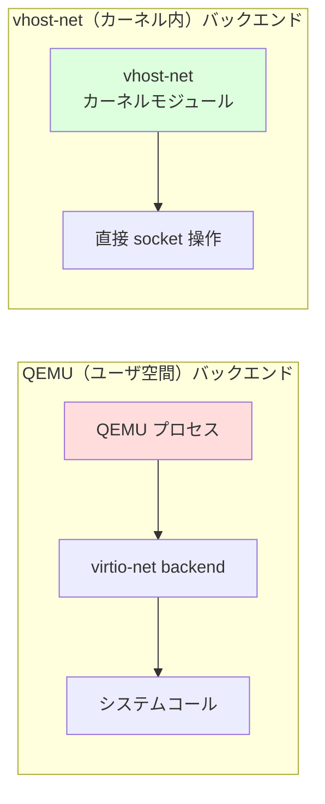

vhost-net は、Virtqueue の処理をホストカーネル内で直接行うカーネルモジュールである。これにより、QEMU プロセスへのコンテキストスイッチが不要になり、スループットが大幅に向上する。さらに、**vhost-user** プロトコルにより、DPDK などのユーザ空間アプリケーションがバックエンドとして動作することも可能になっている。

### 3.5 virtio の性能と限界

virtio（vhost-net 使用時）は、デバイスエミュレーションと比較して大幅な性能改善を実現する。

| 指標 | エミュレーション | virtio + vhost-net |
|------|----------------|-------------------|
| スループット（10GbE環境） | ~2-3 Gbps | ~8-9 Gbps |
| レイテンシ | ~200-500 μs | ~50-100 μs |
| CPU使用率（ホスト側） | 非常に高 | 中程度 |
| VM Exit 回数/バッチ | 多数 | 最小限 |

しかし、virtio にも本質的な限界がある。いかに効率化しても、**ハイパーバイザを経由するという構造**は変わらない。パケットの送受信ごとに、ゲストOS → ハイパーバイザ → ホストOS（またはバックエンド）→ 物理デバイスという多段の処理が必要であり、ネイティブ性能には及ばない。25GbE や 100GbE のワイヤレートを仮想マシンに提供するには、さらに根本的なアプローチが必要となる。

## 4. SR-IOV の仕組み — ハードウェアによるI/O仮想化

### 4.1 SR-IOV とは何か

**SR-IOV（Single Root I/O Virtualization）** は、PCI-SIG（PCI Special Interest Group）が2007年に策定した PCI Express デバイスの仮想化仕様である。SR-IOV の核心は、**1つの物理デバイスをハードウェアレベルで複数の仮想デバイスに分割する**という発想にある。

従来のI/O仮想化では、ハイパーバイザがソフトウェアで物理デバイスの多重化を行っていた。SR-IOV はこの多重化を**NIC自身のハードウェア**に委ねることで、ハイパーバイザの介在を最小化し、VM がほぼ直接物理NICと通信できるようにする。

### 4.2 Physical Function（PF）と Virtual Function（VF）

SR-IOV 対応デバイスは、以下の2種類の PCIe Function を提供する。

**Physical Function（PF）** は、デバイスの完全な機能を持つ PCIe Function である。PF は SR-IOV ケーパビリティ構造を含み、VF の生成・設定・管理を担う。ホストOS のドライバは PF を通じてデバイス全体を制御する。1つの物理デバイスに通常1〜2個の PF が存在する（デュアルポートNIC の場合は各ポートに1つ）。

**Virtual Function（VF）** は、PF から派生した軽量な PCIe Function である。VF はデータの送受信に必要な最小限のリソース（送受信キュー、割り込み、レジスタ空間）のみを持ち、デバイスの管理機能（ファームウェアアップデート、リンク設定など）は持たない。1つの PF から最大数百の VF を生成でき（一般的な NIC では64〜256個）、各 VF を個別の VM にパススルーで割り当てることができる。

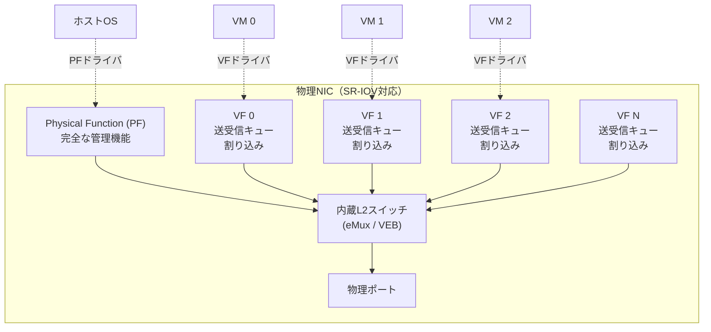

### 4.3 SR-IOV の内部アーキテクチャ

SR-IOV 対応NICの内部は、以下のような構成要素で成り立っている。

**送受信キュー（TX/RX Queue）**: 各VFは専用の送受信キューペアを持つ。これにより、VM間のデータパスが完全に分離される。高性能NICでは、1つのVFに複数のキューペアを割り当てることも可能であり、VM内でのRSS（Receive Side Scaling）によるマルチコアスケーリングが実現できる。

**内蔵L2スイッチ**: NIC内部には、PFとすべてのVF間のトラフィックを制御するL2スイッチが組み込まれている。これは **VEB（Virtual Ethernet Bridge）** または **eMux（embedded Multiplexer）** と呼ばれる。VEB はVF間のローカル通信（同一NIC上のVM間通信）を外部スイッチを経由せずに処理でき、eMux は通信を必ず外部スイッチ経由にする（IEEE 802.1Qbg VEPA モードに対応）。

**MAC/VLANフィルタリング**: 各VFに対してMACアドレスとVLANタグのフィルタリングルールを設定できる。これにより、VFは自身宛のパケットのみを受信し、他のVFやPF宛のパケットにはアクセスできない。

### 4.4 SR-IOV のデータパス

SR-IOV 環境でのパケット送受信を、virtio と比較しながら見てみよう。

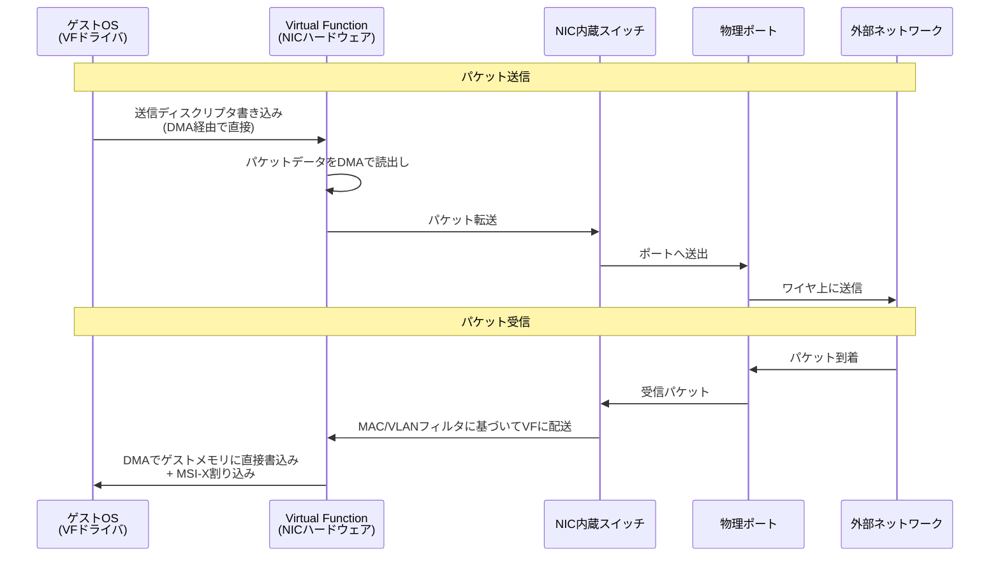

ここで注目すべきは、**ハイパーバイザがデータパスに一切関与しない**点である。VM のVFドライバが送信ディスクリプタをVFのレジスタに書き込むと、NICハードウェアがDMAでゲストメモリからパケットデータを読み出し、内蔵スイッチを経由して物理ポートから送出する。受信の場合も、NICが直接ゲストメモリにパケットデータをDMA転送し、MSI-X 割り込みでVMに通知する。

この「ハイパーバイザバイパス」こそが、SR-IOV が virtio に対して圧倒的な性能優位性を持つ根本的な理由である。

### 4.5 Linux における SR-IOV の設定

Linux 環境で SR-IOV を有効化する基本的な手順を示す。

```bash
# Check if the NIC supports SR-IOV
lspci -vvv -s 03:00.0 | grep -i "sr-iov"

# Enable VFs (e.g., create 4 VFs for the PF at 03:00.0)
echo 4 > /sys/class/net/ens3f0/device/sriov_numvfs

# Verify created VFs
lspci | grep "Virtual Function"
# 03:00.1 Ethernet controller: Intel Corporation ... Virtual Function
# 03:00.2 Ethernet controller: Intel Corporation ... Virtual Function
# 03:00.3 Ethernet controller: Intel Corporation ... Virtual Function
# 03:00.4 Ethernet controller: Intel Corporation ... Virtual Function

# Set MAC address for a VF (via PF driver)
ip link set ens3f0 vf 0 mac 52:54:00:12:34:56

# Set VLAN for a VF
ip link set ens3f0 vf 0 vlan 100

# Set QoS rate limiting for a VF (in Mbps)
ip link set ens3f0 vf 0 max_tx_rate 1000

# Check VF status
ip link show ens3f0
```

KVM/QEMU で VF を VM にパススルーするには、以下のように設定する。

```bash
# Unbind VF from host driver
echo 0000:03:00.1 > /sys/bus/pci/devices/0000:03:00.1/driver/unbind

# Bind VF to vfio-pci driver (for IOMMU-based passthrough)
echo vfio-pci > /sys/bus/pci/devices/0000:03:00.1/driver_override
echo 0000:03:00.1 > /sys/bus/pci/drivers/vfio-pci/bind

# Start VM with VF passthrough
qemu-system-x86_64 \
    -device vfio-pci,host=03:00.1 \
    -m 4096 \
    -smp 4 \
    ...
```

libvirt を使用する場合は、XML で以下のように定義する。

```xml
<hostdev mode='subsystem' type='pci' managed='yes'>
  <source>
    <address domain='0x0000' bus='0x03' slot='0x00' function='0x1'/>
  </source>
</hostdev>
```

## 5. IOMMU と VT-d — SR-IOV の安全性を支える基盤

### 5.1 なぜ IOMMU が必要なのか

SR-IOV では、VF が DMA を通じてゲストメモリに直接アクセスする。しかし、DMA は本質的にCPU のメモリ保護機構をバイパスする操作である。もしVF（あるいは悪意のあるゲスト）が任意の物理アドレスに対してDMAを発行できてしまえば、ホストメモリや他のVMのメモリを読み書きできてしまう。

この問題を解決するのが **IOMMU（Input/Output Memory Management Unit）** である。Intel の実装は **VT-d（Virtualization Technology for Directed I/O）**、AMD の実装は **AMD-Vi** と呼ばれる。

### 5.2 IOMMU の動作原理

IOMMU は、CPU の MMU（Memory Management Unit）がプロセスの仮想アドレスを物理アドレスに変換するのと同様に、**デバイスが使用するDMAアドレスを物理メモリアドレスに変換する**。

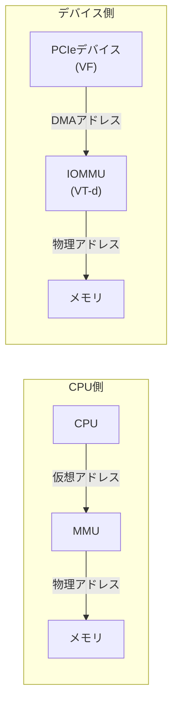

IOMMU は各PCIeデバイス（VFを含む）に対して独立した**DMAリマッピングテーブル**（ページテーブルに相当）を管理する。このテーブルにより、各VFがDMAでアクセスできるメモリ領域を、対応するVMに割り当てられたメモリ範囲に限定する。

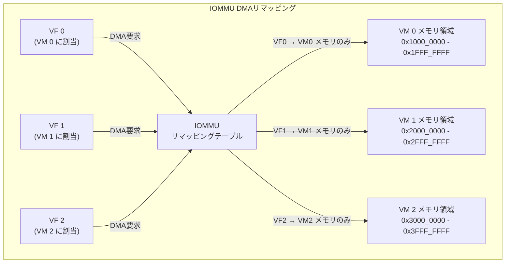

VF0 がDMAアドレス 0x0 にアクセスしようとすると、IOMMU はVF0用のリマッピングテーブルに基づいてこのアドレスを VM 0 のメモリ領域内の物理アドレスに変換する。VF0 が VM 1 のメモリ領域にアクセスしようとしても、リマッピングテーブルにそのマッピングが存在しないため、IOMMU がアクセスをブロックし、フォルトを発生させる。

### 5.3 割り込みリマッピング

IOMMU のもう一つの重要な機能が**割り込みリマッピング（Interrupt Remapping）** である。PCIe デバイスは MSI/MSI-X を通じて割り込みを発行するが、MSI は本質的にメモリ書き込み操作として実装されている。IOMMU の割り込みリマッピング機能がなければ、悪意のあるデバイスが任意の CPU に任意の割り込みベクタを注入できてしまう。

割り込みリマッピングは、デバイスが発行する MSI/MSI-X 割り込みを IOMMU が検証し、正当な割り込みのみを適切な CPU に配送する。これにより、VF からの割り込みが対応する VM の vCPU にのみ配送されることが保証される。

### 5.4 IOMMU の設定

Linux で IOMMU を有効化するには、カーネルブートパラメータの設定が必要である。

```bash
# For Intel VT-d: add to GRUB_CMDLINE_LINUX in /etc/default/grub
GRUB_CMDLINE_LINUX="intel_iommu=on iommu=pt"

# For AMD-Vi:
GRUB_CMDLINE_LINUX="amd_iommu=on iommu=pt"

# "iommu=pt" enables passthrough mode for host devices
# (IOMMU translation only for devices assigned to VMs)
```

`iommu=pt`（passthrough mode）は重要な最適化である。IOMMU を全デバイスに対して有効にすると、ホストOS が使用するデバイスの DMA にもアドレス変換のオーバーヘッドが発生する。passthrough モードでは、VM にパススルーされたデバイスのみに IOMMU 変換を適用し、ホストデバイスは直接物理アドレスを使用する。

### 5.5 IOMMU グループ

IOMMU は **IOMMU グループ**という単位でデバイスを管理する。同一の IOMMU グループに属するデバイスは、IOMMU の観点から分離できない（同じDMAリマッピングドメインを共有する）。そのため、VM にデバイスをパススルーする際は、IOMMU グループ全体を割り当てる必要がある。

```bash
# Check IOMMU groups
find /sys/kernel/iommu_groups/ -type l | sort -V
# /sys/kernel/iommu_groups/0/devices/0000:00:00.0
# /sys/kernel/iommu_groups/1/devices/0000:00:01.0
# /sys/kernel/iommu_groups/17/devices/0000:03:00.0  (PF)
# /sys/kernel/iommu_groups/18/devices/0000:03:00.1  (VF 0)
# /sys/kernel/iommu_groups/19/devices/0000:03:00.2  (VF 1)
```

SR-IOV の優れた点は、各VF が独立した IOMMU グループに配置されることである（ACS: Access Control Services が有効な場合）。これにより、個々の VF を独立して異なる VM にパススルーできる。

## 6. DPDK との連携 — ユーザ空間ネットワーキング

### 6.1 DPDK の概要

**DPDK（Data Plane Development Kit）** は、Intel が2010年にオープンソースとして公開した、高性能パケット処理フレームワークである。現在は Linux Foundation 傘下のプロジェクトとして開発されている。

DPDK の基本戦略は、**カーネルのネットワークスタックを完全にバイパスし、ユーザ空間でパケットを直接処理する**というものだ。これにより、カーネルの汎用ネットワークスタックに伴うオーバーヘッド（割り込み処理、コンテキストスイッチ、プロトコルスタック通過、バッファコピー）を排除する。

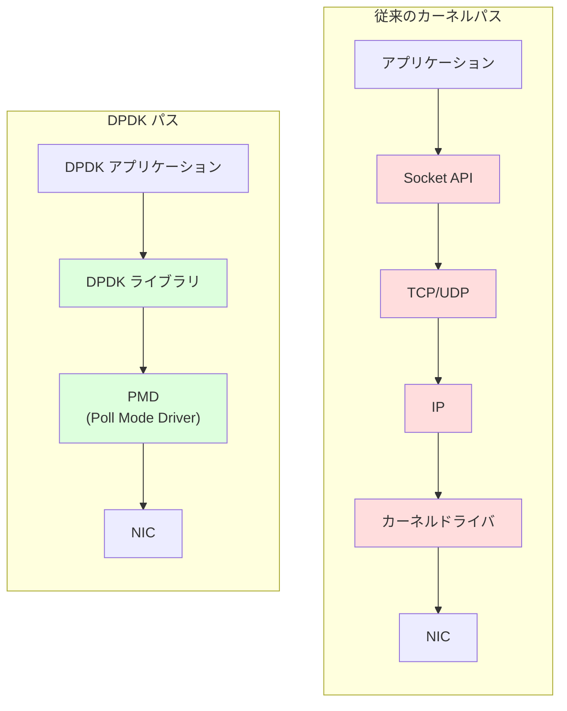

### 6.2 DPDK の主要コンポーネント

DPDK は以下の主要コンポーネントで構成される。

**PMD（Poll Mode Driver）**: カーネルドライバの代わりに、ユーザ空間で NIC を直接制御するドライバ。割り込みを使用せず、CPUコアを専有してNICの受信キューを**ポーリング**で監視する。割り込みのオーバーヘッドを排除し、レイテンシのジッターを最小化する。

**Hugepage メモリ管理**: DPDK は hugepage（2MB または 1GB のラージページ）を使用してパケットバッファを管理する。通常の4KBページと比較して、TLBミスが大幅に減少し、メモリアクセス性能が向上する。

**Lockless リングバッファ**: マルチコア環境での効率的なパケット受け渡しのために、ロックフリーのリングバッファを提供する。CAS（Compare-And-Swap）命令を活用し、複数のコア間でのパケットキューイングをロックなしで実現する。

**NUMA アウェアネス**: DPDK はメモリバッファとCPUコアを同じ NUMA ノードに配置することを意識した設計になっており、リモートメモリアクセスのペナルティを回避する。

### 6.3 SR-IOV + DPDK の組み合わせ

SR-IOV と DPDK を組み合わせることで、仮想環境でも極めて高いネットワーク性能を実現できる。主に2つのアーキテクチャが存在する。

**アーキテクチャ1: VM内 DPDK + VF パススルー**

VM に VF をパススルーし、VM 内で DPDK を使用してパケットを処理する方式。

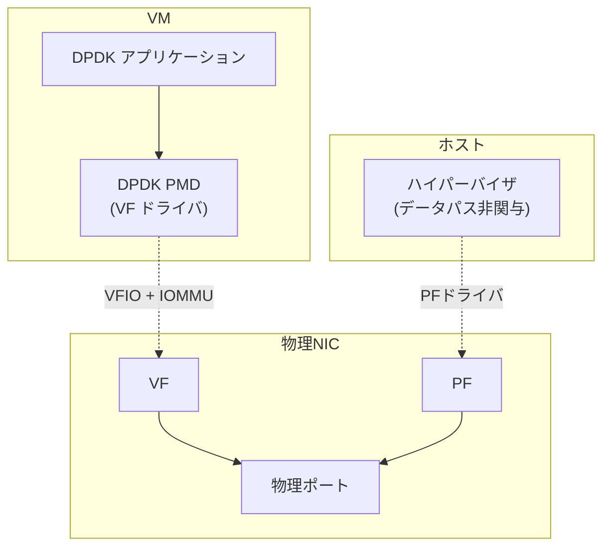

この構成では、VM 内の DPDK アプリケーションが VF を PMD で直接制御する。パケットは VM のユーザ空間から NIC ハードウェアまで、カーネルを一切経由せずに流れる。ゲストカーネルすら通過しないため、極めて低いレイテンシを実現できる。

**アーキテクチャ2: ホスト側 OVS-DPDK + virtio**

ホスト上で DPDK を利用した仮想スイッチ（OVS-DPDK: Open vSwitch with DPDK）を動作させ、VM への接続は virtio（vhost-user）で行う方式。

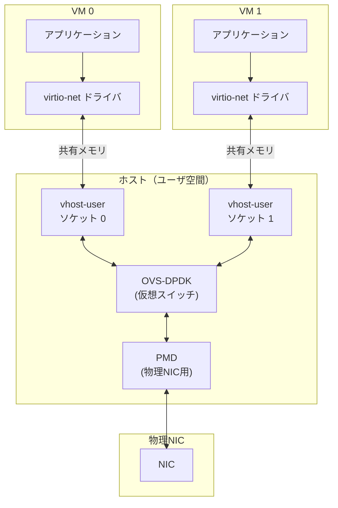

OVS-DPDK は SR-IOV のようなハードウェアレベルの性能には及ばないが、ライブマイグレーションや柔軟なネットワーキング機能（ACL、QoS、オーバーレイネットワーク）との両立が可能である。多くのクラウドプロバイダは、この2つのアプローチを適材適所で使い分けている。

### 6.4 DPDK のコード例

DPDK を用いた基本的なパケット受信ループの構造を示す。

```c
#include <rte_ethdev.h>
#include <rte_mbuf.h>

#define BURST_SIZE 32

/* Main packet processing loop (runs on a dedicated CPU core) */
static void packet_rx_loop(uint16_t port_id, uint16_t queue_id)
{
    struct rte_mbuf *bufs[BURST_SIZE];
    uint16_t nb_rx;

    /* Infinite polling loop - no interrupts, no sleep */
    while (!force_quit) {
        /* Poll NIC for received packets */
        nb_rx = rte_eth_rx_burst(port_id, queue_id,
                                  bufs, BURST_SIZE);

        if (unlikely(nb_rx == 0))
            continue;

        /* Process received packets */
        for (uint16_t i = 0; i < nb_rx; i++) {
            struct rte_mbuf *m = bufs[i];
            /* Packet data at: rte_pktmbuf_mtod(m, void *) */
            /* Packet length:  m->pkt_len */
            process_packet(m);
            rte_pktmbuf_free(m);
        }
    }
}
```

ここで注目すべきは、`rte_eth_rx_burst` が割り込みを待つのではなく、NIC の受信キューをポーリングしている点である。この関数は、パケットが到着していなければ即座に 0 を返す。CPU コアは100%使用されるが、パケット到着からアプリケーションの処理開始までのレイテンシは数マイクロ秒以下に抑えられる。

## 7. ネットワーク性能比較

### 7.1 手法間の定量的比較

I/O仮想化の各手法について、典型的な性能特性を比較する。以下の数値は、Intel Xeon スケーラブルプロセッサ + Intel E810 25GbE NIC を用いた一般的なベンチマーク結果に基づく参考値である。

| 指標 | ネイティブ | エミュレーション<br>(e1000) | virtio<br>(vhost-net) | SR-IOV<br>(VF パススルー) | SR-IOV<br>+ DPDK |
|------|-----------|--------------------------|----------------------|--------------------------|-------------------|
| **スループット**<br>(64Bパケット) | ~24 Gbps | ~0.5 Gbps | ~5-8 Gbps | ~20-22 Gbps | ~24 Gbps |
| **スループット**<br>(1518Bパケット) | ~25 Gbps | ~2-3 Gbps | ~15-20 Gbps | ~24-25 Gbps | ~25 Gbps |
| **レイテンシ**<br>(RTT) | ~15 μs | ~300-500 μs | ~40-80 μs | ~18-25 μs | ~5-10 μs |
| **パケットレート**<br>(Mpps) | ~37 | ~0.7 | ~3-5 | ~30-35 | ~37 |
| **CPU使用率** | 低 | 非常に高 | 中 | 低 | 1コア100%<br>(専有) |

### 7.2 スモールパケット性能の重要性

ネットワーク性能の比較において、**64バイトの小さなパケットでの性能**（パケットレート、pps: packets per second）が重要な指標となる理由を説明する。

大きなパケット（1518バイト）ではスループット（bps）がボトルネックになり、多くの手法でワイヤレートに近い性能が得られる。しかし、小さなパケットではパケットごとの処理オーバーヘッド（ヘッダ解析、ディスクリプタ処理、割り込み/ポーリング）が支配的になり、仮想化手法間の性能差が顕著に表れる。

25GbE のワイヤレートは、64バイトパケットで約3,700万パケット/秒（37 Mpps）である。デバイスエミュレーションでこのレートの2%弱しか達成できないのに対し、SR-IOV + DPDK ではほぼワイヤレートを実現できる。この差は、通信パスのオーバーヘッドの累積を如実に反映している。

### 7.3 レイテンシ特性の分析

各手法のレイテンシ構成を分解すると、以下のようになる。

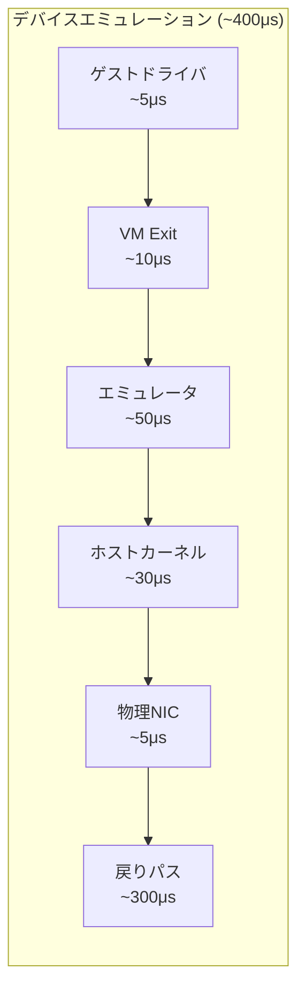

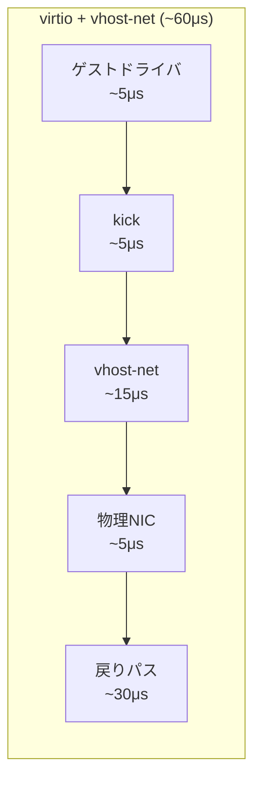

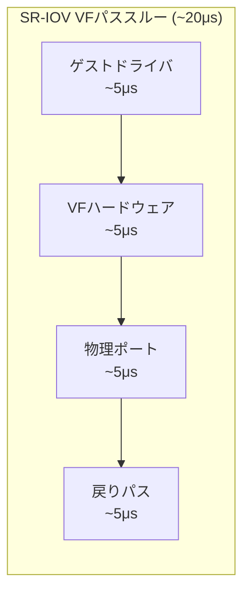

SR-IOV では、ハイパーバイザの介在がないため、レイテンシの構成がネイティブに非常に近い。DPDK を組み合わせると、ゲストカーネルの処理も省略されるため、さらに低いレイテンシが実現できる。

## 8. クラウドでの活用

### 8.1 主要クラウドプロバイダの実装

SR-IOV とI/O仮想化技術は、主要なクラウドプロバイダの基盤技術として幅広く採用されている。各社の実装アプローチを見てみよう。

**Amazon Web Services（AWS）**

AWS は **ENA（Elastic Network Adapter）** と **EFA（Elastic Fabric Adapter）** を独自に開発している。ENA は SR-IOV ベースのネットワークアダプタで、最大100Gbps のネットワーク帯域を提供する。ENA は準仮想化的なアプローチと SR-IOV を組み合わせた独自の設計で、ライブマイグレーションとの両立を実現している。

さらに、AWS Nitro System は、I/O仮想化の処理を専用の **Nitro Card**（カスタムASIC）にオフロードする。これにより、ホストCPU のリソースをすべてゲストに提供しつつ、高性能なネットワークI/Oを実現している。

**Microsoft Azure**

Azure は **Accelerated Networking（AccelNet）** 機能を提供している。AccelNet は SR-IOV を活用し、VM にNICの VF を直接パススルーする。同時に、Azure のネットワーク仮想化（VFP: Virtual Filtering Platform）の機能を SmartNIC にオフロードすることで、SDN機能と SR-IOV の性能を両立している。

**Google Cloud Platform（GCP）**

GCP は **gVNIC（Google Virtual NIC）** を開発し、virtio-net の代替として提供している。gVNIC は仮想化環境に最適化された独自のインターフェース設計で、virtio よりも高い性能を実現する。100Gbps 帯域対応のインスタンスも提供されている。

### 8.2 クラウドにおける SR-IOV の課題

クラウド環境で SR-IOV を採用する際には、いくつかの固有の課題が存在する。

**ライブマイグレーションとの両立**

クラウドにおける最大の課題が、**ライブマイグレーション**との両立である。virtio の場合、ネットワークの状態はハイパーバイザが管理しているため、VM を別の物理ホストに移行する際にネットワーク接続を引き継ぐことが比較的容易である。

しかし SR-IOV では、VM が物理NIC のハードウェアに直接アクセスしているため、移行先の物理ホストに同じNICが存在する保証がなく、NIC内部の状態（キューの内容、フィルタリングルール）の移行が困難である。

この問題に対して、クラウドプロバイダは以下のようなアプローチを採用している。

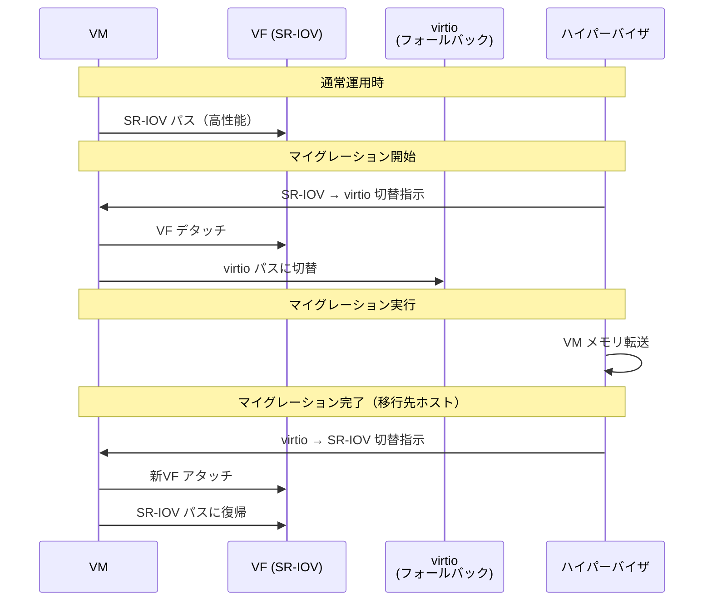

AWS の ENA や Azure の AccelNet は、マイグレーション時に SR-IOV パスから virtio（または類似のソフトウェアパス）にフォールバックし、マイグレーション完了後に再び SR-IOV パスに切り替える「ホットプラグ」方式を採用している。この切り替えは瞬時に行われ、アプリケーションレベルでのネットワーク切断は最小限に抑えられる。

**VF 数の制限**

SR-IOV の VF 数には物理的な上限がある。一般的な NIC では1つの PF あたり64〜256個の VF を生成できるが、高密度仮想化環境（1台のサーバに数百の VM を収容するケース）ではこの数が不足する場合がある。特に、コンテナ化されたマイクロサービス環境では、ネットワークエンドポイントの数がVMベースの環境よりも桁違いに多くなるため、SR-IOV の拡張性が課題となる。

**SDN機能との統合**

クラウド環境では、セキュリティグループ、ネットワークACL、ロードバランシング、オーバーレイネットワーク（VXLAN/Geneve）などの SDN 機能が不可欠である。SR-IOV では、これらの機能をどこで実行するかが問題となる。

- **ホストソフトウェアで処理**: SR-IOV のバイパス効果が失われる
- **NIC のハードウェアオフロード**: SmartNIC/DPU によるアプローチ
- **外部スイッチで処理**: ネットワーク構成が複雑化する

近年は SmartNIC/DPU（Data Processing Unit）により、SDN 機能を NIC 上のプログラマブルなハードウェアで実行するアプローチが主流になりつつある。

### 8.3 SmartNIC/DPU の台頭

**SmartNIC** または **DPU（Data Processing Unit）** は、NIC にプログラマブルなプロセッサ（ARM コア、FPGA、P4対応パイプラインなど）を統合した次世代ネットワークデバイスである。

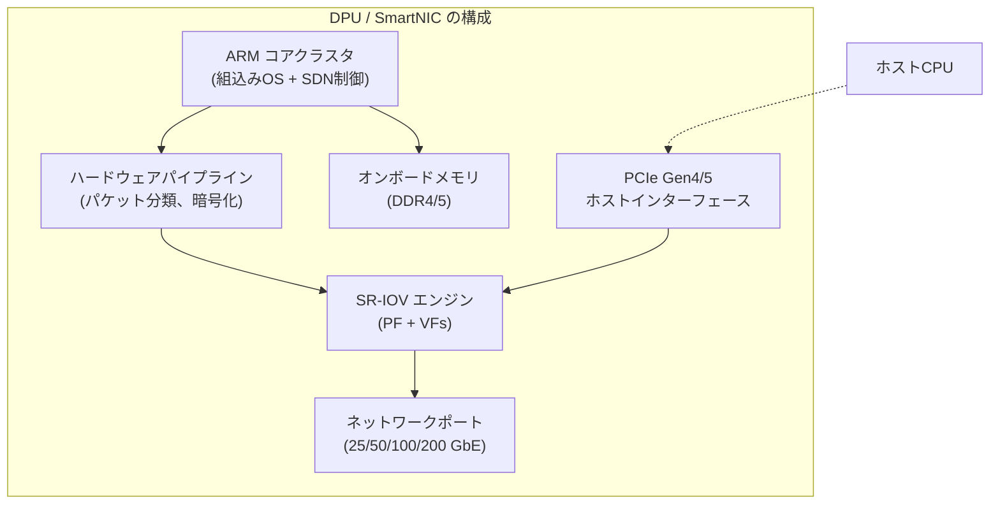

代表的な製品として、NVIDIA（旧Mellanox）の **BlueField**シリーズ、Intel の **IPU（Infrastructure Processing Unit）**、AMD（旧Xilinx）の **Alveo** シリーズ、AWS の **Nitro Card** などがある。

DPU の導入により、SDN 処理（ACL、VXLAN/Geneve カプセル化/解カプセル化、暗号化、QoS）を NIC 上で完結させることが可能になる。ホストCPU は純粋にワークロードの処理に集中でき、SR-IOV の性能メリットとSDN の柔軟性を同時に享受できる。

## 9. SR-IOV の制約と今後

### 9.1 SR-IOV の技術的制約

SR-IOV は強力な技術であるが、いくつかの本質的な制約を持つ。

**ハードウェア依存性**: SR-IOV はNIC のハードウェアサポートを前提とする。対応していないNICでは使用できず、NIC のファームウェアバージョンやドライバの互換性にも依存する。さらに、マザーボードのPCIeスロット構成や BIOS/UEFI の設定も影響する。

**デバッグの困難さ**: SR-IOV 環境でネットワーク問題が発生した場合、ゲスト内、VF ハードウェア、IOMMU、PF ドライバ、NIC ファームウェアなど、多層にわたる調査が必要となる。ソフトウェアベースの仮想化と比較して、問題の切り分けが格段に難しい。

**機能の制約**: VF はPF と比較して機能が限定されている。たとえば、プロミスキャスモードのサポート、特定のオフロード機能、詳細な統計情報の取得などが制限される場合がある。これはパケットキャプチャやネットワーク監視ツールの動作に影響を与えうる。

**リソースの粒度**: VF は最小の割り当て単位であり、1つの VF を複数のVMで共有することはできない。また、VF の帯域制限やQoS設定の粒度はNIC のハードウェア実装に依存し、ソフトウェアベースのアプローチほど柔軟ではない場合がある。

### 9.2 SIOV（Scalable IOV）— 次世代I/O仮想化

SR-IOV の制約を克服するために、Intel は **SIOV（Scalable I/O Virtualization）** を提案している。SIOV は、SR-IOV の「VF 数の制限」と「ハードウェアリソースの効率性」の問題に対処する次世代仕様である。

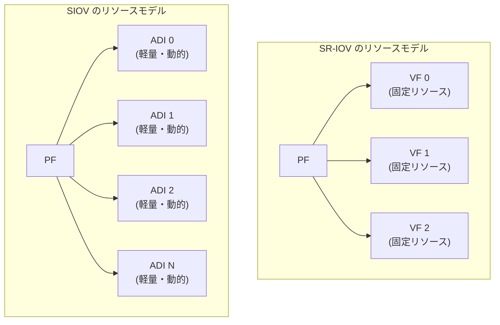

SR-IOV では、各VF が独立した PCIe Function として存在し、それぞれが専用の設定空間とリソースを消費する。PCIe 仕様上、1つのデバイスあたりの Function 数には上限があり、VF 数のスケーラビリティに制約がある。

SIOV では、**ADI（Assignable Device Interface）** という軽量な仮想デバイスインターフェースを導入する。ADI は PCIe Function ではなく、デバイス内部のソフトウェア定義インターフェースであるため、数千の ADI を動的に生成・削除できる。各 ADI には **PASID（Process Address Space ID）** が割り当てられ、IOMMU の PASID ベースのアドレス変換によって隔離が実現される。

SIOV のメリットは以下の通りである。

- **スケーラビリティ**: VF 数の制限を超えて、数千のデバイスインスタンスを提供可能
- **動的な割り当て**: ADI の生成・削除を高速に行えるため、コンテナのような短命なワークロードにも適する
- **リソース効率**: ハードウェアリソースを ADI 間で動的に共有でき、使用率を最適化できる
- **プロセスレベルの割り当て**: VM だけでなく、個々のプロセスやコンテナに対して直接 ADI を割り当てることが可能

### 9.3 virtio の進化 — ハードウェアアクセラレーション

もう一つの注目すべきトレンドは、**virtio のハードウェア実装**である。元来ソフトウェアインターフェースとして設計された virtio が、NIC のハードウェアにネイティブに実装されるようになっている。

NVIDIA（旧Mellanox）の ConnectX-6 以降のNICは、**virtio-net のハードウェアアクセラレーション**をサポートする。これにより、ゲストOS からは標準的な virtio-net デバイスに見えるが、実際にはハードウェアが virtqueue を直接処理する。

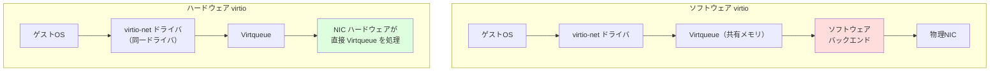

このアプローチの利点は、ゲストOS側の変更が不要な点にある。既存の virtio-net ドライバがそのまま動作するため、ライブマイグレーション時のフォールバックも容易である。パススルー型の SR-IOV VF と比較して、運用の複雑さが軽減される。

### 9.4 コンテナ環境での I/O 仮想化

仮想マシンからコンテナへのパラダイムシフトに伴い、I/O仮想化の要件も変化している。

コンテナは VM と比較して、起動が速く、密度が高く、ライフサイクルが短い。SR-IOV のVF をコンテナに割り当てることは技術的に可能であるが（SR-IOV CNI プラグインなど）、以下の課題がある。

- VF の生成・削除のオーバーヘッドがコンテナの起動速度に見合わない場合がある
- VF 数の上限が、大量のコンテナを収容する環境で制約となる
- Kubernetes などのオーケストレータとの統合が複雑になる

これらの課題に対して、以下のようなアプローチが模索されている。

- **SIOV の ADI**: 軽量で動的なデバイスインターフェースにより、コンテナレベルの粒度に対応
- **AF_XDP（Address Family XDP）**: Linux カーネルの XDP（eXpress Data Path）をソケットAPIで公開し、カーネルバイパスに近い性能をコンテナ環境で実現
- **eBPF ベースのネットワーキング**: Cilium などの eBPF ベースの CNI プラグインにより、カーネル内で高効率なパケット処理を実現

### 9.5 CXL と次世代インターコネクト

**CXL（Compute Express Link）** の登場も、I/O仮想化の将来に影響を与える可能性がある。CXL は PCIe をベースとした新しいインターコネクト規格で、CPU、メモリ、アクセラレータ間のキャッシュコヒーレントな通信を実現する。

CXL 3.0 では、デバイス間の直接通信や、メモリプーリングの機能が強化されており、将来的にはNIC がCPU のキャッシュ階層と直接統合される可能性がある。これにより、DMA ベースのデータ転送よりも低いレイテンシでのパケット処理が期待される。

### 9.6 まとめ — I/O仮想化の全体像

本記事で取り上げた I/O 仮想化技術の全体像を整理する。

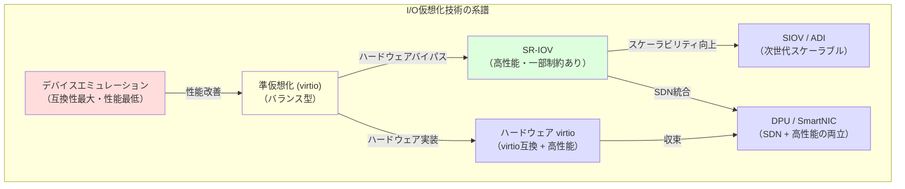

I/O仮想化は、ソフトウェアによる完全なエミュレーションから始まり、ゲストとホストの協調（準仮想化）、ハードウェアによる直接的な仮想化（SR-IOV）へと進化してきた。現在はさらに、SmartNIC/DPU によるプログラマブルなハードウェアオフロード、SIOV による次世代スケーラブル仮想化、virtio のハードウェアアクセラレーションなど、複数の方向に発展が続いている。

これらの技術は互いに排他的ではなく、ワークロードの要件に応じて適切な手法が選択される。汎用的なクラウドワークロードでは virtio（ハードウェアアクセラレーション付き）が、低レイテンシが求められる金融取引や HPC ワークロードでは SR-IOV + DPDK が、大規模マルチテナント環境では DPU ベースのアプローチが、それぞれ適している。

I/O仮想化の最終的なゴールは、**仮想化のオーバーヘッドをゼロに近づけつつ、仮想化がもたらす柔軟性・隔離性・運用性を完全に維持する**ことにある。DPU と SIOV の進化は、この一見矛盾する目標の実現に向けた大きな一歩と言えるだろう。
