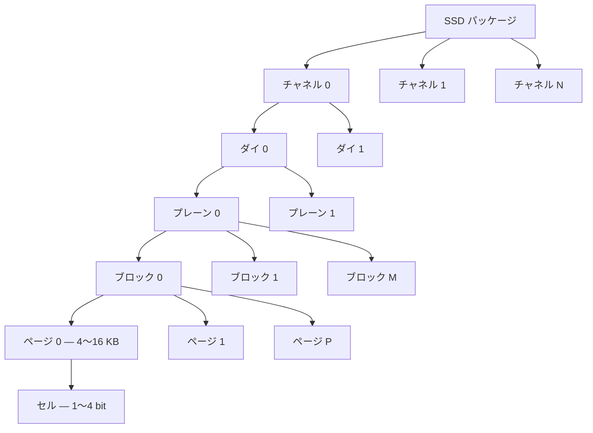
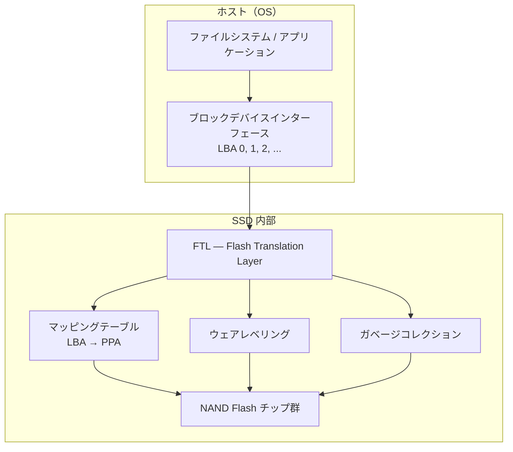
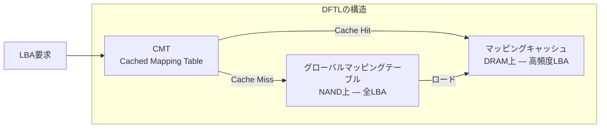
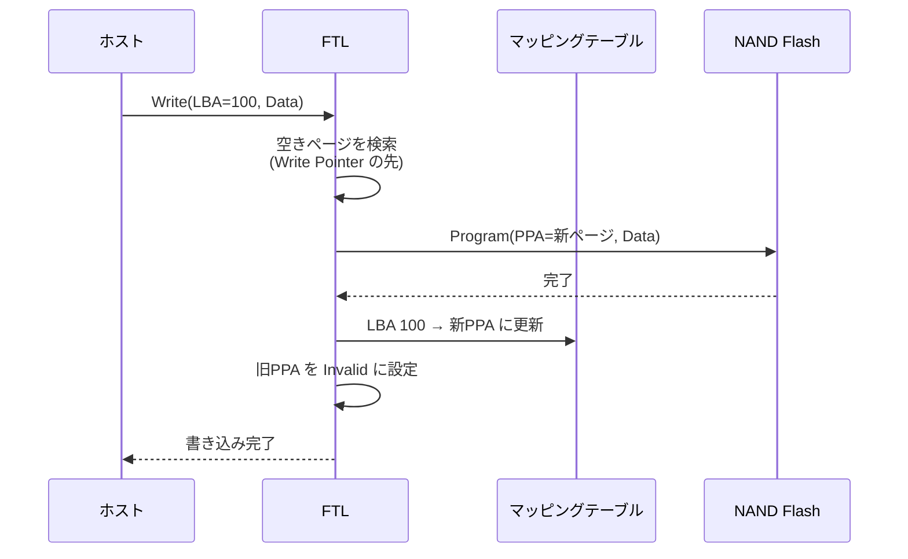
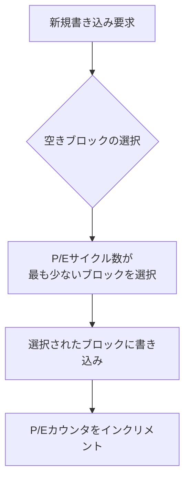
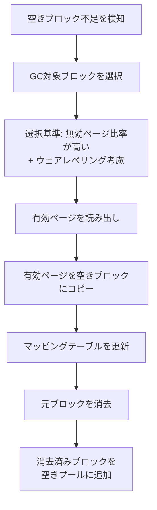
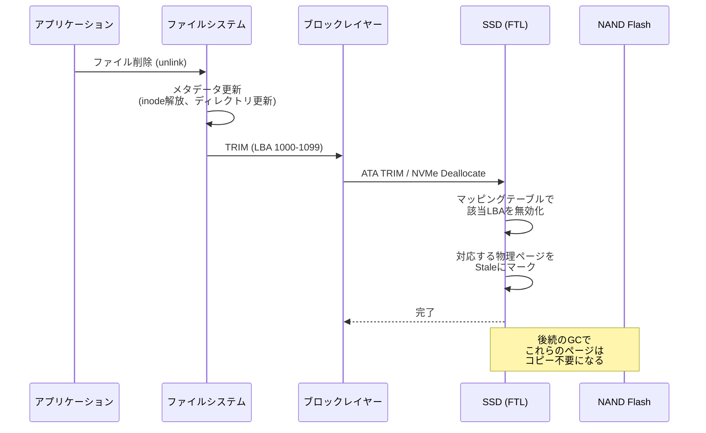
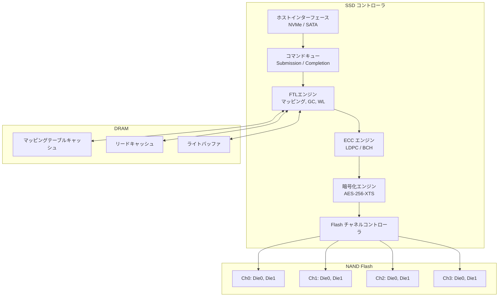
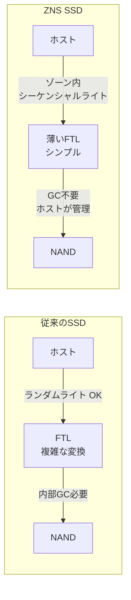

# SSD内部 — FTL, ウェアレベリング, TRIMの仕組み

## はじめに — なぜSSDの内部構造を理解すべきか

SSD（Solid State Drive）は、現代のコンピューティングにおいて最も重要なストレージデバイスの一つである。データセンターのサーバーからノートPC、スマートフォンに至るまで、あらゆる場面でHDD（Hard Disk Drive）を置き換えつつある。SSDはHDDと比較して、ランダムアクセスが数桁速く、消費電力が低く、耐衝撃性に優れる。しかし、この性能はNAND Flashメモリという特殊な記憶素子の上に、精巧なソフトウェアレイヤーを積み重ねることで実現されている。

SSDを「単なる高速なディスク」として扱うと、本来の性能を引き出せないばかりか、予期せぬ性能劣化や寿命の問題に直面することになる。SSDの内部構造を理解することは、データベース設計、ファイルシステム選択、I/Oチューニング、さらにはアプリケーション設計にまで影響を及ぼす重要な知識である。

本記事では、SSDの心臓部であるNAND Flashの物理特性から出発し、FTL（Flash Translation Layer）、ウェアレベリング、ガベージコレクション、TRIMコマンドといった中核技術を深く掘り下げる。さらに、SSDの内部アーキテクチャ、性能特性、耐久性指標、そしてZNS SSDやFDPといった最新動向まで網羅する。

---

## HDDからSSDへの移行 — パラダイムシフト

### HDDの限界

HDDは回転するプラッタ上を磁気ヘッドが移動してデータを読み書きする機械的デバイスである。この機構には本質的な制約がある。

- **シーク時間**: ヘッドの物理的移動に数ミリ秒を要する
- **回転待ち時間**: 目的のセクタがヘッド下に来るまで待つ必要がある（7,200RPMで平均4.17ms）
- **IOPS（I/O Per Second）の限界**: ランダムアクセスで典型的に100〜200 IOPS

これらの制約は物理法則に起因するため、技術の進歩で劇的に改善することは困難である。

### SSDの登場

SSDは可動部品を持たず、電気的にデータにアクセスする。これにより、ランダムリードで数万〜数十万IOPSを達成し、レイテンシはマイクロ秒単位まで低下した。しかし、SSDの基盤となるNAND Flashメモリには、HDDにはなかった独自の課題が存在する。

```
HDD                              SSD
┌─────────────────┐              ┌─────────────────┐
│  ┌───────────┐  │              │  Controller     │
│  │  Platter  │  │              │  ┌───────────┐  │
│  │  (磁気)   │  │              │  │ NAND Flash │  │
│  │     ●     │  │              │  │ ┌──┬──┬──┐ │  │
│  │    /│\    │  │              │  │ │  │  │  │ │  │
│  │   / │ \   │  │              │  │ ├──┼──┼──┤ │  │
│  │  Spindle  │  │              │  │ │  │  │  │ │  │
│  └───────────┘  │              │  │ └──┴──┴──┘ │  │
│  ← Head Arm →  │              │  └───────────┘  │
│  機械的動作が必要 │              │  電気的アクセス   │
└─────────────────┘              └─────────────────┘
ランダムリード: ~10ms              ランダムリード: ~0.1ms
IOPS: ~200                       IOPS: ~500,000
```

---

## NAND Flashの物理構造

SSDの振る舞いを理解するには、まずNAND Flashメモリの物理的な特性を把握する必要がある。NAND Flashは従来のRAMやHDDとは根本的に異なる動作原理を持つ。

### フローティングゲートとチャージトラップ

NAND Flashメモリの基本セルは、MOSFET（Metal-Oxide-Semiconductor Field-Effect Transistor）の変形であるフローティングゲートトランジスタで構成される。通常のMOSFETに加えて、絶縁体で囲まれた「フローティングゲート」と呼ばれる導体層が追加されている。

データの記録は、このフローティングゲートに電荷を注入・除去することで行われる。電荷が蓄積された状態とされていない状態で、トランジスタの閾値電圧が変化し、これを「0」と「1」の区別に利用する。

近年の3D NANDでは、フローティングゲートの代わりにチャージトラップ方式（Charge Trap Flash: CTF）が主流となっている。絶縁体中のトラップ準位に電荷を捕獲する方式で、セル間干渉の低減やスケーリングの容易さに優れる。

### セルの種類 — SLC, MLC, TLC, QLC

1つのセルに格納するビット数によって、以下の種類に分類される。

| 種類 | ビット/セル | 電圧レベル | 特徴 |
|------|-----------|-----------|------|
| SLC (Single-Level Cell) | 1 | 2 | 最高速・最高耐久性・高コスト |
| MLC (Multi-Level Cell) | 2 | 4 | バランス型 |
| TLC (Triple-Level Cell) | 3 | 8 | コスト効率重視 |
| QLC (Quad-Level Cell) | 4 | 16 | 最大容量・最低コスト |

ビット数が増えるほど、電圧マージンが狭くなり、読み取りエラー率の上昇、書き込み速度の低下、書き換え寿命の短縮を招く。SLCが10万回程度の書き換えに耐えるのに対し、QLCでは1,000回程度まで低下する。

```
SLC: 2レベル        MLC: 4レベル        TLC: 8レベル        QLC: 16レベル
┌───────────┐     ┌───────────┐     ┌───────────┐     ┌───────────┐
│           │     │           │     │     ▪     │     │  ▪  ▪  ▪  │
│           │     │     ▪     │     │   ▪   ▪   │     │ ▪ ▪ ▪ ▪  │
│     ▪     │     │   ▪   ▪   │     │  ▪  ▪  ▪  │     │▪ ▪ ▪ ▪ ▪ │
│           │     │           │     │           │     │ ▪ ▪ ▪ ▪  │
│  ▪     ▪  │     │ ▪  ▪  ▪  │     │▪ ▪ ▪ ▪ ▪ │     │▪ ▪ ▪ ▪ ▪ │
│           │     │           │     │           │     │           │
│  ▪     ▪  │     │ ▪  ▪  ▪  │     │▪ ▪ ▪ ▪ ▪ │     │▪ ▪ ▪ ▪ ▪ │
└───────────┘     └───────────┘     └───────────┘     └───────────┘
 1bit/cell          2bit/cell         3bit/cell         4bit/cell
 ~100K P/E          ~10K P/E          ~3K P/E           ~1K P/E
```

### 階層構造 — セル, ページ, ブロック, プレーン, ダイ

NAND Flashは明確な階層構造を持つ。



- **セル（Cell）**: 1つのフローティングゲートトランジスタ。最小記憶単位
- **ページ（Page）**: 読み書きの最小単位。典型的に4KB〜16KB。1つのブロック内に128〜512ページ程度
- **ブロック（Block）**: 消去の最小単位。典型的に数MB（例: 256ページ × 16KB = 4MB）
- **プレーン（Plane）**: 独立した読み書き回路を持つ単位。1ダイに通常2〜4プレーン
- **ダイ（Die）**: 1つのシリコンチップ。独立したコマンド実行が可能
- **チャネル（Channel）**: コントローラとダイを接続するバス

### 操作の非対称性 — Read, Write, Erase

NAND Flashの最も重要な特性は、3つの基本操作が大きく異なる粒度と速度を持つことである。

| 操作 | 単位 | 典型的な所要時間 | 備考 |
|------|------|---------------|------|
| Read | ページ（4〜16KB） | 25〜100 μs | 高速だが、セルの種類（SLC/TLC/QLC）で差がある |
| Write (Program) | ページ（4〜16KB） | 200〜2,000 μs | Readの数倍〜数十倍遅い |
| Erase | ブロック（数MB） | 1,500〜10,000 μs | 最も遅く、最も大きな単位で行う |

この非対称性こそが、SSD設計の最大の難題を生み出す。特に重要なのは以下の制約である。

1. **Write-before-Erase**: ページに書き込む前に、そのページを含むブロック全体を消去しなければならない
2. **No In-Place Update**: 一度書き込んだページを直接上書きすることはできない。更新は必ず別のページに書き、古いページを無効化する
3. **Sequential Page Program**: ブロック内のページは、低いページ番号から順に書き込む必要がある（ブロック内ランダム書き込み不可）

これらの制約が、FTLという精巧な間接層を必要とする根本的な理由である。

---

## FTL（Flash Translation Layer）

### FTLの必要性

ホストOS（ファイルシステムやデータベース）は、ストレージを論理ブロックアドレス（LBA: Logical Block Address）の線形配列として扱う。しかし、NAND Flashの物理的制約（上書き不可、ブロック単位消去）のため、LBAをNAND上の物理ページアドレス（PPA: Physical Page Address）にそのまま対応させることはできない。

FTLは、このギャップを埋める翻訳層である。ホストから見えるLBAと、実際のNAND上のPPAとの間の動的マッピングを管理する。



### マッピング方式

FTLのマッピングには主に3つの方式がある。

#### ページレベルマッピング

すべてのLBAページに対して個別のPPAエントリを持つ方式。最も柔軟で高性能だが、マッピングテーブルのメモリ消費が大きい。

例えば、1TBのSSDで4KBページの場合、エントリ数は約2.5億（= 1TB / 4KB）となる。各エントリが4バイトとすると、マッピングテーブルだけで約1GBのDRAMが必要となる。

```
ページレベルマッピング:

LBA        PPA
┌──────┐   ┌──────────────────┐
│ 0    │──→│ Die0/Plane1/Block5/Page3  │
│ 1    │──→│ Die1/Plane0/Block12/Page0 │
│ 2    │──→│ Die0/Plane0/Block8/Page7  │
│ 3    │──→│ Die1/Plane1/Block3/Page15 │
│ ...  │   │ ...                       │
└──────┘   └──────────────────┘
最大の柔軟性、最大のメモリ消費
```

#### ブロックレベルマッピング

ブロック単位でマッピングを行い、ブロック内のオフセットはLBAから算出する方式。メモリ消費は大幅に削減されるが、小さなランダムライトの性能が著しく低下する。ブロック内の1ページだけを更新する場合でも、ブロック全体のコピー・消去・再書き込みが必要になるためである。

#### ハイブリッドマッピング

実用的なSSDの多くはハイブリッド方式を採用する。基本はブロックレベルマッピングを使いつつ、頻繁に更新されるホットデータにはページレベルマッピングを適用する。具体的には、ログブロック（Log Block）と呼ばれるバッファ領域にランダムライトを一時的に受け取り、後でデータブロック（Data Block）にマージする。

代表的な方式として以下がある。

- **FAST (Fully Associative Sector Translation)**: ログブロックを全LBAで共有
- **DFTL (Demand-based FTL)**: ページレベルマッピングをキャッシュし、アクセスされたマッピングだけDRAMに載せる



### FTLの書き込みフロー

ホストからの書き込み要求がFTLでどう処理されるかを示す。



重要な点は、上書き（In-Place Update）ではなく、常に新しい物理ページに書き込み（Out-of-Place Update）、マッピングテーブルだけを更新することである。これがログ構造化の概念であり、SSDは本質的にログ構造化ストレージとして動作する。

---

## ウェアレベリング

### 問題の本質

NAND Flashのセルには書き換え回数の上限（P/Eサイクル: Program/Erase Cycle）がある。TLCで約3,000回、QLCで約1,000回である。もし特定のブロックにだけ書き込みが集中すると、そのブロックだけが先に寿命を迎え、SSD全体の容量が減少してしまう。

ウェアレベリング（Wear Leveling）は、書き換え回数をすべてのブロックにできるだけ均等に分散させる技術である。これによりSSD全体の寿命を最大化する。

### ダイナミックウェアレベリング

ダイナミックウェアレベリングは、書き込み対象として空きブロックを選択する際に、P/Eサイクル数が最も少ないブロックを優先的に選ぶ方式である。



この方式は実装が比較的単純で、頻繁に書き換えられる「ホットデータ」の分散に効果的である。しかし、一度書き込んだ後ほとんど更新されない「コールドデータ」（OSのシステムファイルなど）が特定のブロックを占有し続け、それらのブロックのP/Eサイクル数が他のブロックと比べて極端に少ないままになるという問題がある。

### スタティックウェアレベリング

スタティックウェアレベリングは、ダイナミックウェアレベリングの限界を克服するために、コールドデータも積極的に移動させる方式である。

具体的には、P/Eサイクル数が著しく少ないブロック（コールドデータが格納されたブロック）を見つけた場合、そのコールドデータをP/Eサイクル数が多いブロックに移動し、解放されたP/Eサイクル数が少ないブロックをホットデータの書き込みに使用する。

```
スタティックウェアレベリングの動作:

Before:
Block A (P/E: 50)   → コールドデータ（OS、ほぼ不変）
Block B (P/E: 2950) → ホットデータ（頻繁に更新）
Block C (P/E: 2800) → ホットデータ

After:
Block A (P/E: 51)   → ホットデータ（今後の書き込みに使用）
Block B (P/E: 2951) → コールドデータ（Aから移動）
Block C (P/E: 2800) → ホットデータ

→ Block A のP/Eサイクルを消費することで全体を均等化
```

スタティックウェアレベリングは、データの不必要なコピー（コールドデータの移動）を伴うため、Write Amplificationを増加させるというトレードオフがある。しかし、SSD全体の寿命を最大化するという観点では、ダイナミックウェアレベリングだけでは不十分であり、両方の組み合わせが実用的なSSDでは採用されている。

### ウェアレベリングのアルゴリズム

実際のウェアレベリングアルゴリズムは、以下のような要素を考慮して設計される。

1. **P/Eサイクル数の差分閾値**: ブロック間のP/Eサイクル差がどれだけ開いたらスタティックウェアレベリングを発動するか
2. **コールドデータの判定**: どの程度の期間更新されていないデータを「コールド」と判定するか
3. **GCとの統合**: ガベージコレクション時にウェアレベリングも同時に行う方が効率的
4. **オーバーヘッドの制御**: ウェアレベリングのためのデータ移動が通常のI/O性能を圧迫しないようにする

---

## ガベージコレクションとWrite Amplification

### ガベージコレクション（GC）の必要性

SSDでは上書きができないため、データの更新は常に新しいページへの書き込みと旧ページの無効化で行われる。時間が経つと、ブロック内に有効ページと無効ページ（stale page）が混在した状態になる。新しいデータを書き込むための空きブロックを確保するには、無効ページを含むブロックを「掃除」して空きブロックを作り出す必要がある。これがガベージコレクション（GC）である。

```
ブロック内のページ状態:
┌────┬────┬────┬────┬────┬────┬────┬────┐
│有効│無効│有効│無効│無効│有効│無効│無効│  ← GC対象候補
└────┴────┴────┴────┴────┴────┴────┴────┘
  ↓ GC実行
  1. 有効ページを別ブロックにコピー
  2. 元のブロック全体を消去
  3. 消去済みブロックを空きプールに追加
```

### GCの実行フロー



### GC対象ブロックの選択戦略

GCの効率は、どのブロックを回収対象として選択するかに大きく依存する。

- **Greedy**: 無効ページ数が最も多いブロックを選択。有効データのコピー量を最小化できるが、コールドデータブロックが選ばれにくい
- **Cost-Benefit**: 無効ページ比率に加えて、ブロックの「年齢」（最後に書き込まれてからの経過時間）も考慮。コールドデータを含む古いブロックは将来も変化しにくいため、回収の優先度を下げる
- **d-Choice**: ランダムにd個のブロックを選び、その中で最も無効ページが多いものを選択。計算コストと性能のバランスが良い

### Write Amplification（WA）

Write Amplification は、ホストが書き込んだデータ量に対して、実際にNAND Flashに書き込まれるデータ量の比率である。

$$WA = \frac{\text{NAND への実書き込み量}}{\text{ホストからの書き込み量}}$$

理想的にはWA = 1だが、GCによる有効ページのコピーやウェアレベリングによるデータ移動があるため、実際には1より大きくなる。

WAが大きいほど、以下の悪影響がある。

1. **NAND寿命の消費加速**: 実際のP/Eサイクルがホスト書き込み量以上に消費される
2. **書き込み帯域の浪費**: GCのバックグラウンド書き込みがホストI/Oの帯域を圧迫する
3. **レイテンシの増大**: GCと通常I/Oが競合し、テールレイテンシが悪化する

WAに影響を与える主な要因は以下の通りである。

| 要因 | WAへの影響 |
|------|-----------|
| Over-Provisioning（OP）率 | OP率が高いほどWAは低下 |
| ワークロードのランダム性 | ランダムライトが多いほどWAは増大 |
| TRIM/Discardの利用 | 無効ページの早期通知でWAを低減 |
| GCアルゴリズムの効率 | 良いアルゴリズムほどWAを抑制 |
| データの局所性 | ホットデータとコールドデータの分離でWA低減 |

### Over-Provisioning（OP）

Over-Provisioning は、SSDの総NAND容量のうち、ユーザーに公開せず内部的に予約する領域の比率である。

$$OP\% = \frac{\text{NAND総容量} - \text{ユーザー公開容量}}{\text{ユーザー公開容量}} \times 100$$

例えば、256GBのNANDを搭載しつつ、ユーザーには240GBだけ公開するSSDのOP率は約6.7%である。エンタープライズ向けSSDでは、OP率が28%以上のものもある。

OPが大きいほど以下の利点がある。

- 空きブロックが常に多く確保されるため、GCの発動頻度が下がる
- GC時のデータ移動量が減り、WAが低下する
- 突発的な大量書き込みに対するバッファとなる
- 結果として、安定した書き込み性能と長い寿命を実現する

```
Over-Provisioningの概念:

SSD 容量構成（例: 256GB NAND）
┌──────────────────────────────────────────────┐
│        ユーザー公開領域（240GB）              │ OP領域 │
│                                              │(16GB)  │
│  ホストから見える領域                          │ 内部用 │
│  (LBA空間)                                   │        │
└──────────────────────────────────────────────┘
                                                ↑
                                    GC用バッファ、交換ブロック、
                                    マッピングテーブル格納など
```

---

## TRIMコマンドの仕組みと重要性

### TRIMが解決する問題

従来のブロックデバイスインターフェースには根本的な設計上の問題がある。ホストOSがファイルを削除したとき、ファイルシステムはメタデータ（inode、ディレクトリエントリ）を更新するだけで、実際にストレージデバイスに「このLBAはもう不要である」と通知することはなかった。HDDではこの通知の欠如は問題にならなかった。上書きが自由にできるため、不要になったセクタは次回の書き込みで単に上書きされるだけだからである。

しかしSSDでは、この情報の欠如が深刻な問題を引き起こす。FTLはファイルシステムレベルの削除を知ることができないため、実際にはもう不要になったデータを「有効」として扱い続ける。結果として以下の問題が生じる。

1. **GC効率の悪化**: 実際には不要なデータがGC時にコピーされ、WAが増大する
2. **空きブロックの枯渇**: 不要なデータが物理ブロックを占有し続ける
3. **書き込み性能の低下**: 空きブロック不足でGCが頻発し、ホストI/Oと競合する

### TRIMコマンドの動作

TRIM（ATA: DATA SET MANAGEMENT / NVMe: Deallocate / SCSI: UNMAP）は、ホストOSからSSDに対して「指定したLBA範囲のデータはもう不要である」と通知するコマンドである。



### TRIMの実装方式

TRIMコマンドの処理方式には、いくつかのバリエーションがある。

#### Non-Deterministic TRIM

TRIM後の該当LBAへのリード結果が不定（ゼロ、旧データ、ランダムデータのいずれかが返る可能性がある）。FTLは内部的にマッピングを削除するだけで、物理ページの内容は消去しない。最も一般的な実装方式。

#### Deterministic TRIM (DRAT)

TRIM後の該当LBAへのリードが、すべて同じ値を返すことが保証される（ただし、その値が何であるかは指定されない）。

#### Deterministic Read Zero after TRIM (RZAT)

TRIM後の該当LBAへのリードが、すべてゼロを返すことが保証される。セキュリティ要件が高い環境で重要。

### ファイルシステムでのTRIM利用

Linux環境では、TRIMの利用方法が2つある。

#### Continuous TRIM（リアルタイムTRIM）

マウントオプション `discard` を指定することで、ファイル削除のたびに即座にTRIMが発行される。

```bash
# /etc/fstab example
/dev/nvme0n1p1  /  ext4  defaults,discard  0  1
```

メリットは常に最新の状態が反映されることだが、小さな削除が大量に発生すると、TRIMコマンドのオーバーヘッドが無視できなくなる場合がある。

#### Periodic TRIM（定期TRIM）

`fstrim` コマンドを定期的に（例: 週1回）実行することで、まとめてTRIMを発行する。多くのLinuxディストリビューションでは `fstrim.timer` が systemd タイマーとして提供されている。

```bash
# Run fstrim manually
sudo fstrim -v /

# systemd timer status
systemctl status fstrim.timer
```

定期TRIMは、TRIMコマンドのオーバーヘッドをまとめて処理できるため、通常のI/O性能への影響が小さい。現在では多くのディストリビューションでこちらがデフォルトとなっている。

### TRIMの注意点と制約

TRIMにはいくつかの注意点がある。

1. **暗号化との相互作用**: フルディスク暗号化（dm-crypt/LUKS）環境でTRIMを有効にすると、どのブロックが使用中でどのブロックが空いているかが暗号化層を通して漏洩する可能性がある。これはセキュリティ上の懸念となりうる
2. **RAID構成での制限**: ソフトウェアRAIDやハードウェアRAIDの種類によっては、TRIMが正しくパススルーされない場合がある
3. **パフォーマンスへの影響**: 大量のTRIMコマンドを一度に発行すると、SSDコントローラの処理能力を圧迫し、一時的な性能低下を招くことがある
4. **Queued TRIM**: 初期のTRIMはNCQ（Native Command Queuing）と互換性がなく、TRIM実行中は他のコマンドがブロックされた。Queued TRIMの導入により、この問題は解消されている

---

## SSDの内部アーキテクチャ

### コントローラ

SSDコントローラは、SSD全体の頭脳であり、高性能な組込みプロセッサで構成される。主要な役割は以下の通りである。

- ホストインターフェース（SATA/NVMe）のプロトコル処理
- FTLアルゴリズムの実行
- ECC（Error Correcting Code）によるデータ整合性保護
- ウェアレベリングとGCの管理
- 暗号化エンジン（AES-256等）の制御
- 電源喪失時のデータ保護



### DRAMキャッシュとHMB

多くのSSDは外部DRAM（通常、SSD容量1GBあたり1MBのDRAM）を搭載し、FTLのマッピングテーブルをキャッシュする。1TBのSSDでは約1GBのDRAMが搭載されるのが典型的である。

DRAMを搭載しないDRAM-less SSDも存在する。これらは低コストだが、マッピングテーブルのキャッシュミスが発生するたびにNANDへのアクセスが必要となり、性能が低下する可能性がある。NVMe規格ではHMB（Host Memory Buffer）という仕組みが用意されており、ホストのメインメモリの一部をSSDのマッピングテーブルキャッシュとして貸し出すことができる。

```
DRAM搭載 SSD:
┌──────────┐     ┌──────────┐     ┌──────────┐
│ コントローラ │←──→│   DRAM   │←──→│   NAND   │
│          │     │ (1GB)    │     │ (1TB)    │
└──────────┘     │マッピング  │     └──────────┘
                 │テーブル全体│
                 └──────────┘

DRAM-less SSD (HMB使用):
┌──────────┐                    ┌──────────┐
│ コントローラ │←───────────────→│   NAND   │
│          │                    │ (1TB)    │
└──────┬───┘                    └──────────┘
       │ PCIe
       ↓
┌──────────────┐
│ ホストメモリ    │
│ HMB領域(64MB) │  ← マッピングテーブルの一部をキャッシュ
└──────────────┘
```

### チャネル並列性

SSDの高い帯域幅は、複数のNANDチャネルを並列に動作させることで実現される。現代のSSDコントローラは通常4〜8チャネルを持ち、各チャネルに複数のダイが接続される。

並列性は複数のレベルで活用される。

| 並列性レベル | 説明 | 効果 |
|-------------|------|------|
| チャネルレベル | 異なるチャネルのダイに同時にアクセス | 帯域幅がチャネル数に比例して増大 |
| ダイレベル | 同一チャネル上の異なるダイにインターリーブ | チャネル帯域の有効利用 |
| プレーンレベル | 同一ダイ内の異なるプレーンにマルチプレーン操作 | 単一ダイのスループット向上 |

```mermaid
flowchart LR
    subgraph "コントローラ"
        C[FTL / スケジューラ]
    end

    subgraph "チャネル 0"
        D0[Die 0<br/>Plane 0 | Plane 1]
        D1[Die 1<br/>Plane 0 | Plane 1]
    end

    subgraph "チャネル 1"
        D2[Die 2<br/>Plane 0 | Plane 1]
        D3[Die 3<br/>Plane 0 | Plane 1]
    end

    subgraph "チャネル 2"
        D4[Die 4<br/>Plane 0 | Plane 1]
        D5[Die 5<br/>Plane 0 | Plane 1]
    end

    subgraph "チャネル 3"
        D6[Die 6<br/>Plane 0 | Plane 1]
        D7[Die 7<br/>Plane 0 | Plane 1]
    end

    C --> D0
    C --> D1
    C --> D2
    C --> D3
    C --> D4
    C --> D5
    C --> D6
    C --> D7
```

4チャネル、チャネルあたり2ダイ、ダイあたり2プレーンの構成では、理論上16の操作を並列に実行できる。ただし、同一チャネル上のダイは物理的にバスを共有するため、真の並列ではなくインターリーブとなる。

### ECC（Error Correcting Code）

NAND Flashはその物理特性上、ビットエラーが避けられない。P/Eサイクルの増加、データ保持時間の経過、セル間干渉（Program Disturb、Read Disturb）などにより、エラー率は徐々に増大する。

SSDコントローラはECCエンジンを内蔵し、書き込み時にECC符号を付加し、読み出し時にエラーを検出・訂正する。

- **BCH (Bose-Chaudhuri-Hocquenghem)**: 初期のSSDで使用。比較的シンプルだが訂正能力に限界
- **LDPC (Low-Density Parity-Check)**: 現代のSSDで主流。強力な誤り訂正能力を持ち、TLC/QLCのような高エラー率のNANDでも信頼性を確保

LDPCは、軽度の誤りにはハードデシジョンデコード（高速）、重度の誤りにはソフトデシジョンデコード（低速だが高い訂正能力）と段階的にデコード戦略を切り替える。このため、NANDの劣化が進むと読み取りレイテンシが増大する傾向がある。

### 電源喪失保護

書き込み中に突然の電源喪失が発生すると、以下のデータが失われる可能性がある。

- DRAMキャッシュ上のマッピングテーブル
- ライトバッファ内の未書き込みデータ
- 書き込み途中のNANDページ

エンタープライズ向けSSDは、PLP（Power Loss Protection）として電解コンデンサやバッテリバックアップを搭載し、電源喪失時にDRAM上のデータをNANDに退避させる。コンシューマ向けSSDでは、コスト上の理由からPLPが省略されることが多く、ファイルシステムやアプリケーション側でのデータ保護が重要となる。

---

## SSD性能特性

### ランダム vs シーケンシャル

SSDはHDDと異なり、ランダムアクセスとシーケンシャルアクセスの性能差が小さいとよく言われるが、実際にはまだ差がある。

| アクセスパターン | 4K ランダムリード | 4K ランダムライト | シーケンシャルリード | シーケンシャルライト |
|---------------|-----------------|-----------------|-------------------|-------------------|
| 典型的NVMe SSD | 500K〜1M IOPS | 300K〜800K IOPS | 5,000〜7,000 MB/s | 4,000〜6,000 MB/s |
| 典型的SATA SSD | 80K〜100K IOPS | 60K〜80K IOPS | 500〜560 MB/s | 450〜530 MB/s |

シーケンシャルアクセスが速い理由は以下の通りである。

1. **チャネル並列性の最大活用**: 連続したLBAはFTLにより異なるチャネルのダイにストライピングされるため、読み書きが並列化される
2. **先読みの効果**: コントローラが次のアクセスを予測して先読みできる
3. **SLCキャッシュの利用**: 多くのTLC/QLC SSDはSLCモードのキャッシュ領域を持ち、短時間のバースト書き込みを吸収する
4. **GCの影響軽減**: シーケンシャルライトはブロック全体を効率的に埋めるため、GCが発生しにくい

### Queue Depth（QD）の影響

SSDの性能を引き出すには、十分なQueue Depth（同時発行I/O数）が必要である。

```
IOPS vs Queue Depth (典型的なNVMe SSD):

IOPS
 │
1M┤                    ━━━━━━━━━━━━━━━
  │               ╱
  │            ╱
  │         ╱
  │       ╱
  │     ╱
  │   ╱
100K┤ ╱
  │╱
  ├──┬──┬──┬──┬──┬──┬──┬──→ Queue Depth
  1  2  4  8  16 32 64 128

QD=1: コントローラの並列性を活用できず低IOPS
QD=32以上: 十分な並列性が確保され、IOPSが飽和
```

QD=1でも十分な性能を出すのは、レイテンシの短さによる。NVMe SSDのランダムリードレイテンシは約70〜100μsであるため、QD=1でも理論上は10,000〜14,000 IOPSを達成できる。しかし、SSD内部の並列性を最大限に活用するには、複数のI/Oを同時に発行して各チャネルを同時に動かす必要がある。

NVMeプロトコルは最大65,535個のI/Oキューを持ち、各キューに最大65,536個のコマンドをキューイングできる。これにより、マルチコアCPUからの高並列I/Oを効率的に処理できる。

### SLC キャッシュの振る舞い

多くのコンシューマ向けTLC/QLC SSDは、NANDの一部をSLCモードで動作させるSLCキャッシュ（擬似SLCキャッシュ）を備えている。SLCモードでは1セルに1ビットしか書き込まないため、書き込み速度がTLCの3〜4倍になる。

SLCキャッシュが尽きると、TLC/QLCモードでの直接書き込みに切り替わり、書き込み速度が大幅に低下する。これがSSDの「息切れ」と呼ばれる現象である。

```
書き込み速度 vs 累積書き込み量:

速度(MB/s)
 │
5000┤━━━━━━━━━━━━━━━━┓
    │ SLCキャッシュ領域 ┃
    │                  ┃
    │                  ┃
2000┤                  ┃
    │                  ┃
    │                  ┗━━━━━━━━━━━━━━━━━━━
    │                    TLC/QLC 直接書き込み
 500┤
    │
    ├──────────────────┬───────────────────→ 累積書き込み量
                   SLCキャッシュ
                   枯渇ポイント
```

SLCキャッシュの実装方式には以下がある。

- **Static SLC Cache**: 固定領域をSLC専用に確保。容量は小さいが、安定した動作
- **Dynamic SLC Cache**: 空きTLC/QLC領域の一部を動的にSLCモードで使用。空き容量が多いほど大きなSLCキャッシュが利用可能だが、SSD使用率が上がるとキャッシュ容量が縮小する
- **Hybrid**: 両者を組み合わせた方式

### Steady State性能

SSDの性能を正確に評価するには、「定常状態（Steady State）」での性能を測定する必要がある。新品のSSDはすべてのブロックが消去済みであるため、GCが発生せず最高の性能を示す。しかし、SSD全体にデータが書き込まれてGCが定常的に動作する状態では、性能が低下する。

エンタープライズ向けSSDの仕様書では、24時間以上のランダムライトで定常状態に到達した後の性能を記載するのが一般的である。コンシューマ向けSSDのレビューで見かけるバースト性能は、定常状態の性能を反映していないことが多い点に注意が必要である。

---

## 耐久性指標 — TBW, DWPD

### P/Eサイクルとエンデュランス

NAND Flashの各セルは有限回数しか書き換えできない。この書き換え可能回数がP/Eサイクルである。

| NANDタイプ | 典型的P/Eサイクル |
|-----------|-----------------|
| SLC | 50,000〜100,000 |
| MLC | 3,000〜10,000 |
| TLC | 1,000〜3,000 |
| QLC | 500〜1,000 |

### TBW（Total Bytes Written）

TBWは、SSDの保証期間内にホストから書き込める総データ量である。例えば、1TB TLC SSDでTBW = 600TBとは、ホストから合計600TBのデータを書き込むまで正常動作が保証されるという意味である。

TBWの計算:

$$TBW = \frac{\text{NAND容量} \times \text{P/Eサイクル数}}{WA}$$

例: 1TB TLC NAND、P/E = 3,000、WA = 3の場合:

$$TBW = \frac{1\text{TB} \times 3000}{3} = 1000\text{TB}$$

### DWPD（Drive Writes Per Day）

DWPDは、保証期間（通常5年）にわたって1日あたりSSD全容量の何倍のデータを書き込めるかを示す指標である。エンタープライズ環境で主に使用される。

$$DWPD = \frac{TBW}{\text{SSD容量} \times 365 \times \text{保証年数}}$$

例: 1TB SSD、TBW = 600TB、保証5年の場合:

$$DWPD = \frac{600}{1 \times 365 \times 5} \approx 0.33$$

典型的な値:

| 用途 | DWPD |
|------|------|
| リードインテンシブ（QLC/TLC） | 0.1〜0.3 |
| 混合ワークロード（TLC） | 1〜3 |
| ライトインテンシブ（MLC/SLC） | 5〜10+ |

### エンデュランスの実際

SSDの実際の寿命は、公称のTBWを大きく超えることが多い。これは、メーカーが十分なマージンを持って仕様を設定しているためである。Tech Powerupの大規模耐久テストやBackblazeのデータセンター運用レポートでは、多くのコンシューマ向けSSDがTBWの数倍〜10倍以上のデータを書き込んでも動作し続けたという報告がある。ただし、TBWを超えた使用はメーカー保証外であり、突然のデータ損失のリスクを伴う。

---

## 最新動向

### QLC NANDの普及と課題

QLC（Quad-Level Cell）は1セルに4ビットを格納し、ビットあたりのコストを最小化する。HDDの置き換えを狙うリード中心のワークロード（コールドストレージ、CDN、アーカイブ）に適している。

しかし、QLCには固有の課題がある。

1. **低い書き込み性能**: SLCキャッシュ枯渇後の直接書き込みは、TLCの半分以下の速度になることがある
2. **短いP/Eサイクル**: 500〜1,000回程度で、ライトインテンシブな用途には不向き
3. **リテンション問題**: 電圧マージンが狭いため、長期間のデータ保持性能がTLCより低い
4. **ECCの負荷増大**: エラー率が高いため、より強力（= より遅い）ECCが必要

これらの課題に対して、大容量SLCキャッシュの採用、高度なECC（LDPC + ソフトデシジョンデコード）、読み出し電圧の適応調整（Read Voltage Calibration）などの技術で対応が進んでいる。

### ZNS SSD（Zoned Namespace SSD）

ZNS SSDは、SSD内部のGCやウェアレベリングの非効率性を根本的に解決しようとする新しいアプローチである。従来のSSDが内部で複雑なFTLを動かしてNANDの制約を隠蔽していたのに対し、ZNS SSDはNANDの制約の一部をホストに露出する。

ZNS SSDでは、LBA空間がゾーン（Zone）に分割される。各ゾーンは以下の特性を持つ。

- ゾーン内のデータはシーケンシャルに書き込む必要がある（ランダムライト不可）
- ゾーン全体をリセット（消去）することで再利用する
- この特性はNAND Flashのブロックの制約に近い



ZNS SSDの利点:

| 項目 | 従来のSSD | ZNS SSD |
|------|----------|---------|
| Write Amplification | 1.5〜3.0 | 1.0に近い |
| Over-Provisioning | 7〜28% | 最小限 |
| GC | SSD内部で実行 | 不要（ホストが管理） |
| テールレイテンシ | GCによるスパイク | 安定 |
| DRAM要件 | 大容量（マッピングテーブル） | 小容量 |

ただし、ZNS SSDを活用するには、ファイルシステム（f2fs）やアプリケーション（RocksDB）がゾーンインターフェースに対応する必要がある。既存のブロックインターフェースを前提としたソフトウェアスタックとの互換性がないため、採用にはソフトウェア側の対応が不可欠である。

Linuxカーネルではゾーンブロックデバイスのサポートが進んでおり、`dm-zoned`（デバイスマッパー）を使えば、ZNS SSDを通常のブロックデバイスとしてエミュレートすることも可能である。

### FDP（Flexible Data Placement）

FDP（Flexible Data Placement）は、NVMe 2.0仕様で導入された新しいデータ配置機構である。ZNS SSDと同様にWAの削減を目指すが、より穏やかなアプローチを取る。

ZNS SSDがシーケンシャルライトをホストに強制するのに対し、FDPはホストが「配置ヒント（Reclaim Unit Handle）」を指定してデータの配置先をコントロールする仕組みである。これにより、異なるライフタイムを持つデータ（ホットデータとコールドデータ）を異なる物理領域に配置でき、GC時の有効データコピーを削減する。

```
FDPの概念:

ホスト側:
  書き込み要求 + Reclaim Unit Handle (RUH)
    RUH 0: ホットデータ（メタデータ、WALなど）
    RUH 1: ウォームデータ（頻繁に更新されるユーザーデータ）
    RUH 2: コールドデータ（ログ、アーカイブ）

SSD側:
  ┌──────────────────┐
  │ RUH 0 → ブロック群A │  ← ホットデータ専用
  │ RUH 1 → ブロック群B │  ← ウォームデータ専用
  │ RUH 2 → ブロック群C │  ← コールドデータ専用
  └──────────────────┘

  → 異なるライフタイムのデータが混在しないため、
    GC時の有効データコピーが大幅に減少
```

FDPの重要な利点は、従来のブロックインターフェースとの後方互換性が維持される点である。FDP非対応のソフトウェアは通常のNVMe SSDとして使い続けることができ、対応ソフトウェアはヒントを活用して性能を向上させることができる。

Meta（旧Facebook）は自社データセンターでのFDP導入により、WAを最大50%削減できたと報告している。

### 3D NAND の高層化

NAND Flashの容量増大は、セルの微細化だけでなく、3D（垂直）方向への積層によっても実現されている。Samsung、SK hynix、Micronなどの主要メーカーは200層以上の3D NANDを量産しており、300層以上への積層が次の技術目標となっている。

3D NAND の高層化がもたらす効果:

1. **容量密度の向上**: 同一フットプリントでより大きな容量を実現
2. **コストの低減**: ビットあたりの製造コストが低下
3. **セル特性の改善**: 微細化の限界に依存しないため、セルの信頼性が向上
4. **読み書き性能の改善**: プレーン数の増加により並列性が向上

一方で、高層化に伴い製造の歩留まり低下、ワード線抵抗の増大、隣接セル間の干渉増大といった課題も顕在化している。

### Computational Storage

近年のトレンドとして、SSD内部に計算能力を持たせるComputational Storage Device（CSD）の研究開発が進んでいる。SSDコントローラ上にプログラマブルなアクセラレータを搭載し、データの検索、フィルタリング、圧縮・展開、暗号化などをストレージ側で実行する。

これにより、ホストCPUとSSD間のデータ転送量を削減し、特定のワークロードでシステム全体の性能と電力効率を向上させることが期待されている。SNIA（Storage Networking Industry Association）がComputational Storageの標準化を進めている。

---

## まとめ — SSD設計の本質的なトレードオフ

SSDの内部構造を理解すると、この技術が直面している本質的なトレードオフが見えてくる。

### NAND Flashの制約とソフトウェアの役割

NAND Flashは安価で高密度な不揮発メモリだが、「上書き不可」「ブロック単位消去」「有限の書き換え寿命」という根本的な制約を持つ。FTL、ウェアレベリング、ガベージコレクション、TRIMといった技術は、これらの制約を隠蔽・緩和するためのソフトウェアレイヤーである。

しかし、完全な隠蔽は不可能である。Write Amplification、GCによるテールレイテンシ、SLCキャッシュ枯渇後の性能低下、定常状態でのスループット低下といった形で、NAND Flashの物理的制約はSSDの振る舞いに現れる。

### ホスト-デバイス間の情報共有

ZNS SSDやFDPのような最新技術は、「NANDの制約をデバイス内部で完全に隠蔽する」という従来のアプローチを再考し、ホストとデバイスの間で情報を共有することでシステム全体の効率を向上させようとしている。これは、ストレージスタック全体の設計思想の転換を示している。

### 実務への示唆

SSDの内部構造を理解することで、以下のような実務的な判断が可能になる。

- **TRIM/Discardの適切な設定**: ファイルシステムやLVMでのTRIM設定を適切に行い、SSDの長期的な性能を維持する
- **Over-Provisioningの考慮**: 書き込みが多いワークロードでは、SSDの全容量を使い切らず一定の空き領域を確保する
- **ワークロードに適したSSD選択**: DWPD要件に基づいて、リードインテンシブかライトインテンシブかを判断し、適切なSSD（QLC/TLC/MLC）を選択する
- **データ配置の最適化**: ホットデータとコールドデータを異なるSSDやパーティションに分離することで、GC効率を向上させる
- **定常状態性能の評価**: ベンチマーク時にはバースト性能ではなく定常状態の性能を重視する

SSDは「ただの速いディスク」ではない。その内部では、物理法則の制約の中で最高の性能と寿命を引き出すために、洗練されたアルゴリズムが24時間365日動き続けている。この事実を理解することが、SSDを最大限に活用するための第一歩である。
