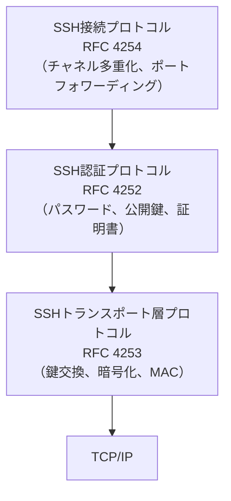
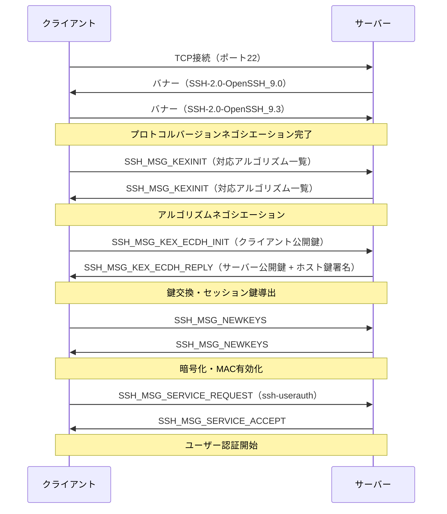
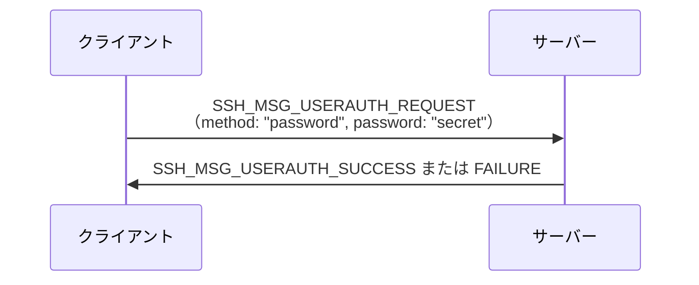
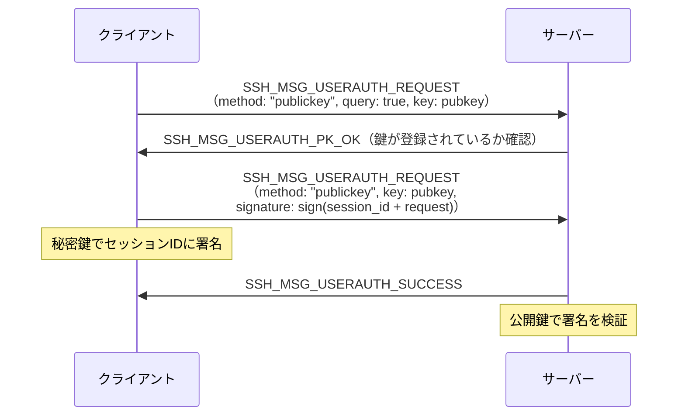
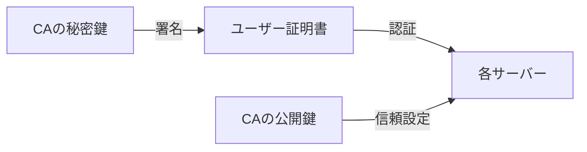
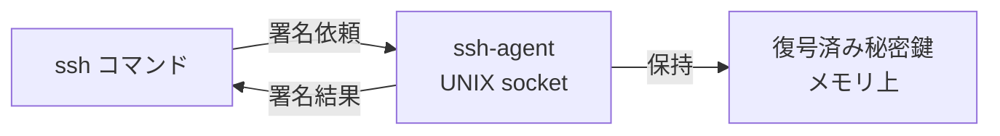
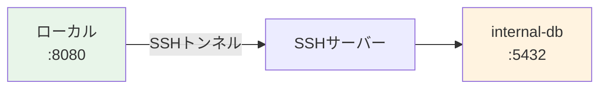
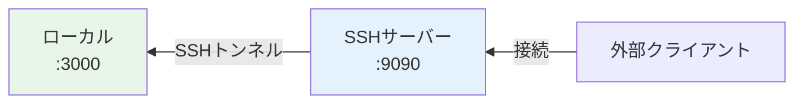
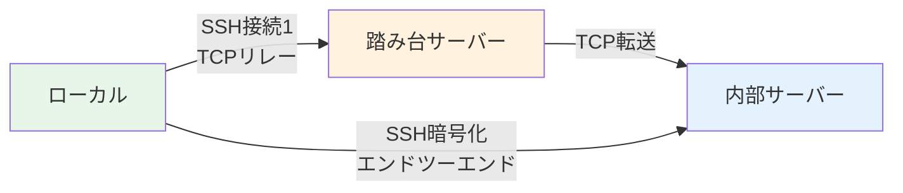

# SSHの仕組みと応用

## 1. はじめに：なぜSSHが必要になったのか

### 1.1 rshとtelnetの時代

1990年代初頭まで、UNIX系システムのリモートログインには **rsh（remote shell）** や **telnet** が使われていた。これらのプロトコルはシンプルで使いやすかったが、致命的な欠陥を抱えていた。

**通信が平文である**ということだ。

telnetでログインすると、ユーザー名・パスワード・コマンドの出力・すべてのデータがネットワーク上を素のテキストで流れる。同じネットワークセグメントにいる攻撃者は、単純なパケットキャプチャツールで認証情報を盗むことができた。

rshはさらに問題があった。ホストベース認証（`~/.rhosts` や `/etc/hosts.equiv`）に依存しており、IPアドレスを偽装するだけで認証を回避できた。**IPスプーフィング攻撃**に対して根本的に無防備だったのである。

1994年11月、フィンランドのヘルシンキ工科大学の Tatu Ylönen は、自身の所属するネットワークでパスワードスニッフィング攻撃を目撃したことをきっかけに、これらの問題を解決するプロトコルの設計に着手した。

### 1.2 SSH-1の誕生

Ylönen が1995年に公開した **SSH-1（SSH Protocol Version 1）** は、当初から以下の目標を掲げていた：

- 通信の暗号化（盗聴防止）
- 強力な認証（パスワードスニッフィング防止）
- データの完全性保証（改ざん検知）

SSH-1は急速に普及したが、設計上の欠陥が次第に明らかになった。MAC（Message Authentication Code）の脆弱性、RSA鍵交換の問題、CRC-32による完全性保護の弱さなどである。特に「インサーション攻撃」と呼ばれる、暗号化ストリームへの任意データ挿入が可能な脆弱性が発見され、SSH-1は実質的に廃止された。

### 1.3 SSH-2の標準化

SSH-1の欠陥を教訓に、1996年から設計が始まった **SSH-2** は、2006年にRFC 4250〜4256として正式にIETFで標準化された。SSH-2はSSH-1とは互換性のない、根本的に再設計されたプロトコルである。

SSH-2の主な改善点：

| 項目 | SSH-1 | SSH-2 |
|---|---|---|
| 鍵交換 | RSA固定 | Diffie-Hellman, ECDH等を選択可能 |
| 暗号化 | DES, 3DES, Blowfish | AES, ChaCha20等 |
| 完全性 | CRC-32（弱い） | HMAC-SHA2等 |
| 認証 | RSA | RSA, DSA, ECDSA, Ed25519等 |
| マルチプレックス | なし | 単一接続上に複数チャネル |

現在「SSH」と言えばSSH-2を指す。SSH-1はセキュリティ上の理由から使用すべきでない。

## 2. SSHのプロトコルアーキテクチャ

SSH-2は3つの層からなるプロトコルスタックとして設計されている。



- **トランスポート層プロトコル**：サーバー認証、暗号化、完全性保護、オプションの圧縮を提供する。TCPの上で動作し、安全な双方向バイトストリームを構築する。
- **認証プロトコル**：クライアント（ユーザー）の認証を行う。トランスポート層が確立した安全なチャネル上で動作する。
- **接続プロトコル**：安全なチャネルを複数の論理チャネルに多重化する。インタラクティブセッション、ポートフォワーディング、X11転送などを実現する。

## 3. SSHハンドシェイクとトランスポート層

### 3.1 接続確立の全体フロー



### 3.2 アルゴリズムネゴシエーション

`SSH_MSG_KEXINIT` メッセージには、以下のカテゴリのアルゴリズムリストが含まれる：

- **kex_algorithms**：鍵交換アルゴリズム（例：`curve25519-sha256`, `diffie-hellman-group14-sha256`）
- **server_host_key_algorithms**：ホスト鍵の署名アルゴリズム（例：`ssh-ed25519`, `rsa-sha2-256`）
- **encryption_algorithms_c2s / s2c**：暗号化アルゴリズム（例：`aes128-ctr`, `chacha20-poly1305@openssh.com`）
- **mac_algorithms_c2s / s2c**：MACアルゴリズム（例：`hmac-sha2-256`, `umac-64-etm@openssh.com`）
- **compression_algorithms_c2s / s2c**：圧縮アルゴリズム（例：`none`, `zlib@openssh.com`）

各リストの先頭から共通するものが優先して選択される。

### 3.3 鍵交換アルゴリズム

現在の主要な鍵交換アルゴリズム：

**curve25519-sha256**（推奨）
- Daniel J. Bernstein が設計した楕円曲線 Curve25519 を用いた ECDH
- 実装のシンプルさとサイドチャネル攻撃耐性が高い
- OpenSSH 6.5以降でデフォルト

**diffie-hellman-group14-sha256**
- 2048ビットの素数群を用いた従来のDH鍵交換
- 広く互換性があるが、group14は現在ギリギリ安全とされる最小サイズ

**ecdh-sha2-nistp256**
- NIST P-256曲線を用いたECDH
- NSAによる設計で一部の専門家が懸念を示している

### 3.4 ホスト鍵認証とKnown Hosts

鍵交換と同時に、**サーバーのホスト鍵認証**が行われる。この仕組みがSSHを中間者攻撃から守る核心である。

サーバーは鍵交換の応答に「ホスト公開鍵 + セッションIDへの署名」を含める。クライアントは：

1. 受け取ったホスト公開鍵が `~/.ssh/known_hosts` に記録されているか確認する
2. 記録がなければ（初回接続）、フィンガープリントを表示してユーザーに確認を求める
3. 記録がある場合は署名を検証し、ホスト鍵が一致するか確認する

```
The authenticity of host 'example.com (203.0.113.1)' can't be established.
ED25519 key fingerprint is SHA256:abc123...
Are you sure you want to continue connecting (yes/no/[fingerprint])?
```

> [!WARNING]
> 「yes」と入力して接続すると、そのホスト鍵が `~/.ssh/known_hosts` に登録される。この確認を省略する設定（`StrictHostKeyChecking no`）は、中間者攻撃を許す危険な設定である。本番環境では使用してはならない。

`~/.ssh/known_hosts` のフォーマット：

```
# hostname  key-type  public-key-data
example.com ssh-ed25519 AAAAC3NzaC1lZDI1NTE5AAAAI...
```

セキュリティのため、ホスト名をハッシュ化して保存することもできる（`HashKnownHosts yes`）：

```
|1|ハッシュ値=|署名= ssh-ed25519 AAAAC3NzaC1lZDI1NTE5AAAAI...
```

### 3.5 セッション鍵の導出

鍵交換で共有された秘密（`K`）とセッションID（ハンドシェイク中のデータから計算）を用いて、以下の複数の鍵を導出する：

$$
\text{IV}_{c \to s} = H(K \| H \| \text{"A"} \| \text{session\_id})
$$
$$
\text{IV}_{s \to c} = H(K \| H \| \text{"B"} \| \text{session\_id})
$$
$$
\text{key}_{c \to s} = H(K \| H \| \text{"C"} \| \text{session\_id})
$$
$$
\text{key}_{s \to c} = H(K \| H \| \text{"D"} \| \text{session\_id})
$$

クライアント→サーバーとサーバー→クライアントで別々の鍵を使うことで、双方向の独立した暗号化を実現している。

### 3.6 パケット構造とMAC

SSH-2のパケット構造：

```
+-------------------+-------------------+----------+-------------------+
| packet_length(4B) | padding_length(1B)|  payload | random padding    |
+-------------------+-------------------+----------+-------------------+
|                          MAC（後付け）                               |
+----------------------------------------------------------------------+
```

**Encrypt-then-MAC** vs **AEAD**：

旧来の方式（`aes256-ctr` + `hmac-sha2-256`）は Encrypt-and-MAC で、理論的にはEtMに比べて劣る。ChaCha20-Poly1305 や AES-GCM はAEAD（Authenticated Encryption with Associated Data）であり、暗号化と認証を一体として行うため、より安全で効率的である。

> [!TIP]
> 現代のOpenSSHでは `chacha20-poly1305@openssh.com` が最優先の暗号として選択される。これは実装が単純でサイドチャネル攻撃に強く、パフォーマンスも優秀である。

## 4. 認証方式

トランスポート層が確立した後、認証プロトコル（`ssh-userauth`）が動作する。

### 4.1 パスワード認証

最も単純な認証方式。クライアントはパスワードを暗号化された接続上で送信する。



暗号化された接続上で送信されるため、盗聴のリスクはない。しかし：

- ブルートフォース攻撃に対して脆弱
- パスワードの使い回しや単純なパスワードのリスク
- 管理が煩雑（多数のサーバーで異なるパスワードを維持するのは困難）

これらの理由から、公開鍵認証が強く推奨される。

### 4.2 公開鍵認証

最も広く使われる認証方式。非対称暗号の署名を用いる。

**鍵ペアの生成：**

```bash
# Generate Ed25519 key pair (recommended)
ssh-keygen -t ed25519 -C "user@example.com"

# RSA 4096-bit (for compatibility with older systems)
ssh-keygen -t rsa -b 4096 -C "user@example.com"
```

生成されると：
- 秘密鍵：`~/.ssh/id_ed25519`（厳重に保管）
- 公開鍵：`~/.ssh/id_ed25519.pub`（サーバーに登録）

**公開鍵の登録：**

```bash
# Copy public key to server
ssh-copy-id -i ~/.ssh/id_ed25519.pub user@server

# Or manually append to authorized_keys
cat ~/.ssh/id_ed25519.pub >> ~/.ssh/authorized_keys
```

サーバー側の `~/.ssh/authorized_keys` のフォーマット：

```
# key-type  public-key-data  comment
ssh-ed25519 AAAAC3NzaC1lZDI1NTE5AAAAI... user@example.com

# With restrictions
from="192.168.1.0/24",no-port-forwarding,no-X11-forwarding ssh-ed25519 AAAAC3...
```

**認証フロー：**



重要なのは、**秘密鍵はクライアントの外に出ない**点である。サーバーに送るのは署名のみで、それも毎回異なるセッションIDに対する署名である。リプレイ攻撃は不可能だ。

### 4.3 鍵アルゴリズムの選択

| アルゴリズム | 鍵長 | セキュリティ | 備考 |
|---|---|---|---|
| `ssh-ed25519` | 256bit | 非常に高い | 推奨。Curve25519ベース |
| `ecdsa-sha2-nistp256` | 256bit | 高い | NIST P-256、実装依存のリスク |
| `rsa-sha2-256/512` | 2048〜4096bit | 高い | 後方互換性が高い |
| `ssh-dss` (DSA) | 1024bit | 低い | OpenSSH 7.0以降でデフォルト無効 |

> [!WARNING]
> DSA（`ssh-dss`）は鍵長が1024bitに固定されており、現在のセキュリティ基準を満たさない。`ssh-rsa`（SHA-1署名）もOpenSSH 8.8以降でデフォルト無効となっている。

### 4.4 証明書ベース認証（OpenSSH CA）

大規模環境では、公開鍵を各サーバーの `authorized_keys` に登録する管理が煩雑になる。100台のサーバーに50人のユーザーがいれば5000エントリの管理が必要だ。

**OpenSSH Certificate Authority（CA）** を使うと、CAが発行した証明書で認証できる。



**CA鍵の生成：**

```bash
# Generate CA key pair (keep private key secure!)
ssh-keygen -t ed25519 -f /etc/ssh/ca_key -C "ssh-ca"
```

**ユーザー証明書の発行：**

```bash
# Sign user's public key with CA
ssh-keygen -s /etc/ssh/ca_key \
  -I "user@example.com" \        # Certificate identity
  -n "alice,deploy" \            # Allowed principals (usernames)
  -V "+52w" \                    # Validity period (52 weeks)
  ~/.ssh/id_ed25519.pub
# Creates: ~/.ssh/id_ed25519-cert.pub
```

**証明書の内容確認：**

```bash
ssh-keygen -L -f ~/.ssh/id_ed25519-cert.pub
# Output:
# Type: ssh-ed25519-cert-v01@openssh.com user certificate
# Public key: ED25519-CERT SHA256:...
# Signing CA: ED25519 SHA256:...
# Key ID: "user@example.com"
# Serial: 0
# Valid: from 2026-01-01T00:00:00 to 2027-01-01T00:00:00
# Principals: alice, deploy
# ...
```

**サーバー側の設定（一度だけ）：**

```
# /etc/ssh/sshd_config
TrustedUserCAKeys /etc/ssh/ca_key.pub
```

これだけで、CAが署名したすべてのユーザー証明書を信頼できるようになる。新しいユーザーを追加するとき、サーバー側の設定変更は不要だ。

**ホスト証明書**も同様に発行でき、`known_hosts` の管理も簡素化できる：

```bash
# Sign server host key
ssh-keygen -s /etc/ssh/ca_key \
  -I "server.example.com" \
  -h \                           # Host certificate
  -n "server.example.com,192.0.2.1" \
  /etc/ssh/ssh_host_ed25519_key.pub
```

クライアントは `@cert-authority *.example.com` エントリを `known_hosts` に追加するだけで、そのドメインのすべてのサーバーを信頼できる。

### 4.5 多要素認証（MFA）

OpenSSHは `AuthenticationMethods` ディレクティブを使って複数の認証方式の組み合わせを要求できる。

```
# /etc/ssh/sshd_config
# Require both public key AND password
AuthenticationMethods publickey,password

# Require public key AND keyboard-interactive (e.g., TOTP)
AuthenticationMethods publickey,keyboard-interactive
```

Google Authenticator等のTOTP（Time-based One-Time Password）との統合：

```bash
# Install PAM module
apt install libpam-google-authenticator

# Configure PAM
# /etc/pam.d/sshd:
auth required pam_google_authenticator.so
```

## 5. SSHエージェントとエージェント転送

### 5.1 SSHエージェントの役割

秘密鍵をパスフレーズで保護している場合、接続のたびにパスフレーズを入力するのは煩わしい。**SSHエージェント**（`ssh-agent`）はこの問題を解決する。

SSHエージェントはバックグラウンドプロセスとして動作し、**復号済みの秘密鍵をメモリ上に保持する**。クライアント（`ssh`コマンド）はUNIXドメインソケット経由でエージェントと通信し、署名操作を依頼する。



**エージェントの起動と鍵の登録：**

```bash
# Start agent and set environment variables
eval "$(ssh-agent -s)"
# Output: Agent pid 12345

# Add key to agent (asks for passphrase once)
ssh-add ~/.ssh/id_ed25519

# List keys in agent
ssh-add -l

# Add key with time limit (expire in 1 hour)
ssh-add -t 3600 ~/.ssh/id_ed25519
```

多くのデスクトップ環境（GNOME, KDE, macOS）ではSSHエージェントが自動起動し、キーチェーンと統合されている。

### 5.2 エージェント転送（Agent Forwarding）

踏み台サーバー（bastion host）経由でさらに奥のサーバーに接続するとき、奥のサーバーでの認証にも手元の秘密鍵を使いたい場合がある。

**エージェント転送**を使うと、SSH接続を経由してローカルのエージェントを利用できる。

```
手元のPC ──ssh(エージェント転送)--> 踏み台サーバー ──ssh--> 内部サーバー
           [エージェント転送チャネル]
```

```bash
# Connect with agent forwarding enabled
ssh -A user@bastion.example.com

# From bastion, connect to internal server (uses local agent)
ssh user@internal.example.com
```

**設定ファイルでの指定：**

```
# ~/.ssh/config
Host bastion
    HostName bastion.example.com
    ForwardAgent yes
```

> [!WARNING]
> エージェント転送はセキュリティリスクを伴う。踏み台サーバーの root ユーザーまたは同ユーザーとして動作する悪意のあるプロセスが、転送されたエージェントソケットを利用して手元の秘密鍵で任意のサーバーに接続できてしまう。信頼できるサーバーに対してのみ有効にすること。
>
> より安全な代替手段として、後述の `ProxyJump` の使用を推奨する。

## 6. ポートフォワーディング

SSHの接続プロトコルは単一のTCP接続を複数の論理チャネルに多重化する。ポートフォワーディングはこの仕組みを利用して、SSHトンネルを通じて任意のTCPトラフィックを転送する。

### 6.1 ローカルポートフォワーディング

**ローカルポートフォワーディング**は、ローカルマシンのポートへの接続を、SSHサーバー経由でリモートホストのポートに転送する。

```
ローカル:8080 --[SSHトンネル]--> SSHサーバー --> internal-db:5432
```

```bash
# Forward local port 8080 to internal-db:5432 via SSH server
ssh -L 8080:internal-db.example.com:5432 user@ssh-server.example.com

# Now connect to local port 8080 to reach the database
psql -h localhost -p 8080 -U postgres
```

一般的なユースケース：
- ファイアウォール内のデータベースへの安全なアクセス
- 内部ウェブサービスへのブラウザアクセス
- 暗号化されていないプロトコルのトンネリング



### 6.2 リモートポートフォワーディング

**リモートポートフォワーディング**は、SSHサーバーのポートへの接続を、クライアント経由でローカルホストのポートに転送する。

```
SSHサーバー:9090 --[SSHトンネル]--> ローカル:3000
```

```bash
# Forward remote port 9090 to local port 3000
ssh -R 9090:localhost:3000 user@ssh-server.example.com

# Anyone connecting to ssh-server:9090 reaches local:3000
```

ユースケース：
- NATの内側にある開発サーバーを外部に公開
- CI/CDシステムからローカル環境へのアクセス
- ngrokなどのトンネルサービスと同様の機能を自前で実現



### 6.3 ダイナミックポートフォワーディング（SOCKSプロキシ）

**ダイナミックポートフォワーディング**は、SSHクライアントをSOCKSプロキシサーバーとして機能させる。特定のポートへの転送ではなく、SOCKS5プロトコルで指定された任意の宛先に転送できる。

```bash
# Start SOCKS5 proxy on local port 1080
ssh -D 1080 user@ssh-server.example.com

# Configure browser or application to use SOCKS5 proxy
# Host: localhost, Port: 1080
```

ユースケース：
- 特定のリージョンのサーバーを経由したウェブブラウジング
- VPN代替としてのトラフィックのルーティング
- `proxychains` 等のツールと組み合わせた任意アプリのプロキシ化

`curl` での使用例：

```bash
# Access URL through SSH SOCKS proxy
curl --socks5-hostname localhost:1080 https://internal.example.com
```

## 7. SSH設定のベストプラクティス

### 7.1 サーバー側設定（sshd_config）

`/etc/ssh/sshd_config` の推奨設定：

```
# --- Authentication ---
# Disable root login (use sudo instead)
PermitRootLogin no

# Disable password authentication (use public key)
PasswordAuthentication no
ChallengeResponseAuthentication no

# Disable empty passwords
PermitEmptyPasswords no

# Specify allowed users/groups
AllowUsers alice bob deploy
# AllowGroups sshusers

# --- Security ---
# Use SSH protocol 2 only
Protocol 2

# Disable X11 forwarding if not needed
X11Forwarding no

# Disable TCP forwarding for restricted users
# AllowTcpForwarding no

# Set login grace time
LoginGraceTime 30

# Limit authentication attempts
MaxAuthTries 3

# Disconnect idle sessions
ClientAliveInterval 300
ClientAliveCountMax 2

# --- Cryptography (modern settings) ---
# Key exchange algorithms
KexAlgorithms curve25519-sha256,curve25519-sha256@libssh.org,diffie-hellman-group16-sha512

# Supported host key types
HostKeyAlgorithms ssh-ed25519,rsa-sha2-512,rsa-sha2-256

# Cipher suites
Ciphers chacha20-poly1305@openssh.com,aes256-gcm@openssh.com,aes128-gcm@openssh.com

# MAC algorithms
MACs hmac-sha2-512-etm@openssh.com,hmac-sha2-256-etm@openssh.com

# --- Logging ---
LogLevel VERBOSE
SyslogFacility AUTH
```

設定変更後は必ず構文チェックをしてから再起動する：

```bash
# Validate configuration syntax
sshd -t

# Reload (keep existing connections)
systemctl reload sshd
```

> [!CAUTION]
> `PasswordAuthentication no` を設定する前に、必ず公開鍵認証でログインできることを確認すること。誤った設定でサーバーからロックアウトされる可能性がある。設定変更中は既存のSSHセッションを維持しておくこと。

### 7.2 クライアント側設定（~/.ssh/config）

`~/.ssh/config` を使うと、接続先ごとの設定を定義できる。

```
# Global defaults
Host *
    # Disable agent forwarding by default
    ForwardAgent no
    # Add keys to agent automatically
    AddKeysToAgent yes
    # Use Apple Keychain on macOS
    # UseKeychain yes
    # Connection multiplexing
    ControlMaster auto
    ControlPath ~/.ssh/control-%C
    ControlPersist 600
    # Server alive check
    ServerAliveInterval 60
    ServerAliveCountMax 3

# Development server
Host dev
    HostName dev.example.com
    User alice
    IdentityFile ~/.ssh/id_ed25519_dev
    Port 22022

# Production bastion host
Host bastion-prod
    HostName bastion.prod.example.com
    User ops
    IdentityFile ~/.ssh/id_ed25519_prod
    # Do NOT forward agent to production
    ForwardAgent no

# Production internal servers (via bastion)
Host *.prod.internal
    User ops
    IdentityFile ~/.ssh/id_ed25519_prod
    ProxyJump bastion-prod

# Legacy server requiring older algorithms
Host legacy
    HostName old.server.example.com
    User admin
    KexAlgorithms +diffie-hellman-group1-sha1
    HostKeyAlgorithms +ssh-rsa
```

**接続多重化（ControlMaster）** は重要な最適化である。同じホストへの2回目以降の接続は、既存のTCP接続を再利用するため、ハンドシェイクのオーバーヘッドがなくなりほぼ瞬時に接続できる。

### 7.3 ファイルパーミッション

SSHは秘密鍵や設定ファイルのパーミッションについて厳格である：

```bash
# Correct permissions for SSH directory and files
chmod 700 ~/.ssh
chmod 600 ~/.ssh/id_ed25519          # Private key
chmod 644 ~/.ssh/id_ed25519.pub      # Public key
chmod 600 ~/.ssh/authorized_keys     # Authorized keys on server
chmod 600 ~/.ssh/config              # SSH config
chmod 644 ~/.ssh/known_hosts         # Known hosts
```

パーミッションが緩すぎる場合、`ssh` コマンドは警告を出して接続を拒否する：

```
@@@@@@@@@@@@@@@@@@@@@@@@@@@@@@@@@@@@@@@@@@@@@@@@@@@@@@@@@@@
@         WARNING: UNPROTECTED PRIVATE KEY FILE!          @
@@@@@@@@@@@@@@@@@@@@@@@@@@@@@@@@@@@@@@@@@@@@@@@@@@@@@@@@@@@
Permissions 0644 for '/home/user/.ssh/id_ed25519' are too open.
```

## 8. SSHトンネリングの応用

### 8.1 ProxyJump（踏み台サーバー経由接続）

現代的なSSHでは、`ProxyJump`（`-J`オプション）を使って踏み台サーバー経由の接続を簡潔に記述できる。

```bash
# Connect to internal-server via bastion
ssh -J user@bastion.example.com user@internal.example.com

# Multiple hops
ssh -J user@bastion1,user@bastion2 user@internal.example.com
```

`~/.ssh/config` での設定：

```
Host internal
    HostName internal.example.com
    User alice
    ProxyJump bastion

Host bastion
    HostName bastion.example.com
    User alice
```

`ProxyJump` は内部的に `nc`（netcat）や `ProxyCommand` と同様の仕組みで動作するが、エージェント転送と異なり**踏み台サーバー上でSSHセッションが終端しない**。内部サーバーへの接続は踏み台を経由するが、踏み台サーバーは単なるTCPリレーとして機能する。これにより、踏み台サーバーが侵害されても、内部サーバーへの認証情報は露出しない。



### 8.2 ProxyCommand（旧来の方法）

`ProxyJump` が利用できない場合（古いOpenSSHバージョン）や、より細かい制御が必要な場合は `ProxyCommand` を使う：

```
Host internal
    HostName internal.example.com
    ProxyCommand ssh -W %h:%p bastion
```

`ssh -W %h:%p` は標準入出力を指定ホスト・ポートにリダイレクトするモード。`%h` と `%p` はそれぞれ接続先ホスト名とポート番号に展開される。

### 8.3 VPNライクな用途：sshuttle

`sshuttle` はSSHを使ってVPNに近い機能を実現するツールである。特定のサブネットへのトラフィックをすべてSSH経由でルーティングする：

```bash
# Route all traffic to 10.0.0.0/8 via SSH server
sshuttle -r user@ssh-server.example.com 10.0.0.0/8

# Route all traffic (including DNS)
sshuttle -r user@ssh-server.example.com 0.0.0.0/0 -vv
```

ローカルで `iptables` ルールを設定してトラフィックをリダイレクトするため、アプリケーション側の設定変更が不要である。

### 8.4 X11転送

GUIアプリケーションをリモートサーバーで実行しつつ、ローカルのディスプレイに表示する：

```bash
# Enable X11 forwarding
ssh -X user@server.example.com

# Trusted X11 forwarding (less security restrictions)
ssh -Y user@server.example.com

# Run remote GUI app
xeyes   # Displays on local screen
```

セキュリティ上の注意：X11転送は `-X` よりも `-Y` の方が制限が緩い。信頼できないサーバーに対しては `-X` を使用すること。

## 9. セキュリティ強化とハードニング

### 9.1 公開鍵認証の制限オプション

`authorized_keys` では各鍵に制限オプションを設定できる：

```
# Restrict to specific commands
command="/usr/local/bin/backup.sh" ssh-ed25519 AAAAC3...

# Restrict source IP
from="203.0.113.0/24" ssh-ed25519 AAAAC3...

# Disable all forwarding options
no-agent-forwarding,no-port-forwarding,no-X11-forwarding ssh-ed25519 AAAAC3...

# Restrict to specific tunnel
tunnel="0" ssh-ed25519 AAAAC3...
```

これは自動化スクリプト用の鍵（バックアップ、デプロイ等）に特に有用だ。

### 9.2 Fail2ban によるブルートフォース対策

`/var/log/auth.log` を監視し、一定回数認証失敗したIPをブロックする：

```bash
# Install fail2ban
apt install fail2ban

# /etc/fail2ban/jail.local
[sshd]
enabled = true
port = ssh
filter = sshd
logpath = /var/log/auth.log
maxretry = 3
bantime = 3600
findtime = 600
```

### 9.3 ポート変更の限界

デフォルトの22番ポートを変更することは、自動化されたスキャンを減らす効果があるが、セキュリティ上の本質的な向上ではない（セキュリティバイオブスキュリティ）。公開鍵認証と組み合わせることで、攻撃のノイズを大幅に減らせる。

```
# /etc/ssh/sshd_config
Port 2222
```

### 9.4 ホスト鍵の管理

サーバーのホスト鍵は `/etc/ssh/` 以下に配置される：

```
/etc/ssh/ssh_host_ed25519_key      # Private key
/etc/ssh/ssh_host_ed25519_key.pub  # Public key
/etc/ssh/ssh_host_rsa_key
/etc/ssh/ssh_host_rsa_key.pub
```

クラウド環境でサーバーを再構築する場合、ホスト鍵が変わると `known_hosts` の警告が出て混乱の原因になる。ホスト鍵を設定管理ツール（Ansible, Terraform等）で管理し、再構築後も同じ鍵を使うことを推奨する。

## 10. SSHの現在と将来

### 10.1 OpenSSHの普及

現在、SSHの実装として最も広く使われているのは **OpenSSH** である。OpenBSDプロジェクトが管理しており、macOS、Linux、Windowsの標準ツールとして組み込まれている。

OpenSSHは活発に開発が続けられており、主要な追加機能として：
- **FIDO/U2F ハードウェアセキュリティキー対応**（OpenSSH 8.2、2020年）
- **quantum-resistant KEX**（ML-KEM、OpenSSH 9.9、2024年）

### 10.2 FIDO/U2F セキュリティキー

OpenSSH 8.2以降、YubiKey等のFIDO/U2Fハードウェアトークンを秘密鍵として使えるようになった：

```bash
# Generate key backed by hardware security key
ssh-keygen -t ed25519-sk -C "user@example.com"
# Touch your security key when prompted

# Resident key (stored on the key itself)
ssh-keygen -t ed25519-sk -O resident -C "user@example.com"
```

`-sk` サフィックスがFIDO対応を示す。鍵の実体はハードウェアトークン内に保持され、使用時にタッチ（物理的な存在証明）が必要になる。

### 10.3 量子コンピュータへの対応

量子コンピュータが実用化されると、現在のRSAやECDHは破られる可能性がある（Shorのアルゴリズム）。OpenSSH 9.9ではNIST標準の格子暗号ベースの鍵交換 **ML-KEM**（CRYSTALS-Kyber）がデフォルトに追加された：

```
# New default kex in OpenSSH 9.9+
mlkem768x25519-sha256
```

これはML-KEMとCurve25519のハイブリッドであり、量子コンピュータに対する耐性と従来の安全性を両立している。

## 11. まとめ

SSHは単純なリモートログインツールから出発し、現在ではインフラ管理の根幹を担う多機能プロトコルに成長した。その技術的な深さは、プロトコル設計、暗号理論、ネットワーキングが複雑に絡み合っており、理解することでシステム全体のセキュリティを大幅に高めることができる。

**重要なポイントの整理：**

| 分野 | 推奨設定/方法 |
|---|---|
| 鍵アルゴリズム | Ed25519（最優先）|
| 認証 | 公開鍵認証（パスワード認証無効化）|
| 踏み台経由 | ProxyJump（エージェント転送より安全）|
| 大規模管理 | OpenSSH CA証明書 |
| 暗号スイート | ChaCha20-Poly1305, AES-GCM |
| MFA | publickey + keyboard-interactive |
| ハードウェア鍵 | FIDO/U2Fセキュリティキー |

SSHは正しく設定すれば非常に安全なプロトコルだが、デフォルト設定のままでは多くのリスクが残る。本記事で解説した内容を参考に、自分たちの環境に合ったSSHの設定とワークフローを構築してほしい。
