# フロントエンドの状態管理パターン（Flux, Atomic, Proxy）

## 1. 状態管理の背景と必要性

### 1.1 なぜ状態管理が問題になるのか

Webアプリケーションの根幹にあるのは「データ（状態）が変わったら画面も変わる」という単純な要件である。しかしアプリケーションが大規模化すると、この単純な要件は驚くほど複雑になる。

初期のWebでは、サーバーがページ全体をレンダリングして返す**MPA（Multi-Page Application）**が主流であり、状態管理はサーバーサイドの関心事だった。ブラウザはほぼ表示装置にすぎなかった。しかしAjaxの普及、そしてSPA（Single Page Application）の台頭により、クライアントサイドが管理すべき状態は爆発的に増えた。

現代のフロントエンドアプリケーションが扱う状態には、以下のようなものがある。

| 状態の種類 | 具体例 | 特徴 |
|-----------|--------|------|
| UIの表示状態 | モーダルの開閉、タブの選択、アコーディオンの展開 | 局所的・一時的 |
| フォーム状態 | 入力値、バリデーションエラー、送信中フラグ | コンポーネントに紐づく |
| サーバーデータ | ユーザー情報、記事一覧、通知リスト | 非同期・共有される |
| ナビゲーション状態 | 現在のURL、ルートパラメータ | ブラウザ履歴と連動 |
| 認証状態 | ログインユーザー、トークン、権限 | アプリ全体で参照される |
| テーマ・設定 | ダークモード、言語設定、表示密度 | 永続化が必要な場合がある |

これらの状態が相互に依存し合うと、アプリケーションの挙動を予測・デバッグすることが極めて困難になる。たとえば「ユーザーがログアウトしたら、キャッシュされたサーバーデータをすべてクリアし、モーダルを閉じ、ルートをリダイレクトする」といった処理は、状態間の依存関係が管理されていないと破綻する。

### 1.2 状態管理が解決すべき課題

状態管理の本質的な課題は、以下の4つに集約される。

1. **Single Source of Truth（唯一の信頼できる情報源）**: 同じデータが複数箇所に散在していると、不整合が発生する。状態は一元管理されるべきである。
2. **予測可能な更新**: 状態がいつ、なぜ、どのように変更されたかを追跡できなければ、デバッグは不可能になる。
3. **効率的な伝播**: 状態が変更されたとき、影響を受けるコンポーネントだけが再レンダリングされるべきである。不要な再レンダリングはパフォーマンスを著しく劣化させる。
4. **スケーラビリティ**: 小規模なアプリケーションで機能するパターンが、大規模でも破綻しないことが重要である。

これらの課題に対して、さまざまなアーキテクチャパターンが提案されてきた。本記事では、代表的な4つのパターン — **Flux**、**Atomic**、**Proxy**、**Signals** — を深く掘り下げる。

## 2. MVCからFluxへの変遷

### 2.1 MVCパターンとその限界

Webフロントエンドの状態管理の歴史は、サーバーサイドで確立された**MVC（Model-View-Controller）**パターンの導入から始まる。MVCは1979年にSmalltalk環境でTrygve Reenskaugによって考案され、Model（データとビジネスロジック）、View（表示）、Controller（入力の解釈）を分離することで、保守性と再利用性を高める設計パターンである。

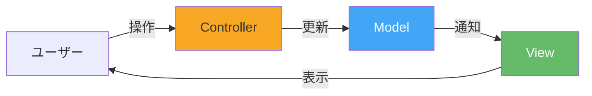

サーバーサイドのMVCはリクエスト・レスポンスモデルにうまく適合した。しかしクライアントサイドに持ち込んだとき、深刻な問題が浮上した。

SPAでは、ユーザーの操作によってModelが頻繁に更新され、複数のViewがそれぞれ異なるModelに依存する。Backbone.jsのようなフレームワークでは、ModelとViewが多対多の関係になりがちであった。

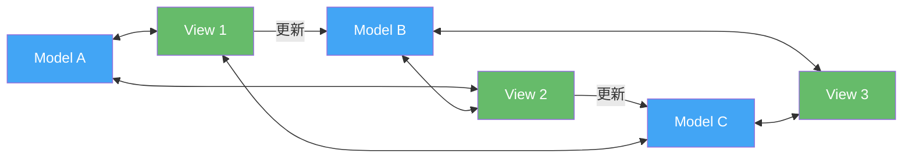

この「蜘蛛の巣」のような依存関係は、以下の問題を引き起こす。

- **カスケーディング更新**: ひとつのModelの変更が別のViewを更新し、そのViewの変更がさらに別のModelを更新する連鎖反応が起きる
- **デバッグの困難さ**: 状態の変更がどこから発生し、どの経路を通って伝播したかが追跡できない
- **競合状態**: 複数の非同期更新が同時に発生したとき、最終的な状態が不確定になる

### 2.2 Facebookの課題とFluxの誕生

2014年、FacebookのJing Chen氏は「Hacker Way: Rethinking Web App Development at Facebook」と題した講演で、Facebookが直面していた具体的な問題を紹介した。特に有名な例は**通知バッジ問題**である。

Facebookのチャット機能では、未読メッセージの数を示すバッジがヘッダーに表示され、チャットウィンドウには実際のメッセージが表示される。ユーザーがメッセージを既読にすると、バッジの数は減るはずである。しかしMVCアーキテクチャの下では、複数のModelとViewの間の双方向データフローにより、バッジの数とチャットの未読状態が一致しないバグが繰り返し発生した。

この問題の根本原因は**双方向データフロー**にあった。ViewがModelを直接更新でき、Modelの更新が別のViewを通じて別のModelの更新を引き起こすため、データフローの全体像を把握することが不可能になっていた。

Facebookのエンジニアリングチームはこの経験から、**単方向データフロー（Unidirectional Data Flow）**を核とした新しいアーキテクチャパターン — **Flux** — を提案した。

## 3. Fluxパターン

### 3.1 Fluxの基本構造

Fluxは、データが常に一方向に流れるアーキテクチャパターンである。4つの主要コンポーネントで構成される。

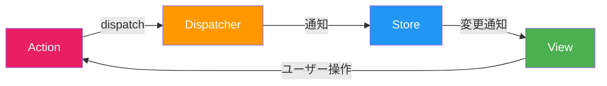

- **Action**: 「何が起きたか」を表す平文のオブジェクト。`{ type: 'ADD_TODO', payload: { text: 'Buy milk' } }` のように、typeとペイロードを持つ
- **Dispatcher**: すべてのActionを受け取り、登録されたStoreに配信する中央ハブ。シングルトンであり、アプリケーション内に一つだけ存在する
- **Store**: アプリケーションの状態とビジネスロジックを保持する。Dispatcherから受け取ったActionに応じて状態を更新し、変更をViewに通知する
- **View**: Storeの状態を購読し、表示を行う。ユーザーの操作はActionの作成として表現される

この設計の決定的な特徴は、**ViewがStoreを直接変更できない**点にある。ViewはActionを発行し、そのActionがDispatcherを経由してStoreに到達し、Storeが自身の状態を更新する。この単方向の制約により、データフローが予測可能になる。

### 3.2 Redux — Fluxの洗練

**Redux**は2015年にDan Abramovによって開発された、Fluxパターンをさらに洗練させた状態管理ライブラリである。Reduxは3つの原則に基づく。

1. **Single Source of Truth**: アプリケーション全体の状態を一つのオブジェクトツリーとして、一つのStoreに格納する
2. **State is Read-Only**: 状態を変更する唯一の方法はActionをdispatchすることである
3. **Changes are Made with Pure Functions**: 状態の変更はReducer（純粋関数）によって記述される

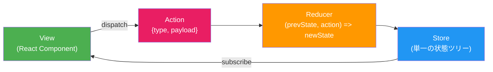

Fluxとの重要な違いは以下の点である。

- **Store が一つ**: Fluxでは複数のStoreが存在しうるが、Reduxでは単一のStoreである
- **Dispatcher が不要**: Reducerが純粋関数であるため、Dispatcherという概念を持たず、Storeが直接Reducerを呼び出す
- **状態のイミュータビリティ**: Reducerは前の状態を変更（mutate）せず、新しい状態オブジェクトを返す

```typescript
// Action type definitions
const ADD_TODO = "ADD_TODO" as const;
const TOGGLE_TODO = "TOGGLE_TODO" as const;

interface AddTodoAction {
  type: typeof ADD_TODO;
  payload: { id: number; text: string };
}

interface ToggleTodoAction {
  type: typeof TOGGLE_TODO;
  payload: { id: number };
}

type TodoAction = AddTodoAction | ToggleTodoAction;

// State type
interface Todo {
  id: number;
  text: string;
  completed: boolean;
}

type TodoState = Todo[];

// Reducer: a pure function that computes the next state
function todoReducer(state: TodoState = [], action: TodoAction): TodoState {
  switch (action.type) {
    case ADD_TODO:
      return [
        ...state,
        {
          id: action.payload.id,
          text: action.payload.text,
          completed: false,
        },
      ];
    case TOGGLE_TODO:
      return state.map((todo) =>
        todo.id === action.payload.id
          ? { ...todo, completed: !todo.completed }
          : todo
      );
    default:
      return state;
  }
}
```

Reducerが純粋関数であることには、大きな実用的利点がある。

- **テスタビリティ**: 入力と出力が明確なため、単体テストが容易
- **Time-Travel Debugging**: 過去のActionを再適用することで、任意の時点の状態を再現できる。Redux DevToolsはこの性質を活用している
- **Hot Module Replacement**: Reducerを差し替えても、現在の状態を保持したまま新しいロジックを適用できる

### 3.3 Reduxの課題とボイラープレート問題

Reduxは強力だが、一つの機能を追加するために作成すべきファイルやコードが多いという批判が常につきまとっていた。たとえば、一つのAPIコールを実装するには以下が必要だった。

1. Action Typeの定数定義（`FETCH_USERS_REQUEST`, `FETCH_USERS_SUCCESS`, `FETCH_USERS_FAILURE`）
2. Action Creatorの定義
3. Reducerのcase追加
4. 非同期処理のためのMiddleware（redux-thunk / redux-saga）の設定

この問題に対処するため、2019年にRedux公式チームが**Redux Toolkit（RTK）**をリリースした。RTKは`createSlice`によってAction TypeとAction CreatorとReducerを一箇所にまとめ、内部でImmerを使用してイミュータブルな更新を「ミュータブルな書き方」で記述できるようにした。

```typescript
import { createSlice, PayloadAction } from "@reduxjs/toolkit";

interface Todo {
  id: number;
  text: string;
  completed: boolean;
}

interface TodoState {
  items: Todo[];
  loading: boolean;
}

const initialState: TodoState = {
  items: [],
  loading: false,
};

const todoSlice = createSlice({
  name: "todos",
  initialState,
  reducers: {
    // Immer allows "mutating" syntax while keeping immutability under the hood
    addTodo(state, action: PayloadAction<{ id: number; text: string }>) {
      state.items.push({
        id: action.payload.id,
        text: action.payload.text,
        completed: false,
      });
    },
    toggleTodo(state, action: PayloadAction<number>) {
      const todo = state.items.find((t) => t.id === action.payload);
      if (todo) {
        todo.completed = !todo.completed;
      }
    },
  },
});

// Action creators are auto-generated
export const { addTodo, toggleTodo } = todoSlice.actions;
export default todoSlice.reducer;
```

Redux Toolkitにより記述量は大幅に削減されたが、Fluxパターン自体の構造的な特性 — 一つの状態変更が Action → Reducer → Store → View と複数の層を経由すること — は変わらない。

### 3.4 Vuex / Pinia — VueにおけるFlux系アーキテクチャ

VueエコシステムにおけるFlux系状態管理も同様の進化を遂げた。

**Vuex**（Vue 2時代の標準）は、Fluxの考え方をVueのリアクティビティシステムと統合した。Vuexは**state**、**getters**、**mutations**（同期的な状態変更）、**actions**（非同期処理を含む操作）の4概念を持つ。

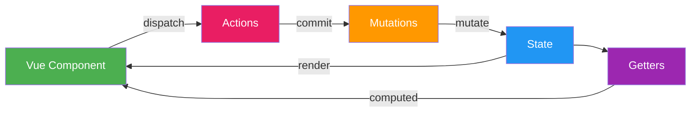

しかしVuexにも問題があった。TypeScriptとの相性が悪く、mutationsとactionsの区別が冗長で、名前空間付きモジュールの型推論が困難であった。

2021年、Vue 3に合わせて**Pinia**がリリースされた。PiniaはVuexの後継として位置づけられ、以下の改善を行った。

- **mutationsの廃止**: stateの直接変更またはactions内での変更の両方を許容
- **完全なTypeScriptサポート**: 型推論がフル活用できる設計
- **Composition APIとの親和性**: `setup()` 関数スタイルでstoreを定義可能

```typescript
import { defineStore } from "pinia";

interface Todo {
  id: number;
  text: string;
  completed: boolean;
}

export const useTodoStore = defineStore("todos", {
  state: () => ({
    items: [] as Todo[],
    loading: false,
  }),

  getters: {
    completedCount: (state) => state.items.filter((t) => t.completed).length,
    activeTodos: (state) => state.items.filter((t) => !t.completed),
  },

  actions: {
    addTodo(text: string) {
      this.items.push({
        id: Date.now(),
        text,
        completed: false,
      });
    },

    async fetchTodos() {
      this.loading = true;
      try {
        const response = await fetch("/api/todos");
        this.items = await response.json();
      } finally {
        this.loading = false;
      }
    },
  },
});
```

Piniaは厳密にはFluxパターンそのものではなく、Flux的な「Storeで状態を集中管理する」思想を持ちつつも、mutationsという間接層を省略した実用的な設計となっている。

### 3.5 Fluxパターンのまとめ

Fluxパターンの核心は「**データは常に一方向に流れる**」という制約である。この制約がもたらすものを整理する。

| 側面 | 利点 | 代償 |
|------|------|------|
| 予測可能性 | 状態変更の経路が一意に定まる | 間接層（Action, Reducer）によるコード量の増加 |
| デバッグ | Time-Travel Debugging、Action履歴の確認が可能 | DevToolsの導入が前提になる |
| テスタビリティ | Reducerが純粋関数のためテストが容易 | 非同期ロジックの扱いが複雑（middleware） |
| スケーラビリティ | 大規模アプリでもデータフローが追跡可能 | 小規模アプリには過剰な構造化 |

## 4. Atomicパターン

### 4.1 Fluxの構造的問題とAtomicの動機

Fluxパターン（特にRedux）は大規模アプリケーションで威力を発揮するが、いくつかの構造的な課題を内包していた。

第一に、**トップダウンの状態設計**が求められることである。Reduxでは、アプリケーション全体の状態ツリーを事前に設計する必要がある。新しい機能を追加するたびに、グローバルなReducerの構成を見直す必要が出てくることがある。

第二に、**コード分割との相性**が悪いことである。モダンなフロントエンドでは、ルートごとにコードを遅延読み込み（lazy load）するのが一般的だが、Reduxの単一StoreとReducerの事前登録はこの仕組みと衝突する。`replaceReducer`で動的に追加する方法はあるが、エレガントとは言い難い。

第三に、**React の Concurrent Mode（Concurrent Features）との統合**の問題がある。Reduxの外部Storeは、Reactの新しいレンダリングモデル（タイムスライシング、Suspense）と本質的に相性が悪い。外部のミュータブルStoreを参照すると、レンダリング中に状態が変化して不整合が生じる「tearing」と呼ばれる現象が発生しうる。`useSyncExternalStore`という回避策が提供されたが、根本的な解決ではない。

これらの課題に対する回答として登場したのが、**Atomicパターン**（ボトムアップ型の状態管理）である。

### 4.2 Atomicパターンの設計思想

Atomicパターンの核心は、状態を**Atom**と呼ばれる最小単位に分割し、ボトムアップに組み合わせることである。

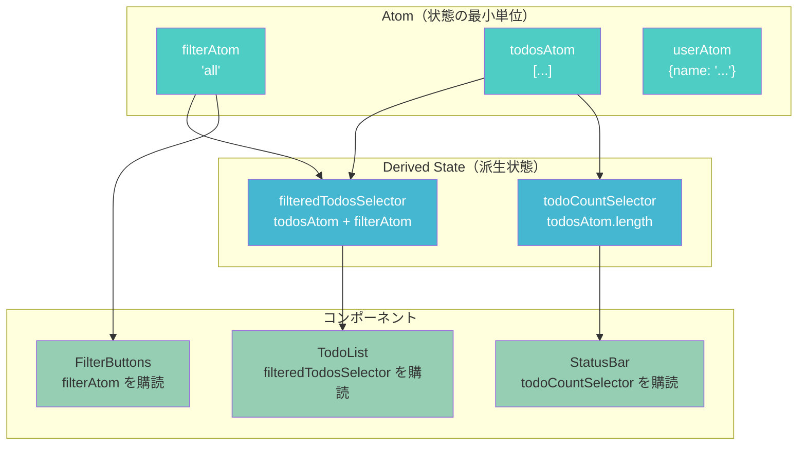

Fluxパターンとの決定的な違いは以下である。

- **ボトムアップ設計**: 状態ツリーを事前に設計するのではなく、必要に応じてAtomを定義し、派生状態（Derived State / Selector）で組み合わせる
- **React内部との統合**: Atomの状態をReactの状態として管理するため、Concurrent Featuresと自然に統合できる
- **コンポーネント駆動**: 各コンポーネントが必要なAtomだけを購読するため、不要な再レンダリングが発生しにくい

### 4.3 Recoil — Facebookによる実験

**Recoil**は2020年にFacebook（現Meta）のDave McCabe氏によって発表された実験的な状態管理ライブラリである。Reactの内部メカニズムとの緊密な統合を目指して設計された。

Recoilの2つの中核概念は**Atom**と**Selector**である。

```typescript
import { atom, selector, useRecoilState, useRecoilValue } from "recoil";

// Atom: the smallest unit of state
const todosAtom = atom<Todo[]>({
  key: "todosAtom", // globally unique key
  default: [],
});

const filterAtom = atom<"all" | "active" | "completed">({
  key: "filterAtom",
  default: "all",
});

// Selector: derived state computed from atoms (or other selectors)
const filteredTodosSelector = selector({
  key: "filteredTodosSelector",
  get: ({ get }) => {
    const todos = get(todosAtom);
    const filter = get(filterAtom);
    switch (filter) {
      case "active":
        return todos.filter((t) => !t.completed);
      case "completed":
        return todos.filter((t) => t.completed);
      default:
        return todos;
    }
  },
});

// Component: subscribes only to the atoms/selectors it uses
function TodoList() {
  const filteredTodos = useRecoilValue(filteredTodosSelector);

  return (
    <ul>
      {filteredTodos.map((todo) => (
        <li key={todo.id}>{todo.text}</li>
      ))}
    </ul>
  );
}

function FilterButtons() {
  const [filter, setFilter] = useRecoilState(filterAtom);

  return (
    <div>
      <button onClick={() => setFilter("all")}>All</button>
      <button onClick={() => setFilter("active")}>Active</button>
      <button onClick={() => setFilter("completed")}>Completed</button>
    </div>
  );
}
```

Recoilの重要な特徴は以下の通りである。

- **依存グラフの自動構築**: Selectorの`get`関数内で`get(someAtom)`を呼び出すだけで、依存関係が自動的に追跡される
- **非同期Selector**: Selectorは非同期関数を返すことができ、React Suspenseと統合してデータフェッチを表現できる
- **Atom Family**: パラメータ化されたAtomを動的に生成できる（例: IDごとのTodoの状態）

ただし、Recoilは2025年現在、実験的（experimental）ステータスのまま開発が停滞しており、Metaの内部でも積極的にメンテナンスされている状況にはない。この事実は、Atomicパターン自体の有用性を否定するものではないが、ライブラリ選定においては考慮すべき事項である。

### 4.4 Jotai — プリミティブかつ柔軟なAtom

**Jotai**（日本語の「状態」に由来する命名）は、Recoilの概念を継承しつつ、より軽量でミニマルな設計を追求したライブラリである。Daishi Kato氏によって開発された。

JotaiとRecoilの最も顕著な違いは、**文字列キーが不要**なことである。Recoilでは各Atomにグローバルに一意なkeyを指定する必要があるが、Jotaiではオブジェクト参照（Atomオブジェクト自体のアイデンティティ）でAtomを識別する。

```typescript
import { atom, useAtom, useAtomValue, useSetAtom } from "jotai";

// No string key needed; atom identity is determined by object reference
const todosAtom = atom<Todo[]>([]);
const filterAtom = atom<"all" | "active" | "completed">("all");

// Derived atom (read-only): equivalent to Recoil's selector
const filteredTodosAtom = atom((get) => {
  const todos = get(todosAtom);
  const filter = get(filterAtom);
  switch (filter) {
    case "active":
      return todos.filter((t) => !t.completed);
    case "completed":
      return todos.filter((t) => t.completed);
    default:
      return todos;
  }
});

// Write-only atom: encapsulates mutation logic
const addTodoAtom = atom(null, (get, set, text: string) => {
  const todos = get(todosAtom);
  set(todosAtom, [...todos, { id: Date.now(), text, completed: false }]);
});

function TodoList() {
  const filteredTodos = useAtomValue(filteredTodosAtom);
  return (
    <ul>
      {filteredTodos.map((todo) => (
        <li key={todo.id}>{todo.text}</li>
      ))}
    </ul>
  );
}

function AddTodo() {
  const addTodo = useSetAtom(addTodoAtom);
  // ...
}
```

Jotaiのアーキテクチャ上の特徴を整理する。

- **ミニマルなAPI**: `atom`（Atom定義）と`useAtom`（購読）が中核。APIの表面積が極めて小さい
- **React本位**: 状態はReactのContextとuseStateの仕組みを内部的に使用しており、React外部では使用できない（これは設計上の選択であり制約でもある）
- **プロバイダーレスモード**: デフォルトのグローバルStoreを使用する場合、Providerラッパーが不要
- **Atom-in-Atom**: Atomの値として別のAtomへの参照を格納でき、動的な依存グラフの構築が可能

### 4.5 Atomicパターンのまとめ

Atomicパターンは「**状態を小さく保ち、コンポジションで拡張する**」というReactの哲学と強く共鳴する。

| 側面 | 利点 | 代償 |
|------|------|------|
| 粒度 | コンポーネント単位の精密な再レンダリング制御 | Atomの数が増えると管理が煩雑になりうる |
| 設計 | ボトムアップ — 事前の全体設計が不要 | 状態の全体像を把握しにくい場合がある |
| コード分割 | Atomはコンポーネントと共にlazy loadできる | グローバルな状態の一覧性が低下 |
| React統合 | Concurrent Featuresと自然に統合 | React外（テスト、SSR）での利用にProviderが必要 |

## 5. Proxyベースのパターン

### 5.1 Observable / Proxyの発想

Fluxパターンでは状態の更新を間接的（Action → Reducer）に行い、Atomicパターンでは状態を細かく分割して購読する。これらに対して、**Proxyベースのパターン**は全く異なるアプローチを取る。

Proxyベースパターンの核心は「**状態を通常のJavaScriptオブジェクトとして扱い、その変更を自動的に検知する**」ことである。開発者は `state.count++` のような自然なJavaScript構文で状態を変更でき、フレームワークが自動的に影響を受けるコンポーネントだけを再レンダリングする。

この自動検知を実現する技術が、JavaScriptの**Proxy API**（ES2015で導入）と、それ以前の`Object.defineProperty`である。

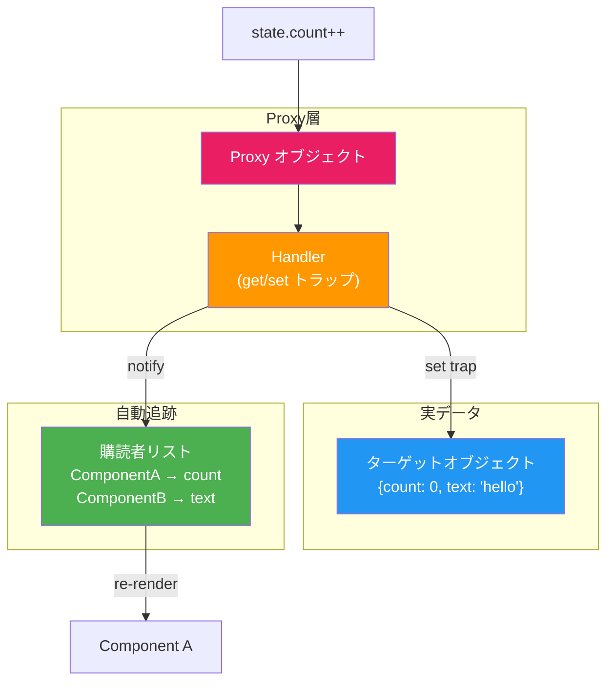

### 5.2 MobX — Observableによるリアクティブ状態管理

**MobX**は2015年にMichel Weststrate氏によって開発されたリアクティブ状態管理ライブラリである。初期は`Object.defineProperty`を使用し、後にProxyベースの実装に移行した。MobXはReactに限定されず、VueやAngular、さらにはプレーンなJavaScriptでも使用できる。

MobXの中核概念は4つある。

1. **Observable State**: 監視対象となる状態
2. **Computed Values**: Observableから派生する計算値（メモ化される）
3. **Reactions**: Observableの変更に応じて実行される副作用
4. **Actions**: 状態を変更する関数

```typescript
import { makeAutoObservable, computed, reaction, autorun } from "mobx";
import { observer } from "mobx-react-lite";

class TodoStore {
  todos: Todo[] = [];
  filter: "all" | "active" | "completed" = "all";

  constructor() {
    // Automatically makes all properties observable,
    // getters computed, and methods actions
    makeAutoObservable(this);
  }

  // Computed value: re-calculated only when dependencies change
  get filteredTodos() {
    switch (this.filter) {
      case "active":
        return this.todos.filter((t) => !t.completed);
      case "completed":
        return this.todos.filter((t) => t.completed);
      default:
        return this.todos;
    }
  }

  get completedCount() {
    return this.todos.filter((t) => t.completed).length;
  }

  // Action: modifies state using natural JS syntax
  addTodo(text: string) {
    this.todos.push({ id: Date.now(), text, completed: false });
  }

  toggleTodo(id: number) {
    const todo = this.todos.find((t) => t.id === id);
    if (todo) {
      todo.completed = !todo.completed;
    }
  }

  setFilter(filter: "all" | "active" | "completed") {
    this.filter = filter;
  }
}

const todoStore = new TodoStore();

// Component: wrapped with observer() to track observable access
const TodoList = observer(() => {
  return (
    <ul>
      {todoStore.filteredTodos.map((todo) => (
        <li
          key={todo.id}
          onClick={() => todoStore.toggleTodo(todo.id)}
          style={{
            textDecoration: todo.completed ? "line-through" : "none",
          }}
        >
          {todo.text}
        </li>
      ))}
    </ul>
  );
});
```

MobXの`observer`HOC（Higher-Order Component）は、コンポーネントのレンダリング中にアクセスされたObservableプロパティを自動的に追跡する。これにより、コンポーネントは**実際に使用しているデータが変更されたときだけ**再レンダリングされる。

MobXの設計思想は「**Anything that can be derived from the application state, should be derived. Automatically.**」（アプリケーション状態から導出できるものは、すべて自動的に導出されるべきだ）と要約される。

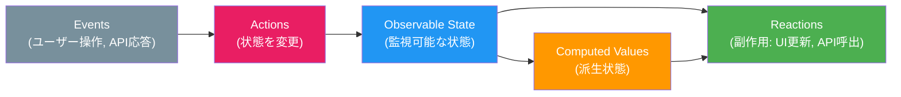

### 5.3 Valtio — Proxyの素朴な美しさ

**Valtio**は、Jotaiと同じくDaishi Kato氏によって開発された、Proxyベースの状態管理ライブラリである。MobXがクラスベースで多機能なのに対し、Valtioは極限までミニマルな設計を追求している。

```typescript
import { proxy, useSnapshot } from "valtio";

// Create a proxy state — just a plain-looking object
const state = proxy({
  todos: [] as Todo[],
  filter: "all" as "all" | "active" | "completed",
});

// Actions: just functions that mutate the proxy
function addTodo(text: string) {
  state.todos.push({ id: Date.now(), text, completed: false });
}

function toggleTodo(id: number) {
  const todo = state.todos.find((t) => t.id === id);
  if (todo) {
    todo.completed = !todo.completed;
  }
}

// Component: useSnapshot creates an immutable snapshot for rendering
function TodoList() {
  const snap = useSnapshot(state);

  const filteredTodos =
    snap.filter === "all"
      ? snap.todos
      : snap.filter === "active"
        ? snap.todos.filter((t) => !t.completed)
        : snap.todos.filter((t) => t.completed);

  return (
    <ul>
      {filteredTodos.map((todo) => (
        <li key={todo.id} onClick={() => toggleTodo(todo.id)}>
          {todo.text}
        </li>
      ))}
    </ul>
  );
}
```

Valtioの`proxy`関数は、渡されたオブジェクトをJavaScriptのProxyでラップする。プロパティへの書き込みはProxyの`set`トラップによって検知され、`useSnapshot`を使用しているコンポーネントに変更が通知される。

`useSnapshot`は、プロキシされた状態のイミュータブルなスナップショットを返す。このスナップショットはレンダリング中に読み取り専用であり、アクセスされたプロパティが追跡される。これにより、**コンポーネントは実際にアクセスしたプロパティが変更されたときだけ**再レンダリングされる（プロパティレベルのサブスクリプション）。

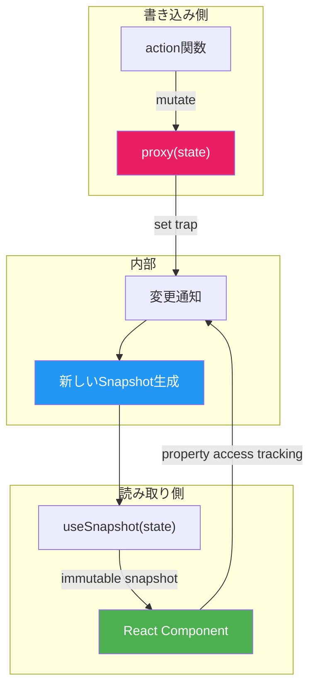

ValtioとMobXの比較を以下に示す。

| 特性 | MobX | Valtio |
|------|------|--------|
| APIの複雑さ | やや高い（デコレータ、makeAutoObservable） | 極めてシンプル（proxy, useSnapshot） |
| クラスベース | 推奨される | 不要（プレーンオブジェクト） |
| 派生状態 | 組み込み（computed） | 手動または`derive`ユーティリティ |
| フレームワーク対応 | React, Vue, Angular, Vanilla | 主にReact |
| バンドルサイズ | 約16KB（gzip） | 約3KB（gzip） |
| 成熟度 | 高い（2015年〜） | 中程度（2021年〜） |

### 5.4 Proxyベースパターンのまとめ

Proxyベースパターンの核心は「**JavaScriptの自然な構文で状態を操作し、変更検知をランタイムに任せる**」ことである。

| 側面 | 利点 | 代償 |
|------|------|------|
| 開発体験 | ミュータブルな構文で直感的に書ける | 「マジック」が多く、動作原理の理解が必要 |
| パフォーマンス | プロパティレベルの精密な再レンダリング | Proxyのオーバーヘッド（通常は無視できる程度） |
| 学習コスト | 低い（特にValtio） | Proxyの落とし穴（分割代入による追跡喪失等）に注意が必要 |
| デバッグ | DevToolsのサポートが成熟（MobX） | 暗黙の依存追跡は時にデバッグを困難にする |

## 6. Signalsパターン

### 6.1 Signalsとは何か

**Signals**は、2022年頃からフロントエンドコミュニティで急速に注目を集めるようになったリアクティブプリミティブである。SolidJS、Angular、Preact、Qwik、Vueなど、多くのフレームワークが独自のSignals実装を採用もしくは導入し、さらにTC39（ECMAScript標準化委員会）でSignalsの標準化が議論されている。

Signalsの基本的な考え方は、Proxyベースパターンと共通する部分もあるが、重要な違いがある。SignalsはReactの「コンポーネント全体を再レンダリングして仮想DOMで差分を取る」というモデルとは対極の、**Fine-Grained Reactivity（きめ細かいリアクティビティ）**を実現する仕組みである。

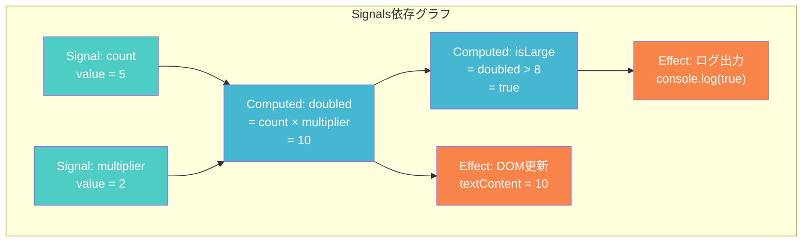

Signalsの3つの基本プリミティブは以下の通りである。

1. **Signal**: 値を持ち、その値が変更されたときに依存者に通知する
2. **Computed（Memo）**: 他のSignalやComputedに依存し、依存元が変更されたときに再計算される（メモ化される）
3. **Effect**: Signalの変更に応じて副作用を実行する（DOM更新、API呼び出しなど）

### 6.2 SolidJS — Fine-Grained Reactivityの先駆者

**SolidJS**は、Ryan Carniato氏によって開発されたUIフレームワークであり、Signalsベースの Fine-Grained Reactivityの代表的な実装である。

SolidJSの最大の特徴は、**コンポーネント関数が一度だけ呼ばれる**ことである。Reactではstateが変更されるたびにコンポーネント関数全体が再実行されるが、SolidJSではコンポーネント関数はセットアップのために一度だけ実行され、その後はSignalの変更が直接DOMの更新を駆動する。

```typescript
import { createSignal, createMemo, createEffect } from "solid-js";

function Counter() {
  // Signal: reactive primitive value
  const [count, setCount] = createSignal(0);

  // Memo (Computed): derived reactive value, memoized
  const doubled = createMemo(() => count() * 2);

  // Effect: side-effect that re-runs when dependencies change
  createEffect(() => {
    console.log(`Count is now: ${count()}`);
  });

  // This JSX is compiled to fine-grained DOM operations.
  // The function body runs ONCE; only the specific DOM nodes
  // that depend on count() or doubled() are updated.
  return (
    <div>
      <p>Count: {count()}</p>
      <p>Doubled: {doubled()}</p>
      <button onClick={() => setCount((c) => c + 1)}>Increment</button>
    </div>
  );
}
```

SolidJSのコンパイラは、JSX内の `{count()}` のようなSignalアクセスを、そのDOM位置に直接バインドされるEffectに変換する。これにより、仮想DOMの差分比較なしに、変更されたSignalに対応するDOMノードだけが更新される。

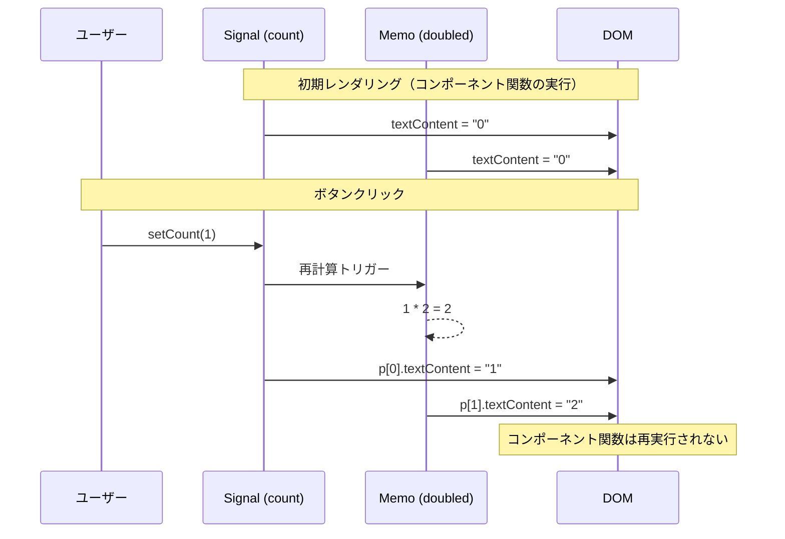

### 6.3 Angular Signals

Angular（v16以降）もSignalsを導入した。AngularのSignalsは、従来のRxJSベースのリアクティビティ（Observable + async pipe）やZone.jsベースの変更検知に加え、よりシンプルで同期的なリアクティブプリミティブを提供する。

```typescript
import { Component, signal, computed, effect } from "@angular/core";

@Component({
  selector: "app-counter",
  template: `
    <p>Count: {{ count() }}</p>
    <p>Doubled: {{ doubled() }}</p>
    <button (click)="increment()">Increment</button>
  `,
})
export class CounterComponent {
  // Signal: writable reactive value
  count = signal(0);

  // Computed: derived reactive value
  doubled = computed(() => this.count() * 2);

  constructor() {
    // Effect: side-effect triggered by signal changes
    effect(() => {
      console.log(`Count changed to: ${this.count()}`);
    });
  }

  increment() {
    this.count.update((c) => c + 1);
  }
}
```

AngularがSignalsを採用した主な動機は、Zone.jsからの脱却である。Zone.jsはすべての非同期操作（setTimeout, Promise, DOM events）をモンキーパッチして変更検知のトリガーとするが、パフォーマンスオーバーヘッドが大きく、デバッグが困難で、SSRとの相性も悪かった。SignalsによりAngularは、Zone.jsに依存しないきめ細かい変更検知への移行を進めている。

### 6.4 Preact Signals

Preact（Reactの軽量代替）もSignalsを提供している。Preact Signalsの特徴的な点は、**Signalをコンポーネントの外部で定義し、複数のコンポーネント間で直接共有できる**ことである。

```typescript
import { signal, computed, effect } from "@preact/signals";

// Signals can be defined outside components — truly global
const count = signal(0);
const doubled = computed(() => count.value * 2);

// No wrapper (observer, useSnapshot, etc.) needed
function Counter() {
  return (
    <div>
      <p>Count: {count}</p>
      <p>Doubled: {doubled}</p>
      <button onClick={() => count.value++}>Increment</button>
    </div>
  );
}
```

Preact Signalsは、Signal自体がVNodeとして振る舞うことができるため、コンポーネント内でSignalを直接JSXに埋め込むことが可能であり、コンポーネント全体の再レンダリングを完全にバイパスしてDOMを直接更新する。

### 6.5 TC39 Signals Proposal

2024年、Signalsの標準化を目指す**TC39 Signals Proposal**が提出された（ステージ1）。この提案は、すべてのJavaScriptフレームワークが共通して利用できるSignalsプリミティブをECMAScript言語仕様に組み込むことを目指している。

提案の動機は以下の通りである。

- 各フレームワークが独自にSignals実装を持つことによる重複コストの解消
- フレームワーク間の相互運用性の向上
- ブラウザエンジンによる最適化の可能性

提案されるAPIは以下のような形になる見込みである（仕様策定中のため変更の可能性がある）。

```typescript
// TC39 Signals Proposal (Stage 1, subject to change)
const counter = new Signal.State(0);
const doubled = new Signal.Computed(() => counter.get() * 2);

// Watcher: framework-level integration point
const watcher = new Signal.subtle.Watcher(() => {
  // Notify the framework's scheduler to re-render
});
watcher.watch(doubled);

counter.set(1);
// Watcher is notified, framework schedules update
```

標準化が実現すれば、フレームワークはSignalsの基盤部分を言語ランタイムに委ね、その上にフレームワーク固有のスケジューリングやバッチング戦略を構築できるようになる。

### 6.6 Signalsパターンのまとめ

| 側面 | 利点 | 代償 |
|------|------|------|
| パフォーマンス | 仮想DOM不要、DOM直接更新（SolidJS, Preact Signals） | 依存グラフの構築・維持コスト |
| 粒度 | プロパティレベルの精密な更新 | デバッグツールの成熟度がFlux系に比べ低い |
| 開発体験 | シンプルなAPI（signal, computed, effect） | Reactの既存メンタルモデルとの違い（SolidJS） |
| エコシステム | 標準化の議論が進行中 | まだ策定途中であり、確定していない |

## 7. 各パターンの比較

### 7.1 データフロー

各パターンのデータフローを対比する。

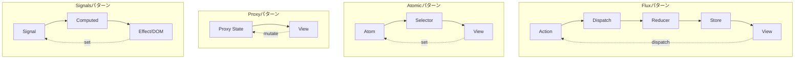

| パターン | データフロー | 更新の明示性 | 間接層の数 |
|---------|-------------|-------------|-----------|
| Flux/Redux | 単方向（Action → Reducer → Store → View） | 高い（Actionで明示的に記述） | 多い |
| Atomic | 双方向的（Atom ⇄ Component） | 中程度（setで直接変更） | 少ない |
| Proxy | 双方向的（Proxy State ⇄ Component） | 低い（ミュータブルに変更） | 最小限 |
| Signals | リアクティブグラフ（Signal → Computed → Effect） | 中程度（setで直接変更） | 少ない |

### 7.2 学習コストと開発体験

| パターン | 代表的ライブラリ | 学習コスト | ボイラープレート | TypeScript対応 |
|---------|----------------|-----------|----------------|---------------|
| Flux | Redux Toolkit | 中〜高 | 中（RTKで改善） | 優秀 |
| Flux (Vue) | Pinia | 低〜中 | 少ない | 優秀 |
| Atomic | Jotai | 低 | 最小限 | 優秀 |
| Atomic | Recoil | 中 | 少ない | 良好 |
| Proxy | MobX | 中 | 少ない | 良好 |
| Proxy | Valtio | 低 | 最小限 | 優秀 |
| Signals | SolidJS (組込) | 中（Reactからの移行時） | 最小限 | 優秀 |
| Signals | Preact Signals | 低 | 最小限 | 優秀 |

### 7.3 パフォーマンス特性

パフォーマンスの評価軸は、主に以下の3つである。

1. **再レンダリングの粒度**: 状態変更時にどの範囲のコンポーネントが再レンダリングされるか
2. **メモリ効率**: 状態管理のために消費されるメモリ量
3. **初期化コスト**: Storeの構築やProxyの生成にかかるオーバーヘッド

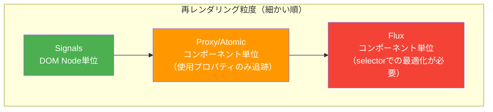

Flux（Redux）は、デフォルトでは`useSelector`に渡したセレクタの戻り値が変更されたときにコンポーネントを再レンダリングする。セレクタの設計が粗いと、無関係な状態変更でも再レンダリングが発生する。`createSelector`（reselectライブラリ）によるメモ化が必要になることが多い。

Atomic（Jotai, Recoil）とProxy（MobX, Valtio）は、コンポーネントがアクセスした具体的なプロパティを追跡するため、デフォルトでより精密な再レンダリング制御が得られる。

Signals（SolidJS, Preact Signals）は、コンポーネント単位ではなくDOM Nodeレベルで更新を行えるため、理論上最も効率的である。ただし、実際のアプリケーションでは、この差がユーザー体験に影響するケースは限定的である。

### 7.4 デバッグとDevTools

| パターン | DevToolsの成熟度 | Time-Travel | Action履歴 | 状態スナップショット |
|---------|----------------|-------------|-----------|------------------|
| Redux | 最も成熟（Redux DevTools） | 対応 | 対応 | 対応 |
| Pinia | 良好（Vue DevTools統合） | 対応 | 対応 | 対応 |
| MobX | 良好（MobX DevTools） | 部分的 | Action追跡可 | 部分的 |
| Jotai | 良好（Jotai DevTools） | 非対応 | 非対応 | 対応 |
| Valtio | 基本的 | 非対応 | 非対応 | 部分的 |
| SolidJS | 発展途上 | 非対応 | 非対応 | 部分的 |

デバッグ体験においてRedux DevToolsの優位性は際立っている。ActionごとのState差分表示、Time-Travel Debugging、Action Replay機能は、複雑なアプリケーションの問題特定に極めて有効である。他のパターンはこの領域で追いつきつつあるが、Reduxの成熟度には至っていない。

## 8. 選定基準とベストプラクティス

### 8.1 プロジェクト特性に応じた選定

状態管理パターンの選定に「唯一の正解」は存在しない。プロジェクトの特性に応じた選定指針を以下に示す。

**小規模アプリケーション / プロトタイプ**

- React: `useState` + `useContext` で十分なケースが多い。外部ライブラリを導入する前に、Reactの組み込み機能で対処できないかを検討すべきである
- Vue: Composition APIの`ref` / `reactive` + `provide` / `inject`で十分な場合が多い

**中規模アプリケーション**

- React: Jotai（Atomic）またはZustand（Fluxの簡易版）が適する。状態の種類が少なければValtioも有力な候補
- Vue: Piniaが標準的な選択肢

**大規模アプリケーション / チーム開発**

- Redux Toolkit: 厳格な規約と成熟したDevToolsにより、大規模チームでの運用に強い。ただし学習コストが高い
- MobX: OOPに慣れたチームでは生産性が高い。ドメインモデルをそのまま状態として表現できる

**パフォーマンスクリティカルなアプリケーション**

- SolidJS / Preact Signals: Fine-Grained Reactivityにより、最小限のDOM更新が可能。ただしReactエコシステムからの移行コストを考慮する必要がある

### 8.2 状態の分類と適切な管理手法

現代のベストプラクティスは、**すべての状態を一つのパターンで管理しない**ことである。状態の種類に応じて、最適な管理手法を使い分ける。

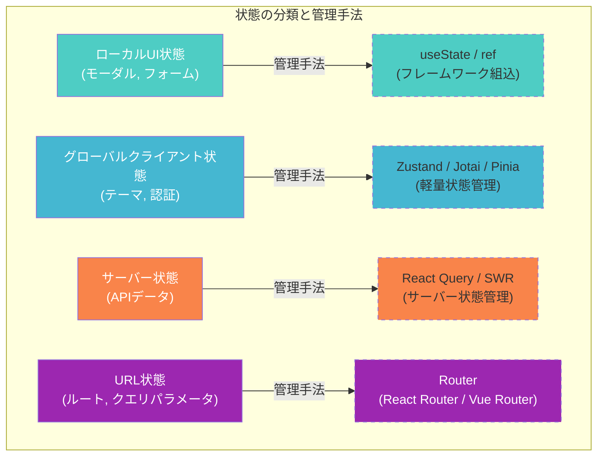

重要な原則は以下である。

1. **状態はできるだけローカルに保つ**: グローバルStoreに何でも入れるのではなく、コンポーネントのローカル状態で済む場合はそうする（「Lift state up, push state down」の原則）
2. **サーバー状態は専用ライブラリに任せる**: React Query / SWRは、キャッシュ管理、再フェッチ、楽観的更新など、サーバー状態特有の課題に特化している。これらを汎用状態管理ライブラリで自前実装するのは非効率
3. **URLは状態である**: フィルタ条件やページ番号はURLパラメータとして管理し、ブックマークやリンク共有を可能にすべきである

### 8.3 Zustand — パターンの融合

ここまでFlux、Atomic、Proxy、Signalsの4パターンを見てきたが、実際にはこれらのパターンの境界は曖昧になりつつある。その典型例が**Zustand**である。

Zustandは Daishi Kato氏（Jotai, Valtioの作者でもある）が開発したReact向け状態管理ライブラリであり、Fluxの単一Storeの考え方とReact Hooksの直感的なAPIを組み合わせている。

```typescript
import { create } from "zustand";

interface TodoState {
  todos: Todo[];
  filter: "all" | "active" | "completed";
  addTodo: (text: string) => void;
  toggleTodo: (id: number) => void;
  setFilter: (filter: "all" | "active" | "completed") => void;
}

const useTodoStore = create<TodoState>((set) => ({
  todos: [],
  filter: "all",

  addTodo: (text) =>
    set((state) => ({
      todos: [...state.todos, { id: Date.now(), text, completed: false }],
    })),

  toggleTodo: (id) =>
    set((state) => ({
      todos: state.todos.map((todo) =>
        todo.id === id ? { ...todo, completed: !todo.completed } : todo
      ),
    })),

  setFilter: (filter) => set({ filter }),
}));

// Component: select only what you need (like Redux's useSelector)
function TodoList() {
  const todos = useTodoStore((state) => state.todos);
  const filter = useTodoStore((state) => state.filter);

  const filteredTodos =
    filter === "all"
      ? todos
      : filter === "active"
        ? todos.filter((t) => !t.completed)
        : todos.filter((t) => t.completed);

  return (
    <ul>
      {filteredTodos.map((todo) => (
        <li key={todo.id}>{todo.text}</li>
      ))}
    </ul>
  );
}
```

Zustandの特徴は以下である。

- **Providerが不要**: Reactのコンテキストを使用しないため、Provider地獄に陥らない
- **セレクタベースの購読**: Reduxと同様にselectorパターンで必要な状態だけを購読できる
- **ボイラープレートが少ない**: Reduxに比べて圧倒的に少ないコード量
- **ミドルウェアのサポート**: `devtools`、`persist`、`immer`などのミドルウェアが公式に提供されている

ZustandはFlux系の構造を持ちながら、APIの簡潔さはAtomicやProxyに近い。このような「いいとこ取り」のアプローチが2023年以降のトレンドとなっている。

## 9. まとめと将来展望

### 9.1 各パターンの立ち位置

フロントエンドの状態管理は、MVC時代の混沌からFluxの秩序を経て、多様なパターンが共存する成熟期に入っている。

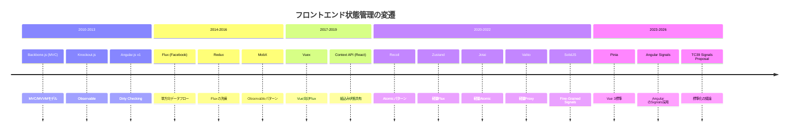

各パターンは排他的なものではなく、それぞれ異なる問題空間に最適化されている。重要なのは、パターンの原理を理解した上で、プロジェクトの要件に応じて選択（あるいは組み合わせて使用）することである。

### 9.2 将来のトレンド

**Signalsの標準化**: TC39 Signals Proposalの進展により、Signalsがブラウザにネイティブに組み込まれる可能性がある。これにより、フレームワーク間の相互運用性が向上し、状態管理ライブラリの在り方も変わるだろう。

**サーバーコンポーネントとの融合**: React Server Components（RSC）の普及により、「そもそもクライアント側で管理すべき状態が減る」という根本的な変化が起きつつある。サーバー側でデータを取得しレンダリングすることで、クライアント側の状態管理の複雑さを大幅に削減できる。

**状態管理の「層」の多様化**: 今後は、以下のような多層的なアプローチがさらに一般化すると考えられる。
- **URL状態**: Router
- **サーバー状態**: React Query / SWR / RSC
- **グローバルクライアント状態**: Zustand / Jotai / Pinia
- **ローカル状態**: フレームワーク組込み（useState, ref）
- **フォーム状態**: 専用ライブラリ（React Hook Form, Formik）

かつてReduxに「すべてを入れる」ことが推奨されていた時代と比較すると、責務の分離が進んでいることがわかる。これは状態管理に限らず、ソフトウェアエンジニアリング全般における「適切な抽象化のレベルで問題を解決する」という原則の現れである。

### 9.3 結論

状態管理パターンの選択は、技術的なトレードオフの問題であると同時に、チームの経験・規模・プロジェクトの特性を考慮した総合的な判断である。どのパターンも「銀の弾丸」ではない。

しかし、すべてのパターンに共通する不変の原則がある。それは、**状態の変更を予測可能にし、データの流れを追跡可能にする**ことである。MVCの双方向データフローが引き起こした混沌を二度と繰り返さないために、Flux、Atomic、Proxy、Signalsのいずれのパターンも、それぞれのやり方でこの原則を実現しようとしている。

パターンの本質を理解し、自分のプロジェクトに最も適した選択をすることが、フロントエンドエンジニアに求められる判断力である。
