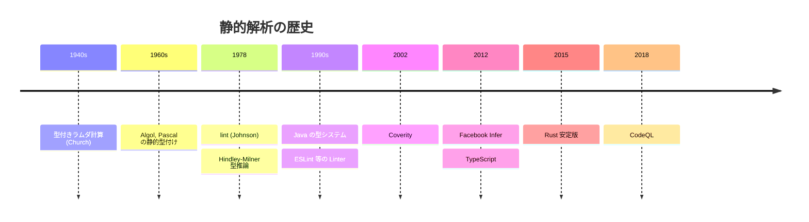
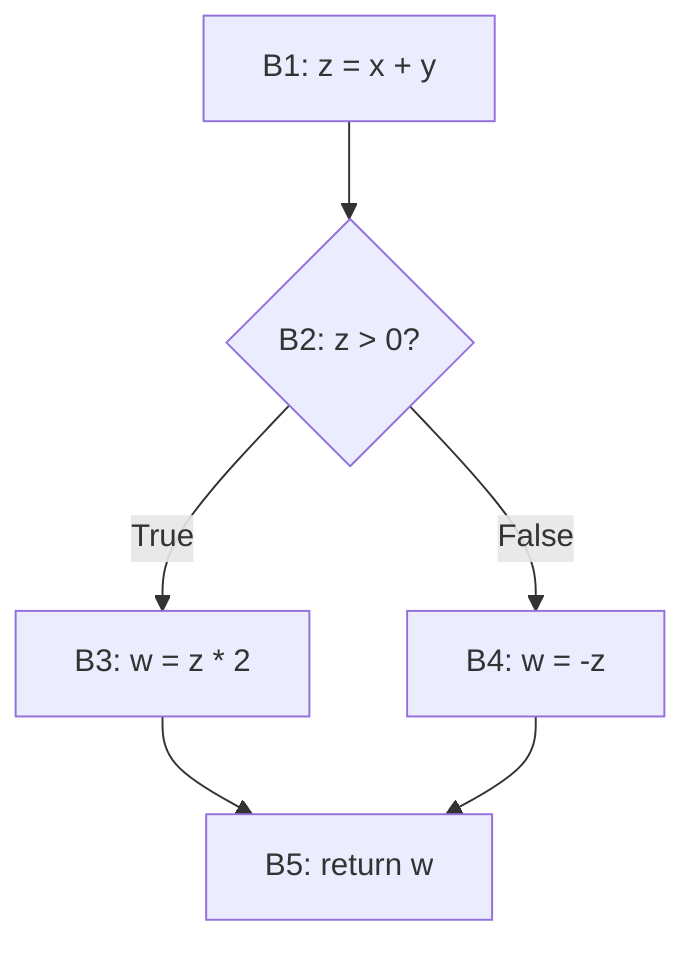
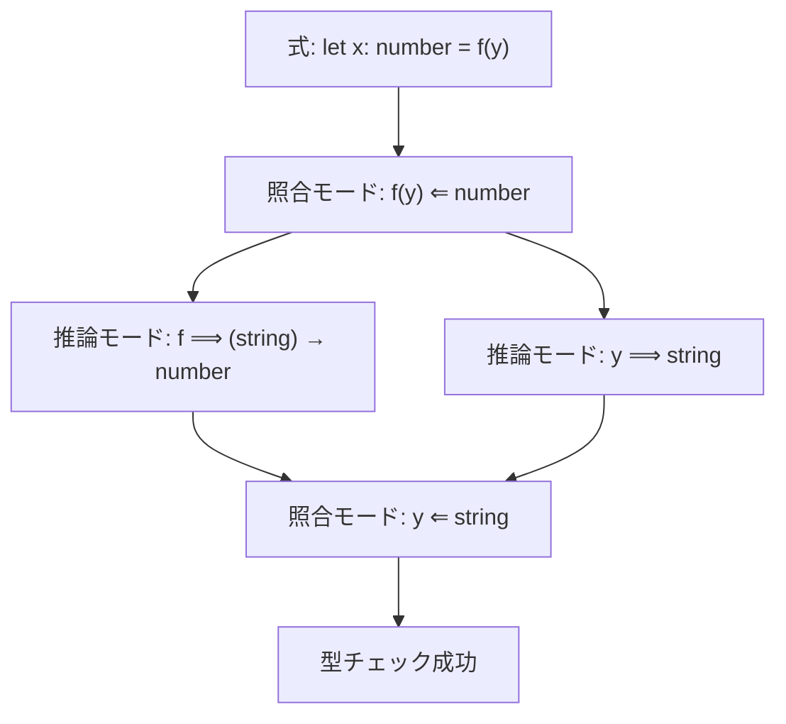
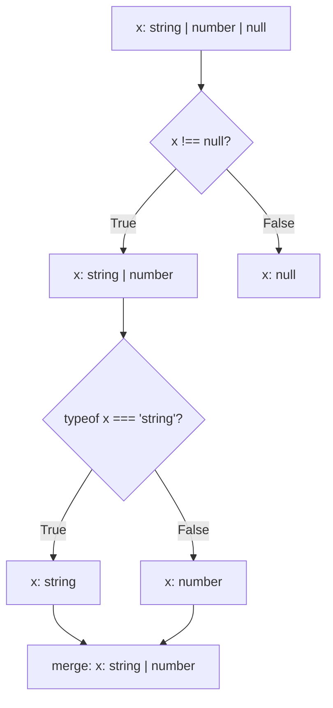
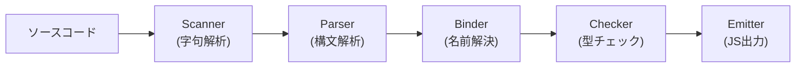
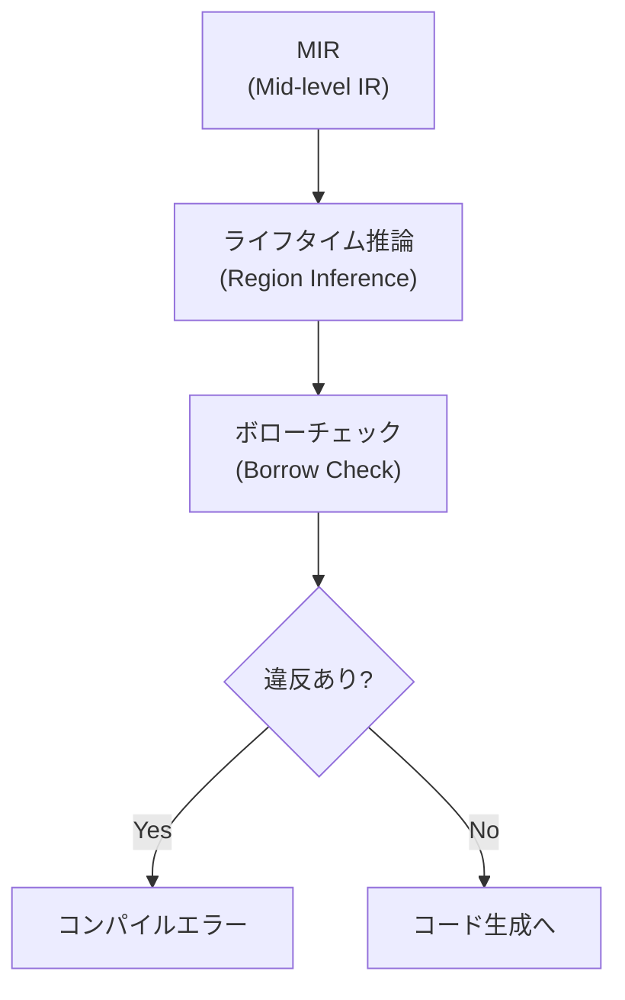
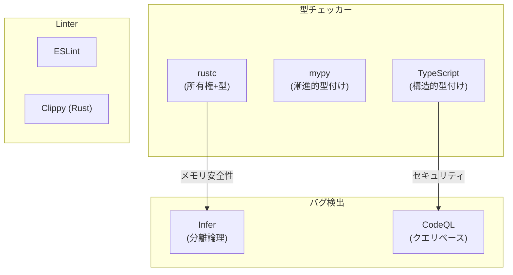
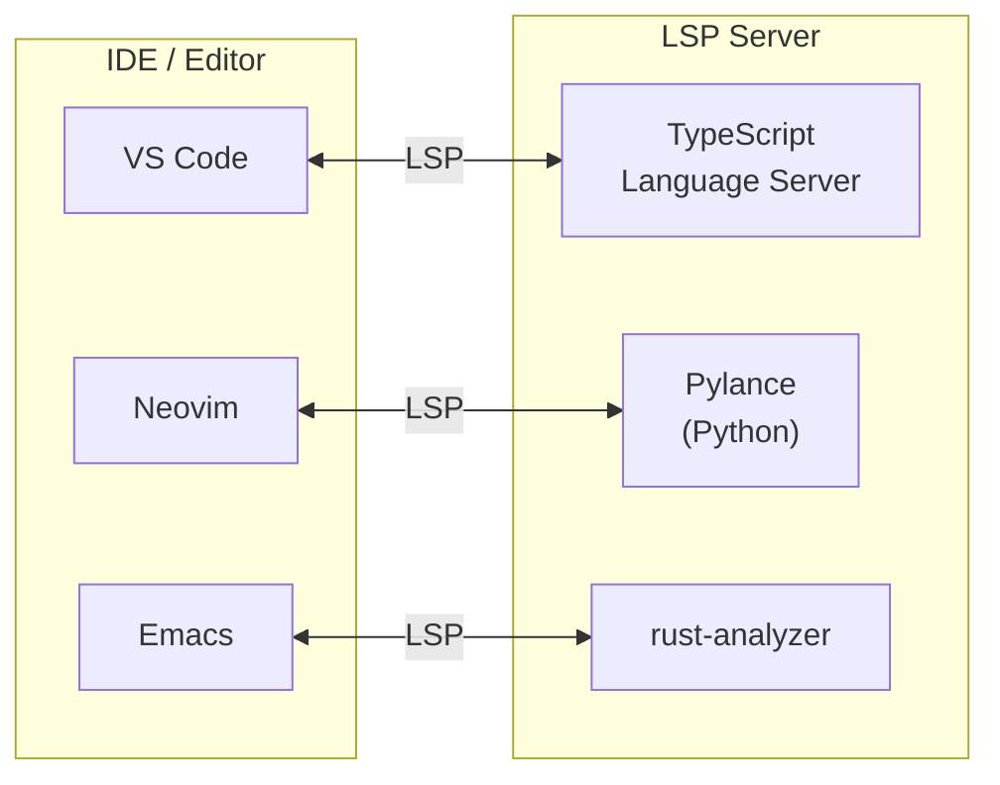

# 静的解析と型チェッカーの仕組み

## 1. はじめに：なぜ静的解析が必要なのか

ソフトウェア開発においてバグは避けられない。しかし、バグの発見が遅れるほど修正コストは指数関数的に増大する。実行時に初めて発覚するnull参照、型の不一致、未初期化変数の使用、セキュリティ上の脆弱性――これらを「プログラムを実行する前に」発見できるとしたら、開発のあり方は大きく変わる。

**静的解析（Static Analysis）** とは、プログラムを実際に実行することなく、ソースコードやバイトコードを解析してバグ、セキュリティ脆弱性、型エラー、コード品質の問題を検出する技術の総称である。これに対して、テスト実行やデバッガによる解析は**動的解析（Dynamic Analysis）** と呼ばれる。

静的解析の最も身近な例は**型チェック（Type Checking）** である。コンパイラが `int` 型の変数に文字列を代入しようとするコードを拒絶するとき、そこでは静的解析が行われている。しかし、現代の静的解析はそれをはるかに超える領域をカバーする。メモリ安全性の検証、並行処理のデッドロック検出、情報フローの追跡によるセキュリティ検証など、プログラムの正しさに関するあらゆる性質が分析対象となりうる。

本記事では、静的解析と型チェッカーの理論的基盤から実装手法、そして現代の開発ワークフローへの統合まで、体系的に解説する。

## 2. 歴史的背景

### 2.1 lint の誕生

静的解析ツールの歴史は、1978年にStephen C. Johnsonがベル研究所で開発した **lint** にまで遡る。lintはC言語のソースコードを解析し、コンパイラが検出しない潜在的な問題――未使用変数、疑わしい型変換、到達不能コードなどを報告するツールであった。

lintという名前は「衣服から糸くずを取り除く」ことに由来する。C言語のコンパイラは当時、文法的に正しければほぼすべてのコードを受け入れたため、プログラマのケアレスミスを検出する「追加の目」が必要だったのである。

### 2.2 型システムの発展

型による静的解析の歴史はさらに古い。1940年代のAlonzo Churchによる**単純型付きラムダ計算（Simply Typed Lambda Calculus）** は、型理論の最も基礎的な形式化であった。1960年代にはAlgolやPascalといった言語が静的型付けを採用し、コンパイル時の型チェックが標準的な機能となった。

1978年、Robin MilnerはML言語のために**Hindley-Milner型推論アルゴリズム** を開発した。これは、プログラマが型注釈を明示的に書かなくても、コンパイラが自動的に最も一般的な型を推論するという画期的なアルゴリズムであった。この成果は後のHaskell、OCaml、Rust、そしてTypeScriptなどの言語設計に深い影響を与えた。

### 2.3 現代の静的解析ツールへ

2000年代以降、静的解析は急速に実用化が進んだ。主要なマイルストーンを挙げる。

- **2002年**: Dawson EnglerらがCoverityの前身となる研究を発表。Linuxカーネルから数百のバグを自動検出し、静的解析の実用性を証明した
- **2004年**: MicrosoftがSAL（Source Annotation Language）と静的解析をWindows開発に導入
- **2012年**: FacebookがInferを開発。分離論理（Separation Logic）に基づくメモリ安全性の検証を大規模コードベースに適用した
- **2012年**: TypeScriptの公開。JavaScriptに漸進的型付け（Gradual Typing）を持ち込んだ
- **2015年**: Rustの安定版リリース。所有権システムによるコンパイル時のメモリ安全性保証を実現した
- **2018年**: GitHub/Semmleが**CodeQL**を公開。コードを「データベースとして問い合わせる」パラダイムでセキュリティ脆弱性を検出するアプローチを広めた



## 3. 静的解析の理論的基盤

### 3.1 Riceの定理と静的解析の限界

静的解析の理論を語る上で避けて通れないのが、**Riceの定理（Rice's Theorem, 1953）** である。

> チューリング完全なプログラミング言語で書かれたプログラムの、自明でないあらゆる意味論的性質は決定不能である。

つまり、「このプログラムは常に正の整数を返すか？」「このプログラムはnullポインタを参照するか？」「このプログラムは停止するか？」といった問いに対して、すべてのプログラムについて正しく回答するアルゴリズムは存在しない。

これは静的解析が無力であることを意味するわけではない。むしろ、静的解析が本質的に**近似（approximation）** であることを意味する。完全に正確な解析は不可能だが、実用的に十分な精度の近似は可能であり、それこそが静的解析の技術的課題である。

### 3.2 健全性と完全性

静的解析の精度は、以下の2つの概念で評価される。

- **健全性（Soundness）**: 解析がバグがないと言った場合、本当にバグがない。つまり、**偽陰性（False Negative）がゼロ**。バグを見逃さない
- **完全性（Completeness）**: 解析がバグがあると言った場合、本当にバグがある。つまり、**偽陽性（False Positive）がゼロ**。誤報がない

Riceの定理により、非自明な性質について健全性と完全性の両方を同時に達成することは不可能である。したがって、実用的な静的解析ツールは以下のいずれかの戦略を取る。

| 戦略 | 健全性 | 完全性 | 偽陽性 | 偽陰性 | 代表例 |
|------|--------|--------|--------|--------|--------|
| 健全な過大近似 | あり | なし | あり | なし | 型チェッカー、Infer |
| 完全な過小近似 | なし | あり | なし | あり | バグ検出ツール、lint |
| 実用的妥協 | 部分的 | 部分的 | 少ない | 少ない | 多くの商用ツール |

型チェッカーは一般に**健全性**を重視する。型システムが「この式は整数型である」と承認したのに、実行時に文字列が現れるようでは、型チェッカーの存在意義がない。一方、lintツールの多くは**完全性**寄りで、実際にはバグでないかもしれないが疑わしいパターンを報告する。

### 3.3 抽象解釈（Abstract Interpretation）

**抽象解釈（Abstract Interpretation）** は、Patrick CousotとRadhia Cousotが1977年に提唱した理論フレームワークであり、静的解析の数学的基盤となっている。

基本的な考え方は、プログラムの「具体的な実行」を「抽象的な値」の空間で模倣するというものである。

#### 具体的な例：符号解析

変数 `x` の取りうる値を完全に追跡する代わりに、符号（正、負、ゼロ）のみを追跡する。

```
// Concrete domain: {..., -2, -1, 0, 1, 2, ...}
// Abstract domain: { Positive, Negative, Zero, NonNeg, NonPos, Top, Bottom }

x = 5;        // abstract: Positive
y = -3;       // abstract: Negative
z = x + y;    // abstract: Top (could be anything)
w = x * x;    // abstract: NonNeg (non-negative)
```

この抽象化により、プログラムの可能な状態空間が有限に縮小され、解析が必ず停止するようになる。

#### ガロア接続

抽象解釈の数学的基盤は**ガロア接続（Galois Connection）** で定式化される。具体領域 $C$ と抽象領域 $A$ の間に、抽象化関数 $\alpha$ と具体化関数 $\gamma$ の組が存在し、以下の関係を満たす。

$$
\alpha(c) \sqsubseteq a \iff c \subseteq \gamma(a)
$$

ここで $\sqsubseteq$ は抽象領域上の順序関係である。直感的には、「具体的な値の集合を抽象化した結果が、ある抽象値以下である」ことと、「具体的な値の集合が、その抽象値を具体化した結果の部分集合である」ことが同値であることを述べている。

### 3.4 束（Lattice）理論

抽象解釈において、抽象領域は一般に**束（Lattice）** の構造を持つ。束とは、任意の2つの要素に対して**最小上界（join, $\sqcup$）** と**最大下界（meet, $\sqcap$）** が定義された半順序集合である。

符号解析の束構造を以下に示す。

```
          Top (⊤)
        /   |    \
      /     |      \
   Neg    Zero    Pos
      \     |      /
        \   |    /
        Bottom (⊥)
```

- **$\top$（Top）**: 「何でもありうる」= 情報がない状態
- **$\bot$（Bottom）**: 「到達不能」= 矛盾した状態
- 上に行くほど情報が少なく（保守的）、下に行くほど情報が多い（精密）

データフロー解析では、プログラムの各地点における抽象状態をこの束の要素として表現し、束上の**不動点（Fixed Point）** を計算することで解析結果を得る。

## 4. 制御フロー解析とデータフロー解析

### 4.1 制御フローグラフ（CFG）

静的解析の多くは、プログラムを**制御フローグラフ（Control Flow Graph, CFG）** に変換することから始まる。CFGはプログラムの実行パスを有向グラフとして表現したものである。

```python
def example(x, y):    # entry
    z = x + y          # B1
    if z > 0:           # B2
        w = z * 2       # B3
    else:
        w = -z          # B4
    return w            # B5 (exit)
```



CFGのノードは**基本ブロック（Basic Block）**、つまり途中で分岐も合流もない命令の列を表す。エッジはプログラムの実行パスを表す。

### 4.2 データフロー解析の枠組み

データフロー解析は、CFGの各ノードにおいてプログラムの性質を計算する一般的なフレームワークである。解析は以下の要素で構成される。

1. **抽象領域 $L$**: 束構造を持つ値の集合
2. **伝達関数 $f_n : L \rightarrow L$**: 各ノード $n$ がデータフローファクトをどう変換するか
3. **合流演算子 $\sqcup$ or $\sqcap$**: 複数の経路からの情報をどう統合するか
4. **解析方向**: 前方（Forward）か後方（Backward）か

#### 到達定義解析（Reaching Definitions）

**到達定義解析**は、「プログラムの各地点で、各変数の値はどの代入文に由来しうるか」を計算する前方データフロー解析である。

```
// d1: x = 5
// d2: y = x + 3
// d3: if (condition)
// d4:   x = 10      (only on true branch)
// d5: z = x + y     (which definition of x reaches here?)
```

合流点（d5）では、`x` の値は `d1` に由来するかもしれないし、`d4` に由来するかもしれない。到達定義解析は $\{d1, d4\}$ という集合を計算する。

#### 生存変数解析（Liveness Analysis）

**生存変数解析**は、「各プログラム地点で、将来その変数の値が使用される可能性があるか」を計算する後方データフロー解析である。この結果は、不要な代入の検出やレジスタ割り当ての最適化に利用される。

変数 $v$ がプログラム地点 $p$ で**生存（live）** であるとは、$p$ から到達可能ないずれかの地点で $v$ が参照される前に再定義されないことをいう。

```
x = 5;       // x: live (used in next line)
y = x + 3;   // x: dead (not used again), y: live
z = y * 2;   // y: dead, z: live
return z;    // z: dead after this
```

### 4.3 不動点計算

データフロー解析の結果は、CFG上の方程式系の**不動点（Fixed Point）** として定義される。ループが存在する場合、反復的に方程式を解く必要がある。

```
// Forward dataflow analysis
// IN[B] = ∪ OUT[P] for all predecessors P of B
// OUT[B] = f_B(IN[B])

repeat:
    for each block B in CFG:
        IN[B] = join(OUT[P] for P in predecessors(B))
        OUT[B] = transfer(B, IN[B])
until no changes
```

束の高さが有限であり、伝達関数が単調であれば、この反復は必ず停止する。束の高さが大きい場合は**widening演算子** を導入して収束を加速する。

### 4.4 パス感度とコンテキスト感度

解析の精度はその**感度（sensitivity）** によって異なる。

- **フロー非感度（Flow-insensitive）**: プログラムの実行順序を無視する。高速だが粗い
- **フロー感度（Flow-sensitive）**: 実行順序を考慮する。各プログラム地点で異なる結果を持つ
- **パス感度（Path-sensitive）**: 分岐条件を考慮し、到達不能パスを除外する。精密だが高コスト
- **コンテキスト感度（Context-sensitive）**: 関数の呼び出し元を区別する。精密だが高コスト

```python
x = None
if condition:
    x = "hello"

# Flow-insensitive: x could be None or str (at any point)
# Flow-sensitive: x is str here (if condition was true path)
# Path-sensitive: x is str here only when condition is true
```

精度と計算コストのトレードオフは静的解析の永遠の課題であり、実用的なツールは解析対象の規模と目的に応じてこれらの感度を使い分ける。

## 5. 型チェックアルゴリズム

### 5.1 型チェックの基本

型チェッカーは、プログラム中の各式に型を割り当て、型の整合性を検証する。型チェックの基本は**型付け規則（Typing Rules）** であり、自然演繹の形式で記述される。

$$
\frac{\Gamma \vdash e_1 : \text{int} \quad \Gamma \vdash e_2 : \text{int}}{\Gamma \vdash e_1 + e_2 : \text{int}} \text{ (T-Add)}
$$

これは「環境 $\Gamma$ のもとで $e_1$ と $e_2$ がともに `int` 型であれば、$e_1 + e_2$ も `int` 型である」という規則を表す。

型チェッカーの基本的な構造は、AST（Abstract Syntax Tree）を再帰的に走査し、各ノードに対して型付け規則を適用するものである。

```typescript
// Simplified type checker structure (pseudo-code)
function typeCheck(expr: Expr, env: TypeEnv): Type {
    switch (expr.kind) {
        case "IntLiteral":
            return IntType;
        case "BoolLiteral":
            return BoolType;
        case "Variable":
            return env.lookup(expr.name);
        case "BinaryOp":
            const leftType = typeCheck(expr.left, env);
            const rightType = typeCheck(expr.right, env);
            return checkBinaryOp(expr.op, leftType, rightType);
        case "FunctionCall":
            const funcType = typeCheck(expr.func, env);
            const argTypes = expr.args.map(a => typeCheck(a, env));
            return checkApplication(funcType, argTypes);
        // ...
    }
}
```

### 5.2 双方向型チェック（Bidirectional Type Checking）

多くの現代的な型チェッカーは**双方向型チェック（Bidirectional Type Checking）** を採用している。これは型チェックを2つのモードに分離するアプローチである。

- **推論モード（Inference / Synthesis）**: 式から型を**合成**する。$\Gamma \vdash e \Rightarrow A$ と書く
- **照合モード（Checking）**: 期待される型に対して式を**照合**する。$\Gamma \vdash e \Leftarrow A$ と書く

```
// Inference mode: synthesize the type from the expression
42              ⟹  int         // literals synthesize their type
x               ⟹  lookup(x)   // variables synthesize their declared type
f(x)            ⟹  return type  // function calls synthesize return type

// Checking mode: check expression against expected type
let x: string = expr;           // check expr against string
return expr;                     // check expr against function return type
callback(expr);                  // check expr against parameter type
```

双方向型チェックの利点は、型注釈が必要な箇所を最小限に抑えつつ、型推論の予測可能性を維持できることである。完全な型推論（Hindley-Milner方式）と比べて、エラーメッセージが直感的になり、型推論が局所的に完結するため理解しやすい。



TypeScriptやRustなど多くの現代言語は双方向型チェックを基盤としている。

### 5.3 制約ベースの型チェック（Constraint-based Type Checking）

**制約ベースの型チェック**では、型チェックを2つのフェーズに分離する。

1. **制約生成（Constraint Generation）**: ASTを走査し、型変数と型制約の集合を生成する
2. **制約解消（Constraint Solving）**: 生成された制約を解き、型変数の具体的な型を決定する

```
// Source code
let f = (x) => x + 1;
let y = f("hello");

// Phase 1: Constraint generation
// f : T1 -> T2
// x : T1
// x + 1 : requires T1 = int, T2 = int
// f("hello") : requires T1 = string

// Phase 2: Constraint solving
// T1 = int  AND  T1 = string  →  CONTRADICTION → Type Error!
```

制約ベースのアプローチはジェネリクスやオーバーロード解決といった複雑な型の問題を扱う際に特に有効である。

## 6. 型推論の仕組み

### 6.1 Hindley-Milner 型推論

**Hindley-Milner（HM）型推論**は、ML系言語の型推論の基盤であり、型システム理論における最も重要なアルゴリズムの一つである。

HM型推論の核心は、**Algorithm W** と呼ばれるアルゴリズムであり、以下の性質を持つ。

- **主要型（Principal Type）** を推論する：可能な型の中で最も一般的な型を見つける
- **決定可能（Decidable）** である：すべての入力に対して必ず停止し、正しい結果を返す
- **完全（Complete）** である：型が付く式に対しては必ず型を見つける

#### 単一化（Unification）

Algorithm W の中心にあるのは**単一化（Unification）** アルゴリズムである。これは、2つの型表現を等しくする最も一般的な代入（**最汎単一化子, Most General Unifier, MGU**）を求める。

$$
\text{unify}(\alpha \rightarrow \text{int}, \text{bool} \rightarrow \beta) = [\alpha := \text{bool}, \beta := \text{int}]
$$

単一化アルゴリズムの擬似コードを示す。

```
function unify(t1: Type, t2: Type): Substitution {
    if (t1 == t2) return {};
    if (t1 is TypeVar) return { t1 := t2 };  // occurs check needed
    if (t2 is TypeVar) return { t2 := t1 };  // occurs check needed
    if (t1 is Arrow(a1, b1) && t2 is Arrow(a2, b2)) {
        let s1 = unify(a1, a2);
        let s2 = unify(apply(s1, b1), apply(s1, b2));
        return compose(s2, s1);
    }
    throw TypeError("Cannot unify " + t1 + " with " + t2);
}
```

**出現検査（Occurs Check）** は無限型を防ぐために必要なチェックである。たとえば $\alpha$ を $\alpha \rightarrow \text{int}$ に単一化しようとすると、$\alpha = \alpha \rightarrow \text{int} = (\alpha \rightarrow \text{int}) \rightarrow \text{int} = \ldots$ と無限に展開されてしまう。

#### Let多相（Let-polymorphism）

HM型推論の重要な特徴は**Let多相（Let-polymorphism）** のサポートである。`let` 束縛された関数は多相型を持つことができ、異なる型引数で複数回使用できる。

```ocaml
(* id has type ∀α. α → α *)
let id = fun x -> x in
  let a = id 42 in        (* id is used as int → int *)
  let b = id "hello" in   (* id is used as string → string *)
  (a, b)
```

これはラムダ束縛の引数では許されない。HM型推論における `let` と `λ` のこの非対称性は、型推論の決定可能性を維持するための意図的な設計選択である。System Fのような高階多相型を持つ体系では型推論が決定不能になることが知られており（Wells, 1999）、HMは決定可能性を保つ最も表現力の高い型システムの一つである。

### 6.2 ローカル型推論（Local Type Inference）

**ローカル型推論（Local Type Inference）** は、Pierce and Turner（2000）によって提案された、HM型推論に代わるアプローチである。

HM型推論はプログラム全体をグローバルに解析する必要があるが、ローカル型推論は**型情報の伝播を局所的に制限する**。具体的には、以下の2つの手法を組み合わせる。

1. **型引数の合成（Type Argument Synthesis）**: ジェネリック関数の型引数を、引数の型から局所的に推論する
2. **双方向型チェックとの統合**: 上位の文脈から期待される型を下位の式に伝播する

```java
// Java のダイヤモンド演算子: local type inference
List<String> list = new ArrayList<>();  // <String> is inferred locally

// TypeScript: contextual typing (local type inference)
const nums: number[] = [1, 2, 3];
nums.map(x => x * 2);  // x is inferred as number from context
```

ローカル型推論はJava、Scala、TypeScript、Kotlinなど多くの現代言語で採用されている。HM型推論と比べて型注釈が若干多く必要になるが、エラーメッセージの質が高く、推論の結果が予測しやすいという利点がある。

### 6.3 型推論アプローチの比較

| 特性 | Hindley-Milner | ローカル型推論 | 双方向型チェック |
|------|---------------|---------------|----------------|
| 推論のスコープ | グローバル | ローカル | ローカル |
| 型注釈の必要性 | 最小限 | 中程度 | 中程度 |
| エラーメッセージの質 | 低い（遠い箇所でエラー報告） | 高い | 高い |
| サブタイピングとの相性 | 悪い | 良い | 良い |
| 代表的な言語 | Haskell, OCaml | Java, Scala, Kotlin | TypeScript, Rust |

## 7. フロー感度型付けとナローイング

### 7.1 フロー感度型付け（Flow-sensitive Typing）

従来の型システムでは、変数の型はスコープ全体で一定であった。しかし、現代の型チェッカーは**フロー感度型付け（Flow-sensitive Typing）** をサポートし、プログラムの制御フローに応じて変数の型が変化することを許容する。

```typescript
function process(x: string | number) {
    // here: x is string | number
    if (typeof x === "string") {
        // here: x is string (narrowed)
        console.log(x.toUpperCase());
    } else {
        // here: x is number (narrowed)
        console.log(x.toFixed(2));
    }
    // here: x is string | number again
}
```

### 7.2 型ナローイング（Type Narrowing）

**型ナローイング（Type Narrowing）** は、条件分岐によって型を絞り込む仕組みである。TypeScriptはこの機能の最も洗練された実装の一つを持っている。

ナローイングは以下のような条件で発動する。

- **typeof ガード**: `typeof x === "string"` で原始型を判定
- **instanceof ガード**: `x instanceof Date` でクラスを判定
- **in ガード**: `"name" in x` でプロパティの存在を判定
- **等値チェック**: `x === null` や `x === undefined` で絞り込み
- **ユーザー定義型ガード**: `x is SomeType` を返す述語関数
- **判別共用体（Discriminated Unions）**: 共通のリテラル型プロパティによる絞り込み

```typescript
// Discriminated union
type Shape =
    | { kind: "circle"; radius: number }
    | { kind: "rectangle"; width: number; height: number };

function area(shape: Shape): number {
    switch (shape.kind) {
        case "circle":
            // shape is { kind: "circle"; radius: number }
            return Math.PI * shape.radius ** 2;
        case "rectangle":
            // shape is { kind: "rectangle"; width: number; height: number }
            return shape.width * shape.height;
    }
}
```

### 7.3 制御フロー解析に基づく型ナローイング

TypeScriptコンパイラにおける型ナローイングの実装は、制御フローグラフに基づいている。コンパイラは以下のステップを実行する。

1. ソースコードからCFGを構築する
2. 各ノードでの型ガード条件を収集する
3. CFG上を前方にデータフロー解析を行い、各地点での変数の型を計算する
4. 分岐の合流点では型の**和集合（union）** を取る



### 7.4 Rustの所有権とライフタイムによるフロー感度

Rustの型システムは、フロー感度をさらに一歩進めた例である。所有権（ownership）の移動やボローイング（borrowing）によって、変数の「利用可能性」自体が制御フローに依存する。

```rust
fn example() {
    let s = String::from("hello");
    let s2 = s;          // ownership moved to s2
    // println!("{}", s); // compile error: s is no longer valid
    println!("{}", s2);   // ok
}
```

この解析はコンパイラの**ボローチェッカー（Borrow Checker）** が担当しており、データフロー解析に基づいて変数のライフタイムと借用の有効性を検証する。

## 8. テイント解析とセキュリティ指向の静的解析

### 8.1 テイント解析（Taint Analysis）

**テイント解析（Taint Analysis）** は、信頼できない入力データ（**ソース, source**）が危険な操作（**シンク, sink**）に到達するかどうかを追跡する情報フロー解析の一種である。

```
Source (ユーザー入力)
   │
   ▼
Data Flow (変数代入、関数呼び出し)
   │
   ├── Sanitizer (無害化処理) ──→ Safe
   │
   └── Sink (SQL実行、ファイル操作) ──→ Vulnerability!
```

テイント解析はSQLインジェクション、XSS、コマンドインジェクションなど、入力値に起因する脆弱性の検出に有効である。

```python
# Taint analysis example
username = request.get("username")   # SOURCE: tainted
query = "SELECT * FROM users WHERE name = '" + username + "'"  # tainted
cursor.execute(query)                # SINK: tainted data reaches SQL execution!

# Safe version
username = request.get("username")   # SOURCE: tainted
cursor.execute(                      # SINK: but parameterized
    "SELECT * FROM users WHERE name = %s",
    (username,)                      # SANITIZED: parameterized query
)
```

### 8.2 情報フロー解析とセキュリティラベル

テイント解析を一般化すると、**情報フロー解析（Information Flow Analysis）** に行き着く。これは、データに**セキュリティラベル**を付与し、ラベル間の情報の流れが事前に定義されたポリシーに違反しないことを検証する。

典型的な2レベルのラベル体系は以下の通りである。

$$
\text{Low} \sqsubseteq \text{High}
$$

- **Low（公開）**: 一般に読み取り可能なデータ
- **High（秘密）**: 機密データ

情報フロー解析は、Highラベルのデータが直接的にも間接的にもLowラベルの出力に影響しないことを保証する。間接的な情報漏洩の例として**暗黙的フロー（Implicit Flow）** がある。

```python
secret = get_secret_key()       # High
public_output = 0               # Low
if secret > 100:                # implicit flow!
    public_output = 1           # High info leaks to Low
# An observer can infer information about secret from public_output
```

### 8.3 CodeQLによるセキュリティ解析

**CodeQL** は、ソースコードを関係データベースとして表現し、宣言的なクエリ言語で脆弱性パターンを検索するアプローチを取る。

CodeQLのワークフローは以下の通りである。

1. ソースコードをビルドし、その過程でAST、CFG、データフロー情報をデータベースに格納する
2. QLクエリ言語でセキュリティパターンを記述する
3. クエリをデータベースに対して実行し、脆弱性の候補を列挙する

```ql
// CodeQL query: find SQL injection vulnerabilities
import python
import semmle.python.security.dataflow.SqlInjectionQuery

from SqlInjectionConfiguration config, DataFlow::PathNode source, DataFlow::PathNode sink
where config.hasFlowPath(source, sink)
select sink.getNode(), source, sink,
  "This SQL query depends on $@.",
  source.getNode(), "user-provided value"
```

CodeQLの革新性は、セキュリティ研究者がプログラミング言語の専門知識なしに、宣言的な形で脆弱性パターンを記述できる点にある。GitHubのcode scanningはCodeQLを基盤としている。

## 9. 主要ツールの設計と実装

### 9.1 TypeScriptコンパイラ（tsc）

TypeScriptの型チェッカーは、JavaScriptに漸進的型付けを提供するものとして最も広く使われている静的解析ツールの一つである。

#### 設計上の特徴

- **構造的型付け（Structural Typing）**: 名前ではなく構造で型の互換性を判定する
- **制御フローベースの型ナローイング**: CFGに基づく精密な型の絞り込み
- **条件型（Conditional Types）**: 型レベルでの条件分岐を可能にする
- **テンプレートリテラル型**: 文字列パターンの型レベル検証
- **漸進的型付け（Gradual Typing）**: `any` 型により型なしコードとの共存を可能にする

```typescript
// Conditional types
type IsString<T> = T extends string ? "yes" : "no";
type A = IsString<"hello">;  // "yes"
type B = IsString<42>;       // "no"

// Template literal types
type EventName = `on${Capitalize<string>}`;
// matches "onClick", "onSubmit", etc.
```

TypeScriptの型システムは**チューリング完全**であることが知られている。これは型レベルでの計算能力が非常に高い一方で、理論的には型チェックが停止しない可能性があることを意味する（実際にはコンパイラに再帰の深さ制限がある）。

#### アーキテクチャ

TypeScriptコンパイラの処理パイプラインは以下の通りである。



型チェックの本体である `checker.ts` は5万行を超える巨大なファイルであり、TypeScriptコンパイラの中で最も複雑な部分である。

### 9.2 mypy

**mypy** はPythonの静的型チェッカーであり、PEP 484で定義された型ヒントに基づいてPythonコードを解析する。

```python
def greet(name: str) -> str:
    return "Hello, " + name

greet(42)  # mypy error: Argument 1 to "greet" has incompatible type "int"; expected "str"
```

mypyの特徴的な設計判断として、**漸進的型付け**がある。型ヒントのないコードは `Any` 型として扱われ、型チェックをバイパスする。これにより、既存の型ヒントなしコードベースに段階的に型チェックを導入できる。

mypyは内部的にはHM型推論を基盤としているが、Pythonの動的言語としての性質（ダックタイピング、プロトコル、メタクラスなど）に対応するために大幅な拡張がなされている。

### 9.3 Rustコンパイラ（rustc）

Rustの型チェッカーは、型安全性に加えてメモリ安全性と並行性安全性を保証する点で独特である。

#### 所有権システム

Rustの所有権規則は以下の3つである。

1. 各値は1つの所有者を持つ
2. 所有者がスコープを離れると値は破棄される
3. 任意の時点で、**可変参照1つ**か**不変参照複数**のどちらかのみ存在できる

```rust
fn example() {
    let mut data = vec![1, 2, 3];
    let r1 = &data;     // immutable borrow
    let r2 = &data;     // ok: multiple immutable borrows
    // let r3 = &mut data; // error: cannot borrow as mutable
    println!("{:?} {:?}", r1, r2);
    // r1, r2 are no longer used after this point
    let r3 = &mut data; // ok: no active immutable borrows
    r3.push(4);
}
```

#### ボローチェッカー

Rustのボローチェッカーは、Non-Lexical Lifetimes（NLL）と呼ばれるデータフロー解析に基づいている。従来のレキシカルスコープベースの解析と比べ、より精密にライフタイムを追跡し、不必要な制約を排除する。



### 9.4 Facebook Infer

**Infer** は、Facebookが開発したオープンソースの静的解析ツールであり、**分離論理（Separation Logic）** に基づいてメモリ安全性の問題を検出する。

Inferの最も革新的な特徴は**bi-abduction** と呼ばれる技術である。これにより、各関数を独立に解析し、関数の事前条件と事後条件を自動的に推論できる。この**合成的（compositional）** なアプローチにより、数百万行規模のコードベースでもスケーラブルに解析を実行できる。

Inferが検出する主な問題は以下の通りである。

- **Null参照（NullPointerException）**: Java/Objective-Cでのnull参照
- **メモリリーク**: CおよびC++でのメモリ解放忘れ
- **Use-After-Free**: 解放済みメモリへのアクセス
- **データ競合（Data Race）**: マルチスレッドプログラムでの未同期アクセス

```
// Infer's bi-abduction
// For function: void f(int *p) { *p = 42; }
// Infer infers:
//   Precondition:  p ↦ _  (p must point to valid memory)
//   Postcondition: p ↦ 42 (p points to memory containing 42)
```

### 9.5 ツール比較



| ツール | 対象言語 | 理論的基盤 | 主な検出対象 | 健全性 |
|--------|---------|-----------|-------------|--------|
| TypeScript | JavaScript | 構造的型付け | 型エラー | 部分的（any型による回避） |
| mypy | Python | HM型推論+漸進的型付け | 型エラー | 部分的（Any型による回避） |
| rustc | Rust | 線形型+所有権 | 型エラー、メモリ安全性 | 健全（unsafe除く） |
| Infer | Java, C, C++ | 分離論理 | メモリバグ、null参照 | 健全 |
| CodeQL | 多数 | データログ、テイント解析 | セキュリティ脆弱性 | 非健全（ヒューリスティック） |

## 10. 静的解析の限界と実務上の課題

### 10.1 Riceの定理の実践的影響

Riceの定理は抽象的な定理だが、実際の静的解析に具体的な影響を及ぼす。以下は静的解析が根本的に困難なケースの例である。

```python
# Aliasing problem
x = [1, 2, 3]
y = x               # y aliases x
y.append(4)
print(len(x))       # static analysis must track that x and y are aliases

# Dynamic dispatch
def process(handler):
    handler.execute()    # which execute() is called? depends on runtime type

# Reflection
class_name = config.get("handler_class")
handler = globals()[class_name]()  # impossible to know statically
```

### 10.2 偽陽性と偽陰性のトレードオフ

実用的な静的解析ツールは、偽陽性（false positive）と偽陰性（false negative）のバランスを慎重に調整する必要がある。

- **偽陽性が多すぎる場合**: 開発者がアラートを無視するようになり（「アラート疲れ」）、ツールの信頼性が損なわれる
- **偽陰性が多すぎる場合**: バグを見逃す確率が高まり、ツールを使う意義が薄れる

経験的には、偽陽性率が**15-20%以下**でなければ開発者はツールの警告を真剣に受け取らなくなるという研究結果がある。多くの商用ツールはこの閾値を意識して設計されている。

### 10.3 スケーラビリティの課題

大規模コードベースに対する静的解析では、計算時間とメモリ使用量が深刻な課題となる。

- **インクリメンタル解析**: ファイルが変更された際に、影響を受ける部分のみを再解析する
- **モジュール境界での解析の分離**: 各モジュールを独立に解析し、結果を合成する（Inferのbi-abductionのように）
- **並列化**: 独立なモジュールの解析を並列に実行する
- **要約ベースの解析**: 関数の完全な実装ではなく、事前に計算された要約（summary）を使用する

```
// Incremental analysis strategy
Module A (changed)  ──→  Re-analyze A
Module B (depends on A) ──→  Re-analyze B using A's new summary
Module C (no dependency) ──→  Skip (use cached result)
```

### 10.4 動的言語の解析の困難さ

Python、JavaScript、Rubyなどの動的型付け言語は、静的解析にとって特に困難な対象である。

- **動的型付け**: 変数の型が実行時まで確定しない
- **ダックタイピング**: 構造的な互換性が名前ではなく振る舞いで決まる
- **メタプログラミング**: `eval()`、デコレータ、メタクラスなどがプログラムの構造を動的に変更する
- **モンキーパッチ**: 実行時にオブジェクトの振る舞いを変更できる

これらの課題に対し、TypeScript（JavaScript向け）やmypy（Python向け）のような漸進的型付けツールは、型注釈を段階的に追加することで静的解析の恩恵を得るアプローチを提供している。

## 11. 開発ワークフローへの統合

### 11.1 IDE統合

現代の静的解析ツールは、**Language Server Protocol（LSP）** を介してIDEと統合されている。LSPは、エディタと言語の静的解析サーバーの間の通信プロトコルであり、Microsoftが2016年にVS Codeのために策定した。



LSPが提供する主な機能は以下の通りである。

- **リアルタイム診断**: コードの入力中にエラーや警告を表示
- **自動補完**: 型情報に基づく補完候補の提示
- **ホバー情報**: 変数や関数の型情報の表示
- **定義へのジャンプ**: シンボルの定義箇所への移動
- **リファクタリング**: 型安全な名前変更や抽出

LSP以前は、各エディタが個別に各言語の解析機能を実装する必要があり、M×Nの組み合わせ問題が生じていた。LSPはこれをM+Nに削減し、新しい言語や新しいエディタの追加コストを大幅に下げた。

### 11.2 CI/CDパイプラインへの統合

静的解析をCIパイプラインに組み込むことで、品質基準を満たさないコードがメインブランチにマージされることを防止できる。

```yaml
# Example: GitHub Actions workflow
name: Static Analysis
on: [pull_request]
jobs:
  type-check:
    runs-on: ubuntu-latest
    steps:
      - uses: actions/checkout@v4
      - run: npm install
      - run: npx tsc --noEmit       # TypeScript type checking

  lint:
    runs-on: ubuntu-latest
    steps:
      - uses: actions/checkout@v4
      - run: npm install
      - run: npx eslint .            # Linting

  security:
    runs-on: ubuntu-latest
    steps:
      - uses: github/codeql-action/init@v3
      - uses: github/codeql-action/analyze@v3  # Security analysis
```

### 11.3 段階的な導入戦略

大規模な既存コードベースに静的解析を導入する場合、段階的なアプローチが実用的である。

1. **最も厳しくないルールから開始する**: 偽陽性の少ないルールのみを有効化し、開発チームの信頼を得る
2. **新規コードにのみ適用する**: 変更されたファイルのみを対象とし、既存コードへの影響を最小化する（「ラチェット戦略」）
3. **ベースラインを設定する**: 既存の警告をベースラインとして記録し、新たな警告の追加のみを検出する
4. **段階的に厳格度を上げる**: チームの習熟度に応じてルールを追加していく

TypeScriptの `strict` オプションは、この段階的導入を意識した設計の好例である。`strict: true` は以下のオプションの集合であり、個別に有効化できる。

```json
{
  "compilerOptions": {
    "strict": false,
    "strictNullChecks": true,       // step 1
    "noImplicitAny": true,          // step 2
    "strictFunctionTypes": true,    // step 3
    "strictBindCallApply": true     // step 4
    // ...
  }
}
```

### 11.4 静的解析の今後

静的解析の分野は以下の方向で発展を続けている。

#### 機械学習との融合

近年、大規模言語モデル（LLM）を活用したコード解析が注目されている。従来の静的解析は規則ベースであり、新しいバグパターンの検出には規則の追加が必要だった。LLMは学習データからパターンを自動的に学習し、従来のツールでは検出困難な「コードの臭い（code smell）」やバグパターンを検出できる可能性がある。

ただし、LLMベースの解析は健全性の保証がなく、従来の静的解析の代替ではなく補完として位置づけるのが現実的である。

#### 形式検証との接近

Rustの型システムやInferの分離論理に見られるように、静的解析と形式検証（Formal Verification）の境界は曖昧になりつつある。Dafny、F\*、Leanといった言語は、証明支援系と型チェッカーを統合し、プログラムの正しさの数学的証明をプログラミングの一部として行うことを目指している。

#### よりリッチな型システム

依存型（Dependent Types）、篩型（Refinement Types）、エフェクトシステムなど、より表現力の高い型システムの研究が進んでいる。これらは従来の型では捉えられなかったプログラムの性質――例えば「この関数は副作用を持たない」「この配列のインデックスは範囲内である」「この整数は正である」――を型として表現し、コンパイル時に検証する。

```
// Refinement types (pseudo-syntax)
type Positive = { x: int | x > 0 }
type NonEmpty<T> = { arr: T[] | arr.length > 0 }

function head<T>(arr: NonEmpty<T>): T {
    return arr[0];  // guaranteed safe: arr is non-empty
}
```

## 12. まとめ

静的解析と型チェッカーは、ソフトウェアの品質と安全性を実行前に保証するための中核技術である。本記事では以下のトピックを扱った。

- **理論的基盤**: Riceの定理が示す根本的な限界のもと、抽象解釈と束理論が静的解析の数学的基盤を提供する
- **制御フロー・データフロー解析**: CFGに基づく不動点計算により、プログラムの性質を体系的に分析する
- **型チェックと型推論**: 双方向型チェック、制約ベース型チェック、Hindley-Milner型推論が、異なるトレードオフのもとで型安全性を保証する
- **フロー感度型付け**: TypeScriptやRustに見られるように、制御フローに応じた精密な型の追跡が可能になっている
- **セキュリティ解析**: テイント解析やCodeQLのようなクエリベースのアプローチが、脆弱性の自動検出を実現する
- **実用的な課題**: 偽陽性と偽陰性のトレードオフ、スケーラビリティ、動的言語の解析困難さが依然として課題である
- **ワークフロー統合**: LSPによるIDE統合とCIパイプラインへの組み込みにより、静的解析は開発プロセスの不可分な一部となっている

静的解析は「銀の弾丸」ではない。しかし、テスト、コードレビュー、動的解析と組み合わせることで、ソフトウェアの信頼性を大幅に向上させる。Riceの定理が示すように完全な解析は不可能だが、だからこそ、実用的に「十分に良い」近似を追求する技術的挑戦は、コンピューターサイエンスの最も興味深い分野の一つであり続けている。
