# ストレージの階層化とティアリング

## 1. ストレージ階層化の概念

### なぜストレージを階層化するのか

あらゆる組織が扱うデータ量は年々増加の一途をたどっている。しかし、すべてのデータが同じ頻度でアクセスされるわけではない。直近のトランザクションデータは頻繁に読み書きされるが、数年前の監査ログはほとんど参照されることがない。にもかかわらず、すべてのデータを同一の高性能ストレージに保存し続けるのは、コスト面で極めて非効率である。

ストレージ階層化（Storage Tiering）とは、データのアクセス頻度や重要度に応じて、性能とコストの異なる複数のストレージ層にデータを配置する戦略である。高頻度アクセスのデータは高速だが高価なストレージに、低頻度アクセスのデータは低速だが安価なストレージに配置することで、パフォーマンスとコストの最適なバランスを実現する。

この考え方自体は新しいものではない。メインフレームの時代から、テープとディスクの使い分けとして実践されてきた。しかし、クラウドコンピューティングの普及やフラッシュストレージの進化によって、階層化の選択肢と自動化の度合いは飛躍的に広がっている。

### 基本的な原理

ストレージ階層化の根底にある原理は、コンピュータサイエンスにおける「局所性の原理（Principle of Locality）」と深く関係している。データアクセスには時間的局所性があり、最近アクセスされたデータは近い将来再びアクセスされる可能性が高い。逆に、長期間アクセスされていないデータは、今後もアクセスされにくい。

この性質を利用して、ストレージ階層化では以下の基本方針に従う。

1. **アクセス頻度に基づく分類**: データを「ホット」「ウォーム」「コールド」「アーカイブ」といったカテゴリに分類する
2. **適切な層への配置**: 各カテゴリに対応するストレージ層にデータを配置する
3. **ライフサイクル管理**: データの経年やアクセスパターンの変化に応じて、層間でデータを移動する

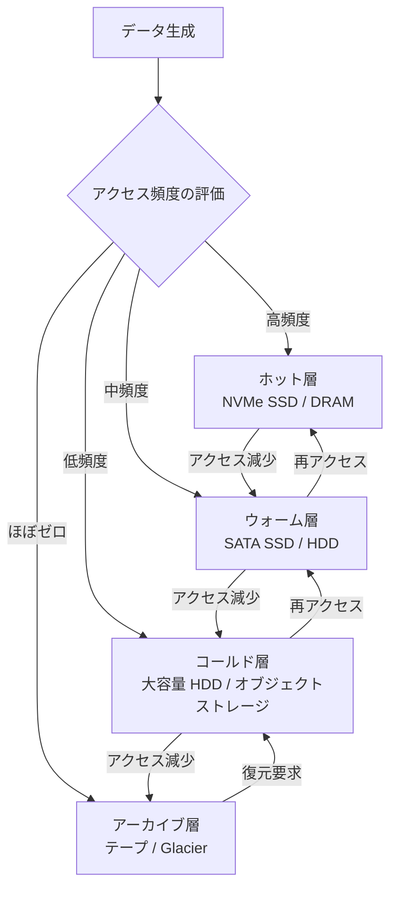

### ストレージメディアの特性比較

階層化を理解するうえで、各ストレージメディアの特性を把握しておくことは不可欠である。

| メディア | レイテンシ | スループット | 容量単価 | 耐久性 | 用途 |
|---------|-----------|-------------|---------|--------|------|
| DRAM | ~100 ns | ~50 GB/s | 非常に高い | 揮発性 | キャッシュ |
| NVMe SSD | ~10 μs | ~7 GB/s | 高い | 不揮発 | ホット層 |
| SATA SSD | ~100 μs | ~600 MB/s | 中程度 | 不揮発 | ウォーム層 |
| HDD | ~5 ms | ~200 MB/s | 低い | 不揮発 | コールド層 |
| テープ (LTO) | 数秒〜数分 | ~400 MB/s | 非常に低い | 不揮発 | アーカイブ層 |

この表から明らかなように、レイテンシとコストの間には数桁の差が存在する。これこそがストレージ階層化に経済的合理性を与える根本的な理由である。

## 2. ホット / ウォーム / コールド / アーカイブ

データの温度（Data Temperature）という概念は、ストレージ階層化の中核をなす。各温度帯の特徴と、典型的なユースケースを詳しく見ていこう。

### ホットデータ

ホットデータは、頻繁に読み書きされるアクティブなデータである。低レイテンシと高スループットが求められるため、最も高性能なストレージに配置する。

**特徴:**
- アクセス頻度: 毎秒〜毎分レベル
- レイテンシ要件: ミリ秒以下
- 典型的なメディア: NVMe SSD、Optane、DRAM キャッシュ
- 全データに占める割合: 通常 10〜20%

**ユースケース:**
- リアルタイムトランザクション処理（OLTP）のデータベース
- ユーザー向け Web アプリケーションのセッションデータ
- リアルタイム分析のワーキングセット
- 機械学習モデルの訓練データ（アクティブに使用中のもの）

### ウォームデータ

ウォームデータは、定期的にアクセスされるが、リアルタイム性は必須ではないデータである。ホットデータほどの性能は不要だが、合理的な時間内にアクセスできる必要がある。

**特徴:**
- アクセス頻度: 毎日〜毎週レベル
- レイテンシ要件: 数ミリ秒〜数百ミリ秒
- 典型的なメディア: SATA SSD、高速 HDD
- 全データに占める割合: 通常 20〜30%

**ユースケース:**
- 過去 30 日間のログデータ
- 定期的なレポーティングに使用する分析データ
- バックアップの直近世代
- 開発・テスト環境のデータ

### コールドデータ

コールドデータは、めったにアクセスされないが、必要なときには数分〜数時間以内に取得できる必要があるデータである。容量単価の低さが最も重要な要件となる。

**特徴:**
- アクセス頻度: 月に数回以下
- レイテンシ要件: 秒〜分オーダー
- 典型的なメディア: 大容量 HDD、オブジェクトストレージ
- 全データに占める割合: 通常 30〜40%

**ユースケース:**
- 90 日以上経過したログデータ
- 法令上の保持義務があるトランザクション履歴
- 過去のプロジェクトデータ
- 古い世代のバックアップ

### アーカイブデータ

アーカイブデータは、通常の業務ではほぼアクセスされないが、コンプライアンスや法的要件のために長期保存が必要なデータである。取得には数時間かかることもあるが、保存コストを最小化することが最優先される。

**特徴:**
- アクセス頻度: 年に数回以下（あるいはゼロ）
- レイテンシ要件: 数時間〜数日（許容範囲内）
- 典型的なメディア: テープ（LTO）、クラウドアーカイブサービス
- 全データに占める割合: 通常 20〜30%

**ユースケース:**
- 法令で 7 年以上の保持が義務付けられた財務データ
- 医療記録のアーカイブ
- 映像・音声の長期保存
- ディザスタリカバリ用の遠隔地バックアップ

### データ温度の分布

典型的な企業環境では、データの温度分布はべき乗則に近い形を示す。全データのうち、ホットデータはわずか 10〜20% であり、残りの 80〜90% はウォーム以下の温度帯に属する。しかし、多くの組織ではこの現実に反して、すべてのデータを同一の高性能ストレージに保存している。

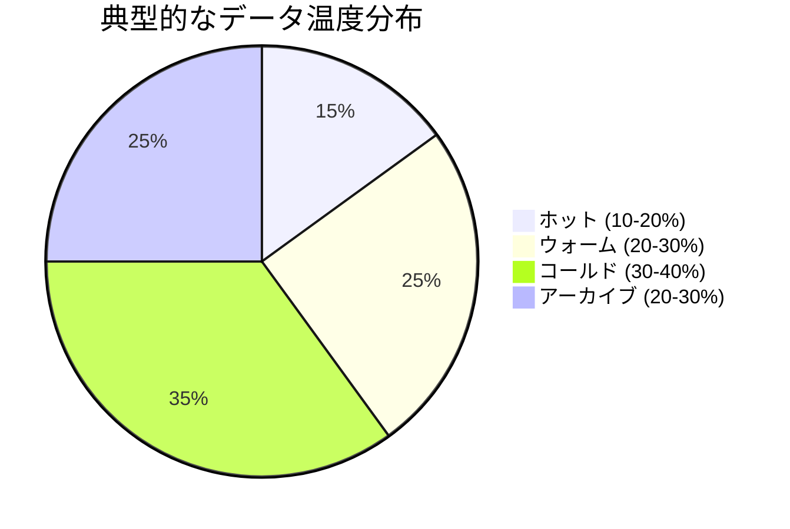

この分布を正しく認識し、適切な階層化を実施するだけで、ストレージコストを 50〜70% 削減できるケースは珍しくない。

## 3. 自動ティアリング

手動でデータの温度を判断し、ストレージ層間で移動する運用は、小規模環境では可能だが、ペタバイト級のデータを扱う環境では現実的ではない。ここで重要になるのが自動ティアリング（Automated Tiering）の仕組みである。

### 自動ティアリングの基本アーキテクチャ

自動ティアリングシステムは、一般的に以下のコンポーネントから構成される。

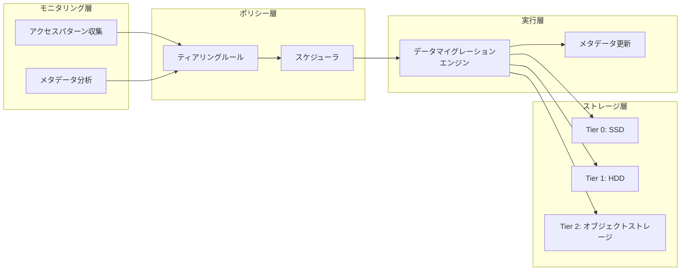

**1. モニタリング層**: ファイルやブロックレベルのアクセスパターンを継続的に監視し、各データの「温度」を算出する。典型的な指標には、最終アクセス日時（atime）、アクセス頻度、読み書き比率などがある。

**2. ポリシー層**: 管理者が定義したルールに基づいて、データの移動先を決定する。ルールは時間ベース（例: 30 日間アクセスなしでウォーム層へ）や頻度ベース（例: 1 日あたりのアクセスが 5 回未満でコールド層へ）で定義される。

**3. 実行層**: 実際のデータ移動を担当する。移動はバックグラウンドで非同期に行われ、業務への影響を最小化する。移動中もデータへのアクセスは可能であることが求められる。

### ティアリングアルゴリズム

自動ティアリングで使用される代表的なアルゴリズムを紹介する。

#### 閾値ベースのアルゴリズム

最もシンプルなアプローチで、事前に定義した閾値を超えた場合にデータを移動する。

```python
def evaluate_tier(data_object, current_tier):
    """Evaluate and determine the appropriate storage tier for a data object."""
    last_access_days = days_since_last_access(data_object)
    access_frequency = get_access_frequency(data_object, period_days=30)

    if access_frequency > HOT_THRESHOLD:
        # Frequently accessed data -> hot tier
        return TIER_HOT
    elif last_access_days < WARM_DAYS and access_frequency > COLD_THRESHOLD:
        # Moderately accessed data -> warm tier
        return TIER_WARM
    elif last_access_days < COLD_DAYS:
        # Infrequently accessed data -> cold tier
        return TIER_COLD
    else:
        # Rarely accessed data -> archive tier
        return TIER_ARCHIVE
```

#### ヒートマップベースのアルゴリズム

ストレージの各領域（ブロックやエクステント単位）にヒートスコアを割り当て、スコアに基づいて層間移動を行う。スコアは時間とともに減衰し、アクセスがあると加算される。

$$
H(t) = H(t-1) \times \alpha + w \times \text{access}(t)
$$

ここで $H(t)$ は時刻 $t$ におけるヒートスコア、$\alpha$ は減衰係数（$0 < \alpha < 1$）、$w$ はアクセスの重みである。この指数移動平均に基づくモデルにより、最近のアクセスパターンを重視しつつ、過去の傾向も考慮した判定が可能になる。

#### 機械学習ベースのアルゴリズム

近年では、過去のアクセスパターンから将来のアクセスを予測し、先回りしてデータを移動する機械学習ベースのアプローチも登場している。予測的ティアリング（Predictive Tiering）と呼ばれるこのアプローチでは、以下のような特徴量を用いる。

- アクセス頻度の時系列パターン
- ファイルのメタデータ（サイズ、種類、作成日時）
- 曜日・時間帯ごとのアクセスパターン
- 関連ファイルとの共起アクセスパターン

### 自動ティアリングの課題

自動ティアリングは万能ではなく、いくつかの課題がある。

**移動コスト**: データの層間移動自体にリソースを消費する。特に大量のデータを頻繁に移動すると、ネットワーク帯域やストレージ I/O を圧迫し、本来の業務に影響を与える可能性がある。

**予測の難しさ**: アクセスパターンが不規則なデータ（例: 四半期ごとの決算処理で参照されるデータ）は、単純なアルゴリズムでは正しく分類できない。

**データの一貫性**: 移動中のデータに対する読み書き要求の処理は、実装の複雑さを大幅に増加させる。

**メタデータのオーバーヘッド**: すべてのデータのアクセスパターンを追跡するメタデータの管理自体がストレージとコンピュートリソースを消費する。

## 4. クラウドストレージクラス

クラウドプロバイダーは、ストレージ階層化をサービスとして提供しており、ユーザーは物理的なストレージメディアを意識することなく、論理的なストレージクラスを選択するだけで階層化の恩恵を受けられる。

### AWS S3 のストレージクラス

Amazon S3 は、最も広く使われているオブジェクトストレージサービスであり、多様なストレージクラスを提供している。

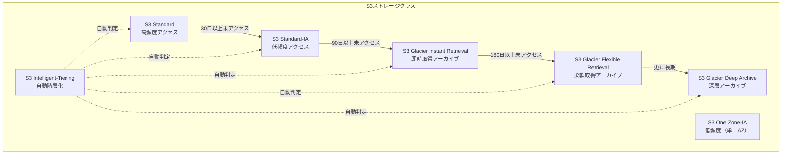

| ストレージクラス | 保存料金 (GB/月) | 取得料金 | 取得時間 | 最小保存期間 | 可用性 |
|----------------|-----------------|---------|---------|------------|-------|
| S3 Standard | ~$0.023 | なし | 即時 | なし | 99.99% |
| S3 Standard-IA | ~$0.0125 | $0.01/GB | 即時 | 30日 | 99.9% |
| S3 One Zone-IA | ~$0.01 | $0.01/GB | 即時 | 30日 | 99.5% |
| Glacier Instant | ~$0.004 | $0.03/GB | ミリ秒 | 90日 | 99.9% |
| Glacier Flexible | ~$0.0036 | $0.01/GB | 分〜時間 | 90日 | 99.99% |
| Glacier Deep Archive | ~$0.00099 | $0.02/GB | 12時間 | 180日 | 99.99% |

::: tip S3 Intelligent-Tiering
S3 Intelligent-Tiering は、アクセスパターンを自動的にモニタリングし、最適なストレージクラスにデータを移動する。少額のモニタリング料金（オブジェクトあたり月額 ~$0.0025/1000 オブジェクト）がかかるが、取得料金は発生しない。アクセスパターンが予測困難なワークロードに適している。
:::

### S3 ライフサイクルポリシー

S3 では、ライフサイクルポリシーを定義することで、オブジェクトを自動的に異なるストレージクラスに移行できる。

```json
{
  "Rules": [
    {
      "ID": "TieringRule",
      "Status": "Enabled",
      "Filter": {
        "Prefix": "logs/"
      },
      "Transitions": [
        {
          "Days": 30,
          "StorageClass": "STANDARD_IA"
        },
        {
          "Days": 90,
          "StorageClass": "GLACIER_IR"
        },
        {
          "Days": 365,
          "StorageClass": "DEEP_ARCHIVE"
        }
      ],
      "Expiration": {
        "Days": 2555
      }
    }
  ]
}
```

このポリシーは、`logs/` プレフィックスを持つオブジェクトを、30 日後に Standard-IA、90 日後に Glacier Instant Retrieval、365 日後に Deep Archive に移行し、7 年（2555 日）後に削除する。

### Azure Blob Storage のアクセス層

Microsoft Azure も同様の階層化を提供している。

- **Hot**: 高頻度アクセス向け。保存料金が高く、アクセス料金が低い
- **Cool**: 30 日以上保存される低頻度アクセスデータ向け
- **Cold**: 90 日以上保存される極低頻度データ向け
- **Archive**: 180 日以上保存されるアーカイブデータ向け。リハイドレーション（復元）に数時間を要する

Azure の特徴的な機能として、Blob レベルでのアクセス層設定が可能であり、同一コンテナ内で異なるアクセス層のオブジェクトを混在させることができる。

### Google Cloud Storage のストレージクラス

Google Cloud Storage では以下のクラスが提供されている。

- **Standard**: 高頻度アクセス向け
- **Nearline**: 月に 1 回程度のアクセス向け（最小保存期間 30 日）
- **Coldline**: 四半期に 1 回程度のアクセス向け（最小保存期間 90 日）
- **Archive**: 年に 1 回未満のアクセス向け（最小保存期間 365 日）

Google Cloud Storage の特徴として、Autoclass 機能があり、オブジェクトのアクセスパターンに基づいて自動的にストレージクラスを変更する。

### クラウドストレージクラス選択の注意点

クラウドストレージクラスを選択する際には、以下の点に注意が必要である。

**最小保存期間の課金**: 多くのアーカイブクラスには最小保存期間が設定されており、その期間内にデータを削除しても、最小期間分の料金が発生する。

**取得料金**: 安価なストレージクラスほど、データ取得時の料金が高くなる傾向がある。頻繁に取得するデータを安易にアーカイブクラスに移すと、逆にコストが増加する。

**移行にかかる時間**: 特に Deep Archive からの復元は数時間〜半日かかることがある。緊急時のデータアクセスが必要な場合は、この制約を考慮する必要がある。

**API 料金の差異**: ストレージクラスによって、LIST や GET などの API コール料金が異なる。大量の小さなオブジェクトを低頻度クラスに保存すると、API 料金が保存料金を上回ることがある。

## 5. HSM（Hierarchical Storage Management）

### HSM の歴史と概要

Hierarchical Storage Management（HSM）は、ストレージ階層化の最も古い形態の一つであり、1970 年代のメインフレーム環境にまで遡る。HSM は、ファイルシステムレベルで透過的にデータの階層間移動を管理するシステムである。

HSM の核心的なアイデアは「スタブファイル」にある。データが低速な層（テープなど）に移動された後も、元のファイルシステム上にはスタブ（プレースホルダ）が残り、ユーザーやアプリケーションからは通常のファイルとして見える。ファイルにアクセスがあると、HSM は自動的にデータを高速な層から取得（リコール）し、アプリケーションに返す。

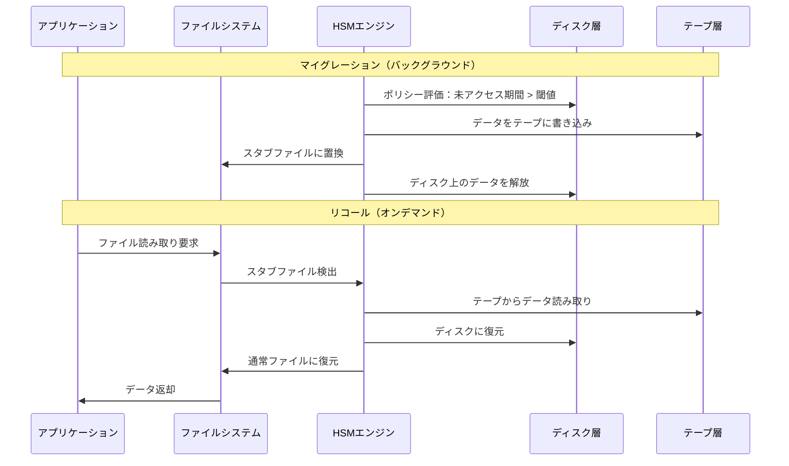

### 主要な HSM 実装

#### IBM Spectrum Archive

IBM Spectrum Archive（旧 LTFS Library Edition）は、LTO テープをファイルシステムとしてマウントし、HSM の一環として利用できるようにする製品である。メディア・放送業界での大容量映像アーカイブに広く使われている。

#### StarFish / Starfish Storage

ファイルシステムのメタデータをインデックス化し、ポリシーベースのデータ移動を実現するソリューション。HPC（高性能コンピューティング）環境でのデータ管理に強みを持つ。

#### Linux dm-writecache / bcache

Linux カーネルレベルで SSD をHDD のキャッシュ層として利用するブロックレベルのティアリング機構。厳密には HSM とは異なるが、階層化の思想を共有する。

```bash
# bcache setup example
# Create a backing device (HDD) and cache device (SSD)
make-bcache -B /dev/sda -C /dev/nvme0n1p1

# Set cache mode to writeback for better performance
echo writeback > /sys/block/bcache0/bcache/cache_mode

# Set sequential cutoff to avoid caching large sequential reads
echo 0 > /sys/block/bcache0/bcache/sequential_cutoff
```

### HSM の現代的な意義

かつて HSM はテープライブラリとの組み合わせが主流だったが、現代ではクラウドオブジェクトストレージとの統合が進んでいる。オンプレミスの高速ストレージをプライマリ層とし、クラウドのオブジェクトストレージをセカンダリ層として利用するハイブリッド HSM が注目されている。

この形態では、ファイルシステムのインターフェースを維持しつつ、バックエンドではクラウドの事実上無限のストレージ容量を活用できる。代表的な実装として、以下のようなプロジェクトがある。

- **Komprise**: エージェントレスのデータ管理プラットフォームで、NAS からクラウドへの透過的なティアリングを実現
- **NetApp FabricPool**: ONTAP ファイルシステムのコールドブロックを自動的にクラウドオブジェクトストレージに移動
- **AWS File Gateway**: オンプレミスのファイルサーバーのバックエンドとして S3 を利用

## 6. Ceph のストレージクラス

### Ceph の概要

Ceph はオープンソースの分散ストレージシステムであり、ブロック、ファイル、オブジェクトの 3 つのストレージインターフェースを統合的に提供する。Ceph の階層化機能は、大規模な分散環境でのストレージコスト最適化に重要な役割を果たす。

### CRUSH マップとデバイスクラス

Ceph のデータ配置は CRUSH（Controlled Replication Under Scalable Hashing）アルゴリズムによって決定される。CRUSH マップにデバイスクラスを定義することで、異なる種類のストレージメディアを論理的に区別できる。

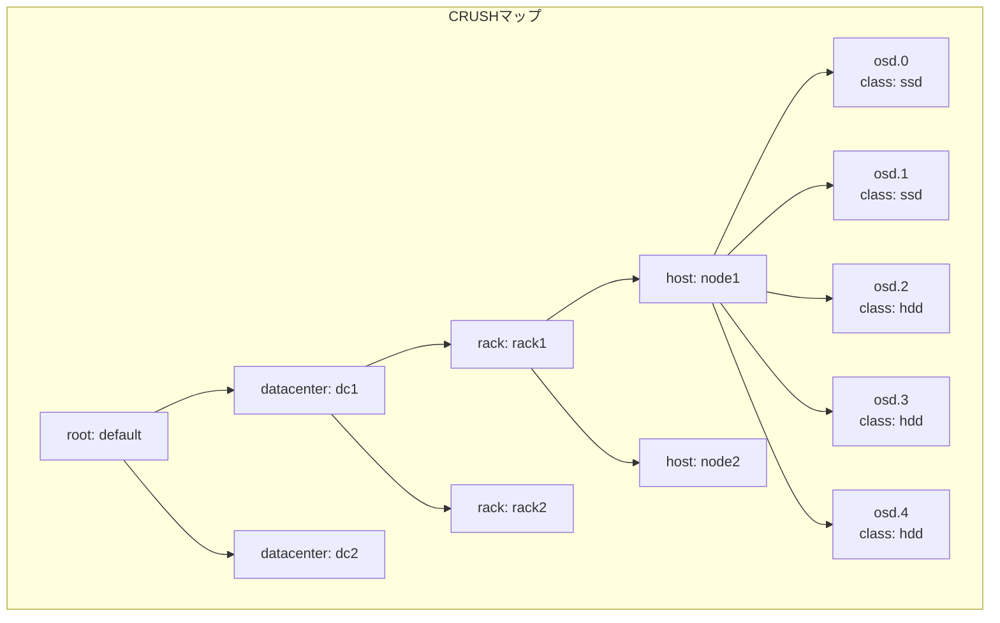

デバイスクラスは OSD（Object Storage Daemon）に自動的に割り当てられるか、手動で設定できる。

```bash
# Check device class of an OSD
ceph osd tree

# Set device class manually
ceph osd crush set-device-class ssd osd.0
ceph osd crush set-device-class hdd osd.2

# Create a CRUSH rule that targets only SSD devices
ceph osd crush rule create-replicated ssd_rule default host ssd

# Create a CRUSH rule that targets only HDD devices
ceph osd crush rule create-replicated hdd_rule default host hdd
```

### プール単位の階層化

Ceph では、プール（Pool）ごとに異なる CRUSH ルールを適用することで、データの配置先を制御できる。

```bash
# Create a pool on SSD tier
ceph osd pool create hot_pool 128 128
ceph osd pool set hot_pool crush_rule ssd_rule

# Create a pool on HDD tier
ceph osd pool create cold_pool 256 256
ceph osd pool set cold_pool crush_rule hdd_rule
```

この構成では、アプリケーション側でホットデータを `hot_pool` に、コールドデータを `cold_pool` に明示的に配置する。プール間のデータ移動は、`rados cppool` やカスタムスクリプトで実現する。

### Cache Tiering（非推奨）

Ceph にはかつて Cache Tiering と呼ばれる機能があった。これは高速なプール（キャッシュ層）を低速なプール（ストレージ層）の前段に配置し、透過的なキャッシュを実現するものだった。

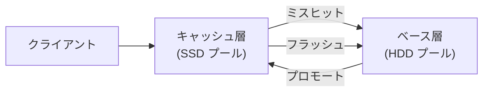

しかし、Cache Tiering は実運用で多くの問題を抱えていた。

- **予測不能なレイテンシ**: キャッシュミスが発生するとベース層へのアクセスが必要になり、レイテンシが大幅に増加する
- **プロモーション / デモーションの負荷**: データの昇格・降格処理がクラスタ全体の性能に影響する
- **複雑な設定**: 適切な動作のためにチューニングが必要なパラメータが多すぎる

::: warning Cache Tiering の非推奨化
Ceph の Cache Tiering 機能は公式に非推奨とされている。現在では、デバイスクラスと CRUSH ルールによるプール単位の階層化が推奨されている。アプリケーション層でのデータ配置制御と組み合わせることで、より予測可能な性能特性を実現できる。
:::

### RGW（RADOS Gateway）のストレージクラス

Ceph の S3 互換オブジェクトストレージインターフェースである RGW では、S3 のストレージクラスに対応する機能が提供されている。

```bash
# Define a storage class in RGW
radosgw-admin zonegroup placement add \
    --rgw-zonegroup default \
    --placement-id default-placement \
    --storage-class COLD

# Associate a data pool with the storage class
radosgw-admin zone placement modify \
    --rgw-zone default \
    --placement-id default-placement \
    --storage-class COLD \
    --data-pool cold_pool
```

この構成により、S3 API 経由でアップロードされたオブジェクトのストレージクラスを指定でき、クラスに応じて異なる Ceph プール（ひいては異なるデバイスクラス）にデータが配置される。S3 のライフサイクルポリシーもサポートされており、AWS S3 と同様の自動ティアリングがオンプレミス環境で実現可能である。

## 7. データベースにおけるティアリング

データベースにおけるティアリングは、ストレージ階層化の概念をデータベースエンジンの内部に適用するものであり、近年特に注目を集めている分野である。

### テーブル / パーティションレベルのティアリング

最も伝統的なアプローチは、テーブルパーティショニングと組み合わせたティアリングである。時間ベースのパーティショニングを行い、古いパーティションを低コストのストレージに移動する。

```sql
-- PostgreSQL: Create a partitioned table with range partitioning
CREATE TABLE events (
    id BIGSERIAL,
    event_time TIMESTAMP NOT NULL,
    event_type TEXT,
    payload JSONB
) PARTITION BY RANGE (event_time);

-- Hot partition: current month on fast SSD tablespace
CREATE TABLE events_2026_03 PARTITION OF events
    FOR VALUES FROM ('2026-03-01') TO ('2026-04-01')
    TABLESPACE fast_ssd;

-- Warm partition: previous months on standard storage
CREATE TABLE events_2026_02 PARTITION OF events
    FOR VALUES FROM ('2026-02-01') TO ('2026-03-01')
    TABLESPACE standard_hdd;

-- Cold partition: older data on archive storage
CREATE TABLE events_2025 PARTITION OF events
    FOR VALUES FROM ('2025-01-01') TO ('2026-01-01')
    TABLESPACE archive_storage;
```

### LSM-Tree ベースのティアリング

LSM-Tree（Log-Structured Merge-Tree）を採用するデータベース（RocksDB、LevelDB、Cassandra など）は、構造的にティアリングとの親和性が高い。LSM-Tree では、データが Memtable からディスク上の SSTable（Sorted String Table）に書き出され、コンパクションによって複数のレベルにまたがって管理される。

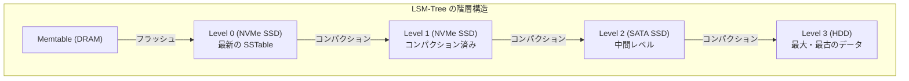

RocksDB では、`ColumnFamilyOptions` で各レベルのストレージパスを指定できる。

```cpp
// RocksDB: Configure per-level storage paths
rocksdb::Options options;
options.db_paths = {
    {"/mnt/nvme/db", 10ULL << 30},    // First 10GB on NVMe
    {"/mnt/ssd/db",  100ULL << 30},   // Next 100GB on SATA SSD
    {"/mnt/hdd/db",  1ULL << 40}      // Up to 1TB on HDD
};
```

### TiDB / TiKV のホットリージョン管理

TiDB（分散 SQL データベース）では、TiKV ストレージエンジンがデータをリージョンと呼ばれる単位に分割して管理する。PD（Placement Driver）がリージョンのアクセス統計を監視し、ホットリージョンを自動的にロードの低いノードに分散する。

さらに、TiDB の Placement Rules 機能を使うことで、特定のデータを特定のストレージ層に配置するルールを定義できる。

```sql
-- TiDB: Define placement policy for different tiers
CREATE PLACEMENT POLICY hot_policy
    CONSTRAINTS="[+disk=ssd]"
    FOLLOWERS=2;

CREATE PLACEMENT POLICY cold_policy
    CONSTRAINTS="[+disk=hdd]"
    FOLLOWERS=1;

-- Apply policies to partitions
ALTER TABLE events PARTITION events_2026_03
    PLACEMENT POLICY = hot_policy;

ALTER TABLE events PARTITION events_2025
    PLACEMENT POLICY = cold_policy;
```

### Amazon Aurora のティアリング

Amazon Aurora は、Tiered Storage（ティアリングストレージ）機能を提供している。Aurora Standard と Aurora I/O-Optimized の 2 つのストレージ設定があり、I/O パターンに応じて選択できる。

加えて Aurora は、ストレージレベルでページをホット・コールドに分類する内部的なティアリングも実施している。頻繁にアクセスされるページはバッファプール内に保持され、めったにアクセスされないページはストレージ層に留まる。この仕組みは従来のバッファプール管理と本質的に同じだが、Aurora の分散ストレージアーキテクチャにより、ストレージ層へのアクセスも従来のローカルディスクアクセスより高速である。

### 時系列データベースとティアリング

時系列データは、時間の経過とともにアクセス頻度が低下するという明確な特性を持つため、ティアリングとの相性が非常に良い。

**InfluxDB** は、Retention Policy と Continuous Query を組み合わせて、古いデータを自動的にダウンサンプリング（集約）し、低解像度で保存する仕組みを提供する。

**TimescaleDB** は、PostgreSQL の拡張として動作し、ハイパーテーブルのチャンクを異なるテーブルスペースに移動する階層化をサポートする。

```sql
-- TimescaleDB: Move old chunks to slower storage
SELECT move_chunk(
    chunk => '_timescaledb_internal._hyper_1_5_chunk',
    destination_tablespace => 'archive_storage',
    index_destination_tablespace => 'archive_storage'
);

-- Automate chunk movement with a policy
SELECT add_tiering_policy(
    'sensor_data',
    INTERVAL '7 days',
    'archive_storage'
);
```

## 8. コスト最適化戦略

ストレージ階層化の究極的な目的はコスト最適化である。ここでは、効果的なコスト最適化を実現するための戦略を解説する。

### TCO（総所有コスト）の分析

ストレージのコストは、単純な容量単価だけでは測れない。TCO には以下の要素が含まれる。

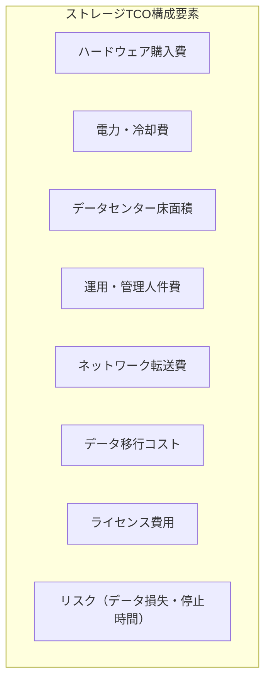

オンプレミス環境では、SSD は HDD と比較してハードウェア費用は高いものの、電力消費が少なく、ラック密度も高いため、TCO の差は容量単価の差ほど大きくないことが多い。

クラウド環境では、保存料金に加えて、取得料金、API 料金、データ転送料金を含めた総コストで比較する必要がある。

### データ分析に基づく階層化設計

効果的な階層化には、まず現状のデータアクセスパターンの詳細な分析が不可欠である。

**分析のステップ:**

1. **データインベントリの作成**: 保存されているすべてのデータセットを特定し、サイズ、種類、所有者を記録する
2. **アクセスパターンの収集**: ファイルシステムの atime/mtime、アプリケーションログ、ストレージコントローラの統計を収集する
3. **データ分類**: アクセス頻度と重要度のマトリクスでデータを分類する
4. **コストモデルの構築**: 各層のコスト（保存 + アクセス + 運用）を算出する
5. **最適配置の計算**: データの分類とコストモデルに基づいて、最小コストの配置を計算する

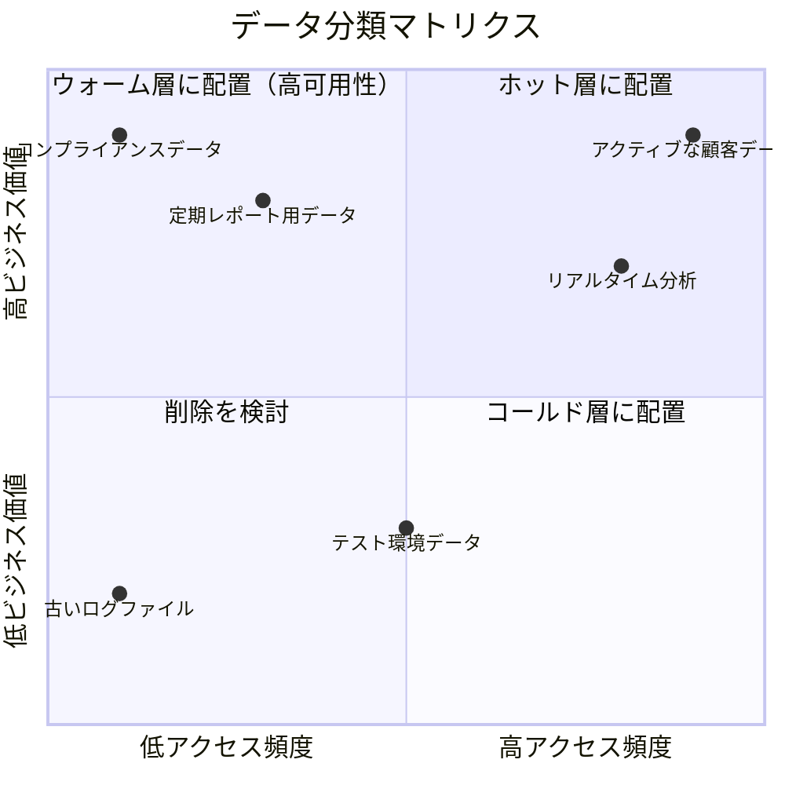

### 削減効果の試算例

以下は、100 TB のデータを持つ組織がストレージ階層化を導入した場合の試算例である。

**階層化前（全データを S3 Standard に保存）:**

| 項目 | 金額（月額） |
|------|------------|
| 100 TB × $0.023/GB | $2,355 |
| **合計** | **$2,355/月** |

**階層化後:**

| 層 | 容量 | 単価 | 金額（月額） |
|----|------|------|------------|
| Standard (15%) | 15 TB | $0.023/GB | $353 |
| Standard-IA (25%) | 25 TB | $0.0125/GB | $320 |
| Glacier Instant (35%) | 35 TB | $0.004/GB | $143 |
| Deep Archive (25%) | 25 TB | $0.00099/GB | $25 |
| **合計** | **100 TB** | | **$841/月** |

この例では、月額コストが $2,355 から $841 に削減され、約 64% のコスト削減を実現している。年間では約 $18,168 の節約となる。

::: warning 取得コストの考慮
上記の試算は保存料金のみの比較である。実際には、コールド層やアーカイブ層からのデータ取得に追加料金が発生するため、アクセスパターンを正確に見積もったうえで総コストを比較する必要がある。取得頻度が高いデータを安易にアーカイブ層に移すと、かえってコスト増になるリスクがある。
:::

### コスト最適化のための組織的な取り組み

技術的な階層化だけでなく、組織的な取り組みも重要である。

**データ保持ポリシーの策定**: 法令要件とビジネス要件に基づいた明確なデータ保持ポリシーを策定し、不要なデータの積極的な削除を推進する。すべてのデータを永久保存するのは、コストだけでなくセキュリティやコンプライアンスのリスクも増大させる。

**データオーナーシップの明確化**: 各データセットのオーナー（責任者）を明確にし、保持・削除の判断を適切に行える体制を構築する。

**コスト配分の可視化**: 部門やプロジェクトごとのストレージコストを可視化し、コスト意識を醸成する。ショーバック（コスト配分の報告）やチャージバック（実際の課金）の仕組みが有効である。

**定期的な見直し**: データのアクセスパターンは時間とともに変化するため、階層化ポリシーの定期的な見直しが必要である。四半期ごとのレビューが一般的な頻度である。

## 9. 実装のベストプラクティス

最後に、ストレージ階層化を実装する際のベストプラクティスをまとめる。

### 段階的な導入

階層化は一度に全データに適用するのではなく、段階的に導入するのが望ましい。

1. **パイロットプロジェクトから開始**: 影響の少ないワークロード（開発環境のバックアップなど）で階層化を試行する
2. **モニタリング体制の構築**: データ移動の状況、レイテンシの変化、コスト削減効果を定量的に測定する仕組みを整える
3. **ポリシーの調整**: パイロットの結果をもとに、ティアリングポリシーの閾値やルールを最適化する
4. **本番環境への展開**: 十分な検証の後、本番ワークロードに適用する

### メタデータ管理の重要性

階層化を行う際、データのメタデータ管理は成功の鍵を握る。

- **データカタログの整備**: どのデータがどの層に存在するかを追跡するカタログを維持する
- **タグ付けの標準化**: データの分類タグ（データ種類、所有者、保持期限など）を標準化し、自動分類に活用する
- **監査証跡の保持**: データの移動履歴を記録し、コンプライアンス監査に対応できるようにする

### パフォーマンスへの配慮

階層化によるパフォーマンスへの影響を最小化するための対策が必要である。

**プリフェッチとキャッシュ**: 予測可能なアクセスパターンのデータは、事前に高速な層にプリフェッチしておく。例えば、月次レポート処理の前日に関連データをウォーム層からホット層にプロモートする。

**移動のスケジューリング**: データ移動は業務のオフピーク時間帯に行い、帯域制限を設ける。

```python
import schedule
import time

def tier_migration_job():
    """Run tier migration during off-peak hours with bandwidth throttling."""
    migration_engine = TierMigrationEngine(
        max_bandwidth_mbps=500,  # Limit bandwidth to 500 MB/s
        max_iops=1000,           # Limit IOPS to 1000
        priority="low"           # Use low I/O priority
    )

    # Migrate cold data from warm tier to cold tier
    migration_engine.migrate(
        source_tier="warm",
        dest_tier="cold",
        criteria={"last_access_days_gt": 90, "access_freq_lt": 0.1}
    )

# Schedule migration job at 2 AM daily
schedule.every().day.at("02:00").do(tier_migration_job)

while True:
    schedule.run_pending()
    time.sleep(60)
```

**SLA の定義**: 各層のパフォーマンス SLA を明確に定義し、ユーザーに周知する。コールド層からのデータ取得に時間がかかることを事前に理解してもらうことで、期待値のミスマッチを防ぐ。

### データ整合性の保証

層間のデータ移動時にデータが破損しないことを保証する仕組みが必要である。

- **チェックサム検証**: データ移動の前後でチェックサム（SHA-256 など）を比較し、整合性を確認する
- **書き込み確認後の削除**: 移動先への書き込みが完了し、検証が済んだ後にのみ、移動元のデータを削除する
- **ロールバック機能**: 移動に失敗した場合にデータを元の状態に戻せるロールバック機構を実装する

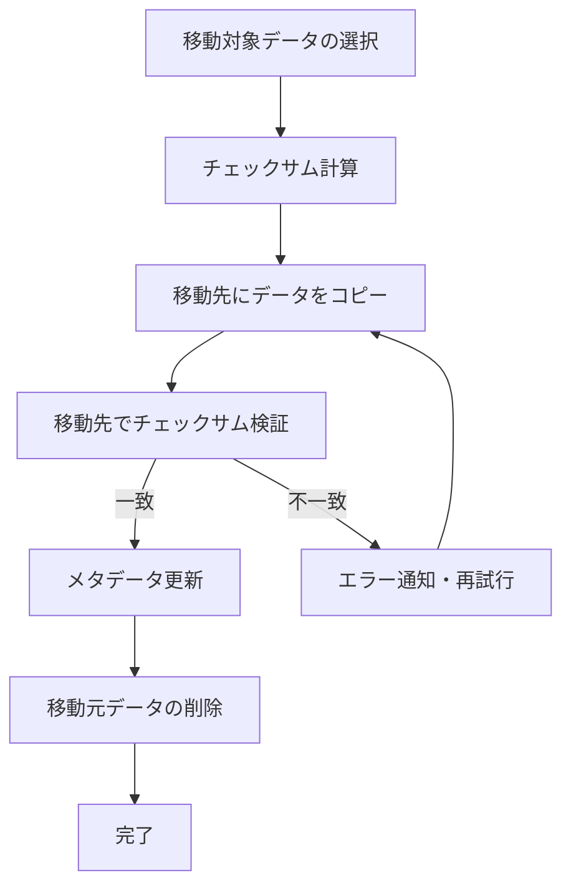

### 災害復旧との統合

ストレージ階層化と災害復旧（DR）戦略は密接に関連している。

- **アーカイブ層のレプリケーション**: アーカイブ層のデータも地理的に分散させ、単一障害点を排除する
- **復旧時間目標（RTO）の整合**: 各層のデータ取得時間が RTO を満たすことを確認する。アーカイブ層からの復元が必要な場合、RTO が数時間〜数日になることを DR 計画に反映する
- **定期的な復旧テスト**: 各層からのデータ復旧手順を定期的にテストし、手順の有効性を確認する

### 監視とアラート

階層化システムの健全性を維持するための監視項目を定義する。

| 監視項目 | 閾値例 | アクション |
|---------|--------|----------|
| 各層の使用率 | > 80% | 容量追加またはティアリング閾値の調整 |
| データ移動のスループット | 予定の 50% 未満 | ボトルネックの調査 |
| データ移動のエラー率 | > 1% | 即座に調査・対応 |
| コールド層からのアクセス頻度 | 予想の 2 倍以上 | 分類ポリシーの見直し |
| 各層のレイテンシ | SLA の 80% 超過 | 性能チューニング |

### まとめ

ストレージ階層化は、増え続けるデータをコスト効率良く管理するための本質的な戦略である。その核心は、すべてのデータが同等の扱いを必要としないという認識にある。

成功する階層化の要件を振り返ると、以下の通りである。

1. **データの可視化**: 保有するデータの全体像を把握する
2. **アクセスパターンの分析**: 定量的なデータに基づいて分類する
3. **ポリシーの策定**: ビジネス要件と技術的制約のバランスをとる
4. **自動化の導入**: 手動運用の限界を認識し、自動ティアリングを活用する
5. **継続的な改善**: アクセスパターンの変化に応じてポリシーを見直す

クラウドネイティブな環境では、S3 Intelligent-Tiering のような完全自動のソリューションが利用可能であり、導入のハードルは以前よりも大幅に下がっている。一方、オンプレミス環境やハイブリッド環境では、Ceph のデバイスクラスやHSM の仕組みを活用することで、きめ細かな制御が可能である。

重要なのは、ストレージ階層化を単なるコスト削減施策として捉えるのではなく、データライフサイクル管理全体の一部として位置づけることである。データの生成から廃棄までの全工程を見据えた包括的な戦略の中で、階層化はその中核をなす要素なのである。
