# ストリーム処理の基礎（ウィンドウ, ウォーターマーク, Exactly-Once）

## 1. はじめに：なぜストリーム処理が必要か

現代のデータ基盤は、かつてのように1日1回のバッチ処理だけでは対応しきれない要件を抱えている。不正取引のリアルタイム検知、IoTセンサーデータの継続的な集計、ユーザー行動に基づく即時レコメンデーションなど、データが発生した瞬間に近いタイミングで処理結果を得たいというニーズは増加の一途をたどっている。

バッチ処理では、一定期間のデータを蓄積してからまとめて処理するため、データの発生から結果の反映まで数分から数時間のレイテンシが生じる。これは多くのビジネスユースケースで許容できない遅延である。

**ストリーム処理（Stream Processing）** は、データが到着するたびに逐次的に処理を行うパラダイムである。無限に続くデータの流れ（ストリーム）を入力として受け取り、低レイテンシで継続的に結果を出力する。

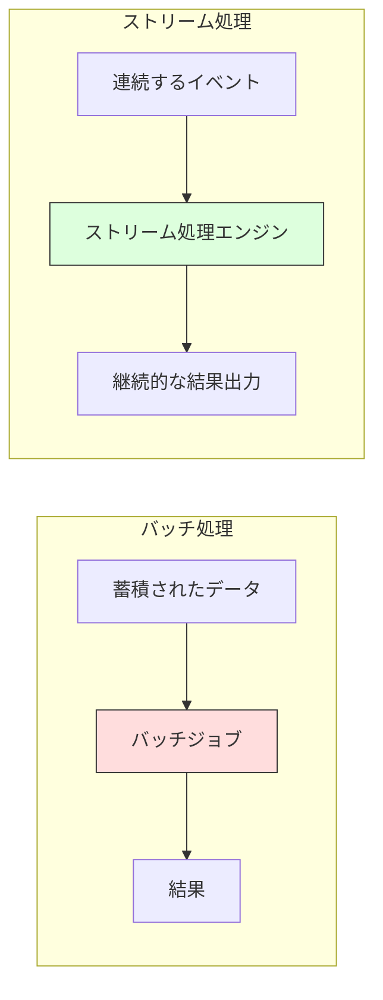

しかし、ストリーム処理にはバッチ処理にはない固有の難しさがある。データはいつ届くかわからない、順序が入れ替わることがある、処理の途中でシステムが障害を起こすかもしれない。これらの課題に対処するために、**ウィンドウ（Windowing）**、**ウォーターマーク（Watermark）**、**Exactly-Once セマンティクス** という3つの核心的な概念が発展してきた。

本記事では、これら3つの概念を中心に、ストリーム処理の基礎理論から実践的な設計判断までを体系的に解説する。

## 2. バッチ処理とストリーム処理の本質的な違い

### 2.1 有限データと無限データ

バッチ処理とストリーム処理の最も根本的な違いは、処理対象のデータが **有限（bounded）** か **無限（unbounded）** かという点にある。

バッチ処理は、ファイルやデータベースのテーブルなど、始まりと終わりが明確に定義されたデータセットを対象とする。処理の開始時にデータの全体像が確定しており、すべてのデータを読み込んでから結果を計算できる。

一方、ストリーム処理は、ログイベント、センサーデータ、クリックストリームなど、終わりのないデータの流れを対象とする。新しいデータは絶えず到着し続け、「すべてのデータが揃った」という状態は永遠に訪れない。

| 特性 | バッチ処理 | ストリーム処理 |
|------|----------|--------------|
| データの性質 | 有限（bounded） | 無限（unbounded） |
| 処理のトリガー | スケジュールまたは手動 | データの到着 |
| レイテンシ | 分〜時間 | ミリ秒〜秒 |
| 完全性 | 処理開始時に全データが揃う | 全データが揃うことはない |
| 結果の修正 | 再実行で修正可能 | 遅延データへの対応が必要 |
| リソース使用 | バースト的 | 継続的 |

### 2.2 イベント時間と処理時間

ストリーム処理を理解する上で最も重要な概念の1つが、**イベント時間（Event Time）** と **処理時間（Processing Time）** の区別である。

- **イベント時間**: イベントが実際に発生した時刻。例えば、ユーザーがボタンをクリックした瞬間のタイムスタンプ。
- **処理時間**: イベントが処理エンジンに到達し、実際に処理された時刻。

理想的な世界では、イベント時間と処理時間は一致する。しかし現実には、ネットワーク遅延、一時的な接続断、モバイルデバイスのオフライン期間など、さまざまな要因により両者にはずれ（**スキュー**）が生じる。

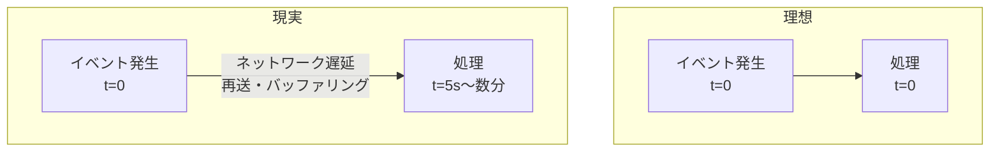

処理時間でウィンドウを定義すると、イベントが実際にいつ発生したかに関係なく、処理エンジンに到着した順序で集計されてしまう。これでは、「14:00〜14:05 のクリック数」を正確に計算できない。イベント時間ベースのウィンドウは、この問題を解決するために不可欠な概念である。

### 2.3 ストリーム処理の基本モデル

ストリーム処理エンジンは、一般にデータフローグラフ（DAG: Directed Acyclic Graph）として処理パイプラインを表現する。

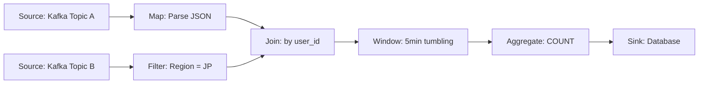

主要な処理オペレーターには以下のものがある。

- **Source**: 外部システムからイベントを読み込む（Kafka, Kinesis, Pub/Sub など）
- **Map / FlatMap**: 各イベントを変換する
- **Filter**: 条件に合致するイベントのみを通す
- **KeyBy / Partition**: キーに基づいてイベントをグループ化する
- **Window**: 時間やイベント数に基づいてイベントをまとめる
- **Aggregate**: ウィンドウ内のイベントを集計する（COUNT, SUM, AVG など）
- **Join**: 複数のストリームを結合する
- **Sink**: 処理結果を外部システムに書き出す

## 3. ウィンドウ（Windowing）

### 3.1 なぜウィンドウが必要か

無限のデータストリームに対して「全データの合計」を計算することはできない。データは永遠に到着し続けるため、計算が終わることはない。したがって、ストリーム処理では、無限のデータを何らかの基準で **有限の区間** に分割する必要がある。この区間がウィンドウである。

ウィンドウは、「過去5分間のページビュー数」「直近100イベントの平均応答時間」のように、集計の対象範囲を定義する。ウィンドウの設計は、ストリーム処理アプリケーションの正確性とパフォーマンスの両方に直接影響する重要な設計判断である。

### 3.2 タンブリングウィンドウ（Tumbling Window）

タンブリングウィンドウは、固定長の重複しないウィンドウで、最も単純かつ広く使われるウィンドウ種別である。各イベントは正確に1つのウィンドウに属する。

```mermaid
gantt
    title タンブリングウィンドウ（サイズ: 5分）
    dateFormat HH:mm
    axisFormat %H:%M

    section Window 1
    Window 1 :w1, 00:00, 5m
    section Window 2
    Window 2 :w2, 00:05, 5m
    section Window 3
    Window 3 :w3, 00:10, 5m
    section Window 4
    Window 4 :w4, 00:15, 5m
```

**特性**:
- ウィンドウ同士に重複がないため、各イベントは正確に1つのウィンドウに割り当てられる
- ウィンドウのサイズ（幅）のみがパラメータ
- 「毎分のリクエスト数」「1時間ごとの売上集計」など、定期的な集計に最適

**典型的なユースケース**: 毎分のメトリクス集計、1時間ごとのレポート生成、日次のアクセスログ集計

::: tip タンブリングウィンドウの境界
タンブリングウィンドウの境界は、通常エポック（1970年1月1日 00:00:00 UTC）からの経過時間に基づいて決定される。たとえば5分のタンブリングウィンドウでは、00:00〜04:59、05:00〜09:59 のようにアライメントされる。これにより、異なるオペレーター間でウィンドウの境界が一致する。
:::

### 3.3 スライディングウィンドウ（Sliding Window / Hopping Window）

スライディングウィンドウ（ホッピングウィンドウとも呼ばれる）は、固定長のウィンドウが一定間隔でスライドする。ウィンドウのサイズとスライド間隔の2つのパラメータで定義される。

```mermaid
gantt
    title スライディングウィンドウ（サイズ: 10分, スライド: 5分）
    dateFormat HH:mm
    axisFormat %H:%M

    section Window 1
    Window 1 :w1, 00:00, 10m
    section Window 2
    Window 2 :w2, 00:05, 10m
    section Window 3
    Window 3 :w3, 00:10, 10m
    section Window 4
    Window 4 :w4, 00:15, 10m
```

**特性**:
- ウィンドウサイズ > スライド間隔の場合、ウィンドウは重複し、1つのイベントが複数のウィンドウに属する
- ウィンドウサイズ = スライド間隔の場合、タンブリングウィンドウと同等になる
- より滑らかな集計結果が得られるが、計算量とメモリ使用量が増加する

**典型的なユースケース**: 移動平均の計算（直近10分の平均を5分ごとに更新）、トレンド検出

::: warning スライディングウィンドウの状態サイズ
スライディングウィンドウでは、1つのイベントが（ウィンドウサイズ / スライド間隔）個のウィンドウに属する。たとえばサイズ1時間・スライド1分のウィンドウでは、各イベントが60個のウィンドウに属するため、状態のサイズが大きくなる点に注意が必要である。
:::

### 3.4 セッションウィンドウ（Session Window）

セッションウィンドウは、固定長ではなく、イベントの到着パターンに応じて動的にサイズが決まるウィンドウである。一定時間（ギャップ）以上イベントが到着しなかった場合にウィンドウが閉じる。

```mermaid
gantt
    title セッションウィンドウ（ギャップ: 5分）
    dateFormat HH:mm
    axisFormat %H:%M

    section Session 1
    Events arriving :s1, 00:00, 8m
    section Gap
    No events :g1, 00:08, 6m
    section Session 2
    Events arriving :s2, 00:14, 4m
    section Gap
    No events :g2, 00:18, 7m
    section Session 3
    Events arriving :s3, 00:25, 3m
```

**特性**:
- ウィンドウの長さがデータに依存して動的に変わる
- ユーザーの「セッション」概念を自然に表現できる
- 実装が複雑になりやすい（ウィンドウのマージが必要になるため）
- ギャップタイムアウトのみがパラメータ

**典型的なユースケース**: Webサイトのセッション分析、ユーザーの操作パターン分析、コールセンターの通話セグメンテーション

### 3.5 グローバルウィンドウ（Global Window）

グローバルウィンドウは、すべてのイベントを単一のウィンドウに割り当てる。単独では意味をなさないが、カスタムトリガーと組み合わせることで、高度なウィンドウ戦略を実現できる。たとえば「100イベントごとに集計する」というカウントベースのトリガーをグローバルウィンドウに設定できる。

### 3.6 ウィンドウの選択指針

ウィンドウの種類を選択する際は、以下の観点を考慮する。

| 観点 | タンブリング | スライディング | セッション |
|------|-----------|-------------|----------|
| 実装の単純さ | 高い | 中程度 | 低い |
| 状態サイズ | 小さい | 大きい | 可変 |
| 結果の粒度 | 粗い | 細かい | データ依存 |
| 適用場面 | 定期集計 | 移動平均 | ユーザー行動 |

## 4. トリガーとペイン（Trigger and Pane）

### 4.1 トリガーの役割

ウィンドウが「どの範囲のデータを集計するか」を定義するのに対し、**トリガー（Trigger）** は「いつ結果を出力するか」を定義する。この2つは独立した概念であり、分離して考えることが重要である。

ウィンドウの終了を待ってから結果を出力するのが最も単純なアプローチだが、それでは結果の出力までに最大でウィンドウサイズ分の遅延が生じる。早期に暫定結果を出力したい場合や、遅延データを考慮して結果を更新したい場合に、トリガーの概念が必要になる。

### 4.2 トリガーの種類

主要なトリガーの種類は以下の通りである。

**イベントタイムトリガー**: ウォーターマークがウィンドウの終端を超えたときに発火する。これが最も基本的なトリガーであり、「ウィンドウに属するすべてのデータが到着したと推定される」タイミングで結果を出力する。

**処理時間トリガー**: 実際の処理時間に基づいて定期的に発火する。たとえば「1分ごとに暫定結果を出力する」という設定が可能。

**イベント数トリガー**: 一定数のイベントが蓄積されたときに発火する。

**複合トリガー**: 上記のトリガーを組み合わせたもの。たとえば「ウォーターマークが通過したときに発火し、その後の遅延データに対しても1分ごとに発火する」という設定が可能。

### 4.3 ペインとアキュムレーションモード

トリガーが複数回発火する場合、各発火時の出力を**ペイン（Pane）** と呼ぶ。複数のペインの関係を定義するのが **アキュムレーションモード** である。

- **Discarding（破棄）**: 各ペインは独立しており、前のペインの結果を考慮しない。「前回の発火以降に到着したデータのみ」の集計結果を出力する。
- **Accumulating（蓄積）**: 各ペインはウィンドウの開始からの累積結果を出力する。後のペインは前のペインの結果を含む。
- **Accumulating & Retracting（蓄積と撤回）**: 蓄積モードに加え、前のペインの結果の撤回（取り消し）メッセージも出力する。下流の処理が前のペインの結果を反映済みの場合に、それを修正できる。

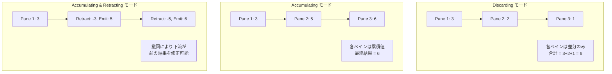

## 5. ウォーターマーク（Watermark）

### 5.1 ウォーターマークとは何か

ストリーム処理における最大の課題の1つは、「あるイベント時間のウィンドウに属するすべてのデータが到着したか」を判断することである。これは本質的に不可能な問題である。あるイベントが遅延して到着する可能性は常にあり、「このウィンドウにはもうデータが来ない」と100%断言することはできない。

**ウォーターマーク（Watermark）** は、この問題に対する実用的な解法である。ウォーターマークとは、「この時刻以前のイベントはすべて到着済みである（と推定される）」ことを示す、イベント時間領域における進行の指標（monotonically increasing timestamp）である。

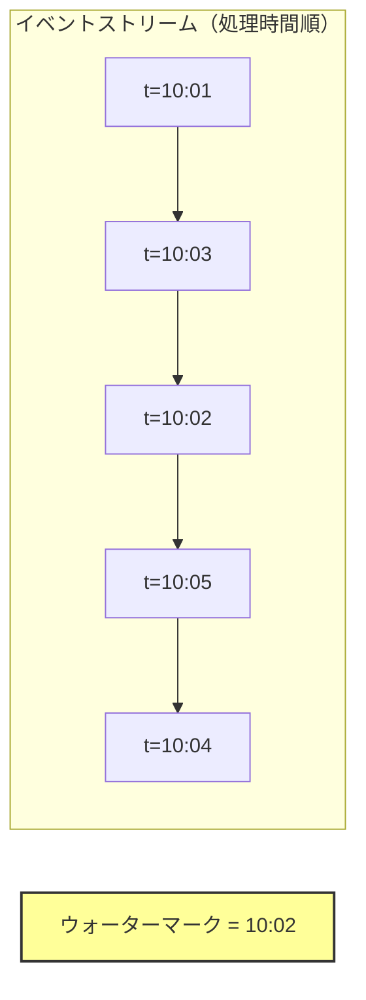

上の例では、ウォーターマークが 10:02 であるということは、「イベント時間 10:02 以前のすべてのイベントは処理エンジンに到着済みであると推定される」ことを意味する。これにより、10:00〜10:02 のウィンドウの結果を確定して出力できる。

### 5.2 ウォーターマークの生成戦略

ウォーターマークの生成方法は、データソースの特性に応じて選択する。

#### パーフェクトウォーターマーク（Perfect Watermark）

データソースがすべてのイベントの順序を保証できる場合、完全なウォーターマークを生成できる。たとえば、単一パーティションのログファイルを読み込むバッチ処理的なストリーム処理では、ファイル内の最大タイムスタンプがウォーターマークとなる。

パーフェクトウォーターマークの下では、遅延データは発生しない。しかし現実のシステムでは、分散データソース、ネットワーク遅延、デバイスのオフライン期間などにより、パーフェクトウォーターマークを生成できるケースは限られる。

#### ヒューリスティックウォーターマーク（Heuristic Watermark）

現実のストリーム処理では、ヒューリスティック（経験的手法）に基づくウォーターマーク生成が一般的である。代表的な方法を以下に示す。

**最大タイムスタンプ - 固定遅延**: 観測された最大イベント時間から固定の遅延を差し引いた値をウォーターマークとする。最も単純で広く使われる方法。

```
watermark = max(observed_event_time) - allowed_lateness
```

たとえば、最大観測イベント時間が 10:05 で、許容遅延が 30 秒の場合、ウォーターマークは 10:04:30 となる。

**パーティション別の最小値**: Kafka のように複数パーティションからデータを読み込む場合、各パーティションのウォーターマークの最小値を全体のウォーターマークとする。

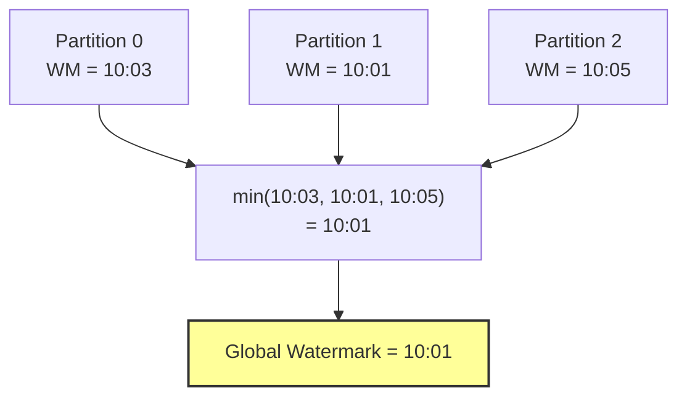

**統計的手法**: 過去の遅延パターンを分析し、たとえば「99パーセンタイルの遅延以内にすべてのデータが到着する」という統計的推定に基づくウォーターマーク。

### 5.3 ウォーターマークと遅延データ

ヒューリスティックウォーターマークを使用する場合、ウォーターマークの通過後にデータが到着する可能性がある。このようなデータを**遅延データ（Late Data）** と呼ぶ。

遅延データの処理方針は、アプリケーションの要件に応じて選択する。

1. **破棄（Drop）**: ウォーターマーク通過後のデータは無視する。最も単純だが、データの欠損を招く。
2. **許容遅延（Allowed Lateness）**: ウィンドウの状態をウォーターマーク通過後も一定期間保持し、遅延データを受け入れる。遅延データが到着するとウィンドウの結果を更新して再出力する。
3. **サイドアウトプット（Side Output）**: 遅延データを別のストリームに送り、後から個別に処理する。

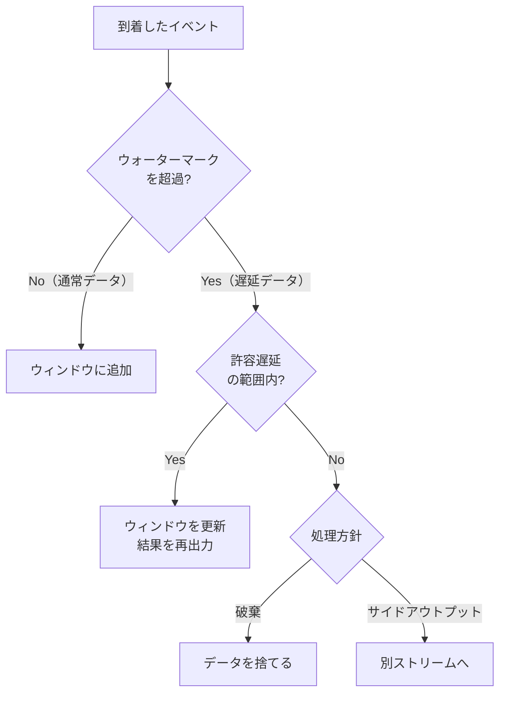

### 5.4 ウォーターマークの伝播

複数のオペレーターで構成される処理パイプラインでは、ウォーターマークは上流から下流へ伝播する。各オペレーターは、入力のウォーターマークに基づいて自身のウォーターマークを計算し、下流へ伝える。

たとえば、2つの入力を持つ Join オペレーターでは、両方の入力のウォーターマークのうち**小さい方**が自身のウォーターマークとなる。これは、遅い方の入力にまだ到着していないイベントがある可能性を考慮するためである。

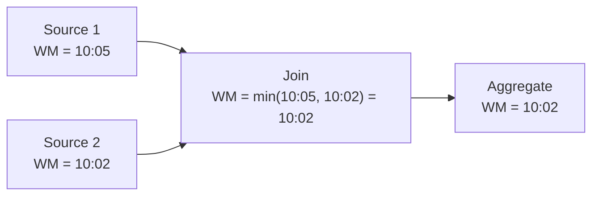

::: warning ウォーターマークのスタック
一方の入力のウォーターマークが極端に遅れると、Join オペレーターのウォーターマーク全体が停滞する。これは下流のすべてのウィンドウの結果出力を遅延させる。入力ソースの健全性監視と、片方のソースが停止した場合のタイムアウト戦略が重要である。
:::

### 5.5 完全性と低レイテンシのトレードオフ

ウォーターマークの設計には、本質的なトレードオフが存在する。

- **ウォーターマークを積極的に進める（遅延を小さくする）**: 結果の出力レイテンシは低くなるが、遅延データが増える（不完全な結果のリスク）
- **ウォーターマークを保守的に遅らせる（遅延を大きくする）**: 遅延データは減り結果の完全性は高まるが、出力レイテンシが増大する

この「完全性 vs レイテンシ」のトレードオフは、ストリーム処理の本質的な課題であり、アプリケーションの要件に応じた判断が求められる。金融取引の異常検知のように即座に結果が必要な場合はレイテンシを優先し、日次レポートのような場合は完全性を優先する。

## 6. 時間の意味論：Streaming Systemsにおける4つの問い

Google のストリーム処理研究（"The Dataflow Model" 論文、2015年）は、ストリーム処理を設計する際の思考フレームワークとして、以下の4つの問いを提唱した。これは現在のストリーム処理エンジンの設計に広く影響を与えている。

### 6.1 What：何を計算するか

計算の種類を定義する。SUM、COUNT、AVG などの集計、JOIN、パターンマッチングなどが該当する。これはバッチ処理と同じ概念であり、ストリーム処理固有ではない。

### 6.2 Where：イベント時間のどこで計算するか

ウィンドウの定義に相当する。「5分間のタンブリングウィンドウ」「30分のセッションウィンドウ」など、イベント時間空間上のどの範囲を集計するかを決める。

### 6.3 When：いつ結果を出力するか

トリガーとウォーターマークの組み合わせに相当する。ウォーターマーク通過時に出力するか、処理時間で定期的に出力するか、両方を組み合わせるかなど。

### 6.4 How：結果をどのように修正するか

アキュムレーションモードに相当する。遅延データや追加データが到着した際に、前の結果をどう更新するか（Discarding / Accumulating / Accumulating & Retracting）。

この4つの問いを意識して設計することで、ストリーム処理の要件を漏れなく定義できる。

## 7. Exactly-Once セマンティクス

### 7.1 メッセージ配信のセマンティクス

分散システムにおけるメッセージ処理には、3つのセマンティクス（意味論的保証）が定義されている。

**At-Most-Once（最大1回）**: メッセージは最大1回処理される。処理に失敗してもリトライしないため、メッセージが失われる可能性がある。最も実装が簡単だが、データの欠損を許容する必要がある。

**At-Least-Once（最低1回）**: メッセージは少なくとも1回処理される。失敗時にはリトライするため、メッセージが失われることはないが、重複処理が発生する可能性がある。

**Exactly-Once（正確に1回）**: メッセージは正確に1回処理される。データの欠損も重複もない。最も望ましいが、実現が最も困難。

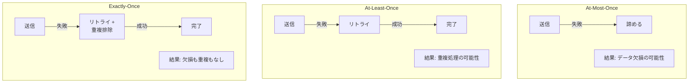

### 7.2 Exactly-Onceは本当に実現可能か

「Exactly-Once は理論的に不可能である」という議論がある。これは Two Generals Problem（2将軍問題）に基づく正しい指摘である。ネットワークが信頼できない環境では、送信者と受信者が「メッセージが正確に1回処理された」ことを双方で確認する一般的な方法は存在しない。

しかし、ストリーム処理の文脈における Exactly-Once セマンティクスは、より限定的な意味で使われる。厳密には **Effectively Exactly-Once**（実効的に正確に1回）と呼ぶべきもので、「処理の**効果**（外部から観察可能な結果）が正確に1回分だけ反映される」ことを保証する。内部的にはメッセージの再処理が行われる可能性があるが、最終的な結果は正確に1回処理した場合と同一になる。

### 7.3 Exactly-Onceの実現手法

Exactly-Once セマンティクスを実現するための主要なアプローチを解説する。

#### 7.3.1 冪等（べきとう）処理（Idempotent Processing）

同じ処理を何回実行しても結果が変わらない性質を**冪等性（Idempotency）** と呼ぶ。処理を冪等にすることで、At-Least-Once の配信保証と組み合わせて Exactly-Once の効果を実現できる。

```
// Idempotent: SET user_123.balance = 1000
// Not idempotent: UPDATE user_123.balance += 100
```

冪等処理の典型的な実装パターンは以下の通りである。

- **冪等キー**: 各イベントにユニークなIDを付与し、処理済みIDを記録する。同じIDのイベントが再度到着した場合はスキップする。
- **UPSERT（INSERT ON CONFLICT UPDATE）**: データベースへの書き込みを冪等にする。
- **条件付き更新**: バージョン番号やタイムスタンプを用いて、古いデータによる上書きを防止する。

::: details 冪等キーによる重複排除の実装例
```python
class IdempotentProcessor:
    def __init__(self, state_store):
        self.state_store = state_store

    def process(self, event):
        event_id = event.id
        # Check if this event has already been processed
        if self.state_store.contains(event_id):
            return  # Skip duplicate
        # Process the event
        result = self.compute(event)
        # Atomically store the result and mark the event as processed
        self.state_store.put(event_id, result)
```
:::

#### 7.3.2 チェックポイントとバリア（Checkpoint and Barrier）

Apache Flink が採用する手法で、**分散スナップショット** に基づく Exactly-Once 保証を実現する。この手法は Chandy-Lamport アルゴリズムに着想を得ている。

**基本的な仕組み**:

1. **バリア注入**: JobManager がデータソースにバリア（特殊なマーカー）を定期的に注入する
2. **バリアの伝播**: バリアはデータストリームと共にオペレーター間を流れる
3. **バリアアラインメント**: 複数の入力を持つオペレーターは、すべての入力からバリアを受け取るまで待機する
4. **スナップショット取得**: すべての入力からバリアを受け取ったオペレーターは、自身の状態のスナップショットを永続ストレージに保存する
5. **確認応答**: すべてのオペレーターのスナップショットが完了すると、チェックポイントが確定する

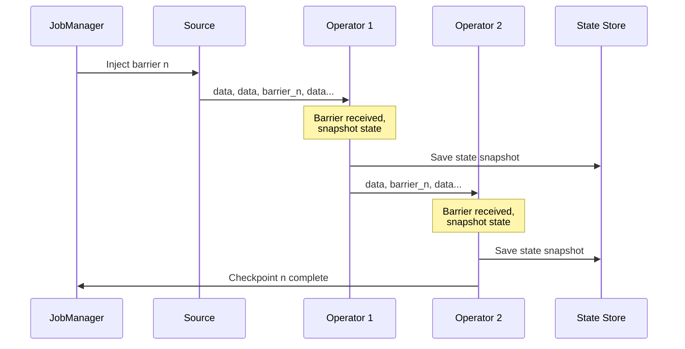

**障害からの復旧**:

障害が発生した場合、最後に完了したチェックポイントから処理を再開する。

1. すべてのオペレーターが最後のチェックポイントの状態を復元する
2. データソースをチェックポイント時のオフセットに巻き戻す
3. チェックポイント以降のデータを再処理する

この仕組みにより、チェックポイントからバリアまでの間のデータは再処理されるが、状態もチェックポイント時点に戻されるため、結果は正確に1回処理した場合と同一になる。

::: warning バリアアラインメントのコスト
バリアアラインメント中、先にバリアが到着した入力チャネルのデータはバッファリングされる。これは処理のレイテンシ増大とメモリ使用量の増加を招く。Flink 1.11 以降では、Unaligned Checkpoint が導入され、バッファリングのオーバーヘッドを削減できるようになった。
:::

#### 7.3.3 トランザクショナルシンク（Transactional Sink）

チェックポイント方式でストリーム処理エンジン内部の Exactly-Once を保証しても、外部システムへの書き込みが重複すれば全体としての Exactly-Once は達成できない。外部システムへの出力を含めた **End-to-End Exactly-Once** を実現するには、シンク（出力先）との協調が必要である。

**2フェーズコミット（Two-Phase Commit）方式**:

Flink の Kafka シンクは、Kafka のトランザクション機能と連携して2フェーズコミットを実現する。

1. **プレコミットフェーズ**: チェックポイントのバリアを受け取ったシンクオペレーターは、それまでのデータをKafkaトランザクション内に書き込む（まだコミットしない）
2. **コミットフェーズ**: チェックポイントが完了通知を受けたら、Kafkaトランザクションをコミットする
3. **アボートフェーズ**: チェックポイントが失敗した場合、Kafkaトランザクションをアボートする

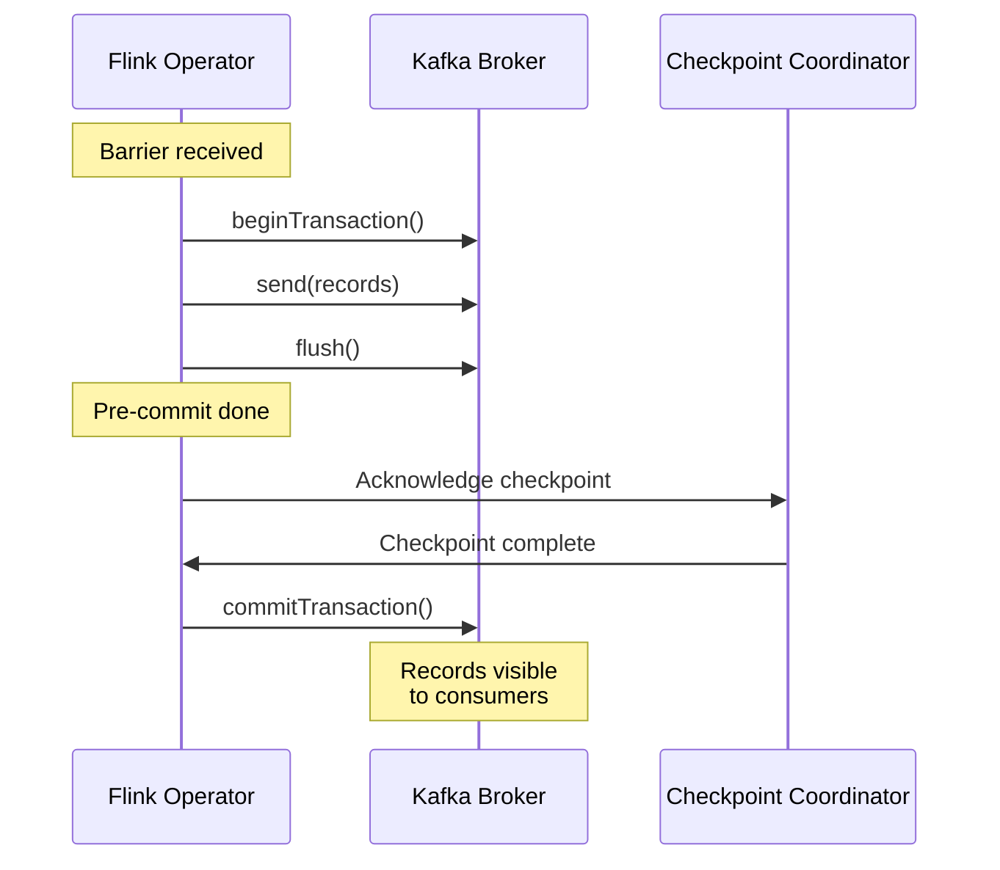

**Write-Ahead Log 方式**:

データベースなどのトランザクションをサポートしない外部システムに対しては、結果をまず状態バックエンドに WAL として書き込み、チェックポイント完了後に外部システムにフラッシュする方法がある。ただし、フラッシュの冪等性を確保しないと重複書き込みのリスクが残る。

### 7.4 状態バックエンドとチェックポイントストレージ

Exactly-Once を支えるチェックポイントの性能は、状態バックエンドの選択に大きく依存する。

**インメモリ状態バックエンド**: 状態をJVMのヒープメモリに保持する。アクセスが高速だが、状態サイズがメモリに制限される。チェックポイント時にはヒープ全体をシリアライズする必要があるため、大きな状態ではチェックポイントが遅くなる。

**RocksDB 状態バックエンド**: 状態をローカルディスクのRocksDB（LSM-Treeベースの組み込みKVストア）に保持する。メモリサイズを超える大きな状態を扱えるが、ディスクI/Oのオーバーヘッドが生じる。チェックポイント時にはインクリメンタルスナップショット（前回のチェックポイントからの差分のみ）を取得できるため、大規模な状態でもチェックポイントが効率的になる。

**チェックポイントストレージ**: チェックポイントのスナップショットは、分散ファイルシステム（HDFS）やオブジェクトストレージ（S3）などの耐障害性のあるストレージに保存される。

## 8. ストリーム処理の主要フレームワーク

### 8.1 Apache Flink

Apache Flink は、現在最も機能が充実したオープンソースのストリーム処理フレームワークである。

**設計思想**: 「ストリーム処理がファーストクラス」のアプローチを採用しており、バッチ処理はストリーム処理の特殊なケース（有限データのストリーム処理）として扱う。

**主要な特徴**:
- イベント時間処理の充実したサポート（ウォーターマーク、ウィンドウ、トリガー）
- 分散スナップショットに基づく Exactly-Once 保証
- RocksDB を用いた大規模状態の管理
- インクリメンタルチェックポイント
- SQL / Table API によるストリーム処理の宣言的記述
- CEP（Complex Event Processing）ライブラリ

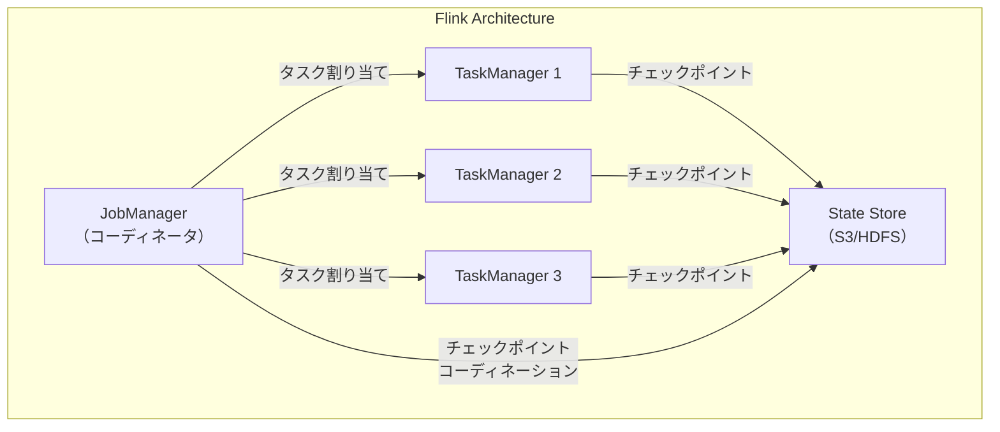

### 8.2 Apache Kafka Streams

Kafka Streams は、Apache Kafka に組み込まれたストリーム処理ライブラリである。

**設計思想**: 独立したクラスターを必要とせず、通常のJavaアプリケーションとしてストリーム処理を実行できる。「ライブラリとしてのストリーム処理」というアプローチにより、デプロイと運用の複雑さを大幅に削減する。

**主要な特徴**:
- 独立したクラスターが不要（Kafkaクラスターのみ依存）
- イベント時間処理のサポート
- Exactly-Once セマンティクス（Kafka トランザクションベース）
- Interactive Queries による状態へのリアルタイムクエリ
- KStream（レコードストリーム）と KTable（チェンジログストリーム）の二重モデル

::: tip KStream と KTable
KStream はイベントの連続的な流れ（INSERT のストリーム）を表現し、KTable はキーごとの最新の値（UPDATE のストリーム）を表現する。この二重性は、ストリームとテーブルの双対性（Stream-Table Duality）と呼ばれ、Kafka Streams のコア概念の1つである。
:::

### 8.3 Apache Spark Structured Streaming

Spark Structured Streaming は、Apache Spark のストリーム処理 API である。

**設計思想**: マイクロバッチ処理をベースとしており、ストリームを短い時間間隔のバッチの連続として処理する。Spark のバッチ処理 API と統一されたプログラミングモデルを提供する。

**主要な特徴**:
- マイクロバッチモデル（デフォルト）と Continuous Processing モード
- DataFrame / Dataset API によるストリーム処理の記述
- ウォーターマークベースの遅延データ処理
- Exactly-Once セマンティクス（チェックポイント + WAL）
- Spark エコシステムとの統合（MLlib, GraphX など）

### 8.4 フレームワークの比較

| 特性 | Flink | Kafka Streams | Spark Structured Streaming |
|------|-------|--------------|---------------------------|
| 処理モデル | 真のストリーム処理 | 真のストリーム処理 | マイクロバッチ（デフォルト） |
| デプロイ | 専用クラスター | ライブラリ（JVM内） | Sparkクラスター |
| レイテンシ | ミリ秒〜秒 | ミリ秒〜秒 | 秒〜分（マイクロバッチ） |
| Exactly-Once | 分散スナップショット | Kafkaトランザクション | チェックポイント + WAL |
| 状態管理 | RocksDB / Heap | RocksDB / In-Memory | HDFS + Delta Lake |
| ウィンドウ | 豊富 | 豊富 | 基本的 |
| 適用場面 | 大規模・低レイテンシ | Kafkaエコシステム | バッチ + ストリーム統合 |

## 9. ストリーム処理の設計パターン

### 9.1 イベント時間処理パターン

イベント時間に基づく集計は、ストリーム処理の最も一般的なパターンである。

```python
# Apache Flink (PyFlink) example
from pyflink.datastream import StreamExecutionEnvironment
from pyflink.datastream.window import TumblingEventTimeWindows
from pyflink.common.time import Time

env = StreamExecutionEnvironment.get_execution_environment()

# Read from Kafka source with event time
events = env.from_source(kafka_source, watermark_strategy, "Kafka Source")

# Windowed aggregation by event time
result = (
    events
    .key_by(lambda e: e.user_id)
    .window(TumblingEventTimeWindows.of(Time.minutes(5)))
    .aggregate(CountAggregator())
)

result.sink_to(kafka_sink)
env.execute("Event Time Aggregation")
```

### 9.2 ストリーム間 Join パターン

2つのストリームをリアルタイムに結合するパターン。たとえば、クリックイベントストリームと表示イベントストリームを結合して、CTR（クリック率）を計算する。

**インターバル Join**: イベント時間が一定範囲内のイベント同士を結合する。

```python
# Join clicks with impressions within a 10-minute window
clicks.key_by(lambda c: c.ad_id) \
    .interval_join(impressions.key_by(lambda i: i.ad_id)) \
    .between(Time.minutes(-10), Time.minutes(0)) \
    .process(ClickThroughRateCalculator())
```

**ウィンドウ Join**: 同じウィンドウ内のイベント同士を結合する。

**テンポラル Join（時間変化テーブル結合）**: ストリームとゆっくり変化するテーブル（Slowly Changing Dimension）を結合する。為替レートテーブルのような、時刻によって値が変わるデータとの結合に使用する。

### 9.3 CEP（Complex Event Processing）パターン

単一のイベントではなく、特定のパターンに合致するイベントの並びを検出する。不正取引の検出、異常検知、ビジネスルールの適用などに使われる。

たとえば「5分以内に、同一ユーザーが3回以上ログインに失敗した場合にアラートを発報する」というパターンを定義できる。

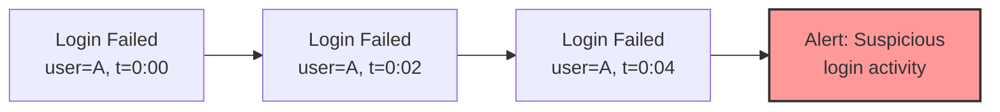

### 9.4 動的テーブルとマテリアライズドビュー

ストリーム処理は、本質的にはインクリメンタルに更新されるマテリアライズドビューの維持と見なすことができる。データベースのマテリアライズドビューがクエリ結果を事前に計算して保持するのと同様に、ストリーム処理は入力データの変更に応じて結果を継続的に更新する。

この視点は近年ますます重要になっており、Materialize や RisingWave のように「ストリーミングデータベース」を謳う製品も登場している。これらは SQL クエリをストリーム処理パイプラインに変換し、クエリ結果をリアルタイムに維持する。

## 10. 実運用における課題と対策

### 10.1 バックプレッシャー（Backpressure）

ストリーム処理において、データの到着速度が処理速度を上回る状況は避けられない。このとき、処理が追いつかないオペレーターの上流にデータが滞留し、最終的にはシステム全体に影響を及ぼす。この現象を**バックプレッシャー**と呼ぶ。

**対策**:
- **動的スケーリング**: 処理能力を自動的に増減させる（Flink のリアクティブモード）
- **レートリミッティング**: ソースの読み取り速度を制限する
- **バッファリングとスピルオーバー**: メモリからディスクへのスピルにより一時的なバーストを吸収する
- **サンプリング**: 全データの処理が不要な場合、サンプリングにより負荷を削減する

### 10.2 状態の肥大化

ストリーム処理では、ウィンドウの状態、キーごとの集計値、Join の中間結果など、さまざまな状態を維持する必要がある。この状態が際限なく増大すると、パフォーマンスの低下やメモリ不足を招く。

**対策**:
- **状態の TTL（Time-To-Live）**: 一定期間アクセスされなかった状態を自動的に削除する
- **ウィンドウの有効期限**: ウィンドウの結果出力後、許容遅延期間が過ぎた状態をクリーンアップする
- **インクリメンタルチェックポイント**: RocksDB のインクリメンタルスナップショットにより、チェックポイントのオーバーヘッドを削減する
- **状態のコンパクション**: 不要になった状態エントリを定期的に削除する

### 10.3 スキーマ進化

長期間稼働するストリーム処理パイプラインでは、入力データのスキーマが変更される可能性が高い。フィールドの追加、型の変更、フィールドの削除などに対応する必要がある。

**対策**:
- **スキーマレジストリ**: Apache Avro と Confluent Schema Registry の組み合わせにより、互換性を保ったスキーマ進化を管理する
- **後方互換性の維持**: 新しいフィールドにはデフォルト値を設定し、フィールドの削除はオプショナルへの変更を経てから行う
- **セーブポイントからの再起動**: スキーマ変更を伴うアプリケーションの更新は、セーブポイント（明示的なチェックポイント）を取得してから行う

### 10.4 リプレイとリプロセッシング

ストリーム処理の重要な運用要件の1つが、過去のデータを再処理できることである。バグの修正後にデータを再計算したり、新しいロジックを過去のデータに適用したりする必要がある。

**要件**:
- データソース（Kafka など）が十分な期間のデータを保持していること
- 処理アプリケーションのセーブポイントを管理できること
- 新旧のパイプラインを並行実行し、結果を比較検証できること

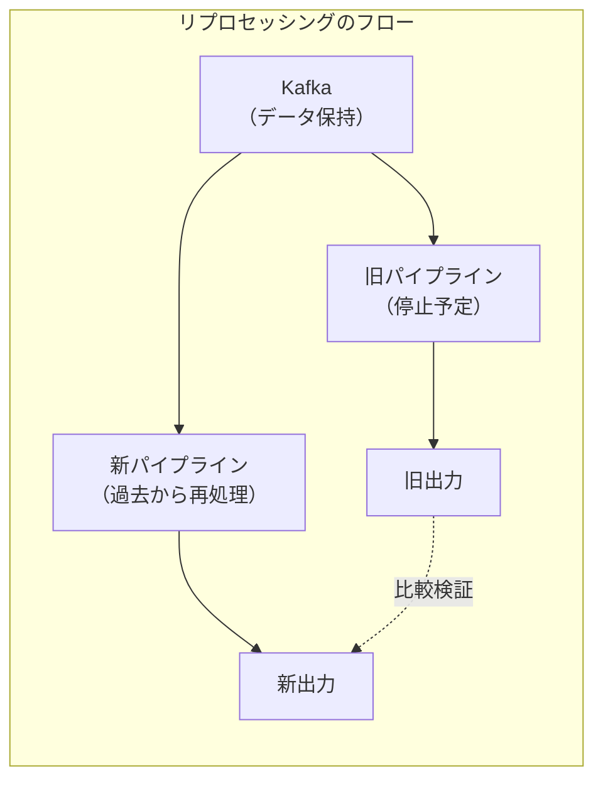

## 11. Kappa アーキテクチャと Lambda アーキテクチャ

### 11.1 Lambda アーキテクチャ

Lambda アーキテクチャは、Nathan Marz が提唱したデータ処理アーキテクチャであり、バッチ処理層（Batch Layer）、速度層（Speed Layer）、サービング層（Serving Layer）の3層で構成される。

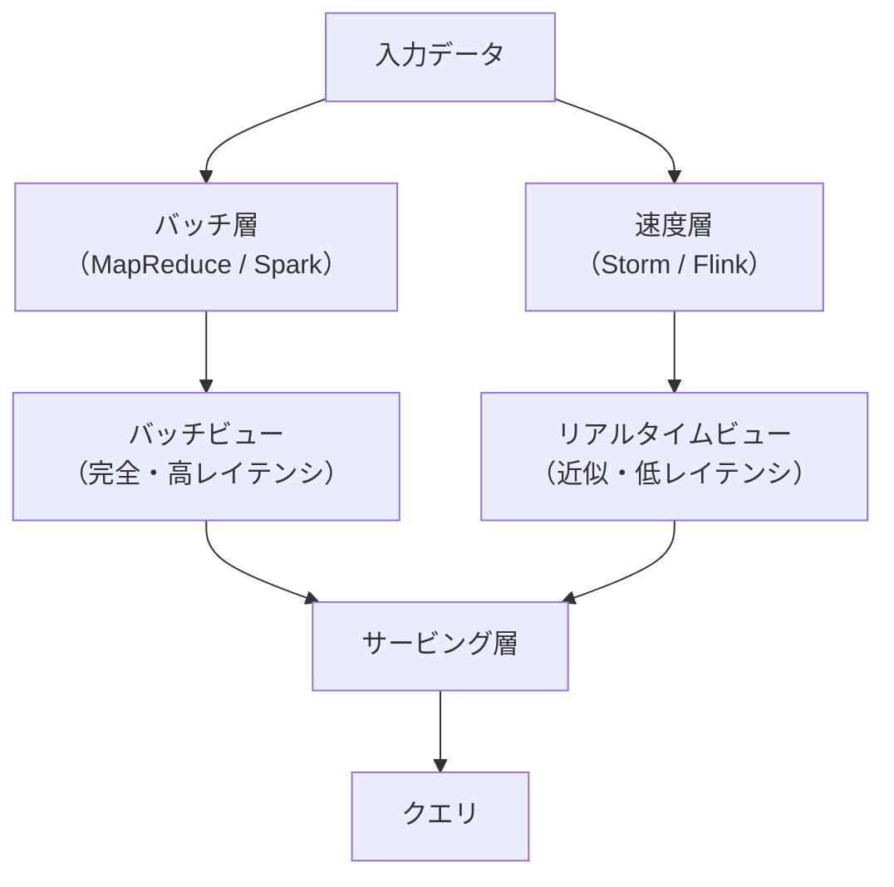

**バッチ層**: すべてのデータを定期的に再計算し、完全で正確な結果を生成する。レイテンシは高い（数時間）が、結果の正確性が保証される。

**速度層**: 直近のデータをリアルタイムに処理し、バッチ層の結果を補完する。低レイテンシだが、結果は近似的である。

**サービング層**: バッチビューとリアルタイムビューを統合して、クエリに対する最新の結果を提供する。

**Lambda アーキテクチャの課題**: 同じビジネスロジックをバッチ処理と速度処理の2つのシステムで実装・維持する必要があり、開発と運用のコストが2倍になる。コードの重複は、バグの温床となる。

### 11.2 Kappa アーキテクチャ

Kappa アーキテクチャは、Jay Kreps（Kafka の共同開発者）が提唱した、Lambda アーキテクチャの簡素化版である。バッチ層を廃止し、すべてのデータ処理をストリーム処理で統一する。

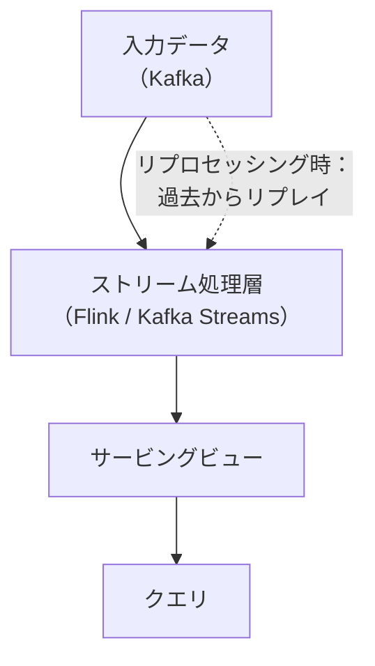

**Kappa アーキテクチャの前提**:
- ストリーム処理エンジンが Exactly-Once を保証できること
- データソース（Kafka）が十分な期間のデータを保持し、リプレイ可能であること
- ストリーム処理がバッチ処理と同等の正確性を達成できること

**利点**: ロジックが一元化されるため、開発・運用コストが大幅に削減される。

**課題**: 過去の大量データの再処理がストリーム処理エンジンで効率的に行えるかどうかが重要な判断基準となる。Apache Flink のような現代のストリーム処理エンジンは、バッチ処理モードも備えており、この課題に対応しつつある。

## 12. ストリーミング SQL

### 12.1 SQL によるストリーム処理の記述

SQL は半世紀以上の歴史を持つ宣言的クエリ言語であり、データ処理の標準として広く普及している。ストリーム処理においても SQL を活用したいという要望は自然なものであり、多くのフレームワークがストリーミング SQL のサポートを提供している。

```sql
-- 5-minute tumbling window aggregation
SELECT
    user_id,
    TUMBLE_START(event_time, INTERVAL '5' MINUTE) AS window_start,
    COUNT(*) AS click_count
FROM click_events
GROUP BY
    user_id,
    TUMBLE(event_time, INTERVAL '5' MINUTE);
```

```sql
-- Session window aggregation (30-minute gap)
SELECT
    user_id,
    SESSION_START(event_time, INTERVAL '30' MINUTE) AS session_start,
    SESSION_END(event_time, INTERVAL '30' MINUTE) AS session_end,
    COUNT(*) AS page_views
FROM page_view_events
GROUP BY
    user_id,
    SESSION(event_time, INTERVAL '30' MINUTE);
```

### 12.2 ストリーミングSQLの課題

ストリーミング SQL には、従来のバッチ SQL にはない独特の課題がある。

**無限の結果セット**: `SELECT * FROM events` の結果は無限であり、従来のSQLの「クエリを実行して結果を返す」モデルとは根本的に異なる。ストリーミング SQL は、結果を継続的に出力し続ける「持続的クエリ（Continuous Query）」として動作する。

**結果の更新**: ウィンドウの集計結果が遅延データにより変更される場合、過去に出力した結果を撤回・更新する必要がある。これはチェンジログ（Changelog）として表現される。

**JOIN のセマンティクス**: 無限のストリーム同士の JOIN は、ウィンドウやインターバルの制約なしには状態が無限に増大する。時間的な結合条件の明示が必要となる。

## 13. まとめ：ストリーム処理の本質

ストリーム処理は、無限のデータに対して、正確で低レイテンシな結果を継続的に提供する技術である。本記事で解説した3つの核心概念を振り返る。

**ウィンドウ**: 無限のデータを有限の区間に分割し、集計を可能にする。タンブリング、スライディング、セッションの3種類が基本であり、トリガーとアキュムレーションモードの組み合わせにより、結果の出力タイミングと更新方法を制御する。

**ウォーターマーク**: イベント時間ベースの処理において、「どの時点までのデータが到着済みか」を推定する仕組み。完全性と低レイテンシのトレードオフを制御し、遅延データの扱いを決定する基準となる。

**Exactly-Once**: 障害発生時にも、処理の効果が正確に1回分だけ反映されることを保証する。冪等処理、チェックポイント/バリア、トランザクショナルシンクの3つのアプローチが主要であり、End-to-End の保証にはソースからシンクまでの全体的な設計が必要である。

これらの概念は相互に密接に関連している。ウォーターマークはウィンドウの結果出力タイミングを決定し、チェックポイントはウィンドウの状態を含むすべての処理状態の一貫性を保証する。ストリーム処理の設計においては、「何を計算するか（What）」「どこで計算するか（Where）」「いつ結果を出力するか（When）」「どう結果を修正するか（How）」の4つの問いに答えることが、正確で実用的なパイプラインを構築するための指針となる。

ストリーム処理は、かつてはニッチな技術であったが、Apache Flink、Kafka Streams、Spark Structured Streaming などの成熟したフレームワークの登場により、データ基盤の中核を担う技術となった。リアルタイムデータ処理の需要が増大し続ける中、ストリーム処理の基礎概念を深く理解することは、データエンジニアリングに携わるすべてのエンジニアにとって不可欠な素養である。

## 参考文献

- Akidau, T., Bradshaw, R., Chambers, C., et al. (2015). "The Dataflow Model: A Practical Approach to Balancing Correctness, Latency, and Cost in Massive-Scale, Unbounded, Out-of-Order Data Processing." Proceedings of the VLDB Endowment, 8(12).
- Akidau, T., Chernyak, S., & Lax, R. (2018). "Streaming Systems: The What, Where, When, and How of Large-Scale Data Processing." O'Reilly Media.
- Carbone, P., Katsifodimos, A., Ewen, S., et al. (2015). "Apache Flink: Stream and Batch Processing in a Single Engine." Bulletin of the IEEE Computer Society Technical Committee on Data Engineering, 36(4).
- Kreps, J. (2014). "Questioning the Lambda Architecture." O'Reilly Radar.
- Chandy, K. M., & Lamport, L. (1985). "Distributed Snapshots: Determining Global States of Distributed Systems." ACM Transactions on Computer Systems, 3(1).
