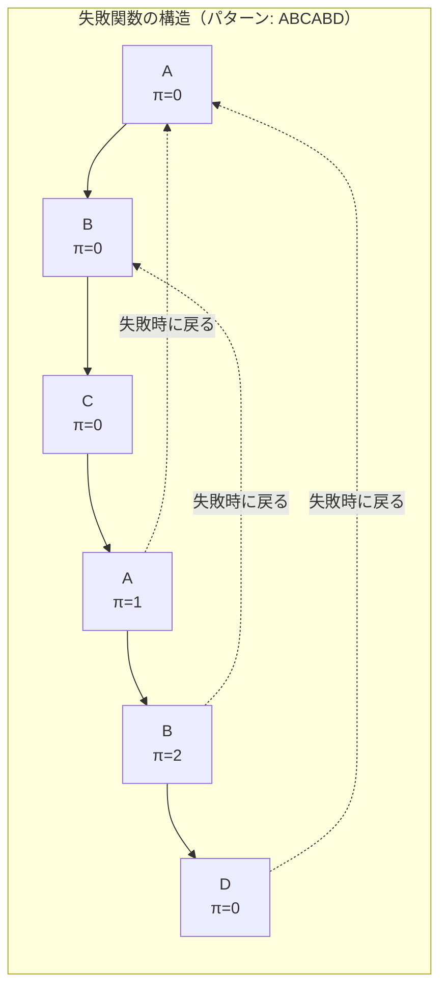
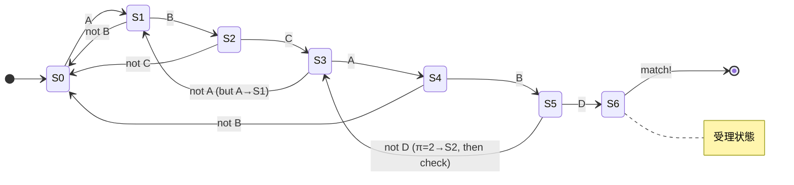
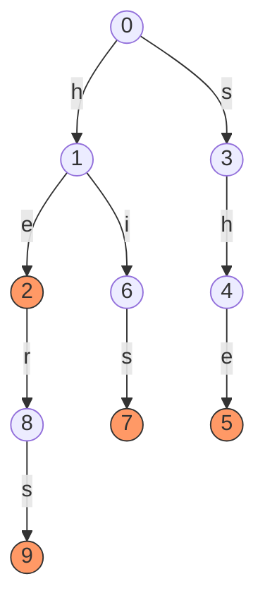
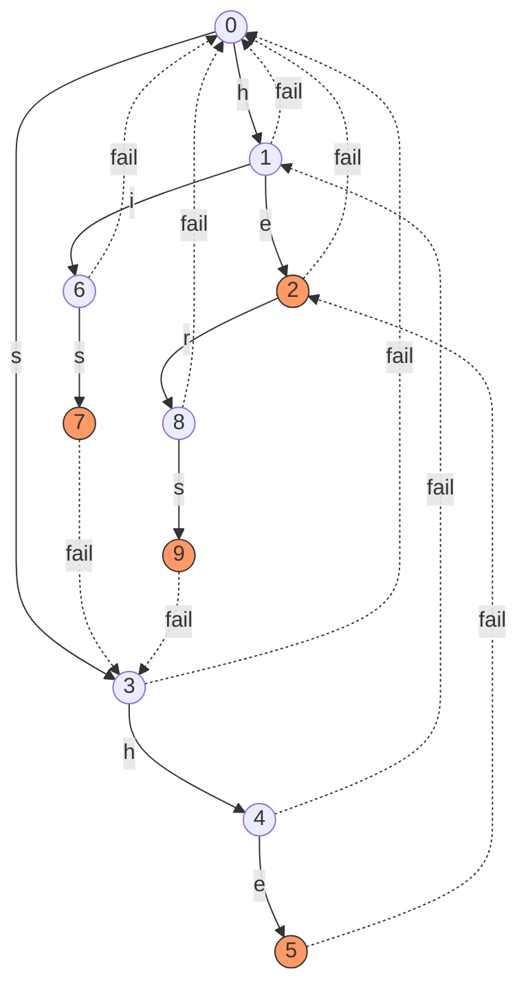
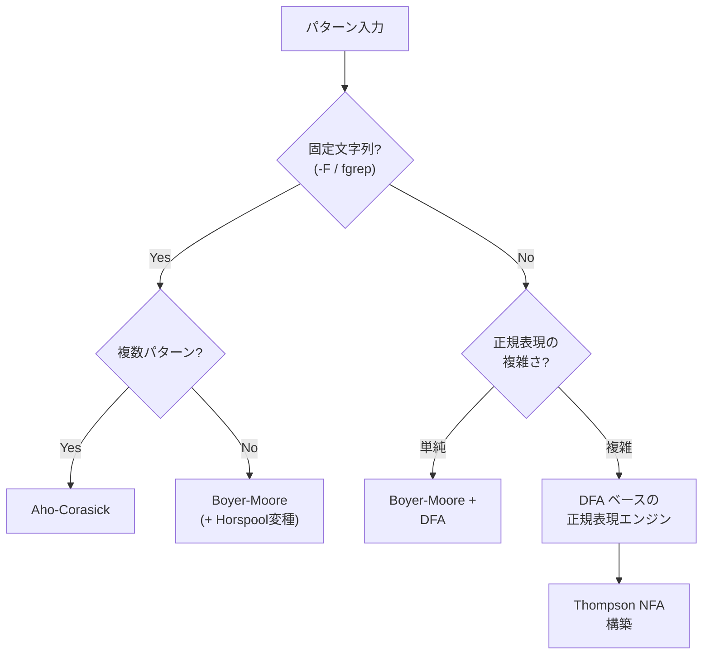
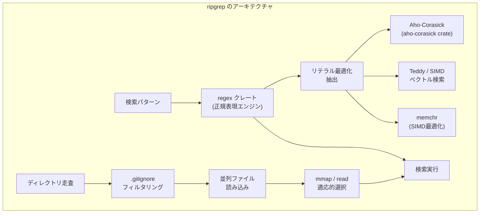
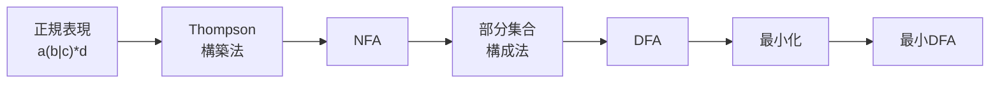
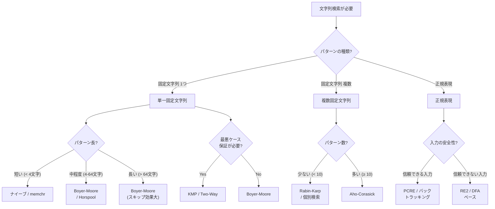

# 文字列マッチング — KMP, Rabin-Karp, Boyer-Moore, Aho-Corasick

## 1. 文字列マッチングとは何か

文字列マッチング（string matching / string searching）とは、テキスト $T$ の中からパターン $P$ が出現する位置を見つける問題である。テキストの長さを $n$、パターンの長さを $m$ とすると、問題は次のように定式化される。

> テキスト $T[0..n-1]$ とパターン $P[0..m-1]$ が与えられたとき、$T[i..i+m-1] = P[0..m-1]$ を満たすすべてのインデックス $i$ を求めよ。

この問題は計算機科学において最も基本的かつ実用的な問題の一つである。テキストエディタの検索機能、`grep` コマンド、DNA 配列の解析、ネットワーク侵入検知システム（IDS）のシグネチャマッチング、コンパイラの字句解析——あらゆる場面で文字列マッチングは使われている。

一見すると単純な問題に見えるが、効率的に解くためには精巧なアルゴリズム設計が必要であり、1970年代から現在に至るまで多くの研究者がこの問題に取り組んできた。本記事では、ナイーブな手法から始めて、KMP、Rabin-Karp、Boyer-Moore、そして複数パターンに対応する Aho-Corasick まで、主要なアルゴリズムの原理と実装を解説する。さらに、`grep` や `ripgrep` といった実用ツールがこれらのアルゴリズムをどのように組み合わせているか、正規表現エンジンとの関係、そして実用上の選択指針についても述べる。

## 2. ナイーブな文字列マッチング

### 2.1 アルゴリズムの概要

最も素朴なアプローチは、テキストの各位置 $i$ について、パターン全体と一致するかどうかを1文字ずつ比較する方法である。

```
ナイーブ文字列マッチングの動作:

テキスト:  A B C A B C A B D
パターン:  A B C A B D

位置 0: A B C A B C  ← 6文字目で不一致（C ≠ D）
位置 1:   B          ← 1文字目で不一致（B ≠ A）
位置 2:     C        ← 1文字目で不一致（C ≠ A）
位置 3:       A B C A B D  ← 全文字一致！マッチ発見
```

```python
def naive_search(text: str, pattern: str) -> list[int]:
    """Find all occurrences of pattern in text using brute force."""
    n, m = len(text), len(pattern)
    result = []
    for i in range(n - m + 1):
        j = 0
        while j < m and text[i + j] == pattern[j]:
            j += 1
        if j == m:
            result.append(i)
    return result
```

### 2.2 計算量の分析

最悪の場合、各位置 $i$ で $m$ 回の比較が行われるため、時間計算量は $O(nm)$ となる。最悪ケースの典型例は、テキストが `AAAAAA...A`（$n$ 文字の `A`）、パターンが `AAAA...AB`（$m-1$ 文字の `A` に続く `B`）のような場合である。各位置で $m-1$ 回の比較が成功した後、最後の1文字で失敗する。

一方、自然言語のテキストでは、アルファベットのサイズが十分に大きいため、不一致がすぐに検出されることが多い。平均的なケースでは $O(n)$ に近い性能を示す。しかし、最悪ケースの保証がないことは、セキュリティ上の懸念にもなりうる。悪意のある入力によってサービスが極端に遅くなる「アルゴリズム複雑度攻撃」（algorithmic complexity attack）の標的になりかねないのである。

### 2.3 ナイーブ手法の本質的な無駄

ナイーブ手法の非効率性の根源は、不一致が起きたときに得られる情報を捨ててしまうことにある。例えば、パターン `ABCABD` がテキストの位置 $i$ から5文字目まで一致し、6文字目で不一致となった場合、「テキストの $T[i..i+4]$ が `ABCAB` である」という情報はすでに得られている。にもかかわらず、ナイーブ手法は位置 $i+1$ から改めて比較を始め、`T[i+1]` を再び読み直す。

この「すでに比較した文字を再度比較する」という無駄を排除することが、以降で紹介する高速アルゴリズムの共通した着想である。

## 3. KMP（Knuth-Morris-Pratt）アルゴリズム

### 3.1 歴史的背景

KMP アルゴリズムは、1977年に Donald Knuth、James Morris、Vaughan Pratt の3名によって発表された。Knuth と Pratt は独立に同じアイデアに到達しており、Morris はテキストエディタの実装において同様の手法を独自に考案していた。3名の成果が統合され、古典的な論文 "Fast Pattern Matching in Strings" として発表された。

KMP の画期的な点は、テキストの各文字を**高々1回しか読まない**ことを保証し、$O(n + m)$ の時間計算量を達成したことである。これは理論的に最適であり（少なくともテキストの各文字は1回は読む必要がある）、最悪ケースでも性能が劣化しない。

### 3.2 核心的なアイデア

KMP の核心は、不一致が発生したとき、パターン自体の内部構造（繰り返しの情報）を利用して、テキスト上のポインタを後退させることなく、パターン上のポインタだけを適切な位置に戻すことにある。

具体例で考える。パターン `ABCABD` でテキストを走査し、`ABCAB` まで一致して6文字目（`D`）で不一致になったとする。

```
テキスト:  ... A B C A B X ...
パターン:      A B C A B D
                         ↑ 不一致

ナイーブ: テキストポインタを1つ右に移動し、最初から比較し直す
KMP:     「ABCAB」の接頭辞と接尾辞に共通する最長部分は「AB」
         → パターンを「AB」分だけスライドさせ、3文字目から比較を続ける

テキスト:  ... A B C A B X ...
パターン:          A B C A B D
                       ↑ ここから比較再開
```

パターン `ABCAB` の末尾2文字 `AB` は、パターンの先頭2文字 `AB` と同じである。したがって、パターンを右にずらしても、先頭2文字分はすでに一致していることが保証されている。テキストのポインタを戻す必要はなく、パターン上のポインタを位置2に戻すだけでよい。

### 3.3 失敗関数（Failure Function）

この「接頭辞と接尾辞の最長共通部分」を事前に計算したものが**失敗関数**（failure function）、あるいは**部分一致テーブル**（partial match table）と呼ばれるものである。KMP アルゴリズムの理解において最も重要な概念であり、丁寧に解説する。

#### 定義

パターン $P[0..m-1]$ に対して、失敗関数 $\pi[j]$ は次のように定義される。

$$\pi[j] = \max\{k \mid 0 \le k < j \text{ かつ } P[0..k-1] = P[j-k+1..j]\}$$

すなわち、$P[0..j]$ の**真の接頭辞**（proper prefix）であり、かつ**真の接尾辞**（proper suffix）でもあるような最長の文字列の長さである。$\pi[0] = 0$ と定義する（長さ1の文字列には真の接頭辞も真の接尾辞もない）。

#### 計算例

パターン `ABCABD` の失敗関数を計算する。

| $j$ | $P[0..j]$ | 真の接頭辞 = 真の接尾辞 | $\pi[j]$ |
|-----|-----------|------------------------|-----------|
| 0   | `A`       | なし                   | 0         |
| 1   | `AB`      | なし                   | 0         |
| 2   | `ABC`     | なし                   | 0         |
| 3   | `ABCA`    | `A`                    | 1         |
| 4   | `ABCAB`   | `AB`                   | 2         |
| 5   | `ABCABD`  | なし                   | 0         |

もう少し複雑な例として、パターン `AABAABAAA` の失敗関数を見てみよう。

| $j$ | $P[0..j]$   | 最長共通接頭辞=接尾辞 | $\pi[j]$ |
|-----|-------------|----------------------|-----------|
| 0   | `A`         | なし                 | 0         |
| 1   | `AA`        | `A`                  | 1         |
| 2   | `AAB`       | なし                 | 0         |
| 3   | `AABA`      | `A`                  | 1         |
| 4   | `AABAA`     | `AA`                 | 2         |
| 5   | `AABAAB`    | `AAB`                | 3         |
| 6   | `AABAABA`   | `AABA`               | 4         |
| 7   | `AABAABAА`  | `AA`                 | 2         |
| 8   | `AABAABAАA` | `AAB` ではなく `A`    | 1         |

#### 失敗関数の計算アルゴリズム

失敗関数自体も、KMP と同様の「すでに得られた情報を再利用する」アイデアで効率的に計算できる。$\pi[0..j-1]$ がすでに計算されているとき、$\pi[j]$ は $\pi[j-1]$ の値を手がかりに求められる。

```python
def compute_failure(pattern: str) -> list[int]:
    """Compute the KMP failure function for the given pattern."""
    m = len(pattern)
    pi = [0] * m
    k = 0  # length of the current longest prefix-suffix
    for j in range(1, m):
        while k > 0 and pattern[k] != pattern[j]:
            k = pi[k - 1]
        if pattern[k] == pattern[j]:
            k += 1
        pi[j] = k
    return pi
```

この計算は $O(m)$ で完了する。`while` ループの中で `k` は減少し、`if` 文の中でしか増加しないため、`k` の増加回数は全体で高々 $m-1$ 回であり、したがって減少回数（`while` の反復回数）も全体で $O(m)$ に収まる。



### 3.4 KMP の検索アルゴリズム

失敗関数を用いた検索本体は以下の通りである。

```python
def kmp_search(text: str, pattern: str) -> list[int]:
    """Find all occurrences of pattern in text using KMP algorithm."""
    n, m = len(text), len(pattern)
    if m == 0:
        return []
    pi = compute_failure(pattern)
    result = []
    j = 0  # number of characters matched so far
    for i in range(n):
        while j > 0 and pattern[j] != text[i]:
            j = pi[j - 1]
        if pattern[j] == text[i]:
            j += 1
        if j == m:
            result.append(i - m + 1)
            j = pi[j - 1]
    return result
```

#### 動作の追跡

テキスト `ABCABCABD`、パターン `ABCABD`（失敗関数: `[0,0,0,1,2,0]`）での動作を追跡する。

```
i=0: text[0]='A', pattern[0]='A' → 一致, j=1
i=1: text[1]='B', pattern[1]='B' → 一致, j=2
i=2: text[2]='C', pattern[2]='C' → 一致, j=3
i=3: text[3]='A', pattern[3]='A' → 一致, j=4
i=4: text[4]='B', pattern[4]='B' → 一致, j=5
i=5: text[5]='C', pattern[5]='D' → 不一致!
     j = π[4] = 2
     pattern[2]='C', text[5]='C' → 一致, j=3
i=6: text[6]='A', pattern[3]='A' → 一致, j=4
i=7: text[7]='B', pattern[4]='B' → 一致, j=5
i=8: text[8]='D', pattern[5]='D' → 一致, j=6
     j == m → マッチ発見! 位置 = 8 - 6 + 1 = 3
```

テキストのポインタ `i` は常に前進しており、一度も後退していないことに注目してほしい。

### 3.5 計算量

- **前処理（失敗関数の構築）**: $O(m)$
- **検索**: $O(n)$
- **全体**: $O(n + m)$
- **追加メモリ**: $O(m)$（失敗関数のテーブル）

KMP は**オンラインアルゴリズム**でもある。テキストをストリームとして1文字ずつ受け取りながら処理でき、テキスト全体をメモリに保持する必要がない。これは、ネットワークパケットの監視やログのリアルタイム分析など、ストリーミング処理が求められる場面で大きな利点となる。

### 3.6 失敗関数のオートマトン的解釈

KMP の失敗関数は、実はパターンに対する**決定性有限オートマトン**（DFA）の遷移関数と密接に関連している。パターン $P$ の各接頭辞を状態と見なすと、文字を読んで一致すれば次の状態に進み、不一致ならば失敗関数が示す状態に遷移する。



Knuth の原論文では、パターンから完全な DFA を構築する手法も示されている。DFA を構築すると前処理に $O(m|\Sigma|)$（$|\Sigma|$ はアルファベットサイズ）の時間とメモリが必要だが、検索時の各文字に対する処理が定数時間（テーブル参照1回）で済む。失敗関数を使う方法は前処理を $O(m)$ に抑える代わりに、検索時に失敗リンクを辿る追加の処理が発生する（ただし償却計算量は変わらない）。

## 4. Rabin-Karp アルゴリズム

### 4.1 着想：ハッシュによる比較の高速化

1987年に Michael Rabin と Richard Karp が発表した Rabin-Karp アルゴリズムは、文字列の比較にハッシュ値を用いるという全く異なるアプローチを取る。基本的なアイデアは次の通りである。

1. パターン $P$ のハッシュ値 $h(P)$ を計算する
2. テキストの各位置 $i$ について、$T[i..i+m-1]$ のハッシュ値 $h(T[i..i+m-1])$ を計算する
3. ハッシュ値が一致した場合のみ、実際の文字列比較を行う

素朴に実装すると、各位置でのハッシュ計算に $O(m)$ かかるため改善にならない。Rabin-Karp の真の革新は、**ローリングハッシュ**（rolling hash）により、位置 $i$ のハッシュ値から位置 $i+1$ のハッシュ値を $O(1)$ で計算できる点にある。

### 4.2 ローリングハッシュ

テキストの部分文字列をアルファベットサイズ $d$ を基数とする $m$ 桁の数と見なし、大きな素数 $q$ で剰余を取る。

$$h(T[i..i+m-1]) = \left(\sum_{k=0}^{m-1} T[i+k] \cdot d^{m-1-k}\right) \mod q$$

位置 $i$ から位置 $i+1$ へのスライドでは、以下の漸化式が成り立つ。

$$h(T[i+1..i+m]) = \left(d \cdot \left(h(T[i..i+m-1]) - T[i] \cdot d^{m-1}\right) + T[i+m]\right) \mod q$$

これは、先頭の文字 $T[i]$ の寄与を除去し、全体を $d$ 倍（1桁左シフト）して、末尾に新しい文字 $T[i+m]$ を追加する操作である。各演算は定数時間で行えるため、ハッシュ値の更新は $O(1)$ で完了する。

```
ローリングハッシュの動作:

テキスト: A B C D E F G H
          ├─────┤
          h("ABCD") = (A·d³ + B·d² + C·d + D) mod q

1文字スライド:
テキスト: A B C D E F G H
            ├─────┤
          h("BCDE") = (d·(h("ABCD") - A·d³) + E) mod q
                       ↑除去      ↑シフト    ↑追加
```

### 4.3 実装

```python
def rabin_karp_search(text: str, pattern: str, d: int = 256, q: int = 101) -> list[int]:
    """Find all occurrences of pattern in text using Rabin-Karp algorithm."""
    n, m = len(text), len(pattern)
    if m == 0 or m > n:
        return []
    result = []

    # Compute d^(m-1) mod q
    h = pow(d, m - 1, q)

    # Compute hash of pattern and first window of text
    p_hash = 0
    t_hash = 0
    for i in range(m):
        p_hash = (d * p_hash + ord(pattern[i])) % q
        t_hash = (d * t_hash + ord(text[i])) % q

    for i in range(n - m + 1):
        if p_hash == t_hash:
            # Hash match — verify character by character
            if text[i:i + m] == pattern:
                result.append(i)
        if i < n - m:
            # Roll the hash: remove leading char, add trailing char
            t_hash = (d * (t_hash - ord(text[i]) * h) + ord(text[i + m])) % q
            if t_hash < 0:
                t_hash += q

    return result
```

### 4.4 計算量の分析

- **最良ケース/平均ケース**: $O(n + m)$ — ハッシュの衝突がほとんど起きない場合
- **最悪ケース**: $O(nm)$ — すべての位置でハッシュが一致し、文字列比較が毎回発生する場合

最悪ケースが発生するのは、テキストとパターンが同一文字の繰り返し（例: テキスト `AAAA...A`、パターン `AAA...A`）のような場合である。素数 $q$ を十分に大きくすることで偽陽性（spurious hit）の確率を下げられるが、最悪ケースの保証はない。

ただし、Rabin-Karp には KMP にない重要な利点がある。

### 4.5 複数パターン検索への拡張

Rabin-Karp は複数のパターンを同時に検索する場合に特に有効である。$k$ 個のパターン（すべて同じ長さ $m$）を検索する場合、各パターンのハッシュ値をハッシュテーブルに格納しておけば、テキストの各位置でのハッシュ値をテーブルで検索するだけでよい。

- ナイーブ手法: $O(knm)$
- KMP を $k$ 回適用: $O(k(n + m))$
- Rabin-Karp: $O(n + km)$（平均ケース）

パターン数 $k$ が大きい場合、Rabin-Karp の優位性は顕著になる。

### 4.6 ハッシュ関数の選択と衝突回避

実用上、ハッシュの衝突を減らすためにいくつかの工夫がなされる。

1. **大きな素数の使用**: $q$ として $10^9 + 7$ や $10^9 + 9$ のような大きな素数を使う
2. **二重ハッシュ**: 異なる基数と法を持つ2つの独立なハッシュ関数を使い、両方が一致した場合のみ候補とする。衝突確率は $O(1/q_1 q_2)$ に低下する
3. **基数の工夫**: 基数 $d$ はアルファベットサイズ以上の値を選ぶ

Rabin-Karp は**乱択アルゴリズム**（randomized algorithm）の一種と見なすこともできる。法 $q$ をランダムに選ぶことで、敵対的入力に対しても期待計算量 $O(n + m)$ を保証できる（Monte Carlo アルゴリズム）。

## 5. Boyer-Moore アルゴリズム

### 5.1 「右から左」の比較という発想の転換

KMP と Rabin-Karp がパターンを左から右に比較するのに対し、1977年に Robert Boyer と J Strother Moore が発表した Boyer-Moore アルゴリズムは、パターンを**右から左**に比較する。一見すると些細な違いに思えるが、この発想の転換は驚くべき結果をもたらす。

パターンの末尾から比較を始めると、不一致が発生したときに得られる情報がはるかに多い。なぜなら、テキスト上で不一致となった文字がパターンに含まれていなければ、パターンをまるごとスキップできるからである。

```
テキスト:  H E R E _ I S _ A _ S I M P L E _ E X A M P L E
パターン:  E X A M P L E
                       ↑ 右端から比較: E = E ✓
                     ↑ L ≠ P → 不一致

「bad character」ルール: テキストの 'L' はパターンの位置5にある
→ パターンを 'L' が揃うようにスライド

テキスト:  H E R E _ I S _ A _ S I M P L E _ E X A M P L E
パターン:            E X A M P L E
                               ↑ 右端から比較...
```

### 5.2 2つのヒューリスティック

Boyer-Moore は2つのヒューリスティック（スキップ規則）を組み合わせる。

#### Bad Character Rule（不良文字規則）

不一致が発生したとき、テキスト上の不一致文字がパターン内の別の位置に出現していれば、その位置が揃うようにパターンをスライドさせる。パターン内に出現しなければ、パターン全体をスキップする。

```python
def bad_character_table(pattern: str) -> dict[str, int]:
    """Build the bad character skip table."""
    table = {}
    m = len(pattern)
    for i in range(m - 1):
        table[pattern[i]] = m - 1 - i
    return table
```

#### Good Suffix Rule（良い接尾辞規則）

パターンの接尾辞が一致した後に不一致が起きた場合、その一致した接尾辞がパターン内の別の位置にも出現していれば、その位置が揃うようにスライドさせる。KMP の失敗関数に似た考え方だが、パターンの右端から見ている点が異なる。

Good Suffix Rule の計算は Bad Character Rule よりも複雑であり、前処理に $O(m)$ の時間を要する。

### 5.3 性能特性

Boyer-Moore の最大の特徴は、**最良ケースで $O(n/m)$** を達成できることである。アルファベットサイズが大きく、パターンが長い場合、テキストの大部分を読み飛ばすことができる。英語テキストにおいて長い単語を検索する場合など、KMP よりもはるかに高速になる。

- **最良ケース**: $O(n/m)$ — パターンが長いほど速くなる（直観に反する性質）
- **平均ケース**: $O(n/m)$（大きなアルファベットの場合）
- **最悪ケース**: $O(nm)$（元の Boyer-Moore）

元の Boyer-Moore には $O(nm)$ の最悪ケースがあるが、1980年に Galil が提案した改良により最悪ケースも $O(n)$ に改善できる。

### 5.4 実装（簡略版）

Bad Character Rule のみを用いた簡略版を示す。

```python
def boyer_moore_search(text: str, pattern: str) -> list[int]:
    """Find all occurrences using Boyer-Moore with bad character rule."""
    n, m = len(text), len(pattern)
    if m == 0 or m > n:
        return []

    # Build bad character table
    bad_char = {}
    for i in range(m):
        bad_char[pattern[i]] = i

    result = []
    s = 0  # shift of pattern with respect to text
    while s <= n - m:
        j = m - 1
        while j >= 0 and pattern[j] == text[s + j]:
            j -= 1
        if j < 0:
            result.append(s)
            # Shift pattern to align next potential match
            s += m - bad_char.get(text[s + m], -1) if s + m < n else 1
        else:
            # Shift based on bad character rule
            shift = j - bad_char.get(text[s + j], -1)
            s += max(1, shift)
    return result
```

### 5.5 各アルゴリズムの比較

ここまでに紹介した3つのアルゴリズムの特性を比較する。

| 特性 | ナイーブ | KMP | Rabin-Karp | Boyer-Moore |
|------|---------|-----|------------|-------------|
| 最悪時間 | $O(nm)$ | $O(n+m)$ | $O(nm)$ | $O(nm)$* |
| 平均時間 | $O(n)$ | $O(n+m)$ | $O(n+m)$ | $O(n/m)$ |
| 最良時間 | $O(n)$ | $O(n)$ | $O(n+m)$ | $O(n/m)$ |
| 追加メモリ | $O(1)$ | $O(m)$ | $O(1)$ | $O(m + |\Sigma|)$ |
| 前処理 | なし | $O(m)$ | $O(m)$ | $O(m + |\Sigma|)$ |
| オンライン | 可 | 可 | 可 | 不可 |
| 複数パターン | 非効率 | 非効率 | 効率的 | 非効率 |

*Galil の改良で $O(n)$ に改善可能

## 6. Aho-Corasick アルゴリズム

### 6.1 複数パターン検索の必要性

これまでのアルゴリズムは、単一のパターンをテキストから検索する問題を扱ってきた。しかし実用上は、複数のパターンを同時に検索したい場面が多い。

- **ネットワーク侵入検知**: 数千のマルウェアシグネチャを同時にスキャン
- **テキストフィルタリング**: 禁止語リストに含まれる語を検出
- **DNA 配列解析**: 既知の遺伝子配列やモチーフを同時に検索
- **辞書マッチング**: テキスト中に出現する辞書の見出し語をすべて見つける

単一パターンのアルゴリズムを $k$ 回適用すると $O(k(n + m))$ の時間がかかる。パターン数 $k$ が大きい場合、これは実用的ではない。

### 6.2 歴史的背景

1975年、Alfred Aho と Margaret Corasick は、複数パターンの文字列マッチングを $O(n + M + z)$（$M$ は全パターンの長さの合計、$z$ は出現回数）で解くアルゴリズムを発表した。このアルゴリズムは Unix の `fgrep` コマンド（固定文字列検索）に実装され、実用的にも大きな影響を与えた。

Aho-Corasick は KMP の自然な拡張と見なすことができる。KMP が単一パターンの接頭辞の連鎖（失敗関数）を利用するのに対し、Aho-Corasick は複数パターンの接頭辞をトライ木（trie）に格納し、そのトライ木上に失敗リンク（failure link）を設けることで、パターン間の遷移を効率化する。

### 6.3 3つの構成要素

Aho-Corasick オートマトンは以下の3つの要素から構成される。

1. **Goto 関数**: パターン群から構築されたトライ木。状態間の遷移を定義する
2. **Failure 関数**: 不一致時の遷移先。KMP の失敗関数のトライ木版
3. **Output 関数**: 各状態でマッチが成立するパターンの集合

### 6.4 構築の手順

パターン集合 {`he`, `she`, `his`, `hers`} を例に構築過程を追う。

#### ステップ1: トライ木の構築（Goto 関数）

各パターンをトライ木に挿入する。



オレンジの状態はパターンの末尾（受理状態）を表す。状態2は `he`、状態5は `she`、状態7は `his`、状態9は `hers` に対応する。

#### ステップ2: Failure 関数の構築

失敗リンクは BFS（幅優先探索）で構築する。深さ1のノードの失敗リンクはすべてルートを指す。深さ $d$ のノードの失敗リンクは、深さ $d-1$ 以下のノードの失敗リンクをたどりながら、遷移可能な最長の接尾辞を見つけることで決定する。



注目すべき失敗リンクをいくつか説明する。

- **状態4 (`sh`) → 状態1 (`h`)**: `sh` の真の接尾辞 `h` がトライ木上に存在する
- **状態5 (`she`) → 状態2 (`he`)**: `she` の真の接尾辞 `he` がトライ木上に存在する。これにより、`she` がマッチしたときに `he` もマッチすることが検出できる
- **状態9 (`hers`) → 状態3 (`s`)**: `hers` の真の接尾辞 `s` がトライ木上に存在する

#### ステップ3: Output 関数の構築

失敗リンクをたどることで、ある状態に到達したときに同時にマッチする他のパターンも検出できる。例えば、状態5（`she`）に到達したとき、失敗リンクをたどると状態2（`he`）に至る。したがって、状態5の出力集合は {`she`, `he`} となる。

| 状態 | 直接の出力 | 失敗リンク経由 | 全出力 |
|------|-----------|---------------|--------|
| 2    | `he`      | -             | {`he`} |
| 5    | `she`     | → 状態2      | {`she`, `he`} |
| 7    | `his`     | -             | {`his`} |
| 9    | `hers`    | -             | {`hers`} |

### 6.5 検索の動作

テキスト `ushers` を検索する例を追跡する。

```
テキスト: u s h e r s
状態遷移:
  u: 0 →(u: goto失敗)→ 0   （ルートに留まる）
  s: 0 →(s)→ 3
  h: 3 →(h)→ 4             （トライ木: sh）
  e: 4 →(e)→ 5             出力: {she, he}
  r: 5 →(fail→2, r)→ 8     （heの後にr → her）
  s: 8 →(s)→ 9             出力: {hers}

検出されたパターン:
  位置1: "she" (テキスト位置 1-3)
  位置2: "he"  (テキスト位置 2-3)
  位置3: "hers" (テキスト位置 2-5)
```

### 6.6 実装

```python
from collections import deque

class AhoCorasick:
    """Aho-Corasick automaton for multi-pattern string matching."""

    def __init__(self):
        self.goto = [{}]       # goto function: list of dicts
        self.fail = [0]        # failure function
        self.output = [[]]     # output function: list of pattern indices
        self.patterns = []

    def add_pattern(self, pattern: str) -> None:
        """Add a pattern to the automaton."""
        state = 0
        for ch in pattern:
            if ch not in self.goto[state]:
                self.goto[state][ch] = len(self.goto)
                self.goto.append({})
                self.fail.append(0)
                self.output.append([])
            state = self.goto[state][ch]
        self.output[state].append(len(self.patterns))
        self.patterns.append(pattern)

    def build(self) -> None:
        """Construct failure links and propagate output using BFS."""
        queue = deque()
        # Initialize depth-1 states
        for ch, s in self.goto[0].items():
            self.fail[s] = 0
            queue.append(s)

        # BFS to build failure links
        while queue:
            r = queue.popleft()
            for ch, s in self.goto[r].items():
                queue.append(s)
                state = self.fail[r]
                while state != 0 and ch not in self.goto[state]:
                    state = self.fail[state]
                self.fail[s] = self.goto[state].get(ch, 0)
                if self.fail[s] == s:
                    self.fail[s] = 0
                # Merge output from failure state
                self.output[s] = self.output[s] + self.output[self.fail[s]]

    def search(self, text: str) -> list[tuple[int, str]]:
        """Search text for all pattern occurrences."""
        state = 0
        results = []
        for i, ch in enumerate(text):
            while state != 0 and ch not in self.goto[state]:
                state = self.fail[state]
            state = self.goto[state].get(ch, 0)
            for pat_idx in self.output[state]:
                pat = self.patterns[pat_idx]
                results.append((i - len(pat) + 1, pat))
        return results
```

### 6.7 計算量

$k$ 個のパターンの長さの合計を $M = \sum_{i=1}^{k} m_i$、テキストの長さを $n$、出現回数を $z$ とする。

- **オートマトン構築**: $O(M \cdot |\Sigma|)$（$|\Sigma|$ はアルファベットサイズ）
- **検索**: $O(n + z)$
- **追加メモリ**: $O(M \cdot |\Sigma|)$

検索の計算量 $O(n + z)$ がパターン数 $k$ に依存しないことが、Aho-Corasick の最大の強みである。1000個のパターンがあっても100万個のパターンがあっても、テキストの走査は1回で済む。

### 6.8 メモリ最適化

大量のパターンを扱う場合、トライ木のメモリ消費が問題になることがある。実用上のメモリ最適化手法として以下が知られている。

- **ダブル配列トライ**（Double-Array Trie）: トライ木の遷移をベース配列とチェック配列の2つの配列で表現し、メモリ効率を大幅に改善する。日本語の形態素解析器 MeCab はこの手法を採用している
- **コンパクトトライ**（Patricia trie / Radix tree）: 分岐のないパス上のノードを圧縮する
- **ハッシュマップベース**: 各状態の遷移をハッシュマップで管理し、疎な遷移テーブルのメモリ消費を抑える

## 7. grep / ripgrep の内部実装

### 7.1 grep の歴史

`grep` は Unix の初期から存在するツールであり、その名前は `ed` エディタのコマンド `g/re/p`（global / regular expression / print）に由来する。Ken Thompson が1973年に最初の `grep` を実装して以来、文字列検索ツールの代名詞となっている。

現在広く使われている GNU `grep` は、複数の検索エンジンを内部に持ち、入力パターンの種類に応じて最適なアルゴリズムを選択する。

### 7.2 GNU grep のアルゴリズム選択戦略

GNU `grep` は入力パターンの特性に応じて異なるアルゴリズムを適用する。



GNU `grep` の作者 Mike Haertel は、2010年のメーリングリストへの投稿で、`grep` が高速である理由を次のように説明している。

1. **Boyer-Moore の活用**: 固定文字列の検索には Boyer-Moore のスキップが極めて効果的。パターンが長いほど速くなるため、テキストの大部分を読み飛ばせる
2. **行の特定の遅延**: マッチが見つかるまで改行文字の位置を計算しない。マッチしない行（大多数）に対して改行位置の計算を省略することで大幅に高速化
3. **DFA ベースの正規表現**: バックトラッキングを行わない DFA ベースのエンジンを使うことで、正規表現マッチングを $O(n)$ で完了
4. **memchr の活用**: パターンの最後の文字（Boyer-Moore で最初に比較する文字）を `memchr` で高速に検索。`memchr` は CPU のベクトル命令（SSE/AVX）を活用した最適化されたライブラリ関数である

### 7.3 ripgrep のアーキテクチャ

`ripgrep`（`rg`）は Andrew Galloway が2016年に Rust で開発した検索ツールであり、`grep` の現代的な代替として急速に普及した。

ripgrep が高速な理由は、アルゴリズムだけでなくシステム全体の設計にある。



ripgrep の主要な最適化は以下の通りである。

1. **リテラル最適化**: 正規表現からリテラル（固定文字列）部分を抽出し、まずリテラル検索で候補行を絞り込む。例えば `error:\s+\d+` という正規表現では、まず `error:` というリテラルを高速に検索し、マッチした行のみに対して完全な正規表現マッチングを適用する

2. **SIMD ベースの検索**: `memchr` クレートは SSE2/AVX2 命令を活用し、一度に16バイトや32バイトを並列に比較する。Teddy アルゴリズムは SIMD を使った複数リテラルの同時検索アルゴリズムである

3. **`.gitignore` の尊重**: `.gitignore` や `.rgignore` に記載されたファイルを自動的にスキップし、検索対象を削減する

4. **並列処理**: 複数ファイルの検索をスレッドプールで並列化する

5. **適応的 I/O 戦略**: ファイルサイズに応じて `mmap` と `read` を使い分ける

### 7.4 性能の実際

大規模なコードベース（Linux カーネルのソースコードなど）での検索において、ripgrep は GNU `grep` の2倍から10倍高速であることが多い。これはアルゴリズムの差よりも、ディレクトリ走査の最適化（不要なファイルのスキップ）と並列化の寄与が大きい。

一方、単一の大きなファイル内での検索では、両者の性能差は小さくなる。アルゴリズムレベルでは、Boyer-Moore の変種や SIMD 最適化など、使われている手法は本質的に同じだからである。

## 8. 正規表現エンジンとの関係

### 8.1 正規表現と有限オートマトン

文字列マッチングの一般化として正規表現がある。正規表現は連結、選択（`|`）、繰り返し（`*`）を組み合わせてパターンを記述する形式言語であり、理論的には**正規言語**（regular language）を記述する。

正規表現と有限オートマトンの等価性は計算機科学の基礎的な定理であり、任意の正規表現に対して等価な NFA（非決定性有限オートマトン）を構築でき、さらにそれを DFA に変換できる。



### 8.2 2つの正規表現エンジン実装方式

正規表現エンジンの実装には大きく分けて2つの方式がある。

#### DFA ベース（Thompson NFA / 遅延 DFA）

Ken Thompson が1968年に提案した方式。正規表現から NFA を構築し、NFA を直接シミュレートするか、DFA に変換して実行する。

- **時間計算量**: テキスト長に対して $O(n)$（線形時間保証）
- **制限**: 後方参照（backreference）やルックアラウンドをサポートしない
- **採用例**: `grep`, `awk`, RE2, Rust の `regex` クレート

#### バックトラッキング（NFA シミュレーション）

再帰的にすべての分岐を試すバックトラッキング方式。

- **時間計算量**: 最悪で指数時間 $O(2^n)$
- **利点**: 後方参照やルックアラウンドなど、正規言語を超えた機能をサポートできる
- **採用例**: Perl, Python の `re`, Java の `java.util.regex`, PCRE

::: warning ReDoS（正規表現の指数爆発）
バックトラッキング方式の正規表現エンジンには、特定のパターンと入力の組み合わせで指数時間がかかる問題がある。これを悪用した攻撃を **ReDoS**（Regular Expression Denial of Service）と呼ぶ。

例えば、パターン `(a+)+$` に対して入力 `aaaaaaaaaaaaaaaaaaaaa!` を与えると、Python の `re` モジュールでは処理が非常に遅くなる。DFA ベースのエンジンではこの問題は発生しない。
:::

### 8.3 KMP と正規表現エンジンの関係

KMP アルゴリズムは、パターン文字列に対する DFA の特殊ケースと見なすことができる。固定文字列 `ABCABD` は正規表現としてもそのまま記述でき、この正規表現に対する DFA は KMP のオートマトンと本質的に同一である。

同様に、Aho-Corasick は複数の固定文字列を `|`（選択）で結合した正規表現 `he|she|his|hers` に対する DFA の効率的な構築法と見なせる。

したがって、文字列マッチングアルゴリズムの系譜は、有限オートマトン理論という共通の土台の上に立っている。

```
理論的な関係:

固定文字列パターン ⊂ 正規表現パターン ⊂ 文脈自由文法パターン

  KMP → 単一固定文字列の DFA
  Aho-Corasick → 複数固定文字列の DFA
  Thompson NFA → 一般の正規表現の NFA/DFA
  PEG/パーサ → 文脈自由文法（再帰的パターン）
```

### 8.4 実用的な正規表現エンジンの最適化

現代の高性能正規表現エンジン（RE2, Rust の `regex`）は、理論的な DFA ベースのアプローチに多くの実用的最適化を組み合わせている。

1. **遅延 DFA 構築**（Lazy DFA）: DFA の状態を検索中に必要に応じて構築する。事前に完全な DFA を構築すると状態数が指数的に増加する場合があるが、遅延構築では実際に到達した状態のみを生成する

2. **リテラル最適化**: 正規表現中の固定文字列部分を抽出し、Boyer-Moore や Aho-Corasick で高速に候補位置を見つける

3. **1パス NFA**（One-pass NFA）: 曖昧さのない正規表現に対して、キャプチャグループの位置を効率的に記録しながら単一パスで処理する

4. **境界付き DFA**: DFA のキャッシュサイズに上限を設け、キャッシュが溢れた場合は NFA シミュレーションにフォールバックする

## 9. その他の注目すべきアルゴリズム

### 9.1 Horspool アルゴリズム

Boyer-Moore の簡略化版として、1980年に Nigel Horspool が提案した。Good Suffix Rule を省略し、Bad Character Rule のみを使用する。実装が非常に簡単でありながら、実用的な性能は完全な Boyer-Moore に匹敵することが多い。多くの実用ツールは Horspool 変種を採用している。

### 9.2 Two-Way アルゴリズム

1991年に Crochemore と Perrin が提案した Two-Way アルゴリズムは、パターンを2つの部分に分割し、右半分を左から右に比較した後、左半分を右から左に比較する。$O(n)$ の最悪ケース保証を持ちながら、追加メモリは $O(1)$ で済むという優れた性質を持つ。glibc の `strstr` 関数はこのアルゴリズムを採用している。

### 9.3 SIMD を活用した手法

現代の CPU が持つ SIMD（Single Instruction, Multiple Data）命令を活用することで、文字列検索を大幅に高速化できる。

- **SSE4.2 の `PCMPESTRI`/`PCMPISTRM`**: x86 CPU に搭載された文字列比較専用命令。最大16バイトの部分文字列比較を1命令で実行
- **AVX2**: 256ビットレジスタを使い、32バイトを並列処理
- **Teddy アルゴリズム**: 複数のリテラルを SIMD 命令で同時に検索するアルゴリズム。ripgrep の `aho-corasick` クレートに実装されている

## 10. 実用上の選択指針

### 10.1 判断フローチャート

文字列マッチングアルゴリズムの選択は、以下の要素を考慮して行う。



### 10.2 具体的な選択基準

#### ナイーブ手法が適切な場面
- パターンが非常に短い（1-3文字）
- 一度きりの検索で前処理コストが相対的に大きい
- 実装の単純さが優先される場面

#### KMP が適切な場面
- 最悪ケースの計算量保証が必要（セキュリティが重要なアプリケーション）
- ストリーミング処理（テキスト全体をメモリに保持できない）
- テキストを一度だけ走査する必要がある（テープ上のデータなど）

#### Boyer-Moore が適切な場面
- パターンが長い（長いほど高速になる）
- アルファベットサイズが大きい（英語テキスト、Unicode テキスト）
- 平均的な性能を最大化したい（最悪ケースは許容できる）

#### Rabin-Karp が適切な場面
- 同じ長さの複数パターンを同時に検索
- 二次元パターンマッチング（画像中のパターン検索）
- ハッシュ値の他用途への流用が可能な場合（剽窃検出での文書比較など）

#### Aho-Corasick が適切な場面
- パターン数が多い（数十以上）
- テキストを1回走査して全パターンのマッチを検出したい
- ネットワーク IDS、スパムフィルタ、辞書マッチングなど

### 10.3 言語標準ライブラリの実装

主要なプログラミング言語の標準ライブラリがどのアルゴリズムを採用しているかを知ることは、実用上有益である。

| 言語/ライブラリ | 関数 | アルゴリズム |
|---------------|------|------------|
| C (glibc) | `strstr` | Two-Way |
| C++ (libstdc++) | `std::string::find` | 実装依存（多くは Two-Way 系） |
| Python | `str.find` / `in` | Boyer-Moore-Horspool + Bloom filter 的手法 |
| Java | `String.indexOf` | ナイーブ（JDK 9 以降は改善） |
| Go | `strings.Contains` | Rabin-Karp |
| Rust | `str::contains` | Two-Way |

::: tip Python の文字列検索
Python の `str.find` は単純なナイーブ手法ではなく、Boyer-Moore-Horspool の変種と、Bloom filter に着想を得たスキップ戦略を組み合わせた独自の手法（"crochemore and perrin" とコメントされている）を使用している。CPython のソースコード `Objects/stringlib/fastsearch.h` にその実装がある。
:::

### 10.4 現代のハードウェアを考慮した選択

理論的な計算量だけでなく、現代のハードウェア特性も選択に影響する。

1. **キャッシュ効率**: テキストを順方向に走査する KMP はキャッシュフレンドリーだが、Boyer-Moore のスキップはキャッシュミスを引き起こしやすい。非常に大きなテキストでは、この差が理論的な計算量の差を覆すことがある

2. **分岐予測**: 失敗関数やスキップテーブルの参照は分岐を伴い、分岐予測ミスのペナルティが発生する。SIMD ベースの手法はこの問題を回避できる

3. **SIMD の活用**: 現代の CPU では `memchr` や SIMD ベースの検索が、アルゴリズムの理論的優位性を打ち消すほど高速な場合がある。パターンが短い場合は特にそうである

4. **メモリ帯域**: 大規模なテキストの検索では、アルゴリズムの計算量よりもメモリ帯域がボトルネックになることがある。Boyer-Moore の $O(n/m)$ スキップは、メモリアクセス量を削減するという意味でも有利である

## 11. まとめ

文字列マッチングは、計算機科学における最も基本的かつ実用的な問題の一つである。本記事で紹介したアルゴリズムは、それぞれ異なる着想から出発し、異なる場面で最適な性能を発揮する。

- **ナイーブ手法**: 単純だが最悪ケースで $O(nm)$。不一致時の情報を捨てる無駄がある
- **KMP**: 失敗関数により $O(n+m)$ を保証。パターンの内部構造（接頭辞と接尾辞の一致）を活用
- **Rabin-Karp**: ローリングハッシュにより平均 $O(n+m)$。複数パターン検索に拡張容易
- **Boyer-Moore**: 右から左の比較により最良ケース $O(n/m)$。長いパターンで極めて高速
- **Aho-Corasick**: トライ木と失敗リンクにより複数パターンを $O(n+z)$ で同時検索

これらのアルゴリズムは有限オートマトン理論という共通の基盤を持ち、正規表現エンジンの実装にも深く関わっている。`grep` や `ripgrep` のような実用ツールは、これらのアルゴリズムを巧みに組み合わせ、さらに SIMD 命令や並列処理といったハードウェアレベルの最適化を施すことで、日常的に使われる高速な検索体験を実現している。

アルゴリズムの選択にあたっては、パターンの数と長さ、アルファベットサイズ、最悪ケース保証の要否、ストリーミング処理の必要性、そしてハードウェア特性を総合的に判断することが重要である。理論と実践の両面から文字列マッチングを理解することで、適切なツールとアルゴリズムを選択できるようになるだろう。
