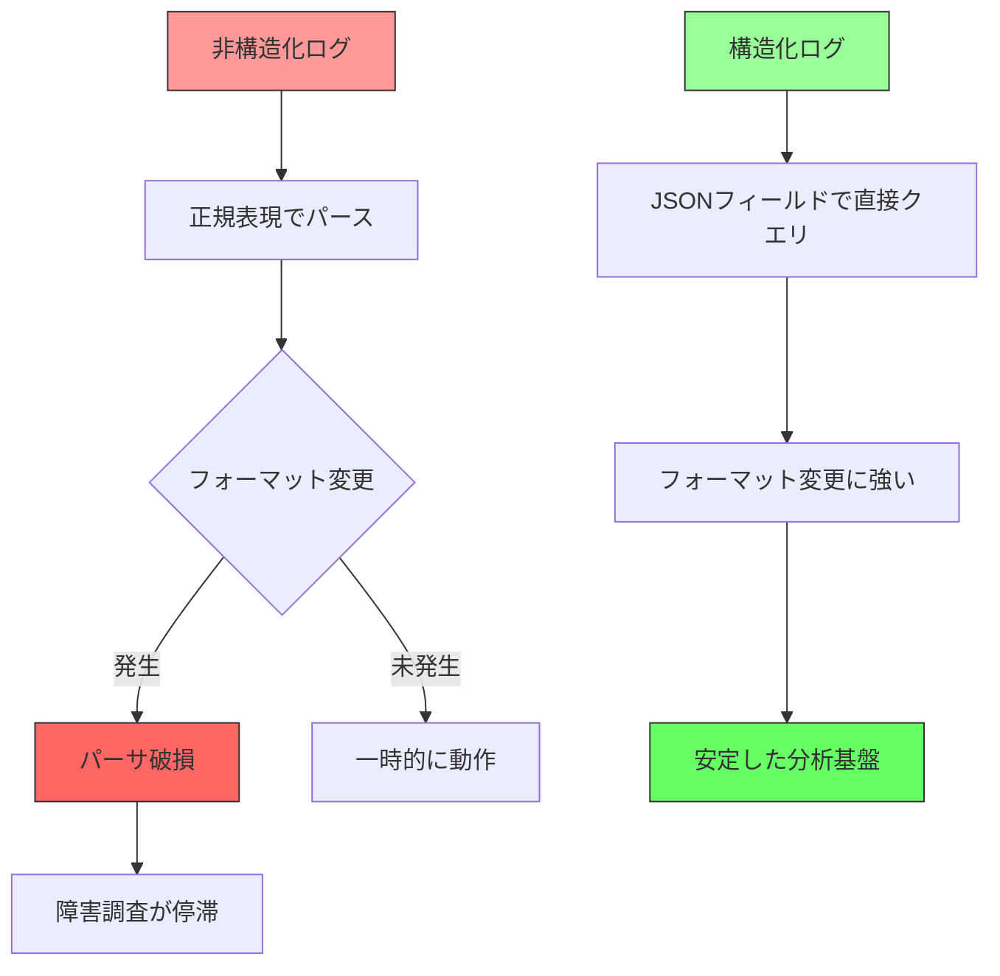
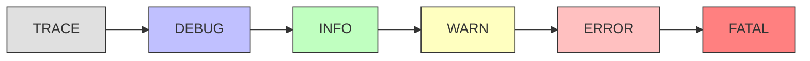
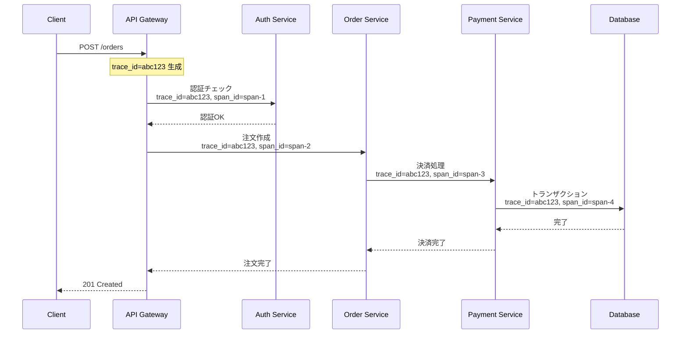
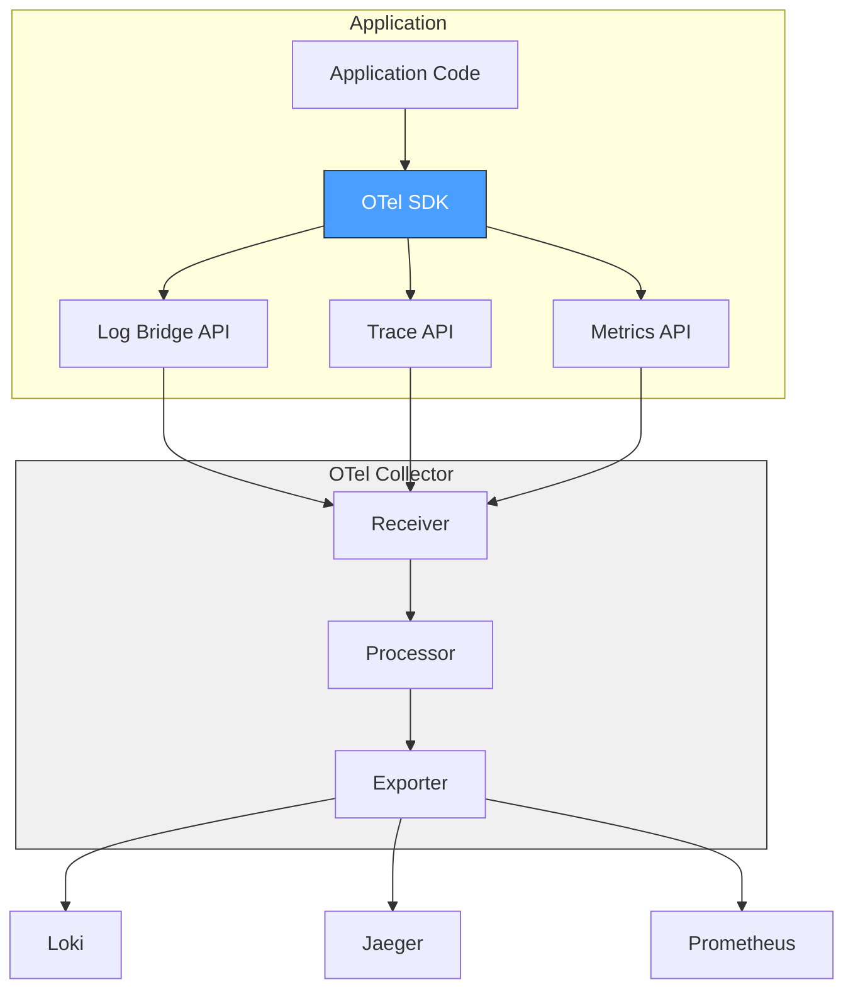
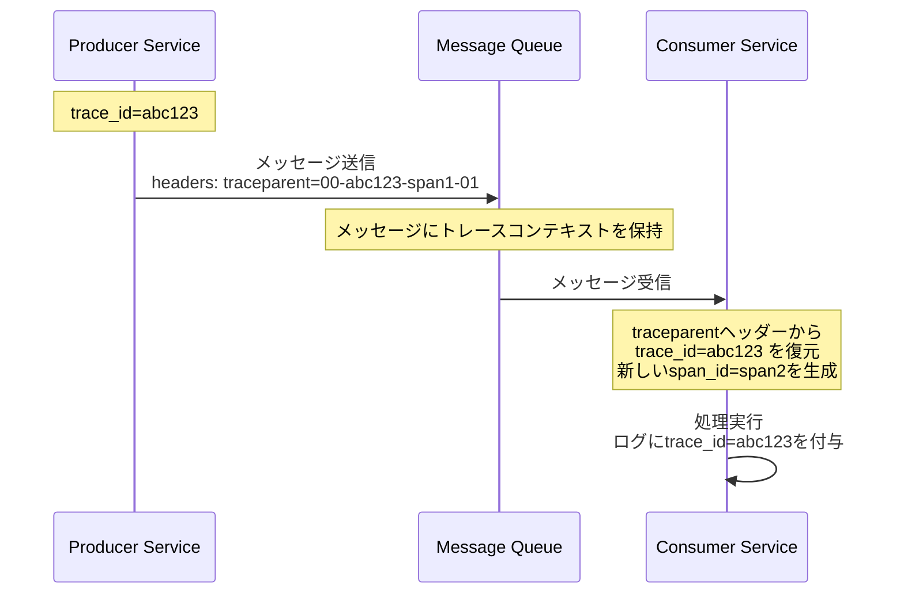
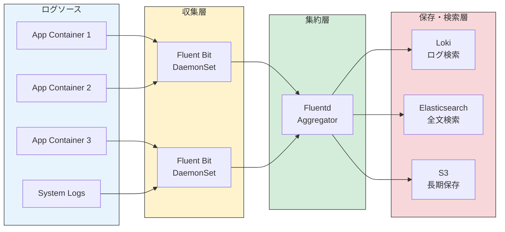
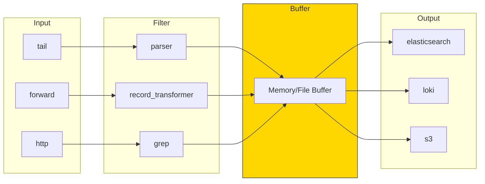
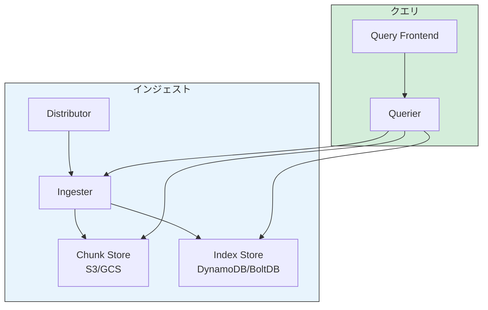
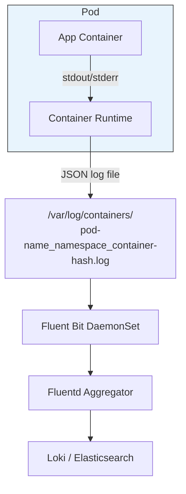
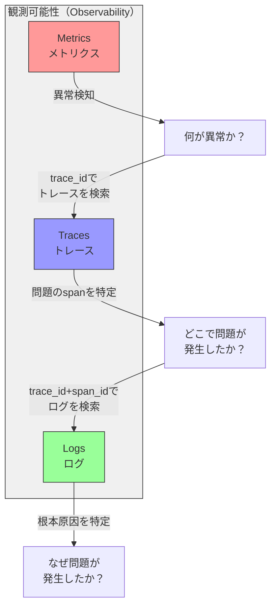

# 構造化ログ設計（JSON, トレースID伝播, Fluentd/Loki）

## なぜ構造化ログが必要か

### 非構造化ログの時代

アプリケーションログは、ソフトウェアの動作を把握するための最も基本的な手段である。初期のシステムでは、開発者が `printf` や `System.out.println` で自由形式のテキストを出力し、それを人間が目で読んで問題を特定していた。

```
2026-03-01 10:23:45 INFO User alice logged in from 192.168.1.100
2026-03-01 10:23:46 ERROR Failed to process payment for order 12345: timeout
2026-03-01 10:23:47 WARN Disk usage at 85% on /data
```

この形式のログは、単一サーバーで動作するアプリケーションを1人の開発者が見る分には十分であった。しかし、現代のシステムはこの前提をことごとく破壊している。

### 非構造化ログが破綻する理由

現代のシステムにおいて非構造化ログが機能しなくなる理由は、主に4つある。

**1. マイクロサービスの普及**

1つのHTTPリクエストが10以上のサービスを横断することは珍しくない。各サービスがそれぞれ異なる形式でログを出力していると、リクエストの全体像を再構成することが極めて困難になる。

**2. ログの爆発的増大**

大規模サービスでは1日に数テラバイトのログが生成される。人間が1行ずつ読むことは物理的に不可能であり、機械的なフィルタリング・集計が必須となる。しかし、自由形式のテキストを正規表現でパースするのは脆弱であり、フォーマットのわずかな変更で既存のパーサが壊れる。

**3. 多様な消費者**

ログの読者は開発者だけではない。SREチーム、セキュリティチーム、ビジネスアナリスト、さらにはアラートシステムやダッシュボードといった自動化ツールも「消費者」である。それぞれが異なる情報を異なる粒度で必要とし、非構造化テキストではこの多様なニーズに応えられない。

**4. コンプライアンスと監査**

GDPR、SOC2、PCI DSSなどの規制は、特定のイベント（認証、データアクセス、権限変更など）のログを確実に記録し、後から検索・監査できることを要求する。自由形式のテキストでは、これらの要件を確実に満たすことが難しい。



### 構造化ログとは

構造化ログとは、ログの各エントリをキーバリューペアの集合として表現する手法である。最も一般的な表現形式はJSONであるが、logfmt（`key=value` 形式）やProtocol Buffersなども使われる。

非構造化ログと構造化ログの対比を見てみよう。

**非構造化ログ:**
```
2026-03-01 10:23:46 ERROR Failed to process payment for order 12345: timeout after 30s
```

**構造化ログ（JSON）:**
```json
{
  "timestamp": "2026-03-01T10:23:46.123Z",
  "level": "error",
  "message": "Failed to process payment",
  "service": "payment-service",
  "order_id": "12345",
  "error_type": "timeout",
  "timeout_ms": 30000,
  "trace_id": "abc123def456",
  "span_id": "789ghi012"
}
```

構造化ログでは、すべての情報が明確なフィールドとして分離されている。これにより、「`order_id` が `12345` のすべてのログ」「`error_type` が `timeout` で `timeout_ms` が 10000 を超えるログ」といったクエリが、正規表現に頼ることなく実行できる。

## 構造化ログの設計原則

### JSON形式の選択理由

構造化ログのシリアライゼーション形式として、JSONが事実上の標準となっている。その理由を整理する。

| 形式 | 利点 | 欠点 |
|------|------|------|
| JSON | ほぼすべての言語で標準サポート、ネスト構造を表現可能、広いエコシステム | 冗長（キー名の繰り返し）、バイナリデータの表現が苦手 |
| logfmt | 人間が読みやすい、パースが容易 | ネスト構造を表現できない、標準仕様がない |
| Protocol Buffers | コンパクト、スキーマ定義が明確 | 人間が直接読めない、スキーマ管理のオーバーヘッド |
| MessagePack | JSONと互換のセマンティクス、コンパクト | バイナリのため直接読めない |

JSONが選ばれる最大の理由は「普遍性」である。Fluentd、Loki、Elasticsearch、BigQueryなど、ほぼすべてのログ基盤がJSONをネイティブにサポートしている。また、開発者がターミナルで `jq` コマンドを使って直接フィルタリングできるという実用性も大きい。

::: tip logfmtという選択肢
Go言語のエコシステムでは、logfmt形式（`time=2026-03-01T10:23:46Z level=error msg="Failed to process payment" order_id=12345`）も広く使われている。人間の可読性が高く、パースも容易だが、ネストされた構造を表現できないため、複雑なコンテキスト情報を含めるには限界がある。Fluentdやベクトルなどの収集エージェントがlogfmtパーサを備えているため、JSON以外の選択肢として十分に実用的である。
:::

### フィールド設計

構造化ログのフィールド設計は、ログの有用性を左右する最も重要な設計判断である。フィールドは大きく3つのカテゴリに分類できる。

#### 1. 基本フィールド（すべてのログエントリに含める）

```json
{
  "timestamp": "2026-03-01T10:23:46.123456Z",
  "level": "error",
  "message": "Human-readable description of the event",
  "logger": "com.example.payment.PaymentProcessor",
  "service": "payment-service",
  "version": "1.4.2",
  "environment": "production",
  "host": "payment-7b8f9c-xk4z2"
}
```

**timestamp**: ISO 8601形式でUTCタイムゾーンを使用する。マイクロ秒精度が望ましい。ローカルタイムゾーンを使うと、複数リージョンにまたがるシステムでのログの時系列順序が不明確になる。

**level**: ログレベルは一貫した体系を採用する。後述するログレベルの設計で詳しく議論する。

**message**: 人間が読むための簡潔な説明。構造化フィールドに含まれる情報を繰り返す必要はない。`"Failed to process payment for order 12345"` ではなく、`"Failed to process payment"` とし、`order_id` フィールドを別途設ける。

**service / version / environment / host**: ログの出自を特定するために不可欠。コンテナオーケストレーション環境では、`host` にはPod名やコンテナIDが入ることが多い。

#### 2. コンテキストフィールド（リクエストスコープ）

```json
{
  "trace_id": "4bf92f3577b34da6a3ce929d0e0e4736",
  "span_id": "00f067aa0ba902b7",
  "request_id": "req-abc123",
  "user_id": "user-456",
  "tenant_id": "acme-corp",
  "session_id": "sess-789"
}
```

これらのフィールドは、リクエストの処理コンテキストを示す。特に `trace_id` と `span_id` は分散トレーシングとの連携に不可欠であり、後述するトレースID伝播のセクションで詳しく扱う。

#### 3. イベント固有フィールド（各ログ行に固有）

```json
{
  "order_id": "12345",
  "payment_method": "credit_card",
  "amount_cents": 5000,
  "currency": "JPY",
  "error_code": "GATEWAY_TIMEOUT",
  "retry_count": 3,
  "duration_ms": 30042
}
```

イベント固有フィールドは、その特定のログイベントに関連する情報を格納する。フィールド名の命名規則は組織全体で統一する必要がある。

::: warning フィールド命名の一貫性
`userId` / `user_id` / `UserID` / `user-id` のような揺れは、クエリの際に深刻な問題を引き起こす。snake_case に統一するのが最も一般的であり、JSON/Elasticsearch/BigQuery などのツールとの親和性も高い。プロジェクト開始時にスタイルガイドを定め、リンターで強制することを推奨する。
:::

### ログレベルの設計

ログレベルの設計は、一見単純に見えて、実際には組織的な合意が必要な重要事項である。



| レベル | 用途 | プロダクションでの扱い |
|--------|------|----------------------|
| TRACE | 極めて詳細なデバッグ情報（変数の値、関数の入出力） | 通常は無効。特定の問題調査時のみ動的に有効化 |
| DEBUG | 開発時に有用なデバッグ情報 | 通常は無効。必要に応じてサンプリング |
| INFO | 正常な業務イベント（ユーザーログイン、注文作成） | 常時記録。ダッシュボードやメトリクスの基盤 |
| WARN | 異常だがサービスは継続可能な状態（リトライ成功、非推奨APIの使用） | 常時記録。一定閾値でアラート |
| ERROR | サービスの一部機能が失敗した状態（API呼び出し失敗、データ不整合） | 常時記録。即座にアラート |
| FATAL | サービス全体が停止する致命的な状態 | 常時記録。緊急アラート |

#### ログレベルの選択基準

実際の運用では、WARNとERRORの境界が最も議論になる。有用な基準は「誰がアクションを取る必要があるか」である。

- **WARN**: 現時点では自動的にリカバリされたが、頻度が増加すると人間の介入が必要になる可能性がある
- **ERROR**: 人間またはシステムによる即座のアクションが必要

::: danger ERRORログの安易な使用
ERRORレベルの乱用は、アラート疲れ（Alert Fatigue）を引き起こし、真に重要なエラーが埋もれる原因となる。「念のためERRORにしておく」という判断は、長期的にはシステムの観測可能性を劣化させる。ERRORは「今すぐ誰かが対応すべき事象」にのみ使用すべきである。
:::

### 機密情報の扱い

構造化ログにおいて最も注意すべき点の一つが、機密情報の漏洩防止である。

**絶対にログに含めてはならない情報:**
- パスワード、APIキー、シークレットトークン
- クレジットカード番号（PCI DSS違反）
- マイナンバーなどの個人識別番号

**マスキングまたはハッシュ化して記録する情報:**
- メールアドレス → `"email_hash": "sha256:a1b2c3..."`
- IPアドレス → 上位ビットのみ `"ip_prefix": "192.168.1.0/24"`
- ユーザー名 → IDへの置換 `"user_id": "u-12345"`

```python
import hashlib
import re

def sanitize_log_fields(data: dict) -> dict:
    """Sanitize sensitive fields before logging."""
    sanitized = data.copy()

    # Mask credit card numbers
    if "card_number" in sanitized:
        sanitized["card_number"] = "****" + sanitized["card_number"][-4:]

    # Hash email addresses
    if "email" in sanitized:
        sanitized["email_hash"] = hashlib.sha256(
            sanitized["email"].encode()
        ).hexdigest()[:16]
        del sanitized["email"]

    # Remove any secret-like fields
    secret_patterns = re.compile(r"(password|secret|token|api_key)", re.IGNORECASE)
    for key in list(sanitized.keys()):
        if secret_patterns.search(key):
            sanitized[key] = "[REDACTED]"

    return sanitized
```

## トレースIDの伝播

### 分散トレーシングとログの統合

マイクロサービスアーキテクチャにおいて、1つのユーザーリクエストが複数のサービスを横断する際、それらのログを関連付けるための仕組みがトレースID（Trace ID）である。



この例では、`trace_id=abc123` がリクエスト全体を貫通し、各サービスで固有の `span_id` が発行される。すべてのログに `trace_id` と `span_id` を含めることで、あるリクエストに関連するログをサービス横断で集約できる。

### W3C Trace Context 標準

トレースIDの伝播方法として、W3C Trace Context が業界標準となっている。HTTPヘッダーの `traceparent` を用いてコンテキストを伝播する。

```
traceparent: 00-4bf92f3577b34da6a3ce929d0e0e4736-00f067aa0ba902b7-01
             |  |                                |                |
             |  trace-id (128bit)                span-id (64bit)  flags
             version
```

- **version**: 現在は `00` 固定
- **trace-id**: リクエスト全体を識別する128ビットのID
- **span-id**: 現在の処理単位を識別する64ビットのID
- **flags**: サンプリングフラグ（`01` = サンプリング対象）

さらに、`tracestate` ヘッダーでベンダー固有の情報を付加できる。

```
tracestate: rojo=00f067aa0ba902b7,congo=t61rcWkgMzE
```

### OpenTelemetry との連携

OpenTelemetry（OTel）は、分散トレーシング・メトリクス・ログの3本柱を統一するオープンスタンダードである。構造化ログとの連携において、OpenTelemetryは以下の役割を果たす。



OpenTelemetryを使うことで、アプリケーションコードは特定のログバックエンドに依存せず、統一されたAPIを通じてテレメトリデータを出力できる。Collectorがバックエンドへのルーティング・変換・サンプリングを担当する。

#### ログとトレースの相関

OpenTelemetryのLog Bridge APIを使うと、既存のログライブラリ（log4j、slog、zerolog等）の出力に自動的にトレースコンテキストを付与できる。

```go
package main

import (
    "context"
    "log/slog"
    "os"

    "go.opentelemetry.io/otel"
    "go.opentelemetry.io/otel/trace"
)

// traceHandler wraps slog.Handler to inject trace context
type traceHandler struct {
    inner slog.Handler
}

func (h *traceHandler) Handle(ctx context.Context, r slog.Record) error {
    span := trace.SpanFromContext(ctx)
    if span.SpanContext().IsValid() {
        r.AddAttrs(
            slog.String("trace_id", span.SpanContext().TraceID().String()),
            slog.String("span_id", span.SpanContext().SpanID().String()),
        )
    }
    return h.inner.Handle(ctx, r)
}

func (h *traceHandler) Enabled(ctx context.Context, level slog.Level) bool {
    return h.inner.Enabled(ctx, level)
}

func (h *traceHandler) WithAttrs(attrs []slog.Attr) slog.Handler {
    return &traceHandler{inner: h.inner.WithAttrs(attrs)}
}

func (h *traceHandler) WithGroup(name string) slog.Handler {
    return &traceHandler{inner: h.inner.WithGroup(name)}
}

func main() {
    // Set up structured JSON logging with trace context
    jsonHandler := slog.NewJSONHandler(os.Stdout, &slog.HandlerOptions{
        Level: slog.LevelInfo,
    })
    logger := slog.New(&traceHandler{inner: jsonHandler})
    slog.SetDefault(logger)

    // Create a traced context
    tracer := otel.Tracer("payment-service")
    ctx, span := tracer.Start(context.Background(), "processPayment")
    defer span.End()

    // Log with automatic trace context injection
    slog.InfoContext(ctx, "Processing payment",
        slog.String("order_id", "12345"),
        slog.Int("amount_cents", 5000),
    )
}
```

出力例:
```json
{
  "time": "2026-03-01T10:23:46.123Z",
  "level": "INFO",
  "msg": "Processing payment",
  "order_id": "12345",
  "amount_cents": 5000,
  "trace_id": "4bf92f3577b34da6a3ce929d0e0e4736",
  "span_id": "00f067aa0ba902b7"
}
```

### リクエストコンテキストの伝播パターン

サービス間でトレースコンテキストを伝播する方法は、通信プロトコルによって異なる。

| プロトコル | 伝播方法 | 具体的なヘッダー/フィールド |
|-----------|---------|--------------------------|
| HTTP | HTTPヘッダー | `traceparent`, `tracestate` |
| gRPC | メタデータ | `traceparent`, `grpc-trace-bin` |
| メッセージキュー | メッセージ属性/ヘッダー | Kafkaの場合 `traceparent` ヘッダー |
| データベース | SQLコメント | `/* trace_id=abc123 */` |

#### HTTPミドルウェアでの伝播

Webフレームワークにおいては、ミドルウェア（Interceptor）でトレースコンテキストの抽出・注入を一括処理するのが一般的である。

```python
import uuid
from contextvars import ContextVar
from functools import wraps

# Context variable for trace context propagation
current_trace_id: ContextVar[str] = ContextVar("trace_id", default="")
current_span_id: ContextVar[str] = ContextVar("span_id", default="")

def extract_trace_context(headers: dict) -> tuple[str, str]:
    """Extract W3C Trace Context from HTTP headers."""
    traceparent = headers.get("traceparent", "")
    if traceparent:
        parts = traceparent.split("-")
        if len(parts) == 4:
            return parts[1], parts[2]  # trace_id, parent_span_id
    # Generate new trace context if not present
    return uuid.uuid4().hex, uuid.uuid4().hex[:16]

def inject_trace_context(headers: dict) -> dict:
    """Inject W3C Trace Context into outgoing HTTP headers."""
    trace_id = current_trace_id.get()
    span_id = current_span_id.get()
    if trace_id:
        headers["traceparent"] = f"00-{trace_id}-{span_id}-01"
    return headers

class TraceMiddleware:
    """ASGI middleware for trace context propagation."""

    def __init__(self, app):
        self.app = app

    async def __call__(self, scope, receive, send):
        if scope["type"] == "http":
            headers = dict(scope.get("headers", []))
            trace_id, parent_span_id = extract_trace_context(headers)
            span_id = uuid.uuid4().hex[:16]

            # Set context variables for the duration of the request
            trace_token = current_trace_id.set(trace_id)
            span_token = current_span_id.set(span_id)

            try:
                await self.app(scope, receive, send)
            finally:
                current_trace_id.reset(trace_token)
                current_span_id.reset(span_token)
        else:
            await self.app(scope, receive, send)
```

#### 非同期処理でのコンテキスト伝播

メッセージキューを介した非同期処理では、コンテキストの伝播に特別な注意が必要である。メッセージのプロデューサー側でトレースコンテキストをメッセージの属性に埋め込み、コンシューマー側でそれを復元する必要がある。



::: tip メッセージキューでのトレース連携
Kafkaの場合、Producer Interceptorでトレースヘッダーを付与し、Consumer Interceptorでリンクを作成するのが一般的なパターンである。OpenTelemetryの自動インストルメンテーションライブラリがこのパターンをサポートしているため、手動実装の必要は少ない。
:::

## ログ収集パイプライン

### パイプラインの全体アーキテクチャ

構造化ログの価値は、収集・保存・検索のパイプラインが整って初めて実現される。現代のログパイプラインは、一般に以下の3層構造をとる。



**収集層（Collection）**: 各ノード/Podで動作する軽量エージェント。ログファイルの末尾を監視（tail）し、パースして転送する。Fluent Bitがこの役割を担うことが多い。

**集約層（Aggregation）**: 複数の収集エージェントからログを受け取り、フィルタリング・変換・ルーティングを行う。Fluentdがこの役割を担う。

**保存・検索層（Storage）**: ログを永続化し、検索インタフェースを提供する。用途によってLoki、Elasticsearch、S3などを使い分ける。

### Fluentd と Fluent Bit

#### Fluentdのアーキテクチャ

Fluentdは、CNCFの卒業プロジェクトであり、ログ収集のデファクトスタンダードの一つである。「Unified Logging Layer」というコンセプトのもと、多様なログソースからデータを収集し、多様な宛先に配信する。

Fluentdの設計は、3つの基本概念で構成される。

- **Input**: ログの入力元（ファイル、HTTP、TCP/UDP、syslog等）
- **Filter**: ログの変換・加工（フィールド追加、パース、マスキング等）
- **Output**: ログの出力先（Elasticsearch、Loki、S3、Kafka等）



#### Fluentd の設定例

以下は、JSONログを収集し、Lokiに転送する典型的なFluentd設定である。

```xml
# Input: Read JSON logs from container stdout
<source>
  @type tail
  path /var/log/containers/*.log
  pos_file /var/log/fluentd-containers.log.pos
  tag kubernetes.*
  read_from_head true
  <parse>
    @type json
    time_key timestamp
    time_format %Y-%m-%dT%H:%M:%S.%NZ
  </parse>
</source>

# Filter: Add Kubernetes metadata
<filter kubernetes.**>
  @type kubernetes_metadata
  @id filter_kube_metadata
</filter>

# Filter: Remove sensitive fields
<filter kubernetes.**>
  @type record_transformer
  remove_keys $.password, $.secret, $.api_key
</filter>

# Filter: Route by log level
<filter kubernetes.**>
  @type record_transformer
  <record>
    severity ${record["level"] || "info"}
  </record>
</filter>

# Output: Send to Loki
<match kubernetes.**>
  @type loki
  url "http://loki-gateway:3100"

  <label>
    service $.kubernetes.labels.app
    namespace $.kubernetes.namespace_name
    severity $.severity
  </label>

  # Buffer configuration for reliability
  <buffer>
    @type file
    path /var/log/fluentd-buffers/loki
    flush_interval 5s
    retry_max_interval 30s
    chunk_limit_size 2M
    total_limit_size 256M
    overflow_action drop_oldest_chunk
  </buffer>
</match>

# Output: Long-term archival to S3
<match kubernetes.**>
  @type s3
  s3_bucket my-log-archive
  s3_region ap-northeast-1
  path logs/%Y/%m/%d/

  <buffer time>
    @type file
    path /var/log/fluentd-buffers/s3
    timekey 3600
    timekey_wait 10m
    chunk_limit_size 64M
  </buffer>
</match>
```

#### Fluent Bit vs Fluentd

Fluent Bitは、Fluentdのサブプロジェクトとして開発された軽量版である。両者の使い分けは以下の通り。

| 特性 | Fluent Bit | Fluentd |
|------|-----------|---------|
| 実装言語 | C | Ruby + C |
| メモリ使用量 | 数MB | 数十〜数百MB |
| プラグインエコシステム | 約100種類 | 約1000種類 |
| 適切な配置 | エッジ（DaemonSet） | 集約層（Deployment） |
| パフォーマンス | 高スループット | 中程度 |

一般的なパターンとして、Fluent Bitを各ノードにDaemonSetとして配置して軽量な収集を行い、Fluentdを集約層としてデプロイしてフィルタリング・ルーティングを行う構成がよく採用される。

::: warning バッファとバックプレッシャー
ログ収集パイプラインで最も重要な設計判断の一つがバッファ戦略である。バックエンドが一時的に利用不能になった場合、ログをメモリに蓄積し続けるとOOM（Out of Memory）で収集エージェント自体がクラッシュする。ファイルバッファを使用し、容量上限を設定し、溢れた場合の挙動（`drop_oldest_chunk` など）を明示的に定義すべきである。
:::

### Grafana Loki

#### Lokiの設計思想

Grafana Lokiは、「Prometheusのように、しかしログのために」という設計思想のもとに開発されたログ集約システムである。Elasticsearchとの最大の違いは、ログ本文のフルテキストインデックスを構築しないことである。

Lokiはログをラベル（メタデータ）でインデックスし、ログ本文はチャンクとして圧縮して保存する。検索時はまずラベルでストリームを絞り込み、その後にチャンク内をスキャンする。



**この設計のトレードオフ:**

| 観点 | Loki | Elasticsearch |
|------|------|--------------|
| インデックスコスト | 低い（ラベルのみ） | 高い（全文インデックス） |
| ストレージコスト | 低い（S3/GCSに圧縮保存） | 高い（インデックス + 原文） |
| 全文検索速度 | 遅い（スキャンベース） | 速い（インデックスベース） |
| ラベルベースの検索 | 非常に速い | 速い |
| 運用の複雑さ | 低い | 高い（JVMチューニング等） |
| スケーリング | 容易（ストレージ分離） | 複雑（シャード管理） |

Lokiは「ログの大部分は読まれない」という現実を踏まえた合理的な設計である。インデックスコストを下げてストレージ効率を高め、必要な時にだけスキャンで検索する。大規模なログボリュームを低コストで長期保存したいユースケースに特に適している。

#### LogQL によるクエリ

LokiのクエリはLogQLという独自言語で行う。PromQLに構文が似ており、Prometheusに慣れたエンジニアには親しみやすい。

```
# Select logs by labels
{service="payment-service", environment="production"}

# Filter by content
{service="payment-service"} |= "timeout"

# Parse JSON and filter by field
{service="payment-service"} | json | error_type="timeout" | duration_ms > 5000

# Aggregate: error rate per service over 5 minutes
sum(rate({level="error"}[5m])) by (service)

# Top 10 slowest requests
{service="api-gateway"} | json | topk(10, duration_ms)
```

::: tip Lokiのラベル設計
Lokiのパフォーマンスはラベルの設計に大きく依存する。高カーディナリティ（一意な値が非常に多い）のラベルはインデックスを肥大化させ、パフォーマンスを著しく劣化させる。`user_id` や `request_id` のような一意性の高い値はラベルではなく、ログ本文のJSONフィールドとして保持し、LogQLの `| json | user_id="xxx"` でフィルタリングすべきである。ラベルとして適切なのは `service`、`namespace`、`environment`、`level` のようなカーディナリティの低い値である。
:::

### Elasticsearch / OpenSearch

Elasticsearchは長年ログ検索の標準であり、ELKスタック（Elasticsearch + Logstash + Kibana）として広く知られている。全文検索インデックスを構築するため、ログ本文のキーワード検索が高速であるという強みがある。

ただし、大量のログをインデックスするには相応のコンピュートとストレージリソースが必要であり、JVMのヒープ管理やシャード設計など運用上の複雑さも伴う。OpenSearchはElasticsearchのフォーク（AWS主導）であり、API互換性を保ちつつオープンソースとして開発されている。

大規模環境では、Lokiで全体のログを低コストに収集し、特定の重要なサービスのログだけをElasticsearchに二重に送ることで、コストとクエリ性能のバランスを取る構成も見られる。

## 実装パターン

### Go — log/slog（標準ライブラリ）

Go 1.21以降、標準ライブラリに構造化ログパッケージ `log/slog` が含まれている。サードパーティライブラリ（zerolog、zap）に頼らずとも、パフォーマンスの良い構造化ログを出力できるようになった。

```go
package main

import (
    "context"
    "log/slog"
    "os"
)

func main() {
    // JSON handler for production
    handler := slog.NewJSONHandler(os.Stdout, &slog.HandlerOptions{
        Level: slog.LevelInfo,
        // Add source code location
        AddSource: true,
    })

    // Create logger with default fields
    logger := slog.New(handler).With(
        slog.String("service", "order-service"),
        slog.String("version", "1.4.2"),
        slog.String("environment", "production"),
    )

    // Set as default logger
    slog.SetDefault(logger)

    // Use logger groups for nested structure
    slog.Info("Order created",
        slog.String("order_id", "ord-12345"),
        slog.Group("customer",
            slog.String("id", "cust-678"),
            slog.String("tier", "premium"),
        ),
        slog.Group("payment",
            slog.String("method", "credit_card"),
            slog.Int("amount_cents", 5000),
            slog.String("currency", "JPY"),
        ),
    )
}
```

出力:
```json
{
  "time": "2026-03-01T10:23:46.123Z",
  "level": "INFO",
  "source": {
    "function": "main.main",
    "file": "main.go",
    "line": 30
  },
  "msg": "Order created",
  "service": "order-service",
  "version": "1.4.2",
  "environment": "production",
  "order_id": "ord-12345",
  "customer": {
    "id": "cust-678",
    "tier": "premium"
  },
  "payment": {
    "method": "credit_card",
    "amount_cents": 5000,
    "currency": "JPY"
  }
}
```

### Java — SLF4J + Logback（構造化出力）

Java エコシステムでは、SLF4J をファサードとし、Logback を実装として使うのが標準的である。構造化ログを出力するには、Logstash Logback Encoder を使用する。

```java
import org.slf4j.Logger;
import org.slf4j.LoggerFactory;
import net.logstash.logback.argument.StructuredArguments;
import static net.logstash.logback.argument.StructuredArguments.*;

public class PaymentService {
    private static final Logger log = LoggerFactory.getLogger(PaymentService.class);

    public void processPayment(String orderId, int amountCents, String currency) {
        log.info("Processing payment",
            keyValue("order_id", orderId),
            keyValue("amount_cents", amountCents),
            keyValue("currency", currency),
            keyValue("payment_method", "credit_card")
        );

        try {
            // Payment processing logic
            gateway.charge(amountCents, currency);

            log.info("Payment completed",
                keyValue("order_id", orderId),
                keyValue("duration_ms", elapsed),
                keyValue("status", "success")
            );
        } catch (PaymentException e) {
            log.error("Payment failed",
                keyValue("order_id", orderId),
                keyValue("error_code", e.getCode()),
                keyValue("error_message", e.getMessage()),
                e  // Stack trace is included automatically
            );
        }
    }
}
```

Logback設定（`logback.xml`）:
```xml
<configuration>
  <appender name="STDOUT" class="ch.qos.logback.core.ConsoleAppender">
    <encoder class="net.logstash.logback.encoder.LogstashEncoder">
      <!-- Add default fields -->
      <customFields>
        {"service":"payment-service","environment":"production"}
      </customFields>
      <!-- Include MDC (Mapped Diagnostic Context) fields -->
      <includeMdcKeyName>trace_id</includeMdcKeyName>
      <includeMdcKeyName>span_id</includeMdcKeyName>
      <includeMdcKeyName>request_id</includeMdcKeyName>
    </encoder>
  </appender>

  <root level="INFO">
    <appender-ref ref="STDOUT" />
  </root>
</configuration>
```

JavaではMDC（Mapped Diagnostic Context）を使って、リクエストスコープのコンテキスト情報（`trace_id` 等）をスレッドローカルに保持し、すべてのログ出力に自動付与するのが一般的なパターンである。

### Python — structlog

Pythonでは、structlogが構造化ログの標準的なライブラリである。

```python
import structlog
import logging

# Configure structlog
structlog.configure(
    processors=[
        structlog.contextvars.merge_contextvars,
        structlog.processors.add_log_level,
        structlog.processors.StackInfoRenderer(),
        structlog.dev.set_exc_info,
        structlog.processors.TimeStamper(fmt="iso"),
        structlog.processors.JSONRenderer(),
    ],
    wrapper_class=structlog.make_filtering_bound_logger(logging.INFO),
    context_class=dict,
    logger_factory=structlog.PrintLoggerFactory(),
)

log = structlog.get_logger()

def process_order(order_id: str, user_id: str):
    # Bind context for the duration of order processing
    order_log = log.bind(order_id=order_id, user_id=user_id)

    order_log.info("Processing order started")

    # Context variables propagate across function calls
    structlog.contextvars.bind_contextvars(
        trace_id="abc123",
        span_id="span-456",
    )

    try:
        validate_order(order_id)
        charge_payment(order_id)
        order_log.info("Order completed", status="success")
    except Exception as e:
        order_log.error("Order failed",
            error_type=type(e).__name__,
            error_message=str(e),
        )
        raise

def validate_order(order_id: str):
    # trace_id is automatically included via contextvars
    log.info("Validating order", step="validation")

def charge_payment(order_id: str):
    log.info("Charging payment", step="payment")
```

### TypeScript/Node.js — pino

Node.jsエコシステムでは、pinoが高パフォーマンスな構造化ログライブラリとして広く使われている。

```typescript
import pino from "pino";

// Create logger with default fields
const logger = pino({
  level: "info",
  // Custom timestamp format
  timestamp: pino.stdTimeFunctions.isoTime,
  // Default fields
  base: {
    service: "api-gateway",
    version: "2.1.0",
    environment: process.env.NODE_ENV || "development",
  },
  // Redact sensitive fields
  redact: {
    paths: ["req.headers.authorization", "password", "secret", "*.token"],
    censor: "[REDACTED]",
  },
});

// Create child logger with request context
function createRequestLogger(traceId: string, spanId: string) {
  return logger.child({
    trace_id: traceId,
    span_id: spanId,
  });
}

// Usage in request handler
async function handleOrder(req: Request, res: Response) {
  const reqLogger = createRequestLogger(
    req.headers["x-trace-id"] as string,
    generateSpanId()
  );

  reqLogger.info({ order_id: req.body.orderId }, "Processing order");

  try {
    const result = await processOrder(req.body);
    reqLogger.info(
      { order_id: req.body.orderId, duration_ms: elapsed },
      "Order processed successfully"
    );
  } catch (err) {
    reqLogger.error(
      { order_id: req.body.orderId, err },
      "Order processing failed"
    );
  }
}
```

pinoの特徴として、ログのシリアライズを別プロセス（pino-pretty等のトランスポート）に委譲することで、アプリケーションスレッドのブロックを最小化する設計が挙げられる。

## Kubernetes環境でのログ設計

### コンテナログの標準出力戦略

Kubernetes環境では、コンテナの標準出力（stdout）と標準エラー出力（stderr）に書き出されたログが、各ノードの `/var/log/containers/` ディレクトリにJSONファイルとして保存される。このファイルをFluent BitやFluentdが tail する構成が標準的である。



この「stdoutに書き出す」アプローチには明確な利点がある。

1. **アプリケーションがログの宛先を知る必要がない**: ログの収集・転送はインフラ層の責務
2. **コンテナの再起動でもログが失われない**: ノードのファイルシステムに永続化
3. **統一的な収集**: すべてのコンテナのログが同じパスに集約される

::: warning ログの行分割問題
JSON形式の構造化ログは、必ず1行1エントリ（NDJSON: Newline Delimited JSON）で出力する必要がある。複数行にわたるJSON出力や、スタックトレースが複数行に分割されると、ログ収集エージェントが正しくパースできない。スタックトレースはJSONフィールドの値としてエスケープして1行に収めるか、マルチラインパーサを設定する必要がある。
:::

### ラベルとアノテーションの活用

KubernetesのPodラベルとアノテーションは、ログの分類とルーティングに活用できる。Fluentdのkubernetes_metadataフィルターは、ログエントリにPodのメタデータを自動的に付与する。

```yaml
apiVersion: apps/v1
kind: Deployment
metadata:
  name: payment-service
spec:
  template:
    metadata:
      labels:
        app: payment-service
        team: billing
        tier: backend
      annotations:
        # Custom annotations for log routing
        fluentd.io/parser: json
        logging.example.com/retention: "90d"
        logging.example.com/index: "payment-logs"
    spec:
      containers:
        - name: payment
          image: payment-service:1.4.2
          env:
            - name: LOG_LEVEL
              value: "info"
            - name: SERVICE_NAME
              value: "payment-service"
            - name: POD_NAME
              valueFrom:
                fieldRef:
                  fieldPath: metadata.name
```

## ベストプラクティスとアンチパターン

### ベストプラクティス

#### 1. イベントとしてログを設計する

ログの各エントリは、システムで発生した「イベント」を表現すべきである。「何が起きたか」「誰が」「何に対して」「結果はどうだったか」を構造化フィールドで表現する。

```json
{
  "event": "payment.charged",
  "actor": "user-456",
  "resource": "order-12345",
  "outcome": "success",
  "details": {
    "amount_cents": 5000,
    "currency": "JPY",
    "gateway": "stripe",
    "duration_ms": 234
  }
}
```

#### 2. ログとメトリクスの役割分担

すべてをログで計測しようとするのは非効率である。ログとメトリクスには明確な役割分担がある。

| 観点 | ログ | メトリクス |
|------|------|----------|
| データ型 | 個別イベント（離散的） | 集計値（連続的） |
| カーディナリティ | 高い（各リクエストの詳細） | 低い（ラベルで分類された集計） |
| クエリパターン | 特定条件のフィルタリング | 時系列の傾向分析 |
| コスト | ボリュームに比例して高い | 比較的低い（サンプリング） |
| 適切な用途 | デバッグ、監査、障害調査 | アラート、ダッシュボード、容量計画 |

「毎秒のリクエスト数」や「p99レイテンシ」はメトリクスで計測すべきであり、「特定ユーザーのリクエストが失敗した原因」はログで調査すべきである。

#### 3. サンプリング戦略

すべてのリクエストの詳細ログを保存するのはコスト的に現実的でないことがある。特にDEBUGレベルのログは、サンプリングによってボリュームを制御する。

```go
// Head-based sampling: log 10% of requests at debug level
func shouldSampleDebug(traceID string) bool {
    // Use trace ID for deterministic sampling
    // This ensures all logs for a given trace are either
    // all sampled or all skipped
    hash := fnv.New32a()
    hash.Write([]byte(traceID))
    return hash.Sum32()%10 == 0
}
```

::: tip テールベースサンプリング
OpenTelemetry Collectorのテールベースサンプリングを使うと、リクエストの処理が完了した後に「エラーが発生したリクエスト」や「レイテンシが高かったリクエスト」のトレースとログだけを保存し、正常なリクエストのログは破棄するという戦略が取れる。これにより、重要な情報を逃さずにログボリュームを大幅に削減できる。
:::

#### 4. 相関IDの体系化

トレースID以外にも、ビジネスレベルの相関IDを体系的に設計することで、調査の効率が飛躍的に向上する。

```json
{
  "trace_id": "4bf92f3577b34da6a3ce929d0e0e4736",
  "span_id": "00f067aa0ba902b7",
  "correlation": {
    "request_id": "req-abc123",
    "order_id": "ord-12345",
    "session_id": "sess-789",
    "batch_id": "batch-2026-03-01-001"
  }
}
```

#### 5. ログの動的レベル変更

プロダクション環境で問題が発生した際、アプリケーションを再起動せずにログレベルを動的に変更できる仕組みを用意しておくと、障害調査の速度が大幅に向上する。

```go
package main

import (
    "log/slog"
    "net/http"
    "sync/atomic"
)

// dynamicLevel allows runtime log level changes
type dynamicLevel struct {
    level atomic.Int64
}

func (l *dynamicLevel) Level() slog.Level {
    return slog.Level(l.level.Load())
}

func (l *dynamicLevel) Set(level slog.Level) {
    l.level.Store(int64(level))
}

var logLevel = &dynamicLevel{}

func init() {
    logLevel.Set(slog.LevelInfo)

    handler := slog.NewJSONHandler(os.Stdout, &slog.HandlerOptions{
        Level: logLevel,
    })
    slog.SetDefault(slog.New(handler))
}

// HTTP endpoint to change log level at runtime
func handleLogLevel(w http.ResponseWriter, r *http.Request) {
    if r.Method == http.MethodPut {
        level := r.URL.Query().Get("level")
        switch level {
        case "debug":
            logLevel.Set(slog.LevelDebug)
        case "info":
            logLevel.Set(slog.LevelInfo)
        case "warn":
            logLevel.Set(slog.LevelWarn)
        case "error":
            logLevel.Set(slog.LevelError)
        default:
            http.Error(w, "Invalid level", http.StatusBadRequest)
            return
        }
        slog.Info("Log level changed", slog.String("new_level", level))
    }
}
```

### アンチパターン

#### 1. ログメッセージに構造化データを埋め込む

```json
// Bad: structured data buried in message string
{
  "message": "User alice (id=456) placed order 12345 for $50.00 using credit_card"
}

// Good: structured data in dedicated fields
{
  "message": "Order placed",
  "user_id": "456",
  "order_id": "12345",
  "amount_cents": 5000,
  "payment_method": "credit_card"
}
```

メッセージ文字列に構造化データを埋め込むと、そのデータを抽出するために正規表現が必要になり、構造化ログの利点が失われる。

#### 2. 過剰なログ出力

```go
// Bad: logging inside a tight loop
for _, item := range items {
    slog.Info("Processing item", slog.String("item_id", item.ID))
    process(item)
}

// Good: log summary instead
slog.Info("Processing items batch",
    slog.Int("count", len(items)),
    slog.String("batch_id", batchID),
)
// ... process items ...
slog.Info("Items batch completed",
    slog.Int("success", successCount),
    slog.Int("failed", failedCount),
    slog.Duration("duration", elapsed),
)
```

ループ内で毎イテレーションログを出力すると、パフォーマンス劣化とログボリュームの爆発を招く。バッチ処理の場合はサマリログで十分である。

#### 3. 高カーディナリティラベル（Loki特有）

```yaml
# Bad: user_id as a Loki label (millions of unique values)
labels:
  service: "api"
  user_id: "user-12345"  # High cardinality!

# Good: user_id as a JSON field in the log body
labels:
  service: "api"
  level: "info"
# Log body contains user_id as a field
```

前述の通り、Lokiではラベルのカーディナリティがインデックスサイズとクエリ性能に直結する。一意な値が多いフィールドは、ログ本文のJSONフィールドとして扱い、LogQLの `| json` パーサでフィルタリングする。

#### 4. エラーのコンテキスト不足

```json
// Bad: error without context
{
  "level": "error",
  "message": "Connection refused"
}

// Good: error with full context
{
  "level": "error",
  "message": "Failed to connect to payment gateway",
  "error": "connection refused",
  "gateway_url": "https://api.stripe.com/v1/charges",
  "retry_count": 3,
  "last_retry_at": "2026-03-01T10:23:43Z",
  "order_id": "12345",
  "trace_id": "abc123"
}
```

エラーログは「何が失敗したか」だけでなく、「どのような状況で」「何回目の試行で」「関連するリソースは何か」を含めることで、障害調査の時間を大幅に短縮できる。

#### 5. ログでメトリクスを代替する

```json
// Bad: using logs as a substitute for metrics
// Logging every request just to count them later
{
  "event": "request_received",
  "path": "/api/orders",
  "method": "GET"
}
// Then running: count({event="request_received"} | json | path="/api/orders" [5m])

// Good: use a counter metric for this
// metrics.IncrCounter("http_requests_total", tags={"path": "/api/orders", "method": "GET"})
```

リクエスト数のカウントや平均レイテンシの計算は、メトリクス（Prometheus等）で行うべきである。ログで代替すると、ストレージコストが桁違いに高くなり、クエリパフォーマンスも劣る。

## 観測可能性の3本柱における位置づけ

構造化ログは、現代の観測可能性（Observability）フレームワークにおいて、メトリクス・トレースと並ぶ3本柱の一つである。



この3つのシグナルが `trace_id` を共有することで、以下のワークフローが可能になる。

1. **メトリクス**でエラーレートの上昇を検知（アラート発火）
2. 該当時間帯の**トレース**を検索し、遅延やエラーが発生しているスパンを特定
3. そのスパンの `trace_id` と `span_id` で**ログ**を検索し、エラーの詳細と根本原因を特定

この一連の流れがシームレスに行えることが、構造化ログの真の価値である。単にJSONでログを出力するだけでは不十分であり、トレースとメトリクスとの相関が取れるようにフィールドを設計し、パイプラインを構築することが重要である。

## まとめ

構造化ログは、現代の分散システムにおける障害調査・監視・監査の基盤となる技術である。その設計においては、以下の点が特に重要である。

**フォーマット**: JSON形式を採用し、フィールド命名規則を組織全体で統一する。基本フィールド、コンテキストフィールド、イベント固有フィールドの3層で設計する。

**トレースID伝播**: W3C Trace Contextに準拠し、HTTP、gRPC、メッセージキューなどすべての通信経路でコンテキストを伝播させる。OpenTelemetryの自動インストルメンテーションを活用することで、実装コストを最小化できる。

**収集パイプライン**: Fluent Bit（エッジ収集）+ Fluentd（集約）+ Loki/Elasticsearch（保存・検索）の構成が典型的である。バッファ設計とバックプレッシャー制御を怠ると、障害時にログ基盤自体が破綻するリスクがある。

**トレードオフの理解**: Lokiの「インデックスなし」アプローチとElasticsearchの「全文インデックス」アプローチにはそれぞれ明確なトレードオフがあり、ユースケースに応じた選択が必要である。

構造化ログの導入は、単なるフォーマット変更ではなく、システムの観測可能性を根本から改善する設計判断である。組織内での標準化、開発者への教育、そしてパイプラインの信頼性確保を含めた包括的な取り組みとして推進すべきである。
