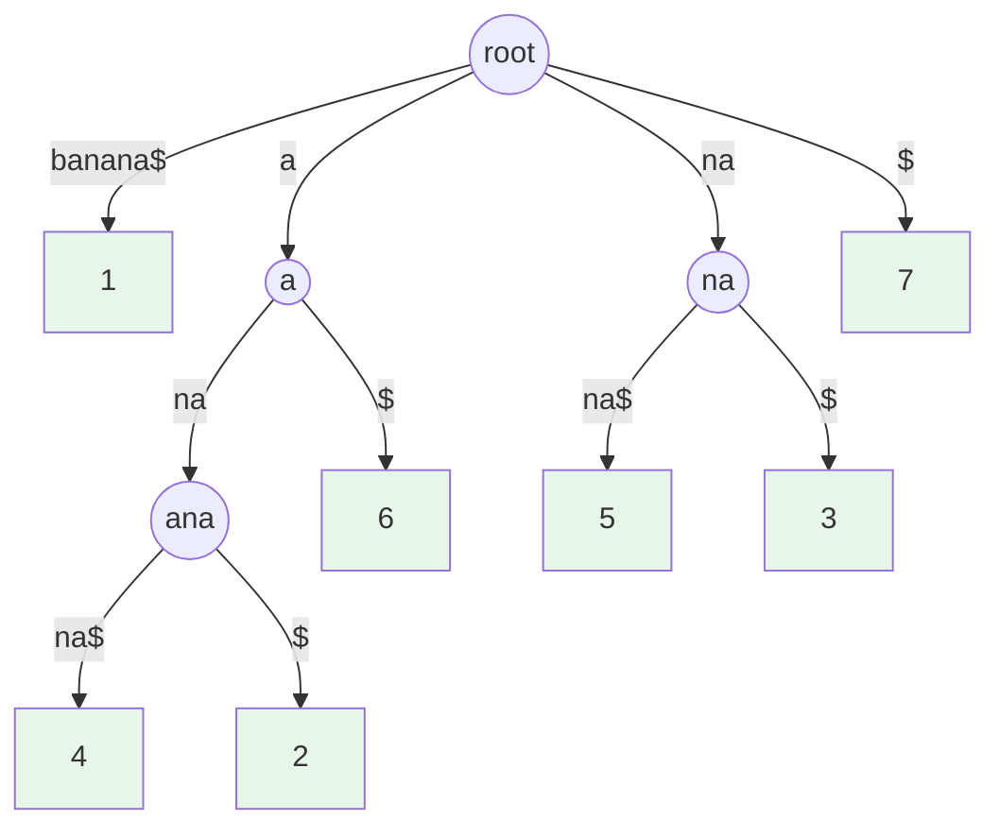
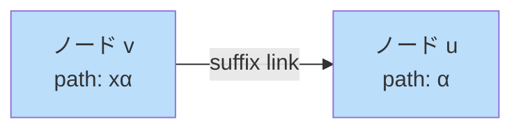
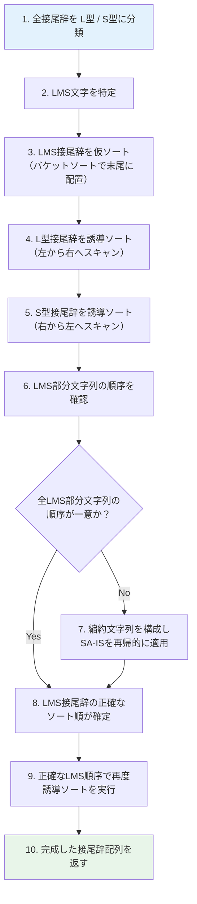
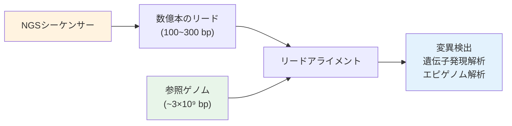
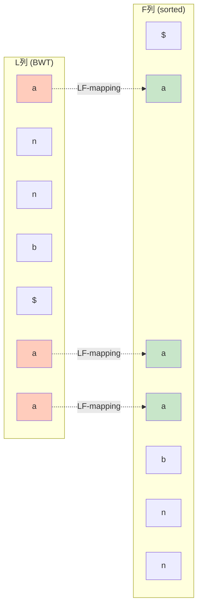
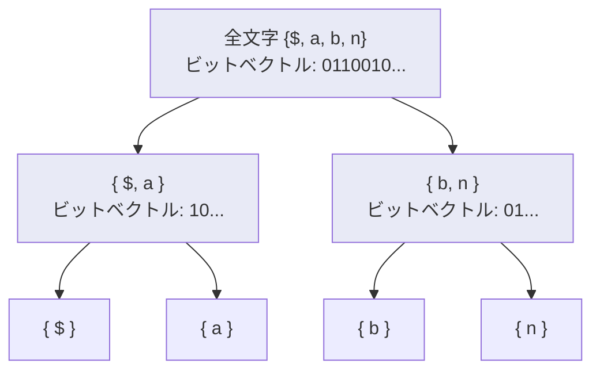
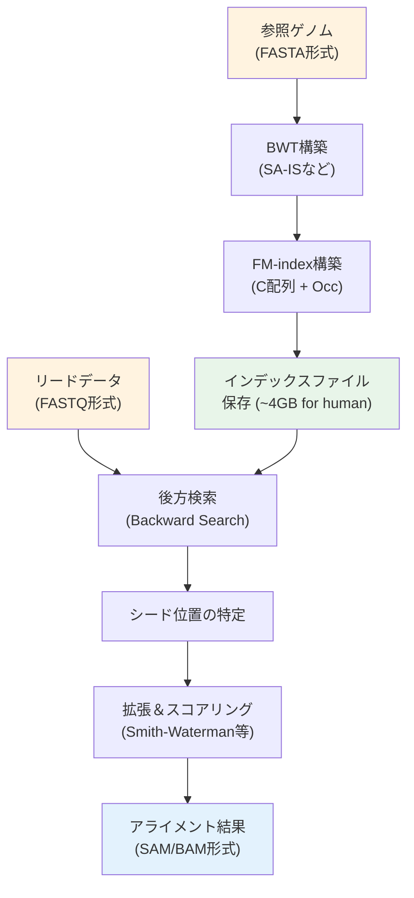
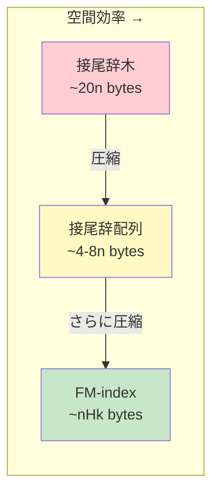

# 接尾辞配列と接尾辞木

文字列検索は計算機科学における最も基本的かつ重要な問題の一つである。テキストエディタでの検索、DNA配列の解析、全文検索エンジンの構築など、その応用範囲は極めて広い。単純なパターンマッチング（KMPやBoyer-Mooreなど）はテキスト長 $n$ とパターン長 $m$ に対して $O(n + m)$ の時間で動作するが、同じテキストに対して繰り返しクエリを行う場合には、テキストに対する前処理（索引構造の構築）によって劇的な高速化が可能となる。

本稿では、文字列の全接尾辞に基づく二つの代表的なデータ構造――**接尾辞木（Suffix Tree）** と**接尾辞配列（Suffix Array）**――を中心に、その理論的背景、構築アルゴリズム、および応用を包括的に解説する。さらに、LCP配列、Burrows-Wheeler変換（BWT）、FM-indexといった関連技術にも踏み込み、バイオインフォマティクスや全文検索における実践的な意義を考察する。

## 接尾辞の概念

### 定義

文字列 $S = s_1 s_2 \cdots s_n$ に対し、位置 $i$ から始まる**接尾辞（suffix）** を次のように定義する。

$$
\text{suffix}(i) = s_i s_{i+1} \cdots s_n \quad (1 \leq i \leq n)
$$

例えば、$S = \text{"banana"}$ の場合、すべての接尾辞は以下の通りである。

| 位置 $i$ | $\text{suffix}(i)$ |
|:---------:|:--------------------|
| 1         | `banana`            |
| 2         | `anana`             |
| 3         | `nana`              |
| 4         | `ana`               |
| 5         | `na`                |
| 6         | `a`                 |

文字列処理においては、テキスト末尾に他のどの文字よりも辞書順で小さい**番兵文字（sentinel）** `$` を付加することが慣例である。これにより、どの接尾辞も他の接尾辞の接頭辞にならないことが保証され、辞書順比較が一意に定まる。

### 接尾辞が重要な理由

文字列 $S$ 中にパターン $P$ が出現するということは、$P$ がある接尾辞の**接頭辞（prefix）** であることと同値である。したがって、全接尾辞を効率的に管理するデータ構造を構築すれば、任意のパターン検索を高速に実行できる。この洞察が接尾辞木と接尾辞配列の設計原理の根幹をなしている。

## 接尾辞木の構造

### 概要

**接尾辞木（Suffix Tree）** は、文字列 $S$（長さ $n$）のすべての接尾辞を格納したコンパクトなトライ（圧縮トライ）である。1973年にWeinerが最初に提案し、その後McCreightが改良、Ukkonenがオンラインアルゴリズムを開発した。

接尾辞木は以下の性質を持つ。

1. ちょうど $n$ 個の葉を持ち、各葉は一つの接尾辞に対応する
2. 根以外の内部ノードは少なくとも2つの子を持つ
3. 各辺は $S$ の空でない部分文字列でラベル付けされる
4. 同じノードから出る辺のラベルは、先頭文字が互いに異なる
5. 根から葉 $i$ までのパス上のラベルを連結すると $\text{suffix}(i)$ になる

### 構造の図示

$S = \text{"banana\$"}$ に対する接尾辞木を以下に示す。



> [!NOTE]
> 葉ノード内の数字は、対応する接尾辞の開始位置を表す。緑色のノードが葉である。

### 辺ラベルの圧縮表現

接尾辞木の重要な実装上のポイントは、辺のラベルを実際の文字列として格納するのではなく、元の文字列中の開始位置と終了位置のペア $(l, r)$ で表現することである。これにより、全体の空間計算量を $O(n)$ に抑えることができる。内部ノードの数は高々 $n - 1$ であるため、ノード数全体は $O(n)$ となる。

### 接尾辞木を用いたパターン検索

パターン $P$（長さ $m$）の検索は、根からパターンの文字を一つずつ辿ることで行う。

1. 根から開始し、$P$ の各文字に従って辺を辿る
2. パターン全体を辿れれば、到達したノードの部分木に含まれる全葉が出現位置
3. 途中で辿れなくなれば、パターンは $S$ に出現しない

この探索の時間計算量は $O(m + \text{occ})$ である。ここで $\text{occ}$ はパターンの出現回数を表す。テキスト長 $n$ には依存しないことに注目されたい。

## Ukkonenのアルゴリズム

### 背景と動機

接尾辞木を素朴に構築すると $O(n^2)$ の時間がかかる。Weiner（1973）とMcCreight（1976）はそれぞれ $O(n)$ の構築アルゴリズムを提案したが、実装が複雑であった。1995年にUkkonenが提案したオンラインアルゴリズムは、直感的な理解が比較的容易であり、実装面でも優れている。

### アルゴリズムの概要

Ukkonenのアルゴリズムは、文字列 $S = s_1 s_2 \cdots s_n$ を左から右へ一文字ずつ読み込みながら、接尾辞木を**逐次的に拡張**していく。フェーズ $i$（$1 \leq i \leq n$）では、$S[1..i]$ のすべての接尾辞を含む暗黙的接尾辞木（implicit suffix tree）を構築する。

各フェーズにおいて、接尾辞 $S[j..i]$（$1 \leq j \leq i$）の各々について以下の3つの拡張規則のいずれかを適用する。

::: tip 拡張規則
**規則1（葉の延長）**: 接尾辞 $S[j..i-1]$ が葉で終わるとき、辺ラベルの末尾に $s_i$ を追加する。

**規則2（新しい葉の作成）**: 接尾辞 $S[j..i-1]$ の末尾のあとに $s_i$ に対応する辺がないとき、新しい葉ノードと辺を作成する（必要に応じて内部ノードも分割する）。

**規則3（何もしない）**: 接尾辞 $S[j..i-1]$ の末尾のあとに $s_i$ に対応する辺がすでに存在するとき、何もしない。
:::

### 高速化のための3つの工夫

素朴な実装では $O(n^3)$ かかるが、以下の3つのテクニックにより $O(n)$ に改善される。

#### 1. 接尾辞リンク（Suffix Link）

内部ノード $v$ がパス $x\alpha$（$x$ は一文字、$\alpha$ は文字列）を表すとき、パス $\alpha$ を表すノード $u$ への接尾辞リンク $v \to u$ を保持する。

$$
\text{suffix\_link}(v) = u \quad \text{ただし} \quad \text{path}(v) = x\alpha, \quad \text{path}(u) = \alpha
$$

接尾辞リンクにより、フェーズ内での次の接尾辞の処理位置に $O(1)$ 償却時間で移動できる。



#### 2. グローバルエンド（Global End）

規則1の適用（葉の延長）は、葉の辺ラベルの終了位置をグローバル変数 `end` で管理することで暗黙的に行える。フェーズ $i$ の開始時に `end = i` とインクリメントするだけで、すべての既存の葉が自動的に延長される。これにより、規則1の処理は全フェーズを通じて $O(n)$ となる。

#### 3. 早期停止（Rule 3 Stopper）

あるフェーズで規則3が適用された場合、それ以降の接尾辞（より短い接尾辞）でも規則3が適用されることが保証される。したがって、規則3が適用された時点でそのフェーズを終了してよい。

### 計算量解析

これら3つの工夫を組み合わせることで、各フェーズの償却時間は $O(1)$ となり、全体の構築時間は以下の通りである。

$$
T(n) = O(n)
$$

空間計算量も $O(n)$ である（ただし、定数係数は大きい。一般に1文字あたり20バイト程度を要する）。

### 擬似コード

```python
def ukkonen(s: str):
    n = len(s)
    # Initialize root
    root = Node()
    active_node = root
    active_edge = -1
    active_length = 0
    remaining = 0
    global_end = [-1]  # mutable reference for leaf end

    for i in range(n):
        global_end[0] = i  # Extend all leaves (Rule 1)
        remaining += 1
        last_new_internal = None

        while remaining > 0:
            if active_length == 0:
                active_edge = i

            if s[active_edge] not in active_node.children:
                # Rule 2: Create new leaf
                leaf = Node(start=i, end=global_end)
                active_node.children[s[active_edge]] = leaf
                if last_new_internal:
                    last_new_internal.suffix_link = active_node
                    last_new_internal = None
            else:
                next_node = active_node.children[s[active_edge]]
                edge_len = next_node.edge_length()
                if active_length >= edge_len:
                    # Walk down the tree
                    active_edge += edge_len
                    active_length -= edge_len
                    active_node = next_node
                    continue

                if s[next_node.start + active_length] == s[i]:
                    # Rule 3: Character already in tree
                    active_length += 1
                    if last_new_internal:
                        last_new_internal.suffix_link = active_node
                    break

                # Rule 2: Split edge and create new leaf
                split = Node(start=next_node.start,
                             end=[next_node.start + active_length - 1])
                active_node.children[s[active_edge]] = split
                leaf = Node(start=i, end=global_end)
                split.children[s[i]] = leaf
                next_node.start += active_length
                split.children[s[next_node.start]] = next_node

                if last_new_internal:
                    last_new_internal.suffix_link = split
                last_new_internal = split

            remaining -= 1
            if active_node == root and active_length > 0:
                active_length -= 1
                active_edge = i - remaining + 1
            elif active_node.suffix_link:
                active_node = active_node.suffix_link
            else:
                active_node = root

    return root
```

## 接尾辞配列

### 動機と定義

接尾辞木は強力なデータ構造であるが、実用上の問題として**メモリ消費が大きい**ことが挙げられる。文字列長 $n$ に対して、接尾辞木は一般に $10n$ ～ $20n$ バイトのメモリを必要とする。これに対し、1993年にManberとMyersが提案した**接尾辞配列（Suffix Array）** は、$4n$ ～ $8n$ バイト（32ビットまたは64ビット整数配列）で同等の機能の多くを実現できる。

文字列 $S$（長さ $n$）の接尾辞配列 $\text{SA}$ は、$S$ の全接尾辞を辞書順にソートしたときの開始位置を格納した配列である。

$$
\text{SA}[k] = i \iff \text{suffix}(i) \text{ は辞書順で } k \text{ 番目}
$$

$S = \text{"banana\$"}$ の場合：

| 順位 $k$ | $\text{SA}[k]$ | 接尾辞                |
|:---------:|:---------------:|:----------------------|
| 0         | 7               | `$`                   |
| 1         | 6               | `a$`                  |
| 2         | 4               | `ana$`                |
| 3         | 2               | `anana$`              |
| 4         | 1               | `banana$`             |
| 5         | 5               | `na$`                 |
| 6         | 3               | `nana$`               |

### 接尾辞配列を用いたパターン検索

接尾辞配列が辞書順にソートされているという性質を利用し、パターン $P$ の出現範囲を**二分探索**で特定できる。

$$
\text{occ}(P) = \{ \text{SA}[k] \mid l \leq k \leq r \}
$$

ここで $l$ と $r$ はそれぞれ $P$ が接頭辞となる最初と最後の接尾辞の位置であり、二分探索で求められる。各比較に $O(m)$ の文字列比較が必要なため、全体の検索時間は以下の通りである。

$$
T_{\text{search}} = O(m \log n)
$$

LCP配列と組み合わせることで、これを $O(m + \log n)$ に改善可能であるが、詳細は後述する。

### 素朴な構築法

最も単純な構築法は、全接尾辞をソートすることである。比較ベースのソートでは $O(n \log n)$ 回の比較を行い、各比較に最悪 $O(n)$ の時間がかかるため、全体で $O(n^2 \log n)$ となる。

### Prefix Doubling法

ManberとMyers（1993）およびKärkkäinenら（2003）による**接頭辞倍増法（Prefix Doubling）** は、以下のアイデアに基づく。

1. 最初に各接尾辞を先頭1文字でランク付け
2. ランクを利用して先頭2文字での順序を決定
3. 先頭4文字、8文字、... と倍増していく
4. $\lceil \log_2 n \rceil$ ラウンドで完了

各ラウンドはRadix Sortにより $O(n)$ で実行できるため、全体の計算量は以下の通りである。

$$
T(n) = O(n \log n)
$$

```python
def build_suffix_array_prefix_doubling(s: str) -> list[int]:
    n = len(s)
    sa = list(range(n))
    rank = [ord(c) for c in s]
    tmp = [0] * n
    k = 1

    while k < n:
        def compare(a: int, b: int) -> int:
            if rank[a] != rank[b]:
                return rank[a] - rank[b]
            # Compare second half
            ra = rank[a + k] if a + k < n else -1
            rb = rank[b + k] if b + k < n else -1
            return ra - rb

        from functools import cmp_to_key
        sa.sort(key=cmp_to_key(compare))

        # Update ranks
        tmp[sa[0]] = 0
        for i in range(1, n):
            tmp[sa[i]] = tmp[sa[i - 1]]
            if compare(sa[i], sa[i - 1]) > 0:
                tmp[sa[i]] += 1
        rank = tmp[:]
        k *= 2

    return sa
```

## SA-IS（線形時間構築）

### 背景

接尾辞配列を $O(n)$ 時間で構築するアルゴリズムはいくつか存在するが、2009年にNongらが提案した**SA-IS（Suffix Array by Induced Sorting）** は、理論的にも実装面でも特に優れたアルゴリズムとして広く知られている。

### L型とS型の分類

SA-ISの中核的なアイデアは、各接尾辞を**L型（Larger）** と**S型（Smaller）** に分類することである。

$$
\text{type}(i) =
\begin{cases}
\text{S} & \text{if } \text{suffix}(i) < \text{suffix}(i+1) \\
\text{L} & \text{if } \text{suffix}(i) > \text{suffix}(i+1) \\
\text{S} & \text{if } i = n \text{ （番兵文字の位置）}
\end{cases}
$$

この分類は、右から左へ線形スキャンすることで $O(n)$ 時間で計算できる。具体的には以下のルールに従う。

- $s_i > s_{i+1}$ なら L型
- $s_i < s_{i+1}$ なら S型
- $s_i = s_{i+1}$ なら $\text{type}(i) = \text{type}(i+1)$

$S = \text{"banana\$"}$ に対する型分類：

| 位置  | 1   | 2   | 3   | 4   | 5   | 6   | 7   |
|:-----:|:---:|:---:|:---:|:---:|:---:|:---:|:---:|
| 文字  | b   | a   | n   | a   | n   | a   | $   |
| 型    | L   | S   | L   | S   | L   | L   | S   |

### LMS文字とLMS部分文字列

**LMS（Left-Most S-type）文字**とは、L型の直後に現れるS型の位置の文字である。すなわち、$\text{type}(i-1) = \text{L}$ かつ $\text{type}(i) = \text{S}$ であるような位置 $i$ の文字を指す。

LMS文字は接尾辞配列の構築において特別な役割を果たす。LMS文字の数は高々 $\lfloor n/2 \rfloor$ であるため、問題サイズの縮約に利用できる。

### アルゴリズムの流れ

SA-ISアルゴリズムは以下のステップで動作する。



### 誘導ソート（Induced Sorting）

SA-ISの核心的な操作は**誘導ソート**である。基本的な洞察は以下の通りである。

- 位置 $i$ の接尾辞がバケット内で正しい位置にあり、$\text{type}(i-1) = \text{L}$ ならば、$\text{suffix}(i-1)$ は先頭文字 $s_{i-1}$ のバケットの先頭から順に配置される
- 同様に、S型接尾辞はバケットの末尾から逆順に配置される

この「既にソートされた接尾辞から隣接する接尾辞の順序を誘導する」というテクニックが、名前の由来である。

### 計算量

再帰の各レベルで問題サイズが少なくとも半分に縮小されるため、全体の計算量は以下の等比級数で抑えられる。

$$
T(n) = O(n) + T(n/2) \leq O(n) + O(n/2) + O(n/4) + \cdots = O(n)
$$

空間計算量も $O(n)$ である。SA-ISは定数係数が小さく、実測性能でも極めて高速であることが知られている。

### 実装例（概要）

```python
def sa_is(s: list[int], alphabet_size: int) -> list[int]:
    n = len(s)
    if n <= 2:
        # Base case: direct sort
        return sorted(range(n), key=lambda i: s[i:])

    # Step 1: Classify each suffix as L-type or S-type
    is_s_type = [False] * n
    is_s_type[n - 1] = True
    for i in range(n - 2, -1, -1):
        if s[i] < s[i + 1]:
            is_s_type[i] = True
        elif s[i] == s[i + 1]:
            is_s_type[i] = is_s_type[i + 1]

    # Step 2: Find LMS positions
    lms_positions = []
    for i in range(1, n):
        if is_s_type[i] and not is_s_type[i - 1]:
            lms_positions.append(i)

    # Step 3-5: Induced sorting with LMS seeds
    sa = induced_sort(s, is_s_type, lms_positions, alphabet_size)

    # Step 6-8: Check uniqueness and recurse if needed
    # ... (reduced string construction and recursive call)

    # Step 9-10: Final induced sort with correct LMS order
    return induced_sort(s, is_s_type, sorted_lms, alphabet_size)
```

## LCP配列

### 定義

**LCP（Longest Common Prefix）配列**は、接尾辞配列中の隣接する接尾辞間の最長共通接頭辞の長さを格納した配列である。

$$
\text{LCP}[k] = \text{lcp}(\text{suffix}(\text{SA}[k-1]), \text{suffix}(\text{SA}[k])) \quad (1 \leq k < n)
$$

$S = \text{"banana\$"}$ の場合：

| 順位 $k$ | $\text{SA}[k]$ | 接尾辞     | $\text{LCP}[k]$ |
|:---------:|:---------------:|:-----------|:----------------:|
| 0         | 7               | `$`        | —                |
| 1         | 6               | `a$`       | 0                |
| 2         | 4               | `ana$`     | 1                |
| 3         | 2               | `anana$`   | 3                |
| 4         | 1               | `banana$`  | 0                |
| 5         | 5               | `na$`      | 0                |
| 6         | 3               | `nana$`    | 2                |

### Kasaiのアルゴリズム

LCP配列を素朴に計算すると $O(n^2)$ かかるが、Kasaiら（2001）のアルゴリズムにより $O(n)$ で構築できる。

核心的な観察は以下の通りである。接尾辞配列中で $\text{suffix}(i)$ の隣にある接尾辞との共通接頭辞長を $h$ とすると、$\text{suffix}(i+1)$ についての共通接頭辞長は少なくとも $h - 1$ であるということだ。

$$
\text{LCP}[\text{rank}[i+1]] \geq \text{LCP}[\text{rank}[i]] - 1
$$

この性質により、$h$ の減少量の合計は高々 $n$ であるため、全体で $O(n)$ 時間となる。

```python
def build_lcp_array(s: str, sa: list[int]) -> list[int]:
    n = len(s)
    rank = [0] * n
    for i in range(n):
        rank[sa[i]] = i

    lcp = [0] * n
    h = 0

    for i in range(n):
        if rank[i] > 0:
            j = sa[rank[i] - 1]
            while i + h < n and j + h < n and s[i + h] == s[j + h]:
                h += 1
            lcp[rank[i]] = h
            if h > 0:
                h -= 1
        else:
            h = 0

    return lcp
```

### LCP配列の応用

LCP配列は単独で多くの問題を効率的に解決する。

**最長反復部分文字列（Longest Repeated Substring）**: LCP配列の最大値が最長反復部分文字列の長さであり、$O(n)$ で求められる。

$$
\text{LRS}(S) = \max_{1 \leq k < n} \text{LCP}[k]
$$

**異なる部分文字列の数**: 長さ $n$ の文字列の部分文字列の総数からLCP配列の合計を引くことで求められる。

$$
\text{distinct\_substrings}(S) = \frac{n(n+1)}{2} - \sum_{k=1}^{n-1} \text{LCP}[k]
$$

**パターン検索の高速化**: LCP配列を用いることで、接尾辞配列上の二分探索の各ステップでの文字列比較を効率化し、検索時間を $O(m + \log n)$ に改善できる。

## バイオインフォマティクスでの応用

### ゲノム配列解析における接尾辞構造

バイオインフォマティクスは、接尾辞木・接尾辞配列の最も重要な応用分野の一つである。ヒトゲノムは約30億塩基対（$n \approx 3 \times 10^9$）からなり、次世代シーケンサー（NGS）が出力する数億本のリード（短い配列断片、典型的に100～300塩基）を参照ゲノムにマッピングする**リードアライメント**は、計算量的に極めて困難な問題である。



### 空間効率の重要性

ヒトゲノムに対する接尾辞木は、約60GBのメモリを必要とする（1文字あたり約20バイト）。接尾辞配列は約12GB（32ビット整数では不足するため64ビットを使用）で済むが、それでもなお巨大である。この空間制約がBWTおよびFM-indexの開発動機の一つとなった。

### 反復配列の検出

ゲノム中には多数の反復配列（リピート）が存在する。タンデムリピート（連続反復）やインターパーストリピート（散在反復）の検出は、接尾辞構造を用いることで効率的に行える。

接尾辞木の内部ノードはテキスト中で2回以上出現する部分文字列に対応するため、反復配列の候補を体系的に列挙できる。LCP配列を用いれば、最長反復の長さは配列の最大値として即座に得られる。

### 複数配列のアライメント

複数のDNA配列やタンパク質配列の共通パターンを検出するために、**一般化接尾辞木（Generalized Suffix Tree）** が利用される。$k$ 個の文字列 $S_1, S_2, \ldots, S_k$ を異なる番兵文字で連結して一つの接尾辞木を構築し、各内部ノードにどの文字列に由来する葉があるかの情報を持たせることで、$k$ 個の文字列すべてに共通する最長部分文字列を $O(n_1 + n_2 + \cdots + n_k)$ 時間で求められる。

## 全文検索との関係

### 転置インデックスとの比較

全文検索において最も広く使われているデータ構造は**転置インデックス（Inverted Index）** である。転置インデックスは文書を単語単位でトークン化し、各単語からその出現文書のリストへのマッピングを構築する。

一方、接尾辞構造は文字列レベルの索引であり、以下のような特性の違いがある。

| 特性               | 転置インデックス           | 接尾辞配列/接尾辞木           |
|:--------------------|:--------------------------|:------------------------------|
| 検索単位           | 単語（トークン）           | 任意の部分文字列               |
| 前方一致検索       | 可能                       | 可能                           |
| 部分文字列検索     | 困難                       | 自然に対応                     |
| 正規表現検索       | 限定的                     | 柔軟に対応可能                 |
| 空間効率           | 高い                       | やや大きい                     |
| 構築速度           | 高速                       | 線形だが定数大                 |
| 自然言語テキスト   | 最適                       | やや非効率                     |
| バイナリデータ     | 不向き                     | 対応可能                       |

### grep系ツールにおける接尾辞構造

CやC++の全文検索ツール（例：`grep`）は通常、テキストを前処理せずにオンラインで検索する。しかし、大規模なソースコードリポジトリに対してはインデックス構築が有効であり、Googleの**Code Search**（2006年公開）は正規表現検索に対応するために三角形インデックス（trigram index）を採用していた。

接尾辞配列ベースのアプローチは、任意のパターンに対して $O(m \log n)$ の検索を保証するが、実際の全文検索エンジン（ElasticsearchやApache Lucene）では転置インデックスが主流である。これは、自然言語テキストでは単語境界が明確であり、トークンベースの検索が十分実用的であるためだ。

### 圧縮接尾辞配列

実用的な全文検索システムでは空間効率が重要である。**圧縮接尾辞配列（Compressed Suffix Array, CSA）** は、接尾辞配列を元のテキストと同程度の空間（エントロピー圧縮に近い空間）で格納しつつ、対数時間程度の検索性能を維持する。

CSAの空間計算量は、$k$次経験的エントロピー $H_k(S)$ を用いて以下のように表される。

$$
\text{Space}(\text{CSA}) = nH_k(S) + o(n \log \sigma)
$$

ここで $\sigma$ はアルファベットサイズである。

## FM-index と BWT

### Burrows-Wheeler変換（BWT）

**Burrows-Wheeler変換（BWT）** は、1994年にBurrowsとWheelerが提案した可逆的なテキスト変換である。元々はデータ圧縮（bzip2で採用）のために設計されたが、2000年にFerraginaとManziniがこれを索引構造として利用する**FM-index**を提案し、文字列検索の分野に革命をもたらした。

#### BWTの定義

文字列 $S$（長さ $n$、末尾に番兵 `$` を含む）のBWTは以下のように定義される。

1. $S$ のすべての巡回回転（cyclic rotation）を生成する
2. これらを辞書順にソートする（これはBWT行列と呼ばれる）
3. ソート後の各行の最後の文字を連結したものがBWT

$$
\text{BWT}[i] = S[\text{SA}[i] - 1 \mod n]
$$

すなわち、BWTは接尾辞配列中の各接尾辞の「一つ前の文字」を並べたものである。

$S = \text{"banana\$"}$ の場合：

| 順位 | ソート済み巡回回転 | 最後の文字（BWT） |
|:----:|:-------------------|:------------------:|
| 0    | `$banana`          | `a`                |
| 1    | `a$banan`          | `n`                |
| 2    | `ana$ban`          | `n`                |
| 3    | `anana$b`          | `b`                |
| 4    | `banana$`          | `$`                |
| 5    | `na$bana`          | `a`                |
| 6    | `nana$ba`          | `a`                |

したがって、$\text{BWT} = \text{"annb\$aa"}$ である。

#### BWTの重要な性質

**1. 可逆性**: BWTは完全に可逆であり、BWTから元の文字列を復元できる。

**2. 同文字の集中**: BWTは同じ文字が連続しやすいという性質を持つ。これにより、ランレングス符号化（RLE）などの圧縮手法が効果的に適用できる。

**3. LF-mapping**: BWTの最も重要な性質。BWT配列（L列と呼ぶ）のi番目の文字と、ソート済み配列（F列と呼ぶ）のi番目の文字の間には、以下の関係がある。



L列中で同じ文字の出現順序は、F列中でのその文字の出現順序と一致する。この性質は**LF-mapping**と呼ばれ、以下のように形式化される。

$$
\text{LF}(i) = C[c] + \text{Occ}(c, i)
$$

ここで $c = \text{BWT}[i]$、$C[c]$ は $c$ より辞書順で小さい文字の総数、$\text{Occ}(c, i)$ は $\text{BWT}[0..i-1]$ 中の文字 $c$ の出現回数である。

### FM-index

**FM-index**（Full-text index in Minute space）は、BWTに基づく圧縮全文索引である。テキストの自己索引（self-index）を実現する、すなわち元のテキストを保持せずに索引構造だけで検索と復元が可能である。

#### 構成要素

FM-indexは以下の3つの主要コンポーネントから構成される。

1. **BWT配列**: 元テキストのBWT
2. **C配列**: 各文字 $c$ について、$c$ より辞書順で小さい文字の総数
3. **Occ関数（Rank関数）**: $\text{Occ}(c, i) = \text{BWT}[0..i-1]$ 中の文字 $c$ の出現回数

#### 後方検索（Backward Search）

FM-indexの検索はパターン $P = p_1 p_2 \cdots p_m$ を**末尾から先頭へ**向かって処理する。BWT行列のF列において、$P$ が接頭辞となる行の範囲 $[\text{sp}, \text{ep}]$ を維持しながら、パターンの文字を一文字ずつ追加していく。

初期状態では $[\text{sp}, \text{ep}] = [0, n-1]$（全行が候補）である。文字 $c$ を追加するとき、範囲は以下のように更新される。

$$
\begin{aligned}
\text{sp} &= C[c] + \text{Occ}(c, \text{sp}) \\
\text{ep} &= C[c] + \text{Occ}(c, \text{ep} + 1) - 1
\end{aligned}
$$

$\text{sp} > \text{ep}$ となった場合、パターンはテキスト中に存在しない。最終的な $[\text{sp}, \text{ep}]$ の範囲の大きさが出現回数であり、接尾辞配列のサンプリングにより具体的な出現位置も取得できる。

```python
def backward_search(bwt: str, pattern: str, c_array: dict, occ) -> tuple[int, int]:
    """
    Search for pattern in text using FM-index backward search.
    Returns (sp, ep) range in suffix array, or (-1, -1) if not found.
    """
    n = len(bwt)
    sp = 0
    ep = n - 1

    # Process pattern from right to left
    for i in range(len(pattern) - 1, -1, -1):
        ch = pattern[i]
        sp = c_array[ch] + occ(ch, sp)
        ep = c_array[ch] + occ(ch, ep + 1) - 1
        if sp > ep:
            return (-1, -1)

    return (sp, ep)
```

#### 計算量

| 操作               | 時間計算量                | 空間計算量                      |
|:--------------------|:--------------------------|:-------------------------------|
| 構築               | $O(n)$                    | $O(n)$                         |
| パターン出現判定   | $O(m)$                    | —                              |
| 出現回数カウント   | $O(m)$                    | —                              |
| 出現位置の列挙     | $O(m + \text{occ} \cdot \log^{\epsilon} n)$ | —               |
| インデックス空間   | —                         | $nH_k(S) + o(n \log \sigma)$  |

ここで $H_k(S)$ は文字列 $S$ の $k$ 次経験的エントロピーであり、$\sigma$ はアルファベットサイズである。

### Wavelet Tree によるOcc関数の高速化

FM-indexの性能は、$\text{Occ}(c, i)$ の計算速度に直結する。アルファベットサイズ $\sigma$ が大きい場合、各文字ごとにビットベクトルを持つと空間が $O(n\sigma)$ に膨らんでしまう。

**Wavelet Tree（ウェーブレット木）** は、アルファベットを二分木で階層的に分割し、各ノードにビットベクトルを持たせる構造である。これにより、$\text{Occ}(c, i)$ を $O(\log \sigma)$ 時間で計算でき、全体の空間は $O(n \log \sigma)$ ビットに収まる。



### 実用ツールにおける採用

FM-indexとBWTに基づくアルゴリズムは、現代のバイオインフォマティクスツールで広く採用されている。

::: details 代表的なツール
- **BWA（Burrows-Wheeler Aligner）**: Li and Durbin（2009）が開発した、FM-indexベースのリードアライメントツール。ヒトゲノムへの短いリードのマッピングにおいて事実上の標準。
- **Bowtie / Bowtie2**: LangmeadとSalzberg（2012）が開発。FM-indexの後方検索を利用し、ミスマッチ許容の近似検索を高速に実行。
- **SOAP2**: FM-indexに基づくアライメントツール。
:::

これらのツールが採用する典型的なワークフローを以下に示す。



ヒトゲノム（約3GB）に対するFM-indexは、約4GBのメモリで格納可能であり、接尾辞木の60GBや接尾辞配列の12GBと比較して劇的に小さい。これがバイオインフォマティクス分野でFM-indexが事実上の標準となった最大の理由である。

## 各データ構造の比較と使い分け

これまで解説してきた各データ構造を比較する。

| データ構造       | 構築時間  | 検索時間                       | 空間        | 主な利点                     |
|:----------------|:----------|:-------------------------------|:------------|:----------------------------|
| 接尾辞木         | $O(n)$   | $O(m + \text{occ})$           | $\sim 20n$ B | 最速の検索、豊富な操作       |
| 接尾辞配列       | $O(n)$   | $O(m \log n)$                 | $4n$～$8n$ B | 省メモリ、キャッシュ効率     |
| SA + LCP        | $O(n)$   | $O(m + \log n)$               | $8n$～$12n$ B | 検索高速化 + 多数の応用     |
| FM-index         | $O(n)$   | $O(m)$ ～ $O(m + \text{occ} \cdot \log^{\epsilon} n)$ | $nH_k + o(n)$ | 圧縮率、自己索引性 |



### 使い分けの指針

- **接尾辞木**: メモリに余裕がある場合や、最長共通部分文字列、回文検出など複雑な文字列操作が必要な場合に適している。
- **接尾辞配列**: 接尾辞木の機能の多くを代替でき、空間効率がよい。LCP配列と組み合わせることで実用上ほぼ同等の表現力を持つ。競技プログラミングでも頻繁に使用される。
- **FM-index**: ゲノム配列のような巨大なテキストに対するリードマッピングや、省メモリ要件が厳しい全文検索に最適。元のテキストを保持せずに検索と部分復元が可能であるという自己索引性が大きな強みである。

## まとめと今後の展望

接尾辞木と接尾辞配列は、文字列アルゴリズムの根幹をなすデータ構造である。Weiner（1973）による接尾辞木の発明から半世紀以上が経過した現在でも、その理論的・実用的重要性は衰えていない。

**理論面**では、接尾辞構造は以下の問題に対する最適解または準最適解を提供する。

- 部分文字列検索、最長反復部分文字列、最長共通部分文字列
- 回文検出、タンデムリピート列挙
- 文字列の圧縮可能性の評価（エントロピーとの関係）

**実用面**では、BWTとFM-indexの登場により、ヒトゲノム規模のデータに対する高速な文字列検索が日常的に行われるようになった。BWA、Bowtie2などのツールは、世界中のゲノム解析パイプラインで不可欠な存在となっている。

今後の方向性として注目されるのは以下の点である。

1. **パンゲノムインデックス**: 単一の参照ゲノムではなく、集団内の多様性を反映した複数ゲノムの同時索引化。グラフベースのBWT（GBWT）などが研究されている。
2. **r-index**: BWTのランレングス圧縮に基づく索引構造で、繰り返しの多いテキスト集合に対して極めて高い圧縮率を達成する。ランの数 $r$ に比例する空間で全文検索を実現する。
3. **外部メモリアルゴリズム**: メインメモリに収まらない巨大テキストに対する接尾辞配列・BWTの構築。ディスクI/Oを最小化するアルゴリズムの研究が進んでいる。
4. **並列構築アルゴリズム**: GPUやマルチコアプロセッサを活用した接尾辞配列の高速構築。SA-ISの並列版や、マージベースの分散構築手法が提案されている。

文字列アルゴリズムは、計算機科学の中でも理論と実践の橋渡しが最も美しく実現されている分野の一つである。接尾辞構造の研究は、アルゴリズム設計の精緻さとデータ構造の工学的実装が両立した、計算機科学の華とも言える領域であり続けるだろう。
