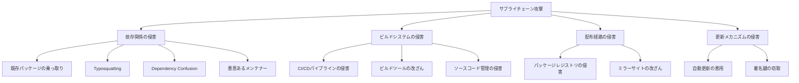
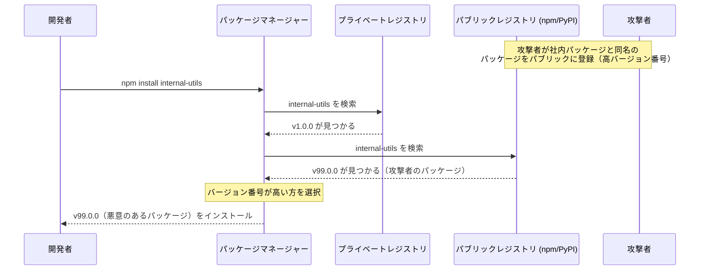
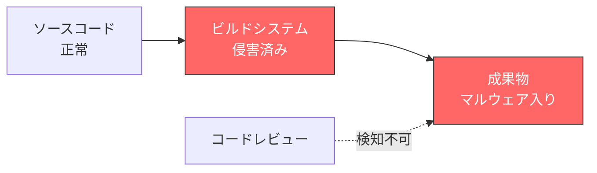
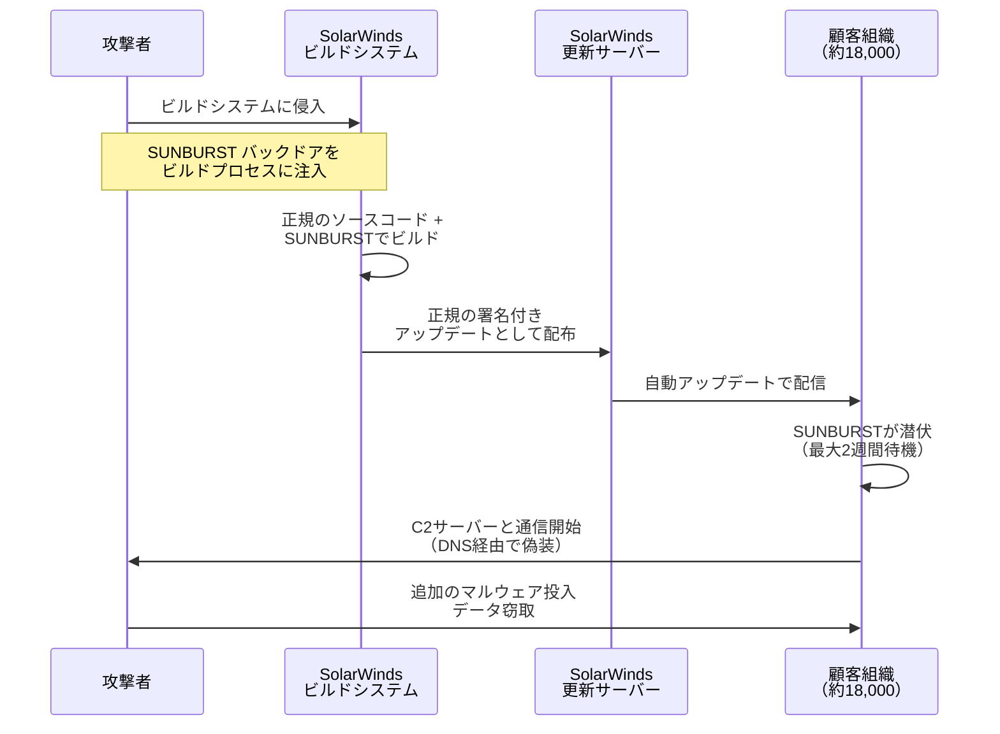
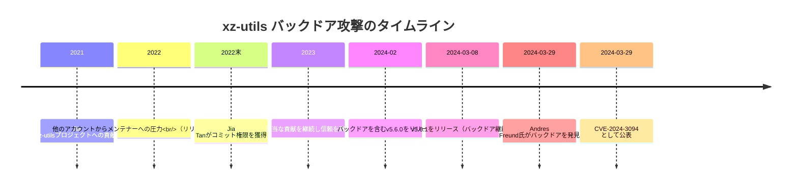
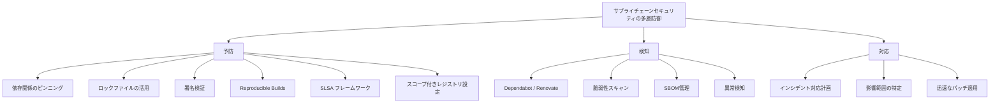
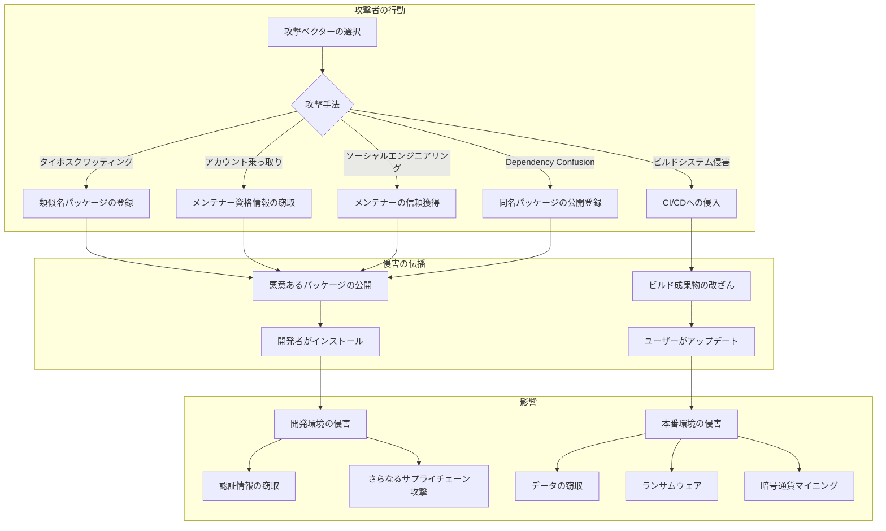

# サプライチェーン攻撃 — ソフトウェアの信頼の連鎖を断つ脅威

## 1. 背景と動機

### 1.1 現代のソフトウェア開発と依存関係の爆発

現代のソフトウェアは、ゼロからすべてを構築することはない。npmには200万以上のパッケージが、PyPIには50万以上のパッケージが存在し、開発者はこれらのオープンソースライブラリを組み合わせることで生産性を飛躍的に向上させてきた。一般的なWebアプリケーションが直接依存するパッケージは数十から数百に及び、推移的依存関係（依存先がさらに依存するパッケージ）まで含めると、数千のパッケージに依存していることも珍しくない。

この依存関係の連鎖は、巨大な「信頼の連鎖」を形成している。あるパッケージを `npm install` するとき、開発者はそのパッケージの作者だけでなく、そのパッケージが依存するすべてのパッケージの作者、さらにはそれらのパッケージが公開されているレジストリ、ビルドシステム、CI/CDパイプライン——これらすべてを暗黙的に信頼していることになる。

### 1.2 攻撃対象としてのサプライチェーン

従来のサイバー攻撃は、ターゲットとなるシステムを直接攻撃するのが一般的であった。ファイアウォールを突破し、脆弱性を悪用し、直接的にシステムに侵入する。しかし、ターゲットのセキュリティが強化されるにつれ、攻撃者はより巧妙なアプローチを取るようになった。それが「サプライチェーン攻撃」である。

サプライチェーン攻撃とは、ソフトウェアの開発・配布・更新の過程（サプライチェーン）のいずれかの段階に悪意のあるコードを注入し、最終的にターゲットのシステムに到達させる攻撃手法である。正規のソフトウェアやアップデートに紛れ込むため、従来のセキュリティ対策では検知が極めて困難である。

### 1.3 なぜサプライチェーン攻撃が増加しているのか

サプライチェーン攻撃が近年急増している背景には、いくつかの構造的要因がある。

**レバレッジ効果**: 広く利用されているライブラリやツールを一つ侵害するだけで、そのライブラリを利用するすべてのプロジェクトに影響を及ぼすことができる。SolarWinds攻撃では、一つのソフトウェアの侵害によって約18,000の組織が影響を受けた。

**信頼の悪用**: 正規のソフトウェアベンダーや信頼されたオープンソースプロジェクトを経由するため、エンドユーザーは受け取ったソフトウェアを疑う理由がない。デジタル署名すら正規のものが付与されている場合がある。

**検知の困難さ**: 悪意のあるコードは正規のコードベースに巧みに隠蔽されるか、ビルドプロセスの途中で注入されるため、ソースコードレビューでは発見できないことが多い。

**オープンソースの構造的脆弱性**: 多くの重要なオープンソースプロジェクトが、少数の（時にはたった一人の）メンテナーによって維持されている。リソース不足のメンテナーが悪意ある貢献者に騙されるリスクは常に存在する。

## 2. 攻撃ベクターの分類

サプライチェーン攻撃は、ソフトウェアのライフサイクルのあらゆる段階で発生しうる。以下に主要な攻撃ベクターを整理する。



### 2.1 依存関係の侵害

#### 既存パッケージの乗っ取り（Account Takeover）

最も直接的な手法は、人気のあるパッケージのメンテナーアカウントを乗っ取り、悪意のあるコードを含むバージョンを公開することである。メンテナーのnpmアカウントのパスワードが弱い、または二要素認証（2FA）が未設定である場合、攻撃者がアカウントを奪取してパッケージを改ざんする。

もう一つのパターンは、ソーシャルエンジニアリングである。メンテナーに対して長期間にわたって信頼を構築し、コミット権限を獲得した上で悪意のあるコードを紛れ込ませる。xz-utils事件（後述）はこのパターンの典型例である。

#### Typosquatting（タイポスクワッティング）

タイポスクワッティングは、人気パッケージの名前に似た名前のパッケージを登録し、開発者のタイプミスを利用して悪意のあるパッケージをインストールさせる手法である。

```
正規パッケージ          タイポスクワット例
-------------------------------------------------
lodash                 lodahs, lodashs, 1odash
express                expres, expresss, xpress
react                  reactt, reacct, raect
requests (Python)      reqeusts, request, requets
```

この攻撃は驚くほど効果的である。2017年のある調査では、npmに登録された偽パッケージが数週間で数万回ダウンロードされたことが報告されている。パッケージ名を手入力する開発者が多いこと、そしてインストール時にパッケージの中身を確認する習慣がないことが、この攻撃を容易にしている。

#### Dependency Confusion（依存関係混同攻撃）

2021年にAlex Birsan氏が発表したこの攻撃手法は、パッケージマネージャーの名前解決の仕組みを悪用する。多くの企業は社内専用のプライベートパッケージレジストリを持っている。問題は、パッケージマネージャーがプライベートレジストリとパブリックレジストリの両方を検索する際の優先順位にある。



Birsan氏はこの手法を用いて、Apple、Microsoft、PayPalなど35社以上の企業の内部システムでコード実行に成功し、バグバウンティプログラムを通じて13万ドル以上の報奨金を獲得した。

攻撃の核心は、パブリックレジストリに同名のパッケージをより高いバージョン番号で登録するだけという単純さにある。多くのパッケージマネージャーはデフォルトで「より高いバージョン番号を優先する」という挙動を取るため、攻撃者のパッケージが正規のプライベートパッケージよりも優先されてしまう。

#### 悪意のあるメンテナーへの権限移譲

オープンソースプロジェクトのメンテナーがバーンアウト（燃え尽き症候群）に陥ることは珍しくない。そのようなメンテナーに対して「手伝いたい」と善意を装って近づき、徐々にプロジェクトの権限を獲得していく手法がある。権限を得た後、悪意のあるコードを含むリリースを行う。

event-stream事件（後述）はまさにこのパターンであり、メンテナーが管理を引き継ぎたいと申し出た人物にプロジェクトを委譲したところ、その人物が暗号通貨ウォレットを窃取するコードを注入した。

### 2.2 ビルドシステムの侵害

ソースコードが正当であっても、ビルドプロセスが侵害されれば最終成果物に悪意のあるコードが含まれうる。この攻撃ベクターは特に検知が難しい。ソースコードをレビューしても発見できないからである。



CI/CDパイプライン（GitHub Actions、Jenkins、GitLab CIなど）は、コードのビルド、テスト、デプロイを自動化する。このパイプラインが侵害されると、ビルド時に任意のコードを注入できる。SolarWinds攻撃はビルドシステムの侵害の典型例であり、ソースコードリポジトリには悪意のあるコードは存在せず、ビルドプロセスの途中でマルウェアが注入されていた。

Codecov事件（後述）もビルドシステムの侵害の一種である。コードカバレッジツールのBashスクリプトが改ざんされ、CI/CD環境の環境変数（シークレット、APIキーなど）が攻撃者に送信されていた。

### 2.3 配布経路の侵害

パッケージレジストリ自体が侵害されるケースも存在する。レジストリのインフラストラクチャに脆弱性がある場合、攻撃者はパッケージの内容を直接書き換えることが可能である。また、CDNやミラーサイトが侵害され、ユーザーがダウンロードするバイナリが攻撃者のものとすり替えられるケースもある。

### 2.4 更新メカニズムの侵害

ソフトウェアの自動更新メカニズムは、最新のセキュリティパッチを迅速に適用するために不可欠だが、攻撃者にとっても魅力的なターゲットである。正規の更新チャネルを通じてマルウェアを配布できれば、ユーザーは疑うことなくインストールする。

更新サーバーの侵害、更新パッケージへの署名に用いる鍵の窃取、更新チェック時のMITM（中間者）攻撃など、複数の攻撃手法が存在する。SolarWinds攻撃では、侵害されたビルドシステムから生成されたバイナリが正規の署名を付与された上で、正規の更新サーバーを通じて配布された。

## 3. 実際のインシデント

### 3.1 event-stream事件（2018年）

#### 概要

`event-stream`は、Node.jsにおけるストリーム処理のユーティリティライブラリで、週に数百万回ダウンロードされる人気パッケージであった。オリジナルのメンテナーであるDominic Tarr氏は、既にこのパッケージを積極的にメンテナンスしていなかった。

2018年9月、「right9ctrl」というユーザーがメンテナンス権限の移譲を申し出た。Tarr氏は申し出を受け入れ、npmの公開権限を付与した。right9ctrlは新たな依存関係として`flatmap-stream`パッケージを追加した。このパッケージには、特定条件下でのみ発動する暗号通貨ウォレット窃取コードが巧妙に難読化されて含まれていた。

#### 攻撃の巧妙さ

攻撃コードは二重の難読化が施されていた。まず、`flatmap-stream`のminified（圧縮済み）コードの末尾に暗号化されたペイロードが隠されていた。このペイロードは、AES-256-CFBで暗号化されており、復号鍵はターゲットとなるアプリケーション（BitPayのCopay暗号通貨ウォレット）の`description`フィールドから導出されていた。

つまり、ターゲットアプリケーション以外の環境では復号に失敗するため、攻撃コードは一切動作しない。この選択的な発動メカニズムにより、汎用的なセキュリティスキャンでは発見が極めて困難であった。

#### 教訓

- オープンソースにおけるメンテナー引き継ぎの信頼モデルの脆弱性
- 推移的依存関係の危険性（`event-stream`を使うプロジェクトは`flatmap-stream`の存在すら知らない）
- minifiedコードのレビューの困難さ

### 3.2 SolarWinds Orion攻撃（2020年）

#### 概要

2020年12月に発覚したSolarWinds攻撃は、サプライチェーン攻撃の歴史において最も影響の大きいインシデントの一つである。SolarWindsは、IT管理ソフトウェア「Orion」を提供する企業で、Fortune 500企業の多くや米国政府機関を含む約30万の顧客を持っていた。

攻撃者（ロシアの国家支援型攻撃グループ「Nobelium」/APT29と推定）は、SolarWindsのビルドシステムに侵入し、Orionのビルドプロセスに「SUNBURST」と名付けられたバックドアを注入した。



#### 攻撃の特徴

**ビルドプロセスの侵害**: ソースコードリポジトリには直接的な悪意のあるコードは存在しなかった。マルウェアはビルドパイプラインの途中で注入されたため、ソースコードレビューでは発見不可能であった。

**正規の署名**: ビルドされたバイナリにはSolarWindsの正規のコード署名証明書が付与されていたため、改ざん検知システムは反応しなかった。

**高度な回避技術**: SUNBURSTは最大2週間の潜伏期間を持ち、サンドボックス環境やセキュリティ分析ツールが動作している環境では活動を停止した。C2（Command and Control）通信はDNSリクエストに偽装され、通常のネットワークトラフィックに紛れ込んでいた。

**選択的な攻撃**: 約18,000の組織がバックドア入りのアップデートをインストールしたが、攻撃者が実際に追加の攻撃を行ったのは約100組織程度と推定されている。ターゲットを絞り込むことで、発覚リスクを最小化した。

#### 影響

米国財務省、商務省、国土安全保障省を含む複数の政府機関、Microsoft、FireEye（現Mandiant）などの大手IT企業が影響を受けた。この事件は、ソフトウェアサプライチェーンのセキュリティに対する意識を劇的に変え、米国バイデン大統領による「国家のサイバーセキュリティ改善に関する大統領令」（EO 14028、2021年5月）の直接的な契機となった。

### 3.3 Codecov Bash Uploaderインシデント（2021年）

#### 概要

Codecovは、コードカバレッジの可視化ツールとして広く利用されていた。ユーザーはCI/CDパイプラインにBash Uploaderスクリプトを組み込み、テストカバレッジの結果をCodecovサービスに送信する。

2021年1月末から4月初旬にかけて、攻撃者はCodecovのDockerイメージ作成プロセスの脆弱性を悪用し、Bash Uploaderスクリプト（`codecov-bash`）を改ざんした。改ざんされたスクリプトには、CI/CD環境の環境変数（リポジトリトークン、APIキー、AWSのクレデンシャルなど）を攻撃者のサーバーに送信するコードが1行追加されていた。

#### 攻撃の影響

このスクリプトは多くの企業のCI/CDパイプラインに組み込まれていたため、影響は広範囲に及んだ。攻撃者はCI/CD環境から窃取したクレデンシャルを使って、さらに別のシステムへの侵入を試みた（サプライチェーン攻撃の連鎖）。Twitch、Hashicorp、Confluent、Twilioなどが影響を受けたことを公表した。

#### 教訓

- CI/CDパイプラインで外部スクリプトを直接実行する危険性
- `curl https://example.com/script.sh | bash` パターンの根本的な脆弱性
- CI/CD環境のシークレット管理の重要性

### 3.4 ua-parser-js事件（2021年）

#### 概要

`ua-parser-js`は、User-Agentヘッダーを解析するJavaScriptライブラリで、週に数百万回ダウンロードされるnpmパッケージである。2021年10月、メンテナーのnpmアカウントが乗っ取られ、暗号通貨マイナーとパスワード窃取マルウェアが含まれたバージョン（0.7.29、0.8.0、1.0.0）が公開された。

この事件は、アカウント乗っ取りによるサプライチェーン攻撃の典型例であり、npmにおける2FA（二要素認証）の義務化を加速させるきっかけとなった。影響を受けたバージョンはわずか数時間で発見・削除されたが、その間に多数のプロジェクトが影響を受けた。

### 3.5 xz-utils バックドア事件（2024年）

#### 概要

2024年3月、xz-utilsのバージョン5.6.0および5.6.1に高度なバックドアが発見された。xz-utilsはLinuxシステムで広く使用されるデータ圧縮ツールであり、多くのLinuxディストリビューションに含まれている。

#### 攻撃の経緯

この攻撃は、その計画性と長期性において前例のないものであった。攻撃者「Jia Tan」（JiaT75）は、2021年から約2年半にわたってxz-utilsプロジェクトに正当な貢献を行い、メンテナーとしての信頼を構築した。



攻撃の巧みな点は、まず複数のソックパペット（偽装アカウント）を使ってオリジナルメンテナーに「メンテナンスが遅い」と圧力をかけ、Jia Tanへの権限移譲を促したことである。権限取得後も、すぐにはバックドアを仕込まず、長期間にわたって正当な貢献を続けることで信頼を確立した。

#### バックドアの技術的詳細

バックドア自体も極めて巧妙であった。ソースコードリポジトリには直接的な悪意のあるコードは存在せず、テストファイルに偽装されたバイナリデータ（`tests/files/bad-3-corrupt_lzma2.xz` と `tests/files/good-large_compressed.lzma`）と、ビルドスクリプトの微妙な変更を組み合わせて、ビルド時にのみバックドアが有効化される仕組みであった。

バックドアの最終的な目的は、sshdプロセスに注入されるlibsystemdがxz/liblzmaをリンクしていることを利用して、SSH認証プロセスにフックを仕掛けることであった。これにより、攻撃者は特定の秘密鍵を持つSSH接続で、認証をバイパスして任意のコマンドを実行できるようになる——事実上のリモートコード実行バックドアである。

#### 発見の経緯

MicrosoftのエンジニアであるAndres Freund氏が、sshdプロセスの異常なCPU使用率とログイン時の微細な遅延（約500ミリ秒）に気づいたことがきっかけで発見された。彼の徹底的な調査により、liblzmaに注入されたバックドアが特定された。Freund氏の鋭い観察眼がなければ、このバックドアは主要なLinuxディストリビューションの安定版に取り込まれ、世界中のサーバーに影響を及ぼしていた可能性がある。

#### 教訓

- オープンソースの信頼モデルの根本的な脆弱性
- 長期的なソーシャルエンジニアリングの脅威
- ビルドプロセスに依存するバックドアはソースコードレビューでは発見困難
- 重要インフラストラクチャを担うプロジェクトのメンテナーへの支援の必要性
- ソフトウェア成果物の再現性（Reproducible Builds）の重要性

## 4. SBOM（Software Bill of Materials）

### 4.1 SBOMとは何か

サプライチェーン攻撃に対する防御の第一歩は、「自分のソフトウェアが何に依存しているかを正確に把握すること」である。SBOM（Software Bill of Materials、ソフトウェア部品表）は、ソフトウェアを構成するすべてのコンポーネント（ライブラリ、フレームワーク、ツールなど）の一覧を機械可読な形式で記述したドキュメントである。

製造業における「部品表（BOM）」の概念をソフトウェアに適用したもので、ソフトウェアの「成分表示」とも言える。SBOMには以下の情報が含まれる。

- コンポーネント名とバージョン
- コンポーネントの供給元（パッケージレジストリ、リポジトリURL等）
- ライセンス情報
- 依存関係のグラフ（直接依存と推移的依存）
- コンポーネントの一意な識別子（CPE、PURLなど）
- ハッシュ値（完全性の検証用）

### 4.2 SBOMが必要な理由

SBOMの必要性は、Log4Shell脆弱性（CVE-2021-44228）の発覚時に痛感された。2021年12月にApache Log4j 2の重大な脆弱性が公表された際、多くの組織は「自分たちのシステムのどこでLog4jが使われているか」を把握できず、脆弱性対応に膨大な時間を費やした。直接的な依存関係だけでなく、推移的依存関係や組み込みコンポーネントとしてLog4jを含むソフトウェアが多数存在したためである。

SBOMがあれば、「Log4j 2.x が含まれるコンポーネント」を即座に検索でき、影響範囲を迅速に特定できる。

### 4.3 主要なSBOMフォーマット

#### SPDX（Software Package Data Exchange）

SPDXは、Linux Foundationが管理するSBOMの標準フォーマットである。2021年にISO/IEC 5962として国際標準に認定された。もともとはライセンスコンプライアンスの目的で開発されたが、セキュリティ用途にも拡張されている。

SPDXはJSON、XML、YAML、Tag-Value、RDFなど複数のシリアライゼーション形式をサポートする。以下はSPDX（JSON形式）の概略例である。

```json
{
  "spdxVersion": "SPDX-2.3",
  "dataLicense": "CC0-1.0",
  "SPDXID": "SPDXRef-DOCUMENT",
  "name": "my-application",
  "packages": [
    {
      "SPDXID": "SPDXRef-Package-express",
      "name": "express",
      "versionInfo": "4.18.2",
      "supplier": "Organization: OpenJS Foundation",
      "downloadLocation": "https://registry.npmjs.org/express/-/express-4.18.2.tgz",
      "licenseConcluded": "MIT",
      "checksums": [
        {
          "algorithm": "SHA256",
          "checksumValue": "a1b2c3d4..."
        }
      ],
      "externalRefs": [
        {
          "referenceCategory": "PACKAGE-MANAGER",
          "referenceType": "purl",
          "referenceLocator": "pkg:npm/express@4.18.2"
        }
      ]
    }
  ],
  "relationships": [
    {
      "spdxElementId": "SPDXRef-DOCUMENT",
      "relationshipType": "DESCRIBES",
      "relatedSpdxElement": "SPDXRef-Package-express"
    }
  ]
}
```

#### CycloneDX

CycloneDXは、OWASPが開発したSBOMフォーマットで、セキュリティの観点からの設計が特徴である。脆弱性情報（VEX: Vulnerability Exploitability eXchange）との統合が容易であり、ソフトウェアの脆弱性が自組織に実際に影響するかどうかを記述できる。JSON、XML、Protocol Buffersでのシリアライゼーションに対応している。

CycloneDXは、SBOMだけでなく、HBOM（Hardware Bill of Materials）、OBOM（Operations Bill of Materials）、SaaSBOM（Software as a Service BOM）など、拡張的な用途もカバーしている。

### 4.4 SBOMの生成と管理

SBOMの生成は、パッケージマネージャーのロックファイル（`package-lock.json`、`Pipfile.lock`、`Cargo.lock`など）やビルドシステムの出力から自動的に行うのが一般的である。主要なツールとしては以下がある。

- **Syft**（Anchore）: コンテナイメージやファイルシステムからSBOMを生成
- **Trivy**（Aqua Security）: 脆弱性スキャンとSBOM生成を統合
- **CycloneDX CLI**: CycloneDX形式のSBOM生成
- **SPDX Tools**: SPDX形式のSBOM操作ツール群
- **GitHub Dependency Graph**: GitHubが提供する依存関係の可視化と自動SBOM生成

米国の大統領令EO 14028により、2022年以降、米国連邦政府に納入するソフトウェアにはSBOMの提供が要求されるようになった。この流れは民間にも波及しつつあり、SBOMはソフトウェアセキュリティの標準的なプラクティスとなりつつある。

## 5. 防御策

サプライチェーン攻撃に対する完全な防御は存在しないが、多層的な対策を組み合わせることで、リスクを大幅に低減できる。



### 5.1 依存関係のピンニングとロックファイル

#### バージョンピンニング

依存関係のバージョンを特定のバージョンに固定（ピンニング）することで、意図しないバージョンのインストールを防ぐ。

```json
// package.json - 良い例
{
  "dependencies": {
    "express": "4.18.2",
    "lodash": "4.17.21"
  }
}

// package.json - 危険な例
{
  "dependencies": {
    "express": "^4.18.2",   // 4.x の最新にアップデートされる
    "lodash": "~4.17.21",   // 4.17.x の最新にアップデートされる
    "debug": "*"            // あらゆるバージョンが対象
  }
}
```

ただし、バージョンピンニングだけでは不十分である。推移的依存関係（依存先の依存先）のバージョンまでは制御できないからである。

#### ロックファイル

ロックファイルは、直接依存と推移的依存の両方を含むすべての依存関係の正確なバージョンとハッシュ値を記録する。これにより、開発環境とCI/CD環境で完全に同一の依存関係ツリーを再現できる。

- npm: `package-lock.json`
- Yarn: `yarn.lock`
- pnpm: `pnpm-lock.yaml`
- Python (pip): `requirements.txt`（`pip freeze` で生成）+ ハッシュ
- Python (Poetry): `poetry.lock`
- Rust: `Cargo.lock`
- Go: `go.sum`

**ロックファイルはバージョン管理システムに必ずコミットすべきである**。ロックファイルが `.gitignore` に含まれていたり、CI/CDでロックファイルを無視して `npm install` を実行したりすると、ピンニングの効果が失われる。

### 5.2 署名検証とSigstore

#### パッケージ署名の意義

パッケージの署名検証は、ダウンロードしたパッケージが正規の作者によって作成され、改ざんされていないことを確認するための仕組みである。Linuxディストリビューションのパッケージマネージャー（apt、dnf等）ではGPG署名による検証が標準的に行われてきた。

しかし、npm、PyPI、RubyGemsなどの言語パッケージレジストリでは、署名が普及していなかった。鍵管理の煩雑さ、PKI（公開鍵基盤）の欠如、開発者体験の悪さが障壁であった。

#### Sigstore

Sigstoreは、この問題を解決するために生まれたプロジェクトである。Linux Foundationの下で開発され、ソフトウェアの署名・検証を容易にすることを目指している。

Sigstoreの主要コンポーネントは以下の通りである。

- **Cosign**: コンテナイメージやアーティファクトの署名・検証ツール
- **Fulcio**: 短寿命の署名用証明書を発行するCA（認証局）。OpenID Connect（OIDC）による身元確認を行い、開発者のメールアドレスやGitHubアカウントと紐づけた証明書を発行する
- **Rekor**: 署名に関する情報を記録する改ざん不能な透明性ログ。誰が、いつ、何に署名したかの記録が永続的に保持される

Sigstoreの革新的な点は、「キーレス署名」を実現したことである。開発者は長期的な秘密鍵を管理する必要がなく、OIDCプロバイダー（Google、GitHub、Microsoftなど）の認証情報を使って一時的な署名鍵を取得し、署名後すぐに鍵を破棄できる。鍵の漏洩リスクを根本的に排除する設計である。

npmはバージョン9.5.0以降でSigstoreベースの来歴情報（provenance）の生成をサポートしており、PyPIもSigstoreベースの署名を導入しつつある。

### 5.3 Reproducible Builds（再現可能ビルド）

Reproducible Builds（再現可能ビルド）とは、同一のソースコードから、誰がどの環境でビルドしても、バイト単位で同一のバイナリが生成されることを保証する手法である。

SolarWinds攻撃やxz-utils事件のように、ビルドプロセスが侵害される攻撃に対する根本的な対策となる。第三者が独立にソースコードからビルドを行い、公式に配布されたバイナリと比較することで、ビルドプロセスでの改ざんを検知できる。

再現可能ビルドを実現するためには、以下の非決定性の源を排除する必要がある。

- タイムスタンプの埋め込み
- ファイルシステムの走査順序
- 並列ビルドの実行順序
- コンパイラのバージョンとオプション
- 環境変数やロケール設定

Debian、Arch Linux、NixOS、FreeBSDなどのプロジェクトは、再現可能ビルドの実現に積極的に取り組んでいる。Debianは2023年時点で約95%のパッケージが再現可能にビルドできると報告している。

### 5.4 SLSA（Supply chain Levels for Software Artifacts）

SLSA（「サルサ」と発音）は、Googleが提唱し、OpenSSF（Open Source Security Foundation）が管理するサプライチェーンセキュリティのフレームワークである。ソフトウェアアーティファクトの完全性を段階的に保証するための基準を定義している。

SLSAは4つのレベルを定義している。

| レベル | 要件 | 保護対象 |
|--------|------|----------|
| SLSA 1 | ビルドプロセスの文書化。来歴（provenance）情報の生成 | ビルドプロセスの不透明さ |
| SLSA 2 | ホストされたビルドサービスの使用。来歴情報の署名 | ビルド環境の改ざん |
| SLSA 3 | 強化されたビルドプラットフォーム。来歴情報が改ざん不能 | ビルドプロセスへの内部者攻撃 |
| SLSA 4 | 二者によるレビュー。Hermetic（外部依存なし）ビルド。再現可能ビルド | 高度な持続的脅威（APT） |

SLSAの「来歴情報（provenance）」は、以下のような質問に答えるものである。

- このアーティファクトはどのソースコードからビルドされたか？
- どのビルドシステムで、どのようなパラメータでビルドされたか？
- ビルドプロセスで使用された依存関係は何か？

GitHub Actionsは、SLSA Level 3の来歴情報を生成するためのreusable workflowを公式に提供している。npmパッケージの来歴情報も、このGitHub Actionsワークフローを通じて生成される。

### 5.5 Dependabot / Renovate

依存関係の自動更新ツールは、サプライチェーンセキュリティにおいて重要な役割を果たす。

**Dependabot**はGitHubが提供するツールで、プロジェクトの依存関係を監視し、セキュリティアップデートや新バージョンが利用可能になった際に、自動的にPull Requestを作成する。特にセキュリティアドバイザリ（GitHub Advisory Database）と連動し、既知の脆弱性を含む依存関係を検出してアラートを発する機能が重要である。

**Renovate**はオープンソースの依存関係更新ツールで、Dependabotよりも柔軟な設定が可能である。グループ化（関連する更新をまとめて一つのPull Requestにする）、自動マージ（テストが通れば自動的にマージする）、カスタムルール（特定のパッケージの更新頻度を制限する）などの高度な機能を持つ。

これらのツールの最も重要な貢献は、「依存関係の更新を日常的なプラクティスにする」ことである。依存関係の更新が遅れるほど、既知の脆弱性に晒される期間が長くなり、また大幅なバージョンアップによる破壊的変更への対応も困難になる。小刻みに更新を行うことが、セキュリティと安定性の両面で最善の戦略である。

### 5.6 Dependency Confusion攻撃への対策

Dependency Confusion攻撃に対しては、以下の対策が有効である。

**スコープ付きパッケージの使用**: npmでは `@company/package-name` のようにスコープを付けることで、パブリックレジストリでの名前衝突を防げる。

**パッケージレジストリの優先順位設定**: `.npmrc` や `pip.conf` でプライベートレジストリのみを参照するよう設定する。

```ini
# .npmrc - プライベートレジストリの設定例
@mycompany:registry=https://npm.mycompany.com/
# パブリックレジストリのフォールバックを無効化
```

**名前空間の予約**: 社内パッケージと同名のプレースホルダーパッケージをパブリックレジストリに登録する。

## 6. パッケージレジストリのセキュリティ対策

### 6.1 npm

npmは世界最大のパッケージレジストリであり、サプライチェーン攻撃の主要なターゲットでもある。GitHub（Microsoft）の傘下となった後、以下のセキュリティ対策が導入されている。

**必須2FA**: 週間ダウンロード数が100万を超える人気パッケージ、または500以上の依存先を持つパッケージのメンテナーには、2FAが義務化されている。

**npm provenance（来歴情報）**: 前述のSigstoreベースの来歴情報により、パッケージがどのソースコードリポジトリから、どのCI/CDシステムでビルドされたかを検証できる。`npm audit signatures` コマンドで検証が可能。

**npm audit**: プロジェクトの依存関係に含まれる既知の脆弱性を検出する。GitHub Advisory Databaseと連動している。

**ソケットAIセキュリティ**: npm向けにSocket.devが提供するツールは、パッケージの振る舞い分析（ネットワークアクセス、ファイルシステム操作、環境変数の読み取り等）を行い、サプライチェーンリスクを検出する。

### 6.2 PyPI

PyPI（Python Package Index）もサプライチェーン攻撃の標的となることが多い。

**Trusted Publishers**: GitHubActions等のCI/CDサービスと連携し、パッケージのアップロードをAPIトークンではなくOIDCベースの認証で行う仕組み。CI/CD環境外からのパッケージ公開を防止できる。

**必須2FA**: 組織アカウントと重要プロジェクトに対する2FAの義務化が段階的に進められている。

**マルウェアスキャン**: アップロードされたパッケージを自動的にスキャンし、既知のマルウェアパターンを検出する。

**プロジェクト名のタイポスクワッティング検知**: 人気パッケージと類似した名前のパッケージ登録を検出する仕組みが導入されている。

### 6.3 crates.io

Rustのパッケージレジストリであるcrates.ioは、いくつかの設計上の利点を持つ。

**パッケージの削除不可（yanking）**: crates.ioでは、一度公開されたバージョンのクレート（パッケージ）を完全に削除することはできず、「yank」（新規の依存関係解決から除外）のみが可能。これにより、既存のプロジェクトのビルドが突然壊れることを防いでいる（left-padのような事態の防止）。

**ソースコード公開の義務**: crates.ioはソースコード付きでパッケージを公開することが必須であり、バイナリのみの配布は許可されていない。これにより、コードレビューが容易になる。

**crates.io トークンのスコープ制限**: APIトークンにスコープ（特定のクレートのみへのアクセス権限、有効期限など）を設定できる。

**Cargo の依存関係解決**: Cargoは `Cargo.lock` による完全な依存関係固定をサポートし、ビルドの再現性を確保する。

## 7. OpenSSFの取り組み

### 7.1 OpenSSFとは

OpenSSF（Open Source Security Foundation）は、Linux Foundation傘下のプロジェクトで、オープンソースソフトウェアのセキュリティ向上を目的としている。Google、Microsoft、Amazon、GitHub、Intel、Red Hatなど多くの企業が参加している。

### 7.2 主要なイニシアティブ

#### OpenSSF Scorecard

OpenSSF Scorecardは、オープンソースプロジェクトのセキュリティプラクティスを自動的に評価するツールである。以下のようなチェック項目を評価する。

- ブランチ保護の設定（直接プッシュの禁止、レビュー必須など）
- CI/CDの使用状況
- 依存関係のピンニング
- コード署名の実施
- 脆弱性開示ポリシーの有無
- メンテナーの活動状況
- 既知の脆弱性の有無

各項目は0-10のスコアで評価され、プロジェクトの全体的なセキュリティ姿勢を可視化する。

#### Alpha-Omega プロジェクト

Alpha-Omegaは、オープンソースのセキュリティ向上に直接的な支援を提供するプロジェクトである。「Alpha」は最も重要なオープンソースプロジェクトへの集中的なセキュリティ支援を、「Omega」は広範なオープンソースエコシステム全体のセキュリティ向上を目指す。

具体的には、重要プロジェクトのセキュリティ監査、メンテナーへの資金提供、自動セキュリティ分析ツールの開発などを行っている。

#### パッケージ分析プロジェクト

OpenSSFのパッケージ分析プロジェクトは、npm、PyPI等のパッケージレジストリにアップロードされるパッケージの動的分析を行う。パッケージをサンドボックス環境で実行し、ネットワーク通信、ファイルシステム操作、プロセス実行などの振る舞いを監視する。悪意のあるパッケージがインストール時に外部サーバーと通信したり、ファイルをダウンロードしたりする行動を検出する。

#### GUAC（Graph for Understanding Artifact Composition）

GUACは、SBOM、脆弱性情報、SLSA来歴情報など、ソフトウェアサプライチェーンに関する多様なデータソースを統合し、グラフデータベースとして提供するプロジェクトである。「このソフトウェアは、この脆弱性を含むライブラリのこのバージョンに依存しているか？」といった複雑なクエリに対して、高速に回答できる基盤を提供する。

## 8. 攻撃フローの全体像

ここで、サプライチェーン攻撃の典型的なフローを改めて整理する。



## 9. 実践的な防御チェックリスト

組織やプロジェクトでサプライチェーンセキュリティを強化するための実践的なチェックリストを以下に示す。

### 依存関係管理

- ロックファイルをバージョン管理にコミットしている
- CI/CDでロックファイルに基づくインストール（`npm ci`、`pip install --require-hashes` 等）を使用している
- 依存関係の定期的な更新プロセス（Dependabot/Renovate）を導入している
- 新たな依存関係の追加時にセキュリティレビューを実施している
- 不要な依存関係を定期的に削除している

### ビルドとリリース

- CI/CDパイプラインで使用するアクション/プラグインのバージョンをハッシュでピンニングしている
- ビルド環境の設定をコードとして管理（Infrastructure as Code）している
- リリースアーティファクトに署名を付与している
- SLSA来歴情報を生成している
- 可能であればReproducible Buildsを実現している

### アカウントセキュリティ

- パッケージレジストリのアカウントに2FAを設定している
- APIトークンに最小権限の原則を適用している
- APIトークンに有効期限を設定している
- 退職者や異動者のアクセス権限を速やかに失効させている

### 監視と対応

- SBOMを生成・管理している
- 脆弱性データベース（NVD、GitHub Advisory Database等）を継続的に監視している
- インシデント対応計画にサプライチェーン攻撃のシナリオを含めている
- 依存関係の異常な変更（新しいネットワークアクセス、postinstallスクリプトの追加等）を検知する仕組みがある

## 10. 今後の展望

### 10.1 残された課題

サプライチェーンセキュリティは急速に進歩しているが、解決されていない課題も多い。

**メンテナーの持続可能性**: xz-utils事件が示したように、重要なオープンソースプロジェクトのメンテナーが十分な支援を受けていない状況は、根本的な脆弱性である。技術的な対策だけでなく、メンテナーへの経済的支援やコミュニティの健全性の維持が不可欠である。GitHub Sponsorsやtidelift等のプラットフォームが部分的な解決策を提供しているが、構造的な問題の解決には至っていない。

**エコシステム間の断片化**: SBOM、署名、来歴情報の標準はまだ完全には統一されておらず、異なるエコシステム（npm、PyPI、crates.io、Maven等）間での一貫したセキュリティ保証は課題として残っている。

**開発者体験とのトレードオフ**: セキュリティ対策は、往々にして開発者の生産性やユーザー体験とのトレードオフを伴う。バージョンのピンニングは安全だが、アップデートへの追従が遅れる。署名検証は完全性を保証するが、ワークフローの複雑さが増す。これらのバランスを取ることが重要である。

### 10.2 今後の方向性

**ビルドの透明性（Build Transparency）**: Sigstoreの透明性ログやSLSAの来歴情報のように、ソフトウェアのビルドプロセスを透明化する取り組みが加速するだろう。「ソースコードからバイナリまでの完全な追跡可能性」が標準になることが期待される。

**AIを活用したサプライチェーン分析**: 大規模言語モデルやパターン認識技術を用いて、悪意のあるコードの検出やパッケージの振る舞い分析を自動化する取り組みが進んでいる。ただし、AIによる分析も万能ではなく、巧妙に隠蔽された攻撃コードを完全に検出することは依然として困難である。

**ハードウェアレベルの信頼基盤**: TPM（Trusted Platform Module）やConfidential Computing技術を活用して、ビルド環境のハードウェアレベルでの完全性を保証する取り組みも進んでいる。

**規制の強化**: EU Cyber Resilience Act（EU サイバーレジリエンス法）やEO 14028のような規制が世界的に広がりつつある。SBOMの提供義務化、セキュリティアップデートの提供期間の明示など、法的な要求事項が増加するだろう。

## 11. まとめ

サプライチェーン攻撃は、現代のソフトウェアエコシステムの構造的な特性——広範な依存関係、暗黙的な信頼モデル、少数のメンテナーへの依存——を悪用する攻撃である。SolarWinds、xz-utils、event-streamなどの事件は、この脅威が理論的な可能性ではなく、現実の深刻なリスクであることを示した。

防御は多層的でなければならない。依存関係のピンニングとロックファイル、パッケージ署名とSigstore、Reproducible Builds、SLSAフレームワーク、SBOM——これらの対策を組み合わせることで、攻撃の成功確率を下げ、万一の侵害時の検知と対応を迅速化できる。

しかし、最も根本的な対策は、ソフトウェアサプライチェーンの「信頼の連鎖」を意識的に管理し、暗黙の信頼を明示的な検証に置き換えていくことである。「信頼するが、検証する」（Trust, but verify）ではなく、「検証し、それから信頼する」（Verify, then trust）——この原則がサプライチェーンセキュリティの根幹である。

OpenSSFやSigstoreといったイニシアティブは、この方向への重要な一歩である。しかし、技術的な対策だけでは不十分であり、オープンソースのメンテナーへの支援、コミュニティの健全性の維持、そしてソフトウェアセキュリティに対する組織的・文化的なコミットメントが不可欠である。サプライチェーンセキュリティは、個別の技術的対策の積み重ねではなく、エコシステム全体の課題として捉える必要がある。
