# Mutex, セマフォ, 条件変数 — 同期プリミティブの基礎

## 1. 背景と動機 — なぜ同期が必要なのか

マルチスレッドプログラミングにおいて、複数のスレッドが同一のメモリ領域に対して同時にアクセスすることは日常的に起こる。あるスレッドが変数を読み取っている最中に、別のスレッドがその変数を書き換えれば、読み取り側は整合性のないデータを受け取る可能性がある。この状況を**競合状態（Race Condition）** と呼ぶ。

### 1.1 競合状態の具体例

銀行口座の残高更新を考える。2つのスレッドが同時に残高 1000 円の口座から 500 円を引き出す処理を実行する場合を見てみよう。

```
Thread A: balance = read(account)    // balance = 1000
Thread B: balance = read(account)    // balance = 1000
Thread A: write(account, balance - 500) // account = 500
Thread B: write(account, balance - 500) // account = 500  (should be 0!)
```

本来であれば残高は 0 円になるべきだが、2つのスレッドが読み取りと書き込みの間に割り込まれることで、残高が 500 円のままとなる。これは、読み取り・計算・書き込みという一連の操作が**原子的（Atomic）** に実行されていないために発生する問題である。

### 1.2 臨界区間（Critical Section）

このような不整合を防ぐためには、共有データにアクセスするコード領域を**一度に1つのスレッドだけ**が実行できるようにする必要がある。この保護されるべきコード領域を**臨界区間（Critical Section）** と呼ぶ。

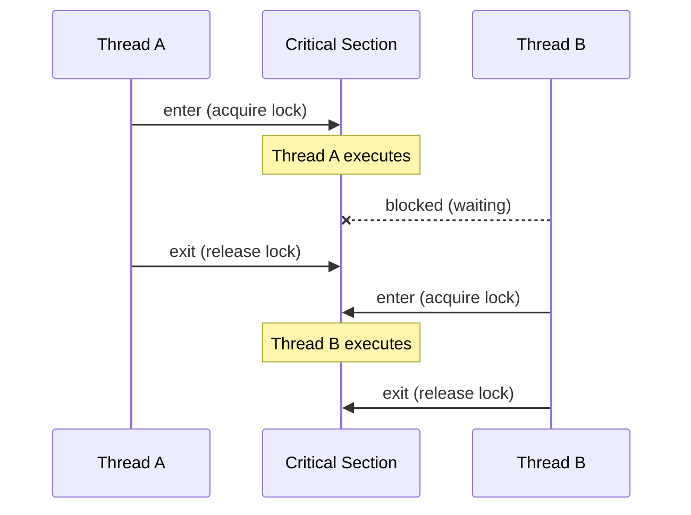

臨界区間の正しい実装には、以下の4つの性質を満たす必要がある。

1. **相互排他（Mutual Exclusion）**: 任意の時点で、臨界区間内にいるスレッドは高々1つである
2. **進行（Progress）**: 臨界区間に入りたいスレッドが存在し、かつ臨界区間内にスレッドがいない場合、有限時間内にいずれかのスレッドが臨界区間に入れる
3. **有限待ち（Bounded Waiting）**: あるスレッドが臨界区間への進入を要求してから、実際に進入するまでに、他のスレッドが臨界区間に入る回数に上限がある
4. **非忙待ち（No Busy Waiting）**（望ましい性質）: 待機中のスレッドがCPU資源を消費しない

これらの性質を実現するために考案されたのが、Mutex、セマフォ、条件変数といった**同期プリミティブ（Synchronization Primitives）** である。

### 1.3 ハードウェアによるアトミック操作

同期プリミティブの実装は、ハードウェアが提供するアトミック命令に依存する。代表的なものは以下の通りである。

- **Test-and-Set（TAS）**: メモリ位置の値を読み取り、同時に新しい値を書き込む。読み取りと書き込みが割り込まれることなく一体として実行される
- **Compare-and-Swap（CAS）**: メモリ位置の値が期待値と一致する場合にのみ新しい値を書き込む。一致しなければ何もしない。成功・失敗を返す
- **Fetch-and-Add**: メモリ位置の値を読み取り、指定した値を加算して書き戻す。元の値を返す

これらのアトミック命令は、x86 では `LOCK` プレフィックス付き命令や `CMPXCHG`、ARM では `LDXR`/`STXR`（Load-Exclusive / Store-Exclusive）として実装されている。すべてのソフトウェアレベルの同期プリミティブは、最終的にこれらのハードウェア命令の上に構築される。

## 2. Mutex（相互排他ロック）

### 2.1 Mutex の概念

**Mutex（Mutual Exclusion Lock）** は、最も基本的な同期プリミティブである。Mutex は2つの状態 ── ロック済み（locked）とアンロック済み（unlocked）── を持ち、次の2つの操作を提供する。

- **lock()（acquire）**: Mutex がアンロック状態であればロック状態にして返る。すでにロック状態であれば、アンロックされるまでスレッドをブロックする
- **unlock()（release）**: Mutex をアンロック状態にし、待機中のスレッドがあれば1つを起こす

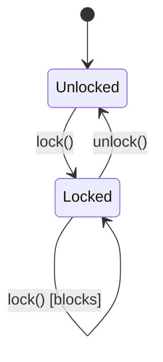

Mutex の最も重要な性質は**所有権（Ownership）** である。Mutex をロックしたスレッドだけがそれをアンロックできるという制約を課すことで、不正なアンロックを防止し、デバッグを容易にする。これはセマフォとの決定的な違いでもある。

### 2.2 Mutex の使用パターン

Mutex の典型的な使用パターンは、臨界区間をロックとアンロックで囲むことである。

```c
// C/pthread example
pthread_mutex_t mutex = PTHREAD_MUTEX_INITIALIZER;
int shared_counter = 0;

void* increment(void* arg) {
    for (int i = 0; i < 100000; i++) {
        pthread_mutex_lock(&mutex);     // enter critical section
        shared_counter++;               // safe access
        pthread_mutex_unlock(&mutex);   // exit critical section
    }
    return NULL;
}
```

ここで注意すべき点は、`lock()` と `unlock()` が必ず対になっていなければならないことである。例外やエラー処理によって `unlock()` が呼ばれないパスが存在すると、デッドロックを引き起こす。C++ では RAII（Resource Acquisition Is Initialization）パターンを用いてこの問題を回避する。

```cpp
// C++ RAII pattern
std::mutex mtx;
int shared_counter = 0;

void increment() {
    for (int i = 0; i < 100000; i++) {
        std::lock_guard<std::mutex> lock(mtx); // automatically unlocked on scope exit
        shared_counter++;
    }
}
```

### 2.3 再入可能 Mutex（Recursive Mutex）

通常の Mutex は、同一スレッドが二重にロックを取得するとデッドロックを起こす。再帰的な関数呼び出しや、複数のメソッドが同じロックを必要とする場合にこの問題が起こりうる。

**再入可能 Mutex（Recursive Mutex / Reentrant Mutex）** は、同一スレッドからの複数回のロック取得を許可する。内部でカウンタを保持し、`lock()` のたびにカウンタを増加、`unlock()` のたびに減少させ、カウンタが 0 になった時点で実際にアンロックする。

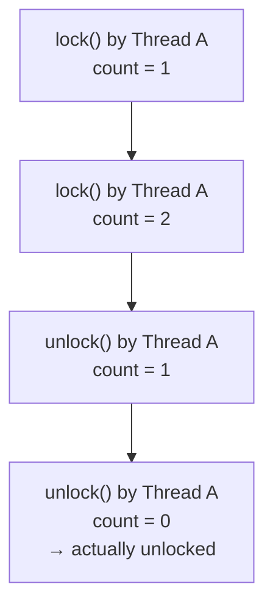

ただし、再入可能 Mutex の使用は設計上の問題を示唆していることが多い。ロックの粒度が適切でない場合や、責務の分離が不十分な場合に必要になることが多く、リファクタリングによって通常の Mutex で済むようにすることが推奨される。

### 2.4 Mutex 実装の内部

現代のOS上での Mutex 実装は、一般的に**2段階**のアプローチを取る。

1. **ユーザー空間でのアトミック操作による高速パス**: ロックが競合していない場合、カーネルへのシステムコールを発行せずにアトミック命令（CAS など）だけで完結する
2. **カーネル空間でのスリープ待機によるスローパス**: ロックが競合している場合、カーネルのスリープキューにスレッドを登録してCPUを明け渡す

Linux では、この2段階を効率的に実装するために **Futex（Fast Userspace Mutex）** という機構が使われる（詳細は後のセクションで述べる）。

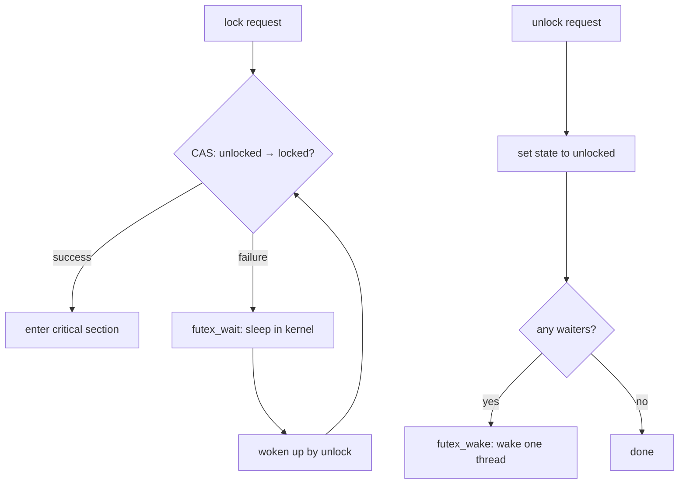

この設計により、ロックが競合していない場合（＝楽観的なケース）の性能が極めて高い。競合がない場合、Mutex の lock/unlock は数十ナノ秒で完了する。

## 3. セマフォ

### 3.1 Dijkstra の発明

**セマフォ（Semaphore）** は、1965年にオランダの計算機科学者 Edsger W. Dijkstra が提案した同期プリミティブである。鉄道の腕木式信号機（semaphore signal）になぞらえて命名された。

セマフォは非負整数のカウンタを内部に持ち、以下の2つのアトミック操作を提供する。Dijkstra はオリジナルのオランダ語で P（Proberen = 試す）と V（Verhogen = 増加する）と名付けたが、現在では `wait()` / `signal()`、あるいは `down()` / `up()` という名称が一般的である。

- **P操作（wait / down）**: カウンタが正であれば1減少させて返る。カウンタが0であれば、正になるまでスレッドをブロックする
- **V操作（signal / up）**: カウンタを1増加させる。ブロック中のスレッドがあれば1つを起こす

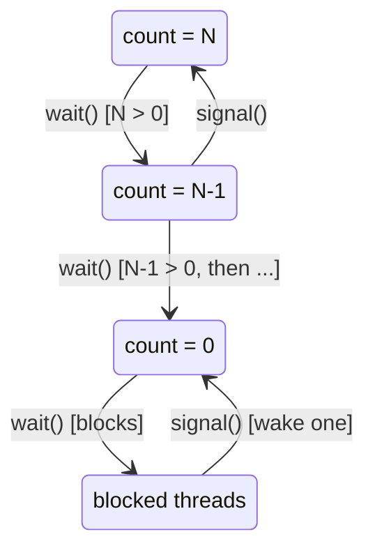

### 3.2 バイナリセマフォとカウンティングセマフォ

セマフォは初期値によって2種類に分類される。

**バイナリセマフォ（Binary Semaphore）** はカウンタの初期値が 1 であり、値は 0 と 1 のみを取る。見かけ上は Mutex と同様に動作するが、重要な違いがある。バイナリセマフォには**所有権の概念がない**。あるスレッドが `wait()` した後、別のスレッドが `signal()` することが許される。この性質は特定のシグナリングパターン（あるスレッドの完了を別のスレッドに通知するなど）で有用だが、ロックとしての使用には注意が必要である。

**カウンティングセマフォ（Counting Semaphore）** はカウンタの初期値が N（N > 1）であり、同時にN個のスレッドがリソースにアクセスすることを許可する。データベースのコネクションプールやスレッドプールなど、有限個のリソースへのアクセスを制御する場合に使用される。

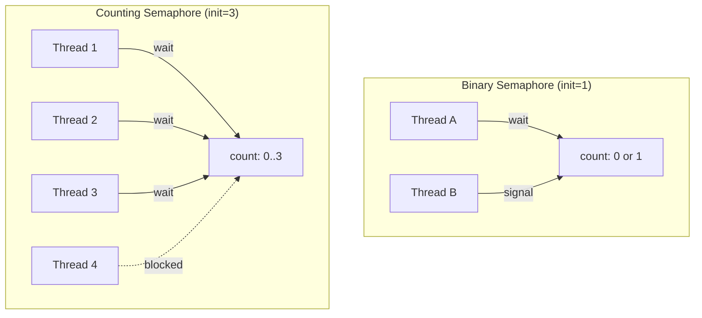

### 3.3 Mutex とバイナリセマフォの違い

Mutex とバイナリセマフォは一見似ているが、設計思想が異なる。以下にその主要な違いをまとめる。

| 特性 | Mutex | バイナリセマフォ |
|------|-------|-----------------|
| 所有権 | あり（ロックしたスレッドのみがアンロック可能） | なし（任意のスレッドが signal 可能） |
| 再入可能性 | 再入可能 Mutex が存在 | 再入可能性はない |
| 優先度継承 | サポート可能 | 通常サポートしない |
| 主な用途 | 排他制御 | シグナリング、リソース管理 |
| セマンティクス | 「鍵」のメタファー | 「カウンタ」のメタファー |

**優先度継承（Priority Inheritance）** は特に重要な違いである。Mutex は所有者が明確であるため、低優先度のスレッドが Mutex を保持し、高優先度のスレッドがそれを待っている場合、低優先度スレッドの優先度を一時的に引き上げて高速に臨界区間を完了させることができる。セマフォには所有者がいないため、この最適化ができない。

### 3.4 セマフォによるシグナリング

セマフォの所有権がないという性質を利用して、スレッド間のイベント通知パターンを実装できる。これは Mutex では直接実現できないパターンである。

```c
// Signaling pattern with semaphore
sem_t event;
sem_init(&event, 0, 0); // initial count = 0

// Thread A: waiter
void* waiter(void* arg) {
    printf("Waiting for event...\n");
    sem_wait(&event);    // blocks until signaled
    printf("Event received!\n");
    return NULL;
}

// Thread B: signaler
void* signaler(void* arg) {
    printf("Doing work...\n");
    // ... some computation ...
    printf("Signaling event\n");
    sem_post(&event);    // wake up waiter
    return NULL;
}
```

この場合、セマフォの初期値を 0 に設定することで、`wait()` を先に呼んだスレッドは必ずブロックされ、`signal()` が発行されるまで待機する。このパターンは、初期化の完了通知やタスクの完了待ちに広く使われる。

## 4. 条件変数

### 4.1 セマフォの限界と条件変数の必要性

セマフォは強力な同期プリミティブだが、「ある条件が成立するまで待つ」という一般的なパターンを表現するには不便な場合がある。例えば、「キューが空でない」「バッファに空きがある」「設定ファイルの読み込みが完了した」といった任意の述語（predicate）に基づく待機は、セマフォだけでは自然に表現できない。

**条件変数（Condition Variable）** は、Mutex と組み合わせて使用される同期プリミティブで、任意の条件に基づいたスレッドの待機と通知を可能にする。条件変数は以下の3つの操作を提供する。

- **wait(mutex)**: Mutex をアトミックに解放し、スレッドをブロックする。起床後、自動的に Mutex を再取得する
- **signal()（notify_one）**: 待機中のスレッドを1つ起こす
- **broadcast()（notify_all）**: 待機中のすべてのスレッドを起こす

### 4.2 wait の原子性

条件変数の `wait()` 操作における**原子的なアンロックとスリープ**は、その正しさの核心である。もしアンロックとスリープが分離されていた場合、以下の問題が生じる。

```
Thread A:
    mutex.unlock()          // (1) unlock
    // ← Thread B could signal HERE, BEFORE sleep!
    cond.sleep()            // (2) sleep — missed the signal!
```

Thread A が Mutex をアンロックしてからスリープするまでの間に、Thread B が条件を変更して `signal()` を送ると、Thread A はそのシグナルを見逃してしまう。これを**Lost Wakeup（通知の喪失）** と呼ぶ。条件変数の `wait()` はアンロックとスリープを1つのアトミック操作として実行することで、この問題を回避する。

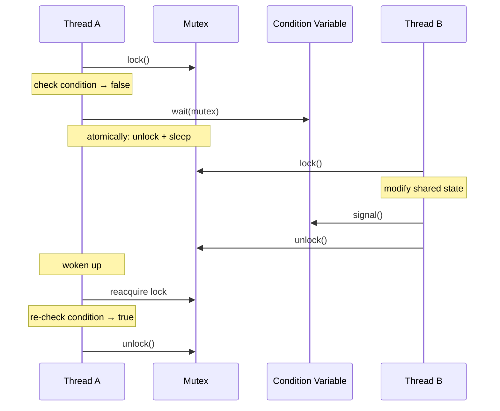

### 4.3 Spurious Wakeup

条件変数を使用する際に必ず考慮しなければならない現象が **Spurious Wakeup（偽の起床）** である。スレッドが `signal()` や `broadcast()` の発行なしに `wait()` から返ることがある。これはOSの実装上の理由（マルチプロセッサ環境でのシグナル配送の効率化など）によるものであり、POSIX仕様でも明示的に許可されている。

このため、条件変数の `wait()` は必ず **while ループ** で囲み、起床後に条件を再チェックしなければならない。

```c
// CORRECT: always use while loop
pthread_mutex_lock(&mutex);
while (!condition_is_true()) {   // re-check after wakeup
    pthread_cond_wait(&cond, &mutex);
}
// condition is guaranteed to be true here
do_work();
pthread_mutex_unlock(&mutex);
```

```c
// WRONG: if statement does not handle spurious wakeup
pthread_mutex_lock(&mutex);
if (!condition_is_true()) {      // only checks once!
    pthread_cond_wait(&cond, &mutex);
}
// condition may NOT be true here — BUG!
do_work();
pthread_mutex_unlock(&mutex);
```

Spurious Wakeup が発生する主な理由は以下の通りである。

1. **マルチプロセッサでのシグナル配送**: `signal()` と `wait()` の間の微妙なタイミングにより、カーネルが効率のために複数のスレッドを起こすことがある
2. **シグナル割り込み**: UNIX シグナルによってシステムコールが中断される場合、`wait()` が `EINTR` で返ることがある
3. **実装の簡素化**: OS が正確に1スレッドだけを起こすことを保証するよりも、偽の起床を許容した方が効率的な実装が可能になる

### 4.4 signal と broadcast の使い分け

`signal()` は待機中のスレッドを1つだけ起こし、`broadcast()` はすべてを起こす。使い分けの指針は以下の通りである。

- **signal()** を使う場合: 待機中のどのスレッドが起きても同じ処理ができるとき。つまり、条件が1つのスレッドの実行によって再び偽になるとき。例: Producer-Consumer でアイテムが1つ追加された場合
- **broadcast()** を使う場合: 待機条件がスレッドごとに異なるとき、またはイベントの発生によって複数のスレッドが同時に進行可能になるとき。例: Read-Write ロックで書き込みが完了し、複数の読み取りスレッドが同時に進行可能になる場合

迷った場合は `broadcast()` を使う方が安全である。`signal()` を誤って使用すると通知の喪失が発生する可能性があるが、`broadcast()` の誤用は性能劣化で済む（正確性は保たれる）。

## 5. モニタ

### 5.1 モニタの概念

**モニタ（Monitor）** は、Mutex と条件変数を1つの抽象データ型としてパッケージ化した同期構造である。1974年に C.A.R. Hoare と Per Brinch Hansen によって独立に提案された。モニタは以下の要素から構成される。

1. **共有データ**: モニタ内部に閉じ込められた状態
2. **手続き（Procedure）**: 共有データにアクセスする唯一の手段。モニタの手続きを実行できるスレッドは同時に1つだけである（暗黙の Mutex）
3. **条件変数**: モニタ内部での待機と通知

Java の `synchronized` ブロック / メソッドは、まさにモニタの言語レベルでの実装である。

```java
// Java monitor example
public class BoundedBuffer<T> {
    private final Queue<T> queue = new LinkedList<>();
    private final int capacity;

    public BoundedBuffer(int capacity) {
        this.capacity = capacity;
    }

    // Implicitly guarded by monitor lock
    public synchronized void put(T item) throws InterruptedException {
        while (queue.size() == capacity) {
            wait(); // release monitor lock and sleep
        }
        queue.add(item);
        notifyAll(); // wake up waiting threads
    }

    public synchronized T take() throws InterruptedException {
        while (queue.isEmpty()) {
            wait();
        }
        T item = queue.poll();
        notifyAll();
        return item;
    }
}
```

### 5.2 Hoare モニタ vs Mesa モニタ

条件変数の `signal()` のセマンティクスには、歴史的に2つの流派がある。

**Hoare モニタ（Signal and Urgent Wait）**: `signal()` を呼んだスレッドは**即座にモニタを明け渡し**、起こされたスレッドがすぐに実行を開始する。起こされたスレッドの実行が完了した後、`signal()` を呼んだスレッドが再開する。この方式では、`wait()` から返った時点で条件が必ず成立していることが保証されるため、`if` 文で条件をチェックするだけで十分である。

**Mesa モニタ（Signal and Continue）**: `signal()` を呼んだスレッドは**そのまま実行を継続**し、起こされたスレッドは ready キューに入れられる。起こされたスレッドが実際にスケジュールされて実行されるまでの間に、他のスレッドが条件を変更する可能性がある。したがって `while` ループによる条件の再チェックが必須である。

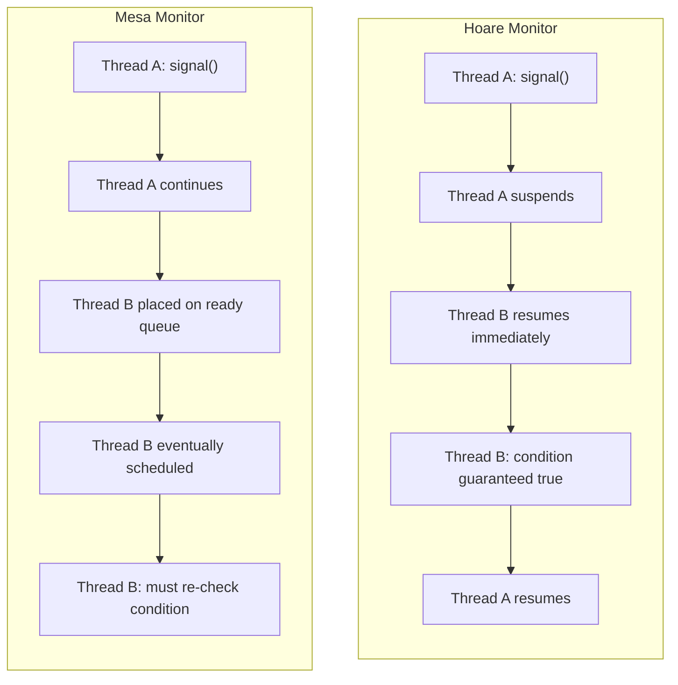

現代のほぼすべてのシステムは **Mesa モニタ** を採用している。理由は以下の通りである。

- Hoare モニタは `signal()` のたびに即座のコンテキストスイッチを要求するため、実装コストが高い
- Mesa モニタは `while` ループが必要だが、Spurious Wakeup への対策としてどのみち必要である
- Mesa モニタの方がスケジューラの自由度が高く、マルチプロセッサ環境での効率が良い

POSIX threads（pthread）、Java、C++、Go、Rust のすべてが Mesa セマンティクスを採用している。

## 6. Producer-Consumer 問題

### 6.1 問題の定義

**Producer-Consumer 問題（生産者-消費者問題）** は、並行プログラミングにおける最も基本的な同期問題の1つである。生産者（Producer）スレッドがデータを生成してバッファに格納し、消費者（Consumer）スレッドがバッファからデータを取り出して処理する。バッファは有限サイズであり、以下の2つの条件を同時に満たす必要がある。

1. **バッファが満杯の場合**: 生産者はバッファに空きができるまで待機する
2. **バッファが空の場合**: 消費者はバッファにデータが入るまで待機する

### 6.2 セマフォによる解法

Dijkstra が示した古典的な解法では、3つのセマフォを使用する。

```c
#define BUFFER_SIZE 10

int buffer[BUFFER_SIZE];
int in = 0, out = 0;

sem_t empty; // tracks empty slots (init = BUFFER_SIZE)
sem_t full;  // tracks filled slots (init = 0)
sem_t mutex; // binary semaphore for mutual exclusion (init = 1)

void init() {
    sem_init(&empty, 0, BUFFER_SIZE);
    sem_init(&full, 0, 0);
    sem_init(&mutex, 0, 1);
}

void* producer(void* arg) {
    while (1) {
        int item = produce_item();
        sem_wait(&empty);        // wait for empty slot
        sem_wait(&mutex);        // enter critical section
        buffer[in] = item;
        in = (in + 1) % BUFFER_SIZE;
        sem_post(&mutex);        // exit critical section
        sem_post(&full);         // signal item available
    }
}

void* consumer(void* arg) {
    while (1) {
        sem_wait(&full);         // wait for item
        sem_wait(&mutex);        // enter critical section
        int item = buffer[out];
        out = (out + 1) % BUFFER_SIZE;
        sem_post(&mutex);        // exit critical section
        sem_post(&empty);        // signal slot freed
        consume_item(item);
    }
}
```

`empty` セマフォはバッファの空きスロット数を追跡し、`full` セマフォは埋まったスロット数を追跡する。`mutex` はバッファへの排他アクセスを保証する。セマフォの `wait()` と `post()` の順序が重要であり、`mutex` を先に取得してから `empty` や `full` を待つとデッドロックが発生する。

### 6.3 条件変数による解法

条件変数を使用した解法は、より直感的で読みやすい。

```c
#define BUFFER_SIZE 10

int buffer[BUFFER_SIZE];
int count = 0, in = 0, out = 0;

pthread_mutex_t mutex = PTHREAD_MUTEX_INITIALIZER;
pthread_cond_t not_full = PTHREAD_COND_INITIALIZER;
pthread_cond_t not_empty = PTHREAD_COND_INITIALIZER;

void* producer(void* arg) {
    while (1) {
        int item = produce_item();
        pthread_mutex_lock(&mutex);
        while (count == BUFFER_SIZE) {     // buffer full
            pthread_cond_wait(&not_full, &mutex);
        }
        buffer[in] = item;
        in = (in + 1) % BUFFER_SIZE;
        count++;
        pthread_cond_signal(&not_empty);   // wake consumer
        pthread_mutex_unlock(&mutex);
    }
}

void* consumer(void* arg) {
    while (1) {
        pthread_mutex_lock(&mutex);
        while (count == 0) {               // buffer empty
            pthread_cond_wait(&not_empty, &mutex);
        }
        int item = buffer[out];
        out = (out + 1) % BUFFER_SIZE;
        count--;
        pthread_cond_signal(&not_full);    // wake producer
        pthread_mutex_unlock(&mutex);
        consume_item(item);
    }
}
```

この解法では、`not_full` と `not_empty` の2つの条件変数を使い分けることで、生産者と消費者がそれぞれ適切な条件で待機・通知する。条件変数の `while` ループは Spurious Wakeup に対する防御であると同時に、複数の消費者が存在する場合に1つの消費者が起きてアイテムを取った後、別の消費者が起きたときにバッファが空であるケースにも対応する。

## 7. Readers-Writers 問題

### 7.1 問題の定義

**Readers-Writers 問題** は、共有データに対して複数の読み取りスレッド（Reader）と書き込みスレッド（Writer）が同時にアクセスする状況を扱う問題である。

- 読み取り操作同士は干渉しないため、複数の Reader が同時に読み取ることは安全である
- 書き込み操作は排他的でなければならない。Writer がデータを変更している間は、他の Reader も Writer もアクセスしてはならない

この問題には、読み取り側を優先するか書き込み側を優先するかによって複数のバリエーションが存在する。

### 7.2 第一種 Readers-Writers 問題（Reader 優先）

Reader が存在する限り、後から来た Reader もすぐにアクセスを開始できる。Writer は Reader が全員退出するまで待たなければならない。この方式では Writer の**飢餓状態（Starvation）** が発生する可能性がある。

```c
int read_count = 0;
pthread_mutex_t rc_mutex = PTHREAD_MUTEX_INITIALIZER; // protects read_count
pthread_mutex_t rw_mutex = PTHREAD_MUTEX_INITIALIZER; // controls write access

void* reader(void* arg) {
    while (1) {
        pthread_mutex_lock(&rc_mutex);
        read_count++;
        if (read_count == 1) {
            pthread_mutex_lock(&rw_mutex); // first reader locks out writers
        }
        pthread_mutex_unlock(&rc_mutex);

        read_data(); // critical section for reading

        pthread_mutex_lock(&rc_mutex);
        read_count--;
        if (read_count == 0) {
            pthread_mutex_unlock(&rw_mutex); // last reader unlocks for writers
        }
        pthread_mutex_unlock(&rc_mutex);
    }
}

void* writer(void* arg) {
    while (1) {
        pthread_mutex_lock(&rw_mutex);
        write_data(); // exclusive access
        pthread_mutex_unlock(&rw_mutex);
    }
}
```

### 7.3 第二種 Readers-Writers 問題（Writer 優先）

Writer が待機している場合、新しい Reader はアクセスを開始できない。既存の Reader が全員退出した時点で Writer がアクセスを開始する。この方式では Reader の飢餓状態が発生する可能性がある。

### 7.4 公平な解法

多くの実用的なシステムでは、Reader にも Writer にも飢餓状態を起こさない公平な解法が求められる。セマフォを使って到着順にアクセスを許可する方式がある。

```c
int read_count = 0;
sem_t rw_mutex;     // controls read/write access
sem_t rc_mutex;     // protects read_count
sem_t order;        // preserves ordering (FIFO)

void init() {
    sem_init(&rw_mutex, 0, 1);
    sem_init(&rc_mutex, 0, 1);
    sem_init(&order, 0, 1);
}

void* reader(void* arg) {
    while (1) {
        sem_wait(&order);          // wait in line
        sem_wait(&rc_mutex);
        read_count++;
        if (read_count == 1)
            sem_wait(&rw_mutex);   // first reader blocks writers
        sem_post(&rc_mutex);
        sem_post(&order);          // release ordering semaphore

        read_data();

        sem_wait(&rc_mutex);
        read_count--;
        if (read_count == 0)
            sem_post(&rw_mutex);   // last reader unblocks writers
        sem_post(&rc_mutex);
    }
}

void* writer(void* arg) {
    while (1) {
        sem_wait(&order);          // wait in line
        sem_wait(&rw_mutex);
        sem_post(&order);          // release ordering semaphore

        write_data();

        sem_post(&rw_mutex);
    }
}
```

`order` セマフォがFIFO順序を強制することで、Reader と Writer が到着順にアクセスする。ただし、実際のシステムでは `pthread_rwlock_t` のような専用のRead-Writeロック実装を使うことが推奨される。これらの実装は内部で最適化されており、Writer 飢餓を防ぐポリシーが組み込まれていることが多い。

## 8. Dining Philosophers 問題

### 8.1 問題の定義

**Dining Philosophers（食事する哲学者）問題** は、Dijkstra が1965年に提案した古典的な並行処理の問題である。5人の哲学者が円卓に座り、それぞれの間にフォークが1本ずつ置かれている。哲学者は「考える」と「食べる」を繰り返すが、食べるためには左右2本のフォークが必要である。

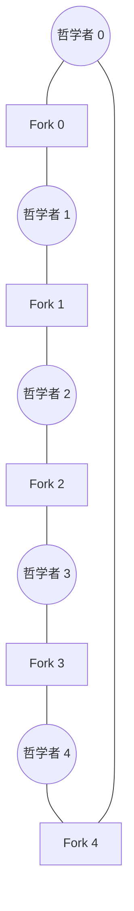

この問題が示すのは、**デッドロック**と**飢餓状態**の危険性である。全員が同時に左のフォークを取ると、右のフォークを取れるスレッドが1つもなくなり、全員が永遠に待ち続ける。

### 8.2 ナイーブな解法（デッドロック発生）

```c
pthread_mutex_t forks[5];

void* philosopher(void* arg) {
    int id = *(int*)arg;
    int left = id;
    int right = (id + 1) % 5;

    while (1) {
        think();
        pthread_mutex_lock(&forks[left]);   // pick up left fork
        pthread_mutex_lock(&forks[right]);  // pick up right fork — DEADLOCK RISK!
        eat();
        pthread_mutex_unlock(&forks[right]);
        pthread_mutex_unlock(&forks[left]);
    }
}
```

### 8.3 解法1: リソース順序付け

デッドロックの循環待ち条件を破壊する方法として、フォークに番号を付け、常に小さい番号のフォークから取るようにする。

```c
void* philosopher(void* arg) {
    int id = *(int*)arg;
    int first = (id < (id + 1) % 5) ? id : (id + 1) % 5;
    int second = (id < (id + 1) % 5) ? (id + 1) % 5 : id;

    while (1) {
        think();
        pthread_mutex_lock(&forks[first]);  // always lock lower-numbered fork first
        pthread_mutex_lock(&forks[second]);
        eat();
        pthread_mutex_unlock(&forks[second]);
        pthread_mutex_unlock(&forks[first]);
    }
}
```

この解法では、哲学者4は fork 0 を先に取ろうとし、fork 4 は後に取る。これにより循環待ちが発生しなくなる。ただし、哲学者4は fork 0 の競合が激しくなるため、公平性に欠ける場合がある。

### 8.4 解法2: 同時着席数の制限

セマフォを使って、同時に食事しようとする哲学者の数を4人以下に制限する。5人中4人までしかテーブルに着けないようにすれば、少なくとも1人は2本のフォークを確保できる。

```c
sem_t table; // init to 4

void* philosopher(void* arg) {
    int id = *(int*)arg;
    int left = id;
    int right = (id + 1) % 5;

    while (1) {
        think();
        sem_wait(&table);                  // at most 4 philosophers at the table
        pthread_mutex_lock(&forks[left]);
        pthread_mutex_lock(&forks[right]);
        eat();
        pthread_mutex_unlock(&forks[right]);
        pthread_mutex_unlock(&forks[left]);
        sem_post(&table);
    }
}
```

### 8.5 解法3: 条件変数による解法

モニタを使い、両方のフォークが利用可能な場合にのみ食事を開始する。

```c
pthread_mutex_t monitor = PTHREAD_MUTEX_INITIALIZER;
pthread_cond_t can_eat[5];
enum { THINKING, HUNGRY, EATING } state[5];

void test(int id) {
    // Check if philosopher id can eat
    int left = (id + 4) % 5;
    int right = (id + 1) % 5;
    if (state[id] == HUNGRY &&
        state[left] != EATING &&
        state[right] != EATING) {
        state[id] = EATING;
        pthread_cond_signal(&can_eat[id]);
    }
}

void pickup(int id) {
    pthread_mutex_lock(&monitor);
    state[id] = HUNGRY;
    test(id);                              // try to eat
    while (state[id] != EATING) {
        pthread_cond_wait(&can_eat[id], &monitor);
    }
    pthread_mutex_unlock(&monitor);
}

void putdown(int id) {
    pthread_mutex_lock(&monitor);
    state[id] = THINKING;
    test((id + 4) % 5);                   // let left neighbor try
    test((id + 1) % 5);                   // let right neighbor try
    pthread_mutex_unlock(&monitor);
}

void* philosopher(void* arg) {
    int id = *(int*)arg;
    while (1) {
        think();
        pickup(id);
        eat();
        putdown(id);
    }
}
```

この解法はデッドロックフリーであり、フォークを1本ずつ取るのではなく「両方が利用可能かどうか」をアトミックに判定する。

## 9. 各言語での実装

### 9.1 C/pthread

POSIX Threads（pthread）は、C/C++ における並行プログラミングの標準APIである。

```c
#include <pthread.h>
#include <stdio.h>

// Mutex
pthread_mutex_t mutex = PTHREAD_MUTEX_INITIALIZER;

// Condition variable
pthread_cond_t cond = PTHREAD_COND_INITIALIZER;

// Shared state
int ready = 0;

void* worker(void* arg) {
    pthread_mutex_lock(&mutex);
    while (!ready) {
        // Atomically release mutex and sleep
        pthread_cond_wait(&cond, &mutex);
    }
    printf("Worker: condition is true, proceeding\n");
    pthread_mutex_unlock(&mutex);
    return NULL;
}

void* notifier(void* arg) {
    pthread_mutex_lock(&mutex);
    ready = 1;
    pthread_cond_signal(&cond);  // or pthread_cond_broadcast(&cond)
    pthread_mutex_unlock(&mutex);
    return NULL;
}
```

pthread の特徴は、すべてが明示的であることである。初期化、ロック取得、ロック解放、破棄をすべてプログラマが管理する。エラーハンドリングも戻り値のチェックによって行う。

### 9.2 Java

Java はモニタを言語レベルで直接サポートする。すべてのオブジェクトが暗黙的にモニタロックを持ち、`synchronized` キーワードと `wait()` / `notify()` / `notifyAll()` メソッドで同期を行う。

```java
// Basic synchronized
public class Counter {
    private int count = 0;

    public synchronized void increment() {
        count++;
    }

    public synchronized int getCount() {
        return count;
    }
}

// Using java.util.concurrent for more control
import java.util.concurrent.locks.ReentrantLock;
import java.util.concurrent.locks.Condition;
import java.util.concurrent.Semaphore;

public class BoundedQueue<T> {
    private final Queue<T> queue = new LinkedList<>();
    private final int capacity;
    private final ReentrantLock lock = new ReentrantLock();
    private final Condition notFull = lock.newCondition();
    private final Condition notEmpty = lock.newCondition();

    public BoundedQueue(int capacity) {
        this.capacity = capacity;
    }

    public void put(T item) throws InterruptedException {
        lock.lock();
        try {
            while (queue.size() == capacity) {
                notFull.await();       // equivalent to pthread_cond_wait
            }
            queue.add(item);
            notEmpty.signal();         // equivalent to pthread_cond_signal
        } finally {
            lock.unlock();             // guaranteed unlock via finally
        }
    }

    public T take() throws InterruptedException {
        lock.lock();
        try {
            while (queue.isEmpty()) {
                notEmpty.await();
            }
            T item = queue.poll();
            notFull.signal();
            return item;
        } finally {
            lock.unlock();
        }
    }
}
```

Java 5 以降の `java.util.concurrent` パッケージは、`ReentrantLock`、`Condition`、`Semaphore`、`CountDownLatch`、`CyclicBarrier` など豊富な同期プリミティブを提供する。`ReentrantLock` は `synchronized` と比べて以下の利点がある。

- `tryLock()` によるタイムアウト付きロック取得
- 複数の条件変数の使用（`synchronized` は1オブジェクトにつき1つの待機セット）
- 公平性（fairness）ポリシーの指定

### 9.3 Go

Go は CSP（Communicating Sequential Processes）モデルを基盤とし、チャネルによるメッセージパッシングを推奨するが、`sync` パッケージで Mutex や条件変数も提供する。

```go
package main

import (
    "fmt"
    "sync"
)

// Mutex example
type SafeCounter struct {
    mu sync.Mutex
    v  map[string]int
}

func (c *SafeCounter) Inc(key string) {
    c.mu.Lock()
    defer c.mu.Unlock() // unlock on function return (like RAII)
    c.v[key]++
}

func (c *SafeCounter) Value(key string) int {
    c.mu.Lock()
    defer c.mu.Unlock()
    return c.v[key]
}

// Condition variable example
type BoundedBuffer struct {
    mu       sync.Mutex
    notFull  *sync.Cond
    notEmpty *sync.Cond
    buf      []int
    capacity int
}

func NewBoundedBuffer(cap int) *BoundedBuffer {
    b := &BoundedBuffer{
        buf:      make([]int, 0, cap),
        capacity: cap,
    }
    b.notFull = sync.NewCond(&b.mu)
    b.notEmpty = sync.NewCond(&b.mu)
    return b
}

func (b *BoundedBuffer) Put(item int) {
    b.mu.Lock()
    defer b.mu.Unlock()
    for len(b.buf) == b.capacity {
        b.notFull.Wait() // atomically unlock and sleep
    }
    b.buf = append(b.buf, item)
    b.notEmpty.Signal()
}

func (b *BoundedBuffer) Take() int {
    b.mu.Lock()
    defer b.mu.Unlock()
    for len(b.buf) == 0 {
        b.notEmpty.Wait()
    }
    item := b.buf[0]
    b.buf = b.buf[1:]
    b.notFull.Signal()
    return item
}
```

Go の `sync.Mutex` にはTry-Lock がない（Go 1.18 で `TryLock` が追加された）。これは「ロックの取得を試みて失敗したら別のことをする」というパターンを意図的に非推奨としているためである。Go の公式な哲学は "Don't communicate by sharing memory; share memory by communicating" であり、チャネルを使ったメッセージパッシングが推奨される。

ただし、チャネルが常に最適解というわけではない。単純なカウンタの保護や、Read-Write ロックが適切な場面では `sync.Mutex` や `sync.RWMutex` の方が効率的である。

### 9.4 Rust

Rust は所有権システムと型システムによって、コンパイル時にデータ競合を防止する。ロックなしに共有データにアクセスすることは型エラーとなる。

```rust
use std::sync::{Arc, Mutex, Condvar};
use std::thread;

// Mutex example — data is INSIDE the Mutex
fn mutex_example() {
    let counter = Arc::new(Mutex::new(0)); // Mutex<i32>, not just Mutex
    let mut handles = vec![];

    for _ in 0..10 {
        let counter = Arc::clone(&counter);
        let handle = thread::spawn(move || {
            let mut num = counter.lock().unwrap(); // returns MutexGuard
            *num += 1;
            // MutexGuard dropped here — automatically unlocks
        });
        handles.push(handle);
    }

    for handle in handles {
        handle.join().unwrap();
    }

    println!("Result: {}", *counter.lock().unwrap());
}

// Condition variable example
fn condvar_example() {
    let pair = Arc::new((Mutex::new(false), Condvar::new()));
    let pair_clone = Arc::clone(&pair);

    // Waiting thread
    let handle = thread::spawn(move || {
        let (lock, cvar) = &*pair_clone;
        let mut ready = lock.lock().unwrap();
        while !*ready {
            ready = cvar.wait(ready).unwrap(); // atomically unlock and sleep
        }
        println!("Condition met!");
    });

    // Notifying thread
    {
        let (lock, cvar) = &*pair;
        let mut ready = lock.lock().unwrap();
        *ready = true;
        cvar.notify_one();
    }

    handle.join().unwrap();
}
```

Rust の `Mutex<T>` の設計には、他の言語と根本的に異なる点がある。

1. **データはMutexの中にある**: `Mutex<T>` は `T` 型のデータを所有する。ロックを取得しなければデータにアクセスすることが型レベルで不可能であり、ロックの取り忘れがコンパイルエラーとなる
2. **RAII による自動解放**: `lock()` が返す `MutexGuard` がスコープを抜けると自動的にアンロックされる。例外時のアンロック忘れが原理的に発生しない
3. **Poisoning**: パニックによってロックが解放された場合、そのMutexは「毒された（poisoned）」状態となり、以降の `lock()` は `Err` を返す。これにより、不整合な状態のデータにアクセスすることを防ぐ

```rust
// Rust's type system prevents data races at compile time
use std::sync::Mutex;

let data = Mutex::new(vec![1, 2, 3]);

// This won't compile — can't access data without locking
// let v = &data; // Error: Mutex<Vec<i32>> doesn't implement Deref to Vec<i32>

// Must lock first
let mut guard = data.lock().unwrap();
guard.push(4); // OK — MutexGuard<Vec<i32>> dereferences to Vec<i32>
```

## 10. 実装の内部 — Futex とスピンロック

### 10.1 スピンロック

**スピンロック（Spinlock）** は最も単純なロック実装である。ロックが取得できるまで、CPU サイクルを消費しながらループ（スピン）し続ける。

```c
// Simple spinlock using atomic CAS
typedef struct {
    atomic_int locked;
} spinlock_t;

void spin_lock(spinlock_t* lock) {
    while (atomic_exchange(&lock->locked, 1) == 1) {
        // spin — busy waiting
    }
}

void spin_unlock(spinlock_t* lock) {
    atomic_store(&lock->locked, 0);
}
```

スピンロックの利点は、コンテキストスイッチが発生しないため、ロックの保持時間が極めて短い場合にはMutex（システムコールを伴う）よりも高速であることである。Linux カーネル内部では、割り込みハンドラなどスリープが許されない文脈でスピンロックが多用される。

しかし、ユーザー空間のアプリケーションでは、スピンロックはほぼ常に不適切である。理由は以下の通りである。

- **CPU資源の浪費**: ロックが長時間保持されると、待機スレッドがCPU時間を無駄に消費する
- **優先度逆転の悪化**: 高優先度スレッドがスピンして低優先度スレッド（ロック保持者）のCPU時間を奪い、ロックの解放がさらに遅れる
- **省電力への悪影響**: スピンはCPUを100%使用し続けるため、モバイルデバイスやバッテリー駆動環境では致命的である

### 10.2 Futex（Fast Userspace Mutex）

**Futex（Fast Userspace Mutex）** は、2003年に Linux カーネルに導入された機構であり、ユーザー空間とカーネル空間の協調によって高効率な同期を実現する。Futex の設計思想は「競合がない場合はカーネルに入らず、競合がある場合だけカーネルのスリープ機構を使う」というものである。

Futex は本質的に**カーネル管理の待機キュー**であり、ユーザー空間のメモリアドレスに関連付けられる。2つのシステムコールを提供する。

- **futex_wait(addr, expected_val)**: `*addr == expected_val` の場合、スレッドをスリープさせる。値が異なっていれば即座に返る（もはや待つ必要がないため）
- **futex_wake(addr, num_threads)**: `addr` で待機中のスレッドを最大 `num_threads` 個起こす

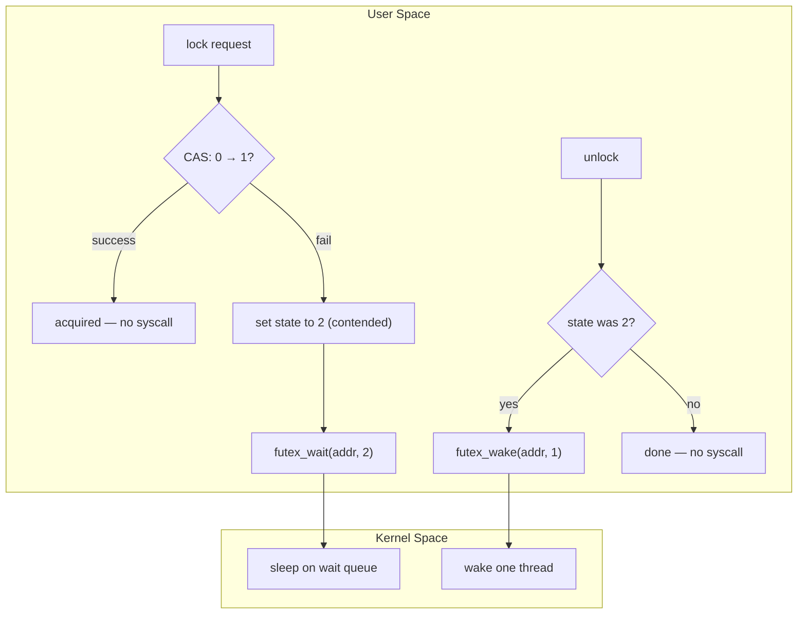

Futex ベースの Mutex は、ロックの状態を3つの値で表現する。

- **0**: アンロック
- **1**: ロック済み（待機者なし）
- **2**: ロック済み（待機者あり）

この3値の設計により、アンロック時に待機者がいなければ `futex_wake` システムコールを省略できる。ロックが競合していない通常のケースでは、一切のシステムコールなしにロックの取得・解放が完了する。

```c
// Simplified futex-based mutex (conceptual)
typedef struct {
    atomic_int state; // 0: unlocked, 1: locked, 2: locked + waiters
} futex_mutex_t;

void futex_lock(futex_mutex_t* m) {
    int c;
    if ((c = atomic_compare_exchange(&m->state, 0, 1)) != 0) {
        // Lock is contended
        if (c != 2) {
            c = atomic_exchange(&m->state, 2);
        }
        while (c != 0) {
            futex_wait(&m->state, 2);  // sleep in kernel
            c = atomic_exchange(&m->state, 2);
        }
    }
}

void futex_unlock(futex_mutex_t* m) {
    if (atomic_fetch_sub(&m->state, 1) != 1) {
        // There were waiters
        atomic_store(&m->state, 0);
        futex_wake(&m->state, 1);      // wake one thread
    }
}
```

### 10.3 アダプティブスピニング

現代の Mutex 実装の多くは、スピンロックと Futex のハイブリッドである**アダプティブスピニング（Adaptive Spinning）** を採用している。ロックが競合した場合、即座にカーネルでスリープするのではなく、短時間（数百〜数千回のスピン）だけユーザー空間でスピンしてからスリープに移行する。

この戦略が有効な理由は、多くのロックの保持時間がコンテキストスイッチのコスト（数マイクロ秒）よりも短いためである。短時間のスピンでロックが解放されればシステムコールのオーバーヘッドを回避でき、解放されなければスリープに移行してCPU浪費を防ぐ。

glibc の `pthread_mutex_lock` や Java の `synchronized`（HotSpot VM）は、このアダプティブスピニングを実装している。

### 10.4 他のOSでの実装

- **Windows**: `CRITICAL_SECTION` は Futex に相当する `SRWLock`（Slim Reader/Writer Lock）やイベントオブジェクトを内部で使用する。`WaitOnAddress` / `WakeByAddressSingle` は Linux の Futex に相当するAPIである
- **macOS / iOS**: `os_unfair_lock` は Futex と同様の設計思想を持つ高速ロックである。古い `OSSpinLock` は優先度逆転の問題があったため非推奨となった
- **FreeBSD**: `umtx` はLinux の Futex に相当する機構である

## 11. よくある落とし穴とベストプラクティス

### 11.1 よくある落とし穴

**1. ロックの順序不統一によるデッドロック**

複数のロックを取得する際に、すべてのスレッドで同じ順序を守らないとデッドロックが発生する。

```c
// Thread A           // Thread B
lock(mutex_A);        lock(mutex_B);  // Different order!
lock(mutex_B);        lock(mutex_A);
// DEADLOCK
```

**2. 条件変数の if チェック**

前述の通り、条件変数の `wait()` 後に `if` で条件をチェックするのは誤りである。Spurious Wakeup や複数スレッドの競合により、条件が成立していない状態で実行が進む可能性がある。必ず `while` ループを使う。

**3. ロック保持中の長時間処理**

ネットワークI/Oやディスクアクセスなど、レイテンシの大きい処理をロック保持中に行うと、他のスレッドの待機時間が増大し、スループットが著しく低下する。

```c
// BAD: I/O while holding lock
pthread_mutex_lock(&mutex);
data = read_from_database(); // slow I/O — blocks other threads
process(data);
pthread_mutex_unlock(&mutex);

// GOOD: minimize critical section
data = read_from_database(); // I/O outside lock
pthread_mutex_lock(&mutex);
process_shared_state(data);  // only shared state access under lock
pthread_mutex_unlock(&mutex);
```

**4. ロック解放忘れ**

例外やエラー分岐で `unlock()` が呼ばれないパスが存在すると、永久にロックが保持されたままとなる。RAII やスコープガード（C++ の `std::lock_guard`、Rust の `MutexGuard`、Go の `defer`）を活用する。

**5. 通知の喪失（Lost Wakeup）**

条件変数の `signal()` をロックの外で呼ぶと、通知が失われる可能性がある。`signal()` は Mutex を保持した状態で呼ぶか、少なくとも共有状態の変更とアトミックに行う必要がある。

```c
// BAD: signal outside lock — possible lost wakeup
pthread_mutex_lock(&mutex);
ready = 1;
pthread_mutex_unlock(&mutex);
pthread_cond_signal(&cond);     // another thread could check and wait() AFTER ready=1
                                // but BEFORE this signal(), missing it

// GOOD: signal while holding lock or after state change is visible
pthread_mutex_lock(&mutex);
ready = 1;
pthread_cond_signal(&cond);     // signal while condition change is protected
pthread_mutex_unlock(&mutex);
```

> [!NOTE]
> 厳密には、`signal()` をロックの外で呼ぶこと自体はPOSIXの仕様上は合法であるが、共有状態の変更とシグナルの間に他のスレッドが割り込む可能性があるため、ロック内でシグナルを送る方が安全で理解しやすい。

### 11.2 ベストプラクティス

**1. ロックの粒度を適切に保つ**

粗粒度ロック（1つのロックで多くのデータを保護）は実装が簡単だが、並行性が低下する。細粒度ロック（データ構造の要素ごとにロック）は並行性が高いが、複雑さとデッドロックのリスクが増大する。アプリケーションのワークロードに応じたバランスが重要である。

**2. ロックの取得順序を統一する**

複数のロックを取得する必要がある場合、すべてのコードパスで同一の順序を守る。ロックにグローバルな順序（アドレス順、ID順など）を定義し、それに従う。C++ では `std::lock()` が複数のロックをデッドロックフリーに取得する機能を提供している。

**3. 臨界区間を最小化する**

ロック内で行う処理は、共有データへのアクセスに厳密に限定する。計算やI/Oはロックの外で行う。

**4. RAII / スコープガードを使う**

ロックの取得と解放を手動で管理しない。言語が提供するRAIIパターン（C++ の `lock_guard`、Rust の `MutexGuard`、Go の `defer`）を使い、例外安全性を確保する。

**5. 「ロックを避ける」という選択肢を検討する**

同期プリミティブは万能ではない。以下の代替手段を検討する。

- **チャネル / メッセージパッシング**: Go のチャネル、Rust の `mpsc`、アクターモデルなど。共有状態を排除する
- **アトミック操作**: 単純なカウンタやフラグには `atomic` 型を直接使う方が効率的
- **ロックフリーデータ構造**: CAS を活用したキューやスタック。正しい実装は難しいが、性能は高い
- **イミュータブルデータ**: 不変データは同期なしに安全に共有できる
- **スレッドローカルストレージ**: スレッドごとに独立したデータを持ち、最後に集約する

**6. デバッグツールを活用する**

- **ThreadSanitizer（TSan）**: GCC / Clang に組み込まれたデータ競合検出ツール。`-fsanitize=thread` フラグで有効化する
- **Valgrind / Helgrind**: ロックの順序違反やデータ競合を検出する
- **Go Race Detector**: `go run -race` でデータ競合を検出する

```bash
# ThreadSanitizer example
gcc -fsanitize=thread -g -o myapp myapp.c -lpthread
./myapp
# Reports data races at runtime
```

## 12. まとめ

同期プリミティブは、並行プログラミングの基盤を成す重要な概念である。本記事で扱った内容を整理する。

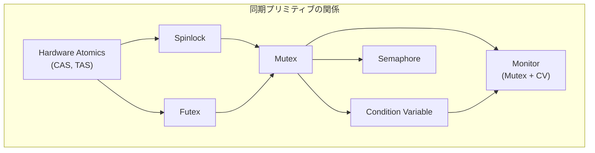

| プリミティブ | 核となる概念 | 典型的な用途 |
|-------------|-------------|-------------|
| Mutex | 所有権のある排他ロック | 臨界区間の保護 |
| セマフォ | カウンタベースのリソース管理 | 有限リソースの制限、シグナリング |
| 条件変数 | 任意の述語に基づく待機・通知 | Producer-Consumer、状態変化の待機 |
| モニタ | Mutex + 条件変数の統合 | 言語レベルの同期（Java synchronized） |

Dijkstra がセマフォを提案してから60年以上が経過したが、これらの同期プリミティブは現在もOSカーネルからWebアプリケーションまで、あらゆる並行ソフトウェアの根幹を支えている。一方で、共有メモリとロックの組み合わせは本質的に複雑であり、デッドロック、データ競合、優先度逆転、飢餓状態といった問題と常に隣り合わせである。

近年の傾向として、Go のチャネル、Rust の所有権システム、アクターモデルなど、共有メモリを避ける方向の並行プログラミングモデルが広がっている。しかし、これらの高水準な抽象化も、その内部では Mutex やセマフォ、条件変数が活用されている。同期プリミティブの正しい理解は、どのようなプログラミングモデルを選択するにしても、並行プログラミングの本質を理解するための不可欠な基礎である。
