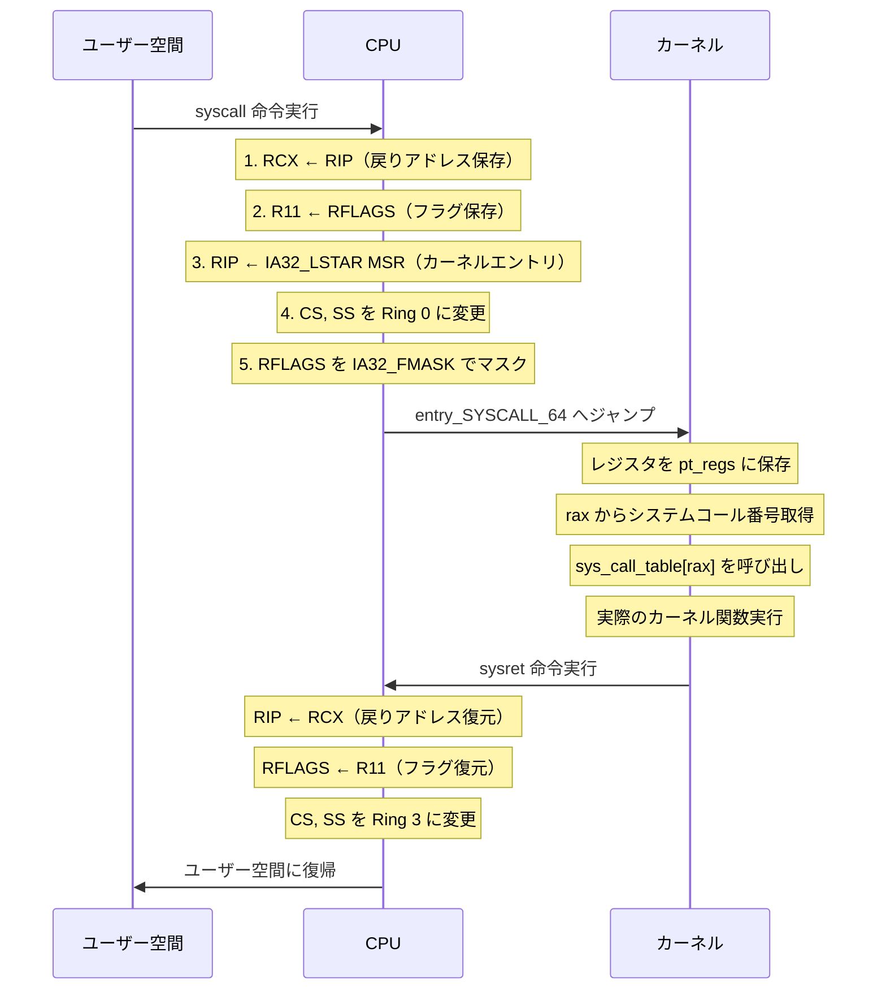
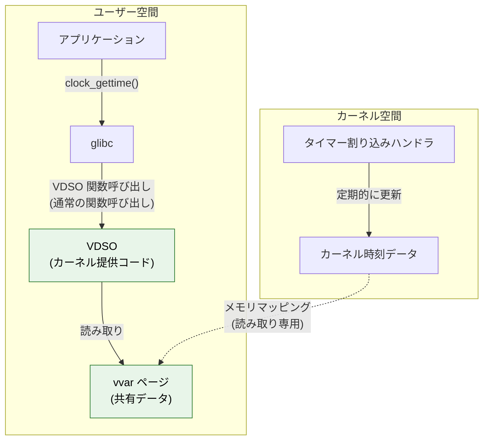
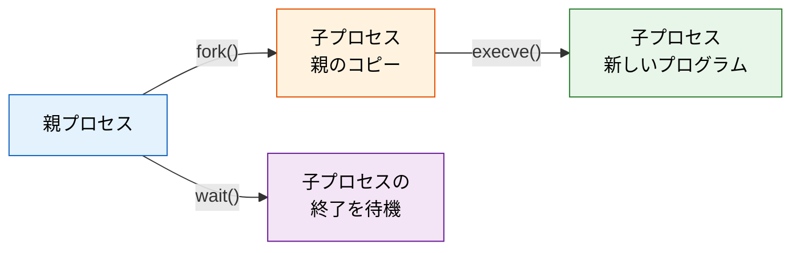
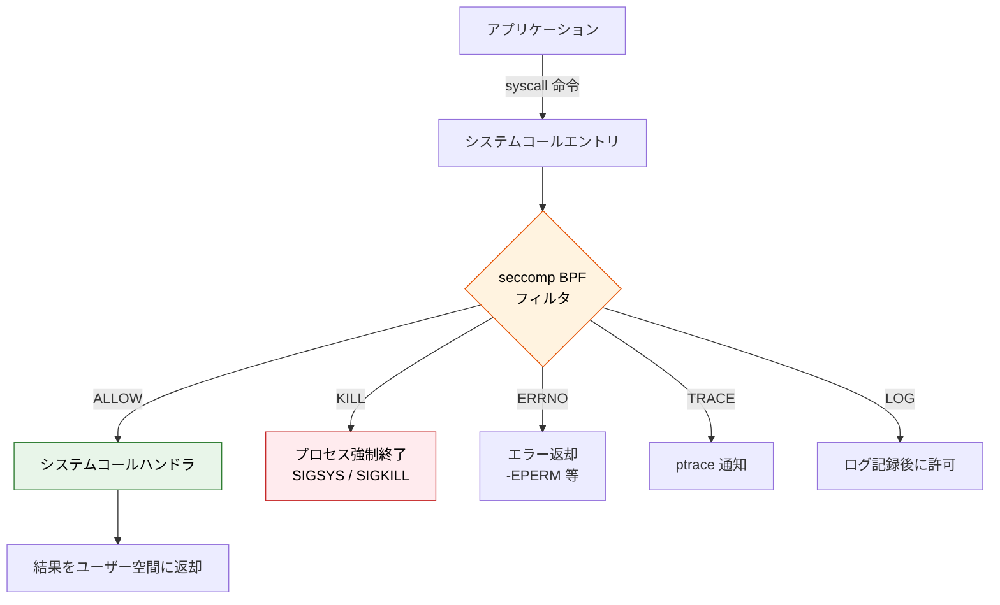
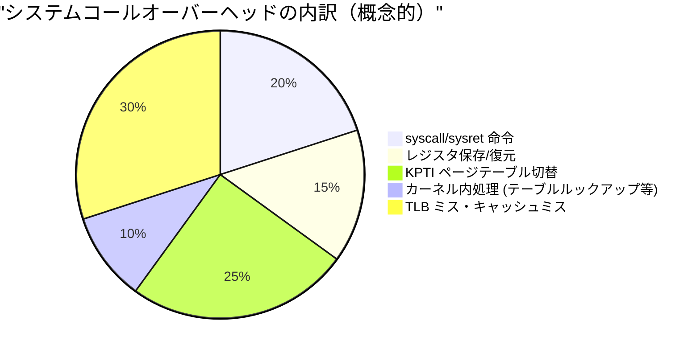
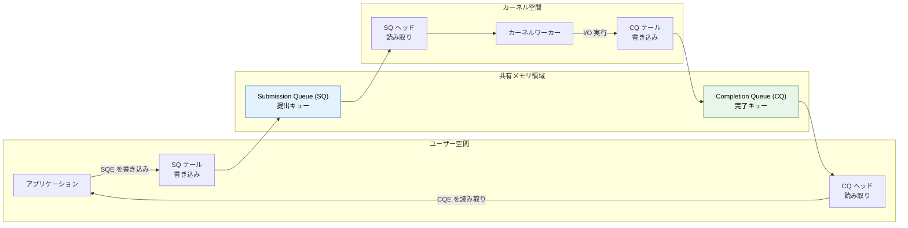
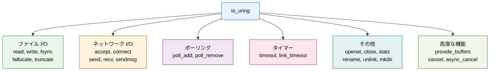

# システムコール — ユーザー空間とカーネル空間の境界

## 1. システムコールの役割 — なぜ直接ハードウェアを操作できないのか

### 1.1 オペレーティングシステムの根本的な契約

現代のオペレーティングシステム（OS）は、アプリケーションプログラムとハードウェアの間に位置する「仲介者」である。ファイルの読み書き、ネットワーク通信、プロセスの生成、メモリの確保 —— これらはすべてハードウェアリソースへのアクセスを伴う操作だが、アプリケーションがこれらを直接行うことは許されていない。

なぜか。理由は大きく3つある。

**安全性（Safety）**：あるプログラムが別のプログラムのメモリを書き換えたり、ディスク上の他ユーザーのファイルを破壊したりすることを防がなければならない。ハードウェアへの無制限のアクセスは、システム全体の安定性を脅かす。

**抽象化（Abstraction）**：アプリケーション開発者が SSD のブロックレイアウトや NIC のレジスタ仕様を意識せずに済むように、OS はハードウェアの複雑さを隠蔽し、統一的なインターフェースを提供する。

**多重化（Multiplexing）**：複数のプログラムが同時に CPU・メモリ・I/O デバイスを使う環境では、リソースの公平な分配と競合の回避を OS が管理する必要がある。

こうした理由から、OS は「カーネル」と呼ばれる特権的なソフトウェア層でハードウェアを管理し、アプリケーションには**システムコール（system call）** という制御された窓口だけを公開する。システムコールは、ユーザー空間のプログラムがカーネルにサービスを要求するための唯一の正規ルートである。

### 1.2 POSIX とシステムコールの標準化

Unix の誕生（1969年）以来、システムコールは OS の根幹を成してきた。1980年代に制定された **POSIX（Portable Operating System Interface）** 標準は、`open()`、`read()`、`write()`、`fork()`、`exec()` などの主要なシステムコールを仕様として定義し、異なる Unix 系 OS 間でのソースコードの移植性を確保した。

Linux は POSIX を厳密には認証取得していないが、実質的に POSIX 互換であり、約 450 個のシステムコールを提供している（Linux 6.x 時点）。一方、Windows は `NtCreateFile()`、`NtReadFile()` といった NT カーネルのシステムコール（ntdll.dll 経由）を持ち、Win32 API がその上のラッパーとして機能する。

```
アプリケーション視点のシステムコール:

printf("hello")
    │
    ▼
C ライブラリ (glibc)  ← write() のラッパー関数
    │
    ▼
システムコール: write(1, "hello", 5)
    │
    ▼
カーネル: VFS → ファイルシステム → デバイスドライバ
    │
    ▼
ハードウェア (ターミナル / ディスク / ネットワーク)
```

## 2. ユーザー空間とカーネル空間 — 2つの世界

### 2.1 CPU の特権レベルとリング

システムコールの仕組みを理解するには、まず CPU のハードウェアレベルでの保護機構を知る必要がある。x86 アーキテクチャは **4 段階の特権レベル（Protection Rings）** を定義している。

```
            ┌─────────────────────────────┐
            │         Ring 3              │  ← ユーザーモード（最低特権）
            │   ┌─────────────────────┐   │
            │   │     Ring 2          │   │  ← 通常未使用
            │   │   ┌─────────────┐   │   │
            │   │   │   Ring 1    │   │   │  ← 通常未使用
            │   │   │  ┌───────┐  │   │   │
            │   │   │  │Ring 0 │  │   │   │  ← カーネルモード（最高特権）
            │   │   │  └───────┘  │   │   │
            │   │   └─────────────┘   │   │
            │   └─────────────────────┘   │
            └─────────────────────────────┘
```

実用上、ほとんどの OS は **Ring 0（カーネルモード）** と **Ring 3（ユーザーモード）** の 2 段階のみを使用する。Ring 1 と Ring 2 は歴史的に使われることが少なく、仮想化技術（VT-x）が登場してからは Ring -1（VMX root mode）が追加されたが、ユーザー空間とカーネル空間の分離は Ring 0 と Ring 3 の境界に集約される。

### 2.2 カーネル空間とユーザー空間のメモリレイアウト

Linux（x86_64）では、48ビットの仮想アドレス空間（256 TiB）を上位と下位に分割する。

```
仮想アドレス空間 (x86_64, 48-bit):

0xFFFFFFFFFFFFFFFF ┌──────────────────────┐
                   │                      │
                   │   カーネル空間        │  128 TiB
                   │  (すべてのプロセスで  │
                   │   共通のマッピング)   │
                   │                      │
0xFFFF800000000000 ├──────────────────────┤
                   │                      │
                   │    正規でない領域     │  （アクセス不可）
                   │   (canonical hole)   │
                   │                      │
0x00007FFFFFFFFFFF ├──────────────────────┤
                   │                      │
                   │   ユーザー空間        │  128 TiB
                   │  (プロセスごとに独立) │
                   │                      │
0x0000000000000000 └──────────────────────┘
```

カーネル空間のページテーブルエントリには **Supervisor ビット** が設定されており、Ring 3（ユーザーモード）からのアクセスはハードウェアレベルで阻止される。ユーザープログラムがカーネル空間のアドレスを読み書きしようとすると、CPU はただちに **ページフォルト例外** を発生させ、カーネルが `SIGSEGV` シグナルを送信してプロセスを終了させる。

### 2.3 モード切り替えのコスト

ユーザーモードからカーネルモードへの切り替え（およびその逆）は、単なるフラグの変更ではない。以下の操作が必要になる。

1. **レジスタの保存と復元**：ユーザー空間のレジスタ状態を保存し、カーネルスタックに切り替える
2. **アドレス空間の切り替え**：KPTI（Kernel Page Table Isolation）が有効な場合、ページテーブルそのものを切り替える
3. **TLB のフラッシュ**：KPTI 環境ではアドレス空間切り替えに伴い TLB エントリが無効化される
4. **CPU キャッシュへの影響**：カーネルコードとデータへのアクセスがキャッシュミスを引き起こす可能性

これらのオーバーヘッドは「システムコールのコスト」の大きな部分を占め、後述する VDSO や io_uring が生まれた動機にもつながる。

## 3. システムコールの呼び出しメカニズム（x86_64）

### 3.1 歴史的な変遷：int 0x80 から syscall へ

x86 アーキテクチャにおけるシステムコールの呼び出し方法は、歴史的に大きく変化してきた。

**ソフトウェア割り込み方式（`int 0x80`）**：i386 時代の Linux は、ソフトウェア割り込み命令 `int 0x80` を用いてシステムコールを発行していた。この方式では、割り込みディスクリプタテーブル（IDT）を経由してカーネルのエントリポイントにジャンプする。シンプルだが、割り込み処理のパイプラインは重く、数百サイクルのオーバーヘッドがあった。

**`sysenter`/`sysexit` 方式**：Pentium II 以降、Intel は割り込みを経由しない専用命令 `sysenter`/`sysexit` を導入した。IDT をバイパスすることで、切り替えコストを大幅に削減した。

**`syscall`/`sysret` 方式**：AMD が AMD64（x86_64）アーキテクチャで導入した `syscall`/`sysret` 命令は、64ビットモードにおける標準的なシステムコール呼び出し手段となった。現在の Linux x86_64 では、この方式がデフォルトである。

### 3.2 `syscall` 命令の動作

x86_64 における `syscall` 命令の呼び出し規約（System V AMD64 ABI に準拠）は以下の通りである。

| レジスタ | 用途 |
|---------|------|
| `rax` | システムコール番号 |
| `rdi` | 第1引数 |
| `rsi` | 第2引数 |
| `rdx` | 第3引数 |
| `r10` | 第4引数 |
| `r8`  | 第5引数 |
| `r9`  | 第6引数 |
| `rax` | 戻り値（実行後） |
| `rcx` | 破壊される（`syscall` が RIP を保存） |
| `r11` | 破壊される（`syscall` が RFLAGS を保存） |

`syscall` 命令が実行されると、CPU は以下を行う。



### 3.3 カーネル側のエントリポイント

Linux カーネルにおけるシステムコールのエントリポイントは `arch/x86/entry/entry_64.S` に定義されている `entry_SYSCALL_64` である。この関数は、ユーザー空間のレジスタをカーネルスタック上の `pt_regs` 構造体に保存し、`sys_call_table` からシステムコール番号に対応するハンドラ関数を呼び出す。

```c
// Simplified representation of sys_call_table lookup
// (actual implementation is in arch/x86/entry/syscall_64.c)

asmlinkage const sys_call_ptr_t sys_call_table[] = {
    [0] = __x64_sys_read,
    [1] = __x64_sys_write,
    [2] = __x64_sys_open,
    [3] = __x64_sys_close,
    // ... approximately 450 entries
};
```

### 3.4 C ライブラリによるラッピング

アプリケーション開発者が直接 `syscall` 命令を記述することは稀である。通常は glibc（GNU C Library）や musl などの C ライブラリが提供するラッパー関数を使う。

```c
// Application code
#include <unistd.h>

ssize_t n = write(STDOUT_FILENO, "hello\n", 6);
```

この `write()` 関数は内部で以下のようなインラインアセンブリを実行する（簡略化）。

```c
// Simplified glibc syscall wrapper for write()
static inline long syscall_write(int fd, const void *buf, size_t count) {
    long ret;
    // Set up registers according to syscall convention
    // rax = __NR_write (1), rdi = fd, rsi = buf, rdx = count
    asm volatile (
        "syscall"
        : "=a" (ret)                          // output: rax = return value
        : "a" (__NR_write),                   // input: rax = syscall number
          "D" (fd),                            // input: rdi = first arg
          "S" (buf),                           // input: rsi = second arg
          "d" (count)                          // input: rdx = third arg
        : "rcx", "r11", "memory"              // clobbered registers
    );
    if (ret < 0) {
        errno = -ret;  // kernel returns negative errno
        return -1;
    }
    return ret;
}
```

glibc のラッパーはシステムコール番号の設定、レジスタの適切なセットアップ、エラーハンドリング（カーネルが返す負の値を `errno` に変換する処理）などを行う。この薄いラッパー層のおかげで、開発者はアーキテクチャ固有のアセンブリを意識する必要がない。

### 3.5 Go 言語の特殊な事情

Go 言語のランタイムは glibc を使用せず、独自にシステムコールを発行する。これは Go のゴルーチンスケジューラとシグナル処理が glibc のスレッドモデルと干渉する可能性があるためである。Go の `runtime` パッケージにはアーキテクチャごとのアセンブリコードが含まれており、直接 `syscall` 命令を呼び出す。

```go
// Application code in Go
package main

import (
    "os"
    "fmt"
)

func main() {
    // os.Stdout.Write internally calls runtime.write
    // which invokes the syscall instruction directly
    fmt.Fprintln(os.Stdout, "hello")
}
```

この設計により Go は glibc への依存がなくスタティックバイナリを生成しやすいが、一部のシステムコール（特に `getaddrinfo` のような複雑な名前解決）では cgo を通じて C ライブラリに委譲する場合もある。

## 4. VDSO — カーネル遷移なしでカーネルの情報を得る

### 4.1 動機：頻繁すぎるシステムコールの最適化

`gettimeofday()` や `clock_gettime()` は、多くのアプリケーションで極めて頻繁に呼び出されるシステムコールである。ログのタイムスタンプ付与、パフォーマンス計測、タイムアウト管理 —— 呼び出し頻度は秒間数万回に達することもある。しかし、これらのシステムコールが行うことは「カーネルが管理する時刻情報を読み取る」だけであり、カーネルモードへの完全な遷移は本質的に不要である。

**VDSO（virtual Dynamic Shared Object）** は、この問題に対する Linux カーネルの解答である。カーネルが管理するコードとデータの一部を、ユーザー空間のアドレス空間に直接マッピングすることで、Ring 0 への遷移なしにカーネルの情報を取得できるようにする。

### 4.2 VDSO の仕組み



VDSO は以下のように動作する。

1. **カーネルのブート時**：カーネルは VDSO のコードと vvar（共有データページ）を準備する
2. **プロセス生成時**：`execve()` によるプロセス起動時、カーネルは VDSO を自動的にユーザー空間にマッピングする。`/proc/self/maps` で確認できる
3. **タイマー割り込み時**：カーネルのタイマー割り込みハンドラが vvar ページ上の時刻データを更新する
4. **ユーザーからの呼び出し時**：glibc の `clock_gettime()` は VDSO 内の関数を通常の関数呼び出し（`call` 命令）で実行する。`syscall` 命令は使わない
5. **VDSO 関数内部**：vvar ページから時刻データを読み取り、適切な計算を行って結果を返す

### 4.3 VDSO が加速するシステムコール

Linux の VDSO で加速されるシステムコールは限定的だが、いずれも極めて高頻度に使用されるものばかりである。

| システムコール | 用途 | VDSO での実装 |
|--------------|------|--------------|
| `clock_gettime()` | 高精度時刻取得 | vvar から TSC ベースで計算 |
| `gettimeofday()` | 時刻取得（マイクロ秒） | `clock_gettime` の簡易版 |
| `time()` | 時刻取得（秒） | vvar から直接読み取り |
| `getcpu()` | 現在の CPU 番号取得 | `RDTSCP` 命令から取得 |

### 4.4 VDSO の確認方法

プロセスの VDSO マッピングは `/proc/self/maps` で確認できる。

```bash
# Show VDSO and vvar mappings
$ cat /proc/self/maps | grep -E 'vdso|vvar'
7ffee5bfe000-7ffee5c00000 r--p 00000000 00:00 0    [vvar]
7ffee5c00000-7ffee5c01000 r-xp 00000000 00:00 0    [vdso]
```

`vvar` が読み取り専用データページ、`vdso` が実行可能コードページである。どちらもファイルシステム上のファイルではなく、カーネルが動的に生成する仮想的な共有オブジェクトである。

## 5. 主要なシステムコールの分類

Linux のシステムコール（約 450 個）は、その機能によって大きくいくつかのカテゴリに分類できる。以下では代表的なカテゴリと主要なシステムコールを概観する。

### 5.1 プロセス管理

プロセスのライフサイクル全体を管理するシステムコール群。

| システムコール | 機能 | 備考 |
|--------------|------|------|
| `fork()` | プロセスの複製 | CoW（Copy-on-Write）で効率化 |
| `clone()` | スレッド/プロセス生成 | `fork` より細かい制御が可能 |
| `execve()` | プログラムの実行 | 現在のプロセスイメージを置換 |
| `exit()` | プロセスの終了 | 終了ステータスを親に通知 |
| `wait4()` | 子プロセスの終了待ち | ゾンビプロセスの回収 |
| `kill()` | シグナル送信 | プロセス間通信の原始的手段 |
| `getpid()` | プロセス ID 取得 | |

`fork()` と `execve()` の組み合わせは Unix の設計哲学を象徴するパターンである。`fork()` でプロセスを複製し、子プロセスで `execve()` を呼んで新しいプログラムを実行する。この二段階方式により、`fork()` と `execve()` の間にファイルディスクリプタのリダイレクトやシグナルマスクの設定などの細かな準備を挟むことができる。



### 5.2 ファイル I/O

Unix の「すべてはファイル」哲学を支えるシステムコール群。

| システムコール | 機能 | 備考 |
|--------------|------|------|
| `open()` / `openat()` | ファイルを開く | ファイルディスクリプタを返す |
| `read()` | データ読み取り | ブロッキングが基本 |
| `write()` | データ書き込み | |
| `close()` | ファイルを閉じる | FD を解放 |
| `lseek()` | ファイル位置の移動 | ランダムアクセス |
| `pread()` / `pwrite()` | 位置指定 I/O | スレッドセーフ |
| `mmap()` | メモリマッピング | ファイルをメモリに直接マッピング |
| `stat()` / `fstat()` | メタデータ取得 | サイズ、権限、タイムスタンプ等 |

`openat()` は `open()` の拡張版で、ディレクトリの FD を基準としたパス指定が可能である。TOCTOU（Time-of-check-to-time-of-use）攻撃への耐性や、スレッド安全性の向上を目的として、Linux では `openat()` 系の `*at()` システムコールが推奨されている。

### 5.3 メモリ管理

| システムコール | 機能 | 備考 |
|--------------|------|------|
| `brk()` / `sbrk()` | ヒープ領域の拡張 | 古典的な方式 |
| `mmap()` | 仮想メモリ領域のマッピング | 汎用性が高い |
| `munmap()` | マッピング解除 | |
| `mprotect()` | メモリ保護属性の変更 | 読み取り/書き込み/実行の制御 |
| `madvise()` | メモリ使用パターンのヒント | カーネルの最適化に利用 |

`mmap()` は極めて多機能なシステムコールであり、ファイルのメモリマッピング、無名メモリの確保、共有メモリの実現、さらには大容量メモリのアロケーション（`malloc()` が内部的に使用）など、多様な用途で使われる。

### 5.4 ネットワーク

| システムコール | 機能 | 備考 |
|--------------|------|------|
| `socket()` | ソケット生成 | |
| `bind()` | アドレスの割り当て | |
| `listen()` | 接続待ち受け | |
| `accept()` | 接続の受け入れ | |
| `connect()` | 接続の確立 | |
| `sendto()` / `recvfrom()` | データグラム送受信 | UDP 等 |
| `sendmsg()` / `recvmsg()` | 高機能な送受信 | 補助データ、scatter/gather 対応 |
| `epoll_create()` / `epoll_ctl()` / `epoll_wait()` | I/O 多重化 | Linux 固有の高性能方式 |

### 5.5 プロセス間通信（IPC）

| システムコール | 機能 | 備考 |
|--------------|------|------|
| `pipe()` | パイプ生成 | 単方向のバイトストリーム |
| `shmget()` / `shmat()` | 共有メモリ（System V） | |
| `semget()` / `semop()` | セマフォ（System V） | |
| `msgget()` / `msgsnd()` | メッセージキュー（System V） | |
| `futex()` | 高速ユーザー空間ミューテックス | pthread_mutex の基盤 |

`futex()`（Fast Userspace muTEX）は特に注目に値する。`futex()` はロックの非競合時（ロックを取得できる場合）にはカーネルに入らず、ユーザー空間のアトミック操作だけで済ませる。カーネルへの遷移が必要なのは、ロックの競合時（スレッドがブロックされる必要がある場合）のみである。これにより、pthread のミューテックスやセマフォは、競合がなければシステムコールのオーバーヘッドなしに動作する。

### 5.6 その他の重要なシステムコール

| システムコール | 機能 | 備考 |
|--------------|------|------|
| `ioctl()` | デバイス固有の操作 | 「何でも屋」的なインターフェース |
| `fcntl()` | FD の属性操作 | フラグ変更、ロック等 |
| `ptrace()` | プロセスのトレースとデバッグ | GDB の基盤 |
| `seccomp()` | システムコールフィルタリング | サンドボックスの基盤 |
| `bpf()` | eBPF プログラムの操作 | カーネル内プログラマビリティ |

## 6. strace によるトレーシング — システムコールの可視化

### 6.1 strace とは何か

`strace` は、プロセスが発行するシステムコールをリアルタイムで傍受・表示するデバッグツールである。内部的には `ptrace()` システムコールを使用して、ターゲットプロセスのシステムコール呼び出しごとに制御を奪い、引数と戻り値を記録する。

`strace` はプログラムのソースコードやデバッグシンボルがなくても使用でき、「このプログラムは何をしているのか」を理解するための強力な手段となる。ファイルアクセスの失敗、ネットワーク接続のタイムアウト、パーミッションエラーといった問題のトラブルシューティングにおいて、`strace` は多くのシステム管理者や開発者にとって最初に手を伸ばすツールである。

### 6.2 基本的な使い方

```bash
# Trace all system calls of a command
$ strace ls /tmp
execve("/usr/bin/ls", ["ls", "/tmp"], 0x7ffc...) = 0
brk(NULL)                                = 0x55a3...
access("/etc/ld.so.preload", R_OK)       = -1 ENOENT
openat(AT_FDCWD, "/etc/ld.so.cache", O_RDONLY|O_CLOEXEC) = 3
...
openat(AT_FDCWD, "/tmp", O_RDONLY|O_NONBLOCK|O_CLOEXEC|O_DIRECTORY) = 3
getdents64(3, /* 5 entries */, 32768)    = 152
getdents64(3, /* 0 entries */, 32768)    = 0
close(3)                                 = 0
write(1, "file1.txt  file2.txt\n", 21)   = 21
close(1)                                 = 0
exit_group(0)                            = ?
```

この出力から、`ls` コマンドが以下の操作を行っていることが読み取れる。

1. `execve()` でプログラムを起動
2. 動的リンカがライブラリをロード（`openat` で `.so` ファイルを読み込み）
3. 対象ディレクトリを `openat()` で開く
4. `getdents64()` でディレクトリエントリを読み取る
5. `write()` で結果を標準出力に出力
6. `exit_group()` で終了

### 6.3 実用的なオプション

```bash
# Trace only file-related system calls
$ strace -e trace=file ls /tmp

# Trace only network-related system calls
$ strace -e trace=network curl https://example.com

# Attach to a running process
$ strace -p <PID>

# Count system calls and show summary
$ strace -c ls /tmp
% time     seconds  usecs/call     calls    errors syscall
------ ----------- ----------- --------- --------- ----------------
 25.71    0.000036           4         9           mmap
 21.43    0.000030           4         7           close
 14.29    0.000020           3         7           openat
  ...

# Show timestamps for each system call
$ strace -t ls /tmp

# Show time spent in each system call
$ strace -T ls /tmp

# Follow child processes (important for fork-based programs)
$ strace -f ./server
```

### 6.4 strace の注意点

`strace` は非常に便利だが、いくつかの重要な制約がある。

**パフォーマンスへの影響**：`ptrace` を用いるため、トレース対象のプロセスはシステムコールごとに 2 回の停止と再開（エントリ時とリターン時）を行う。これにより、プログラムの実行速度は数倍から数十倍遅くなる。本番環境での使用には注意が必要である。

**マルチスレッドプログラム**：`-f` オプションなしでは、メインスレッドのシステムコールしかトレースできない。マルチスレッドプログラムでは必ず `-f` を付ける。

**代替ツール**：パフォーマンスへの影響が問題となる場合、eBPF ベースの `bpftrace` や `perf trace` がより低オーバーヘッドな代替手段となる。

## 7. seccomp によるフィルタリング — システムコールの制限

### 7.1 seccomp とは

**seccomp（Secure Computing Mode）** は、プロセスが使用できるシステムコールを制限するための Linux カーネル機能である。最小権限の原則をシステムコールレベルで適用することで、プログラムが侵害された場合の被害範囲を限定する。

seccomp には 2 つのモードがある。

**Strict モード（seccomp mode 1）**：`read()`、`write()`、`_exit()`、`sigreturn()` の 4 つだけを許可する。極めて制限的であり、実用的な用途は限られる。

**Filter モード（seccomp-BPF、seccomp mode 2）**：BPF（Berkeley Packet Filter）プログラムにより、システムコール番号と引数に基づいてフィルタリングルールを柔軟に定義できる。許可（ALLOW）、拒否（KILL / ERRNO / TRAP）、ログ記録（LOG）などのアクションを指定可能。

### 7.2 seccomp-BPF の動作モデル



### 7.3 seccomp の適用例

seccomp は以下のような場面で広く活用されている。

**コンテナランタイム**：Docker はデフォルトで seccomp プロファイルを適用し、コンテナ内のプロセスが `reboot()`、`kexec_load()`、`mount()` などの危険なシステムコールを呼び出せないようにしている。Docker のデフォルトプロファイルは約 44 個のシステムコールをブロックする。

**Web ブラウザ**：Chromium のサンドボックスは seccomp-BPF を使用して、レンダラプロセスのシステムコールを厳しく制限している。レンダラプロセスは直接ファイルを開いたりネットワーク接続を行うことはできず、ブラウザプロセスへの IPC を通じてのみこれらの操作を行う。

**systemd サービス**：`SystemCallFilter=` ディレクティブにより、サービスが使用できるシステムコールをサービス単位で制限できる。

```ini
# Example: systemd service with seccomp filtering
[Service]
ExecStart=/usr/bin/my-web-server
SystemCallFilter=@system-service
SystemCallFilter=~@mount @reboot @swap @debug
SystemCallErrorNumber=EPERM
```

### 7.4 seccomp フィルタの記述例

C 言語で seccomp フィルタを適用する例を示す（libseccomp ライブラリを使用）。

```c
#include <seccomp.h>
#include <stdio.h>
#include <unistd.h>

int main() {
    // Create a seccomp filter context (default: kill on violation)
    scmp_filter_ctx ctx = seccomp_init(SCMP_ACT_KILL);
    if (ctx == NULL) return 1;

    // Allow essential system calls
    seccomp_rule_add(ctx, SCMP_ACT_ALLOW, SCMP_SYS(read), 0);
    seccomp_rule_add(ctx, SCMP_ACT_ALLOW, SCMP_SYS(write), 0);
    seccomp_rule_add(ctx, SCMP_ACT_ALLOW, SCMP_SYS(exit), 0);
    seccomp_rule_add(ctx, SCMP_ACT_ALLOW, SCMP_SYS(exit_group), 0);

    // Allow write only to stdout (fd=1)
    seccomp_rule_add(ctx, SCMP_ACT_ALLOW, SCMP_SYS(write), 1,
                     SCMP_A0(SCMP_CMP_EQ, STDOUT_FILENO));

    // Load the filter into the kernel
    seccomp_load(ctx);
    seccomp_release(ctx);

    // This will succeed
    write(STDOUT_FILENO, "hello\n", 6);

    // This will trigger SIGSYS (open is not allowed)
    // open("/etc/passwd", O_RDONLY);  // KILLED

    return 0;
}
```

### 7.5 seccomp の限界

seccomp は強力な防御機構だが、いくつかの限界がある。

- **引数の検査制限**：BPF フィルタはシステムコールの引数をレジスタ値として検査できるが、ポインタが指す先のメモリ内容（例：ファイルパス文字列）は検査できない。パス名ベースのフィルタリングには AppArmor や SELinux が必要
- **TOCTOU 問題**：マルチスレッド環境では、フィルタがシステムコール引数を検査した後、実際にカーネルが引数を読み取る前に、別のスレッドが引数を書き換える可能性がある（ただし、`SECCOMP_FILTER_FLAG_TSYNC` で緩和）
- **互換性のメンテナンス**：プログラムが使用するシステムコールのセットはライブラリの更新やカーネルバージョンの変更で変わりうるため、フィルタの維持管理にコストがかかる

## 8. システムコールのオーバーヘッド — 性能への影響

### 8.1 オーバーヘッドの内訳

システムコール 1 回あたりのオーバーヘッドは、概ね以下の要素で構成される。



具体的な数値はハードウェアとカーネルの構成に依存するが、一般的な傾向として以下が知られている。

| 環境 | `getpid()` のレイテンシ（参考値） |
|------|--------------------------------|
| KPTI 無効 | 約 100 〜 200 ns |
| KPTI 有効（Meltdown 対策） | 約 400 〜 800 ns |
| VDSO 経由（`clock_gettime`） | 約 20 〜 40 ns |

### 8.2 Meltdown と KPTI のインパクト

2018年に公表された **Meltdown 脆弱性**（CVE-2017-5754）は、システムコールのオーバーヘッドに劇的な影響を与えた。Meltdown は、投機的実行を悪用してユーザーモードからカーネルメモリを読み取る攻撃であり、その対策として **KPTI（Kernel Page Table Isolation）** が導入された。

KPTI 以前は、カーネルのページテーブルとユーザーのページテーブルは同一であった（カーネル空間のページには Supervisor ビットが設定されていたが、TLB にはキャッシュされていた）。KPTI はカーネル空間とユーザー空間のページテーブルを完全に分離し、モード切り替えのたびにページテーブルを切り替える。これにより TLB のフラッシュが発生し、システムコールのオーバーヘッドは概ね 2 〜 4 倍に増大した。

```
KPTI 以前:
┌────────────────────────────────┐
│ 1つのページテーブル             │
│  ├─ ユーザー空間マッピング     │
│  └─ カーネル空間マッピング     │  ← Supervisor ビットで保護
└────────────────────────────────┘

KPTI 以後:
┌──────────────────────┐  ┌───────────────────────┐
│ ユーザーページテーブル │  │ カーネルページテーブル  │
│  ├─ ユーザー空間 ✓   │  │  ├─ ユーザー空間 ✓    │
│  └─ カーネル空間 ✗   │  │  └─ カーネル空間 ✓    │
│    (最小限のみ)      │  │                       │
└──────────────────────┘  └───────────────────────┘
        ↑ Ring 3              ↑ Ring 0
```

このオーバーヘッド増大は、特に I/O 集中型のワークロード（小さなファイルの大量読み書き、高頻度のネットワーク I/O）に深刻な影響を与えた。

### 8.3 バッチ処理によるオーバーヘッド削減

システムコールのオーバーヘッドを削減する古典的な手法は、**バッチ処理**である。

```c
// Bad: many small writes (many syscalls)
for (int i = 0; i < 10000; i++) {
    write(fd, &data[i], 1);  // 10,000 syscalls
}

// Good: single large write (one syscall)
write(fd, data, 10000);  // 1 syscall

// Better: use buffered I/O (stdio)
// fwrite internally buffers data and issues fewer write() calls
for (int i = 0; i < 10000; i++) {
    fputc(data[i], file);  // Buffered, ~2 syscalls total
}
```

`readv()` / `writev()` のような scatter/gather I/O システムコールも、複数のバッファの読み書きを1回のシステムコールで行うことでオーバーヘッドを削減する。

## 9. io_uring の革新 — 非同期 I/O の新パラダイム

### 9.1 従来の非同期 I/O の問題点

Linux における非同期 I/O は長年の課題であった。従来のアプローチはいずれも根本的な限界を抱えていた。

**`select()` / `poll()`**：I/O の準備ができたファイルディスクリプタを通知するが、I/O 操作自体は同期的であり、実際のデータ転送には `read()` / `write()` のシステムコールが必要。また、監視対象の FD が多い場合のスケーラビリティに問題がある。

**`epoll`**：`select()` / `poll()` のスケーラビリティ問題を解決したが、I/O 操作自体が同期的である点は変わらない。高スループットを実現するには `epoll_wait()` と `read()` / `write()` の組み合わせで大量のシステムコールが発生する。

**POSIX AIO（`aio_read()` 等）**：仕様上は非同期 I/O を提供するが、glibc の実装はユーザー空間のスレッドプールに基づいており、真のカーネルレベル非同期 I/O ではない。

**Linux ネイティブ AIO（`io_submit()` 等）**：カーネルレベルの非同期 I/O を提供するが、`O_DIRECT` フラグ付きのファイル I/O にしか対応しない、バッファキャッシュを経由できないなど、制約が多い。

### 9.2 io_uring の設計思想

**io_uring** は 2019 年に Jens Axboe によって Linux 5.1 で導入された、まったく新しい非同期 I/O インターフェースである。その設計は、以下の原則に基づいている。

1. **システムコールの最小化**：I/O リクエストの投入と完了の通知を、可能な限りシステムコールなしで行う
2. **バッチ処理**：複数の I/O 操作を一括で投入・完了できる
3. **汎用性**：ファイル I/O だけでなく、ネットワーク I/O、タイマー、イベント通知など、あらゆる種類の非同期操作に対応

### 9.3 リングバッファ・アーキテクチャ

io_uring の核心は、ユーザー空間とカーネル空間の間で共有される 2 つの**リングバッファ**（循環キュー）である。



**Submission Queue（SQ、提出キュー）**：アプリケーションが I/O リクエスト（SQE: Submission Queue Entry）を書き込むキュー。アプリケーションが SQ のテールを進め、カーネルが SQ のヘッドを進める。

**Completion Queue（CQ、完了キュー）**：カーネルが I/O の完了通知（CQE: Completion Queue Entry）を書き込むキュー。カーネルが CQ のテールを進め、アプリケーションが CQ のヘッドを進める。

この設計の革新的な点は、**SQE の書き込みと CQE の読み取りがシステムコールなしで行える**ことである。共有メモリ上のリングバッファにデータを書き込むだけで I/O リクエストを投入でき、完了結果もメモリから直接読み取れる。

### 9.4 io_uring のシステムコール

io_uring が使用するシステムコールはわずか 3 つである。

| システムコール | 用途 |
|--------------|------|
| `io_uring_setup()` | リングバッファの初期化 |
| `io_uring_register()` | バッファやファイルの事前登録 |
| `io_uring_enter()` | SQE の提出と CQE の待機 |

通常の I/O 操作では `io_uring_enter()` のみが必要であり、**`IORING_SETUP_SQPOLL`** フラグを使用すれば、カーネル側のポーリングスレッドが SQ を監視するため、`io_uring_enter()` すら不要になる。つまり、**システムコールをまったく発行せずに I/O を行える**。

### 9.5 io_uring の使用例

liburing ライブラリを使った基本的な例を示す。

```c
#include <liburing.h>
#include <fcntl.h>
#include <string.h>
#include <stdio.h>

int main() {
    struct io_uring ring;
    struct io_uring_sqe *sqe;
    struct io_uring_cqe *cqe;
    char buf[1024];

    // Initialize io_uring with 32 SQ entries
    io_uring_queue_init(32, &ring, 0);

    // Open a file
    int fd = open("/etc/hostname", O_RDONLY);

    // Prepare a read request (SQE)
    sqe = io_uring_get_sqe(&ring);
    io_uring_prep_read(sqe, fd, buf, sizeof(buf), 0);
    sqe->user_data = 42;  // tag for identifying completions

    // Submit the SQE to the kernel
    io_uring_submit(&ring);  // io_uring_enter() internally

    // Wait for completion (CQE)
    io_uring_wait_cqe(&ring, &cqe);

    if (cqe->res > 0) {
        buf[cqe->res] = '\0';
        printf("Read %d bytes: %s", cqe->res, buf);
        printf("user_data: %llu\n", cqe->user_data);
    }

    // Mark CQE as consumed
    io_uring_cqe_seen(&ring, cqe);

    // Cleanup
    close(fd);
    io_uring_queue_exit(&ring);
    return 0;
}
```

### 9.6 io_uring がもたらす性能向上

io_uring の性能上の利点は、以下の 3 つの効果の組み合わせによる。

**システムコール回数の削減**：複数の I/O 操作を 1 回の `io_uring_enter()` で投入でき、SQPOLL モードではシステムコールそのものが不要になる。

**バッチ効果**：カーネルは SQ 内の複数のリクエストをまとめて処理できるため、カーネル内部のロック取得やキャッシュウォーミングのコストが償却される。

**ゼロコピーの可能性**：`IORING_OP_READ_FIXED` や `IORING_OP_SEND_ZC` により、事前登録バッファやゼロコピーの仕組みを活用してメモリコピーを削減できる。

実測例として、Jens Axboe のベンチマークでは、高速 NVMe SSD に対するランダム読み取りで以下のようなスループット差が報告されている。

| 方式 | IOPS（参考値） |
|------|--------------|
| 同期 `read()` | 約 400K IOPS |
| Linux ネイティブ AIO | 約 600K IOPS |
| io_uring（通常モード） | 約 1,000K IOPS |
| io_uring（SQPOLL モード） | 約 1,700K IOPS |

### 9.7 io_uring の採用事例と展望

io_uring は登場以降、急速に採用が広がっている。

- **RocksDB**：Facebook（Meta）の組み込みデータベースエンジンが io_uring をサポート
- **SPDK（Storage Performance Development Kit）**：Intel のストレージ向けフレームワーク
- **Tokio（Rust）**：tokio-uring クレートとして非同期ランタイムに統合
- **Nginx**：実験的に io_uring をサポート
- **QEMU/KVM**：仮想ディスク I/O の高速化に利用

一方で、io_uring はセキュリティ上の懸念も生んでいる。io_uring はカーネルの広範な機能にアクセスできるため、攻撃面が大きい。Google は ChromeOS や一部のサーバーで io_uring を seccomp で無効化しており、Linux 6.6 では `io_uring_disabled` sysctl パラメータが導入された。この緊張関係 —— 性能向上と攻撃面の拡大 —— は、今後も議論が続くだろう。

### 9.8 io_uring の対応操作

io_uring は当初のファイル I/O から、以下のような幅広い操作をサポートするまでに拡大した。



## 10. まとめ — システムコールの過去・現在・未来

### 10.1 変わらない原則

システムコールの歴史は半世紀以上に及ぶが、その根本的な役割 —— ユーザー空間とカーネル空間の境界に立ち、安全性・抽象化・多重化を実現する —— は変わっていない。Unix が 1969 年に確立したシステムコールの設計哲学は、現代の Linux、macOS、Windows に至るまで、OS の基本構造として受け継がれている。

### 10.2 進化の方向性

しかし、システムコールの「呼び出し方」と「使い方」は大きく進化してきた。

1. **呼び出しメカニズムの最適化**：`int 0x80` → `sysenter` → `syscall` と、ハードウェア命令の最適化によりオーバーヘッドが削減された
2. **カーネル遷移の回避**：VDSO により、一部の高頻度システムコールはカーネルモードへの遷移なしに実行できるようになった
3. **バッチ処理と非同期化**：io_uring により、大量の I/O 操作をシステムコールの最小化（あるいはゼロ化）で実行できるようになった
4. **セキュリティの強化**：seccomp-BPF により、プロセスが使用できるシステムコールを細粒度で制限できるようになった
5. **観測可能性の向上**：strace、eBPF、perf などのツールにより、システムコールの挙動を詳細にトレース・分析できるようになった

### 10.3 今後の展望

**eBPF によるカーネル内プログラミング**：eBPF はシステムコールの概念を拡張し、ユーザーが定義したプログラムをカーネル空間内で安全に実行する仕組みを提供する。従来はカーネルモジュールとして実装する必要があった処理の多くが、eBPF プログラムとして実現可能になりつつある。

**マイクロカーネルとの関係**：seL4 のようなマイクロカーネルは、システムコールの数を極限まで削減し（seL4 は数十個程度）、最小限のカーネル機能だけを提供する。一方、Linux のようなモノリシックカーネルはシステムコールの数を増やし続けている。この対比は、OS 設計の哲学的な分岐を反映している。

**Unikernel と Library OS**：アプリケーションとカーネルを単一のアドレス空間で実行する Unikernel は、システムコールのオーバーヘッドそのものをなくす試みである。クラウドネイティブ環境での特殊な用途において、注目を集めている。

システムコールは OS の最も基本的な抽象の一つであり、その理解はシステムプログラミング、パフォーマンスチューニング、セキュリティの各分野で不可欠である。表面的にはシンプルな「カーネルへの関数呼び出し」に見えるが、その背後には CPU のハードウェア保護機構、メモリ管理、セキュリティモデルが密接に絡み合う奥深い世界が広がっている。
