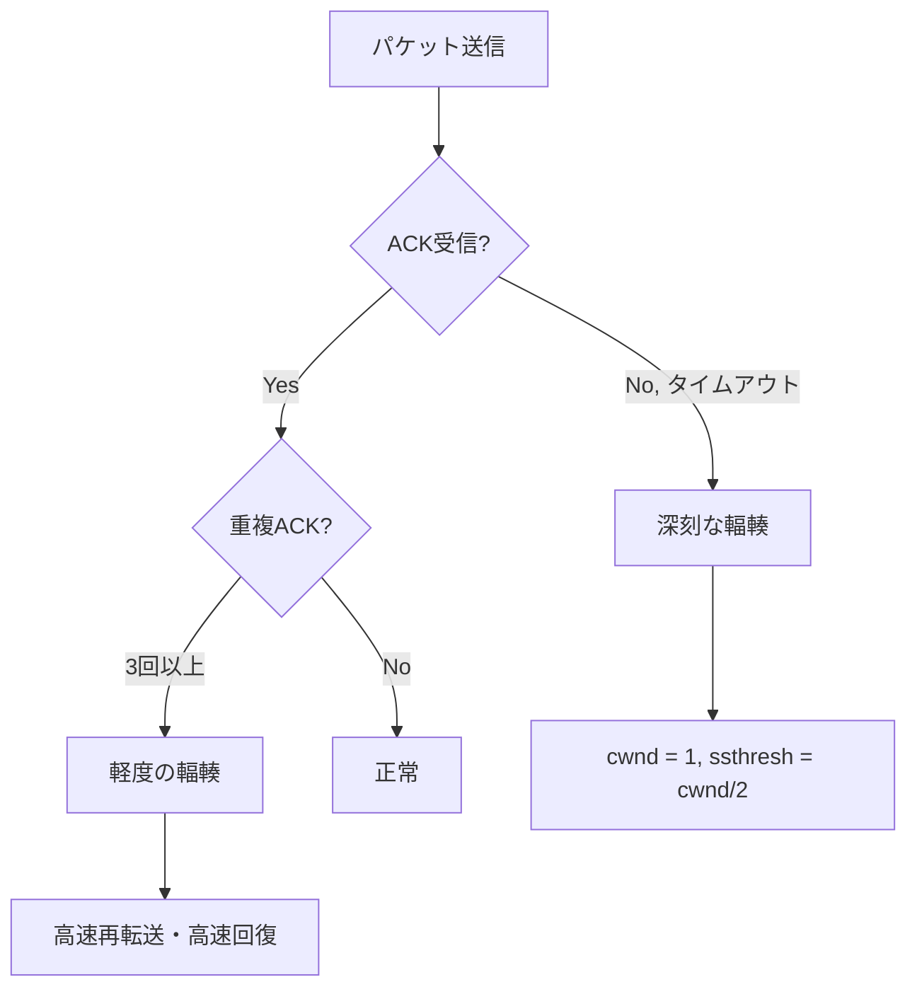
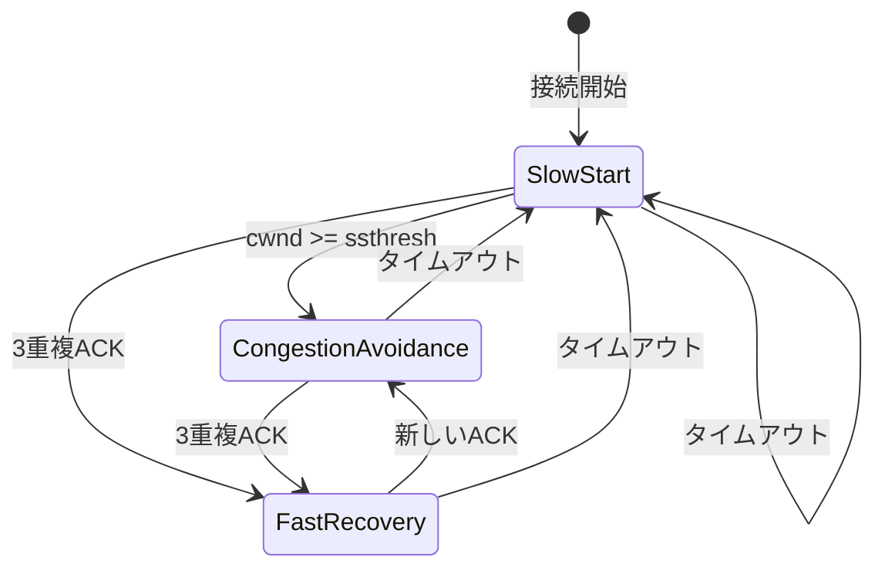
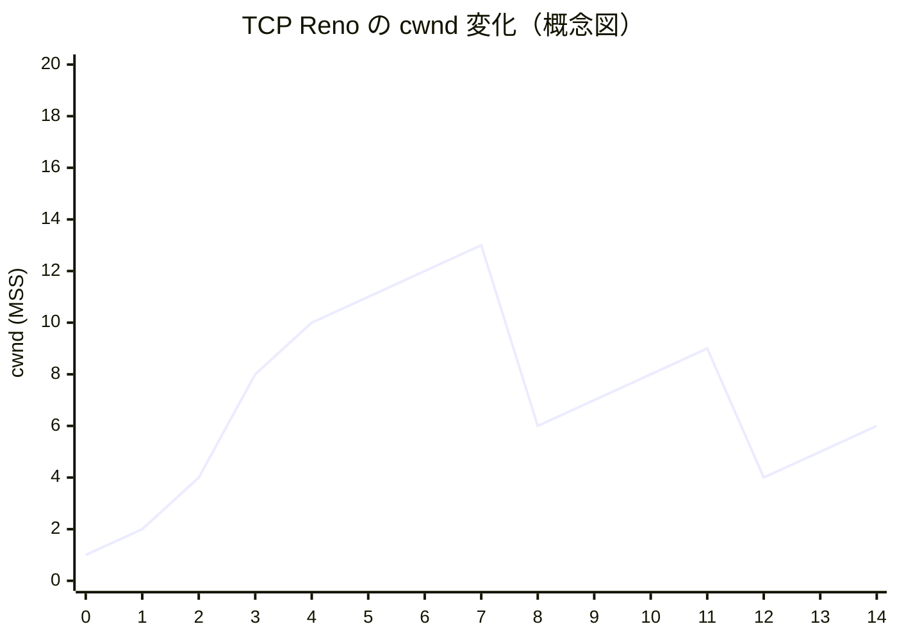
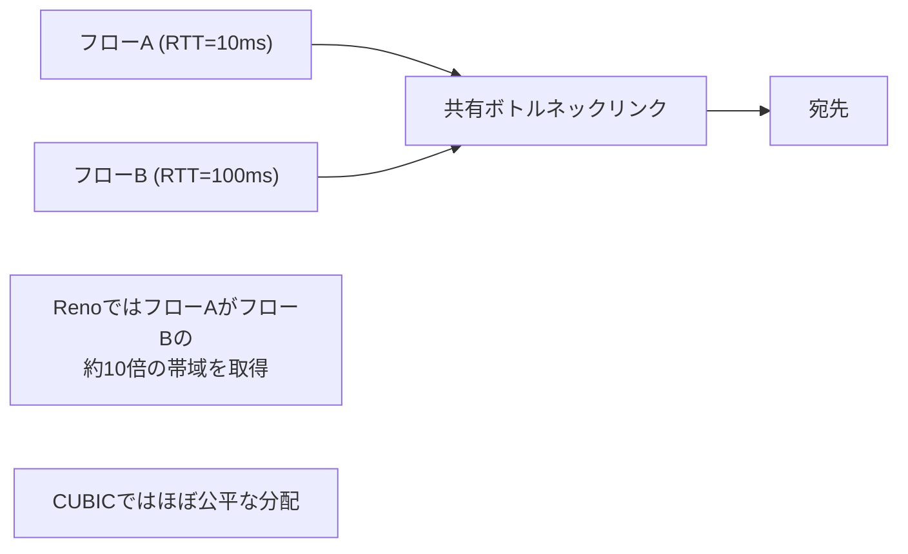
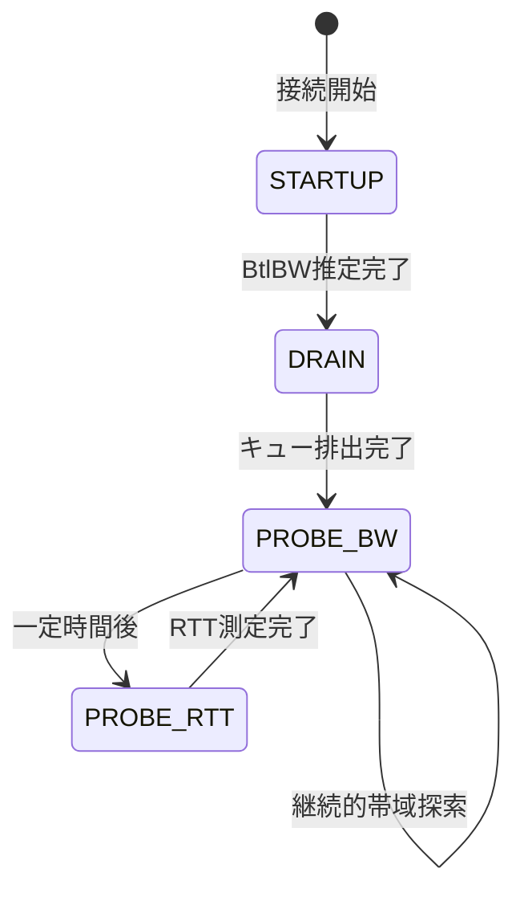
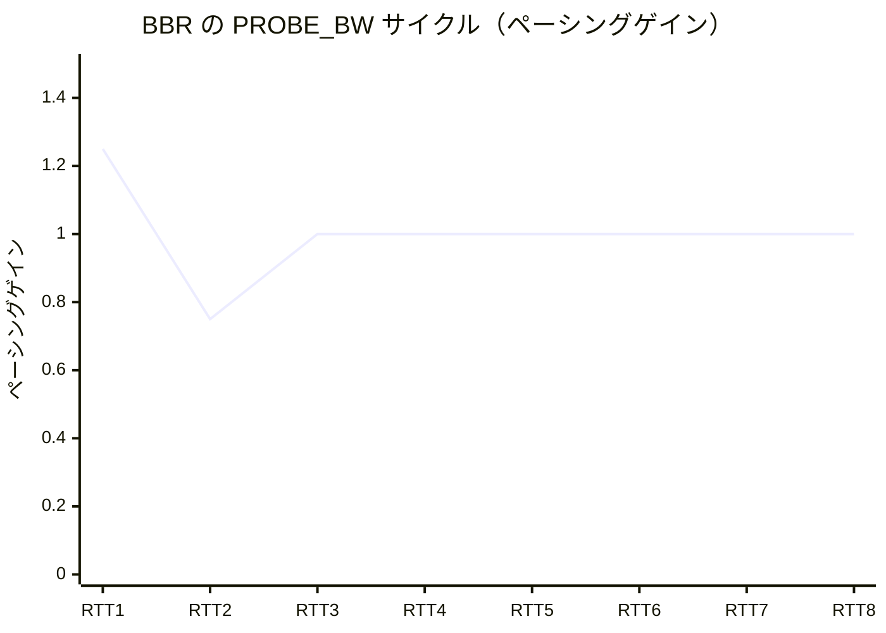

# TCP輻輳制御（Reno, CUBIC, BBR）

インターネットが現在のような規模で安定して機能しているのは、偶然ではない。1980年代後半、インターネットはほぼ崩壊しかけた。その危機を救い、今日まで世界中のデータ転送を支え続けているのが、TCPの輻輳制御機構である。本記事では、輻輳制御がなぜ必要なのかという根本的な問いから出発し、Reno・CUBIC・BBRという三世代のアルゴリズムがそれぞれどのような問題意識から生まれ、どう動作するのかを深く掘り下げていく。

## 1. 歴史的背景：輻輳崩壊とインターネットの危機

### 1.1 1986年の輻輳崩壊

1986年10月、インターネットの前身であるARPANETで前例のない事態が発生した。LBL（ローレンス・バークレー研究所）からUC Berkeleyへの接続スループットが、32 kbps から 40 bps まで急落したのである。劣化の比率は実に800倍。ネットワークはほぼ完全に機能を停止した。この現象は後に**輻輳崩壊（congestion collapse）**と呼ばれるようになる。

原因はシンプルだった。当時のTCPには輻輳を感知し制御する仕組みが存在しなかった。各ホストは自分が送りたいだけパケットを送り続けた。ルーターのキューが溢れるとパケットが破棄され、送信側はタイムアウトを検知して同じデータを再送する。しかし再送されたパケットもまたキューを溢れさせ、さらに多くのパケットが廃棄される。この悪循環がネットワーク全体を麻痺させた。

理論的には、パケットが廃棄されるほど混雑している状況で、各ホストが再送を繰り返せばするほど有効なスループットは下がる一方だ。ネットワークリソースは浪費され、誰の通信も前進しない「詰まった状態」が持続する。

### 1.2 Van Jacobsonの貢献

この危機に対処したのが、Van Jacobsonである。彼は1988年に画期的な論文「Congestion Avoidance and Control」を発表し、TCPに輻輳制御を導入する手法を提案した。この論文で提示された概念——スロースタート、輻輳回避、高速再転送——は現代の輻輳制御の基礎となり、今日もその本質的な考え方は生き続けている。

Jacobsonのアプローチの本質は、**ネットワーク内部の状態をエンドホストから推定する**という発想にある。ルーターは明示的な信号を送らない。しかし、パケットロスやRTT（往復遅延時間）の変化を観察することで、ネットワークが混雑しているかどうかを間接的に知ることができる。

### 1.3 なぜ輻輳制御が難しいのか

輻輳制御が本質的に難しいのは、以下の理由による。

**情報の非対称性**: 各エンドホストは自分の接続しか見えない。ネットワーク全体の状態は不可視である。

**分散制御の問題**: すべてのホストが独立して動作する。中央集権的な調整機構は存在しない。各ホストが自分の利益を最大化しようとすると、集合的には全員が損をする状況（囚人のジレンマ的構造）が生じる。

**フィードバックの遅延**: パケットを送り、その結果（ACKやロス）が返ってくるまでにRTT分の時間がかかる。ネットワークの状態は刻々と変化しているが、フィードバックは常に過去の状態を反映したものである。

**多様なネットワーク環境**: インターネットは均質ではない。ギガビット光ファイバーもあれば、高遅延・低帯域の衛星リンクもある。一つのアルゴリズムがすべての環境で最適に機能することは難しい。

## 2. 輻輳制御の基本原理

### 2.1 輻輳ウィンドウ（cwnd）

TCPの送信側は、**輻輳ウィンドウ（congestion window, cwnd）**という概念を用いて送信量を制御する。cwndは、ACKを受け取ることなく同時に「空中に飛ばせる」バイト数の上限を表す。実際の送信可能量は、cwndと受信側が通知する受信ウィンドウ（rwnd）の小さい方によって決まる。

$$
\text{送信可能量} = \min(\text{cwnd}, \text{rwnd})
$$

輻輳制御の目的は、このcwndを適切に調整することで、ネットワークを過負荷にすることなく最大のスループットを達成することである。

### 2.2 AIMD：加算的増加・乗算的減少

輻輳制御の中核にあるのが**AIMD（Additive Increase, Multiplicative Decrease）**という方針である。

- **加算的増加（Additive Increase）**: 輻輳が検知されていない間、cwndをゆっくりと（線形に）増加させる。
- **乗算的減少（Multiplicative Decrease）**: 輻輳が検知されたとき、cwndを急激に（乗算的に）減少させる。

この非対称な増減戦略には深い意味がある。もし増加と減少が対称だったとすると、複数のホストが同じリンクを共有しているとき、公平な帯域分配が実現しにくくなる。AIMDは、複数のフローが収束して公平な帯域分配（ビセクタ公平性）に近づく性質を持つことが数学的に示されている。

```
cwnd
  |          /\          /\
  |         /  \        /  \
  |        /    \      /    \
  |       /      \    /      \
  |      /        \  /        \
  |     /          \/          \
  +-----------------------------------> time

  加算的増加で徐々に上昇し、輻輳（\）で急落、を繰り返す
```

### 2.3 スロースタート

AIMDだけでは不十分だ。接続開始時にcwndを小さな値から線形に増やしていては、利用可能な帯域に到達するまでに長い時間がかかる。そこでJacobsonは**スロースタート（slow start）**を導入した。

名称に反して、スロースタートはむしろ高速だ。ACKを受け取るたびにcwndをMSS（最大セグメントサイズ）分増加させる。1つのACKが1つのパケットに対応するので、1RTTごとにcwndが2倍になる。これは線形増加ではなく指数増加である。

```
RTT 1: cwnd = 1 MSS → 1パケット送信
RTT 2: cwnd = 2 MSS → 2パケット送信
RTT 3: cwnd = 4 MSS → 4パケット送信
RTT 4: cwnd = 8 MSS → 8パケット送信
...
```

スロースタートは、**スロースタート閾値（ssthresh）**に達するまで続く。ssthreshを超えると輻輳回避フェーズに移行し、増加率が線形に切り替わる。

### 2.4 輻輳の検知方法

TCPが輻輳を検知する方法は主に二つある。

**タイムアウト**: パケットを送信してから一定時間（RTO：再転送タイムアウト）以内にACKが返ってこない場合。これは深刻な輻輳の兆候と見なされる。

**重複ACK（duplicate ACK）**: 受信側は、順番通りに受信できたパケットに対してACKを返す。途中のパケットが欠落すると、それ以降のパケットを受信しても同じシーケンス番号のACKを繰り返す（重複ACK）。3つの重複ACKを受け取ると、パケットロスが発生したと判断する。タイムアウトよりも軽微な輻輳の兆候と見なされる。



## 3. TCP Reno / NewReno

### 3.1 TCP Renoの状態機械

TCP Renoは、Van Jacobsonの研究を実装に落とし込んだ最初の標準的な輻輳制御アルゴリズムである。1990年代から2000年代にかけて広く使われた。

Renoには4つの主要な状態がある。



**スロースタート（Slow Start）**
- cwndを1 MSSから開始
- ACKごとにcwndを1 MSS増加（指数増加）
- cwndがssthreshに達したら輻輳回避へ

**輻輳回避（Congestion Avoidance）**
- 1 RTTごとにcwndを1 MSS増加（線形増加）
- 具体的には、ACKごとに `cwnd += MSS * MSS / cwnd` を加算

**高速再転送（Fast Retransmit）**
- 3つの重複ACKを受け取ったとき、タイムアウトを待たずに即座に再送
- ssthreshをcwnd/2に設定
- cwndをssthreshに設定して高速回復へ

**高速回復（Fast Recovery）**
- 重複ACKを受け取るたびにcwndを1 MSS増加（再送パケットが「ネットワーク内にある」ことを考慮）
- 新しいACKを受け取ったとき、輻輳回避フェーズへ移行

### 3.2 cwndの時間的変化

TCP Renoのcwndは典型的に以下のようなパターンを描く。



スロースタートで急激に増加し、ssthreshに達すると線形に増加する。輻輳（ロス）を検知すると半減し、再び線形増加を繰り返す。このノコギリ歯状のパターンがReno / NewRenoの特徴的な挙動である。

### 3.3 TCP NewReno：マルチパケットロスへの対応

TCP Renoには重大な問題があった。1つのウィンドウ内で複数のパケットが失われた場合、Renoは適切に対処できない。1つのロスから回復した後、次のロスで再び高速回復に入るため、回復に時間がかかる。

**TCP NewReno**（RFC 6582）はこの問題を解決する。高速回復中に部分的なACK（partial ACK：最初に失われたパケット以降のデータを確認するACKだが、ウィンドウ全体を確認するわけではないもの）を受け取ったとき、それを次の失われたパケットの指示と解釈して継続的に再送する。これにより、1回の高速回復フェーズで複数のロスに対処できる。

```
Reno の場合（2パケット失われた場合）:
  1. パケットN ロス検知 → 高速回復開始
  2. パケットN 再送、部分的ACK受信 → 輻輳回避に移行
  3. パケットM ロス検知（次のウィンドウで） → 再び高速回復
  ※ 2回の高速回復が必要

NewReno の場合:
  1. パケットN ロス検知 → 高速回復開始
  2. パケットN 再送、部分的ACK受信 → まだ高速回復を継続
  3. パケットM 再送 → 新しいACKで高速回復終了
  ※ 1回の高速回復で完了
```

### 3.4 Renoの本質的限界

TCP Renoは輻輳崩壊を防ぐという点では見事に機能した。しかし、設計上の制約から来る本質的な問題を抱えていた。

**高帯域・高遅延ネットワーク（LFN）での非効率**: bandwidth-delay product（BDP）が大きい環境では、パイプを満たすためにcwndを大きくする必要がある。しかしcwndが大きいと、1パケットのロスでcwndが半減した際の損失が大きい。また、半減したcwndを再びBDP相当まで回復するのに多くのRTTが必要となる。

**1 RTTに1 MSS増加の限界**: 10 Gbpsリンクで1500バイトのMSSを使う場合、帯域を最大限利用するのに必要なRTTの数は膨大になる。

**パケットロスを輻輳の唯一の信号とすること**: 無線ネットワークではビットエラーによるランダムロスが発生する。これは輻輳とは無関係だが、Renoはそれを輻輳と誤認識してcwndを下げてしまう。

これらの問題を解決すべく、次世代アルゴリズムが開発された。

## 4. CUBIC：高帯域環境のための設計

### 4.1 BIC-TCPからCUBICへ

2000年代に入り、ブロードバンドインターネットが普及し始めると、TCP Renoの限界が顕在化した。1 Gbps、さらには10 Gbpsのリンクが登場し、大陸間の高遅延リンクが一般化した。BDP（bandwidth-delay product）は劇的に大きくなり、Renoのcwnd増加則では帯域を使いきれなかった。

この問題に最初に本格的に取り組んだのが**BIC-TCP**（Binary Increase Congestion TCP）だ。BIC-TCPは二分探索的なアプローチで、「以前にロスした時点のcwnd」と「現在のcwnd」の間の中点へとcwndを移動させる。これにより、高帯域ネットワークでの回復を高速化しつつ、Renoよりも公平に帯域を分配しようとした。

しかしBIC-TCPはRTTの小さいフローに対して攻撃的すぎるという批判を受けた。そこで**CUBIC**（RFC 8312, 2008年）が設計された。CUBICはBIC-TCPの後継として、より滑らかな増加関数を採用している。

### 4.2 CUBICの核心：3次関数による増加

CUBICの名前の由来は、cwndの増加に**3次関数（cubic function）**を用いることにある。

最後にウィンドウサイズを減少させた時点を $t_0$、その時のcwndを $W_{max}$ とする。CUBIC関数は以下のように定義される。

$$
W(t) = C \cdot (t - K)^3 + W_{max}
$$

ここで、

$$
K = \sqrt[3]{\frac{W_{max} \cdot \beta}{C}}
$$

- $C$: CUBICスケーリング定数（デフォルト0.4）
- $\beta$: ウィンドウ減少係数（デフォルト0.7）
- $t$: ウィンドウ最終減少時点からの経過時間

この関数の形状を理解することがCUBICを理解する鍵だ。

```
cwnd
  |                      *
W_max|...*.................*
  |    * \             * /
  |   *    \         *  /
  |  *       \     *   /
  |  *         * *    /
  | *                /
  +--------------------> t
      t0    K    t0+T

  K付近でゆっくり変化し（=W_maxに慎重に近づく）
  W_maxを超えてからは急速に増加する（探索フェーズ）
```

この関数の特性：

1. **$K$ 付近（$W_{max}$ 周辺）では増加が緩やか**: 前回ロスが発生したウィンドウサイズ付近では慎重に増加する。これは輻輳が再発しやすい「危険域」への配慮だ。

2. **$W_{max}$ を超えると急速に増加**: 前回のロスポイントを超えてからは積極的に帯域を探索する。

3. **RTT非依存性**: 重要な特性として、CUBIC関数の引数は経過「時間」であり、ACK数（=RTT数）ではない。RTTが短いフローも長いフローも、同じ時間でほぼ同じcwnd増加を得られる。

### 4.3 RTT公平性

TCP Renoには**RTT不公平性**という問題がある。RTTが短いフロー（近距離の通信）は1秒あたりに多くのACKを受け取り、RTTが長いフロー（遠距離の通信）よりも速くcwndを増加させる。同じリンクを共有していても、RTTが半分のフローは帯域を2倍多く確保できてしまう。

$$
\text{Renoのスループット} \approx \frac{\text{MSS}}{\text{RTT} \cdot \sqrt{p}}
$$

（$p$ はパケットロス率）

CUBICはこの問題を大幅に改善する。cwnd増加が経過時間の関数であるため、RTTの違いによるcwnd増加速度の差が小さくなる。



### 4.4 Reno互換性

CUBICはTCP Renoよりも低帯域・低遅延環境では攻撃的すぎる可能性がある。そこでCUBICには**Reno友好モード**が実装されている。

CUBICによるcwnd増加がRenoによる増加よりも少ない場合、CUBICはReno相当の増加にフォールバックする。これにより、CUBICフローがReno環境でも公平に振る舞えるようにしている。

### 4.5 CUBICの実装とデプロイ

CUBICはLinuxカーネルのデフォルトTCP輻輳制御アルゴリズムとして採用されており（Linux 2.6.19以降）、Androidや多くのLinuxサーバーで利用されている。

```c
/* Linux kernel CUBIC implementation (simplified) */
static void bictcp_update(struct bictcp *ca, u32 cwnd, u32 acked)
{
    u32 delta, bic_target, max_cnt;
    u64 offs, t;

    /* Calculate cubic function */
    t = (s32)(tcp_jiffies32 - ca->epoch_start);
    t += msecs_to_jiffies(ca->delay_min >> 3); /* Offset by min delay */

    /* W_cubic(t) = C*(t-K)^3 + W_max */
    offs = (t < ca->bic_K) ? (ca->bic_K - t) : (t - ca->bic_K);

    /* Compute cubic target */
    delta = (cube_factor * offs * offs * offs) >> (10 + 3 * BICTCP_HZ);
    bic_target = (t < ca->bic_K) ?
        ca->bic_origin_point - delta :
        ca->bic_origin_point + delta;

    /* ... (additional Reno-friendly calculation) */
}
```

## 5. BBR：根本的に異なるアプローチ

### 5.1 パラダイムシフト：ロスベースからモデルベースへ

TCP Renoの時代からCUBICに至るまで、すべてのTCP輻輳制御アルゴリズムは**ロスベース（loss-based）**だった。つまり、パケットロスをネットワーク輻輳の主要なシグナルとして使用していた。

しかし2016年、Googleは**BBR（Bottleneck Bandwidth and RTT）**を発表した。BBRはロスではなく、**帯域幅とRTTの測定値**を直接使って最適な送信レートを計算するという、根本的に異なるアプローチを採用している。

なぜこの転換が重要なのか？ロスベースのアルゴリズムには構造的な問題がある。

**バッファの膨張（Bufferbloat）**: ルーターのバッファが大きくなるにつれ、キューが溢れてパケットが廃棄される前に、巨大なキューが形成されてしまう。このバッファ内のデータはスループットに貢献しない（輸送効率を下げる）一方で、RTTを著しく増加させる。ロスベースのアルゴリズムは「キューが溢れたとき」にしか輻輳を検知しないため、常に不必要なバッファリングを引き起こす。

```
ロスベースのアルゴリズムが狙う動作点:

  スループット
  ^
  |          ****
  |       ***    ****
  |     **           ****
  |  ***                  ****→ ロス開始点（ここを目標にする）
  +-------------------------> 送信レート

  実際のネットワークの最適動作点:

  スループット
  ^
  |     *
  |   ** ← ここ（BDP点）が最適
  |  *
  | *
  +-------------------------> 送信レート
```

### 5.2 BBRの物理モデル

BBRはネットワークを物理的にモデル化する。任意のネットワークパスは以下の2つのパラメータで特徴づけられる。

- **BtlBW（Bottleneck Bandwidth）**: ボトルネックリンクの帯域幅
- **RTprop（Round-Trip propagation delay）**: パイプが空の状態での伝播遅延（キューイング遅延なし）

最適な動作点は「パイプを満たしながら、余分なキューを作らない点」であり、これは以下の送信レートに対応する。

$$
\text{最適送信レート} = \text{BtlBW}
$$

$$
\text{最適 in-flight データ量} = \text{BtlBW} \times \text{RTprop} = \text{BDP}
$$

BBRは常にBtlBWとRTpropを推定し、その積（BDP）に基づいてcwndを設定しようとする。

### 5.3 BtlBWとRTpropの測定

問題は、BtlBWとRTpropを同時に正確に測定することはできないという点だ。

- **BtlBWを測定するには**: できるだけ多くのデータを送り、実現スループットを観察する必要がある（パイプを満たした状態が必要）
- **RTpropを測定するには**: パイプをできるだけ空にする必要がある（キューイング遅延を排除）

つまり、二つの測定は相反する条件を必要とする。BBRはこの問題を、時間ウィンドウを設けてそれぞれを交互に推定することで解決する。

**BtlBWの推定**: `delivery_rate = データ量 / 経過時間` をACKごとに計算し、最近10 RTT以内の最大値を使用する。

**RTpropの推定**: 観測されたRTTの最近10秒以内の最小値を使用する（キューが空のときのRTTに最も近い値）。

### 5.4 BBRの状態機械

BBRは以下の4つの状態を持つ。



**STARTUP（スタートアップ）フェーズ**
- スロースタートに相当する
- BtlBWが最初に推定されるまで、送信レートをほぼ指数的に増加させる
- 3連続でBtlBWが増加しなくなったとき、BtlBWに収束したと判断して終了
- Renoのスロースタートと似ているが、ロスではなくBtlBWの変化で判断する

**DRAIN（排出）フェーズ**
- STARTUPで蓄積されたキューを排出する
- ペーシングゲインを1/2.89に設定してキューを素早く排出
- in-flightデータ量がBDPを下回ったらPROBE_BWへ

**PROBE_BW（帯域探索）フェーズ**
- 通常の運用フェーズ
- 8 RTTのサイクルで送信レートを周期的に変化させる
  - 1 RTT: ゲイン1.25（帯域を積極的に使用、帯域増加を探索）
  - 1 RTT: ゲイン0.75（パイプ内のキューを排出）
  - 6 RTT: ゲイン1.0（定常状態）

**PROBE_RTT（RTT探索）フェーズ**
- 少なくとも10秒ごとに開始
- cwndを4 MSSまで縮小して約200msの間、RTpropを再測定
- これにより、バッファリングが減少し実際の伝播遅延を観測できる



### 5.5 ペーシング（Pacing）

BBRのもう一つの重要な特徴が**ペーシング**である。ロスベースのアルゴリズムはバースト的に（ACKを受け取ったら即座に次のパケットを送る）パケットを送出する傾向があるが、BBRはパケットを均等な間隔で送出する。

$$
\text{ペーシングレート} = \text{BtlBW} \times \text{ペーシングゲイン}
$$

ペーシングにより、ルーターのキューへの瞬間的な負荷が均等化され、余分なキューが蓄積されにくくなる。これはBBRがバッファブロートを回避できる重要な理由の一つだ。

### 5.6 BBRの革新性と課題

BBRは実環境で劇的な改善をもたらした。Googleの報告によれば、BBRの導入後：

- 高帯域・高遅延リンクでのスループットが最大2,700%向上
- ランダムロスが多い環境（衛星リンクなど）での改善が顕著
- バッファブロートの大幅な削減

しかしBBRにも課題がある。

**公平性の問題**: BBRとCUBICが同じボトルネックリンクを共有する場合、BBRがCUBICよりも多くの帯域を占有する傾向がある。これは実環境での混在展開（一部のサーバーのみがBBRを使用）において問題となりうる。

**浅いバッファ環境でのロス**: PROBE_BWでゲイン1.25を使う際、バッファが浅いルーターではパケットロスが発生することがある。

**RTT測定の精度**: RTpropの推定に10秒以上かかる場合があり、RTTが急激に変化する環境では不正確な推定をすることがある。

これらの課題を踏まえてGoogleはBBRv2を開発し、パケットロスも一定程度考慮するハイブリッドなアプローチを採用している。

## 6. 各アルゴリズムの比較と実環境での挙動

### 6.1 特性の比較

| 特性 | TCP Reno/NewReno | CUBIC | BBR |
|------|----------------|-------|-----|
| 輻輳シグナル | パケットロス | パケットロス | BtlBW, RTT |
| cwnd増加則 | 線形（ACKごと） | 3次関数（時間ベース） | BDP推定ベース |
| ロス時の動作 | cwnd半減 | cwnd×0.7 | （ロスを直接使わない） |
| RTT公平性 | 低い | 中程度 | 高い |
| 高帯域効率 | 低い | 中〜高 | 高い |
| ランダムロスへの耐性 | 低い | 低い | 高い |
| バッファブロート | 発生しやすい | 発生しやすい | 発生しにくい |
| 実装複雑度 | 低い | 中程度 | 高い |

### 6.2 ネットワーク環境別の挙動

**低帯域・低遅延（LAN環境）**

この環境ではすべてのアルゴリズムが比較的良好に機能する。BDPが小さいため、cwndが小さくても帯域を使いきれる。RTT公平性の問題も目立たない。

**高帯域・高遅延（大陸間インターネット）**

BDPが大きいこの環境でRenoは著しく非効率だ。CUBICは大幅に改善するが、BBRがさらに優秀。BBRはパイプをほぼ完全に満たしながら、余分なキューをほとんど作らない。

**無線・モバイル（ランダムロスあり）**

Renoとcubicはランダムロスを輻輳と誤認識してcwndを不必要に下げる。BBRはBtlBWベースで動作するため、ランダムロスの影響を受けにくい。ただし極端に高いロス率（>2%）ではBBRの帯域推定も影響を受ける。

**浅いバッファのルーター（家庭用ルーターなど）**

CUBICはロスを輻輳シグナルとして使うため、浅いバッファでも比較的良好に機能する。BBRのPROBE_BWフェーズ（ゲイン1.25）がバッファを溢れさせることがある。

**データセンター内部（超低遅延）**

RTTが数マイクロ秒〜数ミリ秒のデータセンター環境では、BBRのRTprop計測（最小10秒サイクル）が非常に遅い。DCTCP（Data Center TCP）など、専用のアルゴリズムが使われることが多い。

### 6.3 実測データによる比較

Googleの論文（2016年）から引用される代表的な比較：

**低リンクバッファ（ランダムロス0.1%）での比較**:
- CUBIC: 約1 Mbps（CWnd頻繁にリセット）
- BBR: 約95 Mbps（ロスに影響されない）

**衛星リンク（高RTT）での比較**:
- CUBIC: RTT 1500ms, スループット劣化
- BBR: RTT 100ms（実際の伝播遅延に近い）、高スループット

これらの数字はBBRの改善が単なる微調整ではなく、桁違いの改善をもたらすことを示している。

## 7. 公平性の問題と将来の方向性

### 7.1 アルゴリズム間の公平性問題

**BBRとCUBICの共存問題**

インターネットはアルゴリズムを自由に選択できる分散システムだ。一部のホストがBBRを、他のホストがCUBICを使っている状況は日常的に発生する。この混在環境での公平性が問題となる。

研究によれば、BBRとCUBICが同じボトルネックを共有する場合：

- BBRはロスに反応しないため、CUBICよりも多くの帯域を占有しやすい
- CUBICはロスに反応してcwndを下げるが、BBRは下げないため不均衡が生じる

これは実際の問題として、例えばYouTubeのBBR採用初期に報告されたいくつかの公平性懸念に対応するものだ。

**ロスベースアルゴリズム同士の公平性**

ロスベースアルゴリズム間では、AIMDの数学的性質から、長期的にはほぼ公平な帯域分配が実現する。ただし：

- RTT不公平性（Renoでは顕著）
- ショートフロー（マウスフロー）vs ロングフロー（エレファントフロー）の不公平

これらはCUBICで一定程度改善されている。

### 7.2 明示的輻輳通知（ECN）

ロスを輻輳の代理指標として使うことの根本的問題を解決する試みが**ECN（Explicit Congestion Notification）**だ（RFC 3168）。

ECNでは、ルーターが輻輳を検知したとき、パケットをドロップする代わりにIPヘッダーのECNビットをマーキングする。受信側はこれをACKに反映し、送信側はパケットロスと同じようにcwndを減少させる。

利点：
- パケットを廃棄しなくて済む（再送のオーバーヘッドがない）
- ロスが発生する前に輻輳シグナルを得られる
- バッファブロートの軽減に貢献

課題：
- ルーターとエンドホスト双方がECNをサポートする必要がある
- ミドルボックス（ファイアウォールなど）がECNビットを書き換えることがある

### 7.3 QUIC とトランスポート層の進化

QUICは、GoogleによってTCPの代替として設計されたトランスポートプロトコルで、現在IETF標準（RFC 9000）となっている。HTTP/3の基盤として使われる。

QUICはTCPと同様の輻輳制御を行うが、以下の点で異なる：

- **ユーザー空間での実装**: カーネルを変更せずに輻輳制御アルゴリズムを更新できる
- **ヘッドオブラインブロッキングの解消**: 複数のストリームが独立して動作し、1つのストリームのロスが他のストリームをブロックしない
- **接続移行**: IPアドレスが変わっても（Wi-Fiからモバイルへの切り替えなど）接続を維持できる
- **0-RTTハンドシェイク**: 既知のサーバーへの再接続時、ハンドシェイクなしでデータ送信を開始できる

QUICにおいてもBBRは重要な輻輳制御アルゴリズムとして使われている。

### 7.4 将来の方向性

**学習ベースの輻輳制御**

深層強化学習を用いた輻輳制御アルゴリズムの研究が活発だ。MITのPensieve、CarnegieMellonのPCC（Performance-oriented Congestion Control）などが提案されている。これらは特定のネットワーク環境に最適化されたポリシーを学習できるが、汎用性や解釈可能性に課題がある。

**BBRv2とその後**

BBRv2はパケットロスを完全に無視するのではなく、ロス率が一定の閾値を超えた場合にはcwndを調整する。これによりCUBICとの公平性問題が改善される。さらなるBBRv3の研究も続いている。

**ネットワーク-コンピュート協調**

スマートNIC（Network Interface Card）やP4プログラマブルスイッチの普及により、ネットワーク内部で細かい制御ができるようになりつつある。これにより、エンドホストだけでなくネットワーク機器も積極的に輻輳制御に参加する「In-Network Computing」のアプローチが注目されている。

**MultiPath TCP（MPTCP）**

複数の物理パスを同時に使ってデータを送受信するMPTCPは、帯域の合算や冗長性の確保に有効だ。ただし複数パスにまたがる輻輳制御は単一パスよりも複雑で、パス間の帯域分配の公平性が課題となる。

### 7.5 輻輳制御における不変の課題

アルゴリズムが進化し続ける中でも、いくつかの根本的な課題は残り続ける。

**最適性と公平性のトレードオフ**: 個々のフローのスループットを最大化することと、複数のフロー間で公平に帯域を分配することは、多くの状況で相反する。

**局所情報と大域最適**: 各エンドホストは局所的な観測（自分のACK、ロス、RTT）しか持たない。この情報から大域的に最適な輻輳制御を達成することは理論的に困難であり、常に近似的な解に留まる。

**ゲーム理論的問題**: もし一部のホストが公平性を無視して利己的な振る舞いをすれば、より多くの帯域を得られる（ただし全員がそうすれば輻輳崩壊が再現する）。これは公有地の悲劇（tragedy of the commons）の構造だ。AIMDのような協調的なプロトコルが機能するのは、大多数のホストがルールに従っているからであり、それが崩れると問題が生じる。

## まとめ

TCP輻輳制御の歴史は、インターネットという分散システムとの継続的な格闘の歴史だ。

**Reno**は輻輳崩壊の危機を救い、インターネットを安定させた。パケットロスを輻輳のシグナルとしてAIMDで制御するというシンプルな原理は、今も多くのシステムで生き続けている。しかし高帯域・高遅延環境での非効率さと、RTT不公平性という限界を持つ。

**CUBIC**は3次関数を用いた時間ベースのcwnd増加で高帯域ネットワークへの対応を改善した。Linuxのデフォルトとなり、今日のインターネットトラフィックの大部分を処理している。RTT公平性は改善されたが、ロスベースであることの本質的限界（バッファブロート、ランダムロスへの誤反応）は残る。

**BBR**はパラダイムを転換した。ロスではなくBtlBWとRTpropという物理的な量を測定し、ネットワークの本質的な容量に合わせた送信を行う。バッファブロートを大幅に削減し、特に劣悪なネットワーク環境での改善は顕著だ。ただし公平性の問題と実装の複雑さという新たな課題を持ち込んだ。

これら三つのアルゴリズムの変遷が示すのは、輻輳制御の「正解」が一つではないということだ。ネットワーク環境は多様であり、それぞれの環境に適したアルゴリズムが存在する。インターネットの進化とともに、輻輳制御の探求も続いていく。

## 参考文献

- Jacobson, V. (1988). "Congestion Avoidance and Control". ACM SIGCOMM Computer Communication Review.
- Ha, S., Rhee, I., & Xu, L. (2008). "CUBIC: A New TCP-Friendly High-Speed TCP Variant". ACM SIGOPS Operating Systems Review.
- Cardwell, N., Cheng, Y., Gunn, C. S., Yeganeh, S. H., & Jacobson, V. (2016). "BBR: Congestion-Based Congestion Control". ACM Queue.
- RFC 5681: TCP Congestion Control (2009)
- RFC 8312: CUBIC for Fast Long-Distance Networks (2018)
- RFC 9000: QUIC: A UDP-Based Multiplexed and Secure Transport (2021)
- Alizadeh, M., et al. (2010). "Data Center TCP (DCTCP)". ACM SIGCOMM.
