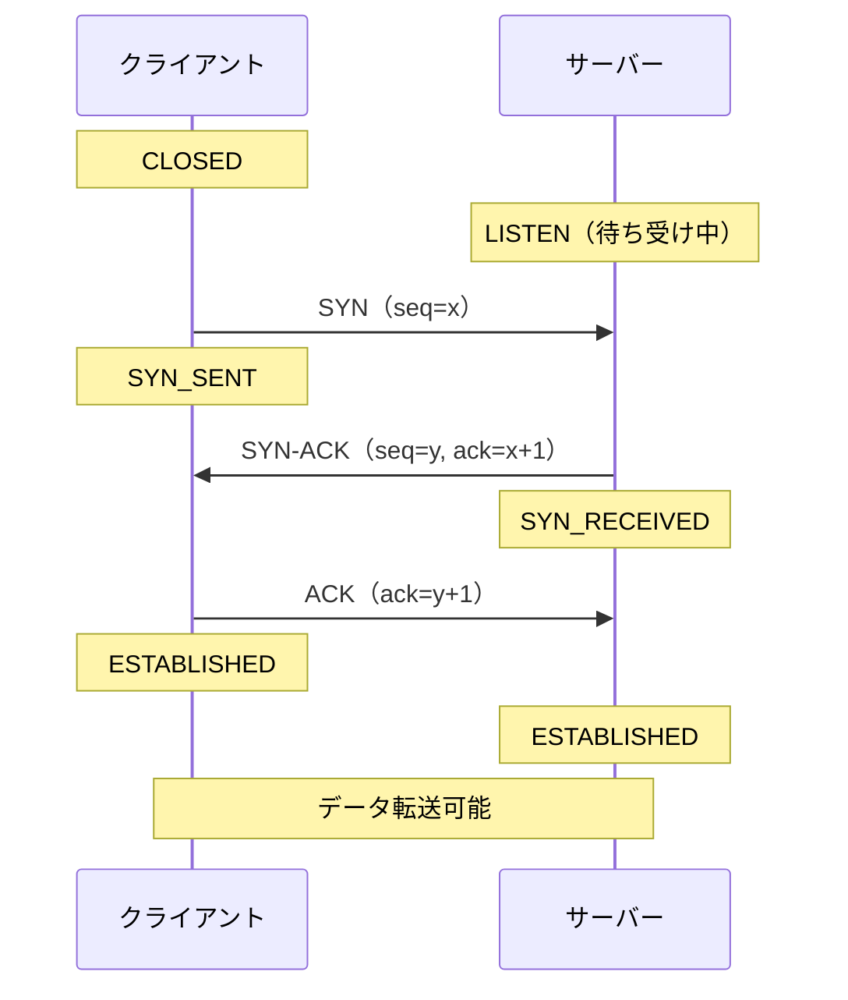
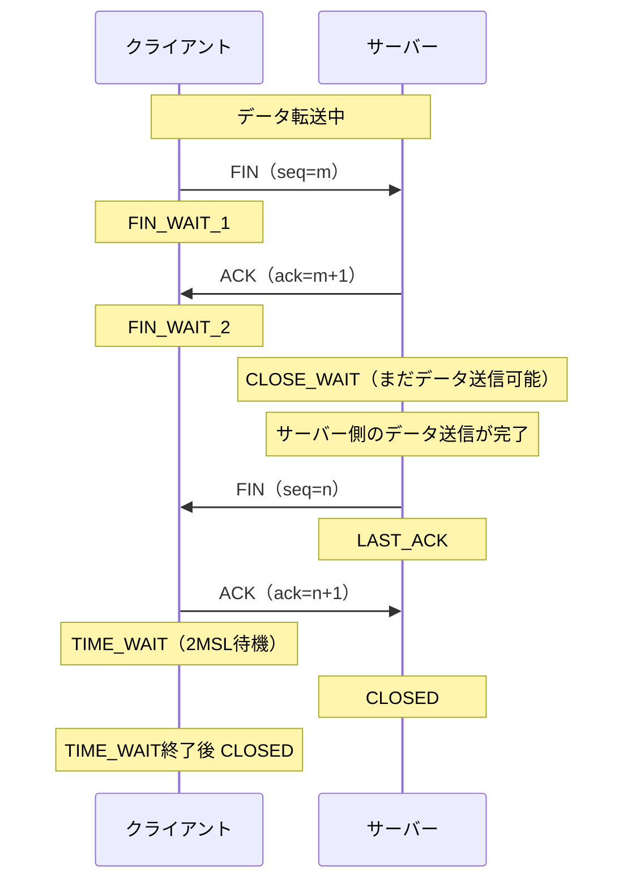
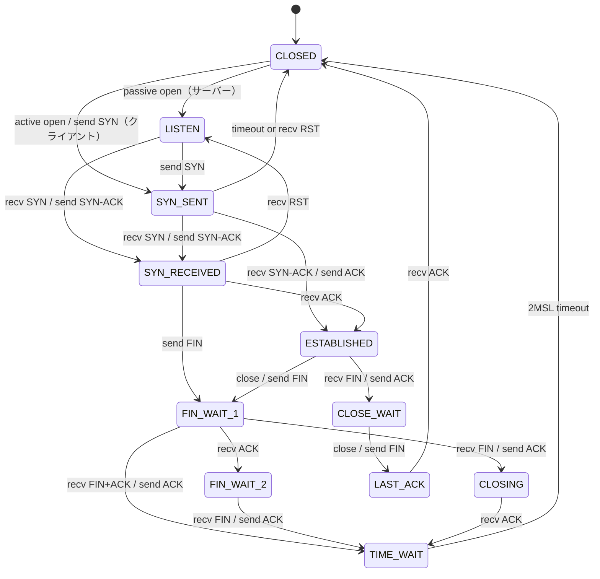
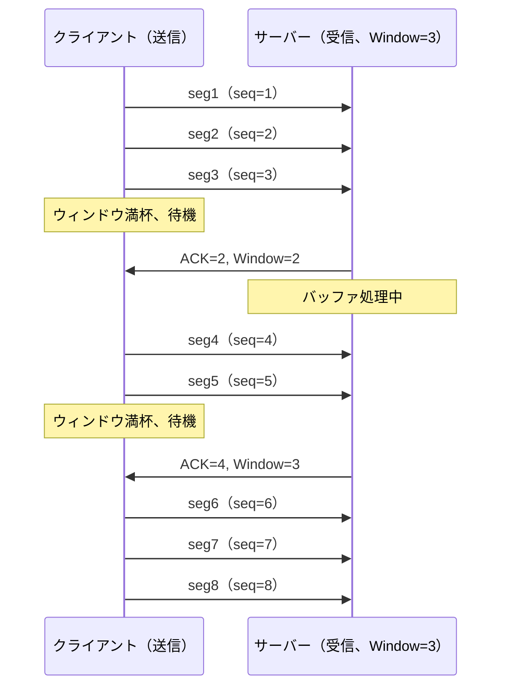
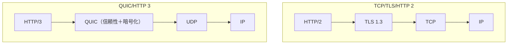

# TCP — 信頼性のある通信の仕組み

## 1. 歴史的背景：TCPはなぜ生まれたか

### 1.1 インターネットの前身 — ARPANET

1969年、米国国防総省の高等研究計画局（ARPA）は**ARPANET**を構築した。当初のネットワークは4台のノード（UCLA、スタンフォード研究所、UC サンタバーバラ、ユタ大学）を接続するだけの小規模なものだったが、この実験的なネットワークがインターネットの原型となった。

ARPANETの設計思想は革新的だった。当時主流だった**回線交換**（電話網のように通信のたびに専用回線を確保する方式）とは異なり、**パケット交換**を採用した。パケット交換では、データを小さな塊（パケット）に分割し、それぞれのパケットが独立して経路を選びながら宛先に届く。この設計により、核攻撃で一部のノードが破壊されても通信が継続できる、という軍事的な要件を満たしていた。

しかしパケット交換は根本的な問題を抱えていた。ネットワーク上のパケットは**到着順序が変わる**、**途中で失われる**、**重複して届く**可能性があった。ARPANETの当初のプロトコルである**NCP（Network Control Program）**はこれらの問題に十分対処できておらず、実用的なアプリケーションを作るには不十分だった。

### 1.2 VintとBobの論文

1974年、Vint CerfとBob Kahnは歴史的な論文「A Protocol for Packet Network Intercommunication」を発表した。この論文で提案されたのが、後にTCPとなる概念だ。

論文の核心的な主張は「ネットワーク自体は信頼性を保証しない（best-effort delivery）が、エンドツーエンドの信頼性はエンドポイント（端末側）で実現できる」というものだった。これを**エンドツーエンド原則**と呼ぶ。

当初の提案では「TCP」は単一のプロトコルだったが、1978年に**TCP**（Transmission Control Protocol）と**IP**（Internet Protocol）に分離された。IPは「パケットをベストエフォートで届ける」責任を担い、TCPは「信頼性のあるバイトストリームを提供する」責任を担う、という役割分担が確立された。

### 1.3 RFC 793 と現代まで

1981年にRFC 793として標準化されたTCPは、基本的な設計を今も維持している。45年以上が経過した現在でも、TCP/IPはインターネットの基盤プロトコルであり、HTTPs通信、メール、ファイル転送など、信頼性を必要とするほぼすべてのインターネット通信でTCPが使われている。

長年にわたって多くのRFCで改良が加えられてきた。輻輳制御アルゴリズム（RFC 2581、RFC 5681）、選択的確認応答SACK（RFC 2018）、タイムスタンプオプション（RFC 7323）などがその例だ。しかし基本的なアーキテクチャは1981年から変わっていない。

## 2. TCPの基本アーキテクチャ

### 2.1 OSI参照モデルにおける位置付け

TCPはOSI参照モデルの**第4層（トランスポート層）**に位置する。

```
┌─────────────────────────────────────┐
│ アプリケーション層（HTTP、SMTP等）    │  ← アプリが使うインターフェース
├─────────────────────────────────────┤
│ プレゼンテーション層                  │
├─────────────────────────────────────┤
│ セッション層                          │
├─────────────────────────────────────┤
│ トランスポート層（TCP / UDP）          │  ← TCPはここ
├─────────────────────────────────────┤
│ ネットワーク層（IP）                   │  ← パケット転送
├─────────────────────────────────────┤
│ データリンク層（Ethernet等）           │
├─────────────────────────────────────┤
│ 物理層                               │
└─────────────────────────────────────┘
```

TCPはIPの上で動作し、アプリケーションに対して**信頼性のあるバイトストリーム**を提供する。アプリケーションはTCPソケットに書き込んだデータが、必ず相手側から同じ順序で読み出せると仮定できる。

### 2.2 TCPセグメント構造

TCPの通信単位を**セグメント**と呼ぶ。セグメントはTCPヘッダとデータ部で構成される。

```
 0                   1                   2                   3
 0 1 2 3 4 5 6 7 8 9 0 1 2 3 4 5 6 7 8 9 0 1 2 3 4 5 6 7 8 9 0 1
┌───────────────────────────────┬───────────────────────────────┐
│          送信元ポート番号       │          宛先ポート番号         │
├───────────────────────────────┴───────────────────────────────┤
│                        シーケンス番号                           │
├───────────────────────────────────────────────────────────────┤
│                      確認応答番号（ACK番号）                     │
├───────────┬───┬─────────────────────────────────────────────┤
│ データオフ  │予約 │U│A│P│R│S│F│         受信ウィンドウサイズ       │
│  セット    │    │R│C│S│S│Y│I│                                 │
│           │    │G│K│H│T│N│N│                                 │
├───────────────────────────────┬───────────────────────────────┤
│           チェックサム          │           緊急ポインタ           │
├───────────────────────────────┴───────────────────────────────┤
│                       オプション（可変長）                        │
├───────────────────────────────────────────────────────────────┤
│                          データ部                               │
└───────────────────────────────────────────────────────────────┘
```

各フィールドの役割：

| フィールド | サイズ | 説明 |
|---|---|---|
| 送信元ポート番号 | 16 bit | 送信側のポート番号（0〜65535） |
| 宛先ポート番号 | 16 bit | 受信側のポート番号 |
| シーケンス番号 | 32 bit | このセグメントのデータ先頭バイトの通し番号 |
| 確認応答番号 | 32 bit | 次に受信を期待するバイトの番号（ACK） |
| データオフセット | 4 bit | ヘッダ長（32ビット単位） |
| 制御フラグ | 各1 bit | URG/ACK/PSH/RST/SYN/FIN |
| 受信ウィンドウサイズ | 16 bit | 受信バッファの空き容量 |
| チェックサム | 16 bit | ヘッダとデータの誤り検出 |
| 緊急ポインタ | 16 bit | URGフラグ時に使用 |
| オプション | 可変長 | MSS、タイムスタンプ、SACKなど |

**制御フラグ**の中で特に重要なのは：
- **SYN**（Synchronize）：コネクション確立の要求
- **ACK**（Acknowledgment）：確認応答番号が有効
- **FIN**（Finish）：コネクションの終了要求
- **RST**（Reset）：コネクションの強制リセット
- **PSH**（Push）：受信バッファをすぐにアプリケーションに渡す

### 2.3 ポート番号とソケット

**ポート番号**はTCPの重要な概念だ。1台のホストは複数のサービスを同時に提供できる。ウェブサーバー（ポート80/443）、メールサーバー（ポート25/587）、SSHサーバー（ポート22）が同じIPアドレスで動いていても、ポート番号によって区別できる。

TCPのコネクションは**ソケット**によって一意に識別される。ソケットは以下の5つの値の組み合わせで定義される：

```
（プロトコル、送信元IP、送信元ポート、宛先IP、宛先ポート）
```

この5つ組が同じコネクションは存在しない。したがってサーバーは同じポートで数万のクライアントと同時接続を維持できる。

ウェルノウンポート（0〜1023）は特権ポートとして予約されており、一般的なサービスに割り当てられている。エフェメラルポート（通常49152〜65535）はクライアントが動的に使用する。

## 3. コネクション管理

### 3.1 3-way handshake（コネクション確立）

TCPは通信を開始する前に**コネクション**を確立する。これが「コネクション指向」の意味だ。コネクション確立には**3-way handshake**を使う。



3ステップの意味を詳しく見ていこう：

**ステップ1: SYN**
クライアントがサーバーに接続要求を送る。このとき**初期シーケンス番号（ISN: Initial Sequence Number）**をランダムに選んで `seq=x` として送信する。ISNをランダムにするのは、過去のコネクションのパケットが迷い込んで誤動作することを防ぐためだ。

**ステップ2: SYN-ACK**
サーバーは要求を受け入れ、自分の初期シーケンス番号 `seq=y` を送りながら、クライアントのシーケンス番号を確認した `ack=x+1` を返す。

**ステップ3: ACK**
クライアントはサーバーのシーケンス番号を確認した `ack=y+1` を送る。これでお互いの初期シーケンス番号が確認でき、双方向通信の準備が整う。

> [!NOTE]
> なぜ2-way handshakeではないのか？2-way handshakeでは「サーバーからクライアントへの送信が機能すること」を確認できない。3-wayにすることで、クライアントからサーバー、サーバーからクライアントの双方向が機能することを確認できる。

**SYN Floodアタック**

3-way handshakeには弱点がある。攻撃者が大量のSYNを送りつけ、SYN-ACKを無視し続けると、サーバーは`SYN_RECEIVED`状態の半開きコネクションを大量に保持し、リソースを枯渇させられる。これを**SYN Flood攻撃**という。

対策として**SYN Cookie**という技術がある。SYN-ACKのシーケンス番号をハッシュ関数で計算し、半開きコネクションをサーバーに保持しない手法だ。正当なクライアントはACKを返すので、その時点で正規のコネクションを確立できる。

### 3.2 4-way teardown（コネクション終了）

コネクションの終了は**4-way teardown**（または4-wayハンドシェイク）で行われる。TCPは半二重終了をサポートするため、片方が送信を終了しても、もう片方はまだデータを送り続けられる。



**TIME_WAIT状態**は興味深い設計だ。コネクションを終了した後、クライアントは`TIME_WAIT`状態で**2MSL（Maximum Segment Lifetime の2倍、通常1〜4分）**待機する。

この待機には2つの目的がある：
1. **最後のACKが失われた場合**に再送できるようにする（サーバーがFINを再送してくる）
2. **古いセグメントが次のコネクションに迷い込まない**ようにする（ネットワーク上を漂っている古いパケットの最大生存期間がMSLだから）

高負荷のサーバーではTIME_WAIT状態のコネクションが大量に蓄積し、ポート番号が枯渇する問題が起きることがある。`SO_REUSEADDR`オプションや`net.ipv4.tcp_tw_reuse`カーネルパラメータで緩和できる。

### 3.3 TCP状態遷移図

TCPコネクションは有限状態機械（FSM）として定義されている。



状態遷移は厳密に定義されており、不正なシーケンスのパケットを受け取った場合はRSTを送信してコネクションをリセットする。

## 4. 信頼性の実現

### 4.1 シーケンス番号と確認応答

TCPの信頼性の核心は**シーケンス番号（Sequence Number）**と**確認応答（Acknowledgment）**の仕組みだ。

シーケンス番号は「送信したバイト数の通し番号」だ。例えばクライアントがISN=1000から始めて100バイト送ると、シーケンス番号は1000〜1099を使う。次のセグメントは1100から始まる。

受信側は「次に受け取りたいバイトの番号」をACK番号として返す。100バイト正常受信した場合、`ACK=1100`（次は1100番目のバイトから欲しい）を返す。これを**累積確認応答（Cumulative Acknowledgment）**という。

```
送信: [1000-1099] [1100-1199] [1200-1299]
         ↓           ↓           ↓
         受信         受信         受信
         ↓
      ACK=1100     ACK=1200   ACK=1300
```

累積確認応答のシンプルさは利点でもあり欠点でもある。パケット1100-1199が失われても、1200-1299が届いた時点では`ACK=1100`しか返せない（1100番目のバイトがまだ届いていないので）。

### 4.2 再送制御

パケットが失われたことを検出する方法は2つある。

**タイムアウト再送**

送信側はセグメントを送った後、一定時間ACKが来なければ**タイムアウト**と判断して再送する。この待機時間を**RTO（Retransmission TimeOut）**という。

RTOの設定は難しい。短すぎると正常なパケットを再送してしまう（輻輳を悪化させる）。長すぎるとパケット損失からの回復が遅くなる。

TCPはRTTの測定に基づいてRTOを動的に計算する：

$$\text{SRTT} = (1 - \alpha) \times \text{SRTT} + \alpha \times \text{RTT}_{\text{sample}}$$

$$\text{RTTVAR} = (1 - \beta) \times \text{RTTVAR} + \beta \times |\text{SRTT} - \text{RTT}_{\text{sample}}|$$

$$\text{RTO} = \text{SRTT} + 4 \times \text{RTTVAR}$$

（RFC 6298より。$\alpha = 1/8$、$\beta = 1/4$ が推奨値）

タイムアウトが発生した場合、RTOは**指数バックオフ**で増加する（1秒→2秒→4秒→8秒...）。これにより輻輳時に送信側がネットワークを追い詰めるのを防ぐ。

**高速再送（Fast Retransmit）**

タイムアウトを待たずに再送する仕組みが**高速再送**だ。受信側は期待と異なるシーケンス番号のセグメントを受け取ると、**重複ACK（Duplicate ACK）**を送る。

送信側が同じACK番号を**3回連続**で受け取ると（つまり重複ACKが3回）、そのセグメントが失われたと判断してタイムアウトを待たずに即座に再送する。

```
送信: [100] [200] [300] [400] [500]
                  ↓（失われる）
受信: [100]       [300] [400] [500]
ACK:  200   200   200   200   200
                  ↑    ↑    ↑
              dup ACK  dup ACK  dup ACK（3回で再送）
```

### 4.3 選択的確認応答（SACK）

累積確認応答の欠点を補うのが**SACK（Selective Acknowledgment）**オプションだ（RFC 2018）。

SACKを使うと、受信側は「どのバイト範囲のデータを持っているか」を細かく報告できる。送信側は実際に失われたセグメントだけを再送できる。

```
# SACKなし（累積確認応答）
送信: [1] [2] [3] [4] [5]    （[2]が失われる）
ACK:  2   2   2   2   2      [3][4][5]の受信を確認できない
再送: [2] [3] [4] [5]        不必要な再送が発生

# SACKあり
送信: [1] [2] [3] [4] [5]    （[2]が失われる）
ACK:  2+SACK{3-4} ...        [3][4]は持っていると報告
再送: [2]のみ                 必要最小限の再送
```

現代のTCP実装はほぼすべてSACKをサポートしている。SYN/SYN-ACKのオプションフィールドで「SACKを使える」と通知し合うことで有効になる。

### 4.4 チェックサム

TCPセグメントには**チェックサム**が含まれており、データの破損を検出できる。ただし16ビットのチェックサムは検出力が限られており、ビット化けが見逃される確率は稀ながら存在する。

重要なのはTCPのチェックサムは「ネットワーク層での損失を防ぐ」のではなく「破損したデータを検出する」目的だという点だ。パケット損失の検出はシーケンス番号とACKの仕組みが担当する。

## 5. フロー制御

### 5.1 なぜフロー制御が必要か

受信側が処理しきれないほどのデータを送り続けると、受信バッファが溢れてパケットが失われる。これを防ぐのが**フロー制御（Flow Control）**だ。

送信側が1Gbpsで送信できるのに受信側が10Mbpsしか処理できない場合、差分のデータはどこかに溜まるしかない。TCPは受信側が「これ以上受け取れない」と送信側に伝える仕組みを持つ。

### 5.2 スライディングウィンドウ

TCPのフロー制御は**スライディングウィンドウ**メカニズムで実現される。

受信側はTCPヘッダの**受信ウィンドウサイズ**フィールドで、現在の受信バッファの空き容量を送信側に通知する。送信側はこの値を超えてデータを送れない。

```
送信側のバッファ:
┌──────────────────────────────────────────────────────┐
│ 送信済み  │ 送信済み  │   送信可能    │  送信不可     │
│  ACK済み  │  ACK待ち  │   ウィンドウ内 │（ウィンドウ外）│
└──────────────────────────────────────────────────────┘
           ↑            ↑              ↑
        SND.UNA       SND.NXT    SND.UNA+SND.WND
```

ウィンドウは「ACKが届くたびに右にスライドする」。これがスライディングウィンドウという名前の由来だ。



**ゼロウィンドウ状態**

受信バッファが完全に満杯になると、受信ウィンドウサイズが0になる（ゼロウィンドウ）。送信側は新しいデータを送れなくなる。

受信側がバッファを処理してウィンドウが開いたとき、受信側は**ウィンドウ更新通知**を送る。この通知が失われると送信側は永遠に待ち続けてしまう。

これを防ぐために、ゼロウィンドウ状態では送信側は定期的に**ウィンドウプローブ**（1バイトのデータ）を送り、受信側のウィンドウが開いたかどうかを確認する。

### 5.3 Nagleアルゴリズム

小さなデータを頻繁に送るアプリケーション（例: SSHのキーボード入力を1文字ずつ送る）では、TCPヘッダ（最小20バイト）に対してデータが1バイトというケースが起きる。これは**ヘッダオーバーヘッドが大きく非効率**だ。

**Nagleアルゴリズム**（RFC 896）はこの問題を解決する。「ACKを待っているデータが存在する場合、MSS（Maximum Segment Size）に達するまで小さなデータをバッファリングする」という単純なルールだ。

```python
# Nagle algorithm pseudocode
if len(data) >= MSS:
    # Send immediately (full segment)
    send(data)
elif outstanding_unacknowledged_data == 0:
    # No pending ACK, send immediately
    send(data)
else:
    # Buffer until full segment or ACK arrives
    buffer.append(data)
```

しかしNagleアルゴリズムは**レイテンシに敏感なアプリケーション**では問題になる。例えばHTTPリクエストの最後のパケットが小さい場合、前のパケットのACKが届くまで送信が遅延してしまう。

このため、多くのアプリケーションは`TCP_NODELAY`ソケットオプションでNagleアルゴリズムを無効化する。

## 6. 輻輳制御

フロー制御は受信側のバッファ溢れを防ぐが、ネットワーク全体の輻輳（混雑）は別の問題だ。**輻輳制御**はネットワーク自体のキャパシティを考慮してデータ送信量を調整する。

### 6.1 輻輳ウィンドウ（CWND）

送信できるデータ量は「受信ウィンドウ（rwnd）」と「輻輳ウィンドウ（cwnd）」の小さい方に制限される：

$$\text{送信可能データ量} = \min(\text{cwnd}, \text{rwnd})$$

輻輳ウィンドウはTCPスタック内部の変数で、ネットワークの状態に応じて動的に調整される。

### 6.2 スロースタートとAIAD

TCPのデフォルト輻輳制御（Reno）の動作を見ていこう。

**スロースタート（Slow Start）**

コネクション確立直後、ネットワークの余裕がわからないため、cwndを少ない値（現在は通常10 MSS）から始めて指数的に増加させる。

$$\text{cwnd}_{n+1} = \text{cwnd}_n + \text{ACK受信セグメント数}$$

つまりACKが届くたびに倍増する。cwndが**ssthresh（スロースタート閾値）**に達すると、スロースタートを終了して輻輳回避フェーズへ移行する。

**輻輳回避（Congestion Avoidance: AIMD）**

ssthreshを超えたら、線形に増加させる（加算的増大：Additive Increase）：

$$\text{cwnd}_{n+1} = \text{cwnd}_n + \frac{1}{\text{cwnd}_n}$$

（RTTごとに約1 MSS増加）

パケット損失を検出したら、cwndを大幅に削減する（乗算的減少：Multiplicative Decrease）。

- タイムアウト検出の場合: `ssthresh = cwnd/2`, `cwnd = 1 MSS`（スロースタートに戻る）
- 3重複ACK検出の場合: `ssthresh = cwnd/2`, `cwnd = ssthresh`（輻輳回避から再開）

```
cwnd
 ^
 │                /\
 │               /  \
 │              /    \  ← パケット損失（タイムアウト）
 │             /      \___
 │          /\/          \___  ← 3重複ACK
 │     ____/                 \__/
 │   /
 │  /  ← スロースタート
 │ /
 └──────────────────────────────→ 時間
```

### 6.3 BBR（Bottleneck Bandwidth and Round-trip propagation time）

従来の輻輳制御（Reno、CUBIC）はパケット損失をシグナルとして使うが、Googleが2016年に発表した**BBR**は異なるアプローチを取る。

BBRは「ボトルネックの帯域幅」と「最小RTT」を測定し、ネットワークのパイプを最大限使いつつバッファを溢れさせない送信レートを計算する。

従来手法はバッファが溢れる（パケットが失われる）まで送信量を増やし続けるが、BBRはバッファが溢れる前に最適な送信レートを見つけられる。高レイテンシ・高帯域幅のネットワーク（衛星通信など）で特に効果を発揮する。

## 7. 運用の実際

### 7.1 TCPの診断ツール

実際の問題調査で使うコマンドを紹介する。

**ss / netstat**

```bash
# Show all TCP connections with state
ss -tanp

# Show summary of TCP statistics
ss -s

# Filter by state
ss -tan state established

# Filter by port
ss -tan '( dport = :443 or sport = :443 )'
```

**tcpdump / Wireshark**

```bash
# Capture TCP handshake to a specific host
tcpdump -i eth0 'host 192.168.1.1 and tcp[tcpflags] & (tcp-syn|tcp-ack) != 0'

# Capture and save for Wireshark analysis
tcpdump -i eth0 -w capture.pcap 'port 443'
```

**カーネルの TCP 統計**

```bash
# Show TCP connection statistics
cat /proc/net/netstat

# Show detailed TCP counters
netstat -s | grep -i tcp

# Monitor TCP retransmissions in real time
watch -n 1 'netstat -s | grep retransmit'
```

### 7.2 重要なチューニングパラメータ

Linux カーネルの TCP チューニングパラメータ：

```bash
# Receive/Send buffer sizes (auto-tuning range)
# net.core.rmem_default, rmem_max: default and max receive buffer
sysctl net.core.rmem_max
# net.ipv4.tcp_rmem: min, default, max for TCP receive buffer
sysctl net.ipv4.tcp_rmem

# Enable TCP window scaling (RFC 1323)
sysctl net.ipv4.tcp_window_scaling

# Enable SACK
sysctl net.ipv4.tcp_sack

# TIME_WAIT reuse (allow reuse for new connections)
sysctl net.ipv4.tcp_tw_reuse

# Maximum number of TIME_WAIT sockets
sysctl net.ipv4.tcp_max_tw_buckets

# Backlog for listen queue
sysctl net.core.somaxconn
```

**TCP Fast Open（TFO）**

通常の3-wayハンドシェイクではコネクション確立に1RTTかかる。**TCP Fast Open**（RFC 7413）を使うと、SYNパケットにデータを含めて送ることができ、実質的に0RTTでデータ送信を開始できる。

```bash
# Enable TCP Fast Open (3 = enable for both client and server)
sysctl net.ipv4.tcp_fastopen=3
```

### 7.3 バッファブロート問題

**バッファブロート（Bufferbloat）**は現代のネットワークが抱える深刻な問題だ。ルーターやスイッチのバッファが大きくなりすぎることで、パケット損失が起きにくくなり、TCPの輻輳制御が機能しにくくなる。

損失ベースの輻輳制御は「パケット損失＝輻輳のシグナル」として機能するが、大きなバッファがあるとパケットが失われる代わりにレイテンシが増大する（バッファに詰まる）。パケット損失のシグナルが来ないため、TCPはウィンドウを増やし続けてさらにバッファを埋める。結果として数百ミリ秒のレイテンシが常態化する。

対策として**AQM（Active Queue Management）**技術があり、CoDel、FQ-CoDel、PIEなどのアルゴリズムがバッファを制御する。

### 7.4 Head-of-Line Blocking

TCPは**バイトストリームの順序を保証する**が、これが逆に問題になることがある。

例えばHTTP/2はTCPの上で複数のリクエスト/レスポンスを並列に流すために**ストリーム**という概念を導入した。しかし複数のHTTP/2ストリームが1本のTCPコネクションを共有していると、あるパケットが失われたとき、TCP層でそのパケットが再送されるまで**後続のすべてのパケット**がバッファに蓄積されて届かない。

```
HTTP/2 Stream 1: [A1][A2][A3][A4]
HTTP/2 Stream 2: [B1][B2][B3][B4]
HTTP/2 Stream 3: [C1][C2][C3][C4]

TCPパケット:  [A1][B1][C1][A2][B2][C2]...
                         ↑
                     B1が失われる

受信側: A1受信, C1受信, A2受信... でも B1 がないので TCP が止まる
→ A2, C1, A3, C2... が届いていても上位層に渡せない
```

B1の再送完了まで、**関係のないストリームA・Cも足止めを食らう**。これが**Head-of-Line Blocking（HOL Blocking）**と呼ばれる問題だ。

HTTP/2はHTTP/1.1の「アプリケーション層でのHead-of-Line Blocking」（1つのリクエストが完了するまで次を送れない）を解決したが、TCP層のHOL Blockingは解決できなかった。

## 8. TCPの限界と将来

### 8.1 TCP の根本的な限界

TCPは40年以上にわたって改良され続けてきたが、設計上の限界がある：

1. **3-way handshakeのコスト**: コネクション確立に必ず1RTT必要（TLS追加でさらに増える）
2. **Head-of-Line Blocking**: TCPのバイトストリームモデルが多重化と相性が悪い
3. **ミドルボックス問題**: NAT、ファイアウォール、プロキシがTCPに依存した動作をするため、TCPの拡張（ヘッダオプション追加等）が難しい
4. **モバイル環境**: IPアドレスが変わると（WiFiからLTEへの切り替えなど）コネクションが切断される。TCPはIPアドレスでコネクションを識別するため
5. **カーネル空間の実装**: TCPはOSカーネル内に実装されており、プロトコルの更新・実験が困難

### 8.2 QUIC — TCPの後継者

**QUIC**（Quick UDP Internet Connections）はGoogleが開発し、2021年にIETFが標準化したプロトコルだ（RFC 9000）。HTTP/3のトランスポート層として採用されている。

QUICはUDPの上に構築され、TCPが提供していた信頼性、フロー制御、輻輳制御などをユーザー空間で再実装している。



QUICの主なメリット：

**1. 0-RTT / 1-RTT コネクション確立**

QUICはTLSハンドシェイクを内蔵しており、初回コネクションでも1RTT、二回目以降は0RTTでデータ送信を開始できる。TCPとTLS 1.3の組み合わせは最低でも1RTT（TCP握手）+ 1RTT（TLS握手）で計2RTT必要だった。

**2. ストリームレベルのHead-of-Line Blocking解消**

QUICは複数のストリームをネイティブサポートし、異なるストリームのパケット損失は独立して処理される。ストリームAのパケット損失がストリームBをブロックしない。

**3. コネクションID**

QUICはIPアドレスではなく**コネクションID**でコネクションを識別する。WiFiからLTEに切り替わってもQUICコネクションは継続できる（Connection Migration）。

**4. ユーザー空間実装**

UDPを使うことでカーネルを更新せずにプロトコルを更新できる。ChromeやFirefoxなどのブラウザが独自のQUIC実装を持っており、急速に機能が改善されている。

### 8.3 QUIC の課題

QUICが銀の弾丸というわけではない：

- **UDPブロック問題**: 企業ファイアウォールがUDPをブロックするケースがある
- **CPU負荷**: 暗号化をカーネルオフロードできず、ユーザー空間で処理するためCPU負荷が高い
- **エコシステムの成熟度**: まだTCPほど運用ノウハウが蓄積されていない
- **ネットワーク機器の対応**: 一部のルーターやCDNがQUICを適切に処理できない

現実的には、TCPは今後も長年にわたって使われ続けるだろう。WebのHTTP/3トラフィックではQUICが普及しつつあるが、データベース接続、ファイル転送、大多数のバックエンドサービス間通信は引き続きTCPが担う。

### 8.4 その他の代替・補完技術

- **MPTCP（Multipath TCP）**: 複数のネットワークインターフェース（WiFi + LTE）を同時に使うTCP拡張（RFC 8684）
- **SCTP（Stream Control Transmission Protocol）**: シグナリング（SS7over IP）向けに設計された信頼性プロトコル。複数ストリームをネイティブサポート
- **DCCP（Datagram Congestion Control Protocol）**: 輻輳制御ありのUDP。ストリーミング向けだが普及しなかった

## 9. まとめ

TCPが解決した本質的な問題は「信頼性のないネットワーク上で、信頼性のある通信を実現する」ことだった。

そのためにTCPは：
- **シーケンス番号とACK**でデータの到達と順序を保証する
- **再送制御**でパケット損失から自動回復する
- **フロー制御（スライディングウィンドウ）**で受信側のバッファ溢れを防ぐ
- **輻輳制御**でネットワーク全体の安定性を維持する
- **コネクション管理（3-way handshake / 4-way teardown）**でセッションを明示的に管理する

この設計は「エンドツーエンド原則」に基づいており、ネットワーク自体は単純に保ちながら、複雑さをエンドポイントで処理するという哲学だ。この哲学があったからこそ、TCPはどんなネットワーク上でも動作でき、インターネットがこれほど広く普及できた。

一方、Head-of-Line Blocking、3-way handshakeのコスト、モバイル環境での課題など、TCPの設計上の限界も明らかになってきた。QUICはこれらの課題に応えるべく設計された次世代プロトコルであり、HTTP/3として急速に普及しつつある。

しかし、TCPの本質的な設計——信頼性のある通信をエンドポイントで実現するという考え方——はQUICにも引き継がれている。QUICはTCPの失敗作ではなく、TCPの設計思想をより現代的な要件に適応させた進化形だ。

TCPを深く理解することは、ネットワークプログラミング、パフォーマンスチューニング、障害診断のあらゆる場面で役に立つ。ソケットAPIを通じてTCPを使うプログラマーから、ネットワーク機器を設計するエンジニアまで、TCPの仕組みを知ることはコンピューターサイエンスの基礎として欠かせない。

## 参考資料

- RFC 793 — Transmission Control Protocol（元の仕様、1981年）
- RFC 9293 — Transmission Control Protocol（RFC 793を置き換えた最新版、2022年）
- RFC 2018 — TCP Selective Acknowledgment Options（SACK）
- RFC 5681 — TCP Congestion Control
- RFC 6298 — Computing TCP's Retransmission Timer
- RFC 7413 — TCP Fast Open
- RFC 9000 — QUIC: A UDP-Based Multiplexed and Secure Transport
- W. Richard Stevens「TCP/IP Illustrated, Volume 1」
- Vint Cerf, Bob Kahn「A Protocol for Packet Network Intercommunication」(1974)
