# 技術的負債の定量化と返済戦略

## 技術的負債とは何か — Ward Cunningham の比喩

1992年、Ward Cunningham は OOPSLA（Object-Oriented Programming, Systems, Languages & Applications）カンファレンスの経験報告において、「負債（debt）」という比喩を用いてソフトウェア開発における重要な現象を説明した。彼は、ソフトウェアを素早くリリースするために不完全な理解のままコードを書くことを、金融における借入に例えた。

::: tip Cunningham の原文（1992年）
"Shipping first time code is like going into debt. A little debt speeds development so long as it is paid back promptly with a rewrite. The danger occurs when the debt is not repaid. Every minute spent on not-quite-right code counts as interest on that debt."
:::

この比喩の核心は、**負債そのものが悪ではない**という点にある。金融における借入と同様に、適切なタイミングで適切な量の技術的負債を意図的に引き受けることは、ビジネスの成功に貢献しうる合理的な判断である。問題は、負債を認識せずに放置し、利子が複利的に膨らんでいくことにある。

### 技術的負債の経済学的モデル

技術的負債を金融の負債と対比すると、以下の対応関係が見えてくる。

| 金融の負債 | 技術的負債 |
|---|---|
| 元本（Principal） | 修正・改善に必要な作業量 |
| 利子（Interest） | 負債の存在によって生じる追加の開発コスト |
| 返済（Repayment） | リファクタリング、再設計、書き直し |
| デフォルト（Default） | システムの維持が不可能になり、全面書き直しが必要になる状態 |
| 信用格付け（Credit Rating） | コードベースの健全性指標 |

重要なのは、技術的負債には金融の負債と異なる特性があることだ。金融の負債は借入額と利率が明確であるが、技術的負債はその総額も利率も不透明であることが多い。さらに、技術的負債の利子は単純利息ではなく複利に近い。放置された負債は新たな負債を呼び込み、指数関数的にコストが増大していく。

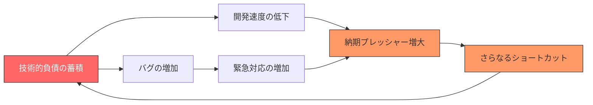

上図は「技術的負債の悪循環」と呼ばれるパターンである。負債が蓄積すると開発速度が低下し、それが納期プレッシャーを増大させ、さらなるショートカットを誘発する。このフィードバックループを断ち切ることが、技術的負債の管理において最も重要な課題である。

## 技術的負債の分類 — Martin Fowler の四象限

Martin Fowler は2009年のブログ記事において、技術的負債を「意図的か無意識的か」と「慎重か無謀か」の2軸で分類する四象限モデル（Technical Debt Quadrant）を提唱した。この分類は、技術的負債の性質を理解し、適切な対策を講じるための強力なフレームワークである。

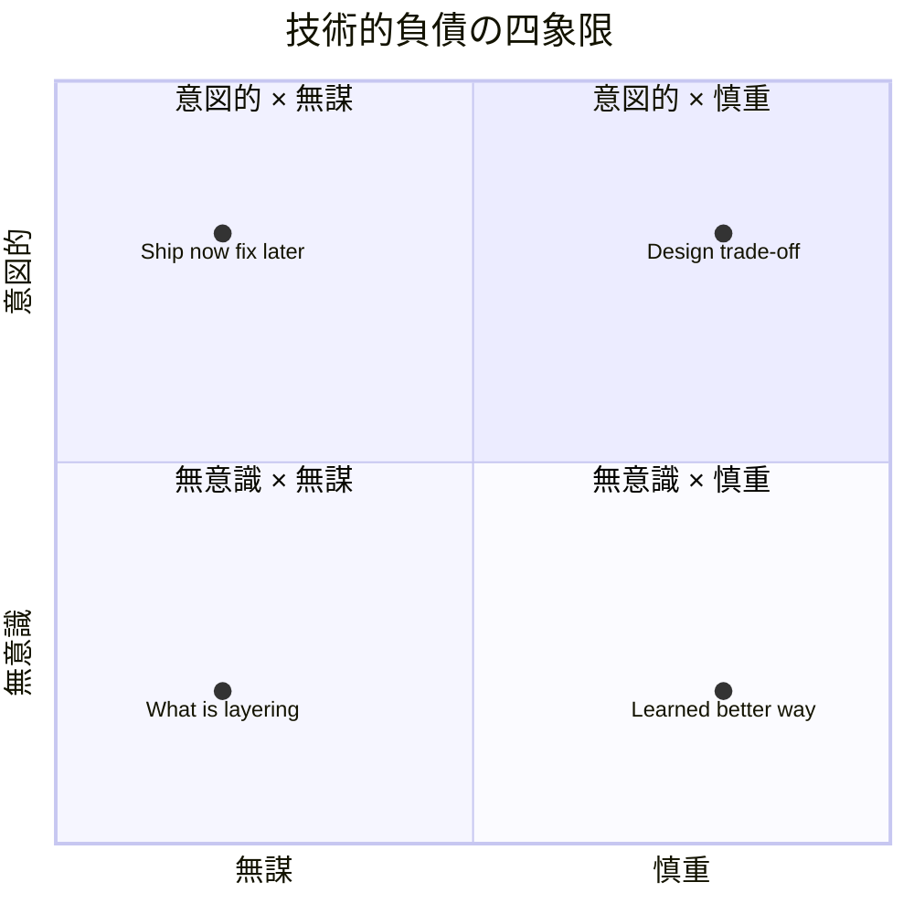

### 第1象限：意図的 × 慎重

「リスクは把握しているが、今はリリースを優先する」という判断に基づく負債である。これは Cunningham が本来意図していた技術的負債に最も近い。たとえば、市場投入のタイミングが決定的に重要な新機能において、最適なアーキテクチャではないが動作する実装を選択し、リリース後に改善する計画を立てるケースがこれに該当する。

この象限の負債は、返済計画が明確であり、ビジネス上の判断として正当化できることが多い。重要なのは、「いつ、どのように返済するか」を決定してから負債を引き受けることである。

### 第2象限：意図的 × 無謀

「設計する時間がないからそのまま出す」という判断に基づく負債である。問題を認識していながら、意図的に無視している点で最も危険な象限の一つである。短期的なスケジュールプレッシャーに屈して品質を犠牲にする場合がこれに該当する。

### 第3象限：無意識 × 無謀

「そもそも何が良い設計なのか分かっていない」状態で発生する負債である。経験不足やスキル不足によって生じる。レイヤリングの概念を知らないままコードを書く、SOLID原則を理解しないまま設計するなどがこれに該当する。この象限の負債は、教育とコードレビューによる予防が最も効果的である。

### 第4象限：無意識 × 慎重

「当時としてはベストを尽くしたが、今振り返ればもっと良い方法があった」という種類の負債である。ドメイン知識が深まるにつれて、過去の設計判断が最適ではなかったことに気づくケースがこれに該当する。この種の負債はソフトウェア開発において避けることができない本質的なものであり、継続的なリファクタリングによってのみ対処できる。

### その他の分類軸

四象限モデルに加えて、技術的負債を分類する軸は他にもある。

**発生源による分類:**

- **設計負債（Design Debt）**: アーキテクチャや設計の問題。修正コストが高い。
- **コード負債（Code Debt）**: コーディング規約違反、重複コード、複雑すぎるメソッドなど。比較的修正しやすい。
- **テスト負債（Test Debt）**: テストカバレッジの不足、テストの品質低下。長期的に大きなリスクとなる。
- **ドキュメント負債（Documentation Debt）**: ドキュメントの不足や陳腐化。オンボーディングコストに直結する。
- **インフラ負債（Infrastructure Debt）**: 古いライブラリ、EOLのランタイム、脆弱な依存関係。セキュリティリスクにもなる。

**影響範囲による分類:**

- **局所的負債**: 特定のモジュールやクラスに閉じた問題。影響範囲が限定的で修正しやすい。
- **構造的負債**: アーキテクチャレベルの問題。影響範囲が広く、修正には大規模なリファクタリングが必要。
- **環境的負債**: ビルドシステム、CI/CD パイプライン、開発ツールチェーンの問題。全開発者に影響する。

## 技術的負債の定量化 — コードメトリクスと静的解析

技術的負債を管理するためには、まずそれを測定可能な形で把握する必要がある。「測定できないものは管理できない」という Peter Drucker の格言は、技術的負債にも当てはまる。ここでは、代表的な定量化手法を紹介する。

### コード複雑度メトリクス

**サイクロマティック複雑度（Cyclomatic Complexity）**

Thomas J. McCabe が1976年に提唱したサイクロマティック複雑度は、プログラムの制御フローの複雑さを定量化する古典的な指標である。コード内の独立した実行パスの数を数えることで算出される。

$$
V(G) = E - N + 2P
$$

ここで、$E$ は制御フローグラフのエッジ数、$N$ はノード数、$P$ は連結成分数である。実用的には、`if`、`for`、`while`、`case`、`catch`、`&&`、`||` などの分岐点の数に1を加えたものと近似できる。

一般的なガイドラインとして、以下の閾値が使われることが多い。

| サイクロマティック複雑度 | リスクレベル |
|---|---|
| 1 - 10 | 低リスク（シンプルなコード） |
| 11 - 20 | 中リスク（やや複雑） |
| 21 - 50 | 高リスク（テスト困難） |
| 50 以上 | 非常に高リスク（保守不能の可能性） |

以下はサイクロマティック複雑度が高くなるコードの例である。

```python
def process_order(order, user, inventory):
    # Cyclomatic complexity: high
    if not order:
        return {"error": "no order"}

    if not user:
        return {"error": "no user"}

    if user.status == "banned":
        return {"error": "banned user"}

    if not user.payment_method:
        return {"error": "no payment"}

    for item in order.items:
        if item.quantity <= 0:
            return {"error": "invalid quantity"}
        if item.id not in inventory:
            return {"error": "not in stock"}
        if inventory[item.id] < item.quantity:
            return {"error": "insufficient stock"}

    # ... more branches follow
```

このような関数は、各条件分岐がテストケースの数を指数的に増加させるため、テストの網羅性を保証することが困難になる。

**認知的複雑度（Cognitive Complexity）**

SonarSource が2017年に提唱した認知的複雑度は、サイクロマティック複雑度の限界を補完するメトリクスである。サイクロマティック複雑度は制御フローの構造的な複雑さを測定するが、人間がコードを理解する際の認知的な負荷を正確には反映しない。

認知的複雑度は以下の原則に基づく。

1. **制御フローの中断**に対してインクリメントする（`if`、`for`、`while`、`catch` など）
2. **ネストの深さ**に応じて追加のペナルティを課す
3. ショートハンド構文（三項演算子など）は通常の分岐と同等に扱わない

```python
def find_active_premium_users(users):
    # Cognitive complexity: 7
    result = []
    for user in users:                    # +1
        if user.is_active:                # +2 (nesting = 1)
            if user.subscription:         # +3 (nesting = 2)
                if user.subscription.type == "premium":  # +4 (nesting = 3) -- simplified illustration
                    result.append(user)
    return result

def find_active_premium_users_v2(users):
    # Cognitive complexity: 3 (lower due to less nesting)
    active = [u for u in users if u.is_active]        # +1
    with_sub = [u for u in active if u.subscription]   # +1
    return [u for u in with_sub if u.subscription.type == "premium"]  # +1
```

この例では、ロジック自体は同じでも、ネストが深い実装は認知的複雑度が高くなる。

### コードの重複度（Duplication）

コードの重複は技術的負債の最も分かりやすい指標の一つである。重複コードは以下の問題を引き起こす。

- **修正漏れ**: バグ修正や仕様変更を全ての重複箇所に反映する必要がある
- **認知負荷**: 開発者は重複の存在と差異を把握し続ける必要がある
- **コードベースの肥大化**: 不要なコード量の増大

重複度の測定には、トークンベースの比較やAST（抽象構文木）ベースの比較が用いられる。一般的に、以下のような閾値が参考にされる。

| 重複度 | 評価 |
|---|---|
| 0 - 3% | 優良 |
| 3 - 5% | 許容範囲 |
| 5 - 10% | 要注意 |
| 10% 以上 | 要改善 |

### 依存関係メトリクス

**結合度（Coupling）と凝集度（Cohesion）**

モジュール間の結合度と、モジュール内の凝集度は、ソフトウェア設計の品質を測る古典的な指標である。高い結合度と低い凝集度は技術的負債の兆候である。

- **求心性結合（Afferent Coupling, Ca）**: あるモジュールに依存している他のモジュールの数。高いと変更の影響範囲が大きい。
- **遠心性結合（Efferent Coupling, Ce）**: あるモジュールが依存している他のモジュールの数。高いと変更に脆弱である。
- **不安定度（Instability, I）**: $I = Ce / (Ca + Ce)$。0に近いほど安定（変更されにくい）、1に近いほど不安定（変更されやすい）。

Robert C. Martin は、抽象度（Abstractness）と不安定度の関係から「主系列（Main Sequence）」という概念を定義した。理想的なパッケージは、主系列上もしくはその近くに位置する。

$$
D = |A + I - 1|
$$

ここで $A$ は抽象度、$I$ は不安定度、$D$ は主系列からの距離である。$D$ が大きいほど、そのパッケージの設計に問題がある可能性が高い。

### SQALE メソッドと技術的負債比率

SQALE（Software Quality Assessment based on Lifecycle Expectations）は、技術的負債を体系的に定量化するためのフレームワークである。SonarQube などのツールで広く採用されている。

SQALE では、コード品質の問題を修正するのに必要な工数を時間単位で見積もり、それを技術的負債として計上する。たとえば、重複コードの排除に2時間、複雑すぎるメソッドの分割に4時間、といった具合である。

**技術的負債比率（Technical Debt Ratio, TDR）** は、技術的負債の総量をプロジェクトの規模に対して正規化した指標である。

$$
TDR = \frac{\text{修正に必要な工数（分）}}{\text{ゼロから書き直した場合の工数（分）}} \times 100\%
$$

SonarQube では、コード1行あたりの開発コストを一定（デフォルトでは30分/1000行）と仮定し、この比率を算出する。

| 技術的負債比率 | 評価 |
|---|---|
| 0 - 5% | A（優良） |
| 5 - 10% | B（良好） |
| 10 - 20% | C（要注意） |
| 20 - 50% | D（問題あり） |
| 50% 以上 | E（深刻） |

### 静的解析ツールの活用

技術的負債の定量化において、静的解析ツールは不可欠な存在である。代表的なツールとその特徴を整理する。

**SonarQube / SonarCloud**

最も広く使われている技術的負債の管理ツールの一つ。コード品質の問題を Bug、Vulnerability、Code Smell の3カテゴリに分類し、それぞれの修正工数を見積もることで技術的負債を算出する。Quality Gate 機能により、負債が一定量を超えた場合にCI/CDパイプラインを失敗させることも可能。

**CodeClimate**

コードの保守性を A - F の5段階で評価する。サイクロマティック複雑度、認知的複雑度、コード重複、ファイル長などの指標を総合的に分析する。

**言語固有のツール**

- **ESLint / TypeScript ESLint**: JavaScript/TypeScript のコード品質
- **Pylint / Ruff**: Python のコード品質
- **RuboCop**: Ruby のコード品質
- **Clippy**: Rust のコード品質
- **Go Vet / staticcheck**: Go のコード品質

これらのツールを CI/CD パイプラインに統合し、継続的にメトリクスを収集することが、技術的負債の管理の第一歩である。

## 技術的負債の可視化

定量化したデータは、適切に可視化しなければ意思決定に活用できない。ここでは、技術的負債の可視化に有効な手法を紹介する。

### ダッシュボードによる継続的モニタリング

技術的負債の推移を時系列で追跡するダッシュボードは、最も基本的かつ重要な可視化手法である。SonarQube などのツールが標準で提供しているが、独自に構築する場合は以下の指標をトラッキングすることが有効である。

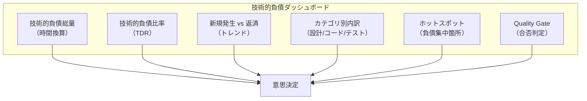

特に重要なのは **トレンド** である。技術的負債の絶対量よりも、それが増加傾向にあるのか減少傾向にあるのかが、チームの健全性を示す指標として有用である。

### ホットスポット分析

ホットスポット分析は、Adam Tornhill の著書『Your Code as a Crime Scene』（2015年）で体系化された手法であり、コードの複雑度と変更頻度を組み合わせることで、優先的に改善すべき箇所を特定する。

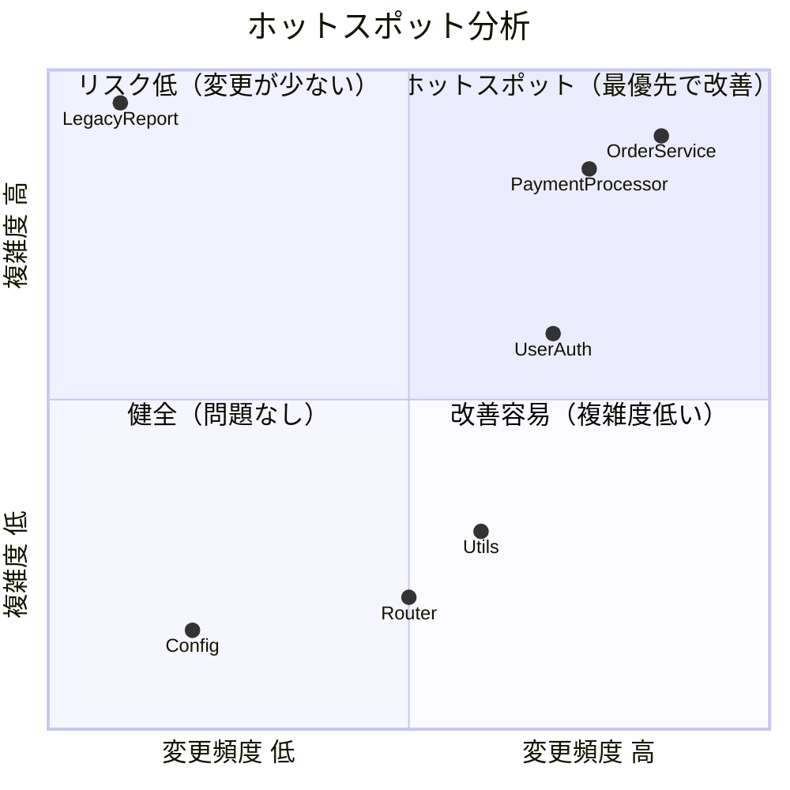

この図において、右上の象限（変更頻度が高く、複雑度も高い）に位置するファイルが「ホットスポット」であり、改善の投資対効果が最も高い。一方、左上（複雑度は高いが変更頻度が低い）は、問題を抱えているものの安定しているため、優先度を下げて構わない。

ホットスポット分析は、Git の履歴を解析することで自動化できる。変更頻度は `git log` から、複雑度は静的解析ツールから取得できる。

```bash
# Count change frequency per file (last 6 months)
git log --since="6 months ago" --pretty=format: --name-only | \
  sort | uniq -c | sort -rn | head -20
```

### コード変更のチャーン分析

チャーン分析（Churn Analysis）は、コードの変更量と変更パターンを分析する手法である。頻繁に書き換えられるコードは、設計上の問題を抱えている可能性が高い。

特に注目すべきパターンは以下の通りである。

- **高チャーンファイル**: 短期間に何度も変更されるファイル。安定しない設計の兆候。
- **同時変更パターン（Temporal Coupling）**: 常にセットで変更されるファイル群。暗黙的な結合関係の存在を示す。
- **コード腐敗（Code Decay）**: 時間とともに複雑度が単調増加するファイル。

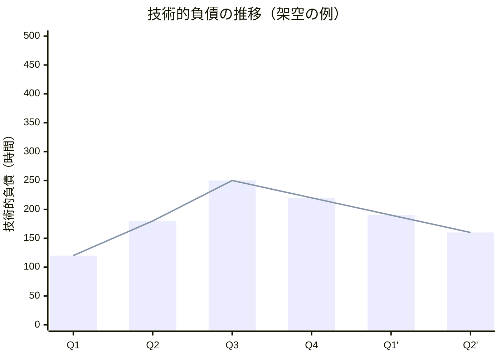

上図は四半期ごとの技術的負債の推移の例である。Q3をピークとして、意識的な返済活動により減少に転じている。このようなトレンドの可視化が、チームと経営層の双方にとって有用な情報となる。

### コードの健全性を示すヒートマップ

大規模なコードベースでは、ディレクトリ構造をツリーマップとして可視化し、各ファイルやモジュールの健全性を色で表現するヒートマップが効果的である。CodeScene や SonarQube のプロジェクトビューがこれに相当する。

色のスキーム例:
- **緑**: 問題なし（低複雑度、十分なテストカバレッジ）
- **黄**: 要注意（中程度の複雑度、カバレッジ低下傾向）
- **赤**: 要改善（高複雑度、低カバレッジ、頻繁な変更）

## 返済戦略 — Boy Scout ルールからスプリント配分まで

技術的負債を認識し定量化できたら、次はそれを計画的に返済する戦略が必要である。ここでは、実務で有効な返済戦略を小規模なものから大規模なものまで順に紹介する。

### Boy Scout ルール（ボーイスカウトルール）

Robert C. Martin が広めた Boy Scout ルールは、「来たときよりも美しく」という原則である。コードを変更する際、その周辺の小さな問題を一緒に修正していく。

::: tip Boy Scout ルール
"Always leave the campground cleaner than you found it." — Robert C. Martin
:::

この戦略の利点は以下の通りである。

- **追加コストが最小限**: 既にそのコードに触れているため、コンテキストの理解コストが不要
- **継続的な改善**: 日常的な開発の中で自然に負債が減少する
- **リスクが低い**: 小さな変更の積み重ねなので、大きな障害を引き起こしにくい

ただし、Boy Scout ルールだけで大きな構造的負債を解消することは困難である。また、機能開発のプルリクエストにリファクタリングの変更が混在すると、レビューが困難になるというデメリットもある。

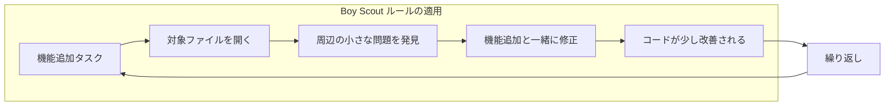

### 計画的なスプリント配分

より組織的なアプローチとして、スプリントの一定割合を技術的負債の返済に充てる戦略がある。一般的には以下のような配分が推奨される。

- **通常時**: スプリント容量の 15 - 20% を技術的負債の返済に充当
- **負債蓄積期**: 30% 以上を充当
- **新規プロジェクト初期**: 5 - 10% で十分

この配分の具体的な実践方法として、いくつかのアプローチがある。

**固定枠方式**: 各スプリントに「改善チケット」の枠を固定で確保する。シンプルで運用しやすいが、柔軟性に欠ける。

**バジェット方式**: 四半期ごとに改善のためのバジェット（工数）を確保し、チームが優先度を判断して使う。柔軟性が高いが、後回しにされやすい。

**専任ローテーション方式**: チームメンバーが交代で「改善担当」を務める。一定期間（1 - 2 週間）、機能開発ではなく改善作業に専念する。

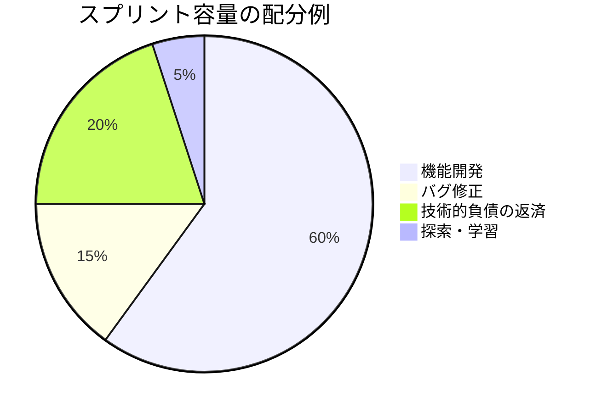

### 技術的負債のバックログ管理

技術的負債を効果的に返済するには、通常の機能開発バックログとは別に、技術的負債のバックログを管理することが重要である。

各技術的負債項目には以下の情報を記録する。

1. **概要**: 何が問題なのか
2. **影響**: この負債によって何が困難になっているか
3. **見積もり**: 返済に必要な工数
4. **利子**: 放置した場合に継続的に発生するコスト
5. **優先度**: 影響の大きさと返済コストのバランス

**優先度の決定方法**

技術的負債の返済優先度は、「利子の大きさ」と「返済コスト」の比率で決定するのが合理的である。

$$
\text{優先度スコア} = \frac{\text{利子（継続的コスト/スプリント）}}{\text{返済コスト（一度きりの工数）}}
$$

このスコアが高い項目ほど、投資対効果が高く、優先的に返済すべきである。たとえば、毎スプリント2時間の追加コストを生み出している負債があり、その解消に8時間かかる場合、4スプリント後に投資を回収できる計算になる。

## リファクタリングのアプローチ

技術的負債の返済において、リファクタリングは中心的な活動である。ここでは、実務で広く使われているリファクタリングパターンを紹介する。

### Strangler Fig パターン

Martin Fowler が提唱した Strangler Fig パターンは、レガシーシステムを段階的に新しいシステムに置き換えるアプローチである。名前の由来は、宿主の木に巻き付いて徐々にそれを絞め殺す絞め殺しの木（Strangler Fig）にある。

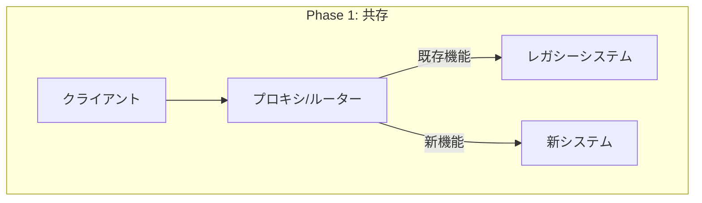

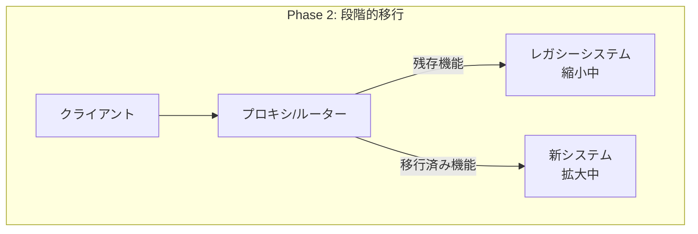

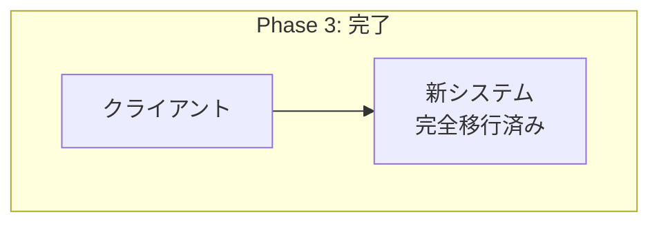

Strangler Fig パターンの利点は以下の通りである。

- **漸進的**: 一度にすべてを置き換える必要がなく、リスクが限定的
- **継続的デリバリー**: 移行中もシステムは稼働し続ける
- **フィードバック**: 各段階でフィードバックを得て、計画を調整できる
- **撤退可能**: 問題が生じた場合、レガシーシステムにフォールバックできる

### Branch by Abstraction

Branch by Abstraction は、Paul Hammant が提唱したリファクタリングパターンである。大規模な変更を長期ブランチではなくメインラインで行うための手法である。

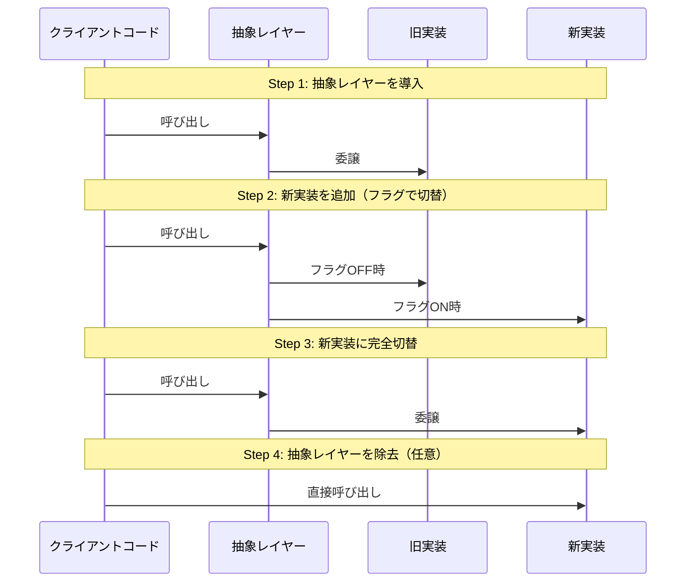

手順は以下の通りである。

1. 旧実装の前に抽象レイヤー（インターフェース）を導入する
2. クライアントコードを抽象レイヤー経由に変更する
3. 新しい実装を作成し、抽象レイヤーの裏側で共存させる
4. Feature Flag などで徐々に新実装に切り替える
5. 旧実装を削除する
6. 不要になった抽象レイヤーを削除する（任意）

### Parallel Change（Expand and Contract）

既存のインターフェースを変更する際に、後方互換性を保ちながら段階的に移行する手法である。

1. **Expand**: 新しいインターフェースを追加する（旧は残す）
2. **Migrate**: 利用者を新インターフェースに移行する
3. **Contract**: 旧インターフェースを削除する

```typescript
// Phase 1: Expand - add new method alongside old
class UserService {
  /** @deprecated Use findUserByEmail instead */
  getUser(id: string): User {
    return this.userRepo.findById(id);
  }

  // new method with improved interface
  findUserByEmail(email: string): User | null {
    return this.userRepo.findByEmail(email);
  }
}

// Phase 2: Migrate - update all callers to use new method
// Phase 3: Contract - remove deprecated method
```

### その他のリファクタリングパターン

**Extract and Delegate**: 巨大なクラスやモジュールから責務を抽出し、新しいクラスに委譲する。God Object アンチパターンの解消に有効。

**Bubble Context**: レガシーコードの中に新しいアーキテクチャの「泡」を作り、その泡を徐々に拡大していく。腐敗防止層（Anti-Corruption Layer）を用いて、新しいコードがレガシーの影響を受けないようにする。

**Mikado Method**: Daniel Brolund と Ola Ellnestam が提唱した、大規模リファクタリングを安全に進めるための手法。リファクタリングの依存関係をグラフとして可視化し、末端から段階的に実施していく。

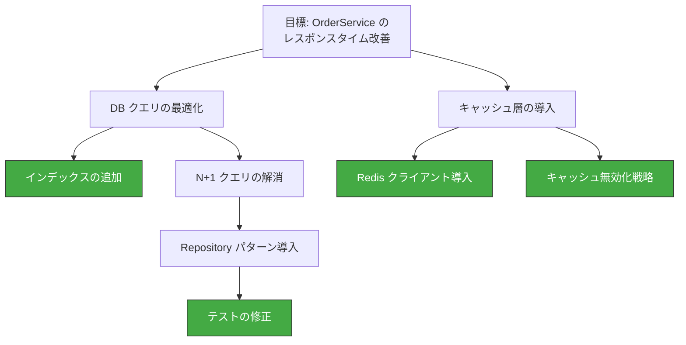

Mikado Method では、葉ノード（末端の依存関係のない作業）から着手し、グラフの根に向かって進行する。各ステップが独立してコミット可能な変更であることが重要である。

## 経営層・ステークホルダーへの説明方法

技術的負債の最大の課題の一つは、非技術者の意思決定者にその重要性を理解してもらうことである。技術チームが「リファクタリングの時間が必要だ」と訴えても、それがビジネス上の価値として認識されなければ予算は確保されない。

### ビジネス言語への翻訳

技術的な用語を使わず、ビジネスインパクトで説明することが重要である。

::: warning 避けるべき説明
「コードの複雑度が高すぎるのでリファクタリングが必要です」
:::

::: tip 効果的な説明
「現在の構造では、新機能の追加に平均3週間かかっていますが、改善すれば1週間に短縮できます。6ヶ月後の開発速度で試算すると、今4週間の改善投資をすることで、年間で20週間分の開発工数を節約できます。」
:::

### コストの可視化

技術的負債を金額に換算することは、経営層との対話において非常に有効である。

**開発速度への影響**

機能開発のリードタイムやスループットの変化を追跡し、技術的負債がどれだけ開発を遅延させているかを定量化する。

$$
\text{負債コスト（月額）} = \text{エンジニア人件費} \times \text{負債による生産性低下率}
$$

たとえば、10人のチームの平均人件費が月100万円で、技術的負債による生産性低下が20%であれば、月200万円のコストが発生していることになる。

**障害コストとの関連**

技術的負債と障害発生率の相関を示すことも有効である。負債の蓄積した領域で障害が頻発していることを示し、その障害対応コスト（ダウンタイムの機会損失、緊急対応の人件費）を算出する。

**機会損失の算出**

技術的負債があるために実現できていない機能やサービスの潜在的な収益を見積もる。「競合他社が3ヶ月で実現した機能を、我々は技術的負債のために9ヶ月かかった」という事実は、経営層に対して強い説得力を持つ。

### フレーミングの工夫

技術的負債の議論では、使う言葉のフレーミングが重要である。

**「投資」として語る**: 「リファクタリングに時間をください」ではなく、「開発生産性への投資として、ROIは6ヶ月で300%です」。

**「リスク」として語る**: 「コードが汚いです」ではなく、「現在のシステム構造では、決済関連のインシデントリスクが高まっています。過去6ヶ月で関連障害が3件発生し、合計ダウンタイムは12時間でした」。

**「速度」として語る**: 「テストが不足しています」ではなく、「テストの充実により、リリースサイクルを月1回から週1回に短縮でき、市場への対応速度が4倍になります」。

### 定期的なレポーティング

技術的負債の状況を定期的に（月次または四半期）レポートすることで、その管理を組織文化に組み込む。レポートには以下の項目を含める。

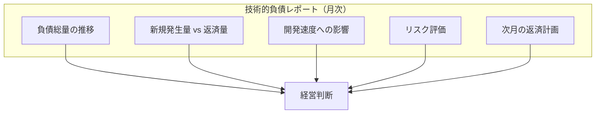

## 技術的負債の予防策

返済も重要だが、そもそも不必要な負債を蓄積させないための予防策が、長期的には最もコスト効率が良い。

### コードレビューの文化

コードレビューは技術的負債の最前線の防御策である。効果的なコードレビューのポイントは以下の通りである。

- **設計レベルのレビュー**: 実装の詳細だけでなく、設計判断の妥当性も検討する
- **明確な基準**: 「コードの複雑度が X を超える場合は分割する」など、客観的な基準を設ける
- **レビューの自動化**: リンターや静的解析ツールで機械的に検出できる問題は自動化し、人間のレビューは設計や可読性に集中する
- **レビューチェックリスト**: 一貫性のあるレビューを行うためのチェックリストを用意する

### アーキテクチャ決定記録（ADR）

Architecture Decision Records（ADR）は、アーキテクチャ上の重要な決定を記録するプラクティスである。Michael Nygard が2011年に提唱した。

ADR を記録することで、以下の効果が期待できる。

- **コンテキストの保存**: なぜその決定がなされたかが記録される。後から見たときに「なぜこうなっているのか」が分かる。
- **意図的な負債の追跡**: 「今はこうするが、将来的にはこう改善する」という意思決定が記録される。
- **知識の共有**: チーム全体が設計の経緯を理解できる。

ADR のテンプレート例:

```markdown
# ADR-001: セッション管理に Redis を使用する

## ステータス
承認済み（2026-01-15）

## コンテキスト
現在セッション情報はアプリケーションサーバーのメモリに保持されている。
スケールアウト時にセッションの整合性が保てない問題がある。

## 決定
セッションストアとして Redis を導入する。

## 結果
- スケールアウトが容易になる
- Redis の運用コストが追加される
- Redis 障害時のフォールバック戦略が必要になる

## 技術的負債の認識
初期段階ではセッションの永続化は行わない（Redis再起動でセッション消失）。
ユーザー影響が問題になった段階で、Redis Sentinel または Cluster を導入する。
```

### 品質ゲートの設定

CI/CD パイプラインに品質ゲートを設定し、一定の品質基準を満たさないコードがマージされることを防ぐ。

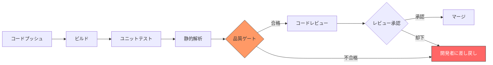

品質ゲートの基準例:

- 新規コードのテストカバレッジが80%以上
- 新たなCode Smellが0件（既存の問題を悪化させない）
- サイクロマティック複雑度が15以下
- 重複コードが3%以下
- セキュリティ脆弱性が0件

> [!CAUTION]
> 品質ゲートの基準は段階的に引き上げることが望ましい。最初から厳しすぎる基準を設定すると、開発チームのモチベーションが低下し、品質ゲートを回避する行動（テストの水増し、基準の例外申請の乱発など）を誘発する。

### テスト戦略の確立

テストの不足は将来の技術的負債を加速させる最大の要因の一つである。効果的なテスト戦略は、変更に対する安全ネットを提供し、リファクタリングを容易にする。

テストピラミッドに基づく戦略が基本だが、重要なのは以下の原則である。

- **変更のたびにテストを書く**: 新機能にはテストを必須とし、バグ修正には再発防止のための回帰テストを書く
- **テストの保守性**: テスト自体が技術的負債になることを防ぐ。実装の詳細ではなく振る舞いをテストする
- **テストカバレッジの閾値**: 新規コードのカバレッジ閾値を設定するが、カバレッジの数値自体を目的化しない

### 定期的な依存関係の更新

ライブラリやフレームワークの更新を後回しにすると、その負債は時間とともに指数的に増大する。メジャーバージョンが複数溜まると、移行パスが断絶し、事実上のリプレースが必要になることもある。

- **Dependabot / Renovate Bot**: 依存関係の自動更新PRを生成するツール。マイナー・パッチバージョンは自動マージ、メジャーバージョンは手動レビューとする設定が一般的。
- **定期更新会**: 月に一度、依存関係の状態をレビューし、更新計画を立てるセッションを設ける。
- **EOL の追跡**: 使用しているランタイムやライブラリのEnd of Lifeを追跡し、事前に移行計画を立てる。

## 実務でのバランス — スピードと品質のトレードオフ

ソフトウェア開発における最も根本的な議論の一つが、開発スピードとコード品質のトレードオフである。この議論に対する答えは、「トレードオフは短期的には存在するが、長期的には存在しない」というものである。

### 短期と長期の視点

短期的（数日〜数週間）に見れば、テストを省略し、設計を簡略化し、ドキュメントを書かないことで開発速度を上げることは可能である。しかし長期的（数ヶ月〜数年）に見れば、これらのショートカットは開発速度を低下させ、最終的にはショートカットをしない場合よりも遅くなる。

Martin Fowler はこれを「Design Stamina Hypothesis（設計持久力仮説）」として説明している。

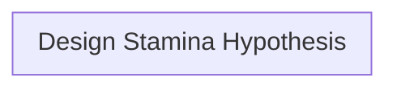

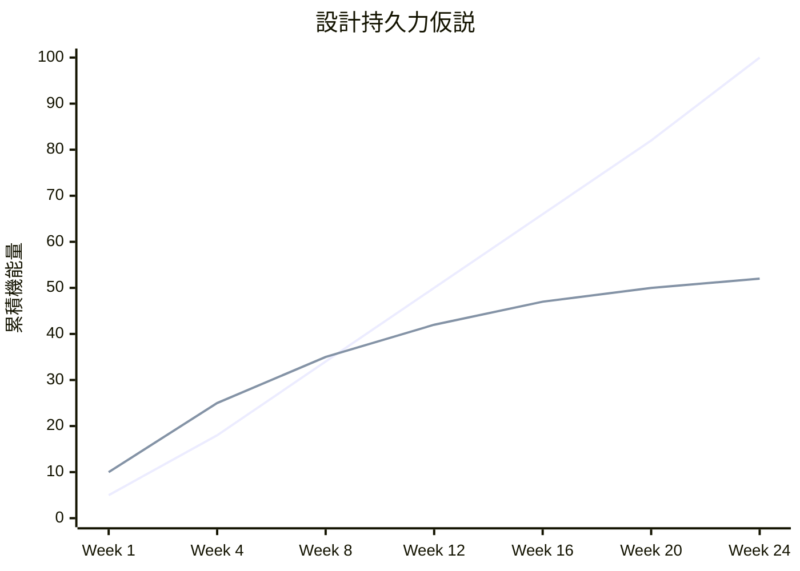

この仮説によれば、設計を犠牲にした開発は初期こそ速いが、数週間後には設計を大切にした開発に追い抜かれる。そして、その差は時間とともに拡大し続ける。

### 「ペイオフライン」の見極め

設計への投資が回収されるまでの期間を「ペイオフライン」と呼ぶ。このラインの位置は、プロジェクトの状況によって大きく異なる。

**ペイオフラインが短い場合（設計への投資がすぐ回収される）:**
- 長期間メンテナンスされるプロダクト
- 複数チームが関わるコードベース
- 頻繁に変更される領域
- ミッションクリティカルなシステム

**ペイオフラインが長い場合（ショートカットが合理的になりうる）:**
- プロトタイプやMVP（検証段階のプロダクト）
- 短命であることが分かっているコード（マイグレーションスクリプトなど）
- 一度書いたら変更されないコード
- 競合優位性を得るためのスピードが決定的に重要な場面

### 意図的な負債のフレームワーク

技術的負債を「引き受ける」という意思決定を組織的に管理するためのフレームワークを整備することが重要である。

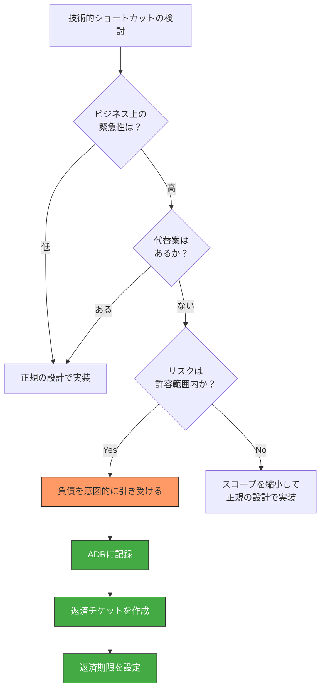

このフレームワークのポイントは以下の通りである。

1. **負債を引き受ける場合は必ず記録する**: ADR（アーキテクチャ決定記録）にコンテキスト、理由、リスクを記録する
2. **返済計画を同時に作成する**: 負債のチケットを作成し、返済期限を設定する
3. **定期的にレビューする**: 未返済の負債を四半期ごとにレビューし、優先度を再評価する

### チーム文化としての技術的負債管理

技術的負債の管理を成功させるには、ツールやプロセスだけでなく、チーム文化が不可欠である。

**心理的安全性**: 技術的負債を報告することが罰せられない環境が必要。「このコードに問題がある」と指摘することが建設的に受け入れられる文化。

**共同所有権**: 「このコードは誰々が書いたから、その人の責任」ではなく、コードベースは全員の共有財産であるという意識。

**学習の文化**: 第4象限（無意識 × 慎重）の負債は、知識の深化によってのみ発見される。継続的な学習を奨励する文化が、この種の負債の早期発見につながる。

**「完了」の定義**: Definition of Done（DoD）に技術的負債に関する基準を含める。テストカバレッジ、ドキュメント更新、リンターの合格などを「完了」の条件とする。

## まとめ — 技術的負債との共存

技術的負債はソフトウェア開発において避けられない現象である。完全にゼロにすることは不可能であり、そもそもそれを目指すべきでもない。重要なのは、技術的負債を**認識し、定量化し、計画的に管理する**ことである。

本記事で述べた内容を要約すると、以下のようになる。

1. **概念の理解**: Ward Cunningham の比喩に立ち返り、技術的負債が本質的にはビジネス上のトレードオフであることを理解する
2. **分類**: Martin Fowler の四象限モデルを用いて、負債の性質を正しく把握する
3. **定量化**: サイクロマティック複雑度、認知的複雑度、技術的負債比率などのメトリクスを用いて客観的に測定する
4. **可視化**: ホットスポット分析やダッシュボードにより、優先度を判断するための情報を提供する
5. **返済**: Boy Scout ルール、スプリント配分、Strangler Fig パターンなどの戦略を状況に応じて使い分ける
6. **説明**: ビジネス言語への翻訳、コストの可視化により、経営層の理解と支援を得る
7. **予防**: コードレビュー、品質ゲート、ADR、テスト戦略により、不必要な負債の蓄積を防ぐ
8. **バランス**: 短期と長期の視点を持ち、意図的な負債は記録・管理する

技術的負債の管理は、技術的なスキルだけでなく、コミュニケーションスキルと組織的なマネジメントスキルが求められる総合的な実践である。技術チームと経営層が共通の言語で技術的負債を議論できる状態を作ることが、持続可能なソフトウェア開発の基盤となる。

> [!TIP]
> 技術的負債は「借金」であり「悪」ではない。重要なのは、いくら借りているかを把握し、返済計画を持ち、利子が元本を上回らないように管理することである。金融リテラシーと同様に、「技術的負債リテラシー」はすべてのソフトウェアエンジニアが身につけるべき素養である。
