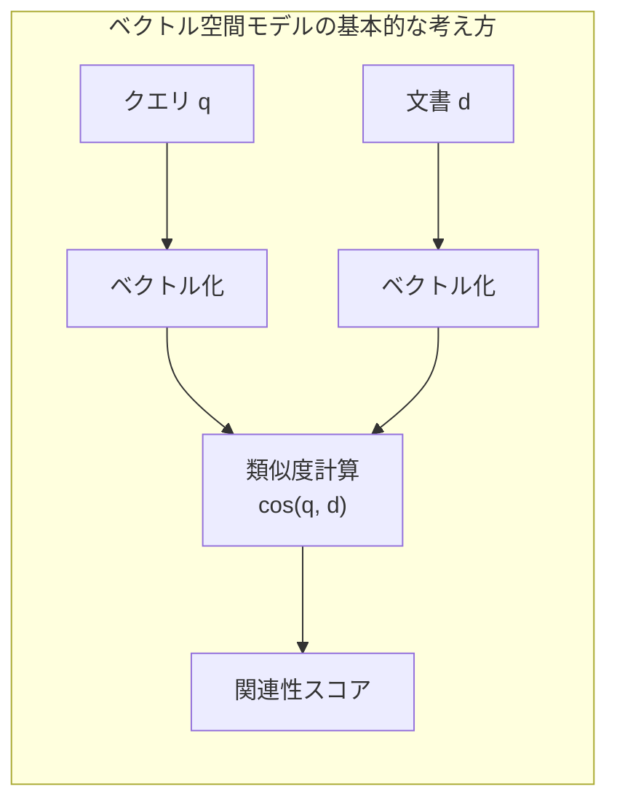
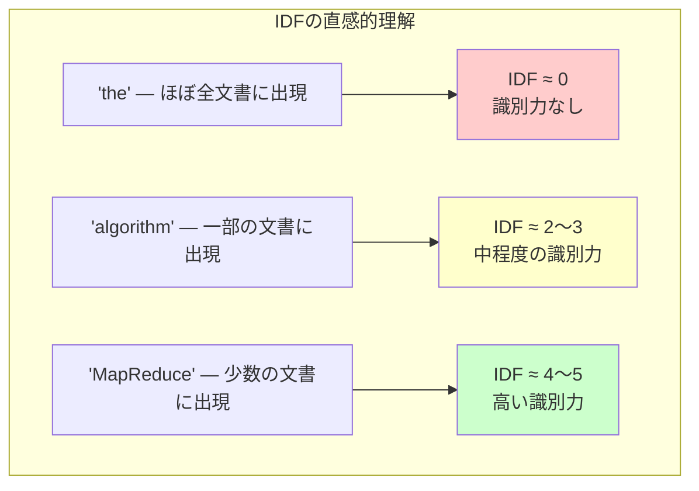
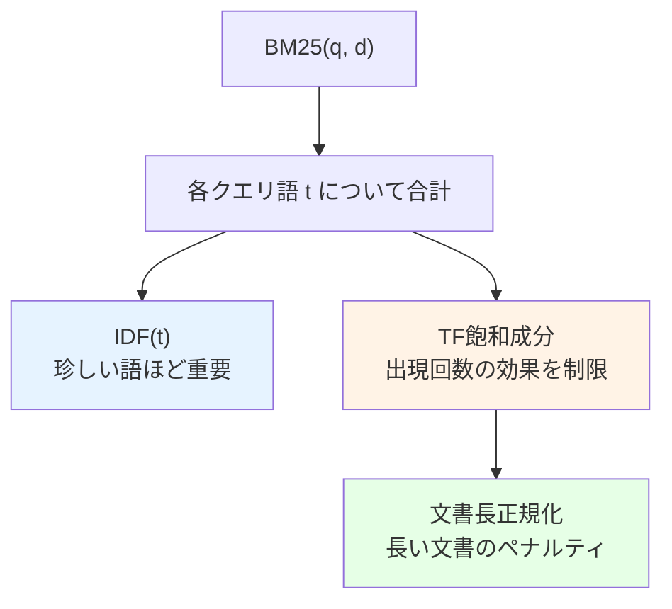
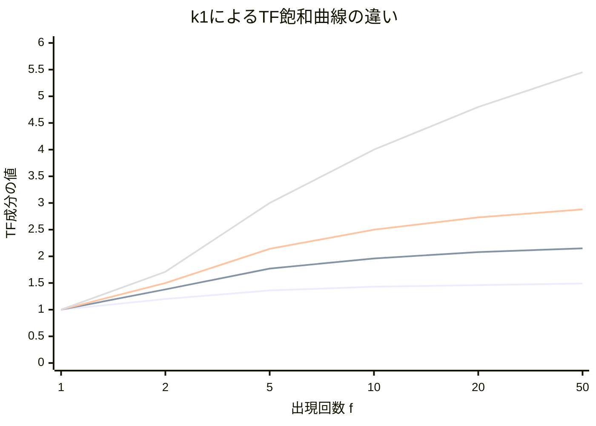
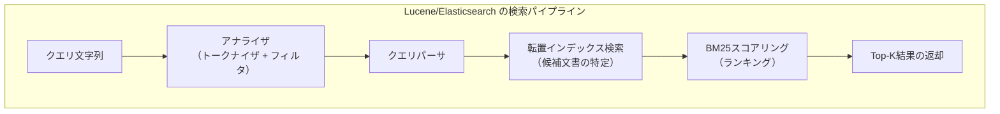
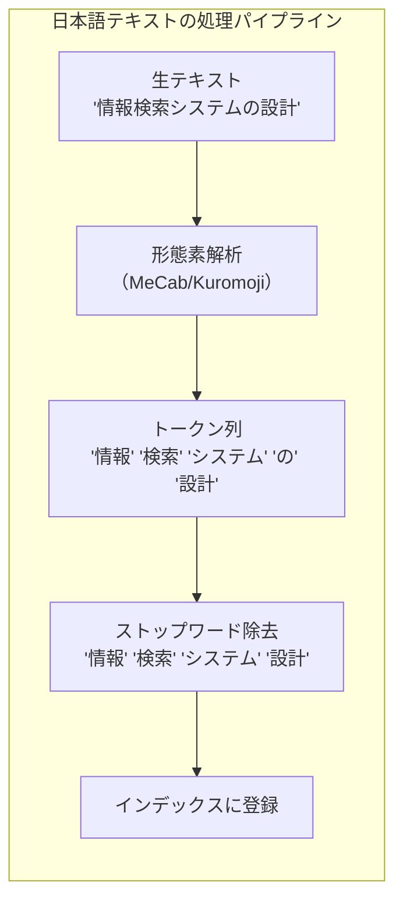
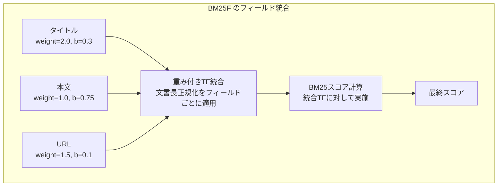
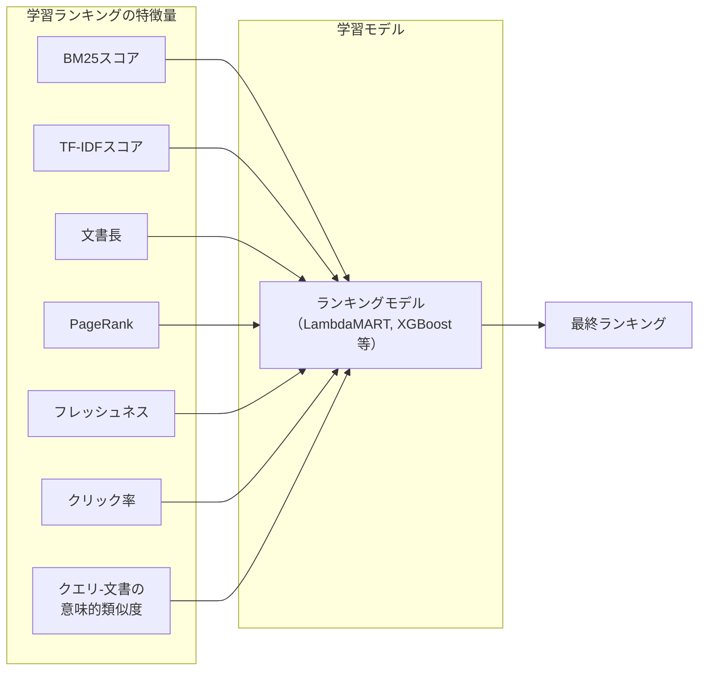
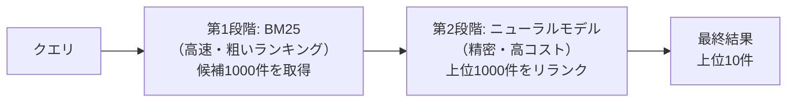
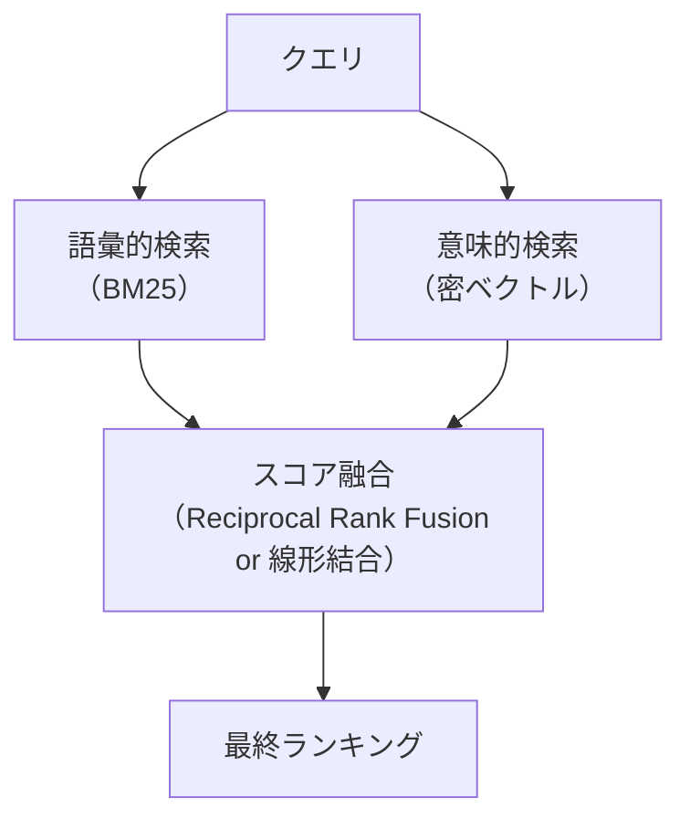

# TF-IDF と BM25 — 検索ランキングの数理

## 1. 背景と動機：検索とランキングの問題

全文検索システムの基盤となる転置インデックスは、「あるクエリ語を含む文書の集合を高速に特定する」という問題を解決した。しかし、検索結果として返される文書が数千件、数万件にのぼるとき、ユーザーにとって真に重要なのは「**どの文書がクエリに最も関連するか**」という順序付け（ランキング）の問題である。

### 1.1 なぜランキングが必要か

Webの世界を例にとろう。「Python チュートリアル」という検索クエリに対して、数百万のWebページがマッチする可能性がある。そのすべてをユーザーに提示しても意味がない。ユーザーが実際に閲覧するのはせいぜい上位10件〜20件である。したがって、検索システムにとって最も重要な機能は、関連性の高い文書を上位に配置するランキングアルゴリズムである。

```
クエリ: "Python チュートリアル"

マッチする文書: 3,200,000件

ユーザーが閲覧する件数: 上位10〜20件

→ ランキングの精度が検索体験のすべてを決定する
```

### 1.2 ブーリアン検索の限界

初期の情報検索システムはブーリアン検索モデルを採用していた。ブーリアン検索では、文書はクエリに「マッチする」か「マッチしない」かの二値であり、マッチした文書間に優劣はない。

$$
\text{relevance}(d, q) \in \{0, 1\}
$$

この二値的なモデルでは、「Python」と「チュートリアル」の両方を含む文書がすべて同等に扱われる。しかし現実には、Pythonの入門チュートリアルを詳しく解説する文書と、たまたま両語が1回ずつ出現するだけの文書では、関連性が大きく異なるはずである。

### 1.3 ベクトル空間モデルの着想

1960年代、Gerard Saltonらが開発したSMARTシステムは、文書とクエリをともに高次元ベクトルとして表現し、ベクトル間の類似度で関連性を定量化するアプローチを提案した。これが**ベクトル空間モデル（Vector Space Model）**である。



ベクトル空間モデルの核心は、各次元（＝各単語）にどのような**重み**を割り当てるかにある。単純に単語の出現回数（生の頻度）を重みとすると、「the」「a」「is」のようなどの文書にも頻出する単語が不当に高い重みを持ってしまう。この問題を解決するために生まれたのが、**TF-IDF（Term Frequency-Inverse Document Frequency）**重み付けスキームである。

## 2. TF-IDF の理論

TF-IDF は情報検索における最も基本的かつ広く使われている重み付け手法である。その名の通り、**TF（用語頻度）**と**IDF（逆文書頻度）**の2つの要素を組み合わせたものである。

### 2.1 TF（Term Frequency）：用語頻度

TFは、ある単語 $t$ が文書 $d$ の中に何回出現するかを表す指標である。直感的には、ある単語が文書中に多く出現するほど、その文書はその単語に関連している可能性が高い。

最も単純な定義は生の出現回数そのものである。

$$
\text{tf}(t, d) = f_{t,d}
$$

ここで $f_{t,d}$ は単語 $t$ が文書 $d$ に出現する回数を表す。

しかし、生の頻度をそのまま使うと問題が生じる。ある単語が20回出現する文書は、10回出現する文書の**2倍**関連性が高いと言えるだろうか。現実にはそうとは限らない。単語の出現回数が増えるにつれて、追加の1回がもたらす情報量は逓減していく。この性質を捉えるため、いくつかの変換が提案されている。

| TFの変換方式 | 定義 | 特徴 |
|---|---|---|
| 生の頻度 | $f_{t,d}$ | 最も単純、大きな値が支配的になる |
| 対数スケール | $1 + \log(f_{t,d})$ | 頻度の差を緩和 |
| 正規化 | $\frac{f_{t,d}}{\max_{t' \in d} f_{t',d}}$ | 文書間の長さの差を補正 |
| ブーリアン | $\mathbb{1}[f_{t,d} > 0]$ | 出現/非出現のみ |

情報検索の文脈では、**対数スケール**が最も広く使われている。

$$
\text{tf}(t, d) = \begin{cases} 1 + \log_{10}(f_{t,d}) & \text{if } f_{t,d} > 0 \\ 0 & \text{otherwise} \end{cases}
$$

対数変換を適用すると、出現回数1回で $\text{tf} = 1$、10回で $\text{tf} = 2$、100回で $\text{tf} = 3$ となり、頻度の爆発的な増加を抑えつつも、出現回数が多い方が高い重みを持つ性質が保たれる。

### 2.2 IDF（Inverse Document Frequency）：逆文書頻度

TFだけでは十分なランキングを実現できない。「the」や「は」のようなストップワードは、ほぼすべての文書に高い頻度で出現するが、これらの単語は文書の内容を識別する力を持たない。一方、「量子コンピュータ」のような専門用語は、出現する文書が限られているからこそ、出現した文書の内容を強く特徴づける。

この「**どれだけ珍しい単語か**」を定量化するのがIDFである。

$$
\text{idf}(t) = \log_{10} \frac{N}{\text{df}(t)}
$$

ここで $N$ はコーパス全体の文書数、$\text{df}(t)$ は単語 $t$ を含む文書の数（**文書頻度**）である。

IDFの直感的な意味は次の通りである。

- $\text{df}(t) = 1$（1つの文書にしか出現しない）→ $\text{idf} = \log_{10} N$（非常に高い値）
- $\text{df}(t) = N$（全文書に出現する）→ $\text{idf} = \log_{10} 1 = 0$（重み無し）

| 単語の出現パターン | df | IDF（N=1,000,000） | 解釈 |
|---|---|---|---|
| 全文書に出現 | 1,000,000 | 0.0 | 識別力なし |
| 10万文書に出現 | 100,000 | 1.0 | 低い識別力 |
| 1万文書に出現 | 10,000 | 2.0 | 中程度の識別力 |
| 1000文書に出現 | 1,000 | 3.0 | 高い識別力 |
| 100文書に出現 | 100 | 4.0 | 非常に高い識別力 |
| 1文書に出現 | 1 | 6.0 | 極めて高い識別力 |

IDFは**Zipfの法則**と密接に関係している。自然言語の単語頻度はべき乗則に従い、少数の高頻度語と膨大な低頻度語に分布する。IDFの対数変換は、このZipf分布に対して自然な正規化を行う。



### 2.3 TF-IDF の組み合わせ

TFとIDFを乗算することで、TF-IDF重みが得られる。

$$
\text{tf-idf}(t, d) = \text{tf}(t, d) \times \text{idf}(t)
$$

この重み付けにより、以下の性質が同時に満たされる。

1. **文書内で頻出する単語**に高い重みが与えられる（TFの効果）
2. **コーパス全体では珍しい単語**に高い重みが与えられる（IDFの効果）
3. コーパス全体で一般的な単語の重みは抑制される（IDFの効果）

クエリ $q$ と文書 $d$ の関連性スコアは、クエリに含まれる各単語のTF-IDF重みの合計として計算できる。

$$
\text{score}(q, d) = \sum_{t \in q} \text{tf-idf}(t, d)
$$

あるいは、コサイン類似度を用いる場合は次のようになる。

$$
\text{cos}(q, d) = \frac{\vec{q} \cdot \vec{d}}{|\vec{q}| \times |\vec{d}|}
$$

ここで $\vec{q}$ と $\vec{d}$ はそれぞれTF-IDF重みで構成されたベクトルである。

### 2.4 具体例による理解

3つの文書からなるコーパスを考えよう。

| 文書ID | 内容 |
|---|---|
| $d_1$ | "the cat sat on the mat" |
| $d_2$ | "the dog sat on the log" |
| $d_3$ | "the cat and the dog played" |

クエリ $q$ = "cat" に対するランキングを計算する。

**ステップ1：TFの計算**

| 単語 | $d_1$ | $d_2$ | $d_3$ |
|---|---|---|---|
| cat | 1 | 0 | 1 |
| the | 2 | 2 | 2 |

**ステップ2：IDFの計算**（$N = 3$）

- $\text{idf}(\text{cat}) = \log_{10}(3/2) \approx 0.176$
- $\text{idf}(\text{the}) = \log_{10}(3/3) = 0$

**ステップ3：TF-IDFスコア**

| 文書 | tf(cat) | idf(cat) | TF-IDF |
|---|---|---|---|
| $d_1$ | 1 | 0.176 | 0.176 |
| $d_2$ | 0 | 0.176 | 0.000 |
| $d_3$ | 1 | 0.176 | 0.176 |

この例では $d_1$ と $d_3$ が同じスコアとなる。"the"のスコアが0になることで、すべての文書に共通する語が無視され、"cat"という識別力のある語だけでランキングが行われている。

### 2.5 TF-IDF の変種（SMART表記法）

TF-IDF には多数の変種が存在し、それらを体系的に記述するために**SMART表記法**が用いられる。SMART表記法は3文字（ddd.qqq）の形式で、文書側とクエリ側のTF・IDF・正規化の方式を指定する。

| 位置 | 意味 | 選択肢 |
|---|---|---|
| 1文字目 | TF重み付け | n(自然), l(対数), a(拡張), b(ブーリアン), L(対数平均) |
| 2文字目 | DF成分 | n(なし), t(idf), p(prob idf) |
| 3文字目 | 正規化 | n(なし), c(コサイン), u(ピボット) |

代表的な組み合わせとして、`lnc.ltc`（文書側: 対数TF・DF成分なし・コサイン正規化、クエリ側: 対数TF・IDF・コサイン正規化）が挙げられる。

## 3. BM25（Best Matching 25）

TF-IDFは直感的で有効だが、いくつかの理論的課題を抱えている。1990年代にStephen RobertsonとKaren Spärck Jonesらが開発した**BM25（Okapi BM25）**は、確率的情報検索モデルに基づく、より洗練されたランキング関数である。BM25は現在でも全文検索エンジンの標準的なランキング手法として広く使われている。

### 3.1 TF-IDF の課題

TF-IDFが抱える主な課題は以下の通りである。

**1. TF飽和の欠如**

対数変換を適用しても、TFは単語の出現回数に対して単調に増加し続ける。つまり、ある単語が100回出現する文書は、10回出現する文書よりも常にスコアが高くなる。しかし現実には、ある程度の出現回数を超えると、追加の出現がもたらす関連性の向上は極めて小さくなるはずである。

**2. 文書長の正規化の不足**

長い文書は短い文書よりも多くの単語を含むため、TFが自然に高くなる。百科事典の項目と、同じ話題を扱う短いブログ記事を比べた場合、百科事典の項目は単に長いだけでTFが高くなり、不公平なランキングが生じうる。

**3. 理論的基盤の弱さ**

TF-IDFはヒューリスティックな組み合わせであり、「なぜTFとIDFを掛け合わせるのか」に対する確率的な正当化が十分ではない。

### 3.2 確率的関連性モデル

BM25の理論的背景は、**確率的関連性モデル（Probabilistic Relevance Model）**である。この枠組みでは、クエリ $q$ に対して文書 $d$ が関連する確率 $P(R=1|d,q)$ を推定し、その確率（またはオッズ比）に基づいてランキングを行う。

**Robertson-Spärck Jones 重み付け**を出発点として、独立性仮定のもとで、文書の関連性のオッズを以下のように分解できる。

$$
\log \frac{P(R=1|d,q)}{P(R=0|d,q)} = \sum_{t \in q} \log \frac{P(t \in d | R=1) \cdot P(t \notin d | R=0)}{P(t \notin d | R=1) \cdot P(t \in d | R=0)}
$$

関連文書に関する事前情報がない場合、この式はIDFに近い形に簡略化される。ここにTF成分と文書長正規化を組み合わせることで、BM25が導出される。

### 3.3 BM25 の公式

BM25のスコアリング関数は以下の式で与えられる。

$$
\text{BM25}(q, d) = \sum_{t \in q} \text{IDF}(t) \cdot \frac{f_{t,d} \cdot (k_1 + 1)}{f_{t,d} + k_1 \cdot \left(1 - b + b \cdot \frac{|d|}{\text{avgdl}}\right)}
$$

ここで各記号の意味は次の通りである。

| 記号 | 意味 |
|---|---|
| $f_{t,d}$ | 単語 $t$ の文書 $d$ における出現回数 |
| $\|d\|$ | 文書 $d$ の長さ（単語数） |
| $\text{avgdl}$ | コーパス全体の文書の平均長 |
| $k_1$ | TF飽和パラメータ（典型的には 1.2〜2.0） |
| $b$ | 文書長正規化パラメータ（典型的には 0.75） |
| $\text{IDF}(t)$ | 逆文書頻度 |

BM25で使用されるIDF成分は、通常の $\log(N/\text{df})$ ではなく、次の式が用いられることが多い。

$$
\text{IDF}(t) = \log \frac{N - \text{df}(t) + 0.5}{\text{df}(t) + 0.5}
$$

この変種は確率的モデルから自然に導出され、$\text{df}(t)$ が $N/2$ を超える単語（コーパスの半数以上の文書に出現する語）に対して負の重みを与えるという性質を持つ。

### 3.4 BM25 の直感的理解

BM25の公式は一見複雑だが、各構成要素の役割を理解すれば直感的に把握できる。



**IDF成分**は、TF-IDFのIDFと同じ役割を果たす。コーパス全体で珍しい単語ほど、その出現が文書の関連性を強く示唆する。

**TF飽和成分**は、BM25の最も重要な特徴である。TF-IDFの対数変換と異なり、BM25のTF成分は明確な**上限**を持つ。

$$
\text{tf\_component} = \frac{f_{t,d} \cdot (k_1 + 1)}{f_{t,d} + k_1 \cdot (\ldots)} \xrightarrow{f_{t,d} \to \infty} (k_1 + 1)
$$

つまり、出現回数がどれだけ増えても、TF成分の値は $(k_1 + 1)$ を超えない。これにより、特定の単語を大量に含む文書（キーワードスタッフィングなど）がスコアを独占することを防ぐ。

**文書長正規化**は、分母の $k_1 \cdot (1 - b + b \cdot |d|/\text{avgdl})$ の部分に含まれている。文書長が平均より長い場合（$|d| > \text{avgdl}$）、分母が大きくなりスコアが下がる。逆に平均より短い場合は分母が小さくなりスコアが上がる。

## 4. 数学的詳細：パラメータの役割と調整

### 4.1 パラメータ $k_1$ の役割

$k_1$ はTFの飽和速度を制御する。$k_1$ が大きいほど、出現回数の増加がスコアに与える影響が長く続く（飽和が遅い）。$k_1$ が小さいほど、少ない出現回数で飽和に達する。

- $k_1 = 0$: TF成分が完全に無視され、スコアはIDFのみで決まる（バイナリモデル）
- $k_1 \to \infty$: TF成分が生の頻度に比例する形に近づく（飽和なし）

実際の値の比較を以下に示す。$b = 0$、$|d| = \text{avgdl}$ と仮定して、TF成分 $\frac{f \cdot (k_1 + 1)}{f + k_1}$ の値を計算する。

| 出現回数 $f$ | $k_1 = 0.5$ | $k_1 = 1.2$ | $k_1 = 2.0$ | $k_1 = 10$ |
|---|---|---|---|---|
| 1 | 1.00 | 1.00 | 1.00 | 1.00 |
| 2 | 1.20 | 1.38 | 1.50 | 1.83 |
| 5 | 1.36 | 1.77 | 2.14 | 3.67 |
| 10 | 1.43 | 1.96 | 2.50 | 5.50 |
| 50 | 1.49 | 2.15 | 2.88 | 9.17 |
| 100 | 1.49 | 2.17 | 2.94 | 10.09 |
| 上限 $(k_1+1)$ | 1.50 | 2.20 | 3.00 | 11.00 |



$k_1 = 1.2$ が広く使われている値であり、出現回数が1〜5回の範囲で明確な差異を持ちつつ、それ以上では急速に飽和する、バランスの取れた挙動を示す。

### 4.2 パラメータ $b$ の役割

$b$ は文書長正規化の強さを制御する。

- $b = 0$: 文書長正規化を完全に無効化する。長い文書も短い文書も同等に扱われる。
- $b = 1$: 完全な文書長正規化を適用する。TFを文書長に完全に比例してスケーリングする。

文書長正規化項 $K = k_1 \cdot (1 - b + b \cdot |d|/\text{avgdl})$ の挙動を確認しよう。$\text{avgdl} = 100$、$k_1 = 1.2$ として、文書長が異なる場合の $K$ の値を計算する。

| 文書長 $\|d\|$ | $b = 0$ | $b = 0.25$ | $b = 0.5$ | $b = 0.75$ | $b = 1.0$ |
|---|---|---|---|---|---|
| 50（短い） | 1.20 | 1.05 | 0.90 | 0.75 | 0.60 |
| 100（平均） | 1.20 | 1.20 | 1.20 | 1.20 | 1.20 |
| 200（長い） | 1.20 | 1.50 | 1.80 | 2.10 | 2.40 |
| 500（非常に長い） | 1.20 | 2.40 | 3.60 | 4.80 | 6.00 |

$b = 0.75$ は最も広く使われるデフォルト値である。文書長正規化の背景にある仮説は、次の2つの対立する考え方の折衷である。

**冗長仮説（Verbosity Hypothesis）**: 長い文書は同じ内容をより多くの単語で説明しているだけであり、TFは文書長で正規化すべきである。→ $b = 1$ を支持。

**スコープ仮説（Scope Hypothesis）**: 長い文書は短い文書よりも多くのトピックをカバーしており、TFの増加は実際に多くの情報を含むことを反映している。→ $b = 0$ を支持。

現実の文書コレクションは両方の性質を併せ持つため、$b = 0.75$ という中間的な値が経験的に良好な結果を示す。

### 4.3 TF-IDF と BM25 の比較

TF-IDF と BM25 の振る舞いの違いを、同一のクエリ・文書ペアに対して比較しよう。

以下のコーパスを考える。$N = 10,000$ 文書、$\text{avgdl} = 200$ 単語とする。

クエリ: "情報検索" （$\text{df}(\text{情報}) = 5000$、$\text{df}(\text{検索}) = 2000$）

文書A（300語）: "情報"が5回、"検索"が3回出現
文書B（100語）: "情報"が3回、"検索"が2回出現

**TF-IDF（lnc方式）**

| 単語 | 文書A: tf | 文書A: TF-IDF | 文書B: tf | 文書B: TF-IDF |
|---|---|---|---|---|
| 情報 | $1 + \log(5) = 1.70$ | $1.70 \times 0.30 = 0.51$ | $1 + \log(3) = 1.48$ | $1.48 \times 0.30 = 0.44$ |
| 検索 | $1 + \log(3) = 1.48$ | $1.48 \times 0.70 = 1.03$ | $1 + \log(2) = 1.30$ | $1.30 \times 0.70 = 0.91$ |
| **合計** | | **1.54** | | **1.36** |

TF-IDFでは文書Aの方がスコアが高い。文書Aは長いためTFが高くなりやすく、その恩恵を受けている。

**BM25**（$k_1 = 1.2$、$b = 0.75$）

文書Aの $K = 1.2 \times (1 - 0.75 + 0.75 \times 300/200) = 1.2 \times 1.375 = 1.65$
文書Bの $K = 1.2 \times (1 - 0.75 + 0.75 \times 100/200) = 1.2 \times 0.625 = 0.75$

| 単語 | 文書A: TF成分 | 文書A: BM25 | 文書B: TF成分 | 文書B: BM25 |
|---|---|---|---|---|
| 情報 | $\frac{5 \times 2.2}{5 + 1.65} = 1.65$ | $1.65 \times 0.30 = 0.50$ | $\frac{3 \times 2.2}{3 + 0.75} = 1.76$ | $1.76 \times 0.30 = 0.53$ |
| 検索 | $\frac{3 \times 2.2}{3 + 1.65} = 1.42$ | $1.42 \times 0.56 = 0.80$ | $\frac{2 \times 2.2}{2 + 0.75} = 1.60$ | $1.60 \times 0.56 = 0.90$ |
| **合計** | | **1.30** | | **1.42** |

BM25では文書Bの方がスコアが高い。文書Bは短いにもかかわらず相対的に多くのクエリ語を含んでおり、BM25の文書長正規化がその特性を正しく評価している。

> [!TIP]
> BM25は「短いが密度の高い文書」を適切に評価できるという点で、TF-IDFよりも実用的なランキングを提供する。これが、現代の検索エンジンがBM25を標準として採用する主要な理由の一つである。

### 4.4 パラメータチューニングの実践

$k_1$ と $b$ の最適値はコーパスの性質によって異なる。

| コーパスの性質 | 推奨される $k_1$ | 推奨される $b$ | 理由 |
|---|---|---|---|
| 短い文書（ツイート、タイトル） | 1.2〜2.0 | 0.3〜0.5 | 文書長のばらつきが小さい |
| 一般的なWeb文書 | 1.2〜1.5 | 0.7〜0.8 | 標準的な設定 |
| 長い文書（論文、書籍） | 0.8〜1.2 | 0.8〜1.0 | 強い文書長正規化が必要 |
| 文書長が均一なコーパス | 1.2〜2.0 | 0.0〜0.3 | 文書長正規化は不要 |

実務では、関連性判定付きのテストコレクションを用意し、平均精度（MAP）やnDCGなどの評価指標を用いてグリッドサーチまたはベイズ最適化でパラメータをチューニングする。

## 5. 実装：Pythonによる TF-IDF と BM25

### 5.1 TF-IDF の実装

```python
import math
from collections import Counter


class TFIDFRanker:
    """A simple TF-IDF ranker for educational purposes."""

    def __init__(self):
        self.doc_count = 0
        self.doc_freq = Counter()  # term -> number of documents containing term
        self.doc_tfs = {}  # doc_id -> Counter of term frequencies

    def add_document(self, doc_id: str, tokens: list[str]) -> None:
        """Index a document given its tokenized form."""
        tf = Counter(tokens)
        self.doc_tfs[doc_id] = tf
        self.doc_count += 1

        # Update document frequency (each term counted once per document)
        for term in set(tokens):
            self.doc_freq[term] += 1

    def _idf(self, term: str) -> float:
        """Compute IDF for a given term."""
        df = self.doc_freq.get(term, 0)
        if df == 0:
            return 0.0
        return math.log10(self.doc_count / df)

    def _tf(self, term: str, doc_id: str) -> float:
        """Compute log-scaled TF for a given term in a document."""
        raw_tf = self.doc_tfs[doc_id].get(term, 0)
        if raw_tf == 0:
            return 0.0
        return 1.0 + math.log10(raw_tf)

    def score(self, query_tokens: list[str], doc_id: str) -> float:
        """Compute TF-IDF relevance score for a query-document pair."""
        total = 0.0
        for term in query_tokens:
            total += self._tf(term, doc_id) * self._idf(term)
        return total

    def rank(self, query_tokens: list[str]) -> list[tuple[str, float]]:
        """Rank all indexed documents by TF-IDF score."""
        scores = []
        for doc_id in self.doc_tfs:
            s = self.score(query_tokens, doc_id)
            if s > 0:
                scores.append((doc_id, s))
        return sorted(scores, key=lambda x: x[1], reverse=True)
```

### 5.2 BM25 の実装

```python
import math
from collections import Counter


class BM25Ranker:
    """Okapi BM25 ranker implementation."""

    def __init__(self, k1: float = 1.2, b: float = 0.75):
        self.k1 = k1
        self.b = b
        self.doc_count = 0
        self.doc_freq = Counter()  # term -> number of documents containing term
        self.doc_tfs = {}  # doc_id -> Counter of term frequencies
        self.doc_lens = {}  # doc_id -> document length (number of tokens)
        self.total_doc_len = 0  # sum of all document lengths

    @property
    def avgdl(self) -> float:
        """Average document length across all documents."""
        if self.doc_count == 0:
            return 0.0
        return self.total_doc_len / self.doc_count

    def add_document(self, doc_id: str, tokens: list[str]) -> None:
        """Index a document given its tokenized form."""
        tf = Counter(tokens)
        self.doc_tfs[doc_id] = tf
        self.doc_lens[doc_id] = len(tokens)
        self.total_doc_len += len(tokens)
        self.doc_count += 1

        for term in set(tokens):
            self.doc_freq[term] += 1

    def _idf(self, term: str) -> float:
        """Compute BM25 IDF for a given term."""
        df = self.doc_freq.get(term, 0)
        if df == 0:
            return 0.0
        # Robertson-Spärck Jones IDF formula
        return math.log(
            (self.doc_count - df + 0.5) / (df + 0.5) + 1.0
        )

    def score(self, query_tokens: list[str], doc_id: str) -> float:
        """Compute BM25 relevance score for a query-document pair."""
        doc_len = self.doc_lens[doc_id]
        total = 0.0

        for term in query_tokens:
            tf = self.doc_tfs[doc_id].get(term, 0)
            if tf == 0:
                continue

            idf = self._idf(term)

            # BM25 TF saturation with document length normalization
            numerator = tf * (self.k1 + 1)
            denominator = tf + self.k1 * (
                1 - self.b + self.b * (doc_len / self.avgdl)
            )
            total += idf * (numerator / denominator)

        return total

    def rank(self, query_tokens: list[str]) -> list[tuple[str, float]]:
        """Rank all indexed documents by BM25 score."""
        scores = []
        for doc_id in self.doc_tfs:
            s = self.score(query_tokens, doc_id)
            if s > 0:
                scores.append((doc_id, s))
        return sorted(scores, key=lambda x: x[1], reverse=True)
```

### 5.3 使用例

```python
# Sample corpus
documents = {
    "d1": "the cat sat on the mat the cat likes fish".split(),
    "d2": "the dog played in the park the dog likes bones".split(),
    "d3": "the cat and the dog are friends".split(),
    "d4": "information retrieval systems use inverted indexes for search".split(),
    "d5": "search engines rank documents using tf-idf and bm25 for retrieval".split(),
}

# Build BM25 index
bm25 = BM25Ranker(k1=1.2, b=0.75)
for doc_id, tokens in documents.items():
    bm25.add_document(doc_id, tokens)

# Query
query = "cat dog".split()
results = bm25.rank(query)

for doc_id, score in results:
    print(f"  {doc_id}: {score:.4f}")
# Output:
#   d3: 0.8665
#   d1: 0.4883
#   d2: 0.4883
```

上記の例では、"cat"と"dog"の両方を含む $d_3$ が最上位にランクされ、片方のみを含む $d_1$ と $d_2$ が次に続く。これはBM25が各クエリ語のスコアを加算するためであり、複数のクエリ語にマッチする文書が自然に上位に来る。

## 6. 実世界での評価：Elasticsearch/Lucene での利用

### 6.1 Lucene における BM25

Apache Luceneは最も広く使われている全文検索ライブラリであり、Elasticsearch、Apache Solr、OpenSearchなどの検索エンジンの基盤となっている。Luceneはバージョン6.0（2016年）以降、デフォルトの類似度モデルをTF-IDFからBM25に切り替えた。



Luceneの実装では、BM25スコアの計算は以下のように最適化されている。

1. **IDF値のキャッシュ**: クエリ解析時にIDFを一度だけ計算し、すべての文書に再利用する
2. **norm値の事前計算**: インデックス作成時に各文書のnorm（文書長正規化係数）を事前計算してインデックスに格納する
3. **スコア計算のスキップ**: MaxScore最適化により、上位K件に入りえない文書のスコア計算をスキップする

### 6.2 Elasticsearch における設定

Elasticsearchでは、マッピング定義でBM25のパラメータを調整できる。

```json
{
  "settings": {
    "index": {
      "similarity": {
        "custom_bm25": {
          "type": "BM25",
          "k1": 1.2,
          "b": 0.75,
          "discount_overlaps": true
        }
      }
    }
  },
  "mappings": {
    "properties": {
      "content": {
        "type": "text",
        "similarity": "custom_bm25"
      }
    }
  }
}
```

> [!WARNING]
> BM25パラメータの変更はインデックスの再作成を必要としない（クエリ時に計算されるため）が、norm値の計算方法を変更する場合は再インデックスが必要である。

### 6.3 実用上の考慮事項

**マルチフィールド検索**: 実際のシステムでは、タイトル、本文、URLなど複数のフィールドに対して検索を行う。各フィールドのBM25スコアを重み付き線形和で結合するのが一般的である。

$$
\text{score}(q, d) = w_{\text{title}} \cdot \text{BM25}(q, d_{\text{title}}) + w_{\text{body}} \cdot \text{BM25}(q, d_{\text{body}}) + w_{\text{url}} \cdot \text{BM25}(q, d_{\text{url}})
$$

**フレーズ検索との組み合わせ**: BM25は個々の単語（ユニグラム）を独立に扱うため、単語の共起関係（フレーズ）を直接考慮しない。実務では、BM25スコアにフレーズ一致のブーストを加算することで、フレーズ検索の精度を向上させる。

**日本語における特殊性**: 日本語はスペースで単語が区切られないため、形態素解析器（MeCab、Kuromoji等）やN-gramトークナイザを使用する必要がある。トークナイズの品質がBM25の性能に直結するため、辞書の選定やカスタム辞書の整備が重要である。



### 6.4 BM25 の定量的評価

情報検索の評価では、TREC（Text REtrieval Conference）が提供するテストコレクションが広く使われている。代表的なベンチマークにおけるBM25の性能を以下に示す。

| ベンチマーク | 評価指標 | TF-IDF | BM25 | 改善率 |
|---|---|---|---|---|
| TREC-8 Ad Hoc | MAP | 0.214 | 0.243 | +13.6% |
| TREC Robust 2004 | MAP | 0.231 | 0.253 | +9.5% |
| MS MARCO Passage | MRR@10 | 0.162 | 0.187 | +15.4% |

> [!NOTE]
> 上記の数値は典型的な範囲を示す参考値であり、前処理（ステミング、ストップワード除去）やパラメータ調整の有無によって変動する。

BM25はシンプルなアルゴリズムであるにもかかわらず、2020年代においても競争力のある性能を示し続けている。特に、MS MARCO のような大規模ベンチマークでも、BM25は強力なベースラインとして機能し、ニューラルランキングモデルの評価基準として使われている。

## 7. 発展：BM25F、学習ランキング、ベクトル検索との関係

### 7.1 BM25F（BM25 for Fields）

実際の検索対象は、タイトル、本文、URLパスなど複数のフィールドを持つ。素朴にフィールドごとにBM25を計算して重み付き合計を取る方法では、フィールドをまたいだ正規化が適切に行われない。

**BM25F**は、異なるフィールドのTFを重み付きで統合してから一括でBM25を適用する手法である。

$$
\tilde{f}_{t,d} = \sum_{i} w_i \cdot \frac{f_{t,d_i}}{1 - b_i + b_i \cdot |d_i|/\text{avgdl}_i}
$$

$$
\text{BM25F}(q, d) = \sum_{t \in q} \text{IDF}(t) \cdot \frac{\tilde{f}_{t,d} \cdot (k_1 + 1)}{\tilde{f}_{t,d} + k_1}
$$

ここで $w_i$ はフィールド $i$ の重み、$b_i$ はフィールドごとの文書長正規化パラメータ、$|d_i|$ はフィールド $i$ の長さ、$\text{avgdl}_i$ はフィールド $i$ の平均長である。

BM25Fは各フィールドに異なる正規化パラメータ $b_i$ を持つため、フィールドの特性に応じた柔軟な制御が可能である。例えば、タイトルフィールドは長さのばらつきが小さいため $b_{\text{title}}$ を小さくし、本文フィールドは $b_{\text{body}}$ を大きくするといった使い分けができる。



### 7.2 学習ランキング（Learning to Rank）

BM25は優れたランキング関数であるが、最適なランキングは検索文脈によって異なる。**学習ランキング（Learning to Rank, LTR）**は、BM25スコアをはじめとする多数の**特徴量**を機械学習モデルに入力し、人間の関連性判定データから最適なランキング関数を学習するアプローチである。



学習ランキングには3つの主要なアプローチがある。

| アプローチ | 損失関数の対象 | 代表的手法 |
|---|---|---|
| Pointwise | 個々の文書の関連度を予測 | 回帰、分類 |
| Pairwise | 文書ペアの順序を予測 | RankSVM, RankNet |
| Listwise | 文書リスト全体の順序を最適化 | LambdaMART, ListNet |

実務で最も広く使われているのは**LambdaMART**（勾配ブースティング木ベースのListwise手法）であり、BM25スコアはその最も重要な入力特徴量の一つとなっている。

### 7.3 ニューラルランキングとBM25の関係

2018年以降、BERTをはじめとする事前学習済み言語モデルを用いた**ニューラルランキング**が急速に発展した。ニューラルランキングは、単語の一致に依存するBM25では捉えられない**意味的関連性**を考慮できる点で、BM25の根本的な限界を克服しうる。

| 特性 | BM25 | ニューラルランキング |
|---|---|---|
| 一致方式 | 語彙的一致（exact match） | 意味的一致（semantic match） |
| 同義語の扱い | 別語として扱う | 意味的近接として捉える |
| 計算コスト | 非常に低い | 高い（GPUが必要） |
| 学習データの要否 | 不要 | 大量の学習データが必要 |
| 解釈可能性 | 高い | 低い |
| 零射学習（Zero-shot） | 不要 | ドメイン適応が必要 |

しかし、ニューラルランキングはBM25を完全に置き換えるものではなく、**2段階リランキング（two-stage re-ranking）**アーキテクチャにおいて両者が共存するのが現在の主流である。



この構成では、BM25が高速な候補フィルタリングの役割を担い、計算コストの高いニューラルモデルは少数の候補に対してのみ適用される。BM25の高速性と網羅性が、この2段階アーキテクチャの基盤を支えている。

### 7.4 密ベクトル検索（Dense Retrieval）

近年、文書とクエリを密ベクトル（dense vector）にエンコードし、ベクトル間の内積やコサイン類似度でランキングを行う**密ベクトル検索（Dense Retrieval）**が台頭している。代表的なモデルとしてDPR（Dense Passage Retrieval）やColBERTなどがある。

密ベクトル検索はBM25の「語彙的ギャップ（vocabulary mismatch）」問題を解決する。例えば、"How to fix a broken window" というクエリに対して "glass replacement guide" という文書は語彙的には一致しないが、意味的には関連している。密ベクトル検索はこのような関連性を捉えることができる。

ただし、最新の研究では**BM25と密ベクトル検索のハイブリッド**が、単独の手法よりも優れた結果を示すことが明らかになっている。

$$
\text{score}_{\text{hybrid}}(q, d) = \alpha \cdot \text{BM25}(q, d) + (1 - \alpha) \cdot \text{sim}_{\text{dense}}(q, d)
$$

ここで $\alpha$ はBM25と密ベクトルの重みのバランスを制御するハイパーパラメータである。



このハイブリッドアプローチが有効な理由は、BM25と密ベクトル検索が**補完的な強み**を持つためである。

- **BM25が優位な場合**: 固有名詞、型番、専門用語など、正確な語彙一致が重要な場合
- **密ベクトルが優位な場合**: パラフレーズ、同義語、異なる表現での言い換えが関与する場合

### 7.5 BM25 の将来

BM25は1994年の提案から30年以上を経た今もなお、情報検索の中核的なアルゴリズムであり続けている。その理由は以下の通りである。

1. **シンプルさ**: 数式が明確で実装が容易であり、バグが混入しにくい
2. **効率性**: 転置インデックスと組み合わせることで、大規模コーパスに対してもミリ秒単位でスコアリングが可能
3. **頑健性**: パラメータのデフォルト値（$k_1 = 1.2$、$b = 0.75$）がほとんどの状況で良好に機能する
4. **解釈可能性**: スコアの構成要素が明確で、なぜ特定の文書が上位にランクされたかを説明できる
5. **ベースラインとしての価値**: 新しいランキング手法の効果を測定する基準として不可欠

ニューラル検索やベクトル検索が発展しても、BM25は「第1段階のリトリーバー」として、またハイブリッドシステムの一翼として、今後も長く使われ続けるであろう。

## まとめ

TF-IDFとBM25は、テキスト検索のランキングという問題に対する、情報理論と確率論に根ざした解答である。

- **TF-IDF** は「文書内での頻度」と「コーパス全体での珍しさ」を掛け合わせるという直感的な重み付けスキームであり、ベクトル空間モデルの基盤を構成する
- **BM25** は確率的関連性モデルから導出され、TF飽和と文書長正規化という2つの改良により、TF-IDFの実用上の課題を解決した
- パラメータ $k_1$ と $b$ は、コーパスの性質に応じて調整可能だが、デフォルト値（$k_1 = 1.2$、$b = 0.75$）が多くの場面で良好に機能する
- 現代の検索システムでは、BM25は単独でも有効であるが、学習ランキングやニューラルモデルとの組み合わせにおいてさらなる威力を発揮する

全文検索の世界は、語彙的マッチングから意味的理解へと進化しつつある。しかし、BM25が示した「単語の重要度は頻度と希少性の関数である」という洞察は、検索ランキングの根底に流れ続ける普遍的原理である。
