# スレッドとユーザースレッド — カーネルスレッドからグリーンスレッドまで

## 1. 背景と動機 — プロセスの限界と軽量な並行実行単位

### 1.1 プロセスベースの並行処理が抱える課題

現代のコンピューティングでは、複数のタスクを同時に処理する能力が不可欠である。Webサーバーは数千のクライアントリクエストを並行して処理する必要があり、デスクトップアプリケーションはUIの応答性を維持しながらバックグラウンドで重い計算を行う。初期のUNIXでは、このような並行処理の主要な手段は `fork()` によるプロセス生成であった。

しかし、プロセスベースの並行処理には本質的な限界がある。

**1. 生成コストが大きい。** `fork()` は親プロセスのアドレス空間全体をコピーする（現代のOSではcopy-on-writeで最適化されるが、ページテーブルのコピーやカーネルデータ構造の複製は避けられない）。Apache HTTP Serverのpreforkモデルでは、リクエストごとにプロセスを生成していたが、この方式はC10K問題（同時1万接続）に対してスケーラビリティの壁に直面した。

**2. メモリのオーバーヘッドが大きい。** 各プロセスは独立した仮想アドレス空間を持つ。ページテーブル、カーネルスタック、各種カーネルデータ構造がプロセスごとに必要になる。Linuxでは `task_struct` だけで数KBを消費し、カーネルスタック（通常8KBまたは16KB）を含めると、プロセス1つあたり数十KBのカーネルメモリが必要となる。

**3. プロセス間通信（IPC）のコストが大きい。** プロセスはアドレス空間が隔離されているため、データの共有にはパイプ、ソケット、共有メモリなどのIPCメカニズムが必要である。これらはシステムコールを経由するため、データのコピーやコンテキストスイッチのコストが伴う。

**4. コンテキストスイッチが重い。** プロセス間のコンテキストスイッチでは、CPUレジスタの保存・復元に加えて、TLB（Translation Lookaside Buffer）のフラッシュが発生する。TLBのフラッシュはアドレス変換キャッシュの無効化を意味し、スイッチ直後のメモリアクセスで大量のTLBミスが発生してパフォーマンスが低下する。

### 1.2 スレッドという発想

これらの課題を解決するために考案されたのが**スレッド（thread）**である。スレッドの基本的なアイデアは非常にシンプルである。**同じアドレス空間を共有しながら、独立した実行の流れ（execution flow）を複数持つ**というものだ。

プロセスが「実行中のプログラム」であるならば、スレッドは「プロセス内の独立した実行の流れ」である。1つのプロセスに複数のスレッドが存在でき、それらはプロセスのコード領域、データ領域、ヒープ、ファイルディスクリプタなどの資源を共有する。各スレッドが独自に持つのは、プログラムカウンタ、レジスタの値、スタックだけである。

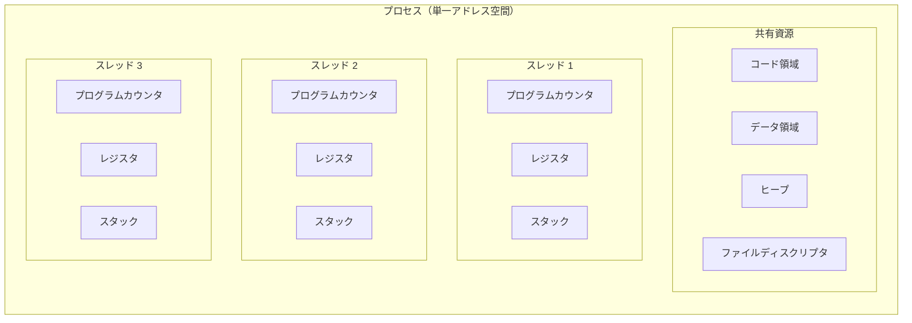

この設計により、プロセスが抱えていた問題が大幅に軽減される。

| 比較項目 | プロセス | スレッド |
|---|---|---|
| アドレス空間 | 独立（隔離） | 共有 |
| 生成コスト | 高い（ページテーブル複製） | 低い（スタック割り当てのみ） |
| コンテキストスイッチ | 重い（TLBフラッシュあり） | 軽い（TLBフラッシュなし） |
| データ共有 | IPC経由（コストあり） | メモリ直接共有（高速） |
| 耐障害性 | 高い（隔離されている） | 低い（1スレッドの異常が全体に波及） |

### 1.3 歴史的背景

スレッドの概念は1960年代後半のMulticsやTHEオペレーティングシステムにまで遡る。「軽量プロセス（Lightweight Process, LWP）」という用語もこの時期に生まれた。1980年代にはMachマイクロカーネルがスレッドをOSの基本的な実行単位として体系的に実装し、1990年代にはPOSIX Threads（pthreads）が標準化されてUNIX系OSにおけるスレッドプログラミングのAPIが統一された。

同じ時期、カーネルの介在なしにユーザー空間でスレッドを実装する**ユーザースレッド（グリーンスレッド）**のアプローチも発展した。初期のJava仮想マシン（JDK 1.0〜1.1のSolaris版）はグリーンスレッドを採用し、後にネイティブスレッドに移行した。そして2020年代に入り、Go言語のgoroutineやJava Project LoomのVirtual Threadsに代表されるように、ユーザースレッドの概念はハイブリッドモデルとして再評価されている。

## 2. カーネルスレッドの仕組み — 1:1 モデル

### 2.1 カーネルスレッドとは

**カーネルスレッド（kernel thread）**は、OSカーネルが直接認識し管理するスレッドである。カーネルスレッドの生成、スケジューリング、コンテキストスイッチはすべてカーネルが行う。ユーザー空間のスレッド1つに対してカーネルスレッド1つが対応するため、この方式を**1:1モデル（One-to-One model）**と呼ぶ。

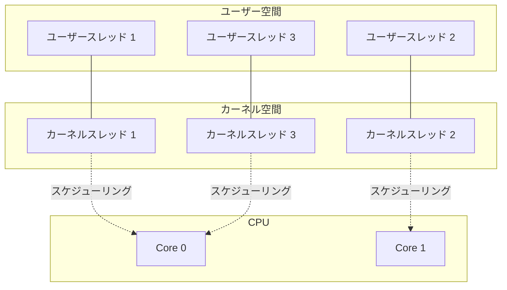

現代の主要OSであるLinux、Windows、macOSは、いずれもデフォルトで1:1モデルを採用している。この方式の利点は以下の通りである。

- **マルチコアの活用**: カーネルスケジューラが各スレッドを異なるCPUコアに配置できるため、真の並列実行が可能
- **ブロッキングI/Oの自然な処理**: あるスレッドがI/O待ちでブロックしても、他のスレッドは影響を受けない
- **シンプルな実装**: スケジューリングの複雑性をカーネルに任せることで、ユーザー空間の実装が単純になる

### 2.2 Linuxにおける clone() システムコール

Linuxカーネルは、プロセスとスレッドを根本的に区別しない。カーネルの視点では、両者ともに**タスク（task）**であり、`task_struct` 構造体で管理される。プロセスとスレッドの違いは、タスク間でどのリソースを共有するかの違いに過ぎない。

この統一的なモデルを実現するのが `clone()` システムコールである。`clone()` はフラグによってリソース共有の粒度を細かく制御できる。

```c
// clone() prototype
int clone(int (*fn)(void *), void *stack, int flags, void *arg, ...);
```

主要なフラグの意味は以下の通りである。

| フラグ | 意味 |
|---|---|
| `CLONE_VM` | 親と同じ仮想メモリ空間を共有する |
| `CLONE_FS` | ファイルシステム情報（root, cwd）を共有する |
| `CLONE_FILES` | ファイルディスクリプタテーブルを共有する |
| `CLONE_SIGHAND` | シグナルハンドラを共有する |
| `CLONE_THREAD` | 同一スレッドグループに属する |
| `CLONE_PARENT_SETTID` | 親のメモリにTIDを書き込む |
| `CLONE_CHILD_CLEARTID` | 子の終了時にTIDをクリアしfutexを起こす |

`fork()` は `clone()` の特殊ケースであり、フラグなし（= 何も共有しない）に相当する。一方、スレッド生成はすべてのリソースを共有するフラグの組み合わせに相当する。

```c
// fork() is essentially:
clone(NULL, NULL, SIGCHLD, NULL);

// pthread_create() is essentially:
clone(fn, stack,
    CLONE_VM | CLONE_FS | CLONE_FILES | CLONE_SIGHAND |
    CLONE_THREAD | CLONE_SYSVSEM | CLONE_SETTLS |
    CLONE_PARENT_SETTID | CLONE_CHILD_CLEARTID,
    arg);
```

この設計はLinuxの「メカニズムの提供、ポリシーの分離」という哲学を体現している。プロセスとスレッドを別の概念として扱うのではなく、共有するリソースの度合いを連続的に制御可能にすることで、柔軟性と効率を両立している。

### 2.3 Linuxにおけるスレッドの内部表現

Linux カーネル内部では、各スレッドは個別の `task_struct` を持つ。同一プロセス（スレッドグループ）に属するスレッドは、`task_struct->mm`（メモリ記述子）、`task_struct->files`（ファイルディスクリプタテーブル）、`task_struct->signal`（シグナル情報）などのポインタが同一の構造体を指すことで、リソースの共有を実現している。

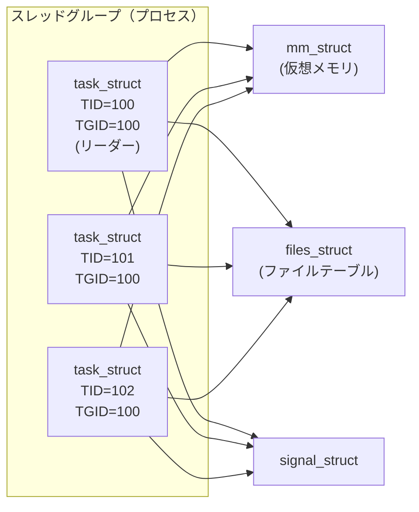

スレッドグループのリーダー（最初に生成されたスレッド）のTIDがプロセスのPID（TGID: Thread Group ID）となる。`getpid()` はTGIDを返し、`gettid()` はスレッド固有のTIDを返す。この仕組みにより、外部からは「1つのプロセス」として見えつつ、内部では複数のスレッドが独立にスケジューリングされる。

### 2.4 1:1モデルの限界

1:1モデルにはスレッドの生成と管理コストに関する本質的な制約がある。

**カーネルリソースの消費**: 各スレッドは `task_struct`（数KB）とカーネルスタック（通常8KB〜16KB）を必要とする。ユーザー空間スタックも含めると、1スレッドあたり最低でも数十KBから数MBのメモリを消費する（Linuxのデフォルトスタックサイズは8MB）。1万スレッドを生成すると、スタックだけで80GBの仮想アドレス空間を消費する計算になる（物理メモリの消費はアクセスしたページ分のみだが、アドレス空間の枯渇が問題になりうる）。

**システムコールのオーバーヘッド**: スレッドの生成・破棄にはシステムコールが必要であり、ユーザー空間とカーネル空間の切り替えコストが発生する。大量のスレッドを頻繁に生成・破棄するワークロードでは、このオーバーヘッドが無視できなくなる。

**スケジューラのスケーラビリティ**: カーネルスケジューラがすべてのスレッドを管理するため、スレッド数が増加するとスケジューリングのオーバーヘッドも増加する。LinuxのCFS（Completely Fair Scheduler）は赤黒木でO(log n)の計算量を持つが、数万〜数十万スレッドの管理は依然として負荷が大きい。

## 3. ユーザースレッド / グリーンスレッド — N:1 モデル

### 3.1 ユーザースレッドとは

**ユーザースレッド（user thread）**は、カーネルの関与なしにユーザー空間のライブラリが管理するスレッドである。カーネルから見ると、ユーザースレッドを複数持つプロセスであっても、シングルスレッドのプロセスと何ら変わらない。複数のユーザースレッドが1つのカーネルスレッドに対応するため、このモデルを**N:1モデル**と呼ぶ。

「グリーンスレッド（green thread）」という名前は、Sun Microsystemsが初期のJava（JDK 1.0〜1.1）で採用したユーザースレッド実装のコードネーム「Green Project」に由来する。現在では、ユーザー空間で管理される軽量スレッドの総称として広く使われている。

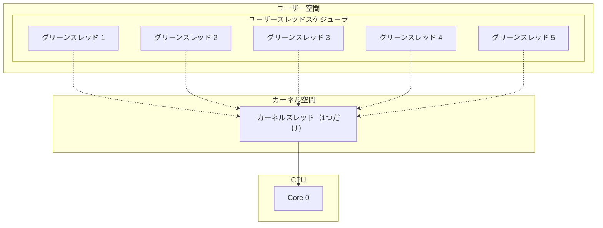

### 3.2 ユーザースレッドの実装原理

ユーザースレッドの実装は、以下の要素から構成される。

**スレッド制御ブロック（TCB）**: 各ユーザースレッドの状態（プログラムカウンタ、レジスタ、スタックポインタ）を保存するデータ構造。カーネルの `task_struct` に相当するが、はるかに小さい。

**スタック**: ユーザースレッドごとに独立したスタック領域を割り当てる。カーネルスレッドのデフォルトスタック（8MB）と比較して、ユーザースレッドのスタックは非常に小さく（数KB〜数十KB）設定されることが多い。

**コンテキストスイッチ**: `setjmp`/`longjmp` やアセンブリ言語による直接的なレジスタ操作で、スレッド間のコンテキストスイッチを行う。POSIX の `ucontext` ファミリ（`getcontext`, `setcontext`, `makecontext`, `swapcontext`）もこの目的に使われる。

**スケジューラ**: ユーザー空間のライブラリ内に独自のスケジューリングロジックを持つ。協調的スケジューリング（各スレッドが自発的にCPUを譲る）が一般的だが、シグナル（`SIGALRM`など）を利用したプリエンプティブなスケジューリングも可能である。

以下は、`ucontext` を用いたユーザースレッドの原理的な実装の簡略例である。

```c
#include <ucontext.h>
#include <stdio.h>
#include <stdlib.h>

#define STACK_SIZE 8192

static ucontext_t main_ctx, thread1_ctx, thread2_ctx;

void thread1_func(void) {
    printf("Thread 1: step 1\n");
    swapcontext(&thread1_ctx, &thread2_ctx);  // yield to thread 2
    printf("Thread 1: step 2\n");
    swapcontext(&thread1_ctx, &main_ctx);      // yield to main
}

void thread2_func(void) {
    printf("Thread 2: step 1\n");
    swapcontext(&thread2_ctx, &thread1_ctx);  // yield to thread 1
    printf("Thread 2: step 2\n");
    swapcontext(&thread2_ctx, &main_ctx);      // yield to main
}

int main(void) {
    char stack1[STACK_SIZE], stack2[STACK_SIZE];

    // initialize thread 1 context
    getcontext(&thread1_ctx);
    thread1_ctx.uc_stack.ss_sp = stack1;
    thread1_ctx.uc_stack.ss_size = STACK_SIZE;
    thread1_ctx.uc_link = &main_ctx;
    makecontext(&thread1_ctx, thread1_func, 0);

    // initialize thread 2 context
    getcontext(&thread2_ctx);
    thread2_ctx.uc_stack.ss_sp = stack2;
    thread2_ctx.uc_stack.ss_size = STACK_SIZE;
    thread2_ctx.uc_link = &main_ctx;
    makecontext(&thread2_ctx, thread2_func, 0);

    // start execution from thread 1
    swapcontext(&main_ctx, &thread1_ctx);
    printf("All threads completed.\n");
    return 0;
}
```

この例では `swapcontext()` の呼び出しが「yield」に相当し、実行権を別のスレッドに明示的に譲っている。これが協調的スケジューリングの本質である。

### 3.3 N:1モデルの利点と欠点

**利点**:

- **極めて低い生成コスト**: スレッドの生成にシステムコールが不要。メモリ割り当て（スタック用）と初期化のみで完了するため、数マイクロ秒以下で生成可能
- **高速なコンテキストスイッチ**: カーネルを経由しないため、コンテキストスイッチのコストが非常に小さい（数十〜数百ナノ秒）。カーネルスレッドのコンテキストスイッチ（数マイクロ秒）と比較して1桁以上高速
- **小さなメモリフットプリント**: 各スレッドのスタックを小さく設定でき、TCBもカーネルの `task_struct` より遥かに小さい。数百万のスレッドを生成することも理論的に可能

**欠点**:

- **マルチコアを活用できない**: すべてのユーザースレッドが1つのカーネルスレッド上で動作するため、マルチコアCPUの並列性を活かせない
- **ブロッキングI/Oで全スレッドが停止する**: あるユーザースレッドがブロッキングシステムコール（`read()`, `accept()` など）を発行すると、対応するカーネルスレッドがブロックされ、そのカーネルスレッド上の全ユーザースレッドが停止する
- **カーネルスケジューラの恩恵を受けられない**: 優先度ベースのスケジューリングや負荷分散など、カーネルスケジューラの高度な機能を利用できない

特にブロッキングI/Oの問題は致命的である。WebサーバーのようにネットワークI/Oが頻繁に発生するアプリケーションでは、N:1モデルは実用的でない場合が多い。この問題を回避するために、非ブロッキングI/O（`O_NONBLOCK`、`epoll`、`kqueue`）と組み合わせて使用する手法が発展した。

## 4. ハイブリッドモデル — M:N モデル

### 4.1 M:Nモデルの概念

N:1モデルの「マルチコアを活用できない」問題と、1:1モデルの「スレッド管理コストが大きい」問題を同時に解決しようとするのが**M:Nモデル（Many-to-Many model）**である。M個のユーザースレッドをN個のカーネルスレッド（M >> N）にマルチプレクスする。

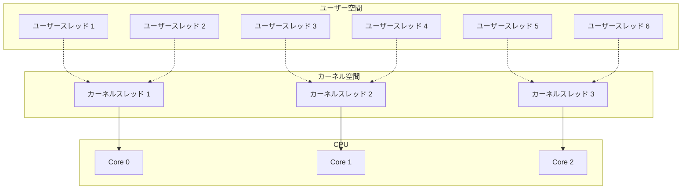

M:Nモデルでは、ユーザー空間のスケジューラがユーザースレッドをカーネルスレッドにマッピングする。ユーザースレッドがブロッキングI/Oを行った場合、そのカーネルスレッド上の他のユーザースレッドを別のカーネルスレッドに移動させることで、システム全体の並行性を維持する。

### 4.2 各モデルの比較

| 特性 | 1:1（カーネル） | N:1（ユーザー） | M:N（ハイブリッド） |
|---|---|---|---|
| マルチコア活用 | 可能 | 不可 | 可能 |
| スレッド生成コスト | 高 | 極めて低 | 低 |
| コンテキストスイッチ | カーネル経由（重い） | ユーザー空間（軽い） | ユーザー空間（軽い） |
| ブロッキングI/O | 他スレッドに影響なし | 全スレッド停止 | 他スレッドに影響なし |
| 実装の複雑性 | 単純 | 中程度 | 高い |
| 同時スレッド数 | 数千〜数万 | 数百万 | 数百万 |
| 代表的な実装 | Linux pthreads, Windows, Java (HotSpot) | 初期Java (Green), Ruby 1.8 | Go goroutine, Erlang, Java Virtual Threads |

### 4.3 M:Nモデルの実装上の課題

M:Nモデルは理論的には理想的だが、実装には多くの困難が伴う。

**スケジューラの複雑性**: ユーザー空間スケジューラとカーネルスケジューラの2つが協調して動作する必要がある。ユーザー空間スケジューラの決定がカーネルスケジューラの決定と矛盾する場合（例えば、ユーザー空間でスレッドをブロックしたのにカーネルスレッドが起きたままになる）、リソースの無駄遣いが発生する。

**ブロッキングシステムコールのハンドリング**: ユーザースレッドがブロッキングシステムコールを発行すると、対応するカーネルスレッドが停止する。この状況を検出して、他のユーザースレッドを別のカーネルスレッドに移行させる仕組み（**handoff**）が必要になる。Solarisはかつて `scheduler activations` という機構でカーネルとユーザー空間スケジューラの連携を試みたが、実装の複雑さから後に1:1モデルに移行した。

**デバッガ・プロファイラとの統合**: 1:1モデルではOSの標準的なデバッグツール（`strace`, `gdb`, `perf`）がそのまま使えるが、M:Nモデルでは追加の対応が必要になる。

歴史的にはSolarisのLWP（Lightweight Process）やFreeBSDのKSE（Kernel Scheduled Entities）がM:Nモデルを実装したが、複雑性に見合うメリットが得られず、最終的には1:1モデルに回帰した。しかし、GoやErlangのように**言語ランタイム全体をM:Nモデルを前提として設計した**場合には、この複雑性を適切に管理して大きな成功を収めている。

## 5. スレッドのスタックとコンテキストスイッチ

### 5.1 スレッドスタックの設計

各スレッドは独立したスタック領域を持つ。スタックの設計はスレッドモデルの効率性に直結する重要な要素である。

**カーネルスレッドのスタック**: 通常、OSが固定サイズのスタックを割り当てる。Linuxのデフォルトはpthreadスタックサイズが8MB（`ulimit -s` で確認可能）である。この8MBは仮想アドレス空間の予約に過ぎず、物理メモリはアクセスしたページ分だけオンデマンドで割り当てられる（demand paging）。しかし、仮想アドレス空間の消費は無視できない。スタックの末尾には**ガードページ（guard page）**が配置され、スタックオーバーフローを検出する。

**ユーザースレッド/グリーンスレッドのスタック**: 大量のスレッドを生成するために、スタックサイズは非常に小さく設計される。Go言語のgoroutineは初期スタックサイズがわずか**2KB〜8KB**（バージョンによって異なる）であり、必要に応じて動的に成長する。

### 5.2 成長可能なスタック（Growable Stack）

固定サイズのスタックには根本的なジレンマがある。小さく設定するとスタックオーバーフローのリスクが高まり、大きく設定するとメモリの無駄遣いになる。この問題を解決するのが**成長可能なスタック**である。

Goのランタイムは以下のアプローチでスタックの動的成長を実現している。

**セグメント方式（Go 1.3以前）**: スタックが不足すると、新しいスタックセグメントを割り当ててチェーンで繋ぐ。しかし、セグメント境界をまたぐ関数呼び出しで「ホットスプリット（hot split）」問題が発生する。スタックの成長と縮小が頻繁に行われると、セグメントの割り当てと解放が繰り返されてパフォーマンスが低下する。

**コピー方式（Go 1.4以降）**: スタックが不足すると、現在のスタックの2倍のサイズの新しいスタックを割り当て、既存のスタック内容をコピーし、スタック上のポインタを書き換える。ホットスプリット問題を回避でき、連続したメモリ領域を使用するためキャッシュ効率も良い。

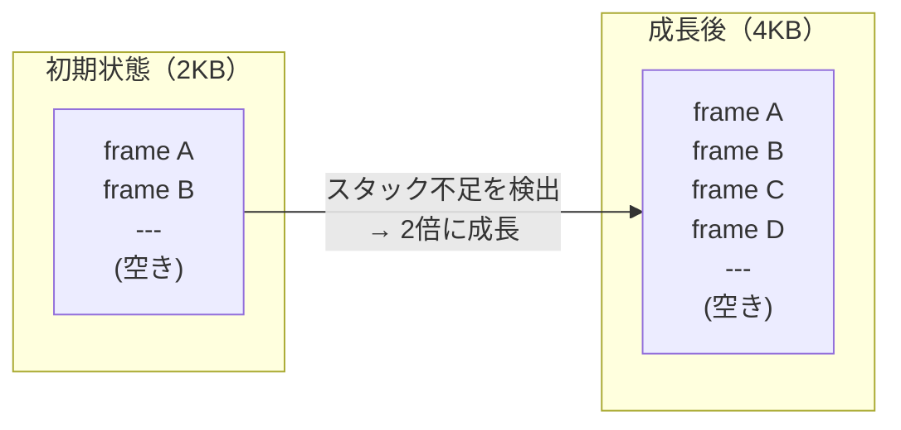

### 5.3 コンテキストスイッチの詳細

スレッドのコンテキストスイッチは、現在のスレッドの状態を保存し、次のスレッドの状態を復元する操作である。保存・復元が必要な情報は以下の通りである。

**汎用レジスタ**: x86-64の場合、RAX, RBX, RCX, RDX, RSI, RDI, R8〜R15 など
**スタックポインタ**: RSP（スタックの先頭アドレス）
**ベースポインタ**: RBP（スタックフレームの基準点）
**プログラムカウンタ**: RIP（次に実行する命令のアドレス）
**フラグレジスタ**: RFLAGS（条件フラグ、割り込み有効/無効など）
**浮動小数点/SIMD状態**: x87 FPU, SSE, AVX のレジスタ（遅延保存が一般的）

カーネルスレッドのコンテキストスイッチでは、これらに加えてカーネルスタックの切り替えと、TLBの管理（同一プロセス内のスレッド間では不要）が行われる。

ユーザースレッドのコンテキストスイッチは、カーネルを経由しないため大幅に軽量である。典型的なユーザー空間コンテキストスイッチは以下のアセンブリで表現できる（x86-64の概念的な例）。

```asm
; save current context
; rdi = pointer to save area for current thread
; rsi = pointer to save area for next thread
context_switch:
    push rbp
    push rbx
    push r12
    push r13
    push r14
    push r15
    mov [rdi], rsp      ; save stack pointer of current thread

    mov rsp, [rsi]      ; restore stack pointer of next thread
    pop r15
    pop r14
    pop r13
    pop r12
    pop rbx
    pop rbp
    ret                  ; return to next thread's execution point
```

この操作は数十ナノ秒で完了する。カーネルスレッドのコンテキストスイッチが数マイクロ秒を要することと比較すると、100倍近い差がある。この差がグリーンスレッドの存在意義の根拠となっている。

## 6. POSIX Threads（pthread）

### 6.1 pthreads の概要

**POSIX Threads（pthreads）**は、IEEE POSIX 1003.1c-1995で標準化されたスレッドプログラミングのAPIである。UNIX系OS（Linux, macOS, FreeBSD, Solarisなど）で広く実装されており、C/C++におけるスレッドプログラミングの事実上の標準となっている。

pthreadsは以下のカテゴリのAPIを提供する。

- **スレッド管理**: `pthread_create`, `pthread_join`, `pthread_exit`, `pthread_detach`
- **Mutex**: `pthread_mutex_init`, `pthread_mutex_lock`, `pthread_mutex_unlock`
- **条件変数**: `pthread_cond_wait`, `pthread_cond_signal`, `pthread_cond_broadcast`
- **Read-Writeロック**: `pthread_rwlock_rdlock`, `pthread_rwlock_wrlock`
- **バリア**: `pthread_barrier_wait`
- **スレッド固有データ**: `pthread_key_create`, `pthread_setspecific`, `pthread_getspecific`
- **スレッド属性**: `pthread_attr_setdetachstate`, `pthread_attr_setstacksize`

### 6.2 基本的な使用例

```c
#include <pthread.h>
#include <stdio.h>
#include <stdlib.h>

typedef struct {
    int thread_id;
    int iterations;
} thread_arg_t;

static pthread_mutex_t counter_mutex = PTHREAD_MUTEX_INITIALIZER;
static long global_counter = 0;

void *worker(void *arg) {
    thread_arg_t *targ = (thread_arg_t *)arg;

    for (int i = 0; i < targ->iterations; i++) {
        pthread_mutex_lock(&counter_mutex);
        global_counter++;
        pthread_mutex_unlock(&counter_mutex);
    }

    printf("Thread %d completed %d iterations\n",
           targ->thread_id, targ->iterations);
    return NULL;
}

int main(void) {
    const int NUM_THREADS = 4;
    const int ITERATIONS = 1000000;

    pthread_t threads[NUM_THREADS];
    thread_arg_t args[NUM_THREADS];

    // create threads
    for (int i = 0; i < NUM_THREADS; i++) {
        args[i].thread_id = i;
        args[i].iterations = ITERATIONS;
        int rc = pthread_create(&threads[i], NULL, worker, &args[i]);
        if (rc != 0) {
            fprintf(stderr, "pthread_create failed: %d\n", rc);
            exit(1);
        }
    }

    // wait for all threads to complete
    for (int i = 0; i < NUM_THREADS; i++) {
        pthread_join(threads[i], NULL);
    }

    printf("Final counter: %ld (expected: %ld)\n",
           global_counter, (long)NUM_THREADS * ITERATIONS);
    return 0;
}
```

### 6.3 pthreads の実装 — NPTL

Linuxにおけるpthreadsのデファクトスタンダードな実装は**NPTL（Native POSIX Thread Library）**である。NPTLは2003年にRed Hatの Ulrich DrepperとIngo Molnarによって開発され、Linux 2.6以降のglibcに統合されている。

NPTLの登場以前、Linuxには**LinuxThreads**という実装が存在したが、以下の重大な問題を抱えていた。

- 各スレッドが異なるPIDを持つ（POSIX非準拠）
- シグナルハンドリングが不完全
- マネージャスレッドが必要（余分なスレッドが1つ常に存在する）
- `getpid()` がスレッドごとに異なる値を返す

NPTLはこれらの問題をカーネルとの協調設計で解決した。NPTLの主な特徴は以下の通りである。

- **1:1モデル**: 各pthreadは1つのカーネルスレッド（`clone()` で生成）に直接対応する
- **futex**: スレッドの同期にfutex（Fast Userspace Mutex）を使用する。競合がない場合はシステムコールを発行せず、ユーザー空間のアトミック操作だけで完了するため高速
- **POSIX準拠**: 同一プロセス内のスレッドは同じPIDを共有し、シグナルも正しくハンドリングされる
- **低い生成コスト**: スレッドの生成に要する時間は数十マイクロ秒程度

### 6.4 スレッド属性のカスタマイズ

pthreadsではスレッドの属性を `pthread_attr_t` で制御できる。実運用で重要な属性は以下の通りである。

```c
pthread_attr_t attr;
pthread_attr_init(&attr);

// set stack size (e.g., 1MB instead of default 8MB)
pthread_attr_setstacksize(&attr, 1 * 1024 * 1024);

// set detach state (detached threads are not joinable)
pthread_attr_setdetachstate(&attr, PTHREAD_CREATE_DETACHED);

// set scheduling policy and priority (requires appropriate privileges)
struct sched_param param;
param.sched_priority = 10;
pthread_attr_setschedpolicy(&attr, SCHED_FIFO);
pthread_attr_setschedparam(&attr, &param);
pthread_attr_setinheritsched(&attr, PTHREAD_EXPLICIT_SCHED);

pthread_t thread;
pthread_create(&thread, &attr, worker, NULL);
pthread_attr_destroy(&attr);
```

特にスタックサイズの設定は、大量のスレッドを生成するアプリケーションでは重要である。デフォルトの8MBから1MBや256KBに縮小することで、同時に存在可能なスレッド数を大幅に増やせる。

## 7. Java/JVMのスレッドモデルと Project Loom

### 7.1 Java のスレッドモデルの変遷

Javaのスレッドモデルは、言語の進化とともに大きく変遷してきた。

**JDK 1.0〜1.1（1996〜1997）**: Solaris版JVMはグリーンスレッド（N:1モデル）を採用していた。すべてのJavaスレッドが単一のOSスレッド上でスケジューリングされていた。マルチプロセッサを活用できない、ブロッキングI/Oで全スレッドが停止するといった問題があった。

**JDK 1.2以降（1998〜）**: ネイティブスレッド（1:1モデル）に移行した。`java.lang.Thread` が直接OSスレッドに対応するようになり、マルチコアの活用やブロッキングI/Oの問題が解決された。以降約25年間、この方式がJavaの標準的なスレッドモデルであった。

**JDK 21（2023〜）**: Project Loomにより**Virtual Threads（仮想スレッド）**が正式導入された。M:Nモデルへの回帰であるが、JVMランタイムの成熟と非同期I/Oインフラの充実により、過去のグリーンスレッドとは異なる成功を収めている。

### 7.2 従来のJavaスレッドの課題

1:1モデルのJavaスレッドでは、以下のような課題が顕在化してきた。

**スレッドプールの飽和**: Webアプリケーションサーバーでは、リクエストごとにスレッドを割り当てる「Thread-per-Request」モデルが一般的である。しかし、各リクエストの処理中にデータベースクエリやHTTP通信のI/O待ちが発生すると、スレッドはブロックされたまま何もせずにリソースを消費する。同時リクエスト数がスレッドプールの上限（通常200〜500程度）に達すると、それ以上のリクエストは待ちキューに入るか拒否される。

**リアクティブプログラミングの複雑性**: この問題を回避するために、Reactor/RxJava/Vert.xなどのリアクティブフレームワークが登場した。これらは少数のスレッドで大量の非同期I/Oを処理できるが、コールバック地獄やリアクティブストリームの複雑な合成パターンが必要となり、開発の難易度が大幅に上がる。また、スタックトレースが分断されてデバッグが困難になるという問題も深刻であった。

### 7.3 Project Loom と Virtual Threads

**Project Loom**は、上記の課題を「プラットフォームレベルで」解決しようとするJavaの一大プロジェクトである。その中核が**Virtual Threads**である。

Virtual Threadsは、JVMランタイムが管理するユーザースレッドである。OSスレッド（**キャリアスレッド**と呼ばれる）上にマウントされて実行され、I/O待ちなどでブロックすると自動的にアンマウント（unmount）されてキャリアスレッドを解放する。

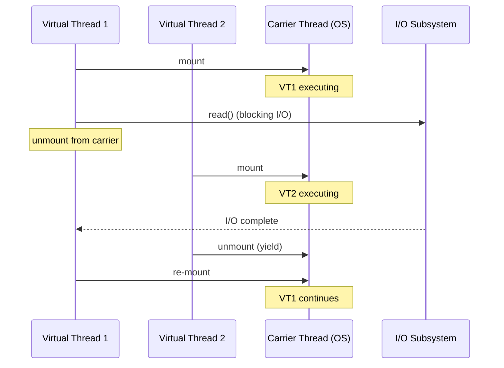

Virtual Threadsの特徴は以下の通りである。

- **軽量**: 1つのVirtual Threadのメモリコストは約1KB（OSスレッドの数千分の一）
- **大量生成可能**: 数百万のVirtual Threadsを同時に存在させることが可能
- **既存APIとの互換性**: `java.lang.Thread` のサブクラスであり、既存のスレッドAPIがそのまま使える
- **ブロッキングI/Oの透過的な最適化**: `java.net.Socket`, `java.io.InputStream` などの標準APIが内部的に非ブロッキング化されており、プログラマはブロッキングAPIをそのまま使いながら高いスケーラビリティを得られる

```java
import java.util.concurrent.Executors;
import java.time.Duration;

public class VirtualThreadDemo {
    public static void main(String[] args) throws Exception {
        // create 100,000 virtual threads
        try (var executor = Executors.newVirtualThreadPerTaskExecutor()) {
            for (int i = 0; i < 100_000; i++) {
                final int taskId = i;
                executor.submit(() -> {
                    // blocking sleep - carrier thread is freed during sleep
                    try {
                        Thread.sleep(Duration.ofSeconds(1));
                    } catch (InterruptedException e) {
                        Thread.currentThread().interrupt();
                    }
                    return taskId;
                });
            }
        } // executor.close() waits for all tasks
        System.out.println("All 100,000 tasks completed.");
    }
}
```

従来のOSスレッドでは10万スレッドの同時生成は事実上不可能だが（メモリだけで数百GBが必要）、Virtual Threadsではこれが数百MBのメモリで実現できる。

### 7.4 Virtual Threads の制約

Virtual Threadsにもいくつかの制約がある。

**synchronized ブロック内でのブロック（pinning）**: Virtual Threadが `synchronized` ブロック内でブロッキング操作を行うと、キャリアスレッドに「ピン止め（pinned）」され、アンマウントできない。これはキャリアスレッドのスループットを低下させる。回避策として `java.util.concurrent.locks.ReentrantLock` の使用が推奨される。

**CPUバウンドなタスクには不向き**: Virtual Threadsの真価はI/Oバウンドなワークロードで発揮される。CPUバウンドな処理では、OSスレッドの数以上の並列性は得られないため、Virtual Threadsの利点は限定的である。

**スレッドローカルの使用に注意**: 数百万のVirtual Threadsが存在する環境では、スレッドローカル変数のメモリ消費が無視できなくなる。JDK 21では `ScopedValue`（Preview）が代替手段として提供されている。

## 8. Goのgoroutineとスケジューラ — GMP モデル

### 8.1 goroutine の設計思想

Go言語のgoroutineは、M:Nモデルの最も成功した実装の一つである。Go言語の設計者であるRob PikeとKen Thompsonは、並行処理を言語レベルの一級市民（first-class citizen）として組み込むことを設計目標の一つとした。

goroutineは「go」キーワードを付けた関数呼び出しで起動される。

```go
package main

import (
    "fmt"
    "sync"
)

func worker(id int, wg *sync.WaitGroup) {
    defer wg.Done()
    fmt.Printf("Worker %d starting\n", id)
    // do some work...
    fmt.Printf("Worker %d done\n", id)
}

func main() {
    var wg sync.WaitGroup
    for i := 0; i < 100000; i++ {
        wg.Add(1)
        go worker(i, &wg) // launch goroutine
    }
    wg.Wait()
    fmt.Println("All workers completed")
}
```

この例では10万のgoroutineを生成しているが、対応するOSスレッドはCPUコア数程度（`GOMAXPROCS` で設定可能）しか生成されない。goroutineの初期スタックサイズはわずか数KBであり、10万goroutineのメモリオーバーヘッドは数百MB以下に収まる。

### 8.2 GMP モデル

GoのランタイムスケジューラはGMP（Goroutine-Machine-Processor）モデルと呼ばれるアーキテクチャを採用している。

- **G（Goroutine）**: goroutineを表す構造体。スタック、プログラムカウンタ、状態などの情報を保持する
- **M（Machine）**: OSスレッドを表す。実際のCPU実行を担う
- **P（Processor）**: 論理プロセッサ。ローカルのgoroutineキュー（runqueue）とランタイムリソース（mcache等）を保持する。Pの数は `GOMAXPROCS` で決まり、デフォルトはCPUコア数

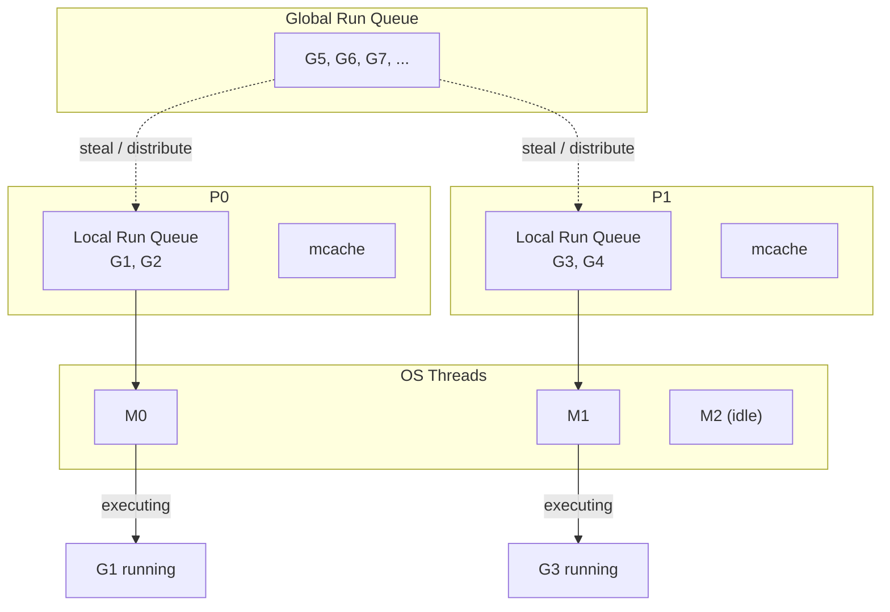

GMPモデルの動作原理は以下の通りである。

1. 新しいgoroutineが生成されると、現在のPのローカルrunqueueに追加される
2. MはPに紐づいてgoroutineを取得し実行する
3. goroutineがシステムコールなどでブロックすると、Mはgoroutine（G）と共にブロックし、PはMから切り離されて他のMに紐づけられる（handoff）
4. ローカルrunqueueが空になったPは、他のPのrunqueueから半分のgoroutineを「盗む」（**work stealing**）
5. すべてのローカルrunqueueが空の場合、グローバルrunqueueからgoroutineを取得する

### 8.3 Work Stealing スケジューリング

work stealingは、Goスケジューラの負荷分散における中核的な戦略である。あるP（論理プロセッサ）のローカルrunqueueが空になった場合、以下の順序でgoroutineを探す。

1. 自身のローカルrunqueueを確認（空のはず）
2. グローバルrunqueueを確認
3. ネットワークポーラーの結果を確認（I/O完了待ちのgoroutineがあるか）
4. 他のPのローカルrunqueueから半分を盗む

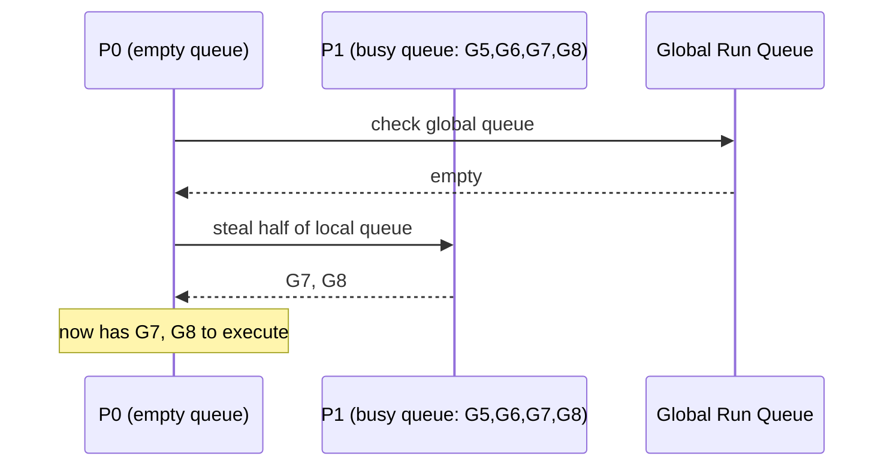

この方式により、goroutineが特定のPに偏って配置されても、自動的に負荷が分散される。work stealingは理論的にO(1)の平均時間計算量でスケジューリングを行えることが証明されており、実際のGoプログラムでも優れたスケーラビリティを示す。

### 8.4 ネットワークポーラーとの統合

Goのランタイムは、goroutineがネットワークI/O（`net.Conn.Read()` など）でブロックした場合、OSレベルのブロッキングI/Oを発行するのではなく、内部的に `epoll`（Linux）/ `kqueue`（macOS/BSD）を使った非ブロッキングI/Oに変換する。

goroutineがI/O完了を待つ際の流れは以下の通りである。

1. goroutineがネットワークI/O操作を実行
2. ランタイムがソケットをネットワークポーラー（`epoll`）に登録
3. goroutineは「waiting」状態になり、runqueueから除外される
4. PとMは別のgoroutineの実行を継続
5. ネットワークポーラーがI/O完了を検出すると、対応するgoroutineをrunqueueに戻す

この仕組みにより、プログラマは同期的な（ブロッキングに見える）コードを書きながら、内部的には非同期I/Oの恩恵を享受できる。これはGoの並行処理モデルの最大の強みの一つである。

### 8.5 プリエンプション

Go 1.14以降、goroutineに対する**非同期プリエンプション（asynchronous preemption）**が導入された。これにより、CPUバウンドなgoroutineが長時間実行されても、他のgoroutineがスケジューリングされるようになった。

Go 1.14以前は、goroutineのプリエンプションは**協調的（cooperative）**であり、関数呼び出し時に挿入されるスタック成長チェックのポイントでのみスケジューリングが行われた。これは、タイトなループ（関数呼び出しを含まないループ）を実行するgoroutineが他のgoroutineを飢餓状態にする可能性があるという問題があった。

非同期プリエンプションは、OSのシグナル機構（`SIGURG`）を使用して実装されており、任意の命令実行ポイントでgoroutineを中断できる。

## 9. スレッドプールの設計

### 9.1 スレッドプールの必要性

スレッドの生成と破棄にはオーバーヘッドがある。リクエストごとにスレッドを生成・破棄する方式は、リクエスト数が多い場合に大きな性能問題を引き起こす。**スレッドプール（thread pool）**は、あらかじめスレッドを生成して待機させておき、タスクが到着したら空きスレッドに割り当てる仕組みである。

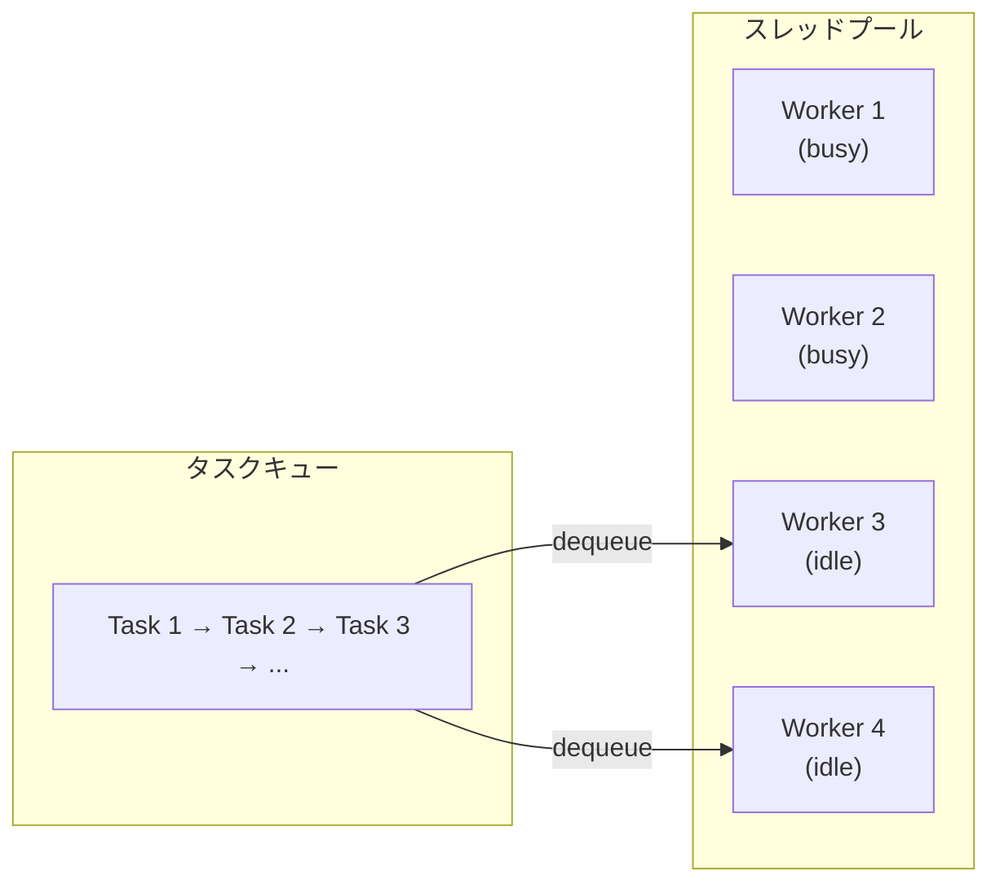

### 9.2 プールサイズの決定

スレッドプールのサイズ設定は、アプリケーションの性能に直結する重要な設計判断である。

**CPUバウンドなタスクの場合**: プールサイズはCPUコア数に等しくするのが最適である。それ以上スレッドを増やしても、コンテキストスイッチのオーバーヘッドが増えるだけで、スループットは向上しない。

$$N_{threads} = N_{CPU}$$

**I/Oバウンドなタスクの場合**: スレッドがI/O待ちの間はCPUを使用しないため、コア数よりも多くのスレッドを持つことが有効である。Brain Goetzが提唱した経験則は以下の通りである。

$$N_{threads} = N_{CPU} \times (1 + \frac{W}{C})$$

ここで $W$ はI/O待ち時間、$C$ はCPU処理時間である。例えば、タスクの処理時間の80%がI/O待ちで20%がCPU処理であれば、8コアのマシンでは $8 \times (1 + 0.8 / 0.2) = 8 \times 5 = 40$ スレッドが適切となる。

ただし、この公式はあくまで出発点であり、実際のアプリケーションでは負荷テストにより最適値を見つける必要がある。

### 9.3 Javaにおけるスレッドプール

Javaの `java.util.concurrent` パッケージは、多様なスレッドプール実装を提供している。

```java
import java.util.concurrent.*;

public class ThreadPoolExample {
    public static void main(String[] args) {
        // fixed thread pool: constant number of threads
        ExecutorService fixedPool = Executors.newFixedThreadPool(4);

        // cached thread pool: creates threads as needed, reuses idle ones
        ExecutorService cachedPool = Executors.newCachedThreadPool();

        // custom thread pool with fine-grained control
        ThreadPoolExecutor customPool = new ThreadPoolExecutor(
            4,                      // core pool size
            16,                     // maximum pool size
            60L, TimeUnit.SECONDS,  // keep-alive time for excess threads
            new LinkedBlockingQueue<>(1000),  // work queue with capacity
            new ThreadPoolExecutor.CallerRunsPolicy()  // rejection policy
        );

        // submit tasks
        for (int i = 0; i < 100; i++) {
            final int taskId = i;
            customPool.submit(() -> {
                System.out.printf("Task %d on %s%n",
                    taskId, Thread.currentThread().getName());
            });
        }

        customPool.shutdown();
    }
}
```

`ThreadPoolExecutor` の主要なパラメータは以下の通りである。

- **corePoolSize**: 常時維持するスレッド数。タスクがなくてもスレッドは存続する
- **maximumPoolSize**: スレッド数の上限。キューが満杯になったときにこの上限まで追加のスレッドが生成される
- **keepAliveTime**: core数を超えたスレッドが、この時間以上アイドル状態であれば破棄される
- **workQueue**: タスクを待機させるキュー。`LinkedBlockingQueue`（上限付き/無限）、`SynchronousQueue`（バッファなし）、`ArrayBlockingQueue`（固定サイズ配列）などが選択可能
- **rejectionPolicy**: キューが満杯でスレッド数も上限に達した場合の処理。`AbortPolicy`（例外をスロー）、`CallerRunsPolicy`（呼び出し元のスレッドで実行）、`DiscardPolicy`（黙って捨てる）など

### 9.4 Fork/Join フレームワーク

Java 7で導入された**Fork/Joinフレームワーク**は、再帰的な分割統治タスクに特化したスレッドプールである。内部的にwork stealingアルゴリズムを使用しており、各ワーカースレッドが自身のデック（double-ended queue）を持つ。

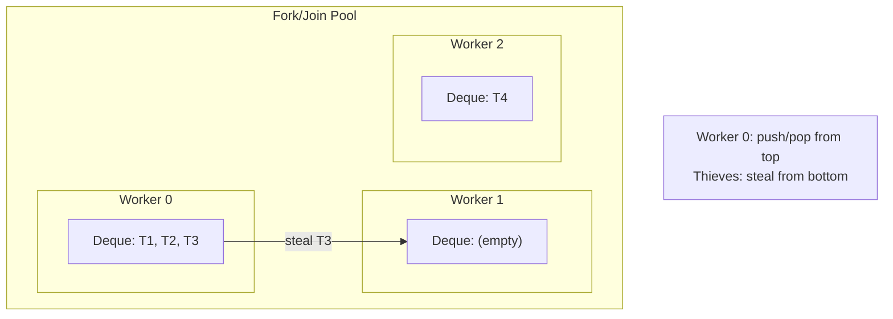

タスクを生成したワーカーはデックのトップ（LIFO）からタスクを取得し、仕事を盗むワーカーはデックのボトム（FIFO）からタスクを取得する。この設計により、生成されたばかりの小さなサブタスクは生成元で即座に処理され、局所性が高い。一方、古い大きなタスクが他のワーカーに盗まれることで、負荷の自動分散が実現される。

## 10. スレッド安全性とスレッドローカルストレージ

### 10.1 スレッド安全性（Thread Safety）

スレッドがメモリを共有するという特性は、並行プログラミングにおけるもっとも困難な課題の源泉である。**スレッド安全性（thread safety）**とは、コードが複数のスレッドから同時にアクセスされても正しく動作することを保証する性質である。

スレッド安全性を実現するアプローチは、主に以下の4つに分類される。

**1. 相互排他（Mutual Exclusion）**: Mutexやセマフォを使って、共有データへのアクセスを直列化する。最も直接的だが、デッドロックや性能低下のリスクがある。

**2. 不変性（Immutability）**: データを変更不可能にする。変更がなければ競合状態は発生しない。関数型プログラミングの基本原理であり、Javaの `String` や `record` がこの例に当たる。

**3. スレッド局所化（Thread Confinement）**: データを特定のスレッドだけがアクセスできるようにする。共有がなければ同期は不要。スレッドローカルストレージはこのアプローチの実現手段である。

**4. ロックフリーアルゴリズム**: CAS（Compare-And-Swap）などのアトミック操作を使って、ロックなしでスレッド安全性を実現する。高い性能が得られるが、正しい実装は極めて困難である。

### 10.2 スレッドローカルストレージ（TLS）

**スレッドローカルストレージ（Thread-Local Storage, TLS）**は、各スレッドが独自のインスタンスを持つ変数を提供する仕組みである。見かけ上はグローバル変数のようにアクセスできるが、実際にはスレッドごとに独立した記憶領域を持つ。

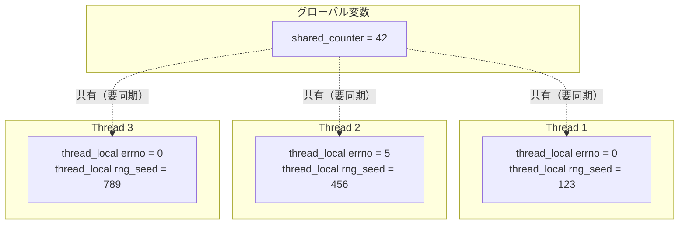

スレッドローカルストレージの典型的な用途は以下の通りである。

- **errno**: CのPOSIX関数がエラーコードを返す `errno` は、マルチスレッド環境ではスレッドローカルとして実装される
- **乱数生成器の状態**: 各スレッドが独立した乱数列を持つ
- **データベース接続**: スレッドごとに専用のコネクションを保持する
- **ロギングコンテキスト**: リクエストIDやトレースIDをスレッドローカルに格納し、ログ出力に自動付与する
- **メモリアロケータのキャッシュ**: jemallocやtcmallocはスレッドローカルなメモリキャッシュを持ち、ロック競合を回避する

### 10.3 各言語でのスレッドローカルの実装

**C11 / C++11**:

```c
#include <threads.h>  // C11
// or use compiler extension: __thread (GCC), __declspec(thread) (MSVC)

_Thread_local int per_thread_counter = 0;  // C11
// or: thread_local int per_thread_counter = 0;  // C++11
```

コンパイラは `__thread` や `_Thread_local` で宣言された変数を、TLSセグメントに配置する。Linuxでは、ELFバイナリの `.tdata`（初期値あり）と `.tbss`（初期値なし）セクションに格納され、スレッド生成時にこれらのセクションがスレッドごとにコピーされる。

**Java**:

```java
public class RequestContext {
    // each thread gets its own instance
    private static final ThreadLocal<String> requestId =
        ThreadLocal.withInitial(() -> "none");

    public static void setRequestId(String id) {
        requestId.set(id);
    }

    public static String getRequestId() {
        return requestId.get();
    }

    public static void clear() {
        requestId.remove();  // important: prevent memory leaks
    }
}
```

Javaの `ThreadLocal` は、`Thread` オブジェクト内の `ThreadLocalMap` にキーバリューペアとして格納される。`ThreadLocal` オブジェクト自身がキー、格納した値がバリューとなる。注意点として、スレッドプール環境では `remove()` を忘れるとメモリリークが発生する。前のリクエストのデータが後続のリクエストに漏洩するセキュリティリスクもある。

**Go**:

Go言語には公式のスレッドローカルストレージ機構が存在しない。これはGo言語の設計上の意図的な判断である。goroutineは軽量で大量に生成されることが前提であり、goroutine間でデータを受け渡す場合は `context.Context` を明示的に引数として渡すことが推奨される。

```go
package main

import (
    "context"
    "fmt"
)

type contextKey string

const requestIDKey contextKey = "requestID"

func handleRequest(ctx context.Context) {
    // retrieve request ID from context
    if reqID, ok := ctx.Value(requestIDKey).(string); ok {
        fmt.Printf("Processing request: %s\n", reqID)
    }
}

func main() {
    ctx := context.WithValue(context.Background(), requestIDKey, "req-12345")
    handleRequest(ctx)
}
```

この明示的なアプローチは、goroutineがキャリアOSスレッドに固定されない（GMPモデルによりgoroutineはM間を移動しうる）というGoの実行モデルに整合している。暗黙的なスレッドローカルストレージは、goroutineの移動によって予期せぬ動作を引き起こす可能性がある。

### 10.4 Virtual Threads 時代のスレッドローカル

Java Virtual Threadsの登場により、スレッドローカルの使い方にも変化が求められている。数百万のVirtual Threadsが存在する環境では、各Virtual Threadが `ThreadLocal` インスタンスを持つとメモリ消費が爆発的に増加する。

JDK 21で導入（Preview）された**ScopedValue**は、この問題に対する解決策である。

```java
import jdk.incubator.concurrent.ScopedValue;

public class ScopedValueDemo {
    static final ScopedValue<String> REQUEST_ID = ScopedValue.newInstance();

    static void handleRequest(String reqId) {
        // bind the scoped value for this scope
        ScopedValue.where(REQUEST_ID, reqId).run(() -> {
            processRequest();
        });
    }

    static void processRequest() {
        // accessible within the scope
        String reqId = REQUEST_ID.get();
        System.out.println("Processing: " + reqId);
        // scoped value is automatically inherited by child virtual threads
    }
}
```

`ScopedValue` は `ThreadLocal` と比較して以下の利点を持つ。

- **不変性**: バインドされた値は変更不可能。スコープ内で安全に共有できる
- **スコープの明確化**: 値のライフタイムが構文的に明確。`remove()` 忘れによるメモリリークがない
- **子スレッドへの自動継承**: `StructuredTaskScope` と組み合わせて、子Virtual Threadに自動的に値が継承される
- **低メモリコスト**: `ThreadLocal` のハッシュマップベースの実装と異なり、効率的な実装が可能

## まとめ — スレッドモデルの選択指針

スレッドモデルの進化は、ハードウェアの変化とソフトウェアの要求に対する応答として理解できる。

**1:1モデル（カーネルスレッド）**は、OSのスケジューラとデバッグツールの恩恵を直接受けられるシンプルさが強みである。同時スレッド数が数千程度のアプリケーション（典型的なWebアプリケーションサーバーなど）では依然として合理的な選択である。

**N:1モデル（ユーザースレッド）**は、マルチコアを活用できないという致命的な制約から、現代のシステムで純粋に採用されることは稀である。しかし、シングルスレッドのイベントループモデル（Node.js, Nginx）は、N:1の変形と見なすことができ、I/Oバウンドなワークロードでは優れた性能を示す。

**M:Nモデル（ハイブリッド）**は、言語ランタイム全体をこのモデルを前提として設計した場合に真価を発揮する。Goのgoroutine、ErlangのプロセスモデルI、Java Virtual Threadsがその代表例であり、数百万の並行タスクを効率的に処理する能力を持つ。

スレッドモデルの選択は「どのレイヤーに複雑性を置くか」というトレードオフでもある。1:1モデルはOSに複雑性を委ね、N:1モデルはアプリケーションに複雑性を要求し、M:Nモデルは言語ランタイムが複雑性を引き受ける。M:Nモデルの成功例に共通するのは、ランタイムがI/Oサブシステムまで含めて一貫した非同期化を提供し、プログラマには同期的に見えるシンプルなAPIを提供しているという点である。

並行処理の本質的な困難さ — 競合状態、デッドロック、メモリの可視性 — はスレッドモデルの選択で解消されるものではない。しかし、適切なスレッドモデルの選択は、これらの課題に取り組むための良い出発点を提供する。軽量なスレッドモデルは「スレッドを惜しまず使う」プログラミングスタイルを可能にし、Thread-per-Requestのような直感的なモデルを高いスケーラビリティで実現する道を開くのである。
