# 時系列データベース — InfluxDB, TimescaleDB, Prometheus TSDBの設計と選定

## 1. はじめに：時系列データとは何か

現代のITシステムにおいて、**時系列データ（Time-Series Data）**は最も急速に増加しているデータカテゴリの一つである。サーバーのCPU使用率、アプリケーションのレスポンスタイム、IoTセンサーの温度データ、金融市場の株価ティックデータ、スマートメーターの電力消費量——これらはすべて、**タイムスタンプと値のペア**として連続的に生成されるデータである。

時系列データには、汎用的なリレーショナルデータベースでは効率的に扱いきれない固有の特性がある。この特性を理解し、それに最適化された専用のデータベースシステムが**時系列データベース（Time-Series Database, TSDB）**である。

本記事では、時系列データの本質的な特性を整理したうえで、代表的な3つの時系列データベース——**InfluxDB**、**TimescaleDB**、**Prometheus TSDB**——のアーキテクチャと設計思想を詳しく解説する。さらに、書き込み最適化、圧縮技術、ダウンサンプリング、クエリパターンといった横断的なトピックを扱い、最終的にユースケースに応じた選定指針を示す。

## 2. 時系列データの特徴

時系列データが他のデータと本質的に異なる点を整理する。これらの特性が、専用データベースの設計を根本から規定している。

### 2.1 書き込みが圧倒的に多い

時系列データの最も顕著な特徴は、**書き込みヘビー（write-heavy）**なワークロードであることだ。典型的な監視システムでは、数千〜数百万のメトリクスが10秒〜1分間隔で継続的に書き込まれる。一方、読み取りはダッシュボードの表示やアラート評価時に限定されるため、書き込みと読み取りの比率は100:1以上になることも珍しくない。

### 2.2 データは時間順に到着する

データポイントは基本的に**現在の時刻に近い順**で到着する。過去のタイムスタンプを持つデータ（遅延データ）が一定割合で発生することはあるが、大部分は「今」のデータである。この性質により、書き込み位置をほぼ常に「末尾追記」にできる。

### 2.3 個別のデータポイントの更新・削除は稀

一度書き込まれた時系列データが個別に更新されることはほぼない。「昨日15:30のCPU使用率を70%から75%に訂正する」といった操作は通常発生しない。削除は一括で行われ、「30日より古いデータをすべて削除する」というリテンションポリシーに基づくことがほとんどである。

### 2.4 クエリは時間範囲ベース

ほぼすべてのクエリが**時間範囲**を条件に含む。「過去1時間のCPU使用率」「先週のリクエスト数の推移」「昨年同月との比較」といったクエリが典型的である。特定のタイムスタンプのデータを1件だけ取得するという操作は稀である。

### 2.5 最新データほどアクセス頻度が高い

監視ダッシュボードで表示されるのは直近数時間〜数日のデータが中心であり、数ヶ月前や数年前のデータが参照される頻度は低い。この**時間的局所性（temporal locality）**により、ホット・コールドのストレージ階層化が効果的に機能する。

### 2.6 高カーディナリティの課題

時系列データでは、各データポイントを識別するために**タグ（ラベル）**が付与される。たとえば `host=web-01, region=us-east, service=api` のようなタグの組み合わせが一つの「時系列（series）」を形成する。タグ値のバリエーション（カーディナリティ）が増えると、時系列の数が爆発的に増加する。これは**高カーディナリティ問題**と呼ばれ、すべての時系列データベースにとって最大の設計課題の一つとなっている。

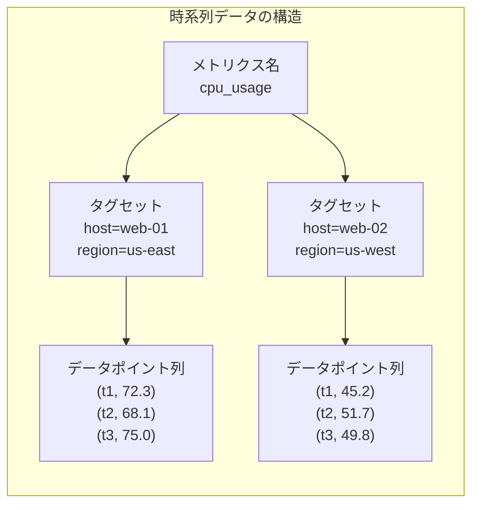

## 3. 書き込み最適化

時系列データベースの書き込み性能を支える中核的な技術を解説する。

### 3.1 バッチ書き込みとバッファリング

個々のデータポイントを都度ディスクに書き込むのは非効率である。時系列データベースは、メモリ上のバッファに一定量のデータを蓄積してから、まとめてディスクに書き出す**バッチ書き込み**を採用する。これにより、ディスクI/Oの回数を大幅に削減できる。

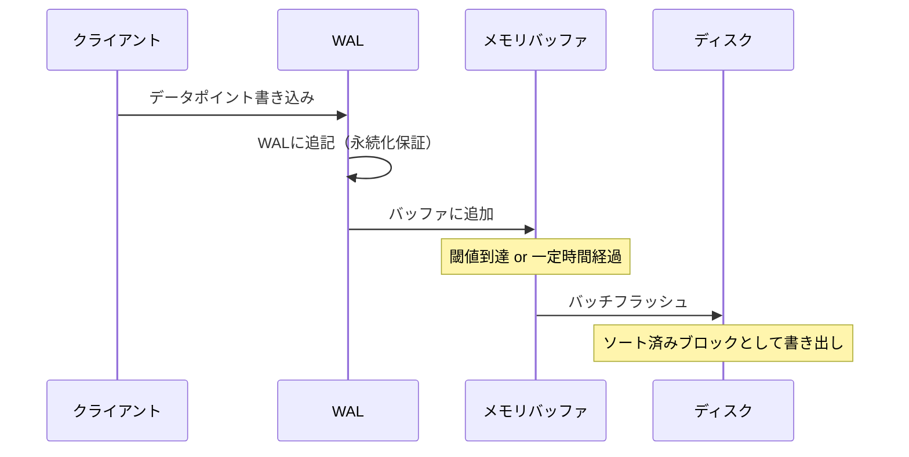

### 3.2 WAL（Write-Ahead Log）による永続化保証

メモリバッファにデータを保持している間にクラッシュが発生するとデータが失われる。この問題を防ぐために、ほぼすべての時系列データベースは**WAL（Write-Ahead Log）**を採用している。WALはデータポイントを受け取った直後にディスク上のログファイルに追記する。WALへの書き込みはシーケンシャルI/Oであるため高速であり、クラッシュ後にはWALからバッファの内容を復元できる。

### 3.3 シーケンシャルI/Oの徹底

時系列データは時間順に到着するという性質を活かし、書き込みを**ほぼ完全にシーケンシャルI/O**として実行できる。B-Treeのようなランダム書き込みを伴うデータ構造ではなく、**LSM-Tree（Log-Structured Merge-Tree）**や**追記型ストレージ**が広く使われる。HDDでもSSDでも、シーケンシャル書き込みはランダム書き込みよりも桁違いに高速であり、この差異が時系列データベースの書き込み性能の根幹を支えている。

### 3.4 時間パーティショニング

時系列データベースでは、データを**時間ブロック（time block）**に分割して管理する手法が広く採用されている。たとえば2時間ごとのブロックに分割することで、以下のメリットが得られる。

- **書き込みの局所化**：アクティブなブロック（現在の時間帯）だけが書き込み対象となる
- **リテンションの効率化**：古いブロックをまるごと削除するだけで済む
- **クエリの効率化**：時間範囲が明確であれば、関係のないブロックをスキップできる

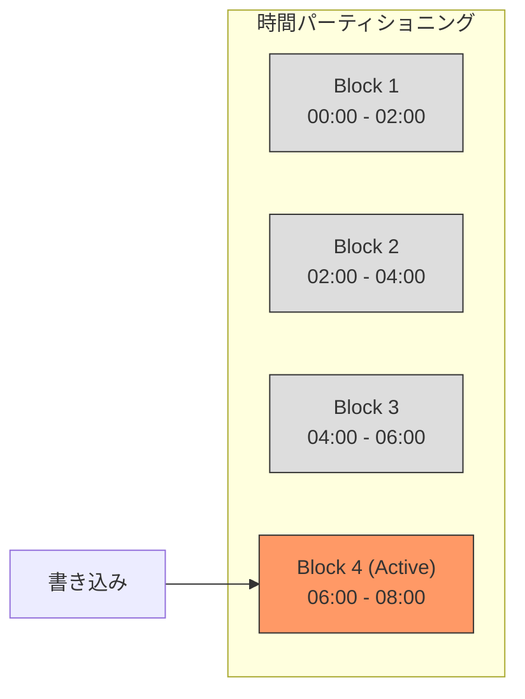

## 4. 圧縮技術

時系列データは一般的に高い圧縮率を達成できる。これは、連続するデータポイント間の差分が小さい傾向があるという、時系列データの統計的性質を活用できるためである。

### 4.1 タイムスタンプの圧縮：Delta-of-Delta Encoding

連続するタイムスタンプは等間隔であることが多い。たとえば10秒間隔で収集されるメトリクスでは、タイムスタンプの差分（delta）はほぼ常に10秒である。**Delta-of-Delta Encoding**は、差分のさらに差分を記録する手法である。

| タイムスタンプ | Delta | Delta-of-Delta |
|---|---|---|
| 1000 | — | — |
| 1010 | 10 | — |
| 1020 | 10 | 0 |
| 1030 | 10 | 0 |
| 1041 | 11 | 1 |
| 1050 | 9 | -2 |

Delta-of-Deltaの値は多くの場合0またはそれに近い小さな値となるため、**可変長符号化**と組み合わせることで極めて効率的に圧縮できる。Facebookが2015年に発表した論文「Gorilla: A Fast, Scalable, In-Memory Time Series Database」では、この手法により64ビットのタイムスタンプを平均1.37ビットに圧縮できることが示された。

### 4.2 値の圧縮：XOR Encoding

浮動小数点数として表現されるメトリクス値も、連続するデータポイント間で類似していることが多い。Gorillaで提案された**XOR Encoding**は、前の値と現在の値のXOR（排他的論理和）を取り、変化したビットのみを記録する手法である。

CPU使用率が72.3%、72.5%、72.4%と推移する場合、IEEE 754浮動小数点数のビット列は大部分が共通しており、XOR結果の有効ビット数は非常に少なくなる。これにより、64ビットの浮動小数点数を平均1.37ビットで表現できるという驚異的な圧縮率が達成される。

### 4.3 整数値の圧縮

カウンタ値やゲージ値が整数で表現される場合は、**Simple8b**や**Run-Length Encoding（RLE）**などの整数圧縮アルゴリズムが効果的である。Simple8bは、最大240個の整数を1つの64ビットワードに詰め込む手法であり、値が小さい場合に高い圧縮率を達成する。

### 4.4 辞書圧縮とタグの圧縮

タグキーとタグ値は文字列であり、同じ文字列が繰り返し出現する。**辞書圧縮（Dictionary Encoding）**により、文字列を整数IDに変換し、データポイントにはIDのみを格納することで、ストレージ使用量を大幅に削減できる。

```mermaid
graph LR
    subgraph "辞書圧縮"
        D["辞書テーブル"]
        D --> |"0 → us-east"| E1[""]
        D --> |"1 → us-west"| E2[""]
        D --> |"2 → eu-central"| E3[""]

        DP["データポイント<br/>region=0 (us-east)<br/>整数IDで参照"]
    end
```

### 4.5 列指向ストレージとの組み合わせ

時系列データは本質的に**列指向（columnar）**な性質を持つ。あるメトリクスのすべてのタイムスタンプ列、すべての値列をそれぞれまとめて格納することで、同じ型・同じ傾向のデータが連続し、圧縮効率が最大化される。多くの時系列データベースが列指向ストレージを採用しているのはこのためである。

## 5. InfluxDBのアーキテクチャ

**InfluxDB**は、時系列データの管理に特化して設計された専用データベースであり、2013年にInfluxData社によって開発が開始された。Go言語で実装されており、独自のストレージエンジン、クエリ言語、データモデルを持つ。

### 5.1 データモデル

InfluxDBのデータモデルは以下の概念で構成される。

| 概念 | 説明 |
|---|---|
| **Measurement** | メトリクスの名前（例：`cpu_usage`）。RDBMSのテーブルに相当 |
| **Tag** | インデックス付きのキーバリューペア（例：`host=web-01`）。フィルタリングやグルーピングに使用 |
| **Field** | インデックスなしのキーバリューペア（例：`value=72.3`）。実際の計測値 |
| **Timestamp** | データポイントの時刻。ナノ秒精度 |
| **Series** | Measurement + Tag Setの一意な組み合わせ |

InfluxDBの重要な設計判断として、**TagにはインデックスがありFieldにはない**という区別がある。Tagは検索条件として頻繁に使われるためインデックスを構築するが、Fieldは主にデータ本体（計測値）であるため、インデックスのオーバーヘッドを避ける。

### 5.2 TSI（Time Series Index）

初期のInfluxDBでは、すべての時系列のインデックスをメモリ上に保持する**TSM（Time Structured Merge Tree）インメモリインデックス**を使用していた。しかし、時系列のカーディナリティが数百万を超えるとメモリが枯渇するという問題があった。

この問題を解決するために導入されたのが**TSI（Time Series Index）**である。TSIはディスクベースの転置インデックスであり、タグキー・タグ値から該当する時系列IDへの効率的なルックアップを提供する。TSIはLSM-Treeに類似した構造を持ち、メモリ上のWALとディスク上のインデックスファイルの二層構成で動作する。

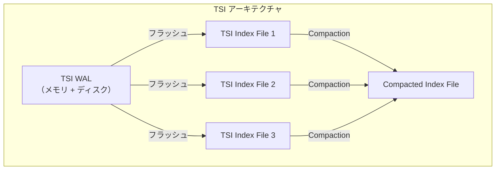

### 5.3 TSMストレージエンジン

InfluxDBの中核をなすのが**TSM（Time Structured Merge Tree）ストレージエンジン**である。TSMはLSM-Treeの概念を時系列データに特化させたもので、以下のコンポーネントから構成される。

1. **WAL**：書き込みデータの永続化。シーケンシャル追記
2. **Cache**：メモリ上のバッファ。ソート済みマップ構造
3. **TSM Files**：圧縮されたディスク上のデータファイル。列指向で格納
4. **Compactor**：複数のTSMファイルを統合し、最適化するバックグラウンドプロセス

TSMファイルの内部構造は以下の通りである。

```
┌──────────────────────────────────────────┐
│                TSM File                  │
├──────────────────────────────────────────┤
│  Data Block 1 (series key + timestamps)  │
│  Data Block 2 (series key + timestamps)  │
│  ...                                     │
│  Data Block N                            │
├──────────────────────────────────────────┤
│  Index Block                             │
│    - Series Key → Block Offset mapping   │
│    - Min/Max Timestamp per block         │
├──────────────────────────────────────────┤
│  Footer (Index Offset)                   │
└──────────────────────────────────────────┘
```

各Data Blockは単一の時系列のデータポイントを格納し、タイムスタンプ列と値列が分離されて圧縮される。Index Blockにはシリーズキーからデータブロックへのオフセットマッピングが格納されており、特定の時系列の特定の時間範囲のデータに高速にアクセスできる。

### 5.4 リテンションポリシーとシャード

InfluxDBでは、**リテンションポリシー（Retention Policy）**によってデータの保持期間を定義する。データは**シャードグループ**に分割され、各シャードグループは一定の時間範囲のデータを格納する。リテンションポリシーに基づいて、期限切れのシャードグループがまるごと削除される。

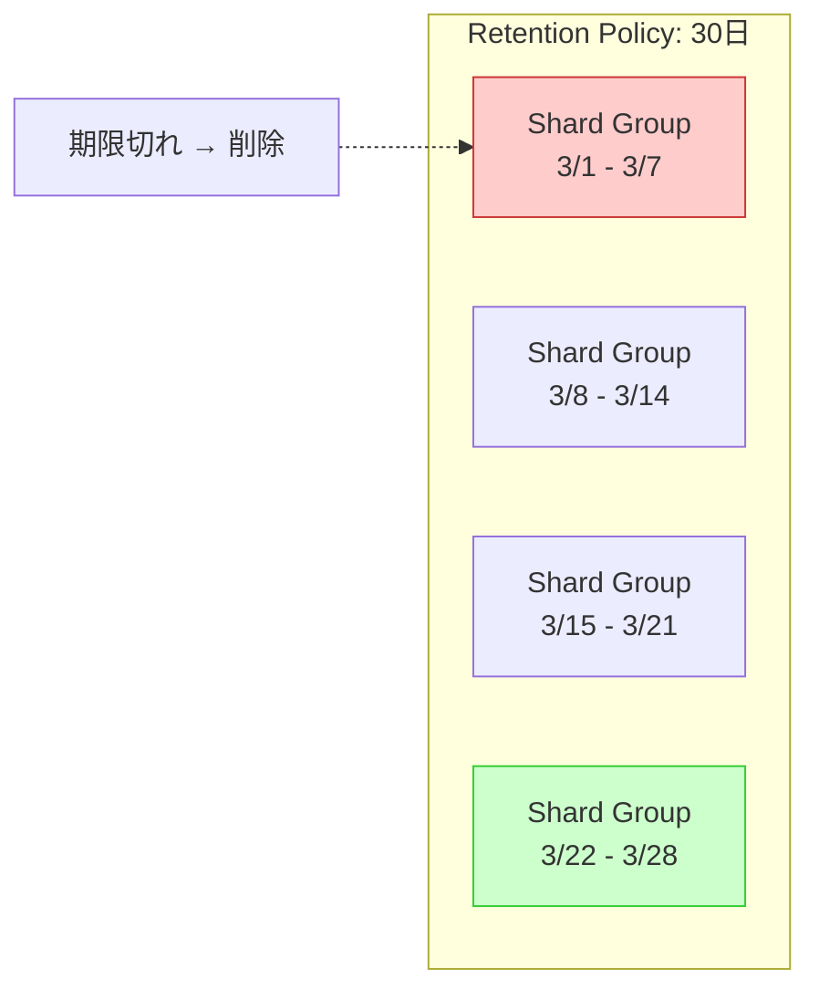

### 5.5 InfluxDB 3.0とApache Arrow

InfluxDBは2023年以降、アーキテクチャの大幅な刷新に取り組んでいる。**InfluxDB 3.0**（旧称IOx）では、ストレージエンジンがTSMからApache Arrow / Parquetベースの列指向ストレージに移行された。クエリエンジンにはApache DataFusionが採用され、SQL対応が強化されている。これは、独自フォーマットへの依存を減らし、オープンな標準に基づくエコシステムとの統合を図る戦略的な方向転換である。

## 6. TimescaleDB（PostgreSQL拡張）

**TimescaleDB**は、PostgreSQLの拡張として実装された時系列データベースである。2017年にTimescale社によって公開された。「時系列データベースが必要だが、SQLの力も手放したくない」というニーズに応えるプロダクトである。

### 6.1 設計哲学：PostgreSQLを拡張する

TimescaleDBの設計哲学は明快である。**PostgreSQLの全機能を維持しながら、時系列ワークロードに特化した最適化を加える**。これにより、以下のメリットが得られる。

- **完全なSQL対応**：JOIN、サブクエリ、CTE、ウィンドウ関数など、SQLの全機能が使える
- **既存エコシステムの活用**：PostgreSQLのドライバ、ORM、管理ツールがそのまま使える
- **トランザクション対応**：ACIDトランザクションが保証される
- **リレーショナルデータとの結合**：時系列データとマスタデータを同一データベースでJOINできる

### 6.2 ハイパーテーブル（Hypertable）

TimescaleDBの中核機能が**ハイパーテーブル（Hypertable）**である。これは通常のPostgreSQLテーブルに対する抽象化レイヤーであり、内部的にデータを**チャンク（Chunk）**と呼ばれるサブテーブルに自動分割する。

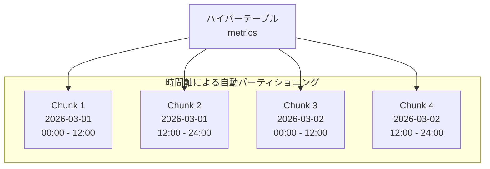

ハイパーテーブルの作成は極めてシンプルである。

```sql
-- Create a regular table
CREATE TABLE metrics (
    time        TIMESTAMPTZ NOT NULL,
    host        TEXT NOT NULL,
    cpu_usage   DOUBLE PRECISION,
    mem_usage   DOUBLE PRECISION
);

-- Convert to hypertable (partition by time, 12-hour chunks)
SELECT create_hypertable('metrics', 'time',
    chunk_time_interval => INTERVAL '12 hours');
```

ユーザーからは通常のテーブルと同様にクエリできるが、TimescaleDBの内部ではクエリオプティマイザがチャンクの境界を認識し、関係のないチャンクを自動的にスキップする（**チャンク除外、Chunk Exclusion**）。

### 6.3 多次元パーティショニング

時間軸に加えて、もう一つの軸（たとえば `host` や `device_id`）でもパーティショニングを行う**多次元パーティショニング**もサポートされている。これは大量のデバイスやホストからデータが流入する場合に有効であり、特にマルチノード構成での負荷分散に活用される。

```sql
-- Multi-dimensional partitioning
SELECT create_hypertable('metrics', 'time',
    partitioning_column => 'host',
    number_partitions => 4,
    chunk_time_interval => INTERVAL '12 hours');
```

### 6.4 ネイティブ圧縮

TimescaleDBの**ネイティブ圧縮**機能は、チャンク単位でデータを圧縮する。圧縮の際、行指向のPostgreSQLの内部形式から**列指向のバッチ形式**に変換される。これにより、以下の効果が得られる。

- **ストレージ使用量の大幅削減**：通常90〜98%の圧縮率
- **列指向による圧縮効率向上**：同じ型のデータが連続するため、Delta EncodingやRLEが効果的に機能
- **クエリ性能の向上**：I/O量の削減により、特に集約クエリのパフォーマンスが改善

```sql
-- Enable compression on a hypertable
ALTER TABLE metrics SET (
    timescaledb.compress,
    timescaledb.compress_segmentby = 'host',
    timescaledb.compress_orderby = 'time DESC'
);

-- Add a compression policy (compress chunks older than 7 days)
SELECT add_compression_policy('metrics', INTERVAL '7 days');
```

`compress_segmentby` パラメータは、圧縮時のセグメント分割の基準となるカラムを指定する。同じ `host` のデータが一つのセグメントにまとめられることで、特定のホストのデータを読む際に他のホストのデータを読み込む必要がなくなる。

### 6.5 連続集約（Continuous Aggregates）

TimescaleDBの**連続集約（Continuous Aggregates）**は、マテリアライズドビューの拡張であり、時系列データの集約結果を自動的に増分更新する機能である。

```sql
-- Create a continuous aggregate for hourly averages
CREATE MATERIALIZED VIEW metrics_hourly
WITH (timescaledb.continuous) AS
SELECT
    time_bucket('1 hour', time) AS bucket,
    host,
    AVG(cpu_usage) AS avg_cpu,
    MAX(cpu_usage) AS max_cpu,
    AVG(mem_usage) AS avg_mem
FROM metrics
GROUP BY bucket, host;

-- Add a refresh policy
SELECT add_continuous_aggregate_policy('metrics_hourly',
    start_offset => INTERVAL '3 hours',
    end_offset => INTERVAL '1 hour',
    schedule_interval => INTERVAL '1 hour');
```

新しいデータが書き込まれると、連続集約はバックグラウンドで増分的に更新される。全データを再計算する必要がないため、大量のデータに対しても効率的にリアルタイムに近い集約結果を提供できる。

### 6.6 PostgreSQLエコシステムの恩恵

TimescaleDBがPostgreSQLの拡張であることの最大のメリットは、PostgreSQLの成熟したエコシステムを丸ごと活用できる点である。

- **PostGIS**との組み合わせによる地理空間×時系列データの分析
- **pg_partman**との併用による柔軟なパーティション管理
- **論理レプリケーション**による他のPostgreSQLインスタンスへのデータ配信
- **EXPLAIN ANALYZE**によるクエリプラン分析
- Grafana、Tableau、dbtなどの豊富なBIツール連携

## 7. Prometheus TSDB

**Prometheus**は、SoundCloudで2012年に開発が始まり、2016年にCNCF（Cloud Native Computing Foundation）の2番目のプロジェクトとして採択された監視システムである。Kubernetesエコシステムにおけるデファクトスタンダードの監視基盤であり、その内部に**独自の時系列データベース（Prometheus TSDB）**を組み込んでいる。

### 7.1 Pull型アーキテクチャ

Prometheusの最も特徴的な設計判断は、**Pull型**のデータ収集モデルである。監視対象のアプリケーションが `/metrics` エンドポイントを公開し、Prometheusサーバーが定期的にスクレイプ（scrape）しにいく。

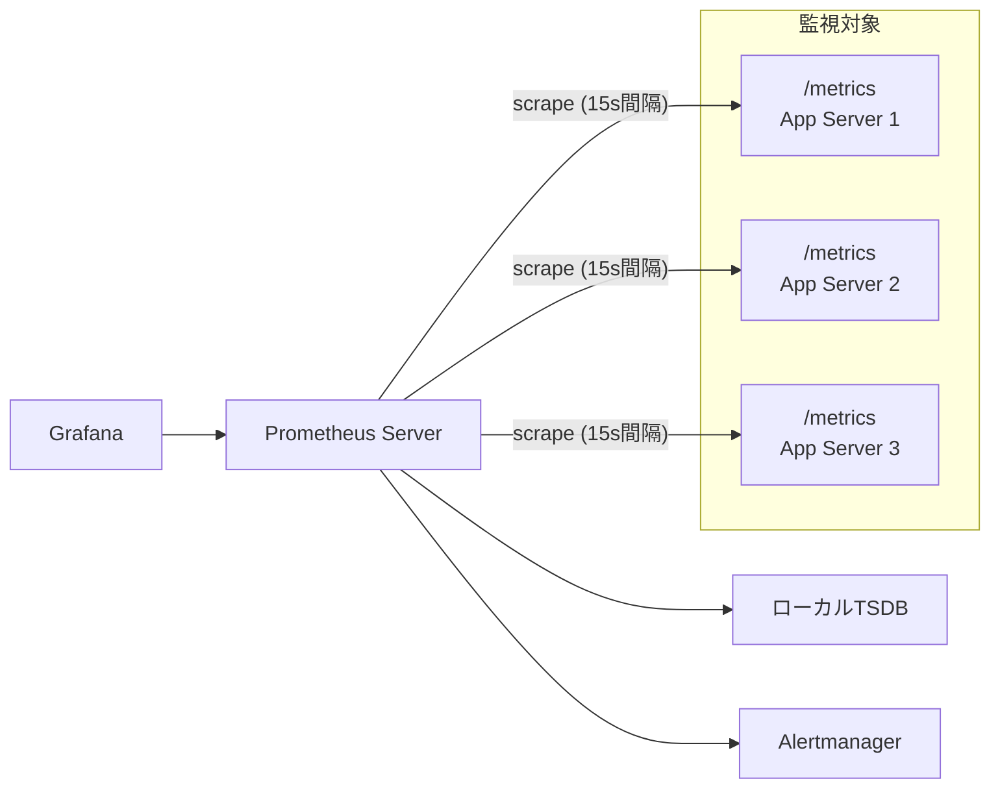

Pull型の設計には以下の利点がある。

- **ターゲットの状態把握**：スクレイプが失敗すればターゲットがダウンしていることがわかる
- **設定の集中管理**：Prometheusサーバー側でスクレイプ対象を制御できる
- **バックプレッシャー不要**：Push型と異なり、監視サーバーが処理しきれない量のデータが押し寄せることがない
- **開発時のデバッグ容易性**：ブラウザで `/metrics` を直接確認できる

### 7.2 TSDBのストレージアーキテクチャ

Prometheus TSDBは、Fabian Reinartz氏によって2017年にv2として完全に再設計された。このアーキテクチャは、時系列データの特性を巧みに活かした設計となっている。

#### ブロック構造

データは**2時間ごとのブロック**に分割される。各ブロックは以下のファイルで構成される。

```
data/
├── 01BKGV7JBM69T2G1BGBGM6KB12/    # Block 1
│   ├── meta.json                    # Block metadata
│   ├── chunks/                      # Chunk files
│   │   └── 000001                   # Compressed data chunks
│   ├── index                        # Inverted index
│   └── tombstones                   # Deletion markers
├── 01BKGTZQ1SYQJTR4PB43C8PD98/    # Block 2
│   ├── ...
├── chunks_head/                     # Active head block (WAL)
│   ├── 000001
│   └── 000002
└── wal/                             # Write-Ahead Log
    ├── 000001
    └── 000002
```

#### Head Block

**Head Block**は現在アクティブなブロックであり、メモリ上にデータを保持する。新しいデータポイントはまずWALに書き込まれ、その後Head Block内のメモリ上のデータ構造に追加される。Head Blockが2時間分のデータを蓄積すると、ディスク上の永続ブロックに変換される。

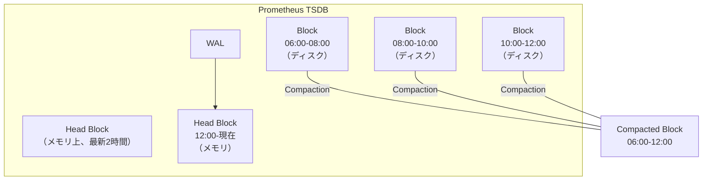

#### 転置インデックス

Prometheus TSDBは、ラベルの組み合わせから時系列を高速に検索するために**転置インデックス（Inverted Index）**を使用する。各ラベルペア（例：`job="api"`, `instance="10.0.0.1:8080"`）に対して、そのラベルを持つ時系列のID（Series Ref）のポスティングリストが格納される。

```
ラベル                  → ポスティングリスト
job="api"              → [1, 3, 5, 7, 9, 11, ...]
job="worker"           → [2, 4, 6, 8, 10, 12, ...]
instance="10.0.0.1"    → [1, 2]
instance="10.0.0.2"    → [3, 4]
```

`{job="api", instance="10.0.0.1"}` というクエリは、`job="api"` のポスティングリストと `instance="10.0.0.1"` のポスティングリストの**積集合**を取ることで解決される。

### 7.3 Compaction

Prometheus TSDBでは、小さなブロックを統合して大きなブロックにする**Compaction**が行われる。これにより以下の効果が得られる。

- **クエリ性能の向上**：クエリ時にオープンするファイル数が減る
- **重複の排除**：同じ時系列の重複データが統合される
- **削除の適用**：tombstonesでマークされたデータが物理的に削除される

Compactionは指数的に進行し、2時間ブロック → 6時間ブロック → 18時間ブロック → ... と統合される。ただし、リテンションの境界をまたがないよう制御される。

### 7.4 PromQLとクエリエンジン

Prometheusは独自のクエリ言語**PromQL（Prometheus Query Language）**を持つ。PromQLは関数型のクエリ言語であり、時系列の選択、フィルタリング、集約、レート計算などを簡潔に記述できる。

```promql
# Average CPU usage per host over the last 5 minutes
avg by (instance) (rate(node_cpu_seconds_total{mode!="idle"}[5m]))

# 95th percentile of request latency
histogram_quantile(0.95, rate(http_request_duration_seconds_bucket[5m]))

# Alert: high error rate
sum(rate(http_requests_total{status=~"5.."}[5m]))
  /
sum(rate(http_requests_total[5m]))
> 0.05
```

PromQLはSQLとは根本的に異なるパラダイムである。SQLが「テーブルから行を選択する」のに対し、PromQLは「時系列を選択し、それに関数を適用して変換する」という考え方である。

### 7.5 リモートストレージとスケーラビリティ

Prometheus単体はシングルサーバー構成であり、ローカルディスクにデータを保持する。この設計は信頼性とシンプルさの点で優れているが、長期保存や大規模クラスタでの利用には限界がある。

この課題に対応するために、Prometheusは**Remote Write / Remote Read**プロトコルを提供している。これにより、外部の長期ストレージシステムにデータを書き出したり、外部ストレージからデータを読み取ったりできる。

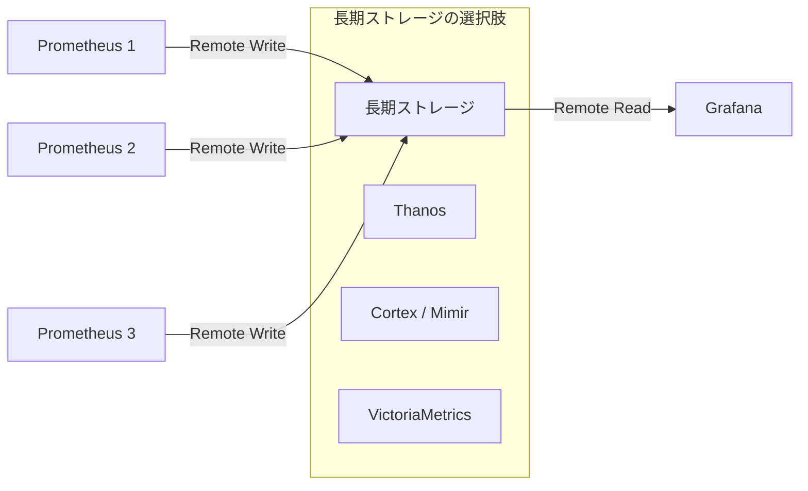

代表的な長期ストレージソリューション：

- **Thanos**：既存のPrometheusにサイドカーを追加し、オブジェクトストレージ（S3など）に長期保存。グローバルクエリビュー提供
- **Grafana Mimir**（旧Cortex）：水平スケーラブルな分散TSDBとして動作。マルチテナント対応
- **VictoriaMetrics**：高い書き込み性能と優れた圧縮率を持つPrometheus互換TSDB

## 8. ダウンサンプリングとリテンション

時系列データは時間の経過とともに膨大な量になるため、ストレージコストの管理が不可欠である。**ダウンサンプリング**と**リテンションポリシー**は、この課題に対する二つの主要なアプローチである。

### 8.1 ダウンサンプリングとは

ダウンサンプリング（Downsampling）とは、高解像度のデータをより低い解像度に集約する処理である。たとえば、10秒間隔で収集した生データを、1時間ごとの平均・最大・最小に集約する。

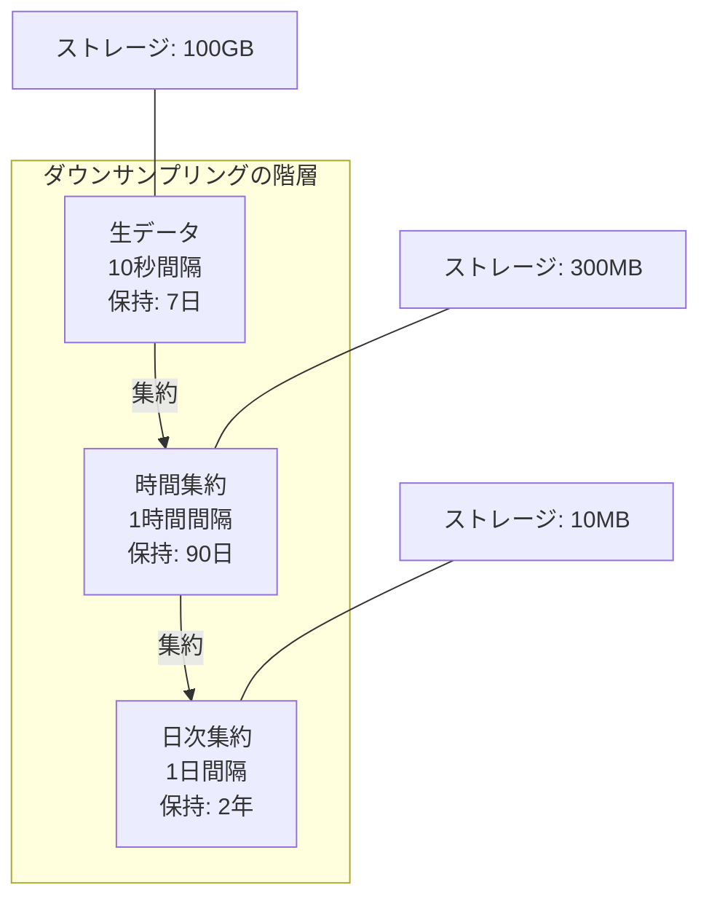

ダウンサンプリングにより、長期データの保持コストを劇的に削減しつつ、トレンド分析に十分な情報を保持できる。ただし、集約の際に情報が失われるため、集約関数の選択が重要である。通常は `avg`、`min`、`max`、`count`、`sum` を同時に保持することで、多様なクエリに対応できるようにする。

### 8.2 各データベースにおけるダウンサンプリング

| データベース | ダウンサンプリング手法 |
|---|---|
| **InfluxDB** | Continuous Queriesまたはタスク（Flux言語）で定義。ダウンサンプリング後のデータを別のリテンションポリシーに保存 |
| **TimescaleDB** | 連続集約（Continuous Aggregates）で実現。PostgreSQLのマテリアライズドビューとして実装 |
| **Prometheus** | Prometheus単体ではダウンサンプリング機能なし。Thanosが5分/1時間の自動ダウンサンプリングを提供 |

### 8.3 リテンションポリシー

リテンションポリシーは、データの保持期間を定義し、期限切れのデータを自動的に削除する仕組みである。

```sql
-- TimescaleDB: add a retention policy (drop chunks older than 30 days)
SELECT add_retention_policy('metrics', INTERVAL '30 days');
```

時間パーティショニングを採用しているデータベースでは、リテンションの実装が効率的である。個々のデータポイントを削除するのではなく、期限切れのパーティション（チャンク、シャード、ブロック）をまるごと削除できるため、削除処理のオーバーヘッドはほぼゼロである。

### 8.4 階層化ストレージ

最新のデータは高速なSSDに、古いデータは低コストなオブジェクトストレージ（S3など）に配置する**階層化ストレージ（Tiered Storage）**も有効なアプローチである。TimescaleDBやInfluxDB 3.0は、このような階層化を組み込みでサポートしている。

## 9. クエリパターン

時系列データに対する典型的なクエリパターンを整理する。これらのパターンを理解することで、データモデルの設計やインデックスの最適化に活かせる。

### 9.1 最新値の取得

```sql
-- TimescaleDB: latest value per host
SELECT DISTINCT ON (host)
    host, time, cpu_usage
FROM metrics
ORDER BY host, time DESC;
```

```promql
# Prometheus: current value
node_cpu_seconds_total{mode="idle"}
```

### 9.2 時間範囲の集約

```sql
-- TimescaleDB: hourly average over the last 24 hours
SELECT
    time_bucket('1 hour', time) AS hour,
    host,
    AVG(cpu_usage) AS avg_cpu
FROM metrics
WHERE time > NOW() - INTERVAL '24 hours'
GROUP BY hour, host
ORDER BY hour;
```

```promql
# Prometheus: average rate over 1 hour windows
avg_over_time(node_cpu_seconds_total{mode="idle"}[1h])
```

### 9.3 レート計算

カウンタ型のメトリクス（単調増加する値）に対して、単位時間あたりの変化率を計算する操作は時系列データベースの最も頻繁なクエリパターンの一つである。

```sql
-- TimescaleDB: requests per second using window functions
SELECT
    time,
    host,
    (requests_total - LAG(requests_total) OVER (PARTITION BY host ORDER BY time))
    / EXTRACT(EPOCH FROM (time - LAG(time) OVER (PARTITION BY host ORDER BY time)))
    AS requests_per_sec
FROM metrics
WHERE time > NOW() - INTERVAL '1 hour';
```

```promql
# Prometheus: per-second rate over 5 minutes
rate(http_requests_total[5m])
```

PromQLの `rate()` 関数は、カウンタのリセット（プロセス再起動によるカウンタの0リセット）を自動的に検出・補正する。この機能はSQLでは手動で実装する必要があり、PromQLの大きな利点の一つである。

### 9.4 パーセンタイル計算

```sql
-- TimescaleDB: 95th percentile of response time
SELECT
    time_bucket('5 minutes', time) AS bucket,
    percentile_cont(0.95) WITHIN GROUP (ORDER BY response_time) AS p95
FROM requests
WHERE time > NOW() - INTERVAL '1 hour'
GROUP BY bucket
ORDER BY bucket;
```

```promql
# Prometheus: 95th percentile from histogram
histogram_quantile(0.95,
    rate(http_request_duration_seconds_bucket[5m])
)
```

### 9.5 異常検知パターン

```sql
-- TimescaleDB: detect values exceeding 3 standard deviations
WITH stats AS (
    SELECT
        host,
        AVG(cpu_usage) AS mean,
        STDDEV(cpu_usage) AS stddev
    FROM metrics
    WHERE time > NOW() - INTERVAL '24 hours'
    GROUP BY host
)
SELECT m.time, m.host, m.cpu_usage
FROM metrics m
JOIN stats s ON m.host = s.host
WHERE m.time > NOW() - INTERVAL '1 hour'
  AND m.cpu_usage > s.mean + 3 * s.stddev;
```

```promql
# Prometheus: simple anomaly detection using z-score
(
    node_cpu_seconds_total
    - avg_over_time(node_cpu_seconds_total[24h])
)
/ stddev_over_time(node_cpu_seconds_total[24h])
> 3
```

### 9.6 クエリパターンと最適なインデックス

| クエリパターン | 推奨インデックス / 最適化 |
|---|---|
| 時間範囲フィルタ | 時間パーティショニング（チャンク除外） |
| 特定タグでのフィルタ | タグ列のインデックス（B-Tree or 転置） |
| GROUP BY + 集約 | 連続集約 / ダウンサンプリング |
| 最新値取得 | 最新チャンクのみスキャン |
| 高カーディナリティ検索 | 複合インデックス / セグメント分割 |

## 10. 選定指針

3つの時系列データベースは、それぞれ異なる設計哲学と強みを持っている。以下に、選定の判断材料を整理する。

### 10.1 比較表

| 観点 | InfluxDB | TimescaleDB | Prometheus TSDB |
|---|---|---|---|
| **カテゴリ** | 専用TSDB | PostgreSQL拡張 | 監視特化TSDB |
| **クエリ言語** | InfluxQL / Flux / SQL(v3) | SQL (PostgreSQL) | PromQL |
| **スキーマ** | スキーマレス | スキーマあり | メトリクス名+ラベル |
| **トランザクション** | なし | ACID | なし |
| **JOIN** | 限定的 | 完全対応 | なし |
| **水平スケール** | Enterprise版 | マルチノード | Federation / Thanos |
| **リテンション** | 組み込み | 組み込み | 組み込み |
| **ダウンサンプリング** | 組み込み | 連続集約 | Thanos等が必要 |
| **圧縮率** | 高い | 高い（90-98%） | 高い（1.3 bytes/sample） |
| **エコシステム** | Telegraf, Chronograf | PostgreSQLエコシステム全体 | Alertmanager, Grafana, exporters |
| **ライセンス** | MIT (v3 Core) | Apache 2.0 / Timescale License | Apache 2.0 |

### 10.2 ユースケース別推奨

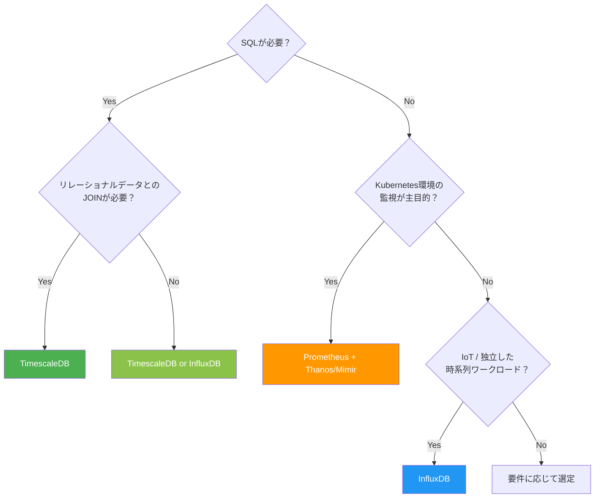

#### Prometheusを選ぶべき場合

- **Kubernetesエコシステムでの監視**が主目的である
- インフラメトリクスとアプリケーションメトリクスの収集・アラートが中心
- Pull型の監視モデルが適合する
- **短〜中期のデータ保持**で十分（長期は外部ストレージに委譲）
- 運用チームがPromQLに習熟している、または習熟する意欲がある

#### TimescaleDBを選ぶべき場合

- **SQLの表現力**が不可欠（複雑なJOIN、サブクエリ、CTE）
- 時系列データと**リレーショナルデータを同一DBで管理**したい
- **既存のPostgreSQLインフラ**を活用したい
- ACIDトランザクションの保証が必要
- BIツールやETLパイプラインとの連携が重要

#### InfluxDBを選ぶべき場合

- **専用の時系列データベース**として独立運用したい
- **IoTデバイス**からの大量データ収集が主ユースケース
- スキーマレスな柔軟なデータモデルが求められる
- Telegrafエージェントによる**プラグインベースのデータ収集**を活用したい
- 組み込みのダウンサンプリングとリテンション管理が必要

### 10.3 併用パターン

実際のプロダクション環境では、複数の時系列データベースを併用することも珍しくない。

- **Prometheus + TimescaleDB**：Prometheusで短期監視、Remote WriteでTimescaleDBに長期保存。SQLによる高度な分析が可能
- **Prometheus + InfluxDB**：Prometheusでインフラ監視、InfluxDBでIoTデータの管理を分担
- **Prometheus + Thanos + オブジェクトストレージ**：Prometheusの監視データをThanosで集約し、S3に長期保存。コスト効率に優れる

### 10.4 注意すべきアンチパターン

時系列データベースの選定・運用において、避けるべきアンチパターンを挙げる。

1. **高カーディナリティタグの無制限許容**：ユーザーIDやリクエストIDをタグに含めると、時系列の数が爆発する。タグはカーディナリティが有限であるべき
2. **汎用RDBMSでの安易な代替**：少量のデータであれば問題ないが、大量の時系列データを通常のRDBMSに格納すると、書き込み性能とストレージ効率の両面で問題が生じる
3. **リテンションポリシーの未設定**：時系列データは際限なく増加するため、明確なリテンションポリシーなしに運用するとストレージコストが膨張する
4. **ダウンサンプリングの未計画**：長期データに対して生データの解像度を維持する必要があるか、早い段階で検討する

## 11. まとめ

時系列データベースは、時系列データの固有の特性——書き込みヘビー、追記中心、時間範囲クエリ、時間的局所性——に最適化された専門的なデータベースシステムである。

**InfluxDB**は専用設計の時系列データベースとして、独自のストレージエンジン（TSM / 新世代のArrowベース）と柔軟なデータモデルを提供する。IoTやデバイスモニタリングなど、独立した時系列ワークロードに適している。

**TimescaleDB**はPostgreSQLの拡張として、SQLの全機能と時系列最適化を両立する。リレーショナルデータとの統合が必要な場面や、既存のPostgreSQLインフラを活用したい場面で強力な選択肢となる。

**Prometheus TSDB**はKubernetesエコシステムにおける監視のデファクトスタンダードであり、Pull型アーキテクチャとPromQLにより、インフラ監視とアラートに特化した設計を持つ。

いずれのデータベースも、シーケンシャルI/Oの活用、時間パーティショニング、列指向圧縮といった共通の設計原則に基づいている。これらの原則を理解したうえで、自身のユースケースに最も適合するシステムを選定することが重要である。時系列データは今後もIoT、観測可能性（Observability）、リアルタイム分析の拡大とともに増加し続けるため、時系列データベースの理解はエンジニアにとってますます重要になるだろう。
